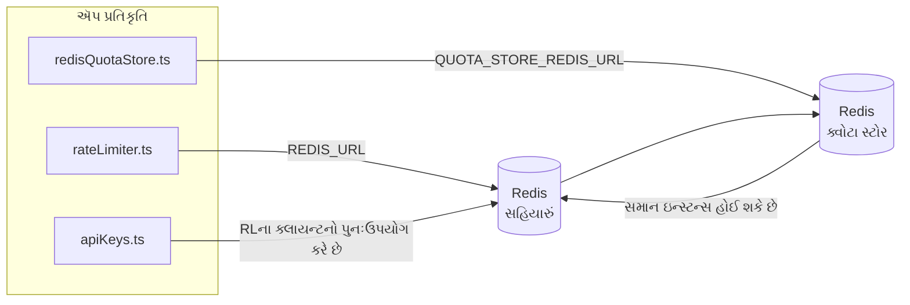

# Redis Production Configuration Guide (ગુજરાતી)

🌐 **Languages:** 🇺🇸 [English](../../../../ops/REDIS_PRODUCTION_CONFIG.md) · 🇪🇹 [am](../../../am/docs/ops/REDIS_PRODUCTION_CONFIG.md) · 🇸🇦 [ar](../../../ar/docs/ops/REDIS_PRODUCTION_CONFIG.md) · 🇦🇿 [az](../../../az/docs/ops/REDIS_PRODUCTION_CONFIG.md) · 🇧🇬 [bg](../../../bg/docs/ops/REDIS_PRODUCTION_CONFIG.md) · 🇧🇩 [bn](../../../bn/docs/ops/REDIS_PRODUCTION_CONFIG.md) · 🇧🇦 [bs](../../../bs/docs/ops/REDIS_PRODUCTION_CONFIG.md) · 🇨🇿 [cs](../../../cs/docs/ops/REDIS_PRODUCTION_CONFIG.md) · 🇩🇰 [da](../../../da/docs/ops/REDIS_PRODUCTION_CONFIG.md) · 🇩🇪 [de](../../../de/docs/ops/REDIS_PRODUCTION_CONFIG.md) · 🇬🇷 [el](../../../el/docs/ops/REDIS_PRODUCTION_CONFIG.md) · 🇪🇸 [es](../../../es/docs/ops/REDIS_PRODUCTION_CONFIG.md) · 🇪🇪 [et](../../../et/docs/ops/REDIS_PRODUCTION_CONFIG.md) · 🇮🇷 [fa](../../../fa/docs/ops/REDIS_PRODUCTION_CONFIG.md) · 🇫🇮 [fi](../../../fi/docs/ops/REDIS_PRODUCTION_CONFIG.md) · 🇫🇷 [fr](../../../fr/docs/ops/REDIS_PRODUCTION_CONFIG.md) · 🇮🇪 [ga](../../../ga/docs/ops/REDIS_PRODUCTION_CONFIG.md) · 🇳🇬 [ha](../../../ha/docs/ops/REDIS_PRODUCTION_CONFIG.md) · 🇮🇱 [he](../../../he/docs/ops/REDIS_PRODUCTION_CONFIG.md) · 🇮🇳 [hi](../../../hi/docs/ops/REDIS_PRODUCTION_CONFIG.md) · 🇭🇷 [hr](../../../hr/docs/ops/REDIS_PRODUCTION_CONFIG.md) · 🇭🇺 [hu](../../../hu/docs/ops/REDIS_PRODUCTION_CONFIG.md) · 🇦🇲 [hy](../../../hy/docs/ops/REDIS_PRODUCTION_CONFIG.md) · 🇮🇩 [id](../../../id/docs/ops/REDIS_PRODUCTION_CONFIG.md) · 🇳🇬 [ig](../../../ig/docs/ops/REDIS_PRODUCTION_CONFIG.md) · 🇮🇹 [it](../../../it/docs/ops/REDIS_PRODUCTION_CONFIG.md) · 🇯🇵 [ja](../../../ja/docs/ops/REDIS_PRODUCTION_CONFIG.md) · 🇬🇪 [ka](../../../ka/docs/ops/REDIS_PRODUCTION_CONFIG.md) · 🇰🇭 [km](../../../km/docs/ops/REDIS_PRODUCTION_CONFIG.md) · 🇮🇳 [kn](../../../kn/docs/ops/REDIS_PRODUCTION_CONFIG.md) · 🇰🇷 [ko](../../../ko/docs/ops/REDIS_PRODUCTION_CONFIG.md) · 🇱🇹 [lt](../../../lt/docs/ops/REDIS_PRODUCTION_CONFIG.md) · 🇱🇻 [lv](../../../lv/docs/ops/REDIS_PRODUCTION_CONFIG.md) · 🇮🇳 [ml](../../../ml/docs/ops/REDIS_PRODUCTION_CONFIG.md) · 🇮🇳 [mr](../../../mr/docs/ops/REDIS_PRODUCTION_CONFIG.md) · 🇲🇾 [ms](../../../ms/docs/ops/REDIS_PRODUCTION_CONFIG.md) · 🇲🇹 [mt](../../../mt/docs/ops/REDIS_PRODUCTION_CONFIG.md) · 🇲🇲 [my](../../../my/docs/ops/REDIS_PRODUCTION_CONFIG.md) · 🇳🇵 [ne](../../../ne/docs/ops/REDIS_PRODUCTION_CONFIG.md) · 🇳🇱 [nl](../../../nl/docs/ops/REDIS_PRODUCTION_CONFIG.md) · 🇳🇴 [no](../../../no/docs/ops/REDIS_PRODUCTION_CONFIG.md) · 🇮🇳 [or](../../../or/docs/ops/REDIS_PRODUCTION_CONFIG.md) · 🇮🇳 [pa](../../../pa/docs/ops/REDIS_PRODUCTION_CONFIG.md) · 🇵🇭 [phi](../../../phi/docs/ops/REDIS_PRODUCTION_CONFIG.md) · 🇵🇱 [pl](../../../pl/docs/ops/REDIS_PRODUCTION_CONFIG.md) · 🇵🇹 [pt](../../../pt/docs/ops/REDIS_PRODUCTION_CONFIG.md) · 🇧🇷 [pt-BR](../../../pt-BR/docs/ops/REDIS_PRODUCTION_CONFIG.md) · 🇷🇴 [ro](../../../ro/docs/ops/REDIS_PRODUCTION_CONFIG.md) · 🇷🇺 [ru](../../../ru/docs/ops/REDIS_PRODUCTION_CONFIG.md) · 🇱🇰 [si](../../../si/docs/ops/REDIS_PRODUCTION_CONFIG.md) · 🇸🇰 [sk](../../../sk/docs/ops/REDIS_PRODUCTION_CONFIG.md) · 🇸🇮 [sl](../../../sl/docs/ops/REDIS_PRODUCTION_CONFIG.md) · 🇷🇸 [sr](../../../sr/docs/ops/REDIS_PRODUCTION_CONFIG.md) · 🇸🇪 [sv](../../../sv/docs/ops/REDIS_PRODUCTION_CONFIG.md) · 🇰🇪 [sw](../../../sw/docs/ops/REDIS_PRODUCTION_CONFIG.md) · 🇮🇳 [ta](../../../ta/docs/ops/REDIS_PRODUCTION_CONFIG.md) · 🇮🇳 [te](../../../te/docs/ops/REDIS_PRODUCTION_CONFIG.md) · 🇹🇭 [th](../../../th/docs/ops/REDIS_PRODUCTION_CONFIG.md) · 🇹🇷 [tr](../../../tr/docs/ops/REDIS_PRODUCTION_CONFIG.md) · 🇺🇦 [uk-UA](../../../uk-UA/docs/ops/REDIS_PRODUCTION_CONFIG.md) · 🇵🇰 [ur](../../../ur/docs/ops/REDIS_PRODUCTION_CONFIG.md) · 🇺🇿 [uz](../../../uz/docs/ops/REDIS_PRODUCTION_CONFIG.md) · 🇻🇳 [vi](../../../vi/docs/ops/REDIS_PRODUCTION_CONFIG.md) · 🇳🇬 [yo](../../../yo/docs/ops/REDIS_PRODUCTION_CONFIG.md) · 🇨🇳 [zh-CN](../../../zh-CN/docs/ops/REDIS_PRODUCTION_CONFIG.md) · 🇹🇼 [zh-TW](../../../zh-TW/docs/ops/REDIS_PRODUCTION_CONFIG.md)

---

## અવલોકન

Redis એ OmniRoute માં એક **વૈકલ્પિક, નરમ નિર્ભરતા** છે — Redis ઉપલબ્ધ ન હોય ત્યારે એપ્લિકેશન સુવ્યવસ્થિત રીતે ક્ષમતા ઘટાડે છે (ઇન-મેમરી
ફૉલબૅકનો ઉપયોગ કરે છે). પ્રોડક્શનમાં, Redis ને ટ્યુન કરવાથી ચાર અલગ
વર્કલોડ માટે લેટન્સી ઘટે છે:

| વર્કલોડ               | ડ્રાઇવર                       | ક્લાયન્ટ ફેક્ટરી                             | કી પેટર્ન                                                        |
| --------------------- | ----------------------------- | -------------------------------------------- | ---------------------------------------------------------------- |
| રેટ લિમિટિંગ          | `rateLimiter.ts`              | `getRedisClient()` — લેઝી `ioredis` સિંગલટન  | `<prefix>rl:*` Lua‑એટોમિક રેટ લિમિટ વિન્ડો                       |
| ઑથ કૅશ                | `apiKeys.ts`                  | `rateLimiter` ના ક્લાયન્ટનો પુનઃઉપયોગ કરે છે | TTL સાથે `<prefix>auth:api_key:<sha256>`                         |
| ક્વોટા સ્ટોર          | `redisQuotaStore.ts`          | અલગ `getRedisClient(url)` સિંગલટન            | `<prefix>quota:*` દરેક ઇન્સ્ટન્સ માટે રૂપરેખાંકિત કરી શકાય તેવું |
| વૉર્મઅપ સર્કિટ બ્રેકર | `redisCircuitBreakerStore.ts` | `circuitBreakerFactory.ts` માં અલગ ક્લાયન્ટ  | `<prefix>warmup:cb:<connectionId>`                               |

ચારેય વર્કલોડ એક જ નેમસ્પેસ પ્રીફિક્સ શેર કરે છે, જેથી OmniRoute એક જ Redis ઇન્સ્ટન્સ પર અન્ય એપ્લિકેશનો સાથે
સહઅસ્તિત્વ રાખી શકે (દા.ત. `127.0.0.1:6379`). [કી નેમસ્પેસિંગ](#key-namespacing) જુઓ.

---

## વર્તમાન રૂપરેખાંકન (કોડ ડિફૉલ્ટ)

| સેટિંગ                          | મૂલ્ય                                                        | સ્થાન                                                                                 |
| ------------------------------- | ------------------------------------------------------------ | ------------------------------------------------------------------------------------- |
| `REDIS_URL` env var             | `redis://redis:6379` (compose), વૈકલ્પિક                     | `rateLimiter.ts:5`, `.env.example`                                                    |
| `REDIS_KEY_PREFIX` env var      | `omniroute:` (ડિફૉલ્ટ)                                       | `rateLimiter.ts`, `redisQuotaStore.ts`, `redisCircuitBreakerStore.ts`, `.env.example` |
| `QUOTA_STORE_REDIS_URL` env var | અલગ, `REDIS_URL` થી ભિન્ન હોઈ શકે છે                         | `quota/storeFactory.ts`                                                               |
| `QUOTA_STORE_DRIVER`            | `"sqlite"` (ડિફૉલ્ટ), `"redis"` વૈકલ્પિક                     | `quota/storeFactory.ts`                                                               |
| ioredis `maxRetriesPerRequest`  | `3`                                                          | `rateLimiter.ts` ક્લાયન્ટ બનાવતી વખતે                                                 |
| `enableReadyCheck`              | સેટ કરેલું નથી (ioredis ડિફૉલ્ટ: `true`)                     | —                                                                                     |
| `lazyConnect`                   | સેટ કરેલું નથી (ioredis ડિફૉલ્ટ: `false`)                    | —                                                                                     |
| `retryStrategy`                 | સેટ કરેલું નથી (ioredis ડિફૉલ્ટ: 200ms આધાર, એક્સપોનેન્શિયલ) | —                                                                                     |
| TLS / પાસવર્ડ / DB ઇન્ડેક્સ     | **રૂપરેખાંકિત કરેલા નથી**                                    | —                                                                                     |
| Sentinel / Cluster              | **રૂપરેખાંકિત કરેલા નથી** — માત્ર સ્ટૅન્ડઅલોન સિંગલ-નોડ      | —                                                                                     |

---

## કી નેમસ્પેસિંગ

OmniRoute હોસ્ટ પર ચાલતી અન્ય સેવાઓ સાથે Redis ઇન્સ્ટન્સ શેર કરે છે. નેમસ્પેસ વિના,
`auth:api_key:<sha256>` અથવા `rl:*` જેવી કીઓ સમાન Redis નો ઉપયોગ કરતી અન્ય એપ્લિકેશનોની
કીઓ સાથે અથડાઈ શકે છે (આ ઇન્સ્ટન્સ અન્ય સેવાઓની સાથે `127.0.0.1:6379` પર Redis ચલાવે છે).

OmniRoute ની **દરેક** કી પહેલાં પ્રીફિક્સ ઉમેરવા માટે `REDIS_KEY_PREFIX` ને ખાલી ન હોય તેવી સ્ટ્રિંગ પર સેટ કરો:

```bash
# .env — બધી OmniRoute કીઓ omniroute:rl:*, omniroute:auth:*, omniroute:quota:*, omniroute:warmup:cb:* બને છે
REDIS_KEY_PREFIX=omniroute:
```

- **ડિફૉલ્ટ:** `omniroute:` (`REDIS_KEY_PREFIX` સેટ ન હોય અથવા ખાલી હોય ત્યારે લાગુ પડે છે).
- **આના પર લાગુ પડે છે:** રેટ લિમિટર + ઑથ કૅશ (`keyPrefix` મારફતે શેર કરેલો `ioredis` ક્લાયન્ટ) અને
  ક્વોટા સ્ટોર (`KEY_PREFIX = "${REDIS_KEY_PREFIX}quota"`) તથા વૉર્મઅપ સર્કિટ બ્રેકર
  (`KEY_PREFIX = "${REDIS_KEY_PREFIX}warmup:cb:"`).
- Redis માં કીઓ પહેલેથી અસ્તિત્વ ધરાવતી હોય ત્યારે **પ્રીફિક્સ બદલવાથી** જૂની કીઓ અનાથ બની જાય છે (તેઓ
  TTL / LRU મારફતે સમાપ્ત થાય છે). તેને બદલવું સુરક્ષિત છે; કોઈ માઇગ્રેશનની જરૂર નથી. એકમાત્ર અપવાદ એ કનેક્શન માટેની વૉર્મઅપ
  સર્કિટ-બ્રેકર કી છે જેને પ્રતિબંધિત તરીકે ચિહ્નિત કરાયું હોય: તે TTL વિના કાયમી સંગ્રહિત થાય છે, તેથી
  બાકી રહેલી કીઓની યાદી મેળવવા માટે `redis-cli --scan --pattern '<old-prefix>warmup:cb:*'` ચલાવો અને તેમને કાઢી નાખો.
- **ioredis `keyPrefix`** લખતી વખતે આપમેળે પ્રીફિક્સ આગળ ઉમેરે છે **અને** વાંચતી વખતે તેને દૂર કરે છે,
  તેથી એપ્લિકેશન કોડને પ્રીફિક્સ ક્યારેય દેખાતો નથી.

---

## ભલામણ કરેલ પ્રોડક્શન ટ્યુનિંગ

### 1. કનેક્શન પૂલ / ક્લાયન્ટ વિકલ્પો (ioredis `Redis` કન્સ્ટ્રક્ટર)

વર્તમાન કોડ કોઈ કસ્ટમ વિકલ્પો વિના એક `new Redis(url)` બનાવે છે. પ્રોડક્શન
મલ્ટિ-રેપ્લિકા ડિપ્લોયમેન્ટ માટે, કોડમાં ક્લાયન્ટ ફેક્ટરી પાસ કરો અથવા `getRedisClient()`ને રૅપ કરો:

```typescript
const redis = new Redis(REDIS_URL, {
  maxRetriesPerRequest: null, // પુનઃપ્રયાસની કોઈ મર્યાદા નહીં; retryStrategyને નિર્ણય લેવા દો
  enableReadyCheck: true, // કૉલ સ્વીકારતા પહેલાં સર્વર તૈયાર છે તેની ચકાસણી કરો
  lazyConnect: true, // બનાવતી વખતે કનેક્ટ ન કરો; પ્રથમ કૉલ સુધી રાહ જુઓ
  retryStrategy: (times) => {
    if (times > 10) return null; // 10 પુનઃપ્રયાસો પછી છોડી દો → પછીથી ફરી કનેક્ટ કરો
    return Math.min(times * 200, 5000); // 200ms, 400ms, …, મહત્તમ 5s
  },
  enableAutoPipelining: true, // સમકાલીન કમાન્ડને એક TCP રાઇટમાં એકત્રિત કરો
  keepAlive: 10000, // દર 10sએ TCP કીપ-અલાઇવ
});
```

**મુખ્ય સમાધાનો:**

- `maxRetriesPerRequest: null` + `retryStrategy` — પ્રોડક્શન માટે વધુ યોગ્ય, જેથી કામચલાઉ
  Redis રીસ્ટાર્ટને કારણે દરેક રિક્વેસ્ટ તરત નિષ્ફળ ન થાય. `checkRateLimit()`માં રહેલું
  ઇન-મેમરી ફૉલબૅક નિષ્ફળતાના માર્ગને સંભાળી લે છે.
- `lazyConnect: true` — સર્વર કનેક્શન સ્વીકારવાનું શરૂ કરે તે પહેલાં Redis ચાલુ હોવાની
  સ્ટાર્ટઅપ નિર્ભરતા ટાળે છે.
- `enableAutoPipelining: true` — સમકાલીન રેટ-લિમિટ ચકાસણીઓ માટે રાઉન્ડ-ટ્રિપ ઘટાડે છે;
  એક જ કનેક્શન પર >50 RPS હોય ત્યારે લાભદાયક છે.

### 2. Redis સર્વર કૉન્ફિગરેશન (`redis.conf`)

```
# મેમરી
maxmemory 80%                        # OS પેજ કૅશ માટે જગ્યા રાખો
maxmemory-policy allkeys-lru         # દબાણ હેઠળ જૂની auth કૅશ એન્ટ્રીઓને દૂર કરો

# પર્સિસ્ટન્સ (વૈકલ્પિક — તેના વિના પણ OmniRoute ક્રૅશ-સુરક્ષિત છે)
save 300 1                           # ≥1 કી બદલાઈ હોય તો ઓછામાં ઓછા દર 5 મિનિટે સ્નૅપશૉટ લો
appendonly no                        # AOFની જરૂર નથી; ડેટા ફરીથી બનાવી શકાય છે
appendfsync no                       # fsyncનો કોઈ વધારાનો ભાર નહીં (RDB પૂરતું છે)

# નેટવર્કિંગ
timeout 0                            # નિષ્ક્રિય કનેક્શન ડિસ્કનેક્ટ ન કરો
tcp-keepalive 300                    # 5 મિનિટનું કીપ-અલાઇવ
tcp-backlog 511                      # અચાનક વધતા લોડ માટે કનેક્શન બૅકલૉગ

# પ્રદર્શન
hz 10                                # ડિફૉલ્ટ; લેટન્સી-સંવેદનશીલ ઉપયોગ માટે 100
activedefrag yes                     # ફ્રેગમેન્ટેશન >10% હોય ત્યારે આપમેળે ડિફ્રેગમેન્ટ કરો
```

**`maxmemory-policy allkeys-lru` માટેનો સમાધાન:** મેમરીના દબાણ હેઠળ Auth કૅશ એન્ટ્રીઓ
દૂર થઈ શકે છે. આ સુરક્ષિત છે — મિસ થાય ત્યારે `setCachedApiKey` હંમેશાં ફરીથી ડેટા ભરે છે,
અને SQLite ફૉલબૅક અધિકૃત છે. રેટ-લિમિટર Lua સ્ક્રિપ્ટ ડિઝાઇન મુજબ ટૂંકા સમય માટે રહેતી
નાની કી બનાવે છે.

### 3. Docker Compose સેટિંગ્સ

પ્રોડક્શન compose (`docker-compose.prod.yml`) `redis:8.6.2-alpine`નો ઉપયોગ કરે છે. આ ઉમેરો:

```yaml
redis:
  image: redis:8.6.2-alpine
  command:
    [
      "redis-server",
      "--maxmemory",
      "512mb",
      "--maxmemory-policy",
      "allkeys-lru",
      "--activedefrag",
      "yes",
      "--save",
      "300 1",
    ]
  healthcheck:
    test: ["CMD", "redis-cli", "ping"]
    interval: 10s
    timeout: 3s
    retries: 3
    start_period: 5s
```

### 4. મલ્ટિ-ઇન્સ્ટન્સ / સ્કેલિંગ સંબંધિત બાબતો

**તમામ રેપ્લિકા માટે એક Redis** — રેટ-લિમિટર Lua સ્ક્રિપ્ટ એક જ અધિકૃત કી સ્પેસ પર
નિર્ભર છે. રેપ્લિકા પાછળના અનેક Redis ઇન્સ્ટન્સ એટોમિસિટી ગુમાવશે અને બજેટને બમણું
કરી દેશે. તમામ ઍપ્લિકેશન રેપ્લિકા માટે એક જ Redis (અથવા ફેલઓવર સાથેનો Redis Sentinel
ક્લસ્ટર) વાપરો.

**કનેક્શનની સંખ્યા:** દરેક ઍપ્લિકેશન રેપ્લિકા Redis સાથે **2 TCP કનેક્શન** ખોલે છે
(રેટ લિમિટર ક્લાયન્ટ + ક્વોટા સ્ટોર ક્લાયન્ટ). 10 રેપ્લિકા પર → 20 કનેક્શન, જે ડિફૉલ્ટ
Redis ઇન્સ્ટન્સની 10k કનેક્શન મર્યાદાની અંદર સરળતાથી રહે છે.

### 5. મોનિટરિંગ

હેલ્થ-ચેક એન્ડપોઇન્ટ દ્વારા ઉપલબ્ધ કરાવો:

```typescript
// src/app/api/monitoring/health/route.ts પહેલેથી જ rateLimiter ફંક્શનને કૉલ કરે છે
// Redis-વિશિષ્ટ ચકાસણીઓ ઉમેરો:
//   1. ioredis .ping() દ્વારા PING લેટન્સી
//   2. INFO memory દ્વારા મેમરીનો ઉપયોગ
//   3. INFO clients દ્વારા કનેક્શનની સંખ્યા
//   4. maxmemory-policy માટે હિટ રેટ (evicted_keys / keyspace_hits)
```

ધ્યાનમાં રાખવા જેવા મુખ્ય મેટ્રિક્સ:

- **દૂર કરાયેલી કી / સેકન્ડ** — જો આ સતત શૂન્યથી વધુ હોય, તો `maxmemory` વધારો
- **બ્લૉક થયેલા ક્લાયન્ટ** — શૂન્યથી વધુ મૂલ્ય ધીમી Lua સ્ક્રિપ્ટ અથવા વધુ કન્ટેન્શન સૂચવે છે
- **નકારવામાં આવેલા કનેક્શન** — કનેક્શન મર્યાદા સુધી પહોંચી ગયા; 20 કનેક્શન પર ભાગ્યે જ બને છે

---

## આર્કિટેક્ચર આકૃતિ



---

## સંદર્ભો

| ફાઇલ                               | હેતુ                                                              |
| ---------------------------------- | ----------------------------------------------------------------- |
| `src/shared/utils/rateLimiter.ts`  | પ્રાથમિક Redis ક્લાયન્ટ, Lua રેટ-લિમિટ સ્ક્રિપ્ટ, ઇન-મેમરી ફૉલબૅક |
| `src/lib/db/apiKeys.ts`            | પ્રમાણીકરણ કૅશ — Redis→SQLite ફૉલબૅક                              |
| `src/lib/quota/redisQuotaStore.ts` | વૈકલ્પિક ક્વોટા સ્ટોર માટે અલગ Redis ક્લાયન્ટ                     |
| `src/lib/quota/storeFactory.ts`    | `sqlite` અને `redis` ક્વોટા ડ્રાઇવરો વચ્ચે સ્વિચ કરે છે           |
| `docker-compose.prod.yml`          | પ્રોડક્શન Redis કન્ટેનર (ઇમેજ `redis:8.6.2-alpine`)               |
| `.env.example`                     | Redis એન્વાયર્નમેન્ટ વેરિએબલ્સનું દસ્તાવેજીકરણ                    |
| `src/app/api/local/redis/`         | ડેવલપમેન્ટ કન્ટેનર ઓર્કેસ્ટ્રેશન માટેના API રૂટ્સ                 |
| `bin/cli/commands/redis.mjs`       | ડેવલપમેન્ટ કન્ટેનર ઓર્કેસ્ટ્રેશન માટેના CLI કમાન્ડ્સ              |
