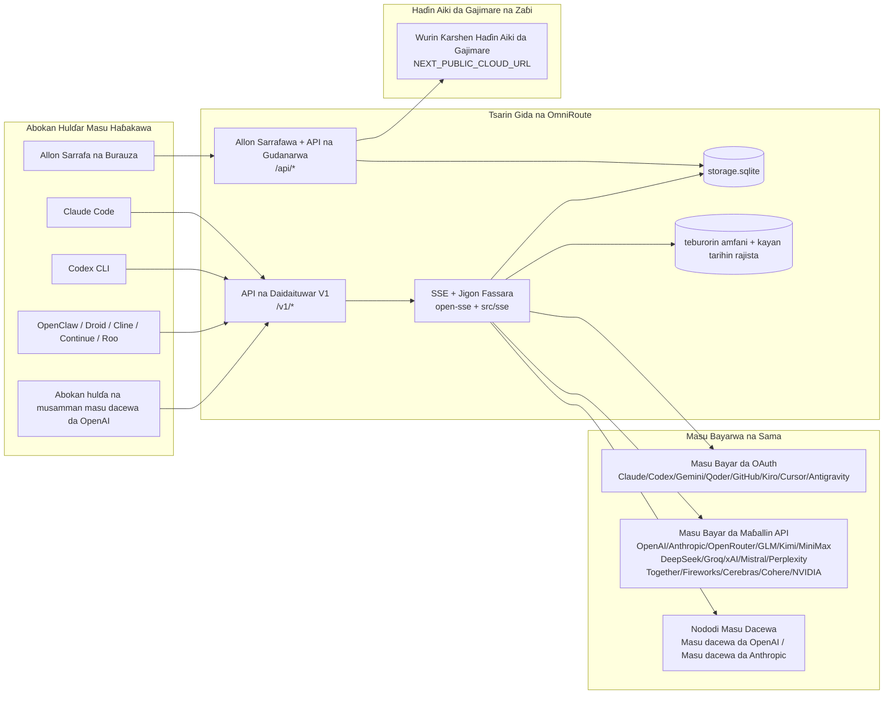
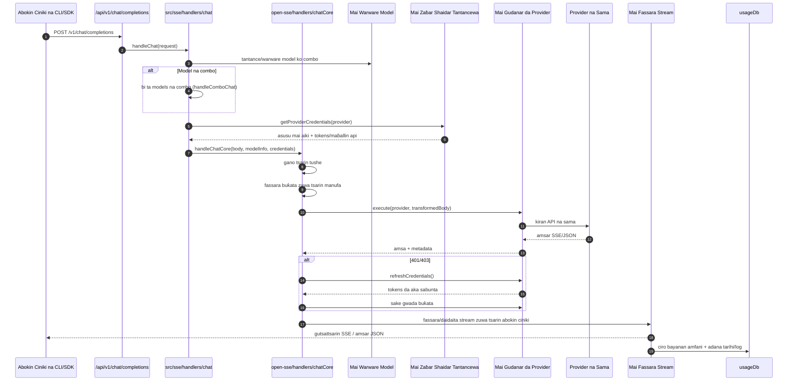
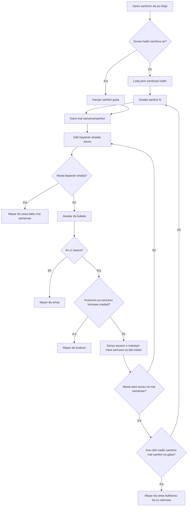
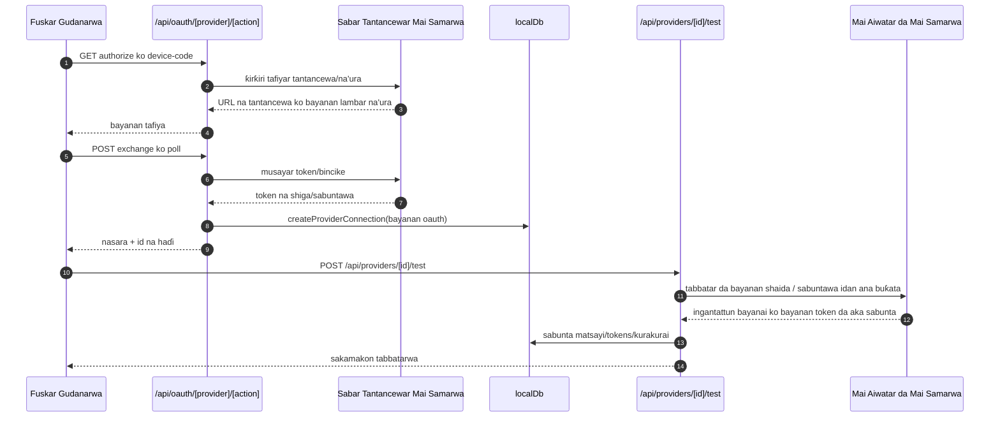
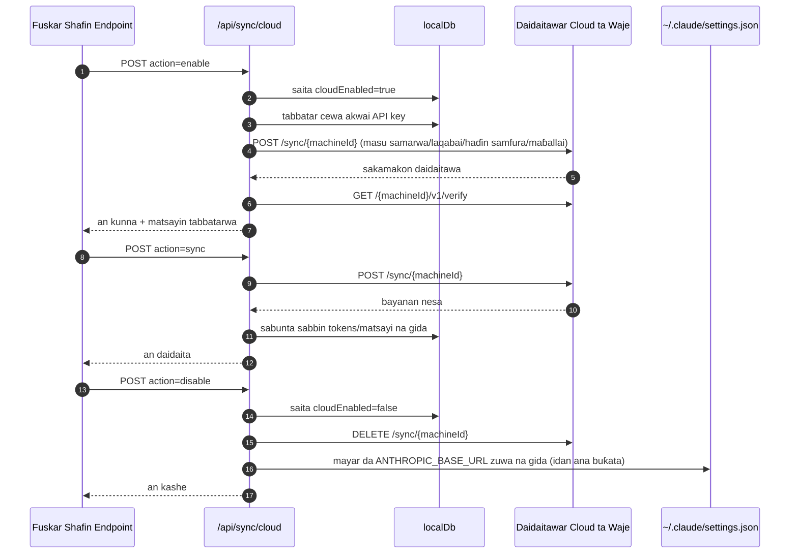
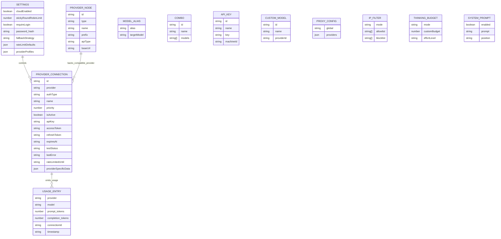
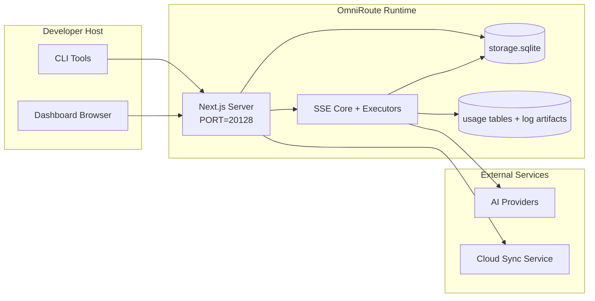

# OmniRoute Architecture (Hausa)

🌐 **Languages:** 🇺🇸 [English](../../../../architecture/ARCHITECTURE.md) · 🇪🇹 [am](../../../am/docs/architecture/ARCHITECTURE.md) · 🇸🇦 [ar](../../../ar/docs/architecture/ARCHITECTURE.md) · 🇦🇿 [az](../../../az/docs/architecture/ARCHITECTURE.md) · 🇧🇬 [bg](../../../bg/docs/architecture/ARCHITECTURE.md) · 🇧🇩 [bn](../../../bn/docs/architecture/ARCHITECTURE.md) · 🇧🇦 [bs](../../../bs/docs/architecture/ARCHITECTURE.md) · 🇨🇿 [cs](../../../cs/docs/architecture/ARCHITECTURE.md) · 🇩🇰 [da](../../../da/docs/architecture/ARCHITECTURE.md) · 🇩🇪 [de](../../../de/docs/architecture/ARCHITECTURE.md) · 🇬🇷 [el](../../../el/docs/architecture/ARCHITECTURE.md) · 🇪🇸 [es](../../../es/docs/architecture/ARCHITECTURE.md) · 🇪🇪 [et](../../../et/docs/architecture/ARCHITECTURE.md) · 🇮🇷 [fa](../../../fa/docs/architecture/ARCHITECTURE.md) · 🇫🇮 [fi](../../../fi/docs/architecture/ARCHITECTURE.md) · 🇫🇷 [fr](../../../fr/docs/architecture/ARCHITECTURE.md) · 🇮🇪 [ga](../../../ga/docs/architecture/ARCHITECTURE.md) · 🇮🇳 [gu](../../../gu/docs/architecture/ARCHITECTURE.md) · 🇮🇱 [he](../../../he/docs/architecture/ARCHITECTURE.md) · 🇮🇳 [hi](../../../hi/docs/architecture/ARCHITECTURE.md) · 🇭🇷 [hr](../../../hr/docs/architecture/ARCHITECTURE.md) · 🇭🇺 [hu](../../../hu/docs/architecture/ARCHITECTURE.md) · 🇦🇲 [hy](../../../hy/docs/architecture/ARCHITECTURE.md) · 🇮🇩 [id](../../../id/docs/architecture/ARCHITECTURE.md) · 🇳🇬 [ig](../../../ig/docs/architecture/ARCHITECTURE.md) · 🇮🇹 [it](../../../it/docs/architecture/ARCHITECTURE.md) · 🇯🇵 [ja](../../../ja/docs/architecture/ARCHITECTURE.md) · 🇬🇪 [ka](../../../ka/docs/architecture/ARCHITECTURE.md) · 🇰🇭 [km](../../../km/docs/architecture/ARCHITECTURE.md) · 🇮🇳 [kn](../../../kn/docs/architecture/ARCHITECTURE.md) · 🇰🇷 [ko](../../../ko/docs/architecture/ARCHITECTURE.md) · 🇱🇹 [lt](../../../lt/docs/architecture/ARCHITECTURE.md) · 🇱🇻 [lv](../../../lv/docs/architecture/ARCHITECTURE.md) · 🇮🇳 [ml](../../../ml/docs/architecture/ARCHITECTURE.md) · 🇮🇳 [mr](../../../mr/docs/architecture/ARCHITECTURE.md) · 🇲🇾 [ms](../../../ms/docs/architecture/ARCHITECTURE.md) · 🇲🇹 [mt](../../../mt/docs/architecture/ARCHITECTURE.md) · 🇲🇲 [my](../../../my/docs/architecture/ARCHITECTURE.md) · 🇳🇵 [ne](../../../ne/docs/architecture/ARCHITECTURE.md) · 🇳🇱 [nl](../../../nl/docs/architecture/ARCHITECTURE.md) · 🇳🇴 [no](../../../no/docs/architecture/ARCHITECTURE.md) · 🇮🇳 [or](../../../or/docs/architecture/ARCHITECTURE.md) · 🇮🇳 [pa](../../../pa/docs/architecture/ARCHITECTURE.md) · 🇵🇭 [phi](../../../phi/docs/architecture/ARCHITECTURE.md) · 🇵🇱 [pl](../../../pl/docs/architecture/ARCHITECTURE.md) · 🇵🇹 [pt](../../../pt/docs/architecture/ARCHITECTURE.md) · 🇧🇷 [pt-BR](../../../pt-BR/docs/architecture/ARCHITECTURE.md) · 🇷🇴 [ro](../../../ro/docs/architecture/ARCHITECTURE.md) · 🇷🇺 [ru](../../../ru/docs/architecture/ARCHITECTURE.md) · 🇱🇰 [si](../../../si/docs/architecture/ARCHITECTURE.md) · 🇸🇰 [sk](../../../sk/docs/architecture/ARCHITECTURE.md) · 🇸🇮 [sl](../../../sl/docs/architecture/ARCHITECTURE.md) · 🇷🇸 [sr](../../../sr/docs/architecture/ARCHITECTURE.md) · 🇸🇪 [sv](../../../sv/docs/architecture/ARCHITECTURE.md) · 🇰🇪 [sw](../../../sw/docs/architecture/ARCHITECTURE.md) · 🇮🇳 [ta](../../../ta/docs/architecture/ARCHITECTURE.md) · 🇮🇳 [te](../../../te/docs/architecture/ARCHITECTURE.md) · 🇹🇭 [th](../../../th/docs/architecture/ARCHITECTURE.md) · 🇹🇷 [tr](../../../tr/docs/architecture/ARCHITECTURE.md) · 🇺🇦 [uk-UA](../../../uk-UA/docs/architecture/ARCHITECTURE.md) · 🇵🇰 [ur](../../../ur/docs/architecture/ARCHITECTURE.md) · 🇺🇿 [uz](../../../uz/docs/architecture/ARCHITECTURE.md) · 🇻🇳 [vi](../../../vi/docs/architecture/ARCHITECTURE.md) · 🇳🇬 [yo](../../../yo/docs/architecture/ARCHITECTURE.md) · 🇨🇳 [zh-CN](../../../zh-CN/docs/architecture/ARCHITECTURE.md) · 🇹🇼 [zh-TW](../../../zh-TW/docs/architecture/ARCHITECTURE.md)

---

🌐 **Languages:** 🇺🇸 [English](../../../../architecture/ARCHITECTURE.md) · 🇪🇹 [am](../../../am/docs/architecture/ARCHITECTURE.md) · 🇸🇦 [ar](../../../ar/docs/architecture/ARCHITECTURE.md) · 🇦🇿 [az](../../../az/docs/architecture/ARCHITECTURE.md) · 🇧🇬 [bg](../../../bg/docs/architecture/ARCHITECTURE.md) · 🇧🇩 [bn](../../../bn/docs/architecture/ARCHITECTURE.md) · 🇧🇦 [bs](../../../bs/docs/architecture/ARCHITECTURE.md) · 🇨🇿 [cs](../../../cs/docs/architecture/ARCHITECTURE.md) · 🇩🇰 [da](../../../da/docs/architecture/ARCHITECTURE.md) · 🇩🇪 [de](../../../de/docs/architecture/ARCHITECTURE.md) · 🇬🇷 [el](../../../el/docs/architecture/ARCHITECTURE.md) · 🇪🇸 [es](../../../es/docs/architecture/ARCHITECTURE.md) · 🇪🇪 [et](../../../et/docs/architecture/ARCHITECTURE.md) · 🇮🇷 [fa](../../../fa/docs/architecture/ARCHITECTURE.md) · 🇫🇮 [fi](../../../fi/docs/architecture/ARCHITECTURE.md) · 🇫🇷 [fr](../../../fr/docs/architecture/ARCHITECTURE.md) · 🇮🇪 [ga](../../../ga/docs/architecture/ARCHITECTURE.md) · 🇮🇳 [gu](../../../gu/docs/architecture/ARCHITECTURE.md) · 🇮🇱 [he](../../../he/docs/architecture/ARCHITECTURE.md) · 🇮🇳 [hi](../../../hi/docs/architecture/ARCHITECTURE.md) · 🇭🇷 [hr](../../../hr/docs/architecture/ARCHITECTURE.md) · 🇭🇺 [hu](../../../hu/docs/architecture/ARCHITECTURE.md) · 🇦🇲 [hy](../../../hy/docs/architecture/ARCHITECTURE.md) · 🇮🇩 [id](../../../id/docs/architecture/ARCHITECTURE.md) · 🇳🇬 [ig](../../../ig/docs/architecture/ARCHITECTURE.md) · 🇮🇹 [it](../../../it/docs/architecture/ARCHITECTURE.md) · 🇯🇵 [ja](../../../ja/docs/architecture/ARCHITECTURE.md) · 🇬🇪 [ka](../../../ka/docs/architecture/ARCHITECTURE.md) · 🇰🇭 [km](../../../km/docs/architecture/ARCHITECTURE.md) · 🇮🇳 [kn](../../../kn/docs/architecture/ARCHITECTURE.md) · 🇰🇷 [ko](../../../ko/docs/architecture/ARCHITECTURE.md) · 🇱🇹 [lt](../../../lt/docs/architecture/ARCHITECTURE.md) · 🇱🇻 [lv](../../../lv/docs/architecture/ARCHITECTURE.md) · 🇮🇳 [ml](../../../ml/docs/architecture/ARCHITECTURE.md) · 🇮🇳 [mr](../../../mr/docs/architecture/ARCHITECTURE.md) · 🇲🇾 [ms](../../../ms/docs/architecture/ARCHITECTURE.md) · 🇲🇹 [mt](../../../mt/docs/architecture/ARCHITECTURE.md) · 🇲🇲 [my](../../../my/docs/architecture/ARCHITECTURE.md) · 🇳🇵 [ne](../../../ne/docs/architecture/ARCHITECTURE.md) · 🇳🇱 [nl](../../../nl/docs/architecture/ARCHITECTURE.md) · 🇳🇴 [no](../../../no/docs/architecture/ARCHITECTURE.md) · 🇮🇳 [or](../../../or/docs/architecture/ARCHITECTURE.md) · 🇮🇳 [pa](../../../pa/docs/architecture/ARCHITECTURE.md) · 🇵🇭 [phi](../../../phi/docs/architecture/ARCHITECTURE.md) · 🇵🇱 [pl](../../../pl/docs/architecture/ARCHITECTURE.md) · 🇵🇹 [pt](../../../pt/docs/architecture/ARCHITECTURE.md) · 🇧🇷 [pt-BR](../../../pt-BR/docs/architecture/ARCHITECTURE.md) · 🇷🇴 [ro](../../../ro/docs/architecture/ARCHITECTURE.md) · 🇷🇺 [ru](../../../ru/docs/architecture/ARCHITECTURE.md) · 🇱🇰 [si](../../../si/docs/architecture/ARCHITECTURE.md) · 🇸🇰 [sk](../../../sk/docs/architecture/ARCHITECTURE.md) · 🇸🇮 [sl](../../../sl/docs/architecture/ARCHITECTURE.md) · 🇷🇸 [sr](../../../sr/docs/architecture/ARCHITECTURE.md) · 🇸🇪 [sv](../../../sv/docs/architecture/ARCHITECTURE.md) · 🇰🇪 [sw](../../../sw/docs/architecture/ARCHITECTURE.md) · 🇮🇳 [ta](../../../ta/docs/architecture/ARCHITECTURE.md) · 🇮🇳 [te](../../../te/docs/architecture/ARCHITECTURE.md) · 🇹🇭 [th](../../../th/docs/architecture/ARCHITECTURE.md) · 🇹🇷 [tr](../../../tr/docs/architecture/ARCHITECTURE.md) · 🇺🇦 [uk-UA](../../../uk-UA/docs/architecture/ARCHITECTURE.md) · 🇵🇰 [ur](../../../ur/docs/architecture/ARCHITECTURE.md) · 🇺🇿 [uz](../../../uz/docs/architecture/ARCHITECTURE.md) · 🇻🇳 [vi](../../../vi/docs/architecture/ARCHITECTURE.md) · 🇳🇬 [yo](../../../yo/docs/architecture/ARCHITECTURE.md) · 🇨🇳 [zh-CN](../../../zh-CN/docs/architecture/ARCHITECTURE.md) · 🇹🇼 [zh-TW](../../../zh-TW/docs/architecture/ARCHITECTURE.md)

_An sabunta na ƙarshe: 2026-06-28_

## Taƙaitaccen Bayani na Zartarwa

OmniRoute wata ƙofar sarrafa zirga-zirgar AI ta cikin gida ce da dashboard da aka gina a kan Next.js.
Tana samar da endpoint guda ɗaya mai jituwa da OpenAI (`/v1/*`) kuma tana rarraba zirga-zirga tsakanin upstream providers da yawa tare da fassara, fallback, sabunta token, da bin diddigin amfani.

Muhimman ƙwarewa:

- Fuskar API mai jituwa da OpenAI don CLI/kayan aiki (providers 355, executors 108)
- Fassarar request/response tsakanin tsarin providers
- Fallback na haɗin models (jerin models da yawa)
- Matakan haɗi masu tsari (`provider + model + connection`) tare da jera su a lokacin aiki ta `compositeTiers`
- Fallback a matakin account (accounts da yawa ga kowane provider)
- Binciken quota kafin aiki da zaɓin account na P2C mai la'akari da quota a babban hanyar chat
- Gudanar da haɗin providers ta OAuth + API key (modules na OAuth providers guda 22)
- Samar da embeddings ta `/v1/embeddings` (providers 18)
- Samar da hotuna ta `/v1/images/generations` (providers 10+, models 20+)
- Juya sauti zuwa rubutu ta `/v1/audio/transcriptions` (providers 18)
- Juya rubutu zuwa magana ta `/v1/audio/speech` (built-in providers 24)
- Samar da bidiyo ta `/v1/videos/generations` (ComfyUI + SD WebUI)
- Samar da kiɗa ta `/v1/music/generations` (ComfyUI)
- Binciken yanar gizo ta `/v1/search` (providers 20)
- Moderations ta `/v1/moderations`
- Sake jera sakamako ta `/v1/rerank`
- Nazarin think tags (`<think>...</think>`) don reasoning models
- Tsabtace response don tsananin jituwa da OpenAI SDK
- Daidaita roles (developer→system, system→user) don jituwa tsakanin providers
- Sauya structured output (json_schema → Gemini responseSchema)
- Adana bayanan providers, keys, aliases, combos, settings, da pricing a cikin gida (DB modules 122)
- Bibiyar amfani/kudin aiki da yin log na requests
- Cloud sync na zaɓi don daidaita bayanai/yanayi tsakanin na'urori da yawa
- IP allowlist/blocklist don sarrafa damar shiga API
- Gudanar da thinking budget (passthrough/auto/custom/adaptive)
- Shigar da global system prompt
- Bibiyar sessions da fingerprinting
- Ingantaccen rate limiting ga kowane account tare da profiles na musamman ga provider
- Tsarin circuit breaker don tabbatar da juriyar providers
- Kariya daga anti-thundering herd ta amfani da mutex locking
- Cache na kawar da maimaitattun requests bisa signature
- Domain layer: cost rules, fallback policy, lockout policy
- Context Relay: taƙaitattun bayanan miƙa session don ci gaba yayin juyawar accounts
- Adana domain state (SQLite write-through cache don fallbacks, budgets, lockouts, da circuit breakers)
- Policy engine don tantance requests daga wuri guda (lockout → budget → fallback)
- Request telemetry tare da tara latency na p50/p95/p99
- Telemetry na combo target da tarihin lafiyar combo target ta `combo_execution_key` / `combo_step_id`
- Correlation ID (X-Request-Id) don bibiyar aiki daga farko zuwa ƙarshe
- Yin compliance audit logging tare da damar opt-out ga kowane API key
- Eval framework don tabbatar da ingancin LLM
- Health dashboard tare da matsayin circuit breaker na providers a ainihin lokaci
- MCP Server (kayan aiki 110) tare da transports 3 (stdio/SSE/Streamable HTTP)
- A2A Server (JSON-RPC 2.0 + SSE) tare da skills da zagayowar rayuwar tasks
- Tsarin memory (extraction, injection, retrieval, summarization)
- Tsarin skills (registry, executor, sandbox, built-in skills)
- MITM proxy tare da sarrafa certificates da kula da DNS
- Middleware na kariya daga prompt injection
- Tsarin prompt compression tare da Caveman, RTK, stacked pipelines, compression combos, language packs, da analytics
- Registry na ACP (Agent Communication Protocol)
- Modular OAuth providers (modules guda 22 kowanne daban a ƙarƙashin `src/lib/oauth/providers/`)
- Scripts na uninstall/full-uninstall
- Aikin gyara OAuth environment
- WebSocket bridge don WS clients masu jituwa da OpenAI (`/v1/ws`)
- Gudanar da sync tokens (bayarwa/soke su, sauke config bundle mai sigar ETag)
- GLM Thinking (`glmt`) a matsayin cikakken provider preset
- Haɗaɗɗen ƙididdigar tokens (ta provider-side `/messages/count_tokens` tare da estimation fallback)
- Auto-seeding na model aliases (daidaitattun cross-proxy dialect sama da 30 a lokacin farawa)
- Amintaccen outbound fetch tare da SSRF guard, toshe private URLs, da retry mai iya daidaitawa
- Chat retries masu la'akari da cooldown tare da `requestRetry` da `maxRetryIntervalSec` masu iya daidaitawa
- Tabbatar da runtime environment da Zod a lokacin farawa
- Compliance audit v2 tare da pagination, provider CRUD events, da yin log na validation da SSRF ya toshe

Babban tsarin runtime:

- Next.js app routes a ƙarƙashin `src/app/api/*` suna aiwatar da dashboard APIs da compatibility APIs
- Babban tsarin SSE/routing da ake rabawa a `src/sse/*` + `open-sse/*` yana kula da aiwatar da provider, fassara, streaming, fallback, da amfani

## Zanen Bayani

Tabbatattun tushen Mermaid masu sarrafa siga na dandalin v3.8.0 suna cikin
[`docs/diagrams/`](../diagrams/README.md). An sake nuna guda biyu a ƙasa don fahimtar tsarin;
sauran suna da hanyoyin haɗi daga jagororinsu na takamaiman fanni.


> Tushen: [diagrams/request-pipeline.mmd](../diagrams/request-pipeline.mmd)


> Tushen: [diagrams/resilience-3layers.mmd](../diagrams/resilience-3layers.mmd) — an kuma haɗa shi daga
> [RESILIENCE_GUIDE.md](./RESILIENCE_GUIDE.md) da bayanin juriya na `CLAUDE.md`.

## Iyaka da Abubuwan da Aka Ƙunsa

### Abubuwan da Aka Ƙunsa

- Yanayin gudanar da ƙofar shiga na cikin gida
- API na sarrafa dashboard
- Tabbatar da sahihancin mai samarwa da sabunta token
- Fassarar buƙata da yaɗawar SSE
- Adana halin cikin gida + bayanan amfani
- Tsara aiki tare da gajimare na zaɓi

### Abubuwan da Ba a Ƙunsa ba

- Aiwatar da sabis ɗin gajimare da ke bayan `NEXT_PUBLIC_CLOUD_URL`
- SLA/filin sarrafa mai samarwa da ke wajen tsarin cikin gida
- Su kansu binaries na CLI na waje (Claude CLI, Codex CLI, da sauransu)

## Shafukan Dashboard (Na Yanzu)

Manyan shafuka da ke ƙarƙashin `src/app/(dashboard)/dashboard/`:

- `/dashboard` — farawa cikin sauri + taƙaitaccen bayani kan masu samarwa
- `/dashboard/endpoint` — wakilin endpoint + MCP + A2A + shafukan API endpoint
- `/dashboard/providers` — haɗin masu samarwa da bayanan shiga
- `/dashboard/combos` — dabarun haɗaka, samfura, maginin mataki-mataki, ƙa'idojin tura model, tsarin jeri na hannu da ake adanawa
- `/dashboard/auto-combo` — Injin Haɗaka ta Atomatik: ma'aunin ƙididdigewa, kunshin yanayi, saitattun masana'anta na kama-da-wane, telemetry
- `/dashboard/costs` — tattara kuɗaɗe da bayyana farashi
- `/dashboard/analytics` — nazarin amfani, tantancewa, lafiyar maƙasudin haɗaka
- `/dashboard/limits` — sarrafa ƙayyadadden amfani/yawan buƙatu
- `/dashboard/cli-tools` — shigar da CLI, gano yanayin gudanarwa, samar da saituna
- `/dashboard/agents` — wakilan ACP da aka gano + rajistar wakili na al'ada
- `/dashboard/cloud-agents` — ayyukan wakilai masu masaukin gajimare (Codex Cloud, Devin, Jules) da zagayowar rayuwar aiki
- `/dashboard/skills` — rajistar ƙwarewar A2A, aiwatarwa a sandbox, jerin ginannun ƙwarewa
- `/dashboard/memory` — dubawa da dawo da ƙwaƙwalwar tattaunawa mai ɗorewa
- `/dashboard/webhooks` — rajistar webhook masu fita, sauya sirri, ƙididdigar sake gwadawa
- `/dashboard/batch` — ƙaddamar da aikin rukuni da ci gabansa
- `/dashboard/cache` — ƙididdigar cache na karantawa kai tsaye da tunani, sarrafa fitarwa
- `/dashboard/playground` — filin gwajin hira mai hulɗa da duk wani haɗaka/model da aka saita
- `/dashboard/changelog` — mai duba tarihin canje-canje a cikin manhaja (yana nuna `CHANGELOG.md`)
- `/dashboard/system` — binciken yanayin gudanarwa, bayanin siga, wajen tabbatar da muhalli
- `/dashboard/onboarding` — jagoran saiti na farkon amfani don sabbin girkawa
- `/dashboard/media` — filin gwajin hoto/bidiyo/kiɗa
- `/dashboard/search-tools` — gwajin mai samar da bincike da tarihin bincike
- `/dashboard/health` — lokacin aiki, circuit breakers, iyakokin yawan buƙatu, zaman da ake sa ido kan ƙayyadadden amfani
- `/dashboard/logs` — rajistan buƙata/wakili/binciken bin doka/console
- `/dashboard/settings` — shafukan saitunan tsarin (gaba ɗaya, turawa, tsoffin saitunan haɗaka, da sauransu)
- `/dashboard/context/caveman` — ƙa'idojin matsawar Caveman, kunshin harsuna, samfoti, da yanayin fitarwa
- `/dashboard/context/rtk` — matatun sakamakon umarnin RTK, samfoti, da saitunan amincin yanayin gudanarwa
- `/dashboard/context/combos` — bututun matsawa masu suna da aka sanya wa haɗakar turawa
- `/dashboard/translator` — dubawar mai fassara da samfotin sauya tsarin buƙata
- `/dashboard/audit` — mai binciken rajistan bin ƙa'idoji tare da rarraba shafuka da tsararrun metadata
- `/dashboard/usage` — mai binciken amfani na kowace buƙata da ke da alaƙa da `usage_history`
- `/dashboard/compression` — nazarin matsawa, ƙididdiga, da sanya bututun aiki
- `/dashboard/api-manager` — zagayowar rayuwar API key da izinin model

## Mahallin Tsarin Gabaɗaya



## Manyan Sassan Lokacin Gudanarwa

## 1) Matakin API da Juyar da Buƙatu (Hanyoyin Manhajar Next.js)

Manyan kundin adireshi:

- `src/app/api/v1/*` da `src/app/api/v1beta/*` don API na daidaituwa
- `src/app/api/*` don API na gudanarwa/daidaitawa
- Sake rubutawa na Next a cikin `next.config.mjs` yana danganta `/v1/*` zuwa `/api/v1/*`

Muhimman hanyoyin daidaituwa:

- `src/app/api/v1/chat/completions/route.ts`
- `src/app/api/v1/messages/route.ts`
- `src/app/api/v1/responses/route.ts`
- `src/app/api/v1/models/route.ts` — ya haɗa da samfura na musamman masu `custom: true`
- `src/app/api/v1/embeddings/route.ts` — samar da embedding (masu bayarwa 6)
- `src/app/api/v1/images/generations/route.ts` — samar da hoto (masu bayarwa 4+ ciki har da Antigravity/Nebius)
- `src/app/api/v1/messages/count_tokens/route.ts`
- `src/app/api/v1/providers/[provider]/chat/completions/route.ts` — tattaunawa ta musamman ga kowane mai bayarwa
- `src/app/api/v1/providers/[provider]/embeddings/route.ts` — embeddings na musamman ga kowane mai bayarwa
- `src/app/api/v1/providers/[provider]/images/generations/route.ts` — hotuna na musamman ga kowane mai bayarwa
- `src/app/api/v1beta/models/route.ts`
- `src/app/api/v1beta/models/[...path]/route.ts`

Fannonin gudanarwa:

- Tantancewa/saituna: `src/app/api/auth/*`, `src/app/api/settings/*`
- Masu bayarwa/haɗe-haɗe: `src/app/api/providers*`
- Nododin masu bayarwa: `src/app/api/provider-nodes*`
- Samfura na musamman: `src/app/api/provider-models` (GET/POST/DELETE)
- Kundin samfura: `src/app/api/models/route.ts` (GET)
- Daidaita proxy: `src/app/api/settings/proxy` (GET/PUT/DELETE) + `src/app/api/settings/proxy/test` (POST)
- OAuth: `src/app/api/oauth/*`
- Maɓallai/laqabobi/haɗaka/farashi: `src/app/api/keys*`, `src/app/api/models/alias`, `src/app/api/combos*`, `src/app/api/pricing`
- Amfani: `src/app/api/usage/*`
- Daidaita aiki/gajimare: `src/app/api/sync/*`, `src/app/api/cloud/*`
- Mataimakan kayan aikin CLI: `src/app/api/cli-tools/*`
- Tace IP: `src/app/api/settings/ip-filter` (GET/PUT)
- Kasafin tunani: `src/app/api/settings/thinking-budget` (GET/PUT)
- Umarnin tsarin: `src/app/api/settings/system-prompt` (GET/PUT)
- Matsewa: `src/app/api/settings/compression`, `src/app/api/compression/*`, da
  `src/app/api/context/*`
- Zaman aiki: `src/app/api/sessions` (GET)
- Iyakokin ƙimar buƙatu: `src/app/api/rate-limits` (GET)
- Juriya ga matsala: `src/app/api/resilience` (GET/PATCH) — jerin jiran buƙatu, lokacin hutu na haɗi, katsewar mai bayarwa, da saitin jira-har-lokacin-hutu
- Sake saita juriya: `src/app/api/resilience/reset` (POST) — sake saita katsewar masu bayarwa
- Ƙididdigar cache: `src/app/api/cache/stats` (GET/DELETE)
- Telemetry: `src/app/api/telemetry/summary` (GET)
- Kasafin kuɗi: `src/app/api/usage/budget` (GET/POST)
- Sarƙoƙin komawa madadin: `src/app/api/fallback/chains` (GET/POST/DELETE)
- Binciken bin ƙa'ida: `src/app/api/compliance/audit-log` (GET, tare da rarraba shafuka + tsararrun metadata)
- Gwaje-gwajen kimantawa: `src/app/api/evals` (GET/POST), `src/app/api/evals/[suiteId]` (GET)
- Manufofi: `src/app/api/policies` (GET/POST)
- Token na daidaita aiki: `src/app/api/sync/tokens` (GET/POST), `src/app/api/sync/tokens/[id]` (GET/DELETE)
- Kunshin daidaitawa: `src/app/api/sync/bundle` (GET, hoton-lokaci mai sigar ETag na saituna/masu bayarwa/haɗaka/maɓallai)
- WebSocket: `src/app/api/v1/ws/route.ts` — mai sarrafa Upgrade don abokan hulɗar WS masu dacewa da OpenAI

## 2) SSE + Jigon Fassara

Manyan modules na gudana:

- Mafara: `src/sse/handlers/chat.ts`
- Babban tsara aiki: `open-sse/handlers/chatCore.ts`
- Adaftocin aiwatar da mai bayarwa: `open-sse/executors/*`
- Gano tsari/daidaitawar mai bayarwa: `open-sse/services/provider.ts`
- Tantance/warware model: `src/sse/services/model.ts`, `open-sse/services/model.ts`
- Dabarar komawa ga wani asusu: `open-sse/services/accountFallback.ts`
- Rijistar fassara: `open-sse/translator/index.ts`
- Sauye-sauyen stream: `open-sse/utils/stream.ts`, `open-sse/utils/streamHandler.ts`
- Ciro/daidaita bayanan amfani: `open-sse/utils/usageTracking.ts`
- Mai tantance alamar think: `open-sse/utils/thinkTagParser.ts`
- Mai sarrafa embedding: `open-sse/handlers/embeddings.ts`
- Rijistar masu bayar da embedding: `open-sse/config/embeddingRegistry.ts`
- Mai sarrafa ƙirƙirar hoto: `open-sse/handlers/imageGeneration.ts`
- Rijistar masu bayar da hoto: `open-sse/config/imageRegistry.ts`
- Tsabtace amsa: `open-sse/handlers/responseSanitizer.ts`
- Daidaita rawar aiki: `open-sse/services/roleNormalizer.ts`

Services (dabarun kasuwanci):

- Zaɓi/ƙididdige maki na asusu: `open-sse/services/accountSelector.ts`
- Gudanar da zagayowar rayuwar mahallin bayanai: `open-sse/services/contextManager.ts`
- Tilasta tace IP: `open-sse/services/ipFilter.ts`
- Bibiyar zama: `open-sse/services/sessionManager.ts`
- Cire maimaitattun buƙatu: `open-sse/services/signatureCache.ts`
- Shigar da system prompt: `open-sse/services/systemPrompt.ts`
- Gudanar da kasafin thinking: `open-sse/services/thinkingBudget.ts`
- Jagorantar model ta wildcard: `open-sse/services/wildcardRouter.ts`
- Gudanar da iyakar ƙimar amfani: `open-sse/services/rateLimitManager.ts`
- Mai katse da'ira: `src/shared/utils/circuitBreaker.ts`
- Miƙa mahallin bayanai: `open-sse/services/contextHandoff.ts` — ƙirƙira da shigar da taƙaitaccen miƙawa don dabarar context-relay
- Matsawa: `open-sse/services/compression/*` — matsawa ta rigakafi kafin fassarar mai bayarwa;
  ya haɗa da ƙa'idodin Caveman, matatun RTK, pipelines masu jere, haɗe-haɗen matsawa, ƙididdiga, da tabbatarwa
- Mai ɗebo ƙa'idar amfani ta Codex: `open-sse/services/codexQuotaFetcher.ts` — yana ɗebo ƙa'idar amfani ta Codex don yanke shawarar miƙawar context-relay
- Sake gwadawa mai la'akari da cooldown: `src/sse/services/cooldownAwareRetry.ts` — sake gwadawa bisa cooldown na kowane model tare da `requestRetry` / `maxRetryIntervalSec` masu iya daidaitawa
- Amintaccen outbound fetch: `src/shared/network/safeOutboundFetch.ts` — kariyayyen fetch na mai bayarwa/model tare da kariyar SSRF, toshe URL masu zaman kansu, sake gwadawa, da timeout
- Kariyar outbound URL: `src/shared/network/outboundUrlGuard.ts` — yana tabbatar da URL na masu bayarwa bisa jerin CIDR na private/localhost
- Tsoffin ƙimomin buƙatar mai bayarwa: `open-sse/services/providerRequestDefaults.ts` — tsoffin ƙimomin `maxTokens`, `temperature`, `thinkingBudgetTokens` na matakin mai bayarwa
- Constants na mai bayar da GLM: `open-sse/config/glmProvider.ts` — models na GLM da aka raba, URL na ƙa'idar amfani, timeout/tsoffin ƙimomin GLMT
- Antigravity upstream: `open-sse/config/antigravityUpstream.ts` — constants na asalin URL da hanyar ganowa
- Constants na Codex client: `open-sse/config/codexClient.ts` — ƙimomin user-agent da client-version masu sigar da aka kayyade
- Fara alias na model: `src/lib/modelAliasSeed.ts` — yana fara aliases 30+ na yarukan cross-proxy yayin farawa

Modules na domain layer:

- Ƙa'idodin farashi/kasafin kuɗi: `src/domain/costRules.ts`
- Manufofin fallback: `src/domain/fallbackPolicy.ts`
- Mai warware combo: `src/domain/comboResolver.ts`
- Manufofin lockout: `src/domain/lockoutPolicy.ts`
- Injin manufofi: `src/domain/policyEngine.ts` — kimantawa ta tsakiya daga lockout → budget → fallback
- Kundin lambobin kuskure: `src/shared/constants/errorCodes.ts`
- ID na buƙata: `src/shared/utils/requestId.ts`
- Timeout na fetch: `src/shared/utils/fetchTimeout.ts`
- Telemetry na buƙata: `src/shared/utils/requestTelemetry.ts`
- Bin ƙa'ida/binciken aiki: `src/lib/compliance/index.ts`
- Mai gudanar da eval: `src/lib/evals/evalRunner.ts`
- Adana yanayin domain: `src/lib/db/domainState.ts` — SQLite CRUD don jerin fallback, kasafin kuɗi, tarihin farashi, yanayin lockout, da masu katse da'ira

Modules na masu bayar da OAuth (fayiloli guda 22 a ƙarƙashin `src/lib/oauth/providers/`):

- Fihirisar rajista: `src/lib/oauth/providers/index.ts`
- Masu bayarwa ɗaiɗaiku: `agy.ts`, `antigravity.ts`, `claude.ts`, `cline.ts`, `codebuddy-cn.ts`, `codex.ts`, `cursor.ts`, `devin-desktop.ts`, `ghe-copilot.ts`, `github.ts`, `gitlab-duo.ts`, `grok-cli-oauth.ts`, `grok-cli.ts`, `kilocode.ts`, `kimi-coding.ts`, `kiro.ts`, `openference.ts`, `qoder.ts`, `trae.ts`, `xai-oauth.ts`, `zed-hosted.ts`, `zed.ts`
- Siririn wrapper: `src/lib/oauth/providers.ts` — yana sake fitarwa daga modules ɗaiɗaiku

## 5) Sabis na Ciki (v3.8.4)

OmniRoute na iya girkawa, sa ido, da kuma tura buƙatu zuwa matakan aiki na kayan aikin AI da ke gudana a cikin gida
waɗanda ake kira **sabis na ciki**. Ana kawo guda biyar: 9Router, CLIProxyAPI, Bifrost, Mux da Dario.

Matakan gine-gine:

- **UI** (`/dashboard/providers/services`) — shafi mai shafuka biyu tare da sarrafa zagayowar rayuwa,
  watsa rajista kai tsaye, sarrafa maɓallan API, da kuma (ga 9Router) UI na asali da aka saka ta
  cikin reverse proxy na ciki.
- **API** (`/api/services/{name}/*`) — endpoints 11 don 9Router, 10 don CLIProxyAPI, 8 kowanne don Bifrost / Mux / Dario,
  duk an ware su a matsayin **LOCAL_ONLY** (ƙa'ida mai tsauri #17). Endpoint na SSE na bai ɗaya `GET /api/services/[name]/logs`
  yana hidimtawa dukkan sabis biyun.
- **Supervisor** (`src/lib/services/`) — ajin `ServiceSupervisor` na gama-gari yana naɗe
  `child_process.spawn`, yana riƙe da ring buffer na 5 MB don watsa rajistar SSE, zagayen
  binciken lafiya, makullin aiki na atomic, da rufewa cikin tsari ta SIGTERM→SIGKILL.
  `bootstrap.ts` yana haɗa duk sabis ɗin da aka saita lokacin fara process.
- **Provider/executor** (`open-sse/executors/ninerouter.ts`) — ana gabatar da 9Router a matsayin
  provider na gaske. Ana sanya wa models gabatarwa `9router/{sub}/{model}` kuma ana daidaita su kowane minti 5
  daga endpoint na 9Router na `/v1/models`.

Cikakken bayani: `docs/frameworks/EMBEDDED-SERVICES.md`

## Manyan Ƙananan Tsaruka (v3.8.0)

### A. Injin Auto Combo

Auto Combo yana ƙididdige maki kuma yana zaɓar wuraren da za a tura buƙatu a lokacin buƙatar, maimakon
dogaro da tsayayyen ma'anar combo. Shi ne ke sarrafa dangin gabatarwar model na `auto/*`.

- Mashigar injin: `open-sse/services/autoCombo/` (`autoComboEngine.ts`,
  `scoringEngine.ts`, `virtualFactory.ts`, `modePacks.ts`)
- Mai warwarewa: `src/domain/comboResolver.ts` (gano gabatarwar `auto/` ta atomatik)
- Dashboard: `/dashboard/auto-combo`
- Telemetry: teburin SQLite na `auto_combo_decisions`

Muhimman iyawa:

- **Dabarun turawa 19** (priority, weighted, fill-first, round-robin, P2C, random,
  least-used, cost-optimized, reset-aware, reset-window, headroom, strict-random,
  **auto**, lkgp, context-optimized, context-relay, **fusion**, tare da hanyar fallback) —
  auto shi ne babban ƙarin da aka yi a v3.8.0; `fusion` (fan-out na panel + haɗawar judge,
  `open-sse/services/fusion.ts`) sabo ne a v3.8.36.
- **Ƙididdigar abubuwa 16**: quota, lafiya, akasin farashi, akasin latency, dacewa da aiki da
  wasu goma. Babban teburin abubuwan da nauyinsu na tsoho yana cikin
  [`docs/routing/AUTO-COMBO.md`](../routing/AUTO-COMBO.md) — sake bayyana shi a nan zai
  samar masa da wani wuri na biyu da zai iya tsufa.
- **Virtual factory** yana ƙirƙirar combos na wucin gadi lokacin da babu combo mai suna da ya dace,
  yana samo candidates daga connections na provider masu lafiya kuma masu aiki.
- **Gabatarwar auto**: `auto/coding`, `auto/cheap`, `auto/fast`, `auto/offline`,
  `auto/smart`, `auto/lkgp` — kowannensu yana amfani da bayanin martabar nauyi da aka daidaita.
- **Mode packs 6**: `ship-fast`, `cost-saver`, `quality-first`, `offline-friendly`,
  `reliability-first` da `chaos-mode` — saitunan nauyi da aka riga aka tanada waɗanda za a iya kira daga
  dashboard. (Kada a rikita su da gabatarwar `auto/*` da ke sama, waɗanda su ne
  nau'ukan lokacin buƙata.)

Don cikakken bayani game da algorithm (formulas na abubuwa, daidaita nauyi), duba
[`docs/routing/AUTO-COMBO.md`](../routing/AUTO-COMBO.md).

### B. Cloud Agents

Cloud Agents yana naɗe manhajojin code-agent da wasu kamfanoni ke ɗaukar nauyin gudanarwa (Codex Cloud, Devin,
Jules) a bayan zagayowar rayuwar aiki iri ɗaya mai dogaro da DB. Duk endpoints na ƙirƙira/duba aiki
suna buƙatar tantancewar gudanarwa.

- Tushen module: `src/lib/cloudAgent/` (`baseAgent.ts`, `registry.ts`, `api.ts`,
  `types.ts`, `db.ts`, tare da ƙananan kundin adireshi na kowane agent a ƙarƙashin `agents/`)
- Aiwatarwar kowane agent: `agents/codex/`, `agents/devin/`, `agents/jules/`
- Endpoints na jama'a: `/api/v1/agents/tasks/*` (jera/ƙirƙira/samu/soke)
- Endpoints na gudanarwa: `/api/cloud/*` (tanadi, matsayi, batch)
- Dashboard: `/dashboard/cloud-agents`
- Ma'ajiya: teburin `cloud_agent_tasks`

Don bayani na musamman kan tanadin kowane agent da OAuth, duba
[`docs/frameworks/CLOUD_AGENT.md`](../frameworks/CLOUD_AGENT.md).

### C. Guardrails

Module na guardrails wani matakin middleware ne da za a iya sake lodawa yayin aiki, wanda ke bincika buƙatu
da amsoshi don PII, kutsen prompt, da abun vision mara aminci. Keta ƙa'idoji
yana katse buƙatar nan take da HTTP **503** tare da tsararren lambar kuskure, wanda ke bai wa
masu kira na downstream damar sake gwadawa ko rarraba hanya.

- Tushen module: `src/lib/guardrails/` (`base.ts`, `registry.ts`, `piiMasker.ts`,
  `promptInjection.ts`, `visionBridge.ts`, `visionBridgeHelpers.ts`)
- Sake lodawa yayin aiki: registry yana lura da canje-canjen config kuma yana sake gina chain a wurin
- Wuraren haɗawa: mashigar chat handler, image generation handler, response sanitizer
- Yarjejeniyar HTTP: keta ƙa'idoji na bayyana a matsayin `503` tare da `error.code = "GUARDRAIL_VIOLATION"`

Don ƙirƙirar ruleset da daidaita threshold, duba
[`docs/security/GUARDRAILS.md`](../security/GUARDRAILS.md).

### D. Matakin Domain

Namespace na `src/domain/` yana tattara yanke shawarar manufofi a wuri guda domin route handlers kada su
haɗa dabarun lockout/budget/fallback da kansu.

- Injin manufofi: `src/domain/policyEngine.ts` — mashiga guda ɗaya don
  kimantawa kafin aiwatarwa (jerin lockout → budget → fallback)
- Dokokin farashi: `src/domain/costRules.ts`
- Manufar fallback: `src/domain/fallbackPolicy.ts`
- Manufar lockout: `src/domain/lockoutPolicy.ts`
- Turawa bisa tags: `src/domain/tagRouter.ts`
- Mai warware combo: `src/domain/comboResolver.ts` — yana warware sunayen combo, gabatarwar auto/\*,
  da wildcard model targets zuwa takamaiman tsare-tsaren aiwatarwa
- Mai haɗa dokokin connection/model: `src/domain/connectionModelRules.ts`
- Hotunan yanayin samuwar model: `src/domain/modelAvailability.ts`
- Bibiyar ƙarewar provider: `src/domain/providerExpiration.ts`
- Cache na quota: `src/domain/quotaCache.ts`
- Yanayin lalacewar aiki: `src/domain/degradation.ts`
- Binciken configuration: `src/domain/configAudit.ts`
- Mai gina metadata na amsar OmniRoute: `src/domain/omnirouteResponseMeta.ts`
- Ƙaramin tsarin kimantawa: `src/domain/assessment/` — ayyukan kimantawa na lokaci-lokaci

### E. Bututun Ba da Izini

Ajin bututun izini yana rarraba kowace buƙata mai shigowa sannan ya yi amfani da
jerin manufofin da suka dace kafin ya tura ta.

- Mashigar bututun: `src/server/authz/pipeline.ts`
- Mai rarraba buƙata: `src/server/authz/classify.ts` — yana bambanta hanyoyin dacewa
  na jama'a da hanyoyin gudanarwa
- Jerin hanyoyin jama'a: `src/shared/constants/publicApiRoutes.ts`
- Manufofi: `src/server/authz/policies/` — sharuɗɗan da za a iya haɗawa
  (`requireApiKey`, `requireManagement`, `requireFreshAuth`, da sauransu.)
- Kayan aikin header: `src/server/authz/headers.ts`
- Mataimakin tabbatarwa: `src/server/authz/assertAuth.ts`
- Mahallin buƙata: `src/server/authz/context.ts`

Hanyoyin jama'a da na gudanarwa suna da tsayayyen iyaka: API na agent/cooldown da
sauye-sauyen provider suna buƙatar izinin gudanarwa (HTTP 401 idan babu shi).

Don cikakkun ƙa'idojin rarraba hanyoyi, duba
[`docs/architecture/AUTHZ_GUIDE.md`](./AUTHZ_GUIDE.md).

### F. Workflow FSM da Task-Aware Router

Router mai amfani da finite-state-machine wanda aka ɗora sama da zaɓin combo domin jagorantar
zirga-zirga bisa matakin workflow da aka gano (tsarawa, aiwatarwa,
bita) da kuma alaƙarsa da ayyukan bango.

- Workflow FSM: `open-sse/services/workflowFSM.ts`
- Router mai fahimtar aiki: `open-sse/services/taskAwareRouter.ts`
- Mai gano aikin bango: `open-sse/services/backgroundTaskDetector.ts`
- Mai rarraba niyya: `open-sse/services/intentClassifier.ts`

Sauye-sauyen yanayin FSM suna shiga cikin tsarin ba da maki na Auto Combo, suna karkata zuwa models masu
rahusa don ayyukan bango/na atomatik, sannan zuwa models masu ƙarfi don zagayen
tsarawa/bita masu hulɗa kai tsaye.

### G. Juriyar da ta Keɓanta ga Provider

Wasu providers suna zuwa da keɓantattun modules na juriya da ɓoyewa waɗanda ke cin gajiyar
matakan global circuit breaker / connection cooldown / model lockout:

- Injin Antigravity 429: `open-sse/services/antigravity429Engine.ts` (yana sauya
  identity, yana tsabtace response headers, yana tafiyar da bibiyar credits/version ta hanyar
  `antigravityCredits.ts`, `antigravityHeaderScrub.ts`, `antigravityHeaders.ts`,
  `antigravityIdentity.ts`, `antigravityVersion.ts`)
- Manufar quota ta ModelScope: `open-sse/services/modelscopePolicy.ts`
- Claude Code CCH (Compatibility Channel Handshake): `open-sse/services/claudeCodeCCH.ts`,
  tare da `claudeCodeCompatible.ts`, `claudeCodeConstraints.ts`, `claudeCodeExtraRemap.ts`,
  `claudeCodeToolRemapper.ts`
- Tsara fingerprint na Claude Code: `open-sse/services/claudeCodeFingerprint.ts`
- Ɓoye-bõyen Claude Code: `open-sse/services/claudeCodeObfuscation.ts`

Don cikakken tsarin ɓoyewa da jagorar aiki, duba
`docs/security/STEALTH_GUIDE.md` (git; ba a haɗa shi cikin `/docs` ba).

### H. Webhooks, Reasoning Cache, Read Cache

- **Webhooks** — aika bayanai zuwa waje don abubuwan da suka shafi provider/account/task.
  - Mai aikawa: `src/lib/webhookDispatcher.ts`
  - Ma'ajiya: teburin SQLite na `webhooks` (ta hanyar `src/lib/db/webhooks.ts`)
  - Dashboard: `/dashboard/webhooks` (subscriptions, secrets, tarihin sake gwadawa)
  - Don rabe-raben events da ma'anar sake gwadawa, duba [`docs/frameworks/WEBHOOKS.md`](../frameworks/WEBHOOKS.md).
- **Reasoning Cache** — tubalan reasoning da za a iya sake kunnawa don providers da ke fitar da
  thinking tokens (Claude, GLMT, da sauransu.) domin zagaye masu jere su iya tsallake sake yin tunani.
  - Matakin DB: `src/lib/db/reasoningCache.ts`
  - Matakin service: `open-sse/services/reasoningCache.ts`
  - Don ma'anar sake kunnawa, duba [`docs/routing/REASONING_REPLAY.md`](../routing/REASONING_REPLAY.md).
- **Read Cache** — ma'ajiyar response mai ɗan gajeren rai wadda signature ke zama mabuɗinta, kuma ake amfani da ita don
  haɗa sake-gwadawa iri ɗaya daga upstream SDKs masu matsala.
  - Matakin DB: `src/lib/db/readCache.ts`
  - Endpoint na stats: `GET /api/cache/stats`, dashboard a `/dashboard/cache`

## 3) Matakin Adana Bayanai

Babban DB na yanayi (SQLite):

- Muhimman abubuwan more rayuwa: `src/lib/db/core.ts` (better-sqlite3, ƙaura, WAL)
- Samun damar DB: shigo da takamaiman modules na `src/lib/db/*` kai tsaye (an cire tsohon barrel na `localDb.ts`)
- fayil: `${DATA_DIR}/storage.sqlite` (ko `$XDG_CONFIG_HOME/omniroute/storage.sqlite` idan an saita shi, in ba haka ba `~/.omniroute/storage.sqlite`)
- abubuwa (teburori + wuraren sunaye na KV): providerConnections, providerNodes, modelAliases, combos, apiKeys, settings, pricing, **customModels**, **proxyConfig**, **ipFilter**, **thinkingBudget**, **systemPrompt**

Adana bayanan amfani:

- facade: `src/lib/usageDb.ts` (modules da aka rarraba a cikin `src/lib/usage/*`)
- Teburorin SQLite a cikin `storage.sqlite`: `usage_history`, `call_logs`, `proxy_logs`
- kayan fayil na zaɓi suna nan don dacewa/gyaran kurakurai (`${DATA_DIR}/log.txt`, `${DATA_DIR}/call_logs/`, `<repo>/logs/...`)
- ƙaura na farawa suna ƙaura da tsofaffin fayilolin JSON zuwa SQLite idan suna nan

DB na Yanayin Domain (SQLite):

- `src/lib/db/domainState.ts` — ayyukan CRUD don yanayin domain
- Teburori (wanda aka ƙirƙira a cikin `src/lib/db/core.ts`): `domain_fallback_chains`, `domain_budgets`, `domain_cost_history`, `domain_lockout_state`, `domain_circuit_breakers`
- Tsarin cache na write-through: Maps na cikin ƙwaƙwalwa su ne tushen gaskiya a lokacin gudana; ana rubuta sauye-sauye zuwa SQLite nan take; ana dawo da yanayi daga DB yayin farawa daga farko

## 4) Wuraren Tantancewa + Tsaro

- Tantancewar cookie na dashboard: `src/proxy.ts`, `src/app/api/auth/login/route.ts`
- Ƙirƙira/tabbatar da maɓallin API: `src/shared/utils/apiKey.ts`
- Ana adana sirrin provider a cikin shigarwar `providerConnections`
- Tallafin proxy mai fita ta hanyar `open-sse/utils/proxyFetch.ts` (env vars) da `open-sse/utils/networkProxy.ts` (ana iya saita shi ga kowane provider ko kuma gaba ɗaya)
- Kariyar SSRF / URL mai fita: `src/shared/network/outboundUrlGuard.ts` — tana toshe kewayon private/loopback/link-local ga duk kiran provider
- Tabbatar da env a lokacin gudana: `src/lib/env/runtimeEnv.ts` — Zod schema na duk environment variables, ana nuna su a matsayin kurakurai/gargaɗin farawa
- Tokens na daidaitawa: `src/lib/db/syncTokens.ts` — tokens masu iyakancewar aiki don endpoints na sauke tarin saituna; teburin SQLite na `sync_tokens` ne ke tallafa musu (ƙaura `024_create_sync_tokens.sql`)
- Tantancewar musayar farko ta WebSocket: `src/lib/ws/handshake.ts` — tana tabbatar da buƙatun haɓakawa na WS ta hanyar maɓallin API ko cookie na zaman aiki

## 5) Daidaitawa da Cloud

- Fara scheduler: `src/lib/initCloudSync.ts`, `src/shared/services/initializeCloudSync.ts`, `src/shared/services/modelSyncScheduler.ts`
- Aikin lokaci-lokaci: `src/shared/services/cloudSyncScheduler.ts`
- Aikin lokaci-lokaci: `src/shared/services/modelSyncScheduler.ts`
- Route na sarrafawa: `src/app/api/sync/cloud/route.ts`

## Zagayen Rayuwar Buƙata (`/v1/chat/completions`)



## Tafiyar Haɗin Samfura + Komawa Madadin Asusu



Ana gudanar da shawarar komawa madadi ta `open-sse/services/accountFallback.ts` ta amfani da lambobin matsayi da dabarun tantance saƙonnin kuskure. Zaɓen hanyar haɗin samfura yana ƙara ƙarin kariya guda ɗaya: kurakuran 400 da suka keɓanta ga mai samarwa, kamar toshe abun ciki daga tushe da gazawar tabbatar da rawar aiki, ana ɗaukar su a matsayin gazawar da ta shafi wannan samfurin kaɗai domin a ci gaba da gudanar da sauran samfuran haɗin da ke biye.

## Tsarin Fara Amfani da OAuth da Sabunta Token



Ana aiwatar da sabuntawa yayin zirga-zirgar kai tsaye a cikin `open-sse/handlers/chatCore.ts` ta hanyar `refreshCredentials()` na mai aiwatarwa.

## Tsarin Daidaitawar Cloud (Kunnawa / Daidaitawa / Kashewa)



`CloudSyncScheduler` ne ke fara daidaitawa lokaci-lokaci idan an kunna cloud.

## Samfurin Bayanai da Taswirar Ma’ajiya



Fayilolin ma’ajiya na zahiri:

- babban DB na lokacin aiki: `${DATA_DIR}/storage.sqlite`
- layukan kundin buƙatu: `${DATA_DIR}/log.txt` (abin tarihi na dacewa/gyaran kurakurai)
- rumbunan bayanan kira masu tsari: `${DATA_DIR}/call_logs/`
- zaman gyaran kurakurai na mai fassara/buƙata na zaɓi: `<repo>/logs/...`

## Tsarin Tura Manhaja



## Taswirar Modula (Mai Muhimmanci ga Yanke Shawara)

### Modulolin Hanya da API

- `src/app/api/v1/*`, `src/app/api/v1beta/*`: APIs na dacewa
- `src/app/api/v1/providers/[provider]/*`: hanyoyi na musamman ga kowane mai samarwa (taɗi, embeddings, hotuna)
- `src/app/api/providers*`: CRUD, tantancewa, da gwajin masu samarwa
- `src/app/api/provider-nodes*`: sarrafa nodes na musamman masu dacewa
- `src/app/api/provider-models`: sarrafa samfura na musamman (CRUD)
- `src/app/api/models/route.ts`: API na kundin samfura (laƙabobi + samfura na musamman)
- `src/app/api/oauth/*`: tafiyar OAuth/lambar na’ura
- `src/app/api/keys*`: tsarin rayuwar maɓallin API na gida
- `src/app/api/models/alias`: sarrafa laƙabobi
- `src/app/api/combos*`: sarrafa haɗin komawa-baya
- `src/app/api/pricing`: sauya farashi don ƙididdigar kuɗi
- `src/app/api/settings/proxy`: saitin proxy (GET/PUT/DELETE)
- `src/app/api/settings/proxy/test`: gwajin haɗin proxy mai fita (POST)
- `src/app/api/usage/*`: APIs na amfani da kundin bayanai
- `src/app/api/sync/*` + `src/app/api/cloud/*`: aiki tare ta cloud da mataimakan da ke hulɗa da cloud
- `src/app/api/cli-tools/*`: masu rubutawa/dubawa na saitin CLI na gida
- `src/app/api/settings/ip-filter`: jerin IP da aka yarda/an toshe (GET/PUT)
- `src/app/api/settings/thinking-budget`: saitin kasafin token na tunani (GET/PUT)
- `src/app/api/settings/system-prompt`: umarnin tsarin duniya baki ɗaya (GET/PUT)
- `src/app/api/settings/compression`: saitunan matsewa na duniya baki ɗaya (GET/PUT)
- `src/app/api/compression/*`: samfotin matsewa, metadata na ƙa’ida, da kunshin harsuna
- `src/app/api/context/caveman/config`: laƙabin saitunan Caveman (GET/PUT)
- `src/app/api/context/rtk/*`: saitin RTK, kundin matattara, endpoint na gwaji, da dawo da fitarwa marar sarrafawa
- `src/app/api/context/combos*`: CRUD na haɗin matsewa da sanya haɗin hanyantarwa
- `src/app/api/context/analytics`: laƙabin nazarin matsewa
- `src/app/api/sessions`: jera zaman da ke aiki (GET)
- `src/app/api/rate-limits`: matsayin iyakar ƙimar kowane asusu (GET)
- `src/app/api/sync/tokens`: CRUD na token na aiki tare (GET/POST)
- `src/app/api/sync/tokens/[id]`: samo/goge token na aiki tare (GET/DELETE)
- `src/app/api/sync/bundle`: sauke kunshin saiti (GET, sarrafa sigar ETag)
- `src/app/api/v1/ws`: mai kula da haɓaka WebSocket don abokan cinikin WS masu dacewa da OpenAI

### Jigon Hanyantarwa da Aiwatarwa

- `src/sse/handlers/chat.ts`: fassara buƙata, sarrafa haɗin, da madaukin zaɓen asusu
- `open-sse/handlers/chatCore.ts`: fassara, tura aikin executor, sarrafa sake-gwaji/sabuntawa, da kafa stream
- `open-sse/executors/*`: halayen hanyar sadarwa da tsari na musamman ga kowane mai samarwa

### Rijistar Fassara da Masu Sauya Tsari

- `open-sse/translator/index.ts`: rajistar masu fassara da tsara gudanarwarsu
- Masu fassara buƙata: `open-sse/translator/request/*` (modula 9 — `antigravity-to-openai`, `claude-to-gemini`, `claude-to-openai`, `gemini-to-openai`, `openai-responses`, `openai-to-claude`, `openai-to-cursor`, `openai-to-gemini`, `openai-to-kiro`)
- Masu fassara amsa: `open-sse/translator/response/*` (modula 11 — `claude-to-openai`, `cursor-to-openai`, `gemini-to-claude`, `gemini-to-openai`, `kiro-to-openai`, `openai-responses`, `openai-to-antigravity`, `openai-to-claude`, `openai-to-gemini`, `openai-to-gemini-sse`, `responsesToolItem`)
- Mataimaka: `open-sse/translator/helpers/*` (modula 12 — `claudeHelper`, `geminiHelper`, `geminiToolsSanitizer`, `jsonUtil`, `markdownBoundary`, `maxTokensHelper`, `openaiHelper`, `responsesApiHelper`, `schemaCoercion`, `strictSystemHoist`, `toolCallHelper`, `toolCallShim`)
- Kafaffun ƙimomin tsari: `open-sse/translator/formats.ts`
- Fara aiki da rajista: `open-sse/translator/bootstrap.ts`, `open-sse/translator/registry.ts`
- Mataimakan tsarin hoto: `open-sse/translator/image/`

### Adanawa na dindindin

- `src/lib/db/*`: saituna/yanayi na dindindin da adana bayanan fanni a kan SQLite
- `src/lib/db/*`: shigo da takamaiman modula kai tsaye — babu barrel (an cire tsohon shimfiɗar sake-fitarwa ta `localDb.ts`)
- `src/lib/usageDb.ts`: facade na tarihin amfani/rajistan kira a saman jadawalan SQLite

## Ɗaukar Masu Aiwatar da Mai Bayarwa (Tsarin Dabara)

Kowane mai bayarwa yana da ƙwararren mai aiwatarwa wanda ya faɗaɗa `BaseExecutor` (a cikin `open-sse/executors/base.ts`), wanda ke samar da gina URL, ƙirƙirar headers, sake gwadawa tare da jinkiri mai ƙaruwa, hooks na sabunta bayanan tabbatar da izini, da kuma hanyar tsara aiwatarwa ta `execute()`.

| Mai Gudanarwa             | Mai/Masu Samarwa                                                                                                                                                    | Gudanarwa ta Musamman                                                      |
| ------------------------- | ------------------------------------------------------------------------------------------------------------------------------------------------------------------- | -------------------------------------------------------------------------- |
| `DefaultExecutor`         | OpenAI, Claude, Gemini, Qwen, OpenRouter, GLM, Kimi, MiniMax, DeepSeek, Groq, xAI, Mistral, Perplexity, Together, Fireworks, Cerebras, Cohere, NVIDIA, da sauransu. | Tsarin URL/header mai sauyawa bisa ga kowane mai samarwa                   |
| `AntigravityExecutor`     | Google Antigravity                                                                                                                                                  | ID na musamman na project/session, fassarar Retry-After, ɓoye kuskuren 429 |
| `AzureOpenAIExecutor`     | Azure OpenAI                                                                                                                                                        | Tura buƙata bisa deployment, tilasta query na api-version                  |
| `BlackboxWebExecutor`     | Blackbox AI (yanayin yanar gizo)                                                                                                                                    | Juya zaman yanar gizo tare da kwaikwayon TLS fingerprint                   |
| `ClaudeIdentityExecutor`  | Claude.ai (hanyar CCH)                                                                                                                                              | Bututun constraint + tool-remap, daidaita fingerprint                      |
| `CliProxyApiExecutor`     | Masu samarwa masu dacewa da CLIProxyAPI                                                                                                                             | Tabbatarwa da sarrafa protocol na musamman                                 |
| `CloudflareAiExecutor`    | Cloudflare Workers AI                                                                                                                                               | Saka Account ID, bin diddigin amfani bisa Neurons                          |
| `CodexExecutor`           | OpenAI Codex                                                                                                                                                        | Yana saka umarnin tsarin, yana tilasta ƙoƙarin reasoning                   |
| `ChatGptWebCodexExecutor` | ChatGPT Web (Codex)                                                                                                                                                 | Gadar Responses API ta zaman burauza tare da kafe thread/turn              |
| `CommandCodeExecutor`     | Command Code                                                                                                                                                        | OAuth + juya header ga kowane session                                      |
| `CursorExecutor`          | Cursor IDE                                                                                                                                                          | ConnectRPC protocol, rufaffen Protobuf, sanya hannu kan buƙata ta checksum |
| `DevinCliExecutor`        | Devin CLI                                                                                                                                                           | Haɗa tsarin rayuwar aikin Devin ta cloud agent module                      |
| `GithubExecutor`          | GitHub Copilot                                                                                                                                                      | Sabunta Copilot token, headers masu kwaikwayon VSCode                      |
| `GitlabExecutor`          | GitLab Duo                                                                                                                                                          | GitLab OAuth + tura buƙata bisa iyakar project                             |
| `GlmExecutor`             | Z.AI GLM (har da saitin `glmt`)                                                                                                                                     | Mai lura da thinking-budget, ƙayyadaddun constants na saitin GLMT          |
| `GrokWebExecutor`         | xAI Grok web                                                                                                                                                        | Juya zaman yanar gizo, zaɓin yanayi (think/standard)                       |
| `KieExecutor`             | KIE                                                                                                                                                                 | Bayar da token na musamman tare da jujjuyawar tushen session               |
| `KiroExecutor`            | AWS CodeWhisperer/Kiro                                                                                                                                              | Tsarin binary na AWS EventStream → sauyawa zuwa SSE                        |
| `MuseSparkWebExecutor`    | Muse Spark (yanar gizo)                                                                                                                                             | Juya zaman yanar gizo tare da haɗa saƙonnin hoto                           |
| `NlpCloudExecutor`        | NLP Cloud                                                                                                                                                           | Siffar jikin buƙata ta musamman ga mai samarwa                             |
| `OpenCodeExecutor`        | OpenCode                                                                                                                                                            | Saitin mai samarwa mai dacewa da AI SDK                                    |
| `PerplexityWebExecutor`   | Perplexity web                                                                                                                                                      | Juya zaman yanar gizo don ci gaba da taɗi                                  |
| `PetalsExecutor`          | Petals distributed inference                                                                                                                                        | Tura buƙata ta hanyar gungun nodes marasa cibiyar gudanarwa                |
| `PollinationsExecutor`    | Pollinations AI                                                                                                                                                     | Ba a buƙatar API key, buƙatu masu iyakantaccen adadi                       |
| `QoderExecutor`           | Qoder AI                                                                                                                                                            | Goyon bayan PAT da OAuth, matakin kyauta mai model da yawa                 |
| `VertexExecutor`          | Google Vertex AI                                                                                                                                                    | Tabbatarwa ta service account, endpoints bisa region                       |
| `DevinDesktopExecutor`    | Devin Desktop                                                                                                                                                       | API key da aka shigo da shi + watsa taɗi ta Connect-protobuf               |

Duk sauran masu samarwa (har da nodes masu jituwa na musamman) suna amfani da `DefaultExecutor`.

## Jadawalin Daidaituwar Masu Bayar da Sabis

> **Lura:** Jadawalin da ke ƙasa samfurin wakilci ne na masu bayar da sabis 351 da aka yi wa rajista a cikin
> OmniRoute v3.8.0. Don jerin da aka amince da shi kuma ake sabunta shi a kai a kai, duba
> [`docs/reference/PROVIDER_REFERENCE.md`](../reference/PROVIDER_REFERENCE.md) (wanda aka samar ta atomatik) ko tushen
> ingantaccen bayani a `src/shared/constants/providers.ts` (wanda Zod ke tabbatar da ingancinsa yayin lodawa).

| Mai Bayarwa            | Tsari            | Tabbatar da Izini           | Yawo             | Ba Yawo ba | Sabunta Token | API na Amfani                       |
| ---------------------- | ---------------- | --------------------------- | ---------------- | ---------- | ------------- | ----------------------------------- |
| Claude                 | claude           | API Key / OAuth             | ✅               | ✅         | ✅            | ⚠️ Na mai gudanarwa kawai           |
| Gemini                 | gemini           | API Key / OAuth             | ✅               | ✅         | ✅            | ⚠️ Cloud Console                    |
| Antigravity            | antigravity      | OAuth                       | ✅               | ✅         | ✅            | ✅ API na cikakken ƙayyadadden kaso |
| OpenAI                 | openai           | API Key                     | ✅               | ✅         | ❌            | ❌                                  |
| Codex                  | openai-responses | OAuth                       | ✅ tilas         | ❌         | ✅            | ✅ Iyakokin ƙimar buƙata            |
| ChatGPT Web (Codex)    | openai-responses | Zaman burauza               | ✅ tilas         | ❌         | ❌            | ❌                                  |
| GitHub Copilot         | openai           | OAuth + Copilot Token       | ✅               | ✅         | ✅            | ✅ Hotunan halin ƙayyadadden kaso   |
| Cursor                 | cursor           | Jimillar dubawa ta musamman | ✅               | ✅         | ❌            | ❌                                  |
| Kiro                   | kiro             | AWS SSO OIDC                | ✅ (EventStream) | ❌         | ✅            | ✅ Iyakokin amfani                  |
| Qoder                  | openai           | OAuth / PAT                 | ✅               | ✅         | ✅            | ⚠️ Ga kowace buƙata                 |
| Kilo Code              | openai           | OAuth                       | ✅               | ✅         | ✅            | ❌                                  |
| Cline                  | openai           | OAuth                       | ✅               | ✅         | ✅            | ❌                                  |
| Kimi Coding            | openai           | OAuth                       | ✅               | ✅         | ✅            | ❌                                  |
| OpenRouter             | openai           | API Key                     | ✅               | ✅         | ❌            | ❌                                  |
| GLM/Kimi/MiniMax       | claude           | API Key                     | ✅               | ✅         | ❌            | ❌                                  |
| DeepSeek               | openai           | API Key                     | ✅               | ✅         | ❌            | ❌                                  |
| Groq                   | openai           | API Key                     | ✅               | ✅         | ❌            | ❌                                  |
| xAI (Grok)             | openai           | API Key                     | ✅               | ✅         | ❌            | ❌                                  |
| Mistral                | openai           | API Key                     | ✅               | ✅         | ❌            | ❌                                  |
| Perplexity             | openai           | API Key                     | ✅               | ✅         | ❌            | ❌                                  |
| Together AI            | openai           | API Key                     | ✅               | ✅         | ❌            | ❌                                  |
| Fireworks AI           | openai           | API Key                     | ✅               | ✅         | ❌            | ❌                                  |
| Cerebras               | openai           | API Key                     | ✅               | ✅         | ❌            | ❌                                  |
| Cohere                 | openai           | API Key                     | ✅               | ✅         | ❌            | ❌                                  |
| NVIDIA NIM             | openai           | API Key                     | ✅               | ✅         | ❌            | ❌                                  |
| Cloudflare AI          | openai           | API Token + Acct ID         | ✅               | ✅         | ❌            | ❌                                  |
| Pollinations           | openai           | Babu (ba maɓalli)           | ✅               | ✅         | ❌            | ❌                                  |
| Scaleway AI            | openai           | API Key                     | ✅               | ✅         | ❌            | ❌                                  |
| LongCat                | openai           | API Key                     | ✅               | ✅         | ❌            | ❌                                  |
| Ollama Cloud           | openai           | API Key (na zaɓi)           | ✅               | ✅         | ❌            | ❌                                  |
| HuggingFace            | openai           | API Key                     | ✅               | ✅         | ❌            | ❌                                  |
| Nebius                 | openai           | API Key                     | ✅               | ✅         | ❌            | ❌                                  |
| SiliconFlow            | openai           | API Key                     | ✅               | ✅         | ❌            | ❌                                  |
| Hyperbolic             | openai           | API Key                     | ✅               | ✅         | ❌            | ❌                                  |
| Vertex AI              | gemini           | Service Account             | ✅               | ✅         | ✅            | ⚠️ Cloud Console                    |
| Command Code           | openai           | OAuth                       | ✅               | ✅         | ✅            | ⚠️ Ga kowace buƙata                 |
| Z.AI / GLM             | openai           | API Key / OAuth             | ✅               | ✅         | ❌            | ❌                                  |
| GLMT (saitaccen tsari) | claude           | API Key                     | ✅               | ✅         | ❌            | ⚠️ Ga kowace buƙata                 |
| Kimi Coding            | openai           | OAuth / API Key             | ✅               | ✅         | ✅            | ❌                                  |
| KIE                    | openai           | API Key                     | ✅               | ✅         | ❌            | ❌                                  |
| Devin Desktop          | openai           | API key da aka shigo da shi | ✅ (Connect→SSE) | ✅         | ❌            | ⚠️ Ga kowace buƙata                 |
| GitLab Duo             | openai           | OAuth (GitLab)              | ✅               | ✅         | ✅            | ❌                                  |
| Devin CLI              | openai           | Shigar CLI na gida          | ✅               | ✅         | ❌            | ✅ API na aiki                      |
| Codex Cloud            | openai-responses | OAuth                       | ✅               | ❌         | ✅            | ✅ Iyakokin ƙimar buƙata            |
| Jules                  | openai           | OAuth                       | ✅               | ✅         | ✅            | ✅ API na aiki                      |
| AgentRouter            | openai           | API Key                     | ✅               | ✅         | ❌            | ❌                                  |
| Grok-Web               | openai           | Kukin zama                  | ✅               | ✅         | ❌            | ❌                                  |
| Perplexity-Web         | openai           | Kukin zama                  | ✅               | ✅         | ❌            | ❌                                  |
| BlackBox-Web           | openai           | Kukin zama + TLS            | ✅               | ✅         | ❌            | ❌                                  |
| Muse-Spark-Web         | openai           | Kukin zama                  | ✅               | ✅         | ❌            | ❌                                  |
| ModelScope             | openai           | API Key                     | ✅               | ✅         | ❌            | ⚠️ Manufar ƙayyadadden kaso         |
| BazaarLink             | openai           | API Key                     | ✅               | ✅         | ❌            | ❌                                  |
| Petals                 | openai           | Babu                        | ✅               | ✅         | ❌            | ❌                                  |
| Qoder                  | openai           | OAuth / PAT                 | ✅               | ✅         | ✅            | ⚠️ Ga kowace buƙata                 |
| OpenCode (Go/Zen)      | openai           | OAuth                       | ✅               | ✅         | ✅            | ❌                                  |
| CLIProxyAPI            | openai           | Na musamman                 | ✅               | ✅         | ❌            | ❌                                  |

## Iyakokin Fassarar Tsare-tsare

Tsare-tsaren tushe da aka gano sun haɗa da:

- `openai`
- `openai-responses`
- `claude`
- `gemini`

Tsare-tsaren manufa sun haɗa da:

- Hirar OpenAI/Responses
- Claude
- Kunshin Gemini/Antigravity
- Kiro
- Cursor

Fassarori suna amfani da **OpenAI a matsayin tsarin cibiya** — duk sauye-sauye suna bi ta OpenAI a matsayin matsakaici:

```
Tsarin Tushe → OpenAI (cibiya) → Tsarin Manufa
```

Ana zaɓar fassarori ta atomatik bisa tsarin bayanan tushe da tsarin manufa na mai samarwa.

Ƙarin matakan sarrafawa a cikin bututun fassara:

- **Tsaftace martani** — Yana cire filayen da ba na ƙa'ida ba daga martanin tsarin OpenAI (na watsawa da marar watsawa) don tabbatar da cikakken bin ƙa'idodin SDK
- **Daidaita matsayin saƙo** — Yana sauya `developer` → `system` ga manufofin da ba na OpenAI ba; yana haɗa `system` → `user` ga samfuran da ba sa karɓar matsayin system (GLM, ERNIE)
- **Ciro alamar tunani** — Yana tantance tubalan `<think>...</think>` daga abun ciki zuwa filin `reasoning_content`
- **Tsararren fitarwa** — Yana sauya `response_format.json_schema` na OpenAI zuwa `responseMimeType` + `responseSchema` na Gemini

## Ƙarshen API da Ake Tallafawa

| Ƙarshen API                                        | Tsari                   | Mai Gudanarwa                                                                                 |
| -------------------------------------------------- | ----------------------- | --------------------------------------------------------------------------------------------- |
| `POST /v1/chat/completions`                        | Hirar OpenAI            | `src/sse/handlers/chat.ts`                                                                    |
| `POST /v1/messages`                                | Saƙonnin Claude         | Mai gudanarwa iri ɗaya (ana ganowa ta atomatik)                                               |
| `POST /v1/responses`                               | Martanin OpenAI         | `open-sse/handlers/responsesHandler.ts`                                                       |
| `POST /v1/embeddings`                              | Embeddings na OpenAI    | `open-sse/handlers/embeddings.ts`                                                             |
| `GET /v1/embeddings`                               | Jerin samfura           | Hanyar API                                                                                    |
| `POST /v1/images/generations`                      | Hotunan OpenAI          | `open-sse/handlers/imageGeneration.ts`                                                        |
| `GET /v1/images/generations`                       | Jerin samfura           | Hanyar API                                                                                    |
| `POST /v1/providers/{provider}/chat/completions`   | Hirar OpenAI            | Keɓaɓɓe ga kowane mai samarwa tare da tabbatar da samfur                                      |
| `POST /v1/providers/{provider}/embeddings`         | Embeddings na OpenAI    | Keɓaɓɓe ga kowane mai samarwa tare da tabbatar da samfur                                      |
| `POST /v1/providers/{provider}/images/generations` | Hotunan OpenAI          | Keɓaɓɓe ga kowane mai samarwa tare da tabbatar da samfur                                      |
| `POST /v1/messages/count_tokens`                   | Ƙidayar Token ta Claude | Hanyar API                                                                                    |
| `GET /v1/models`                                   | Jerin Samfuran OpenAI   | Hanyar API (hira + embedding + hoto + samfura na musamman)                                    |
| `GET /api/models/catalog`                          | Kasida                  | Duk samfura da aka haɗa rukuni-rukuni bisa mai samarwa + nau'i                                |
| `POST /v1beta/models/*:streamGenerateContent`      | Gemini na asali         | Hanyar API                                                                                    |
| `GET/PUT/DELETE /api/settings/proxy`               | Tsarin Proxy            | Saitin proxy na hanyar sadarwa                                                                |
| `POST /api/settings/proxy/test`                    | Haɗin Proxy             | Ƙarshen gwajin lafiya/haɗin proxy                                                             |
| `GET/POST/DELETE /api/provider-models`             | Samfuran Mai Samarwa    | Bayanan metadata na samfurin mai samarwa da ke tallafa wa samfura na musamman da na sarrafawa |

## Mai Kula da Kewayewa

Mai kula da kewayewa (`open-sse/utils/bypassHandler.ts`) yana tare sanannun buƙatun "wucin-gadi" daga Claude CLI — saƙonnin ping na dumama, ciro take, da ƙidayar token — sannan ya mayar da **amsar bogi** ba tare da cin token na mai samar da sabis na sama ba. Ana kunna wannan ne kawai idan `User-Agent` ya ƙunshi `claude-cli`.

## Rajistar Buƙatu da Kayan Tarihi

An riƙe tsohon mai rajistar buƙatu mai amfani da fayil (`open-sse/utils/requestLogger.ts`) ne kawai don
dacewa da tsofaffin tsare-tsare. Yarjejeniyar lokacin aiki ta yanzu tana amfani da:

- `APP_LOG_TO_FILE=true` don rajistan manhaja da na binciken bin ƙa'ida da ake rubutawa a ƙarƙashin `<repo>/logs/`
- bayanan rajistar kira masu amfani da SQLite a cikin `call_logs`
- kayan tarihi na `${DATA_DIR}/call_logs/YYYY-MM-DD/...` lokacin da aka kunna tsarin sarrafa rajistar kira

## Yanayin Gazawa da Juriya

## 1) Samuwar Asusun/Mai Samar da Sabis

- lokacin jira na haɗi bayan gazawar sabis na sama da za a iya sake gwadawa
- komawa wani asusu kafin a ayyana buƙatar a matsayin wadda ta gaza
- komawa samfurin haɗaka lokacin da aka ƙare duk hanyoyin samfurin/mai samar da sabis na yanzu

## 2) Ƙarewar Token

- dubawa da sabuntawa tun da wuri tare da sake gwadawa ga masu samar da sabis masu goyon bayan sabuntawa
- sake gwadawa bayan yunƙurin sabuntawa idan an samu 401/403 a babbar hanyar sarrafawa

## 3) Tsaron Rafi

- mai sarrafa rafi da ke lura da yanke haɗi
- rafin fassara tare da fitar da ragowar bayanai a ƙarshen rafi da sarrafa `[DONE]`
- komawa ga ƙiyasin amfani lokacin da metadata na amfani daga mai samar da sabis ya ɓace

## 4) Raunin Aiki na Aiki Tare da Gajimare

- ana bayyana kurakuran aiki tare, amma lokacin aikin gida yana ci gaba
- mai tsara lokaci yana da dabarar da ke iya sake gwadawa, amma aiwatarwar lokaci-lokaci a halin yanzu tana kiran aiki tare na yunƙuri guda ne ta tsohuwa

## 5) Amincin Bayanai

- ƙaura da sabunta schema na SQLite ta atomatik yayin farawa
- hanyar dacewa don ƙaura daga tsohon JSON → SQLite

## 6) SSRF / Kariyar URL Mai Fita

- `src/shared/network/outboundUrlGuard.ts` yana toshe duk URL ɗin manufa masu zaman kansu/loopback/link-local kafin su isa ga masu aiwatar da buƙatun mai samar da sabis
- Hanyoyin gano da tabbatar da samfuran mai samar da sabis suna amfani da `src/shared/network/safeOutboundFetch.ts`, wanda ke amfani da kariyar kafin kowace buƙata mai fita
- Kurakuran kariyar suna bayyana a matsayin `URL_GUARD_BLOCKED` tare da HTTP 422 kuma ana rubuta su a rajistar binciken bin ƙa'ida ta hanyar `providerAudit.ts`

## Sa Ido da Alamomin Aiki

Tushen bayanan gani na lokacin aiki:

- rajistan na'ura mai ba da umarni daga `src/sse/utils/logger.ts`
- jimillar amfani ta kowace buƙata a cikin SQLite (`usage_history`, `call_logs`, `proxy_logs`)
- cikakken ɗaukar payload mai matakai huɗu a cikin SQLite (`request_detail_logs`) lokacin da `settings.detailed_logs_enabled=true`
- rajistar matsayin buƙata na rubutu a cikin `log.txt` (na zaɓi/dacewa)
- fayilolin rajistar manhaja na zaɓi a ƙarƙashin `logs/` lokacin da `APP_LOG_TO_FILE=true`
- kayan tarihin buƙata na zaɓi a ƙarƙashin `${DATA_DIR}/call_logs/` lokacin da aka kunna tsarin sarrafa rajistar kira
- wuraren samun bayanan amfani na dashboard (`/api/usage/*`) don amfani da UI

Cikakken ɗaukar payload na buƙata yana adana har zuwa matakai huɗu na payload na JSON ga kowane kira da aka bi da shi ta wata hanya:

- ɗanyen buƙatar da aka karɓa daga abokin hulɗa
- buƙatar da aka fassara wadda aka aika zuwa sabis na sama a zahiri
- amsar mai samar da sabis da aka sake gina ta a matsayin JSON; ana taƙaita amsoshin rafi zuwa taƙaitaccen bayani na ƙarshe tare da metadata na rafi
- amsar ƙarshe ga abokin hulɗa da OmniRoute ya mayar; ana adana amsoshin rafi a cikin irin wannan taƙaitaccen tsari

## Iyakoki Masu Muhimmanci ga Tsaro

- Sirrin JWT (`JWT_SECRET`) yana kare tabbatarwa/sa hannun kukin zaman dashboard
- Ya kamata a saita kalmar sirrin farawa (`INITIAL_PASSWORD`) a sarari domin tanadin farko lokacin fara gudanarwa
- Sirrin HMAC na maɓallin API (`API_KEY_SECRET`) yana kare tsarin maɓallin API na gida da aka ƙirƙira
- Ana adana sirrin masu samarwa (maɓallan API/tokens) a cikin DB na gida, kuma ya kamata a kare su a matakin tsarin fayiloli
- Wuraren ƙarshen daidaitawar cloud suna dogaro da tantancewa ta maɓallin API + ka'idojin machine id

## Jadawalin Muhalli da Runtime

Sauye-sauyen muhalli da lambar ke amfani da su kai tsaye:

- Manhaja/tantancewa: `JWT_SECRET`, `INITIAL_PASSWORD`
- Ma'ajiya: `DATA_DIR`
- Zaɓin sauya tushen ma'ajiya (Linux/macOS lokacin da ba a saita `DATA_DIR` ba): `XDG_CONFIG_HOME`
- Hashing na tsaro: `API_KEY_SECRET`, `MACHINE_ID_SALT`
- Rubuta bayanai: `APP_LOG_TO_FILE`, `APP_LOG_RETENTION_DAYS`, `CALL_LOG_RETENTION_DAYS`
- URLs na daidaitawa/cloud: `NEXT_PUBLIC_BASE_URL`, `NEXT_PUBLIC_CLOUD_URL`
- Wakilin sadarwar fita: `HTTP_PROXY`, `HTTPS_PROXY`, `ALL_PROXY`, `NO_PROXY` da nau'ikansu na ƙananan haruffa
- Tutocin fasalin SOCKS5: `ENABLE_SOCKS5_PROXY`, `NEXT_PUBLIC_ENABLE_SOCKS5_PROXY`
- Mataimakan dandali/runtime (ba saitunan musamman na manhaja ba): `APPDATA`, `NODE_ENV`, `PORT`, `HOSTNAME`

## Sanannun Bayanan Tsarin Gine-gine

1. `usageDb` da `localDb` suna amfani da manufa guda ta kundin tushe (`DATA_DIR` -> `XDG_CONFIG_HOME/omniroute` -> `~/.omniroute`) tare da ƙaura daga tsoffin fayiloli.
2. `/api/v1/route.ts` yana miƙa aiki ga maginin kundin bayanai guda ɗaya da `/api/v1/models` (`src/app/api/v1/models/catalog.ts`) ke amfani da shi domin guje wa saɓanin ma'ana.
3. Mai rubuta bayanan buƙata yana rubuta cikakkun headers/body idan an kunna shi; a ɗauki kundin log a matsayin mai muhimmanci ga tsaro.
4. Halayen cloud sun dogara da daidaiton `NEXT_PUBLIC_BASE_URL` da samun damar isa wurin ƙarshen cloud.
5. Ana wallafa kundin `open-sse/` a matsayin **npm workspace package** na `@omniroute/open-sse`. Lambar tushe tana shigo da shi ta `@omniroute/open-sse/...` (wanda Next.js `transpilePackages` ke warwarewa). Har yanzu hanyoyin fayiloli a wannan takarda suna amfani da sunan kundin `open-sse/` domin daidaito.
6. Charts da ke cikin dashboard suna amfani da **Recharts** (mai tushe a SVG) domin zane-zanen nazari masu sauƙin isa da hulɗa (bar charts na amfani da model, teburan rarrabuwar masu samarwa tare da ƙimar nasara).
7. Gwaje-gwajen E2E suna amfani da **Playwright** (`tests/e2e/`), ana gudanar da su ta `npm run test:e2e`. Gwaje-gwajen unit suna amfani da **Node.js test runner** (`tests/unit/`), ana gudanar da su ta `npm run test:unit`. Lambar tushe da ke ƙarƙashin `src/` **TypeScript** ce (`.ts`/`.tsx`); workspace na `open-sse/` ya ci gaba da kasancewa JavaScript (`.js`).
8. An tsara shafin saituna zuwa tabs guda 7: Gabaɗaya, Bayyanar, AI, Tsaro, Routing, Juriya, Na Ci-gaba. Shafin Juriya yana saita request queue, connection cooldown, provider breaker, da halayen wait-for-cooldown kawai; ana nuna halin breaker na runtime kai tsaye a shafin Health.
9. An raba dabarar **Context Relay** (`context-relay`) zuwa matakai biyu: `combo.ts` yana yanke shawarar ko ya kamata a ƙirƙiri handoff, `chat.ts` kuma yana saka handoff bayan warware account. Bayanai na handoff suna cikin teburin SQLite na `context_handoffs`. Wannan rabuwar da gangan aka yi ta domin `chat.ts` ne kawai ya san ko ainihin account ya canza.
10. **Tilasta amfani da proxy** yanzu ya zama cikakke: `tokenHealthCheck.ts` yana warware proxy ga kowace connection, `/api/providers/validate` yana amfani da `runWithProxyContext`, sannan `proxyFetch.ts` yana amfani da `undici.fetch()` domin kiyaye dacewa da dispatcher a Node 22.
11. **Gano manufofin runtime na Node.js**: `/api/settings/require-login` yana mayar da filayen `nodeVersion` da `nodeCompatible`. Shafin shiga yana nuna banner na gargaɗi idan runtime ya fita daga layukan Node.js masu tsaro da ake tallafawa.

## Jerin Dubawa na Tabbatar da Aiki

- Gina daga lambar tushe: `npm run build`
- Gina hoton Docker: `docker build -t omniroute .`
- Fara sabis ɗin sannan a tabbatar da:
- `GET /api/settings`
- `GET /api/v1/models`
- Asalin URL na manufa ga CLI ya kamata ya kasance `http://<host>:20128/v1` lokacin da `PORT=20128`
