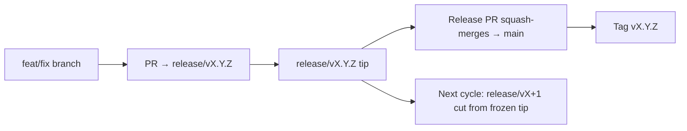

# Branching & Release Model (Hausa)

🌐 **Languages:** 🇺🇸 [English](../../../../ops/BRANCHING_MODEL.md) · 🇪🇹 [am](../../../am/docs/ops/BRANCHING_MODEL.md) · 🇸🇦 [ar](../../../ar/docs/ops/BRANCHING_MODEL.md) · 🇦🇿 [az](../../../az/docs/ops/BRANCHING_MODEL.md) · 🇧🇬 [bg](../../../bg/docs/ops/BRANCHING_MODEL.md) · 🇧🇩 [bn](../../../bn/docs/ops/BRANCHING_MODEL.md) · 🇧🇦 [bs](../../../bs/docs/ops/BRANCHING_MODEL.md) · 🇨🇿 [cs](../../../cs/docs/ops/BRANCHING_MODEL.md) · 🇩🇰 [da](../../../da/docs/ops/BRANCHING_MODEL.md) · 🇩🇪 [de](../../../de/docs/ops/BRANCHING_MODEL.md) · 🇬🇷 [el](../../../el/docs/ops/BRANCHING_MODEL.md) · 🇪🇸 [es](../../../es/docs/ops/BRANCHING_MODEL.md) · 🇪🇪 [et](../../../et/docs/ops/BRANCHING_MODEL.md) · 🇮🇷 [fa](../../../fa/docs/ops/BRANCHING_MODEL.md) · 🇫🇮 [fi](../../../fi/docs/ops/BRANCHING_MODEL.md) · 🇫🇷 [fr](../../../fr/docs/ops/BRANCHING_MODEL.md) · 🇮🇪 [ga](../../../ga/docs/ops/BRANCHING_MODEL.md) · 🇮🇳 [gu](../../../gu/docs/ops/BRANCHING_MODEL.md) · 🇮🇱 [he](../../../he/docs/ops/BRANCHING_MODEL.md) · 🇮🇳 [hi](../../../hi/docs/ops/BRANCHING_MODEL.md) · 🇭🇷 [hr](../../../hr/docs/ops/BRANCHING_MODEL.md) · 🇭🇺 [hu](../../../hu/docs/ops/BRANCHING_MODEL.md) · 🇦🇲 [hy](../../../hy/docs/ops/BRANCHING_MODEL.md) · 🇮🇩 [id](../../../id/docs/ops/BRANCHING_MODEL.md) · 🇳🇬 [ig](../../../ig/docs/ops/BRANCHING_MODEL.md) · 🇮🇹 [it](../../../it/docs/ops/BRANCHING_MODEL.md) · 🇯🇵 [ja](../../../ja/docs/ops/BRANCHING_MODEL.md) · 🇬🇪 [ka](../../../ka/docs/ops/BRANCHING_MODEL.md) · 🇰🇭 [km](../../../km/docs/ops/BRANCHING_MODEL.md) · 🇮🇳 [kn](../../../kn/docs/ops/BRANCHING_MODEL.md) · 🇰🇷 [ko](../../../ko/docs/ops/BRANCHING_MODEL.md) · 🇱🇹 [lt](../../../lt/docs/ops/BRANCHING_MODEL.md) · 🇱🇻 [lv](../../../lv/docs/ops/BRANCHING_MODEL.md) · 🇮🇳 [ml](../../../ml/docs/ops/BRANCHING_MODEL.md) · 🇮🇳 [mr](../../../mr/docs/ops/BRANCHING_MODEL.md) · 🇲🇾 [ms](../../../ms/docs/ops/BRANCHING_MODEL.md) · 🇲🇹 [mt](../../../mt/docs/ops/BRANCHING_MODEL.md) · 🇲🇲 [my](../../../my/docs/ops/BRANCHING_MODEL.md) · 🇳🇵 [ne](../../../ne/docs/ops/BRANCHING_MODEL.md) · 🇳🇱 [nl](../../../nl/docs/ops/BRANCHING_MODEL.md) · 🇳🇴 [no](../../../no/docs/ops/BRANCHING_MODEL.md) · 🇮🇳 [or](../../../or/docs/ops/BRANCHING_MODEL.md) · 🇮🇳 [pa](../../../pa/docs/ops/BRANCHING_MODEL.md) · 🇵🇭 [phi](../../../phi/docs/ops/BRANCHING_MODEL.md) · 🇵🇱 [pl](../../../pl/docs/ops/BRANCHING_MODEL.md) · 🇵🇹 [pt](../../../pt/docs/ops/BRANCHING_MODEL.md) · 🇧🇷 [pt-BR](../../../pt-BR/docs/ops/BRANCHING_MODEL.md) · 🇷🇴 [ro](../../../ro/docs/ops/BRANCHING_MODEL.md) · 🇷🇺 [ru](../../../ru/docs/ops/BRANCHING_MODEL.md) · 🇱🇰 [si](../../../si/docs/ops/BRANCHING_MODEL.md) · 🇸🇰 [sk](../../../sk/docs/ops/BRANCHING_MODEL.md) · 🇸🇮 [sl](../../../sl/docs/ops/BRANCHING_MODEL.md) · 🇷🇸 [sr](../../../sr/docs/ops/BRANCHING_MODEL.md) · 🇸🇪 [sv](../../../sv/docs/ops/BRANCHING_MODEL.md) · 🇰🇪 [sw](../../../sw/docs/ops/BRANCHING_MODEL.md) · 🇮🇳 [ta](../../../ta/docs/ops/BRANCHING_MODEL.md) · 🇮🇳 [te](../../../te/docs/ops/BRANCHING_MODEL.md) · 🇹🇭 [th](../../../th/docs/ops/BRANCHING_MODEL.md) · 🇹🇷 [tr](../../../tr/docs/ops/BRANCHING_MODEL.md) · 🇺🇦 [uk-UA](../../../uk-UA/docs/ops/BRANCHING_MODEL.md) · 🇵🇰 [ur](../../../ur/docs/ops/BRANCHING_MODEL.md) · 🇺🇿 [uz](../../../uz/docs/ops/BRANCHING_MODEL.md) · 🇻🇳 [vi](../../../vi/docs/ops/BRANCHING_MODEL.md) · 🇳🇬 [yo](../../../yo/docs/ops/BRANCHING_MODEL.md) · 🇨🇳 [zh-CN](../../../zh-CN/docs/ops/BRANCHING_MODEL.md) · 🇹🇼 [zh-TW](../../../zh-TW/docs/ops/BRANCHING_MODEL.md)

---

OmniRoute yana amfani da tsarin fitarwa na **zagayowar layi ɗaya**: reshen `release/vX.Y.Z`
na musamman don zagayowar da ake aiki a kai, `main` don layin da aka wallafa, da kuma alamar
`vX.Y.Z` marar canzawa lokacin da aka fitar da wannan zagayowar. Ganin ana shigar da commits a `release/*` _da kuma_ a
`main` abu ne da ake tsammani — ba ruɗani ba ne.

Cikakken bayani ga masu kula yana cikin `CLAUDE.md` (Doka Mai Tsauri #21) da
[RELEASE_CHECKLIST.md](./RELEASE_CHECKLIST.md). Wannan shafin shi ne taƙaitaccen bayani na jama'a
ga masu ba da gudummawa.

## A taƙaice

| Ref              | Matsayi                                                                                               |
| ---------------- | ----------------------------------------------------------------------------------------------------- |
| `release/vX.Y.Z` | **Zagayowar da ake aiki a kai** — ci gaban yau da kullum da haɗa PRs na wannan sigar                  |
| `main`           | **Layin da aka wallafa** — yana karɓar zagayowar ta hanyar squash-merge lokacin da aka fitar da sigar |
| `vX.Y.Z` (alama) | **Alamar fitarwa** — maƙallin “abin da aka fitar” marar canzawa da ake ƙirƙira lokacin fitarwa        |



## Wane reshe ya kamata PR nawa ya nufa?

**Ka nufi reshen `release/vX.Y.Z` da ake aiki a kai — ba `main` ba.**

1. Nemo reshen `release/v*` mafi girma da yake buɗe (misali a lokacin rubuta wannan:
   `release/v3.8.49`).
2. Ƙirƙiri reshe daga ƙarshensa (`git fetch` + checkout / rebase a kansa).
3. Buɗe PR ɗin da **base = wannan `release/vX.Y.Z`**.

`main` ba reshen haɗa ayyukan yau da kullum ba ne. PRs da aka buɗe zuwa `main`
galibi suna buƙatar a sauya musu reshen da suke nufi kafin haɗawa.

## Dakatar da fitarwa (zagayowar layi ɗaya)

Lokacin da ake daidaita fitarwa, ana buɗe issue mai alamar `release-freeze`.
Wannan **ba ya dakatar da ci gaba**:

- `release/vX.Y.Z` da aka daskarar mallakin jagoran fitarwar wannan sigar ne.
- Ana ƙirƙirar `release/vX+1` na zagayowar gaba daga ƙarshen da aka daskarar domin masu ba da gudummawa su ci gaba da
  shigar da ayyukansu.
- Ya kamata a **sauya inda** PRs da suke har yanzu nufin reshen da aka daskarar
  zuwa reshen `release/v*` da ake aiki a kai (mafi girma).

Bincika ko akwai freeze da yake buɗe kafin ka ɗauka cewa ana iya haɗawa cikin reshen da kake so:

```bash
gh issue list --repo diegosouzapw/OmniRoute --label release-freeze --state open
```

An bayyana tsarin haɗawa (alamar `queue` ta mai shi → Mergify) a cikin
[MERGE_TRAIN.md](./MERGE_TRAIN.md).

## Me ya sa ake da reshe da kuma alama?

| Abin da aka ƙirƙira | Tsawon rayuwa              | Manufa                                                                       |
| ------------------- | -------------------------- | ---------------------------------------------------------------------------- |
| `release/vX.Y.Z`    | Zagayowar da ake gudanarwa | Yana tattara PRs da aka duba, yana kasancewa CI-green, kuma shi ne tushen PR |
| Alamar `vX.Y.Z`     | Har abada                  | Tana nuna ainihin abin da aka fitar zuwa npm / GitHub Releases               |

Reshen shi ne wurin aiki; alamar kuma ita ce kunshin da aka rufe. Bayan squash-merge zuwa
`main`, zagayowar gaba yana ci gaba a `release/vX+1` ba tare da jiran PR na
fitarwar da ta gabata ya kammala ba.

## Takardu masu alaƙa

- [CONTRIBUTING.md](../../CONTRIBUTING.md) — saiti, gwaje-gwaje, jerin abubuwan dubawa na PR
- [RELEASE_CHECKLIST.md](./RELEASE_CHECKLIST.md) — tabbatarwa kafin fitarwa
- [MERGE_TRAIN.md](./MERGE_TRAIN.md) — jerin jiran haɗawa da tsarin haɗawa na madadin
- [RELEASE_GREEN.md](./RELEASE_GREEN.md) — kiyaye ƙarshen reshen fitarwa cikin yanayin nasarar gwaje-gwaje
