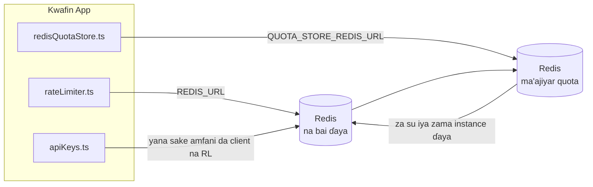

# Redis Production Configuration Guide (Hausa)

🌐 **Languages:** 🇺🇸 [English](../../../../ops/REDIS_PRODUCTION_CONFIG.md) · 🇪🇹 [am](../../../am/docs/ops/REDIS_PRODUCTION_CONFIG.md) · 🇸🇦 [ar](../../../ar/docs/ops/REDIS_PRODUCTION_CONFIG.md) · 🇦🇿 [az](../../../az/docs/ops/REDIS_PRODUCTION_CONFIG.md) · 🇧🇬 [bg](../../../bg/docs/ops/REDIS_PRODUCTION_CONFIG.md) · 🇧🇩 [bn](../../../bn/docs/ops/REDIS_PRODUCTION_CONFIG.md) · 🇧🇦 [bs](../../../bs/docs/ops/REDIS_PRODUCTION_CONFIG.md) · 🇨🇿 [cs](../../../cs/docs/ops/REDIS_PRODUCTION_CONFIG.md) · 🇩🇰 [da](../../../da/docs/ops/REDIS_PRODUCTION_CONFIG.md) · 🇩🇪 [de](../../../de/docs/ops/REDIS_PRODUCTION_CONFIG.md) · 🇬🇷 [el](../../../el/docs/ops/REDIS_PRODUCTION_CONFIG.md) · 🇪🇸 [es](../../../es/docs/ops/REDIS_PRODUCTION_CONFIG.md) · 🇪🇪 [et](../../../et/docs/ops/REDIS_PRODUCTION_CONFIG.md) · 🇮🇷 [fa](../../../fa/docs/ops/REDIS_PRODUCTION_CONFIG.md) · 🇫🇮 [fi](../../../fi/docs/ops/REDIS_PRODUCTION_CONFIG.md) · 🇫🇷 [fr](../../../fr/docs/ops/REDIS_PRODUCTION_CONFIG.md) · 🇮🇪 [ga](../../../ga/docs/ops/REDIS_PRODUCTION_CONFIG.md) · 🇮🇳 [gu](../../../gu/docs/ops/REDIS_PRODUCTION_CONFIG.md) · 🇮🇱 [he](../../../he/docs/ops/REDIS_PRODUCTION_CONFIG.md) · 🇮🇳 [hi](../../../hi/docs/ops/REDIS_PRODUCTION_CONFIG.md) · 🇭🇷 [hr](../../../hr/docs/ops/REDIS_PRODUCTION_CONFIG.md) · 🇭🇺 [hu](../../../hu/docs/ops/REDIS_PRODUCTION_CONFIG.md) · 🇦🇲 [hy](../../../hy/docs/ops/REDIS_PRODUCTION_CONFIG.md) · 🇮🇩 [id](../../../id/docs/ops/REDIS_PRODUCTION_CONFIG.md) · 🇳🇬 [ig](../../../ig/docs/ops/REDIS_PRODUCTION_CONFIG.md) · 🇮🇹 [it](../../../it/docs/ops/REDIS_PRODUCTION_CONFIG.md) · 🇯🇵 [ja](../../../ja/docs/ops/REDIS_PRODUCTION_CONFIG.md) · 🇬🇪 [ka](../../../ka/docs/ops/REDIS_PRODUCTION_CONFIG.md) · 🇰🇭 [km](../../../km/docs/ops/REDIS_PRODUCTION_CONFIG.md) · 🇮🇳 [kn](../../../kn/docs/ops/REDIS_PRODUCTION_CONFIG.md) · 🇰🇷 [ko](../../../ko/docs/ops/REDIS_PRODUCTION_CONFIG.md) · 🇱🇹 [lt](../../../lt/docs/ops/REDIS_PRODUCTION_CONFIG.md) · 🇱🇻 [lv](../../../lv/docs/ops/REDIS_PRODUCTION_CONFIG.md) · 🇮🇳 [ml](../../../ml/docs/ops/REDIS_PRODUCTION_CONFIG.md) · 🇮🇳 [mr](../../../mr/docs/ops/REDIS_PRODUCTION_CONFIG.md) · 🇲🇾 [ms](../../../ms/docs/ops/REDIS_PRODUCTION_CONFIG.md) · 🇲🇹 [mt](../../../mt/docs/ops/REDIS_PRODUCTION_CONFIG.md) · 🇲🇲 [my](../../../my/docs/ops/REDIS_PRODUCTION_CONFIG.md) · 🇳🇵 [ne](../../../ne/docs/ops/REDIS_PRODUCTION_CONFIG.md) · 🇳🇱 [nl](../../../nl/docs/ops/REDIS_PRODUCTION_CONFIG.md) · 🇳🇴 [no](../../../no/docs/ops/REDIS_PRODUCTION_CONFIG.md) · 🇮🇳 [or](../../../or/docs/ops/REDIS_PRODUCTION_CONFIG.md) · 🇮🇳 [pa](../../../pa/docs/ops/REDIS_PRODUCTION_CONFIG.md) · 🇵🇭 [phi](../../../phi/docs/ops/REDIS_PRODUCTION_CONFIG.md) · 🇵🇱 [pl](../../../pl/docs/ops/REDIS_PRODUCTION_CONFIG.md) · 🇵🇹 [pt](../../../pt/docs/ops/REDIS_PRODUCTION_CONFIG.md) · 🇧🇷 [pt-BR](../../../pt-BR/docs/ops/REDIS_PRODUCTION_CONFIG.md) · 🇷🇴 [ro](../../../ro/docs/ops/REDIS_PRODUCTION_CONFIG.md) · 🇷🇺 [ru](../../../ru/docs/ops/REDIS_PRODUCTION_CONFIG.md) · 🇱🇰 [si](../../../si/docs/ops/REDIS_PRODUCTION_CONFIG.md) · 🇸🇰 [sk](../../../sk/docs/ops/REDIS_PRODUCTION_CONFIG.md) · 🇸🇮 [sl](../../../sl/docs/ops/REDIS_PRODUCTION_CONFIG.md) · 🇷🇸 [sr](../../../sr/docs/ops/REDIS_PRODUCTION_CONFIG.md) · 🇸🇪 [sv](../../../sv/docs/ops/REDIS_PRODUCTION_CONFIG.md) · 🇰🇪 [sw](../../../sw/docs/ops/REDIS_PRODUCTION_CONFIG.md) · 🇮🇳 [ta](../../../ta/docs/ops/REDIS_PRODUCTION_CONFIG.md) · 🇮🇳 [te](../../../te/docs/ops/REDIS_PRODUCTION_CONFIG.md) · 🇹🇭 [th](../../../th/docs/ops/REDIS_PRODUCTION_CONFIG.md) · 🇹🇷 [tr](../../../tr/docs/ops/REDIS_PRODUCTION_CONFIG.md) · 🇺🇦 [uk-UA](../../../uk-UA/docs/ops/REDIS_PRODUCTION_CONFIG.md) · 🇵🇰 [ur](../../../ur/docs/ops/REDIS_PRODUCTION_CONFIG.md) · 🇺🇿 [uz](../../../uz/docs/ops/REDIS_PRODUCTION_CONFIG.md) · 🇻🇳 [vi](../../../vi/docs/ops/REDIS_PRODUCTION_CONFIG.md) · 🇳🇬 [yo](../../../yo/docs/ops/REDIS_PRODUCTION_CONFIG.md) · 🇨🇳 [zh-CN](../../../zh-CN/docs/ops/REDIS_PRODUCTION_CONFIG.md) · 🇹🇼 [zh-TW](../../../zh-TW/docs/ops/REDIS_PRODUCTION_CONFIG.md)

---

## Bayani Gabaɗaya

Redis wani **zaɓi ne, kuma dogaro ne mai sassauci** a cikin OmniRoute — manhajar tana ci gaba da aiki yadda ya kamata (ta amfani da
madadin ajiyar cikin ƙwaƙwalwa) idan Redis ba ya samuwa. A yanayin samarwa, daidaita Redis yana rage jinkiri ga nau'ikan
ayyuka huɗu:

| Nau'in aiki                | Mai tafiyarwa                 | Masana'antar Kliyanta                                           | Tsarin Maɓalli                                                               |
| -------------------------- | ----------------------------- | --------------------------------------------------------------- | ---------------------------------------------------------------------------- |
| Iyakance ƙimar buƙatu      | `rateLimiter.ts`              | `getRedisClient()` — singleton na `ioredis` mai jinkirin farawa | `<prefix>rl:*` tagogin iyakance ƙima na Lua masu aiki a matsayin raka'a ɗaya |
| Ma'ajiyar tantancewa       | `apiKeys.ts`                  | Yana sake amfani da kliyantar `rateLimiter`                     | `<prefix>auth:api_key:<sha256>` tare da TTL                                  |
| Ma'ajiyar ƙayyadadden kaso | `redisQuotaStore.ts`          | Singleton na `getRedisClient(url)` na daban                     | `<prefix>quota:*` mai iya daidaitawa ga kowane instance                      |
| Circuit breaker na warmup  | `redisCircuitBreakerStore.ts` | Kliyanta na daban a cikin `circuitBreakerFactory.ts`            | `<prefix>warmup:cb:<connectionId>`                                           |

Dukkan nau'ikan ayyukan huɗu suna amfani da prefix na namespace guda ɗaya domin OmniRoute ya iya kasancewa tare da sauran manhajoji a kan
instance ɗin Redis guda ɗaya (misali, `127.0.0.1:6379`). Duba [Rarraba Sunayen Maɓalli](#key-namespacing).

---

## Tsarin Yanzu (Ƙimar Tsoho ta Lamba)

| Saiti                              | Ƙima                                                                              | Wuri                                                                                  |
| ---------------------------------- | --------------------------------------------------------------------------------- | ------------------------------------------------------------------------------------- |
| env var na `REDIS_URL`             | `redis://redis:6379` (compose), na zaɓi                                           | `rateLimiter.ts:5`, `.env.example`                                                    |
| env var na `REDIS_KEY_PREFIX`      | `omniroute:` (tsoho)                                                              | `rateLimiter.ts`, `redisQuotaStore.ts`, `redisCircuitBreakerStore.ts`, `.env.example` |
| env var na `QUOTA_STORE_REDIS_URL` | na daban, zai iya bambanta da `REDIS_URL`                                         | `quota/storeFactory.ts`                                                               |
| `QUOTA_STORE_DRIVER`               | `"sqlite"` (tsoho), `"redis"` na zaɓi                                             | `quota/storeFactory.ts`                                                               |
| `maxRetriesPerRequest` na ioredis  | `3`                                                                               | ƙirƙirar kliyanta a `rateLimiter.ts`                                                  |
| `enableReadyCheck`                 | ba a saita ba (tsohon saitin ioredis: `true`)                                     | —                                                                                     |
| `lazyConnect`                      | ba a saita ba (tsohon saitin ioredis: `false`)                                    | —                                                                                     |
| `retryStrategy`                    | ba a saita ba (tsohon saitin ioredis: tushe na 200ms, yana ƙaruwa ta exponential) | —                                                                                     |
| TLS / kalmar sirri / fihirisar DB  | **ba a saita ba**                                                                 | —                                                                                     |
| Sentinel / Cluster                 | **ba a saita ba** — standalone mai node guda ɗaya kawai                           | —                                                                                     |

---

## Rarraba Sunayen Maɓalli

OmniRoute yana amfani da instance ɗin Redis tare da duk wani abu da ke gudana a kan host ɗin. Ba tare da namespace ba,
maɓallai kamar `auth:api_key:<sha256>` ko `rl:*` za su iya karo da maɓallan wasu manhajoji
masu amfani da Redis ɗin guda ɗaya (wannan instance ɗin yana gudanar da Redis a `127.0.0.1:6379` tare da sauran ayyuka).

Saita `REDIS_KEY_PREFIX` zuwa wani rubutu marar fanko domin saka prefix ga **kowane** maɓallin OmniRoute:

```bash
# .env — duk maɓallan OmniRoute za su zama omniroute:rl:*, omniroute:auth:*, omniroute:quota:*, omniroute:warmup:cb:*
REDIS_KEY_PREFIX=omniroute:
```

- **Tsoho:** `omniroute:` (ana amfani da shi idan ba a saita `REDIS_KEY_PREFIX` ba ko kuma babu komai a cikinsa).
- **Ana amfani da shi ga:** mai iyakance ƙimar buƙatu + ma'ajiyar tantancewa (kliyantar `ioredis` da ake rabawa ta hanyar `keyPrefix`) da kuma
  ma'ajiyar ƙayyadadden kaso (`KEY_PREFIX = "${REDIS_KEY_PREFIX}quota"`) da circuit breaker na warmup
  (`KEY_PREFIX = "${REDIS_KEY_PREFIX}warmup:cb:"`).
- **Canza prefix** yayin da maɓallai suka riga suka kasance a Redis yana barin tsoffin maɓallan ba tare da mai amfani da su ba (za su ƙare
  ta hanyar TTL / LRU). Ana iya canza shi lafiya; ba a buƙatar migration. Banda guda ɗaya shi ne maɓallin
  circuit-breaker na warmup na connection da aka yi wa alamar haramun: ana adana shi ba tare da TTL ba, saboda haka
  jera ragowar da `redis-cli --scan --pattern '<old-prefix>warmup:cb:*'` sannan a share su.
- **`keyPrefix` na ioredis** yana ƙara prefix ɗin kai tsaye yayin rubutawa **kuma** yana cire shi yayin karantawa,
  saboda haka lambar manhajar ba ta taɓa ganin prefix ɗin.

---

## Shawarwarin Daidaitawa don Yanayin Samarwa

### 1. Zaɓuɓɓukan Connection Pool / Client (mai-gina `Redis` na ioredis)

Lambar yanzu tana ƙirƙirar `new Redis(url)` guda ɗaya ba tare da zaɓuɓɓuka na musamman ba. Don turawa zuwa yanayin samarwa mai kwafi da yawa, shigar da client factory a cikin lambar ko kuma naɗe `getRedisClient()`:

```typescript
const redis = new Redis(REDIS_URL, {
  maxRetriesPerRequest: null, // babu iyakar sake gwadawa; bari retryStrategy ya yanke shawara
  enableReadyCheck: true, // tabbatar uwar garken ta shirya kafin karɓar kira
  lazyConnect: true, // kada a haɗa yayin ginawa; jira kiran farko
  retryStrategy: (times) => {
    if (times > 10) return null; // daina bayan sake gwadawa sau 10 → sake haɗawa daga baya
    return Math.min(times * 200, 5000); // 200ms, 400ms, …, iyakar 5s
  },
  enableAutoPipelining: true, // haɗa umarnin lokaci guda cikin rubutawar TCP guda ɗaya
  keepAlive: 10000, // TCP keep-alive kowane 10s
});
```

**Muhimman abubuwan da ake yin rangwame a kansu:**

- `maxRetriesPerRequest: null` + `retryStrategy` — an fi son wannan a yanayin samarwa domin sake farawa na Redis na ɗan lokaci kada ya sa kowace buƙata ta gaza nan take. Madadin da ke cikin ƙwaƙwalwa a cikin `checkRateLimit()` yana ɗaukar hanyar gazawar.
- `lazyConnect: true` — yana hana farawa dogaro da cewa Redis yana aiki kafin uwar garken ta fara karɓar haɗe-haɗe.
- `enableAutoPipelining: true` — yana rage tafiye-tafiyen sadarwa don binciken iyakar buƙata na lokaci guda; yana da amfani idan an haura 50 RPS a kan haɗi guda ɗaya.

### 2. Tsarin Uwar Garken Redis (`redis.conf`)

```
# Ƙwaƙwalwa
maxmemory 80%                        # bar sarari ga ma'ajiyar shafukan OS
maxmemory-policy allkeys-lru         # cire tsofaffin bayanan auth cache idan ƙwaƙwalwa ta yi ƙasa

# Adana bayanai (na zaɓi — OmniRoute yana da kariya daga rushewa ba tare da shi ba)
save 300 1                           # ɗauki snapshot aƙalla kowane minti 5 idan maɓalli ≥1 ya canza
appendonly no                        # ba a buƙatar AOF; ana iya sake samar da bayanan
appendfsync no                       # babu nauyin fsync (RDB ya isa)

# Hanyar sadarwa
timeout 0                            # babu katsewar haɗin da ba ya aiki
tcp-keepalive 300                    # keep-alive na minti 5
tcp-backlog 511                      # jerin jiran haɗi don cunkoson aiki na bazata

# Aiki
hz 10                                # tsohon ƙima; 100 don tsarin da ke kula da ƙarancin jinkiri
activedefrag yes                     # warware gutsuttsura ta atomatik idan fragmentation >10%
```

**Rangwamen da ke tattare da `maxmemory-policy allkeys-lru`:** Ana iya cire bayanan auth cache idan ƙwaƙwalwa ta yi ƙasa. Wannan ba shi da haɗari — `setCachedApiKey` koyaushe yana sake cike bayanan idan ba a same su ba, kuma madadin SQLite shi ne tushe na hukuma. Rubutun Lua na rate-limiter yana ƙirƙirar ƙananan maɓallai waɗanda aka tsara su su kasance na ɗan gajeren lokaci.

### 3. Saitunan Docker Compose

Compose na yanayin samarwa (`docker-compose.prod.yml`) yana amfani da `redis:8.6.2-alpine`. Ƙara:

```yaml
redis:
  image: redis:8.6.2-alpine
  command:
    [
      "redis-server",
      "--maxmemory",
      "512mb",
      "--maxmemory-policy",
      "allkeys-lru",
      "--activedefrag",
      "yes",
      "--save",
      "300 1",
    ]
  healthcheck:
    test: ["CMD", "redis-cli", "ping"]
    interval: 10s
    timeout: 3s
    retries: 3
    start_period: 5s
```

### 4. Abubuwan Lura don Multi‑Instance / Faɗaɗawa

**Redis guda ɗaya ga dukkan kwafi** — rubutun Lua na rate-limiter yana dogaro da sararin maɓallai guda ɗaya mai iko. Amfani da Redis instances da yawa a bayan kwafi zai kawar da atomicity kuma ya ninka kasafin. Yi amfani da Redis guda ɗaya (ko Redis Sentinel cluster mai failover) ga dukkan kwafin manhajar.

**Adadin haɗe-haɗe:** Kowane kwafin manhaja yana buɗe **haɗe-haɗen TCP guda 2** zuwa Redis (client na rate limiter + client na quota store). Idan akwai kwafi 10 → haɗe-haɗe 20, wanda yake ƙasa sosai da iyakar haɗe-haɗe 10k ta asali ta Redis instance.

### 5. Sa Ido

Bayyana ta endpoint na health-check:

```typescript
// src/app/api/monitoring/health/route.ts ya riga ya kira ayyukan rateLimiter
// Ƙara bincike na musamman ga Redis:
//   1. Jinkirin PING ta hanyar ioredis .ping()
//   2. Amfani da ƙwaƙwalwa ta hanyar INFO memory
//   3. Adadin haɗe-haɗe ta hanyar INFO clients
//   4. Adadin nasara na maxmemory-policy (evicted_keys / keyspace_hits)
```

Muhimman ma'aunan da za a sa ido a kansu:

- **Maɓallan da aka cire / daƙiƙa** — idan yana ci gaba da zama ba sifili ba, ƙara `maxmemory`
- **Clients da aka toshe** — ƙima da ba sifili ba tana nuna jinkirin rubutun Lua ko yawan gogayya
- **Haɗe-haɗen da aka ƙi** — an kai iyakar haɗe-haɗe; wannan ba kasafai yake faruwa ba a haɗe-haɗe 20

---

## Zanen Tsarin Gine-gine



---

## Manazarta

| Fayil                              | Manufa                                                                            |
| ---------------------------------- | --------------------------------------------------------------------------------- |
| `src/shared/utils/rateLimiter.ts`  | Babban client na Redis, skriptin iyakance ƙima na Lua, da madadin cikin ƙwaƙwalwa |
| `src/lib/db/apiKeys.ts`            | Ma'ajiyar wucin gadi ta tantancewa — madadin Redis→SQLite                         |
| `src/lib/quota/redisQuotaStore.ts` | Client na Redis daban don ma'ajiyar quota ta zaɓi                                 |
| `src/lib/quota/storeFactory.ts`    | Yana sauyawa tsakanin direbobin quota na `sqlite` da `redis`                      |
| `docker-compose.prod.yml`          | Kwantenan Redis na prod (image `redis:8.6.2-alpine`)                              |
| `.env.example`                     | Takardun bayanin env vars na Redis                                                |
| `src/app/api/local/redis/`         | Hanyoyin API don tsara tafiyar kwantenan dev                                      |
| `bin/cli/commands/redis.mjs`       | Umarnin CLI don tsara tafiyar kwantenan dev                                       |
