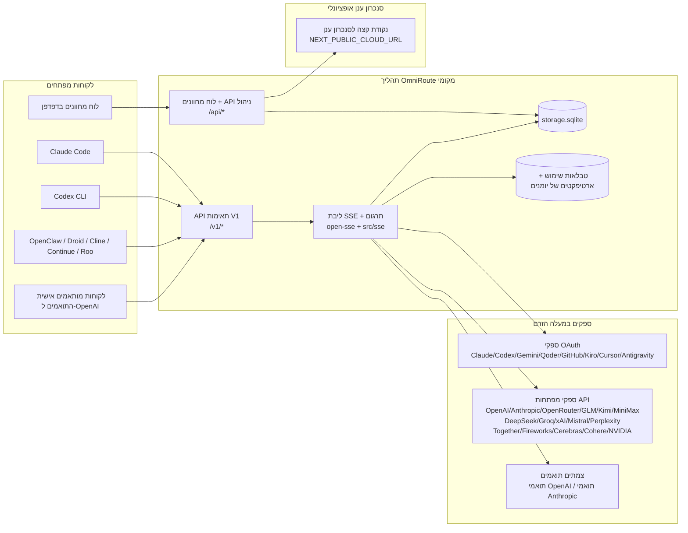
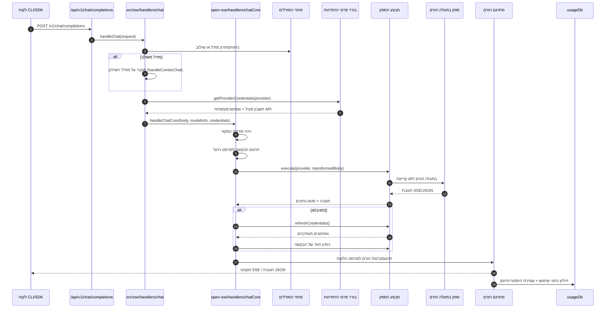
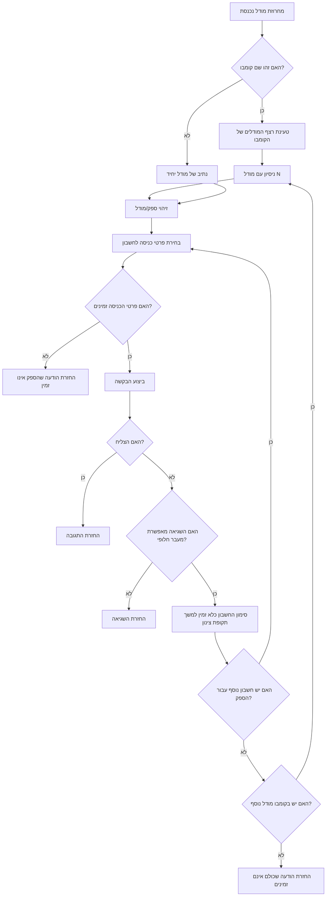
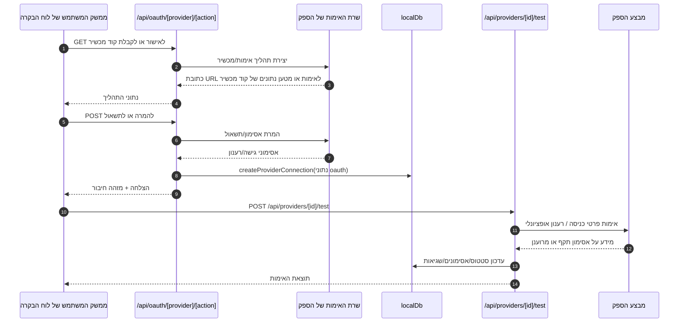
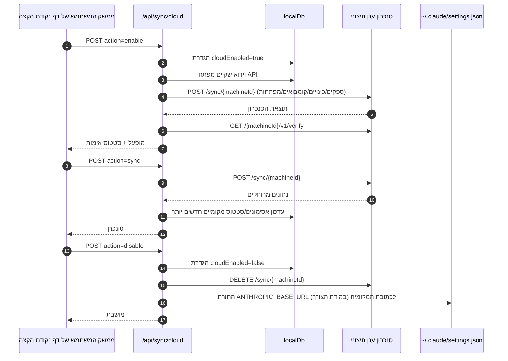
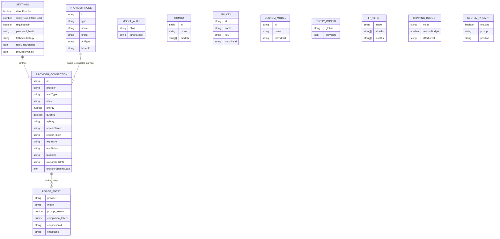
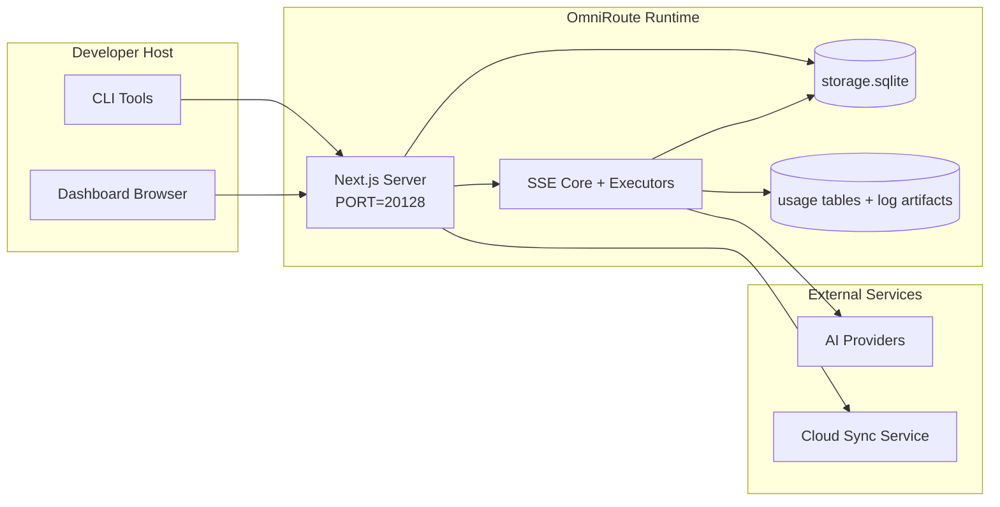

# OmniRoute Architecture (עברית)

🌐 **Languages:** 🇺🇸 [English](../../../../architecture/ARCHITECTURE.md) · 🇪🇹 [am](../../../am/docs/architecture/ARCHITECTURE.md) · 🇸🇦 [ar](../../../ar/docs/architecture/ARCHITECTURE.md) · 🇦🇿 [az](../../../az/docs/architecture/ARCHITECTURE.md) · 🇧🇬 [bg](../../../bg/docs/architecture/ARCHITECTURE.md) · 🇧🇩 [bn](../../../bn/docs/architecture/ARCHITECTURE.md) · 🇨🇿 [cs](../../../cs/docs/architecture/ARCHITECTURE.md) · 🇩🇰 [da](../../../da/docs/architecture/ARCHITECTURE.md) · 🇩🇪 [de](../../../de/docs/architecture/ARCHITECTURE.md) · 🇬🇷 [el](../../../el/docs/architecture/ARCHITECTURE.md) · 🇪🇸 [es](../../../es/docs/architecture/ARCHITECTURE.md) · 🇪🇪 [et](../../../et/docs/architecture/ARCHITECTURE.md) · 🇮🇷 [fa](../../../fa/docs/architecture/ARCHITECTURE.md) · 🇫🇮 [fi](../../../fi/docs/architecture/ARCHITECTURE.md) · 🇫🇷 [fr](../../../fr/docs/architecture/ARCHITECTURE.md) · 🇮🇪 [ga](../../../ga/docs/architecture/ARCHITECTURE.md) · 🇮🇳 [gu](../../../gu/docs/architecture/ARCHITECTURE.md) · 🇳🇬 [ha](../../../ha/docs/architecture/ARCHITECTURE.md) · 🇮🇳 [hi](../../../hi/docs/architecture/ARCHITECTURE.md) · 🇭🇷 [hr](../../../hr/docs/architecture/ARCHITECTURE.md) · 🇭🇺 [hu](../../../hu/docs/architecture/ARCHITECTURE.md) · 🇦🇲 [hy](../../../hy/docs/architecture/ARCHITECTURE.md) · 🇮🇩 [id](../../../id/docs/architecture/ARCHITECTURE.md) · 🇳🇬 [ig](../../../ig/docs/architecture/ARCHITECTURE.md) · 🇮🇹 [it](../../../it/docs/architecture/ARCHITECTURE.md) · 🇯🇵 [ja](../../../ja/docs/architecture/ARCHITECTURE.md) · 🇬🇪 [ka](../../../ka/docs/architecture/ARCHITECTURE.md) · 🇰🇭 [km](../../../km/docs/architecture/ARCHITECTURE.md) · 🇮🇳 [kn](../../../kn/docs/architecture/ARCHITECTURE.md) · 🇰🇷 [ko](../../../ko/docs/architecture/ARCHITECTURE.md) · 🇱🇹 [lt](../../../lt/docs/architecture/ARCHITECTURE.md) · 🇱🇻 [lv](../../../lv/docs/architecture/ARCHITECTURE.md) · 🇮🇳 [ml](../../../ml/docs/architecture/ARCHITECTURE.md) · 🇮🇳 [mr](../../../mr/docs/architecture/ARCHITECTURE.md) · 🇲🇾 [ms](../../../ms/docs/architecture/ARCHITECTURE.md) · 🇲🇹 [mt](../../../mt/docs/architecture/ARCHITECTURE.md) · 🇲🇲 [my](../../../my/docs/architecture/ARCHITECTURE.md) · 🇳🇵 [ne](../../../ne/docs/architecture/ARCHITECTURE.md) · 🇳🇱 [nl](../../../nl/docs/architecture/ARCHITECTURE.md) · 🇳🇴 [no](../../../no/docs/architecture/ARCHITECTURE.md) · 🇮🇳 [or](../../../or/docs/architecture/ARCHITECTURE.md) · 🇮🇳 [pa](../../../pa/docs/architecture/ARCHITECTURE.md) · 🇵🇭 [phi](../../../phi/docs/architecture/ARCHITECTURE.md) · 🇵🇱 [pl](../../../pl/docs/architecture/ARCHITECTURE.md) · 🇵🇹 [pt](../../../pt/docs/architecture/ARCHITECTURE.md) · 🇧🇷 [pt-BR](../../../pt-BR/docs/architecture/ARCHITECTURE.md) · 🇷🇴 [ro](../../../ro/docs/architecture/ARCHITECTURE.md) · 🇷🇺 [ru](../../../ru/docs/architecture/ARCHITECTURE.md) · 🇱🇰 [si](../../../si/docs/architecture/ARCHITECTURE.md) · 🇸🇰 [sk](../../../sk/docs/architecture/ARCHITECTURE.md) · 🇸🇮 [sl](../../../sl/docs/architecture/ARCHITECTURE.md) · 🇷🇸 [sr](../../../sr/docs/architecture/ARCHITECTURE.md) · 🇸🇪 [sv](../../../sv/docs/architecture/ARCHITECTURE.md) · 🇰🇪 [sw](../../../sw/docs/architecture/ARCHITECTURE.md) · 🇮🇳 [ta](../../../ta/docs/architecture/ARCHITECTURE.md) · 🇮🇳 [te](../../../te/docs/architecture/ARCHITECTURE.md) · 🇹🇭 [th](../../../th/docs/architecture/ARCHITECTURE.md) · 🇹🇷 [tr](../../../tr/docs/architecture/ARCHITECTURE.md) · 🇺🇦 [uk-UA](../../../uk-UA/docs/architecture/ARCHITECTURE.md) · 🇵🇰 [ur](../../../ur/docs/architecture/ARCHITECTURE.md) · 🇺🇿 [uz](../../../uz/docs/architecture/ARCHITECTURE.md) · 🇻🇳 [vi](../../../vi/docs/architecture/ARCHITECTURE.md) · 🇳🇬 [yo](../../../yo/docs/architecture/ARCHITECTURE.md) · 🇨🇳 [zh-CN](../../../zh-CN/docs/architecture/ARCHITECTURE.md) · 🇹🇼 [zh-TW](../../../zh-TW/docs/architecture/ARCHITECTURE.md)

---

🌐 **Languages:** 🇺🇸 [English](../../../../architecture/ARCHITECTURE.md) · 🇪🇹 [am](../../../am/docs/architecture/ARCHITECTURE.md) · 🇸🇦 [ar](../../../ar/docs/architecture/ARCHITECTURE.md) · 🇦🇿 [az](../../../az/docs/architecture/ARCHITECTURE.md) · 🇧🇬 [bg](../../../bg/docs/architecture/ARCHITECTURE.md) · 🇧🇩 [bn](../../../bn/docs/architecture/ARCHITECTURE.md) · 🇨🇿 [cs](../../../cs/docs/architecture/ARCHITECTURE.md) · 🇩🇰 [da](../../../da/docs/architecture/ARCHITECTURE.md) · 🇩🇪 [de](../../../de/docs/architecture/ARCHITECTURE.md) · 🇬🇷 [el](../../../el/docs/architecture/ARCHITECTURE.md) · 🇪🇸 [es](../../../es/docs/architecture/ARCHITECTURE.md) · 🇪🇪 [et](../../../et/docs/architecture/ARCHITECTURE.md) · 🇮🇷 [fa](../../../fa/docs/architecture/ARCHITECTURE.md) · 🇫🇮 [fi](../../../fi/docs/architecture/ARCHITECTURE.md) · 🇫🇷 [fr](../../../fr/docs/architecture/ARCHITECTURE.md) · 🇮🇪 [ga](../../../ga/docs/architecture/ARCHITECTURE.md) · 🇮🇳 [gu](../../../gu/docs/architecture/ARCHITECTURE.md) · 🇳🇬 [ha](../../../ha/docs/architecture/ARCHITECTURE.md) · 🇮🇳 [hi](../../../hi/docs/architecture/ARCHITECTURE.md) · 🇭🇷 [hr](../../../hr/docs/architecture/ARCHITECTURE.md) · 🇭🇺 [hu](../../../hu/docs/architecture/ARCHITECTURE.md) · 🇦🇲 [hy](../../../hy/docs/architecture/ARCHITECTURE.md) · 🇮🇩 [id](../../../id/docs/architecture/ARCHITECTURE.md) · 🇳🇬 [ig](../../../ig/docs/architecture/ARCHITECTURE.md) · 🇮🇹 [it](../../../it/docs/architecture/ARCHITECTURE.md) · 🇯🇵 [ja](../../../ja/docs/architecture/ARCHITECTURE.md) · 🇬🇪 [ka](../../../ka/docs/architecture/ARCHITECTURE.md) · 🇰🇭 [km](../../../km/docs/architecture/ARCHITECTURE.md) · 🇮🇳 [kn](../../../kn/docs/architecture/ARCHITECTURE.md) · 🇰🇷 [ko](../../../ko/docs/architecture/ARCHITECTURE.md) · 🇱🇹 [lt](../../../lt/docs/architecture/ARCHITECTURE.md) · 🇱🇻 [lv](../../../lv/docs/architecture/ARCHITECTURE.md) · 🇮🇳 [ml](../../../ml/docs/architecture/ARCHITECTURE.md) · 🇮🇳 [mr](../../../mr/docs/architecture/ARCHITECTURE.md) · 🇲🇾 [ms](../../../ms/docs/architecture/ARCHITECTURE.md) · 🇲🇹 [mt](../../../mt/docs/architecture/ARCHITECTURE.md) · 🇲🇲 [my](../../../my/docs/architecture/ARCHITECTURE.md) · 🇳🇵 [ne](../../../ne/docs/architecture/ARCHITECTURE.md) · 🇳🇱 [nl](../../../nl/docs/architecture/ARCHITECTURE.md) · 🇳🇴 [no](../../../no/docs/architecture/ARCHITECTURE.md) · 🇮🇳 [or](../../../or/docs/architecture/ARCHITECTURE.md) · 🇮🇳 [pa](../../../pa/docs/architecture/ARCHITECTURE.md) · 🇵🇭 [phi](../../../phi/docs/architecture/ARCHITECTURE.md) · 🇵🇱 [pl](../../../pl/docs/architecture/ARCHITECTURE.md) · 🇵🇹 [pt](../../../pt/docs/architecture/ARCHITECTURE.md) · 🇧🇷 [pt-BR](../../../pt-BR/docs/architecture/ARCHITECTURE.md) · 🇷🇴 [ro](../../../ro/docs/architecture/ARCHITECTURE.md) · 🇷🇺 [ru](../../../ru/docs/architecture/ARCHITECTURE.md) · 🇱🇰 [si](../../../si/docs/architecture/ARCHITECTURE.md) · 🇸🇰 [sk](../../../sk/docs/architecture/ARCHITECTURE.md) · 🇸🇮 [sl](../../../sl/docs/architecture/ARCHITECTURE.md) · 🇷🇸 [sr](../../../sr/docs/architecture/ARCHITECTURE.md) · 🇸🇪 [sv](../../../sv/docs/architecture/ARCHITECTURE.md) · 🇰🇪 [sw](../../../sw/docs/architecture/ARCHITECTURE.md) · 🇮🇳 [ta](../../../ta/docs/architecture/ARCHITECTURE.md) · 🇮🇳 [te](../../../te/docs/architecture/ARCHITECTURE.md) · 🇹🇭 [th](../../../th/docs/architecture/ARCHITECTURE.md) · 🇹🇷 [tr](../../../tr/docs/architecture/ARCHITECTURE.md) · 🇺🇦 [uk-UA](../../../uk-UA/docs/architecture/ARCHITECTURE.md) · 🇵🇰 [ur](../../../ur/docs/architecture/ARCHITECTURE.md) · 🇺🇿 [uz](../../../uz/docs/architecture/ARCHITECTURE.md) · 🇻🇳 [vi](../../../vi/docs/architecture/ARCHITECTURE.md) · 🇳🇬 [yo](../../../yo/docs/architecture/ARCHITECTURE.md) · 🇨🇳 [zh-CN](../../../zh-CN/docs/architecture/ARCHITECTURE.md) · 🇹🇼 [zh-TW](../../../zh-TW/docs/architecture/ARCHITECTURE.md)

_עודכן לאחרונה: 2026-06-28_

## תקציר מנהלים

OmniRoute הוא שער ניתוב AI מקומי ולוח מחוונים המבוססים על Next.js.
הוא מספק נקודת קצה יחידה התואמת ל-OpenAI (`/v1/*`) ומנתב תעבורה בין מספר ספקים במעלה הזרם, עם תרגום, מעבר לגיבוי, רענון אסימונים ומעקב אחר שימוש.

יכולות עיקריות:

- ממשק API תואם OpenAI עבור כלי CLI וכלים אחרים (355 ספקים, 108 מנגנוני ביצוע)
- תרגום בקשות/תגובות בין פורמטים של ספקים
- מעבר לגיבוי באמצעות שילוב מודלים (רצף מרובה-מודלים)
- שלבי שילוב מובְנים (`ספק + מודל + חיבור`) עם סידור בזמן ריצה לפי `compositeTiers`
- מעבר לגיבוי ברמת החשבון (מספר חשבונות לכל ספק)
- בדיקת מכסה מקדימה ובחירת חשבון P2C המתחשבת במכסה בנתיב הצ'אט הראשי
- ניהול חיבורי ספקים באמצעות OAuth ומפתחות API‏ (22 מודולי ספקי OAuth)
- יצירת הטמעות באמצעות `/v1/embeddings`‏ (18 ספקים)
- יצירת תמונות באמצעות `/v1/images/generations`‏ (10+ ספקים, 20+ מודלים)
- תמלול שמע באמצעות `/v1/audio/transcriptions`‏ (18 ספקים)
- המרת טקסט לדיבור באמצעות `/v1/audio/speech`‏ (24 ספקים מובנים)
- יצירת וידאו באמצעות `/v1/videos/generations`‏ (ComfyUI + SD WebUI)
- יצירת מוזיקה באמצעות `/v1/music/generations`‏ (ComfyUI)
- חיפוש באינטרנט באמצעות `/v1/search`‏ (20 ספקים)
- ניהול תוכן באמצעות `/v1/moderations`
- דירוג מחדש באמצעות `/v1/rerank`
- ניתוח תגיות חשיבה (`<think>...</think>`) עבור מודלי הסקה
- טיהור תגובות לצורך תאימות קפדנית ל-OpenAI SDK
- נרמול תפקידים (developer→system, system→user) לצורך תאימות בין ספקים
- המרת פלט מובנה (json_schema → Gemini responseSchema)
- אחסון מקומי עבור ספקים, מפתחות, כינויים, שילובים, הגדרות ותמחור (122 מודולי מסד נתונים)
- מעקב אחר שימוש/עלויות ורישום בקשות
- סנכרון ענן אופציונלי לצורך סנכרון מצב בין מספר מכשירים
- רשימת הרשאה/חסימה של כתובות IP לבקרת גישה ל-API
- ניהול תקציב חשיבה (העברה ישירה/אוטומטי/מותאם אישית/אדפטיבי)
- הזרקת הנחיית מערכת גלובלית
- מעקב אחר הפעלות וטביעת אצבע
- הגבלת קצב משופרת לכל חשבון, עם פרופילים ייעודיים לספקים
- תבנית מפסק זרם לשיפור עמידות הספקים
- הגנה מפני אפקט העדר הרועם באמצעות נעילת mutex
- מטמון למניעת כפילות בקשות המבוסס על חתימות
- שכבת תחום: כללי עלות, מדיניות מעבר לגיבוי, מדיניות נעילה
- Context Relay: סיכומי העברת הפעלה לשמירת רציפות בעת החלפת חשבונות
- התמדה של מצב התחום (מטמון SQLite בכתיבה מיידית עבור מעברים לגיבוי, תקציבים, נעילות ומפסקי זרם)
- מנוע מדיניות להערכה מרוכזת של בקשות (נעילה → תקציב → מעבר לגיבוי)
- טלמטריית בקשות עם צבירת זמני השהיה p50/p95/p99
- טלמטריית יעדי שילוב ונתוני בריאות היסטוריים של יעדי שילוב באמצעות `combo_execution_key` / `combo_step_id`
- מזהה מתאם (X-Request-Id) למעקב מקצה לקצה
- רישום ביקורת תאימות עם אפשרות ביטול לכל מפתח API
- מסגרת הערכה לאבטחת איכות של LLM
- לוח מחוונים לבריאות המערכת עם מצב מפסקי הזרם של הספקים בזמן אמת
- שרת MCP‏ (110 כלים) עם 3 תעבורות (stdio/SSE/Streamable HTTP)
- שרת A2A‏ (JSON-RPC 2.0 + SSE) עם מיומנויות ומחזור חיים של משימות
- מערכת זיכרון (חילוץ, הזרקה, אחזור, סיכום)
- מערכת מיומנויות (מרשם, מנגנון ביצוע, ארגז חול, מיומנויות מובנות)
- שרת proxy מסוג MITM עם ניהול אישורים וטיפול ב-DNS
- תוכנת תווכה להגנה מפני הזרקת הנחיות
- צינור עיבוד לדחיסת הנחיות עם Caveman, RTK, צינורות עיבוד מוערמים, שילובי דחיסה, חבילות שפה וניתוח נתונים
- מרשם ACP‏ (Agent Communication Protocol)
- ספקי OAuth מודולריים (22 מודולים נפרדים תחת `src/lib/oauth/providers/`)
- סקריפטים להסרה ולהסרה מלאה
- פעולת תיקון לסביבת OAuth
- גשר WebSocket עבור לקוחות WS תואמי OpenAI‏ (`/v1/ws`)
- ניהול אסימוני סנכרון (הנפקה/ביטול, הורדת חבילת תצורה מנוהלת גרסאות באמצעות ETag)
- הגדרת ספק מובנית מסוג GLM Thinking‏ (`glmt`)
- ספירת אסימונים היברידית (`/messages/count_tokens` בצד הספק, עם מעבר לגיבוי המבוסס על אומדן)
- אתחול אוטומטי של כינויי מודלים (30+ נרמולים של ניבי proxy שונים בעת ההפעלה)
- שליפה יוצאת בטוחה עם הגנת SSRF, חסימת כתובות URL פרטיות וניסיונות חוזרים הניתנים להגדרה
- ניסיונות צ'אט חוזרים המתחשבים בתקופת צינון, עם `requestRetry` ו-`maxRetryIntervalSec` הניתנים להגדרה
- אימות סביבת זמן הריצה באמצעות Zod בעת ההפעלה
- ביקורת תאימות v2 עם עימוד, אירועי CRUD של ספקים ורישום אימות של חסימות SSRF

מודל זמן הריצה העיקרי:

- נתיבי אפליקציית Next.js תחת `src/app/api/*` מממשים הן ממשקי API של לוח המחוונים והן ממשקי API לתאימות
- ליבת SSE/ניתוב משותפת ב-`src/sse/*` + `open-sse/*` מטפלת בהפעלת ספקים, בתרגום, בהזרמה, במעבר לגיבוי ובשימוש

## דיאגרמות עזר

מקורות Mermaid הקנוניים ומנוהלי-הגרסאות עבור פלטפורמת v3.8.0 נמצאים ב-
[`docs/diagrams/`](../diagrams/README.md). שניים מהם מוצגים שוב להלן לצורך התמצאות;
השאר מקושרים מהמדריכים הייעודיים לתחומים שלהם.


> מקור: [diagrams/request-pipeline.mmd](../diagrams/request-pipeline.mmd)


> מקור: [diagrams/resilience-3layers.mmd](../diagrams/resilience-3layers.mmd) — מקושר גם מתוך
> [RESILIENCE_GUIDE.md](./RESILIENCE_GUIDE.md) ומסמך העזר בנושא חוסן `CLAUDE.md`.

## היקף וגבולות

### כלול בהיקף

- סביבת הריצה של השער המקומי
- ממשקי API לניהול לוח הבקרה
- אימות מול ספקים ורענון אסימונים
- תרגום בקשות והזרמת SSE
- מצב מקומי + שמירת נתוני שימוש
- תזמור אופציונלי של סנכרון לענן

### מחוץ להיקף

- מימוש שירות הענן שמאחורי `NEXT_PUBLIC_CLOUD_URL`
- הסכם SLA/מישור בקרה של הספק מחוץ לתהליך המקומי
- קובצי ההפעלה החיצוניים של ממשקי ה-CLI עצמם (Claude CLI, Codex CLI וכו׳)

## ממשק לוח הבקרה (נוכחי)

העמודים הראשיים תחת `src/app/(dashboard)/dashboard/`:

- `/dashboard` — התחלה מהירה + סקירת ספקים
- `/dashboard/endpoint` — פרוקסי לנקודות קצה + MCP + A2A + לשוניות של נקודות קצה ב-API
- `/dashboard/providers` — חיבורי ספקים ופרטי גישה
- `/dashboard/combos` — אסטרטגיות שילוב, תבניות, בונה מבוסס-שלבים, כללי ניתוב מודלים וסדר ידני הנשמר באופן מתמשך
- `/dashboard/auto-combo` — מנוע Auto Combo: משקלי ניקוד, חבילות מצבים, הגדרות קבועות מראש למפעל וירטואלי וטלמטריה
- `/dashboard/costs` — צבירת עלויות ונראות תמחור
- `/dashboard/analytics` — ניתוח שימוש, הערכות ותקינות יעדי שילובים
- `/dashboard/limits` — בקרות מכסה/קצב
- `/dashboard/cli-tools` — קליטת CLI, זיהוי סביבת ריצה ויצירת תצורה
- `/dashboard/agents` — סוכני ACP שזוהו + רישום סוכנים מותאמים אישית
- `/dashboard/cloud-agents` — משימות סוכנים המתארחות בענן (Codex Cloud, Devin, Jules) ומחזור חיי המשימה
- `/dashboard/skills` — מרשם מיומנויות A2A, הרצה בארגז חול וקטלוג מיומנויות מובנות
- `/dashboard/memory` — בדיקה ואחזור של זיכרון שיחה מתמשך
- `/dashboard/webhooks` — מינויים ל-webhook יוצא, החלפת סודות ונתוני ניסיונות חוזרים
- `/dashboard/batch` — שליחת עבודות אצווה והתקדמותן
- `/dashboard/cache` — נתונים סטטיסטיים של מטמון לקריאה-דרך ומטמון הסקה, ובקרות פינוי
- `/dashboard/playground` — סביבת ניסוי אינטראקטיבית לצ׳אט מול כל שילוב/מודל מוגדר
- `/dashboard/changelog` — מציג יומן שינויים בתוך היישום (מרנדר את `CHANGELOG.md`)
- `/dashboard/system` — אבחון סביבת הריצה, פרטי גרסה וממשק לאימות הסביבה
- `/dashboard/onboarding` — אשף הגדרה להפעלה ראשונה עבור התקנות חדשות
- `/dashboard/media` — סביבת ניסוי לתמונות/וידאו/מוזיקה
- `/dashboard/search-tools` — בדיקת ספקי חיפוש והיסטוריה
- `/dashboard/health` — זמן פעילות, מפסקי זרם, מגבלות קצב והפעלות המנוטרות לפי מכסה
- `/dashboard/logs` — יומני בקשות/פרוקסי/ביקורת/מסוף
- `/dashboard/settings` — לשוניות הגדרות מערכת (כללי, ניתוב, ברירות מחדל לשילובים וכו׳)
- `/dashboard/context/caveman` — כללי דחיסה של Caveman, חבילות שפה, תצוגה מקדימה ומצב פלט
- `/dashboard/context/rtk` — מסנני פלט פקודות של RTK, תצוגה מקדימה והגדרות בטיחות בזמן ריצה
- `/dashboard/context/combos` — צינורות דחיסה בעלי שם המוקצים לשילובי ניתוב
- `/dashboard/translator` — בדיקת המתרגם ותצוגה מקדימה של המרת פורמט בקשות
- `/dashboard/audit` — דפדפן יומן ביקורת תאימות עם עימוד ומטא-נתונים מובנים
- `/dashboard/usage` — דפדפן שימוש לפי בקשה המקושר אל `usage_history`
- `/dashboard/compression` — ניתוחי דחיסה, נתונים סטטיסטיים והקצאת צינורות עיבוד
- `/dashboard/api-manager` — מחזור החיים של מפתחות API והרשאות מודלים

## הקשר מערכת ברמה גבוהה



## רכיבי זמן הריצה המרכזיים

## 1) שכבת API וניתוב (נתיבי אפליקציה של Next.js)

תיקיות עיקריות:

- `src/app/api/v1/*` ו-`src/app/api/v1beta/*` עבור ממשקי API לתאימות
- `src/app/api/*` עבור ממשקי API לניהול ולהגדרות
- כללי השכתוב של Next בקובץ `next.config.mjs` ממפים את `/v1/*` אל `/api/v1/*`

נתיבי תאימות חשובים:

- `src/app/api/v1/chat/completions/route.ts`
- `src/app/api/v1/messages/route.ts`
- `src/app/api/v1/responses/route.ts`
- `src/app/api/v1/models/route.ts` — כולל מודלים מותאמים אישית עם `custom: true`
- `src/app/api/v1/embeddings/route.ts` — יצירת הטמעות (6 ספקים)
- `src/app/api/v1/images/generations/route.ts` — יצירת תמונות (4 ספקים ומעלה, כולל Antigravity/Nebius)
- `src/app/api/v1/messages/count_tokens/route.ts`
- `src/app/api/v1/providers/[provider]/chat/completions/route.ts` — צ'אט ייעודי לכל ספק
- `src/app/api/v1/providers/[provider]/embeddings/route.ts` — הטמעות ייעודיות לכל ספק
- `src/app/api/v1/providers/[provider]/images/generations/route.ts` — תמונות ייעודיות לכל ספק
- `src/app/api/v1beta/models/route.ts`
- `src/app/api/v1beta/models/[...path]/route.ts`

תחומי ניהול:

- אימות/הגדרות: `src/app/api/auth/*`, `src/app/api/settings/*`
- ספקים/חיבורים: `src/app/api/providers*`
- צומתי ספקים: `src/app/api/provider-nodes*`
- מודלים מותאמים אישית: `src/app/api/provider-models` (GET/POST/DELETE)
- קטלוג מודלים: `src/app/api/models/route.ts` (GET)
- תצורת Proxy: `src/app/api/settings/proxy` (GET/PUT/DELETE) + `src/app/api/settings/proxy/test` (POST)
- OAuth: `src/app/api/oauth/*`
- מפתחות/כינויים/שילובים/תמחור: `src/app/api/keys*`, `src/app/api/models/alias`, `src/app/api/combos*`, `src/app/api/pricing`
- שימוש: `src/app/api/usage/*`
- סנכרון/ענן: `src/app/api/sync/*`, `src/app/api/cloud/*`
- כלי עזר עבור כלי CLI: `src/app/api/cli-tools/*`
- מסנן IP: `src/app/api/settings/ip-filter` (GET/PUT)
- תקציב חשיבה: `src/app/api/settings/thinking-budget` (GET/PUT)
- הנחיית מערכת: `src/app/api/settings/system-prompt` (GET/PUT)
- דחיסה: `src/app/api/settings/compression`, `src/app/api/compression/*`, וכן
  `src/app/api/context/*`
- הפעלות: `src/app/api/sessions` (GET)
- מגבלות קצב: `src/app/api/rate-limits` (GET)
- עמידות: `src/app/api/resilience` (GET/PATCH) — תור בקשות, תקופת צינון לחיבורים, מפסק ספקים ותצורת המתנה לסיום תקופת הצינון
- איפוס עמידות: `src/app/api/resilience/reset` (POST) — איפוס מפסקי ספקים
- נתוני מטמון: `src/app/api/cache/stats` (GET/DELETE)
- טלמטריה: `src/app/api/telemetry/summary` (GET)
- תקציב: `src/app/api/usage/budget` (GET/POST)
- שרשראות גיבוי: `src/app/api/fallback/chains` (GET/POST/DELETE)
- ביקורת תאימות: `src/app/api/compliance/audit-log` (GET, עם עימוד + מטא-נתונים מובנים)
- הערכות: `src/app/api/evals` (GET/POST), `src/app/api/evals/[suiteId]` (GET)
- מדיניות: `src/app/api/policies` (GET/POST)
- אסימוני סנכרון: `src/app/api/sync/tokens` (GET/POST), `src/app/api/sync/tokens/[id]` (GET/DELETE)
- חבילת תצורה: `src/app/api/sync/bundle` (GET, תמונת מצב של הגדרות/ספקים/שילובים/מפתחות עם ניהול גרסאות באמצעות ETag)
- WebSocket: `src/app/api/v1/ws/route.ts` — מטפל Upgrade עבור לקוחות WS התואמים ל-OpenAI

## 2) SSE + ליבת התרגום

מודולי הזרימה הראשית:

- נקודת כניסה: `src/sse/handlers/chat.ts`
- תזמור הליבה: `open-sse/handlers/chatCore.ts`
- מתאמי הפעלה לספקים: `open-sse/executors/*`
- זיהוי פורמט/הגדרת ספק: `open-sse/services/provider.ts`
- ניתוח/פתרון מודל: `src/sse/services/model.ts`, `open-sse/services/model.ts`
- לוגיקת מעבר לחשבון חלופי: `open-sse/services/accountFallback.ts`
- מרשם התרגום: `open-sse/translator/index.ts`
- התמרות זרם: `open-sse/utils/stream.ts`, `open-sse/utils/streamHandler.ts`
- חילוץ/נרמול שימוש: `open-sse/utils/usageTracking.ts`
- מנתח תגיות חשיבה: `open-sse/utils/thinkTagParser.ts`
- מטפל בהטמעות: `open-sse/handlers/embeddings.ts`
- מרשם ספקי ההטמעות: `open-sse/config/embeddingRegistry.ts`
- מטפל ביצירת תמונות: `open-sse/handlers/imageGeneration.ts`
- מרשם ספקי התמונות: `open-sse/config/imageRegistry.ts`
- טיהור תגובות: `open-sse/handlers/responseSanitizer.ts`
- נרמול תפקידים: `open-sse/services/roleNormalizer.ts`

שירותים (לוגיקה עסקית):

- בחירת חשבונות וניקודם: `open-sse/services/accountSelector.ts`
- ניהול מחזור החיים של ההקשר: `open-sse/services/contextManager.ts`
- אכיפת מסנן IP: `open-sse/services/ipFilter.ts`
- מעקב אחר הפעלות: `open-sse/services/sessionManager.ts`
- מניעת כפילויות בבקשות: `open-sse/services/signatureCache.ts`
- הזרקת הנחיית מערכת: `open-sse/services/systemPrompt.ts`
- ניהול תקציב חשיבה: `open-sse/services/thinkingBudget.ts`
- ניתוב מודלים באמצעות תווים כלליים: `open-sse/services/wildcardRouter.ts`
- ניהול מגבלות קצב: `open-sse/services/rateLimitManager.ts`
- מפסק מעגל: `src/shared/utils/circuitBreaker.ts`
- העברת הקשר: `open-sse/services/contextHandoff.ts` — יצירה והזרקה של סיכום העברה עבור אסטרטגיית ממסר הקשר
- דחיסה: `open-sse/services/compression/*` — דחיסה יזומה לפני התרגום לספק;
  כוללת כללי Caveman, מסנני RTK, צינורות עיבוד מוערמים, שילובי דחיסה, נתונים סטטיסטיים ואימות
- מאחזר מכסת Codex: `open-sse/services/codexQuotaFetcher.ts` — מאחזר את מכסת Codex לצורך החלטות העברת ממסר הקשר
- ניסיון חוזר המתחשב בזמן צינון: `src/sse/services/cooldownAwareRetry.ts` — ניסיונות חוזרים לפי מודל ובכפוף לזמן צינון, עם `requestRetry` / `maxRetryIntervalSec` הניתנים להגדרה
- שליחה יוצאת בטוחה: `src/shared/network/safeOutboundFetch.ts` — שליפה מוגנת מספק/מודל עם הגנת SSRF, חסימת כתובות URL פרטיות, ניסיון חוזר ופסק זמן
- מנגנון הגנה על כתובות URL יוצאות: `src/shared/network/outboundUrlGuard.ts` — מאמת כתובות URL של ספקים מול טווחי CIDR פרטיים/מקומיים
- ברירות מחדל לבקשות ספק: `open-sse/services/providerRequestDefaults.ts` — ברירות מחדל ברמת הספק עבור `maxTokens`, `temperature`, `thinkingBudgetTokens`
- קבועי ספק GLM: `open-sse/config/glmProvider.ts` — מודלי GLM משותפים, כתובות URL של מכסות, פסק זמן וברירות מחדל של GLMT
- שירות Antigravity במעלה הזרם: `open-sse/config/antigravityUpstream.ts` — כתובת URL בסיסית וקבועים של נתיב הגילוי
- קבועי לקוח Codex: `open-sse/config/codexClient.ts` — ערכי סוכן משתמש וגרסת לקוח הכוללים גרסה
- אתחול כינויי מודלים: `src/lib/modelAliasSeed.ts` — מאתחל בעת ההפעלה יותר מ־30 כינויים בין ניבים של שרתי Proxy

מודולי שכבת התחום:

- כללי עלות/תקציבים: `src/domain/costRules.ts`
- מדיניות חלופה: `src/domain/fallbackPolicy.ts`
- פותר שילובים: `src/domain/comboResolver.ts`
- מדיניות נעילה: `src/domain/lockoutPolicy.ts`
- מנוע מדיניות: `src/domain/policyEngine.ts` — הערכה מרכזית של נעילה ← תקציב ← חלופה
- קטלוג קודי שגיאה: `src/shared/constants/errorCodes.ts`
- מזהה בקשה: `src/shared/utils/requestId.ts`
- פסק זמן לשליפה: `src/shared/utils/fetchTimeout.ts`
- טלמטריית בקשות: `src/shared/utils/requestTelemetry.ts`
- תאימות/ביקורת: `src/lib/compliance/index.ts`
- מריץ הערכות: `src/lib/evals/evalRunner.ts`
- שמירת מצב התחום: `src/lib/db/domainState.ts` — פעולות CRUD של SQLite עבור שרשראות חלופה, תקציבים, היסטוריית עלויות, מצב נעילה ומפסקי מעגל

מודולי ספקי OAuth (‏22 קבצים נפרדים תחת `src/lib/oauth/providers/`):

- אינדקס המרשם: `src/lib/oauth/providers/index.ts`
- ספקים נפרדים: `agy.ts`, `antigravity.ts`, `claude.ts`, `cline.ts`, `codebuddy-cn.ts`, `codex.ts`, `cursor.ts`, `devin-desktop.ts`, `ghe-copilot.ts`, `github.ts`, `gitlab-duo.ts`, `grok-cli-oauth.ts`, `grok-cli.ts`, `kilocode.ts`, `kimi-coding.ts`, `kiro.ts`, `openference.ts`, `qoder.ts`, `trae.ts`, `xai-oauth.ts`, `zed-hosted.ts`, `zed.ts`
- מעטפת דקה: `src/lib/oauth/providers.ts` — מייצאת מחדש מהמודולים הנפרדים

## 5) שירותים מוטמעים (v3.8.4)

OmniRoute יכול להתקין, לפקח ולנתב אל תהליכי כלי AI הפועלים באופן מקומי,
הנקראים **שירותים מוטמעים**. חמישה מהם כלולים: 9Router, CLIProxyAPI, Bifrost, Mux ו-Dario.

שכבות הארכיטקטורה:

- **ממשק משתמש** (`/dashboard/providers/services`) — עמוד בעל שתי לשוניות עם פקדים לניהול מחזור החיים,
  הזרמת יומנים בזמן אמת, ניהול מפתחות API, ו-(עבור 9Router) ממשק משתמש מקורי מוטמע באמצעות
  reverse proxy פנימי.
- **API** (`/api/services/{name}/*`) — 11 נקודות קצה עבור 9Router, 10 עבור CLIProxyAPI, ו-8 עבור כל אחד מ-Bifrost / Mux / Dario,
  כולן מסווגות כ-**LOCAL_ONLY** (כלל קשיח #17). נקודת קצה משותפת מסוג `GET /api/services/[name]/logs`
  ב-SSE משרתת את שני השירותים.
- **מפקח** (`src/lib/services/`) — המחלקה הגנרית `ServiceSupervisor` עוטפת את
  `child_process.spawn`, מחזיקה מאגר טבעתי בגודל 5 MB להזרמת יומני SSE, לולאת
  בדיקות תקינות, נעילת פעולות אטומית וכיבוי הדרגתי מסוג SIGTERM→SIGKILL.
  הקובץ `bootstrap.ts` מחבר את כל השירותים שהוגדרו בעת הפעלת התהליך.
- **ספק/מבצע** (`open-sse/executors/ninerouter.ts`) — 9Router נחשף
  כספק אמיתי. למודלים מתווספת הקידומת `9router/{sub}/{model}`, והם מסונכרנים כל 5 דקות
  מנקודת הקצה `/v1/models` של 9Router.

העמקה: `docs/frameworks/EMBEDDED-SERVICES.md`

## תתי-מערכות מרכזיות (v3.8.0)

### A. מנוע Auto Combo

Auto Combo מדרג ובוחר באופן דינמי יעדי ניתוב בזמן הבקשה, במקום
להסתמך על הגדרת combo סטטית. הוא מפעיל את משפחת קידומות המודלים `auto/*`.

- נקודת הכניסה למנוע: `open-sse/services/autoCombo/` (`autoComboEngine.ts`,
  `scoringEngine.ts`, `virtualFactory.ts`, `modePacks.ts`)
- פותר: `src/domain/comboResolver.ts` (זיהוי אוטומטי של הקידומת `auto/`)
- לוח מחוונים: `/dashboard/auto-combo`
- טלמטריה: טבלת SQLite בשם `auto_combo_decisions`

יכולות עיקריות:

- **19 אסטרטגיות ניתוב** (עדיפות, משוקללת, מילוי ראשון, round-robin, ‏P2C, אקראית,
  הכי פחות בשימוש, מיטוב עלויות, מודעות לאיפוס, חלון איפוס, מרווח פנוי, אקראיות קשיחה,
  **auto**, ‏lkgp, מיטוב הקשר, ממסר הקשר, **fusion**, וכן נתיב fallback) —
  auto היא התוספת המרכזית ב-v3.8.0; ‏`fusion` (פיצול למספר חברי פאנל + סינתזה בידי שופט,
  `open-sse/services/fusion.ts`) חדשה ב-v3.8.36.
- **דירוג לפי 16 גורמים**: מכסה, תקינות, עלות הפוכה, השהיה הפוכה, התאמה למשימה
  ועוד עשרה. הטבלה הקנונית של הגורמים ומשקלי ברירת המחדל שלהם נמצאת ב-
  [`docs/routing/AUTO-COMBO.md`](../routing/AUTO-COMBO.md) — הצגתה מחדש כאן
  תיצור מקום נוסף שבו היא עלולה להתיישן.
- **מפעל וירטואלי** מממש combos זמניים כאשר לא קיים combo בעל שם תואם,
  תוך בחירת מועמדים מחיבורי ספקים פעילים ותקינים.
- **קידומות Auto**: `auto/coding`, `auto/cheap`, `auto/fast`, `auto/offline`,
  `auto/smart`, `auto/lkgp` — כל אחת מגובה בפרופיל משקלים מכוונן.
- **6 חבילות מצבים**: `ship-fast`, `cost-saver`, `quality-first`, `offline-friendly`,
  `reliability-first` ו-`chaos-mode` — תצורות משקלים מוגדרות מראש שניתן להפעיל
  מלוח המחוונים. (אין לבלבל ביניהן לבין קידומות `auto/*` לעיל, שהן
  וריאנטים הפועלים בזמן הבקשה.)

לפרטים אלגוריתמיים מלאים (נוסחאות הגורמים, כוונון משקלים), ראו
[`docs/routing/AUTO-COMBO.md`](../routing/AUTO-COMBO.md).

### B. סוכני ענן

Cloud Agents עוטף פלטפורמות צד שלישי לסוכני קוד מתארחים (Codex Cloud, Devin,
Jules) מאחורי מחזור חיים אחיד של משימות המגובה במסד נתונים. כל נקודות הקצה ליצירה/בדיקה
של משימות דורשות אימות ניהולי.

- שורש המודול: `src/lib/cloudAgent/` (`baseAgent.ts`, `registry.ts`, `api.ts`,
  `types.ts`, `db.ts`, וכן תיקיות משנה לכל סוכן תחת `agents/`)
- מימושים לכל סוכן: `agents/codex/`, `agents/devin/`, `agents/jules/`
- נקודות קצה ציבוריות: `/api/v1/agents/tasks/*` (הצגה/יצירה/קבלה/ביטול)
- נקודות קצה ניהוליות: `/api/cloud/*` (הקצאה, מצב, אצווה)
- לוח מחוונים: `/dashboard/cloud-agents`
- אחסון: הטבלה `cloud_agent_tasks`

לפרטי הקצאה ו-OAuth עבור כל סוכן, ראו
[`docs/frameworks/CLOUD_AGENT.md`](../frameworks/CLOUD_AGENT.md).

### C. מנגנוני הגנה

מודול מנגנוני ההגנה הוא שכבת middleware הניתנת לטעינה מחדש בזמן אמת, הבודקת בקשות
ותגובות לאיתור PII, הזרקת prompt ותוכן חזותי בלתי בטוח. הפרות
עוצרות את הבקשה באופן מיידי עם HTTP **503** ובצירוף קוד שגיאה מובנה, וכך מאפשרות
לגורמים הקוראים בהמשך לנסות שוב או להתפצל למסלול אחר.

- שורש המודול: `src/lib/guardrails/` (`base.ts`, `registry.ts`, `piiMasker.ts`,
  `promptInjection.ts`, `visionBridge.ts`, `visionBridgeHelpers.ts`)
- טעינה מחדש בזמן אמת: ה-registry עוקב אחר שינויי תצורה ובונה מחדש את השרשרת במקום
- נקודות חיבור: כניסת מטפל הצ'אט, מטפל ביצירת תמונות, מנקה התגובות
- חוזה HTTP: הפרות מוצגות כ-`503` עם `error.code = "GUARDRAIL_VIOLATION"`

ליצירת ערכות כללים ולכוונון ספים, ראו
[`docs/security/GUARDRAILS.md`](../security/GUARDRAILS.md).

### D. שכבת הדומיין

מרחב השמות `src/domain/` מרכז החלטות מדיניות, כדי שמטפלי נתיבים לא
יצטרכו להרכיב בעצמם לוגיקה של נעילה/תקציב/fallback.

- מנוע מדיניות: `src/domain/policyEngine.ts` — נקודת כניסה יחידה
  להערכה לפני ביצוע (סדר נעילה → תקציב → fallback)
- כללי עלות: `src/domain/costRules.ts`
- מדיניות fallback: `src/domain/fallbackPolicy.ts`
- מדיניות נעילה: `src/domain/lockoutPolicy.ts`
- ניתוב מבוסס תגיות: `src/domain/tagRouter.ts`
- פותר combo: `src/domain/comboResolver.ts` — פותר שמות combo, קידומות auto/\*
  ויעדי מודלים עם תווים כלליים לכדי תוכניות ביצוע קונקרטיות
- מצרף כללי חיבור/מודל: `src/domain/connectionModelRules.ts`
- תמונות מצב של זמינות מודלים: `src/domain/modelAvailability.ts`
- מעקב תפוגת ספקים: `src/domain/providerExpiration.ts`
- מטמון מכסות: `src/domain/quotaCache.ts`
- מצב הידרדרות: `src/domain/degradation.ts`
- ביקורת תצורה: `src/domain/configAudit.ts`
- בונה מטא-נתונים לתגובות OmniRoute: `src/domain/omnirouteResponseMeta.ts`
- תת-מערכת הערכה: `src/domain/assessment/` — משימות הערכה תקופתיות

### E. צינור הרשאות

מחלקת צינור ההרשאה מסווגת כל בקשה נכנסת ומחילה את שרשרת
המדיניות המתאימה לפני הניתוב.

- נקודת הכניסה לצינור: `src/server/authz/pipeline.ts`
- מסווג הבקשות: `src/server/authz/classify.ts` — מבחין בין נתיבי
  תאימות ציבוריים לבין נתיבי ניהול
- רשימת הנתיבים הציבוריים: `src/shared/constants/publicApiRoutes.ts`
- כללי מדיניות: `src/server/authz/policies/` — פרדיקטים הניתנים להרכבה
  (`requireApiKey`, `requireManagement`, `requireFreshAuth` וכו׳)
- כלי עזר לכותרות: `src/server/authz/headers.ts`
- כלי עזר לאימות הנחה: `src/server/authz/assertAuth.ts`
- הקשר הבקשה: `src/server/authz/context.ts`

הנתיבים הציבוריים ונתיבי הניהול מופרדים בגבול קשיח: ממשקי API של סוכנים/השהיה
ושינויי ספקים דורשים הרשאת ניהול (HTTP 401 אם היא חסרה).

לכללי סיווג הנתיבים המלאים, ראו
[`docs/architecture/AUTHZ_GUIDE.md`](./AUTHZ_GUIDE.md).

### F. מכונת המצבים של תהליך העבודה ונתב מודע-משימות

נתב המונע בידי מכונת מצבים סופית וממוקם מעל בחירת השילובים, כדי לנתב
תעבורה על סמך השלב שזוהה בתהליך העבודה (תכנון, ביצוע,
סקירה) והזיקה למשימות רקע.

- מכונת המצבים של תהליך העבודה: `open-sse/services/workflowFSM.ts`
- נתב מודע-משימות: `open-sse/services/taskAwareRouter.ts`
- מזהה משימות רקע: `open-sse/services/backgroundTaskDetector.ts`
- מסווג כוונות: `open-sse/services/intentClassifier.ts`

המעברים במכונת המצבים מוזנים למנגנון הניקוד של Auto Combo, תוך העדפת מודלים זולים יותר
למשימות רקע/אוטומציה ומודלים חזקים יותר לסבבי
תכנון/סקירה אינטראקטיביים.

### G. עמידות ייעודית לספקים

כמה ספקים כוללים מודולים ייעודיים לעמידות ולהסוואה, הנסמכים על
השכבות הגלובליות של מפסק המעגל / השהיית החיבור / נעילת המודל:

- מנוע 429 של Antigravity: `open-sse/services/antigravity429Engine.ts` (מבצע רוטציה
  של הזהות, מנקה כותרות תגובה ומנהל מעקב אחר קרדיטים/גרסה באמצעות
  `antigravityCredits.ts`, `antigravityHeaderScrub.ts`, `antigravityHeaders.ts`,
  `antigravityIdentity.ts`, `antigravityVersion.ts`)
- מדיניות המכסה של ModelScope: `open-sse/services/modelscopePolicy.ts`
- CCH של Claude Code (לחיצת יד בערוץ תאימות): `open-sse/services/claudeCodeCCH.ts`,
  וכן `claudeCodeCompatible.ts`, `claudeCodeConstraints.ts`, `claudeCodeExtraRemap.ts`,
  `claudeCodeToolRemapper.ts`
- עיצוב טביעת האצבע של Claude Code: `open-sse/services/claudeCodeFingerprint.ts`
- ערפול Claude Code: `open-sse/services/claudeCodeObfuscation.ts`

למדריך ההסוואה המלא ולהנחיות התפעוליות, ראו
`docs/security/STEALTH_GUIDE.md` (ב-git; אינו נכלל בקומפילציה אל `/docs`).

### H. Webhooks, מטמון הסקה, מטמון קריאה

- **Webhooks** — שיגור יוצא של אירועי ספקים/חשבונות/משימות.
  - משגר: `src/lib/webhookDispatcher.ts`
  - אחסון: טבלת SQLite בשם `webhooks` (באמצעות `src/lib/db/webhooks.ts`)
  - לוח בקרה: `/dashboard/webhooks` (מינויים, סודות, היסטוריית ניסיונות חוזרים)
  - לטקסונומיית האירועים ולסמנטיקה של ניסיונות חוזרים, ראו [`docs/frameworks/WEBHOOKS.md`](../frameworks/WEBHOOKS.md).
- **מטמון הסקה** — מקטעי הסקה הניתנים להפעלה חוזרת עבור ספקים שפולטים
  אסימוני חשיבה (Claude, GLMT וכו׳), כך שסבבים עוקבים יוכלו לדלג על חשיבה מחדש.
  - שכבת מסד הנתונים: `src/lib/db/reasoningCache.ts`
  - שכבת השירות: `open-sse/services/reasoningCache.ts`
  - לסמנטיקת ההפעלה החוזרת, ראו [`docs/routing/REASONING_REPLAY.md`](../routing/REASONING_REPLAY.md).
- **מטמון קריאה** — מטמון תגובות קצר-מועד, שהמפתח שלו מבוסס על חתימה ומשמש
  לאיחוד ניסיונות חוזרים זהים מ-SDKs פגומים במעלה הזרם.
  - שכבת מסד הנתונים: `src/lib/db/readCache.ts`
  - נקודת קצה לסטטיסטיקות: `GET /api/cache/stats`, לוח הבקרה ב-`/dashboard/cache`

## 3) שכבת התמדה

מסד הנתונים הראשי של המצב (SQLite):

- תשתית ליבה: `src/lib/db/core.ts` ‏(better-sqlite3, מיגרציות, WAL)
- גישה למסד הנתונים: יש לייבא ישירות מודולים ספציפיים מתוך `src/lib/db/*` (קובץ ה-barrel הישן `localDb.ts` הוסר)
- קובץ: `${DATA_DIR}/storage.sqlite` (או `$XDG_CONFIG_HOME/omniroute/storage.sqlite` כאשר הוא מוגדר, אחרת `~/.omniroute/storage.sqlite`)
- ישויות (טבלאות + מרחבי שמות KV): providerConnections, providerNodes, modelAliases, combos, apiKeys, settings, pricing, **customModels**, **proxyConfig**, **ipFilter**, **thinkingBudget**, **systemPrompt**

התמדת נתוני שימוש:

- חזית: `src/lib/usageDb.ts` (מודולים שפורקו נמצאים תחת `src/lib/usage/*`)
- טבלאות SQLite בתוך `storage.sqlite`: `usage_history`, `call_logs`, `proxy_logs`
- ארטיפקטים אופציונליים של קבצים נשארים לצורכי תאימות/ניפוי שגיאות (`${DATA_DIR}/log.txt`, `${DATA_DIR}/call_logs/`, `<repo>/logs/...`)
- קובצי JSON מדור קודם מועברים ל-SQLite באמצעות מיגרציות האתחול, כאשר הם קיימים

מסד נתוני מצב הדומיין (SQLite):

- `src/lib/db/domainState.ts` — פעולות CRUD עבור מצב הדומיין
- טבלאות (נוצרות ב-`src/lib/db/core.ts`): `domain_fallback_chains`, `domain_budgets`, `domain_cost_history`, `domain_lockout_state`, `domain_circuit_breakers`
- תבנית מטמון כתיבה מיידית: מפות בזיכרון הן המקור המוסמך בזמן הריצה; שינויים נכתבים באופן סינכרוני ל-SQLite; המצב משוחזר ממסד הנתונים בהפעלה קרה

## 4) משטחי אימות ואבטחה

- אימות באמצעות קובצי Cookie בלוח הבקרה: `src/proxy.ts`, `src/app/api/auth/login/route.ts`
- יצירה/אימות של מפתחות API: `src/shared/utils/apiKey.ts`
- סודות ספקים נשמרים ברשומות `providerConnections`
- תמיכה בפרוקסי יוצא באמצעות `open-sse/utils/proxyFetch.ts` (משתני סביבה) ו-`open-sse/utils/networkProxy.ts` (ניתן להגדרה לכל ספק או באופן גלובלי)
- הגנה מפני SSRF / כתובות URL יוצאות: `src/shared/network/outboundUrlGuard.ts` — חוסמת טווחים פרטיים/loopback/link-local עבור כל הקריאות לספקים
- אימות סביבת זמן הריצה: `src/lib/env/runtimeEnv.ts` — סכמת Zod עבור כל משתני הסביבה, המוצגת כשגיאות/אזהרות אתחול
- אסימוני סנכרון: `src/lib/db/syncTokens.ts` — אסימונים מוגבלי-היקף עבור נקודות קצה להורדת חבילות תצורה; מגובים על ידי טבלת SQLite בשם `sync_tokens` (מיגרציה `024_create_sync_tokens.sql`)
- אימות לחיצת יד של WebSocket: `src/lib/ws/handshake.ts` — מאמת בקשות שדרוג WS באמצעות מפתח API או קובץ Cookie של הפעלה

## 5) סנכרון ענן

- אתחול המתזמן: `src/lib/initCloudSync.ts`, `src/shared/services/initializeCloudSync.ts`, `src/shared/services/modelSyncScheduler.ts`
- משימה תקופתית: `src/shared/services/cloudSyncScheduler.ts`
- משימה תקופתית: `src/shared/services/modelSyncScheduler.ts`
- נתיב בקרה: `src/app/api/sync/cloud/route.ts`

## מחזור חיי הבקשה (`/v1/chat/completions`)



## זרימת קומבו + מעבר חלופי בין חשבונות



החלטות המעבר החלופי מונעות על ידי `open-sse/services/accountFallback.ts`, באמצעות קודי סטטוס והיוריסטיקות של הודעות שגיאה. ניתוב קומבו מוסיף מנגנון הגנה נוסף: שגיאות 400 ברמת הספק, כגון כשלים בחסימת תוכן במעלה הזרם ובאימות תפקידים, מטופלות ככשלים מקומיים למודל, כך שיעדים מאוחרים יותר בקומבו עדיין יוכלו לפעול.

## מחזור החיים של צירוף OAuth ורענון אסימונים



רענון במהלך תעבורה פעילה מתבצע בתוך `open-sse/handlers/chatCore.ts` באמצעות `refreshCredentials()` של המבצע.

## מחזור החיים של סנכרון ענן (הפעלה / סנכרון / השבתה)



סנכרון תקופתי מופעל על ידי `CloudSyncScheduler` כאשר הענן מופעל.

## מודל נתונים ומפת אחסון



קובצי אחסון פיזיים:

- מסד נתוני זמן הריצה הראשי: `${DATA_DIR}/storage.sqlite`
- שורות יומן בקשות: `${DATA_DIR}/log.txt` (תוצר תאימות/ניפוי שגיאות)
- ארכיונים מובנים של מטעני קריאות: `${DATA_DIR}/call_logs/`
- הפעלות אופציונליות לניפוי שגיאות של המתרגם/הבקשות: `<repo>/logs/...`

## טופולוגיית פריסה



## מיפוי מודולים (קריטי לקבלת החלטות)

### מודולי נתיבים ו-API

- `src/app/api/v1/*`, `src/app/api/v1beta/*`: ממשקי API לתאימות
- `src/app/api/v1/providers/[provider]/*`: נתיבים ייעודיים לכל ספק (צ'אט, הטמעות, תמונות)
- `src/app/api/providers*`: יצירה, קריאה, עדכון ומחיקה של ספקים, אימות ובדיקות
- `src/app/api/provider-nodes*`: ניהול צמתים תואמים מותאמים אישית
- `src/app/api/provider-models`: ניהול מודלים מותאמים אישית (יצירה, קריאה, עדכון ומחיקה)
- `src/app/api/models/route.ts`: API של קטלוג המודלים (כינויים + מודלים מותאמים אישית)
- `src/app/api/oauth/*`: תהליכי OAuth/קוד מכשיר
- `src/app/api/keys*`: מחזור החיים של מפתחות API מקומיים
- `src/app/api/models/alias`: ניהול כינויים
- `src/app/api/combos*`: ניהול שילובי גיבוי
- `src/app/api/pricing`: דריסות תמחור לצורך חישוב עלויות
- `src/app/api/settings/proxy`: תצורת Proxy‏ (GET/PUT/DELETE)
- `src/app/api/settings/proxy/test`: בדיקת קישוריות יוצאת דרך Proxy‏ (POST)
- `src/app/api/usage/*`: ממשקי API של שימוש ויומנים
- `src/app/api/sync/*` + `src/app/api/cloud/*`: סנכרון ענן וכלי עזר הפונים לענן
- `src/app/api/cli-tools/*`: כותבים/בודקים מקומיים של תצורת CLI
- `src/app/api/settings/ip-filter`: רשימת היתרים/חסימות של כתובות IP‏ (GET/PUT)
- `src/app/api/settings/thinking-budget`: תצורת תקציב אסימוני חשיבה (GET/PUT)
- `src/app/api/settings/system-prompt`: הנחיית מערכת גלובלית (GET/PUT)
- `src/app/api/settings/compression`: הגדרות דחיסה גלובליות (GET/PUT)
- `src/app/api/compression/*`: תצוגה מקדימה של דחיסה, מטא-נתונים של כללים וחבילות שפה
- `src/app/api/context/caveman/config`: כינוי להגדרות Caveman‏ (GET/PUT)
- `src/app/api/context/rtk/*`: תצורת RTK, קטלוג מסננים, נקודת קצה לבדיקה ושחזור פלט גולמי
- `src/app/api/context/combos*`: יצירה, קריאה, עדכון ומחיקה של שילובי דחיסה והקצאות לשילובי ניתוב
- `src/app/api/context/analytics`: כינוי לניתוח נתוני דחיסה
- `src/app/api/sessions`: הצגת הפעלות פעילות (GET)
- `src/app/api/rate-limits`: מצב מגבלת הקצב לכל חשבון (GET)
- `src/app/api/sync/tokens`: יצירה, קריאה, עדכון ומחיקה של אסימוני סנכרון (GET/POST)
- `src/app/api/sync/tokens/[id]`: קבלה/מחיקה של אסימון סנכרון (GET/DELETE)
- `src/app/api/sync/bundle`: הורדת חבילת תצורה (GET, ניהול גרסאות באמצעות ETag)
- `src/app/api/v1/ws`: מטפל בשדרוג WebSocket עבור לקוחות WS התואמים ל-OpenAI

### ליבת הניתוב והביצוע

- `src/sse/handlers/chat.ts`: ניתוח בקשות, טיפול בשילובים ולולאת בחירת חשבון
- `open-sse/handlers/chatCore.ts`: תרגום, שיגור למבצע, טיפול בניסיונות חוזרים/רענון והגדרת זרם
- `open-sse/executors/*`: התנהגות רשת ופורמט הייחודית לספק

### מרשם התרגום וממירי הפורמטים

- `open-sse/translator/index.ts`: מרשם המתרגמים והתזמור
- מתרגמי בקשות: `open-sse/translator/request/*` (9 מודולים — `antigravity-to-openai`, `claude-to-gemini`, `claude-to-openai`, `gemini-to-openai`, `openai-responses`, `openai-to-claude`, `openai-to-cursor`, `openai-to-gemini`, `openai-to-kiro`)
- מתרגמי תגובות: `open-sse/translator/response/*` (11 מודולים — `claude-to-openai`, `cursor-to-openai`, `gemini-to-claude`, `gemini-to-openai`, `kiro-to-openai`, `openai-responses`, `openai-to-antigravity`, `openai-to-claude`, `openai-to-gemini`, `openai-to-gemini-sse`, `responsesToolItem`)
- כלי עזר: `open-sse/translator/helpers/*` (12 מודולים — `claudeHelper`, `geminiHelper`, `geminiToolsSanitizer`, `jsonUtil`, `markdownBoundary`, `maxTokensHelper`, `openaiHelper`, `responsesApiHelper`, `schemaCoercion`, `strictSystemHoist`, `toolCallHelper`, `toolCallShim`)
- קבועי פורמט: `open-sse/translator/formats.ts`
- אתחול ומרשם: `open-sse/translator/bootstrap.ts`, `open-sse/translator/registry.ts`
- כלי עזר לפורמט תמונה: `open-sse/translator/image/`

### התמדה

- `src/lib/db/*`: תצורה/מצב מתמידים והתמדה של תחום היישום ב-SQLite
- `src/lib/db/*`: יש לייבא מודולים ספציפיים ישירות — ללא barrel (שכבת הייצוא מחדש הישנה `localDb.ts` הוסרה)
- `src/lib/usageDb.ts`: ממשק להיסטוריית שימוש/יומני קריאות מעל טבלאות SQLite

## כיסוי מפעילי ספקים (תבנית אסטרטגיה)

לכל ספק יש מפעיל ייעודי המרחיב את `BaseExecutor` (ב־`open-sse/executors/base.ts`), המספק בניית כתובות URL, יצירת כותרות, ניסיונות חוזרים עם השהיה מעריכית, נקודות חיבור לרענון פרטי גישה, ואת מתודת התזמור `execute()`.

| מבצע                      | ספק(ים)                                                                                                                                                    | טיפול מיוחד                                                       |
| ------------------------- | ---------------------------------------------------------------------------------------------------------------------------------------------------------- | ----------------------------------------------------------------- |
| `DefaultExecutor`         | OpenAI, Claude, Gemini, Qwen, OpenRouter, GLM, Kimi, MiniMax, DeepSeek, Groq, xAI, Mistral, Perplexity, Together, Fireworks, Cerebras, Cohere, NVIDIA וכו׳ | תצורה דינמית של כתובת URL/כותרות לפי ספק                          |
| `AntigravityExecutor`     | Google Antigravity                                                                                                                                         | מזהי פרויקט/הפעלה מותאמים אישית, ניתוח Retry-After, הסוואת 429    |
| `AzureOpenAIExecutor`     | Azure OpenAI                                                                                                                                               | ניתוב מבוסס פריסה, אכיפת שאילתת api-version                       |
| `BlackboxWebExecutor`     | Blackbox AI (מצב אינטרנט)                                                                                                                                  | הנדסה לאחור של הפעלת אינטרנט עם הדמיית טביעת אצבע של TLS          |
| `ClaudeIdentityExecutor`  | Claude.ai (נתיב CCH)                                                                                                                                       | צינורות עיבוד של אילוצים ומיפוי כלים מחדש, עיצוב טביעת אצבע       |
| `CliProxyApiExecutor`     | ספקים תואמי CLIProxyAPI                                                                                                                                    | אימות וטיפול בפרוטוקול בהתאמה אישית                               |
| `CloudflareAiExecutor`    | Cloudflare Workers AI                                                                                                                                      | הזרקת מזהה חשבון, מעקב שימוש מבוסס Neurons                        |
| `CodexExecutor`           | OpenAI Codex                                                                                                                                               | מזריק הנחיות מערכת, כופה מאמץ הסקה                                |
| `ChatGptWebCodexExecutor` | ChatGPT Web (Codex)                                                                                                                                        | גשר Responses API של הפעלת דפדפן עם הצמדת שרשור/תור               |
| `CommandCodeExecutor`     | Command Code                                                                                                                                               | OAuth + רוטציית כותרות לכל הפעלה                                  |
| `CursorExecutor`          | Cursor IDE                                                                                                                                                 | פרוטוקול ConnectRPC, קידוד Protobuf, חתימת בקשות באמצעות checksum |
| `DevinCliExecutor`        | Devin CLI                                                                                                                                                  | גישור מחזור החיים של משימות Devin באמצעות מודול סוכן ענן          |
| `GithubExecutor`          | GitHub Copilot                                                                                                                                             | רענון אסימון Copilot, כותרות המדמות VSCode                        |
| `GitlabExecutor`          | GitLab Duo                                                                                                                                                 | GitLab OAuth + ניתוב בהיקף הפרויקט                                |
| `GlmExecutor`             | Z.AI GLM (כולל הקביעה המוגדרת מראש `glmt`)                                                                                                                 | מודע לתקציב חשיבה, קבועי הקביעה המוגדרת מראש GLMT                 |
| `GrokWebExecutor`         | xAI Grok באינטרנט                                                                                                                                          | הנדסה לאחור של הפעלת אינטרנט, בחירת מצב (חשיבה/רגיל)              |
| `KieExecutor`             | KIE                                                                                                                                                        | הנפקת אסימון מותאמת אישית עם עוגני הפעלה מתחלפים                  |
| `KiroExecutor`            | AWS CodeWhisperer/Kiro                                                                                                                                     | המרת הפורמט הבינארי AWS EventStream ל-SSE                         |
| `MuseSparkWebExecutor`    | Muse Spark (אינטרנט)                                                                                                                                       | הנדסה לאחור של הפעלת אינטרנט עם גישור הודעות תמונה                |
| `NlpCloudExecutor`        | NLP Cloud                                                                                                                                                  | מבנה גוף בקשה ייחודי לספק                                         |
| `OpenCodeExecutor`        | OpenCode                                                                                                                                                   | הגדרת ספק התואמת ל-AI SDK                                         |
| `PerplexityWebExecutor`   | Perplexity באינטרנט                                                                                                                                        | הנדסה לאחור של הפעלת אינטרנט להמשך צ׳אט                           |
| `PetalsExecutor`          | הסקה מבוזרת של Petals                                                                                                                                      | ניתוב נחיל מבוזר                                                  |
| `PollinationsExecutor`    | Pollinations AI                                                                                                                                            | אין צורך במפתח API, בקשות מוגבלות בקצב                            |
| `QoderExecutor`           | Qoder AI                                                                                                                                                   | תמיכה ב-PAT וב-OAuth, מסלול חינמי מרובה מודלים                    |
| `VertexExecutor`          | Google Vertex AI                                                                                                                                           | אימות באמצעות חשבון שירות, נקודות קצה מבוססות אזור                |
| `DevinDesktopExecutor`    | Devin Desktop                                                                                                                                              | מפתח API מיובא + הזרמת צ׳אט באמצעות Connect-protobuf              |

כל שאר הספקים (כולל צמתים תואמים מותאמים אישית) משתמשים ב-`DefaultExecutor`.

## מטריצת תאימות ספקים

> **הערה:** המטריצה שלהלן היא מדגם מייצג של 351 הספקים הרשומים ב-
> OmniRoute v3.8.0. לרשימה הרשמית והמתעדכנת באופן שוטף, עיינו ב-
> [`docs/reference/PROVIDER_REFERENCE.md`](../reference/PROVIDER_REFERENCE.md) (נוצר אוטומטית) או במקור
> האמת ב-`src/shared/constants/providers.ts` (מאומת באמצעות Zod בעת הטעינה).

| ספק                 | פורמט            | אימות                      | הזרמה            | ללא הזרמה | רענון אסימון | API לשימוש         |
| ------------------- | ---------------- | -------------------------- | ---------------- | --------- | ------------ | ------------------ |
| Claude              | claude           | מפתח API / OAuth           | ✅               | ✅        | ✅           | ⚠️ למנהלים בלבד    |
| Gemini              | gemini           | מפתח API / OAuth           | ✅               | ✅        | ✅           | ⚠️ מסוף הענן       |
| Antigravity         | antigravity      | OAuth                      | ✅               | ✅        | ✅           | ✅ API למכסה מלאה  |
| OpenAI              | openai           | מפתח API                   | ✅               | ✅        | ❌           | ❌                 |
| Codex               | openai-responses | OAuth                      | ✅ חובה          | ❌        | ✅           | ✅ מגבלות קצב      |
| ChatGPT Web (Codex) | openai-responses | הפעלת דפדפן                | ✅ חובה          | ❌        | ❌           | ❌                 |
| GitHub Copilot      | openai           | OAuth + אסימון Copilot     | ✅               | ✅        | ✅           | ✅ תמונות מצב מכסה |
| Cursor              | cursor           | סיכום ביקורת מותאם אישית   | ✅               | ✅        | ❌           | ❌                 |
| Kiro                | kiro             | AWS SSO OIDC               | ✅ (EventStream) | ❌        | ✅           | ✅ מגבלות שימוש    |
| Qoder               | openai           | OAuth / PAT                | ✅               | ✅        | ✅           | ⚠️ לכל בקשה        |
| Kilo Code           | openai           | OAuth                      | ✅               | ✅        | ✅           | ❌                 |
| Cline               | openai           | OAuth                      | ✅               | ✅        | ✅           | ❌                 |
| Kimi Coding         | openai           | OAuth                      | ✅               | ✅        | ✅           | ❌                 |
| OpenRouter          | openai           | מפתח API                   | ✅               | ✅        | ❌           | ❌                 |
| GLM/Kimi/MiniMax    | claude           | מפתח API                   | ✅               | ✅        | ❌           | ❌                 |
| DeepSeek            | openai           | מפתח API                   | ✅               | ✅        | ❌           | ❌                 |
| Groq                | openai           | מפתח API                   | ✅               | ✅        | ❌           | ❌                 |
| xAI (Grok)          | openai           | מפתח API                   | ✅               | ✅        | ❌           | ❌                 |
| Mistral             | openai           | מפתח API                   | ✅               | ✅        | ❌           | ❌                 |
| Perplexity          | openai           | מפתח API                   | ✅               | ✅        | ❌           | ❌                 |
| Together AI         | openai           | מפתח API                   | ✅               | ✅        | ❌           | ❌                 |
| Fireworks AI        | openai           | מפתח API                   | ✅               | ✅        | ❌           | ❌                 |
| Cerebras            | openai           | מפתח API                   | ✅               | ✅        | ❌           | ❌                 |
| Cohere              | openai           | מפתח API                   | ✅               | ✅        | ❌           | ❌                 |
| NVIDIA NIM          | openai           | מפתח API                   | ✅               | ✅        | ❌           | ❌                 |
| Cloudflare AI       | openai           | אסימון API + מזהה חשבון    | ✅               | ✅        | ❌           | ❌                 |
| Pollinations        | openai           | ללא (אין צורך במפתח)       | ✅               | ✅        | ❌           | ❌                 |
| Scaleway AI         | openai           | מפתח API                   | ✅               | ✅        | ❌           | ❌                 |
| LongCat             | openai           | מפתח API                   | ✅               | ✅        | ❌           | ❌                 |
| Ollama Cloud        | openai           | מפתח API (אופציונלי)       | ✅               | ✅        | ❌           | ❌                 |
| HuggingFace         | openai           | מפתח API                   | ✅               | ✅        | ❌           | ❌                 |
| Nebius              | openai           | מפתח API                   | ✅               | ✅        | ❌           | ❌                 |
| SiliconFlow         | openai           | מפתח API                   | ✅               | ✅        | ❌           | ❌                 |
| Hyperbolic          | openai           | מפתח API                   | ✅               | ✅        | ❌           | ❌                 |
| Vertex AI           | gemini           | חשבון שירות                | ✅               | ✅        | ✅           | ⚠️ מסוף הענן       |
| Command Code        | openai           | OAuth                      | ✅               | ✅        | ✅           | ⚠️ לכל בקשה        |
| Z.AI / GLM          | openai           | מפתח API / OAuth           | ✅               | ✅        | ❌           | ❌                 |
| GLMT (הגדרה מראש)   | claude           | מפתח API                   | ✅               | ✅        | ❌           | ⚠️ לכל בקשה        |
| Kimi Coding         | openai           | OAuth / מפתח API           | ✅               | ✅        | ✅           | ❌                 |
| KIE                 | openai           | מפתח API                   | ✅               | ✅        | ❌           | ❌                 |
| Devin Desktop       | openai           | מפתח API מיובא             | ✅ (Connect→SSE) | ✅        | ❌           | ⚠️ לכל בקשה        |
| GitLab Duo          | openai           | OAuth (GitLab)             | ✅               | ✅        | ✅           | ❌                 |
| Devin CLI           | openai           | התחברות CLI מקומית         | ✅               | ✅        | ❌           | ✅ API למשימות     |
| Codex Cloud         | openai-responses | OAuth                      | ✅               | ❌        | ✅           | ✅ מגבלות קצב      |
| Jules               | openai           | OAuth                      | ✅               | ✅        | ✅           | ✅ API למשימות     |
| AgentRouter         | openai           | מפתח API                   | ✅               | ✅        | ❌           | ❌                 |
| Grok-Web            | openai           | קובץ Cookie של הפעלה       | ✅               | ✅        | ❌           | ❌                 |
| Perplexity-Web      | openai           | קובץ Cookie של הפעלה       | ✅               | ✅        | ❌           | ❌                 |
| BlackBox-Web        | openai           | קובץ Cookie של הפעלה + TLS | ✅               | ✅        | ❌           | ❌                 |
| Muse-Spark-Web      | openai           | קובץ Cookie של הפעלה       | ✅               | ✅        | ❌           | ❌                 |
| ModelScope          | openai           | מפתח API                   | ✅               | ✅        | ❌           | ⚠️ מדיניות מכסה    |
| BazaarLink          | openai           | מפתח API                   | ✅               | ✅        | ❌           | ❌                 |
| Petals              | openai           | ללא                        | ✅               | ✅        | ❌           | ❌                 |
| Qoder               | openai           | OAuth / PAT                | ✅               | ✅        | ✅           | ⚠️ לכל בקשה        |
| OpenCode (Go/Zen)   | openai           | OAuth                      | ✅               | ✅        | ✅           | ❌                 |
| CLIProxyAPI         | openai           | מותאם אישית                | ✅               | ✅        | ❌           | ❌                 |

## כיסוי תרגום הפורמטים

פורמטי המקור שזוהו כוללים:

- `openai`
- `openai-responses`
- `claude`
- `gemini`

פורמטי היעד כוללים:

- צ'אט/Responses של OpenAI
- Claude
- מעטפת Gemini/Antigravity
- Kiro
- Cursor

התרגומים משתמשים ב-**OpenAI כפורמט המרכזי** — כל ההמרות עוברות דרך OpenAI כפורמט ביניים:

```
פורמט מקור → OpenAI (מרכזי) → פורמט יעד
```

התרגומים נבחרים באופן דינמי בהתאם למבנה מטען המקור ולפורמט היעד של הספק.

שכבות עיבוד נוספות בצינור התרגום:

- **ניקוי תגובות** — מסיר שדות לא תקניים מתגובות בפורמט OpenAI (גם בהזרמה וגם ללא הזרמה) כדי להבטיח תאימות מחמירה ל-SDK
- **נרמול תפקידים** — ממיר `developer` → `system` עבור יעדים שאינם OpenAI; ממזג `system` → `user` עבור מודלים שאינם מקבלים את תפקיד המערכת (GLM, ERNIE)
- **חילוץ תגיות חשיבה** — מנתח מקטעי `<think>...</think>` מתוך התוכן ומעביר אותם לשדה `reasoning_content`
- **פלט מובנה** — ממיר את `response_format.json_schema` של OpenAI ל-`responseMimeType` + `responseSchema` של Gemini

## נקודות קצה נתמכות של ה-API

| נקודת קצה                                          | פורמט                  | מטפל                                                                    |
| -------------------------------------------------- | ---------------------- | ----------------------------------------------------------------------- |
| `POST /v1/chat/completions`                        | צ'אט OpenAI            | `src/sse/handlers/chat.ts`                                              |
| `POST /v1/messages`                                | הודעות Claude          | אותו מטפל (מזוהה אוטומטית)                                              |
| `POST /v1/responses`                               | Responses של OpenAI    | `open-sse/handlers/responsesHandler.ts`                                 |
| `POST /v1/embeddings`                              | הטמעות OpenAI          | `open-sse/handlers/embeddings.ts`                                       |
| `GET /v1/embeddings`                               | רשימת מודלים           | נתיב API                                                                |
| `POST /v1/images/generations`                      | תמונות OpenAI          | `open-sse/handlers/imageGeneration.ts`                                  |
| `GET /v1/images/generations`                       | רשימת מודלים           | נתיב API                                                                |
| `POST /v1/providers/{provider}/chat/completions`   | צ'אט OpenAI            | ייעודי לכל ספק, עם אימות מודל                                           |
| `POST /v1/providers/{provider}/embeddings`         | הטמעות OpenAI          | ייעודי לכל ספק, עם אימות מודל                                           |
| `POST /v1/providers/{provider}/images/generations` | תמונות OpenAI          | ייעודי לכל ספק, עם אימות מודל                                           |
| `POST /v1/messages/count_tokens`                   | ספירת טוקנים של Claude | נתיב API                                                                |
| `GET /v1/models`                                   | רשימת מודלים של OpenAI | נתיב API (מודלי צ'אט + הטמעות + תמונות + מודלים מותאמים אישית)          |
| `GET /api/models/catalog`                          | קטלוג                  | כל המודלים מקובצים לפי ספק + סוג                                        |
| `POST /v1beta/models/*:streamGenerateContent`      | Gemini מקורי           | נתיב API                                                                |
| `GET/PUT/DELETE /api/settings/proxy`               | תצורת Proxy            | הגדרת Proxy לרשת                                                        |
| `POST /api/settings/proxy/test`                    | קישוריות Proxy         | נקודת קצה לבדיקת תקינות/קישוריות ה-Proxy                                |
| `GET/POST/DELETE /api/provider-models`             | מודלים של ספקים        | מטא-נתוני מודלים של ספקים, המשמשים מודלים זמינים מותאמים אישית ומנוהלים |

## מטפל המעקף

מטפל המעקף (`open-sse/utils/bypassHandler.ts`) מיירט בקשות "חד-פעמיות" מוכרות מ-Claude CLI — פינגים לחימום, חילוץ כותרות וספירת טוקנים — ומחזיר **תגובה מזויפת** מבלי לצרוך טוקנים של ספק upstream. מנגנון זה מופעל רק כאשר `User-Agent` מכיל `claude-cli`.

## רישום בקשות וארטיפקטים

רושם הבקשות הישן, המבוסס על קבצים (`open-sse/utils/requestLogger.ts`), נשמר רק לצורך
תאימות למערכות ישנות. חוזה זמן הריצה הנוכחי משתמש ב:

- `APP_LOG_TO_FILE=true` עבור יומני יישום וביקורת הנכתבים תחת `<repo>/logs/`
- רשומות יומן קריאות מבוססות SQLite ב-`call_logs`
- ארטיפקטים תחת `${DATA_DIR}/call_logs/YYYY-MM-DD/...` כאשר צינור עיבוד יומן הקריאות מופעל

## מצבי כשל ועמידות

## 1) זמינות חשבון/ספק

- תקופת צינון לחיבור בעקבות כשלי upstream שניתנים לניסיון חוזר
- מעבר לחשבון חלופי לפני הכשלת הבקשה
- מעבר למודל משולב חלופי כאשר נתיב המודל/הספק הנוכחי מוצה

## 2) תפוגת טוקן

- בדיקה מקדימה ורענון עם ניסיון חוזר עבור ספקים שניתנים לרענון
- ניסיון חוזר לאחר ניסיון רענון במקרה של 401/403 בנתיב הליבה

## 3) בטיחות הזרם

- בקר זרם המודע לניתוקים
- זרם תרגום עם ריקון בסוף הזרם וטיפול ב-`[DONE]`
- הערכת שימוש חלופית כאשר מטא-נתוני השימוש של הספק חסרים

## 4) ירידה בתפקוד סנכרון הענן

- שגיאות סנכרון מוצגות, אך זמן הריצה המקומי ממשיך לפעול
- המתזמן כולל לוגיקה התומכת בניסיונות חוזרים, אך כברירת מחדל ההפעלה המחזורית מבצעת סנכרון בניסיון יחיד

## 5) שלמות נתונים

- מיגרציות של סכמת SQLite ונקודות חיבור לשדרוג אוטומטי בעת ההפעלה
- נתיב תאימות למיגרציה מ-JSON ישן ל-SQLite

## 6) SSRF / מגן כתובות URL יוצאות

- `src/shared/network/outboundUrlGuard.ts` חוסם את כל כתובות ה-URL הפרטיות/loopback/link-local לפני שהן מגיעות למבצעי הבקשות של הספק
- נתיבי גילוי ואימות המודלים של הספק משתמשים ב-`src/shared/network/safeOutboundFetch.ts`, שמחיל את המגן לפני כל בקשה יוצאת
- שגיאות המגן מוצגות כ-`URL_GUARD_BLOCKED` עם HTTP 422 ונרשמות ביומן ביקורת התאימות באמצעות `providerAudit.ts`

## נראות ואותות תפעוליים

מקורות נראות של זמן הריצה:

- יומני מסוף מ-`src/sse/utils/logger.ts`
- צבירות שימוש לכל בקשה ב-SQLite (`usage_history`, `call_logs`, `proxy_logs`)
- לכידות מפורטות של מטען הנתונים בארבעה שלבים ב-SQLite (`request_detail_logs`) כאשר `settings.detailed_logs_enabled=true`
- יומן טקסטואלי של סטטוס הבקשות ב-`log.txt` (אופציונלי/לצורכי תאימות)
- קובצי יומן יישום אופציונליים תחת `logs/` כאשר `APP_LOG_TO_FILE=true`
- ארטיפקטים אופציונליים של בקשות תחת `${DATA_DIR}/call_logs/` כאשר צינור עיבוד יומן הקריאות מופעל
- נקודות קצה של שימוש בלוח הבקרה (`/api/usage/*`) לצריכת ממשק המשתמש

לכידת מטען נתונים מפורטת של בקשות מאחסנת עד ארבעה שלבים של מטעני JSON לכל קריאה מנותבת:

- הבקשה הגולמית שהתקבלה מהלקוח
- הבקשה המתורגמת שנשלחה בפועל ל-upstream
- תגובת הספק ששוחזרה כ-JSON; תגובות מוזרמות מצומצמות לסיכום הסופי בתוספת מטא-נתוני הזרם
- תגובת הלקוח הסופית שהוחזרה על ידי OmniRoute; תגובות מוזרמות נשמרות באותה צורת סיכום מצומצמת

## גבולות רגישים לאבטחה

- סוד JWT (`JWT_SECRET`) מאבטח את האימות והחתימה של קובץ ה-cookie עבור הפעלת לוח הבקרה
- יש להגדיר במפורש את אתחול הסיסמה הראשונית (`INITIAL_PASSWORD`) לצורך הקצאה בהפעלה הראשונה
- סוד HMAC של מפתח ה-API (`API_KEY_SECRET`) מאבטח את הפורמט של מפתחות API מקומיים שנוצרו
- סודות של ספקים (מפתחות API/אסימונים) נשמרים במסד הנתונים המקומי ויש להגן עליהם ברמת מערכת הקבצים
- נקודות הקצה של סנכרון הענן מסתמכות על אימות באמצעות מפתח API ועל הסמנטיקה של מזהה המכונה

## מטריצת סביבות וזמן ריצה

משתני סביבה שנמצאים בשימוש פעיל בקוד:

- יישום/אימות: `JWT_SECRET`, `INITIAL_PASSWORD`
- אחסון: `DATA_DIR`
- דריסה אופציונלית של בסיס האחסון (Linux/macOS כאשר `DATA_DIR` אינו מוגדר): `XDG_CONFIG_HOME`
- גיבוב אבטחה: `API_KEY_SECRET`, `MACHINE_ID_SALT`
- רישום לוגים: `APP_LOG_TO_FILE`, `APP_LOG_RETENTION_DAYS`, `CALL_LOG_RETENTION_DAYS`
- כתובות URL לסנכרון/ענן: `NEXT_PUBLIC_BASE_URL`, `NEXT_PUBLIC_CLOUD_URL`
- פרוקסי יוצא: `HTTP_PROXY`, `HTTPS_PROXY`, `ALL_PROXY`, `NO_PROXY` והגרסאות באותיות קטנות
- דגלי תכונה של SOCKS5: `ENABLE_SOCKS5_PROXY`, `NEXT_PUBLIC_ENABLE_SOCKS5_PROXY`
- כלי עזר לפלטפורמה/זמן ריצה (לא תצורה ייעודית ליישום): `APPDATA`, `NODE_ENV`, `PORT`, `HOSTNAME`

## הערות ארכיטקטוניות ידועות

1. `usageDb` ו-`localDb` חולקים אותה מדיניות ספריית בסיס (`DATA_DIR` -> `XDG_CONFIG_HOME/omniroute` -> `~/.omniroute`), עם העברה של קבצים מדור קודם.
2. `/api/v1/route.ts` מעביר את הטיפול לאותו בונה קטלוג מאוחד שבו משתמש `/api/v1/models` (`src/app/api/v1/models/catalog.ts`), כדי למנוע סטייה סמנטית.
3. אוגר הבקשות כותב את מלוא הכותרות/גוף הבקשה כאשר הוא מופעל; יש להתייחס לספריית הלוגים כרגישה.
4. התנהגות הענן תלויה בהגדרה נכונה של `NEXT_PUBLIC_BASE_URL` ובנגישות של נקודת הקצה בענן.
5. הספרייה `open-sse/` מפורסמת כחבילת **npm workspace** בשם `@omniroute/open-sse`. קוד המקור מייבא אותה באמצעות `@omniroute/open-sse/...` (נפתר על ידי `transpilePackages` של Next.js). נתיבי קבצים במסמך זה עדיין משתמשים בשם הספרייה `open-sse/` לשמירה על עקביות.
6. תרשימים בלוח הבקרה משתמשים ב-**Recharts** (מבוסס SVG) להמחשות אנליטיות נגישות ואינטראקטיביות (תרשימי עמודות של שימוש במודלים, טבלאות פילוח לפי ספק עם שיעורי הצלחה).
7. בדיקות E2E משתמשות ב-**Playwright** (`tests/e2e/`) ומופעלות באמצעות `npm run test:e2e`. בדיקות יחידה משתמשות ב-**Node.js test runner** (`tests/unit/`) ומופעלות באמצעות `npm run test:unit`. קוד המקור תחת `src/` הוא **TypeScript** (`.ts`/`.tsx`); סביבת העבודה `open-sse/` נשארת JavaScript (`.js`).
8. דף ההגדרות מאורגן ב-7 לשוניות: כללי, מראה, AI, אבטחה, ניתוב, עמידות, מתקדם. דף העמידות מגדיר רק את תור הבקשות, זמן הצינון של החיבור, מנתק הספק והתנהגות ההמתנה לסיום זמן הצינון; מצב זמן הריצה החי של המנתק מוצג בדף הבריאות.
9. אסטרטגיית **ממסר ההקשר** (`context-relay`) מפוצלת בין שתי שכבות: `combo.ts` מחליט אם יש ליצור העברת הקשר, ו-`chat.ts` מזריק את ההעברה לאחר פתרון החשבון. נתוני ההעברה נמצאים בטבלת SQLite בשם `context_handoffs`. הפיצול מכוון, מכיוון שרק `chat.ts` יודע אם החשבון בפועל השתנה.
10. **אכיפת הפרוקסי** מקיפה כעת: `tokenHealthCheck.ts` פותר את הפרוקסי לכל חיבור, `/api/providers/validate` משתמש ב-`runWithProxyContext`, ו-`proxyFetch.ts` משתמש ב-`undici.fetch()` כדי לשמור על תאימות למנגנון השיגור ב-Node 22.
11. **זיהוי מדיניות זמן הריצה של Node.js**:‏ `/api/settings/require-login` מחזיר את השדות `nodeVersion` ו-`nodeCompatible`. דף ההתחברות מציג כרזת אזהרה כאשר זמן הריצה נמצא מחוץ לקווי Node.js המאובטחים הנתמכים.

## רשימת תיוג לאימות תפעולי

- בנייה מקוד המקור: `npm run build`
- בניית תמונת Docker: `docker build -t omniroute .`
- הפעלת השירות ואימות:
- `GET /api/settings`
- `GET /api/v1/models`
- כתובת ה-URL הבסיסית של יעד ה-CLI צריכה להיות `http://<host>:20128/v1` כאשר `PORT=20128`
