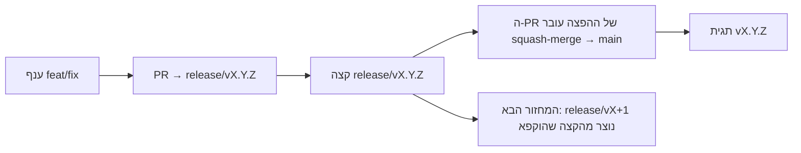

# Branching & Release Model (עברית)

🌐 **Languages:** 🇺🇸 [English](../../../../ops/BRANCHING_MODEL.md) · 🇪🇹 [am](../../../am/docs/ops/BRANCHING_MODEL.md) · 🇸🇦 [ar](../../../ar/docs/ops/BRANCHING_MODEL.md) · 🇦🇿 [az](../../../az/docs/ops/BRANCHING_MODEL.md) · 🇧🇬 [bg](../../../bg/docs/ops/BRANCHING_MODEL.md) · 🇧🇩 [bn](../../../bn/docs/ops/BRANCHING_MODEL.md) · 🇨🇿 [cs](../../../cs/docs/ops/BRANCHING_MODEL.md) · 🇩🇰 [da](../../../da/docs/ops/BRANCHING_MODEL.md) · 🇩🇪 [de](../../../de/docs/ops/BRANCHING_MODEL.md) · 🇬🇷 [el](../../../el/docs/ops/BRANCHING_MODEL.md) · 🇪🇸 [es](../../../es/docs/ops/BRANCHING_MODEL.md) · 🇪🇪 [et](../../../et/docs/ops/BRANCHING_MODEL.md) · 🇮🇷 [fa](../../../fa/docs/ops/BRANCHING_MODEL.md) · 🇫🇮 [fi](../../../fi/docs/ops/BRANCHING_MODEL.md) · 🇫🇷 [fr](../../../fr/docs/ops/BRANCHING_MODEL.md) · 🇮🇪 [ga](../../../ga/docs/ops/BRANCHING_MODEL.md) · 🇮🇳 [gu](../../../gu/docs/ops/BRANCHING_MODEL.md) · 🇳🇬 [ha](../../../ha/docs/ops/BRANCHING_MODEL.md) · 🇮🇳 [hi](../../../hi/docs/ops/BRANCHING_MODEL.md) · 🇭🇷 [hr](../../../hr/docs/ops/BRANCHING_MODEL.md) · 🇭🇺 [hu](../../../hu/docs/ops/BRANCHING_MODEL.md) · 🇦🇲 [hy](../../../hy/docs/ops/BRANCHING_MODEL.md) · 🇮🇩 [id](../../../id/docs/ops/BRANCHING_MODEL.md) · 🇳🇬 [ig](../../../ig/docs/ops/BRANCHING_MODEL.md) · 🇮🇹 [it](../../../it/docs/ops/BRANCHING_MODEL.md) · 🇯🇵 [ja](../../../ja/docs/ops/BRANCHING_MODEL.md) · 🇬🇪 [ka](../../../ka/docs/ops/BRANCHING_MODEL.md) · 🇰🇭 [km](../../../km/docs/ops/BRANCHING_MODEL.md) · 🇮🇳 [kn](../../../kn/docs/ops/BRANCHING_MODEL.md) · 🇰🇷 [ko](../../../ko/docs/ops/BRANCHING_MODEL.md) · 🇱🇹 [lt](../../../lt/docs/ops/BRANCHING_MODEL.md) · 🇱🇻 [lv](../../../lv/docs/ops/BRANCHING_MODEL.md) · 🇮🇳 [ml](../../../ml/docs/ops/BRANCHING_MODEL.md) · 🇮🇳 [mr](../../../mr/docs/ops/BRANCHING_MODEL.md) · 🇲🇾 [ms](../../../ms/docs/ops/BRANCHING_MODEL.md) · 🇲🇹 [mt](../../../mt/docs/ops/BRANCHING_MODEL.md) · 🇲🇲 [my](../../../my/docs/ops/BRANCHING_MODEL.md) · 🇳🇵 [ne](../../../ne/docs/ops/BRANCHING_MODEL.md) · 🇳🇱 [nl](../../../nl/docs/ops/BRANCHING_MODEL.md) · 🇳🇴 [no](../../../no/docs/ops/BRANCHING_MODEL.md) · 🇮🇳 [or](../../../or/docs/ops/BRANCHING_MODEL.md) · 🇮🇳 [pa](../../../pa/docs/ops/BRANCHING_MODEL.md) · 🇵🇭 [phi](../../../phi/docs/ops/BRANCHING_MODEL.md) · 🇵🇱 [pl](../../../pl/docs/ops/BRANCHING_MODEL.md) · 🇵🇹 [pt](../../../pt/docs/ops/BRANCHING_MODEL.md) · 🇧🇷 [pt-BR](../../../pt-BR/docs/ops/BRANCHING_MODEL.md) · 🇷🇴 [ro](../../../ro/docs/ops/BRANCHING_MODEL.md) · 🇷🇺 [ru](../../../ru/docs/ops/BRANCHING_MODEL.md) · 🇱🇰 [si](../../../si/docs/ops/BRANCHING_MODEL.md) · 🇸🇰 [sk](../../../sk/docs/ops/BRANCHING_MODEL.md) · 🇸🇮 [sl](../../../sl/docs/ops/BRANCHING_MODEL.md) · 🇷🇸 [sr](../../../sr/docs/ops/BRANCHING_MODEL.md) · 🇸🇪 [sv](../../../sv/docs/ops/BRANCHING_MODEL.md) · 🇰🇪 [sw](../../../sw/docs/ops/BRANCHING_MODEL.md) · 🇮🇳 [ta](../../../ta/docs/ops/BRANCHING_MODEL.md) · 🇮🇳 [te](../../../te/docs/ops/BRANCHING_MODEL.md) · 🇹🇭 [th](../../../th/docs/ops/BRANCHING_MODEL.md) · 🇹🇷 [tr](../../../tr/docs/ops/BRANCHING_MODEL.md) · 🇺🇦 [uk-UA](../../../uk-UA/docs/ops/BRANCHING_MODEL.md) · 🇵🇰 [ur](../../../ur/docs/ops/BRANCHING_MODEL.md) · 🇺🇿 [uz](../../../uz/docs/ops/BRANCHING_MODEL.md) · 🇻🇳 [vi](../../../vi/docs/ops/BRANCHING_MODEL.md) · 🇳🇬 [yo](../../../yo/docs/ops/BRANCHING_MODEL.md) · 🇨🇳 [zh-CN](../../../zh-CN/docs/ops/BRANCHING_MODEL.md) · 🇹🇼 [zh-TW](../../../zh-TW/docs/ops/BRANCHING_MODEL.md)

---

OmniRoute משתמש במודל הפצה של **מחזורים מקבילים**: ענף ייעודי `release/vX.Y.Z`
למחזור הפעיל, `main` לקו שפורסם, ותגית בלתי ניתנת לשינוי
`vX.Y.Z` כאשר המחזור מופץ. צפוי לראות commits שמתווספים גם ל-`release/*` _וגם_
ל-`main` — זו אינה טעות.

פרטים למתחזקים נמצאים ב-`CLAUDE.md` (כלל מחייב מס' 21) וב-
[RELEASE_CHECKLIST.md](./RELEASE_CHECKLIST.md). דף זה הוא הסיכום הציבורי
המיועד לתורמים.

## במבט חטוף

| הפניה            | תפקיד                                                                    |
| ---------------- | ------------------------------------------------------------------------ |
| `release/vX.Y.Z` | **מחזור פעיל** — פיתוח שוטף ומיזוגי PR עבור גרסה זו                      |
| `main`           | **קו שפורסם** — מקבל את המחזור באמצעות squash-merge כאשר הגרסה מופצת     |
| `vX.Y.Z` (תגית)  | **סמן הפצה** — מצביע בלתי ניתן לשינוי המציין „מה הופץ”, ונוצר בזמן ההפצה |



## לאיזה ענף ה-PR שלי צריך לפנות?

**יש להפנות אותו לענף `release/vX.Y.Z` הפעיל — לא ל-`main`.**

1. מצאו את ענף `release/v*` הפתוח בעל הגרסה הגבוהה ביותר (דוגמה בזמן הכתיבה:
   `release/v3.8.49`).
2. צרו ענף מאותו קצה (`git fetch` ולאחר מכן checkout / rebase עליו).
3. פתחו את ה-PR כאשר **base = אותו `release/vX.Y.Z`**.

`main` אינו ענף האינטגרציה השוטף. בדרך כלל יש להפנות מחדש PRs שנפתחו מול `main`
לפני המיזוג.

## הקפאת הפצה (מחזורים מקבילים)

כאשר מתבצעת התאמה של הפצה, נפתחת סוגיה מסמנת עם התווית `release-freeze`.
פעולה זו **אינה עוצרת את הפיתוח**:

- `release/vX.Y.Z` המוקפא נמצא באחריות מנהל ההפצה עבור הפצה זו.
- `release/vX+1` של המחזור הבא נוצר מהקצה המוקפא, כדי שתורמים יוכלו להמשיך
  להוסיף עבודה.
- יש **להפנות מחדש** PRs פתוחים שעדיין פונים לענף המוקפא אל ענף
  `release/v*` הפעיל (הגבוה ביותר).

בדקו אם קיימת הקפאה פתוחה לפני שתניחו שניתן למזג אל הענף הרצוי:

```bash
gh issue list --repo diegosouzapw/OmniRoute --label release-freeze --state open
```

מנגנון המיזוג (תווית `queue` של הבעלים ← Mergify) מתועד ב-
[MERGE_TRAIN.md](./MERGE_TRAIN.md).

## מדוע נדרשים גם ענף וגם תגית?

| פריט             | משך חיים     | מטרה                                                 |
| ---------------- | ------------ | ---------------------------------------------------- |
| `release/vX.Y.Z` | מחזור בתהליך | אוסף PRs שנבדקו, נשאר תקין ב-CI ומשמש כבסיס ל-PR     |
| תגית `vX.Y.Z`    | לתמיד        | מסמנת את התוכן המדויק שהופץ אל npm / GitHub Releases |

הענף הוא סדנת העבודה; התגית היא החבילה החתומה. לאחר squash-merge אל
`main`, המחזור הבא ממשיך ב-`release/vX+1` בלי להמתין לסיום ה-PR של
ההפצה הקודמת.

## מסמכים קשורים

- [CONTRIBUTING.md](../../CONTRIBUTING.md) — הגדרה, בדיקות ורשימת ביקורת ל-PR
- [RELEASE_CHECKLIST.md](./RELEASE_CHECKLIST.md) — אימות לפני הפצה
- [MERGE_TRAIN.md](./MERGE_TRAIN.md) — תור מיזוג ורכבת גיבוי
- [RELEASE_GREEN.md](./RELEASE_GREEN.md) — שמירה על תקינות קצה ההפצה
