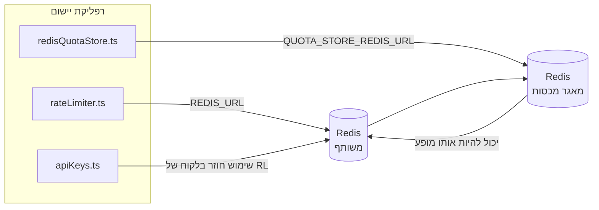

# Redis Production Configuration Guide (עברית)

🌐 **Languages:** 🇺🇸 [English](../../../../ops/REDIS_PRODUCTION_CONFIG.md) · 🇪🇹 [am](../../../am/docs/ops/REDIS_PRODUCTION_CONFIG.md) · 🇸🇦 [ar](../../../ar/docs/ops/REDIS_PRODUCTION_CONFIG.md) · 🇦🇿 [az](../../../az/docs/ops/REDIS_PRODUCTION_CONFIG.md) · 🇧🇬 [bg](../../../bg/docs/ops/REDIS_PRODUCTION_CONFIG.md) · 🇧🇩 [bn](../../../bn/docs/ops/REDIS_PRODUCTION_CONFIG.md) · 🇧🇦 [bs](../../../bs/docs/ops/REDIS_PRODUCTION_CONFIG.md) · 🇨🇿 [cs](../../../cs/docs/ops/REDIS_PRODUCTION_CONFIG.md) · 🇩🇰 [da](../../../da/docs/ops/REDIS_PRODUCTION_CONFIG.md) · 🇩🇪 [de](../../../de/docs/ops/REDIS_PRODUCTION_CONFIG.md) · 🇬🇷 [el](../../../el/docs/ops/REDIS_PRODUCTION_CONFIG.md) · 🇪🇸 [es](../../../es/docs/ops/REDIS_PRODUCTION_CONFIG.md) · 🇪🇪 [et](../../../et/docs/ops/REDIS_PRODUCTION_CONFIG.md) · 🇮🇷 [fa](../../../fa/docs/ops/REDIS_PRODUCTION_CONFIG.md) · 🇫🇮 [fi](../../../fi/docs/ops/REDIS_PRODUCTION_CONFIG.md) · 🇫🇷 [fr](../../../fr/docs/ops/REDIS_PRODUCTION_CONFIG.md) · 🇮🇪 [ga](../../../ga/docs/ops/REDIS_PRODUCTION_CONFIG.md) · 🇮🇳 [gu](../../../gu/docs/ops/REDIS_PRODUCTION_CONFIG.md) · 🇳🇬 [ha](../../../ha/docs/ops/REDIS_PRODUCTION_CONFIG.md) · 🇮🇳 [hi](../../../hi/docs/ops/REDIS_PRODUCTION_CONFIG.md) · 🇭🇷 [hr](../../../hr/docs/ops/REDIS_PRODUCTION_CONFIG.md) · 🇭🇺 [hu](../../../hu/docs/ops/REDIS_PRODUCTION_CONFIG.md) · 🇦🇲 [hy](../../../hy/docs/ops/REDIS_PRODUCTION_CONFIG.md) · 🇮🇩 [id](../../../id/docs/ops/REDIS_PRODUCTION_CONFIG.md) · 🇳🇬 [ig](../../../ig/docs/ops/REDIS_PRODUCTION_CONFIG.md) · 🇮🇹 [it](../../../it/docs/ops/REDIS_PRODUCTION_CONFIG.md) · 🇯🇵 [ja](../../../ja/docs/ops/REDIS_PRODUCTION_CONFIG.md) · 🇬🇪 [ka](../../../ka/docs/ops/REDIS_PRODUCTION_CONFIG.md) · 🇰🇭 [km](../../../km/docs/ops/REDIS_PRODUCTION_CONFIG.md) · 🇮🇳 [kn](../../../kn/docs/ops/REDIS_PRODUCTION_CONFIG.md) · 🇰🇷 [ko](../../../ko/docs/ops/REDIS_PRODUCTION_CONFIG.md) · 🇱🇹 [lt](../../../lt/docs/ops/REDIS_PRODUCTION_CONFIG.md) · 🇱🇻 [lv](../../../lv/docs/ops/REDIS_PRODUCTION_CONFIG.md) · 🇮🇳 [ml](../../../ml/docs/ops/REDIS_PRODUCTION_CONFIG.md) · 🇮🇳 [mr](../../../mr/docs/ops/REDIS_PRODUCTION_CONFIG.md) · 🇲🇾 [ms](../../../ms/docs/ops/REDIS_PRODUCTION_CONFIG.md) · 🇲🇹 [mt](../../../mt/docs/ops/REDIS_PRODUCTION_CONFIG.md) · 🇲🇲 [my](../../../my/docs/ops/REDIS_PRODUCTION_CONFIG.md) · 🇳🇵 [ne](../../../ne/docs/ops/REDIS_PRODUCTION_CONFIG.md) · 🇳🇱 [nl](../../../nl/docs/ops/REDIS_PRODUCTION_CONFIG.md) · 🇳🇴 [no](../../../no/docs/ops/REDIS_PRODUCTION_CONFIG.md) · 🇮🇳 [or](../../../or/docs/ops/REDIS_PRODUCTION_CONFIG.md) · 🇮🇳 [pa](../../../pa/docs/ops/REDIS_PRODUCTION_CONFIG.md) · 🇵🇭 [phi](../../../phi/docs/ops/REDIS_PRODUCTION_CONFIG.md) · 🇵🇱 [pl](../../../pl/docs/ops/REDIS_PRODUCTION_CONFIG.md) · 🇵🇹 [pt](../../../pt/docs/ops/REDIS_PRODUCTION_CONFIG.md) · 🇧🇷 [pt-BR](../../../pt-BR/docs/ops/REDIS_PRODUCTION_CONFIG.md) · 🇷🇴 [ro](../../../ro/docs/ops/REDIS_PRODUCTION_CONFIG.md) · 🇷🇺 [ru](../../../ru/docs/ops/REDIS_PRODUCTION_CONFIG.md) · 🇱🇰 [si](../../../si/docs/ops/REDIS_PRODUCTION_CONFIG.md) · 🇸🇰 [sk](../../../sk/docs/ops/REDIS_PRODUCTION_CONFIG.md) · 🇸🇮 [sl](../../../sl/docs/ops/REDIS_PRODUCTION_CONFIG.md) · 🇷🇸 [sr](../../../sr/docs/ops/REDIS_PRODUCTION_CONFIG.md) · 🇸🇪 [sv](../../../sv/docs/ops/REDIS_PRODUCTION_CONFIG.md) · 🇰🇪 [sw](../../../sw/docs/ops/REDIS_PRODUCTION_CONFIG.md) · 🇮🇳 [ta](../../../ta/docs/ops/REDIS_PRODUCTION_CONFIG.md) · 🇮🇳 [te](../../../te/docs/ops/REDIS_PRODUCTION_CONFIG.md) · 🇹🇭 [th](../../../th/docs/ops/REDIS_PRODUCTION_CONFIG.md) · 🇹🇷 [tr](../../../tr/docs/ops/REDIS_PRODUCTION_CONFIG.md) · 🇺🇦 [uk-UA](../../../uk-UA/docs/ops/REDIS_PRODUCTION_CONFIG.md) · 🇵🇰 [ur](../../../ur/docs/ops/REDIS_PRODUCTION_CONFIG.md) · 🇺🇿 [uz](../../../uz/docs/ops/REDIS_PRODUCTION_CONFIG.md) · 🇻🇳 [vi](../../../vi/docs/ops/REDIS_PRODUCTION_CONFIG.md) · 🇳🇬 [yo](../../../yo/docs/ops/REDIS_PRODUCTION_CONFIG.md) · 🇨🇳 [zh-CN](../../../zh-CN/docs/ops/REDIS_PRODUCTION_CONFIG.md) · 🇹🇼 [zh-TW](../../../zh-TW/docs/ops/REDIS_PRODUCTION_CONFIG.md)

---

## סקירה כללית

Redis הוא **תלות רכה ואופציונלית** ב-OmniRoute — כאשר Redis אינו זמין, היישום ממשיך לפעול באופן תקין באמצעות
חלופות בזיכרון. בסביבת ייצור, כוונון Redis מפחית את זמן ההשהיה עבור ארבעה עומסי עבודה
נפרדים:

| עומס עבודה       | רכיב מפעיל                    | מפעל לקוחות                                           | תבנית מפתח                                                 |
| ---------------- | ----------------------------- | ----------------------------------------------------- | ---------------------------------------------------------- |
| הגבלת קצב        | `rateLimiter.ts`              | מופע יחיד עצל של `ioredis` באמצעות `getRedisClient()` | חלונות הגבלת קצב אטומיים באמצעות Lua בתבנית `<prefix>rl:*` |
| מטמון אימות      | `apiKeys.ts`                  | משתמש מחדש בלקוח של `rateLimiter`                     | `<prefix>auth:api_key:<sha256>` עם TTL                     |
| מאגר מכסות       | `redisQuotaStore.ts`          | מופע יחיד נפרד של `getRedisClient(url)`               | `<prefix>quota:*` הניתן להגדרה לכל מופע                    |
| מפסק מעגל לחימום | `redisCircuitBreakerStore.ts` | לקוח נפרד ב-`circuitBreakerFactory.ts`                | `<prefix>warmup:cb:<connectionId>`                         |

כל ארבעת עומסי העבודה חולקים קידומת מרחב שמות אחת, כדי ש-OmniRoute יוכל להתקיים לצד יישומים אחרים
במופע Redis יחיד (למשל `127.0.0.1:6379`). ראו [מרחוב שמות למפתחות](#key-namespacing).

---

## תצורה נוכחית (ברירות המחדל בקוד)

| הגדרה                                | ערך                                                      | מיקום                                                                                 |
| ------------------------------------ | -------------------------------------------------------- | ------------------------------------------------------------------------------------- |
| משתנה הסביבה `REDIS_URL`             | `redis://redis:6379` (ב-compose), אופציונלי              | `rateLimiter.ts:5`, `.env.example`                                                    |
| משתנה הסביבה `REDIS_KEY_PREFIX`      | `omniroute:` (ברירת המחדל)                               | `rateLimiter.ts`, `redisQuotaStore.ts`, `redisCircuitBreakerStore.ts`, `.env.example` |
| משתנה הסביבה `QUOTA_STORE_REDIS_URL` | נפרד, יכול להיות שונה מ-`REDIS_URL`                      | `quota/storeFactory.ts`                                                               |
| `QUOTA_STORE_DRIVER`                 | `"sqlite"` (ברירת המחדל), `"redis"` אופציונלי            | `quota/storeFactory.ts`                                                               |
| `maxRetriesPerRequest` של ioredis    | `3`                                                      | יצירת הלקוח ב-`rateLimiter.ts`                                                        |
| `enableReadyCheck`                   | לא מוגדר (ברירת המחדל של ioredis: `true`)                | —                                                                                     |
| `lazyConnect`                        | לא מוגדר (ברירת המחדל של ioredis: `false`)               | —                                                                                     |
| `retryStrategy`                      | לא מוגדר (ברירת המחדל של ioredis: בסיס של 200ms, מעריכי) | —                                                                                     |
| TLS / סיסמה / אינדקס DB              | **לא מוגדרים**                                           | —                                                                                     |
| Sentinel / Cluster                   | **לא מוגדרים** — תמיכה בצומת עצמאי יחיד בלבד             | —                                                                                     |

---

## מרחוב שמות למפתחות

OmniRoute חולק מופע Redis עם כל שירות אחר שפועל במארח. ללא מרחב שמות,
מפתחות כגון `auth:api_key:<sha256>` או `rl:*` עלולים להתנגש במפתחות של יישומים אחרים
המשתמשים באותו Redis (מופע זה מפעיל את Redis ב-`127.0.0.1:6379` לצד שירותים אחרים).

הגדירו את `REDIS_KEY_PREFIX` למחרוזת שאינה ריקה כדי להוסיף קידומת ל-**כל** מפתח של OmniRoute:

```bash
# .env — כל מפתחות OmniRoute הופכים ל-omniroute:rl:*, omniroute:auth:*, omniroute:quota:*, omniroute:warmup:cb:*
REDIS_KEY_PREFIX=omniroute:
```

- **ברירת המחדל:** `omniroute:` (מוחלת כאשר `REDIS_KEY_PREFIX` אינו מוגדר או ריק).
- **מוחלת על:** מגביל הקצב ומטמון האימות (לקוח `ioredis` משותף באמצעות `keyPrefix`), וכן על
  מאגר המכסות (`KEY_PREFIX = "${REDIS_KEY_PREFIX}quota"`) ועל מפסק המעגל לחימום
  (`KEY_PREFIX = "${REDIS_KEY_PREFIX}warmup:cb:"`).
- **שינוי הקידומת** כאשר מפתחות כבר קיימים ב-Redis מותיר את המפתחות הישנים ללא שימוש (הם פגים
  באמצעות TTL / LRU). ניתן לשנות אותה בבטחה; אין צורך בהעברה. החריג היחיד הוא מפתח של
  מפסק מעגל לחימום עבור חיבור שסומן כאסור: הוא נשמר ללא TTL, ולכן יש להציג את השאריות באמצעות
  `redis-cli --scan --pattern '<old-prefix>warmup:cb:*'` ולמחוק אותן.
- **`keyPrefix` של ioredis** מוסיף אוטומטית את הקידומת בכתיבות **וגם** מסיר אותה בקריאות,
  כך שקוד היישום לעולם אינו רואה את הקידומת.

---

## כוונון מומלץ לסביבת ייצור

### 1. מאגר חיבורים / אפשרויות לקוח (הבנאי `Redis` של ioredis)

הקוד הנוכחי יוצר מופע יחיד של `new Redis(url)` ללא אפשרויות מותאמות אישית. עבור פריסות ייצור
מרובות רפליקות, העבירו פונקציית יצירת לקוח בקוד או עטפו את `getRedisClient()`:

```typescript
const redis = new Redis(REDIS_URL, {
  maxRetriesPerRequest: null, // ללא מגבלת ניסיונות חוזרים; יש לאפשר ל-retryStrategy להחליט
  enableReadyCheck: true, // יש לוודא שהשרת מוכן לפני קבלת קריאות
  lazyConnect: true, // אין להתחבר בעת יצירת המופע; יש להמתין לקריאה הראשונה
  retryStrategy: (times) => {
    if (times > 10) return null; // ויתור לאחר 10 ניסיונות חוזרים → התחברות מחדש מאוחר יותר
    return Math.min(times * 200, 5000); // 200ms, 400ms, …, תקרה של 5s
  },
  enableAutoPipelining: true, // איחוד פקודות מקביליות לכתיבת TCP אחת
  keepAlive: 10000, // TCP keep-alive בכל 10s
});
```

**פשרות עיקריות:**

- `maxRetriesPerRequest: null` + `retryStrategy` — האפשרות המועדפת לייצור, כדי שהפעלות מחדש
  זמניות של Redis לא יגרמו לכשל מיידי של כל בקשה. מנגנון הגיבוי בזיכרון של
  `checkRateLimit()` מטפל בנתיב הכשל.
- `lazyConnect: true` — מונע תלות בעת האתחול בכך ש-Redis יהיה פעיל לפני שהשרת
  מתחיל לקבל חיבורים.
- `enableAutoPipelining: true` — מצמצם הלוך ושוב ברשת עבור בדיקות מקבילות של הגבלת קצב;
  מועיל בקצב של יותר מ-50 RPS בחיבור יחיד.

### 2. תצורת שרת Redis (`redis.conf`)

```
# זיכרון
maxmemory 80%                        # השארת מקום למטמון הדפים של מערכת ההפעלה
maxmemory-policy allkeys-lru         # פינוי רשומות מיושנות ממטמון האימות תחת עומס זיכרון

# התמדה (אופציונלית — OmniRoute עמיד בפני קריסות גם בלעדיה)
save 300 1                           # יצירת תמונת מצב לפחות בכל 5 דקות אם השתנה מפתח אחד לפחות
appendonly no                        # אין צורך ב-AOF; ניתן ליצור מחדש את הנתונים
appendfsync no                       # ללא תקורת fsync (‏RDB מספיק)

# רשת
timeout 0                            # ללא ניתוק עקב חוסר פעילות
tcp-keepalive 300                    # keep-alive של 5 דקות
tcp-backlog 511                      # תור חיבורים לעומס מתפרץ

# ביצועים
hz 10                                # ברירת המחדל; 100 עבור יישומים רגישים להשהיה
activedefrag yes                     # איחוי אוטומטי כאשר הקיטוע גדול מ-10%
```

**הפשרה עבור `maxmemory-policy allkeys-lru`:** רשומות במטמון האימות עשויות להתפנות תחת
לחץ זיכרון. הדבר בטוח — `setCachedApiKey` תמיד מאכלס מחדש במקרה של החטאה, ומנגנון
הגיבוי של SQLite הוא מקור המידע המוסמך. סקריפט ה-Lua של מגביל הקצב יוצר מפתחות קטנים
שהם קצרי־חיים מעצם תכנונם.

### 3. הגדרות Docker Compose

קובץ ה-compose לייצור (`docker-compose.prod.yml`) משתמש ב-`redis:8.6.2-alpine`. הוסיפו:

```yaml
redis:
  image: redis:8.6.2-alpine
  command:
    [
      "redis-server",
      "--maxmemory",
      "512mb",
      "--maxmemory-policy",
      "allkeys-lru",
      "--activedefrag",
      "yes",
      "--save",
      "300 1",
    ]
  healthcheck:
    test: ["CMD", "redis-cli", "ping"]
    interval: 10s
    timeout: 3s
    retries: 3
    start_period: 5s
```

### 4. שיקולים לריבוי מופעים / הרחבת קיבולת

**Redis יחיד לכל הרפליקות** — סקריפט ה-Lua של מגביל הקצב תלוי במרחב מפתחות מוסמך
יחיד. מופעי Redis מרובים מאחורי רפליקות יגרמו לאובדן האטומיות ולהכפלת המכסה. השתמשו
ב-Redis יחיד (או באשכול Redis Sentinel עם מעבר בעת כשל) עבור כל רפליקות היישום.

**מספר החיבורים:** כל רפליקת יישום פותחת **2 חיבורי TCP** אל Redis
(לקוח מגביל קצב + לקוח אחסון מכסות). ב-10 רפליקות → 20 חיבורים, הרבה
מתחת לתקרה של 10,000 חיבורים במופע Redis המוגדר כברירת מחדל.

### 5. ניטור

חשפו באמצעות נקודת קצה לבדיקת תקינות:

```typescript
// src/app/api/monitoring/health/route.ts כבר קורא לפונקציות של rateLimiter
// הוסיפו בדיקות ייעודיות ל-Redis:
//   1. השהיית PING באמצעות ioredis .ping()
//   2. שימוש בזיכרון באמצעות INFO memory
//   3. מספר חיבורים באמצעות INFO clients
//   4. שיעור פגיעות עבור maxmemory-policy (evicted_keys / keyspace_hits)
```

מדדים מרכזיים למעקב:

- **מפתחות שפונו / שנייה** — אם הערך אינו אפס באופן מתמשך, הגדילו את `maxmemory`
- **לקוחות חסומים** — ערך שאינו אפס מצביע על סקריפטי Lua איטיים או תחרות גבוהה על משאבים
- **חיבורים שנדחו** — הגעתם למגבלת החיבורים; נדיר ב-20 חיבורים

---

## תרשים ארכיטקטורה



---

## מקורות

| קובץ                               | מטרה                                                     |
| ---------------------------------- | -------------------------------------------------------- |
| `src/shared/utils/rateLimiter.ts`  | לקוח Redis ראשי, סקריפט Lua להגבלת קצב, חלופה בזיכרון    |
| `src/lib/db/apiKeys.ts`            | מטמון אימות — חלופה מ־Redis ל־SQLite                     |
| `src/lib/quota/redisQuotaStore.ts` | לקוח Redis נפרד עבור מאגר מכסות אופציונלי                |
| `src/lib/quota/storeFactory.ts`    | מעבר בין מנהלי ההתקן `sqlite` ו־`redis` למכסות           |
| `docker-compose.prod.yml`          | קונטיינר Redis לסביבת ייצור (תמונה `redis:8.6.2-alpine`) |
| `.env.example`                     | תיעוד משתני הסביבה של Redis                              |
| `src/app/api/local/redis/`         | נתיבי API לתזמור קונטיינר בסביבת פיתוח                   |
| `bin/cli/commands/redis.mjs`       | פקודות CLI לתזמור קונטיינר בסביבת פיתוח                  |
