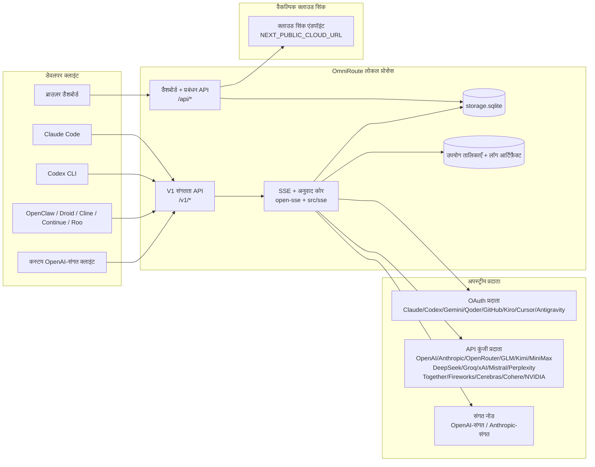
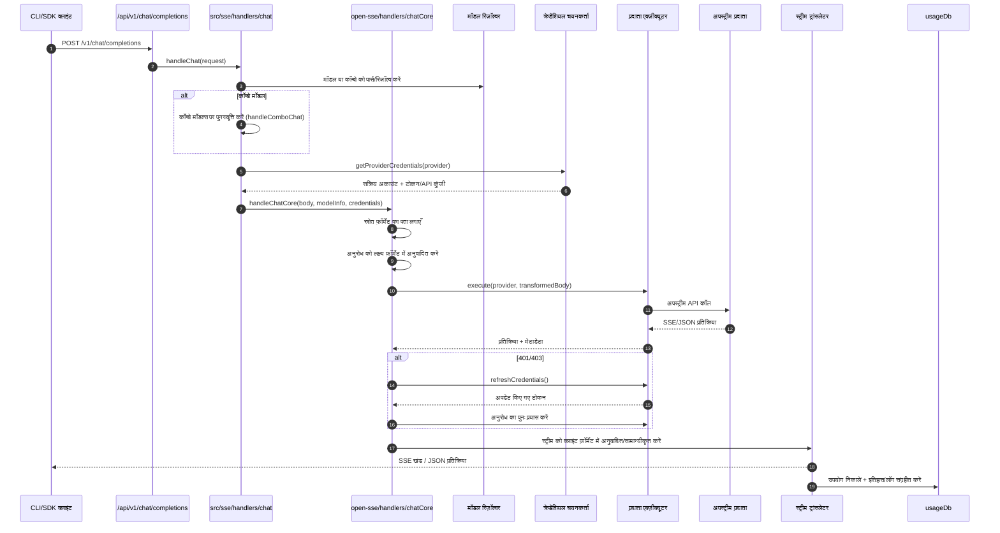
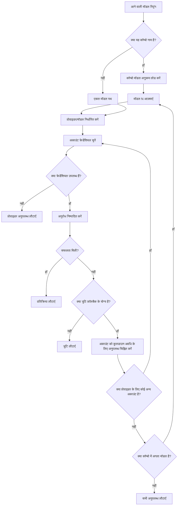
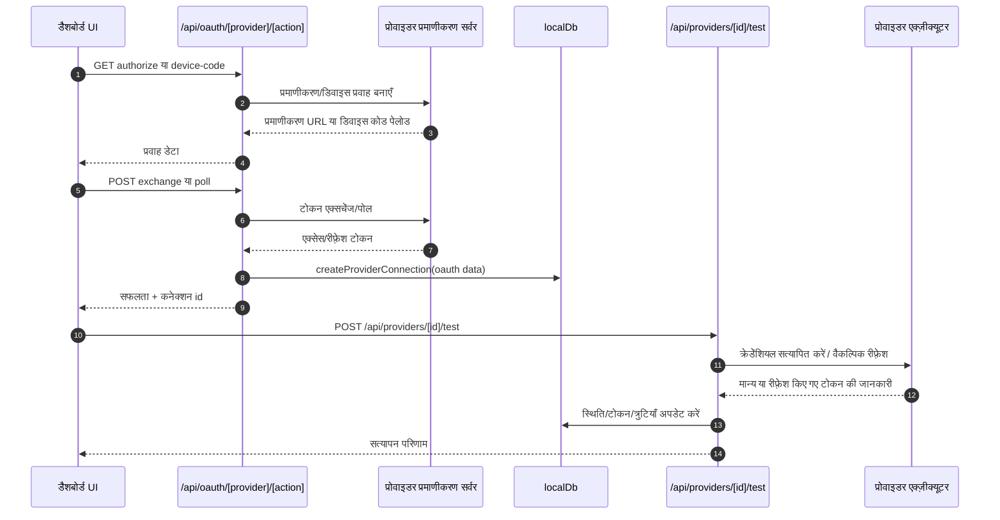
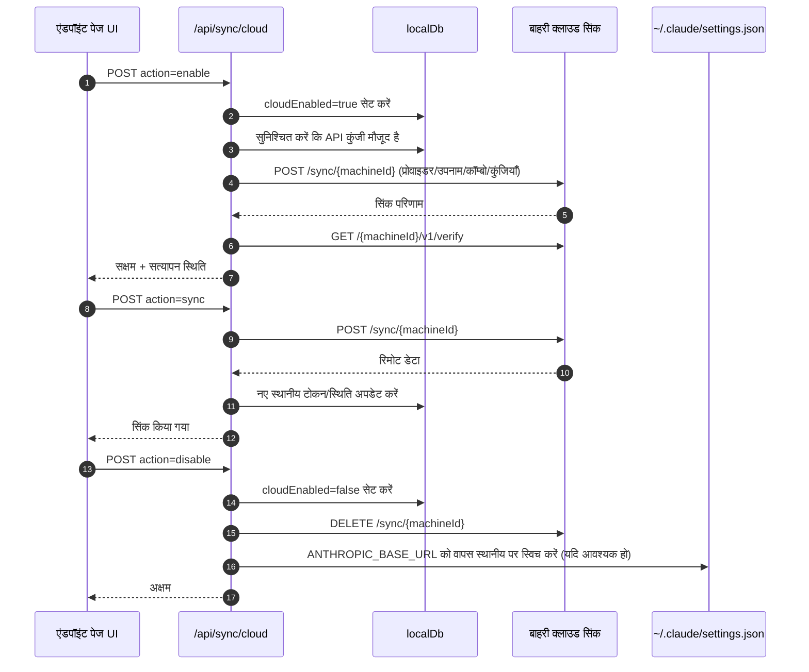
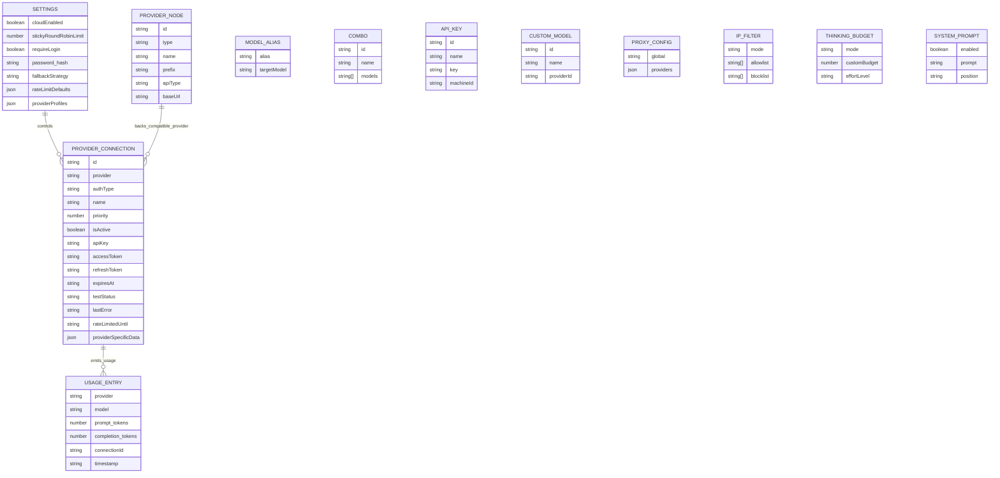
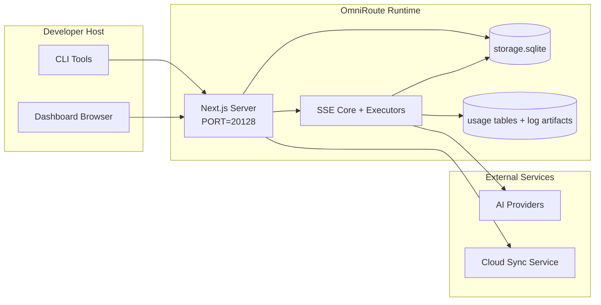

# OmniRoute Architecture (हिन्दी)

🌐 **Languages:** 🇺🇸 [English](../../../../architecture/ARCHITECTURE.md) · 🇪🇹 [am](../../../am/docs/architecture/ARCHITECTURE.md) · 🇸🇦 [ar](../../../ar/docs/architecture/ARCHITECTURE.md) · 🇦🇿 [az](../../../az/docs/architecture/ARCHITECTURE.md) · 🇧🇬 [bg](../../../bg/docs/architecture/ARCHITECTURE.md) · 🇧🇩 [bn](../../../bn/docs/architecture/ARCHITECTURE.md) · 🇧🇦 [bs](../../../bs/docs/architecture/ARCHITECTURE.md) · 🇨🇿 [cs](../../../cs/docs/architecture/ARCHITECTURE.md) · 🇩🇰 [da](../../../da/docs/architecture/ARCHITECTURE.md) · 🇩🇪 [de](../../../de/docs/architecture/ARCHITECTURE.md) · 🇬🇷 [el](../../../el/docs/architecture/ARCHITECTURE.md) · 🇪🇸 [es](../../../es/docs/architecture/ARCHITECTURE.md) · 🇪🇪 [et](../../../et/docs/architecture/ARCHITECTURE.md) · 🇮🇷 [fa](../../../fa/docs/architecture/ARCHITECTURE.md) · 🇫🇮 [fi](../../../fi/docs/architecture/ARCHITECTURE.md) · 🇫🇷 [fr](../../../fr/docs/architecture/ARCHITECTURE.md) · 🇮🇪 [ga](../../../ga/docs/architecture/ARCHITECTURE.md) · 🇮🇳 [gu](../../../gu/docs/architecture/ARCHITECTURE.md) · 🇳🇬 [ha](../../../ha/docs/architecture/ARCHITECTURE.md) · 🇮🇱 [he](../../../he/docs/architecture/ARCHITECTURE.md) · 🇭🇷 [hr](../../../hr/docs/architecture/ARCHITECTURE.md) · 🇭🇺 [hu](../../../hu/docs/architecture/ARCHITECTURE.md) · 🇦🇲 [hy](../../../hy/docs/architecture/ARCHITECTURE.md) · 🇮🇩 [id](../../../id/docs/architecture/ARCHITECTURE.md) · 🇳🇬 [ig](../../../ig/docs/architecture/ARCHITECTURE.md) · 🇮🇹 [it](../../../it/docs/architecture/ARCHITECTURE.md) · 🇯🇵 [ja](../../../ja/docs/architecture/ARCHITECTURE.md) · 🇬🇪 [ka](../../../ka/docs/architecture/ARCHITECTURE.md) · 🇰🇭 [km](../../../km/docs/architecture/ARCHITECTURE.md) · 🇮🇳 [kn](../../../kn/docs/architecture/ARCHITECTURE.md) · 🇰🇷 [ko](../../../ko/docs/architecture/ARCHITECTURE.md) · 🇱🇹 [lt](../../../lt/docs/architecture/ARCHITECTURE.md) · 🇱🇻 [lv](../../../lv/docs/architecture/ARCHITECTURE.md) · 🇮🇳 [ml](../../../ml/docs/architecture/ARCHITECTURE.md) · 🇮🇳 [mr](../../../mr/docs/architecture/ARCHITECTURE.md) · 🇲🇾 [ms](../../../ms/docs/architecture/ARCHITECTURE.md) · 🇲🇹 [mt](../../../mt/docs/architecture/ARCHITECTURE.md) · 🇲🇲 [my](../../../my/docs/architecture/ARCHITECTURE.md) · 🇳🇵 [ne](../../../ne/docs/architecture/ARCHITECTURE.md) · 🇳🇱 [nl](../../../nl/docs/architecture/ARCHITECTURE.md) · 🇳🇴 [no](../../../no/docs/architecture/ARCHITECTURE.md) · 🇮🇳 [or](../../../or/docs/architecture/ARCHITECTURE.md) · 🇮🇳 [pa](../../../pa/docs/architecture/ARCHITECTURE.md) · 🇵🇭 [phi](../../../phi/docs/architecture/ARCHITECTURE.md) · 🇵🇱 [pl](../../../pl/docs/architecture/ARCHITECTURE.md) · 🇵🇹 [pt](../../../pt/docs/architecture/ARCHITECTURE.md) · 🇧🇷 [pt-BR](../../../pt-BR/docs/architecture/ARCHITECTURE.md) · 🇷🇴 [ro](../../../ro/docs/architecture/ARCHITECTURE.md) · 🇷🇺 [ru](../../../ru/docs/architecture/ARCHITECTURE.md) · 🇱🇰 [si](../../../si/docs/architecture/ARCHITECTURE.md) · 🇸🇰 [sk](../../../sk/docs/architecture/ARCHITECTURE.md) · 🇸🇮 [sl](../../../sl/docs/architecture/ARCHITECTURE.md) · 🇷🇸 [sr](../../../sr/docs/architecture/ARCHITECTURE.md) · 🇸🇪 [sv](../../../sv/docs/architecture/ARCHITECTURE.md) · 🇰🇪 [sw](../../../sw/docs/architecture/ARCHITECTURE.md) · 🇮🇳 [ta](../../../ta/docs/architecture/ARCHITECTURE.md) · 🇮🇳 [te](../../../te/docs/architecture/ARCHITECTURE.md) · 🇹🇭 [th](../../../th/docs/architecture/ARCHITECTURE.md) · 🇹🇷 [tr](../../../tr/docs/architecture/ARCHITECTURE.md) · 🇺🇦 [uk-UA](../../../uk-UA/docs/architecture/ARCHITECTURE.md) · 🇵🇰 [ur](../../../ur/docs/architecture/ARCHITECTURE.md) · 🇺🇿 [uz](../../../uz/docs/architecture/ARCHITECTURE.md) · 🇻🇳 [vi](../../../vi/docs/architecture/ARCHITECTURE.md) · 🇳🇬 [yo](../../../yo/docs/architecture/ARCHITECTURE.md) · 🇨🇳 [zh-CN](../../../zh-CN/docs/architecture/ARCHITECTURE.md) · 🇹🇼 [zh-TW](../../../zh-TW/docs/architecture/ARCHITECTURE.md)

---

🌐 **Languages:** 🇺🇸 [English](../../../../architecture/ARCHITECTURE.md) · 🇪🇹 [am](../../../am/docs/architecture/ARCHITECTURE.md) · 🇸🇦 [ar](../../../ar/docs/architecture/ARCHITECTURE.md) · 🇦🇿 [az](../../../az/docs/architecture/ARCHITECTURE.md) · 🇧🇬 [bg](../../../bg/docs/architecture/ARCHITECTURE.md) · 🇧🇩 [bn](../../../bn/docs/architecture/ARCHITECTURE.md) · 🇧🇦 [bs](../../../bs/docs/architecture/ARCHITECTURE.md) · 🇨🇿 [cs](../../../cs/docs/architecture/ARCHITECTURE.md) · 🇩🇰 [da](../../../da/docs/architecture/ARCHITECTURE.md) · 🇩🇪 [de](../../../de/docs/architecture/ARCHITECTURE.md) · 🇬🇷 [el](../../../el/docs/architecture/ARCHITECTURE.md) · 🇪🇸 [es](../../../es/docs/architecture/ARCHITECTURE.md) · 🇪🇪 [et](../../../et/docs/architecture/ARCHITECTURE.md) · 🇮🇷 [fa](../../../fa/docs/architecture/ARCHITECTURE.md) · 🇫🇮 [fi](../../../fi/docs/architecture/ARCHITECTURE.md) · 🇫🇷 [fr](../../../fr/docs/architecture/ARCHITECTURE.md) · 🇮🇪 [ga](../../../ga/docs/architecture/ARCHITECTURE.md) · 🇮🇳 [gu](../../../gu/docs/architecture/ARCHITECTURE.md) · 🇳🇬 [ha](../../../ha/docs/architecture/ARCHITECTURE.md) · 🇮🇱 [he](../../../he/docs/architecture/ARCHITECTURE.md) · 🇭🇷 [hr](../../../hr/docs/architecture/ARCHITECTURE.md) · 🇭🇺 [hu](../../../hu/docs/architecture/ARCHITECTURE.md) · 🇦🇲 [hy](../../../hy/docs/architecture/ARCHITECTURE.md) · 🇮🇩 [id](../../../id/docs/architecture/ARCHITECTURE.md) · 🇳🇬 [ig](../../../ig/docs/architecture/ARCHITECTURE.md) · 🇮🇹 [it](../../../it/docs/architecture/ARCHITECTURE.md) · 🇯🇵 [ja](../../../ja/docs/architecture/ARCHITECTURE.md) · 🇬🇪 [ka](../../../ka/docs/architecture/ARCHITECTURE.md) · 🇰🇭 [km](../../../km/docs/architecture/ARCHITECTURE.md) · 🇮🇳 [kn](../../../kn/docs/architecture/ARCHITECTURE.md) · 🇰🇷 [ko](../../../ko/docs/architecture/ARCHITECTURE.md) · 🇱🇹 [lt](../../../lt/docs/architecture/ARCHITECTURE.md) · 🇱🇻 [lv](../../../lv/docs/architecture/ARCHITECTURE.md) · 🇮🇳 [ml](../../../ml/docs/architecture/ARCHITECTURE.md) · 🇮🇳 [mr](../../../mr/docs/architecture/ARCHITECTURE.md) · 🇲🇾 [ms](../../../ms/docs/architecture/ARCHITECTURE.md) · 🇲🇹 [mt](../../../mt/docs/architecture/ARCHITECTURE.md) · 🇲🇲 [my](../../../my/docs/architecture/ARCHITECTURE.md) · 🇳🇵 [ne](../../../ne/docs/architecture/ARCHITECTURE.md) · 🇳🇱 [nl](../../../nl/docs/architecture/ARCHITECTURE.md) · 🇳🇴 [no](../../../no/docs/architecture/ARCHITECTURE.md) · 🇮🇳 [or](../../../or/docs/architecture/ARCHITECTURE.md) · 🇮🇳 [pa](../../../pa/docs/architecture/ARCHITECTURE.md) · 🇵🇭 [phi](../../../phi/docs/architecture/ARCHITECTURE.md) · 🇵🇱 [pl](../../../pl/docs/architecture/ARCHITECTURE.md) · 🇵🇹 [pt](../../../pt/docs/architecture/ARCHITECTURE.md) · 🇧🇷 [pt-BR](../../../pt-BR/docs/architecture/ARCHITECTURE.md) · 🇷🇴 [ro](../../../ro/docs/architecture/ARCHITECTURE.md) · 🇷🇺 [ru](../../../ru/docs/architecture/ARCHITECTURE.md) · 🇱🇰 [si](../../../si/docs/architecture/ARCHITECTURE.md) · 🇸🇰 [sk](../../../sk/docs/architecture/ARCHITECTURE.md) · 🇸🇮 [sl](../../../sl/docs/architecture/ARCHITECTURE.md) · 🇷🇸 [sr](../../../sr/docs/architecture/ARCHITECTURE.md) · 🇸🇪 [sv](../../../sv/docs/architecture/ARCHITECTURE.md) · 🇰🇪 [sw](../../../sw/docs/architecture/ARCHITECTURE.md) · 🇮🇳 [ta](../../../ta/docs/architecture/ARCHITECTURE.md) · 🇮🇳 [te](../../../te/docs/architecture/ARCHITECTURE.md) · 🇹🇭 [th](../../../th/docs/architecture/ARCHITECTURE.md) · 🇹🇷 [tr](../../../tr/docs/architecture/ARCHITECTURE.md) · 🇺🇦 [uk-UA](../../../uk-UA/docs/architecture/ARCHITECTURE.md) · 🇵🇰 [ur](../../../ur/docs/architecture/ARCHITECTURE.md) · 🇺🇿 [uz](../../../uz/docs/architecture/ARCHITECTURE.md) · 🇻🇳 [vi](../../../vi/docs/architecture/ARCHITECTURE.md) · 🇳🇬 [yo](../../../yo/docs/architecture/ARCHITECTURE.md) · 🇨🇳 [zh-CN](../../../zh-CN/docs/architecture/ARCHITECTURE.md) · 🇹🇼 [zh-TW](../../../zh-TW/docs/architecture/ARCHITECTURE.md)

_अंतिम अपडेट: 2026-06-28_

## कार्यकारी सारांश

OmniRoute, Next.js पर निर्मित एक स्थानीय AI रूटिंग गेटवे और डैशबोर्ड है।
यह एकल OpenAI-संगत एंडपॉइंट (`/v1/*`) प्रदान करता है और अनुवाद, फ़ॉलबैक, टोकन रीफ़्रेश तथा उपयोग ट्रैकिंग के साथ ट्रैफ़िक को कई अपस्ट्रीम प्रदाताओं में रूट करता है।

मुख्य क्षमताएँ:

- CLI/टूल्स के लिए OpenAI-संगत API इंटरफ़ेस (355 प्रदाता, 108 एक्ज़ीक्यूटर)
- विभिन्न प्रदाता प्रारूपों के बीच अनुरोध/प्रतिक्रिया अनुवाद
- मॉडल कॉम्बो फ़ॉलबैक (बहु-मॉडल अनुक्रम)
- `compositeTiers` के अनुसार रनटाइम क्रम निर्धारण के साथ संरचित कॉम्बो चरण (`provider + model + connection`)
- खाता-स्तरीय फ़ॉलबैक (प्रति प्रदाता एकाधिक खाते)
- मुख्य चैट पथ में कोटा प्रीफ़्लाइट और कोटा-सचेत P2C खाता चयन
- OAuth + API-कुंजी प्रदाता कनेक्शन प्रबंधन (22 OAuth प्रदाता मॉड्यूल)
- `/v1/embeddings` के माध्यम से एम्बेडिंग जनरेशन (18 प्रदाता)
- `/v1/images/generations` के माध्यम से इमेज जनरेशन (10+ प्रदाता, 20+ मॉडल)
- `/v1/audio/transcriptions` के माध्यम से ऑडियो ट्रांसक्रिप्शन (18 प्रदाता)
- `/v1/audio/speech` के माध्यम से टेक्स्ट-टू-स्पीच (24 अंतर्निर्मित प्रदाता)
- `/v1/videos/generations` के माध्यम से वीडियो जनरेशन (ComfyUI + SD WebUI)
- `/v1/music/generations` के माध्यम से संगीत जनरेशन (ComfyUI)
- `/v1/search` के माध्यम से वेब खोज (20 प्रदाता)
- `/v1/moderations` के माध्यम से मॉडरेशन
- `/v1/rerank` के माध्यम से पुनः रैंकिंग
- रीजनिंग मॉडल के लिए Think टैग पार्सिंग (`<think>...</think>`)
- OpenAI SDK की सख्त संगतता के लिए प्रतिक्रिया सैनिटाइज़ेशन
- क्रॉस-प्रदाता संगतता के लिए भूमिका सामान्यीकरण (developer→system, system→user)
- संरचित आउटपुट रूपांतरण (json_schema → Gemini responseSchema)
- प्रदाताओं, कुंजियों, उपनामों, कॉम्बो, सेटिंग्स और मूल्य निर्धारण के लिए स्थानीय स्थायित्व (122 DB मॉड्यूल)
- उपयोग/लागत ट्रैकिंग और अनुरोध लॉगिंग
- बहु-डिवाइस/स्थिति सिंक के लिए वैकल्पिक क्लाउड सिंक
- API एक्सेस नियंत्रण के लिए IP अनुमति-सूची/ब्लॉक-सूची
- थिंकिंग बजट प्रबंधन (पासथ्रू/स्वचालित/कस्टम/अनुकूली)
- वैश्विक सिस्टम प्रॉम्प्ट इंजेक्शन
- सत्र ट्रैकिंग और फ़िंगरप्रिंटिंग
- प्रदाता-विशिष्ट प्रोफ़ाइल के साथ प्रति-खाता उन्नत दर सीमांकन
- प्रदाता की सुदृढ़ता के लिए सर्किट ब्रेकर पैटर्न
- म्यूटेक्स लॉकिंग के साथ एंटी-थंडरिंग हर्ड सुरक्षा
- हस्ताक्षर-आधारित अनुरोध डीडुप्लिकेशन कैश
- डोमेन परत: लागत नियम, फ़ॉलबैक नीति, लॉकआउट नीति
- Context Relay: खाता रोटेशन की निरंतरता के लिए सत्र हैंडऑफ़ सारांश
- डोमेन स्थिति स्थायित्व (फ़ॉलबैक, बजट, लॉकआउट और सर्किट ब्रेकर के लिए SQLite राइट-थ्रू कैश)
- केंद्रीकृत अनुरोध मूल्यांकन के लिए नीति इंजन (लॉकआउट → बजट → फ़ॉलबैक)
- p50/p95/p99 विलंबता एकत्रीकरण के साथ अनुरोध टेलीमेट्री
- `combo_execution_key` / `combo_step_id` के माध्यम से कॉम्बो लक्ष्य टेलीमेट्री और ऐतिहासिक कॉम्बो लक्ष्य स्वास्थ्य
- एंड-टू-एंड ट्रेसिंग के लिए सहसंबंध ID (X-Request-Id)
- प्रति API कुंजी ऑप्ट-आउट के साथ अनुपालन ऑडिट लॉगिंग
- LLM गुणवत्ता आश्वासन के लिए मूल्यांकन फ़्रेमवर्क
- रीयल-टाइम प्रदाता सर्किट ब्रेकर स्थिति वाला स्वास्थ्य डैशबोर्ड
- 3 ट्रांसपोर्ट (stdio/SSE/Streamable HTTP) वाला MCP Server (110 टूल)
- कौशल और कार्य जीवनचक्र वाला A2A Server (JSON-RPC 2.0 + SSE)
- मेमोरी सिस्टम (निष्कर्षण, इंजेक्शन, पुनर्प्राप्ति, सारांशीकरण)
- कौशल सिस्टम (रजिस्ट्री, एक्ज़ीक्यूटर, सैंडबॉक्स, अंतर्निर्मित कौशल)
- प्रमाणपत्र प्रबंधन और DNS हैंडलिंग वाला MITM प्रॉक्सी
- प्रॉम्प्ट इंजेक्शन गार्ड मिडलवेयर
- Caveman, RTK, स्टैक्ड पाइपलाइन, कम्प्रेशन कॉम्बो, भाषा पैक और एनालिटिक्स वाली प्रॉम्प्ट कम्प्रेशन पाइपलाइन
- ACP (Agent Communication Protocol) रजिस्ट्री
- मॉड्यूलर OAuth प्रदाता (`src/lib/oauth/providers/` के अंतर्गत 22 अलग-अलग मॉड्यूल)
- अनइंस्टॉल/पूर्ण-अनइंस्टॉल स्क्रिप्ट
- OAuth एनवायरनमेंट सुधार क्रिया
- OpenAI-संगत WS क्लाइंट के लिए WebSocket ब्रिज (`/v1/ws`)
- सिंक टोकन प्रबंधन (जारी करना/निरस्त करना, ETag-संस्करणयुक्त कॉन्फ़िगरेशन बंडल डाउनलोड)
- प्रथम-श्रेणी GLM Thinking (`glmt`) प्रदाता प्रीसेट
- हाइब्रिड टोकन गणना (अनुमान फ़ॉलबैक के साथ प्रदाता-पक्षीय `/messages/count_tokens`)
- मॉडल उपनाम की स्वचालित सीडिंग (स्टार्टअप पर 30+ क्रॉस-प्रॉक्सी डायलेक्ट सामान्यीकरण)
- SSRF गार्ड, निजी URL ब्लॉकिंग और कॉन्फ़िगर करने योग्य पुनः प्रयास के साथ सुरक्षित आउटबाउंड फ़ेच
- कॉन्फ़िगर करने योग्य `requestRetry` और `maxRetryIntervalSec` के साथ कूलडाउन-सचेत चैट पुनः प्रयास
- स्टार्टअप पर Zod के साथ रनटाइम एनवायरनमेंट सत्यापन
- पेजिनेशन, प्रदाता CRUD इवेंट और SSRF-अवरुद्ध सत्यापन लॉगिंग के साथ अनुपालन ऑडिट v2

प्राथमिक रनटाइम मॉडल:

- `src/app/api/*` के अंतर्गत Next.js ऐप रूट, डैशबोर्ड API और संगतता API दोनों को कार्यान्वित करते हैं
- `src/sse/*` + `open-sse/*` में साझा SSE/रूटिंग कोर प्रदाता निष्पादन, अनुवाद, स्ट्रीमिंग, फ़ॉलबैक और उपयोग को संभालता है

## संदर्भ आरेख

v3.8.0 प्लेटफ़ॉर्म के लिए कैनोनिकल, संस्करण-नियंत्रित Mermaid स्रोत
[`docs/diagrams/`](../diagrams/README.md) में उपलब्ध हैं। दिशा-निर्देश के लिए उनमें से दो नीचे पुनः प्रस्तुत किए गए हैं;
शेष उनके डोमेन-विशिष्ट गाइड से लिंक किए गए हैं।


> स्रोत: [diagrams/request-pipeline.mmd](../diagrams/request-pipeline.mmd)


> स्रोत: [diagrams/resilience-3layers.mmd](../diagrams/resilience-3layers.mmd) — इसे
> [RESILIENCE_GUIDE.md](./RESILIENCE_GUIDE.md) और `CLAUDE.md` के लचीलापन संदर्भ से भी लिंक किया गया है।

## दायरा और सीमाएँ

### दायरे में

- स्थानीय गेटवे रनटाइम
- डैशबोर्ड प्रबंधन API
- प्रदाता प्रमाणीकरण और टोकन रीफ़्रेश
- अनुरोध रूपांतरण और SSE स्ट्रीमिंग
- स्थानीय स्थिति + उपयोग डेटा का स्थायी भंडारण
- वैकल्पिक क्लाउड सिंक ऑर्केस्ट्रेशन

### दायरे से बाहर

- `NEXT_PUBLIC_CLOUD_URL` के पीछे क्लाउड सेवा का कार्यान्वयन
- स्थानीय प्रोसेस के बाहर प्रदाता SLA/कंट्रोल प्लेन
- स्वयं बाहरी CLI बाइनरी (Claude CLI, Codex CLI, आदि)

## डैशबोर्ड सतह (वर्तमान)

`src/app/(dashboard)/dashboard/` के अंतर्गत मुख्य पृष्ठ:

- `/dashboard` — त्वरित शुरुआत + प्रदाता अवलोकन
- `/dashboard/endpoint` — एंडपॉइंट प्रॉक्सी + MCP + A2A + API एंडपॉइंट टैब
- `/dashboard/providers` — प्रदाता कनेक्शन और क्रेडेंशियल
- `/dashboard/combos` — कॉम्बो रणनीतियाँ, टेम्पलेट, चरण-आधारित बिल्डर, मॉडल रूटिंग नियम, मैन्युअल रूप से स्थायी किया गया क्रम
- `/dashboard/auto-combo` — Auto Combo Engine: स्कोरिंग भार, मोड पैक, वर्चुअल फ़ैक्टरी प्रीसेट, टेलीमेट्री
- `/dashboard/costs` — लागत एकत्रीकरण और मूल्य-निर्धारण दृश्यता
- `/dashboard/analytics` — उपयोग विश्लेषण, मूल्यांकन, कॉम्बो लक्ष्य की स्थिति
- `/dashboard/limits` — कोटा/दर नियंत्रण
- `/dashboard/cli-tools` — CLI ऑनबोर्डिंग, रनटाइम पहचान, कॉन्फ़िगरेशन जनरेशन
- `/dashboard/agents` — पहचाने गए ACP एजेंट + कस्टम एजेंट पंजीकरण
- `/dashboard/cloud-agents` — क्लाउड-होस्ट किए गए एजेंट कार्य (Codex Cloud, Devin, Jules) और कार्य जीवनचक्र
- `/dashboard/skills` — A2A कौशल रजिस्ट्री, सैंडबॉक्स निष्पादन, अंतर्निहित कौशल कैटलॉग
- `/dashboard/memory` — स्थायी संवादात्मक मेमोरी का निरीक्षण और पुनर्प्राप्ति
- `/dashboard/webhooks` — आउटबाउंड वेबहुक सदस्यताएँ, सीक्रेट रोटेशन, पुनः प्रयास के आँकड़े
- `/dashboard/batch` — बैच जॉब सबमिशन और प्रगति
- `/dashboard/cache` — रीड-थ्रू और रीजनिंग कैश के आँकड़े, निष्कासन नियंत्रण
- `/dashboard/playground` — किसी भी कॉन्फ़िगर किए गए कॉम्बो/मॉडल के साथ इंटरैक्टिव चैट प्लेग्राउंड
- `/dashboard/changelog` — इन-ऐप चेंजलॉग व्यूअर (`CHANGELOG.md` को रेंडर करता है)
- `/dashboard/system` — रनटाइम डायग्नोस्टिक्स, संस्करण जानकारी, परिवेश सत्यापन सतह
- `/dashboard/onboarding` — नए इंस्टॉलेशन के लिए प्रथम-रन सेटअप विज़ार्ड
- `/dashboard/media` — इमेज/वीडियो/संगीत प्लेग्राउंड
- `/dashboard/search-tools` — खोज प्रदाता परीक्षण और इतिहास
- `/dashboard/health` — अपटाइम, सर्किट ब्रेकर, दर सीमाएँ, कोटा-निगरानी वाले सत्र
- `/dashboard/logs` — अनुरोध/प्रॉक्सी/ऑडिट/कंसोल लॉग
- `/dashboard/settings` — सिस्टम सेटिंग टैब (सामान्य, रूटिंग, कॉम्बो डिफ़ॉल्ट, आदि)
- `/dashboard/context/caveman` — Caveman संपीड़न नियम, भाषा पैक, पूर्वावलोकन और आउटपुट मोड
- `/dashboard/context/rtk` — RTK कमांड-आउटपुट फ़िल्टर, पूर्वावलोकन और रनटाइम सुरक्षा सेटिंग
- `/dashboard/context/combos` — रूटिंग कॉम्बो को असाइन की गई नामित संपीड़न पाइपलाइन
- `/dashboard/translator` — अनुवादक निरीक्षण और अनुरोध प्रारूप रूपांतरण पूर्वावलोकन
- `/dashboard/audit` — पृष्ठांकन और संरचित मेटाडेटा सहित अनुपालन ऑडिट लॉग ब्राउज़र
- `/dashboard/usage` — `usage_history` से संबद्ध प्रति-अनुरोध उपयोग ब्राउज़र
- `/dashboard/compression` — संपीड़न विश्लेषण, आँकड़े और पाइपलाइन असाइनमेंट
- `/dashboard/api-manager` — API कुंजी जीवनचक्र और मॉडल अनुमतियाँ

## उच्च-स्तरीय सिस्टम संदर्भ



## मुख्य रनटाइम घटक

## 1) API और रूटिंग परत (Next.js ऐप रूट)

मुख्य डायरेक्टरियाँ:

- संगतता API के लिए `src/app/api/v1/*` और `src/app/api/v1beta/*`
- प्रबंधन/कॉन्फ़िगरेशन API के लिए `src/app/api/*`
- `next.config.mjs` में Next रीराइट `/v1/*` को `/api/v1/*` पर मैप करते हैं

महत्वपूर्ण संगतता रूट:

- `src/app/api/v1/chat/completions/route.ts`
- `src/app/api/v1/messages/route.ts`
- `src/app/api/v1/responses/route.ts`
- `src/app/api/v1/models/route.ts` — इसमें `custom: true` वाले कस्टम मॉडल शामिल हैं
- `src/app/api/v1/embeddings/route.ts` — एम्बेडिंग जनरेशन (6 प्रदाता)
- `src/app/api/v1/images/generations/route.ts` — इमेज जनरेशन (Antigravity/Nebius सहित 4+ प्रदाता)
- `src/app/api/v1/messages/count_tokens/route.ts`
- `src/app/api/v1/providers/[provider]/chat/completions/route.ts` — प्रत्येक प्रदाता के लिए समर्पित चैट
- `src/app/api/v1/providers/[provider]/embeddings/route.ts` — प्रत्येक प्रदाता के लिए समर्पित एम्बेडिंग
- `src/app/api/v1/providers/[provider]/images/generations/route.ts` — प्रत्येक प्रदाता के लिए समर्पित इमेज
- `src/app/api/v1beta/models/route.ts`
- `src/app/api/v1beta/models/[...path]/route.ts`

प्रबंधन डोमेन:

- प्रमाणीकरण/सेटिंग्स: `src/app/api/auth/*`, `src/app/api/settings/*`
- प्रदाता/कनेक्शन: `src/app/api/providers*`
- प्रदाता नोड: `src/app/api/provider-nodes*`
- कस्टम मॉडल: `src/app/api/provider-models` (GET/POST/DELETE)
- मॉडल कैटलॉग: `src/app/api/models/route.ts` (GET)
- प्रॉक्सी कॉन्फ़िगरेशन: `src/app/api/settings/proxy` (GET/PUT/DELETE) + `src/app/api/settings/proxy/test` (POST)
- OAuth: `src/app/api/oauth/*`
- कुंजियाँ/उपनाम/कॉम्बो/मूल्य-निर्धारण: `src/app/api/keys*`, `src/app/api/models/alias`, `src/app/api/combos*`, `src/app/api/pricing`
- उपयोग: `src/app/api/usage/*`
- सिंक/क्लाउड: `src/app/api/sync/*`, `src/app/api/cloud/*`
- CLI टूलिंग सहायक: `src/app/api/cli-tools/*`
- IP फ़िल्टर: `src/app/api/settings/ip-filter` (GET/PUT)
- थिंकिंग बजट: `src/app/api/settings/thinking-budget` (GET/PUT)
- सिस्टम प्रॉम्प्ट: `src/app/api/settings/system-prompt` (GET/PUT)
- कम्प्रेशन: `src/app/api/settings/compression`, `src/app/api/compression/*`, और
  `src/app/api/context/*`
- सत्र: `src/app/api/sessions` (GET)
- दर सीमाएँ: `src/app/api/rate-limits` (GET)
- रेज़िलिएंस: `src/app/api/resilience` (GET/PATCH) — अनुरोध कतार, कनेक्शन कूलडाउन, प्रदाता ब्रेकर, वेट-फ़ॉर-कूलडाउन कॉन्फ़िगरेशन
- रेज़िलिएंस रीसेट: `src/app/api/resilience/reset` (POST) — प्रदाता ब्रेकर रीसेट करें
- कैश आँकड़े: `src/app/api/cache/stats` (GET/DELETE)
- टेलीमेट्री: `src/app/api/telemetry/summary` (GET)
- बजट: `src/app/api/usage/budget` (GET/POST)
- फ़ॉलबैक शृंखलाएँ: `src/app/api/fallback/chains` (GET/POST/DELETE)
- अनुपालन ऑडिट: `src/app/api/compliance/audit-log` (GET, पेजिनेशन + संरचित मेटाडेटा के साथ)
- मूल्यांकन: `src/app/api/evals` (GET/POST), `src/app/api/evals/[suiteId]` (GET)
- नीतियाँ: `src/app/api/policies` (GET/POST)
- सिंक टोकन: `src/app/api/sync/tokens` (GET/POST), `src/app/api/sync/tokens/[id]` (GET/DELETE)
- कॉन्फ़िगरेशन बंडल: `src/app/api/sync/bundle` (GET, सेटिंग्स/प्रदाताओं/कॉम्बो/कुंजियों का ETag-संस्करणयुक्त स्नैपशॉट)
- WebSocket: `src/app/api/v1/ws/route.ts` — OpenAI-संगत WS क्लाइंट के लिए Upgrade हैंडलर

## 2) SSE + अनुवाद कोर

मुख्य प्रवाह मॉड्यूल:

- प्रवेश बिंदु: `src/sse/handlers/chat.ts`
- मुख्य ऑर्केस्ट्रेशन: `open-sse/handlers/chatCore.ts`
- प्रोवाइडर निष्पादन अडैप्टर: `open-sse/executors/*`
- प्रारूप पहचान/प्रोवाइडर कॉन्फ़िगरेशन: `open-sse/services/provider.ts`
- मॉडल पार्सिंग/रिज़ॉल्यूशन: `src/sse/services/model.ts`, `open-sse/services/model.ts`
- अकाउंट फ़ॉलबैक लॉजिक: `open-sse/services/accountFallback.ts`
- अनुवाद रजिस्ट्री: `open-sse/translator/index.ts`
- स्ट्रीम रूपांतरण: `open-sse/utils/stream.ts`, `open-sse/utils/streamHandler.ts`
- उपयोग निष्कर्षण/सामान्यीकरण: `open-sse/utils/usageTracking.ts`
- थिंक टैग पार्सर: `open-sse/utils/thinkTagParser.ts`
- एम्बेडिंग हैंडलर: `open-sse/handlers/embeddings.ts`
- एम्बेडिंग प्रोवाइडर रजिस्ट्री: `open-sse/config/embeddingRegistry.ts`
- इमेज जनरेशन हैंडलर: `open-sse/handlers/imageGeneration.ts`
- इमेज प्रोवाइडर रजिस्ट्री: `open-sse/config/imageRegistry.ts`
- प्रतिक्रिया सैनिटाइज़ेशन: `open-sse/handlers/responseSanitizer.ts`
- भूमिका सामान्यीकरण: `open-sse/services/roleNormalizer.ts`

सेवाएँ (व्यावसायिक लॉजिक):

- अकाउंट चयन/स्कोरिंग: `open-sse/services/accountSelector.ts`
- कॉन्टेक्स्ट जीवनचक्र प्रबंधन: `open-sse/services/contextManager.ts`
- IP फ़िल्टर प्रवर्तन: `open-sse/services/ipFilter.ts`
- सेशन ट्रैकिंग: `open-sse/services/sessionManager.ts`
- अनुरोध डुप्लिकेशन हटाना: `open-sse/services/signatureCache.ts`
- सिस्टम प्रॉम्प्ट इंजेक्शन: `open-sse/services/systemPrompt.ts`
- थिंकिंग बजट प्रबंधन: `open-sse/services/thinkingBudget.ts`
- वाइल्डकार्ड मॉडल रूटिंग: `open-sse/services/wildcardRouter.ts`
- रेट लिमिट प्रबंधन: `open-sse/services/rateLimitManager.ts`
- सर्किट ब्रेकर: `src/shared/utils/circuitBreaker.ts`
- कॉन्टेक्स्ट हैंडऑफ़: `open-sse/services/contextHandoff.ts` — कॉन्टेक्स्ट-रिले रणनीति के लिए हैंडऑफ़ सारांश का निर्माण और इंजेक्शन
- कम्प्रेशन: `open-sse/services/compression/*` — प्रोवाइडर अनुवाद से पहले सक्रिय कम्प्रेशन;
  इसमें Caveman नियम, RTK फ़िल्टर, स्टैक्ड पाइपलाइन, कम्प्रेशन संयोजन, आँकड़े और सत्यापन शामिल हैं
- Codex कोटा फ़ेचर: `open-sse/services/codexQuotaFetcher.ts` — कॉन्टेक्स्ट-रिले हैंडऑफ़ निर्णयों के लिए Codex कोटा प्राप्त करता है
- कूलडाउन-सचेत पुनः प्रयास: `src/sse/services/cooldownAwareRetry.ts` — कॉन्फ़िगर करने योग्य `requestRetry` / `maxRetryIntervalSec` के साथ प्रति-मॉडल कूलडाउन पुनः प्रयास
- सुरक्षित आउटबाउंड फ़ेच: `src/shared/network/safeOutboundFetch.ts` — SSRF सुरक्षा, निजी-URL अवरोधन, पुनः प्रयास और टाइमआउट के साथ संरक्षित प्रोवाइडर/मॉडल फ़ेच
- आउटबाउंड URL सुरक्षा: `src/shared/network/outboundUrlGuard.ts` — निजी/localhost CIDR श्रेणियों के विरुद्ध प्रोवाइडर URL का सत्यापन करता है
- प्रोवाइडर अनुरोध डिफ़ॉल्ट: `open-sse/services/providerRequestDefaults.ts` — प्रोवाइडर-स्तरीय `maxTokens`, `temperature`, `thinkingBudgetTokens` डिफ़ॉल्ट
- GLM प्रोवाइडर कॉन्स्टेंट: `open-sse/config/glmProvider.ts` — साझा GLM मॉडल, कोटा URL, GLMT टाइमआउट/डिफ़ॉल्ट
- Antigravity अपस्ट्रीम: `open-sse/config/antigravityUpstream.ts` — बेस URL और डिस्कवरी पाथ कॉन्स्टेंट
- Codex क्लाइंट कॉन्स्टेंट: `open-sse/config/codexClient.ts` — संस्करणयुक्त यूज़र-एजेंट और क्लाइंट-वर्ज़न मान
- मॉडल एलियास सीड: `src/lib/modelAliasSeed.ts` — स्टार्टअप पर 30+ क्रॉस-प्रॉक्सी डायलेक्ट एलियास सीड करता है

डोमेन लेयर मॉड्यूल:

- लागत नियम/बजट: `src/domain/costRules.ts`
- फ़ॉलबैक नीति: `src/domain/fallbackPolicy.ts`
- कॉम्बो रिज़ॉल्वर: `src/domain/comboResolver.ts`
- लॉकआउट नीति: `src/domain/lockoutPolicy.ts`
- नीति इंजन: `src/domain/policyEngine.ts` — केंद्रीकृत लॉकआउट → बजट → फ़ॉलबैक मूल्यांकन
- त्रुटि कोड कैटलॉग: `src/shared/constants/errorCodes.ts`
- अनुरोध ID: `src/shared/utils/requestId.ts`
- फ़ेच टाइमआउट: `src/shared/utils/fetchTimeout.ts`
- अनुरोध टेलीमेट्री: `src/shared/utils/requestTelemetry.ts`
- अनुपालन/ऑडिट: `src/lib/compliance/index.ts`
- मूल्यांकन रनर: `src/lib/evals/evalRunner.ts`
- डोमेन स्थिति परसिस्टेंस: `src/lib/db/domainState.ts` — फ़ॉलबैक चेन, बजट, लागत इतिहास, लॉकआउट स्थिति और सर्किट ब्रेकर के लिए SQLite CRUD

OAuth प्रोवाइडर मॉड्यूल (`src/lib/oauth/providers/` के अंतर्गत 22 अलग-अलग फ़ाइलें):

- रजिस्ट्री इंडेक्स: `src/lib/oauth/providers/index.ts`
- अलग-अलग प्रोवाइडर: `agy.ts`, `antigravity.ts`, `claude.ts`, `cline.ts`, `codebuddy-cn.ts`, `codex.ts`, `cursor.ts`, `devin-desktop.ts`, `ghe-copilot.ts`, `github.ts`, `gitlab-duo.ts`, `grok-cli-oauth.ts`, `grok-cli.ts`, `kilocode.ts`, `kimi-coding.ts`, `kiro.ts`, `openference.ts`, `qoder.ts`, `trae.ts`, `xai-oauth.ts`, `zed-hosted.ts`, `zed.ts`
- हल्का रैपर: `src/lib/oauth/providers.ts` — अलग-अलग मॉड्यूल से पुनः निर्यात करता है

## 5) एम्बेडेड सेवाएँ (v3.8.4)

OmniRoute स्थानीय रूप से चलने वाली AI टूल प्रक्रियाओं को इंस्टॉल कर सकता है, उनकी निगरानी कर सकता है और उन तक रूट कर सकता है,
जिन्हें **एम्बेडेड सेवाएँ** कहा जाता है। पाँच सेवाएँ शामिल हैं: 9Router, CLIProxyAPI, Bifrost, Mux और Dario।

आर्किटेक्चर की परतें:

- **UI** (`/dashboard/providers/services`) — जीवनचक्र नियंत्रणों,
  लाइव लॉग स्ट्रीमिंग, API कुंजी प्रबंधन और (9Router के लिए) एक आंतरिक रिवर्स प्रॉक्सी के माध्यम से
  एम्बेडेड नेटिव UI वाला दो-टैब का पृष्ठ।
- **API** (`/api/services/{name}/*`) — 9Router के लिए 11 एंडपॉइंट, CLIProxyAPI के लिए 10, Bifrost / Mux / Dario में से प्रत्येक के लिए 8,
  सभी को **LOCAL_ONLY** (कठोर नियम #17) के रूप में वर्गीकृत किया गया है। एक साझा `GET /api/services/[name]/logs`
  SSE एंडपॉइंट दोनों सेवाओं को उपलब्ध कराया जाता है।
- **सुपरवाइज़र** (`src/lib/services/`) — जेनेरिक `ServiceSupervisor` क्लास
  `child_process.spawn` को रैप करती है, SSE लॉग स्ट्रीमिंग के लिए 5 MB का रिंग बफ़र, एक हेल्थ
  प्रोब लूप, एक एटॉमिक ऑपरेशन लॉक और SIGTERM→SIGKILL वाला ग्रेसफ़ुल शटडाउन बनाए रखती है।
  `bootstrap.ts` प्रक्रिया शुरू होने पर सभी कॉन्फ़िगर की गई सेवाओं को जोड़ता है।
- **प्रोवाइडर/एक्ज़ीक्यूटर** (`open-sse/executors/ninerouter.ts`) — 9Router को
  एक वास्तविक प्रोवाइडर के रूप में प्रस्तुत किया जाता है। मॉडल के आगे `9router/{sub}/{model}` प्रीफ़िक्स लगाया जाता है और उन्हें हर 5 मिनट में
  9Router के `/v1/models` एंडपॉइंट से सिंक किया जाता है।

गहन विवरण: `docs/frameworks/EMBEDDED-SERVICES.md`

## प्रमुख सबसिस्टम (v3.8.0)

### A. Auto Combo इंजन

Auto Combo किसी स्थिर कॉम्बो परिभाषा पर निर्भर रहने के बजाय
अनुरोध के समय रूटिंग लक्ष्यों को डायनेमिक रूप से स्कोर करके चुनता है। यह `auto/*` मॉडल प्रीफ़िक्स परिवार को संचालित करता है।

- इंजन का प्रवेश-बिंदु: `open-sse/services/autoCombo/` (`autoComboEngine.ts`,
  `scoringEngine.ts`, `virtualFactory.ts`, `modePacks.ts`)
- रिज़ॉल्वर: `src/domain/comboResolver.ts` (`auto/` प्रीफ़िक्स की स्वतः पहचान)
- डैशबोर्ड: `/dashboard/auto-combo`
- टेलीमेट्री: `auto_combo_decisions` SQLite टेबल

मुख्य क्षमताएँ:

- **19 रूटिंग रणनीतियाँ** (प्राथमिकता, भारित, पहले-भरें, राउंड-रॉबिन, P2C, रैंडम,
  सबसे-कम-प्रयुक्त, लागत-अनुकूलित, रीसेट-जागरूक, रीसेट-विंडो, हेडरूम, सख्त-रैंडम,
  **auto**, lkgp, संदर्भ-अनुकूलित, संदर्भ-रिले, **fusion**, साथ ही एक फ़ॉलबैक पथ) —
  auto v3.8.0 का प्रमुख नया फ़ीचर है; `fusion` (पैनल फ़ैन-आउट + जज सिंथेसिस,
  `open-sse/services/fusion.ts`) v3.8.36 में नया है।
- **16-कारक स्कोरिंग**: कोटा, स्वास्थ्य, व्युत्क्रम लागत, व्युत्क्रम विलंबता, कार्य उपयुक्तता और
  दस अन्य। कारकों और उनके डिफ़ॉल्ट भारों की प्रामाणिक तालिका
  [`docs/routing/AUTO-COMBO.md`](../routing/AUTO-COMBO.md) में उपलब्ध है — इसे यहाँ दोहराने से
  इसके अप्रचलित होने के लिए एक और स्थान बन जाएगा।
- **वर्चुअल फ़ैक्टरी** तब अस्थायी कॉम्बो तैयार करती है, जब कोई मेल खाता नामित कॉम्बो
  मौजूद नहीं होता; इसके लिए उम्मीदवार स्वस्थ सक्रिय प्रोवाइडर कनेक्शनों से लिए जाते हैं।
- **Auto प्रीफ़िक्स**: `auto/coding`, `auto/cheap`, `auto/fast`, `auto/offline`,
  `auto/smart`, `auto/lkgp` — प्रत्येक एक समायोजित भार प्रोफ़ाइल द्वारा समर्थित है।
- **6 मोड पैक**: `ship-fast`, `cost-saver`, `quality-first`, `offline-friendly`,
  `reliability-first` और `chaos-mode` — प्रीसेट भार कॉन्फ़िगरेशन, जिन्हें
  डैशबोर्ड से कॉल किया जा सकता है। (इन्हें ऊपर दिए गए `auto/*` प्रीफ़िक्स के साथ भ्रमित न करें, जो
  अनुरोध-समय के वेरिएंट हैं।)

एल्गोरिदम के पूरे विवरण (कारक सूत्र, भार समायोजन) के लिए,
[`docs/routing/AUTO-COMBO.md`](../routing/AUTO-COMBO.md) देखें।

### B. क्लाउड एजेंट

Cloud Agents तृतीय-पक्ष के होस्टेड कोड-एजेंट प्लेटफ़ॉर्म (Codex Cloud, Devin,
Jules) को एक समान, DB-समर्थित कार्य जीवनचक्र के पीछे रैप करता है। कार्य बनाने/निरीक्षण करने वाले
सभी एंडपॉइंट के लिए प्रबंधन प्रमाणीकरण आवश्यक है।

- मॉड्यूल रूट: `src/lib/cloudAgent/` (`baseAgent.ts`, `registry.ts`, `api.ts`,
  `types.ts`, `db.ts`, साथ ही `agents/` के अंतर्गत प्रत्येक एजेंट की उप-डायरेक्टरी)
- प्रत्येक एजेंट के कार्यान्वयन: `agents/codex/`, `agents/devin/`, `agents/jules/`
- सार्वजनिक एंडपॉइंट: `/api/v1/agents/tasks/*` (सूची/बनाना/प्राप्त करना/रद्द करना)
- प्रबंधन एंडपॉइंट: `/api/cloud/*` (प्रोविज़निंग, स्थिति, बैच)
- डैशबोर्ड: `/dashboard/cloud-agents`
- स्टोरेज: `cloud_agent_tasks` टेबल

प्रत्येक एजेंट की प्रोविज़निंग और OAuth की विशिष्ट जानकारी के लिए,
[`docs/frameworks/CLOUD_AGENT.md`](../frameworks/CLOUD_AGENT.md) देखें।

### C. गार्डरेल्स

गार्डरेल्स मॉड्यूल एक हॉट-रीलोड योग्य मिडलवेयर परत है, जो PII, प्रॉम्प्ट इंजेक्शन और
असुरक्षित विज़न सामग्री के लिए अनुरोधों और प्रतिक्रियाओं का निरीक्षण करती है। उल्लंघन होने पर
संरचित त्रुटि कोड सहित HTTP **503** के साथ अनुरोध को तत्काल समाप्त कर दिया जाता है, जिससे
डाउनस्ट्रीम कॉलर पुनः प्रयास कर सकते हैं या वैकल्पिक शाखा चुन सकते हैं।

- मॉड्यूल रूट: `src/lib/guardrails/` (`base.ts`, `registry.ts`, `piiMasker.ts`,
  `promptInjection.ts`, `visionBridge.ts`, `visionBridgeHelpers.ts`)
- हॉट रीलोड: रजिस्ट्री कॉन्फ़िगरेशन परिवर्तनों पर नज़र रखती है और उसी स्थान पर चेन को दोबारा बनाती है
- एकीकरण बिंदु: चैट हैंडलर का प्रवेश, इमेज जनरेशन हैंडलर, प्रतिक्रिया सैनिटाइज़र
- HTTP अनुबंध: उल्लंघन `error.code = "GUARDRAIL_VIOLATION"` के साथ `503` के रूप में सामने आते हैं

नियम-समूह तैयार करने और थ्रेशोल्ड समायोजन के लिए,
[`docs/security/GUARDRAILS.md`](../security/GUARDRAILS.md) देखें।

### D. डोमेन परत

`src/domain/` नेमस्पेस नीतिगत निर्णयों को केंद्रीकृत करता है, ताकि रूट हैंडलरों को
लॉकआउट/बजट/फ़ॉलबैक लॉजिक स्वयं संयोजित न करना पड़े।

- पॉलिसी इंजन: `src/domain/policyEngine.ts` — निष्पादन-पूर्व
  मूल्यांकन के लिए एकल प्रवेश-बिंदु (लॉकआउट → बजट → फ़ॉलबैक क्रम)
- लागत नियम: `src/domain/costRules.ts`
- फ़ॉलबैक नीति: `src/domain/fallbackPolicy.ts`
- लॉकआउट नीति: `src/domain/lockoutPolicy.ts`
- टैग-आधारित रूटिंग: `src/domain/tagRouter.ts`
- कॉम्बो रिज़ॉल्वर: `src/domain/comboResolver.ts` — कॉम्बो नामों, auto/\*
  प्रीफ़िक्स और वाइल्डकार्ड मॉडल लक्ष्यों को ठोस निष्पादन योजनाओं में रिज़ॉल्व करता है
- कनेक्शन/मॉडल नियम जॉइनर: `src/domain/connectionModelRules.ts`
- मॉडल उपलब्धता स्नैपशॉट: `src/domain/modelAvailability.ts`
- प्रोवाइडर समाप्ति ट्रैकिंग: `src/domain/providerExpiration.ts`
- कोटा कैश: `src/domain/quotaCache.ts`
- डिग्रेडेशन स्थिति: `src/domain/degradation.ts`
- कॉन्फ़िगरेशन ऑडिट: `src/domain/configAudit.ts`
- OmniRoute प्रतिक्रिया मेटाडेटा बिल्डर: `src/domain/omnirouteResponseMeta.ts`
- आकलन सबसिस्टम: `src/domain/assessment/` — आवधिक मूल्यांकन जॉब

### E. प्राधिकरण पाइपलाइन

प्राधिकरण पाइपलाइन प्रत्येक आने वाले अनुरोध को वर्गीकृत करती है और डिस्पैच से पहले
उपयुक्त नीति शृंखला लागू करती है।

- पाइपलाइन प्रवेश: `src/server/authz/pipeline.ts`
- अनुरोध वर्गीकारक: `src/server/authz/classify.ts` — सार्वजनिक
  संगतता रूटों को प्रबंधन रूटों से अलग करता है
- सार्वजनिक रूट सूची: `src/shared/constants/publicApiRoutes.ts`
- नीतियाँ: `src/server/authz/policies/` — संयोज्य प्रेडिकेट
  (`requireApiKey`, `requireManagement`, `requireFreshAuth`, आदि)
- हेडर उपयोगिताएँ: `src/server/authz/headers.ts`
- अभिकथन सहायक: `src/server/authz/assertAuth.ts`
- अनुरोध संदर्भ: `src/server/authz/context.ts`

सार्वजनिक और प्रबंधन रूटों के बीच एक कठोर सीमा है: एजेंट/कूलडाउन APIs और
प्रदाता म्यूटेशन के लिए प्रबंधन प्रमाणीकरण आवश्यक है (अनुपस्थित होने पर HTTP 401)।

रूट वर्गीकरण के संपूर्ण नियमों के लिए,
[`docs/architecture/AUTHZ_GUIDE.md`](./AUTHZ_GUIDE.md) देखें।

### F. वर्कफ़्लो FSM और कार्य-जागरूक राउटर

पहचाने गए वर्कफ़्लो चरण (योजना, निष्पादन,
समीक्षा) और पृष्ठभूमि-कार्य संबद्धता के आधार पर ट्रैफ़िक निर्देशित करने के लिए कॉम्बो चयन के ऊपर स्तरित
एक परिमित-अवस्था-मशीन संचालित राउटर।

- वर्कफ़्लो FSM: `open-sse/services/workflowFSM.ts`
- कार्य-जागरूक राउटर: `open-sse/services/taskAwareRouter.ts`
- पृष्ठभूमि कार्य संसूचक: `open-sse/services/backgroundTaskDetector.ts`
- आशय वर्गीकारक: `open-sse/services/intentClassifier.ts`

FSM संक्रमण Auto Combo की स्कोरिंग में शामिल होते हैं, जिससे पृष्ठभूमि/स्वचालन कार्यों
के लिए कम लागत वाले मॉडलों और इंटरैक्टिव योजना/समीक्षा चरणों के लिए अधिक शक्तिशाली
मॉडलों की ओर झुकाव होता है।

### G. प्रदाता-विशिष्ट लचीलापन

कई प्रदाता समर्पित लचीलापन और गुप्तता मॉड्यूल प्रदान करते हैं, जो
वैश्विक सर्किट ब्रेकर / कनेक्शन कूलडाउन / मॉडल लॉकआउट स्तरों का लाभ उठाते हैं:

- Antigravity 429 इंजन: `open-sse/services/antigravity429Engine.ts` (पहचान को क्रमिक रूप से बदलता है,
  प्रतिक्रिया हेडर साफ़ करता है, और
  `antigravityCredits.ts`, `antigravityHeaderScrub.ts`, `antigravityHeaders.ts`,
  `antigravityIdentity.ts`, `antigravityVersion.ts` के माध्यम से क्रेडिट/संस्करण ट्रैकिंग संचालित करता है)
- ModelScope कोटा नीति: `open-sse/services/modelscopePolicy.ts`
- Claude Code CCH (संगतता चैनल हैंडशेक): `open-sse/services/claudeCodeCCH.ts`,
  साथ ही `claudeCodeCompatible.ts`, `claudeCodeConstraints.ts`, `claudeCodeExtraRemap.ts`,
  `claudeCodeToolRemapper.ts`
- Claude Code फ़िंगरप्रिंट आकार-निर्धारण: `open-sse/services/claudeCodeFingerprint.ts`
- Claude Code अस्पष्टीकरण: `open-sse/services/claudeCodeObfuscation.ts`

संपूर्ण गुप्तता प्लेबुक और परिचालन मार्गदर्शन के लिए,
`docs/security/STEALTH_GUIDE.md` देखें (git; `/docs` में संकलित नहीं है)।

### H. वेबहुक, रीजनिंग कैश, रीड कैश

- **वेबहुक** — प्रदाता/खाता/कार्य घटनाओं के लिए आउटबाउंड डिस्पैच।
  - डिस्पैचर: `src/lib/webhookDispatcher.ts`
  - भंडारण: `webhooks` SQLite तालिका (`src/lib/db/webhooks.ts` के माध्यम से)
  - डैशबोर्ड: `/dashboard/webhooks` (सदस्यताएँ, सीक्रेट, पुनः प्रयास इतिहास)
  - घटना वर्गीकरण और पुनः प्रयास के अर्थ-विज्ञान के लिए, [`docs/frameworks/WEBHOOKS.md`](../frameworks/WEBHOOKS.md) देखें।
- **रीजनिंग कैश** — उन प्रदाताओं के लिए पुनः चलाए जा सकने वाले रीजनिंग ब्लॉक, जो
  थिंकिंग टोकन (Claude, GLMT, आदि) उत्सर्जित करते हैं, ताकि लगातार आने वाले चरण दोबारा विचार करने से बच सकें।
  - DB स्तर: `src/lib/db/reasoningCache.ts`
  - सेवा स्तर: `open-sse/services/reasoningCache.ts`
  - रीप्ले के अर्थ-विज्ञान के लिए, [`docs/routing/REASONING_REPLAY.md`](../routing/REASONING_REPLAY.md) देखें।
- **रीड कैश** — हस्ताक्षर द्वारा कुंजीबद्ध अल्पकालिक प्रतिक्रिया कैश, जिसका उपयोग
  खराब अपस्ट्रीम SDKs से आने वाले समान पुनः प्रयासों को एकीकृत करने के लिए किया जाता है।
  - DB स्तर: `src/lib/db/readCache.ts`
  - आँकड़े एंडपॉइंट: `GET /api/cache/stats`, डैशबोर्ड `/dashboard/cache` पर

## 3) स्थायित्व परत

प्राथमिक स्थिति DB (SQLite):

- मुख्य अवसंरचना: `src/lib/db/core.ts` (better-sqlite3, माइग्रेशन, WAL)
- DB एक्सेस: विशिष्ट `src/lib/db/*` मॉड्यूल को सीधे इम्पोर्ट करें (पुराना `localDb.ts` बैरल हटा दिया गया था)
- फ़ाइल: `${DATA_DIR}/storage.sqlite` (`$XDG_CONFIG_HOME/omniroute/storage.sqlite` सेट होने पर, अन्यथा `~/.omniroute/storage.sqlite`)
- एंटिटीज़ (टेबल + KV नेमस्पेस): providerConnections, providerNodes, modelAliases, combos, apiKeys, settings, pricing, **customModels**, **proxyConfig**, **ipFilter**, **thinkingBudget**, **systemPrompt**

उपयोग स्थायित्व:

- फ़साड: `src/lib/usageDb.ts` (`src/lib/usage/*` में विघटित मॉड्यूल)
- `storage.sqlite` में SQLite टेबल: `usage_history`, `call_logs`, `proxy_logs`
- संगतता/डीबगिंग के लिए वैकल्पिक फ़ाइल आर्टिफ़ैक्ट बने रहते हैं (`${DATA_DIR}/log.txt`, `${DATA_DIR}/call_logs/`, `<repo>/logs/...`)
- मौजूद होने पर, पुराने JSON फ़ाइलों को स्टार्टअप माइग्रेशन द्वारा SQLite में माइग्रेट किया जाता है

डोमेन स्थिति DB (SQLite):

- `src/lib/db/domainState.ts` — डोमेन स्थिति के लिए CRUD ऑपरेशन
- टेबल (`src/lib/db/core.ts` में बनाए गए): `domain_fallback_chains`, `domain_budgets`, `domain_cost_history`, `domain_lockout_state`, `domain_circuit_breakers`
- राइट-थ्रू कैश पैटर्न: रनटाइम पर इन-मेमोरी Maps प्रामाणिक होते हैं; बदलाव SQLite में सिंक्रोनस रूप से लिखे जाते हैं; कोल्ड स्टार्ट पर स्थिति DB से पुनर्स्थापित की जाती है

## 4) प्रमाणीकरण + सुरक्षा सतहें

- डैशबोर्ड कुकी प्रमाणीकरण: `src/proxy.ts`, `src/app/api/auth/login/route.ts`
- API कुंजी जनरेशन/सत्यापन: `src/shared/utils/apiKey.ts`
- प्रदाता सीक्रेट्स `providerConnections` प्रविष्टियों में संग्रहीत किए जाते हैं
- `open-sse/utils/proxyFetch.ts` (env vars) और `open-sse/utils/networkProxy.ts` (प्रति-प्रदाता या वैश्विक रूप से कॉन्फ़िगर करने योग्य) के माध्यम से आउटबाउंड प्रॉक्सी समर्थन
- SSRF / आउटबाउंड URL गार्ड: `src/shared/network/outboundUrlGuard.ts` — सभी प्रदाता कॉल के लिए निजी/लूपबैक/लिंक-लोकल रेंज को ब्लॉक करता है
- रनटाइम env सत्यापन: `src/lib/env/runtimeEnv.ts` — सभी एनवायरनमेंट वेरिएबल्स के लिए Zod स्कीमा, जिन्हें स्टार्टअप त्रुटियों/चेतावनियों के रूप में प्रदर्शित किया जाता है
- सिंक टोकन: `src/lib/db/syncTokens.ts` — कॉन्फ़िग बंडल डाउनलोड एंडपॉइंट्स के लिए सीमित दायरे वाले टोकन; `sync_tokens` SQLite टेबल (माइग्रेशन `024_create_sync_tokens.sql`) द्वारा समर्थित
- WebSocket हैंडशेक प्रमाणीकरण: `src/lib/ws/handshake.ts` — API कुंजी या सत्र कुकी के माध्यम से WS अपग्रेड अनुरोधों को सत्यापित करता है

## 5) क्लाउड सिंक

- शेड्यूलर आरंभीकरण: `src/lib/initCloudSync.ts`, `src/shared/services/initializeCloudSync.ts`, `src/shared/services/modelSyncScheduler.ts`
- आवधिक कार्य: `src/shared/services/cloudSyncScheduler.ts`
- आवधिक कार्य: `src/shared/services/modelSyncScheduler.ts`
- नियंत्रण रूट: `src/app/api/sync/cloud/route.ts`

## अनुरोध जीवनचक्र (`/v1/chat/completions`)



## कॉम्बो + अकाउंट फ़ॉलबैक प्रवाह



फ़ॉलबैक के निर्णय `open-sse/services/accountFallback.ts` द्वारा स्टेटस कोड और त्रुटि-संदेश ह्यूरिस्टिक्स का उपयोग करके लिए जाते हैं। कॉम्बो रूटिंग एक अतिरिक्त सुरक्षा-जाँच जोड़ती है: अपस्ट्रीम सामग्री-अवरोधन और भूमिका-सत्यापन विफलताओं जैसी प्रोवाइडर-स्कोप्ड 400 त्रुटियों को मॉडल-स्थानीय विफलताओं के रूप में माना जाता है, ताकि बाद के कॉम्बो लक्ष्य फिर भी चल सकें।

## OAuth ऑनबोर्डिंग और टोकन रीफ़्रेश जीवनचक्र



लाइव ट्रैफ़िक के दौरान रीफ़्रेश, एक्ज़ीक्यूटर `refreshCredentials()` के माध्यम से `open-sse/handlers/chatCore.ts` के अंदर निष्पादित किया जाता है।

## क्लाउड सिंक जीवनचक्र (सक्षम करें / सिंक करें / अक्षम करें)



क्लाउड सक्षम होने पर आवधिक सिंक `CloudSyncScheduler` द्वारा ट्रिगर किया जाता है।

## डेटा मॉडल और स्टोरेज मैप



भौतिक स्टोरेज फ़ाइलें:

- प्राथमिक रनटाइम DB: `${DATA_DIR}/storage.sqlite`
- अनुरोध लॉग पंक्तियाँ: `${DATA_DIR}/log.txt` (संगतता/डीबग आर्टिफ़ैक्ट)
- संरचित कॉल पेलोड अभिलेखागार: `${DATA_DIR}/call_logs/`
- वैकल्पिक अनुवादक/अनुरोध डीबग सत्र: `<repo>/logs/...`

## डिप्लॉयमेंट टोपोलॉजी



## मॉड्यूल मैपिंग (निर्णय के लिए महत्वपूर्ण)

### रूट और API मॉड्यूल

- `src/app/api/v1/*`, `src/app/api/v1beta/*`: संगतता API
- `src/app/api/v1/providers/[provider]/*`: प्रत्येक प्रदाता के लिए समर्पित रूट (चैट, एम्बेडिंग, इमेज)
- `src/app/api/providers*`: प्रदाता CRUD, सत्यापन और परीक्षण
- `src/app/api/provider-nodes*`: कस्टम संगत नोड प्रबंधन
- `src/app/api/provider-models`: कस्टम मॉडल प्रबंधन (CRUD)
- `src/app/api/models/route.ts`: मॉडल कैटलॉग API (उपनाम + कस्टम मॉडल)
- `src/app/api/oauth/*`: OAuth/डिवाइस-कोड फ़्लो
- `src/app/api/keys*`: स्थानीय API कुंजी जीवनचक्र
- `src/app/api/models/alias`: उपनाम प्रबंधन
- `src/app/api/combos*`: फ़ॉलबैक कॉम्बो प्रबंधन
- `src/app/api/pricing`: लागत गणना के लिए मूल्य निर्धारण ओवरराइड
- `src/app/api/settings/proxy`: प्रॉक्सी कॉन्फ़िगरेशन (GET/PUT/DELETE)
- `src/app/api/settings/proxy/test`: आउटबाउंड प्रॉक्सी कनेक्टिविटी परीक्षण (POST)
- `src/app/api/usage/*`: उपयोग और लॉग API
- `src/app/api/sync/*` + `src/app/api/cloud/*`: क्लाउड सिंक और क्लाउड-संबंधी सहायक
- `src/app/api/cli-tools/*`: स्थानीय CLI कॉन्फ़िगरेशन राइटर/चेकर
- `src/app/api/settings/ip-filter`: IP अनुमति-सूची/ब्लॉक-सूची (GET/PUT)
- `src/app/api/settings/thinking-budget`: थिंकिंग टोकन बजट कॉन्फ़िगरेशन (GET/PUT)
- `src/app/api/settings/system-prompt`: वैश्विक सिस्टम प्रॉम्प्ट (GET/PUT)
- `src/app/api/settings/compression`: वैश्विक कम्प्रेशन सेटिंग्स (GET/PUT)
- `src/app/api/compression/*`: कम्प्रेशन पूर्वावलोकन, नियम मेटाडेटा और भाषा पैक
- `src/app/api/context/caveman/config`: Caveman सेटिंग्स उपनाम (GET/PUT)
- `src/app/api/context/rtk/*`: RTK कॉन्फ़िगरेशन, फ़िल्टर कैटलॉग, परीक्षण एंडपॉइंट और रॉ-आउटपुट पुनर्प्राप्ति
- `src/app/api/context/combos*`: कम्प्रेशन कॉम्बो CRUD और रूटिंग-कॉम्बो असाइनमेंट
- `src/app/api/context/analytics`: कम्प्रेशन एनालिटिक्स उपनाम
- `src/app/api/sessions`: सक्रिय सत्रों की सूची (GET)
- `src/app/api/rate-limits`: प्रति-अकाउंट दर सीमा स्थिति (GET)
- `src/app/api/sync/tokens`: सिंक टोकन CRUD (GET/POST)
- `src/app/api/sync/tokens/[id]`: सिंक टोकन प्राप्त करना/हटाना (GET/DELETE)
- `src/app/api/sync/bundle`: कॉन्फ़िगरेशन बंडल डाउनलोड (GET, ETag संस्करण प्रबंधन)
- `src/app/api/v1/ws`: OpenAI-संगत WS क्लाइंट के लिए WebSocket अपग्रेड हैंडलर

### रूटिंग और निष्पादन कोर

- `src/sse/handlers/chat.ts`: अनुरोध पार्सिंग, कॉम्बो प्रबंधन और अकाउंट चयन लूप
- `open-sse/handlers/chatCore.ts`: अनुवाद, एक्ज़ीक्यूटर डिस्पैच, पुनः प्रयास/रीफ़्रेश प्रबंधन और स्ट्रीम सेटअप
- `open-sse/executors/*`: प्रदाता-विशिष्ट नेटवर्क और प्रारूप व्यवहार

### अनुवाद रजिस्ट्री और प्रारूप कन्वर्टर

- `open-sse/translator/index.ts`: ट्रांसलेटर रजिस्ट्री और ऑर्केस्ट्रेशन
- अनुरोध ट्रांसलेटर: `open-sse/translator/request/*` (9 मॉड्यूल — `antigravity-to-openai`, `claude-to-gemini`, `claude-to-openai`, `gemini-to-openai`, `openai-responses`, `openai-to-claude`, `openai-to-cursor`, `openai-to-gemini`, `openai-to-kiro`)
- प्रतिक्रिया ट्रांसलेटर: `open-sse/translator/response/*` (11 मॉड्यूल — `claude-to-openai`, `cursor-to-openai`, `gemini-to-claude`, `gemini-to-openai`, `kiro-to-openai`, `openai-responses`, `openai-to-antigravity`, `openai-to-claude`, `openai-to-gemini`, `openai-to-gemini-sse`, `responsesToolItem`)
- सहायक: `open-sse/translator/helpers/*` (12 मॉड्यूल — `claudeHelper`, `geminiHelper`, `geminiToolsSanitizer`, `jsonUtil`, `markdownBoundary`, `maxTokensHelper`, `openaiHelper`, `responsesApiHelper`, `schemaCoercion`, `strictSystemHoist`, `toolCallHelper`, `toolCallShim`)
- फ़ॉर्मैट स्थिरांक: `open-sse/translator/formats.ts`
- बूटस्ट्रैप और रजिस्ट्री: `open-sse/translator/bootstrap.ts`, `open-sse/translator/registry.ts`
- इमेज-फ़ॉर्मैट सहायक: `open-sse/translator/image/`

### स्थायित्व

- `src/lib/db/*`: SQLite पर स्थायी कॉन्फ़िगरेशन/स्थिति और डोमेन स्थायित्व
- `src/lib/db/*`: विशिष्ट मॉड्यूल सीधे इम्पोर्ट करें — कोई बैरल नहीं (पुरानी `localDb.ts` री-एक्सपोर्ट परत हटा दी गई थी)
- `src/lib/usageDb.ts`: SQLite तालिकाओं के ऊपर उपयोग इतिहास/कॉल लॉग्स फ़साड

## प्रोवाइडर एक्ज़ीक्यूटर कवरेज (स्ट्रैटेजी पैटर्न)

प्रत्येक प्रोवाइडर के पास `BaseExecutor` (`open-sse/executors/base.ts` में) को विस्तारित करने वाला एक विशेषीकृत एक्ज़ीक्यूटर होता है, जो URL निर्माण, हेडर निर्माण, एक्सपोनेंशियल बैकऑफ़ के साथ पुनः प्रयास, क्रेडेंशियल रीफ़्रेश हुक और `execute()` ऑर्केस्ट्रेशन विधि प्रदान करता है।

| एक्ज़ीक्यूटर              | प्रदाता                                                                                                                                                    | विशेष प्रबंधन                                                               |
| ------------------------- | ---------------------------------------------------------------------------------------------------------------------------------------------------------- | --------------------------------------------------------------------------- |
| `DefaultExecutor`         | OpenAI, Claude, Gemini, Qwen, OpenRouter, GLM, Kimi, MiniMax, DeepSeek, Groq, xAI, Mistral, Perplexity, Together, Fireworks, Cerebras, Cohere, NVIDIA, आदि | प्रत्येक प्रदाता के लिए डायनेमिक URL/हेडर कॉन्फ़िगरेशन                      |
| `AntigravityExecutor`     | Google Antigravity                                                                                                                                         | कस्टम प्रोजेक्ट/सेशन ID, Retry-After पार्सिंग, 429 अस्पष्टीकरण              |
| `AzureOpenAIExecutor`     | Azure OpenAI                                                                                                                                               | डिप्लॉयमेंट-आधारित रूटिंग, api-version क्वेरी प्रवर्तन                      |
| `BlackboxWebExecutor`     | Blackbox AI (वेब-मोड)                                                                                                                                      | TLS फ़िंगरप्रिंट अनुकरण के साथ वेब-सेशन रिवर्स                              |
| `ClaudeIdentityExecutor`  | Claude.ai (CCH पथ)                                                                                                                                         | कंस्ट्रेंट + टूल-रीमैप पाइपलाइन, फ़िंगरप्रिंट शेपिंग                        |
| `CliProxyApiExecutor`     | CLIProxyAPI-संगत प्रदाता                                                                                                                                   | कस्टम प्रमाणीकरण और प्रोटोकॉल प्रबंधन                                       |
| `CloudflareAiExecutor`    | Cloudflare Workers AI                                                                                                                                      | अकाउंट ID इंजेक्शन, Neurons-आधारित उपयोग ट्रैकिंग                           |
| `CodexExecutor`           | OpenAI Codex                                                                                                                                               | सिस्टम निर्देश इंजेक्ट करता है, रीजनिंग प्रयास को बाध्य करता है             |
| `ChatGptWebCodexExecutor` | ChatGPT Web (Codex)                                                                                                                                        | थ्रेड/टर्न पिनिंग के साथ ब्राउज़र-सेशन Responses API ब्रिज                  |
| `CommandCodeExecutor`     | Command Code                                                                                                                                               | OAuth + प्रति-सेशन हेडर रोटेशन                                              |
| `CursorExecutor`          | Cursor IDE                                                                                                                                                 | ConnectRPC प्रोटोकॉल, Protobuf एन्कोडिंग, चेकसम के माध्यम से अनुरोध साइनिंग |
| `DevinCliExecutor`        | Devin CLI                                                                                                                                                  | क्लाउड एजेंट मॉड्यूल के माध्यम से Devin टास्क लाइफ़साइकल ब्रिजिंग           |
| `GithubExecutor`          | GitHub Copilot                                                                                                                                             | Copilot टोकन रीफ़्रेश, VSCode-जैसे हेडर                                     |
| `GitlabExecutor`          | GitLab Duo                                                                                                                                                 | GitLab OAuth + प्रोजेक्ट-स्कोप्ड रूटिंग                                     |
| `GlmExecutor`             | Z.AI GLM (`glmt` प्रीसेट सहित)                                                                                                                             | थिंकिंग-बजट जागरूक, GLMT प्रीसेट कॉन्स्टेंट                                 |
| `GrokWebExecutor`         | xAI Grok वेब                                                                                                                                               | वेब-सेशन रिवर्स, मोड चयन (थिंक/स्टैंडर्ड)                                   |
| `KieExecutor`             | KIE                                                                                                                                                        | रोटेटिंग सेशन एंकर के साथ कस्टम टोकन जारी करना                              |
| `KiroExecutor`            | AWS CodeWhisperer/Kiro                                                                                                                                     | AWS EventStream बाइनरी फ़ॉर्मेट → SSE रूपांतरण                              |
| `MuseSparkWebExecutor`    | Muse Spark (वेब)                                                                                                                                           | इमेज-मैसेज ब्रिजिंग के साथ वेब-सेशन रिवर्स                                  |
| `NlpCloudExecutor`        | NLP Cloud                                                                                                                                                  | प्रदाता-विशिष्ट अनुरोध बॉडी संरचना                                          |
| `OpenCodeExecutor`        | OpenCode                                                                                                                                                   | AI SDK-संगत प्रदाता सेटअप                                                   |
| `PerplexityWebExecutor`   | Perplexity वेब                                                                                                                                             | चैट निरंतरता के लिए वेब-सेशन रिवर्स                                         |
| `PetalsExecutor`          | Petals वितरित इन्फ़रेंस                                                                                                                                    | विकेंद्रीकृत स्वॉर्म रूटिंग                                                 |
| `PollinationsExecutor`    | Pollinations AI                                                                                                                                            | API कुंजी आवश्यक नहीं, दर-सीमित अनुरोध                                      |
| `QoderExecutor`           | Qoder AI                                                                                                                                                   | PAT और OAuth समर्थन, मल्टी-मॉडल मुफ़्त टियर                                 |
| `VertexExecutor`          | Google Vertex AI                                                                                                                                           | सर्विस अकाउंट प्रमाणीकरण, क्षेत्र-आधारित एंडपॉइंट                           |
| `DevinDesktopExecutor`    | Devin Desktop                                                                                                                                              | आयातित API कुंजी + Connect-protobuf चैट स्ट्रीमिंग                          |

अन्य सभी प्रदाता (कस्टम संगत नोड्स सहित) `DefaultExecutor` का उपयोग करते हैं।

## प्रदाता संगतता मैट्रिक्स

> **नोट:** नीचे दिया गया मैट्रिक्स OmniRoute v3.8.0 में पंजीकृत 351 प्रदाताओं का एक प्रतिनिधि नमूना है।
> प्रामाणिक और निरंतर अद्यतन की जाने वाली सूची के लिए,
> [`docs/reference/PROVIDER_REFERENCE.md`](../reference/PROVIDER_REFERENCE.md) (स्वतः-जनित) या
> `src/shared/constants/providers.ts` में उपलब्ध आधिकारिक स्रोत देखें (लोड के समय Zod द्वारा सत्यापित)।

| प्रदाता             | प्रारूप          | प्रमाणीकरण            | स्ट्रीम          | गैर-स्ट्रीम | टोकन रीफ़्रेश | उपयोग API         |
| ------------------- | ---------------- | --------------------- | ---------------- | ----------- | ------------- | ----------------- |
| Claude              | claude           | API कुंजी / OAuth     | ✅               | ✅          | ✅            | ⚠️ केवल एडमिन     |
| Gemini              | gemini           | API कुंजी / OAuth     | ✅               | ✅          | ✅            | ⚠️ Cloud Console  |
| Antigravity         | antigravity      | OAuth                 | ✅               | ✅          | ✅            | ✅ पूर्ण कोटा API |
| OpenAI              | openai           | API कुंजी             | ✅               | ✅          | ❌            | ❌                |
| Codex               | openai-responses | OAuth                 | ✅ अनिवार्य      | ❌          | ✅            | ✅ दर सीमाएँ      |
| ChatGPT Web (Codex) | openai-responses | ब्राउज़र सत्र         | ✅ अनिवार्य      | ❌          | ❌            | ❌                |
| GitHub Copilot      | openai           | OAuth + Copilot टोकन  | ✅               | ✅          | ✅            | ✅ कोटा स्नैपशॉट  |
| Cursor              | cursor           | कस्टम चेकसम           | ✅               | ✅          | ❌            | ❌                |
| Kiro                | kiro             | AWS SSO OIDC          | ✅ (EventStream) | ❌          | ✅            | ✅ उपयोग सीमाएँ   |
| Qoder               | openai           | OAuth / PAT           | ✅               | ✅          | ✅            | ⚠️ प्रति अनुरोध   |
| Kilo Code           | openai           | OAuth                 | ✅               | ✅          | ✅            | ❌                |
| Cline               | openai           | OAuth                 | ✅               | ✅          | ✅            | ❌                |
| Kimi Coding         | openai           | OAuth                 | ✅               | ✅          | ✅            | ❌                |
| OpenRouter          | openai           | API कुंजी             | ✅               | ✅          | ❌            | ❌                |
| GLM/Kimi/MiniMax    | claude           | API कुंजी             | ✅               | ✅          | ❌            | ❌                |
| DeepSeek            | openai           | API कुंजी             | ✅               | ✅          | ❌            | ❌                |
| Groq                | openai           | API कुंजी             | ✅               | ✅          | ❌            | ❌                |
| xAI (Grok)          | openai           | API कुंजी             | ✅               | ✅          | ❌            | ❌                |
| Mistral             | openai           | API कुंजी             | ✅               | ✅          | ❌            | ❌                |
| Perplexity          | openai           | API कुंजी             | ✅               | ✅          | ❌            | ❌                |
| Together AI         | openai           | API कुंजी             | ✅               | ✅          | ❌            | ❌                |
| Fireworks AI        | openai           | API कुंजी             | ✅               | ✅          | ❌            | ❌                |
| Cerebras            | openai           | API कुंजी             | ✅               | ✅          | ❌            | ❌                |
| Cohere              | openai           | API कुंजी             | ✅               | ✅          | ❌            | ❌                |
| NVIDIA NIM          | openai           | API कुंजी             | ✅               | ✅          | ❌            | ❌                |
| Cloudflare AI       | openai           | API टोकन + खाता ID    | ✅               | ✅          | ❌            | ❌                |
| Pollinations        | openai           | कोई नहीं (कुंजी नहीं) | ✅               | ✅          | ❌            | ❌                |
| Scaleway AI         | openai           | API कुंजी             | ✅               | ✅          | ❌            | ❌                |
| LongCat             | openai           | API कुंजी             | ✅               | ✅          | ❌            | ❌                |
| Ollama Cloud        | openai           | API कुंजी (वैकल्पिक)  | ✅               | ✅          | ❌            | ❌                |
| HuggingFace         | openai           | API कुंजी             | ✅               | ✅          | ❌            | ❌                |
| Nebius              | openai           | API कुंजी             | ✅               | ✅          | ❌            | ❌                |
| SiliconFlow         | openai           | API कुंजी             | ✅               | ✅          | ❌            | ❌                |
| Hyperbolic          | openai           | API कुंजी             | ✅               | ✅          | ❌            | ❌                |
| Vertex AI           | gemini           | सेवा खाता             | ✅               | ✅          | ✅            | ⚠️ Cloud Console  |
| Command Code        | openai           | OAuth                 | ✅               | ✅          | ✅            | ⚠️ प्रति अनुरोध   |
| Z.AI / GLM          | openai           | API कुंजी / OAuth     | ✅               | ✅          | ❌            | ❌                |
| GLMT (प्रीसेट)      | claude           | API कुंजी             | ✅               | ✅          | ❌            | ⚠️ प्रति अनुरोध   |
| Kimi Coding         | openai           | OAuth / API कुंजी     | ✅               | ✅          | ✅            | ❌                |
| KIE                 | openai           | API कुंजी             | ✅               | ✅          | ❌            | ❌                |
| Devin Desktop       | openai           | आयातित API कुंजी      | ✅ (Connect→SSE) | ✅          | ❌            | ⚠️ प्रति अनुरोध   |
| GitLab Duo          | openai           | OAuth (GitLab)        | ✅               | ✅          | ✅            | ❌                |
| Devin CLI           | openai           | स्थानीय CLI लॉगिन     | ✅               | ✅          | ❌            | ✅ कार्य API      |
| Codex Cloud         | openai-responses | OAuth                 | ✅               | ❌          | ✅            | ✅ दर सीमाएँ      |
| Jules               | openai           | OAuth                 | ✅               | ✅          | ✅            | ✅ कार्य API      |
| AgentRouter         | openai           | API कुंजी             | ✅               | ✅          | ❌            | ❌                |
| Grok-Web            | openai           | सत्र कुकी             | ✅               | ✅          | ❌            | ❌                |
| Perplexity-Web      | openai           | सत्र कुकी             | ✅               | ✅          | ❌            | ❌                |
| BlackBox-Web        | openai           | सत्र कुकी + TLS       | ✅               | ✅          | ❌            | ❌                |
| Muse-Spark-Web      | openai           | सत्र कुकी             | ✅               | ✅          | ❌            | ❌                |
| ModelScope          | openai           | API कुंजी             | ✅               | ✅          | ❌            | ⚠️ कोटा नीति      |
| BazaarLink          | openai           | API कुंजी             | ✅               | ✅          | ❌            | ❌                |
| Petals              | openai           | कोई नहीं              | ✅               | ✅          | ❌            | ❌                |
| Qoder               | openai           | OAuth / PAT           | ✅               | ✅          | ✅            | ⚠️ प्रति अनुरोध   |
| OpenCode (Go/Zen)   | openai           | OAuth                 | ✅               | ✅          | ✅            | ❌                |
| CLIProxyAPI         | openai           | कस्टम                 | ✅               | ✅          | ❌            | ❌                |

## प्रारूप अनुवाद कवरेज

पहचाने गए स्रोत प्रारूपों में शामिल हैं:

- `openai`
- `openai-responses`
- `claude`
- `gemini`

लक्ष्य प्रारूपों में शामिल हैं:

- OpenAI chat/Responses
- Claude
- Gemini/Antigravity envelope
- Kiro
- Cursor

अनुवादों में **OpenAI को हब प्रारूप के रूप में** उपयोग किया जाता है — सभी रूपांतरण मध्यवर्ती प्रारूप के रूप में OpenAI से होकर गुजरते हैं:

```
स्रोत प्रारूप → OpenAI (हब) → लक्ष्य प्रारूप
```

स्रोत पेलोड की संरचना और प्रदाता के लक्ष्य प्रारूप के आधार पर अनुवाद गतिशील रूप से चुने जाते हैं।

अनुवाद पाइपलाइन में अतिरिक्त प्रसंस्करण परतें:

- **प्रतिक्रिया शुद्धीकरण** — सख्त SDK अनुपालन सुनिश्चित करने के लिए OpenAI-प्रारूप प्रतिक्रियाओं (स्ट्रीमिंग और गैर-स्ट्रीमिंग दोनों) से गैर-मानक फ़ील्ड हटाता है
- **भूमिका सामान्यीकरण** — गैर-OpenAI लक्ष्यों के लिए `developer` → `system` में परिवर्तित करता है; system भूमिका को अस्वीकार करने वाले मॉडलों (GLM, ERNIE) के लिए `system` → `user` में विलय करता है
- **Think टैग निष्कर्षण** — सामग्री से `<think>...</think>` ब्लॉक को पार्स करके `reasoning_content` फ़ील्ड में रखता है
- **संरचित आउटपुट** — OpenAI `response_format.json_schema` को Gemini के `responseMimeType` + `responseSchema` में परिवर्तित करता है

## समर्थित API एंडपॉइंट

| एंडपॉइंट                                           | प्रारूप              | हैंडलर                                                                     |
| -------------------------------------------------- | -------------------- | -------------------------------------------------------------------------- |
| `POST /v1/chat/completions`                        | OpenAI Chat          | `src/sse/handlers/chat.ts`                                                 |
| `POST /v1/messages`                                | Claude Messages      | वही हैंडलर (स्वतः पहचाना गया)                                              |
| `POST /v1/responses`                               | OpenAI Responses     | `open-sse/handlers/responsesHandler.ts`                                    |
| `POST /v1/embeddings`                              | OpenAI Embeddings    | `open-sse/handlers/embeddings.ts`                                          |
| `GET /v1/embeddings`                               | मॉडल सूचीकरण         | API रूट                                                                    |
| `POST /v1/images/generations`                      | OpenAI Images        | `open-sse/handlers/imageGeneration.ts`                                     |
| `GET /v1/images/generations`                       | मॉडल सूचीकरण         | API रूट                                                                    |
| `POST /v1/providers/{provider}/chat/completions`   | OpenAI Chat          | मॉडल सत्यापन के साथ समर्पित प्रति-प्रदाता एंडपॉइंट                         |
| `POST /v1/providers/{provider}/embeddings`         | OpenAI Embeddings    | मॉडल सत्यापन के साथ समर्पित प्रति-प्रदाता एंडपॉइंट                         |
| `POST /v1/providers/{provider}/images/generations` | OpenAI Images        | मॉडल सत्यापन के साथ समर्पित प्रति-प्रदाता एंडपॉइंट                         |
| `POST /v1/messages/count_tokens`                   | Claude Token Count   | API रूट                                                                    |
| `GET /v1/models`                                   | OpenAI Models सूची   | API रूट (चैट + एम्बेडिंग + इमेज + कस्टम मॉडल)                              |
| `GET /api/models/catalog`                          | कैटलॉग               | प्रदाता + प्रकार के अनुसार समूहबद्ध सभी मॉडल                               |
| `POST /v1beta/models/*:streamGenerateContent`      | Gemini नेटिव         | API रूट                                                                    |
| `GET/PUT/DELETE /api/settings/proxy`               | प्रॉक्सी कॉन्फ़िग    | नेटवर्क प्रॉक्सी कॉन्फ़िगरेशन                                              |
| `POST /api/settings/proxy/test`                    | प्रॉक्सी कनेक्टिविटी | प्रॉक्सी स्वास्थ्य/कनेक्टिविटी परीक्षण एंडपॉइंट                            |
| `GET/POST/DELETE /api/provider-models`             | प्रदाता मॉडल         | कस्टम और प्रबंधित उपलब्ध मॉडलों को समर्थित करने वाला प्रदाता मॉडल मेटाडेटा |

## बायपास हैंडलर

बायपास हैंडलर (`open-sse/utils/bypassHandler.ts`) Claude CLI से आने वाले ज्ञात "अस्थायी" अनुरोधों — वार्मअप पिंग, शीर्षक निष्कर्षण और टोकन गणना — को इंटरसेप्ट करता है और अपस्ट्रीम प्रदाता के टोकन का उपभोग किए बिना एक **नकली प्रतिक्रिया** लौटाता है। यह केवल तभी ट्रिगर होता है, जब `User-Agent` में `claude-cli` शामिल हो।

## अनुरोध लॉगिंग और आर्टिफ़ैक्ट

पुराने फ़ाइल-आधारित अनुरोध लॉगर (`open-sse/utils/requestLogger.ts`) को केवल
लीगेसी संगतता के लिए रखा गया है। वर्तमान रनटाइम अनुबंध निम्न का उपयोग करता है:

- `<repo>/logs/` के अंतर्गत लिखे जाने वाले एप्लिकेशन और ऑडिट लॉग के लिए `APP_LOG_TO_FILE=true`
- `call_logs` में SQLite-समर्थित कॉल लॉग रिकॉर्ड
- कॉल लॉग पाइपलाइन सक्षम होने पर `${DATA_DIR}/call_logs/YYYY-MM-DD/...` आर्टिफ़ैक्ट

## विफलता मोड और लचीलापन

## 1) अकाउंट/प्रदाता उपलब्धता

- पुनः प्रयास योग्य अपस्ट्रीम विफलताओं पर कनेक्शन कूलडाउन
- अनुरोध को विफल करने से पहले अकाउंट फ़ॉलबैक
- वर्तमान मॉडल/प्रदाता पथ समाप्त हो जाने पर कॉम्बो मॉडल फ़ॉलबैक

## 2) टोकन की समय-सीमा समाप्त होना

- रीफ़्रेश किए जा सकने वाले प्रदाताओं के लिए पुनः प्रयास सहित पूर्व-जाँच और रीफ़्रेश
- कोर पथ में रीफ़्रेश प्रयास के बाद 401/403 पर पुनः प्रयास

## 3) स्ट्रीम सुरक्षा

- डिस्कनेक्शन-जागरूक स्ट्रीम कंट्रोलर
- स्ट्रीम समाप्ति पर फ़्लश और `[DONE]` हैंडलिंग वाली अनुवाद स्ट्रीम
- प्रदाता उपयोग मेटाडेटा अनुपलब्ध होने पर उपयोग अनुमान फ़ॉलबैक

## 4) क्लाउड सिंक में गिरावट

- सिंक त्रुटियाँ प्रदर्शित की जाती हैं, लेकिन स्थानीय रनटाइम चलता रहता है
- शेड्यूलर में पुनः प्रयास-सक्षम लॉजिक है, लेकिन आवधिक निष्पादन वर्तमान में डिफ़ॉल्ट रूप से एकल-प्रयास सिंक को कॉल करता है

## 5) डेटा अखंडता

- स्टार्टअप पर SQLite स्कीमा माइग्रेशन और ऑटो-अपग्रेड हुक
- लीगेसी JSON → SQLite माइग्रेशन संगतता पथ

## 6) SSRF / आउटबाउंड URL गार्ड

- `src/shared/network/outboundUrlGuard.ts` सभी निजी/लूपबैक/लिंक-लोकल लक्ष्य URL को प्रदाता एक्ज़ीक्यूटर तक पहुँचने से पहले ब्लॉक करता है
- प्रदाता मॉडल खोज और सत्यापन रूट `src/shared/network/safeOutboundFetch.ts` का उपयोग करते हैं, जो प्रत्येक आउटबाउंड अनुरोध से पहले गार्ड लागू करता है
- गार्ड त्रुटियाँ HTTP 422 के साथ `URL_GUARD_BLOCKED` के रूप में प्रदर्शित होती हैं और `providerAudit.ts` के माध्यम से अनुपालन ऑडिट ट्रेल में लॉग की जाती हैं

## प्रेक्षणीयता और परिचालन संकेत

रनटाइम दृश्यता के स्रोत:

- `src/sse/utils/logger.ts` से कंसोल लॉग
- SQLite में प्रति-अनुरोध उपयोग समुच्चय (`usage_history`, `call_logs`, `proxy_logs`)
- `settings.detailed_logs_enabled=true` होने पर SQLite (`request_detail_logs`) में चार-चरणीय विस्तृत पेलोड कैप्चर
- `log.txt` में पाठ्य अनुरोध स्थिति लॉग (वैकल्पिक/संगतता हेतु)
- `APP_LOG_TO_FILE=true` होने पर `logs/` के अंतर्गत वैकल्पिक एप्लिकेशन लॉग फ़ाइलें
- कॉल लॉग पाइपलाइन सक्षम होने पर `${DATA_DIR}/call_logs/` के अंतर्गत वैकल्पिक अनुरोध आर्टिफ़ैक्ट
- UI उपयोग के लिए डैशबोर्ड उपयोग एंडपॉइंट (`/api/usage/*`)

विस्तृत अनुरोध पेलोड कैप्चर प्रत्येक रूट की गई कॉल के लिए अधिकतम चार JSON पेलोड चरण संग्रहीत करता है:

- क्लाइंट से प्राप्त अपरिष्कृत अनुरोध
- वास्तव में अपस्ट्रीम भेजा गया अनुवादित अनुरोध
- JSON के रूप में पुनर्निर्मित प्रदाता प्रतिक्रिया; स्ट्रीम की गई प्रतिक्रियाओं को अंतिम सारांश और स्ट्रीम मेटाडेटा तक संक्षिप्त किया जाता है
- OmniRoute द्वारा लौटाई गई अंतिम क्लाइंट प्रतिक्रिया; स्ट्रीम की गई प्रतिक्रियाएँ उसी संक्षिप्त सारांश प्रारूप में संग्रहीत की जाती हैं

## सुरक्षा-संवेदनशील सीमाएँ

- JWT सीक्रेट (`JWT_SECRET`) डैशबोर्ड सेशन कुकी के सत्यापन/हस्ताक्षर को सुरक्षित करता है
- प्रारंभिक पासवर्ड बूटस्ट्रैप (`INITIAL_PASSWORD`) को पहली बार प्रोविज़निंग के लिए स्पष्ट रूप से कॉन्फ़िगर किया जाना चाहिए
- API कुंजी HMAC सीक्रेट (`API_KEY_SECRET`) जनरेट किए गए स्थानीय API कुंजी प्रारूप को सुरक्षित करता है
- प्रोवाइडर सीक्रेट (API कुंजियाँ/टोकन) स्थानीय DB में संग्रहीत किए जाते हैं और उन्हें फ़ाइल सिस्टम स्तर पर सुरक्षित किया जाना चाहिए
- क्लाउड सिंक एंडपॉइंट API कुंजी प्रमाणीकरण + मशीन आईडी की अर्थवत्ता पर निर्भर करते हैं

## परिवेश और रनटाइम मैट्रिक्स

कोड द्वारा सक्रिय रूप से उपयोग किए जाने वाले परिवेश वेरिएबल:

- ऐप/प्रमाणीकरण: `JWT_SECRET`, `INITIAL_PASSWORD`
- स्टोरेज: `DATA_DIR`
- वैकल्पिक स्टोरेज बेस ओवरराइड (Linux/macOS पर, जब `DATA_DIR` सेट न हो): `XDG_CONFIG_HOME`
- सुरक्षा हैशिंग: `API_KEY_SECRET`, `MACHINE_ID_SALT`
- लॉगिंग: `APP_LOG_TO_FILE`, `APP_LOG_RETENTION_DAYS`, `CALL_LOG_RETENTION_DAYS`
- सिंक/क्लाउड URL निर्धारण: `NEXT_PUBLIC_BASE_URL`, `NEXT_PUBLIC_CLOUD_URL`
- आउटबाउंड प्रॉक्सी: `HTTP_PROXY`, `HTTPS_PROXY`, `ALL_PROXY`, `NO_PROXY` और उनके लोअरकेस रूप
- SOCKS5 फ़ीचर फ़्लैग: `ENABLE_SOCKS5_PROXY`, `NEXT_PUBLIC_ENABLE_SOCKS5_PROXY`
- प्लेटफ़ॉर्म/रनटाइम सहायक (ऐप-विशिष्ट कॉन्फ़िगरेशन नहीं): `APPDATA`, `NODE_ENV`, `PORT`, `HOSTNAME`

## ज्ञात आर्किटेक्चरल टिप्पणियाँ

1. `usageDb` और `localDb`, लेगेसी फ़ाइल माइग्रेशन के साथ, समान बेस डायरेक्टरी नीति (`DATA_DIR` -> `XDG_CONFIG_HOME/omniroute` -> `~/.omniroute`) साझा करते हैं।
2. अर्थगत विचलन से बचने के लिए `/api/v1/route.ts`, `/api/v1/models` द्वारा उपयोग किए जाने वाले उसी एकीकृत कैटलॉग बिल्डर (`src/app/api/v1/models/catalog.ts`) को कार्य सौंपता है।
3. सक्षम होने पर अनुरोध लॉगर पूरे हेडर/बॉडी लिखता है; लॉग डायरेक्टरी को संवेदनशील मानें।
4. क्लाउड व्यवहार सही `NEXT_PUBLIC_BASE_URL` और क्लाउड एंडपॉइंट की पहुँच-योग्यता पर निर्भर करता है।
5. `open-sse/` डायरेक्टरी को `@omniroute/open-sse` **npm वर्कस्पेस पैकेज** के रूप में प्रकाशित किया जाता है। सोर्स कोड इसे `@omniroute/open-sse/...` के माध्यम से इम्पोर्ट करता है (Next.js `transpilePackages` द्वारा रिज़ॉल्व किया जाता है)। एकरूपता के लिए इस दस्तावेज़ में फ़ाइल पाथ अब भी डायरेक्टरी नाम `open-sse/` का उपयोग करते हैं।
6. डैशबोर्ड में चार्ट, सुलभ और इंटरैक्टिव एनालिटिक्स विज़ुअलाइज़ेशन (मॉडल उपयोग बार चार्ट, सफलता दर वाली प्रोवाइडर ब्रेकडाउन तालिकाएँ) के लिए **Recharts** (SVG-आधारित) का उपयोग करते हैं।
7. E2E परीक्षण **Playwright** (`tests/e2e/`) का उपयोग करते हैं और `npm run test:e2e` के माध्यम से चलाए जाते हैं। यूनिट परीक्षण **Node.js टेस्ट रनर** (`tests/unit/`) का उपयोग करते हैं और `npm run test:unit` के माध्यम से चलाए जाते हैं। `src/` के अंतर्गत सोर्स कोड **TypeScript** (`.ts`/`.tsx`) है; `open-sse/` वर्कस्पेस JavaScript (`.js`) ही रहता है।
8. सेटिंग्स पेज 7 टैब में व्यवस्थित है: सामान्य, स्वरूप, AI, सुरक्षा, रूटिंग, प्रत्यास्थता, उन्नत। प्रत्यास्थता पेज केवल अनुरोध कतार, कनेक्शन कूलडाउन, प्रोवाइडर ब्रेकर और कूलडाउन की प्रतीक्षा के व्यवहार को कॉन्फ़िगर करता है; लाइव ब्रेकर रनटाइम स्थिति स्वास्थ्य पेज पर दिखाई जाती है।
9. **Context Relay** रणनीति (`context-relay`) दो परतों में विभाजित है: `combo.ts` तय करता है कि हैंडऑफ़ जनरेट किया जाना चाहिए या नहीं, जबकि `chat.ts` अकाउंट रिज़ॉल्यूशन के बाद हैंडऑफ़ इंजेक्ट करता है। हैंडऑफ़ डेटा `context_handoffs` SQLite तालिका में रहता है। यह विभाजन जानबूझकर किया गया है, क्योंकि केवल `chat.ts` को पता होता है कि वास्तविक अकाउंट बदला है या नहीं।
10. **प्रॉक्सी प्रवर्तन** अब व्यापक है: `tokenHealthCheck.ts` प्रत्येक कनेक्शन के लिए प्रॉक्सी रिज़ॉल्व करता है, `/api/providers/validate` `runWithProxyContext` का उपयोग करता है, और `proxyFetch.ts` Node 22 पर डिस्पैचर संगतता बनाए रखने के लिए `undici.fetch()` का उपयोग करता है।
11. **Node.js रनटाइम नीति पहचान**: `/api/settings/require-login` `nodeVersion` और `nodeCompatible` फ़ील्ड लौटाता है। जब रनटाइम समर्थित सुरक्षित Node.js लाइनों के बाहर होता है, तो लॉगिन पेज एक चेतावनी बैनर प्रदर्शित करता है।

## परिचालन सत्यापन चेकलिस्ट

- स्रोत से बिल्ड करें: `npm run build`
- Docker इमेज बिल्ड करें: `docker build -t omniroute .`
- सेवा शुरू करें और सत्यापित करें:
- `GET /api/settings`
- `GET /api/v1/models`
- जब `PORT=20128` हो, तो CLI लक्ष्य बेस URL `http://<host>:20128/v1` होना चाहिए
