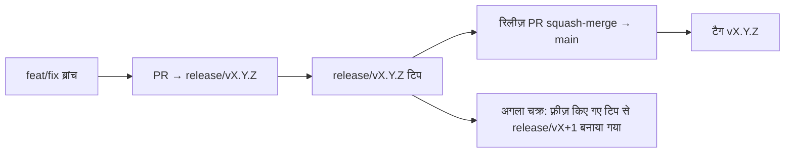

# Branching & Release Model (हिन्दी)

🌐 **Languages:** 🇺🇸 [English](../../../../ops/BRANCHING_MODEL.md) · 🇪🇹 [am](../../../am/docs/ops/BRANCHING_MODEL.md) · 🇸🇦 [ar](../../../ar/docs/ops/BRANCHING_MODEL.md) · 🇦🇿 [az](../../../az/docs/ops/BRANCHING_MODEL.md) · 🇧🇬 [bg](../../../bg/docs/ops/BRANCHING_MODEL.md) · 🇧🇩 [bn](../../../bn/docs/ops/BRANCHING_MODEL.md) · 🇨🇿 [cs](../../../cs/docs/ops/BRANCHING_MODEL.md) · 🇩🇰 [da](../../../da/docs/ops/BRANCHING_MODEL.md) · 🇩🇪 [de](../../../de/docs/ops/BRANCHING_MODEL.md) · 🇬🇷 [el](../../../el/docs/ops/BRANCHING_MODEL.md) · 🇪🇸 [es](../../../es/docs/ops/BRANCHING_MODEL.md) · 🇪🇪 [et](../../../et/docs/ops/BRANCHING_MODEL.md) · 🇮🇷 [fa](../../../fa/docs/ops/BRANCHING_MODEL.md) · 🇫🇮 [fi](../../../fi/docs/ops/BRANCHING_MODEL.md) · 🇫🇷 [fr](../../../fr/docs/ops/BRANCHING_MODEL.md) · 🇮🇪 [ga](../../../ga/docs/ops/BRANCHING_MODEL.md) · 🇮🇳 [gu](../../../gu/docs/ops/BRANCHING_MODEL.md) · 🇳🇬 [ha](../../../ha/docs/ops/BRANCHING_MODEL.md) · 🇮🇱 [he](../../../he/docs/ops/BRANCHING_MODEL.md) · 🇭🇷 [hr](../../../hr/docs/ops/BRANCHING_MODEL.md) · 🇭🇺 [hu](../../../hu/docs/ops/BRANCHING_MODEL.md) · 🇦🇲 [hy](../../../hy/docs/ops/BRANCHING_MODEL.md) · 🇮🇩 [id](../../../id/docs/ops/BRANCHING_MODEL.md) · 🇳🇬 [ig](../../../ig/docs/ops/BRANCHING_MODEL.md) · 🇮🇹 [it](../../../it/docs/ops/BRANCHING_MODEL.md) · 🇯🇵 [ja](../../../ja/docs/ops/BRANCHING_MODEL.md) · 🇬🇪 [ka](../../../ka/docs/ops/BRANCHING_MODEL.md) · 🇰🇭 [km](../../../km/docs/ops/BRANCHING_MODEL.md) · 🇮🇳 [kn](../../../kn/docs/ops/BRANCHING_MODEL.md) · 🇰🇷 [ko](../../../ko/docs/ops/BRANCHING_MODEL.md) · 🇱🇹 [lt](../../../lt/docs/ops/BRANCHING_MODEL.md) · 🇱🇻 [lv](../../../lv/docs/ops/BRANCHING_MODEL.md) · 🇮🇳 [ml](../../../ml/docs/ops/BRANCHING_MODEL.md) · 🇮🇳 [mr](../../../mr/docs/ops/BRANCHING_MODEL.md) · 🇲🇾 [ms](../../../ms/docs/ops/BRANCHING_MODEL.md) · 🇲🇹 [mt](../../../mt/docs/ops/BRANCHING_MODEL.md) · 🇲🇲 [my](../../../my/docs/ops/BRANCHING_MODEL.md) · 🇳🇵 [ne](../../../ne/docs/ops/BRANCHING_MODEL.md) · 🇳🇱 [nl](../../../nl/docs/ops/BRANCHING_MODEL.md) · 🇳🇴 [no](../../../no/docs/ops/BRANCHING_MODEL.md) · 🇮🇳 [or](../../../or/docs/ops/BRANCHING_MODEL.md) · 🇮🇳 [pa](../../../pa/docs/ops/BRANCHING_MODEL.md) · 🇵🇭 [phi](../../../phi/docs/ops/BRANCHING_MODEL.md) · 🇵🇱 [pl](../../../pl/docs/ops/BRANCHING_MODEL.md) · 🇵🇹 [pt](../../../pt/docs/ops/BRANCHING_MODEL.md) · 🇧🇷 [pt-BR](../../../pt-BR/docs/ops/BRANCHING_MODEL.md) · 🇷🇴 [ro](../../../ro/docs/ops/BRANCHING_MODEL.md) · 🇷🇺 [ru](../../../ru/docs/ops/BRANCHING_MODEL.md) · 🇱🇰 [si](../../../si/docs/ops/BRANCHING_MODEL.md) · 🇸🇰 [sk](../../../sk/docs/ops/BRANCHING_MODEL.md) · 🇸🇮 [sl](../../../sl/docs/ops/BRANCHING_MODEL.md) · 🇷🇸 [sr](../../../sr/docs/ops/BRANCHING_MODEL.md) · 🇸🇪 [sv](../../../sv/docs/ops/BRANCHING_MODEL.md) · 🇰🇪 [sw](../../../sw/docs/ops/BRANCHING_MODEL.md) · 🇮🇳 [ta](../../../ta/docs/ops/BRANCHING_MODEL.md) · 🇮🇳 [te](../../../te/docs/ops/BRANCHING_MODEL.md) · 🇹🇭 [th](../../../th/docs/ops/BRANCHING_MODEL.md) · 🇹🇷 [tr](../../../tr/docs/ops/BRANCHING_MODEL.md) · 🇺🇦 [uk-UA](../../../uk-UA/docs/ops/BRANCHING_MODEL.md) · 🇵🇰 [ur](../../../ur/docs/ops/BRANCHING_MODEL.md) · 🇺🇿 [uz](../../../uz/docs/ops/BRANCHING_MODEL.md) · 🇻🇳 [vi](../../../vi/docs/ops/BRANCHING_MODEL.md) · 🇳🇬 [yo](../../../yo/docs/ops/BRANCHING_MODEL.md) · 🇨🇳 [zh-CN](../../../zh-CN/docs/ops/BRANCHING_MODEL.md) · 🇹🇼 [zh-TW](../../../zh-TW/docs/ops/BRANCHING_MODEL.md)

---

OmniRoute एक **समानांतर-चक्र** रिलीज़ मॉडल का उपयोग करता है: सक्रिय चक्र के लिए एक समर्पित `release/vX.Y.Z`
ब्रांच, प्रकाशित लाइन के लिए `main`, और उस चक्र के शिप होने पर एक अपरिवर्तनीय
`vX.Y.Z` टैग। कमिट का `release/*` _और_ `main` दोनों पर आना अपेक्षित है — यह कोई गड़बड़ी नहीं है।

मेंटेनर से संबंधित विवरण `CLAUDE.md` (कठोर नियम #21) और
[RELEASE_CHECKLIST.md](./RELEASE_CHECKLIST.md) में उपलब्ध है। यह पृष्ठ योगदानकर्ताओं के लिए सार्वजनिक
सारांश है।

## एक नज़र में

| रेफ़             | भूमिका                                                                                |
| ---------------- | ------------------------------------------------------------------------------------- |
| `release/vX.Y.Z` | **सक्रिय चक्र** — उस संस्करण के लिए रोज़मर्रा का विकास और PR मर्ज                     |
| `main`           | **प्रकाशित लाइन** — रिलीज़ शिप होने पर squash-merge के माध्यम से चक्र प्राप्त करती है |
| `vX.Y.Z` (टैग)   | **शिप मार्कर** — रिलीज़ के समय बनाया गया अपरिवर्तनीय “क्या शिप हुआ” पॉइंटर            |



## मेरे PR को किसे लक्षित करना चाहिए?

**सक्रिय `release/vX.Y.Z` ब्रांच को लक्षित करें — `main` को नहीं।**

1. सबसे ऊँची खुली `release/v*` ब्रांच खोजें (लेखन के समय उदाहरण:
   `release/v3.8.49`)।
2. उस टिप से ब्रांच बनाएँ (`git fetch` + checkout / rebase करके उस पर जाएँ)।
3. **base = वह `release/vX.Y.Z`** रखते हुए PR खोलें।

`main` रोज़मर्रा की इंटीग्रेशन ब्रांच नहीं है। `main` के विरुद्ध खोले गए PR को
आमतौर पर मर्ज से पहले फिर से लक्षित करना पड़ता है।

## रिलीज़ फ़्रीज़ (समानांतर चक्र)

जब किसी रिलीज़ का मिलान किया जा रहा होता है, तब `release-freeze` लेबल वाला एक मार्कर इश्यू
खोला जाता है। इससे **विकास नहीं रुकता**:

- फ़्रीज़ किया गया `release/vX.Y.Z` उस शिप के रिलीज़ कैप्टन के नियंत्रण में होता है।
- अगले चक्र का `release/vX+1` फ़्रीज़ किए गए टिप से बनाया जाता है, ताकि योगदानकर्ता
  अपना कार्य मर्ज करना जारी रख सकें।
- अब भी फ़्रीज़ की गई ब्रांच को लक्षित करने वाले खुले PR को सक्रिय (सबसे ऊँची)
  `release/v*` ब्रांच पर **फिर से लक्षित** किया जाना चाहिए।

यह मानने से पहले कि आपकी इच्छित ब्रांच मर्ज की जा सकती है, जाँचें कि कोई फ़्रीज़ खुला तो नहीं है:

```bash
gh issue list --repo diegosouzapw/OmniRoute --label release-freeze --state open
```

मर्ज की कार्यप्रणाली (स्वामी का `queue` लेबल → Mergify) का दस्तावेज़ीकरण
[MERGE_TRAIN.md](./MERGE_TRAIN.md) में किया गया है।

## ब्रांच और टैग दोनों क्यों?

| आर्टिफ़ैक्ट      | जीवनकाल              | उद्देश्य                                                                      |
| ---------------- | -------------------- | ----------------------------------------------------------------------------- |
| `release/vX.Y.Z` | प्रगति पर मौजूद चक्र | समीक्षा किए गए PR एकत्र करता है, CI को हरा बनाए रखता है और PR का आधार होता है |
| टैग `vX.Y.Z`     | हमेशा के लिए         | npm / GitHub Releases पर शिप हुए सटीक बिट्स को चिह्नित करता है                |

ब्रांच कार्यशाला है; टैग सीलबंद पैकेज है। `main` पर squash-merge के बाद,
अगला चक्र `release/vX+1` पर जारी रहता है और उसे पिछले रिलीज़ PR के पूरा होने की
प्रतीक्षा नहीं करनी पड़ती।

## संबंधित दस्तावेज़

- [CONTRIBUTING.md](../../CONTRIBUTING.md) — सेटअप, परीक्षण, PR चेकलिस्ट
- [RELEASE_CHECKLIST.md](./RELEASE_CHECKLIST.md) — शिप करने से पहले सत्यापन
- [MERGE_TRAIN.md](./MERGE_TRAIN.md) — मर्ज क्यू और फ़ॉलबैक ट्रेन
- [RELEASE_GREEN.md](./RELEASE_GREEN.md) — रिलीज़ टिप को हरा बनाए रखना
