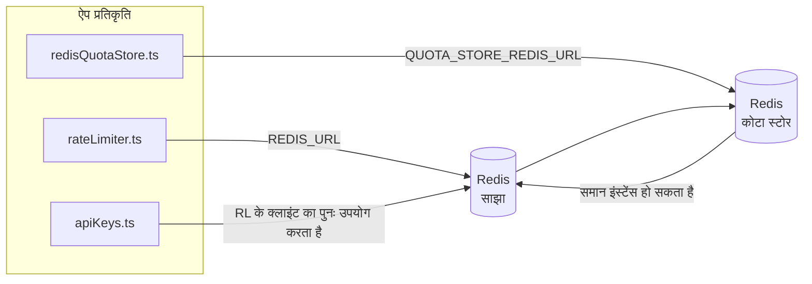

# Redis Production Configuration Guide (हिन्दी)

🌐 **Languages:** 🇺🇸 [English](../../../../ops/REDIS_PRODUCTION_CONFIG.md) · 🇪🇹 [am](../../../am/docs/ops/REDIS_PRODUCTION_CONFIG.md) · 🇸🇦 [ar](../../../ar/docs/ops/REDIS_PRODUCTION_CONFIG.md) · 🇦🇿 [az](../../../az/docs/ops/REDIS_PRODUCTION_CONFIG.md) · 🇧🇬 [bg](../../../bg/docs/ops/REDIS_PRODUCTION_CONFIG.md) · 🇧🇩 [bn](../../../bn/docs/ops/REDIS_PRODUCTION_CONFIG.md) · 🇨🇿 [cs](../../../cs/docs/ops/REDIS_PRODUCTION_CONFIG.md) · 🇩🇰 [da](../../../da/docs/ops/REDIS_PRODUCTION_CONFIG.md) · 🇩🇪 [de](../../../de/docs/ops/REDIS_PRODUCTION_CONFIG.md) · 🇬🇷 [el](../../../el/docs/ops/REDIS_PRODUCTION_CONFIG.md) · 🇪🇸 [es](../../../es/docs/ops/REDIS_PRODUCTION_CONFIG.md) · 🇪🇪 [et](../../../et/docs/ops/REDIS_PRODUCTION_CONFIG.md) · 🇮🇷 [fa](../../../fa/docs/ops/REDIS_PRODUCTION_CONFIG.md) · 🇫🇮 [fi](../../../fi/docs/ops/REDIS_PRODUCTION_CONFIG.md) · 🇫🇷 [fr](../../../fr/docs/ops/REDIS_PRODUCTION_CONFIG.md) · 🇮🇪 [ga](../../../ga/docs/ops/REDIS_PRODUCTION_CONFIG.md) · 🇮🇳 [gu](../../../gu/docs/ops/REDIS_PRODUCTION_CONFIG.md) · 🇳🇬 [ha](../../../ha/docs/ops/REDIS_PRODUCTION_CONFIG.md) · 🇮🇱 [he](../../../he/docs/ops/REDIS_PRODUCTION_CONFIG.md) · 🇭🇷 [hr](../../../hr/docs/ops/REDIS_PRODUCTION_CONFIG.md) · 🇭🇺 [hu](../../../hu/docs/ops/REDIS_PRODUCTION_CONFIG.md) · 🇦🇲 [hy](../../../hy/docs/ops/REDIS_PRODUCTION_CONFIG.md) · 🇮🇩 [id](../../../id/docs/ops/REDIS_PRODUCTION_CONFIG.md) · 🇳🇬 [ig](../../../ig/docs/ops/REDIS_PRODUCTION_CONFIG.md) · 🇮🇹 [it](../../../it/docs/ops/REDIS_PRODUCTION_CONFIG.md) · 🇯🇵 [ja](../../../ja/docs/ops/REDIS_PRODUCTION_CONFIG.md) · 🇬🇪 [ka](../../../ka/docs/ops/REDIS_PRODUCTION_CONFIG.md) · 🇰🇭 [km](../../../km/docs/ops/REDIS_PRODUCTION_CONFIG.md) · 🇮🇳 [kn](../../../kn/docs/ops/REDIS_PRODUCTION_CONFIG.md) · 🇰🇷 [ko](../../../ko/docs/ops/REDIS_PRODUCTION_CONFIG.md) · 🇱🇹 [lt](../../../lt/docs/ops/REDIS_PRODUCTION_CONFIG.md) · 🇱🇻 [lv](../../../lv/docs/ops/REDIS_PRODUCTION_CONFIG.md) · 🇮🇳 [ml](../../../ml/docs/ops/REDIS_PRODUCTION_CONFIG.md) · 🇮🇳 [mr](../../../mr/docs/ops/REDIS_PRODUCTION_CONFIG.md) · 🇲🇾 [ms](../../../ms/docs/ops/REDIS_PRODUCTION_CONFIG.md) · 🇲🇹 [mt](../../../mt/docs/ops/REDIS_PRODUCTION_CONFIG.md) · 🇲🇲 [my](../../../my/docs/ops/REDIS_PRODUCTION_CONFIG.md) · 🇳🇵 [ne](../../../ne/docs/ops/REDIS_PRODUCTION_CONFIG.md) · 🇳🇱 [nl](../../../nl/docs/ops/REDIS_PRODUCTION_CONFIG.md) · 🇳🇴 [no](../../../no/docs/ops/REDIS_PRODUCTION_CONFIG.md) · 🇮🇳 [or](../../../or/docs/ops/REDIS_PRODUCTION_CONFIG.md) · 🇮🇳 [pa](../../../pa/docs/ops/REDIS_PRODUCTION_CONFIG.md) · 🇵🇭 [phi](../../../phi/docs/ops/REDIS_PRODUCTION_CONFIG.md) · 🇵🇱 [pl](../../../pl/docs/ops/REDIS_PRODUCTION_CONFIG.md) · 🇵🇹 [pt](../../../pt/docs/ops/REDIS_PRODUCTION_CONFIG.md) · 🇧🇷 [pt-BR](../../../pt-BR/docs/ops/REDIS_PRODUCTION_CONFIG.md) · 🇷🇴 [ro](../../../ro/docs/ops/REDIS_PRODUCTION_CONFIG.md) · 🇷🇺 [ru](../../../ru/docs/ops/REDIS_PRODUCTION_CONFIG.md) · 🇱🇰 [si](../../../si/docs/ops/REDIS_PRODUCTION_CONFIG.md) · 🇸🇰 [sk](../../../sk/docs/ops/REDIS_PRODUCTION_CONFIG.md) · 🇸🇮 [sl](../../../sl/docs/ops/REDIS_PRODUCTION_CONFIG.md) · 🇷🇸 [sr](../../../sr/docs/ops/REDIS_PRODUCTION_CONFIG.md) · 🇸🇪 [sv](../../../sv/docs/ops/REDIS_PRODUCTION_CONFIG.md) · 🇰🇪 [sw](../../../sw/docs/ops/REDIS_PRODUCTION_CONFIG.md) · 🇮🇳 [ta](../../../ta/docs/ops/REDIS_PRODUCTION_CONFIG.md) · 🇮🇳 [te](../../../te/docs/ops/REDIS_PRODUCTION_CONFIG.md) · 🇹🇭 [th](../../../th/docs/ops/REDIS_PRODUCTION_CONFIG.md) · 🇹🇷 [tr](../../../tr/docs/ops/REDIS_PRODUCTION_CONFIG.md) · 🇺🇦 [uk-UA](../../../uk-UA/docs/ops/REDIS_PRODUCTION_CONFIG.md) · 🇵🇰 [ur](../../../ur/docs/ops/REDIS_PRODUCTION_CONFIG.md) · 🇺🇿 [uz](../../../uz/docs/ops/REDIS_PRODUCTION_CONFIG.md) · 🇻🇳 [vi](../../../vi/docs/ops/REDIS_PRODUCTION_CONFIG.md) · 🇳🇬 [yo](../../../yo/docs/ops/REDIS_PRODUCTION_CONFIG.md) · 🇨🇳 [zh-CN](../../../zh-CN/docs/ops/REDIS_PRODUCTION_CONFIG.md) · 🇹🇼 [zh-TW](../../../zh-TW/docs/ops/REDIS_PRODUCTION_CONFIG.md)

---

## अवलोकन

OmniRoute में Redis एक **वैकल्पिक, गैर-अनिवार्य निर्भरता** है — Redis अनुपलब्ध होने पर एप्लिकेशन सुचारु रूप से सीमित कार्यक्षमता (इन-मेमोरी
फ़ॉलबैक) पर चला जाता है। प्रोडक्शन में Redis को ट्यून करने से चार अलग-अलग
कार्यभारों की विलंबता कम होती है:

| कार्यभार              | ड्राइवर                       | क्लाइंट फ़ैक्टरी                               | कुंजी पैटर्न                                                    |
| --------------------- | ----------------------------- | ---------------------------------------------- | --------------------------------------------------------------- |
| दर सीमित करना         | `rateLimiter.ts`              | `getRedisClient()` — लेज़ी `ioredis` सिंगलटन   | `<prefix>rl:*` Lua‑एटॉमिक दर-सीमा विंडो                         |
| प्रमाणीकरण कैश        | `apiKeys.ts`                  | `rateLimiter` के क्लाइंट का पुनः उपयोग करता है | TTL के साथ `<prefix>auth:api_key:<sha256>`                      |
| कोटा स्टोर            | `redisQuotaStore.ts`          | अलग `getRedisClient(url)` सिंगलटन              | `<prefix>quota:*` प्रत्येक इंस्टेंस के लिए कॉन्फ़िगर करने योग्य |
| वार्मअप सर्किट ब्रेकर | `redisCircuitBreakerStore.ts` | `circuitBreakerFactory.ts` में अलग क्लाइंट     | `<prefix>warmup:cb:<connectionId>`                              |

सभी चार कार्यभार एक ही नेमस्पेस प्रीफ़िक्स साझा करते हैं, ताकि OmniRoute एक
Redis इंस्टेंस (जैसे `127.0.0.1:6379`) पर अन्य ऐप्स के साथ मौजूद रह सके। [कुंजी नेमस्पेसिंग](#key-namespacing) देखें।

---

## वर्तमान कॉन्फ़िगरेशन (कोड डिफ़ॉल्ट)

| सेटिंग                                      | मान                                                       | स्थान                                                                                 |
| ------------------------------------------- | --------------------------------------------------------- | ------------------------------------------------------------------------------------- |
| `REDIS_URL` एनवायरनमेंट वेरिएबल             | `redis://redis:6379` (compose), वैकल्पिक                  | `rateLimiter.ts:5`, `.env.example`                                                    |
| `REDIS_KEY_PREFIX` एनवायरनमेंट वेरिएबल      | `omniroute:` (डिफ़ॉल्ट)                                   | `rateLimiter.ts`, `redisQuotaStore.ts`, `redisCircuitBreakerStore.ts`, `.env.example` |
| `QUOTA_STORE_REDIS_URL` एनवायरनमेंट वेरिएबल | अलग, `REDIS_URL` से भिन्न हो सकता है                      | `quota/storeFactory.ts`                                                               |
| `QUOTA_STORE_DRIVER`                        | `"sqlite"` (डिफ़ॉल्ट), `"redis"` वैकल्पिक                 | `quota/storeFactory.ts`                                                               |
| ioredis `maxRetriesPerRequest`              | `3`                                                       | `rateLimiter.ts` क्लाइंट निर्माण                                                      |
| `enableReadyCheck`                          | सेट नहीं है (ioredis डिफ़ॉल्ट: `true`)                    | —                                                                                     |
| `lazyConnect`                               | सेट नहीं है (ioredis डिफ़ॉल्ट: `false`)                   | —                                                                                     |
| `retryStrategy`                             | सेट नहीं है (ioredis डिफ़ॉल्ट: 200ms आधार, एक्सपोनेंशियल) | —                                                                                     |
| TLS / पासवर्ड / DB इंडेक्स                  | **कॉन्फ़िगर नहीं किया गया**                               | —                                                                                     |
| Sentinel / Cluster                          | **कॉन्फ़िगर नहीं किया गया** — केवल स्टैंडअलोन सिंगल-नोड   | —                                                                                     |

---

## कुंजी नेमस्पेसिंग

OmniRoute, होस्ट पर चलने वाली अन्य सभी चीज़ों के साथ एक Redis इंस्टेंस साझा करता है। नेमस्पेस के बिना,
`auth:api_key:<sha256>` या `rl:*` जैसी कुंजियाँ उसी Redis का उपयोग करने वाले अन्य एप्लिकेशन की कुंजियों
से टकरा सकती हैं (यह इंस्टेंस अन्य सेवाओं के साथ `127.0.0.1:6379` पर Redis चलाता है)।

OmniRoute की **प्रत्येक** कुंजी के आगे प्रीफ़िक्स लगाने के लिए `REDIS_KEY_PREFIX` को किसी गैर-रिक्त स्ट्रिंग पर सेट करें:

```bash
# .env — OmniRoute की सभी कुंजियाँ omniroute:rl:*, omniroute:auth:*, omniroute:quota:*, omniroute:warmup:cb:* बन जाती हैं
REDIS_KEY_PREFIX=omniroute:
```

- **डिफ़ॉल्ट:** `omniroute:` (`REDIS_KEY_PREFIX` के सेट न होने या रिक्त होने पर लागू होता है)।
- **इन पर लागू:** दर सीमक + प्रमाणीकरण कैश (`keyPrefix` के माध्यम से साझा `ioredis` क्लाइंट), और
  कोटा स्टोर (`KEY_PREFIX = "${REDIS_KEY_PREFIX}quota"`) तथा वार्मअप सर्किट ब्रेकर
  (`KEY_PREFIX = "${REDIS_KEY_PREFIX}warmup:cb:"`)।
- Redis में कुंजियाँ पहले से मौजूद होने पर **प्रीफ़िक्स बदलने से** पुरानी कुंजियाँ अनाथ हो जाती हैं (वे
  TTL / LRU के माध्यम से समाप्त हो जाती हैं)। इसे बदलना सुरक्षित है; किसी माइग्रेशन की आवश्यकता नहीं है। इसका एक अपवाद
  निषिद्ध के रूप में चिह्नित कनेक्शन की वार्मअप सर्किट-ब्रेकर कुंजी है: इसे TTL के बिना स्थायी रखा जाता है, इसलिए
  बची हुई कुंजियों को `redis-cli --scan --pattern '<old-prefix>warmup:cb:*'` से सूचीबद्ध करें और उन्हें हटाएँ।
- **ioredis `keyPrefix`** लिखते समय प्रीफ़िक्स को स्वचालित रूप से आगे जोड़ता है **और** पढ़ते समय उसे हटा देता है,
  इसलिए एप्लिकेशन कोड को प्रीफ़िक्स कभी दिखाई नहीं देता।

---

## अनुशंसित प्रोडक्शन ट्यूनिंग

### 1. कनेक्शन पूल / क्लाइंट विकल्प (ioredis `Redis` कंस्ट्रक्टर)

वर्तमान कोड बिना किसी कस्टम विकल्प के एकल `new Redis(url)` बनाता है। प्रोडक्शन
मल्टी‑रेप्लिका डिप्लॉयमेंट के लिए, कोड में क्लाइंट फ़ैक्टरी पास करें या `getRedisClient()` को रैप करें:

```typescript
const redis = new Redis(REDIS_URL, {
  maxRetriesPerRequest: null, // पुनः प्रयास की कोई सीमा नहीं; retryStrategy को निर्णय लेने दें
  enableReadyCheck: true, // कॉल स्वीकार करने से पहले सत्यापित करें कि सर्वर तैयार है
  lazyConnect: true, // निर्माण के समय कनेक्ट न करें; पहली कॉल की प्रतीक्षा करें
  retryStrategy: (times) => {
    if (times > 10) return null; // 10 पुनः प्रयासों के बाद छोड़ दें → बाद में फिर से कनेक्ट करें
    return Math.min(times * 200, 5000); // 200ms, 400ms, …, अधिकतम 5s
  },
  enableAutoPipelining: true, // समवर्ती कमांड को एक TCP राइट में संयोजित करें
  keepAlive: 10000, // प्रत्येक 10s पर TCP कीप‑अलाइव
});
```

**मुख्य समझौते:**

- `maxRetriesPerRequest: null` + `retryStrategy` — प्रोडक्शन के लिए बेहतर है, ताकि अस्थायी
  Redis रीस्टार्ट प्रत्येक अनुरोध को तुरंत विफल न करें। `checkRateLimit()` में इन-मेमोरी फ़ॉलबैक
  विफलता पथ को संभालता है।
- `lazyConnect: true` — सर्वर द्वारा कनेक्शन स्वीकार करना शुरू करने से पहले Redis के उपलब्ध
  होने पर स्टार्टअप निर्भरता से बचाता है।
- `enableAutoPipelining: true` — समवर्ती रेट-लिमिट जाँचों के लिए राउंड-ट्रिप कम करता है;
  एकल कनेक्शन पर >50 RPS होने पर लाभदायक है।

### 2. Redis सर्वर कॉन्फ़िगरेशन (`redis.conf`)

```
# मेमोरी
maxmemory 80%                        # OS पेज कैश के लिए जगह छोड़ें
maxmemory-policy allkeys-lru         # दबाव में पुराने ऑथ कैश प्रविष्टियों को निष्कासित करें

# परसिस्टेंस (वैकल्पिक — OmniRoute इसके बिना भी क्रैश‑सेफ़ है)
save 300 1                           # यदि ≥1 कुंजी बदली हो, तो कम-से-कम हर 5 मिनट में स्नैपशॉट लें
appendonly no                        # AOF आवश्यक नहीं; डेटा पुनः बनाया जा सकता है
appendfsync no                       # कोई fsync ओवरहेड नहीं (RDB पर्याप्त है)

# नेटवर्किंग
timeout 0                            # निष्क्रिय कनेक्शन को डिस्कनेक्ट न करें
tcp-keepalive 300                    # 5 मिनट का कीप‑अलाइव
tcp-backlog 511                      # अचानक बढ़ने वाले लोड के लिए कनेक्शन बैकलॉग

# प्रदर्शन
hz 10                                # डिफ़ॉल्ट; लेटेंसी‑संवेदनशील उपयोग के लिए 100
activedefrag yes                     # फ़्रैगमेंटेशन >10% होने पर स्वतः डीफ़्रैगमेंट करें
```

**`maxmemory-policy allkeys-lru` का समझौता:** मेमोरी दबाव में ऑथ कैश प्रविष्टियाँ
निष्कासित हो सकती हैं। यह सुरक्षित है — मिस होने पर `setCachedApiKey` हमेशा फिर से डेटा भरता है, और
SQLite फ़ॉलबैक आधिकारिक स्रोत है। रेट-लिमिटर Lua स्क्रिप्ट छोटी कुंजियाँ बनाती है, जिन्हें
डिज़ाइन के अनुसार कम समय तक जीवित रहना होता है।

### 3. Docker Compose सेटिंग्स

प्रोडक्शन Compose (`docker-compose.prod.yml`) में `redis:8.6.2-alpine` का उपयोग होता है। यह जोड़ें:

```yaml
redis:
  image: redis:8.6.2-alpine
  command:
    [
      "redis-server",
      "--maxmemory",
      "512mb",
      "--maxmemory-policy",
      "allkeys-lru",
      "--activedefrag",
      "yes",
      "--save",
      "300 1",
    ]
  healthcheck:
    test: ["CMD", "redis-cli", "ping"]
    interval: 10s
    timeout: 3s
    retries: 3
    start_period: 5s
```

### 4. मल्टी‑इंस्टेंस / स्केलिंग संबंधी विचार

**सभी रेप्लिका के लिए एकल Redis** — रेट-लिमिटर Lua स्क्रिप्ट एकल
आधिकारिक कुंजी-स्पेस पर निर्भर करती है। रेप्लिका के पीछे कई Redis इंस्टेंस होने से एटॉमिकता
समाप्त हो जाएगी और बजट दोगुना हो जाएगा। सभी एप्लिकेशन रेप्लिका के लिए एकल Redis
(या फ़ेलओवर वाला Redis Sentinel क्लस्टर) उपयोग करें।

**कनेक्शन संख्या:** प्रत्येक एप्लिकेशन रेप्लिका Redis के लिए **2 TCP कनेक्शन** खोलता है
(रेट लिमिटर क्लाइंट + कोटा स्टोर क्लाइंट)। 10 रेप्लिका पर → 20 कनेक्शन होंगे, जो
डिफ़ॉल्ट Redis इंस्टेंस की 10k कनेक्शन सीमा के भीतर हैं।

### 5. मॉनिटरिंग

हेल्थ-चेक एंडपॉइंट के माध्यम से उजागर करें:

```typescript
// src/app/api/monitoring/health/route.ts पहले से ही rateLimiter फ़ंक्शन कॉल करता है
// Redis-विशिष्ट जाँचें जोड़ें:
//   1. ioredis .ping() के माध्यम से PING लेटेंसी
//   2. INFO memory के माध्यम से मेमोरी उपयोग
//   3. INFO clients के माध्यम से कनेक्शन संख्या
//   4. maxmemory-policy की हिट दर (evicted_keys / keyspace_hits)
```

निगरानी के लिए प्रमुख मेट्रिक्स:

- **निष्कासित कुंजियाँ / सेकंड** — यदि लगातार शून्य से अधिक हो, तो `maxmemory` बढ़ाएँ
- **ब्लॉक किए गए क्लाइंट** — शून्य से अधिक होना धीमी Lua स्क्रिप्ट या उच्च प्रतिस्पर्धा का संकेत देता है
- **अस्वीकृत कनेक्शन** — कनेक्शन सीमा पूरी हो गई; 20 कनेक्शन पर ऐसा होना दुर्लभ है

---

## आर्किटेक्चर आरेख



---

## संदर्भ

| फ़ाइल                              | उद्देश्य                                                         |
| ---------------------------------- | ---------------------------------------------------------------- |
| `src/shared/utils/rateLimiter.ts`  | प्राथमिक Redis क्लाइंट, Lua दर-सीमा स्क्रिप्ट, इन-मेमोरी फ़ॉलबैक |
| `src/lib/db/apiKeys.ts`            | प्रमाणीकरण कैश — Redis→SQLite फ़ॉलबैक                            |
| `src/lib/quota/redisQuotaStore.ts` | वैकल्पिक कोटा स्टोर के लिए अलग Redis क्लाइंट                     |
| `src/lib/quota/storeFactory.ts`    | `sqlite` और `redis` कोटा ड्राइवरों के बीच स्विच करता है          |
| `docker-compose.prod.yml`          | प्रोडक्शन Redis कंटेनर (इमेज `redis:8.6.2-alpine`)               |
| `.env.example`                     | Redis एनवायरनमेंट वेरिएबल का दस्तावेज़ीकरण                       |
| `src/app/api/local/redis/`         | डेवलपमेंट कंटेनर ऑर्केस्ट्रेशन के लिए API रूट                    |
| `bin/cli/commands/redis.mjs`       | डेवलपमेंट कंटेनर ऑर्केस्ट्रेशन के लिए CLI कमांड                  |
