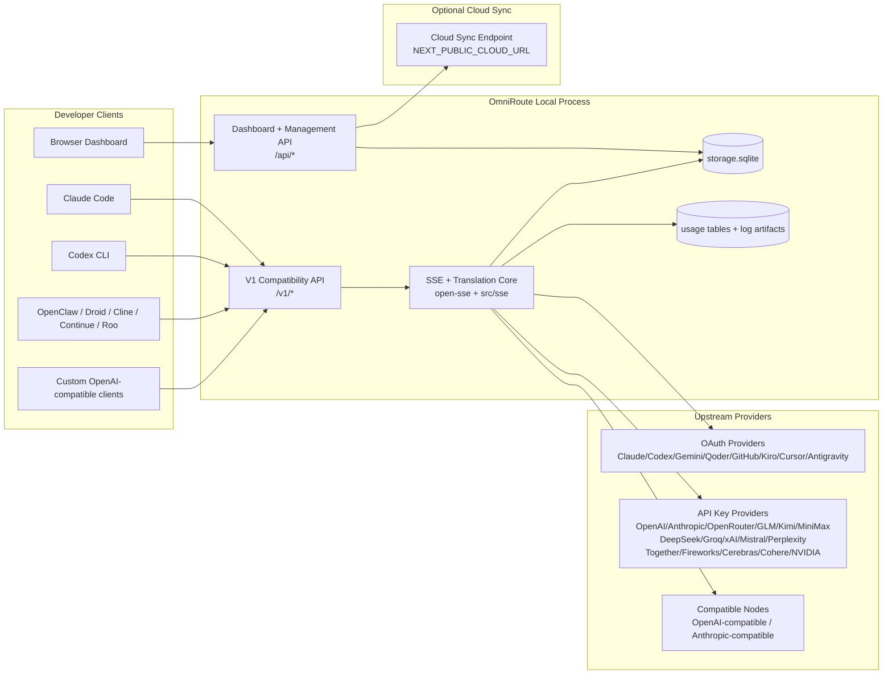
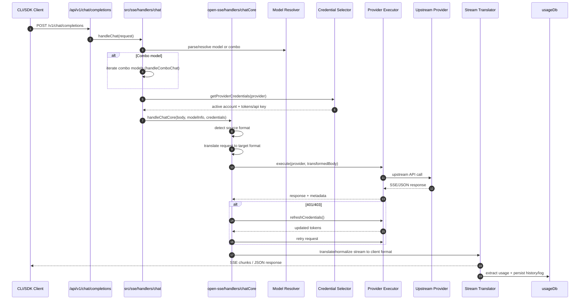
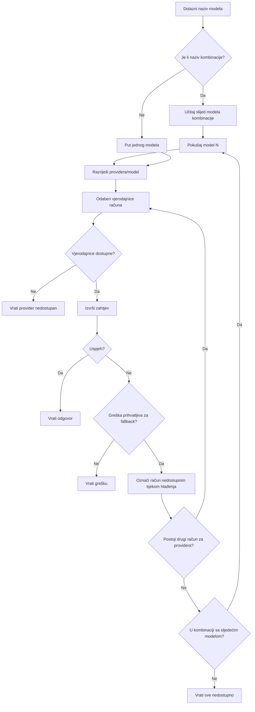
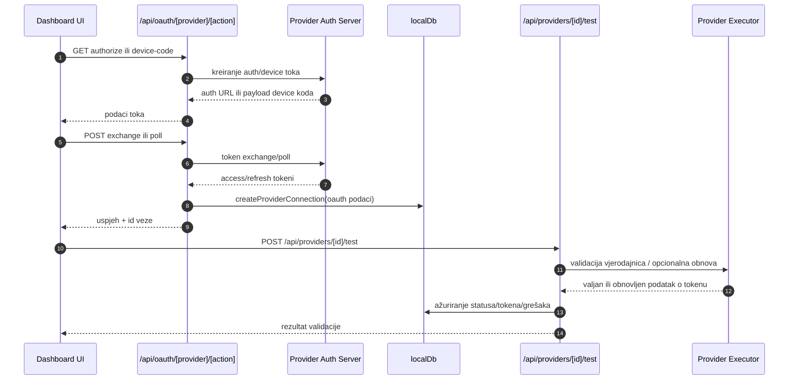
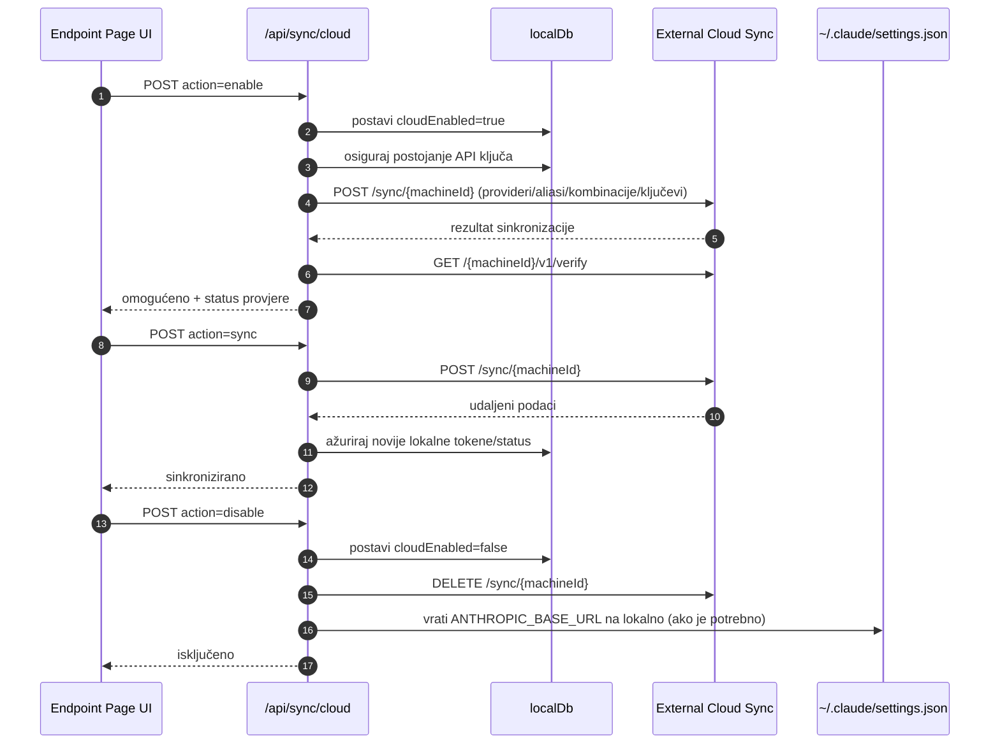
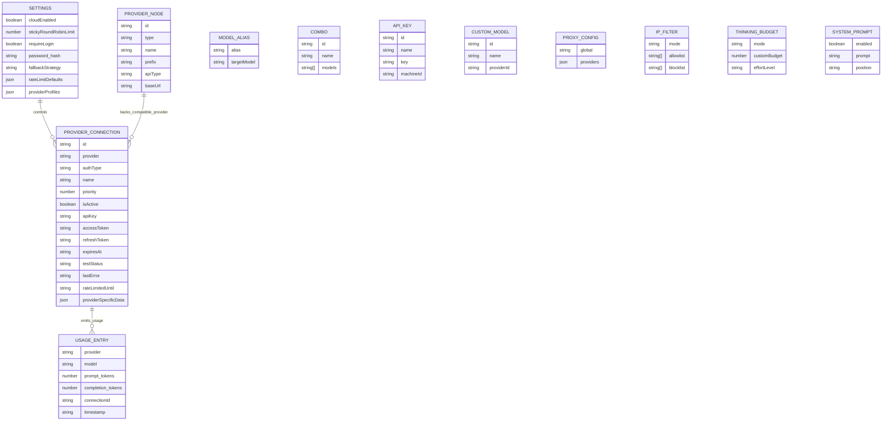
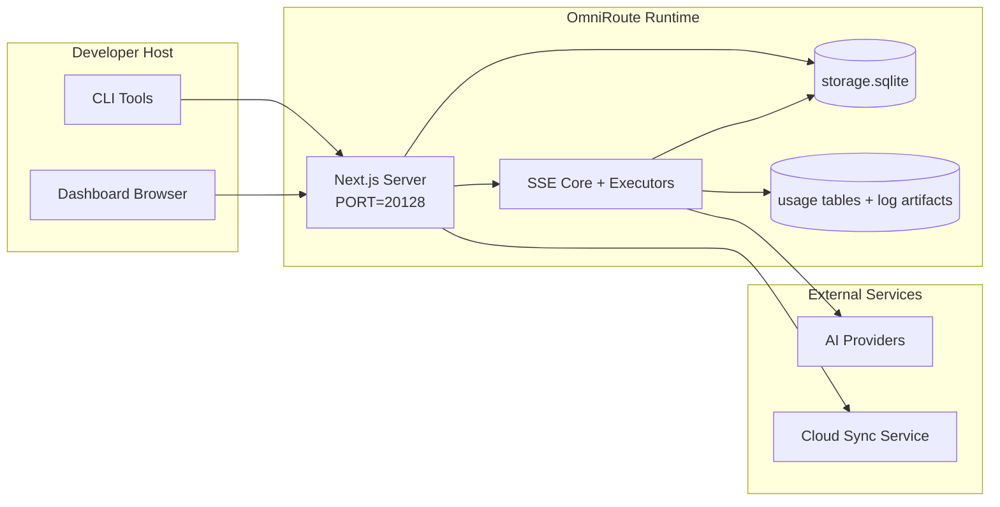

# ARCHITECTURE (Hrvatski)

🌐 **Languages:** 🇺🇸 [English](../../../../architecture/ARCHITECTURE.md) · 🇸🇦 [ar](../../../ar/docs/architecture/ARCHITECTURE.md) · 🇦🇿 [az](../../../az/docs/architecture/ARCHITECTURE.md) · 🇧🇬 [bg](../../../bg/docs/architecture/ARCHITECTURE.md) · 🇧🇩 [bn](../../../bn/docs/architecture/ARCHITECTURE.md) · 🇨🇿 [cs](../../../cs/docs/architecture/ARCHITECTURE.md) · 🇩🇰 [da](../../../da/docs/architecture/ARCHITECTURE.md) · 🇩🇪 [de](../../../de/docs/architecture/ARCHITECTURE.md) · 🇬🇷 [el](../../../el/docs/architecture/ARCHITECTURE.md) · 🇪🇸 [es](../../../es/docs/architecture/ARCHITECTURE.md) · 🇪🇪 [et](../../../et/docs/architecture/ARCHITECTURE.md) · 🇮🇷 [fa](../../../fa/docs/architecture/ARCHITECTURE.md) · 🇫🇮 [fi](../../../fi/docs/architecture/ARCHITECTURE.md) · 🇫🇷 [fr](../../../fr/docs/architecture/ARCHITECTURE.md) · 🇮🇪 [ga](../../../ga/docs/architecture/ARCHITECTURE.md) · 🇮🇳 [gu](../../../gu/docs/architecture/ARCHITECTURE.md) · 🇮🇱 [he](../../../he/docs/architecture/ARCHITECTURE.md) · 🇮🇳 [hi](../../../hi/docs/architecture/ARCHITECTURE.md) · 🇭🇺 [hu](../../../hu/docs/architecture/ARCHITECTURE.md) · 🇮🇩 [id](../../../id/docs/architecture/ARCHITECTURE.md) · 🇮🇹 [it](../../../it/docs/architecture/ARCHITECTURE.md) · 🇯🇵 [ja](../../../ja/docs/architecture/ARCHITECTURE.md) · 🇰🇷 [ko](../../../ko/docs/architecture/ARCHITECTURE.md) · 🇱🇹 [lt](../../../lt/docs/architecture/ARCHITECTURE.md) · 🇱🇻 [lv](../../../lv/docs/architecture/ARCHITECTURE.md) · 🇮🇳 [mr](../../../mr/docs/architecture/ARCHITECTURE.md) · 🇲🇾 [ms](../../../ms/docs/architecture/ARCHITECTURE.md) · 🇲🇹 [mt](../../../mt/docs/architecture/ARCHITECTURE.md) · 🇳🇱 [nl](../../../nl/docs/architecture/ARCHITECTURE.md) · 🇳🇴 [no](../../../no/docs/architecture/ARCHITECTURE.md) · 🇵🇭 [phi](../../../phi/docs/architecture/ARCHITECTURE.md) · 🇵🇱 [pl](../../../pl/docs/architecture/ARCHITECTURE.md) · 🇵🇹 [pt](../../../pt/docs/architecture/ARCHITECTURE.md) · 🇧🇷 [pt-BR](../../../pt-BR/docs/architecture/ARCHITECTURE.md) · 🇷🇴 [ro](../../../ro/docs/architecture/ARCHITECTURE.md) · 🇷🇺 [ru](../../../ru/docs/architecture/ARCHITECTURE.md) · 🇸🇰 [sk](../../../sk/docs/architecture/ARCHITECTURE.md) · 🇸🇮 [sl](../../../sl/docs/architecture/ARCHITECTURE.md) · 🇷🇸 [sr](../../../sr/docs/architecture/ARCHITECTURE.md) · 🇸🇪 [sv](../../../sv/docs/architecture/ARCHITECTURE.md) · 🇰🇪 [sw](../../../sw/docs/architecture/ARCHITECTURE.md) · 🇮🇳 [ta](../../../ta/docs/architecture/ARCHITECTURE.md) · 🇮🇳 [te](../../../te/docs/architecture/ARCHITECTURE.md) · 🇹🇭 [th](../../../th/docs/architecture/ARCHITECTURE.md) · 🇹🇷 [tr](../../../tr/docs/architecture/ARCHITECTURE.md) · 🇺🇦 [uk-UA](../../../uk-UA/docs/architecture/ARCHITECTURE.md) · 🇵🇰 [ur](../../../ur/docs/architecture/ARCHITECTURE.md) · 🇻🇳 [vi](../../../vi/docs/architecture/ARCHITECTURE.md) · 🇨🇳 [zh-CN](../../../zh-CN/docs/architecture/ARCHITECTURE.md) · 🇹🇼 [zh-TW](../../../zh-TW/docs/architecture/ARCHITECTURE.md)

---

# OmniRoute arhitektura

🌐 **Languages:** 🇺🇸 [English](../../../../architecture/ARCHITECTURE.md) · 🇸🇦 [ar](../../../ar/docs/architecture/ARCHITECTURE.md) · 🇦🇿 [az](../../../az/docs/architecture/ARCHITECTURE.md) · 🇧🇬 [bg](../../../bg/docs/architecture/ARCHITECTURE.md) · 🇧🇩 [bn](../../../bn/docs/architecture/ARCHITECTURE.md) · 🇨🇿 [cs](../../../cs/docs/architecture/ARCHITECTURE.md) · 🇩🇰 [da](../../../da/docs/architecture/ARCHITECTURE.md) · 🇩🇪 [de](../../../de/docs/architecture/ARCHITECTURE.md) · 🇬🇷 [el](../../../el/docs/architecture/ARCHITECTURE.md) · 🇪🇸 [es](../../../es/docs/architecture/ARCHITECTURE.md) · 🇪🇪 [et](../../../et/docs/architecture/ARCHITECTURE.md) · 🇮🇷 [fa](../../../fa/docs/architecture/ARCHITECTURE.md) · 🇫🇮 [fi](../../../fi/docs/architecture/ARCHITECTURE.md) · 🇫🇷 [fr](../../../fr/docs/architecture/ARCHITECTURE.md) · 🇮🇪 [ga](../../../ga/docs/architecture/ARCHITECTURE.md) · 🇮🇳 [gu](../../../gu/docs/architecture/ARCHITECTURE.md) · 🇮🇱 [he](../../../he/docs/architecture/ARCHITECTURE.md) · 🇮🇳 [hi](../../../hi/docs/architecture/ARCHITECTURE.md) · 🇭🇺 [hu](../../../hu/docs/architecture/ARCHITECTURE.md) · 🇮🇩 [id](../../../id/docs/architecture/ARCHITECTURE.md) · 🇮🇹 [it](../../../it/docs/architecture/ARCHITECTURE.md) · 🇯🇵 [ja](../../../ja/docs/architecture/ARCHITECTURE.md) · 🇰🇷 [ko](../../../ko/docs/architecture/ARCHITECTURE.md) · 🇱🇹 [lt](../../../lt/docs/architecture/ARCHITECTURE.md) · 🇱🇻 [lv](../../../lv/docs/architecture/ARCHITECTURE.md) · 🇮🇳 [mr](../../../mr/docs/architecture/ARCHITECTURE.md) · 🇲🇾 [ms](../../../ms/docs/architecture/ARCHITECTURE.md) · 🇲🇹 [mt](../../../mt/docs/architecture/ARCHITECTURE.md) · 🇳🇱 [nl](../../../nl/docs/architecture/ARCHITECTURE.md) · 🇳🇴 [no](../../../no/docs/architecture/ARCHITECTURE.md) · 🇵🇭 [phi](../../../phi/docs/architecture/ARCHITECTURE.md) · 🇵🇱 [pl](../../../pl/docs/architecture/ARCHITECTURE.md) · 🇵🇹 [pt](../../../pt/docs/architecture/ARCHITECTURE.md) · 🇧🇷 [pt-BR](../../../pt-BR/docs/architecture/ARCHITECTURE.md) · 🇷🇴 [ro](../../../ro/docs/architecture/ARCHITECTURE.md) · 🇷🇺 [ru](../../../ru/docs/architecture/ARCHITECTURE.md) · 🇸🇰 [sk](../../../sk/docs/architecture/ARCHITECTURE.md) · 🇸🇮 [sl](../../../sl/docs/architecture/ARCHITECTURE.md) · 🇷🇸 [sr](../../../sr/docs/architecture/ARCHITECTURE.md) · 🇸🇪 [sv](../../../sv/docs/architecture/ARCHITECTURE.md) · 🇰🇪 [sw](../../../sw/docs/architecture/ARCHITECTURE.md) · 🇮🇳 [ta](../../../ta/docs/architecture/ARCHITECTURE.md) · 🇮🇳 [te](../../../te/docs/architecture/ARCHITECTURE.md) · 🇹🇭 [th](../../../th/docs/architecture/ARCHITECTURE.md) · 🇹🇷 [tr](../../../tr/docs/architecture/ARCHITECTURE.md) · 🇺🇦 [uk-UA](../../../uk-UA/docs/architecture/ARCHITECTURE.md) · 🇵🇰 [ur](../../../ur/docs/architecture/ARCHITECTURE.md) · 🇻🇳 [vi](../../../vi/docs/architecture/ARCHITECTURE.md) · 🇨🇳 [zh-CN](../../../zh-CN/docs/architecture/ARCHITECTURE.md) · 🇹🇼 [zh-TW](../../../zh-TW/docs/architecture/ARCHITECTURE.md)

_Posljednje ažurirano: 2026-06-28_

## Sažetak

OmniRoute je lokalni AI usmjerivač (routing gateway) i nadzorna ploča izgrađena na Next.js.
Nudi jedinstvenu OpenAI-kompatibilnu krajnju točku (`/v1/*`) i usmjerava promet prema više uzvodnih (upstream) davatelja usluga s prevođenjem, rezervnim mehanizmima (fallback), obnavljanjem tokena i praćenjem upotrebe.

Ključne mogućnosti:

- OpenAI-kompatibilna API površina za CLI/alate (355 davatelja usluga, 108 izvršitelja)
- Prevođenje zahtjeva/odgovora između formata različitih davatelja usluga
- Rezervni mehanizam za kombinacije modela (višemodelni slijed)
- Strukturirani koraci kombinacije (`provider + model + connection`) s poretkom u vrijeme izvođenja putem `compositeTiers`
- Rezervni mehanizam na razini računa (više računa po davatelju usluga)
- Prethodna provjera kvote i odabir računa svjestan kvote (P2C) u glavnoj putanji chata
- Upravljanje OAuth + API-key povezivanjem davatelja usluga (22 OAuth modula davatelja usluga)
- Generiranje ugrađivanja (embedding) putem `/v1/embeddings` (18 davatelja usluga)
- Generiranje slika putem `/v1/images/generations` (10+ davatelja usluga, 20+ modela)
- Transkripcija zvuka putem `/v1/audio/transcriptions` (18 davatelja usluga)
- Pretvaranje teksta u govor putem `/v1/audio/speech` (24 ugrađena davatelja usluga)
- Generiranje videozapisa putem `/v1/videos/generations` (ComfyUI + SD WebUI)
- Generiranje glazbe putem `/v1/music/generations` (ComfyUI)
- Pretraživanje weba putem `/v1/search` (20 davatelja usluga)
- Moderiranje putem `/v1/moderations`
- Ponovno rangiranje (reranking) putem `/v1/rerank`
- Analiza oznaka razmišljanja (``) za modele s rezoniranjem
- Sanitizacija odgovora za strogu kompatibilnost s OpenAI SDK
- Normalizacija uloga (developer→system, system→user) za kompatibilnost među davateljima usluga
- Pretvaranje strukturiranog izlaza (json_schema → Gemini responseSchema)
- Lokalna postojanost podataka za davatelje usluga, ključeve, aliase, kombinacije, postavke, cijene (122 DB modula)
- Praćenje upotrebe/troškova i zapisivanje zahtjeva
- Opcionalna sinkronizacija u oblaku za sinkronizaciju stanja na više uređaja
- IP dozvoljeni/blokirani popis za kontrolu pristupa API-ju
- Upravljanje budžetom razmišljanja (passthrough/auto/custom/adaptive)
- Ubrizgavanje globalnog sistemskog upita (prompt)
- Praćenje sesija i otisak (fingerprinting)
- Poboljšano ograničavanje brzine po računu s profilima specifičnim za davatelja usluga
- Uzorak sklopke (circuit breaker) za otpornost davatelja usluga
- Zaštita od "thundering herd" efekta pomoću zaključavanja mutex-om
- Predmemorija deduplikacije zahtjeva temeljena na potpisu
- Domenski sloj: pravila troškova, politika rezervnog mehanizma, politika zaključavanja
- Context Relay: sažetci predaje sesije za kontinuitet rotacije računa
- Postojanost domenskog stanja (SQLite predmemorija s izravnim upisom za rezervne mehanizme, budžete, zaključavanja, sklopke)
- Sustav politika za centraliziranu procjenu zahtjeva (zaključavanje → budžet → rezervni mehanizam)
- Telemetrija zahtjeva s agregacijom kašnjenja p50/p95/p99
- Telemetrija ciljnih kombinacija i povijesno zdravlje ciljnih kombinacija putem `combo_execution_key` / `combo_step_id`
- Korelacijski ID (X-Request-Id) za sveobuhvatno praćenje
- Zapisivanje revizije usklađenosti s mogućnošću odjave po API ključu
- Okvir za procjenu (eval) radi osiguranja kvalitete LLM-a
- Nadzorna ploča zdravlja s prikazom statusa sklopke davatelja usluga u stvarnom vremenu
- MCP poslužitelj (110 alata) s 3 transportna protokola (stdio/SSE/Streamable HTTP)
- A2A poslužitelj (JSON-RPC 2.0 + SSE) s vještinama i životnim ciklusom zadataka
- Sustav memorije (izdvajanje, ubrizgavanje, dohvaćanje, sažimanje)
- Sustav vještina (registar, izvršitelj, sandbox, ugrađene vještine)
- MITM proxy s upravljanjem certifikatima i DNS obradom
- Middleware za zaštitu od ubrizgavanja upita (prompt injection)
- Cjevovod za kompresiju upita s Caveman, RTK, slaganim cjevovodima, kombinacijama kompresije, jezičnim paketima i analitikom
- ACP (Agent Communication Protocol) registar
- Modularni OAuth davatelji usluga (22 pojedinačna modula pod `src/lib/oauth/providers/`)
- Skripte za deinstalaciju/potpunu deinstalaciju
- Radnja popravka OAuth okoline
- WebSocket most za OpenAI-kompatibilne WS klijente (`/v1/ws`)
- Upravljanje tokenima za sinkronizaciju (izdavanje/opoziv, preuzimanje paketa konfiguracije s verzioniranjem putem ETag-a)
- GLM Thinking (`glmt`) prvorazredna prethodno postavljena konfiguracija davatelja usluga
- Hibridno brojanje tokena (`/messages/count_tokens` na strani davatelja usluga s procjenom kao rezervom)
- Automatsko sijanje aliasa modela (30+ normalizacija dijalekata među proxyjima prilikom pokretanja)
- Sigurno izlazno dohvaćanje (fetch) sa zaštitom od SSRF-a, blokiranjem privatnih URL-ova i podesivim ponovnim pokušajima
- Ponovni pokušaji chata svjesni razdoblja hlađenja (cooldown) s podesivim `requestRetry` i `maxRetryIntervalSec`
- Validacija okoline u vrijeme izvođenja pomoću Zod-a prilikom pokretanja
- Revizija usklađenosti v2 s paginacijom, CRUD događajima davatelja usluga i zapisivanjem validacije blokirane SSRF-om

Osnovni model izvođenja:

- Next.js rute aplikacije unutar `src/app/api/*` implementiraju i API-je nadzorne ploče i kompatibilne API-je
- Zajednička SSE/routing jezgra u `src/sse/*` + `open-sse/*` upravlja izvršavanjem davatelja usluga, prevođenjem, strujanjem (streaming), rezervnim mehanizmom i upotrebom

## Referentni dijagrami

Kanonski, verzijom kontrolirani Mermaid izvori za platformu v3.8.0 nalaze se u
[`docs/diagrams/`](../diagrams/README.md). Dva su prikazana ispod za orijentaciju;
ostali su povezani iz svojih vodiča specifičnih za domenu.


> Izvor: [diagrams/request-pipeline.mmd](../diagrams/request-pipeline.mmd)


> Izvor: [diagrams/resilience-3layers.mmd](../diagrams/resilience-3layers.mmd) — također povezan iz
> [RESILIENCE_GUIDE.md](./RESILIENCE_GUIDE.md) i referenca na otpornost u `CLAUDE.md`.

## Opseg i granice

### U opsegu

- Lokalni runtime gatewaya
- API-i za upravljanje nadzornom pločom
- Autentikacija providera i obnavljanje tokena
- Prevođenje zahtjeva i SSE streaming
- Lokalno stanje + perzistencija korištenja
- Opcionalna orkestracija sinkronizacije s cloudom

### Izvan opsega

- Implementacija cloud servisa iza `NEXT_PUBLIC_CLOUD_URL`
- SLA/upravljačka razina providera izvan lokalnog procesa
- Vanjski CLI binarni programi (Claude CLI, Codex CLI, itd.)

## Trenutna površina nadzorne ploče

Glavne stranice pod `src/app/(dashboard)/dashboard/`:

- `/dashboard` — brzi početak + pregled providera
- `/dashboard/endpoint` — proxy krajnjih točaka + MCP + A2A + kartice API krajnjih točaka
- `/dashboard/providers` — veze i vjerodajnice providera
- `/dashboard/combos` — combo strategije, predlošci, izgradnik po korakima, pravila usmjeravanja modela, ručno perzistirano redoslijeđivanje
- `/dashboard/auto-combo` — Auto Combo Engine: bodovne težine, paketi modova, virtualni presetovi tvornice, telemetrija
- `/dashboard/costs` — agregacija troškova i vidljivost cijena
- `/dashboard/analytics` — analitika korištenja, evaluacije, zdravlje combo ciljeva
- `/dashboard/limits` — kontrole kvota/stope
- `/dashboard/cli-tools` — uvod u CLI, otkrivanje runtimea, generiranje konfiguracije
- `/dashboard/agents` — otkriveni ACP agenti + registracija prilagođenih agenata
- `/dashboard/cloud-agents` — zadaci agenata smještenih u cloudu (Codex Cloud, Devin, Jules) i životni ciklus zadataka
- `/dashboard/skills` — A2A registar vještina, izvršavanje u sandboxu, katalog ugrađenih vještina
- `/dashboard/memory` — inspekcija i dohvat trajne konverzacijske memorije
- `/dashboard/webhooks` — pretplate na odlazne webhookove, rotacija tajni, statistika ponovnih pokušaja
- `/dashboard/batch` — slanje batch poslova i praćenje napretka
- `/dashboard/cache` — statistika read-through i reasoning cachea, kontrole izbacivanja
- `/dashboard/playground` — interaktivni chat playground protiv bilo kojeg konfiguriranog combo/modela
- `/dashboard/changelog` — preglednik changeloga unutar aplikacije (prikazuje `CHANGELOG.md`)
- `/dashboard/system` — dijagnostika runtimea, informacije o verziji, površina za validaciju okoline
- `/dashboard/onboarding` — čarobnjak za prvo postavljanje kod nove instalacije
- `/dashboard/media` — playground za slike/video/glazbu
- `/dashboard/search-tools` — testiranje providera pretraživanja i povijest
- `/dashboard/health` — vrijeme rada, circuit breakeri, ograničenja stope, sesije praćene kvotama
- `/dashboard/logs` — zapisi zahtjeva/proxy/audit/konzole
- `/dashboard/settings` — kartice sistemskih postavki (općenito, usmjeravanje, zadane vrijednosti combo, itd.)
- `/dashboard/context/caveman` — pravila Caveman kompresije, jezični paketi, pregled i izlazni mod
- `/dashboard/context/rtk` — filtri RTK izlaza naredbi, pregled i sigurnosne postavke runtimea
- `/dashboard/context/combos` — imenovani pipelinei kompresije dodijeljeni routing combovima
- `/dashboard/translator` — inspekcija prevoditelja i pregled pretvorbe formata zahtjeva
- `/dashboard/audit` — preglednik audit zapisa usklađenosti s paginacijom i strukturiranim metapodacima
- `/dashboard/usage` — preglednik korištenja po zahtjevu vezan uz `usage_history`
- `/dashboard/compression` — analitika kompresije, statistika i dodjela pipelinea
- `/dashboard/api-manager` — životni ciklus API ključeva i dozvole modela

## Kontekst sustava na visokoj razini



## Ključne komponente izvršnog okruženja

## 1) Sloj API-ja i usmjeravanja (Next.js App Routes)

Glavni direktoriji:

- `src/app/api/v1/*` i `src/app/api/v1beta/*` za kompatibilne API-je
- `src/app/api/*` za API-je za upravljanje/konfiguraciju
- Next rewrites u `next.config.mjs` mapiraju `/v1/*` na `/api/v1/*`

Važne kompatibilne rute:

- `src/app/api/v1/chat/completions/route.ts`
- `src/app/api/v1/messages/route.ts`
- `src/app/api/v1/responses/route.ts`
- `src/app/api/v1/models/route.ts` — uključuje prilagođene modele s `custom: true`
- `src/app/api/v1/embeddings/route.ts` — generiranje embeddinga (6 pružatelja usluga)
- `src/app/api/v1/images/generations/route.ts` — generiranje slika (4+ pružatelja usluga uklj. Antigravity/Nebius)
- `src/app/api/v1/messages/count_tokens/route.ts`
- `src/app/api/v1/providers/[provider]/chat/completions/route.ts` — namjenski chat po pružatelju usluge
- `src/app/api/v1/providers/[provider]/embeddings/route.ts` — namjenski embeddinzi po pružatelju usluge
- `src/app/api/v1/providers/[provider]/images/generations/route.ts` — namjenske slike po pružatelju usluge
- `src/app/api/v1beta/models/route.ts`
- `src/app/api/v1beta/models/[...path]/route.ts`

Domene upravljanja:

- Autentifikacija/postavke: `src/app/api/auth/*`, `src/app/api/settings/*`
- Pružatelji usluga/veze: `src/app/api/providers*`
- Provider node-ovi: `src/app/api/provider-nodes*`
- Prilagođeni modeli: `src/app/api/provider-models` (GET/POST/DELETE)
- Katalog modela: `src/app/api/models/route.ts` (GET)
- Konfiguracija proxyja: `src/app/api/settings/proxy` (GET/PUT/DELETE) + `src/app/api/settings/proxy/test` (POST)
- OAuth: `src/app/api/oauth/*`
- Ključevi/aliasi/kombinacije/cijene: `src/app/api/keys*`, `src/app/api/models/alias`, `src/app/api/combos*`, `src/app/api/pricing`
- Upotreba: `src/app/api/usage/*`
- Sinkronizacija/cloud: `src/app/api/sync/*`, `src/app/api/cloud/*`
- Pomoćni alati za CLI: `src/app/api/cli-tools/*`
- IP filter: `src/app/api/settings/ip-filter` (GET/PUT)
- Budžet za "razmišljanje": `src/app/api/settings/thinking-budget` (GET/PUT)
- Sistemski prompt: `src/app/api/settings/system-prompt` (GET/PUT)
- Kompresija: `src/app/api/settings/compression`, `src/app/api/compression/*`, i
  `src/app/api/context/*`
- Sesije: `src/app/api/sessions` (GET)
- Ograničenja stope zahtjeva: `src/app/api/rate-limits` (GET)
- Otpornost: `src/app/api/resilience` (GET/PATCH) — red čekanja zahtjeva, hlađenje veze, prekidač pružatelja usluge, konfiguracija čekanja na hlađenje
- Resetiranje otpornosti: `src/app/api/resilience/reset` (POST) — resetiranje prekidača pružatelja usluga
- Statistika predmemorije: `src/app/api/cache/stats` (GET/DELETE)
- Telemetrija: `src/app/api/telemetry/summary` (GET)
- Budžet: `src/app/api/usage/budget` (GET/POST)
- Rezervni lanci (fallback chains): `src/app/api/fallback/chains` (GET/POST/DELETE)
- Revizijski zapisnik usklađenosti: `src/app/api/compliance/audit-log` (GET, s paginacijom + strukturiranim metapodacima)
- Evaluacije: `src/app/api/evals` (GET/POST), `src/app/api/evals/[suiteId]` (GET)
- Politike: `src/app/api/policies` (GET/POST)
- Tokeni za sinkronizaciju: `src/app/api/sync/tokens` (GET/POST), `src/app/api/sync/tokens/[id]` (GET/DELETE)
- Paket konfiguracije: `src/app/api/sync/bundle` (GET, ETag-verzionirani snapshot postavki/pružatelja usluga/kombinacija/ključeva)
- WebSocket: `src/app/api/v1/ws/route.ts` — Upgrade handler za OpenAI-kompatibilne WS klijente

## 2) SSE + jezgra prevođenja

Glavni tijek modula:

- Ulazna točka: `src/sse/handlers/chat.ts`
- Glavna orkestracija: `open-sse/handlers/chatCore.ts`
- Adapteri za izvršavanje davatelja usluge: `open-sse/executors/*`
- Detekcija formata/konfiguracija davatelja usluge: `open-sse/services/provider.ts`
- Parsiranje/razrješavanje modela: `src/sse/services/model.ts`, `open-sse/services/model.ts`
- Logika rezervnog računa: `open-sse/services/accountFallback.ts`
- Registar prijevoda: `open-sse/translator/index.ts`
- Transformacije toka: `open-sse/utils/stream.ts`, `open-sse/utils/streamHandler.ts`
- Ekstrakcija/normalizacija korištenja: `open-sse/utils/usageTracking.ts`
- Parser think oznaka: `open-sse/utils/thinkTagParser.ts`
- Rukovatelj ugrađivanjem (embedding): `open-sse/handlers/embeddings.ts`
- Registar davatelja ugrađivanja: `open-sse/config/embeddingRegistry.ts`
- Rukovatelj generiranjem slika: `open-sse/handlers/imageGeneration.ts`
- Registar davatelja slika: `open-sse/config/imageRegistry.ts`
- Sanitizacija odgovora: `open-sse/handlers/responseSanitizer.ts`
- Normalizacija uloga: `open-sse/services/roleNormalizer.ts`

Servisi (poslovna logika):

- Odabir/bodovanje računa: `open-sse/services/accountSelector.ts`
- Upravljanje životnim ciklusom konteksta: `open-sse/services/contextManager.ts`
- Provođenje IP filtera: `open-sse/services/ipFilter.ts`
- Praćenje sesija: `open-sse/services/sessionManager.ts`
- Deduplikacija zahtjeva: `open-sse/services/signatureCache.ts`
- Ubrizgavanje sistemskog prompta: `open-sse/services/systemPrompt.ts`
- Upravljanje budžetom za razmišljanje: `open-sse/services/thinkingBudget.ts`
- Usmjeravanje modela putem wildcarda: `open-sse/services/wildcardRouter.ts`
- Upravljanje ograničenjem stope zahtjeva: `open-sse/services/rateLimitManager.ts`
- Circuit breaker: `src/shared/utils/circuitBreaker.ts`
- Predaja konteksta: `open-sse/services/contextHandoff.ts` — generiranje i ubrizgavanje sažetka predaje za strategiju context-relay
- Kompresija: `open-sse/services/compression/*` — proaktivna kompresija prije prijevoda davatelja usluge;
  uključuje Caveman pravila, RTK filtere, slojevite pipeline-ove, kombinacije kompresije, statistiku i validaciju
- Dohvat kvote za Codex: `open-sse/services/codexQuotaFetcher.ts` — dohvaća kvotu za Codex radi odluka o predaji unutar context-relay strategije
- Ponovni pokušaj svjestan hlađenja (cooldown): `src/sse/services/cooldownAwareRetry.ts` — ponovni pokušaji po modelu ovisno o hlađenju s konfigurabilnim `requestRetry` / `maxRetryIntervalSec`
- Siguran izlazni fetch: `src/shared/network/safeOutboundFetch.ts` — zaštićeni fetch davatelja/modela s SSRF zaštitom, blokiranjem privatnih URL-ova, ponovnim pokušajima i istekom vremena
- Zaštita izlaznog URL-a: `src/shared/network/outboundUrlGuard.ts` — provjerava URL-ove davatelja usluge u odnosu na privatne/localhost CIDR raspone
- Zadane postavke zahtjeva davatelja usluge: `open-sse/services/providerRequestDefaults.ts` — zadane vrijednosti `maxTokens`, `temperature`, `thinkingBudgetTokens` na razini davatelja usluge
- GLM konstante davatelja usluge: `open-sse/config/glmProvider.ts` — zajednički GLM modeli, URL-ovi kvote, GLMT istek/zadane vrijednosti
- Antigravity nadređeni servis (upstream): `open-sse/config/antigravityUpstream.ts` — konstante baznog URL-a i putanje za otkrivanje
- Konstante Codex klijenta: `open-sse/config/codexClient.ts` — verzionirane vrijednosti user-agenta i verzije klijenta
- Sjeme alias modela: `src/lib/modelAliasSeed.ts` — pri pokretanju postavlja preko 30 alias-a za dijalekte proxyja među servisima

Moduli domenskog sloja:

- Pravila troškova/budžeti: `src/domain/costRules.ts`
- Politika rezervnih rješenja: `src/domain/fallbackPolicy.ts`
- Razrješavač kombinacija: `src/domain/comboResolver.ts`
- Politika blokade: `src/domain/lockoutPolicy.ts`
- Motor politika: `src/domain/policyEngine.ts` — centralizirana evaluacija blokada → budžet → rezervno rješenje
- Katalog kodova pogrešaka: `src/shared/constants/errorCodes.ts`
- ID zahtjeva: `src/shared/utils/requestId.ts`
- Istek vremena dohvata: `src/shared/utils/fetchTimeout.ts`
- Telemetrija zahtjeva: `src/shared/utils/requestTelemetry.ts`
- Usklađenost/revizija: `src/lib/compliance/index.ts`
- Pokretač evaluacija: `src/lib/evals/evalRunner.ts`
- Perzistencija stanja domene: `src/lib/db/domainState.ts` — SQLite CRUD za rezervne lance, budžete, povijest troškova, stanje blokade, circuit breakere

Moduli OAuth davatelja usluge (22 pojedinačne datoteke u `src/lib/oauth/providers/`):

- Indeks registra: `src/lib/oauth/providers/index.ts`
- Pojedinačni davatelji usluge: `agy.ts`, `antigravity.ts`, `claude.ts`, `cline.ts`, `codebuddy-cn.ts`, `codex.ts`, `cursor.ts`, `devin-desktop.ts`, `ghe-copilot.ts`, `github.ts`, `gitlab-duo.ts`, `grok-cli-oauth.ts`, `grok-cli.ts`, `kilocode.ts`, `kimi-coding.ts`, `kiro.ts`, `openference.ts`, `qoder.ts`, `trae.ts`, `xai-oauth.ts`, `zed-hosted.ts`, `zed.ts`
- Tanak omotač (wrapper): `src/lib/oauth/providers.ts` — ponovno izvozi iz pojedinačnih modula

## 5) Ugrađene usluge (v3.8.4)

OmniRoute može instalirati, nadzirati i preusmjeravati na lokalno pokrenute procese AI alata
koji se zovu **ugrađene usluge**. Isporučeno je pet: 9Router, CLIProxyAPI, Bifrost, Mux i Dario.

Arhitekturni sloj:

- **UI** (`/dashboard/providers/services`) — stranica s dvije kartice s kontrolama životnog ciklusa,
  streamingom logova u stvarnom vremenu, upravljanjem API ključevima i (za 9Router) ugrađenim izvornim korisničkim sučeljem putem
  internog reverse proxyja.
- **API** (`/api/services/{name}/*`) — 11 krajnjih točaka za 9Router, 10 za CLIProxyAPI, 8 za svaki od Bifrost / Mux / Dario,
  svi klasificirani kao **LOCAL_ONLY** (strogo pravilo #17). Zajednička `GET /api/services/[name]/logs`
  SSE krajnja točka opslužuje obje usluge.
- **Supervizor** (`src/lib/services/`) — generička klasa `ServiceSupervisor` omotava
  `child_process.spawn`, sadrži prsten-buffer od 5 MB za SSE streaming logova, petlju
  provjere zdravlja, atomsku bravu za operacije i graciozno gašenje SIGTERM→SIGKILL.
  `bootstrap.ts` povezuje sve konfigurirane usluge pri pokretanju procesa.
- **Provider/executor** (`open-sse/executors/ninerouter.ts`) — 9Router je izložen kao
  pravi provider. Modeli imaju prefiks `9router/{sub}/{model}` i sinkroniziraju se svakih 5 min
  s krajnje točke `/v1/models` 9Routera.

Detaljnije: `docs/frameworks/EMBEDDED-SERVICES.md`

## Glavni podsustavi (v3.8.0)

### A. Auto Combo Engine

Auto Combo dinamički bodira i bira ciljeve rutiranja u trenutku zahtjeva, umjesto da se
oslanja na statičku definiciju kombinacije. Pokreće obitelj prefiksa modela `auto/*`.

- Ulaz motora: `open-sse/services/autoCombo/` (`autoComboEngine.ts`,
  `scoringEngine.ts`, `virtualFactory.ts`, `modePacks.ts`)
- Resolver: `src/domain/comboResolver.ts` (automatsko prepoznavanje prefiksa `auto/`)
- Nadzorna ploča: `/dashboard/auto-combo`
- Telemetrija: SQLite tablica `auto_combo_decisions`

Ključne mogućnosti:

- **19 strategija rutiranja** (priority, weighted, fill-first, round-robin, P2C, random,
  least-used, cost-optimized, reset-aware, reset-window, headroom, strict-random,
  **auto**, lkgp, context-optimized, context-relay, **fusion**, plus fallback put) —
  auto je glavna novost u v3.8.0; `fusion` (panel fan-out + sinteza suca,
  `open-sse/services/fusion.ts`) novo je u v3.8.36.
- **Bodovanje na 16 faktora**: kvota, zdravlje, inverzni trošak, inverzna latencija, prilagodba zadatku i
  deset drugih. Kanonska tablica faktora i njihovih zadanih težina nalazi se u
  [`docs/routing/AUTO-COMBO.md`](../routing/AUTO-COMBO.md) — ponavljanje ovdje
  dalo bi joj drugo mjesto na kojem bi mogla zastarjeti.
- **Virtualna fabrika** materijalizira efemerne kombinacije kada ne postoji odgovarajuća imenovana kombinacija,
  dohvaćajući kandidate iz zdravih aktivnih veza providera.
- **Auto prefiksi**: `auto/coding`, `auto/cheap`, `auto/fast`, `auto/offline`,
  `auto/smart`, `auto/lkgp` — svaki podržan podešenim profilom težina.
- **6 paketa načina rada**: `ship-fast`, `cost-saver`, `quality-first`, `offline-friendly`,
  `reliability-first` i `chaos-mode` — unaprijed postavljene konfiguracije težina koje se mogu pozvati s
  nadzorne ploče. (Ne treba ih mistiti s prefiksima `auto/*` gore navedenim, koji su
  varijante u trenutku zahtjeva.)

Za potpune algoritamske detalje (formule faktora, podešavanje težina), pogledajte
[`docs/routing/AUTO-COMBO.md`](../routing/AUTO-COMBO.md).

### B. Cloud Agents

Cloud Agents omotava platforme kodnih agenata trećih strana hostirane u oblaku (Codex Cloud, Devin,
Jules) iza jedinstvenog životnog ciklusa zadataka podržanog bazom podataka. Sve krajnje točke za
kreiranje/inspekciju zadataka zahtijevaju upravljačku autentifikaciju.

- Korijen modula: `src/lib/cloudAgent/` (`baseAgent.ts`, `registry.ts`, `api.ts`,
  `types.ts`, `db.ts`, plus poddirektoriji po agentu unutar `agents/`)
- Implementacije po agentu: `agents/codex/`, `agents/devin/`, `agents/jules/`
- Javne krajnje točke: `/api/v1/agents/tasks/*` (popis/kreiranje/dohvat/otkazivanje)
- Upravljačke krajnje točke: `/api/cloud/*` (provisioning, status, batch)
- Nadzorna ploča: `/dashboard/cloud-agents`
- Skladištenje: tablica `cloud_agent_tasks`

Za specifičnosti provisioninga po agentu i OAuth, pogledajte
[`docs/frameworks/CLOUD_AGENT.md`](../frameworks/CLOUD_AGENT.md).

### C. Guardrails (zaštitne ograde)

Modul guardrails je slojevi middleware koji se može ponovno učitati bez prekida rada i koji provjerava zahtjeve
i odgovore radi PII podataka, prompt injekcije i nesigurnog vizualnog sadržaja. Kršenja
prekidaju zahtjev s HTTP statusom **503** plus strukturiranim kodom greške, dopuštajući
downstream pozivateljima da ponovno pokušaju ili se granaju.

- Korijen modula: `src/lib/guardrails/` (`base.ts`, `registry.ts`, `piiMasker.ts`,
  `promptInjection.ts`, `visionBridge.ts`, `visionBridgeHelpers.ts`)
- Ponovno učitavanje bez prekida: registry prati promjene konfiguracije i ponovno izgrađuje lanac na mjestu
- Točke povezivanja: ulaz obrade chata, obrada generiranja slika, sanitizator odgovora
- HTTP ugovor: kršenja se prikazuju kao `503` s `error.code = "GUARDRAIL_VIOLATION"`

Za izradu skupova pravila i podešavanje pragova, pogledajte
[`docs/security/GUARDRAILS.md`](../security/GUARDRAILS.md).

### D. Domenski sloj

Prostor imena `src/domain/` centralizira odluke o politikama tako da obrada rute
ne mora sama sastavljati logiku blokade/proračuna/fallbacka.

- Motor politika: `src/domain/policyEngine.ts` — jedinstvena ulazna točka za
  procjenu prije izvršavanja (redoslijed blokada → proračun → fallback)
- Pravila troškova: `src/domain/costRules.ts`
- Fallback politika: `src/domain/fallbackPolicy.ts`
- Politika blokade: `src/domain/lockoutPolicy.ts`
- Rutiranje temeljeno na oznakama: `src/domain/tagRouter.ts`
- Resolver kombinacija: `src/domain/comboResolver.ts` — rješava imena kombinacija, auto/\*
  prefikse i wildcard ciljeve modela u konkretne planove izvršenja
- Spajanje pravila veza/modela: `src/domain/connectionModelRules.ts`
- Snimke dostupnosti modela: `src/domain/modelAvailability.ts`
- Praćenje isteka providera: `src/domain/providerExpiration.ts`
- Cache kvote: `src/domain/quotaCache.ts`
- Stanje degradacije: `src/domain/degradation.ts`
- Revizija konfiguracije: `src/domain/configAudit.ts`
- Graditelj metapodataka odgovora OmniRoutea: `src/domain/omnirouteResponseMeta.ts`
- Podsustav procjene: `src/domain/assessment/` — periodični zadaci evaluacije

### E. Cjevovod autorizacije

Cjevovod autorizacije klasificira svaki dolazni zahtjev i primjenjuje
odgovarajući lanac politika prije dispečiranja.

- Ulaz cjevovoda: `src/server/authz/pipeline.ts`
- Klasifikator zahtjeva: `src/server/authz/classify.ts` — razlikuje javne
  rute kompatibilnosti od upravljačkih ruta
- Inventar javnih ruta: `src/shared/constants/publicApiRoutes.ts`
- Politike: `src/server/authz/policies/` — kompozitni predikati
  (`requireApiKey`, `requireManagement`, `requireFreshAuth`, itd.)
- Uslužni programi za zaglavlja: `src/server/authz/headers.ts`
- Pomoćnik za provjeru: `src/server/authz/assertAuth.ts`
- Kontekst zahtjeva: `src/server/authz/context.ts`

Javne nasuprot upravljačkim rutama su čvrsta granica: agent/cooldown API-i i
mutacije providera zahtijevaju upravljačku autentifikaciju (HTTP 401 ako nedostaje).

Za potpuna pravila klasifikacije ruta, pogledajte
[`docs/architecture/AUTHZ_GUIDE.md`](./AUTHZ_GUIDE.md).

### F. Workflow FSM i router svjestan zadataka

Router temeljen na konačnom automatu (FSM) postavljen iznad odabira kombinacija za usmjeravanje
prometa na temelju otkrivene faze radnog tijeka (planiranje, izvršavanje,
pregled) i afinitetа prema pozadinskim zadacima.

- Workflow FSM: `open-sse/services/workflowFSM.ts`
- Router svjestan zadataka: `open-sse/services/taskAwareRouter.ts`
- Detektor pozadinskih zadataka: `open-sse/services/backgroundTaskDetector.ts`
- Klasifikator namjere: `open-sse/services/intentClassifier.ts`

Prijelazi FSM-a ulaze u bodovanje Auto Combo, favorizirajući jeftinije modele
za pozadinske/automatizacijske zadatke, a jače modele za interaktivne
poteze planiranja/pregleda.

### G. Otpornost specifična za providera

Nekoliko providera isporučuje namjenske module otpornosti i stealtha koji se nadovezuju na
globalne slojeve circuit breakera / cooldown veze / blokade modela:

- Antigravity 429 motor: `open-sse/services/antigravity429Engine.ts` (rotira
  identitet, čisti zaglavlja odgovora, pokreće praćenje kredita/verzije putem
  `antigravityCredits.ts`, `antigravityHeaderScrub.ts`, `antigravityHeaders.ts`,
  `antigravityIdentity.ts`, `antigravityVersion.ts`)
- Politika kvota ModelScope: `open-sse/services/modelscopePolicy.ts`
- Claude Code CCH (Compatibility Channel Handshake): `open-sse/services/claudeCodeCCH.ts`,
  plus `claudeCodeCompatible.ts`, `claudeCodeConstraints.ts`, `claudeCodeExtraRemap.ts`,
  `claudeCodeToolRemapper.ts`
- Oblikovanje otiska Claude Codea: `open-sse/services/claudeCodeFingerprint.ts`
- Obfuskacija Claude Codea: `open-sse/services/claudeCodeObfuscation.ts`

Za potpuni stealth priručnik i operativne smjernice, pogledajte
[`docs/security/STEALTH_GUIDE.md`](../security/STEALTH_GUIDE.md).

### H. Webhooks, Reasoning Cache, Read Cache

- **Webhooks** — odlazno dispečiranje za događaje providera/računa/zadataka.
  - Dispečer: `src/lib/webhookDispatcher.ts`
  - Skladištenje: SQLite tablica `webhooks` (putem `src/lib/db/webhooks.ts`)
  - Nadzorna ploča: `/dashboard/webhooks` (pretplate, tajne, povijest ponovnih pokušaja)
  - Za taksonomiju događaja i semantiku ponovnih pokušaja, pogledajte [`docs/frameworks/WEBHOOKS.md`](../frameworks/WEBHOOKS.md).
- **Reasoning Cache** — blokovi rezoniranja koji se mogu reproducirati za providere koji emitiraju
  tokene razmišljanja (Claude, GLMT, itd.) tako da uzastopni potezi mogu preskočiti ponovno razmišljanje.
  - Sloj baze podataka: `src/lib/db/reasoningCache.ts`
  - Sloj usluge: `open-sse/services/reasoningCache.ts`
  - Za semantiku reprodukcije, pogledajte [`docs/routing/REASONING_REPLAY.md`](../routing/REASONING_REPLAY.md).
- **Read Cache** — kratkotrajni cache odgovora ključan potpisom i korišten za
  spajanje identičnih ponovnih pokušaja iz neispravnih upstream SDK-ova.
  - Sloj baze podataka: `src/lib/db/readCache.ts`
  - Krajnja točka statistike: `GET /api/cache/stats`, nadzorna ploča na `/dashboard/cache`

## 3) Sloj perzistencije

Primarna baza podataka stanja (SQLite):

- Osnovna infrastruktura: `src/lib/db/core.ts` (better-sqlite3, migracije, WAL)
- Pristup bazi podataka: uvezite specifične `src/lib/db/*` module izravno (stari `localDb.ts` barrel modul je uklonjen)
- datoteka: `${DATA_DIR}/storage.sqlite` (ili `$XDG_CONFIG_HOME/omniroute/storage.sqlite` kada je postavljeno, u suprotnom `~/.omniroute/storage.sqlite`)
- entiteti (tablice + KV imenski prostori): providerConnections, providerNodes, modelAliases, combos, apiKeys, settings, pricing, **customModels**, **proxyConfig**, **ipFilter**, **thinkingBudget**, **systemPrompt**

Perzistencija korištenja:

- fasada: `src/lib/usageDb.ts` (rastavljeni moduli u `src/lib/usage/*`)
- SQLite tablice u `storage.sqlite`: `usage_history`, `call_logs`, `proxy_logs`
- opcionalni datotečni artefakti ostaju radi kompatibilnosti/debugiranja (`${DATA_DIR}/log.txt`, `${DATA_DIR}/call_logs/`, `<repo>/logs/...`)
- naslijeđene JSON datoteke migriraju se u SQLite putem startnih migracija kada su prisutne

Baza podataka stanja domene (SQLite):

- `src/lib/db/domainState.ts` — CRUD operacije za stanje domene
- Tablice (kreirane u `src/lib/db/core.ts`): `domain_fallback_chains`, `domain_budgets`, `domain_cost_history`, `domain_lockout_state`, `domain_circuit_breakers`
- Obrazac predmemorije s prosljeđivanjem pri pisanju (write-through cache): mape u memoriji su autoritativne u vrijeme izvođenja; mutacije se sinkrono zapisuju u SQLite; stanje se obnavlja iz baze podataka pri hladnom pokretanju

## 4) Površine za autentifikaciju i sigurnost

- Autentifikacija kolačićem nadzorne ploče: `src/proxy.ts`, `src/app/api/auth/login/route.ts`
- Generiranje/provjera API ključa: `src/shared/utils/apiKey.ts`
- Tajni podaci pružatelja usluge trajno se pohranjuju u zapisima `providerConnections`
- Podrška za izlazni proxy putem `open-sse/utils/proxyFetch.ts` (varijable okoline) i `open-sse/utils/networkProxy.ts` (konfigurabilno po pružatelju usluge ili globalno)
- SSRF / zaštita izlaznog URL-a: `src/shared/network/outboundUrlGuard.ts` — blokira privatne/loopback/link-local raspone za sve pozive pružatelja usluge
- Provjera valjanosti varijabli okoline u vrijeme izvođenja: `src/lib/env/runtimeEnv.ts` — Zod shema za sve varijable okoline, prikazana kao greške/upozorenja pri pokretanju
- Tokeni za sinkronizaciju: `src/lib/db/syncTokens.ts` — ograničeni tokeni za krajnje točke preuzimanja paketa konfiguracije; podržani SQLite tablicom `sync_tokens` (migracija `024_create_sync_tokens.sql`)
- Autentifikacija WebSocket handshakea: `src/lib/ws/handshake.ts` — provjerava valjanost zahtjeva za WS nadogradnju putem API ključa ili kolačića sesije

## 5) Sinkronizacija u oblaku

- Inicijalizacija planera: `src/lib/initCloudSync.ts`, `src/shared/services/initializeCloudSync.ts`, `src/shared/services/modelSyncScheduler.ts`
- Periodični zadatak: `src/shared/services/cloudSyncScheduler.ts`
- Periodični zadatak: `src/shared/services/modelSyncScheduler.ts`
- Kontrolna ruta: `src/app/api/sync/cloud/route.ts`

## Životni ciklus zahtjeva (`/v1/chat/completions`)



## Tok kombiniranja + zamjenskog računa (fallback)



Odluke o fallbacku pokreće `open-sse/services/accountFallback.ts` koristeći statusne kodove i heuristike poruka o greškama. Usmjeravanje kombinacija dodaje jednu dodatnu zaštitu: 400 greške vezane za providera, poput blokiranja sadržaja od strane nadređenog servisa i neuspjeha provjere valjanosti uloge, tretiraju se kao greške lokalne za model, tako da se kasniji ciljevi kombinacije mogu i dalje izvršiti.

## Životni ciklus OAuth uvođenja i obnove tokena



Obnova tijekom aktivnog prometa izvršava se unutar `open-sse/handlers/chatCore.ts` putem funkcije executor `refreshCredentials()`.

## Životni ciklus sinkronizacije s oblakom (Omogući / Sinkroniziraj / Isključi)



Periodičku sinkronizaciju pokreće `CloudSyncScheduler` kada je oblak omogućen.

## Podatkovni model i mapa pohrane



Fizičke datoteke za pohranu:

- primarna baza podataka za vrijeme izvođenja: `${DATA_DIR}/storage.sqlite`
- redovi zapisa zahtjeva: `${DATA_DIR}/log.txt` (artefakt za kompatibilnost/otklanjanje pogrešaka)
- arhive strukturiranih podatkovnih paketa poziva: `${DATA_DIR}/call_logs/`
- opcionalne sesije za otklanjanje pogrešaka prevoditelja/zahtjeva: `<repo>/logs/...`

## Topologija implementacije



## Mapiranje modula (kritično za odlučivanje)

### Modeli ruta i API-ja

- `src/app/api/v1/*`, `src/app/api/v1beta/*`: kompatibilni API-jevi
- `src/app/api/v1/providers/[provider]/*`: namjenske rute po pružatelju usluge (chat, embeddings, images)
- `src/app/api/providers*`: CRUD pružatelja usluga, validacija, testiranje
- `src/app/api/provider-nodes*`: upravljanje prilagođenim kompatibilnim čvorovima
- `src/app/api/provider-models`: upravljanje prilagođenim modelima (CRUD)
- `src/app/api/models/route.ts`: API kataloga modela (aliasi + prilagođeni modeli)
- `src/app/api/oauth/*`: OAuth/device-code tokovi
- `src/app/api/keys*`: lokalni ciklus API ključa
- `src/app/api/models/alias`: upravljanje aliasima
- `src/app/api/combos*`: upravljanje kombinacijama za fallback
- `src/app/api/pricing`: nadjačavanja cijena za izračun troškova
- `src/app/api/settings/proxy`: konfiguracija proxyja (GET/PUT/DELETE)
- `src/app/api/settings/proxy/test`: test odlazne proxy povezivosti (POST)
- `src/app/api/usage/*`: API-jevi za korištenje i zapise
- `src/app/api/sync/*` + `src/app/api/cloud/*`: sinkronizacija u oblaku i pomoćni alati okrenuti prema oblaku
- `src/app/api/cli-tools/*`: lokalni pisci/provjeravatelji CLI konfiguracije
- `src/app/api/settings/ip-filter`: dozvoljeni/blokirani popis IP adresa (GET/PUT)
- `src/app/api/settings/thinking-budget`: konfiguracija budžeta tokena za razmišljanje (GET/PUT)
- `src/app/api/settings/system-prompt`: globalni sistemski prompt (GET/PUT)
- `src/app/api/settings/compression`: globalne postavke kompresije (GET/PUT)
- `src/app/api/compression/*`: pregled kompresije, metapodaci pravila i jezični paketi
- `src/app/api/context/caveman/config`: alias za Caveman postavke (GET/PUT)
- `src/app/api/context/rtk/*`: RTK konfiguracija, katalog filtera, testni endpoint i oporavak sirovog izlaza
- `src/app/api/context/combos*`: CRUD za kombinacije kompresije i dodjele kombinacija za usmjeravanje
- `src/app/api/context/analytics`: alias za analitiku kompresije
- `src/app/api/sessions`: popis aktivnih sesija (GET)
- `src/app/api/rate-limits`: status ograničenja brzine po računu (GET)
- `src/app/api/sync/tokens`: CRUD za tokene sinkronizacije (GET/POST)
- `src/app/api/sync/tokens/[id]`: dohvat/brisanje tokena sinkronizacije (GET/DELETE)
- `src/app/api/sync/bundle`: preuzimanje paketa konfiguracije (GET, ETag verzioniranje)
- `src/app/api/v1/ws`: rukovatelj nadogradnje WebSocket veze za OpenAI-kompatibilne WS klijente

### Jezgra usmjeravanja i izvršavanja

- `src/sse/handlers/chat.ts`: raščlamba zahtjeva, rukovanje kombinacijama, petlja odabira računa
- `open-sse/handlers/chatCore.ts`: prijevod, raspoređivanje izvršitelja, ponovni pokušaj/rukovanje obnavljanjem, postavljanje streama
- `open-sse/executors/*`: mrežno ponašanje i ponašanje formata specifično za pružatelja usluge

### Registar prijevoda i konverteri formata

- `open-sse/translator/index.ts`: registar prevoditelja i orkestracija
- Prevoditelji zahtjeva: `open-sse/translator/request/*` (9 modula — `antigravity-to-openai`, `claude-to-gemini`, `claude-to-openai`, `gemini-to-openai`, `openai-responses`, `openai-to-claude`, `openai-to-cursor`, `openai-to-gemini`, `openai-to-kiro`)
- Prevoditelji odgovora: `open-sse/translator/response/*` (11 modula — `claude-to-openai`, `cursor-to-openai`, `gemini-to-claude`, `gemini-to-openai`, `kiro-to-openai`, `openai-responses`, `openai-to-antigravity`, `openai-to-claude`, `openai-to-gemini`, `openai-to-gemini-sse`, `responsesToolItem`)
- Pomoćni moduli: `open-sse/translator/helpers/*` (12 modula — `claudeHelper`, `geminiHelper`, `geminiToolsSanitizer`, `jsonUtil`, `markdownBoundary`, `maxTokensHelper`, `openaiHelper`, `responsesApiHelper`, `schemaCoercion`, `strictSystemHoist`, `toolCallHelper`, `toolCallShim`)
- Konstante formata: `open-sse/translator/formats.ts`
- Pokretanje i registar: `open-sse/translator/bootstrap.ts`, `open-sse/translator/registry.ts`
- Pomoćnici za format slika: `open-sse/translator/image/`

### Perzistencija

- `src/lib/db/*`: postojana konfiguracija/stanje i domenska perzistencija na SQLite bazi
- `src/lib/db/*`: uvozite konkretne module izravno — bez barrel datoteke (stari sloj ponovnog izvoza `localDb.ts` je uklonjen)
- `src/lib/usageDb.ts`: fasada za povijest korištenja/zapise poziva na temelju SQLite tablica

## Podrška izvršitelja za pružatelje usluga (Strategy Pattern)

Svaki pružatelj usluga ima specijalizirani izvršitelj koji proširuje `BaseExecutor` (u `open-sse/executors/base.ts`), koji omogućuje izgradnju URL-a, konstrukciju zaglavlja, ponovne pokušaje s eksponencijalnim odgađanjem, mehanizme za obnovu vjerodajnica i metodu orkestracije `execute()`.

| Izvršitelj                | Pružatelj(i) usluga                                                                                                                                         | Posebno rukovanje                                                                        |
| ------------------------- | ----------------------------------------------------------------------------------------------------------------------------------------------------------- | ---------------------------------------------------------------------------------------- |
| `DefaultExecutor`         | OpenAI, Claude, Gemini, Qwen, OpenRouter, GLM, Kimi, MiniMax, DeepSeek, Groq, xAI, Mistral, Perplexity, Together, Fireworks, Cerebras, Cohere, NVIDIA, itd. | Dinamična konfiguracija URL-a/zaglavlja po pružatelju                                    |
| `AntigravityExecutor`     | Google Antigravity                                                                                                                                          | Prilagođeni ID-ovi projekta/sesije, parsiranje Retry-After, obfuskacija 429              |
| `AzureOpenAIExecutor`     | Azure OpenAI                                                                                                                                                | Usmjeravanje na temelju implementacije, provođenje upitnog parametra api-version         |
| `BlackboxWebExecutor`     | Blackbox AI (web-mode)                                                                                                                                      | Reverzija web-sesije s emulacijom TLS otiska                                             |
| `ClaudeIdentityExecutor`  | Claude.ai (CCH path)                                                                                                                                        | Cjevovodi za ograničenja + preslikavanje alata, oblikovanje otiska                       |
| `CliProxyApiExecutor`     | Pružatelji kompatibilni s CLIProxyAPI                                                                                                                       | Prilagođena autentifikacija i rukovanje protokolom                                       |
| `CloudflareAiExecutor`    | Cloudflare Workers AI                                                                                                                                       | Ubrizgavanje ID-a računa, praćenje uporabe na temelju Neurons                            |
| `CodexExecutor`           | OpenAI Codex                                                                                                                                                | Ubrizgava sistemske instrukcije, prisilno postavlja razinu zaključivanja                 |
| `ChatGptWebCodexExecutor` | ChatGPT Web (Codex)                                                                                                                                         | Mostovni spoj Responses API za pretraživač-sesiju s fiksiranjem niti/poteza              |
| `CommandCodeExecutor`     | Command Code                                                                                                                                                | OAuth + rotacija zaglavlja po sesiji                                                     |
| `CursorExecutor`          | Cursor IDE                                                                                                                                                  | ConnectRPC protokol, Protobuf enkodiranje, potpisivanje zahtjeva putem kontrolnog zbroja |
| `DevinCliExecutor`        | Devin CLI                                                                                                                                                   | Povezivanje životnog ciklusa Devin zadatka putem modula cloud agenta                     |
| `GithubExecutor`          | GitHub Copilot                                                                                                                                              | Obnova Copilot tokena, zaglavlja koja oponašaju VSCode                                   |
| `GitlabExecutor`          | GitLab Duo                                                                                                                                                  | GitLab OAuth + usmjeravanje ograničeno na projekt                                        |
| `GlmExecutor`             | Z.AI GLM (uklj. `glmt` predpostavku)                                                                                                                        | Svjesnost o budžetu razmišljanja, konstante GLMT predpostavke                            |
| `GrokWebExecutor`         | xAI Grok web                                                                                                                                                | Reverzija web-sesije, odabir načina rada (razmišljanje/standardni)                       |
| `KieExecutor`             | KIE                                                                                                                                                         | Prilagođeno izdavanje tokena s rotirajućim sidrima sesije                                |
| `KiroExecutor`            | AWS CodeWhisperer/Kiro                                                                                                                                      | Pretvorba AWS EventStream binarnog formata → SSE                                         |
| `MuseSparkWebExecutor`    | Muse Spark (web)                                                                                                                                            | Reverzija web-sesije s povezivanjem poruka slika                                         |
| `NlpCloudExecutor`        | NLP Cloud                                                                                                                                                   | Oblik tijela zahtjeva specifičan za pružatelja usluge                                    |
| `OpenCodeExecutor`        | OpenCode                                                                                                                                                    | Postavljanje pružatelja usluga kompatibilnih s AI SDK                                    |
| `PerplexityWebExecutor`   | Perplexity web                                                                                                                                              | Reverzija web-sesije za nastavak razgovora                                               |
| `PetalsExecutor`          | Petals distribuirano zaključivanje                                                                                                                          | Decentralizirano usmjeravanje roja                                                       |
| `PollinationsExecutor`    | Pollinations AI                                                                                                                                             | Nije potreban API ključ, ograničena stopa zahtjeva                                       |
| `QoderExecutor`           | Qoder AI                                                                                                                                                    | Podrška za PAT i OAuth, besplatna razina s više modela                                   |
| `VertexExecutor`          | Google Vertex AI                                                                                                                                            | Autentifikacija putem uslužnog računa, krajnje točke na temelju regije                   |
| `DevinDesktopExecutor`    | Devin Desktop                                                                                                                                               | Uvezeni API ključ + strujanje razgovora putem Connect-protobuf                           |

Svi ostali pružatelji usluga (uključujući prilagođene kompatibilne čvorove) koriste `DefaultExecutor`.

## Matrica kompatibilnosti pružatelja usluga

> **Napomena:** Matrica u nastavku predstavlja reprezentativni uzorak od 351 registriranog pružatelja usluga u
> OmniRoute v3.8.0. Za kanonski i kontinuirano ažurirani popis pogledajte
> [`docs/reference/PROVIDER_REFERENCE.md`](../reference/PROVIDER_REFERENCE.md) (automatski generiran) ili izvorni
> izvor istine u `src/shared/constants/providers.ts` (validirano putem Zod pri učitavanju).

| Provider            | Format           | Auth                        | Stream           | Non-Stream | Token Refresh | Usage API                 |
| ------------------- | ---------------- | --------------------------- | ---------------- | ---------- | ------------- | ------------------------- |
| Claude              | claude           | API ključ / OAuth           | ✅               | ✅         | ✅            | ⚠️ Samo Admin             |
| Gemini              | gemini           | API ključ / OAuth           | ✅               | ✅         | ✅            | ⚠️ Cloud Console          |
| Antigravity         | antigravity      | OAuth                       | ✅               | ✅         | ✅            | ✅ Potpuni API kvote      |
| OpenAI              | openai           | API ključ                   | ✅               | ✅         | ❌            | ❌                        |
| Codex               | openai-responses | OAuth                       | ✅ prisilno      | ❌         | ✅            | ✅ Ograničenja stope      |
| ChatGPT Web (Codex) | openai-responses | Sesija preglednika          | ✅ prisilno      | ❌         | ❌            | ❌                        |
| GitHub Copilot      | openai           | OAuth + Copilot token       | ✅               | ✅         | ✅            | ✅ Snimke kvote           |
| Cursor              | cursor           | Prilagođena provjera zbroja | ✅               | ✅         | ❌            | ❌                        |
| Kiro                | kiro             | AWS SSO OIDC                | ✅ (EventStream) | ❌         | ✅            | ✅ Ograničenja korištenja |
| Qoder               | openai           | OAuth / PAT                 | ✅               | ✅         | ✅            | ⚠️ Po zahtjevu            |
| Kilo Code           | openai           | OAuth                       | ✅               | ✅         | ✅            | ❌                        |
| Cline               | openai           | OAuth                       | ✅               | ✅         | ✅            | ❌                        |
| Kimi Coding         | openai           | OAuth                       | ✅               | ✅         | ✅            | ❌                        |
| OpenRouter          | openai           | API ključ                   | ✅               | ✅         | ❌            | ❌                        |
| GLM/Kimi/MiniMax    | claude           | API ključ                   | ✅               | ✅         | ❌            | ❌                        |
| DeepSeek            | openai           | API ključ                   | ✅               | ✅         | ❌            | ❌                        |
| Groq                | openai           | API ključ                   | ✅               | ✅         | ❌            | ❌                        |
| xAI (Grok)          | openai           | API ključ                   | ✅               | ✅         | ❌            | ❌                        |
| Mistral             | openai           | API ključ                   | ✅               | ✅         | ❌            | ❌                        |
| Perplexity          | openai           | API ključ                   | ✅               | ✅         | ❌            | ❌                        |
| Together AI         | openai           | API ključ                   | ✅               | ✅         | ❌            | ❌                        |
| Fireworks AI        | openai           | API ključ                   | ✅               | ✅         | ❌            | ❌                        |
| Cerebras            | openai           | API ključ                   | ✅               | ✅         | ❌            | ❌                        |
| Cohere              | openai           | API ključ                   | ✅               | ✅         | ❌            | ❌                        |
| NVIDIA NIM          | openai           | API ključ                   | ✅               | ✅         | ❌            | ❌                        |
| Cloudflare AI       | openai           | API token + ID računa       | ✅               | ✅         | ❌            | ❌                        |
| Pollinations        | openai           | Nema (bez ključa)           | ✅               | ✅         | ❌            | ❌                        |
| Scaleway AI         | openai           | API ključ                   | ✅               | ✅         | ❌            | ❌                        |
| LongCat             | openai           | API ključ                   | ✅               | ✅         | ❌            | ❌                        |
| Ollama Cloud        | openai           | API ključ (opcionalno)      | ✅               | ✅         | ❌            | ❌                        |
| HuggingFace         | openai           | API ključ                   | ✅               | ✅         | ❌            | ❌                        |
| Nebius              | openai           | API ključ                   | ✅               | ✅         | ❌            | ❌                        |
| SiliconFlow         | openai           | API ključ                   | ✅               | ✅         | ❌            | ❌                        |
| Hyperbolic          | openai           | API ključ                   | ✅               | ✅         | ❌            | ❌                        |
| Vertex AI           | gemini           | Servisni račun              | ✅               | ✅         | ✅            | ⚠️ Cloud Console          |
| Command Code        | openai           | OAuth                       | ✅               | ✅         | ✅            | ⚠️ Po zahtjevu            |
| Z.AI / GLM          | openai           | API ključ / OAuth           | ✅               | ✅         | ❌            | ❌                        |
| GLMT (preset)       | claude           | API ključ                   | ✅               | ✅         | ❌            | ⚠️ Po zahtjevu            |
| Kimi Coding         | openai           | OAuth / API ključ           | ✅               | ✅         | ✅            | ❌                        |
| KIE                 | openai           | API ključ                   | ✅               | ✅         | ❌            | ❌                        |
| Devin Desktop       | openai           | Uvezeni API ključ           | ✅ (Connect→SSE) | ✅         | ❌            | ⚠️ Po zahtjevu            |
| GitLab Duo          | openai           | OAuth (GitLab)              | ✅               | ✅         | ✅            | ❌                        |
| Devin CLI           | openai           | Lokalna CLI prijava         | ✅               | ✅         | ❌            | ✅ API zadataka           |
| Codex Cloud         | openai-responses | OAuth                       | ✅               | ❌         | ✅            | ✅ Ograničenja stope      |
| Jules               | openai           | OAuth                       | ✅               | ✅         | ✅            | ✅ API zadataka           |
| AgentRouter         | openai           | API ključ                   | ✅               | ✅         | ❌            | ❌                        |
| Grok-Web            | openai           | Kolačić sesije              | ✅               | ✅         | ❌            | ❌                        |
| Perplexity-Web      | openai           | Kolačić sesije              | ✅               | ✅         | ❌            | ❌                        |
| BlackBox-Web        | openai           | Kolačić sesije + TLS        | ✅               | ✅         | ❌            | ❌                        |
| Muse-Spark-Web      | openai           | Kolačić sesije              | ✅               | ✅         | ❌            | ❌                        |
| ModelScope          | openai           | API ključ                   | ✅               | ✅         | ❌            | ⚠️ Pravila kvote          |
| BazaarLink          | openai           | API ključ                   | ✅               | ✅         | ❌            | ❌                        |
| Petals              | openai           | Nema                        | ✅               | ✅         | ❌            | ❌                        |
| Qoder               | openai           | OAuth / PAT                 | ✅               | ✅         | ✅            | ⚠️ Po zahtjevu            |
| OpenCode (Go/Zen)   | openai           | OAuth                       | ✅               | ✅         | ✅            | ❌                        |
| CLIProxyAPI         | openai           | Prilagođeno                 | ✅               | ✅         | ❌            | ❌                        |

## Pokrivenost prijevoda formata

Otkriveni izvorni formati uključuju:

- `openai`
- `openai-responses`
- `claude`
- `gemini`

Ciljni formati uključuju:

- OpenAI chat/Responses
- Claude
- Gemini/Antigravity omotnicu (envelope)
- Kiro
- Cursor

Prijevodi koriste **OpenAI kao središnji (hub) format** — svi se pretvaraju posredstvom OpenAI formata:

```
Izvorni format → OpenAI (hub) → Ciljni format
```

Prijevodi se dinamički odabiru na temelju oblika izvornog payloada i ciljnog formata pružatelja usluge.

Dodatni sloj obrade u pipelineu prijevoda:

- **Sanitizacija odgovora** — Uklanja nestandardna polja iz odgovora u OpenAI formatu (i streaming i non-streaming) radi osiguravanja stroge usklađenosti sa SDK-om
- **Normalizacija ulogâ** — Pretvara `developer` → `system` za ciljeve koji nisu OpenAI; spaja `system` → `user` za modele koji odbijaju ulogu system (GLM, ERNIE)
- **Ekstrakcija think tagova** — Parsira blokove `` iz sadržaja u polje `reasoning_content`
- **Strukturirani izlaz** — Pretvara OpenAI `response_format.json_schema` u Geminijev `responseMimeType` + `responseSchema`

## Podržani API krajnje točke (endpoints)

| Krajnja točka                                      | Format                   | Handler                                                                                          |
| -------------------------------------------------- | ------------------------ | ------------------------------------------------------------------------------------------------ |
| `POST /v1/chat/completions`                        | OpenAI Chat              | `src/sse/handlers/chat.ts`                                                                       |
| `POST /v1/messages`                                | Claude Messages          | Isti handler (automatski otkriven)                                                               |
| `POST /v1/responses`                               | OpenAI Responses         | `open-sse/handlers/responsesHandler.ts`                                                          |
| `POST /v1/embeddings`                              | OpenAI Embeddings        | `open-sse/handlers/embeddings.ts`                                                                |
| `GET /v1/embeddings`                               | Popis modela             | API ruta                                                                                         |
| `POST /v1/images/generations`                      | OpenAI Images            | `open-sse/handlers/imageGeneration.ts`                                                           |
| `GET /v1/images/generations`                       | Popis modela             | API ruta                                                                                         |
| `POST /v1/providers/{provider}/chat/completions`   | OpenAI Chat              | Namjenska po pružatelju usluge s provjerom modela                                                |
| `POST /v1/providers/{provider}/embeddings`         | OpenAI Embeddings        | Namjenska po pružatelju usluge s provjerom modela                                                |
| `POST /v1/providers/{provider}/images/generations` | OpenAI Images            | Namjenska po pružatelju usluge s provjerom modela                                                |
| `POST /v1/messages/count_tokens`                   | Claude Token Count       | API ruta                                                                                         |
| `GET /v1/models`                                   | Popis OpenAI modela      | API ruta (chat + embedding + image + prilagođeni modeli)                                         |
| `GET /api/models/catalog`                          | Katalog                  | Svi modeli grupirani po pružatelju i tipu                                                        |
| `POST /v1beta/models/*:streamGenerateContent`      | Gemini native            | API ruta                                                                                         |
| `GET/PUT/DELETE /api/settings/proxy`               | Konfiguracija proxyja    | Konfiguracija mrežnog proxyja                                                                    |
| `POST /api/settings/proxy/test`                    | Provjera proxy veze      | Krajnja točka za testiranje ispravnosti/povezivosti proxyja                                      |
| `GET/POST/DELETE /api/provider-models`             | Modeli pružatelja usluge | Metapodaci o modelima pružatelja usluge koji podržavaju prilagođene i upravljane dostupne modele |

## Bypass Handler

Bypass handler (`open-sse/utils/bypassHandler.ts`) presreće poznate "jednokratne" zahtjeve od Claude CLI — zagrijavanja (warmup pingove), izdvajanja naslova i brojanja tokena — i vraća **lažni odgovor** bez trošenja tokena kod nadređenog (upstream) pružatelja usluge. Ovo se aktivira samo kada `User-Agent` sadrži `claude-cli`.

## Bilježenje zahtjeva i artefakti

Stariji sustav za bilježenje zahtjeva temeljen na datotekama (`open-sse/utils/requestLogger.ts`) zadržan je samo zbog
kompatibilnosti sa starijim verzijama. Trenutni ugovor za vrijeme izvođenja koristi:

- `APP_LOG_TO_FILE=true` za aplikacijske i revizijske zapisnike koji se pišu u `<repo>/logs/`
- SQLite zapise poziva u `call_logs`
- `${DATA_DIR}/call_logs/YYYY-MM-DD/...` artefakte kada je omogućen cjevovod za bilježenje poziva

## Modovi otkazivanja i otpornost

## 1) Dostupnost računa/pružatelja usluge

- razdoblje hlađenja veze (cooldown) kod nadređenih grešaka koje se mogu ponoviti
- prebacivanje na drugi račun prije neuspjeha zahtjeva
- kombinirano prebacivanje modela kada je trenutni put modela/pružatelja usluge iscrpljen

## 2) Isticanje tokena

- prethodna provjera i obnova s ponovnim pokušajem za pružatelje usluga koji podržavaju obnovu
- ponovni pokušaj 401/403 nakon pokušaja obnove u osnovnom putu (core path)

## 3) Sigurnost streama

- kontroler streama svjestan prekida veze
- prijevodni stream s pražnjenjem na kraju streama (end-of-stream flush) i rukovanjem `[DONE]`
- rezervni izračun korištenja kada nedostaju metapodaci o korištenju pružatelja usluge

## 4) Degradacija sinkronizacije u oblaku

- greške sinkronizacije se prikazuju, ali lokalno vrijeme izvođenja nastavlja s radom
- planer (scheduler) ima logiku koja podržava ponovne pokušaje, ali periodično izvršavanje trenutno prema zadanim postavkama poziva sinkronizaciju s jednim pokušajem

## 5) Integritet podataka

- SQLite migracije sheme i kuke za automatsko nadograđivanje pri pokretanju
- put kompatibilnosti za migraciju sa starijeg JSON formata na SQLite

## 6) SSRF / zaštita izlaznih URL-ova

- `src/shared/network/outboundUrlGuard.ts` blokira sve privatne/loopback/link-local ciljne URL-ove prije nego što dođu do izvršitelja pružatelja usluge
- Rute za otkrivanje i validaciju modela pružatelja usluge koriste `src/shared/network/safeOutboundFetch.ts` koji primjenjuje zaštitu prije svakog izlaznog zahtjeva
- Greške zaštite prikazuju se kao `URL_GUARD_BLOCKED` s HTTP 422 statusom i bilježe se u revizijski trag usklađenosti putem `providerAudit.ts`

## Vidljivost i operativni signali

Izvori vidljivosti tijekom rada:

- konzolni zapisnici iz `src/sse/utils/logger.ts`
- agregati korištenja po zahtjevu u SQLite (`usage_history`, `call_logs`, `proxy_logs`)
- detaljna hvatanja podataka u četiri faze u SQLite (`request_detail_logs`) kada je `settings.detailed_logs_enabled=true`
- tekstualni zapisnik statusa zahtjeva u `log.txt` (opcionalno/kompatibilnost)
- opcionalne aplikacijske log datoteke u `logs/` kada je `APP_LOG_TO_FILE=true`
- opcionalni artefakti zahtjeva u `${DATA_DIR}/call_logs/` kada je omogućen cjevovod za bilježenje poziva
- krajnje točke (endpoints) korištenja nadzorne ploče (`/api/usage/*`) za potrebe korisničkog sučelja

Detaljno hvatanje podataka zahtjeva pohranjuje do četiri faze JSON podataka po usmjerenom pozivu:

- sirovi zahtjev primljen od klijenta
- prevedeni zahtjev koji je stvarno poslan nadređenom pružatelju usluge (upstream)
- odgovor pružatelja usluge rekonstruiran kao JSON; streamani odgovori se sažimaju u konačni sažetak plus metapodatke streama
- konačni odgovor klijentu koji vraća OmniRoute; streamani odgovori pohranjuju se u istom sažetom obliku

## Sigurnosno osjetljive granice

- JWT tajni ključ (`JWT_SECRET`) osigurava provjeru/potpisivanje kolačića sesije nadzorne ploče
- Bootstrap početne lozinke (`INITIAL_PASSWORD`) treba biti eksplicitno konfiguriran za provisioning prvog pokretanja
- HMAC tajni ključ API ključa (`API_KEY_SECRET`) osigurava generirani format lokalnog API ključa
- Tajne pružatelja usluga (API ključevi/tokeni) pohranjuju se u lokalnoj bazi podataka i trebaju biti zaštićene na razini datotečnog sustava
- Krajnje točke sinkronizacije s oblakom oslanjaju se na autentifikaciju putem API ključa i semantiku identifikatora uređaja

## Matrica okruženja i vremena izvođenja

Varijable okruženja koje se aktivno koriste u kodu:

- Aplikacija/autentifikacija: `JWT_SECRET`, `INITIAL_PASSWORD`
- Pohrana: `DATA_DIR`
- Opcionalno nadjačavanje baze pohrane (Linux/macOS kada `DATA_DIR` nije postavljen): `XDG_CONFIG_HOME`
- Sigurnosno hashiranje: `API_KEY_SECRET`, `MACHINE_ID_SALT`
- Logiranje: `APP_LOG_TO_FILE`, `APP_LOG_RETENTION_DAYS`, `CALL_LOG_RETENTION_DAYS`
- URL-ovi za sinkronizaciju/oblak: `NEXT_PUBLIC_BASE_URL`, `NEXT_PUBLIC_CLOUD_URL`
- Odlazni proxy: `HTTP_PROXY`, `HTTPS_PROXY`, `ALL_PROXY`, `NO_PROXY` i varijante s malim slovima
- Zastavice značajki SOCKS5: `ENABLE_SOCKS5_PROXY`, `NEXT_PUBLIC_ENABLE_SOCKS5_PROXY`
- Pomoćnici platforme/vremena izvođenja (nisu specifični za konfiguraciju aplikacije): `APPDATA`, `NODE_ENV`, `PORT`, `HOSTNAME`

## Poznate arhitekturne bilješke

1. `usageDb` i `localDb` dijele istu politiku osnovnog direktorija (`DATA_DIR` -> `XDG_CONFIG_HOME/omniroute` -> `~/.omniroute`) uz migraciju zastarjelih datoteka.
2. `/api/v1/route.ts` delegira na isti unificirani graditelj kataloga koji se koristi za `/api/v1/models` (`src/app/api/v1/models/catalog.ts`) kako bi se izbjeglo semantičko odstupanje.
3. Zapisnik zahtjeva (request logger) upisuje potpuna zaglavlja/tijelo kada je omogućen; direktorij zapisnika treba tretirati kao osjetljiv.
4. Ponašanje u oblaku ovisi o ispravnom `NEXT_PUBLIC_BASE_URL` i dostupnosti krajnje točke oblaka.
5. Direktorij `open-sse/` objavljen je kao **npm workspace paket** `@omniroute/open-sse`. Izvorni kod ga uvozi putem `@omniroute/open-sse/...` (razrješava ga Next.js `transpilePackages`). Putanje datoteka u ovom dokumentu i dalje koriste naziv direktorija `open-sse/` za konzistentnost.
6. Grafikoni na nadzornoj ploči koriste **Recharts** (temeljen na SVG-u) za pristupačne, interaktivne vizualizacije analitike (grafikoni upotrebe modela, tablice raspodjele po pružateljima usluga sa stopama uspješnosti).
7. E2E testovi koriste **Playwright** (`tests/e2e/`), pokreću se putem `npm run test:e2e`. Jedinični testovi koriste **Node.js test runner** (`tests/unit/`), pokreću se putem `npm run test:unit`. Izvorni kod u `src/` je **TypeScript** (`.ts`/`.tsx`); workspace `open-sse/` ostaje u JavaScriptu (`.js`).
8. Stranica postavki organizirana je u 7 kartica: General, Appearance, AI, Security, Routing, Resilience, Advanced. Stranica Resilience konfigurira samo red čekanja zahtjeva, hlađenje veze (connection cooldown), prekidač pružatelja (provider breaker) i ponašanje čekanja na hlađenje; stanje prekidača u stvarnom vremenu prikazuje se na stranici Health.
9. Strategija **Context Relay** (`context-relay`) podijeljena je na dva sloja: `combo.ts` odlučuje treba li se generirati predaja (handoff), `chat.ts` ubacuje predaju nakon razrješenja računa. Podaci o predaji čuvaju se u SQLite tablici `context_handoffs`. Ova podjela je namjerna jer samo `chat.ts` zna je li se stvarni račun promijenio.
10. **Provedba proxyja** je sada opsežna: `tokenHealthCheck.ts` razrješava proxy po vezi, `/api/providers/validate` koristi `runWithProxyContext`, a `proxyFetch.ts` koristi `undici.fetch()` za održavanje kompatibilnosti dispatchera na Node 22.
11. **Otkrivanje politike Node.js vremena izvođenja**: `/api/settings/require-login` vraća polja `nodeVersion` i `nodeCompatible`. Stranica za prijavu prikazuje upozoravajuću traku kada vrijeme izvođenja odstupa od podržanih sigurnih Node.js linija.

## Popis za provjeru operativnosti

- Izgradnja iz izvornog koda: `npm run build`
- Izgradnja Docker slike: `docker build -t omniroute .`
- Pokretanje usluge i provjera:
- `GET /api/settings`
- `GET /api/v1/models`
- Ciljni bazni URL za CLI trebao bi biti `http://<host>:20128/v1` kada je `PORT=20128`
