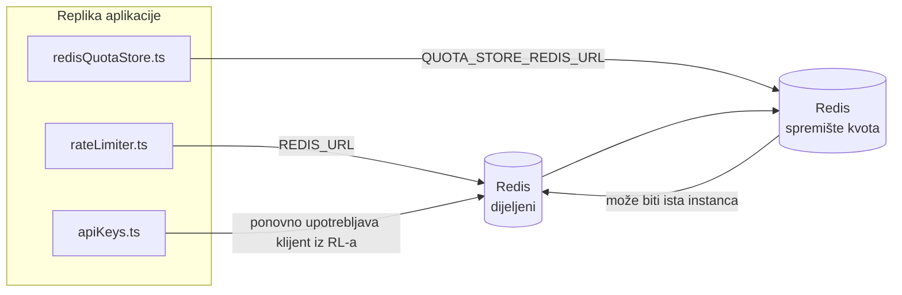

# Redis Production Configuration Guide (Hrvatski)

🌐 **Languages:** 🇺🇸 [English](../../../../ops/REDIS_PRODUCTION_CONFIG.md) · 🇪🇹 [am](../../../am/docs/ops/REDIS_PRODUCTION_CONFIG.md) · 🇸🇦 [ar](../../../ar/docs/ops/REDIS_PRODUCTION_CONFIG.md) · 🇦🇿 [az](../../../az/docs/ops/REDIS_PRODUCTION_CONFIG.md) · 🇧🇬 [bg](../../../bg/docs/ops/REDIS_PRODUCTION_CONFIG.md) · 🇧🇩 [bn](../../../bn/docs/ops/REDIS_PRODUCTION_CONFIG.md) · 🇨🇿 [cs](../../../cs/docs/ops/REDIS_PRODUCTION_CONFIG.md) · 🇩🇰 [da](../../../da/docs/ops/REDIS_PRODUCTION_CONFIG.md) · 🇩🇪 [de](../../../de/docs/ops/REDIS_PRODUCTION_CONFIG.md) · 🇬🇷 [el](../../../el/docs/ops/REDIS_PRODUCTION_CONFIG.md) · 🇪🇸 [es](../../../es/docs/ops/REDIS_PRODUCTION_CONFIG.md) · 🇪🇪 [et](../../../et/docs/ops/REDIS_PRODUCTION_CONFIG.md) · 🇮🇷 [fa](../../../fa/docs/ops/REDIS_PRODUCTION_CONFIG.md) · 🇫🇮 [fi](../../../fi/docs/ops/REDIS_PRODUCTION_CONFIG.md) · 🇫🇷 [fr](../../../fr/docs/ops/REDIS_PRODUCTION_CONFIG.md) · 🇮🇪 [ga](../../../ga/docs/ops/REDIS_PRODUCTION_CONFIG.md) · 🇮🇳 [gu](../../../gu/docs/ops/REDIS_PRODUCTION_CONFIG.md) · 🇳🇬 [ha](../../../ha/docs/ops/REDIS_PRODUCTION_CONFIG.md) · 🇮🇱 [he](../../../he/docs/ops/REDIS_PRODUCTION_CONFIG.md) · 🇮🇳 [hi](../../../hi/docs/ops/REDIS_PRODUCTION_CONFIG.md) · 🇭🇺 [hu](../../../hu/docs/ops/REDIS_PRODUCTION_CONFIG.md) · 🇦🇲 [hy](../../../hy/docs/ops/REDIS_PRODUCTION_CONFIG.md) · 🇮🇩 [id](../../../id/docs/ops/REDIS_PRODUCTION_CONFIG.md) · 🇳🇬 [ig](../../../ig/docs/ops/REDIS_PRODUCTION_CONFIG.md) · 🇮🇹 [it](../../../it/docs/ops/REDIS_PRODUCTION_CONFIG.md) · 🇯🇵 [ja](../../../ja/docs/ops/REDIS_PRODUCTION_CONFIG.md) · 🇬🇪 [ka](../../../ka/docs/ops/REDIS_PRODUCTION_CONFIG.md) · 🇰🇭 [km](../../../km/docs/ops/REDIS_PRODUCTION_CONFIG.md) · 🇮🇳 [kn](../../../kn/docs/ops/REDIS_PRODUCTION_CONFIG.md) · 🇰🇷 [ko](../../../ko/docs/ops/REDIS_PRODUCTION_CONFIG.md) · 🇱🇹 [lt](../../../lt/docs/ops/REDIS_PRODUCTION_CONFIG.md) · 🇱🇻 [lv](../../../lv/docs/ops/REDIS_PRODUCTION_CONFIG.md) · 🇮🇳 [ml](../../../ml/docs/ops/REDIS_PRODUCTION_CONFIG.md) · 🇮🇳 [mr](../../../mr/docs/ops/REDIS_PRODUCTION_CONFIG.md) · 🇲🇾 [ms](../../../ms/docs/ops/REDIS_PRODUCTION_CONFIG.md) · 🇲🇹 [mt](../../../mt/docs/ops/REDIS_PRODUCTION_CONFIG.md) · 🇲🇲 [my](../../../my/docs/ops/REDIS_PRODUCTION_CONFIG.md) · 🇳🇵 [ne](../../../ne/docs/ops/REDIS_PRODUCTION_CONFIG.md) · 🇳🇱 [nl](../../../nl/docs/ops/REDIS_PRODUCTION_CONFIG.md) · 🇳🇴 [no](../../../no/docs/ops/REDIS_PRODUCTION_CONFIG.md) · 🇮🇳 [or](../../../or/docs/ops/REDIS_PRODUCTION_CONFIG.md) · 🇮🇳 [pa](../../../pa/docs/ops/REDIS_PRODUCTION_CONFIG.md) · 🇵🇭 [phi](../../../phi/docs/ops/REDIS_PRODUCTION_CONFIG.md) · 🇵🇱 [pl](../../../pl/docs/ops/REDIS_PRODUCTION_CONFIG.md) · 🇵🇹 [pt](../../../pt/docs/ops/REDIS_PRODUCTION_CONFIG.md) · 🇧🇷 [pt-BR](../../../pt-BR/docs/ops/REDIS_PRODUCTION_CONFIG.md) · 🇷🇴 [ro](../../../ro/docs/ops/REDIS_PRODUCTION_CONFIG.md) · 🇷🇺 [ru](../../../ru/docs/ops/REDIS_PRODUCTION_CONFIG.md) · 🇱🇰 [si](../../../si/docs/ops/REDIS_PRODUCTION_CONFIG.md) · 🇸🇰 [sk](../../../sk/docs/ops/REDIS_PRODUCTION_CONFIG.md) · 🇸🇮 [sl](../../../sl/docs/ops/REDIS_PRODUCTION_CONFIG.md) · 🇷🇸 [sr](../../../sr/docs/ops/REDIS_PRODUCTION_CONFIG.md) · 🇸🇪 [sv](../../../sv/docs/ops/REDIS_PRODUCTION_CONFIG.md) · 🇰🇪 [sw](../../../sw/docs/ops/REDIS_PRODUCTION_CONFIG.md) · 🇮🇳 [ta](../../../ta/docs/ops/REDIS_PRODUCTION_CONFIG.md) · 🇮🇳 [te](../../../te/docs/ops/REDIS_PRODUCTION_CONFIG.md) · 🇹🇭 [th](../../../th/docs/ops/REDIS_PRODUCTION_CONFIG.md) · 🇹🇷 [tr](../../../tr/docs/ops/REDIS_PRODUCTION_CONFIG.md) · 🇺🇦 [uk-UA](../../../uk-UA/docs/ops/REDIS_PRODUCTION_CONFIG.md) · 🇵🇰 [ur](../../../ur/docs/ops/REDIS_PRODUCTION_CONFIG.md) · 🇺🇿 [uz](../../../uz/docs/ops/REDIS_PRODUCTION_CONFIG.md) · 🇻🇳 [vi](../../../vi/docs/ops/REDIS_PRODUCTION_CONFIG.md) · 🇳🇬 [yo](../../../yo/docs/ops/REDIS_PRODUCTION_CONFIG.md) · 🇨🇳 [zh-CN](../../../zh-CN/docs/ops/REDIS_PRODUCTION_CONFIG.md) · 🇹🇼 [zh-TW](../../../zh-TW/docs/ops/REDIS_PRODUCTION_CONFIG.md)

---

## Pregled

Redis je **neobavezna, slaba ovisnost** u aplikaciji OmniRoute — kada Redis nije dostupan, aplikacija nastavlja raditi uz smanjene mogućnosti (pričuvna rješenja u memoriji). U produkciji podešavanje Redisa smanjuje latenciju za četiri različita radna opterećenja:

| Radno opterećenje           | Pokretač                      | Tvornica klijenta                                               | Uzorak ključa                                                        |
| --------------------------- | ----------------------------- | --------------------------------------------------------------- | -------------------------------------------------------------------- |
| Ograničavanje brzine        | `rateLimiter.ts`              | `getRedisClient()` — lijeno inicijalizirani singleton `ioredis` | `<prefix>rl:*` prozori ograničenja brzine, atomski putem Lua skripte |
| Predmemorija autentikacije  | `apiKeys.ts`                  | Ponovno upotrebljava klijent iz `rateLimiter`                   | `<prefix>auth:api_key:<sha256>` s TTL-om                             |
| Spremište kvota             | `redisQuotaStore.ts`          | Zaseban singleton `getRedisClient(url)`                         | `<prefix>quota:*`, podesivo po instanci                              |
| Prekidač kruga zagrijavanja | `redisCircuitBreakerStore.ts` | Zaseban klijent u `circuitBreakerFactory.ts`                    | `<prefix>warmup:cb:<connectionId>`                                   |

Sva četiri radna opterećenja dijele jedan prefiks prostora naziva kako bi OmniRoute mogao istodobno raditi s drugim aplikacijama na jednoj instanci Redisa (npr. `127.0.0.1:6379`). Pogledajte [Prostor naziva ključeva](#key-namespacing).

---

## Trenutačna konfiguracija (zadane vrijednosti u kodu)

| Postavka                                    | Vrijednost                                                                       | Lokacija                                                                              |
| ------------------------------------------- | -------------------------------------------------------------------------------- | ------------------------------------------------------------------------------------- |
| Varijabla okruženja `REDIS_URL`             | `redis://redis:6379` (compose), neobavezno                                       | `rateLimiter.ts:5`, `.env.example`                                                    |
| Varijabla okruženja `REDIS_KEY_PREFIX`      | `omniroute:` (zadano)                                                            | `rateLimiter.ts`, `redisQuotaStore.ts`, `redisCircuitBreakerStore.ts`, `.env.example` |
| Varijabla okruženja `QUOTA_STORE_REDIS_URL` | zasebna, može se razlikovati od `REDIS_URL`                                      | `quota/storeFactory.ts`                                                               |
| `QUOTA_STORE_DRIVER`                        | `"sqlite"` (zadano), `"redis"` neobavezno                                        | `quota/storeFactory.ts`                                                               |
| ioredis `maxRetriesPerRequest`              | `3`                                                                              | stvaranje klijenta u `rateLimiter.ts`                                                 |
| `enableReadyCheck`                          | nije postavljeno (zadana vrijednost za ioredis: `true`)                          | —                                                                                     |
| `lazyConnect`                               | nije postavljeno (zadana vrijednost za ioredis: `false`)                         | —                                                                                     |
| `retryStrategy`                             | nije postavljeno (zadana vrijednost za ioredis: baza od 200 ms, eksponencijalno) | —                                                                                     |
| TLS / lozinka / indeks baze podataka        | **nije konfigurirano**                                                           | —                                                                                     |
| Sentinel / Cluster                          | **nije konfigurirano** — podržan je samo samostalni način rada s jednim čvorom   | —                                                                                     |

---

## Prostor naziva ključeva

OmniRoute dijeli instancu Redisa sa svim ostalim što se izvršava na poslužitelju. Bez prostora naziva ključevi poput `auth:api_key:<sha256>` ili `rl:*` mogli bi se preklapati s ključevima drugih aplikacija koje upotrebljavaju isti Redis (ova instanca pokreće Redis na `127.0.0.1:6379` zajedno s drugim servisima).

Postavite `REDIS_KEY_PREFIX` na neprazan niz kako biste dodali prefiks **svakom** ključu aplikacije OmniRoute:

```bash
# .env — svi OmniRoute ključevi postaju omniroute:rl:*, omniroute:auth:*, omniroute:quota:*, omniroute:warmup:cb:*
REDIS_KEY_PREFIX=omniroute:
```

- **Zadano:** `omniroute:` (primjenjuje se kada `REDIS_KEY_PREFIX` nije postavljen ili je prazan).
- **Primjenjuje se na:** ograničivač brzine + predmemoriju autentikacije (dijeljeni klijent `ioredis` putem `keyPrefix`) i
  spremište kvota (`KEY_PREFIX = "${REDIS_KEY_PREFIX}quota"`) te prekidač kruga zagrijavanja
  (`KEY_PREFIX = "${REDIS_KEY_PREFIX}warmup:cb:"`).
- **Promjena prefiksa** kada ključevi već postoje u Redisu ostavlja stare ključeve bez poveznice (ističu
  putem TTL-a / LRU-a). Promjena je sigurna; migracija nije potrebna. Jedina je iznimka ključ prekidača
  kruga zagrijavanja za vezu označenu kao zabranjenu: sprema se bez TTL-a, stoga pronađite preostale
  ključeve pomoću `redis-cli --scan --pattern '<old-prefix>warmup:cb:*'` i izbrišite ih.
- **ioredis `keyPrefix`** automatski dodaje prefiks pri zapisivanju **i** uklanja ga pri čitanju,
  tako da aplikacijski kod nikada ne vidi prefiks.

---

## Preporučeno podešavanje za produkciju

### 1. Skup veza / opcije klijenta (ioredis konstruktor `Redis`)

Trenutačni kod stvara jedan `new Redis(url)` bez prilagođenih opcija. Za produkcijske implementacije
s više replika proslijedite tvornicu klijenta u kodu ili omotajte `getRedisClient()`:

```typescript
const redis = new Redis(REDIS_URL, {
  maxRetriesPerRequest: null, // bez ograničenja ponovnih pokušaja; neka odluči retryStrategy
  enableReadyCheck: true, // provjeri je li poslužitelj spreman prije prihvaćanja poziva
  lazyConnect: true, // ne povezuj se pri stvaranju; pričekaj prvi poziv
  retryStrategy: (times) => {
    if (times > 10) return null; // odustani nakon 10 pokušaja → ponovno se poveži kasnije
    return Math.min(times * 200, 5000); // 200ms, 400ms, …, najviše 5s
  },
  enableAutoPipelining: true, // objedini istodobne naredbe u jedno TCP zapisivanje
  keepAlive: 10000, // TCP keep-alive svakih 10s
});
```

**Ključni kompromisi:**

- `maxRetriesPerRequest: null` + `retryStrategy` — preporučuje se za produkciju kako privremena
  ponovna pokretanja Redisa ne bi odmah uzrokovala neuspjeh svakog zahtjeva. Pričuvni mehanizam u memoriji u
  `checkRateLimit()` preuzima putanju u slučaju pogreške.
- `lazyConnect: true` — uklanja ovisnost pokretanja o dostupnosti Redisa prije nego što poslužitelj
  počne prihvaćati veze.
- `enableAutoPipelining: true` — smanjuje broj povratnih mrežnih putovanja za istodobne provjere ograničenja brzine;
  korisno pri >50 zahtjeva u sekundi na jednoj vezi.

### 2. Konfiguracija Redis poslužitelja (`redis.conf`)

```
# Memorija
maxmemory 80%                        # ostavi prostor za predmemoriju stranica OS-a
maxmemory-policy allkeys-lru         # ukloni zastarjele unose predmemorije autentifikacije pod opterećenjem

# Trajnost (neobavezno — OmniRoute je otporan na padove i bez nje)
save 300 1                           # snimi snimku najmanje svakih 5 min ako se promijenio ≥1 ključ
appendonly no                        # AOF nije potreban; podatke je moguće ponovno generirati
appendfsync no                       # bez dodatnog opterećenja zbog fsync-a (RDB je dovoljan)

# Umrežavanje
timeout 0                            # bez prekida neaktivnih veza
tcp-keepalive 300                    # keep-alive od 5 min
tcp-backlog 511                      # red čekanja veza za skokovita opterećenja

# Performanse
hz 10                                # zadano; 100 za sustave osjetljive na latenciju
activedefrag yes                     # automatski defragmentiraj kada je fragmentacija >10%
```

**Kompromis za `maxmemory-policy allkeys-lru`:** Unosi predmemorije autentifikacije mogu se ukloniti pod
memorijskim opterećenjem. To je sigurno — `setCachedApiKey` uvijek ponovno popunjava predmemoriju u slučaju promašaja, a
pričuvni SQLite izvor je mjerodavan. Lua skripta za ograničavanje brzine stvara male ključeve koji su
namjerno kratkotrajni.

### 3. Postavke za Docker Compose

Produkcijski Compose (`docker-compose.prod.yml`) upotrebljava `redis:8.6.2-alpine`. Dodajte:

```yaml
redis:
  image: redis:8.6.2-alpine
  command:
    [
      "redis-server",
      "--maxmemory",
      "512mb",
      "--maxmemory-policy",
      "allkeys-lru",
      "--activedefrag",
      "yes",
      "--save",
      "300 1",
    ]
  healthcheck:
    test: ["CMD", "redis-cli", "ping"]
    interval: 10s
    timeout: 3s
    retries: 3
    start_period: 5s
```

### 4. Razmatranja za više instanci / skaliranje

**Jedan Redis za sve replike** — Lua skripta za ograničavanje brzine ovisi o jedinstvenom
mjerodavnom prostoru ključeva. Više instanci Redisa iza replika izgubilo bi atomarnost
i udvostručilo proračun. Upotrebljavajte jedan Redis (ili Redis Sentinel klaster s prebacivanjem u slučaju kvara) za
sve replike aplikacije.

**Broj veza:** Svaka replika aplikacije otvara **2 TCP veze** prema Redisu
(klijent ograničivača brzine + klijent spremišta kvota). Uz 10 replika → 20 veza, što je znatno
ispod zadanog ograničenja instance Redisa od 10 tisuća veza.

### 5. Nadzor

Izložite putem krajnje točke za provjeru stanja:

```typescript
// src/app/api/monitoring/health/route.ts već poziva funkcije rateLimiter
// Dodajte provjere specifične za Redis:
//   1. Latencija za PING putem ioredis .ping()
//   2. Upotreba memorije putem INFO memory
//   3. Broj veza putem INFO clients
//   4. Stopa pogodaka za maxmemory-policy (evicted_keys / keyspace_hits)
```

Ključne metrike koje treba pratiti:

- **Uklonjeni ključevi / s** — ako je vrijednost trajno različita od nule, povećajte `maxmemory`
- **Blokirani klijenti** — vrijednost različita od nule upućuje na spore Lua skripte ili veliko nadmetanje
- **Odbijene veze** — dosegnuto je ograničenje broja veza; rijetko pri 20 veza

---

## Dijagram arhitekture



---

## Reference

| Datoteka                           | Svrha                                                                                                   |
| ---------------------------------- | ------------------------------------------------------------------------------------------------------- |
| `src/shared/utils/rateLimiter.ts`  | Primarni Redis klijent, Lua skripta za ograničavanje učestalosti zahtjeva, pričuvno rješenje u memoriji |
| `src/lib/db/apiKeys.ts`            | Predmemorija autentifikacije — Redis→SQLite pričuvno rješenje                                           |
| `src/lib/quota/redisQuotaStore.ts` | Zaseban Redis klijent za opcionalno spremište kvota                                                     |
| `src/lib/quota/storeFactory.ts`    | Prebacuje se između upravljačkih programa za kvote `sqlite` i `redis`                                   |
| `docker-compose.prod.yml`          | Produkcijski Redis spremnik (slika `redis:8.6.2-alpine`)                                                |
| `.env.example`                     | Dokumentacija varijabli okruženja za Redis                                                              |
| `src/app/api/local/redis/`         | API rute za orkestraciju razvojnog spremnika                                                            |
| `bin/cli/commands/redis.mjs`       | CLI naredbe za orkestraciju razvojnog spremnika                                                         |
