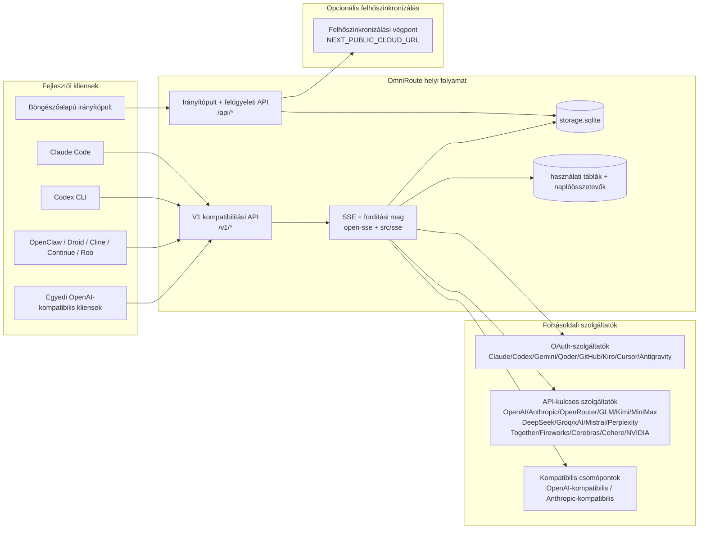
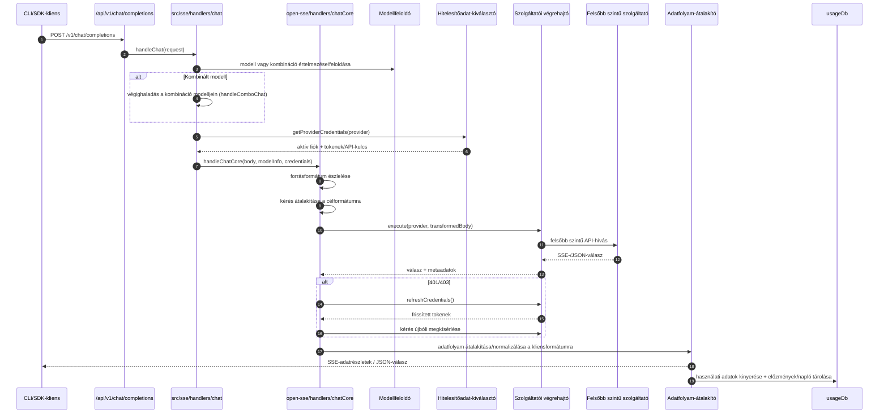
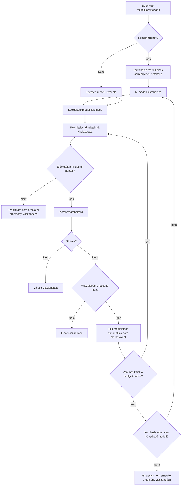
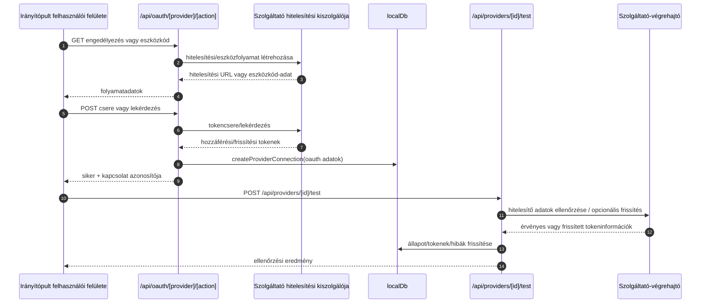
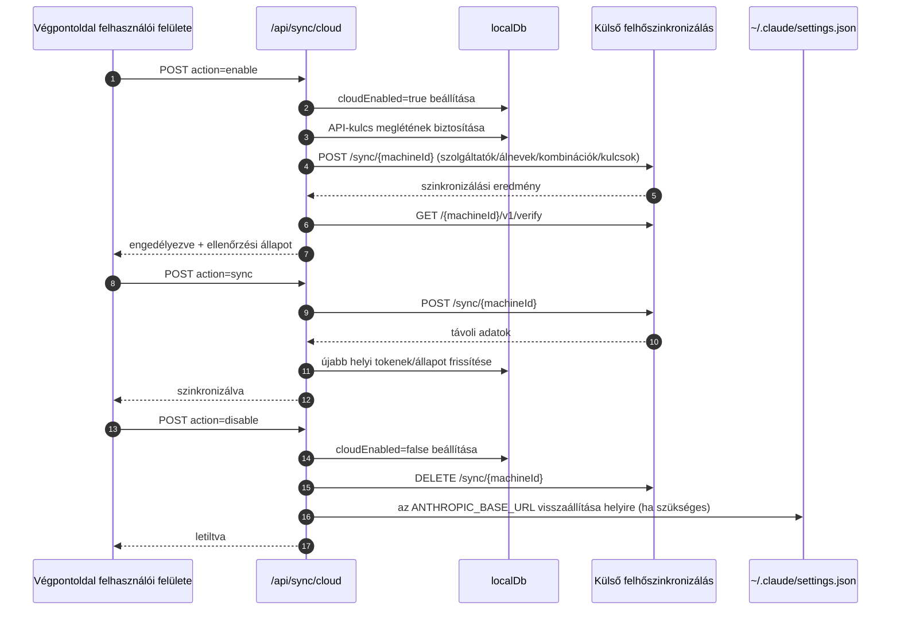
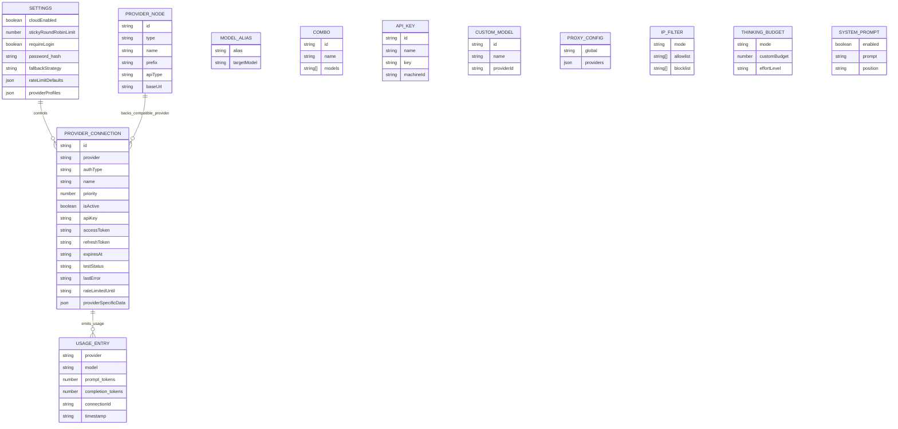
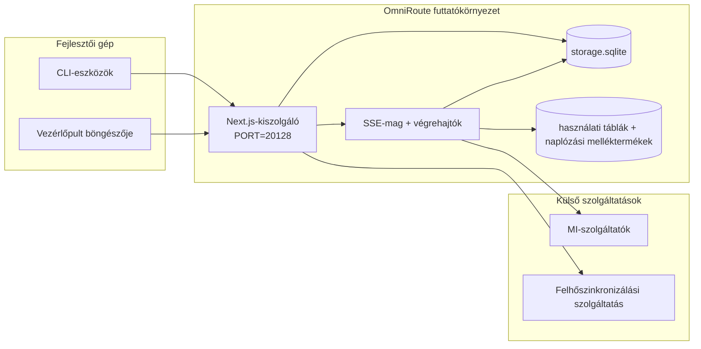

# OmniRoute Architecture (Magyar)

🌐 **Languages:** 🇺🇸 [English](../../../../architecture/ARCHITECTURE.md) · 🇪🇹 [am](../../../am/docs/architecture/ARCHITECTURE.md) · 🇸🇦 [ar](../../../ar/docs/architecture/ARCHITECTURE.md) · 🇦🇿 [az](../../../az/docs/architecture/ARCHITECTURE.md) · 🇧🇬 [bg](../../../bg/docs/architecture/ARCHITECTURE.md) · 🇧🇩 [bn](../../../bn/docs/architecture/ARCHITECTURE.md) · 🇧🇦 [bs](../../../bs/docs/architecture/ARCHITECTURE.md) · 🇨🇿 [cs](../../../cs/docs/architecture/ARCHITECTURE.md) · 🇩🇰 [da](../../../da/docs/architecture/ARCHITECTURE.md) · 🇩🇪 [de](../../../de/docs/architecture/ARCHITECTURE.md) · 🇬🇷 [el](../../../el/docs/architecture/ARCHITECTURE.md) · 🇪🇸 [es](../../../es/docs/architecture/ARCHITECTURE.md) · 🇪🇪 [et](../../../et/docs/architecture/ARCHITECTURE.md) · 🇮🇷 [fa](../../../fa/docs/architecture/ARCHITECTURE.md) · 🇫🇮 [fi](../../../fi/docs/architecture/ARCHITECTURE.md) · 🇫🇷 [fr](../../../fr/docs/architecture/ARCHITECTURE.md) · 🇮🇪 [ga](../../../ga/docs/architecture/ARCHITECTURE.md) · 🇮🇳 [gu](../../../gu/docs/architecture/ARCHITECTURE.md) · 🇳🇬 [ha](../../../ha/docs/architecture/ARCHITECTURE.md) · 🇮🇱 [he](../../../he/docs/architecture/ARCHITECTURE.md) · 🇮🇳 [hi](../../../hi/docs/architecture/ARCHITECTURE.md) · 🇭🇷 [hr](../../../hr/docs/architecture/ARCHITECTURE.md) · 🇦🇲 [hy](../../../hy/docs/architecture/ARCHITECTURE.md) · 🇮🇩 [id](../../../id/docs/architecture/ARCHITECTURE.md) · 🇳🇬 [ig](../../../ig/docs/architecture/ARCHITECTURE.md) · 🇮🇹 [it](../../../it/docs/architecture/ARCHITECTURE.md) · 🇯🇵 [ja](../../../ja/docs/architecture/ARCHITECTURE.md) · 🇬🇪 [ka](../../../ka/docs/architecture/ARCHITECTURE.md) · 🇰🇭 [km](../../../km/docs/architecture/ARCHITECTURE.md) · 🇮🇳 [kn](../../../kn/docs/architecture/ARCHITECTURE.md) · 🇰🇷 [ko](../../../ko/docs/architecture/ARCHITECTURE.md) · 🇱🇹 [lt](../../../lt/docs/architecture/ARCHITECTURE.md) · 🇱🇻 [lv](../../../lv/docs/architecture/ARCHITECTURE.md) · 🇮🇳 [ml](../../../ml/docs/architecture/ARCHITECTURE.md) · 🇮🇳 [mr](../../../mr/docs/architecture/ARCHITECTURE.md) · 🇲🇾 [ms](../../../ms/docs/architecture/ARCHITECTURE.md) · 🇲🇹 [mt](../../../mt/docs/architecture/ARCHITECTURE.md) · 🇲🇲 [my](../../../my/docs/architecture/ARCHITECTURE.md) · 🇳🇵 [ne](../../../ne/docs/architecture/ARCHITECTURE.md) · 🇳🇱 [nl](../../../nl/docs/architecture/ARCHITECTURE.md) · 🇳🇴 [no](../../../no/docs/architecture/ARCHITECTURE.md) · 🇮🇳 [or](../../../or/docs/architecture/ARCHITECTURE.md) · 🇮🇳 [pa](../../../pa/docs/architecture/ARCHITECTURE.md) · 🇵🇭 [phi](../../../phi/docs/architecture/ARCHITECTURE.md) · 🇵🇱 [pl](../../../pl/docs/architecture/ARCHITECTURE.md) · 🇵🇹 [pt](../../../pt/docs/architecture/ARCHITECTURE.md) · 🇧🇷 [pt-BR](../../../pt-BR/docs/architecture/ARCHITECTURE.md) · 🇷🇴 [ro](../../../ro/docs/architecture/ARCHITECTURE.md) · 🇷🇺 [ru](../../../ru/docs/architecture/ARCHITECTURE.md) · 🇱🇰 [si](../../../si/docs/architecture/ARCHITECTURE.md) · 🇸🇰 [sk](../../../sk/docs/architecture/ARCHITECTURE.md) · 🇸🇮 [sl](../../../sl/docs/architecture/ARCHITECTURE.md) · 🇷🇸 [sr](../../../sr/docs/architecture/ARCHITECTURE.md) · 🇸🇪 [sv](../../../sv/docs/architecture/ARCHITECTURE.md) · 🇰🇪 [sw](../../../sw/docs/architecture/ARCHITECTURE.md) · 🇮🇳 [ta](../../../ta/docs/architecture/ARCHITECTURE.md) · 🇮🇳 [te](../../../te/docs/architecture/ARCHITECTURE.md) · 🇹🇭 [th](../../../th/docs/architecture/ARCHITECTURE.md) · 🇹🇷 [tr](../../../tr/docs/architecture/ARCHITECTURE.md) · 🇺🇦 [uk-UA](../../../uk-UA/docs/architecture/ARCHITECTURE.md) · 🇵🇰 [ur](../../../ur/docs/architecture/ARCHITECTURE.md) · 🇺🇿 [uz](../../../uz/docs/architecture/ARCHITECTURE.md) · 🇻🇳 [vi](../../../vi/docs/architecture/ARCHITECTURE.md) · 🇳🇬 [yo](../../../yo/docs/architecture/ARCHITECTURE.md) · 🇨🇳 [zh-CN](../../../zh-CN/docs/architecture/ARCHITECTURE.md) · 🇹🇼 [zh-TW](../../../zh-TW/docs/architecture/ARCHITECTURE.md)

---

🌐 **Languages:** 🇺🇸 [English](../../../../architecture/ARCHITECTURE.md) · 🇪🇹 [am](../../../am/docs/architecture/ARCHITECTURE.md) · 🇸🇦 [ar](../../../ar/docs/architecture/ARCHITECTURE.md) · 🇦🇿 [az](../../../az/docs/architecture/ARCHITECTURE.md) · 🇧🇬 [bg](../../../bg/docs/architecture/ARCHITECTURE.md) · 🇧🇩 [bn](../../../bn/docs/architecture/ARCHITECTURE.md) · 🇧🇦 [bs](../../../bs/docs/architecture/ARCHITECTURE.md) · 🇨🇿 [cs](../../../cs/docs/architecture/ARCHITECTURE.md) · 🇩🇰 [da](../../../da/docs/architecture/ARCHITECTURE.md) · 🇩🇪 [de](../../../de/docs/architecture/ARCHITECTURE.md) · 🇬🇷 [el](../../../el/docs/architecture/ARCHITECTURE.md) · 🇪🇸 [es](../../../es/docs/architecture/ARCHITECTURE.md) · 🇪🇪 [et](../../../et/docs/architecture/ARCHITECTURE.md) · 🇮🇷 [fa](../../../fa/docs/architecture/ARCHITECTURE.md) · 🇫🇮 [fi](../../../fi/docs/architecture/ARCHITECTURE.md) · 🇫🇷 [fr](../../../fr/docs/architecture/ARCHITECTURE.md) · 🇮🇪 [ga](../../../ga/docs/architecture/ARCHITECTURE.md) · 🇮🇳 [gu](../../../gu/docs/architecture/ARCHITECTURE.md) · 🇳🇬 [ha](../../../ha/docs/architecture/ARCHITECTURE.md) · 🇮🇱 [he](../../../he/docs/architecture/ARCHITECTURE.md) · 🇮🇳 [hi](../../../hi/docs/architecture/ARCHITECTURE.md) · 🇭🇷 [hr](../../../hr/docs/architecture/ARCHITECTURE.md) · 🇦🇲 [hy](../../../hy/docs/architecture/ARCHITECTURE.md) · 🇮🇩 [id](../../../id/docs/architecture/ARCHITECTURE.md) · 🇳🇬 [ig](../../../ig/docs/architecture/ARCHITECTURE.md) · 🇮🇹 [it](../../../it/docs/architecture/ARCHITECTURE.md) · 🇯🇵 [ja](../../../ja/docs/architecture/ARCHITECTURE.md) · 🇬🇪 [ka](../../../ka/docs/architecture/ARCHITECTURE.md) · 🇰🇭 [km](../../../km/docs/architecture/ARCHITECTURE.md) · 🇮🇳 [kn](../../../kn/docs/architecture/ARCHITECTURE.md) · 🇰🇷 [ko](../../../ko/docs/architecture/ARCHITECTURE.md) · 🇱🇹 [lt](../../../lt/docs/architecture/ARCHITECTURE.md) · 🇱🇻 [lv](../../../lv/docs/architecture/ARCHITECTURE.md) · 🇮🇳 [ml](../../../ml/docs/architecture/ARCHITECTURE.md) · 🇮🇳 [mr](../../../mr/docs/architecture/ARCHITECTURE.md) · 🇲🇾 [ms](../../../ms/docs/architecture/ARCHITECTURE.md) · 🇲🇹 [mt](../../../mt/docs/architecture/ARCHITECTURE.md) · 🇲🇲 [my](../../../my/docs/architecture/ARCHITECTURE.md) · 🇳🇵 [ne](../../../ne/docs/architecture/ARCHITECTURE.md) · 🇳🇱 [nl](../../../nl/docs/architecture/ARCHITECTURE.md) · 🇳🇴 [no](../../../no/docs/architecture/ARCHITECTURE.md) · 🇮🇳 [or](../../../or/docs/architecture/ARCHITECTURE.md) · 🇮🇳 [pa](../../../pa/docs/architecture/ARCHITECTURE.md) · 🇵🇭 [phi](../../../phi/docs/architecture/ARCHITECTURE.md) · 🇵🇱 [pl](../../../pl/docs/architecture/ARCHITECTURE.md) · 🇵🇹 [pt](../../../pt/docs/architecture/ARCHITECTURE.md) · 🇧🇷 [pt-BR](../../../pt-BR/docs/architecture/ARCHITECTURE.md) · 🇷🇴 [ro](../../../ro/docs/architecture/ARCHITECTURE.md) · 🇷🇺 [ru](../../../ru/docs/architecture/ARCHITECTURE.md) · 🇱🇰 [si](../../../si/docs/architecture/ARCHITECTURE.md) · 🇸🇰 [sk](../../../sk/docs/architecture/ARCHITECTURE.md) · 🇸🇮 [sl](../../../sl/docs/architecture/ARCHITECTURE.md) · 🇷🇸 [sr](../../../sr/docs/architecture/ARCHITECTURE.md) · 🇸🇪 [sv](../../../sv/docs/architecture/ARCHITECTURE.md) · 🇰🇪 [sw](../../../sw/docs/architecture/ARCHITECTURE.md) · 🇮🇳 [ta](../../../ta/docs/architecture/ARCHITECTURE.md) · 🇮🇳 [te](../../../te/docs/architecture/ARCHITECTURE.md) · 🇹🇭 [th](../../../th/docs/architecture/ARCHITECTURE.md) · 🇹🇷 [tr](../../../tr/docs/architecture/ARCHITECTURE.md) · 🇺🇦 [uk-UA](../../../uk-UA/docs/architecture/ARCHITECTURE.md) · 🇵🇰 [ur](../../../ur/docs/architecture/ARCHITECTURE.md) · 🇺🇿 [uz](../../../uz/docs/architecture/ARCHITECTURE.md) · 🇻🇳 [vi](../../../vi/docs/architecture/ARCHITECTURE.md) · 🇳🇬 [yo](../../../yo/docs/architecture/ARCHITECTURE.md) · 🇨🇳 [zh-CN](../../../zh-CN/docs/architecture/ARCHITECTURE.md) · 🇹🇼 [zh-TW](../../../zh-TW/docs/architecture/ARCHITECTURE.md)

_Utolsó frissítés: 2026-06-28_

## Vezetői összefoglaló

Az OmniRoute egy Next.js-alapú helyi AI-útválasztó átjáró és vezérlőpult.
Egyetlen, OpenAI-kompatibilis végpontot (`/v1/*`) biztosít, és több felsőbb szintű szolgáltató között irányítja a forgalmat formátumátalakítással, tartalékra váltással, tokenfrissítéssel és használatkövetéssel.

Fő képességek:

- OpenAI-kompatibilis API-felület CLI-khez/eszközökhöz (355 szolgáltató, 108 végrehajtó)
- Kérések és válaszok átalakítása a szolgáltatói formátumok között
- Modellkombinációs tartalékra váltás (többmodelles sorozat)
- Strukturált kombinációs lépések (`provider + model + connection`) futásidejű sorrendezéssel a `compositeTiers` alapján
- Fiókszintű tartalékra váltás (szolgáltatónként több fiók)
- Kvóta-előellenőrzés és kvótatudatos P2C-fiókválasztás a fő csevegési útvonalon
- OAuth- és API-kulcs-alapú szolgáltatói kapcsolatok kezelése (22 OAuth-szolgáltatói modul)
- Beágyazások létrehozása a `/v1/embeddings` használatával (18 szolgáltató)
- Képgenerálás a `/v1/images/generations` használatával (több mint 10 szolgáltató, több mint 20 modell)
- Hangátírás a `/v1/audio/transcriptions` használatával (18 szolgáltató)
- Szövegfelolvasás a `/v1/audio/speech` használatával (24 beépített szolgáltató)
- Videógenerálás a `/v1/videos/generations` használatával (ComfyUI + SD WebUI)
- Zenegenerálás a `/v1/music/generations` használatával (ComfyUI)
- Webes keresés a `/v1/search` használatával (20 szolgáltató)
- Moderálás a `/v1/moderations` használatával
- Újrarangsorolás a `/v1/rerank` használatával
- Think címkék (`<think>...</think>`) feldolgozása következtetési modellekhez
- Válaszok tisztítása a szigorú OpenAI SDK-kompatibilitás érdekében
- Szerepkör-normalizálás (developer→system, system→user) a szolgáltatók közötti kompatibilitás érdekében
- Strukturált kimenet átalakítása (json_schema → Gemini responseSchema)
- Szolgáltatók, kulcsok, aliasok, kombinációk, beállítások és árképzés helyi perzisztálása (122 adatbázismodul)
- Használat- és költségkövetés, valamint kérésnaplózás
- Opcionális felhőszinkronizálás több eszköz és állapot szinkronizálásához
- IP-engedélyezési és -tiltási lista az API-hozzáférés szabályozásához
- Gondolkodási keret kezelése (változatlan továbbítás/automatikus/egyéni/adaptív)
- Globális rendszerprompt beillesztése
- Munkamenet-követés és ujjlenyomat-képzés
- Fiókonkénti továbbfejlesztett sebességkorlátozás szolgáltatóspecifikus profilokkal
- Megszakító (circuit breaker) minta a szolgáltatói ellenálló képességhez
- Lavinaszerű párhuzamos kérések elleni védelem mutexzárolással
- Aláírás-alapú kérésdeduplikációs gyorsítótár
- Tartományi réteg: költségszabályok, tartalékra váltási szabályzat, kizárási szabályzat
- Context Relay: munkamenet-átadási összefoglalók a folytonosság fenntartásához fiókváltáskor
- Tartományi állapot perzisztálása (SQLite write-through gyorsítótár tartalékra váltásokhoz, keretekhez, kizárásokhoz és megszakítókhoz)
- Szabályzatmotor a kérések központosított kiértékeléséhez (kizárás → keret → tartalékra váltás)
- Kéréstelemetria p50/p95/p99 késleltetési aggregációval
- Kombinációs célpontok telemetriája és korábbi állapota a `combo_execution_key` / `combo_step_id` használatával
- Korrelációs azonosító (X-Request-Id) a végpontok közötti nyomkövetéshez
- Megfelelőségi auditnaplózás API-kulcsonkénti letiltási lehetőséggel
- Kiértékelési keretrendszer az LLM-ek minőségbiztosításához
- Állapot-vezérlőpult a szolgáltatói megszakítók valós idejű állapotával
- MCP Server (110 eszköz) 3 átviteli móddal (stdio/SSE/Streamable HTTP)
- A2A Server (JSON-RPC 2.0 + SSE) képességekkel és feladat-életciklussal
- Memóriarendszer (kinyerés, beillesztés, visszakeresés, összegzés)
- Képességrendszer (regisztrációs adatbázis, végrehajtó, elkülönített környezet, beépített képességek)
- MITM-proxy tanúsítványkezeléssel és DNS-kezeléssel
- Promptinjektálás elleni védelmi köztesszoftver
- Prompttömörítési folyamat Caveman, RTK, egymásra épülő folyamatok, tömörítési kombinációk, nyelvi csomagok és analitika támogatásával
- ACP (Agent Communication Protocol) regisztrációs adatbázis
- Moduláris OAuth-szolgáltatók (22 különálló modul a `src/lib/oauth/providers/` alatt)
- Eltávolítási/teljes eltávolítási szkriptek
- OAuth-környezet javítási művelete
- WebSocket-híd OpenAI-kompatibilis WS-kliensekhez (`/v1/ws`)
- Szinkronizációs tokenek kezelése (kibocsátás/visszavonás, ETag-verziózott konfigurációscsomag-letöltés)
- GLM Thinking (`glmt`) első osztályú szolgáltatói előbeállítás
- Hibrid tokenszámlálás (szolgáltatói oldali `/messages/count_tokens`, becslési tartalékmegoldással)
- Modellaliasok automatikus inicializálása (több mint 30, proxyk közötti dialektusnormalizálás indításkor)
- Biztonságos kimenő lekérés SSRF-védelemmel, privát URL-ek blokkolásával és konfigurálható újrapróbálkozással
- Várakozási időt figyelembe vevő csevegési újrapróbálkozások konfigurálható `requestRetry` és `maxRetryIntervalSec` értékekkel
- Futásidejű környezet ellenőrzése Zod használatával indításkor
- Megfelelőségi audit v2 lapozással, szolgáltatói CRUD-eseményekkel és az SSRF miatt blokkolt ellenőrzések naplózásával

Elsődleges futásidejű modell:

- A `src/app/api/*` alatti Next.js alkalmazásútvonalak valósítják meg a vezérlőpult API-jait és a kompatibilitási API-kat
- A `src/sse/*` + `open-sse/*` alatti megosztott SSE-/útválasztási mag kezeli a szolgáltatói végrehajtást, az átalakítást, a streamelést, a tartalékra váltást és a használati adatokat

## Referenciadiagramok

A v3.8.0 platform kanonikus, verziókövetett Mermaid-forrásai a
[`docs/diagrams/`](../diagrams/README.md) könyvtárban találhatók. A tájékozódás megkönnyítésére kettőt alább is bemutatunk;
a többi a saját szakterületéhez tartozó útmutatóból érhető el.


> Forrás: [diagrams/request-pipeline.mmd](../diagrams/request-pipeline.mmd)


> Forrás: [diagrams/resilience-3layers.mmd](../diagrams/resilience-3layers.mmd) — hivatkozás található rá továbbá a
> [RESILIENCE_GUIDE.md](./RESILIENCE_GUIDE.md) fájlban és a `CLAUDE.md` rezilienciával kapcsolatos referenciájában.

## Hatókör és korlátok

### A hatókör része

- Helyi átjáró futtatókörnyezete
- Az irányítópult felügyeleti API-jai
- Szolgáltatói hitelesítés és tokenfrissítés
- Kérések átalakítása és SSE-adatfolyamok továbbítása
- Helyi állapot és használati adatok tartós tárolása
- Opcionális felhőszinkronizáció vezénylése

### Nem része a hatókörnek

- A `NEXT_PUBLIC_CLOUD_URL` mögötti felhőszolgáltatás megvalósítása
- A helyi folyamaton kívüli szolgáltatói SLA/vezérlősík
- Maguk a külső CLI-binárisok (Claude CLI, Codex CLI stb.)

## Az irányítópult jelenlegi felülete

A `src/app/(dashboard)/dashboard/` alatti fő oldalak:

- `/dashboard` — gyors kezdés és a szolgáltatók áttekintése
- `/dashboard/endpoint` — végpontproxy, valamint MCP-, A2A- és API-végpontlapok
- `/dashboard/providers` — szolgáltatói kapcsolatok és hitelesítő adatok
- `/dashboard/combos` — kombinációs stratégiák, sablonok, lépésalapú összeállító, modellútválasztási szabályok és manuálisan tartósított sorrend
- `/dashboard/auto-combo` — Auto Combo Engine: pontozási súlyok, módcsomagok, virtuális gyári előbeállítások és telemetria
- `/dashboard/costs` — költségösszesítés és az árazás áttekinthetősége
- `/dashboard/analytics` — használati analitika, kiértékelések és kombinációs célok állapota
- `/dashboard/limits` — kvóta- és sebességkorlátozási vezérlők
- `/dashboard/cli-tools` — CLI-bevezetés, futtatókörnyezet-észlelés és konfigurációgenerálás
- `/dashboard/agents` — észlelt ACP-ügynökök és egyéni ügynökök regisztrálása
- `/dashboard/cloud-agents` — felhőben futtatott ügynökfeladatok (Codex Cloud, Devin, Jules) és a feladatok életciklusa
- `/dashboard/skills` — A2A-képességjegyzék, izolált végrehajtás és beépített képességkatalógus
- `/dashboard/memory` — tartós társalgási memória vizsgálata és lekérése
- `/dashboard/webhooks` — kimenő webhook-előfizetések, titokrotáció és újrapróbálkozási statisztikák
- `/dashboard/batch` — kötegelt feladatok beküldése és előrehaladása
- `/dashboard/cache` — olvasás közben feltöltődő gyorsítótár és következtetési gyorsítótár statisztikái, valamint kiürítési vezérlők
- `/dashboard/playground` — interaktív csevegési tesztfelület bármely konfigurált kombinációval vagy modellel
- `/dashboard/changelog` — alkalmazáson belüli változásnapló-megjelenítő (a `CHANGELOG.md` fájlt jeleníti meg)
- `/dashboard/system` — futtatókörnyezeti diagnosztika, verzióinformációk és környezet-ellenőrzési felület
- `/dashboard/onboarding` — első futtatáskor megjelenő beállítási varázsló új telepítésekhez
- `/dashboard/media` — kép-, videó- és zenei tesztfelület
- `/dashboard/search-tools` — keresési szolgáltatók tesztelése és előzmények
- `/dashboard/health` — rendelkezésre állási idő, megszakítók, sebességkorlátok és kvótafigyelt munkamenetek
- `/dashboard/logs` — kérés-, proxy-, audit- és konzolnaplók
- `/dashboard/settings` — rendszerbeállítási lapok (általános, útválasztás, kombinációs alapértékek stb.)
- `/dashboard/context/caveman` — Caveman-tömörítési szabályok, nyelvi csomagok, előnézet és kimeneti mód
- `/dashboard/context/rtk` — RTK-parancskimeneti szűrők, előnézet és futtatókörnyezeti biztonsági beállítások
- `/dashboard/context/combos` — útválasztási kombinációkhoz rendelt, elnevezett tömörítési folyamatláncok
- `/dashboard/translator` — a fordító vizsgálata és a kérésformátum átalakításának előnézete
- `/dashboard/audit` — megfelelőségi auditnaplók lapozható böngészője strukturált metaadatokkal
- `/dashboard/usage` — a `usage_history` adataihoz kapcsolódó, kérésenkénti használati böngésző
- `/dashboard/compression` — tömörítési analitika, statisztikák és folyamatlánc-hozzárendelés
- `/dashboard/api-manager` — API-kulcsok életciklusa és modellengedélyek

## Magas szintű rendszerkörnyezet



## Alapvető futásidejű összetevők

## 1) API- és útválasztási réteg (Next.js alkalmazásútvonalak)

Fő könyvtárak:

- `src/app/api/v1/*` és `src/app/api/v1beta/*` a kompatibilitási API-khoz
- `src/app/api/*` a felügyeleti és konfigurációs API-khoz
- A `next.config.mjs` fájlban található Next-átírások a `/v1/*` útvonalakat az `/api/v1/*` útvonalakra képezik le

Fontos kompatibilitási útvonalak:

- `src/app/api/v1/chat/completions/route.ts`
- `src/app/api/v1/messages/route.ts`
- `src/app/api/v1/responses/route.ts`
- `src/app/api/v1/models/route.ts` — tartalmazza a `custom: true` értékkel rendelkező egyedi modelleket
- `src/app/api/v1/embeddings/route.ts` — embeddingek generálása (6 szolgáltató)
- `src/app/api/v1/images/generations/route.ts` — képgenerálás (több mint 4 szolgáltató, beleértve az Antigravity/Nebius szolgáltatókat)
- `src/app/api/v1/messages/count_tokens/route.ts`
- `src/app/api/v1/providers/[provider]/chat/completions/route.ts` — szolgáltatónként elkülönített csevegési végpont
- `src/app/api/v1/providers/[provider]/embeddings/route.ts` — szolgáltatónként elkülönített embeddingvégpont
- `src/app/api/v1/providers/[provider]/images/generations/route.ts` — szolgáltatónként elkülönített képgenerálási végpont
- `src/app/api/v1beta/models/route.ts`
- `src/app/api/v1beta/models/[...path]/route.ts`

Felügyeleti területek:

- Hitelesítés/beállítások: `src/app/api/auth/*`, `src/app/api/settings/*`
- Szolgáltatók/kapcsolatok: `src/app/api/providers*`
- Szolgáltatói csomópontok: `src/app/api/provider-nodes*`
- Egyedi modellek: `src/app/api/provider-models` (GET/POST/DELETE)
- Modellkatalógus: `src/app/api/models/route.ts` (GET)
- Proxykonfiguráció: `src/app/api/settings/proxy` (GET/PUT/DELETE) + `src/app/api/settings/proxy/test` (POST)
- OAuth: `src/app/api/oauth/*`
- Kulcsok/álnevek/kombinációk/árképzés: `src/app/api/keys*`, `src/app/api/models/alias`, `src/app/api/combos*`, `src/app/api/pricing`
- Használat: `src/app/api/usage/*`
- Szinkronizálás/felhő: `src/app/api/sync/*`, `src/app/api/cloud/*`
- CLI-eszközök segédfunkciói: `src/app/api/cli-tools/*`
- IP-szűrő: `src/app/api/settings/ip-filter` (GET/PUT)
- Gondolkodási keret: `src/app/api/settings/thinking-budget` (GET/PUT)
- Rendszerüzenet: `src/app/api/settings/system-prompt` (GET/PUT)
- Tömörítés: `src/app/api/settings/compression`, `src/app/api/compression/*`, valamint
  `src/app/api/context/*`
- Munkamenetek: `src/app/api/sessions` (GET)
- Sebességkorlátok: `src/app/api/rate-limits` (GET)
- Hibatűrés: `src/app/api/resilience` (GET/PATCH) — kérési várólista, kapcsolat-visszahűtés, szolgáltatói megszakító és visszahűtésre várási konfiguráció
- Hibatűrés alaphelyzetbe állítása: `src/app/api/resilience/reset` (POST) — a szolgáltatói megszakítók alaphelyzetbe állítása
- Gyorsítótár-statisztikák: `src/app/api/cache/stats` (GET/DELETE)
- Telemetria: `src/app/api/telemetry/summary` (GET)
- Költségkeret: `src/app/api/usage/budget` (GET/POST)
- Tartalék láncok: `src/app/api/fallback/chains` (GET/POST/DELETE)
- Megfelelőségi audit: `src/app/api/compliance/audit-log` (GET, lapozással + strukturált metaadatokkal)
- Kiértékelések: `src/app/api/evals` (GET/POST), `src/app/api/evals/[suiteId]` (GET)
- Szabályzatok: `src/app/api/policies` (GET/POST)
- Szinkronizálási tokenek: `src/app/api/sync/tokens` (GET/POST), `src/app/api/sync/tokens/[id]` (GET/DELETE)
- Konfigurációs csomag: `src/app/api/sync/bundle` (GET, a beállításokról/szolgáltatókról/kombinációkról/kulcsokról készült, ETag-verziózott pillanatkép)
- WebSocket: `src/app/api/v1/ws/route.ts` — Upgrade-kezelő OpenAI-kompatibilis WS-kliensekhez

## 2) SSE + fordítási mag

A fő folyamat moduljai:

- Belépési pont: `src/sse/handlers/chat.ts`
- Központi koordináció: `open-sse/handlers/chatCore.ts`
- Szolgáltatói végrehajtási adapterek: `open-sse/executors/*`
- Formátumfelismerés/szolgáltatói konfiguráció: `open-sse/services/provider.ts`
- Modell feldolgozása/feloldása: `src/sse/services/model.ts`, `open-sse/services/model.ts`
- Fiók-visszaállási logika: `open-sse/services/accountFallback.ts`
- Fordítási jegyzék: `open-sse/translator/index.ts`
- Adatfolyam-átalakítások: `open-sse/utils/stream.ts`, `open-sse/utils/streamHandler.ts`
- Használati adatok kinyerése/normalizálása: `open-sse/utils/usageTracking.ts`
- Think címkék elemzője: `open-sse/utils/thinkTagParser.ts`
- Beágyazáskezelő: `open-sse/handlers/embeddings.ts`
- Beágyazásszolgáltatói jegyzék: `open-sse/config/embeddingRegistry.ts`
- Képgenerálási kezelő: `open-sse/handlers/imageGeneration.ts`
- Képszolgáltatói jegyzék: `open-sse/config/imageRegistry.ts`
- Választisztítás: `open-sse/handlers/responseSanitizer.ts`
- Szerepkör-normalizálás: `open-sse/services/roleNormalizer.ts`

Szolgáltatások (üzleti logika):

- Fiókkiválasztás/pontozás: `open-sse/services/accountSelector.ts`
- A kontextus életciklusának kezelése: `open-sse/services/contextManager.ts`
- IP-szűrés kikényszerítése: `open-sse/services/ipFilter.ts`
- Munkamenetek nyomon követése: `open-sse/services/sessionManager.ts`
- Kérések deduplikálása: `open-sse/services/signatureCache.ts`
- Rendszerprompt beillesztése: `open-sse/services/systemPrompt.ts`
- Gondolkodási keret kezelése: `open-sse/services/thinkingBudget.ts`
- Helyettesítő karakteres modellútválasztás: `open-sse/services/wildcardRouter.ts`
- Sebességkorlátok kezelése: `open-sse/services/rateLimitManager.ts`
- Megszakító: `src/shared/utils/circuitBreaker.ts`
- Kontextusátadás: `open-sse/services/contextHandoff.ts` — átadási összefoglaló létrehozása és beillesztése a kontextusközvetítési stratégiához
- Tömörítés: `open-sse/services/compression/*` — proaktív tömörítés a szolgáltatói fordítás előtt;
  tartalmazza a Caveman-szabályokat, az RTK-szűrőket, az egymásra épülő feldolgozási láncokat, a tömörítési kombinációkat, a statisztikákat és az ellenőrzést
- Codex-kvótalekérő: `open-sse/services/codexQuotaFetcher.ts` — lekéri a Codex-kvótát a kontextusközvetítési átadással kapcsolatos döntésekhez
- Újrapróbálkozás a várakozási idő figyelembevételével: `src/sse/services/cooldownAwareRetry.ts` — modellenkénti, várakozási időt alkalmazó újrapróbálkozások konfigurálható `requestRetry` / `maxRetryIntervalSec` értékekkel
- Biztonságos kimenő lekérés: `src/shared/network/safeOutboundFetch.ts` — védett szolgáltató-/modelllekérés SSRF-védelemmel, privát URL-ek blokkolásával, újrapróbálkozással és időtúllépéssel
- Kimenő URL-ek védelme: `src/shared/network/outboundUrlGuard.ts` — ellenőrzi a szolgáltatói URL-eket a privát/localhost CIDR-tartományok alapján
- Szolgáltatói kérések alapértékei: `open-sse/services/providerRequestDefaults.ts` — szolgáltatói szintű `maxTokens`, `temperature`, `thinkingBudgetTokens` alapértékek
- GLM-szolgáltatói konstansok: `open-sse/config/glmProvider.ts` — megosztott GLM-modellek, kvóta-URL-ek, GLMT-időtúllépés/alapértékek
- Antigravity-felsőbb réteg: `open-sse/config/antigravityUpstream.ts` — alap-URL és felderítési útvonal konstansai
- Codex-klienskonstansok: `open-sse/config/codexClient.ts` — verziózott felhasználóiügynök- és kliensverzió-értékek
- Modellaliasok kezdeti adatai: `src/lib/modelAliasSeed.ts` — indításkor több mint 30, proxyk közötti dialektusalias létrehozása

A tartományi réteg moduljai:

- Költségszabályok/-keretek: `src/domain/costRules.ts`
- Visszaállási szabályzat: `src/domain/fallbackPolicy.ts`
- Kombinációfeloldó: `src/domain/comboResolver.ts`
- Kizárási szabályzat: `src/domain/lockoutPolicy.ts`
- Szabályzatmotor: `src/domain/policyEngine.ts` — központosított kizárás → keret → visszaállás kiértékelés
- Hibakódkatalógus: `src/shared/constants/errorCodes.ts`
- Kérésazonosító: `src/shared/utils/requestId.ts`
- Lekérési időtúllépés: `src/shared/utils/fetchTimeout.ts`
- Kéréstelemetria: `src/shared/utils/requestTelemetry.ts`
- Megfelelőség/auditálás: `src/lib/compliance/index.ts`
- Kiértékelés-futtató: `src/lib/evals/evalRunner.ts`
- Tartományi állapot tartós tárolása: `src/lib/db/domainState.ts` — SQLite CRUD a visszaállási láncokhoz, keretekhez, költségelőzményekhez, kizárási állapothoz és megszakítókhoz

OAuth-szolgáltatói modulok (22 különálló fájl a `src/lib/oauth/providers/` alatt):

- Jegyzékindex: `src/lib/oauth/providers/index.ts`
- Egyes szolgáltatók: `agy.ts`, `antigravity.ts`, `claude.ts`, `cline.ts`, `codebuddy-cn.ts`, `codex.ts`, `cursor.ts`, `devin-desktop.ts`, `ghe-copilot.ts`, `github.ts`, `gitlab-duo.ts`, `grok-cli-oauth.ts`, `grok-cli.ts`, `kilocode.ts`, `kimi-coding.ts`, `kiro.ts`, `openference.ts`, `qoder.ts`, `trae.ts`, `xai-oauth.ts`, `zed-hosted.ts`, `zed.ts`
- Vékony burkolóréteg: `src/lib/oauth/providers.ts` — újraexportálás az egyes modulokból

## 5) Beágyazott szolgáltatások (v3.8.4)

Az OmniRoute képes telepíteni, felügyelni és útválasztási célként használni a helyben futó, **beágyazott szolgáltatásoknak** nevezett AI-eszközfolyamatokat. Öt ilyen szolgáltatást tartalmaz: 9Router, CLIProxyAPI, Bifrost, Mux és Dario.

Architekturális rétegek:

- **Felhasználói felület** (`/dashboard/providers/services`) — kétlapos oldal életciklus-vezérlőkkel,
  élő naplóközvetítéssel, API-kulcsok kezelésével, valamint (a 9Router esetében) egy belső
  fordított proxyn keresztül beágyazott natív felhasználói felülettel.
- **API** (`/api/services/{name}/*`) — 11 végpont a 9Routerhez, 10 a CLIProxyAPI-hoz, valamint egyenként 8 a Bifrost / Mux / Dario szolgáltatásokhoz,
  valamennyi **LOCAL_ONLY** besorolással (17. szigorú szabály). Egy megosztott `GET /api/services/[name]/logs`
  SSE-végpont szolgálja ki mindkét szolgáltatást.
- **Felügyelő** (`src/lib/services/`) — az általános `ServiceSupervisor` osztály a
  `child_process.spawn` köré épül, egy 5 MB-os körkörös puffert tart fenn az SSE-naplóközvetítéshez, továbbá állapotellenőrzési
  ciklust, atomi műveleti zárolást és SIGTERM→SIGKILL szabályos leállítást biztosít.
  A `bootstrap.ts` a folyamat indításakor csatlakoztatja az összes konfigurált szolgáltatást.
- **Szolgáltató/végrehajtó** (`open-sse/executors/ninerouter.ts`) — a 9Router valódi
  szolgáltatóként érhető el. A modellek `9router/{sub}/{model}` előtagot kapnak, és 5 percenként
  szinkronizálódnak a 9Router `/v1/models` végpontjáról.

Részletes leírás: `docs/frameworks/EMBEDDED-SERVICES.md`

## Fő alrendszerek (v3.8.0)

### A. Auto Combo motor

Az Auto Combo a kérések feldolgozásakor dinamikusan pontozza és választja ki az útválasztási célokat ahelyett,
hogy statikus kombinációdefinícióra támaszkodna. Ez működteti az `auto/*` modellelőtag-családot.

- A motor belépési pontja: `open-sse/services/autoCombo/` (`autoComboEngine.ts`,
  `scoringEngine.ts`, `virtualFactory.ts`, `modePacks.ts`)
- Feloldó: `src/domain/comboResolver.ts` (az `auto/` előtag automatikus felismerése)
- Irányítópult: `/dashboard/auto-combo`
- Telemetria: `auto_combo_decisions` SQLite-tábla

Fő képességek:

- **19 útválasztási stratégia** (prioritásos, súlyozott, elsőként feltöltő, körkörös, P2C, véletlenszerű,
  legkevésbé használt, költségoptimalizált, visszaállítás-tudatos, visszaállítási ablakos, tartalékkapacitás-alapú, szigorúan véletlenszerű,
  **auto**, lkgp, kontextusoptimalizált, kontextustovábbító, **fusion**, valamint egy tartalék útvonal) —
  az auto a v3.8.0 legfontosabb újdonsága; a `fusion` (párhuzamos továbbítás egy panelnek + bírói szintézis,
  `open-sse/services/fusion.ts`) a v3.8.36 újdonsága.
- **16 tényezős pontozás**: kvóta, állapot, inverz költség, inverz késleltetés, feladatilleszkedés és
  további tíz tényező. A tényezők és alapértelmezett súlyaik kanonikus táblázata a
  [`docs/routing/AUTO-COMBO.md`](../routing/AUTO-COMBO.md) dokumentumban található — az itteni megismétlése
  egy újabb helyet teremtene, ahol elavulhat.
- A **virtuális gyár** ideiglenes kombinációkat hoz létre, ha nincs megfelelő nevű kombináció,
  a jelölteket pedig az aktív és megfelelő állapotú szolgáltatói kapcsolatokból választja ki.
- **Automatikus előtagok**: `auto/coding`, `auto/cheap`, `auto/fast`, `auto/offline`,
  `auto/smart`, `auto/lkgp` — mindegyikhez egy finomhangolt súlyprofil tartozik.
- **6 módcsomag**: `ship-fast`, `cost-saver`, `quality-first`, `offline-friendly`,
  `reliability-first` és `chaos-mode` — az irányítópultról alkalmazható előre beállított súlykonfigurációk.
  (Nem tévesztendők össze a fenti `auto/*` előtagokkal, amelyek a kérések feldolgozásakor kiválasztott változatok.)

Az algoritmus teljes részletességű ismertetéséért (tényezőképletek, súlyok finomhangolása) lásd:
[`docs/routing/AUTO-COMBO.md`](../routing/AUTO-COMBO.md).

### B. Felhőügynökök

A Cloud Agents egységes, adatbázis-alapú feladat-életciklus mögé foglalja a külső fél által üzemeltetett kódügynök-platformokat (Codex Cloud, Devin,
Jules). Minden feladatlétrehozási és -ellenőrzési
végpont kezelői hitelesítést igényel.

- Modulgyökér: `src/lib/cloudAgent/` (`baseAgent.ts`, `registry.ts`, `api.ts`,
  `types.ts`, `db.ts`, valamint az egyes ügynökök alkönyvtárai az `agents/` alatt)
- Ügynökönkénti megvalósítások: `agents/codex/`, `agents/devin/`, `agents/jules/`
- Nyilvános végpontok: `/api/v1/agents/tasks/*` (listázás/létrehozás/lekérés/megszakítás)
- Kezelői végpontok: `/api/cloud/*` (kiépítés, állapot, kötegelt műveletek)
- Irányítópult: `/dashboard/cloud-agents`
- Tárolás: `cloud_agent_tasks` tábla

Az egyes ügynökök kiépítésével és az OAuth részleteivel kapcsolatban lásd:
[`docs/frameworks/CLOUD_AGENT.md`](../frameworks/CLOUD_AGENT.md).

### C. Védőkorlátok

A védőkorlátmodul egy menet közben újratölthető köztesréteg, amely személyazonosításra alkalmas adatok (PII), promptinjektálás és
nem biztonságos vizuális tartalom szempontjából vizsgálja a kéréseket és válaszokat. A szabálysértések
HTTP **503** válasszal és strukturált hibakóddal azonnal megszakítják a kérést, lehetővé téve,
hogy az alsóbb rétegbeli hívók újrapróbálkozzanak vagy másik ágra térjenek.

- Modulgyökér: `src/lib/guardrails/` (`base.ts`, `registry.ts`, `piiMasker.ts`,
  `promptInjection.ts`, `visionBridge.ts`, `visionBridgeHelpers.ts`)
- Menet közbeni újratöltés: a nyilvántartás figyeli a konfiguráció változásait, és helyben újraépíti a láncot
- Bekötési pontok: csevegéskezelő belépési pontja, képgenerálási kezelő, választisztító
- HTTP-szerződés: a szabálysértések `503` válaszként jelennek meg, ahol `error.code = "GUARDRAIL_VIOLATION"`

A szabálykészletek létrehozásával és a küszöbértékek finomhangolásával kapcsolatban lásd:
[`docs/security/GUARDRAILS.md`](../security/GUARDRAILS.md).

### D. Tartományi réteg

A `src/domain/` névtér központosítja a házirenddel kapcsolatos döntéseket, így az útvonalkezelőknek nem kell
saját maguknak összeállítaniuk a kizárási/költségkeret-/tartaléklogikát.

- Házirendmotor: `src/domain/policyEngine.ts` — egyetlen belépési pont a
  végrehajtás előtti kiértékeléshez (kizárás → költségkeret → tartalék sorrend)
- Költségszabályok: `src/domain/costRules.ts`
- Tartalék házirend: `src/domain/fallbackPolicy.ts`
- Kizárási házirend: `src/domain/lockoutPolicy.ts`
- Címkealapú útválasztás: `src/domain/tagRouter.ts`
- Kombinációfeloldó: `src/domain/comboResolver.ts` — konkrét végrehajtási tervekké oldja fel a kombinációneveket, az auto/\*
  előtagokat és a helyettesítő karakteres modellcélokat
- Kapcsolat- és modellszabályok összekapcsolója: `src/domain/connectionModelRules.ts`
- Modell-elérhetőségi pillanatképek: `src/domain/modelAvailability.ts`
- Szolgáltatói lejáratok követése: `src/domain/providerExpiration.ts`
- Kvótagyorsítótár: `src/domain/quotaCache.ts`
- Degradációs állapot: `src/domain/degradation.ts`
- Konfiguráció-ellenőrzés: `src/domain/configAudit.ts`
- OmniRoute-válaszmetaadatok összeállítója: `src/domain/omnirouteResponseMeta.ts`
- Értékelési alrendszer: `src/domain/assessment/` — időszakos értékelési feladatok

### E. Engedélyezési folyamat

Az engedélyezési folyamat minden beérkező kérést besorol, és a továbbítás előtt
alkalmazza a megfelelő szabályzatláncot.

- Folyamat belépési pontja: `src/server/authz/pipeline.ts`
- Kérésosztályozó: `src/server/authz/classify.ts` — megkülönbözteti a nyilvános
  kompatibilitási útvonalakat a felügyeleti útvonalaktól
- Nyilvános útvonalak jegyzéke: `src/shared/constants/publicApiRoutes.ts`
- Szabályzatok: `src/server/authz/policies/` — egymással kombinálható predikátumok
  (`requireApiKey`, `requireManagement`, `requireFreshAuth` stb.)
- Fejléc-segédprogramok: `src/server/authz/headers.ts`
- Ellenőrzési segédfüggvény: `src/server/authz/assertAuth.ts`
- Kéréskörnyezet: `src/server/authz/context.ts`

A nyilvános és a felügyeleti útvonalak között szigorú határ húzódik: az agent/cooldown API-k és
a szolgáltatómódosítások felügyeleti hitelesítést igényelnek (ennek hiányában HTTP 401).

Az útvonal-besorolási szabályok teljes leírását lásd itt:
[`docs/architecture/AUTHZ_GUIDE.md`](./AUTHZ_GUIDE.md).

### F. Munkafolyamat-FSM és feladattudatos útválasztó

A kombinációk kiválasztása fölé rétegzett, véges állapotú gép által vezérelt útválasztó,
amely az észlelt munkafolyamat-szakasz (tervezés, végrehajtás,
felülvizsgálat) és a háttérfeladatokhoz való affinitás alapján irányítja a forgalmat.

- Munkafolyamat-FSM: `open-sse/services/workflowFSM.ts`
- Feladattudatos útválasztó: `open-sse/services/taskAwareRouter.ts`
- Háttérfeladat-érzékelő: `open-sse/services/backgroundTaskDetector.ts`
- Szándékosztályozó: `open-sse/services/intentClassifier.ts`

Az FSM állapotátmenetei bekerülnek az Auto Combo pontozásába, így a rendszer a háttérben futó
vagy automatizált feladatoknál az olcsóbb modelleket, az interaktív
tervezési és felülvizsgálati fordulóknál pedig az erősebb modelleket részesíti előnyben.

### G. Szolgáltatóspecifikus ellenálló képesség

Több szolgáltató dedikált ellenálló képességi és rejtőzködési modulokat kínál, amelyek
a globális áramkör-megszakító, a kapcsolati várakoztatás és a modellzárolási rétegek működésére épülnek:

- Antigravity 429 motor: `open-sse/services/antigravity429Engine.ts` (váltogatja
  az identitást, megtisztítja a válaszfejléceket, valamint a kreditek és verziók nyomon követését végzi az
  `antigravityCredits.ts`, `antigravityHeaderScrub.ts`, `antigravityHeaders.ts`,
  `antigravityIdentity.ts`, `antigravityVersion.ts` segítségével)
- ModelScope kvótaszabályzat: `open-sse/services/modelscopePolicy.ts`
- Claude Code CCH (kompatibilitási csatorna kézfogása): `open-sse/services/claudeCodeCCH.ts`,
  valamint `claudeCodeCompatible.ts`, `claudeCodeConstraints.ts`, `claudeCodeExtraRemap.ts`,
  `claudeCodeToolRemapper.ts`
- Claude Code ujjlenyomat-formálás: `open-sse/services/claudeCodeFingerprint.ts`
- Claude Code obfuszkáció: `open-sse/services/claudeCodeObfuscation.ts`

A teljes rejtőzködési forgatókönyvet és az üzemeltetési útmutatást lásd itt:
`docs/security/STEALTH_GUIDE.md` (git; nincs lefordítva a `/docs` könyvtárba).

### H. Webhookok, következtetési gyorsítótár, olvasási gyorsítótár

- **Webhookok** — kimenő értesítések küldése a szolgáltató-, fiók- és feladateseményekhez.
  - Küldő: `src/lib/webhookDispatcher.ts`
  - Tárolás: `webhooks` SQLite-tábla (a `src/lib/db/webhooks.ts` használatával)
  - Vezérlőpult: `/dashboard/webhooks` (feliratkozások, titkos kulcsok, újrapróbálkozási előzmények)
  - Az eseménytaxonómiát és az újrapróbálkozási szemantikát lásd itt: [`docs/frameworks/WEBHOOKS.md`](../frameworks/WEBHOOKS.md).
- **Következtetési gyorsítótár** — újrajátszható következtetési blokkok a gondolkodási
  tokeneket kibocsátó szolgáltatókhoz (Claude, GLMT stb.), így az egymást követő fordulók kihagyhatják az újbóli gondolkodást.
  - Adatbázisréteg: `src/lib/db/reasoningCache.ts`
  - Szolgáltatásréteg: `open-sse/services/reasoningCache.ts`
  - Az újrajátszási szemantikát lásd itt: [`docs/routing/REASONING_REPLAY.md`](../routing/REASONING_REPLAY.md).
- **Olvasási gyorsítótár** — rövid élettartamú, aláírás alapján kulcsolt válaszgyorsítótár,
  amely a hibás felsőbb szintű SDK-kból érkező azonos újrapróbálkozások összevonására szolgál.
  - Adatbázisréteg: `src/lib/db/readCache.ts`
  - Statisztikai végpont: `GET /api/cache/stats`, vezérlőpult: `/dashboard/cache`

## 3) Perzisztenciaréteg

Elsődleges állapot-adatbázis (SQLite):

- Alapinfrastruktúra: `src/lib/db/core.ts` (better-sqlite3, migrációk, WAL)
- Adatbázis-hozzáférés: közvetlenül az egyes `src/lib/db/*` modulokat importálja (a régi `localDb.ts` gyűjtőmodult eltávolították)
- fájl: `${DATA_DIR}/storage.sqlite` (vagy `$XDG_CONFIG_HOME/omniroute/storage.sqlite`, ha be van állítva, egyébként `~/.omniroute/storage.sqlite`)
- entitások (táblák + KV-névterek): providerConnections, providerNodes, modelAliases, combos, apiKeys, settings, pricing, **customModels**, **proxyConfig**, **ipFilter**, **thinkingBudget**, **systemPrompt**

Használati adatok perzisztenciája:

- homlokzat: `src/lib/usageDb.ts` (felbontott modulok a `src/lib/usage/*` alatt)
- SQLite-táblák a `storage.sqlite` fájlban: `usage_history`, `call_logs`, `proxy_logs`
- az opcionális fájlartefaktumok kompatibilitási és hibakeresési célból megmaradnak (`${DATA_DIR}/log.txt`, `${DATA_DIR}/call_logs/`, `<repo>/logs/...`)
- a régi JSON-fájlokat az indítási migrációk SQLite-ba migrálják, ha jelen vannak

Tartományi állapotadatbázis (SQLite):

- `src/lib/db/domainState.ts` — CRUD-műveletek a tartományi állapothoz
- Táblák (létrehozásuk helye: `src/lib/db/core.ts`): `domain_fallback_chains`, `domain_budgets`, `domain_cost_history`, `domain_lockout_state`, `domain_circuit_breakers`
- Azonnali adatbázisba írást alkalmazó gyorsítótár-minta: futásidőben a memóriabeli Mapek a mérvadók; a módosítások szinkron módon íródnak az SQLite-ba; hidegindításkor az állapot visszaáll az adatbázisból

## 4) Hitelesítési és biztonsági felületek

- Irányítópult cookie-alapú hitelesítése: `src/proxy.ts`, `src/app/api/auth/login/route.ts`
- API-kulcsok generálása/ellenőrzése: `src/shared/utils/apiKey.ts`
- A szolgáltatói titkos adatok a `providerConnections` bejegyzéseiben tárolódnak
- Kimenőproxy-támogatás az `open-sse/utils/proxyFetch.ts` (környezeti változók) és az `open-sse/utils/networkProxy.ts` (szolgáltatónként vagy globálisan konfigurálható) révén
- SSRF-/kimenő-URL-védelem: `src/shared/network/outboundUrlGuard.ts` — minden szolgáltatói hívásnál blokkolja a privát/loopback/link-local tartományokat
- Futásidejű környezetellenőrzés: `src/lib/env/runtimeEnv.ts` — Zod-séma az összes környezeti változóhoz; a problémák indítási hibákként/figyelmeztetésekként jelennek meg
- Szinkronizálási tokenek: `src/lib/db/syncTokens.ts` — hatókörrel rendelkező tokenek a konfigurációscsomag-letöltési végpontokhoz; a `sync_tokens` SQLite-tábla tárolja őket (`024_create_sync_tokens.sql` migráció)
- WebSocket-kézfogás hitelesítése: `src/lib/ws/handshake.ts` — API-kulcs vagy munkamenet-cookie segítségével ellenőrzi a WS-frissítési kéréseket

## 5) Felhőalapú szinkronizálás

- Ütemező inicializálása: `src/lib/initCloudSync.ts`, `src/shared/services/initializeCloudSync.ts`, `src/shared/services/modelSyncScheduler.ts`
- Időszakos feladat: `src/shared/services/cloudSyncScheduler.ts`
- Időszakos feladat: `src/shared/services/modelSyncScheduler.ts`
- Vezérlési útvonal: `src/app/api/sync/cloud/route.ts`

## Kérés életciklusa (`/v1/chat/completions`)



## Kombinációs + fiók-visszalépési folyamat



A visszalépési döntéseket az `open-sse/services/accountFallback.ts` vezérli az állapotkódok és a hibaüzenetek heurisztikus elemzése alapján. A kombinációs útválasztás egy további védelmi feltételt ad hozzá: a szolgáltatóhoz kötődő 400-as hibákat, például a felsőbb szintű tartalomblokkolási és szerepkör-ellenőrzési hibákat, modellszintű helyi hibaként kezeli, így a kombináció későbbi célmodelljei továbbra is futtathatók.

## OAuth-bevezetés és tokenfrissítési életciklus



Az élő forgalom közbeni frissítés az `open-sse/handlers/chatCore.ts` fájlban, a végrehajtó `refreshCredentials()` függvényén keresztül történik.

## Felhőszinkronizálási életciklus (engedélyezés / szinkronizálás / letiltás)



Az időszakos szinkronizálást a `CloudSyncScheduler` indítja el, amikor a felhő engedélyezve van.

## Adatmodell és tárolási térkép



Fizikai tárolófájlok:

- elsődleges futásidejű adatbázis: `${DATA_DIR}/storage.sqlite`
- kérésnapló sorai: `${DATA_DIR}/log.txt` (kompatibilitási/hibakeresési melléktermék)
- strukturált hívásiadat-archívumok: `${DATA_DIR}/call_logs/`
- opcionális fordítói/kérés-hibakeresési munkamenetek: `<repo>/logs/...`

## Telepítési topológia



## Modulok leképezése (döntéskritikus)

### Útvonal- és API-modulok

- `src/app/api/v1/*`, `src/app/api/v1beta/*`: kompatibilitási API-k
- `src/app/api/v1/providers/[provider]/*`: szolgáltatónként elkülönített útvonalak (csevegés, beágyazások, képek)
- `src/app/api/providers*`: szolgáltatók CRUD-műveletei, ellenőrzése és tesztelése
- `src/app/api/provider-nodes*`: egyéni kompatibilis csomópontok kezelése
- `src/app/api/provider-models`: egyéni modellek kezelése (CRUD)
- `src/app/api/models/route.ts`: modellkatalógus API-ja (álnevek + egyéni modellek)
- `src/app/api/oauth/*`: OAuth-/eszközkód-folyamatok
- `src/app/api/keys*`: helyi API-kulcsok életciklusa
- `src/app/api/models/alias`: álnevek kezelése
- `src/app/api/combos*`: tartalék kombinációk kezelése
- `src/app/api/pricing`: árképzési felülbírálások a költségszámításhoz
- `src/app/api/settings/proxy`: proxykonfiguráció (GET/PUT/DELETE)
- `src/app/api/settings/proxy/test`: kimenő proxy kapcsolatának tesztelése (POST)
- `src/app/api/usage/*`: használati és naplózási API-k
- `src/app/api/sync/*` + `src/app/api/cloud/*`: felhőszinkronizálás és felhőorientált segédfunkciók
- `src/app/api/cli-tools/*`: helyi CLI-konfigurációk írói/ellenőrzői
- `src/app/api/settings/ip-filter`: IP-engedélyezési/tiltási lista (GET/PUT)
- `src/app/api/settings/thinking-budget`: gondolkodási tokenkeret konfigurációja (GET/PUT)
- `src/app/api/settings/system-prompt`: globális rendszerprompt (GET/PUT)
- `src/app/api/settings/compression`: globális tömörítési beállítások (GET/PUT)
- `src/app/api/compression/*`: tömörítési előnézet, szabálymetaadatok és nyelvi csomagok
- `src/app/api/context/caveman/config`: Caveman-beállítások álneve (GET/PUT)
- `src/app/api/context/rtk/*`: RTK-konfiguráció, szűrőkatalógus, tesztvégpont és nyers kimenet helyreállítása
- `src/app/api/context/combos*`: tömörítési kombinációk CRUD-műveletei és útválasztási kombinációk hozzárendelései
- `src/app/api/context/analytics`: tömörítéselemzési álnév
- `src/app/api/sessions`: aktív munkamenetek listázása (GET)
- `src/app/api/rate-limits`: fiókonkénti sebességkorlátozási állapot (GET)
- `src/app/api/sync/tokens`: szinkronizálási tokenek CRUD-műveletei (GET/POST)
- `src/app/api/sync/tokens/[id]`: szinkronizálási token lekérése/törlése (GET/DELETE)
- `src/app/api/sync/bundle`: konfigurációs csomag letöltése (GET, ETag-verziókezelés)
- `src/app/api/v1/ws`: WebSocket-frissítés kezelője OpenAI-kompatibilis WS-kliensekhez

### Útválasztási és végrehajtási mag

- `src/sse/handlers/chat.ts`: kérés feldolgozása, kombinációk kezelése, fiókkiválasztási ciklus
- `open-sse/handlers/chatCore.ts`: fordítás, végrehajtó kiválasztása, újrapróbálkozás/frissítés kezelése, adatfolyam beállítása
- `open-sse/executors/*`: szolgáltatóspecifikus hálózati és formátumkezelési viselkedés

### Fordítási nyilvántartás és formátumkonverterek

- `open-sse/translator/index.ts`: fordítóregiszter és vezérlés
- Kérésfordítók: `open-sse/translator/request/*` (9 modul — `antigravity-to-openai`, `claude-to-gemini`, `claude-to-openai`, `gemini-to-openai`, `openai-responses`, `openai-to-claude`, `openai-to-cursor`, `openai-to-gemini`, `openai-to-kiro`)
- Válaszfordítók: `open-sse/translator/response/*` (11 modul — `claude-to-openai`, `cursor-to-openai`, `gemini-to-claude`, `gemini-to-openai`, `kiro-to-openai`, `openai-responses`, `openai-to-antigravity`, `openai-to-claude`, `openai-to-gemini`, `openai-to-gemini-sse`, `responsesToolItem`)
- Segédmodulok: `open-sse/translator/helpers/*` (12 modul — `claudeHelper`, `geminiHelper`, `geminiToolsSanitizer`, `jsonUtil`, `markdownBoundary`, `maxTokensHelper`, `openaiHelper`, `responsesApiHelper`, `schemaCoercion`, `strictSystemHoist`, `toolCallHelper`, `toolCallShim`)
- Formátumkonstansok: `open-sse/translator/formats.ts`
- Rendszerindítás és regiszter: `open-sse/translator/bootstrap.ts`, `open-sse/translator/registry.ts`
- Képformátum-segédmodulok: `open-sse/translator/image/`

### Perzisztencia

- `src/lib/db/*`: tartós konfiguráció-/állapottárolás és tartományi perzisztencia SQLite-on
- `src/lib/db/*`: az egyes modulokat közvetlenül importáld — nincs gyűjtőmodul (a régi `localDb.ts` újraexportáló réteget eltávolították)
- `src/lib/usageDb.ts`: használati előzmények és hívásnaplók homlokzata az SQLite-táblák felett

## Szolgáltatói végrehajtók lefedettsége (stratégiaminta)

Minden szolgáltató rendelkezik egy specializált, a `BaseExecutor` osztályt kiterjesztő végrehajtóval (az `open-sse/executors/base.ts` fájlban), amely biztosítja az URL-ek összeállítását, a fejlécek létrehozását, az exponenciális késleltetésű újrapróbálkozást, a hitelesítő adatok frissítéséhez szükséges hookokat, valamint az `execute()` vezénylési metódust.

| Végrehajtó                | Szolgáltató(k)                                                                                                                                             | Speciális kezelés                                                                      |
| ------------------------- | ---------------------------------------------------------------------------------------------------------------------------------------------------------- | -------------------------------------------------------------------------------------- |
| `DefaultExecutor`         | OpenAI, Claude, Gemini, Qwen, OpenRouter, GLM, Kimi, MiniMax, DeepSeek, Groq, xAI, Mistral, Perplexity, Together, Fireworks, Cerebras, Cohere, NVIDIA stb. | Dinamikus URL-/fejléc-konfiguráció szolgáltatónként                                    |
| `AntigravityExecutor`     | Google Antigravity                                                                                                                                         | Egyéni projekt-/munkamenet-azonosítók, Retry-After feldolgozása, 429-es hibák elfedése |
| `AzureOpenAIExecutor`     | Azure OpenAI                                                                                                                                               | Telepítésalapú útválasztás, az api-version lekérdezési paraméter kikényszerítése       |
| `BlackboxWebExecutor`     | Blackbox AI (webes mód)                                                                                                                                    | Webes munkamenet visszafejtése TLS-ujjlenyomat-emulációval                             |
| `ClaudeIdentityExecutor`  | Claude.ai (CCH-útvonal)                                                                                                                                    | Korlátozási és eszköz-újraleképezési folyamatok, ujjlenyomat-formálás                  |
| `CliProxyApiExecutor`     | CLIProxyAPI-kompatibilis szolgáltatók                                                                                                                      | Egyéni hitelesítés- és protokollkezelés                                                |
| `CloudflareAiExecutor`    | Cloudflare Workers AI                                                                                                                                      | Fiókazonosító beillesztése, Neurons-alapú használatkövetés                             |
| `CodexExecutor`           | OpenAI Codex                                                                                                                                               | Rendszerutasításokat illeszt be, kikényszeríti az érvelési erőfeszítés szintjét        |
| `ChatGptWebCodexExecutor` | ChatGPT Web (Codex)                                                                                                                                        | Böngésző-munkamenetes Responses API-híd szál-/fordulórögzítéssel                       |
| `CommandCodeExecutor`     | Command Code                                                                                                                                               | OAuth és munkamenetenkénti fejlécrotáció                                               |
| `CursorExecutor`          | Cursor IDE                                                                                                                                                 | ConnectRPC protokoll, Protobuf-kódolás, kérések aláírása ellenőrzőösszeggel            |
| `DevinCliExecutor`        | Devin CLI                                                                                                                                                  | A Devin-feladatok életciklusának összekapcsolása felhőügynök-modulon keresztül         |
| `GithubExecutor`          | GitHub Copilot                                                                                                                                             | Copilot-token frissítése, VSCode-ot utánzó fejlécek                                    |
| `GitlabExecutor`          | GitLab Duo                                                                                                                                                 | GitLab OAuth és projekthatókörű útválasztás                                            |
| `GlmExecutor`             | Z.AI GLM (beleértve a `glmt` előbeállítást)                                                                                                                | Gondolkodási keretet figyelembe vevő működés, GLMT előbeállítási állandók              |
| `GrokWebExecutor`         | xAI Grok web                                                                                                                                               | Webes munkamenet visszafejtése, módválasztás (gondolkodó/normál)                       |
| `KieExecutor`             | KIE                                                                                                                                                        | Egyéni tokenkibocsátás változó munkamenet-horgonyokkal                                 |
| `KiroExecutor`            | AWS CodeWhisperer/Kiro                                                                                                                                     | AWS EventStream bináris formátum → SSE-konverzió                                       |
| `MuseSparkWebExecutor`    | Muse Spark (web)                                                                                                                                           | Webes munkamenet visszafejtése képüzenetek áthidalásával                               |
| `NlpCloudExecutor`        | NLP Cloud                                                                                                                                                  | Szolgáltatóspecifikus kérés-törzsstruktúra                                             |
| `OpenCodeExecutor`        | OpenCode                                                                                                                                                   | AI SDK-kompatibilis szolgáltató-beállítás                                              |
| `PerplexityWebExecutor`   | Perplexity web                                                                                                                                             | Webes munkamenet visszafejtése a csevegés folytatásához                                |
| `PetalsExecutor`          | Petals elosztott inferencia                                                                                                                                | Decentralizált rajalapú útválasztás                                                    |
| `PollinationsExecutor`    | Pollinations AI                                                                                                                                            | Nem igényel API-kulcsot, sebességkorlátozott kérések                                   |
| `QoderExecutor`           | Qoder AI                                                                                                                                                   | PAT- és OAuth-támogatás, többmodelles ingyenes csomag                                  |
| `VertexExecutor`          | Google Vertex AI                                                                                                                                           | Szolgáltatásfiók-alapú hitelesítés, régióalapú végpontok                               |
| `DevinDesktopExecutor`    | Devin Desktop                                                                                                                                              | Importált API-kulcs és Connect-protobuf csevegésstreamelés                             |

Minden más szolgáltató (beleértve az egyéni kompatibilis csomópontokat is) a `DefaultExecutor` végrehajtót használja.

## Szolgáltatói kompatibilitási mátrix

> **Megjegyzés:** Az alábbi mátrix az OmniRoute v3.8.0 rendszerben regisztrált 351 szolgáltató reprezentatív mintája.
> A hiteles és folyamatosan frissített listát lásd az
> [`docs/reference/PROVIDER_REFERENCE.md`](../reference/PROVIDER_REFERENCE.md) (automatikusan generált) fájlban, vagy a mérvadó
> `src/shared/constants/providers.ts` forrásban (betöltéskor Zod által validálva).

| Szolgáltató         | Formátum         | Hitelesítés               | Streamelés       | Nem streamelt | Tokenfrissítés | Használati API              |
| ------------------- | ---------------- | ------------------------- | ---------------- | ------------- | -------------- | --------------------------- |
| Claude              | claude           | API-kulcs / OAuth         | ✅               | ✅            | ✅             | ⚠️ Csak adminisztrátoroknak |
| Gemini              | gemini           | API-kulcs / OAuth         | ✅               | ✅            | ✅             | ⚠️ Cloud Console            |
| Antigravity         | antigravity      | OAuth                     | ✅               | ✅            | ✅             | ✅ Teljes kvóta-API         |
| OpenAI              | openai           | API-kulcs                 | ✅               | ✅            | ❌             | ❌                          |
| Codex               | openai-responses | OAuth                     | ✅ kötelező      | ❌            | ✅             | ✅ Sebességkorlátok         |
| ChatGPT Web (Codex) | openai-responses | Böngésző-munkamenet       | ✅ kötelező      | ❌            | ❌             | ❌                          |
| GitHub Copilot      | openai           | OAuth + Copilot-token     | ✅               | ✅            | ✅             | ✅ Kvótapillanatképek       |
| Cursor              | cursor           | Egyéni ellenőrzőösszeg    | ✅               | ✅            | ❌             | ❌                          |
| Kiro                | kiro             | AWS SSO OIDC              | ✅ (EventStream) | ❌            | ✅             | ✅ Használati korlátok      |
| Qoder               | openai           | OAuth / PAT               | ✅               | ✅            | ✅             | ⚠️ Kérésenként              |
| Kilo Code           | openai           | OAuth                     | ✅               | ✅            | ✅             | ❌                          |
| Cline               | openai           | OAuth                     | ✅               | ✅            | ✅             | ❌                          |
| Kimi Coding         | openai           | OAuth                     | ✅               | ✅            | ✅             | ❌                          |
| OpenRouter          | openai           | API-kulcs                 | ✅               | ✅            | ❌             | ❌                          |
| GLM/Kimi/MiniMax    | claude           | API-kulcs                 | ✅               | ✅            | ❌             | ❌                          |
| DeepSeek            | openai           | API-kulcs                 | ✅               | ✅            | ❌             | ❌                          |
| Groq                | openai           | API-kulcs                 | ✅               | ✅            | ❌             | ❌                          |
| xAI (Grok)          | openai           | API-kulcs                 | ✅               | ✅            | ❌             | ❌                          |
| Mistral             | openai           | API-kulcs                 | ✅               | ✅            | ❌             | ❌                          |
| Perplexity          | openai           | API-kulcs                 | ✅               | ✅            | ❌             | ❌                          |
| Together AI         | openai           | API-kulcs                 | ✅               | ✅            | ❌             | ❌                          |
| Fireworks AI        | openai           | API-kulcs                 | ✅               | ✅            | ❌             | ❌                          |
| Cerebras            | openai           | API-kulcs                 | ✅               | ✅            | ❌             | ❌                          |
| Cohere              | openai           | API-kulcs                 | ✅               | ✅            | ❌             | ❌                          |
| NVIDIA NIM          | openai           | API-kulcs                 | ✅               | ✅            | ❌             | ❌                          |
| Cloudflare AI       | openai           | API-token + fiókazonosító | ✅               | ✅            | ❌             | ❌                          |
| Pollinations        | openai           | Nincs (nem kell kulcs)    | ✅               | ✅            | ❌             | ❌                          |
| Scaleway AI         | openai           | API-kulcs                 | ✅               | ✅            | ❌             | ❌                          |
| LongCat             | openai           | API-kulcs                 | ✅               | ✅            | ❌             | ❌                          |
| Ollama Cloud        | openai           | API-kulcs (opcionális)    | ✅               | ✅            | ❌             | ❌                          |
| HuggingFace         | openai           | API-kulcs                 | ✅               | ✅            | ❌             | ❌                          |
| Nebius              | openai           | API-kulcs                 | ✅               | ✅            | ❌             | ❌                          |
| SiliconFlow         | openai           | API-kulcs                 | ✅               | ✅            | ❌             | ❌                          |
| Hyperbolic          | openai           | API-kulcs                 | ✅               | ✅            | ❌             | ❌                          |
| Vertex AI           | gemini           | Szolgáltatásfiók          | ✅               | ✅            | ✅             | ⚠️ Cloud Console            |
| Command Code        | openai           | OAuth                     | ✅               | ✅            | ✅             | ⚠️ Kérésenként              |
| Z.AI / GLM          | openai           | API-kulcs / OAuth         | ✅               | ✅            | ❌             | ❌                          |
| GLMT (előbeállítás) | claude           | API-kulcs                 | ✅               | ✅            | ❌             | ⚠️ Kérésenként              |
| Kimi Coding         | openai           | OAuth / API-kulcs         | ✅               | ✅            | ✅             | ❌                          |
| KIE                 | openai           | API-kulcs                 | ✅               | ✅            | ❌             | ❌                          |
| Devin Desktop       | openai           | Importált API-kulcs       | ✅ (Connect→SSE) | ✅            | ❌             | ⚠️ Kérésenként              |
| GitLab Duo          | openai           | OAuth (GitLab)            | ✅               | ✅            | ✅             | ❌                          |
| Devin CLI           | openai           | Helyi CLI-bejelentkezés   | ✅               | ✅            | ❌             | ✅ Feladat-API              |
| Codex Cloud         | openai-responses | OAuth                     | ✅               | ❌            | ✅             | ✅ Sebességkorlátok         |
| Jules               | openai           | OAuth                     | ✅               | ✅            | ✅             | ✅ Feladat-API              |
| AgentRouter         | openai           | API-kulcs                 | ✅               | ✅            | ❌             | ❌                          |
| Grok-Web            | openai           | Munkamenetsüti            | ✅               | ✅            | ❌             | ❌                          |
| Perplexity-Web      | openai           | Munkamenetsüti            | ✅               | ✅            | ❌             | ❌                          |
| BlackBox-Web        | openai           | Munkamenetsüti + TLS      | ✅               | ✅            | ❌             | ❌                          |
| Muse-Spark-Web      | openai           | Munkamenetsüti            | ✅               | ✅            | ❌             | ❌                          |
| ModelScope          | openai           | API-kulcs                 | ✅               | ✅            | ❌             | ⚠️ Kvótaszabályzat          |
| BazaarLink          | openai           | API-kulcs                 | ✅               | ✅            | ❌             | ❌                          |
| Petals              | openai           | Nincs                     | ✅               | ✅            | ❌             | ❌                          |
| Qoder               | openai           | OAuth / PAT               | ✅               | ✅            | ✅             | ⚠️ Kérésenként              |
| OpenCode (Go/Zen)   | openai           | OAuth                     | ✅               | ✅            | ✅             | ❌                          |
| CLIProxyAPI         | openai           | Egyéni                    | ✅               | ✅            | ❌             | ❌                          |

## Formátumfordítási lefedettség

Az észlelt forrásformátumok:

- `openai`
- `openai-responses`
- `claude`
- `gemini`

A célformátumok:

- OpenAI chat/Responses
- Claude
- Gemini/Antigravity-boríték
- Kiro
- Cursor

A fordítások **az OpenAI-t használják központi formátumként** — minden konverzió az OpenAI-on mint köztes formátumon keresztül történik:

```
Forrásformátum → OpenAI (központ) → Célformátum
```

A fordítások kiválasztása dinamikusan, a forrásadat-struktúra alakja és a célszolgáltató formátuma alapján történik.

További feldolgozási rétegek a fordítási folyamatban:

- **Válaszok tisztítása** — Eltávolítja a nem szabványos mezőket az OpenAI-formátumú válaszokból (streamelt és nem streamelt válaszokból egyaránt), így biztosítva az SDK-k szigorú követelményeinek való megfelelést
- **Szerepkörök normalizálása** — A nem OpenAI-célok esetén a `developer` szerepkört `system` szerepkörré alakítja; a rendszerszerepkört elutasító modelleknél (GLM, ERNIE) a `system` szerepkört a `user` szerepkörbe egyesíti
- **Think címkék kinyerése** — A tartalomban található `<think>...</think>` blokkokat feldolgozza, és a `reasoning_content` mezőbe helyezi
- **Strukturált kimenet** — Az OpenAI `response_format.json_schema` formátumát a Gemini `responseMimeType` + `responseSchema` formátumára alakítja

## Támogatott API-végpontok

| Végpont                                            | Formátum              | Kezelő                                                                         |
| -------------------------------------------------- | --------------------- | ------------------------------------------------------------------------------ |
| `POST /v1/chat/completions`                        | OpenAI Chat           | `src/sse/handlers/chat.ts`                                                     |
| `POST /v1/messages`                                | Claude Messages       | Ugyanaz a kezelő (automatikusan észlelve)                                      |
| `POST /v1/responses`                               | OpenAI Responses      | `open-sse/handlers/responsesHandler.ts`                                        |
| `POST /v1/embeddings`                              | OpenAI Embeddings     | `open-sse/handlers/embeddings.ts`                                              |
| `GET /v1/embeddings`                               | Modelllista           | API-útvonal                                                                    |
| `POST /v1/images/generations`                      | OpenAI Images         | `open-sse/handlers/imageGeneration.ts`                                         |
| `GET /v1/images/generations`                       | Modelllista           | API-útvonal                                                                    |
| `POST /v1/providers/{provider}/chat/completions`   | OpenAI Chat           | Dedikált szolgáltatónkénti végpont modellvalidációval                          |
| `POST /v1/providers/{provider}/embeddings`         | OpenAI Embeddings     | Dedikált szolgáltatónkénti végpont modellvalidációval                          |
| `POST /v1/providers/{provider}/images/generations` | OpenAI Images         | Dedikált szolgáltatónkénti végpont modellvalidációval                          |
| `POST /v1/messages/count_tokens`                   | Claude tokenszámlálás | API-útvonal                                                                    |
| `GET /v1/models`                                   | OpenAI modelllista    | API-útvonal (chat-, beágyazási, kép- és egyéni modellek)                       |
| `GET /api/models/catalog`                          | Katalógus             | Az összes modell szolgáltató és típus szerint csoportosítva                    |
| `POST /v1beta/models/*:streamGenerateContent`      | Natív Gemini          | API-útvonal                                                                    |
| `GET/PUT/DELETE /api/settings/proxy`               | Proxykonfiguráció     | Hálózati proxy konfigurációja                                                  |
| `POST /api/settings/proxy/test`                    | Proxykapcsolat        | A proxy állapotát és kapcsolódását ellenőrző végpont                           |
| `GET/POST/DELETE /api/provider-models`             | Szolgáltatói modellek | Az egyéni és felügyelt elérhető modellek mögötti szolgáltatói modellmetaadatok |

## Megkerülési kezelő

A megkerülési kezelő (`open-sse/utils/bypassHandler.ts`) elfogja a Claude CLI ismert „eldobható” kéréseit — a bemelegítő pingeket, a címkinyeréseket és a tokenszámlálásokat —, és egy **hamis választ** ad vissza anélkül, hogy felhasználná a felsőbb szintű szolgáltató tokenjeit. Ez csak akkor aktiválódik, ha a `User-Agent` tartalmazza a `claude-cli` értéket.

## Kérések naplózása és műtermékek

A régebbi, fájlalapú kérésnaplózó (`open-sse/utils/requestLogger.ts`) csak a visszamenőleges kompatibilitás érdekében maradt meg. A jelenlegi futásidejű szerződés a következőket használja:

- `APP_LOG_TO_FILE=true` az alkalmazás- és auditnaplókhoz, amelyek a `<repo>/logs/` alatt kerülnek tárolásra
- SQLite-alapú hívásnapló-rekordok a `call_logs` táblában
- `${DATA_DIR}/call_logs/YYYY-MM-DD/...` műtermékek, ha a hívásnaplózási folyamat engedélyezve van

## Hibamódok és ellenálló képesség

## 1) Fiók-/szolgáltató-elérhetőség

- kapcsolati várakozási idő az újrapróbálható felsőbb szintű hibák után
- tartalék fiók használata a kérés sikertelen lezárása előtt
- kombinált modellre való tartalék átváltás, amikor az aktuális modell-/szolgáltatói útvonal lehetőségei kimerültek

## 2) Token lejárata

- előzetes ellenőrzés és frissítés újrapróbálással a frissíthető szolgáltatóknál
- 401/403 esetén újrapróbálás a frissítési kísérlet után az alapvető feldolgozási útvonalon

## 3) Adatfolyam-biztonság

- kapcsolatbontást figyelembe vevő adatfolyam-vezérlő
- fordítási adatfolyam az adatfolyam végi pufferürítés és a `[DONE]` kezelésével
- tartalék használatbecslés, ha a szolgáltató használati metaadatai hiányoznak

## 4) Felhőszinkronizálás korlátozott működése

- a szinkronizálási hibák megjelennek, de a helyi futtatókörnyezet tovább működik
- az ütemező újrapróbálásra képes logikával rendelkezik, de az időszakos végrehajtás jelenleg alapértelmezés szerint egyszeri szinkronizálási kísérletet indít

## 5) Adatintegritás

- SQLite-sémamigrációk és automatikus frissítési horgok indításkor
- visszamenőleges kompatibilitási útvonal a régi JSON → SQLite migrációhoz

## 6) SSRF / kimenő URL-ek védelme

- a `src/shared/network/outboundUrlGuard.ts` blokkol minden privát, visszacsatolási és helyi kapcsolati cél-URL-t, mielőtt azok elérnék a szolgáltatói végrehajtókat
- a szolgáltatói modellek felderítési és ellenőrzési útvonalai a `src/shared/network/safeOutboundFetch.ts` fájlt használják, amely minden kimenő kérés előtt alkalmazza a védelmet
- a védelmi hibák `URL_GUARD_BLOCKED` hibakóddal és HTTP 422-es állapotkóddal jelennek meg, és a `providerAudit.ts` segítségével bekerülnek a megfelelőségi auditnaplóba

## Megfigyelhetőség és üzemeltetési jelzések

A futásidejű láthatóság forrásai:

- konzolnaplók a `src/sse/utils/logger.ts` fájlból
- kérésenkénti összesített használati adatok az SQLite-ban (`usage_history`, `call_logs`, `proxy_logs`)
- négyszakaszos, részletes adattartalom-rögzítés az SQLite-ban (`request_detail_logs`), ha `settings.detailed_logs_enabled=true`
- szöveges kérésállapot-napló a `log.txt` fájlban (opcionális/kompatibilitási)
- opcionális alkalmazásnapló-fájlok a `logs/` alatt, ha `APP_LOG_TO_FILE=true`
- opcionális kérésműtermékek a `${DATA_DIR}/call_logs/` alatt, ha a hívásnaplózási folyamat engedélyezve van
- irányítópulti használati végpontok (`/api/usage/*`) a felhasználói felület számára

A részletes kérés-adattartalom rögzítése irányított hívásonként legfeljebb négy JSON-adattartalmi szakaszt tárol:

- a klienstől fogadott nyers kérés
- a ténylegesen a felsőbb szintre küldött, átalakított kérés
- a szolgáltató JSON-ként rekonstruált válasza; az adatfolyamban továbbított válaszok a végső összefoglalóra és az adatfolyam metaadataira tömörítve kerülnek tárolásra
- az OmniRoute által visszaadott végső kliensválasz; az adatfolyamban továbbított válaszok ugyanebben a tömörített összefoglaló-formában kerülnek tárolásra

## Biztonsági szempontból érzékeny határok

- A JWT-titok (`JWT_SECRET`) biztosítja az irányítópult munkamenetsütijének ellenőrzését/aláírását
- A kezdeti jelszó rendszerindítási beállítását (`INITIAL_PASSWORD`) explicit módon kell konfigurálni az első futtatáskor történő kiépítéshez
- Az API-kulcs HMAC-titka (`API_KEY_SECRET`) biztosítja a generált helyi API-kulcs formátumát
- A szolgáltatói titkok (API-kulcsok/tokenek) a helyi adatbázisban vannak tárolva, és fájlrendszerszinten kell védeni őket
- A felhőszinkronizálási végpontok API-kulcsos hitelesítésre és gépazonosító-szemantikára támaszkodnak

## Környezeti és futtatási mátrix

A kód által aktívan használt környezeti változók:

- Alkalmazás/hitelesítés: `JWT_SECRET`, `INITIAL_PASSWORD`
- Tárolás: `DATA_DIR`
- Opcionális tárolásialap-felülbírálás (Linux/macOS rendszeren, ha a `DATA_DIR` nincs beállítva): `XDG_CONFIG_HOME`
- Biztonsági kivonatolás: `API_KEY_SECRET`, `MACHINE_ID_SALT`
- Naplózás: `APP_LOG_TO_FILE`, `APP_LOG_RETENTION_DAYS`, `CALL_LOG_RETENTION_DAYS`
- Szinkronizálási/felhőbeli URL-kezelés: `NEXT_PUBLIC_BASE_URL`, `NEXT_PUBLIC_CLOUD_URL`
- Kimenő proxy: `HTTP_PROXY`, `HTTPS_PROXY`, `ALL_PROXY`, `NO_PROXY` és kisbetűs változataik
- SOCKS5-funkciójelzők: `ENABLE_SOCKS5_PROXY`, `NEXT_PUBLIC_ENABLE_SOCKS5_PROXY`
- Platform-/futtatókörnyezet-segédváltozók (nem alkalmazásspecifikus konfiguráció): `APPDATA`, `NODE_ENV`, `PORT`, `HOSTNAME`

## Ismert architekturális megjegyzések

1. A `usageDb` és a `localDb` ugyanazt az alapkönyvtár-házirendet használja (`DATA_DIR` -> `XDG_CONFIG_HOME/omniroute` -> `~/.omniroute`), a régi fájlok migrációjával.
2. A `/api/v1/route.ts` ugyanarra az egységes katalóguskészítőre delegál, amelyet a `/api/v1/models` is használ (`src/app/api/v1/models/catalog.ts`), így elkerülhető a szemantikai eltérés.
3. A kérésnaplózó engedélyezés esetén a teljes fejlécet és törzset kiírja; a naplókönyvtárat érzékeny adatként kell kezelni.
4. A felhőbeli működés a `NEXT_PUBLIC_BASE_URL` helyes beállításától és a felhővégpont elérhetőségétől függ.
5. Az `open-sse/` könyvtár `@omniroute/open-sse` **npm workspace csomagként** van közzétéve. A forráskód a `@omniroute/open-sse/...` útvonalon importálja (a Next.js `transpilePackages` oldja fel). A dokumentumban szereplő fájlútvonalak a következetesség érdekében továbbra is az `open-sse/` könyvtárnevet használják.
6. Az irányítópult diagramjai **Recharts** (SVG-alapú) használatával biztosítanak akadálymentes, interaktív analitikai vizualizációkat (modellhasználati oszlopdiagramok, szolgáltatói bontást és sikerességi arányokat tartalmazó táblázatok).
7. Az E2E-tesztek **Playwright** használatával készülnek (`tests/e2e/`), és az `npm run test:e2e` paranccsal futtathatók. Az egységtesztek a **Node.js test runner** használatával készülnek (`tests/unit/`), és az `npm run test:unit` paranccsal futtathatók. A `src/` alatti forráskód **TypeScript** (`.ts`/`.tsx`); az `open-sse/` workspace továbbra is JavaScript (`.js`).
8. A beállítások oldala 7 lapra tagolódik: Általános, Megjelenés, MI, Biztonság, Útválasztás, Hibatűrés, Speciális. A Hibatűrés oldal kizárólag a kérési sort, a kapcsolat-várakoztatást, a szolgáltatói megszakítót és a lehűlés kivárásának viselkedését konfigurálja; a megszakító élő futásidejű állapota az Állapot oldalon jelenik meg.
9. A **Context Relay** stratégia (`context-relay`) két réteg között oszlik meg: a `combo.ts` dönti el, hogy kell-e átadást generálni, a `chat.ts` pedig a fiók feloldása után illeszti be az átadást. Az átadási adatok a `context_handoffs` SQLite-táblában találhatók. Ez a felosztás szándékos, mert csak a `chat.ts` tudja, hogy a tényleges fiók megváltozott-e.
10. A **proxykényszerítés** immár átfogó: a `tokenHealthCheck.ts` kapcsolatonként oldja fel a proxyt, az `/api/providers/validate` a `runWithProxyContext` használatával működik, a `proxyFetch.ts` pedig az `undici.fetch()` függvényt használja a diszpécser-kompatibilitás fenntartásához Node 22 alatt.
11. **Node.js futtatókörnyezet-házirend észlelése**: az `/api/settings/require-login` végpont `nodeVersion` és `nodeCompatible` mezőket ad vissza. A bejelentkezési oldal figyelmeztető sávot jelenít meg, ha a futtatókörnyezet kívül esik a támogatott, biztonságos Node.js-verzióvonalakon.

## Üzemeltetési ellenőrzőlista

- Fordítás forráskódból: `npm run build`
- Docker-kép létrehozása: `docker build -t omniroute .`
- Indítsa el a szolgáltatást, és ellenőrizze a következőket:
- `GET /api/settings`
- `GET /api/v1/models`
- A CLI céljának alap URL-je `http://<host>:20128/v1` legyen, ha `PORT=20128`
