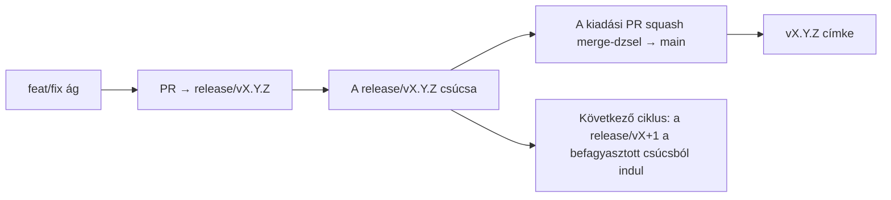

# Branching & Release Model (Magyar)

🌐 **Languages:** 🇺🇸 [English](../../../../ops/BRANCHING_MODEL.md) · 🇪🇹 [am](../../../am/docs/ops/BRANCHING_MODEL.md) · 🇸🇦 [ar](../../../ar/docs/ops/BRANCHING_MODEL.md) · 🇦🇿 [az](../../../az/docs/ops/BRANCHING_MODEL.md) · 🇧🇬 [bg](../../../bg/docs/ops/BRANCHING_MODEL.md) · 🇧🇩 [bn](../../../bn/docs/ops/BRANCHING_MODEL.md) · 🇧🇦 [bs](../../../bs/docs/ops/BRANCHING_MODEL.md) · 🇨🇿 [cs](../../../cs/docs/ops/BRANCHING_MODEL.md) · 🇩🇰 [da](../../../da/docs/ops/BRANCHING_MODEL.md) · 🇩🇪 [de](../../../de/docs/ops/BRANCHING_MODEL.md) · 🇬🇷 [el](../../../el/docs/ops/BRANCHING_MODEL.md) · 🇪🇸 [es](../../../es/docs/ops/BRANCHING_MODEL.md) · 🇪🇪 [et](../../../et/docs/ops/BRANCHING_MODEL.md) · 🇮🇷 [fa](../../../fa/docs/ops/BRANCHING_MODEL.md) · 🇫🇮 [fi](../../../fi/docs/ops/BRANCHING_MODEL.md) · 🇫🇷 [fr](../../../fr/docs/ops/BRANCHING_MODEL.md) · 🇮🇪 [ga](../../../ga/docs/ops/BRANCHING_MODEL.md) · 🇮🇳 [gu](../../../gu/docs/ops/BRANCHING_MODEL.md) · 🇳🇬 [ha](../../../ha/docs/ops/BRANCHING_MODEL.md) · 🇮🇱 [he](../../../he/docs/ops/BRANCHING_MODEL.md) · 🇮🇳 [hi](../../../hi/docs/ops/BRANCHING_MODEL.md) · 🇭🇷 [hr](../../../hr/docs/ops/BRANCHING_MODEL.md) · 🇦🇲 [hy](../../../hy/docs/ops/BRANCHING_MODEL.md) · 🇮🇩 [id](../../../id/docs/ops/BRANCHING_MODEL.md) · 🇳🇬 [ig](../../../ig/docs/ops/BRANCHING_MODEL.md) · 🇮🇹 [it](../../../it/docs/ops/BRANCHING_MODEL.md) · 🇯🇵 [ja](../../../ja/docs/ops/BRANCHING_MODEL.md) · 🇬🇪 [ka](../../../ka/docs/ops/BRANCHING_MODEL.md) · 🇰🇭 [km](../../../km/docs/ops/BRANCHING_MODEL.md) · 🇮🇳 [kn](../../../kn/docs/ops/BRANCHING_MODEL.md) · 🇰🇷 [ko](../../../ko/docs/ops/BRANCHING_MODEL.md) · 🇱🇹 [lt](../../../lt/docs/ops/BRANCHING_MODEL.md) · 🇱🇻 [lv](../../../lv/docs/ops/BRANCHING_MODEL.md) · 🇮🇳 [ml](../../../ml/docs/ops/BRANCHING_MODEL.md) · 🇮🇳 [mr](../../../mr/docs/ops/BRANCHING_MODEL.md) · 🇲🇾 [ms](../../../ms/docs/ops/BRANCHING_MODEL.md) · 🇲🇹 [mt](../../../mt/docs/ops/BRANCHING_MODEL.md) · 🇲🇲 [my](../../../my/docs/ops/BRANCHING_MODEL.md) · 🇳🇵 [ne](../../../ne/docs/ops/BRANCHING_MODEL.md) · 🇳🇱 [nl](../../../nl/docs/ops/BRANCHING_MODEL.md) · 🇳🇴 [no](../../../no/docs/ops/BRANCHING_MODEL.md) · 🇮🇳 [or](../../../or/docs/ops/BRANCHING_MODEL.md) · 🇮🇳 [pa](../../../pa/docs/ops/BRANCHING_MODEL.md) · 🇵🇭 [phi](../../../phi/docs/ops/BRANCHING_MODEL.md) · 🇵🇱 [pl](../../../pl/docs/ops/BRANCHING_MODEL.md) · 🇵🇹 [pt](../../../pt/docs/ops/BRANCHING_MODEL.md) · 🇧🇷 [pt-BR](../../../pt-BR/docs/ops/BRANCHING_MODEL.md) · 🇷🇴 [ro](../../../ro/docs/ops/BRANCHING_MODEL.md) · 🇷🇺 [ru](../../../ru/docs/ops/BRANCHING_MODEL.md) · 🇱🇰 [si](../../../si/docs/ops/BRANCHING_MODEL.md) · 🇸🇰 [sk](../../../sk/docs/ops/BRANCHING_MODEL.md) · 🇸🇮 [sl](../../../sl/docs/ops/BRANCHING_MODEL.md) · 🇷🇸 [sr](../../../sr/docs/ops/BRANCHING_MODEL.md) · 🇸🇪 [sv](../../../sv/docs/ops/BRANCHING_MODEL.md) · 🇰🇪 [sw](../../../sw/docs/ops/BRANCHING_MODEL.md) · 🇮🇳 [ta](../../../ta/docs/ops/BRANCHING_MODEL.md) · 🇮🇳 [te](../../../te/docs/ops/BRANCHING_MODEL.md) · 🇹🇭 [th](../../../th/docs/ops/BRANCHING_MODEL.md) · 🇹🇷 [tr](../../../tr/docs/ops/BRANCHING_MODEL.md) · 🇺🇦 [uk-UA](../../../uk-UA/docs/ops/BRANCHING_MODEL.md) · 🇵🇰 [ur](../../../ur/docs/ops/BRANCHING_MODEL.md) · 🇺🇿 [uz](../../../uz/docs/ops/BRANCHING_MODEL.md) · 🇻🇳 [vi](../../../vi/docs/ops/BRANCHING_MODEL.md) · 🇳🇬 [yo](../../../yo/docs/ops/BRANCHING_MODEL.md) · 🇨🇳 [zh-CN](../../../zh-CN/docs/ops/BRANCHING_MODEL.md) · 🇹🇼 [zh-TW](../../../zh-TW/docs/ops/BRANCHING_MODEL.md)

---

Az OmniRoute **párhuzamos ciklusú** kiadási modellt használ: az aktív ciklushoz egy külön `release/vX.Y.Z` ág tartozik, a `main` a közzétett kiadási vonal, a ciklus kiadásakor pedig egy módosíthatatlan `vX.Y.Z` címke készül. Teljesen megszokott, hogy commitok kerülnek a `release/*` ágakra _és_ a `main` ágra is — ez nem tévedés.

A karbantartóknak szóló részletek a `CLAUDE.md` fájlban (21. szigorú szabály) és a
[RELEASE_CHECKLIST.md](./RELEASE_CHECKLIST.md) dokumentumban találhatók. Ez az oldal a közreműködőknek szóló nyilvános összefoglaló.

## Rövid áttekintés

| Hivatkozás       | Szerep                                                                                                         |
| ---------------- | -------------------------------------------------------------------------------------------------------------- |
| `release/vX.Y.Z` | **Aktív ciklus** — az adott verzió napi fejlesztésének és PR-egyesítéseinek helye                              |
| `main`           | **Közzétett kiadási vonal** — a ciklust squash merge formájában kapja meg a kiadás közzétételekor              |
| `vX.Y.Z` (címke) | **Kiadási jelölő** — a kiadás pillanatában létrehozott, módosíthatatlan mutató arra, hogy „mi került kiadásra” |



## Melyik ágat célozza a PR-em?

**Az aktív `release/vX.Y.Z` ágat célozd — ne a `main` ágat.**

1. Keresd meg a legmagasabb verziószámú nyitott `release/v*` ágat (a dokumentum írásakor például:
   `release/v3.8.49`).
2. Hozd létre az ágadat annak csúcsából (`git fetch`, majd checkout / rebase erre).
3. Nyisd meg a PR-t úgy, hogy **base = az adott `release/vX.Y.Z`**.

A `main` nem a napi integrációs ág. A `main` ágra nyitott PR-ok célágát általában módosítani kell az egyesítés előtt.

## Kiadási befagyasztás (párhuzamos ciklusok)

Egy kiadás egyeztetésekor megnyitunk egy `release-freeze` címkével ellátott jelölő issue-t. Ez **nem állítja le a fejlesztést**:

- A befagyasztott `release/vX.Y.Z` az adott kiadás kiadási felelőséhez tartozik.
- A következő ciklus `release/vX+1` ága a befagyasztott csúcsból indul, így a közreműködők továbbra is egyesíthetik munkájukat.
- Azoknak a nyitott PR-oknak, amelyek még mindig a befagyasztott ágat célozzák, a célágát **módosítani kell** az aktív (legmagasabb verziószámú) `release/v*` ágra.

Mielőtt egy ágról azt feltételeznéd, hogy egyesíthető, ellenőrizd, van-e folyamatban kiadási befagyasztás:

```bash
gh issue list --repo diegosouzapw/OmniRoute --label release-freeze --state open
```

Az egyesítés működését (a tulajdonos által hozzáadott `queue` címke → Mergify) a
[MERGE_TRAIN.md](./MERGE_TRAIN.md) dokumentálja.

## Miért van szükség ágra és címkére is?

| Elem             | Élettartam              | Cél                                                                                             |
| ---------------- | ----------------------- | ----------------------------------------------------------------------------------------------- |
| `release/vX.Y.Z` | Folyamatban lévő ciklus | Összegyűjti az ellenőrzött PR-okat, megőrzi a CI zöld állapotát, és a PR-ok alapágaként szolgál |
| `vX.Y.Z` címke   | Örökké                  | Pontosan megjelöli az npm / GitHub Releases szolgáltatásban kiadott tartalmat                   |

Az ág a műhely, a címke pedig a lezárt csomag. A `main` ágra történő squash merge után a következő ciklus a `release/vX+1` ágon folytatódik, anélkül, hogy meg kellene várni az előző kiadási PR befejezését.

## Kapcsolódó dokumentumok

- [CONTRIBUTING.md](../../CONTRIBUTING.md) — beállítás, tesztek, PR-ellenőrzőlista
- [RELEASE_CHECKLIST.md](./RELEASE_CHECKLIST.md) — kiadás előtti ellenőrzés
- [MERGE_TRAIN.md](./MERGE_TRAIN.md) — egyesítési sor és tartalék egyesítési folyamat
- [RELEASE_GREEN.md](./RELEASE_GREEN.md) — a kiadási ág csúcsának zölden tartása
