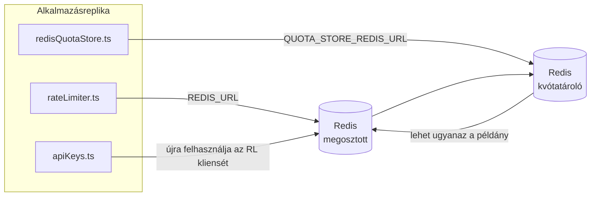

# Redis Production Configuration Guide (Magyar)

🌐 **Languages:** 🇺🇸 [English](../../../../ops/REDIS_PRODUCTION_CONFIG.md) · 🇪🇹 [am](../../../am/docs/ops/REDIS_PRODUCTION_CONFIG.md) · 🇸🇦 [ar](../../../ar/docs/ops/REDIS_PRODUCTION_CONFIG.md) · 🇦🇿 [az](../../../az/docs/ops/REDIS_PRODUCTION_CONFIG.md) · 🇧🇬 [bg](../../../bg/docs/ops/REDIS_PRODUCTION_CONFIG.md) · 🇧🇩 [bn](../../../bn/docs/ops/REDIS_PRODUCTION_CONFIG.md) · 🇨🇿 [cs](../../../cs/docs/ops/REDIS_PRODUCTION_CONFIG.md) · 🇩🇰 [da](../../../da/docs/ops/REDIS_PRODUCTION_CONFIG.md) · 🇩🇪 [de](../../../de/docs/ops/REDIS_PRODUCTION_CONFIG.md) · 🇬🇷 [el](../../../el/docs/ops/REDIS_PRODUCTION_CONFIG.md) · 🇪🇸 [es](../../../es/docs/ops/REDIS_PRODUCTION_CONFIG.md) · 🇪🇪 [et](../../../et/docs/ops/REDIS_PRODUCTION_CONFIG.md) · 🇮🇷 [fa](../../../fa/docs/ops/REDIS_PRODUCTION_CONFIG.md) · 🇫🇮 [fi](../../../fi/docs/ops/REDIS_PRODUCTION_CONFIG.md) · 🇫🇷 [fr](../../../fr/docs/ops/REDIS_PRODUCTION_CONFIG.md) · 🇮🇪 [ga](../../../ga/docs/ops/REDIS_PRODUCTION_CONFIG.md) · 🇮🇳 [gu](../../../gu/docs/ops/REDIS_PRODUCTION_CONFIG.md) · 🇳🇬 [ha](../../../ha/docs/ops/REDIS_PRODUCTION_CONFIG.md) · 🇮🇱 [he](../../../he/docs/ops/REDIS_PRODUCTION_CONFIG.md) · 🇮🇳 [hi](../../../hi/docs/ops/REDIS_PRODUCTION_CONFIG.md) · 🇭🇷 [hr](../../../hr/docs/ops/REDIS_PRODUCTION_CONFIG.md) · 🇦🇲 [hy](../../../hy/docs/ops/REDIS_PRODUCTION_CONFIG.md) · 🇮🇩 [id](../../../id/docs/ops/REDIS_PRODUCTION_CONFIG.md) · 🇳🇬 [ig](../../../ig/docs/ops/REDIS_PRODUCTION_CONFIG.md) · 🇮🇹 [it](../../../it/docs/ops/REDIS_PRODUCTION_CONFIG.md) · 🇯🇵 [ja](../../../ja/docs/ops/REDIS_PRODUCTION_CONFIG.md) · 🇬🇪 [ka](../../../ka/docs/ops/REDIS_PRODUCTION_CONFIG.md) · 🇰🇭 [km](../../../km/docs/ops/REDIS_PRODUCTION_CONFIG.md) · 🇮🇳 [kn](../../../kn/docs/ops/REDIS_PRODUCTION_CONFIG.md) · 🇰🇷 [ko](../../../ko/docs/ops/REDIS_PRODUCTION_CONFIG.md) · 🇱🇹 [lt](../../../lt/docs/ops/REDIS_PRODUCTION_CONFIG.md) · 🇱🇻 [lv](../../../lv/docs/ops/REDIS_PRODUCTION_CONFIG.md) · 🇮🇳 [ml](../../../ml/docs/ops/REDIS_PRODUCTION_CONFIG.md) · 🇮🇳 [mr](../../../mr/docs/ops/REDIS_PRODUCTION_CONFIG.md) · 🇲🇾 [ms](../../../ms/docs/ops/REDIS_PRODUCTION_CONFIG.md) · 🇲🇹 [mt](../../../mt/docs/ops/REDIS_PRODUCTION_CONFIG.md) · 🇲🇲 [my](../../../my/docs/ops/REDIS_PRODUCTION_CONFIG.md) · 🇳🇵 [ne](../../../ne/docs/ops/REDIS_PRODUCTION_CONFIG.md) · 🇳🇱 [nl](../../../nl/docs/ops/REDIS_PRODUCTION_CONFIG.md) · 🇳🇴 [no](../../../no/docs/ops/REDIS_PRODUCTION_CONFIG.md) · 🇮🇳 [or](../../../or/docs/ops/REDIS_PRODUCTION_CONFIG.md) · 🇮🇳 [pa](../../../pa/docs/ops/REDIS_PRODUCTION_CONFIG.md) · 🇵🇭 [phi](../../../phi/docs/ops/REDIS_PRODUCTION_CONFIG.md) · 🇵🇱 [pl](../../../pl/docs/ops/REDIS_PRODUCTION_CONFIG.md) · 🇵🇹 [pt](../../../pt/docs/ops/REDIS_PRODUCTION_CONFIG.md) · 🇧🇷 [pt-BR](../../../pt-BR/docs/ops/REDIS_PRODUCTION_CONFIG.md) · 🇷🇴 [ro](../../../ro/docs/ops/REDIS_PRODUCTION_CONFIG.md) · 🇷🇺 [ru](../../../ru/docs/ops/REDIS_PRODUCTION_CONFIG.md) · 🇱🇰 [si](../../../si/docs/ops/REDIS_PRODUCTION_CONFIG.md) · 🇸🇰 [sk](../../../sk/docs/ops/REDIS_PRODUCTION_CONFIG.md) · 🇸🇮 [sl](../../../sl/docs/ops/REDIS_PRODUCTION_CONFIG.md) · 🇷🇸 [sr](../../../sr/docs/ops/REDIS_PRODUCTION_CONFIG.md) · 🇸🇪 [sv](../../../sv/docs/ops/REDIS_PRODUCTION_CONFIG.md) · 🇰🇪 [sw](../../../sw/docs/ops/REDIS_PRODUCTION_CONFIG.md) · 🇮🇳 [ta](../../../ta/docs/ops/REDIS_PRODUCTION_CONFIG.md) · 🇮🇳 [te](../../../te/docs/ops/REDIS_PRODUCTION_CONFIG.md) · 🇹🇭 [th](../../../th/docs/ops/REDIS_PRODUCTION_CONFIG.md) · 🇹🇷 [tr](../../../tr/docs/ops/REDIS_PRODUCTION_CONFIG.md) · 🇺🇦 [uk-UA](../../../uk-UA/docs/ops/REDIS_PRODUCTION_CONFIG.md) · 🇵🇰 [ur](../../../ur/docs/ops/REDIS_PRODUCTION_CONFIG.md) · 🇺🇿 [uz](../../../uz/docs/ops/REDIS_PRODUCTION_CONFIG.md) · 🇻🇳 [vi](../../../vi/docs/ops/REDIS_PRODUCTION_CONFIG.md) · 🇳🇬 [yo](../../../yo/docs/ops/REDIS_PRODUCTION_CONFIG.md) · 🇨🇳 [zh-CN](../../../zh-CN/docs/ops/REDIS_PRODUCTION_CONFIG.md) · 🇹🇼 [zh-TW](../../../zh-TW/docs/ops/REDIS_PRODUCTION_CONFIG.md)

---

## Áttekintés

A Redis egy **opcionális, laza függőség** az OmniRoute-ban — ha a Redis nem érhető el, az alkalmazás szabályozottan csökkentett funkcionalitásra vált (memórián belüli tartalékmegoldásokra). Éles környezetben a Redis finomhangolása négy különböző feladattípus késleltetését csökkenti:

| Feladattípus                    | Megvalósító                   | Klienspéldányosító                                            | Kulcsminta                                              |
| ------------------------------- | ----------------------------- | ------------------------------------------------------------- | ------------------------------------------------------- |
| Sebességkorlátozás              | `rateLimiter.ts`              | `getRedisClient()` — lusta inicializálású `ioredis` singleton | `<prefix>rl:*` Lua‑atomi sebességkorlátozási időablakok |
| Hitelesítési gyorsítótár        | `apiKeys.ts`                  | Újra felhasználja a `rateLimiter` kliensét                    | `<prefix>auth:api_key:<sha256>` TTL-lel                 |
| Kvótatároló                     | `redisQuotaStore.ts`          | Különálló `getRedisClient(url)` singleton                     | `<prefix>quota:*`, példányonként konfigurálható         |
| Bemelegítési áramkör-megszakító | `redisCircuitBreakerStore.ts` | Különálló kliens a `circuitBreakerFactory.ts` fájlban         | `<prefix>warmup:cb:<connectionId>`                      |

Mind a négy feladattípus közös névtérelőtagot használ, így az OmniRoute más alkalmazásokkal együtt is használhat egyetlen Redis-példányt (például `127.0.0.1:6379`). Lásd: [Kulcsok névterezése](#key-namespacing).

---

## Jelenlegi konfiguráció (kódbeli alapértékek)

| Beállítás                                  | Érték                                                                   | Hely                                                                                  |
| ------------------------------------------ | ----------------------------------------------------------------------- | ------------------------------------------------------------------------------------- |
| `REDIS_URL` környezeti változó             | `redis://redis:6379` (compose), opcionális                              | `rateLimiter.ts:5`, `.env.example`                                                    |
| `REDIS_KEY_PREFIX` környezeti változó      | `omniroute:` (alapértelmezett)                                          | `rateLimiter.ts`, `redisQuotaStore.ts`, `redisCircuitBreakerStore.ts`, `.env.example` |
| `QUOTA_STORE_REDIS_URL` környezeti változó | különálló, eltérhet a `REDIS_URL` értékétől                             | `quota/storeFactory.ts`                                                               |
| `QUOTA_STORE_DRIVER`                       | `"sqlite"` (alapértelmezett), opcionálisan `"redis"`                    | `quota/storeFactory.ts`                                                               |
| ioredis `maxRetriesPerRequest`             | `3`                                                                     | kliens létrehozása a `rateLimiter.ts` fájlban                                         |
| `enableReadyCheck`                         | nincs beállítva (ioredis-alapérték: `true`)                             | —                                                                                     |
| `lazyConnect`                              | nincs beállítva (ioredis-alapérték: `false`)                            | —                                                                                     |
| `retryStrategy`                            | nincs beállítva (ioredis-alapérték: 200 ms-os alapérték, exponenciális) | —                                                                                     |
| TLS / jelszó / adatbázisindex              | **nincs konfigurálva**                                                  | —                                                                                     |
| Sentinel / Cluster                         | **nincs konfigurálva** — csak önálló, egycsomópontos üzemmód            | —                                                                                     |

---

## Kulcsok névterezése

Az OmniRoute ugyanazt a Redis-példányt használja, mint a gazdagépen futó egyéb szolgáltatások. Névtér nélkül az olyan kulcsok, mint az `auth:api_key:<sha256>` vagy az `rl:*`, ütközhetnek az ugyanazt a Redist használó más alkalmazások kulcsaival (ezen a példányon a Redis a `127.0.0.1:6379` címen fut más szolgáltatások mellett).

Állítsa a `REDIS_KEY_PREFIX` értékét nem üres karakterláncra, hogy az OmniRoute **minden** kulcsa előtagot kapjon:

```bash
# .env — minden OmniRoute-kulcs a következővé válik: omniroute:rl:*, omniroute:auth:*, omniroute:quota:*, omniroute:warmup:cb:*
REDIS_KEY_PREFIX=omniroute:
```

- **Alapértelmezett érték:** `omniroute:` (akkor alkalmazva, ha a `REDIS_KEY_PREFIX` nincs beállítva vagy üres).
- **A következőkre vonatkozik:** sebességkorlátozó + hitelesítési gyorsítótár (megosztott `ioredis` kliens a `keyPrefix` használatával), valamint a kvótatároló (`KEY_PREFIX = "${REDIS_KEY_PREFIX}quota"`) és a bemelegítési áramkör-megszakító (`KEY_PREFIX = "${REDIS_KEY_PREFIX}warmup:cb:"`).
- **Az előtag módosítása**, amikor már léteznek kulcsok a Redisben, árván hagyja a régi kulcsokat (ezek TTL / LRU alapján lejárnak). Biztonságosan módosítható; nincs szükség migrációra. Az egyetlen kivétel egy tiltottként megjelölt kapcsolat bemelegítési áramkör-megszakítójának kulcsa: ez TTL nélkül marad meg, ezért listázza a hátramaradt kulcsokat a `redis-cli --scan --pattern '<old-prefix>warmup:cb:*'` paranccsal, majd törölje őket.
- Az **ioredis `keyPrefix`** íráskor automatikusan hozzáfűzi az előtagot, olvasáskor pedig **eltávolítja** azt, így az alkalmazáskód soha nem látja az előtagot.

---

## Ajánlott éles környezeti finomhangolás

### 1. Kapcsolatkészlet / kliensbeállítások (ioredis `Redis` konstruktor)

A jelenlegi kód egyetlen `new Redis(url)` példányt hoz létre egyéni beállítások nélkül. Éles,
több replikás telepítésekhez adjon át egy kliensgyárat a kódban, vagy burkolja be a `getRedisClient()` függvényt:

```typescript
const redis = new Redis(REDIS_URL, {
  maxRetriesPerRequest: null, // nincs újrapróbálkozási korlát; a retryStrategy döntsön
  enableReadyCheck: true, // ellenőrizze, hogy a kiszolgáló készen áll-e a hívások fogadása előtt
  lazyConnect: true, // ne kapcsolódjon létrehozáskor; várjon az első hívásig
  retryStrategy: (times) => {
    if (times > 10) return null; // 10 próbálkozás után adja fel → később kapcsolódjon újra
    return Math.min(times * 200, 5000); // 200 ms, 400 ms, …, legfeljebb 5 s
  },
  enableAutoPipelining: true, // egyesítse a párhuzamos parancsokat egyetlen TCP-írásba
  keepAlive: 10000, // TCP-életben tartás 10 másodpercenként
});
```

**Főbb kompromisszumok:**

- `maxRetriesPerRequest: null` + `retryStrategy` — éles környezethez ajánlott, így az átmeneti
  Redis-újraindulások nem okozzák azonnal minden kérés sikertelenségét. A memórián belüli tartalék
  megoldás a `checkRateLimit()` függvényben kezeli a hibás végrehajtási ágat.
- `lazyConnect: true` — elkerüli, hogy az indulás attól függjön, elérhető-e a Redis, mielőtt a kiszolgáló
  megkezdi a kapcsolatok fogadását.
- `enableAutoPipelining: true` — csökkenti a hálózati fordulók számát a párhuzamos sebességkorlát-ellenőrzéseknél;
  egyetlen kapcsolaton 50 RPS fölött előnyös.

### 2. A Redis-kiszolgáló konfigurációja (`redis.conf`)

```
# Memória
maxmemory 80%                        # maradjon hely az operációs rendszer lapgyorsítótárának
maxmemory-policy allkeys-lru         # terhelés alatt távolítsa el az elavult hitelesítési gyorsítótár-bejegyzéseket

# Perzisztencia (opcionális — az OmniRoute enélkül is összeomlásbiztos)
save 300 1                           # legalább 5 percenként készítsen pillanatképet, ha ≥1 kulcs megváltozott
appendonly no                        # nincs szükség AOF-re; az adatok újra előállíthatók
appendfsync no                       # nincs fsync-többletterhelés (az RDB elegendő)

# Hálózat
timeout 0                            # ne bontsa az inaktív kapcsolatokat
tcp-keepalive 300                    # 5 perces életben tartás
tcp-backlog 511                      # kapcsolati várólista a kiugró terhelésekhez

# Teljesítmény
hz 10                                # alapértelmezett; késleltetésérzékeny esetben 100
activedefrag yes                     # automatikus töredezettségmentesítés, ha a töredezettség >10%
```

**Az `maxmemory-policy allkeys-lru` kompromisszuma:** Memórianyomás esetén a hitelesítési
gyorsítótár bejegyzései eltávolíthatók. Ez biztonságos — a `setCachedApiKey` hiány esetén mindig
újra feltölti őket, és az SQLite tartalék megoldás a mérvadó. A sebességkorlátozó Lua-szkript kis méretű,
szándékosan rövid élettartamú kulcsokat hoz létre.

### 3. Docker Compose-beállítások

Az éles környezethez tartozó compose (`docker-compose.prod.yml`) a `redis:8.6.2-alpine` rendszerképet használja. Adja hozzá:

```yaml
redis:
  image: redis:8.6.2-alpine
  command:
    [
      "redis-server",
      "--maxmemory",
      "512mb",
      "--maxmemory-policy",
      "allkeys-lru",
      "--activedefrag",
      "yes",
      "--save",
      "300 1",
    ]
  healthcheck:
    test: ["CMD", "redis-cli", "ping"]
    interval: 10s
    timeout: 3s
    retries: 3
    start_period: 5s
```

### 4. Több példányra / skálázásra vonatkozó megfontolások

**Egyetlen Redis az összes replikához** — a sebességkorlátozó Lua-szkript egyetlen,
mérvadó kulcstértől függ. A replikák mögötti több Redis-példány megszüntetné az atomosságot,
és megduplázná a keretet. Használjon egyetlen Redis-példányt (vagy feladatátvételt biztosító Redis Sentinel-fürtöt)
az alkalmazás összes replikájához.

**Kapcsolatok száma:** Minden alkalmazásreplika **2 TCP-kapcsolatot** nyit a Redis felé
(sebességkorlátozó kliens + kvótatároló kliens). 10 replika esetén → 20 kapcsolat, ami jóval
a Redis-példányok alapértelmezett 10 ezres kapcsolati korlátja alatt van.

### 5. Monitorozás

Tegye elérhetővé az állapotellenőrzési végponton keresztül:

```typescript
// A src/app/api/monitoring/health/route.ts már meghívja a sebességkorlátozó függvényeit
// Adjon hozzá Redis-specifikus ellenőrzéseket:
//   1. PING-késleltetés az ioredis .ping() segítségével
//   2. Memóriahasználat az INFO memory segítségével
//   3. Kapcsolatok száma az INFO clients segítségével
//   4. Találati arány a maxmemory-policy esetében (evicted_keys / keyspace_hits)
```

Figyelendő fő mérőszámok:

- **Eltávolított kulcsok / másodperc** — ha tartósan nem nulla, növelje a `maxmemory` értékét
- **Blokkolt kliensek** — a nullától eltérő érték lassú Lua-szkriptekre vagy nagy versengésre utal
- **Elutasított kapcsolatok** — elérték a kapcsolati korlátot; 20 kapcsolatnál ritka

---

## Architektúra-diagram



---

## Hivatkozások

| Fájl                               | Rendeltetés                                                                          |
| ---------------------------------- | ------------------------------------------------------------------------------------ |
| `src/shared/utils/rateLimiter.ts`  | Elsődleges Redis-kliens, Lua sebességkorlátozó szkript, memóriabeli tartalékmegoldás |
| `src/lib/db/apiKeys.ts`            | Hitelesítési gyorsítótár — Redis→SQLite tartalékmegoldással                          |
| `src/lib/quota/redisQuotaStore.ts` | Különálló Redis-kliens az opcionális kvótatárolóhoz                                  |
| `src/lib/quota/storeFactory.ts`    | Váltás a `sqlite` és a `redis` kvótameghajtók között                                 |
| `docker-compose.prod.yml`          | Éles környezetbeli Redis-konténer (`redis:8.6.2-alpine` rendszerképpel)              |
| `.env.example`                     | A Redis környezeti változóinak dokumentációja                                        |
| `src/app/api/local/redis/`         | API-útvonalak a fejlesztői konténerek vezérléséhez                                   |
| `bin/cli/commands/redis.mjs`       | CLI-parancsok a fejlesztői konténerek vezérléséhez                                   |
