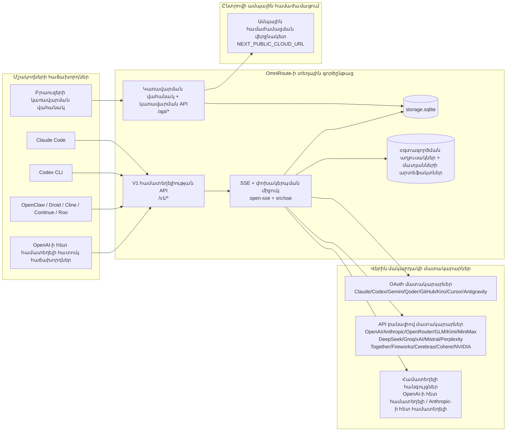
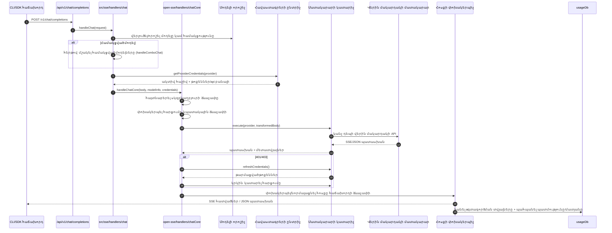
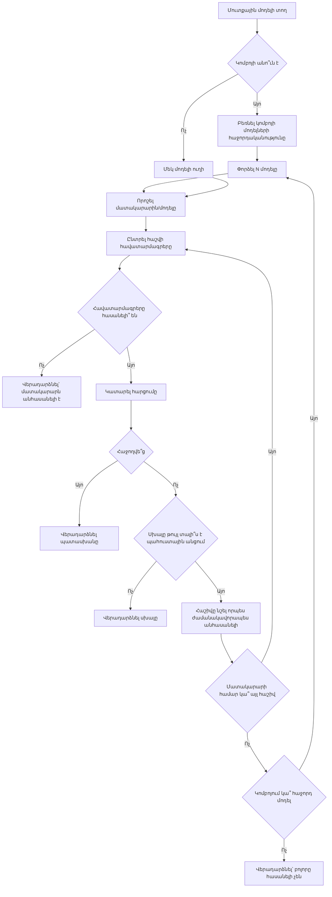
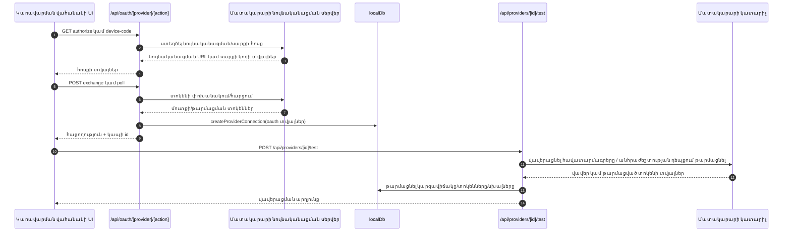
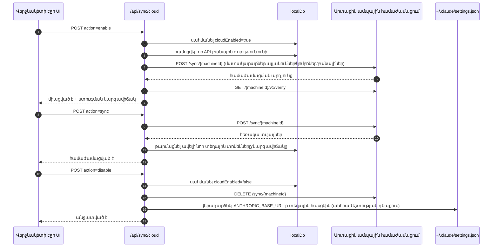
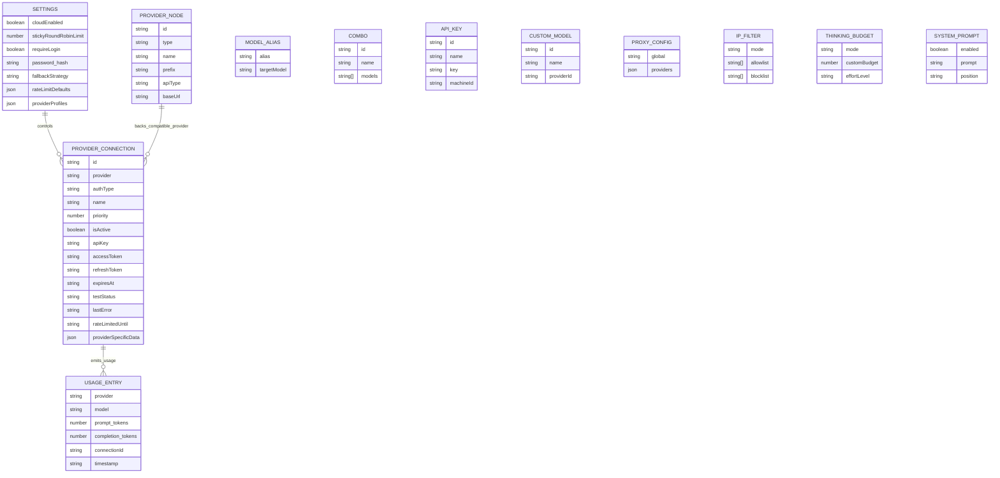
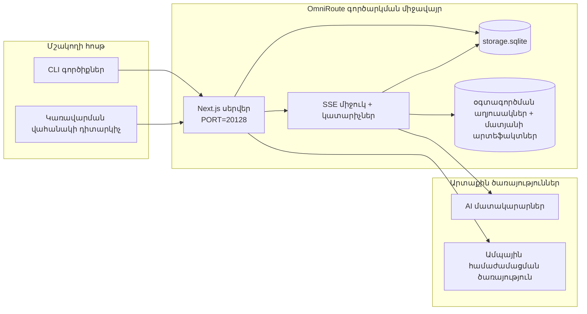

# OmniRoute Architecture (Հայերեն)

🌐 **Languages:** 🇺🇸 [English](../../../../architecture/ARCHITECTURE.md) · 🇪🇹 [am](../../../am/docs/architecture/ARCHITECTURE.md) · 🇸🇦 [ar](../../../ar/docs/architecture/ARCHITECTURE.md) · 🇦🇿 [az](../../../az/docs/architecture/ARCHITECTURE.md) · 🇧🇬 [bg](../../../bg/docs/architecture/ARCHITECTURE.md) · 🇧🇩 [bn](../../../bn/docs/architecture/ARCHITECTURE.md) · 🇨🇿 [cs](../../../cs/docs/architecture/ARCHITECTURE.md) · 🇩🇰 [da](../../../da/docs/architecture/ARCHITECTURE.md) · 🇩🇪 [de](../../../de/docs/architecture/ARCHITECTURE.md) · 🇬🇷 [el](../../../el/docs/architecture/ARCHITECTURE.md) · 🇪🇸 [es](../../../es/docs/architecture/ARCHITECTURE.md) · 🇪🇪 [et](../../../et/docs/architecture/ARCHITECTURE.md) · 🇮🇷 [fa](../../../fa/docs/architecture/ARCHITECTURE.md) · 🇫🇮 [fi](../../../fi/docs/architecture/ARCHITECTURE.md) · 🇫🇷 [fr](../../../fr/docs/architecture/ARCHITECTURE.md) · 🇮🇪 [ga](../../../ga/docs/architecture/ARCHITECTURE.md) · 🇮🇳 [gu](../../../gu/docs/architecture/ARCHITECTURE.md) · 🇳🇬 [ha](../../../ha/docs/architecture/ARCHITECTURE.md) · 🇮🇱 [he](../../../he/docs/architecture/ARCHITECTURE.md) · 🇮🇳 [hi](../../../hi/docs/architecture/ARCHITECTURE.md) · 🇭🇷 [hr](../../../hr/docs/architecture/ARCHITECTURE.md) · 🇭🇺 [hu](../../../hu/docs/architecture/ARCHITECTURE.md) · 🇮🇩 [id](../../../id/docs/architecture/ARCHITECTURE.md) · 🇳🇬 [ig](../../../ig/docs/architecture/ARCHITECTURE.md) · 🇮🇹 [it](../../../it/docs/architecture/ARCHITECTURE.md) · 🇯🇵 [ja](../../../ja/docs/architecture/ARCHITECTURE.md) · 🇬🇪 [ka](../../../ka/docs/architecture/ARCHITECTURE.md) · 🇰🇭 [km](../../../km/docs/architecture/ARCHITECTURE.md) · 🇮🇳 [kn](../../../kn/docs/architecture/ARCHITECTURE.md) · 🇰🇷 [ko](../../../ko/docs/architecture/ARCHITECTURE.md) · 🇱🇹 [lt](../../../lt/docs/architecture/ARCHITECTURE.md) · 🇱🇻 [lv](../../../lv/docs/architecture/ARCHITECTURE.md) · 🇮🇳 [ml](../../../ml/docs/architecture/ARCHITECTURE.md) · 🇮🇳 [mr](../../../mr/docs/architecture/ARCHITECTURE.md) · 🇲🇾 [ms](../../../ms/docs/architecture/ARCHITECTURE.md) · 🇲🇹 [mt](../../../mt/docs/architecture/ARCHITECTURE.md) · 🇲🇲 [my](../../../my/docs/architecture/ARCHITECTURE.md) · 🇳🇵 [ne](../../../ne/docs/architecture/ARCHITECTURE.md) · 🇳🇱 [nl](../../../nl/docs/architecture/ARCHITECTURE.md) · 🇳🇴 [no](../../../no/docs/architecture/ARCHITECTURE.md) · 🇮🇳 [or](../../../or/docs/architecture/ARCHITECTURE.md) · 🇮🇳 [pa](../../../pa/docs/architecture/ARCHITECTURE.md) · 🇵🇭 [phi](../../../phi/docs/architecture/ARCHITECTURE.md) · 🇵🇱 [pl](../../../pl/docs/architecture/ARCHITECTURE.md) · 🇵🇹 [pt](../../../pt/docs/architecture/ARCHITECTURE.md) · 🇧🇷 [pt-BR](../../../pt-BR/docs/architecture/ARCHITECTURE.md) · 🇷🇴 [ro](../../../ro/docs/architecture/ARCHITECTURE.md) · 🇷🇺 [ru](../../../ru/docs/architecture/ARCHITECTURE.md) · 🇱🇰 [si](../../../si/docs/architecture/ARCHITECTURE.md) · 🇸🇰 [sk](../../../sk/docs/architecture/ARCHITECTURE.md) · 🇸🇮 [sl](../../../sl/docs/architecture/ARCHITECTURE.md) · 🇷🇸 [sr](../../../sr/docs/architecture/ARCHITECTURE.md) · 🇸🇪 [sv](../../../sv/docs/architecture/ARCHITECTURE.md) · 🇰🇪 [sw](../../../sw/docs/architecture/ARCHITECTURE.md) · 🇮🇳 [ta](../../../ta/docs/architecture/ARCHITECTURE.md) · 🇮🇳 [te](../../../te/docs/architecture/ARCHITECTURE.md) · 🇹🇭 [th](../../../th/docs/architecture/ARCHITECTURE.md) · 🇹🇷 [tr](../../../tr/docs/architecture/ARCHITECTURE.md) · 🇺🇦 [uk-UA](../../../uk-UA/docs/architecture/ARCHITECTURE.md) · 🇵🇰 [ur](../../../ur/docs/architecture/ARCHITECTURE.md) · 🇺🇿 [uz](../../../uz/docs/architecture/ARCHITECTURE.md) · 🇻🇳 [vi](../../../vi/docs/architecture/ARCHITECTURE.md) · 🇳🇬 [yo](../../../yo/docs/architecture/ARCHITECTURE.md) · 🇨🇳 [zh-CN](../../../zh-CN/docs/architecture/ARCHITECTURE.md) · 🇹🇼 [zh-TW](../../../zh-TW/docs/architecture/ARCHITECTURE.md)

---

🌐 **Languages:** 🇺🇸 [English](../../../../architecture/ARCHITECTURE.md) · 🇪🇹 [am](../../../am/docs/architecture/ARCHITECTURE.md) · 🇸🇦 [ar](../../../ar/docs/architecture/ARCHITECTURE.md) · 🇦🇿 [az](../../../az/docs/architecture/ARCHITECTURE.md) · 🇧🇬 [bg](../../../bg/docs/architecture/ARCHITECTURE.md) · 🇧🇩 [bn](../../../bn/docs/architecture/ARCHITECTURE.md) · 🇨🇿 [cs](../../../cs/docs/architecture/ARCHITECTURE.md) · 🇩🇰 [da](../../../da/docs/architecture/ARCHITECTURE.md) · 🇩🇪 [de](../../../de/docs/architecture/ARCHITECTURE.md) · 🇬🇷 [el](../../../el/docs/architecture/ARCHITECTURE.md) · 🇪🇸 [es](../../../es/docs/architecture/ARCHITECTURE.md) · 🇪🇪 [et](../../../et/docs/architecture/ARCHITECTURE.md) · 🇮🇷 [fa](../../../fa/docs/architecture/ARCHITECTURE.md) · 🇫🇮 [fi](../../../fi/docs/architecture/ARCHITECTURE.md) · 🇫🇷 [fr](../../../fr/docs/architecture/ARCHITECTURE.md) · 🇮🇪 [ga](../../../ga/docs/architecture/ARCHITECTURE.md) · 🇮🇳 [gu](../../../gu/docs/architecture/ARCHITECTURE.md) · 🇳🇬 [ha](../../../ha/docs/architecture/ARCHITECTURE.md) · 🇮🇱 [he](../../../he/docs/architecture/ARCHITECTURE.md) · 🇮🇳 [hi](../../../hi/docs/architecture/ARCHITECTURE.md) · 🇭🇷 [hr](../../../hr/docs/architecture/ARCHITECTURE.md) · 🇭🇺 [hu](../../../hu/docs/architecture/ARCHITECTURE.md) · 🇮🇩 [id](../../../id/docs/architecture/ARCHITECTURE.md) · 🇳🇬 [ig](../../../ig/docs/architecture/ARCHITECTURE.md) · 🇮🇹 [it](../../../it/docs/architecture/ARCHITECTURE.md) · 🇯🇵 [ja](../../../ja/docs/architecture/ARCHITECTURE.md) · 🇬🇪 [ka](../../../ka/docs/architecture/ARCHITECTURE.md) · 🇰🇭 [km](../../../km/docs/architecture/ARCHITECTURE.md) · 🇮🇳 [kn](../../../kn/docs/architecture/ARCHITECTURE.md) · 🇰🇷 [ko](../../../ko/docs/architecture/ARCHITECTURE.md) · 🇱🇹 [lt](../../../lt/docs/architecture/ARCHITECTURE.md) · 🇱🇻 [lv](../../../lv/docs/architecture/ARCHITECTURE.md) · 🇮🇳 [ml](../../../ml/docs/architecture/ARCHITECTURE.md) · 🇮🇳 [mr](../../../mr/docs/architecture/ARCHITECTURE.md) · 🇲🇾 [ms](../../../ms/docs/architecture/ARCHITECTURE.md) · 🇲🇹 [mt](../../../mt/docs/architecture/ARCHITECTURE.md) · 🇲🇲 [my](../../../my/docs/architecture/ARCHITECTURE.md) · 🇳🇵 [ne](../../../ne/docs/architecture/ARCHITECTURE.md) · 🇳🇱 [nl](../../../nl/docs/architecture/ARCHITECTURE.md) · 🇳🇴 [no](../../../no/docs/architecture/ARCHITECTURE.md) · 🇮🇳 [or](../../../or/docs/architecture/ARCHITECTURE.md) · 🇮🇳 [pa](../../../pa/docs/architecture/ARCHITECTURE.md) · 🇵🇭 [phi](../../../phi/docs/architecture/ARCHITECTURE.md) · 🇵🇱 [pl](../../../pl/docs/architecture/ARCHITECTURE.md) · 🇵🇹 [pt](../../../pt/docs/architecture/ARCHITECTURE.md) · 🇧🇷 [pt-BR](../../../pt-BR/docs/architecture/ARCHITECTURE.md) · 🇷🇴 [ro](../../../ro/docs/architecture/ARCHITECTURE.md) · 🇷🇺 [ru](../../../ru/docs/architecture/ARCHITECTURE.md) · 🇱🇰 [si](../../../si/docs/architecture/ARCHITECTURE.md) · 🇸🇰 [sk](../../../sk/docs/architecture/ARCHITECTURE.md) · 🇸🇮 [sl](../../../sl/docs/architecture/ARCHITECTURE.md) · 🇷🇸 [sr](../../../sr/docs/architecture/ARCHITECTURE.md) · 🇸🇪 [sv](../../../sv/docs/architecture/ARCHITECTURE.md) · 🇰🇪 [sw](../../../sw/docs/architecture/ARCHITECTURE.md) · 🇮🇳 [ta](../../../ta/docs/architecture/ARCHITECTURE.md) · 🇮🇳 [te](../../../te/docs/architecture/ARCHITECTURE.md) · 🇹🇭 [th](../../../th/docs/architecture/ARCHITECTURE.md) · 🇹🇷 [tr](../../../tr/docs/architecture/ARCHITECTURE.md) · 🇺🇦 [uk-UA](../../../uk-UA/docs/architecture/ARCHITECTURE.md) · 🇵🇰 [ur](../../../ur/docs/architecture/ARCHITECTURE.md) · 🇺🇿 [uz](../../../uz/docs/architecture/ARCHITECTURE.md) · 🇻🇳 [vi](../../../vi/docs/architecture/ARCHITECTURE.md) · 🇳🇬 [yo](../../../yo/docs/architecture/ARCHITECTURE.md) · 🇨🇳 [zh-CN](../../../zh-CN/docs/architecture/ARCHITECTURE.md) · 🇹🇼 [zh-TW](../../../zh-TW/docs/architecture/ARCHITECTURE.md)

_Վերջին թարմացումը՝ 2026-06-28_

## Գործադիր ամփոփագիր

OmniRoute-ը Next.js-ի վրա կառուցված տեղային AI երթուղավորման դարպաս և կառավարման վահանակ է։
Այն տրամադրում է OpenAI-ի հետ համատեղելի միասնական վերջնակետ (`/v1/*`) և երթուղավորում է տրաֆիկը մի քանի վերին հոսքի մատակարարների միջև՝ ապահովելով ձևաչափերի փոխակերպում, պահուստային անցում, թոքենների թարմացում և օգտագործման հետևում։

Հիմնական հնարավորությունները՝

- OpenAI-ի հետ համատեղելի API միջերես CLI-ների/գործիքների համար (355 մատակարար, 108 կատարիչ)
- Հարցումների/պատասխանների փոխակերպում մատակարարների ձևաչափերի միջև
- Մոդելների համակցված պահուստային անցում (բազմամոդելային հաջորդականություն)
- Կառուցվածքային համակցման քայլեր (`provider + model + connection`)՝ կատարման պահին `compositeTiers`-ով հերթակարգմամբ
- Հաշվի մակարդակով պահուստային անցում (մեկ մատակարարի համար մի քանի հաշիվ)
- Քվոտայի նախնական ստուգում և քվոտան հաշվի առնող P2C հաշվի ընտրություն հիմնական զրույցի ուղում
- OAuth + API բանալիով մատակարարների կապերի կառավարում (22 OAuth մատակարարի մոդուլ)
- Ներդրումների ստեղծում `/v1/embeddings`-ի միջոցով (18 մատակարար)
- Պատկերների ստեղծում `/v1/images/generations`-ի միջոցով (10+ մատակարար, 20+ մոդել)
- Ձայնագրությունների վերծանում `/v1/audio/transcriptions`-ի միջոցով (18 մատակարար)
- Տեքստից խոսքի սինթեզ `/v1/audio/speech`-ի միջոցով (24 ներկառուցված մատակարար)
- Տեսանյութերի ստեղծում `/v1/videos/generations`-ի միջոցով (ComfyUI + SD WebUI)
- Երաժշտության ստեղծում `/v1/music/generations`-ի միջոցով (ComfyUI)
- Վեբ որոնում `/v1/search`-ի միջոցով (20 մատակարար)
- Բովանդակության մոդերացիա `/v1/moderations`-ի միջոցով
- Վերադասակարգում `/v1/rerank`-ի միջոցով
- Մտածողության մոդելների համար think թեգերի վերլուծում (`<think>...</think>`)
- Պատասխանների մաքրում՝ OpenAI SDK-ի խիստ համատեղելիությունն ապահովելու համար
- Դերերի նորմալացում (developer→system, system→user)՝ տարբեր մատակարարների միջև համատեղելիության համար
- Կառուցվածքային ելքի փոխակերպում (json_schema → Gemini responseSchema)
- Մատակարարների, բանալիների, կեղծանունների, համակցումների, կարգավորումների և գնագոյացման տեղային պահպանում (122 DB մոդուլ)
- Օգտագործման/ծախսերի հետևում և հարցումների գրանցում
- Ընտրովի ամպային համաժամացում՝ մի քանի սարքերի/վիճակների համաժամացման համար
- IP թույլատրելի/արգելափակված հասցեների ցանկ՝ API հասանելիությունը վերահսկելու համար
- Մտածողության բյուջեի կառավարում (անփոփոխ փոխանցում/ավտոմատ/հատուկ/հարմարվողական)
- Համակարգային գլոբալ հուշման ներարկում
- Սեսիաների հետևում և մատնահետքերի ստեղծում
- Ըստ հաշվի ընդլայնված արագության սահմանափակում՝ մատակարարներին հատուկ պրոֆիլներով
- Շղթայի անջատիչի ձևանմուշ՝ մատակարարների կայունությունն ապահովելու համար
- Զանգվածային միաժամանակյա հարցումներից պաշտպանություն՝ mutex կողպմամբ
- Ստորագրության վրա հիմնված հարցումների կրկնազտման քեշ
- Դոմենային շերտ՝ ծախսերի կանոններ, պահուստային անցման քաղաքականություն, արգելափակման քաղաքականություն
- Context Relay՝ սեսիայի փոխանցման ամփոփագրեր՝ հաշիվների հերթափոխի շարունակականության համար
- Դոմենային վիճակի պահպանում (SQLite անմիջական գրանցմամբ քեշ՝ պահուստային անցումների, բյուջեների, արգելափակումների և շղթայի անջատիչների համար)
- Քաղաքականությունների շարժիչ՝ հարցումների կենտրոնացված գնահատման համար (արգելափակում → բյուջե → պահուստային անցում)
- Հարցումների հեռաչափություն՝ p50/p95/p99 ուշացման ագրեգացմամբ
- Համակցման թիրախների հեռաչափություն և համակցման թիրախների պատմական վիճակ՝ `combo_execution_key` / `combo_step_id`-ի միջոցով
- Հարաբերակցման ID (X-Request-Id)՝ ծայրից ծայր հետագծման համար
- Համապատասխանության աուդիտի գրանցում՝ յուրաքանչյուր API բանալու համար անջատման հնարավորությամբ
- Գնահատման շրջանակ՝ LLM-ի որակի ապահովման համար
- Առողջական վիճակի կառավարման վահանակ՝ մատակարարների շղթայի անջատիչների իրական ժամանակի կարգավիճակով
- MCP Server (110 գործիք)՝ 3 փոխադրամիջոցով (stdio/SSE/Streamable HTTP)
- A2A Server (JSON-RPC 2.0 + SSE)՝ հմտություններով և առաջադրանքների կենսացիկլով
- Հիշողության համակարգ (արդյունահանում, ներարկում, առբերում, ամփոփում)
- Հմտությունների համակարգ (ռեեստր, կատարիչ, ավազարկղ, ներկառուցված հմտություններ)
- MITM միջնորդ սերվեր՝ վկայագրերի կառավարմամբ և DNS մշակմամբ
- Հուշումների ներարկումից պաշտպանող միջնաշերտ
- Հուշումների սեղմման խողովակաշար՝ Caveman, RTK, շերտավորված խողովակաշարերով, սեղմման համակցումներով, լեզվական փաթեթներով և վերլուծությամբ
- ACP (Agent Communication Protocol) ռեեստր
- Մոդուլային OAuth մատակարարներ (22 առանձին մոդուլ `src/lib/oauth/providers/`-ում)
- Հեռացման/ամբողջական հեռացման սկրիպտներ
- OAuth միջավայրի վերականգնման գործողություն
- WebSocket կամուրջ՝ OpenAI-ի հետ համատեղելի WS հաճախորդների համար (`/v1/ws`)
- Համաժամացման թոքենների կառավարում (տրամադրում/հետկանչ, ETag-ով տարբերակավորված կազմաձևման փաթեթի ներբեռնում)
- GLM Thinking (`glmt`)՝ որպես առաջին կարգի մատակարարի նախակազմաձև
- Թոքենների հիբրիդային հաշվարկ (մատակարարի կողմից `/messages/count_tokens`՝ գնահատման պահուստային տարբերակով)
- Մոդելների կեղծանունների ավտոմատ սկզբնավորում (30+ միջնորդ սերվերների միջև դիալեկտների նորմալացում գործարկման ժամանակ)
- Անվտանգ ելքային fetch՝ SSRF պաշտպանությամբ, մասնավոր URL-ների արգելափակմամբ և կարգավորվող կրկնափորձով
- Սպասման ժամանակը հաշվի առնող զրույցի կրկնափորձեր՝ կարգավորվող `requestRetry`-ով և `maxRetryIntervalSec`-ով
- Կատարման միջավայրի վավերացում Zod-ի միջոցով՝ գործարկման պահին
- Համապատասխանության աուդիտ v2՝ էջավորմամբ, մատակարարների CRUD իրադարձություններով և SSRF-ով արգելափակված վավերացումների գրանցմամբ

Կատարման հիմնական մոդելը՝

- `src/app/api/*`-ում գտնվող Next.js հավելվածի երթուղիներն իրականացնում են ինչպես կառավարման վահանակի API-ները, այնպես էլ համատեղելիության API-ները
- `src/sse/*` + `open-sse/*`-ում գտնվող ընդհանուր SSE/երթուղավորման միջուկը մշակում է մատակարարների կատարումը, փոխակերպումը, հոսքային փոխանցումը, պահուստային անցումը և օգտագործումը

## Տեղեկատու դիագրամներ

v3.8.0 հարթակի կանոնական, տարբերակների վերահսկմամբ կառավարվող Mermaid սկզբնաղբյուրները գտնվում են
[`docs/diagrams/`](../diagrams/README.md) պանակում։ Ստորև կողմնորոշման համար վերարտադրված են դրանցից երկուսը,
իսկ մնացածի հղումները ներառված են համապատասխան ոլորտային ուղեցույցներում։


> Սկզբնաղբյուր՝ [diagrams/request-pipeline.mmd](../diagrams/request-pipeline.mmd)


> Սկզբնաղբյուր՝ [diagrams/resilience-3layers.mmd](../diagrams/resilience-3layers.mmd) — հղումը ներառված է նաև
> [RESILIENCE_GUIDE.md](./RESILIENCE_GUIDE.md)-ում և `CLAUDE.md`-ի դիմակայունության տեղեկատու բաժնում։

## Կիրառման շրջանակ և սահմաններ

### Կիրառման շրջանակում

- Տեղային gateway-ի գործարկման միջավայր
- Dashboard-ի կառավարման API-ներ
- Մատակարարի նույնականացում և token-ի թարմացում
- Հարցումների փոխակերպում և SSE հոսքային փոխանցում
- Տեղային վիճակի և օգտագործման տվյալների պահպանում
- Ընտրովի cloud համաժամացման կազմակերպում

### Կիրառման շրջանակից դուրս

- `NEXT_PUBLIC_CLOUD_URL`-ի հետևում գտնվող cloud ծառայության իրականացումը
- Տեղային գործընթացից դուրս գտնվող մատակարարի SLA/կառավարման հարթությունը
- Արտաքին CLI երկուական ֆայլերը (Claude CLI, Codex CLI և այլն)

## Dashboard-ի միջերեսը (ընթացիկ)

`src/app/(dashboard)/dashboard/`-ի հիմնական էջերը՝

- `/dashboard` — արագ մեկնարկ և մատակարարների ընդհանուր նկարագիր
- `/dashboard/endpoint` — endpoint proxy-ի, MCP-ի, A2A-ի և API endpoint-ի ներդիրներ
- `/dashboard/providers` — մատակարարների միացումներ և հավատարմագրեր
- `/dashboard/combos` — combo ռազմավարություններ, ձևանմուշներ, քայլերի վրա հիմնված կառուցիչ, մոդելների երթուղավորման կանոններ և ձեռքով պահպանվող հերթականություն
- `/dashboard/auto-combo` — Auto Combo Engine՝ գնահատման կշիռներ, ռեժիմների փաթեթներ, վիրտուալ գործարանի նախակարգավորումներ և հեռաչափություն
- `/dashboard/costs` — ծախսերի համախմբում և գնագոյացման տեսանելիություն
- `/dashboard/analytics` — օգտագործման վերլուծություն, գնահատումներ և combo թիրախների վիճակ
- `/dashboard/limits` — քվոտաների և հաճախականության կառավարում
- `/dashboard/cli-tools` — CLI-ի մեկնարկային կարգավորում, գործարկման միջավայրի հայտնաբերում և կազմաձևման ստեղծում
- `/dashboard/agents` — հայտնաբերված ACP գործակալներ և հատուկ գործակալների գրանցում
- `/dashboard/cloud-agents` — cloud-ում տեղակայված գործակալների առաջադրանքներ (Codex Cloud, Devin, Jules) և առաջադրանքների կենսացիկլ
- `/dashboard/skills` — A2A հմտությունների գրանցամատյան, sandbox-ում կատարում և ներկառուցված հմտությունների կատալոգ
- `/dashboard/memory` — խոսակցական մշտական հիշողության դիտարկում և առբերում
- `/dashboard/webhooks` — ելքային webhook բաժանորդագրություններ, գաղտնիքների ռոտացիա և կրկնափորձերի վիճակագրություն
- `/dashboard/batch` — փաթեթային առաջադրանքների ուղարկում և առաջընթաց
- `/dashboard/cache` — read-through և reasoning cache-ի վիճակագրություն ու արտամղման կառավարում
- `/dashboard/playground` — ինտերակտիվ զրույցի փորձադաշտ՝ կազմաձևված ցանկացած combo-ի կամ մոդելի հետ
- `/dashboard/changelog` — հավելվածի ներսում փոփոխությունների մատյանի դիտարկիչ (արտապատկերում է `CHANGELOG.md`-ը)
- `/dashboard/system` — գործարկման միջավայրի ախտորոշում, տարբերակի տեղեկություններ և միջավայրի վավերացման միջերես
- `/dashboard/onboarding` — նոր տեղադրումների առաջին գործարկման կարգավորման օգնական
- `/dashboard/media` — պատկերների, տեսանյութերի և երաժշտության փորձադաշտ
- `/dashboard/search-tools` — որոնման մատակարարների փորձարկում և պատմություն
- `/dashboard/health` — անխափան աշխատանքի ժամանակ, շղթայի անջատիչներ, հաճախականության սահմանաչափեր և քվոտաներով վերահսկվող աշխատաշրջաններ
- `/dashboard/logs` — հարցումների, proxy-ի, աուդիտի և console-ի մատյաններ
- `/dashboard/settings` — համակարգի կարգավորումների ներդիրներ (ընդհանուր, երթուղավորում, combo-ի լռելյայն արժեքներ և այլն)
- `/dashboard/context/caveman` — Caveman սեղմման կանոններ, լեզվական փաթեթներ, նախադիտում և ելքային ռեժիմ
- `/dashboard/context/rtk` — RTK հրամանների ելքի զտիչներ, նախադիտում և գործարկման անվտանգության կարգավորումներ
- `/dashboard/context/combos` — երթուղավորման combo-ներին վերագրված անվանակոչված սեղմման շղթաներ
- `/dashboard/translator` — փոխակերպչի դիտարկում և հարցման ձևաչափի փոխակերպման նախադիտում
- `/dashboard/audit` — համապատասխանության աուդիտի մատյանների դիտարկիչ՝ էջավորմամբ և կառուցվածքային մետատվյալներով
- `/dashboard/usage` — յուրաքանչյուր հարցման օգտագործման տվյալների դիտարկիչ՝ կապված `usage_history`-ի հետ
- `/dashboard/compression` — սեղմման վերլուծություն, վիճակագրություն և մշակման շղթաների վերագրում
- `/dashboard/api-manager` — API բանալիների կենսացիկլ և մոդելների թույլտվություններ

## Համակարգի բարձր մակարդակի համատեքստ



## Գործարկման միջավայրի հիմնական բաղադրիչներ

## 1) API-ի և երթուղավորման շերտ (Next.js հավելվածի երթուղիներ)

Հիմնական պանակները՝

- `src/app/api/v1/*` և `src/app/api/v1beta/*`՝ համատեղելիության API-ների համար
- `src/app/api/*`՝ կառավարման/կազմաձևման API-ների համար
- Next-ի վերագրումները `next.config.mjs`-ում արտապատկերում են `/v1/*`-ը դեպի `/api/v1/*`

Համատեղելիության կարևոր երթուղիները՝

- `src/app/api/v1/chat/completions/route.ts`
- `src/app/api/v1/messages/route.ts`
- `src/app/api/v1/responses/route.ts`
- `src/app/api/v1/models/route.ts` — ներառում է `custom: true` ունեցող հատուկ մոդելները
- `src/app/api/v1/embeddings/route.ts` — ներդրումների ստեղծում (6 մատակարար)
- `src/app/api/v1/images/generations/route.ts` — պատկերների ստեղծում (4+ մատակարար՝ ներառյալ Antigravity/Nebius)
- `src/app/api/v1/messages/count_tokens/route.ts`
- `src/app/api/v1/providers/[provider]/chat/completions/route.ts` — յուրաքանչյուր մատակարարի համար նախատեսված զրույց
- `src/app/api/v1/providers/[provider]/embeddings/route.ts` — յուրաքանչյուր մատակարարի համար նախատեսված ներդրումներ
- `src/app/api/v1/providers/[provider]/images/generations/route.ts` — յուրաքանչյուր մատակարարի համար նախատեսված պատկերներ
- `src/app/api/v1beta/models/route.ts`
- `src/app/api/v1beta/models/[...path]/route.ts`

Կառավարման տիրույթները՝

- Նույնականացում/կարգավորումներ՝ `src/app/api/auth/*`, `src/app/api/settings/*`
- Մատակարարներ/միացումներ՝ `src/app/api/providers*`
- Մատակարարների հանգույցներ՝ `src/app/api/provider-nodes*`
- Հատուկ մոդելներ՝ `src/app/api/provider-models` (GET/POST/DELETE)
- Մոդելների կատալոգ՝ `src/app/api/models/route.ts` (GET)
- Պրոքսիի կազմաձևում՝ `src/app/api/settings/proxy` (GET/PUT/DELETE) + `src/app/api/settings/proxy/test` (POST)
- OAuth՝ `src/app/api/oauth/*`
- Բանալիներ/կեղծանուններ/համակցություններ/գնագոյացում՝ `src/app/api/keys*`, `src/app/api/models/alias`, `src/app/api/combos*`, `src/app/api/pricing`
- Օգտագործում՝ `src/app/api/usage/*`
- Համաժամացում/ամպ՝ `src/app/api/sync/*`, `src/app/api/cloud/*`
- CLI գործիքակազմի օժանդակներ՝ `src/app/api/cli-tools/*`
- IP զտիչ՝ `src/app/api/settings/ip-filter` (GET/PUT)
- Մտածողության բյուջե՝ `src/app/api/settings/thinking-budget` (GET/PUT)
- Համակարգային հուշում՝ `src/app/api/settings/system-prompt` (GET/PUT)
- Սեղմում՝ `src/app/api/settings/compression`, `src/app/api/compression/*` և
  `src/app/api/context/*`
- Աշխատաշրջաններ՝ `src/app/api/sessions` (GET)
- Հաճախականության սահմանաչափեր՝ `src/app/api/rate-limits` (GET)
- Կայունություն՝ `src/app/api/resilience` (GET/PATCH) — հարցումների հերթ, միացման դադար, մատակարարի անջատիչ, դադարն ավարտվելուն սպասելու կազմաձևում
- Կայունության վերակայում՝ `src/app/api/resilience/reset` (POST) — վերակայել մատակարարների անջատիչները
- Քեշի վիճակագրություն՝ `src/app/api/cache/stats` (GET/DELETE)
- Հեռաչափություն՝ `src/app/api/telemetry/summary` (GET)
- Բյուջե՝ `src/app/api/usage/budget` (GET/POST)
- Պահուստային անցման շղթաներ՝ `src/app/api/fallback/chains` (GET/POST/DELETE)
- Համապատասխանության աուդիտ՝ `src/app/api/compliance/audit-log` (GET՝ էջավորումով + կառուցվածքային մետատվյալներով)
- Գնահատումներ՝ `src/app/api/evals` (GET/POST), `src/app/api/evals/[suiteId]` (GET)
- Քաղաքականություններ՝ `src/app/api/policies` (GET/POST)
- Համաժամացման թոքեններ՝ `src/app/api/sync/tokens` (GET/POST), `src/app/api/sync/tokens/[id]` (GET/DELETE)
- Կազմաձևման փաթեթ՝ `src/app/api/sync/bundle` (GET՝ կարգավորումների/մատակարարների/համակցությունների/բանալիների ETag-ով տարբերակավորված ակնթարթային պատկեր)
- WebSocket՝ `src/app/api/v1/ws/route.ts` — Upgrade մշակիչ OpenAI-ի հետ համատեղելի WS հաճախորդների համար

## 2) SSE + թարգմանության միջուկ

Հիմնական հոսքի մոդուլներ՝

- Մուտքի կետ՝ `src/sse/handlers/chat.ts`
- Հիմնական համակարգում՝ `open-sse/handlers/chatCore.ts`
- Մատակարարի կատարման ադապտերներ՝ `open-sse/executors/*`
- Ձևաչափի հայտնաբերում/մատակարարի կազմաձևում՝ `open-sse/services/provider.ts`
- Մոդելի վերլուծություն/որոշում՝ `src/sse/services/model.ts`, `open-sse/services/model.ts`
- Հաշվի պահուստային անցման տրամաբանություն՝ `open-sse/services/accountFallback.ts`
- Թարգմանությունների գրանցամատյան՝ `open-sse/translator/index.ts`
- Հոսքի փոխակերպումներ՝ `open-sse/utils/stream.ts`, `open-sse/utils/streamHandler.ts`
- Օգտագործման տվյալների դուրսբերում/նորմալացում՝ `open-sse/utils/usageTracking.ts`
- Think թեգերի վերլուծիչ՝ `open-sse/utils/thinkTagParser.ts`
- Ներդրման մշակիչ՝ `open-sse/handlers/embeddings.ts`
- Ներդրման մատակարարների գրանցամատյան՝ `open-sse/config/embeddingRegistry.ts`
- Պատկերների գեներացման մշակիչ՝ `open-sse/handlers/imageGeneration.ts`
- Պատկերների մատակարարների գրանցամատյան՝ `open-sse/config/imageRegistry.ts`
- Պատասխանի մաքրում՝ `open-sse/handlers/responseSanitizer.ts`
- Դերերի նորմալացում՝ `open-sse/services/roleNormalizer.ts`

Ծառայություններ (բիզնես տրամաբանություն)՝

- Հաշվի ընտրություն/գնահատում՝ `open-sse/services/accountSelector.ts`
- Համատեքստի կենսացիկլի կառավարում՝ `open-sse/services/contextManager.ts`
- IP զտիչի կիրառում՝ `open-sse/services/ipFilter.ts`
- Սեսիաների հետագծում՝ `open-sse/services/sessionManager.ts`
- Հարցումների կրկնօրինակների վերացում՝ `open-sse/services/signatureCache.ts`
- Համակարգային հուշման ներարկում՝ `open-sse/services/systemPrompt.ts`
- Մտածողության բյուջեի կառավարում՝ `open-sse/services/thinkingBudget.ts`
- Մոդելների ուղղորդում wildcard-ով՝ `open-sse/services/wildcardRouter.ts`
- Հաճախականության սահմանաչափի կառավարում՝ `open-sse/services/rateLimitManager.ts`
- Շղթայի անջատիչ՝ `src/shared/utils/circuitBreaker.ts`
- Համատեքստի փոխանցում՝ `open-sse/services/contextHandoff.ts` — փոխանցման ամփոփագրի գեներացում և ներարկում՝ համատեքստի վերահաղորդման ռազմավարության համար
- Սեղմում՝ `open-sse/services/compression/*` — կանխարգելիչ սեղմում՝ մատակարարի թարգմանությունից առաջ.
  ներառում է Caveman կանոններ, RTK զտիչներ, շերտավորված խողովակաշարեր, սեղմման համակցություններ, վիճակագրություն և վավերացում
- Codex քվոտայի ստացող՝ `open-sse/services/codexQuotaFetcher.ts` — ստանում է Codex-ի քվոտան՝ համատեքստի վերահաղորդման փոխանցման որոշումների համար
- Սառեցման ժամանակահատվածը հաշվի առնող կրկնափորձ՝ `src/sse/services/cooldownAwareRetry.ts` — յուրաքանչյուր մոդելի համար սառեցման ժամանակահատվածով կրկնափորձեր՝ կազմաձևվող `requestRetry` / `maxRetryIntervalSec` պարամետրերով
- Անվտանգ ելքային հարցում՝ `src/shared/network/safeOutboundFetch.ts` — պաշտպանված մատակարարի/մոդելի հարցում՝ SSRF պաշտպանությամբ, մասնավոր URL-ների արգելափակմամբ, կրկնափորձով և ժամանակի սահմանափակմամբ
- Ելքային URL-ի պաշտպանիչ՝ `src/shared/network/outboundUrlGuard.ts` — վավերացնում է մատակարարների URL-ները մասնավոր/localhost CIDR տիրույթների նկատմամբ
- Մատակարարի հարցումների լռելյայն արժեքներ՝ `open-sse/services/providerRequestDefaults.ts` — մատակարարի մակարդակի `maxTokens`, `temperature`, `thinkingBudgetTokens` լռելյայն արժեքներ
- GLM մատակարարի հաստատուններ՝ `open-sse/config/glmProvider.ts` — ընդհանուր GLM մոդելներ, քվոտայի URL-ներ, GLMT-ի ժամանակի սահմանափակում/լռելյայն արժեքներ
- Antigravity վերին հոսք՝ `open-sse/config/antigravityUpstream.ts` — բազային URL-ի և հայտնաբերման ուղու հաստատուններ
- Codex հաճախորդի հաստատուններ՝ `open-sse/config/codexClient.ts` — տարբերակավորված user-agent և client-version արժեքներ
- Մոդելների այլանունների սկզբնական հավաքածու՝ `src/lib/modelAliasSeed.ts` — մեկնարկի պահին նախնականացնում է 30+ միջպրոքսի դիալեկտային այլանուններ

Դոմենային շերտի մոդուլներ՝

- Ծախսերի կանոններ/բյուջեներ՝ `src/domain/costRules.ts`
- Պահուստային անցման քաղաքականություն՝ `src/domain/fallbackPolicy.ts`
- Համակցությունների որոշիչ՝ `src/domain/comboResolver.ts`
- Արգելափակման քաղաքականություն՝ `src/domain/lockoutPolicy.ts`
- Քաղաքականությունների շարժիչ՝ `src/domain/policyEngine.ts` — կենտրոնացված արգելափակում → բյուջե → պահուստային անցում գնահատում
- Սխալների կոդերի կատալոգ՝ `src/shared/constants/errorCodes.ts`
- Հարցման ID՝ `src/shared/utils/requestId.ts`
- Հարցման ժամանակի սահմանափակում՝ `src/shared/utils/fetchTimeout.ts`
- Հարցումների հեռաչափություն՝ `src/shared/utils/requestTelemetry.ts`
- Համապատասխանություն/աուդիտ՝ `src/lib/compliance/index.ts`
- Գնահատումների գործարկիչ՝ `src/lib/evals/evalRunner.ts`
- Դոմենային վիճակի պահպանում՝ `src/lib/db/domainState.ts` — SQLite CRUD՝ պահուստային շղթաների, բյուջեների, ծախսերի պատմության, արգելափակման վիճակի և շղթայի անջատիչների համար

OAuth մատակարարների մոդուլներ (22 առանձին ֆայլ `src/lib/oauth/providers/`-ում)՝

- Գրանցամատյանի ինդեքս՝ `src/lib/oauth/providers/index.ts`
- Առանձին մատակարարներ՝ `agy.ts`, `antigravity.ts`, `claude.ts`, `cline.ts`, `codebuddy-cn.ts`, `codex.ts`, `cursor.ts`, `devin-desktop.ts`, `ghe-copilot.ts`, `github.ts`, `gitlab-duo.ts`, `grok-cli-oauth.ts`, `grok-cli.ts`, `kilocode.ts`, `kimi-coding.ts`, `kiro.ts`, `openference.ts`, `qoder.ts`, `trae.ts`, `xai-oauth.ts`, `zed-hosted.ts`, `zed.ts`
- Բարակ փաթեթավորիչ՝ `src/lib/oauth/providers.ts` — վերաարտահանում է առանձին մոդուլներից

## 5) Ներդրված ծառայություններ (v3.8.4)

OmniRoute-ը կարող է տեղադրել, վերահսկել և հարցումներն ուղղորդել դեպի տեղային աշխատող AI գործիքային գործընթացներ, որոնք կոչվում են **ներդրված ծառայություններ**։ Մատակարարվում են հինգը՝ 9Router, CLIProxyAPI, Bifrost, Mux և Dario։

Ճարտարապետական շերտերը՝

- **UI** (`/dashboard/providers/services`) — երկու ներդիրով էջ՝ կենսացիկլի կառավարման տարրերով,
  մատյանների ուղիղ հեռարձակմամբ, API բանալիների կառավարմամբ և (9Router-ի համար) ներդրված բնիկ UI-ով՝
  ներքին հակադարձ պրոքսիի միջոցով։
- **API** (`/api/services/{name}/*`) — 11 վերջնակետ 9Router-ի համար, 10՝ CLIProxyAPI-ի համար, և 8-ական՝ Bifrost / Mux / Dario-ի համար,
  բոլորը դասակարգված են որպես **LOCAL_ONLY** (խիստ կանոն #17)։ Ընդհանուր `GET /api/services/[name]/logs`
  SSE վերջնակետը սպասարկում է երկու ծառայություններն էլ։
- **Վերահսկիչ** (`src/lib/services/`) — ընդհանուր `ServiceSupervisor` դասը փաթաթում է
  `child_process.spawn`-ը, պահում է 5 MB շրջանաձև բուֆեր՝ SSE մատյանների հեռարձակման համար, առողջական վիճակի
  ստուգման ցիկլ, գործողությունների ատոմային կողպեք և SIGTERM→SIGKILL սահուն անջատում։
  `bootstrap.ts`-ը գործընթացի մեկնարկի պահին կապակցում է բոլոր կարգաբերված ծառայությունները։
- **Մատակարար/կատարիչ** (`open-sse/executors/ninerouter.ts`) — 9Router-ը հասանելի է որպես
  իրական մատակարար։ Մոդելներին ավելացվում է `9router/{sub}/{model}` նախածանցը, և դրանք յուրաքանչյուր 5 րոպեն մեկ
  համաժամացվում են 9Router-ի `/v1/models` վերջնակետից։

Խորացված նկարագրություն՝ `docs/frameworks/EMBEDDED-SERVICES.md`

## Հիմնական ենթահամակարգեր (v3.8.0)

### A. Auto Combo շարժիչ

Auto Combo-ն հարցման պահին դինամիկորեն գնահատում և ընտրում է ուղղորդման թիրախները՝
ստատիկ combo սահմանման վրա հիմնվելու փոխարեն։ Այն ապահովում է `auto/*` մոդելային նախածանցների ընտանիքի աշխատանքը։

- Շարժիչի մուտքակետ՝ `open-sse/services/autoCombo/` (`autoComboEngine.ts`,
  `scoringEngine.ts`, `virtualFactory.ts`, `modePacks.ts`)
- Լուծիչ՝ `src/domain/comboResolver.ts` (`auto/` նախածանցի ավտոմատ հայտնաբերում)
- Կառավարման վահանակ՝ `/dashboard/auto-combo`
- Հեռաչափություն՝ `auto_combo_decisions` SQLite աղյուսակ

Հիմնական հնարավորությունները՝

- **Ուղղորդման 19 ռազմավարություն** (առաջնահերթություն, կշռված, նախ լցվող, շրջանաձև հերթափոխ, P2C, պատահական,
  ամենաքիչ օգտագործված, ծախսով օպտիմալացված, վերակայումը հաշվի առնող, վերակայման պատուհան, պահուստային հզորություն, խիստ պատահական,
  **auto**, lkgp, համատեքստով օպտիմալացված, համատեքստի փոխանցում, **fusion**, ինչպես նաև պահուստային ուղի) —
  auto-ն v3.8.0-ի գլխավոր նորույթն է, իսկ `fusion`-ը (պանելային զուգահեռ հարցումներ + դատավորի սինթեզ,
  `open-sse/services/fusion.ts`) նոր է v3.8.36-ում։
- **16 գործոնով գնահատում**՝ քվոտա, առողջական վիճակ, հակադարձ արժեք, հակադարձ ուշացում, առաջադրանքին համապատասխանություն և
  ևս տասը։ Գործոնների և դրանց լռելյայն կշիռների կանոնական աղյուսակը գտնվում է
  [`docs/routing/AUTO-COMBO.md`](../routing/AUTO-COMBO.md)-ում․ այն այստեղ կրկնելը
  կստեղծեր հնանալու երկրորդ տեղ։
- **Վիրտուալ գործարանը** նյութականացնում է ժամանակավոր combo-ներ, երբ համապատասխան անվանակոչված combo
  գոյություն չունի՝ թեկնածուները վերցնելով առողջ և ակտիվ մատակարարների միացումներից։
- **Auto նախածանցներ**՝ `auto/coding`, `auto/cheap`, `auto/fast`, `auto/offline`,
  `auto/smart`, `auto/lkgp` — յուրաքանչյուրն ապահովվում է ճշգրտված կշիռների պրոֆիլով։
- **6 ռեժիմային փաթեթ**՝ `ship-fast`, `cost-saver`, `quality-first`, `offline-friendly`,
  `reliability-first` և `chaos-mode` — կշիռների նախապես սահմանված կարգավորումներ, որոնք կարելի է կանչել
  կառավարման վահանակից։ (Չշփոթել վերոնշյալ `auto/*` նախածանցների հետ, որոնք
  հարցման պահին կիրառվող տարբերակներ են։)

Ալգորիթմական ամբողջական մանրամասների համար (գործոնների բանաձևեր, կշիռների ճշգրտում) տե՛ս
[`docs/routing/AUTO-COMBO.md`](../routing/AUTO-COMBO.md)։

### B. Ամպային գործակալներ

Cloud Agents-ը երրորդ կողմի հոսթինգով կոդային գործակալների հարթակները (Codex Cloud, Devin,
Jules) ներառում է տվյալների բազայով ապահովվող առաջադրանքների միասնական կենսացիկլի մեջ։ Առաջադրանքների ստեղծման/զննման
բոլոր վերջնակետերը պահանջում են կառավարման նույնականացում։

- Մոդուլի արմատ՝ `src/lib/cloudAgent/` (`baseAgent.ts`, `registry.ts`, `api.ts`,
  `types.ts`, `db.ts`, ինչպես նաև յուրաքանչյուր գործակալի ենթապանակները `agents/`-ի տակ)
- Յուրաքանչյուր գործակալի իրականացումներ՝ `agents/codex/`, `agents/devin/`, `agents/jules/`
- Հանրային վերջնակետեր՝ `/api/v1/agents/tasks/*` (ցուցակագրում/ստեղծում/ստացում/չեղարկում)
- Կառավարման վերջնակետեր՝ `/api/cloud/*` (տրամադրում, կարգավիճակ, փաթեթային մշակում)
- Կառավարման վահանակ՝ `/dashboard/cloud-agents`
- Պահոց՝ `cloud_agent_tasks` աղյուսակ

Յուրաքանչյուր գործակալի տրամադրման և OAuth-ի առանձնահատկությունների համար տե՛ս
[`docs/frameworks/CLOUD_AGENT.md`](../frameworks/CLOUD_AGENT.md)։

### C. Պաշտպանիչ սահմանափակումներ

Պաշտպանիչ սահմանափակումների մոդուլը դինամիկ վերալիցքավորվող միջնաշերտ է, որը հարցումներն ու
պատասխանները ստուգում է PII-ի, հուշման ներարկման և տեսողական անապահով բովանդակության առկայության համար։ Խախտումների դեպքում
հարցումն անմիջապես ընդհատվում է HTTP **503** կարգավիճակով և կառուցվածքային սխալի կոդով՝ թույլ տալով
հետագա կանչողներին կրկին փորձել կամ ընտրել այլ ճյուղ։

- Մոդուլի արմատ՝ `src/lib/guardrails/` (`base.ts`, `registry.ts`, `piiMasker.ts`,
  `promptInjection.ts`, `visionBridge.ts`, `visionBridgeHelpers.ts`)
- Դինամիկ վերալիցքավորում՝ ռեեստրը հետևում է կարգավորման փոփոխություններին և տեղում վերակառուցում շղթան
- Միացման կետեր՝ զրույցի մշակիչի մուտք, պատկերի գեներացման մշակիչ, պատասխանի մաքրիչ
- HTTP պայմանագիր՝ խախտումները ներկայացվում են որպես `503`՝ `error.code = "GUARDRAIL_VIOLATION"`

Կանոնների հավաքածու ստեղծելու և շեմերը ճշգրտելու համար տե՛ս
[`docs/security/GUARDRAILS.md`](../security/GUARDRAILS.md)։

### D. Դոմենային շերտ

`src/domain/` անվանատարածքը կենտրոնացնում է քաղաքականությունների որոշումները, որպեսզի երթուղիների մշակիչները ստիպված չլինեն
ինքնուրույն հավաքել արգելափակման/բյուջեի/պահուստային տրամաբանությունը։

- Քաղաքականությունների շարժիչ՝ `src/domain/policyEngine.ts` — մեկ մուտքակետ
  նախքան կատարումը գնահատելու համար (արգելափակում → բյուջե → պահուստային հերթականություն)
- Արժեքի կանոններ՝ `src/domain/costRules.ts`
- Պահուստային քաղաքականություն՝ `src/domain/fallbackPolicy.ts`
- Արգելափակման քաղաքականություն՝ `src/domain/lockoutPolicy.ts`
- Պիտակների վրա հիմնված ուղղորդում՝ `src/domain/tagRouter.ts`
- Combo լուծիչ՝ `src/domain/comboResolver.ts` — combo անունները, auto/\*
  նախածանցները և ձևանմուշային մոդելային թիրախները վերածում է կատարման կոնկրետ պլանների
- Միացման/մոդելի կանոնների միավորիչ՝ `src/domain/connectionModelRules.ts`
- Մոդելների հասանելիության ակնթարթային պատկերներ՝ `src/domain/modelAvailability.ts`
- Մատակարարների ժամկետանցման հետևում՝ `src/domain/providerExpiration.ts`
- Քվոտայի քեշ՝ `src/domain/quotaCache.ts`
- Դեգրադացման վիճակ՝ `src/domain/degradation.ts`
- Կարգավորման աուդիտ՝ `src/domain/configAudit.ts`
- OmniRoute պատասխանի մետատվյալների կառուցիչ՝ `src/domain/omnirouteResponseMeta.ts`
- Գնահատման ենթահամակարգ՝ `src/domain/assessment/` — պարբերական գնահատման առաջադրանքներ

### E. Լիազորման խողովակաշար

Թույլտվությունների մշակման շղթան դասակարգում է յուրաքանչյուր մուտքային հարցում և, նախքան այն փոխանցելը, կիրառում է համապատասխան քաղաքականությունների շղթան։

- Մշակման շղթայի մուտքային կետ՝ `src/server/authz/pipeline.ts`
- Հարցումների դասակարգիչ՝ `src/server/authz/classify.ts` — տարբերակում է հանրային համատեղելիության երթուղիները կառավարման երթուղիներից
- Հանրային երթուղիների ցանկ՝ `src/shared/constants/publicApiRoutes.ts`
- Քաղաքականություններ՝ `src/server/authz/policies/` — համադրվող պրեդիկատներ
  (`requireApiKey`, `requireManagement`, `requireFreshAuth` և այլն)
- Վերնագրերի օգտակար գործիքներ՝ `src/server/authz/headers.ts`
- Ստուգման օժանդակ գործառույթ՝ `src/server/authz/assertAuth.ts`
- Հարցման համատեքստ՝ `src/server/authz/context.ts`

Հանրային և կառավարման երթուղիների միջև խիստ սահման կա․ գործակալի/սպասման ժամանակահատվածի API-ները և մատակարարների փոփոխությունները պահանջում են կառավարման նույնականացում (դրա բացակայության դեպքում՝ HTTP 401)։

Երթուղիների դասակարգման ամբողջական կանոնների համար տե՛ս
[`docs/architecture/AUTHZ_GUIDE.md`](./AUTHZ_GUIDE.md)։

### F. Աշխատանքային հոսքի FSM և առաջադրանքները հաշվի առնող երթուղիչ

Վերջավոր վիճակների մեքենայով կառավարվող երթուղիչ, որը գործում է համակցությունների ընտրության շերտից վերև և ուղղորդում է թրաֆիքը՝ ըստ հայտնաբերված աշխատանքային հոսքի փուլի (պլանավորում, կատարում, վերանայում) և ֆոնային առաջադրանքների հետ համապատասխանության։

- Աշխատանքային հոսքի FSM՝ `open-sse/services/workflowFSM.ts`
- Առաջադրանքները հաշվի առնող երթուղիչ՝ `open-sse/services/taskAwareRouter.ts`
- Ֆոնային առաջադրանքների հայտնաբերիչ՝ `open-sse/services/backgroundTaskDetector.ts`
- Մտադրության դասակարգիչ՝ `open-sse/services/intentClassifier.ts`

FSM-ի անցումները փոխանցվում են Auto Combo-ի գնահատման համակարգին՝ նախապատվություն տալով ավելի մատչելի մոդելներին ֆոնային/ավտոմատացման առաջադրանքների համար և ավելի հզոր մոդելներին՝ ինտերակտիվ պլանավորման/վերանայման քայլերի համար։

### G. Մատակարարներին հատուկ դիմակայունություն

Մի քանի մատակարարներ տրամադրում են դիմակայունության և քողարկման հատուկ մոդուլներ, որոնք գործում են սխեմայի խափանման գլոբալ անջատիչի, կապի սպասման ժամանակահատվածի և մոդելի արգելափակման շերտերի հիման վրա․

- Antigravity 429 շարժիչ՝ `open-sse/services/antigravity429Engine.ts` (փոխում է
  ինքնությունը, մաքրում է պատասխանի վերնագրերը, կառավարում է կրեդիտների/տարբերակների հետագծումը
  `antigravityCredits.ts`, `antigravityHeaderScrub.ts`, `antigravityHeaders.ts`,
  `antigravityIdentity.ts`, `antigravityVersion.ts` ֆայլերի միջոցով)
- ModelScope քվոտայի քաղաքականություն՝ `open-sse/services/modelscopePolicy.ts`
- Claude Code CCH (Համատեղելիության ալիքի ձեռքսեղմում)՝ `open-sse/services/claudeCodeCCH.ts`,
  ինչպես նաև `claudeCodeCompatible.ts`, `claudeCodeConstraints.ts`, `claudeCodeExtraRemap.ts`,
  `claudeCodeToolRemapper.ts`
- Claude Code մատնահետքի ձևավորում՝ `open-sse/services/claudeCodeFingerprint.ts`
- Claude Code քողարկում՝ `open-sse/services/claudeCodeObfuscation.ts`

Քողարկման ամբողջական ուղեցույցի և շահագործման ցուցումների համար տե՛ս
`docs/security/STEALTH_GUIDE.md` (git-ում է, չի կազմարկվում `/docs`-ի մեջ)։

### H. Webhook-ներ, դատողությունների քեշ, ընթերցման քեշ

- **Webhook-ներ** — ելքային փոխանցում մատակարարի/հաշվի/առաջադրանքի իրադարձությունների համար։
  - Փոխանցիչ՝ `src/lib/webhookDispatcher.ts`
  - Պահոց՝ `webhooks` SQLite աղյուսակ (`src/lib/db/webhooks.ts`-ի միջոցով)
  - Կառավարման վահանակ՝ `/dashboard/webhooks` (բաժանորդագրություններ, գաղտնիքներ, կրկնափորձերի պատմություն)
  - Իրադարձությունների դասակարգման և կրկնափորձերի իմաստաբանության համար տե՛ս [`docs/frameworks/WEBHOOKS.md`](../frameworks/WEBHOOKS.md)։
- **Դատողությունների քեշ** — վերարտադրվող դատողությունների բլոկներ մտածողության թոքեններ արտածող մատակարարների համար (Claude, GLMT և այլն), որպեսզի հաջորդական քայլերը կարողանան բաց թողնել կրկնակի դատողությունը։
  - ՏԲ շերտ՝ `src/lib/db/reasoningCache.ts`
  - Ծառայության շերտ՝ `open-sse/services/reasoningCache.ts`
  - Վերարտադրման իմաստաբանության համար տե՛ս [`docs/routing/REASONING_REPLAY.md`](../routing/REASONING_REPLAY.md)։
- **Ընթերցման քեշ** — ստորագրությամբ բանալավորվող կարճաժամկետ պատասխանի քեշ, որն օգտագործվում է անսարք վերին հոսքի SDK-ներից եկող նույնական կրկնափորձերը միավորելու համար։
  - ՏԲ շերտ՝ `src/lib/db/readCache.ts`
  - Վիճակագրության վերջնակետ՝ `GET /api/cache/stats`, կառավարման վահանակը՝ `/dashboard/cache`

## 3) Պահպանման շերտ

Հիմնական վիճակի ՏԲ (SQLite)՝

- Հիմնական ենթակառուցվածք՝ `src/lib/db/core.ts` (better-sqlite3, միգրացիաներ, WAL)
- ՏԲ հասանելիություն՝ ուղղակիորեն ներմուծեք կոնկրետ `src/lib/db/*` մոդուլները (հին `localDb.ts` համախմբող մոդուլը հեռացվել է)
- ֆայլ՝ `${DATA_DIR}/storage.sqlite` (կամ `$XDG_CONFIG_HOME/omniroute/storage.sqlite`, երբ սահմանված է, հակառակ դեպքում՝ `~/.omniroute/storage.sqlite`)
- էություններ (աղյուսակներ + KV անվանատարածքներ)՝ providerConnections, providerNodes, modelAliases, combos, apiKeys, settings, pricing, **customModels**, **proxyConfig**, **ipFilter**, **thinkingBudget**, **systemPrompt**

Օգտագործման տվյալների պահպանում՝

- ֆասադ՝ `src/lib/usageDb.ts` (տրոհված մոդուլները՝ `src/lib/usage/*`-ում)
- SQLite աղյուսակներ `storage.sqlite`-ում՝ `usage_history`, `call_logs`, `proxy_logs`
- ֆայլային կամընտիր արտեֆակտները պահպանվում են համատեղելիության/վրիպազերծման նպատակով (`${DATA_DIR}/log.txt`, `${DATA_DIR}/call_logs/`, `<repo>/logs/...`)
- առկա լինելու դեպքում հին JSON ֆայլերը մեկնարկային միգրացիաների միջոցով տեղափոխվում են SQLite

Դոմենի վիճակի ՏԲ (SQLite)՝

- `src/lib/db/domainState.ts` — դոմենի վիճակի CRUD գործողություններ
- Աղյուսակներ (ստեղծվում են `src/lib/db/core.ts`-ում)՝ `domain_fallback_chains`, `domain_budgets`, `domain_cost_history`, `domain_lockout_state`, `domain_circuit_breakers`
- Միջանցիկ գրանցմամբ քեշավորման ձևանմուշ՝ հիշողության մեջ գտնվող Maps-երը կատարման ընթացքում հեղինակավոր աղբյուրն են, փոփոխությունները համաժամանակորեն գրվում են SQLite-ում, իսկ սառը մեկնարկի ժամանակ վիճակը վերականգնվում է ՏԲ-ից

## 4) Նույնականացման + անվտանգության մակերեսներ

- Վահանակի cookie-ով նույնականացում՝ `src/proxy.ts`, `src/app/api/auth/login/route.ts`
- API բանալիների ստեղծում/ստուգում՝ `src/shared/utils/apiKey.ts`
- Մատակարարների գաղտնի տվյալները պահպանվում են `providerConnections` գրառումներում
- Ելքային proxy-ի աջակցություն՝ `open-sse/utils/proxyFetch.ts`-ի (միջավայրի փոփոխականներ) և `open-sse/utils/networkProxy.ts`-ի միջոցով (կարգավորվող՝ ըստ մատակարարի կամ գլոբալ)
- SSRF / ելքային URL-ի պաշտպանիչ ստուգում՝ `src/shared/network/outboundUrlGuard.ts` — մատակարարներին ուղղված բոլոր կանչերի համար արգելափակում է մասնավոր/loopback/link-local տիրույթները
- Կատարման միջավայրի փոփոխականների վավերացում՝ `src/lib/env/runtimeEnv.ts` — Zod սխեմա բոլոր միջավայրի փոփոխականների համար, որը ցուցադրվում է որպես մեկնարկային սխալներ/նախազգուշացումներ
- Համաժամացման թոքեններ՝ `src/lib/db/syncTokens.ts` — սահմանափակված գործողության տիրույթով թոքեններ՝ կազմաձևման փաթեթի ներբեռնման վերջնակետերի համար, որոնք պահվում են `sync_tokens` SQLite աղյուսակում (միգրացիա՝ `024_create_sync_tokens.sql`)
- WebSocket կապի հաստատման նույնականացում՝ `src/lib/ws/handshake.ts` — վավերացնում է WS արդիականացման հարցումները API բանալիով կամ աշխատաշրջանի cookie-ով

## 5) Ամպային համաժամացում

- Պլանավորիչի սկզբնավորում՝ `src/lib/initCloudSync.ts`, `src/shared/services/initializeCloudSync.ts`, `src/shared/services/modelSyncScheduler.ts`
- Պարբերական առաջադրանք՝ `src/shared/services/cloudSyncScheduler.ts`
- Պարբերական առաջադրանք՝ `src/shared/services/modelSyncScheduler.ts`
- Կառավարման երթուղի՝ `src/app/api/sync/cloud/route.ts`

## Հարցման կենսացիկլ (`/v1/chat/completions`)



## Կոմբո + հաշվի պահուստային անցման հոսք



Պահուստային անցման որոշումները կառավարվում են `open-sse/services/accountFallback.ts`-ի կողմից՝ կարգավիճակի կոդերի և սխալի հաղորդագրությունների էվրիստիկաների հիման վրա։ Կոմբոյի երթուղավորումն ավելացնում է ևս մեկ պաշտպանիչ ստուգում. մատակարարին հատուկ 400 սխալները, օրինակ՝ վերին մակարդակի բովանդակության արգելափակման և դերի վավերացման ձախողումները, դիտարկվում են որպես տվյալ մոդելին հատուկ ձախողումներ, որպեսզի կոմբոյի հաջորդ թիրախները դեռ կարողանան գործարկվել։

## OAuth սկզբնական կարգավորման և տոկենի թարմացման կենսացիկլ



Իրական ժամանակի տրաֆիկի ընթացքում թարմացումն իրականացվում է `open-sse/handlers/chatCore.ts`-ի ներսում՝ կատարիչի `refreshCredentials()`-ի միջոցով։

## Ամպային համաժամացման կենսացիկլ (միացում / համաժամացում / անջատում)



Պարբերական համաժամացումը գործարկվում է `CloudSyncScheduler`-ի կողմից, երբ ամպային համաժամացումը միացված է։

## Տվյալների մոդել և պահեստավորման քարտեզ



Ֆիզիկական պահեստավորման ֆայլեր՝

- հիմնական աշխատանքային ՏԲ՝ `${DATA_DIR}/storage.sqlite`
- հարցումների մատյանի տողեր՝ `${DATA_DIR}/log.txt` (համատեղելիության/վրիպազերծման արտեֆակտ)
- կանչերի կառուցվածքավորված օգտակար բեռների արխիվներ՝ `${DATA_DIR}/call_logs/`
- թարգմանիչի/հարցումների վրիպազերծման ընտրովի աշխատաշրջաններ՝ `<repo>/logs/...`

## Տեղակայման տոպոլոգիա



## Մոդուլների համապատասխանեցում (որոշումների համար կարևոր)

### Երթուղիների և API-ի մոդուլներ

- `src/app/api/v1/*`, `src/app/api/v1beta/*`՝ համատեղելիության API-ներ
- `src/app/api/v1/providers/[provider]/*`՝ յուրաքանչյուր մատակարարի համար առանձնացված երթուղիներ (զրույց, ներդրումներ, պատկերներ)
- `src/app/api/providers*`՝ մատակարարների CRUD, վավերացում, փորձարկում
- `src/app/api/provider-nodes*`՝ հատուկ համատեղելի հանգույցների կառավարում
- `src/app/api/provider-models`՝ հատուկ մոդելների կառավարում (CRUD)
- `src/app/api/models/route.ts`՝ մոդելների կատալոգի API (այլանուններ + հատուկ մոդելներ)
- `src/app/api/oauth/*`՝ OAuth/սարքի կոդի հոսքեր
- `src/app/api/keys*`՝ տեղային API բանալիների կենսացիկլ
- `src/app/api/models/alias`՝ այլանունների կառավարում
- `src/app/api/combos*`՝ պահուստային համակցությունների կառավարում
- `src/app/api/pricing`՝ ծախսերի հաշվարկման համար գնագոյացման վերասահմանումներ
- `src/app/api/settings/proxy`՝ պրոքսիի կազմաձևում (GET/PUT/DELETE)
- `src/app/api/settings/proxy/test`՝ ելքային պրոքսիի կապակցելիության փորձարկում (POST)
- `src/app/api/usage/*`՝ օգտագործման և մատյանների API-ներ
- `src/app/api/sync/*` + `src/app/api/cloud/*`՝ ամպային համաժամացում և ամպի հետ փոխգործակցող օժանդակ միջոցներ
- `src/app/api/cli-tools/*`՝ տեղային CLI կազմաձևերի գրիչներ/ստուգիչներ
- `src/app/api/settings/ip-filter`՝ IP թույլատրացուցակ/արգելացուցակ (GET/PUT)
- `src/app/api/settings/thinking-budget`՝ մտածողության թոքենների բյուջեի կազմաձևում (GET/PUT)
- `src/app/api/settings/system-prompt`՝ ընդհանուր համակարգային հուշում (GET/PUT)
- `src/app/api/settings/compression`՝ սեղմման ընդհանուր կարգավորումներ (GET/PUT)
- `src/app/api/compression/*`՝ սեղմման նախադիտում, կանոնների մետատվյալներ և լեզվական փաթեթներ
- `src/app/api/context/caveman/config`՝ Caveman-ի կարգավորումների այլանուն (GET/PUT)
- `src/app/api/context/rtk/*`՝ RTK կազմաձև, զտիչների կատալոգ, փորձարկման վերջնակետ և չմշակված ելքի վերականգնում
- `src/app/api/context/combos*`՝ սեղմման համակցությունների CRUD և երթուղավորման համակցությունների վերագրումներ
- `src/app/api/context/analytics`՝ սեղմման վերլուծության այլանուն
- `src/app/api/sessions`՝ ակտիվ աշխատաշրջանների ցուցակագրում (GET)
- `src/app/api/rate-limits`՝ յուրաքանչյուր հաշվի հարցումների հաճախականության սահմանաչափի կարգավիճակ (GET)
- `src/app/api/sync/tokens`՝ համաժամացման թոքենների CRUD (GET/POST)
- `src/app/api/sync/tokens/[id]`՝ համաժամացման թոքենի ստացում/ջնջում (GET/DELETE)
- `src/app/api/sync/bundle`՝ կազմաձևի փաթեթի ներբեռնում (GET, ETag տարբերակավորում)
- `src/app/api/v1/ws`՝ WebSocket-ի արդիականացման մշակիչ OpenAI-ի հետ համատեղելի WS հաճախորդների համար

### Երթուղավորման և կատարման միջուկ

- `src/sse/handlers/chat.ts`՝ հարցման վերլուծում, համակցությունների մշակում, հաշվի ընտրության ցիկլ
- `open-sse/handlers/chatCore.ts`՝ թարգմանություն, կատարիչի ուղղորդում, կրկնափորձի/թարմացման մշակում, հոսքի կարգավորում
- `open-sse/executors/*`՝ մատակարարին հատուկ ցանցային և ձևաչափային վարքագիծ

### Թարգմանության ռեեստր և ձևաչափերի փոխարկիչներ

- `open-sse/translator/index.ts`: թարգմանիչների ռեեստր և կազմակերպում
- Հարցումների թարգմանիչներ՝ `open-sse/translator/request/*` (9 մոդուլ՝ `antigravity-to-openai`, `claude-to-gemini`, `claude-to-openai`, `gemini-to-openai`, `openai-responses`, `openai-to-claude`, `openai-to-cursor`, `openai-to-gemini`, `openai-to-kiro`)
- Պատասխանների թարգմանիչներ՝ `open-sse/translator/response/*` (11 մոդուլ՝ `claude-to-openai`, `cursor-to-openai`, `gemini-to-claude`, `gemini-to-openai`, `kiro-to-openai`, `openai-responses`, `openai-to-antigravity`, `openai-to-claude`, `openai-to-gemini`, `openai-to-gemini-sse`, `responsesToolItem`)
- Օժանդակ գործիքներ՝ `open-sse/translator/helpers/*` (12 մոդուլ՝ `claudeHelper`, `geminiHelper`, `geminiToolsSanitizer`, `jsonUtil`, `markdownBoundary`, `maxTokensHelper`, `openaiHelper`, `responsesApiHelper`, `schemaCoercion`, `strictSystemHoist`, `toolCallHelper`, `toolCallShim`)
- Ձևաչափի հաստատուններ՝ `open-sse/translator/formats.ts`
- Սկզբնաբեռնում և ռեեստր՝ `open-sse/translator/bootstrap.ts`, `open-sse/translator/registry.ts`
- Պատկերի ձևաչափի օժանդակ գործիքներ՝ `open-sse/translator/image/`

### Տվյալների պահպանում

- `src/lib/db/*`: մշտական կազմաձևի/վիճակի և տիրութային տվյալների պահպանում SQLite-ում
- `src/lib/db/*`: ներմուծեք կոնկրետ մոդուլներն անմիջապես՝ առանց barrel-ի (հին `localDb.ts` վերարտահանման շերտը հեռացվել է)
- `src/lib/usageDb.ts`: SQLite աղյուսակների վրա կառուցված՝ օգտագործման պատմության/կանչերի մատյանների ֆասադ

## Մատակարարների կատարիչների ծածկույթը (Strategy Pattern)

Յուրաքանչյուր մատակարար ունի `BaseExecutor`-ը ընդլայնող մասնագիտացված կատարիչ (`open-sse/executors/base.ts`-ում), որն ապահովում է URL-ի ձևավորում, վերնագրերի կառուցում, էքսպոնենցիալ հետաձգմամբ կրկնակի փորձեր, հավատարմագրերի թարմացման հուկեր և `execute()` օրկեստրավորման մեթոդը։

| Կատարիչ                   | Մատակարար(ներ)                                                                                                                                               | Հատուկ մշակում                                                                                   |
| ------------------------- | ------------------------------------------------------------------------------------------------------------------------------------------------------------ | ------------------------------------------------------------------------------------------------ |
| `DefaultExecutor`         | OpenAI, Claude, Gemini, Qwen, OpenRouter, GLM, Kimi, MiniMax, DeepSeek, Groq, xAI, Mistral, Perplexity, Together, Fireworks, Cerebras, Cohere, NVIDIA և այլն | Դինամիկ URL/վերնագրերի կազմաձևում՝ ըստ մատակարարի                                                |
| `AntigravityExecutor`     | Google Antigravity                                                                                                                                           | Նախագծի/աշխատաշրջանի հատուկ ID-ներ, Retry-After-ի վերլուծում, 429-ի քողարկում                    |
| `AzureOpenAIExecutor`     | Azure OpenAI                                                                                                                                                 | Տեղակայման վրա հիմնված երթուղավորում, api-version հարցման պարամետրի պարտադրում                   |
| `BlackboxWebExecutor`     | Blackbox AI (վեբ ռեժիմ)                                                                                                                                      | Վեբ աշխատաշրջանի հակադարձ մշակում՝ TLS մատնահետքի նմանակմամբ                                     |
| `ClaudeIdentityExecutor`  | Claude.ai (CCH ուղի)                                                                                                                                         | Սահմանափակումների + գործիքների վերաքարտեզագրման շղթաներ, մատնահետքի ձևավորում                    |
| `CliProxyApiExecutor`     | CLIProxyAPI-ի հետ համատեղելի մատակարարներ                                                                                                                    | Նույնականացման և արձանագրության հատուկ մշակում                                                   |
| `CloudflareAiExecutor`    | Cloudflare Workers AI                                                                                                                                        | Հաշվի ID-ի ներարկում, Neurons-ի վրա հիմնված օգտագործման հետևում                                  |
| `CodexExecutor`           | OpenAI Codex                                                                                                                                                 | Ներարկում է համակարգային հրահանգներ, պարտադրում է դատողության ջանք                               |
| `ChatGptWebCodexExecutor` | ChatGPT Web (Codex)                                                                                                                                          | Դիտարկիչի աշխատաշրջանի Responses API կամուրջ՝ թեմայի/քայլի ամրակցմամբ                            |
| `CommandCodeExecutor`     | Command Code                                                                                                                                                 | OAuth + յուրաքանչյուր աշխատաշրջանի վերնագրերի պտտում                                             |
| `CursorExecutor`          | Cursor IDE                                                                                                                                                   | ConnectRPC արձանագրություն, Protobuf կոդավորում, հարցումների ստորագրում՝ ստուգիչ գումարի միջոցով |
| `DevinCliExecutor`        | Devin CLI                                                                                                                                                    | Devin առաջադրանքի կենսաշրջանի կամրջում՝ ամպային գործակալի մոդուլի միջոցով                        |
| `GithubExecutor`          | GitHub Copilot                                                                                                                                               | Copilot նշանի թարմացում, VSCode-ը նմանակող վերնագրեր                                             |
| `GitlabExecutor`          | GitLab Duo                                                                                                                                                   | GitLab OAuth + նախագծի շրջանակով երթուղավորում                                                   |
| `GlmExecutor`             | Z.AI GLM (ներառյալ `glmt` նախակարգավորումը)                                                                                                                  | Մտածողության բյուջեն հաշվի առնող մշակում, GLMT նախակարգավորման հաստատուններ                      |
| `GrokWebExecutor`         | xAI Grok վեբ                                                                                                                                                 | Վեբ աշխատաշրջանի հակադարձ մշակում, ռեժիմի ընտրություն (մտածողություն/ստանդարտ)                   |
| `KieExecutor`             | KIE                                                                                                                                                          | Հատուկ նշանի տրամադրում՝ պտտվող աշխատաշրջանային խարիսխներով                                      |
| `KiroExecutor`            | AWS CodeWhisperer/Kiro                                                                                                                                       | AWS EventStream երկուական ձևաչափ → SSE փոխակերպում                                               |
| `MuseSparkWebExecutor`    | Muse Spark (վեբ)                                                                                                                                             | Վեբ աշխատաշրջանի հակադարձ մշակում՝ պատկերային հաղորդագրությունների կամրջմամբ                     |
| `NlpCloudExecutor`        | NLP Cloud                                                                                                                                                    | Մատակարարին հատուկ հարցման մարմնի կառուցվածք                                                     |
| `OpenCodeExecutor`        | OpenCode                                                                                                                                                     | AI SDK-ի հետ համատեղելի մատակարարի կարգավորում                                                   |
| `PerplexityWebExecutor`   | Perplexity վեբ                                                                                                                                               | Վեբ աշխատաշրջանի հակադարձ մշակում՝ զրույցի շարունակման համար                                     |
| `PetalsExecutor`          | Petals բաշխված եզրահանգում                                                                                                                                   | Ապակենտրոնացված բազմության երթուղավորում                                                         |
| `PollinationsExecutor`    | Pollinations AI                                                                                                                                              | API բանալի չի պահանջվում, հաճախականությամբ սահմանափակված հարցումներ                              |
| `QoderExecutor`           | Qoder AI                                                                                                                                                     | PAT-ի և OAuth-ի աջակցություն, բազմամոդել անվճար մակարդակ                                         |
| `VertexExecutor`          | Google Vertex AI                                                                                                                                             | Ծառայողական հաշվի նույնականացում, տարածաշրջանի վրա հիմնված վերջնակետեր                           |
| `DevinDesktopExecutor`    | Devin Desktop                                                                                                                                                | Ներմուծված API բանալի + Connect-protobuf զրույցի հոսքային փոխանցում                              |

Մնացած բոլոր պրովայդերները (ներառյալ հատուկ համատեղելի հանգույցները) օգտագործում են `DefaultExecutor`-ը։

## Պրովայդերների համատեղելիության մատրիցա

> **Նշում․** Ստորև ներկայացված մատրիցան OmniRoute v3.8.0-ում գրանցված 351 պրովայդերների ներկայացուցչական նմուշ է։
> Կանոնական և շարունակաբար թարմացվող ցանկի համար տե՛ս
> [`docs/reference/PROVIDER_REFERENCE.md`](../reference/PROVIDER_REFERENCE.md) (ավտոմատ գեներացված) կամ տվյալների հավաստի սկզբյուրը՝
> `src/shared/constants/providers.ts` (բեռնման ժամանակ վավերացվում է Zod-ի միջոցով)։

| Մատակարար              | Ձևաչափ           | Նույնականացում              | Հոսքային         | Ոչ հոսքային | Թոքենի թարմացում | Օգտագործման API                  |
| ---------------------- | ---------------- | --------------------------- | ---------------- | ----------- | ---------------- | -------------------------------- |
| Claude                 | claude           | API բանալի / OAuth          | ✅               | ✅          | ✅               | ⚠️ Միայն ադմինիստրատորին         |
| Gemini                 | gemini           | API բանալի / OAuth          | ✅               | ✅          | ✅               | ⚠️ Ամպային վահանակ               |
| Antigravity            | antigravity      | OAuth                       | ✅               | ✅          | ✅               | ✅ Քվոտայի ամբողջական API        |
| OpenAI                 | openai           | API բանալի                  | ✅               | ✅          | ❌               | ❌                               |
| Codex                  | openai-responses | OAuth                       | ✅ պարտադիր      | ❌          | ✅               | ✅ Հաճախականության սահմանաչափեր  |
| ChatGPT Web (Codex)    | openai-responses | Բրաուզերի աշխատաշրջան       | ✅ պարտադիր      | ❌          | ❌               | ❌                               |
| GitHub Copilot         | openai           | OAuth + Copilot թոքեն       | ✅               | ✅          | ✅               | ✅ Քվոտայի ակնթարթային պատկերներ |
| Cursor                 | cursor           | Հատուկ ստուգիչ գումար       | ✅               | ✅          | ❌               | ❌                               |
| Kiro                   | kiro             | AWS SSO OIDC                | ✅ (EventStream) | ❌          | ✅               | ✅ Օգտագործման սահմանաչափեր      |
| Qoder                  | openai           | OAuth / PAT                 | ✅               | ✅          | ✅               | ⚠️ Յուրաքանչյուր հարցման համար   |
| Kilo Code              | openai           | OAuth                       | ✅               | ✅          | ✅               | ❌                               |
| Cline                  | openai           | OAuth                       | ✅               | ✅          | ✅               | ❌                               |
| Kimi Coding            | openai           | OAuth                       | ✅               | ✅          | ✅               | ❌                               |
| OpenRouter             | openai           | API բանալի                  | ✅               | ✅          | ❌               | ❌                               |
| GLM/Kimi/MiniMax       | claude           | API բանալի                  | ✅               | ✅          | ❌               | ❌                               |
| DeepSeek               | openai           | API բանալի                  | ✅               | ✅          | ❌               | ❌                               |
| Groq                   | openai           | API բանալի                  | ✅               | ✅          | ❌               | ❌                               |
| xAI (Grok)             | openai           | API բանալի                  | ✅               | ✅          | ❌               | ❌                               |
| Mistral                | openai           | API բանալի                  | ✅               | ✅          | ❌               | ❌                               |
| Perplexity             | openai           | API բանալի                  | ✅               | ✅          | ❌               | ❌                               |
| Together AI            | openai           | API բանալի                  | ✅               | ✅          | ❌               | ❌                               |
| Fireworks AI           | openai           | API բանալի                  | ✅               | ✅          | ❌               | ❌                               |
| Cerebras               | openai           | API բանալի                  | ✅               | ✅          | ❌               | ❌                               |
| Cohere                 | openai           | API բանալի                  | ✅               | ✅          | ❌               | ❌                               |
| NVIDIA NIM             | openai           | API բանալի                  | ✅               | ✅          | ❌               | ❌                               |
| Cloudflare AI          | openai           | API թոքեն + հաշվի ID        | ✅               | ✅          | ❌               | ❌                               |
| Pollinations           | openai           | Չկա (առանց բանալու)         | ✅               | ✅          | ❌               | ❌                               |
| Scaleway AI            | openai           | API բանալի                  | ✅               | ✅          | ❌               | ❌                               |
| LongCat                | openai           | API բանալի                  | ✅               | ✅          | ❌               | ❌                               |
| Ollama Cloud           | openai           | API բանալի (ըստ ցանկության) | ✅               | ✅          | ❌               | ❌                               |
| HuggingFace            | openai           | API բանալի                  | ✅               | ✅          | ❌               | ❌                               |
| Nebius                 | openai           | API բանալի                  | ✅               | ✅          | ❌               | ❌                               |
| SiliconFlow            | openai           | API բանալի                  | ✅               | ✅          | ❌               | ❌                               |
| Hyperbolic             | openai           | API բանալի                  | ✅               | ✅          | ❌               | ❌                               |
| Vertex AI              | gemini           | Ծառայության հաշիվ           | ✅               | ✅          | ✅               | ⚠️ Ամպային վահանակ               |
| Command Code           | openai           | OAuth                       | ✅               | ✅          | ✅               | ⚠️ Յուրաքանչյուր հարցման համար   |
| Z.AI / GLM             | openai           | API բանալի / OAuth          | ✅               | ✅          | ❌               | ❌                               |
| GLMT (նախակարգավորում) | claude           | API բանալի                  | ✅               | ✅          | ❌               | ⚠️ Յուրաքանչյուր հարցման համար   |
| Kimi Coding            | openai           | OAuth / API բանալի          | ✅               | ✅          | ✅               | ❌                               |
| KIE                    | openai           | API բանալի                  | ✅               | ✅          | ❌               | ❌                               |
| Devin Desktop          | openai           | Ներմուծված API բանալի       | ✅ (Connect→SSE) | ✅          | ❌               | ⚠️ Յուրաքանչյուր հարցման համար   |
| GitLab Duo             | openai           | OAuth (GitLab)              | ✅               | ✅          | ✅               | ❌                               |
| Devin CLI              | openai           | Տեղային CLI մուտք           | ✅               | ✅          | ❌               | ✅ Առաջադրանքների API            |
| Codex Cloud            | openai-responses | OAuth                       | ✅               | ❌          | ✅               | ✅ Հաճախականության սահմանաչափեր  |
| Jules                  | openai           | OAuth                       | ✅               | ✅          | ✅               | ✅ Առաջադրանքների API            |
| AgentRouter            | openai           | API բանալի                  | ✅               | ✅          | ❌               | ❌                               |
| Grok-Web               | openai           | Աշխատաշրջանի cookie         | ✅               | ✅          | ❌               | ❌                               |
| Perplexity-Web         | openai           | Աշխատաշրջանի cookie         | ✅               | ✅          | ❌               | ❌                               |
| BlackBox-Web           | openai           | Աշխատաշրջանի cookie + TLS   | ✅               | ✅          | ❌               | ❌                               |
| Muse-Spark-Web         | openai           | Աշխատաշրջանի cookie         | ✅               | ✅          | ❌               | ❌                               |
| ModelScope             | openai           | API բանալի                  | ✅               | ✅          | ❌               | ⚠️ Քվոտայի քաղաքականություն      |
| BazaarLink             | openai           | API բանալի                  | ✅               | ✅          | ❌               | ❌                               |
| Petals                 | openai           | Չկա                         | ✅               | ✅          | ❌               | ❌                               |
| Qoder                  | openai           | OAuth / PAT                 | ✅               | ✅          | ✅               | ⚠️ Յուրաքանչյուր հարցման համար   |
| OpenCode (Go/Zen)      | openai           | OAuth                       | ✅               | ✅          | ✅               | ❌                               |
| CLIProxyAPI            | openai           | Հատուկ                      | ✅               | ✅          | ❌               | ❌                               |

## Ձևաչափերի փոխակերպման ծածկույթ

Հայտնաբերվող սկզբնաղբյուր ձևաչափերը ներառում են՝

- `openai`
- `openai-responses`
- `claude`
- `gemini`

Թիրախային ձևաչափերը ներառում են՝

- OpenAI chat/Responses
- Claude
- Gemini/Antigravity ծրար
- Kiro
- Cursor

Փոխակերպումներն օգտագործում են **OpenAI-ը որպես կենտրոնական ձևաչափ**՝ բոլոր փոխակերպումներն իրականացվում են OpenAI-ի միջանկյալ ձևաչափով․

```
Սկզբնաղբյուրի ձևաչափ → OpenAI (կենտրոն) → Թիրախային ձևաչափ
```

Փոխակերպումներն ընտրվում են դինամիկ կերպով՝ սկզբնաղբյուրի բեռնվածքի կառուցվածքի և մատակարարի թիրախային ձևաչափի հիման վրա։

Փոխակերպման շղթայի լրացուցիչ մշակման շերտերը՝

- **Պատասխանի մաքրում** — Հեռացնում է ոչ ստանդարտ դաշտերը OpenAI ձևաչափով պատասխաններից (ինչպես հոսքային, այնպես էլ ոչ հոսքային)՝ SDK-ի խիստ համապատասխանությունն ապահովելու համար
- **Դերերի նորմալացում** — Ոչ OpenAI թիրախների համար փոխակերպում է `developer` → `system`, իսկ համակարգային դերը չընդունող մոդելների (GLM, ERNIE) համար միավորում է `system` → `user`
- **Մտածողության թեգերի առանձնացում** — Վերլուծում է բովանդակության `<think>...</think>` բլոկները և առանձնացնում դրանք `reasoning_content` դաշտում
- **Կառուցվածքային ելք** — Փոխակերպում է OpenAI-ի `response_format.json_schema`-ն Gemini-ի `responseMimeType` + `responseSchema` ձևաչափի

## Աջակցվող API վերջնակետեր

| Վերջնակետ                                          | Ձևաչափ                   | Մշակիչ                                                                      |
| -------------------------------------------------- | ------------------------ | --------------------------------------------------------------------------- |
| `POST /v1/chat/completions`                        | OpenAI Chat              | `src/sse/handlers/chat.ts`                                                  |
| `POST /v1/messages`                                | Claude Messages          | Նույն մշակիչը (ինքնաշխատ հայտնաբերվող)                                      |
| `POST /v1/responses`                               | OpenAI Responses         | `open-sse/handlers/responsesHandler.ts`                                     |
| `POST /v1/embeddings`                              | OpenAI Embeddings        | `open-sse/handlers/embeddings.ts`                                           |
| `GET /v1/embeddings`                               | Մոդելների ցանկ           | API երթուղի                                                                 |
| `POST /v1/images/generations`                      | OpenAI Images            | `open-sse/handlers/imageGeneration.ts`                                      |
| `GET /v1/images/generations`                       | Մոդելների ցանկ           | API երթուղի                                                                 |
| `POST /v1/providers/{provider}/chat/completions`   | OpenAI Chat              | Առանձին՝ յուրաքանչյուր մատակարարի համար, մոդելի վավերացմամբ                 |
| `POST /v1/providers/{provider}/embeddings`         | OpenAI Embeddings        | Առանձին՝ յուրաքանչյուր մատակարարի համար, մոդելի վավերացմամբ                 |
| `POST /v1/providers/{provider}/images/generations` | OpenAI Images            | Առանձին՝ յուրաքանչյուր մատակարարի համար, մոդելի վավերացմամբ                 |
| `POST /v1/messages/count_tokens`                   | Claude թոքենների քանակ   | API երթուղի                                                                 |
| `GET /v1/models`                                   | OpenAI մոդելների ցանկ    | API երթուղի (զրույցի + ներդրման + պատկերի + հատուկ մոդելներ)                |
| `GET /api/models/catalog`                          | Կատալոգ                  | Բոլոր մոդելները՝ խմբավորված ըստ մատակարարի + տեսակի                         |
| `POST /v1beta/models/*:streamGenerateContent`      | Gemini բնիկ ձևաչափ       | API երթուղի                                                                 |
| `GET/PUT/DELETE /api/settings/proxy`               | Պրոքսիի կազմաձևում       | Ցանցային պրոքսիի կազմաձևում                                                 |
| `POST /api/settings/proxy/test`                    | Պրոքսիի կապակցելիություն | Պրոքսիի առողջության/կապակցելիության ստուգման վերջնակետ                      |
| `GET/POST/DELETE /api/provider-models`             | Մատակարարի մոդելներ      | Հատուկ և կառավարվող հասանելի մոդելների հիմքում ընկած մոդելային մետատվյալներ |

## Շրջանցման մշակիչ

Շրջանցման մշակիչը (`open-sse/utils/bypassHandler.ts`) որսում է Claude CLI-ից ստացվող հայտնի «դեն նետվող» հարցումները՝ նախնական ակտիվացման ազդանշանները, վերնագրերի արտահանումը և թոքենների հաշվարկը, ու վերադարձնում է **կեղծ պատասխան**՝ առանց վերին մակարդակի մատակարարի թոքեններ սպառելու։ Սա գործարկվում է միայն այն դեպքում, երբ `User-Agent`-ը պարունակում է `claude-cli`։

## Հարցումների գրանցում և արտեֆակտներ

Ֆայլերի վրա հիմնված հարցումների հին գրանցիչը (`open-sse/utils/requestLogger.ts`) պահպանվում է միայն
ժառանգական համատեղելիության համար։ Ընթացիկ կատարման միջավայրի պայմանագիրն օգտագործում է՝

- `APP_LOG_TO_FILE=true`՝ `<repo>/logs/`-ում գրվող հավելվածի և աուդիտի մատյանների համար
- SQLite-ի վրա հիմնված կանչերի մատյանի գրառումներ `call_logs`-ում
- `${DATA_DIR}/call_logs/YYYY-MM-DD/...` արտեֆակտներ, երբ կանչերի գրանցման կոնվեյերը միացված է

## Խափանման ռեժիմներ և դիմակայունություն

## 1) Հաշվի/մատակարարի հասանելիություն

- միացման ժամանակավոր դադար՝ վերին մակարդակում կրկին փորձարկման ենթակա խափանումների դեպքում
- հաշվի պահուստային տարբերակի օգտագործում՝ նախքան հարցումը ձախողելը
- համակցված մոդելի պահուստային տարբերակի օգտագործում, երբ ընթացիկ մոդելի/մատակարարի ուղին սպառված է

## 2) Թոքենի ժամկետի ավարտ

- նախնական ստուգում և թարմացում՝ կրկին փորձելով այն մատակարարների համար, որոնց թոքենները հնարավոր է թարմացնել
- 401/403-ի դեպքում կրկին փորձ՝ հիմնական ուղում թարմացման փորձից հետո

## 3) Հոսքի անվտանգություն

- անջատումը հաշվի առնող հոսքի կարգավորիչ
- թարգմանության հոսք՝ հոսքի վերջում բուֆերի դատարկմամբ և `[DONE]`-ի մշակմամբ
- օգտագործման գնահատման պահուստային մեխանիզմ, երբ մատակարարի օգտագործման մետատվյալները բացակայում են

## 4) Ամպային համաժամացման վատթարացում

- համաժամացման սխալները ցուցադրվում են, սակայն տեղային կատարման միջավայրը շարունակում է աշխատել
- պլանավորիչն ունի կրկին փորձելու ունակ տրամաբանություն, սակայն պարբերական կատարումը ներկայում լռելյայն կանչում է մեկ փորձով համաժամացում

## 5) Տվյալների ամբողջականություն

- SQLite սխեմայի միգրացիաներ և գործարկման պահին ավտոմատ արդիականացման մշակիչներ
- ժառանգական JSON → SQLite միգրացիայի համատեղելիության ուղի

## 6) SSRF / Ելքային URL-ի պաշտպանություն

- `src/shared/network/outboundUrlGuard.ts`-ն արգելափակում է բոլոր մասնավոր/հետադարձ օղակի/link-local նպատակային URL-ները՝ նախքան դրանք մատակարարների կատարիչներին հասնելը
- Մատակարարի մոդելի հայտնաբերման և վավերացման երթուղիներն օգտագործում են `src/shared/network/safeOutboundFetch.ts`, որը յուրաքանչյուր ելքային հարցումից առաջ կիրառում է պաշտպանությունը
- Պաշտպանության սխալները ներկայացվում են որպես `URL_GUARD_BLOCKED`՝ HTTP 422 կարգավիճակով, և `providerAudit.ts`-ի միջոցով գրանցվում են համապատասխանության աուդիտի մատյանում

## Դիտարկելիություն և գործառնական ազդանշաններ

Կատարման միջավայրի տեսանելիության աղբյուրները՝

- վահանակային մատյաններ `src/sse/utils/logger.ts`-ից
- յուրաքանչյուր հարցման օգտագործման ամփոփ տվյալներ SQLite-ում (`usage_history`, `call_logs`, `proxy_logs`)
- բեռնվածքի մանրամասն քառափուլ գրանցումներ SQLite-ում (`request_detail_logs`), երբ `settings.detailed_logs_enabled=true`
- հարցման կարգավիճակի տեքստային մատյան `log.txt`-ում (ըստ ցանկության/համատեղելիության համար)
- հավելվածի մատյանների ոչ պարտադիր ֆայլեր `logs/`-ում, երբ `APP_LOG_TO_FILE=true`
- հարցումների ոչ պարտադիր արտեֆակտներ `${DATA_DIR}/call_logs/`-ում, երբ կանչերի գրանցման կոնվեյերը միացված է
- կառավարման վահանակի օգտագործման վերջնակետեր (`/api/usage/*`)՝ օգտատիրոջ միջերեսում օգտագործելու համար

Հարցումների բեռնվածքի մանրամասն գրանցումը յուրաքանչյուր երթուղավորված կանչի համար պահպանում է մինչև չորս JSON բեռնվածքի փուլ՝

- հաճախորդից ստացված սկզբնական հարցումը
- թարգմանված հարցումը, որն իրականում ուղարկվել է վերին մակարդակ
- մատակարարի պատասխանը՝ վերակառուցված որպես JSON․ հոսքային պատասխանները սեղմվում են մինչև վերջնական ամփոփումը՝ հոսքի մետատվյալների հետ միասին
- OmniRoute-ի կողմից վերադարձված վերջնական հաճախորդի պատասխանը․ հոսքային պատասխանները պահվում են նույն սեղմ ամփոփման ձևաչափով

## Անվտանգության տեսանկյունից զգայուն սահմաններ

- JWT գաղտնիքը (`JWT_SECRET`) ապահովում է կառավարման վահանակի աշխատաշրջանի cookie-ի ստուգումն ու ստորագրումը
- Սկզբնական գաղտնաբառի նախնական կարգավորումը (`INITIAL_PASSWORD`) պետք է հստակ կազմաձևվի առաջին գործարկման ժամանակ սկզբնական տրամադրման համար
- API բանալու HMAC գաղտնիքը (`API_KEY_SECRET`) ապահովում է տեղային ստեղծվող API բանալու ձևաչափը
- Մատակարարների գաղտնիքները (API բանալիներ/թոքեններ) պահպանվում են տեղային DB-ում և պետք է պաշտպանված լինեն ֆայլային համակարգի մակարդակում
- Ամպային համաժամացման վերջնակետերը հիմնվում են API բանալիով նույնականացման և մեքենայի ID-ի իմաստաբանության վրա

## Միջավայրի և կատարման ժամանակի մատրից

Կոդի կողմից ակտիվորեն օգտագործվող միջավայրի փոփոխականները՝

- Հավելված/նույնականացում՝ `JWT_SECRET`, `INITIAL_PASSWORD`
- Պահոց՝ `DATA_DIR`
- Պահոցի բազային ուղու ընտրովի վերասահմանում (Linux/macOS-ում, երբ `DATA_DIR`-ը սահմանված չէ)՝ `XDG_CONFIG_HOME`
- Անվտանգության հեշավորում՝ `API_KEY_SECRET`, `MACHINE_ID_SALT`
- Մատյանավորում՝ `APP_LOG_TO_FILE`, `APP_LOG_RETENTION_DAYS`, `CALL_LOG_RETENTION_DAYS`
- Համաժամացման/ամպային URL-ներ՝ `NEXT_PUBLIC_BASE_URL`, `NEXT_PUBLIC_CLOUD_URL`
- Արտաքին պրոքսի՝ `HTTP_PROXY`, `HTTPS_PROXY`, `ALL_PROXY`, `NO_PROXY` և փոքրատառ տարբերակները
- SOCKS5 գործառույթի դրոշներ՝ `ENABLE_SOCKS5_PROXY`, `NEXT_PUBLIC_ENABLE_SOCKS5_PROXY`
- Հարթակի/կատարման ժամանակի օժանդակ փոփոխականներ (հավելվածին հատուկ կազմաձևում չեն)՝ `APPDATA`, `NODE_ENV`, `PORT`, `HOSTNAME`

## Հայտնի ճարտարապետական նշումներ

1. `usageDb`-ն և `localDb`-ն կիրառում են նույն բազային պանակի քաղաքականությունը (`DATA_DIR` -> `XDG_CONFIG_HOME/omniroute` -> `~/.omniroute`)՝ հին ֆայլերի տեղափոխմամբ։
2. `/api/v1/route.ts`-ը լիազորում է նույն միասնական կատալոգի կառուցիչին, որն օգտագործվում է `/api/v1/models`-ի կողմից (`src/app/api/v1/models/catalog.ts`)՝ իմաստաբանական շեղումից խուսափելու համար։
3. Միացված լինելու դեպքում հարցումների մատյանավորիչը գրանցում է ամբողջական վերնագրերն ու մարմինը․ մատյանների պանակը դիտարկեք որպես զգայուն։
4. Ամպային վարքագիծը կախված է `NEXT_PUBLIC_BASE_URL`-ի ճիշտ կազմաձևումից և ամպային վերջնակետի հասանելիությունից։
5. `open-sse/` պանակը հրապարակվում է որպես `@omniroute/open-sse` **npm աշխատանքային տարածքի փաթեթ**։ Սկզբնաղբյուր կոդը ներմուծում է այն `@omniroute/open-sse/...`-ի միջոցով (լուծվում է Next.js-ի `transpilePackages`-ի միջոցով)։ Հետևողականության համար այս փաստաթղթում ֆայլային ուղիները շարունակում են օգտագործել `open-sse/` պանակի անունը։
6. Կառավարման վահանակի գծապատկերներն օգտագործում են **Recharts**-ը (SVG-ի վրա հիմնված)՝ հասանելի, ինտերակտիվ վերլուծական պատկերացումների համար (մոդելների օգտագործման սյունակային գծապատկերներ, մատակարարների բաշխման աղյուսակներ՝ հաջողության գործակիցներով)։
7. E2E թեստերն օգտագործում են **Playwright** (`tests/e2e/`) և գործարկվում են `npm run test:e2e`-ի միջոցով։ Միավորային թեստերն օգտագործում են **Node.js թեստային գործարկիչը** (`tests/unit/`) և գործարկվում են `npm run test:unit`-ի միջոցով։ `src/`-ի սկզբնաղբյուր կոդը **TypeScript** է (`.ts`/`.tsx`), իսկ `open-sse/` աշխատանքային տարածքը շարունակում է մնալ JavaScript (`.js`)։
8. Կարգավորումների էջը կազմակերպված է 7 ներդիրով՝ Ընդհանուր, Արտաքին տեսք, AI, Անվտանգություն, Ուղղորդում, Դիմակայունություն, Ընդլայնված։ Դիմակայունության էջը կազմաձևում է միայն հարցումների հերթը, կապի սառեցման ժամանակահատվածը, մատակարարի անջատիչը և սառեցման ավարտին սպասելու վարքագիծը․ անջատիչի կատարման ժամանակի ընթացիկ վիճակը ցուցադրվում է Առողջության էջում։
9. **Context Relay** ռազմավարությունը (`context-relay`) բաժանված է երկու շերտի՝ `combo.ts`-ը որոշում է՝ արդյոք պետք է փոխանցում ստեղծվի, իսկ `chat.ts`-ը ներարկում է փոխանցումը հաշվի լուծումից հետո։ Փոխանցման տվյալները գտնվում են `context_handoffs` SQLite աղյուսակում։ Այս բաժանումը միտումնավոր է, քանի որ միայն `chat.ts`-ը գիտի՝ արդյոք փաստացի հաշիվը փոխվել է։
10. **Պրոքսիի հարկադրումը** այժմ համապարփակ է․ `tokenHealthCheck.ts`-ը յուրաքանչյուր կապի համար որոշում է պրոքսին, `/api/providers/validate`-ն օգտագործում է `runWithProxyContext`, իսկ `proxyFetch.ts`-ն օգտագործում է `undici.fetch()`՝ Node 22-ում dispatcher-ի համատեղելիությունը պահպանելու համար։
11. **Node.js-ի կատարման ժամանակի քաղաքականության հայտնաբերում**․ `/api/settings/require-login`-ը վերադարձնում է `nodeVersion` և `nodeCompatible` դաշտերը։ Մուտքի էջը ցուցադրում է նախազգուշացնող պաստառ, երբ կատարման միջավայրը դուրս է աջակցվող անվտանգ Node.js ճյուղերի սահմաններից։

## Գործառնական ստուգման ստուգաթերթ

- Կառուցել սկզբնաղբյուրից՝ `npm run build`
- Կառուցել Docker պատկեր՝ `docker build -t omniroute .`
- Գործարկել ծառայությունը և ստուգել՝
- `GET /api/settings`
- `GET /api/v1/models`
- CLI-ի նպատակային բազային URL-ը պետք է լինի `http://<host>:20128/v1`, երբ `PORT=20128`
