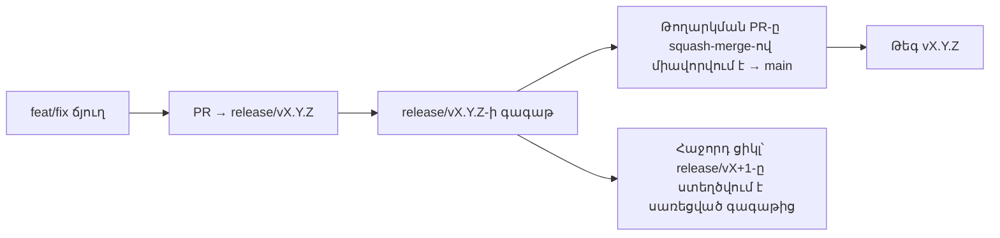

# Branching & Release Model (Հայերեն)

🌐 **Languages:** 🇺🇸 [English](../../../../ops/BRANCHING_MODEL.md) · 🇪🇹 [am](../../../am/docs/ops/BRANCHING_MODEL.md) · 🇸🇦 [ar](../../../ar/docs/ops/BRANCHING_MODEL.md) · 🇦🇿 [az](../../../az/docs/ops/BRANCHING_MODEL.md) · 🇧🇬 [bg](../../../bg/docs/ops/BRANCHING_MODEL.md) · 🇧🇩 [bn](../../../bn/docs/ops/BRANCHING_MODEL.md) · 🇧🇦 [bs](../../../bs/docs/ops/BRANCHING_MODEL.md) · 🇨🇿 [cs](../../../cs/docs/ops/BRANCHING_MODEL.md) · 🇩🇰 [da](../../../da/docs/ops/BRANCHING_MODEL.md) · 🇩🇪 [de](../../../de/docs/ops/BRANCHING_MODEL.md) · 🇬🇷 [el](../../../el/docs/ops/BRANCHING_MODEL.md) · 🇪🇸 [es](../../../es/docs/ops/BRANCHING_MODEL.md) · 🇪🇪 [et](../../../et/docs/ops/BRANCHING_MODEL.md) · 🇮🇷 [fa](../../../fa/docs/ops/BRANCHING_MODEL.md) · 🇫🇮 [fi](../../../fi/docs/ops/BRANCHING_MODEL.md) · 🇫🇷 [fr](../../../fr/docs/ops/BRANCHING_MODEL.md) · 🇮🇪 [ga](../../../ga/docs/ops/BRANCHING_MODEL.md) · 🇮🇳 [gu](../../../gu/docs/ops/BRANCHING_MODEL.md) · 🇳🇬 [ha](../../../ha/docs/ops/BRANCHING_MODEL.md) · 🇮🇱 [he](../../../he/docs/ops/BRANCHING_MODEL.md) · 🇮🇳 [hi](../../../hi/docs/ops/BRANCHING_MODEL.md) · 🇭🇷 [hr](../../../hr/docs/ops/BRANCHING_MODEL.md) · 🇭🇺 [hu](../../../hu/docs/ops/BRANCHING_MODEL.md) · 🇮🇩 [id](../../../id/docs/ops/BRANCHING_MODEL.md) · 🇳🇬 [ig](../../../ig/docs/ops/BRANCHING_MODEL.md) · 🇮🇹 [it](../../../it/docs/ops/BRANCHING_MODEL.md) · 🇯🇵 [ja](../../../ja/docs/ops/BRANCHING_MODEL.md) · 🇬🇪 [ka](../../../ka/docs/ops/BRANCHING_MODEL.md) · 🇰🇭 [km](../../../km/docs/ops/BRANCHING_MODEL.md) · 🇮🇳 [kn](../../../kn/docs/ops/BRANCHING_MODEL.md) · 🇰🇷 [ko](../../../ko/docs/ops/BRANCHING_MODEL.md) · 🇱🇹 [lt](../../../lt/docs/ops/BRANCHING_MODEL.md) · 🇱🇻 [lv](../../../lv/docs/ops/BRANCHING_MODEL.md) · 🇮🇳 [ml](../../../ml/docs/ops/BRANCHING_MODEL.md) · 🇮🇳 [mr](../../../mr/docs/ops/BRANCHING_MODEL.md) · 🇲🇾 [ms](../../../ms/docs/ops/BRANCHING_MODEL.md) · 🇲🇹 [mt](../../../mt/docs/ops/BRANCHING_MODEL.md) · 🇲🇲 [my](../../../my/docs/ops/BRANCHING_MODEL.md) · 🇳🇵 [ne](../../../ne/docs/ops/BRANCHING_MODEL.md) · 🇳🇱 [nl](../../../nl/docs/ops/BRANCHING_MODEL.md) · 🇳🇴 [no](../../../no/docs/ops/BRANCHING_MODEL.md) · 🇮🇳 [or](../../../or/docs/ops/BRANCHING_MODEL.md) · 🇮🇳 [pa](../../../pa/docs/ops/BRANCHING_MODEL.md) · 🇵🇭 [phi](../../../phi/docs/ops/BRANCHING_MODEL.md) · 🇵🇱 [pl](../../../pl/docs/ops/BRANCHING_MODEL.md) · 🇵🇹 [pt](../../../pt/docs/ops/BRANCHING_MODEL.md) · 🇧🇷 [pt-BR](../../../pt-BR/docs/ops/BRANCHING_MODEL.md) · 🇷🇴 [ro](../../../ro/docs/ops/BRANCHING_MODEL.md) · 🇷🇺 [ru](../../../ru/docs/ops/BRANCHING_MODEL.md) · 🇱🇰 [si](../../../si/docs/ops/BRANCHING_MODEL.md) · 🇸🇰 [sk](../../../sk/docs/ops/BRANCHING_MODEL.md) · 🇸🇮 [sl](../../../sl/docs/ops/BRANCHING_MODEL.md) · 🇷🇸 [sr](../../../sr/docs/ops/BRANCHING_MODEL.md) · 🇸🇪 [sv](../../../sv/docs/ops/BRANCHING_MODEL.md) · 🇰🇪 [sw](../../../sw/docs/ops/BRANCHING_MODEL.md) · 🇮🇳 [ta](../../../ta/docs/ops/BRANCHING_MODEL.md) · 🇮🇳 [te](../../../te/docs/ops/BRANCHING_MODEL.md) · 🇹🇭 [th](../../../th/docs/ops/BRANCHING_MODEL.md) · 🇹🇷 [tr](../../../tr/docs/ops/BRANCHING_MODEL.md) · 🇺🇦 [uk-UA](../../../uk-UA/docs/ops/BRANCHING_MODEL.md) · 🇵🇰 [ur](../../../ur/docs/ops/BRANCHING_MODEL.md) · 🇺🇿 [uz](../../../uz/docs/ops/BRANCHING_MODEL.md) · 🇻🇳 [vi](../../../vi/docs/ops/BRANCHING_MODEL.md) · 🇳🇬 [yo](../../../yo/docs/ops/BRANCHING_MODEL.md) · 🇨🇳 [zh-CN](../../../zh-CN/docs/ops/BRANCHING_MODEL.md) · 🇹🇼 [zh-TW](../../../zh-TW/docs/ops/BRANCHING_MODEL.md)

---

OmniRoute-ն օգտագործում է թողարկման **զուգահեռ ցիկլերի** մոդել՝ ակտիվ ցիկլի համար նախատեսված առանձին `release/vX.Y.Z`
ճյուղով, հրապարակված գծի համար նախատեսված `main`-ով և ցիկլի թողարկման պահին ստեղծվող անփոփոխ
`vX.Y.Z` թեգով։ Սպասելի է, որ commit-ները հայտնվեն թե՛ `release/*`-ում, թե՛
`main`-ում․ սա շփոթմունք չէ։

Սպասարկողների համար նախատեսված մանրամասները գտնվում են `CLAUDE.md`-ում (Խիստ կանոն #21) և
[RELEASE_CHECKLIST.md](./RELEASE_CHECKLIST.md)-ում։ Այս էջը հանրային՝
մասնակիցների համար նախատեսված ամփոփագիրն է։

## Համառոտ

| Ref              | Դեր                                                                                        |
| ---------------- | ------------------------------------------------------------------------------------------ |
| `release/vX.Y.Z` | **Ակտիվ ցիկլ** — այդ տարբերակի ամենօրյա մշակում և PR-ների միավորում                        |
| `main`           | **Հրապարակված գիծ** — թողարկման պահին ստանում է ցիկլը squash-merge-ի միջոցով               |
| `vX.Y.Z` (թեգ)   | **Թողարկման նշիչ** — թողարկման պահին ստեղծվող՝ «ինչ է թողարկվել» ցույց տվող անփոփոխ ցուցիչ |



## Ո՞ր ճյուղին պետք է ուղղված լինի իմ PR-ը

**Որպես թիրախ ընտրեք ակտիվ `release/vX.Y.Z` ճյուղը, ոչ թե `main`-ը։**

1. Գտեք ամենաբարձր տարբերակով բաց `release/v*` ճյուղը (գրելու պահին օրինակ՝
   `release/v3.8.49`)։
2. Ստեղծեք ձեր ճյուղն այդ գագաթից (`git fetch` + checkout / rebase դրա վրա)։
3. Բացեք PR-ը՝ նշելով **base = այդ `release/vX.Y.Z`**։

`main`-ը ամենօրյա ինտեգրման ճյուղը չէ։ `main`-ի դեմ բացված PR-ները
սովորաբար պետք է վերահասցեագրվեն մինչև միավորումը։

## Թողարկման սառեցում (զուգահեռ ցիկլեր)

Երբ թողարկումը համաձայնեցվում է, բացվում է `release-freeze` պիտակով նշիչ issue։
Դա **չի դադարեցնում մշակումը**․

- Սառեցված `release/vX.Y.Z`-ը տվյալ թողարկման համար պատկանում է թողարկման պատասխանատուին։
- Հաջորդ ցիկլի `release/vX+1`-ը ստեղծվում է սառեցված գագաթից, որպեսզի մասնակիցները շարունակեն
  միավորել աշխատանքը։
- Բաց PR-ները, որոնք դեռ ուղղված են սառեցված ճյուղին, պետք է **վերահասցեագրվեն**
  ակտիվ (ամենաբարձր տարբերակով) `release/v*` ճյուղին։

Նախքան ենթադրելը, որ ձեր ուզած ճյուղը հնարավոր է միավորել, ստուգեք՝ արդյոք կա բաց սառեցում․

```bash
gh issue list --repo diegosouzapw/OmniRoute --label release-freeze --state open
```

Միավորման մեխանիզմը (սեփականատիրոջ `queue` պիտակ → Mergify) փաստաթղթավորված է
[MERGE_TRAIN.md](./MERGE_TRAIN.md)-ում։

## Ինչո՞ւ են անհրաժեշտ և՛ ճյուղը, և՛ թեգը

| Արտեֆակտ         | Գոյության տևողություն | Նպատակ                                                                                       |
| ---------------- | --------------------- | -------------------------------------------------------------------------------------------- |
| `release/vX.Y.Z` | Ընթացիկ ցիկլ          | Հավաքում է վերանայված PR-ները, պահպանում է CI-ի կանաչ վիճակը և ծառայում է որպես PR-ների base |
| Թեգ `vX.Y.Z`     | Ընդմիշտ               | Նշում է npm-ում / GitHub Releases-ում թողարկված ճշգրիտ բովանդակությունը                      |

Ճյուղն արհեստանոցն է, իսկ թեգը՝ կնքված փաթեթը։ `main`-ում squash-merge-ից հետո
հաջորդ ցիկլը շարունակվում է `release/vX+1`-ում՝ չսպասելով, որ նախորդ
թողարկման PR-ն ավարտվի։

## Առնչվող փաստաթղթեր

- [CONTRIBUTING.md](../../CONTRIBUTING.md) — կարգավորում, թեստեր, PR-ի ստուգաթերթ
- [RELEASE_CHECKLIST.md](./RELEASE_CHECKLIST.md) — նախաթողարկումային վավերացում
- [MERGE_TRAIN.md](./MERGE_TRAIN.md) — միավորման հերթ և պահուստային գնացք
- [RELEASE_GREEN.md](./RELEASE_GREEN.md) — թողարկման գագաթի կանաչ վիճակի պահպանում
