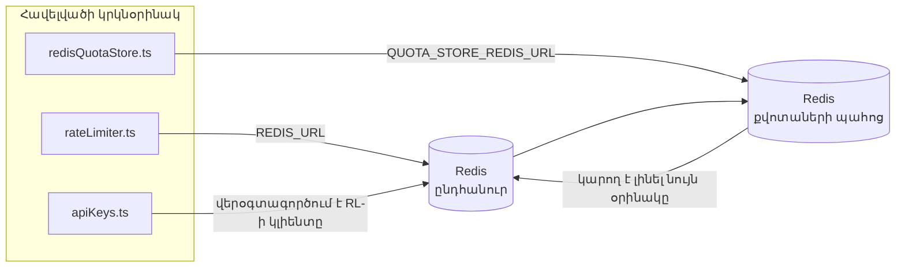

# Redis Production Configuration Guide (Հայերեն)

🌐 **Languages:** 🇺🇸 [English](../../../../ops/REDIS_PRODUCTION_CONFIG.md) · 🇪🇹 [am](../../../am/docs/ops/REDIS_PRODUCTION_CONFIG.md) · 🇸🇦 [ar](../../../ar/docs/ops/REDIS_PRODUCTION_CONFIG.md) · 🇦🇿 [az](../../../az/docs/ops/REDIS_PRODUCTION_CONFIG.md) · 🇧🇬 [bg](../../../bg/docs/ops/REDIS_PRODUCTION_CONFIG.md) · 🇧🇩 [bn](../../../bn/docs/ops/REDIS_PRODUCTION_CONFIG.md) · 🇧🇦 [bs](../../../bs/docs/ops/REDIS_PRODUCTION_CONFIG.md) · 🇨🇿 [cs](../../../cs/docs/ops/REDIS_PRODUCTION_CONFIG.md) · 🇩🇰 [da](../../../da/docs/ops/REDIS_PRODUCTION_CONFIG.md) · 🇩🇪 [de](../../../de/docs/ops/REDIS_PRODUCTION_CONFIG.md) · 🇬🇷 [el](../../../el/docs/ops/REDIS_PRODUCTION_CONFIG.md) · 🇪🇸 [es](../../../es/docs/ops/REDIS_PRODUCTION_CONFIG.md) · 🇪🇪 [et](../../../et/docs/ops/REDIS_PRODUCTION_CONFIG.md) · 🇮🇷 [fa](../../../fa/docs/ops/REDIS_PRODUCTION_CONFIG.md) · 🇫🇮 [fi](../../../fi/docs/ops/REDIS_PRODUCTION_CONFIG.md) · 🇫🇷 [fr](../../../fr/docs/ops/REDIS_PRODUCTION_CONFIG.md) · 🇮🇪 [ga](../../../ga/docs/ops/REDIS_PRODUCTION_CONFIG.md) · 🇮🇳 [gu](../../../gu/docs/ops/REDIS_PRODUCTION_CONFIG.md) · 🇳🇬 [ha](../../../ha/docs/ops/REDIS_PRODUCTION_CONFIG.md) · 🇮🇱 [he](../../../he/docs/ops/REDIS_PRODUCTION_CONFIG.md) · 🇮🇳 [hi](../../../hi/docs/ops/REDIS_PRODUCTION_CONFIG.md) · 🇭🇷 [hr](../../../hr/docs/ops/REDIS_PRODUCTION_CONFIG.md) · 🇭🇺 [hu](../../../hu/docs/ops/REDIS_PRODUCTION_CONFIG.md) · 🇮🇩 [id](../../../id/docs/ops/REDIS_PRODUCTION_CONFIG.md) · 🇳🇬 [ig](../../../ig/docs/ops/REDIS_PRODUCTION_CONFIG.md) · 🇮🇹 [it](../../../it/docs/ops/REDIS_PRODUCTION_CONFIG.md) · 🇯🇵 [ja](../../../ja/docs/ops/REDIS_PRODUCTION_CONFIG.md) · 🇬🇪 [ka](../../../ka/docs/ops/REDIS_PRODUCTION_CONFIG.md) · 🇰🇭 [km](../../../km/docs/ops/REDIS_PRODUCTION_CONFIG.md) · 🇮🇳 [kn](../../../kn/docs/ops/REDIS_PRODUCTION_CONFIG.md) · 🇰🇷 [ko](../../../ko/docs/ops/REDIS_PRODUCTION_CONFIG.md) · 🇱🇹 [lt](../../../lt/docs/ops/REDIS_PRODUCTION_CONFIG.md) · 🇱🇻 [lv](../../../lv/docs/ops/REDIS_PRODUCTION_CONFIG.md) · 🇮🇳 [ml](../../../ml/docs/ops/REDIS_PRODUCTION_CONFIG.md) · 🇮🇳 [mr](../../../mr/docs/ops/REDIS_PRODUCTION_CONFIG.md) · 🇲🇾 [ms](../../../ms/docs/ops/REDIS_PRODUCTION_CONFIG.md) · 🇲🇹 [mt](../../../mt/docs/ops/REDIS_PRODUCTION_CONFIG.md) · 🇲🇲 [my](../../../my/docs/ops/REDIS_PRODUCTION_CONFIG.md) · 🇳🇵 [ne](../../../ne/docs/ops/REDIS_PRODUCTION_CONFIG.md) · 🇳🇱 [nl](../../../nl/docs/ops/REDIS_PRODUCTION_CONFIG.md) · 🇳🇴 [no](../../../no/docs/ops/REDIS_PRODUCTION_CONFIG.md) · 🇮🇳 [or](../../../or/docs/ops/REDIS_PRODUCTION_CONFIG.md) · 🇮🇳 [pa](../../../pa/docs/ops/REDIS_PRODUCTION_CONFIG.md) · 🇵🇭 [phi](../../../phi/docs/ops/REDIS_PRODUCTION_CONFIG.md) · 🇵🇱 [pl](../../../pl/docs/ops/REDIS_PRODUCTION_CONFIG.md) · 🇵🇹 [pt](../../../pt/docs/ops/REDIS_PRODUCTION_CONFIG.md) · 🇧🇷 [pt-BR](../../../pt-BR/docs/ops/REDIS_PRODUCTION_CONFIG.md) · 🇷🇴 [ro](../../../ro/docs/ops/REDIS_PRODUCTION_CONFIG.md) · 🇷🇺 [ru](../../../ru/docs/ops/REDIS_PRODUCTION_CONFIG.md) · 🇱🇰 [si](../../../si/docs/ops/REDIS_PRODUCTION_CONFIG.md) · 🇸🇰 [sk](../../../sk/docs/ops/REDIS_PRODUCTION_CONFIG.md) · 🇸🇮 [sl](../../../sl/docs/ops/REDIS_PRODUCTION_CONFIG.md) · 🇷🇸 [sr](../../../sr/docs/ops/REDIS_PRODUCTION_CONFIG.md) · 🇸🇪 [sv](../../../sv/docs/ops/REDIS_PRODUCTION_CONFIG.md) · 🇰🇪 [sw](../../../sw/docs/ops/REDIS_PRODUCTION_CONFIG.md) · 🇮🇳 [ta](../../../ta/docs/ops/REDIS_PRODUCTION_CONFIG.md) · 🇮🇳 [te](../../../te/docs/ops/REDIS_PRODUCTION_CONFIG.md) · 🇹🇭 [th](../../../th/docs/ops/REDIS_PRODUCTION_CONFIG.md) · 🇹🇷 [tr](../../../tr/docs/ops/REDIS_PRODUCTION_CONFIG.md) · 🇺🇦 [uk-UA](../../../uk-UA/docs/ops/REDIS_PRODUCTION_CONFIG.md) · 🇵🇰 [ur](../../../ur/docs/ops/REDIS_PRODUCTION_CONFIG.md) · 🇺🇿 [uz](../../../uz/docs/ops/REDIS_PRODUCTION_CONFIG.md) · 🇻🇳 [vi](../../../vi/docs/ops/REDIS_PRODUCTION_CONFIG.md) · 🇳🇬 [yo](../../../yo/docs/ops/REDIS_PRODUCTION_CONFIG.md) · 🇨🇳 [zh-CN](../../../zh-CN/docs/ops/REDIS_PRODUCTION_CONFIG.md) · 🇹🇼 [zh-TW](../../../zh-TW/docs/ops/REDIS_PRODUCTION_CONFIG.md)

---

## Ընդհանուր ակնարկ

Redis-ը OmniRoute-ում **ըստ ցանկության օգտագործվող, ոչ պարտադիր կախվածություն** է․ երբ Redis-ն անհասանելի է, հավելվածը շարունակում է աշխատել սահմանափակված հնարավորություններով՝ օգտագործելով հիշողության վրա հիմնված պահուստային մեխանիզմներ։ Արտադրական միջավայրում Redis-ի կարգաբերումը նվազեցնում է ուշացումը չորս տարբեր աշխատանքային ծանրաբեռնվածությունների համար.

| Աշխատանքային ծանրաբեռնվածություն          | Դրայվեր                       | Հաճախորդի գործարան                                          | Բանալու ձևանմուշ                                                                             |
| ----------------------------------------- | ----------------------------- | ----------------------------------------------------------- | -------------------------------------------------------------------------------------------- |
| Հարցումների հաճախականության սահմանափակում | `rateLimiter.ts`              | `getRedisClient()` — ծույլ սկզբնավորվող `ioredis` singleton | `<prefix>rl:*` Lua-ի միջոցով ատոմային՝ հարցումների հաճախականության սահմանափակման պատուհաններ |
| Նույնականացման քեշ                        | `apiKeys.ts`                  | Վերօգտագործում է `rateLimiter`-ի հաճախորդը                  | `<prefix>auth:api_key:<sha256>`՝ TTL-ով                                                      |
| Քվոտաների պահոց                           | `redisQuotaStore.ts`          | Առանձին `getRedisClient(url)` singleton                     | `<prefix>quota:*`՝ կարգավորվող յուրաքանչյուր օրինակի համար                                   |
| Նախնական տաքացման շղթայի անջատիչ          | `redisCircuitBreakerStore.ts` | Առանձին հաճախորդ `circuitBreakerFactory.ts`-ում             | `<prefix>warmup:cb:<connectionId>`                                                           |

Բոլոր չորս աշխատանքային ծանրաբեռնվածություններն օգտագործում են անվանատարածքի մեկ ընդհանուր նախածանց, որպեսզի OmniRoute-ը կարողանա մեկ Redis օրինակում համատեղ աշխատել այլ հավելվածների հետ (օրինակ՝ `127.0.0.1:6379`)։ Տե՛ս [Բանալիների անվանատարածքը](#key-namespacing)։

---

## Ընթացիկ կազմաձևում (կոդի լռելյայն արժեքներ)

| Կարգավորում                                 | Արժեք                                                                 | Որտեղ                                                                                 |
| ------------------------------------------- | --------------------------------------------------------------------- | ------------------------------------------------------------------------------------- |
| `REDIS_URL` միջավայրի փոփոխական             | `redis://redis:6379` (compose), ըստ ցանկության                        | `rateLimiter.ts:5`, `.env.example`                                                    |
| `REDIS_KEY_PREFIX` միջավայրի փոփոխական      | `omniroute:` (լռելյայն)                                               | `rateLimiter.ts`, `redisQuotaStore.ts`, `redisCircuitBreakerStore.ts`, `.env.example` |
| `QUOTA_STORE_REDIS_URL` միջավայրի փոփոխական | առանձին է, կարող է տարբերվել `REDIS_URL`-ից                           | `quota/storeFactory.ts`                                                               |
| `QUOTA_STORE_DRIVER`                        | `"sqlite"` (լռելյայն), `"redis"`՝ ըստ ցանկության                      | `quota/storeFactory.ts`                                                               |
| ioredis-ի `maxRetriesPerRequest`            | `3`                                                                   | հաճախորդի ստեղծումը `rateLimiter.ts`-ում                                              |
| `enableReadyCheck`                          | սահմանված չէ (ioredis-ի լռելյայն արժեքը՝ `true`)                      | —                                                                                     |
| `lazyConnect`                               | սահմանված չէ (ioredis-ի լռելյայն արժեքը՝ `false`)                     | —                                                                                     |
| `retryStrategy`                             | սահմանված չէ (ioredis-ի լռելյայն արժեքը՝ 200ms բազային, էքսպոնենցիալ) | —                                                                                     |
| TLS / գաղտնաբառ / DB ինդեքս                 | **կազմաձևված չէ**                                                     | —                                                                                     |
| Sentinel / Cluster                          | **կազմաձևված չէ** — միայն ինքնուրույն մեկ հանգույց                    | —                                                                                     |

---

## Բանալիների անվանատարածքը

OmniRoute-ը Redis-ի օրինակը համատեղ օգտագործում է հոսթում աշխատող ցանկացած այլ համակարգի հետ։ Առանց անվանատարածքի՝ `auth:api_key:<sha256>` կամ `rl:*` տեսակի բանալիները կարող են բախվել նույն Redis-ն օգտագործող այլ հավելվածների բանալիների հետ (այս օրինակում Redis-ն աշխատում է `127.0.0.1:6379` հասցեում՝ այլ ծառայությունների կողքին)։

Սահմանեք `REDIS_KEY_PREFIX`-ը որպես ոչ դատարկ տող՝ OmniRoute-ի **յուրաքանչյուր** բանալուն նախածանց ավելացնելու համար.

```bash
# .env — OmniRoute-ի բոլոր բանալիները դառնում են omniroute:rl:*, omniroute:auth:*, omniroute:quota:*, omniroute:warmup:cb:*
REDIS_KEY_PREFIX=omniroute:
```

- **Լռելյայն՝** `omniroute:` (կիրառվում է, երբ `REDIS_KEY_PREFIX`-ը սահմանված չէ կամ դատարկ է)։
- **Կիրառվում է՝** հարցումների հաճախականության սահմանափակիչի + նույնականացման քեշի (ընդհանուր `ioredis` հաճախորդ՝ `keyPrefix`-ի միջոցով), քվոտաների պահոցի (`KEY_PREFIX = "${REDIS_KEY_PREFIX}quota"`) և նախնական տաքացման շղթայի անջատիչի (`KEY_PREFIX = "${REDIS_KEY_PREFIX}warmup:cb:"`) նկատմամբ։
- **Նախածանցը փոխելիս**, երբ Redis-ում արդեն բանալիներ կան, հին բանալիները դառնում են որբ (դրանց ժամկետը լրանում է TTL / LRU-ի միջոցով)։ Փոփոխությունն անվտանգ է, տեղափոխում չի պահանջվում։ Միակ բացառությունը արգելված նշված կապի նախնական տաքացման շղթայի անջատիչի բանալին է․ այն պահպանվում է առանց TTL-ի, ուստի մնացորդները ցուցակագրեք `redis-cli --scan --pattern '<old-prefix>warmup:cb:*'` հրամանով և ջնջեք դրանք։
- **ioredis-ի `keyPrefix`-ը** գրելու ժամանակ ինքնաբերաբար ավելացնում է նախածանցը, իսկ կարդալու ժամանակ՝ **հեռացնում** այն, այնպես որ հավելվածի կոդը երբեք չի տեսնում նախածանցը։

---

## Արտադրական միջավայրի համար առաջարկվող կարգավորումներ

### 1. Կապերի պուլ / հաճախորդի ընտրանքներ (ioredis-ի `Redis` կոնստրուկտոր)

Ընթացիկ կոդը ստեղծում է մեկ `new Redis(url)`՝ առանց հատուկ ընտրանքների։ Արտադրական միջավայրում բազմակի ռեպլիկաներով տեղակայումների համար կոդում փոխանցեք հաճախորդի ֆաբրիկա կամ փաթաթեք `getRedisClient()`-ը․

```typescript
const redis = new Redis(REDIS_URL, {
  maxRetriesPerRequest: null, // կրկնափորձերի սահմանափակում չկա․ թող retryStrategy-ն որոշի
  enableReadyCheck: true, // նախքան կանչերն ընդունելը ստուգել, որ սերվերը պատրաստ է
  lazyConnect: true, // չմիանալ ստեղծման պահին․ սպասել առաջին կանչին
  retryStrategy: (times) => {
    if (times > 10) return null; // 10 կրկնափորձից հետո դադարեցնել → ավելի ուշ կրկին միանալ
    return Math.min(times * 200, 5000); // 200 մվ, 400 մվ, …, առավելագույնը՝ 5 վ
  },
  enableAutoPipelining: true, // միավորել զուգահեռ հրամանները մեկ TCP գրառման մեջ
  keepAlive: 10000, // TCP կապի ակտիվության ստուգում յուրաքանչյուր 10 վ-ը մեկ
});
```

**Հիմնական փոխզիջումները․**

- `maxRetriesPerRequest: null` + `retryStrategy` — նախընտրելի է արտադրական միջավայրի համար, որպեսզի Redis-ի ժամանակավոր վերագործարկումները բոլոր հարցումներն անմիջապես չձախողեն։ `checkRateLimit()`-ի հիշողության մեջ գործող պահուստային մեխանիզմը մշակում է ձախողման ուղին։
- `lazyConnect: true` — թույլ է տալիս խուսափել գործարկման պահին Redis-ի հասանելի լինելու կախվածությունից՝ նախքան սերվերը կսկսի կապեր ընդունել։
- `enableAutoPipelining: true` — նվազեցնում է զուգահեռ արագության սահմանափակման ստուգումների հետադարձ կապի փուլերը․ օգտակար է մեկ կապի դեպքում >50 RPS բեռնվածության ժամանակ։

### 2. Redis սերվերի կազմաձևում (`redis.conf`)

```
# Հիշողություն
maxmemory 80%                        # տեղ թողնել ՕՀ-ի էջերի քեշի համար
maxmemory-policy allkeys-lru         # ծանրաբեռնվածության դեպքում հեռացնել նույնականացման քեշի հնացած գրառումները

# Պահպանում (ըստ ցանկության՝ OmniRoute-ն առանց դրա էլ ապահով է խափանումների դեպքում)
save 300 1                           # առնվազն յուրաքանչյուր 5 րոպեն մեկ ստեղծել ակնթարթային պատճեն, եթե փոխվել է ≥1 բանալի
appendonly no                        # AOF անհրաժեշտ չէ․ տվյալները վերականգնելի են
appendfsync no                       # fsync-ի լրացուցիչ ծախս չկա (RDB-ն բավարար է)

# Ցանց
timeout 0                            # պարապ կապը չանջատել
tcp-keepalive 300                    # կապի ակտիվության ստուգում՝ 5 րոպեն մեկ
tcp-backlog 511                      # կապերի հերթ՝ բեռնվածության կտրուկ աճերի համար

# Արտադրողականություն
hz 10                                # լռելյայն․ 100՝ հապաղման նկատմամբ զգայուն աշխատանքի համար
activedefrag yes                     # ավտոմատ դեֆրագմենտավորում, երբ ֆրագմենտավորումը >10% է
```

**`maxmemory-policy allkeys-lru`-ի փոխզիջումը․** Հիշողության ճնշման դեպքում նույնականացման քեշի գրառումները կարող են հեռացվել։ Սա անվտանգ է․ բացակայության դեպքում `setCachedApiKey`-ը միշտ կրկին լրացնում է դրանք, իսկ SQLite-ի պահուստային աղբյուրը հեղինակավոր է։ Արագության սահմանափակիչի Lua սկրիպտը ստեղծում է փոքր բանալիներ, որոնք նախագծով կարճատև են։

### 3. Docker Compose-ի կարգավորումներ

Արտադրական compose-ը (`docker-compose.prod.yml`) օգտագործում է `redis:8.6.2-alpine`։ Ավելացրեք․

```yaml
redis:
  image: redis:8.6.2-alpine
  command:
    [
      "redis-server",
      "--maxmemory",
      "512mb",
      "--maxmemory-policy",
      "allkeys-lru",
      "--activedefrag",
      "yes",
      "--save",
      "300 1",
    ]
  healthcheck:
    test: ["CMD", "redis-cli", "ping"]
    interval: 10s
    timeout: 3s
    retries: 3
    start_period: 5s
```

### 4. Բազմակի ինստանսների / մասշտաբավորման նկատառումներ

**Մեկ Redis՝ բոլոր ռեպլիկաների համար** — արագության սահմանափակիչի Lua սկրիպտը կախված է մեկ հեղինակավոր բանալիային տարածքից։ Ռեպլիկաների հետևում գտնվող Redis-ի բազմակի ինստանսները կկորցնեն ատոմականությունը և կկրկնապատկեն բյուջեն։ Հավելվածի բոլոր ռեպլիկաների համար օգտագործեք մեկ Redis (կամ խափանման դեպքում ավտոմատ անցումով Redis Sentinel կլաստեր)։

**Կապերի քանակը․** Հավելվածի յուրաքանչյուր ռեպլիկա Redis-ի հետ բացում է **2 TCP կապ** (արագության սահմանափակիչի հաճախորդ + քվոտաների պահոցի հաճախորդ)։ 10 ռեպլիկայի դեպքում → 20 կապ, ինչը շատ ավելի քիչ է Redis-ի լռելյայն ինստանսի՝ 10 հազար կապի առավելագույն սահմանից։

### 5. Մոնիթորինգ

Տրամադրեք առողջական վիճակի ստուգման վերջնակետի միջոցով․

```typescript
// src/app/api/monitoring/health/route.ts-ն արդեն կանչում է rateLimiter-ի գործառույթները
// Ավելացրեք Redis-ին հատուկ ստուգումներ․
//   1. PING-ի հապաղումը՝ ioredis-ի .ping()-ի միջոցով
//   2. Հիշողության օգտագործումը՝ INFO memory-ի միջոցով
//   3. Կապերի քանակը՝ INFO clients-ի միջոցով
//   4. maxmemory-policy-ի համապատասխանությունների գործակիցը (evicted_keys / keyspace_hits)
```

Հետևելու հիմնական չափորոշիչները․

- **Հեռացված բանալիներ / վրկ** — եթե ցուցանիշը մշտապես զրոյից մեծ է, ավելացրեք `maxmemory`-ն
- **Արգելափակված հաճախորդներ** — զրոյից մեծ արժեքը հուշում է դանդաղ Lua սկրիպտների կամ բարձր մրցակցության մասին
- **Մերժված կապեր** — կապերի սահմանաչափը սպառվել է․ 20 կապի դեպքում հազվադեպ է հանդիպում

---

## Ճարտարապետության դիագրամ



---

## Հղումներ

| Ֆայլ                               | Նպատակ                                                                                                         |
| ---------------------------------- | -------------------------------------------------------------------------------------------------------------- |
| `src/shared/utils/rateLimiter.ts`  | Հիմնական Redis կլիենտ, հարցումների հաճախականության սահմանափակման Lua սկրիպտ, ներհիշողային պահուստային տարբերակ |
| `src/lib/db/apiKeys.ts`            | Նույնականացման քեշ — Redis→SQLite պահուստային անցում                                                           |
| `src/lib/quota/redisQuotaStore.ts` | Առանձին Redis կլիենտ՝ քվոտաների ընտրովի պահոցի համար                                                           |
| `src/lib/quota/storeFactory.ts`    | Փոխարկում է `sqlite` և `redis` քվոտաների դրայվերների միջև                                                      |
| `docker-compose.prod.yml`          | Արտադրական միջավայրի Redis կոնտեյներ (`redis:8.6.2-alpine` պատկեր)                                             |
| `.env.example`                     | Redis միջավայրի փոփոխականների փաստաթղթեր                                                                       |
| `src/app/api/local/redis/`         | API երթուղիներ՝ մշակման միջավայրի կոնտեյների կառավարման համար                                                  |
| `bin/cli/commands/redis.mjs`       | CLI հրամաններ՝ մշակման միջավայրի կոնտեյների կառավարման համար                                                   |
