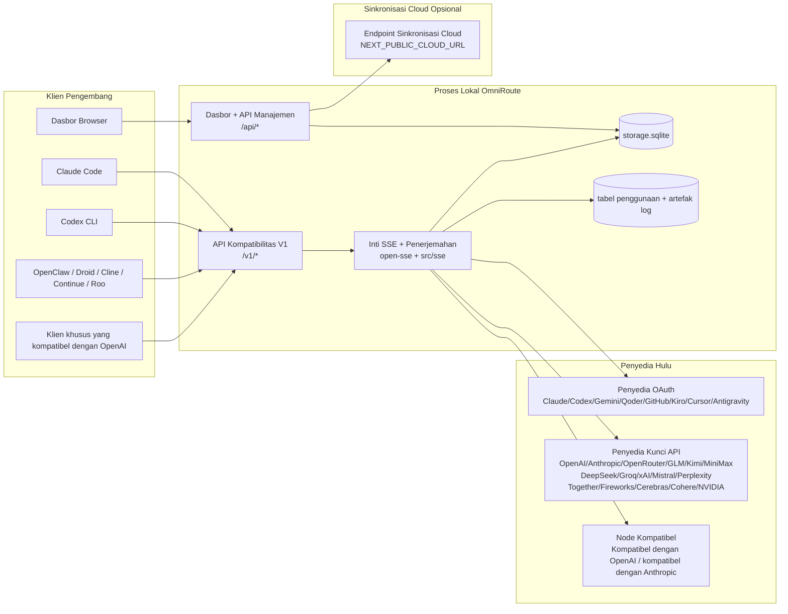
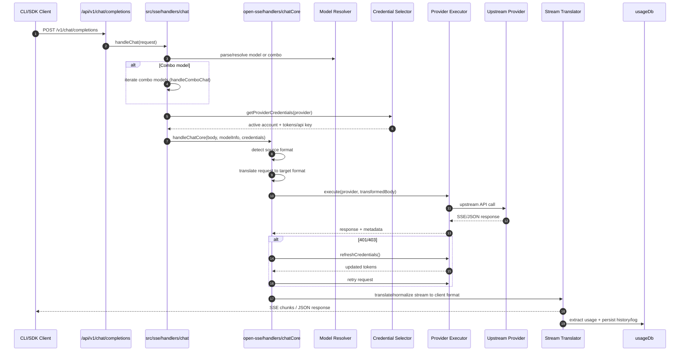
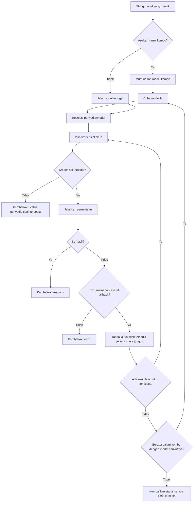
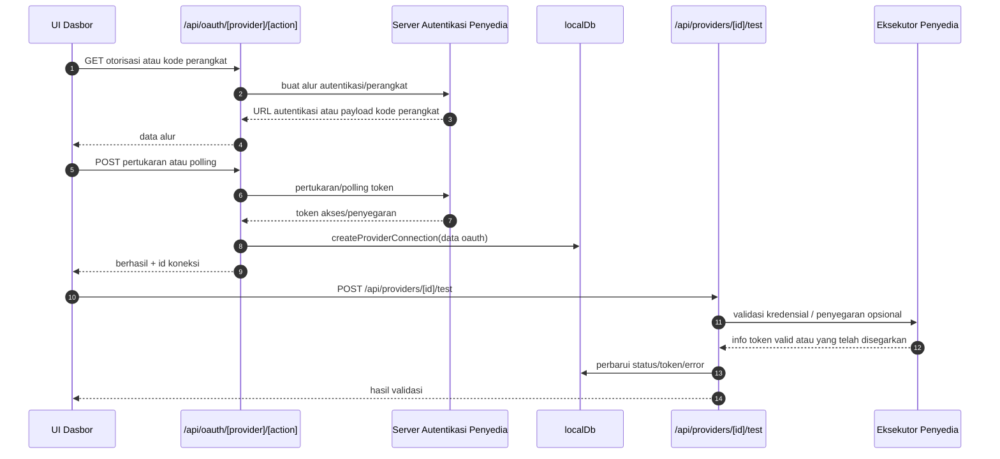
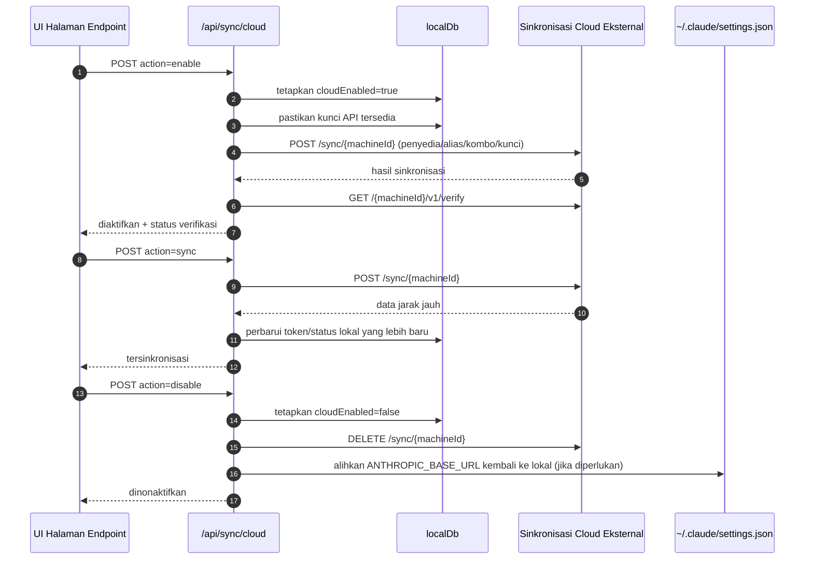
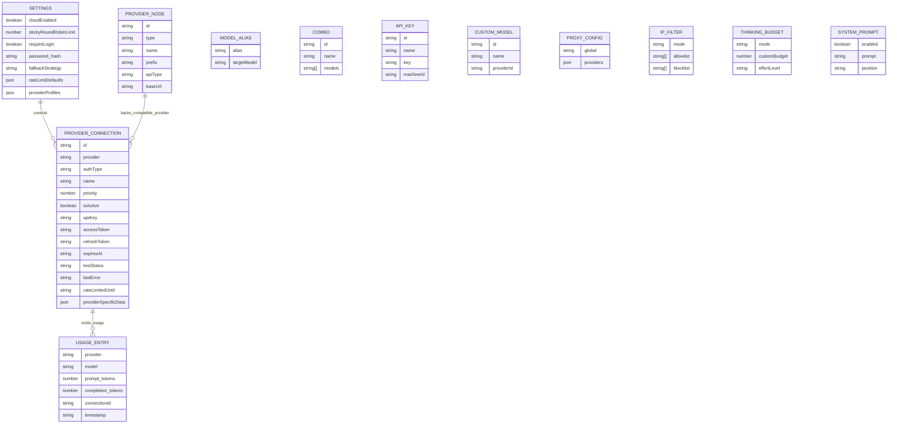
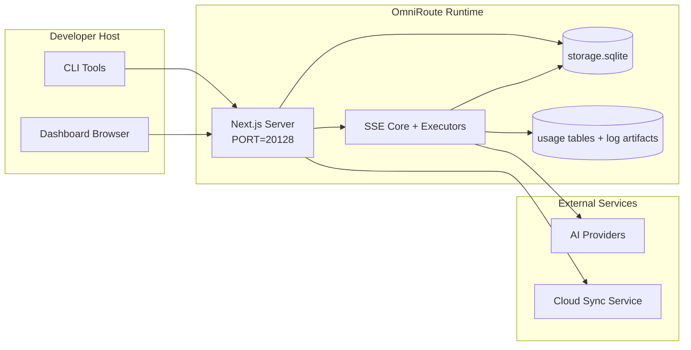

# OmniRoute Architecture (Bahasa Indonesia)

🌐 **Languages:** 🇺🇸 [English](../../../../architecture/ARCHITECTURE.md) · 🇪🇹 [am](../../../am/docs/architecture/ARCHITECTURE.md) · 🇸🇦 [ar](../../../ar/docs/architecture/ARCHITECTURE.md) · 🇦🇿 [az](../../../az/docs/architecture/ARCHITECTURE.md) · 🇧🇬 [bg](../../../bg/docs/architecture/ARCHITECTURE.md) · 🇧🇩 [bn](../../../bn/docs/architecture/ARCHITECTURE.md) · 🇧🇦 [bs](../../../bs/docs/architecture/ARCHITECTURE.md) · 🇨🇿 [cs](../../../cs/docs/architecture/ARCHITECTURE.md) · 🇩🇰 [da](../../../da/docs/architecture/ARCHITECTURE.md) · 🇩🇪 [de](../../../de/docs/architecture/ARCHITECTURE.md) · 🇬🇷 [el](../../../el/docs/architecture/ARCHITECTURE.md) · 🇪🇸 [es](../../../es/docs/architecture/ARCHITECTURE.md) · 🇪🇪 [et](../../../et/docs/architecture/ARCHITECTURE.md) · 🇮🇷 [fa](../../../fa/docs/architecture/ARCHITECTURE.md) · 🇫🇮 [fi](../../../fi/docs/architecture/ARCHITECTURE.md) · 🇫🇷 [fr](../../../fr/docs/architecture/ARCHITECTURE.md) · 🇮🇪 [ga](../../../ga/docs/architecture/ARCHITECTURE.md) · 🇮🇳 [gu](../../../gu/docs/architecture/ARCHITECTURE.md) · 🇳🇬 [ha](../../../ha/docs/architecture/ARCHITECTURE.md) · 🇮🇱 [he](../../../he/docs/architecture/ARCHITECTURE.md) · 🇮🇳 [hi](../../../hi/docs/architecture/ARCHITECTURE.md) · 🇭🇷 [hr](../../../hr/docs/architecture/ARCHITECTURE.md) · 🇭🇺 [hu](../../../hu/docs/architecture/ARCHITECTURE.md) · 🇦🇲 [hy](../../../hy/docs/architecture/ARCHITECTURE.md) · 🇳🇬 [ig](../../../ig/docs/architecture/ARCHITECTURE.md) · 🇮🇹 [it](../../../it/docs/architecture/ARCHITECTURE.md) · 🇯🇵 [ja](../../../ja/docs/architecture/ARCHITECTURE.md) · 🇬🇪 [ka](../../../ka/docs/architecture/ARCHITECTURE.md) · 🇰🇭 [km](../../../km/docs/architecture/ARCHITECTURE.md) · 🇮🇳 [kn](../../../kn/docs/architecture/ARCHITECTURE.md) · 🇰🇷 [ko](../../../ko/docs/architecture/ARCHITECTURE.md) · 🇱🇹 [lt](../../../lt/docs/architecture/ARCHITECTURE.md) · 🇱🇻 [lv](../../../lv/docs/architecture/ARCHITECTURE.md) · 🇮🇳 [ml](../../../ml/docs/architecture/ARCHITECTURE.md) · 🇮🇳 [mr](../../../mr/docs/architecture/ARCHITECTURE.md) · 🇲🇾 [ms](../../../ms/docs/architecture/ARCHITECTURE.md) · 🇲🇹 [mt](../../../mt/docs/architecture/ARCHITECTURE.md) · 🇲🇲 [my](../../../my/docs/architecture/ARCHITECTURE.md) · 🇳🇵 [ne](../../../ne/docs/architecture/ARCHITECTURE.md) · 🇳🇱 [nl](../../../nl/docs/architecture/ARCHITECTURE.md) · 🇳🇴 [no](../../../no/docs/architecture/ARCHITECTURE.md) · 🇮🇳 [or](../../../or/docs/architecture/ARCHITECTURE.md) · 🇮🇳 [pa](../../../pa/docs/architecture/ARCHITECTURE.md) · 🇵🇭 [phi](../../../phi/docs/architecture/ARCHITECTURE.md) · 🇵🇱 [pl](../../../pl/docs/architecture/ARCHITECTURE.md) · 🇵🇹 [pt](../../../pt/docs/architecture/ARCHITECTURE.md) · 🇧🇷 [pt-BR](../../../pt-BR/docs/architecture/ARCHITECTURE.md) · 🇷🇴 [ro](../../../ro/docs/architecture/ARCHITECTURE.md) · 🇷🇺 [ru](../../../ru/docs/architecture/ARCHITECTURE.md) · 🇱🇰 [si](../../../si/docs/architecture/ARCHITECTURE.md) · 🇸🇰 [sk](../../../sk/docs/architecture/ARCHITECTURE.md) · 🇸🇮 [sl](../../../sl/docs/architecture/ARCHITECTURE.md) · 🇷🇸 [sr](../../../sr/docs/architecture/ARCHITECTURE.md) · 🇸🇪 [sv](../../../sv/docs/architecture/ARCHITECTURE.md) · 🇰🇪 [sw](../../../sw/docs/architecture/ARCHITECTURE.md) · 🇮🇳 [ta](../../../ta/docs/architecture/ARCHITECTURE.md) · 🇮🇳 [te](../../../te/docs/architecture/ARCHITECTURE.md) · 🇹🇭 [th](../../../th/docs/architecture/ARCHITECTURE.md) · 🇹🇷 [tr](../../../tr/docs/architecture/ARCHITECTURE.md) · 🇺🇦 [uk-UA](../../../uk-UA/docs/architecture/ARCHITECTURE.md) · 🇵🇰 [ur](../../../ur/docs/architecture/ARCHITECTURE.md) · 🇺🇿 [uz](../../../uz/docs/architecture/ARCHITECTURE.md) · 🇻🇳 [vi](../../../vi/docs/architecture/ARCHITECTURE.md) · 🇳🇬 [yo](../../../yo/docs/architecture/ARCHITECTURE.md) · 🇨🇳 [zh-CN](../../../zh-CN/docs/architecture/ARCHITECTURE.md) · 🇹🇼 [zh-TW](../../../zh-TW/docs/architecture/ARCHITECTURE.md)

---

🌐 **Languages:** 🇺🇸 [English](../../../../architecture/ARCHITECTURE.md) · 🇪🇹 [am](../../../am/docs/architecture/ARCHITECTURE.md) · 🇸🇦 [ar](../../../ar/docs/architecture/ARCHITECTURE.md) · 🇦🇿 [az](../../../az/docs/architecture/ARCHITECTURE.md) · 🇧🇬 [bg](../../../bg/docs/architecture/ARCHITECTURE.md) · 🇧🇩 [bn](../../../bn/docs/architecture/ARCHITECTURE.md) · 🇧🇦 [bs](../../../bs/docs/architecture/ARCHITECTURE.md) · 🇨🇿 [cs](../../../cs/docs/architecture/ARCHITECTURE.md) · 🇩🇰 [da](../../../da/docs/architecture/ARCHITECTURE.md) · 🇩🇪 [de](../../../de/docs/architecture/ARCHITECTURE.md) · 🇬🇷 [el](../../../el/docs/architecture/ARCHITECTURE.md) · 🇪🇸 [es](../../../es/docs/architecture/ARCHITECTURE.md) · 🇪🇪 [et](../../../et/docs/architecture/ARCHITECTURE.md) · 🇮🇷 [fa](../../../fa/docs/architecture/ARCHITECTURE.md) · 🇫🇮 [fi](../../../fi/docs/architecture/ARCHITECTURE.md) · 🇫🇷 [fr](../../../fr/docs/architecture/ARCHITECTURE.md) · 🇮🇪 [ga](../../../ga/docs/architecture/ARCHITECTURE.md) · 🇮🇳 [gu](../../../gu/docs/architecture/ARCHITECTURE.md) · 🇳🇬 [ha](../../../ha/docs/architecture/ARCHITECTURE.md) · 🇮🇱 [he](../../../he/docs/architecture/ARCHITECTURE.md) · 🇮🇳 [hi](../../../hi/docs/architecture/ARCHITECTURE.md) · 🇭🇷 [hr](../../../hr/docs/architecture/ARCHITECTURE.md) · 🇭🇺 [hu](../../../hu/docs/architecture/ARCHITECTURE.md) · 🇦🇲 [hy](../../../hy/docs/architecture/ARCHITECTURE.md) · 🇳🇬 [ig](../../../ig/docs/architecture/ARCHITECTURE.md) · 🇮🇹 [it](../../../it/docs/architecture/ARCHITECTURE.md) · 🇯🇵 [ja](../../../ja/docs/architecture/ARCHITECTURE.md) · 🇬🇪 [ka](../../../ka/docs/architecture/ARCHITECTURE.md) · 🇰🇭 [km](../../../km/docs/architecture/ARCHITECTURE.md) · 🇮🇳 [kn](../../../kn/docs/architecture/ARCHITECTURE.md) · 🇰🇷 [ko](../../../ko/docs/architecture/ARCHITECTURE.md) · 🇱🇹 [lt](../../../lt/docs/architecture/ARCHITECTURE.md) · 🇱🇻 [lv](../../../lv/docs/architecture/ARCHITECTURE.md) · 🇮🇳 [ml](../../../ml/docs/architecture/ARCHITECTURE.md) · 🇮🇳 [mr](../../../mr/docs/architecture/ARCHITECTURE.md) · 🇲🇾 [ms](../../../ms/docs/architecture/ARCHITECTURE.md) · 🇲🇹 [mt](../../../mt/docs/architecture/ARCHITECTURE.md) · 🇲🇲 [my](../../../my/docs/architecture/ARCHITECTURE.md) · 🇳🇵 [ne](../../../ne/docs/architecture/ARCHITECTURE.md) · 🇳🇱 [nl](../../../nl/docs/architecture/ARCHITECTURE.md) · 🇳🇴 [no](../../../no/docs/architecture/ARCHITECTURE.md) · 🇮🇳 [or](../../../or/docs/architecture/ARCHITECTURE.md) · 🇮🇳 [pa](../../../pa/docs/architecture/ARCHITECTURE.md) · 🇵🇭 [phi](../../../phi/docs/architecture/ARCHITECTURE.md) · 🇵🇱 [pl](../../../pl/docs/architecture/ARCHITECTURE.md) · 🇵🇹 [pt](../../../pt/docs/architecture/ARCHITECTURE.md) · 🇧🇷 [pt-BR](../../../pt-BR/docs/architecture/ARCHITECTURE.md) · 🇷🇴 [ro](../../../ro/docs/architecture/ARCHITECTURE.md) · 🇷🇺 [ru](../../../ru/docs/architecture/ARCHITECTURE.md) · 🇱🇰 [si](../../../si/docs/architecture/ARCHITECTURE.md) · 🇸🇰 [sk](../../../sk/docs/architecture/ARCHITECTURE.md) · 🇸🇮 [sl](../../../sl/docs/architecture/ARCHITECTURE.md) · 🇷🇸 [sr](../../../sr/docs/architecture/ARCHITECTURE.md) · 🇸🇪 [sv](../../../sv/docs/architecture/ARCHITECTURE.md) · 🇰🇪 [sw](../../../sw/docs/architecture/ARCHITECTURE.md) · 🇮🇳 [ta](../../../ta/docs/architecture/ARCHITECTURE.md) · 🇮🇳 [te](../../../te/docs/architecture/ARCHITECTURE.md) · 🇹🇭 [th](../../../th/docs/architecture/ARCHITECTURE.md) · 🇹🇷 [tr](../../../tr/docs/architecture/ARCHITECTURE.md) · 🇺🇦 [uk-UA](../../../uk-UA/docs/architecture/ARCHITECTURE.md) · 🇵🇰 [ur](../../../ur/docs/architecture/ARCHITECTURE.md) · 🇺🇿 [uz](../../../uz/docs/architecture/ARCHITECTURE.md) · 🇻🇳 [vi](../../../vi/docs/architecture/ARCHITECTURE.md) · 🇳🇬 [yo](../../../yo/docs/architecture/ARCHITECTURE.md) · 🇨🇳 [zh-CN](../../../zh-CN/docs/architecture/ARCHITECTURE.md) · 🇹🇼 [zh-TW](../../../zh-TW/docs/architecture/ARCHITECTURE.md)

_Terakhir diperbarui: 2026-06-28_

## Ringkasan Eksekutif

OmniRoute adalah gateway perutean AI lokal dan dasbor yang dibangun di atas Next.js.
OmniRoute menyediakan satu endpoint yang kompatibel dengan OpenAI (`/v1/*`) dan merutekan lalu lintas ke beberapa penyedia upstream dengan penerjemahan, fallback, penyegaran token, dan pelacakan penggunaan.

Kemampuan utama:

- Permukaan API yang kompatibel dengan OpenAI untuk CLI/alat (355 penyedia, 108 eksekutor)
- Penerjemahan permintaan/respons antarformat penyedia
- Fallback kombo model (urutan multi-model)
- Langkah kombo terstruktur (`provider + model + connection`) dengan pengurutan runtime berdasarkan `compositeTiers`
- Fallback tingkat akun (multi-akun per penyedia)
- Prapemeriksaan kuota dan pemilihan akun P2C berbasis kuota di jalur chat utama
- Pengelolaan koneksi penyedia OAuth + kunci API (22 modul penyedia OAuth)
- Pembuatan embedding melalui `/v1/embeddings` (18 penyedia)
- Pembuatan gambar melalui `/v1/images/generations` (10+ penyedia, 20+ model)
- Transkripsi audio melalui `/v1/audio/transcriptions` (18 penyedia)
- Teks-ke-ucapan melalui `/v1/audio/speech` (24 penyedia bawaan)
- Pembuatan video melalui `/v1/videos/generations` (ComfyUI + SD WebUI)
- Pembuatan musik melalui `/v1/music/generations` (ComfyUI)
- Pencarian web melalui `/v1/search` (20 penyedia)
- Moderasi melalui `/v1/moderations`
- Pemeringkatan ulang melalui `/v1/rerank`
- Penguraian tag pemikiran (`<think>...</think>`) untuk model penalaran
- Sanitasi respons untuk kompatibilitas ketat dengan SDK OpenAI
- Normalisasi peran (developer→system, system→user) untuk kompatibilitas lintas penyedia
- Konversi keluaran terstruktur (json_schema → Gemini responseSchema)
- Persistensi lokal untuk penyedia, kunci, alias, kombo, pengaturan, dan harga (122 modul DB)
- Pelacakan penggunaan/biaya dan pencatatan permintaan
- Sinkronisasi cloud opsional untuk sinkronisasi multi-perangkat/status
- Daftar izin/daftar blokir IP untuk kontrol akses API
- Pengelolaan anggaran pemikiran (passthrough/otomatis/kustom/adaptif)
- Injeksi prompt sistem global
- Pelacakan dan fingerprinting sesi
- Pembatasan laju tingkat lanjut per akun dengan profil khusus penyedia
- Pola pemutus sirkuit untuk ketahanan penyedia
- Perlindungan anti-thundering herd dengan penguncian mutex
- Cache deduplikasi permintaan berbasis tanda tangan
- Lapisan domain: aturan biaya, kebijakan fallback, kebijakan penguncian
- Context Relay: ringkasan serah terima sesi untuk menjaga kesinambungan saat rotasi akun
- Persistensi status domain (cache write-through SQLite untuk fallback, anggaran, penguncian, dan pemutus sirkuit)
- Mesin kebijakan untuk evaluasi permintaan terpusat (penguncian → anggaran → fallback)
- Telemetri permintaan dengan agregasi latensi p50/p95/p99
- Telemetri target kombo dan riwayat kesehatan target kombo melalui `combo_execution_key` / `combo_step_id`
- ID korelasi (X-Request-Id) untuk penelusuran ujung ke ujung
- Pencatatan audit kepatuhan dengan opsi penolakan per kunci API
- Kerangka kerja evaluasi untuk jaminan kualitas LLM
- Dasbor kesehatan dengan status pemutus sirkuit penyedia secara real-time
- Server MCP (110 alat) dengan 3 transportasi (stdio/SSE/Streamable HTTP)
- Server A2A (JSON-RPC 2.0 + SSE) dengan keterampilan dan siklus hidup tugas
- Sistem memori (ekstraksi, injeksi, pengambilan, peringkasan)
- Sistem keterampilan (registri, eksekutor, sandbox, keterampilan bawaan)
- Proksi MITM dengan pengelolaan sertifikat dan penanganan DNS
- Middleware pelindung dari injeksi prompt
- Pipeline kompresi prompt dengan Caveman, RTK, pipeline bertumpuk, kombo kompresi, paket bahasa, dan analitik
- Registri ACP (Agent Communication Protocol)
- Penyedia OAuth modular (22 modul individual di bawah `src/lib/oauth/providers/`)
- Skrip penghapusan instalasi/penghapusan instalasi penuh
- Tindakan perbaikan lingkungan OAuth
- Jembatan WebSocket untuk klien WS yang kompatibel dengan OpenAI (`/v1/ws`)
- Pengelolaan token sinkronisasi (penerbitan/pencabutan, pengunduhan bundel konfigurasi berversi ETag)
- GLM Thinking (`glmt`) sebagai preset penyedia kelas utama
- Penghitungan token hibrida (`/messages/count_tokens` di sisi penyedia dengan fallback estimasi)
- Penyemaian otomatis alias model (30+ normalisasi dialek lintas proksi saat startup)
- Fetch keluar yang aman dengan pelindung SSRF, pemblokiran URL privat, dan percobaan ulang yang dapat dikonfigurasi
- Percobaan ulang chat yang memperhitungkan cooldown dengan `requestRetry` dan `maxRetryIntervalSec` yang dapat dikonfigurasi
- Validasi lingkungan runtime dengan Zod saat startup
- Audit kepatuhan v2 dengan paginasi, peristiwa CRUD penyedia, dan pencatatan validasi yang diblokir SSRF

Model runtime utama:

- Rute aplikasi Next.js di bawah `src/app/api/*` mengimplementasikan API dasbor dan API kompatibilitas
- Inti SSE/perutean bersama di `src/sse/*` + `open-sse/*` menangani eksekusi penyedia, penerjemahan, streaming, fallback, dan penggunaan

## Diagram Referensi

Sumber Mermaid kanonis yang dikontrol versi untuk platform v3.8.0 berada di
[`docs/diagrams/`](../diagrams/README.md). Dua di antaranya ditampilkan kembali di bawah ini sebagai orientasi;
sisanya ditautkan dari panduan khusus domain masing-masing.


> Sumber: [diagrams/request-pipeline.mmd](../diagrams/request-pipeline.mmd)


> Sumber: [diagrams/resilience-3layers.mmd](../diagrams/resilience-3layers.mmd) — juga ditautkan dari
> [RESILIENCE_GUIDE.md](./RESILIENCE_GUIDE.md) dan referensi ketahanan `CLAUDE.md`.

## Cakupan dan Batasan

### Termasuk dalam Cakupan

- Runtime gateway lokal
- API pengelolaan dasbor
- Autentikasi penyedia dan penyegaran token
- Penerjemahan permintaan dan streaming SSE
- Persistensi status lokal + penggunaan
- Orkestrasi sinkronisasi cloud opsional

### Di Luar Cakupan

- Implementasi layanan cloud di balik `NEXT_PUBLIC_CLOUD_URL`
- SLA/control plane penyedia di luar proses lokal
- Biner CLI eksternal itu sendiri (Claude CLI, Codex CLI, dll.)

## Permukaan Dasbor (Saat Ini)

Halaman utama di bawah `src/app/(dashboard)/dashboard/`:

- `/dashboard` — mulai cepat + ikhtisar penyedia
- `/dashboard/endpoint` — proksi endpoint + tab MCP + A2A + endpoint API
- `/dashboard/providers` — koneksi dan kredensial penyedia
- `/dashboard/combos` — strategi combo, templat, builder berbasis langkah, aturan perutean model, pengurutan manual yang dipersistenkan
- `/dashboard/auto-combo` — Auto Combo Engine: bobot penilaian, paket mode, preset pabrik virtual, telemetri
- `/dashboard/costs` — agregasi biaya dan visibilitas harga
- `/dashboard/analytics` — analitik penggunaan, evaluasi, kesehatan target combo
- `/dashboard/limits` — kontrol kuota/laju
- `/dashboard/cli-tools` — onboarding CLI, deteksi runtime, pembuatan konfigurasi
- `/dashboard/agents` — agen ACP yang terdeteksi + pendaftaran agen khusus
- `/dashboard/cloud-agents` — tugas agen yang di-host di cloud (Codex Cloud, Devin, Jules) dan siklus hidup tugas
- `/dashboard/skills` — registri skill A2A, eksekusi sandbox, katalog skill bawaan
- `/dashboard/memory` — pemeriksaan dan pengambilan memori percakapan persisten
- `/dashboard/webhooks` — langganan webhook keluar, rotasi secret, statistik percobaan ulang
- `/dashboard/batch` — pengiriman pekerjaan batch dan progres
- `/dashboard/cache` — statistik cache read-through dan penalaran, kontrol eviksi
- `/dashboard/playground` — playground chat interaktif terhadap combo/model apa pun yang dikonfigurasi
- `/dashboard/changelog` — penampil changelog dalam aplikasi (merender `CHANGELOG.md`)
- `/dashboard/system` — diagnostik runtime, info versi, permukaan validasi lingkungan
- `/dashboard/onboarding` — wizard penyiapan penggunaan pertama untuk instalasi baru
- `/dashboard/media` — playground gambar/video/musik
- `/dashboard/search-tools` — pengujian dan riwayat penyedia pencarian
- `/dashboard/health` — waktu aktif, circuit breaker, batas laju, sesi yang dipantau kuotanya
- `/dashboard/logs` — log permintaan/proksi/audit/konsol
- `/dashboard/settings` — tab pengaturan sistem (umum, perutean, default combo, dll.)
- `/dashboard/context/caveman` — aturan kompresi Caveman, paket bahasa, pratinjau, dan mode keluaran
- `/dashboard/context/rtk` — filter keluaran perintah RTK, pratinjau, dan pengaturan keamanan runtime
- `/dashboard/context/combos` — pipeline kompresi bernama yang ditetapkan ke combo perutean
- `/dashboard/translator` — pemeriksaan penerjemah dan pratinjau konversi format permintaan
- `/dashboard/audit` — penjelajah log audit kepatuhan dengan paginasi dan metadata terstruktur
- `/dashboard/usage` — penjelajah penggunaan per permintaan yang terkait dengan `usage_history`
- `/dashboard/compression` — analitik kompresi, statistik, dan penetapan pipeline
- `/dashboard/api-manager` — siklus hidup kunci API dan izin model

## Konteks Sistem Tingkat Tinggi



## Komponen Runtime Inti

## 1) Lapisan API dan Perutean (Rute Aplikasi Next.js)

Direktori utama:

- `src/app/api/v1/*` dan `src/app/api/v1beta/*` untuk API kompatibilitas
- `src/app/api/*` untuk API manajemen/konfigurasi
- Penulisan ulang Next di `next.config.mjs` memetakan `/v1/*` ke `/api/v1/*`

Rute kompatibilitas penting:

- `src/app/api/v1/chat/completions/route.ts`
- `src/app/api/v1/messages/route.ts`
- `src/app/api/v1/responses/route.ts`
- `src/app/api/v1/models/route.ts` — mencakup model khusus dengan `custom: true`
- `src/app/api/v1/embeddings/route.ts` — pembuatan embedding (6 penyedia)
- `src/app/api/v1/images/generations/route.ts` — pembuatan gambar (4+ penyedia termasuk Antigravity/Nebius)
- `src/app/api/v1/messages/count_tokens/route.ts`
- `src/app/api/v1/providers/[provider]/chat/completions/route.ts` — percakapan khusus per penyedia
- `src/app/api/v1/providers/[provider]/embeddings/route.ts` — embedding khusus per penyedia
- `src/app/api/v1/providers/[provider]/images/generations/route.ts` — gambar khusus per penyedia
- `src/app/api/v1beta/models/route.ts`
- `src/app/api/v1beta/models/[...path]/route.ts`

Domain manajemen:

- Autentikasi/pengaturan: `src/app/api/auth/*`, `src/app/api/settings/*`
- Penyedia/koneksi: `src/app/api/providers*`
- Node penyedia: `src/app/api/provider-nodes*`
- Model khusus: `src/app/api/provider-models` (GET/POST/DELETE)
- Katalog model: `src/app/api/models/route.ts` (GET)
- Konfigurasi proksi: `src/app/api/settings/proxy` (GET/PUT/DELETE) + `src/app/api/settings/proxy/test` (POST)
- OAuth: `src/app/api/oauth/*`
- Kunci/alias/kombinasi/harga: `src/app/api/keys*`, `src/app/api/models/alias`, `src/app/api/combos*`, `src/app/api/pricing`
- Penggunaan: `src/app/api/usage/*`
- Sinkronisasi/cloud: `src/app/api/sync/*`, `src/app/api/cloud/*`
- Pembantu perkakas CLI: `src/app/api/cli-tools/*`
- Filter IP: `src/app/api/settings/ip-filter` (GET/PUT)
- Anggaran pemikiran: `src/app/api/settings/thinking-budget` (GET/PUT)
- Prompt sistem: `src/app/api/settings/system-prompt` (GET/PUT)
- Kompresi: `src/app/api/settings/compression`, `src/app/api/compression/*`, dan
  `src/app/api/context/*`
- Sesi: `src/app/api/sessions` (GET)
- Batas laju: `src/app/api/rate-limits` (GET)
- Ketahanan: `src/app/api/resilience` (GET/PATCH) — antrean permintaan, masa tunggu koneksi, pemutus penyedia, konfigurasi tunggu hingga masa tunggu berakhir
- Pengaturan ulang ketahanan: `src/app/api/resilience/reset` (POST) — mengatur ulang pemutus penyedia
- Statistik cache: `src/app/api/cache/stats` (GET/DELETE)
- Telemetri: `src/app/api/telemetry/summary` (GET)
- Anggaran: `src/app/api/usage/budget` (GET/POST)
- Rantai fallback: `src/app/api/fallback/chains` (GET/POST/DELETE)
- Audit kepatuhan: `src/app/api/compliance/audit-log` (GET, dengan paginasi + metadata terstruktur)
- Evaluasi: `src/app/api/evals` (GET/POST), `src/app/api/evals/[suiteId]` (GET)
- Kebijakan: `src/app/api/policies` (GET/POST)
- Token sinkronisasi: `src/app/api/sync/tokens` (GET/POST), `src/app/api/sync/tokens/[id]` (GET/DELETE)
- Bundel konfigurasi: `src/app/api/sync/bundle` (GET, snapshot pengaturan/penyedia/kombinasi/kunci yang diberi versi dengan ETag)
- WebSocket: `src/app/api/v1/ws/route.ts` — handler Upgrade untuk klien WS yang kompatibel dengan OpenAI

## 2) SSE + Inti Translasi

Modul alur utama:

- Titik masuk: `src/sse/handlers/chat.ts`
- Orkestrasi inti: `open-sse/handlers/chatCore.ts`
- Adaptor eksekusi penyedia: `open-sse/executors/*`
- Deteksi format/konfigurasi penyedia: `open-sse/services/provider.ts`
- Penguraian/resolusi model: `src/sse/services/model.ts`, `open-sse/services/model.ts`
- Logika fallback akun: `open-sse/services/accountFallback.ts`
- Registri translasi: `open-sse/translator/index.ts`
- Transformasi stream: `open-sse/utils/stream.ts`, `open-sse/utils/streamHandler.ts`
- Ekstraksi/normalisasi penggunaan: `open-sse/utils/usageTracking.ts`
- Pengurai tag think: `open-sse/utils/thinkTagParser.ts`
- Penangan embedding: `open-sse/handlers/embeddings.ts`
- Registri penyedia embedding: `open-sse/config/embeddingRegistry.ts`
- Penangan pembuatan gambar: `open-sse/handlers/imageGeneration.ts`
- Registri penyedia gambar: `open-sse/config/imageRegistry.ts`
- Sanitasi respons: `open-sse/handlers/responseSanitizer.ts`
- Normalisasi peran: `open-sse/services/roleNormalizer.ts`

Layanan (logika bisnis):

- Pemilihan/penilaian akun: `open-sse/services/accountSelector.ts`
- Pengelolaan siklus hidup konteks: `open-sse/services/contextManager.ts`
- Penerapan filter IP: `open-sse/services/ipFilter.ts`
- Pelacakan sesi: `open-sse/services/sessionManager.ts`
- Deduplikasi permintaan: `open-sse/services/signatureCache.ts`
- Injeksi prompt sistem: `open-sse/services/systemPrompt.ts`
- Pengelolaan anggaran pemikiran: `open-sse/services/thinkingBudget.ts`
- Perutean model wildcard: `open-sse/services/wildcardRouter.ts`
- Pengelolaan batas laju: `open-sse/services/rateLimitManager.ts`
- Pemutus sirkuit: `src/shared/utils/circuitBreaker.ts`
- Serah terima konteks: `open-sse/services/contextHandoff.ts` — pembuatan dan injeksi ringkasan serah terima untuk strategi relai konteks
- Kompresi: `open-sse/services/compression/*` — kompresi proaktif sebelum translasi penyedia;
  mencakup aturan Caveman, filter RTK, pipeline bertumpuk, kombinasi kompresi, statistik, dan validasi
- Pengambil kuota Codex: `open-sse/services/codexQuotaFetcher.ts` — mengambil kuota Codex untuk keputusan serah terima relai konteks
- Percobaan ulang yang mempertimbangkan cooldown: `src/sse/services/cooldownAwareRetry.ts` — percobaan ulang cooldown per model dengan `requestRetry` / `maxRetryIntervalSec` yang dapat dikonfigurasi
- Pengambilan keluar yang aman: `src/shared/network/safeOutboundFetch.ts` — pengambilan penyedia/model yang dilindungi dengan pencegahan SSRF, pemblokiran URL privat, percobaan ulang, dan batas waktu
- Pelindung URL keluar: `src/shared/network/outboundUrlGuard.ts` — memvalidasi URL penyedia terhadap rentang CIDR privat/localhost
- Nilai default permintaan penyedia: `open-sse/services/providerRequestDefaults.ts` — nilai default tingkat penyedia untuk `maxTokens`, `temperature`, `thinkingBudgetTokens`
- Konstanta penyedia GLM: `open-sse/config/glmProvider.ts` — model GLM bersama, URL kuota, batas waktu/nilai default GLMT
- Upstream Antigravity: `open-sse/config/antigravityUpstream.ts` — URL dasar dan konstanta jalur penemuan
- Konstanta klien Codex: `open-sse/config/codexClient.ts` — nilai agen pengguna dan versi klien berversi
- Seed alias model: `src/lib/modelAliasSeed.ts` — menginisialisasi 30+ alias dialek lintas-proksi saat aplikasi dimulai

Modul lapisan domain:

- Aturan biaya/anggaran: `src/domain/costRules.ts`
- Kebijakan fallback: `src/domain/fallbackPolicy.ts`
- Resolver kombinasi: `src/domain/comboResolver.ts`
- Kebijakan penguncian: `src/domain/lockoutPolicy.ts`
- Mesin kebijakan: `src/domain/policyEngine.ts` — evaluasi terpusat penguncian → anggaran → fallback
- Katalog kode kesalahan: `src/shared/constants/errorCodes.ts`
- ID permintaan: `src/shared/utils/requestId.ts`
- Batas waktu pengambilan: `src/shared/utils/fetchTimeout.ts`
- Telemetri permintaan: `src/shared/utils/requestTelemetry.ts`
- Kepatuhan/audit: `src/lib/compliance/index.ts`
- Pelaksana evaluasi: `src/lib/evals/evalRunner.ts`
- Persistensi status domain: `src/lib/db/domainState.ts` — CRUD SQLite untuk rantai fallback, anggaran, riwayat biaya, status penguncian, dan pemutus sirkuit

Modul penyedia OAuth (22 file individual di bawah `src/lib/oauth/providers/`):

- Indeks registri: `src/lib/oauth/providers/index.ts`
- Penyedia individual: `agy.ts`, `antigravity.ts`, `claude.ts`, `cline.ts`, `codebuddy-cn.ts`, `codex.ts`, `cursor.ts`, `devin-desktop.ts`, `ghe-copilot.ts`, `github.ts`, `gitlab-duo.ts`, `grok-cli-oauth.ts`, `grok-cli.ts`, `kilocode.ts`, `kimi-coding.ts`, `kiro.ts`, `openference.ts`, `qoder.ts`, `trae.ts`, `xai-oauth.ts`, `zed-hosted.ts`, `zed.ts`
- Pembungkus tipis: `src/lib/oauth/providers.ts` — mengekspor ulang dari masing-masing modul

## 5) Layanan Tertanam (v3.8.4)

OmniRoute dapat menginstal, mengawasi, dan merutekan ke proses alat AI yang berjalan secara lokal
yang disebut **layanan tertanam**. Lima layanan disertakan: 9Router, CLIProxyAPI, Bifrost, Mux, dan Dario.

Lapisan arsitektur:

- **UI** (`/dashboard/providers/services`) — halaman dua tab dengan kontrol siklus hidup,
  streaming log langsung, pengelolaan kunci API, dan (untuk 9Router) UI native tertanam melalui
  reverse proxy internal.
- **API** (`/api/services/{name}/*`) — 11 endpoint untuk 9Router, 10 untuk CLIProxyAPI, masing-masing 8 untuk Bifrost / Mux / Dario,
  semuanya diklasifikasikan sebagai **LOCAL_ONLY** (aturan mutlak #17). Endpoint SSE bersama `GET /api/services/[name]/logs`
  melayani kedua layanan.
- **Supervisor** (`src/lib/services/`) — class generik `ServiceSupervisor` membungkus
  `child_process.spawn`, memiliki ring buffer 5 MB untuk streaming log SSE, loop
  pemeriksaan kesehatan, kunci operasi atomik, dan penghentian bertahap SIGTERM→SIGKILL.
  `bootstrap.ts` menghubungkan semua layanan yang dikonfigurasi saat proses dimulai.
- **Penyedia/eksekutor** (`open-sse/executors/ninerouter.ts`) — 9Router diekspos sebagai
  penyedia nyata. Model diberi prefiks `9router/{sub}/{model}` dan disinkronkan setiap 5 menit
  dari endpoint `/v1/models` milik 9Router.

Pembahasan mendalam: `docs/frameworks/EMBEDDED-SERVICES.md`

## Subsistem Utama (v3.8.0)

### A. Mesin Auto Combo

Auto Combo secara dinamis memberi skor dan memilih target perutean pada saat permintaan, alih-alih
mengandalkan definisi combo statis. Fitur ini mendukung keluarga prefiks model `auto/*`.

- Titik masuk mesin: `open-sse/services/autoCombo/` (`autoComboEngine.ts`,
  `scoringEngine.ts`, `virtualFactory.ts`, `modePacks.ts`)
- Resolver: `src/domain/comboResolver.ts` (deteksi otomatis prefiks `auto/`)
- Dasbor: `/dashboard/auto-combo`
- Telemetri: tabel SQLite `auto_combo_decisions`

Kemampuan utama:

- **19 strategi perutean** (prioritas, berbobot, isi-dahulu, round-robin, P2C, acak,
  paling-jarang-digunakan, dioptimalkan-biaya, sadar-reset, jendela-reset, kapasitas-tersisa, acak-ketat,
  **auto**, lkgp, dioptimalkan-konteks, relai-konteks, **fusion**, ditambah jalur fallback) —
  auto adalah penambahan utama dalam v3.8.0; `fusion` (fan-out panel + sintesis oleh penilai,
  `open-sse/services/fusion.ts`) merupakan fitur baru dalam v3.8.36.
- **Penilaian 16 faktor**: kuota, kesehatan, invers biaya, invers latensi, kesesuaian tugas, dan
  sepuluh faktor lainnya. Tabel kanonis faktor beserta bobot default-nya tersedia di
  [`docs/routing/AUTO-COMBO.md`](../routing/AUTO-COMBO.md) — menyatakannya kembali di sini akan
  menciptakan tempat kedua yang berisiko menjadi kedaluwarsa.
- **Pabrik virtual** mewujudkan combo efemeral ketika tidak ada combo bernama yang cocok,
  dengan mengambil kandidat dari koneksi penyedia aktif yang sehat.
- **Prefiks otomatis**: `auto/coding`, `auto/cheap`, `auto/fast`, `auto/offline`,
  `auto/smart`, `auto/lkgp` — masing-masing didukung oleh profil bobot yang telah disetel.
- **6 paket mode**: `ship-fast`, `cost-saver`, `quality-first`, `offline-friendly`,
  `reliability-first`, dan `chaos-mode` — konfigurasi bobot preset yang dapat dipanggil dari
  dasbor. (Jangan disamakan dengan prefiks `auto/*` di atas, yang merupakan
  varian pada saat permintaan.)

Untuk detail algoritmik lengkap (rumus faktor, penyetelan bobot), lihat
[`docs/routing/AUTO-COMBO.md`](../routing/AUTO-COMBO.md).

### B. Agen Cloud

Cloud Agents membungkus platform agen kode ter-host pihak ketiga (Codex Cloud, Devin,
Jules) di balik siklus hidup tugas seragam yang didukung DB. Semua endpoint pembuatan/pemeriksaan
tugas memerlukan autentikasi pengelolaan.

- Root modul: `src/lib/cloudAgent/` (`baseAgent.ts`, `registry.ts`, `api.ts`,
  `types.ts`, `db.ts`, serta subdirektori per agen di bawah `agents/`)
- Implementasi per agen: `agents/codex/`, `agents/devin/`, `agents/jules/`
- Endpoint publik: `/api/v1/agents/tasks/*` (daftar/buat/ambil/batalkan)
- Endpoint pengelolaan: `/api/cloud/*` (penyediaan, status, batch)
- Dasbor: `/dashboard/cloud-agents`
- Penyimpanan: tabel `cloud_agent_tasks`

Untuk detail penyediaan dan OAuth per agen, lihat
[`docs/frameworks/CLOUD_AGENT.md`](../frameworks/CLOUD_AGENT.md).

### C. Guardrail

Modul guardrail adalah lapisan middleware yang dapat dimuat ulang secara langsung dan memeriksa permintaan
serta respons untuk mendeteksi PII, injeksi prompt, dan konten visual yang tidak aman. Pelanggaran
menghentikan permintaan lebih awal dengan HTTP **503** beserta kode kesalahan terstruktur, sehingga
pemanggil hilir dapat mencoba kembali atau beralih cabang.

- Root modul: `src/lib/guardrails/` (`base.ts`, `registry.ts`, `piiMasker.ts`,
  `promptInjection.ts`, `visionBridge.ts`, `visionBridgeHelpers.ts`)
- Muat ulang langsung: registry memantau perubahan konfigurasi dan membangun ulang rantai di tempat
- Titik integrasi: entri handler chat, handler pembuatan gambar, pembersih respons
- Kontrak HTTP: pelanggaran ditampilkan sebagai `503` dengan `error.code = "GUARDRAIL_VIOLATION"`

Untuk penyusunan set aturan dan penyetelan ambang batas, lihat
[`docs/security/GUARDRAILS.md`](../security/GUARDRAILS.md).

### D. Lapisan Domain

Namespace `src/domain/` memusatkan keputusan kebijakan agar handler rute tidak
perlu menyusun sendiri logika penguncian/anggaran/fallback.

- Mesin kebijakan: `src/domain/policyEngine.ts` — titik masuk tunggal untuk
  evaluasi praeksekusi (urutan penguncian → anggaran → fallback)
- Aturan biaya: `src/domain/costRules.ts`
- Kebijakan fallback: `src/domain/fallbackPolicy.ts`
- Kebijakan penguncian: `src/domain/lockoutPolicy.ts`
- Perutean berbasis tag: `src/domain/tagRouter.ts`
- Resolver combo: `src/domain/comboResolver.ts` — me-resolve nama combo, prefiks auto/\*,
  dan target model wildcard menjadi rencana eksekusi konkret
- Penggabung aturan koneksi/model: `src/domain/connectionModelRules.ts`
- Snapshot ketersediaan model: `src/domain/modelAvailability.ts`
- Pelacakan kedaluwarsa penyedia: `src/domain/providerExpiration.ts`
- Cache kuota: `src/domain/quotaCache.ts`
- Status degradasi: `src/domain/degradation.ts`
- Audit konfigurasi: `src/domain/configAudit.ts`
- Penyusun metadata respons OmniRoute: `src/domain/omnirouteResponseMeta.ts`
- Subsistem penilaian: `src/domain/assessment/` — tugas evaluasi berkala

### E. Pipeline Otorisasi

Pipeline otorisasi mengklasifikasikan setiap permintaan yang masuk dan menerapkan
rantai kebijakan yang sesuai sebelum meneruskannya.

- Entri pipeline: `src/server/authz/pipeline.ts`
- Pengklasifikasi permintaan: `src/server/authz/classify.ts` — membedakan rute
  kompatibilitas publik dari rute manajemen
- Inventaris rute publik: `src/shared/constants/publicApiRoutes.ts`
- Kebijakan: `src/server/authz/policies/` — predikat yang dapat dikomposisikan
  (`requireApiKey`, `requireManagement`, `requireFreshAuth`, dll.)
- Utilitas header: `src/server/authz/headers.ts`
- Pembantu asersi: `src/server/authz/assertAuth.ts`
- Konteks permintaan: `src/server/authz/context.ts`

Rute publik dan manajemen memiliki batas yang tegas: API agen/cooldown dan
mutasi penyedia memerlukan autentikasi manajemen (HTTP 401 jika tidak tersedia).

Untuk aturan klasifikasi rute selengkapnya, lihat
[`docs/architecture/AUTHZ_GUIDE.md`](./AUTHZ_GUIDE.md).

### F. FSM Alur Kerja dan Router Sadar Tugas

Router berbasis mesin keadaan terbatas yang ditempatkan di atas pemilihan combo untuk mengarahkan
lalu lintas berdasarkan tahap alur kerja yang terdeteksi (perencanaan, eksekusi,
peninjauan) dan afinitas tugas latar belakang.

- FSM alur kerja: `open-sse/services/workflowFSM.ts`
- Router sadar tugas: `open-sse/services/taskAwareRouter.ts`
- Pendeteksi tugas latar belakang: `open-sse/services/backgroundTaskDetector.ts`
- Pengklasifikasi intensi: `open-sse/services/intentClassifier.ts`

Transisi FSM menjadi masukan bagi penilaian Auto Combo, dengan preferensi terhadap model yang lebih murah
untuk tugas latar belakang/otomatisasi dan terhadap model yang lebih kuat untuk giliran
perencanaan/peninjauan interaktif.

### G. Ketahanan Khusus Penyedia

Beberapa penyedia menyertakan modul ketahanan dan penyamaran khusus yang memanfaatkan
lapisan circuit breaker / cooldown koneksi / penguncian model global:

- Mesin 429 Antigravity: `open-sse/services/antigravity429Engine.ts` (merotasi
  identitas, membersihkan header respons, menjalankan pelacakan kredit/versi melalui
  `antigravityCredits.ts`, `antigravityHeaderScrub.ts`, `antigravityHeaders.ts`,
  `antigravityIdentity.ts`, `antigravityVersion.ts`)
- Kebijakan kuota ModelScope: `open-sse/services/modelscopePolicy.ts`
- CCH (Compatibility Channel Handshake) Claude Code: `open-sse/services/claudeCodeCCH.ts`,
  serta `claudeCodeCompatible.ts`, `claudeCodeConstraints.ts`, `claudeCodeExtraRemap.ts`,
  `claudeCodeToolRemapper.ts`
- Pembentukan sidik jari Claude Code: `open-sse/services/claudeCodeFingerprint.ts`
- Obfuscation Claude Code: `open-sse/services/claudeCodeObfuscation.ts`

Untuk panduan lengkap penyamaran dan panduan operasional, lihat
`docs/security/STEALTH_GUIDE.md` (git; tidak dikompilasi ke dalam `/docs`).

### H. Webhook, Cache Penalaran, Cache Baca

- **Webhook** — pengiriman keluar untuk peristiwa penyedia/akun/tugas.
  - Dispatcher: `src/lib/webhookDispatcher.ts`
  - Penyimpanan: tabel SQLite `webhooks` (melalui `src/lib/db/webhooks.ts`)
  - Dasbor: `/dashboard/webhooks` (langganan, rahasia, riwayat percobaan ulang)
  - Untuk taksonomi peristiwa dan semantik percobaan ulang, lihat [`docs/frameworks/WEBHOOKS.md`](../frameworks/WEBHOOKS.md).
- **Cache Penalaran** — blok penalaran yang dapat diputar ulang untuk penyedia yang menghasilkan
  token pemikiran (Claude, GLMT, dll.) sehingga giliran berturut-turut dapat melewati pemikiran ulang.
  - Lapisan DB: `src/lib/db/reasoningCache.ts`
  - Lapisan layanan: `open-sse/services/reasoningCache.ts`
  - Untuk semantik pemutaran ulang, lihat [`docs/routing/REASONING_REPLAY.md`](../routing/REASONING_REPLAY.md).
- **Cache Baca** — cache respons berumur pendek yang dikunci berdasarkan tanda tangan dan digunakan untuk
  menyatukan percobaan ulang identik dari SDK hulu yang rusak.
  - Lapisan DB: `src/lib/db/readCache.ts`
  - Endpoint statistik: `GET /api/cache/stats`, dasbor di `/dashboard/cache`

## 3) Lapisan Persistensi

DB status utama (SQLite):

- Infrastruktur inti: `src/lib/db/core.ts` (better-sqlite3, migrasi, WAL)
- Akses DB: impor modul `src/lib/db/*` tertentu secara langsung (barrel `localDb.ts` lama telah dihapus)
- file: `${DATA_DIR}/storage.sqlite` (atau `$XDG_CONFIG_HOME/omniroute/storage.sqlite` jika ditetapkan, jika tidak `~/.omniroute/storage.sqlite`)
- entitas (tabel + namespace KV): providerConnections, providerNodes, modelAliases, combos, apiKeys, settings, pricing, **customModels**, **proxyConfig**, **ipFilter**, **thinkingBudget**, **systemPrompt**

Persistensi penggunaan:

- fasad: `src/lib/usageDb.ts` (modul yang diuraikan berada di `src/lib/usage/*`)
- Tabel SQLite di `storage.sqlite`: `usage_history`, `call_logs`, `proxy_logs`
- artefak file opsional tetap tersedia untuk kompatibilitas/debugging (`${DATA_DIR}/log.txt`, `${DATA_DIR}/call_logs/`, `<repo>/logs/...`)
- file JSON lama dimigrasikan ke SQLite melalui migrasi saat startup jika ditemukan

DB Status Domain (SQLite):

- `src/lib/db/domainState.ts` — operasi CRUD untuk status domain
- Tabel (dibuat di `src/lib/db/core.ts`): `domain_fallback_chains`, `domain_budgets`, `domain_cost_history`, `domain_lockout_state`, `domain_circuit_breakers`
- Pola cache write-through: Map dalam memori menjadi sumber otoritatif saat runtime; mutasi ditulis secara sinkron ke SQLite; status dipulihkan dari DB saat cold start

## 4) Permukaan Autentikasi + Keamanan

- Autentikasi cookie dasbor: `src/proxy.ts`, `src/app/api/auth/login/route.ts`
- Pembuatan/verifikasi kunci API: `src/shared/utils/apiKey.ts`
- Rahasia penyedia disimpan dalam entri `providerConnections`
- Dukungan proksi keluar melalui `open-sse/utils/proxyFetch.ts` (variabel lingkungan) dan `open-sse/utils/networkProxy.ts` (dapat dikonfigurasi per penyedia atau secara global)
- Perlindungan SSRF/URL keluar: `src/shared/network/outboundUrlGuard.ts` — memblokir rentang privat/loopback/link-local untuk semua panggilan penyedia
- Validasi lingkungan runtime: `src/lib/env/runtimeEnv.ts` — skema Zod untuk semua variabel lingkungan, ditampilkan sebagai kesalahan/peringatan saat startup
- Token sinkronisasi: `src/lib/db/syncTokens.ts` — token dengan cakupan tertentu untuk endpoint pengunduhan bundel konfigurasi; didukung oleh tabel SQLite `sync_tokens` (migrasi `024_create_sync_tokens.sql`)
- Autentikasi handshake WebSocket: `src/lib/ws/handshake.ts` — memvalidasi permintaan peningkatan WS melalui kunci API atau cookie sesi

## 5) Sinkronisasi Cloud

- Inisialisasi penjadwal: `src/lib/initCloudSync.ts`, `src/shared/services/initializeCloudSync.ts`, `src/shared/services/modelSyncScheduler.ts`
- Tugas berkala: `src/shared/services/cloudSyncScheduler.ts`
- Tugas berkala: `src/shared/services/modelSyncScheduler.ts`
- Rute kontrol: `src/app/api/sync/cloud/route.ts`

## Siklus Hidup Permintaan (`/v1/chat/completions`)



## Alur Kombo + Fallback Akun



Keputusan fallback ditentukan oleh `open-sse/services/accountFallback.ts` menggunakan kode status dan heuristik pesan error. Perutean kombo menambahkan satu pengaman tambahan: error 400 yang terbatas pada penyedia, seperti kegagalan pemblokiran konten upstream dan validasi peran, diperlakukan sebagai kegagalan lokal pada model sehingga target kombo berikutnya tetap dapat dijalankan.

## Siklus Onboarding OAuth dan Penyegaran Token



Penyegaran selama lalu lintas aktif dijalankan di dalam `open-sse/handlers/chatCore.ts` melalui `refreshCredentials()` milik eksekutor.

## Siklus Sinkronisasi Cloud (Aktifkan / Sinkronkan / Nonaktifkan)



Sinkronisasi berkala dipicu oleh `CloudSyncScheduler` saat cloud diaktifkan.

## Model Data dan Peta Penyimpanan



Berkas penyimpanan fisik:

- DB runtime utama: `${DATA_DIR}/storage.sqlite`
- baris log permintaan: `${DATA_DIR}/log.txt` (artefak kompatibilitas/debug)
- arsip payload panggilan terstruktur: `${DATA_DIR}/call_logs/`
- sesi debug penerjemah/permintaan opsional: `<repo>/logs/...`

## Topologi Deployment



## Pemetaan Modul (Penting untuk Pengambilan Keputusan)

### Modul Rute dan API

- `src/app/api/v1/*`, `src/app/api/v1beta/*`: API kompatibilitas
- `src/app/api/v1/providers/[provider]/*`: rute khusus per penyedia (chat, embeddings, gambar)
- `src/app/api/providers*`: CRUD, validasi, dan pengujian penyedia
- `src/app/api/provider-nodes*`: pengelolaan node kompatibel kustom
- `src/app/api/provider-models`: pengelolaan model kustom (CRUD)
- `src/app/api/models/route.ts`: API katalog model (alias + model kustom)
- `src/app/api/oauth/*`: alur OAuth/kode perangkat
- `src/app/api/keys*`: siklus hidup kunci API lokal
- `src/app/api/models/alias`: pengelolaan alias
- `src/app/api/combos*`: pengelolaan kombinasi fallback
- `src/app/api/pricing`: penggantian harga untuk penghitungan biaya
- `src/app/api/settings/proxy`: konfigurasi proxy (GET/PUT/DELETE)
- `src/app/api/settings/proxy/test`: pengujian konektivitas proxy keluar (POST)
- `src/app/api/usage/*`: API penggunaan dan log
- `src/app/api/sync/*` + `src/app/api/cloud/*`: sinkronisasi cloud dan utilitas yang berhubungan dengan cloud
- `src/app/api/cli-tools/*`: penulis/pemeriksa konfigurasi CLI lokal
- `src/app/api/settings/ip-filter`: daftar izin/daftar blokir IP (GET/PUT)
- `src/app/api/settings/thinking-budget`: konfigurasi anggaran token penalaran (GET/PUT)
- `src/app/api/settings/system-prompt`: prompt sistem global (GET/PUT)
- `src/app/api/settings/compression`: pengaturan kompresi global (GET/PUT)
- `src/app/api/compression/*`: pratinjau kompresi, metadata aturan, dan paket bahasa
- `src/app/api/context/caveman/config`: alias pengaturan Caveman (GET/PUT)
- `src/app/api/context/rtk/*`: konfigurasi RTK, katalog filter, endpoint pengujian, dan pemulihan output mentah
- `src/app/api/context/combos*`: CRUD kombinasi kompresi dan penetapan kombinasi perutean
- `src/app/api/context/analytics`: alias analitik kompresi
- `src/app/api/sessions`: daftar sesi aktif (GET)
- `src/app/api/rate-limits`: status batas laju per akun (GET)
- `src/app/api/sync/tokens`: CRUD token sinkronisasi (GET/POST)
- `src/app/api/sync/tokens/[id]`: mendapatkan/menghapus token sinkronisasi (GET/DELETE)
- `src/app/api/sync/bundle`: pengunduhan bundel konfigurasi (GET, pembuatan versi ETag)
- `src/app/api/v1/ws`: pengendali upgrade WebSocket untuk klien WS yang kompatibel dengan OpenAI

### Inti Perutean dan Eksekusi

- `src/sse/handlers/chat.ts`: penguraian permintaan, penanganan kombinasi, dan perulangan pemilihan akun
- `open-sse/handlers/chatCore.ts`: penerjemahan, pengiriman ke eksekutor, penanganan percobaan ulang/penyegaran, dan penyiapan stream
- `open-sse/executors/*`: perilaku jaringan dan format khusus penyedia

### Registri Penerjemahan dan Konverter Format

- `open-sse/translator/index.ts`: registri dan orkestrasi penerjemah
- Penerjemah permintaan: `open-sse/translator/request/*` (9 modul — `antigravity-to-openai`, `claude-to-gemini`, `claude-to-openai`, `gemini-to-openai`, `openai-responses`, `openai-to-claude`, `openai-to-cursor`, `openai-to-gemini`, `openai-to-kiro`)
- Penerjemah respons: `open-sse/translator/response/*` (11 modul — `claude-to-openai`, `cursor-to-openai`, `gemini-to-claude`, `gemini-to-openai`, `kiro-to-openai`, `openai-responses`, `openai-to-antigravity`, `openai-to-claude`, `openai-to-gemini`, `openai-to-gemini-sse`, `responsesToolItem`)
- Pembantu: `open-sse/translator/helpers/*` (12 modul — `claudeHelper`, `geminiHelper`, `geminiToolsSanitizer`, `jsonUtil`, `markdownBoundary`, `maxTokensHelper`, `openaiHelper`, `responsesApiHelper`, `schemaCoercion`, `strictSystemHoist`, `toolCallHelper`, `toolCallShim`)
- Konstanta format: `open-sse/translator/formats.ts`
- Bootstrap dan registri: `open-sse/translator/bootstrap.ts`, `open-sse/translator/registry.ts`
- Pembantu format gambar: `open-sse/translator/image/`

### Persistensi

- `src/lib/db/*`: konfigurasi/status persisten dan persistensi domain pada SQLite
- `src/lib/db/*`: impor modul tertentu secara langsung — tanpa barrel (lapisan ekspor ulang `localDb.ts` yang lama telah dihapus)
- `src/lib/usageDb.ts`: fasad riwayat penggunaan/log panggilan di atas tabel SQLite

## Cakupan Eksekutor Penyedia (Pola Strategi)

Setiap penyedia memiliki eksekutor khusus yang memperluas `BaseExecutor` (di `open-sse/executors/base.ts`), yang menyediakan pembuatan URL, penyusunan header, percobaan ulang dengan backoff eksponensial, hook penyegaran kredensial, dan metode orkestrasi `execute()`.

| Eksekutor                 | Penyedia                                                                                                                                                    | Penanganan Khusus                                                                   |
| ------------------------- | ----------------------------------------------------------------------------------------------------------------------------------------------------------- | ----------------------------------------------------------------------------------- |
| `DefaultExecutor`         | OpenAI, Claude, Gemini, Qwen, OpenRouter, GLM, Kimi, MiniMax, DeepSeek, Groq, xAI, Mistral, Perplexity, Together, Fireworks, Cerebras, Cohere, NVIDIA, dll. | Konfigurasi URL/header dinamis per penyedia                                         |
| `AntigravityExecutor`     | Google Antigravity                                                                                                                                          | ID proyek/sesi khusus, parsing Retry-After, obfuscation 429                         |
| `AzureOpenAIExecutor`     | Azure OpenAI                                                                                                                                                | Perutean berbasis deployment, pemberlakuan kueri api-version                        |
| `BlackboxWebExecutor`     | Blackbox AI (mode web)                                                                                                                                      | Rekayasa balik sesi web dengan emulasi fingerprint TLS                              |
| `ClaudeIdentityExecutor`  | Claude.ai (jalur CCH)                                                                                                                                       | Pipeline constraint + pemetaan ulang alat, pembentukan fingerprint                  |
| `CliProxyApiExecutor`     | Penyedia yang kompatibel dengan CLIProxyAPI                                                                                                                 | Penanganan autentikasi dan protokol khusus                                          |
| `CloudflareAiExecutor`    | Cloudflare Workers AI                                                                                                                                       | Injeksi ID akun, pelacakan penggunaan berbasis Neurons                              |
| `CodexExecutor`           | OpenAI Codex                                                                                                                                                | Menginjeksi instruksi sistem, memaksakan upaya penalaran                            |
| `ChatGptWebCodexExecutor` | ChatGPT Web (Codex)                                                                                                                                         | Jembatan Responses API sesi browser dengan penguncian thread/turn                   |
| `CommandCodeExecutor`     | Command Code                                                                                                                                                | OAuth + rotasi header per sesi                                                      |
| `CursorExecutor`          | Cursor IDE                                                                                                                                                  | Protokol ConnectRPC, encoding Protobuf, penandatanganan permintaan melalui checksum |
| `DevinCliExecutor`        | Devin CLI                                                                                                                                                   | Menjembatani siklus hidup tugas Devin melalui modul agen cloud                      |
| `GithubExecutor`          | GitHub Copilot                                                                                                                                              | Penyegaran token Copilot, header yang meniru VSCode                                 |
| `GitlabExecutor`          | GitLab Duo                                                                                                                                                  | GitLab OAuth + perutean dengan cakupan proyek                                       |
| `GlmExecutor`             | Z.AI GLM (termasuk preset `glmt`)                                                                                                                           | Sadar akan anggaran thinking, konstanta preset GLMT                                 |
| `GrokWebExecutor`         | xAI Grok web                                                                                                                                                | Rekayasa balik sesi web, pemilihan mode (think/standard)                            |
| `KieExecutor`             | KIE                                                                                                                                                         | Penerbitan token khusus dengan anchor sesi yang berotasi                            |
| `KiroExecutor`            | AWS CodeWhisperer/Kiro                                                                                                                                      | Format biner AWS EventStream → konversi SSE                                         |
| `MuseSparkWebExecutor`    | Muse Spark (web)                                                                                                                                            | Rekayasa balik sesi web dengan penjembatanan pesan gambar                           |
| `NlpCloudExecutor`        | NLP Cloud                                                                                                                                                   | Bentuk body permintaan khusus penyedia                                              |
| `OpenCodeExecutor`        | OpenCode                                                                                                                                                    | Penyiapan penyedia yang kompatibel dengan AI SDK                                    |
| `PerplexityWebExecutor`   | Perplexity web                                                                                                                                              | Rekayasa balik sesi web untuk kelanjutan chat                                       |
| `PetalsExecutor`          | Inferensi terdistribusi Petals                                                                                                                              | Perutean swarm terdesentralisasi                                                    |
| `PollinationsExecutor`    | Pollinations AI                                                                                                                                             | Tidak memerlukan kunci API, permintaan dibatasi berdasarkan laju                    |
| `QoderExecutor`           | Qoder AI                                                                                                                                                    | Dukungan PAT dan OAuth, tingkat gratis multi-model                                  |
| `VertexExecutor`          | Google Vertex AI                                                                                                                                            | Autentikasi akun layanan, endpoint berbasis wilayah                                 |
| `DevinDesktopExecutor`    | Devin Desktop                                                                                                                                               | Kunci API yang diimpor + streaming chat Connect-protobuf                            |

Semua penyedia lainnya (termasuk node kompatibel khusus) menggunakan `DefaultExecutor`.

## Matriks Kompatibilitas Penyedia

> **Catatan:** Matriks di bawah ini merupakan sampel representatif dari 351 penyedia yang terdaftar di
> OmniRoute v3.8.0. Untuk daftar kanonis dan yang terus diperbarui, lihat
> [`docs/reference/PROVIDER_REFERENCE.md`](../reference/PROVIDER_REFERENCE.md) (dibuat secara otomatis) atau sumber
> acuan di `src/shared/constants/providers.ts` (divalidasi oleh Zod saat dimuat).

| Penyedia            | Format           | Autentikasi             | Streaming        | Non-Streaming | Penyegaran Token | API Penggunaan       |
| ------------------- | ---------------- | ----------------------- | ---------------- | ------------- | ---------------- | -------------------- |
| Claude              | claude           | Kunci API / OAuth       | ✅               | ✅            | ✅               | ⚠️ Hanya admin       |
| Gemini              | gemini           | Kunci API / OAuth       | ✅               | ✅            | ✅               | ⚠️ Cloud Console     |
| Antigravity         | antigravity      | OAuth                   | ✅               | ✅            | ✅               | ✅ API kuota lengkap |
| OpenAI              | openai           | Kunci API               | ✅               | ✅            | ❌               | ❌                   |
| Codex               | openai-responses | OAuth                   | ✅ wajib         | ❌            | ✅               | ✅ Batas laju        |
| ChatGPT Web (Codex) | openai-responses | Sesi browser            | ✅ wajib         | ❌            | ❌               | ❌                   |
| GitHub Copilot      | openai           | OAuth + Token Copilot   | ✅               | ✅            | ✅               | ✅ Snapshot kuota    |
| Cursor              | cursor           | Checksum khusus         | ✅               | ✅            | ❌               | ❌                   |
| Kiro                | kiro             | AWS SSO OIDC            | ✅ (EventStream) | ❌            | ✅               | ✅ Batas penggunaan  |
| Qoder               | openai           | OAuth / PAT             | ✅               | ✅            | ✅               | ⚠️ Per permintaan    |
| Kilo Code           | openai           | OAuth                   | ✅               | ✅            | ✅               | ❌                   |
| Cline               | openai           | OAuth                   | ✅               | ✅            | ✅               | ❌                   |
| Kimi Coding         | openai           | OAuth                   | ✅               | ✅            | ✅               | ❌                   |
| OpenRouter          | openai           | Kunci API               | ✅               | ✅            | ❌               | ❌                   |
| GLM/Kimi/MiniMax    | claude           | Kunci API               | ✅               | ✅            | ❌               | ❌                   |
| DeepSeek            | openai           | Kunci API               | ✅               | ✅            | ❌               | ❌                   |
| Groq                | openai           | Kunci API               | ✅               | ✅            | ❌               | ❌                   |
| xAI (Grok)          | openai           | Kunci API               | ✅               | ✅            | ❌               | ❌                   |
| Mistral             | openai           | Kunci API               | ✅               | ✅            | ❌               | ❌                   |
| Perplexity          | openai           | Kunci API               | ✅               | ✅            | ❌               | ❌                   |
| Together AI         | openai           | Kunci API               | ✅               | ✅            | ❌               | ❌                   |
| Fireworks AI        | openai           | Kunci API               | ✅               | ✅            | ❌               | ❌                   |
| Cerebras            | openai           | Kunci API               | ✅               | ✅            | ❌               | ❌                   |
| Cohere              | openai           | Kunci API               | ✅               | ✅            | ❌               | ❌                   |
| NVIDIA NIM          | openai           | Kunci API               | ✅               | ✅            | ❌               | ❌                   |
| Cloudflare AI       | openai           | Token API + ID Akun     | ✅               | ✅            | ❌               | ❌                   |
| Pollinations        | openai           | Tidak ada (tanpa kunci) | ✅               | ✅            | ❌               | ❌                   |
| Scaleway AI         | openai           | Kunci API               | ✅               | ✅            | ❌               | ❌                   |
| LongCat             | openai           | Kunci API               | ✅               | ✅            | ❌               | ❌                   |
| Ollama Cloud        | openai           | Kunci API (opsional)    | ✅               | ✅            | ❌               | ❌                   |
| HuggingFace         | openai           | Kunci API               | ✅               | ✅            | ❌               | ❌                   |
| Nebius              | openai           | Kunci API               | ✅               | ✅            | ❌               | ❌                   |
| SiliconFlow         | openai           | Kunci API               | ✅               | ✅            | ❌               | ❌                   |
| Hyperbolic          | openai           | Kunci API               | ✅               | ✅            | ❌               | ❌                   |
| Vertex AI           | gemini           | Akun Layanan            | ✅               | ✅            | ✅               | ⚠️ Cloud Console     |
| Command Code        | openai           | OAuth                   | ✅               | ✅            | ✅               | ⚠️ Per permintaan    |
| Z.AI / GLM          | openai           | Kunci API / OAuth       | ✅               | ✅            | ❌               | ❌                   |
| GLMT (preset)       | claude           | Kunci API               | ✅               | ✅            | ❌               | ⚠️ Per permintaan    |
| Kimi Coding         | openai           | OAuth / Kunci API       | ✅               | ✅            | ✅               | ❌                   |
| KIE                 | openai           | Kunci API               | ✅               | ✅            | ❌               | ❌                   |
| Devin Desktop       | openai           | Kunci API yang diimpor  | ✅ (Connect→SSE) | ✅            | ❌               | ⚠️ Per permintaan    |
| GitLab Duo          | openai           | OAuth (GitLab)          | ✅               | ✅            | ✅               | ❌                   |
| Devin CLI           | openai           | Login CLI lokal         | ✅               | ✅            | ❌               | ✅ API tugas         |
| Codex Cloud         | openai-responses | OAuth                   | ✅               | ❌            | ✅               | ✅ Batas laju        |
| Jules               | openai           | OAuth                   | ✅               | ✅            | ✅               | ✅ API tugas         |
| AgentRouter         | openai           | Kunci API               | ✅               | ✅            | ❌               | ❌                   |
| Grok-Web            | openai           | Cookie sesi             | ✅               | ✅            | ❌               | ❌                   |
| Perplexity-Web      | openai           | Cookie sesi             | ✅               | ✅            | ❌               | ❌                   |
| BlackBox-Web        | openai           | Cookie sesi + TLS       | ✅               | ✅            | ❌               | ❌                   |
| Muse-Spark-Web      | openai           | Cookie sesi             | ✅               | ✅            | ❌               | ❌                   |
| ModelScope          | openai           | Kunci API               | ✅               | ✅            | ❌               | ⚠️ Kebijakan kuota   |
| BazaarLink          | openai           | Kunci API               | ✅               | ✅            | ❌               | ❌                   |
| Petals              | openai           | Tidak ada               | ✅               | ✅            | ❌               | ❌                   |
| Qoder               | openai           | OAuth / PAT             | ✅               | ✅            | ✅               | ⚠️ Per permintaan    |
| OpenCode (Go/Zen)   | openai           | OAuth                   | ✅               | ✅            | ✅               | ❌                   |
| CLIProxyAPI         | openai           | Khusus                  | ✅               | ✅            | ❌               | ❌                   |

## Cakupan Penerjemahan Format

Format sumber yang terdeteksi meliputi:

- `openai`
- `openai-responses`
- `claude`
- `gemini`

Format target meliputi:

- Chat/Responses OpenAI
- Claude
- Envelope Gemini/Antigravity
- Kiro
- Cursor

Penerjemahan menggunakan **OpenAI sebagai format hub** — semua konversi melewati OpenAI sebagai perantara:

```
Format Sumber → OpenAI (hub) → Format Target
```

Penerjemahan dipilih secara dinamis berdasarkan struktur payload sumber dan format target penyedia.

Lapisan pemrosesan tambahan dalam pipeline penerjemahan:

- **Sanitasi respons** — Menghapus bidang nonstandar dari respons berformat OpenAI (baik streaming maupun non-streaming) untuk memastikan kepatuhan ketat terhadap SDK
- **Normalisasi peran** — Mengonversi `developer` → `system` untuk target non-OpenAI; menggabungkan `system` → `user` untuk model yang menolak peran system (GLM, ERNIE)
- **Ekstraksi tag think** — Mengurai blok `<think>...</think>` dari konten ke dalam bidang `reasoning_content`
- **Output terstruktur** — Mengonversi `response_format.json_schema` OpenAI menjadi `responseMimeType` + `responseSchema` Gemini

## Endpoint API yang Didukung

| Endpoint                                           | Format                    | Handler                                                                         |
| -------------------------------------------------- | ------------------------- | ------------------------------------------------------------------------------- |
| `POST /v1/chat/completions`                        | Chat OpenAI               | `src/sse/handlers/chat.ts`                                                      |
| `POST /v1/messages`                                | Messages Claude           | Handler yang sama (terdeteksi secara otomatis)                                  |
| `POST /v1/responses`                               | Responses OpenAI          | `open-sse/handlers/responsesHandler.ts`                                         |
| `POST /v1/embeddings`                              | Embeddings OpenAI         | `open-sse/handlers/embeddings.ts`                                               |
| `GET /v1/embeddings`                               | Daftar model              | Rute API                                                                        |
| `POST /v1/images/generations`                      | Images OpenAI             | `open-sse/handlers/imageGeneration.ts`                                          |
| `GET /v1/images/generations`                       | Daftar model              | Rute API                                                                        |
| `POST /v1/providers/{provider}/chat/completions`   | Chat OpenAI               | Khusus per penyedia dengan validasi model                                       |
| `POST /v1/providers/{provider}/embeddings`         | Embeddings OpenAI         | Khusus per penyedia dengan validasi model                                       |
| `POST /v1/providers/{provider}/images/generations` | Images OpenAI             | Khusus per penyedia dengan validasi model                                       |
| `POST /v1/messages/count_tokens`                   | Penghitungan Token Claude | Rute API                                                                        |
| `GET /v1/models`                                   | Daftar Model OpenAI       | Rute API (model chat + embedding + gambar + kustom)                             |
| `GET /api/models/catalog`                          | Katalog                   | Semua model dikelompokkan berdasarkan penyedia + jenis                          |
| `POST /v1beta/models/*:streamGenerateContent`      | Gemini native             | Rute API                                                                        |
| `GET/PUT/DELETE /api/settings/proxy`               | Konfigurasi Proksi        | Konfigurasi proksi jaringan                                                     |
| `POST /api/settings/proxy/test`                    | Konektivitas Proksi       | Endpoint pengujian kesehatan/konektivitas proksi                                |
| `GET/POST/DELETE /api/provider-models`             | Model Penyedia            | Metadata model penyedia yang mendukung model kustom dan terkelola yang tersedia |

## Penangan Bypass

Penangan bypass (`open-sse/utils/bypassHandler.ts`) mencegat permintaan "sekali pakai" yang dikenal dari Claude CLI — ping pemanasan, ekstraksi judul, dan penghitungan token — lalu mengembalikan **respons palsu** tanpa mengonsumsi token penyedia upstream. Ini hanya dipicu ketika `User-Agent` memuat `claude-cli`.

## Pencatatan Permintaan dan Artefak

Pencatat permintaan berbasis file yang lebih lama (`open-sse/utils/requestLogger.ts`) dipertahankan hanya untuk
kompatibilitas lama. Kontrak runtime saat ini menggunakan:

- `APP_LOG_TO_FILE=true` untuk log aplikasi dan audit yang ditulis di bawah `<repo>/logs/`
- Catatan log panggilan berbasis SQLite di `call_logs`
- Artefak `${DATA_DIR}/call_logs/YYYY-MM-DD/...` saat pipeline log panggilan diaktifkan

## Mode Kegagalan dan Ketahanan

## 1) Ketersediaan Akun/Penyedia

- cooldown koneksi pada kegagalan upstream yang dapat dicoba ulang
- fallback akun sebelum menggagalkan permintaan
- fallback model kombinasi ketika jalur model/penyedia saat ini telah habis

## 2) Kedaluwarsa Token

- pemeriksaan awal dan penyegaran dengan percobaan ulang untuk penyedia yang dapat disegarkan
- percobaan ulang 401/403 setelah upaya penyegaran di jalur inti

## 3) Keamanan Stream

- pengontrol stream yang menyadari pemutusan koneksi
- stream penerjemahan dengan flush akhir stream dan penanganan `[DONE]`
- fallback estimasi penggunaan saat metadata penggunaan dari penyedia tidak tersedia

## 4) Degradasi Sinkronisasi Cloud

- kesalahan sinkronisasi ditampilkan, tetapi runtime lokal tetap berlanjut
- penjadwal memiliki logika yang mendukung percobaan ulang, tetapi eksekusi berkala saat ini secara default memanggil sinkronisasi satu kali percobaan

## 5) Integritas Data

- migrasi skema SQLite dan hook peningkatan otomatis saat startup
- jalur kompatibilitas migrasi JSON lama → SQLite

## 6) Pelindung SSRF / URL Keluar

- `src/shared/network/outboundUrlGuard.ts` memblokir semua URL target privat/loopback/link-local sebelum mencapai eksekutor penyedia
- Rute penemuan dan validasi model penyedia menggunakan `src/shared/network/safeOutboundFetch.ts` yang menerapkan pelindung sebelum setiap permintaan keluar
- Kesalahan pelindung ditampilkan sebagai `URL_GUARD_BLOCKED` dengan HTTP 422 dan dicatat ke jejak audit kepatuhan melalui `providerAudit.ts`

## Observabilitas dan Sinyal Operasional

Sumber visibilitas runtime:

- log konsol dari `src/sse/utils/logger.ts`
- agregat penggunaan per permintaan di SQLite (`usage_history`, `call_logs`, `proxy_logs`)
- tangkapan payload terperinci empat tahap di SQLite (`request_detail_logs`) saat `settings.detailed_logs_enabled=true`
- log status permintaan tekstual di `log.txt` (opsional/kompatibilitas)
- file log aplikasi opsional di bawah `logs/` saat `APP_LOG_TO_FILE=true`
- artefak permintaan opsional di bawah `${DATA_DIR}/call_logs/` saat pipeline log panggilan diaktifkan
- endpoint penggunaan dasbor (`/api/usage/*`) untuk digunakan oleh UI

Tangkapan payload permintaan terperinci menyimpan hingga empat tahap payload JSON per panggilan yang dirutekan:

- permintaan mentah yang diterima dari klien
- permintaan hasil terjemahan yang benar-benar dikirim ke upstream
- respons penyedia yang direkonstruksi sebagai JSON; respons yang dialirkan diringkas menjadi ringkasan akhir beserta metadata stream
- respons akhir klien yang dikembalikan oleh OmniRoute; respons yang dialirkan disimpan dalam bentuk ringkasan ringkas yang sama

## Batasan Sensitif Keamanan

- Rahasia JWT (`JWT_SECRET`) mengamankan verifikasi/penandatanganan cookie sesi dasbor
- Bootstrap kata sandi awal (`INITIAL_PASSWORD`) harus dikonfigurasi secara eksplisit untuk penyediaan saat pertama kali dijalankan
- Rahasia HMAC kunci API (`API_KEY_SECRET`) mengamankan format kunci API lokal yang dihasilkan
- Rahasia penyedia (kunci/token API) disimpan dalam DB lokal dan harus dilindungi pada tingkat sistem berkas
- Endpoint sinkronisasi cloud mengandalkan autentikasi kunci API + semantik ID mesin

## Matriks Lingkungan dan Runtime

Variabel lingkungan yang secara aktif digunakan oleh kode:

- Aplikasi/autentikasi: `JWT_SECRET`, `INITIAL_PASSWORD`
- Penyimpanan: `DATA_DIR`
- Penggantian basis penyimpanan opsional (Linux/macOS ketika `DATA_DIR` tidak ditetapkan): `XDG_CONFIG_HOME`
- Hashing keamanan: `API_KEY_SECRET`, `MACHINE_ID_SALT`
- Pencatatan log: `APP_LOG_TO_FILE`, `APP_LOG_RETENTION_DAYS`, `CALL_LOG_RETENTION_DAYS`
- URL sinkronisasi/cloud: `NEXT_PUBLIC_BASE_URL`, `NEXT_PUBLIC_CLOUD_URL`
- Proksi keluar: `HTTP_PROXY`, `HTTPS_PROXY`, `ALL_PROXY`, `NO_PROXY` dan varian huruf kecil
- Flag fitur SOCKS5: `ENABLE_SOCKS5_PROXY`, `NEXT_PUBLIC_ENABLE_SOCKS5_PROXY`
- Pembantu platform/runtime (bukan konfigurasi khusus aplikasi): `APPDATA`, `NODE_ENV`, `PORT`, `HOSTNAME`

## Catatan Arsitektur yang Diketahui

1. `usageDb` dan `localDb` menggunakan kebijakan direktori dasar yang sama (`DATA_DIR` -> `XDG_CONFIG_HOME/omniroute` -> `~/.omniroute`) dengan migrasi berkas lama.
2. `/api/v1/route.ts` mendelegasikan ke pembuat katalog terpadu yang sama dengan yang digunakan oleh `/api/v1/models` (`src/app/api/v1/models/catalog.ts`) untuk menghindari pergeseran semantik.
3. Pencatat permintaan menulis header/body secara lengkap ketika diaktifkan; perlakukan direktori log sebagai direktori sensitif.
4. Perilaku cloud bergantung pada `NEXT_PUBLIC_BASE_URL` yang benar dan keterjangkauan endpoint cloud.
5. Direktori `open-sse/` dipublikasikan sebagai **paket workspace npm** `@omniroute/open-sse`. Kode sumber mengimpornya melalui `@omniroute/open-sse/...` (diresolusi oleh `transpilePackages` Next.js). Jalur berkas dalam dokumen ini tetap menggunakan nama direktori `open-sse/` demi konsistensi.
6. Bagan di dasbor menggunakan **Recharts** (berbasis SVG) untuk visualisasi analitik yang mudah diakses dan interaktif (bagan batang penggunaan model, tabel perincian penyedia dengan tingkat keberhasilan).
7. Pengujian E2E menggunakan **Playwright** (`tests/e2e/`), dijalankan melalui `npm run test:e2e`. Pengujian unit menggunakan **runner pengujian Node.js** (`tests/unit/`), dijalankan melalui `npm run test:unit`. Kode sumber dalam `src/` menggunakan **TypeScript** (`.ts`/`.tsx`); workspace `open-sse/` tetap menggunakan JavaScript (`.js`).
8. Halaman pengaturan diatur ke dalam 7 tab: Umum, Tampilan, AI, Keamanan, Perutean, Ketahanan, Lanjutan. Halaman Ketahanan hanya mengonfigurasi antrean permintaan, masa jeda koneksi, pemutus penyedia, dan perilaku menunggu masa jeda; status runtime pemutus secara langsung ditampilkan pada halaman Kesehatan.
9. Strategi **Context Relay** (`context-relay`) dibagi menjadi dua lapisan: `combo.ts` memutuskan apakah serah terima harus dibuat, sedangkan `chat.ts` menyisipkan serah terima setelah resolusi akun. Data serah terima disimpan dalam tabel SQLite `context_handoffs`. Pemisahan ini disengaja karena hanya `chat.ts` yang mengetahui apakah akun yang sebenarnya berubah.
10. **Penerapan proksi** kini bersifat menyeluruh: `tokenHealthCheck.ts` menentukan proksi per koneksi, `/api/providers/validate` menggunakan `runWithProxyContext`, dan `proxyFetch.ts` menggunakan `undici.fetch()` untuk mempertahankan kompatibilitas dispatcher pada Node 22.
11. **Deteksi kebijakan runtime Node.js**: `/api/settings/require-login` mengembalikan bidang `nodeVersion` dan `nodeCompatible`. Halaman login menampilkan banner peringatan ketika runtime berada di luar lini Node.js aman yang didukung.

## Daftar Periksa Verifikasi Operasional

- Bangun dari sumber: `npm run build`
- Bangun image Docker: `docker build -t omniroute .`
- Mulai layanan dan verifikasi:
- `GET /api/settings`
- `GET /api/v1/models`
- URL dasar target CLI harus berupa `http://<host>:20128/v1` ketika `PORT=20128`
