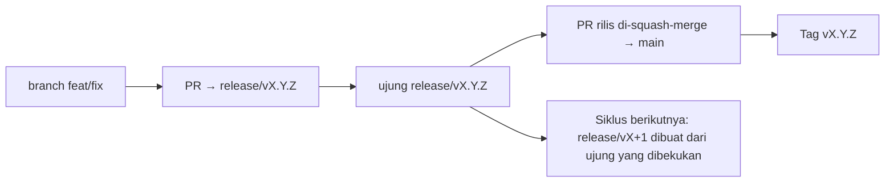

# Branching & Release Model (Bahasa Indonesia)

🌐 **Languages:** 🇺🇸 [English](../../../../ops/BRANCHING_MODEL.md) · 🇪🇹 [am](../../../am/docs/ops/BRANCHING_MODEL.md) · 🇸🇦 [ar](../../../ar/docs/ops/BRANCHING_MODEL.md) · 🇦🇿 [az](../../../az/docs/ops/BRANCHING_MODEL.md) · 🇧🇬 [bg](../../../bg/docs/ops/BRANCHING_MODEL.md) · 🇧🇩 [bn](../../../bn/docs/ops/BRANCHING_MODEL.md) · 🇨🇿 [cs](../../../cs/docs/ops/BRANCHING_MODEL.md) · 🇩🇰 [da](../../../da/docs/ops/BRANCHING_MODEL.md) · 🇩🇪 [de](../../../de/docs/ops/BRANCHING_MODEL.md) · 🇬🇷 [el](../../../el/docs/ops/BRANCHING_MODEL.md) · 🇪🇸 [es](../../../es/docs/ops/BRANCHING_MODEL.md) · 🇪🇪 [et](../../../et/docs/ops/BRANCHING_MODEL.md) · 🇮🇷 [fa](../../../fa/docs/ops/BRANCHING_MODEL.md) · 🇫🇮 [fi](../../../fi/docs/ops/BRANCHING_MODEL.md) · 🇫🇷 [fr](../../../fr/docs/ops/BRANCHING_MODEL.md) · 🇮🇪 [ga](../../../ga/docs/ops/BRANCHING_MODEL.md) · 🇮🇳 [gu](../../../gu/docs/ops/BRANCHING_MODEL.md) · 🇳🇬 [ha](../../../ha/docs/ops/BRANCHING_MODEL.md) · 🇮🇱 [he](../../../he/docs/ops/BRANCHING_MODEL.md) · 🇮🇳 [hi](../../../hi/docs/ops/BRANCHING_MODEL.md) · 🇭🇷 [hr](../../../hr/docs/ops/BRANCHING_MODEL.md) · 🇭🇺 [hu](../../../hu/docs/ops/BRANCHING_MODEL.md) · 🇦🇲 [hy](../../../hy/docs/ops/BRANCHING_MODEL.md) · 🇳🇬 [ig](../../../ig/docs/ops/BRANCHING_MODEL.md) · 🇮🇹 [it](../../../it/docs/ops/BRANCHING_MODEL.md) · 🇯🇵 [ja](../../../ja/docs/ops/BRANCHING_MODEL.md) · 🇬🇪 [ka](../../../ka/docs/ops/BRANCHING_MODEL.md) · 🇰🇭 [km](../../../km/docs/ops/BRANCHING_MODEL.md) · 🇮🇳 [kn](../../../kn/docs/ops/BRANCHING_MODEL.md) · 🇰🇷 [ko](../../../ko/docs/ops/BRANCHING_MODEL.md) · 🇱🇹 [lt](../../../lt/docs/ops/BRANCHING_MODEL.md) · 🇱🇻 [lv](../../../lv/docs/ops/BRANCHING_MODEL.md) · 🇮🇳 [ml](../../../ml/docs/ops/BRANCHING_MODEL.md) · 🇮🇳 [mr](../../../mr/docs/ops/BRANCHING_MODEL.md) · 🇲🇾 [ms](../../../ms/docs/ops/BRANCHING_MODEL.md) · 🇲🇹 [mt](../../../mt/docs/ops/BRANCHING_MODEL.md) · 🇲🇲 [my](../../../my/docs/ops/BRANCHING_MODEL.md) · 🇳🇵 [ne](../../../ne/docs/ops/BRANCHING_MODEL.md) · 🇳🇱 [nl](../../../nl/docs/ops/BRANCHING_MODEL.md) · 🇳🇴 [no](../../../no/docs/ops/BRANCHING_MODEL.md) · 🇮🇳 [or](../../../or/docs/ops/BRANCHING_MODEL.md) · 🇮🇳 [pa](../../../pa/docs/ops/BRANCHING_MODEL.md) · 🇵🇭 [phi](../../../phi/docs/ops/BRANCHING_MODEL.md) · 🇵🇱 [pl](../../../pl/docs/ops/BRANCHING_MODEL.md) · 🇵🇹 [pt](../../../pt/docs/ops/BRANCHING_MODEL.md) · 🇧🇷 [pt-BR](../../../pt-BR/docs/ops/BRANCHING_MODEL.md) · 🇷🇴 [ro](../../../ro/docs/ops/BRANCHING_MODEL.md) · 🇷🇺 [ru](../../../ru/docs/ops/BRANCHING_MODEL.md) · 🇱🇰 [si](../../../si/docs/ops/BRANCHING_MODEL.md) · 🇸🇰 [sk](../../../sk/docs/ops/BRANCHING_MODEL.md) · 🇸🇮 [sl](../../../sl/docs/ops/BRANCHING_MODEL.md) · 🇷🇸 [sr](../../../sr/docs/ops/BRANCHING_MODEL.md) · 🇸🇪 [sv](../../../sv/docs/ops/BRANCHING_MODEL.md) · 🇰🇪 [sw](../../../sw/docs/ops/BRANCHING_MODEL.md) · 🇮🇳 [ta](../../../ta/docs/ops/BRANCHING_MODEL.md) · 🇮🇳 [te](../../../te/docs/ops/BRANCHING_MODEL.md) · 🇹🇭 [th](../../../th/docs/ops/BRANCHING_MODEL.md) · 🇹🇷 [tr](../../../tr/docs/ops/BRANCHING_MODEL.md) · 🇺🇦 [uk-UA](../../../uk-UA/docs/ops/BRANCHING_MODEL.md) · 🇵🇰 [ur](../../../ur/docs/ops/BRANCHING_MODEL.md) · 🇺🇿 [uz](../../../uz/docs/ops/BRANCHING_MODEL.md) · 🇻🇳 [vi](../../../vi/docs/ops/BRANCHING_MODEL.md) · 🇳🇬 [yo](../../../yo/docs/ops/BRANCHING_MODEL.md) · 🇨🇳 [zh-CN](../../../zh-CN/docs/ops/BRANCHING_MODEL.md) · 🇹🇼 [zh-TW](../../../zh-TW/docs/ops/BRANCHING_MODEL.md)

---

OmniRoute menggunakan model rilis **siklus-paralel**: sebuah branch khusus `release/vX.Y.Z`
untuk siklus aktif, `main` untuk lini yang telah dipublikasikan, dan tag permanen
`vX.Y.Z` saat siklus tersebut dirilis. Melihat commit masuk ke `release/*` _dan_ ke
`main` adalah hal yang wajar — bukan kekeliruan.

Detail untuk pengelola tersedia di `CLAUDE.md` (Aturan Tegas #21) dan
[RELEASE_CHECKLIST.md](./RELEASE_CHECKLIST.md). Halaman ini merupakan ringkasan publik
yang ditujukan bagi kontributor.

## Ringkasan

| Ref              | Peran                                                                                      |
| ---------------- | ------------------------------------------------------------------------------------------ |
| `release/vX.Y.Z` | **Siklus aktif** — pengembangan sehari-hari dan penggabungan PR untuk versi tersebut       |
| `main`           | **Lini yang dipublikasikan** — menerima siklus melalui squash-merge saat rilis diluncurkan |
| `vX.Y.Z` (tag)   | **Penanda rilis** — penunjuk permanen “apa yang dirilis” yang dibuat pada waktu rilis      |



## Ke mana PR saya harus ditargetkan?

**Targetkan branch aktif `release/vX.Y.Z` — bukan `main`.**

1. Temukan branch `release/v*` terbuka dengan versi tertinggi (contoh pada saat penulisan:
   `release/v3.8.49`).
2. Buat branch dari ujung tersebut (`git fetch` + checkout / rebase ke atasnya).
3. Buka PR dengan **base = `release/vX.Y.Z` tersebut**.

`main` bukan branch integrasi sehari-hari. PR yang dibuka terhadap `main`
biasanya perlu ditargetkan ulang sebelum digabungkan.

## Pembekuan rilis (siklus paralel)

Saat sebuah rilis sedang direkonsiliasi, issue penanda berlabel `release-freeze`
akan dibuka. Hal tersebut **tidak menghentikan pengembangan**:

- `release/vX.Y.Z` yang dibekukan menjadi tanggung jawab kapten rilis untuk peluncuran tersebut.
- `release/vX+1` untuk siklus berikutnya dibuat dari ujung yang dibekukan agar kontributor dapat terus
  memasukkan pekerjaan.
- PR terbuka yang masih menargetkan branch yang dibekukan harus **ditargetkan ulang** ke
  branch `release/v*` yang aktif (tertinggi).

Periksa apakah ada pembekuan yang masih terbuka sebelum mengasumsikan branch yang Anda inginkan dapat digabungkan:

```bash
gh issue list --repo diegosouzapw/OmniRoute --label release-freeze --state open
```

Mekanisme penggabungan (label `queue` oleh pemilik → Mergify) didokumentasikan dalam
[MERGE_TRAIN.md](./MERGE_TRAIN.md).

## Mengapa menggunakan branch sekaligus tag?

| Artefak          | Masa berlaku                   | Tujuan                                                                   |
| ---------------- | ------------------------------ | ------------------------------------------------------------------------ |
| `release/vX.Y.Z` | Siklus yang sedang berlangsung | Mengumpulkan PR yang telah ditinjau, tetap lolos CI, dan menjadi base PR |
| Tag `vX.Y.Z`     | Selamanya                      | Menandai secara tepat komponen yang dirilis ke npm / GitHub Releases     |

Branch adalah bengkel; tag adalah paket yang telah disegel. Setelah squash-merge ke
`main`, siklus berikutnya berlanjut pada `release/vX+1` tanpa menunggu PR rilis
sebelumnya selesai.

## Dokumentasi terkait

- [CONTRIBUTING.md](../../CONTRIBUTING.md) — penyiapan, pengujian, daftar periksa PR
- [RELEASE_CHECKLIST.md](./RELEASE_CHECKLIST.md) — validasi sebelum rilis
- [MERGE_TRAIN.md](./MERGE_TRAIN.md) — antrean penggabungan dan mekanisme fallback
- [RELEASE_GREEN.md](./RELEASE_GREEN.md) — menjaga ujung rilis tetap lolos pemeriksaan
