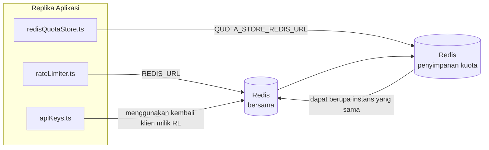

# Redis Production Configuration Guide (Bahasa Indonesia)

🌐 **Languages:** 🇺🇸 [English](../../../../ops/REDIS_PRODUCTION_CONFIG.md) · 🇪🇹 [am](../../../am/docs/ops/REDIS_PRODUCTION_CONFIG.md) · 🇸🇦 [ar](../../../ar/docs/ops/REDIS_PRODUCTION_CONFIG.md) · 🇦🇿 [az](../../../az/docs/ops/REDIS_PRODUCTION_CONFIG.md) · 🇧🇬 [bg](../../../bg/docs/ops/REDIS_PRODUCTION_CONFIG.md) · 🇧🇩 [bn](../../../bn/docs/ops/REDIS_PRODUCTION_CONFIG.md) · 🇨🇿 [cs](../../../cs/docs/ops/REDIS_PRODUCTION_CONFIG.md) · 🇩🇰 [da](../../../da/docs/ops/REDIS_PRODUCTION_CONFIG.md) · 🇩🇪 [de](../../../de/docs/ops/REDIS_PRODUCTION_CONFIG.md) · 🇬🇷 [el](../../../el/docs/ops/REDIS_PRODUCTION_CONFIG.md) · 🇪🇸 [es](../../../es/docs/ops/REDIS_PRODUCTION_CONFIG.md) · 🇪🇪 [et](../../../et/docs/ops/REDIS_PRODUCTION_CONFIG.md) · 🇮🇷 [fa](../../../fa/docs/ops/REDIS_PRODUCTION_CONFIG.md) · 🇫🇮 [fi](../../../fi/docs/ops/REDIS_PRODUCTION_CONFIG.md) · 🇫🇷 [fr](../../../fr/docs/ops/REDIS_PRODUCTION_CONFIG.md) · 🇮🇪 [ga](../../../ga/docs/ops/REDIS_PRODUCTION_CONFIG.md) · 🇮🇳 [gu](../../../gu/docs/ops/REDIS_PRODUCTION_CONFIG.md) · 🇳🇬 [ha](../../../ha/docs/ops/REDIS_PRODUCTION_CONFIG.md) · 🇮🇱 [he](../../../he/docs/ops/REDIS_PRODUCTION_CONFIG.md) · 🇮🇳 [hi](../../../hi/docs/ops/REDIS_PRODUCTION_CONFIG.md) · 🇭🇷 [hr](../../../hr/docs/ops/REDIS_PRODUCTION_CONFIG.md) · 🇭🇺 [hu](../../../hu/docs/ops/REDIS_PRODUCTION_CONFIG.md) · 🇦🇲 [hy](../../../hy/docs/ops/REDIS_PRODUCTION_CONFIG.md) · 🇳🇬 [ig](../../../ig/docs/ops/REDIS_PRODUCTION_CONFIG.md) · 🇮🇹 [it](../../../it/docs/ops/REDIS_PRODUCTION_CONFIG.md) · 🇯🇵 [ja](../../../ja/docs/ops/REDIS_PRODUCTION_CONFIG.md) · 🇬🇪 [ka](../../../ka/docs/ops/REDIS_PRODUCTION_CONFIG.md) · 🇰🇭 [km](../../../km/docs/ops/REDIS_PRODUCTION_CONFIG.md) · 🇮🇳 [kn](../../../kn/docs/ops/REDIS_PRODUCTION_CONFIG.md) · 🇰🇷 [ko](../../../ko/docs/ops/REDIS_PRODUCTION_CONFIG.md) · 🇱🇹 [lt](../../../lt/docs/ops/REDIS_PRODUCTION_CONFIG.md) · 🇱🇻 [lv](../../../lv/docs/ops/REDIS_PRODUCTION_CONFIG.md) · 🇮🇳 [ml](../../../ml/docs/ops/REDIS_PRODUCTION_CONFIG.md) · 🇮🇳 [mr](../../../mr/docs/ops/REDIS_PRODUCTION_CONFIG.md) · 🇲🇾 [ms](../../../ms/docs/ops/REDIS_PRODUCTION_CONFIG.md) · 🇲🇹 [mt](../../../mt/docs/ops/REDIS_PRODUCTION_CONFIG.md) · 🇲🇲 [my](../../../my/docs/ops/REDIS_PRODUCTION_CONFIG.md) · 🇳🇵 [ne](../../../ne/docs/ops/REDIS_PRODUCTION_CONFIG.md) · 🇳🇱 [nl](../../../nl/docs/ops/REDIS_PRODUCTION_CONFIG.md) · 🇳🇴 [no](../../../no/docs/ops/REDIS_PRODUCTION_CONFIG.md) · 🇮🇳 [or](../../../or/docs/ops/REDIS_PRODUCTION_CONFIG.md) · 🇮🇳 [pa](../../../pa/docs/ops/REDIS_PRODUCTION_CONFIG.md) · 🇵🇭 [phi](../../../phi/docs/ops/REDIS_PRODUCTION_CONFIG.md) · 🇵🇱 [pl](../../../pl/docs/ops/REDIS_PRODUCTION_CONFIG.md) · 🇵🇹 [pt](../../../pt/docs/ops/REDIS_PRODUCTION_CONFIG.md) · 🇧🇷 [pt-BR](../../../pt-BR/docs/ops/REDIS_PRODUCTION_CONFIG.md) · 🇷🇴 [ro](../../../ro/docs/ops/REDIS_PRODUCTION_CONFIG.md) · 🇷🇺 [ru](../../../ru/docs/ops/REDIS_PRODUCTION_CONFIG.md) · 🇱🇰 [si](../../../si/docs/ops/REDIS_PRODUCTION_CONFIG.md) · 🇸🇰 [sk](../../../sk/docs/ops/REDIS_PRODUCTION_CONFIG.md) · 🇸🇮 [sl](../../../sl/docs/ops/REDIS_PRODUCTION_CONFIG.md) · 🇷🇸 [sr](../../../sr/docs/ops/REDIS_PRODUCTION_CONFIG.md) · 🇸🇪 [sv](../../../sv/docs/ops/REDIS_PRODUCTION_CONFIG.md) · 🇰🇪 [sw](../../../sw/docs/ops/REDIS_PRODUCTION_CONFIG.md) · 🇮🇳 [ta](../../../ta/docs/ops/REDIS_PRODUCTION_CONFIG.md) · 🇮🇳 [te](../../../te/docs/ops/REDIS_PRODUCTION_CONFIG.md) · 🇹🇭 [th](../../../th/docs/ops/REDIS_PRODUCTION_CONFIG.md) · 🇹🇷 [tr](../../../tr/docs/ops/REDIS_PRODUCTION_CONFIG.md) · 🇺🇦 [uk-UA](../../../uk-UA/docs/ops/REDIS_PRODUCTION_CONFIG.md) · 🇵🇰 [ur](../../../ur/docs/ops/REDIS_PRODUCTION_CONFIG.md) · 🇺🇿 [uz](../../../uz/docs/ops/REDIS_PRODUCTION_CONFIG.md) · 🇻🇳 [vi](../../../vi/docs/ops/REDIS_PRODUCTION_CONFIG.md) · 🇳🇬 [yo](../../../yo/docs/ops/REDIS_PRODUCTION_CONFIG.md) · 🇨🇳 [zh-CN](../../../zh-CN/docs/ops/REDIS_PRODUCTION_CONFIG.md) · 🇹🇼 [zh-TW](../../../zh-TW/docs/ops/REDIS_PRODUCTION_CONFIG.md)

---

## Ikhtisar

Redis merupakan **dependensi lunak yang opsional** di OmniRoute — aplikasi akan menurun fungsinya secara bertahap (menggunakan
fallback dalam memori) ketika Redis tidak tersedia. Dalam produksi, penyetelan Redis mengurangi latensi untuk empat
beban kerja yang berbeda:

| Beban Kerja               | Penggerak                     | Factory Klien                                                          | Pola Kunci                                             |
| ------------------------- | ----------------------------- | ---------------------------------------------------------------------- | ------------------------------------------------------ |
| Pembatasan laju           | `rateLimiter.ts`              | Singleton `ioredis` yang dimuat secara lazy melalui `getRedisClient()` | Jendela pembatasan laju Lua-atomic `<prefix>rl:*`      |
| Cache autentikasi         | `apiKeys.ts`                  | Menggunakan kembali klien milik `rateLimiter`                          | `<prefix>auth:api_key:<sha256>` dengan TTL             |
| Penyimpanan kuota         | `redisQuotaStore.ts`          | Singleton `getRedisClient(url)` terpisah                               | `<prefix>quota:*` yang dapat dikonfigurasi per instans |
| Circuit breaker pemanasan | `redisCircuitBreakerStore.ts` | Klien terpisah di `circuitBreakerFactory.ts`                           | `<prefix>warmup:cb:<connectionId>`                     |

Keempat beban kerja menggunakan satu prefiks namespace yang sama agar OmniRoute dapat berjalan berdampingan dengan aplikasi lain pada
satu instans Redis (misalnya `127.0.0.1:6379`). Lihat [Namespace Kunci](#key-namespacing).

---

## Konfigurasi Saat Ini (Default Kode)

| Pengaturan                           | Nilai                                                         | Lokasi                                                                                |
| ------------------------------------ | ------------------------------------------------------------- | ------------------------------------------------------------------------------------- |
| Variabel env `REDIS_URL`             | `redis://redis:6379` (compose), opsional                      | `rateLimiter.ts:5`, `.env.example`                                                    |
| Variabel env `REDIS_KEY_PREFIX`      | `omniroute:` (default)                                        | `rateLimiter.ts`, `redisQuotaStore.ts`, `redisCircuitBreakerStore.ts`, `.env.example` |
| Variabel env `QUOTA_STORE_REDIS_URL` | terpisah, dapat berbeda dari `REDIS_URL`                      | `quota/storeFactory.ts`                                                               |
| `QUOTA_STORE_DRIVER`                 | `"sqlite"` (default), `"redis"` opsional                      | `quota/storeFactory.ts`                                                               |
| `maxRetriesPerRequest` ioredis       | `3`                                                           | pembuatan klien di `rateLimiter.ts`                                                   |
| `enableReadyCheck`                   | tidak ditetapkan (default ioredis: `true`)                    | —                                                                                     |
| `lazyConnect`                        | tidak ditetapkan (default ioredis: `false`)                   | —                                                                                     |
| `retryStrategy`                      | tidak ditetapkan (default ioredis: basis 200ms, eksponensial) | —                                                                                     |
| TLS / kata sandi / indeks DB         | **tidak dikonfigurasi**                                       | —                                                                                     |
| Sentinel / Cluster                   | **tidak dikonfigurasi** — hanya node tunggal standalone       | —                                                                                     |

---

## Namespace Kunci

OmniRoute berbagi sebuah instans Redis dengan layanan lain apa pun yang berjalan pada host tersebut. Tanpa namespace,
kunci seperti `auth:api_key:<sha256>` atau `rl:*` dapat bertabrakan dengan kunci dari aplikasi lain
yang menggunakan Redis yang sama (instans ini menjalankan Redis pada `127.0.0.1:6379` bersama layanan lain).

Tetapkan `REDIS_KEY_PREFIX` ke string yang tidak kosong untuk menambahkan prefiks ke **setiap** kunci OmniRoute:

```bash
# .env — semua kunci OmniRoute menjadi omniroute:rl:*, omniroute:auth:*, omniroute:quota:*, omniroute:warmup:cb:*
REDIS_KEY_PREFIX=omniroute:
```

- **Default:** `omniroute:` (diterapkan ketika `REDIS_KEY_PREFIX` tidak ditetapkan atau kosong).
- **Diterapkan pada:** pembatas laju + cache autentikasi (klien `ioredis` bersama melalui `keyPrefix`) dan
  penyimpanan kuota (`KEY_PREFIX = "${REDIS_KEY_PREFIX}quota"`) serta circuit breaker pemanasan
  (`KEY_PREFIX = "${REDIS_KEY_PREFIX}warmup:cb:"`).
- **Mengubah prefiks** ketika kunci sudah ada di Redis akan membuat kunci lama tidak lagi terhubung
  (kunci tersebut kedaluwarsa melalui TTL / LRU). Aman untuk diubah; tidak diperlukan migrasi. Satu-satunya pengecualian adalah kunci
  circuit breaker pemanasan untuk koneksi yang ditandai terlarang: kunci tersebut disimpan tanpa TTL, jadi
  tampilkan sisa kunci dengan `redis-cli --scan --pattern '<old-prefix>warmup:cb:*'` lalu hapus.
- **`keyPrefix` ioredis** secara otomatis menambahkan prefiks saat penulisan **dan** menghapusnya saat pembacaan,
  sehingga kode aplikasi tidak pernah melihat prefiks tersebut.

---

## Penyesuaian yang Direkomendasikan untuk Produksi

### 1. Opsi Pool Koneksi / Klien (konstruktor `Redis` ioredis)

Kode saat ini membuat satu `new Redis(url)` tanpa opsi khusus. Untuk deployment produksi
dengan banyak replika, teruskan factory klien dalam kode atau bungkus `getRedisClient()`:

```typescript
const redis = new Redis(REDIS_URL, {
  maxRetriesPerRequest: null, // tanpa batas percobaan ulang; biarkan retryStrategy yang menentukan
  enableReadyCheck: true, // verifikasi bahwa server siap sebelum menerima panggilan
  lazyConnect: true, // jangan terhubung saat konstruksi; tunggu panggilan pertama
  retryStrategy: (times) => {
    if (times > 10) return null; // menyerah setelah 10 percobaan ulang → hubungkan kembali nanti
    return Math.min(times * 200, 5000); // 200ms, 400ms, …, batas maksimum 5s
  },
  enableAutoPipelining: true, // gabungkan perintah bersamaan menjadi satu penulisan TCP
  keepAlive: 10000, // keep-alive TCP setiap 10s
});
```

**Pertimbangan utama:**

- `maxRetriesPerRequest: null` + `retryStrategy` — lebih disarankan untuk produksi agar
  restart Redis sementara tidak langsung menggagalkan setiap permintaan. Fallback dalam memori di
  `checkRateLimit()` menangani jalur kegagalan tersebut.
- `lazyConnect: true` — menghindari ketergantungan saat startup pada kesiapan Redis sebelum server
  mulai menerima koneksi.
- `enableAutoPipelining: true` — mengurangi perjalanan bolak-balik untuk pemeriksaan batas laju secara bersamaan;
  bermanfaat pada >50 RPS melalui satu koneksi.

### 2. Konfigurasi Server Redis (`redis.conf`)

```
# Memori
maxmemory 80%                        # sisakan ruang untuk cache halaman OS
maxmemory-policy allkeys-lru         # keluarkan entri cache autentikasi yang usang saat ada tekanan memori

# Persistensi (opsional — OmniRoute aman dari crash tanpanya)
save 300 1                           # buat snapshot setidaknya setiap 5 menit jika ≥1 kunci berubah
appendonly no                        # AOF tidak diperlukan; data dapat dibuat ulang
appendfsync no                       # tanpa overhead fsync (RDB sudah memadai)

# Jaringan
timeout 0                            # jangan putuskan koneksi saat idle
tcp-keepalive 300                    # keep-alive 5 menit
tcp-backlog 511                      # backlog koneksi untuk lonjakan beban

# Performa
hz 10                                # nilai default; 100 untuk kebutuhan yang sensitif terhadap latensi
activedefrag yes                     # lakukan defragmentasi otomatis saat fragmentasi >10%
```

**Pertimbangan untuk `maxmemory-policy allkeys-lru`:** Entri cache autentikasi dapat dikeluarkan saat
ada tekanan memori. Ini aman — `setCachedApiKey` selalu mengisi ulang ketika terjadi cache miss, dan
fallback SQLite merupakan sumber yang otoritatif. Skrip Lua pembatas laju membuat kunci kecil yang
secara desain berumur pendek.

### 3. Pengaturan Docker Compose

Compose produksi (`docker-compose.prod.yml`) menggunakan `redis:8.6.2-alpine`. Tambahkan:

```yaml
redis:
  image: redis:8.6.2-alpine
  command:
    [
      "redis-server",
      "--maxmemory",
      "512mb",
      "--maxmemory-policy",
      "allkeys-lru",
      "--activedefrag",
      "yes",
      "--save",
      "300 1",
    ]
  healthcheck:
    test: ["CMD", "redis-cli", "ping"]
    interval: 10s
    timeout: 3s
    retries: 3
    start_period: 5s
```

### 4. Pertimbangan Multi-Instans / Penskalaan

**Satu Redis untuk semua replika** — skrip Lua pembatas laju bergantung pada satu
ruang kunci yang otoritatif. Beberapa instans Redis di belakang replika akan menghilangkan atomicity
dan menggandakan anggaran. Gunakan satu Redis (atau cluster Redis Sentinel dengan failover) untuk
semua replika aplikasi.

**Jumlah koneksi:** Setiap replika aplikasi membuka **2 koneksi TCP** ke Redis
(klien pembatas laju + klien penyimpanan kuota). Dengan 10 replika → 20 koneksi, masih
jauh di bawah batas default 10 ribu koneksi pada instans Redis.

### 5. Pemantauan

Ekspos melalui endpoint pemeriksaan kesehatan:

```typescript
// src/app/api/monitoring/health/route.ts sudah memanggil fungsi rateLimiter
// Tambahkan pemeriksaan khusus Redis:
//   1. Latensi PING melalui ioredis .ping()
//   2. Penggunaan memori melalui INFO memory
//   3. Jumlah koneksi melalui INFO clients
//   4. Tingkat hit untuk maxmemory-policy (evicted_keys / keyspace_hits)
```

Metrik utama yang perlu dipantau:

- **Kunci yang dikeluarkan / detik** — jika terus-menerus bukan nol, tingkatkan `maxmemory`
- **Klien yang diblokir** — nilai bukan nol menunjukkan skrip Lua yang lambat atau perebutan sumber daya yang tinggi
- **Koneksi yang ditolak** — batas koneksi tercapai; jarang terjadi dengan 20 koneksi

---

## Diagram Arsitektur



---

## Referensi

| File                               | Tujuan                                                              |
| ---------------------------------- | ------------------------------------------------------------------- |
| `src/shared/utils/rateLimiter.ts`  | Klien Redis utama, skrip pembatasan laju Lua, fallback dalam memori |
| `src/lib/db/apiKeys.ts`            | Cache autentikasi — fallback Redis→SQLite                           |
| `src/lib/quota/redisQuotaStore.ts` | Klien Redis terpisah untuk penyimpanan kuota opsional               |
| `src/lib/quota/storeFactory.ts`    | Beralih antara driver kuota `sqlite` dan `redis`                    |
| `docker-compose.prod.yml`          | Kontainer Redis produksi (image `redis:8.6.2-alpine`)               |
| `.env.example`                     | Dokumentasi variabel lingkungan Redis                               |
| `src/app/api/local/redis/`         | Rute API untuk orkestrasi kontainer pengembangan                    |
| `bin/cli/commands/redis.mjs`       | Perintah CLI untuk orkestrasi kontainer pengembangan                |
