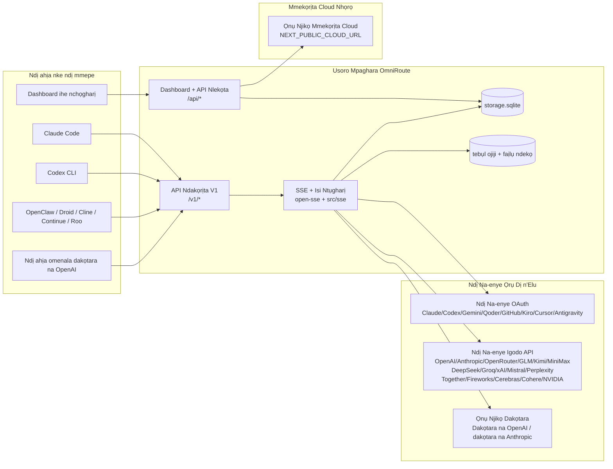
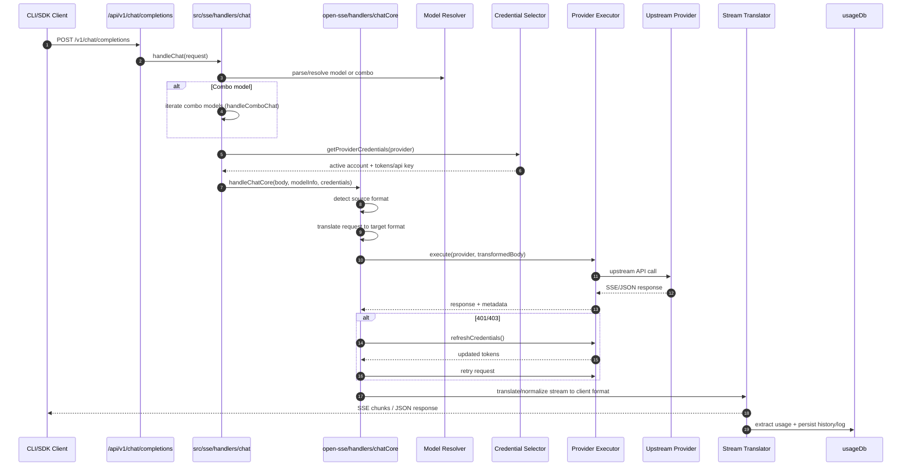
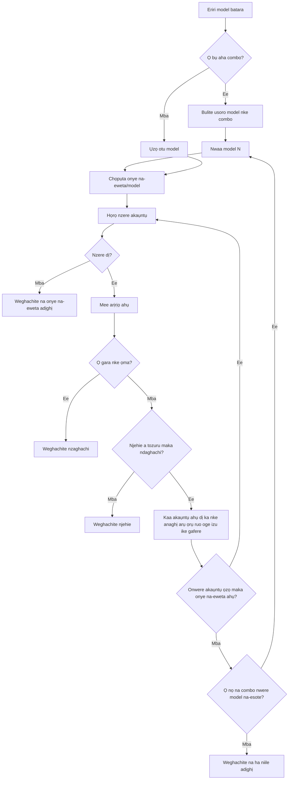
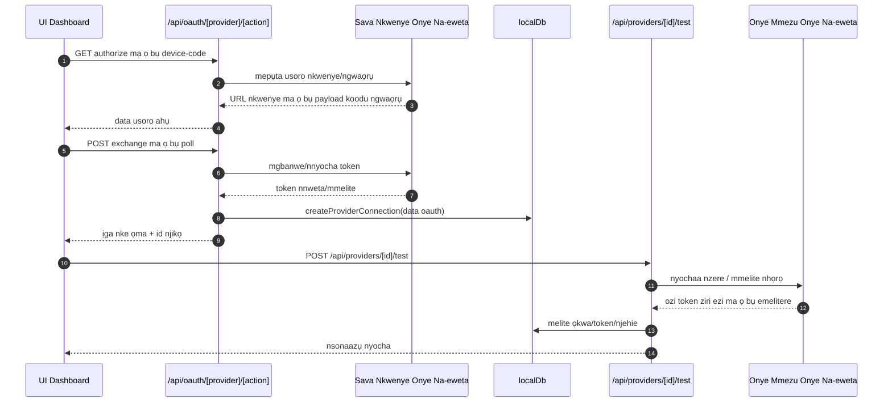
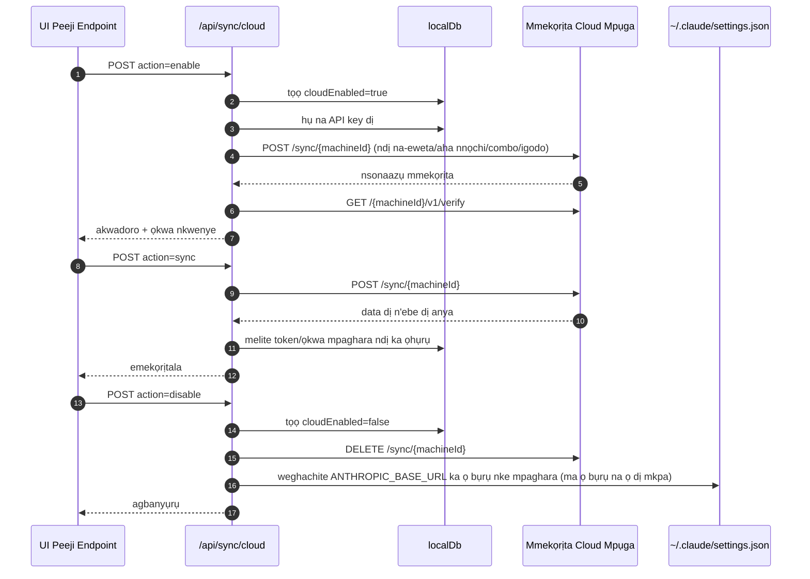
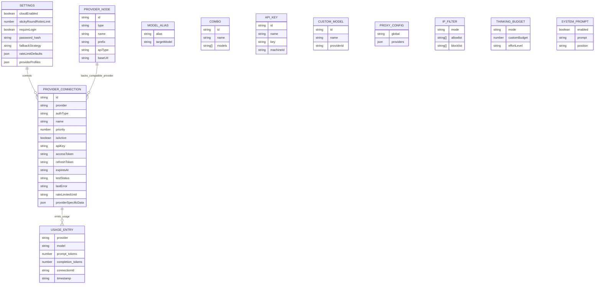
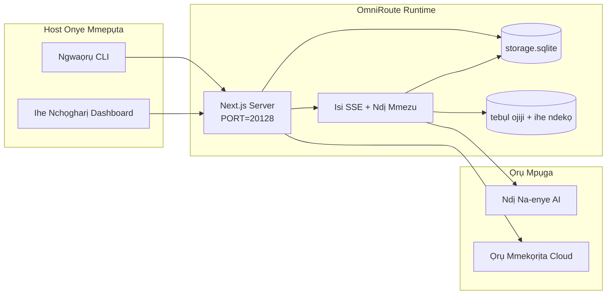

# OmniRoute Architecture (Igbo)

🌐 **Languages:** 🇺🇸 [English](../../../../architecture/ARCHITECTURE.md) · 🇪🇹 [am](../../../am/docs/architecture/ARCHITECTURE.md) · 🇸🇦 [ar](../../../ar/docs/architecture/ARCHITECTURE.md) · 🇦🇿 [az](../../../az/docs/architecture/ARCHITECTURE.md) · 🇧🇬 [bg](../../../bg/docs/architecture/ARCHITECTURE.md) · 🇧🇩 [bn](../../../bn/docs/architecture/ARCHITECTURE.md) · 🇧🇦 [bs](../../../bs/docs/architecture/ARCHITECTURE.md) · 🇨🇿 [cs](../../../cs/docs/architecture/ARCHITECTURE.md) · 🇩🇰 [da](../../../da/docs/architecture/ARCHITECTURE.md) · 🇩🇪 [de](../../../de/docs/architecture/ARCHITECTURE.md) · 🇬🇷 [el](../../../el/docs/architecture/ARCHITECTURE.md) · 🇪🇸 [es](../../../es/docs/architecture/ARCHITECTURE.md) · 🇪🇪 [et](../../../et/docs/architecture/ARCHITECTURE.md) · 🇮🇷 [fa](../../../fa/docs/architecture/ARCHITECTURE.md) · 🇫🇮 [fi](../../../fi/docs/architecture/ARCHITECTURE.md) · 🇫🇷 [fr](../../../fr/docs/architecture/ARCHITECTURE.md) · 🇮🇪 [ga](../../../ga/docs/architecture/ARCHITECTURE.md) · 🇮🇳 [gu](../../../gu/docs/architecture/ARCHITECTURE.md) · 🇳🇬 [ha](../../../ha/docs/architecture/ARCHITECTURE.md) · 🇮🇱 [he](../../../he/docs/architecture/ARCHITECTURE.md) · 🇮🇳 [hi](../../../hi/docs/architecture/ARCHITECTURE.md) · 🇭🇷 [hr](../../../hr/docs/architecture/ARCHITECTURE.md) · 🇭🇺 [hu](../../../hu/docs/architecture/ARCHITECTURE.md) · 🇦🇲 [hy](../../../hy/docs/architecture/ARCHITECTURE.md) · 🇮🇩 [id](../../../id/docs/architecture/ARCHITECTURE.md) · 🇮🇹 [it](../../../it/docs/architecture/ARCHITECTURE.md) · 🇯🇵 [ja](../../../ja/docs/architecture/ARCHITECTURE.md) · 🇬🇪 [ka](../../../ka/docs/architecture/ARCHITECTURE.md) · 🇰🇭 [km](../../../km/docs/architecture/ARCHITECTURE.md) · 🇮🇳 [kn](../../../kn/docs/architecture/ARCHITECTURE.md) · 🇰🇷 [ko](../../../ko/docs/architecture/ARCHITECTURE.md) · 🇱🇹 [lt](../../../lt/docs/architecture/ARCHITECTURE.md) · 🇱🇻 [lv](../../../lv/docs/architecture/ARCHITECTURE.md) · 🇮🇳 [ml](../../../ml/docs/architecture/ARCHITECTURE.md) · 🇮🇳 [mr](../../../mr/docs/architecture/ARCHITECTURE.md) · 🇲🇾 [ms](../../../ms/docs/architecture/ARCHITECTURE.md) · 🇲🇹 [mt](../../../mt/docs/architecture/ARCHITECTURE.md) · 🇲🇲 [my](../../../my/docs/architecture/ARCHITECTURE.md) · 🇳🇵 [ne](../../../ne/docs/architecture/ARCHITECTURE.md) · 🇳🇱 [nl](../../../nl/docs/architecture/ARCHITECTURE.md) · 🇳🇴 [no](../../../no/docs/architecture/ARCHITECTURE.md) · 🇮🇳 [or](../../../or/docs/architecture/ARCHITECTURE.md) · 🇮🇳 [pa](../../../pa/docs/architecture/ARCHITECTURE.md) · 🇵🇭 [phi](../../../phi/docs/architecture/ARCHITECTURE.md) · 🇵🇱 [pl](../../../pl/docs/architecture/ARCHITECTURE.md) · 🇵🇹 [pt](../../../pt/docs/architecture/ARCHITECTURE.md) · 🇧🇷 [pt-BR](../../../pt-BR/docs/architecture/ARCHITECTURE.md) · 🇷🇴 [ro](../../../ro/docs/architecture/ARCHITECTURE.md) · 🇷🇺 [ru](../../../ru/docs/architecture/ARCHITECTURE.md) · 🇱🇰 [si](../../../si/docs/architecture/ARCHITECTURE.md) · 🇸🇰 [sk](../../../sk/docs/architecture/ARCHITECTURE.md) · 🇸🇮 [sl](../../../sl/docs/architecture/ARCHITECTURE.md) · 🇷🇸 [sr](../../../sr/docs/architecture/ARCHITECTURE.md) · 🇸🇪 [sv](../../../sv/docs/architecture/ARCHITECTURE.md) · 🇰🇪 [sw](../../../sw/docs/architecture/ARCHITECTURE.md) · 🇮🇳 [ta](../../../ta/docs/architecture/ARCHITECTURE.md) · 🇮🇳 [te](../../../te/docs/architecture/ARCHITECTURE.md) · 🇹🇭 [th](../../../th/docs/architecture/ARCHITECTURE.md) · 🇹🇷 [tr](../../../tr/docs/architecture/ARCHITECTURE.md) · 🇺🇦 [uk-UA](../../../uk-UA/docs/architecture/ARCHITECTURE.md) · 🇵🇰 [ur](../../../ur/docs/architecture/ARCHITECTURE.md) · 🇺🇿 [uz](../../../uz/docs/architecture/ARCHITECTURE.md) · 🇻🇳 [vi](../../../vi/docs/architecture/ARCHITECTURE.md) · 🇳🇬 [yo](../../../yo/docs/architecture/ARCHITECTURE.md) · 🇨🇳 [zh-CN](../../../zh-CN/docs/architecture/ARCHITECTURE.md) · 🇹🇼 [zh-TW](../../../zh-TW/docs/architecture/ARCHITECTURE.md)

---

🌐 **Languages:** 🇺🇸 [English](../../../../architecture/ARCHITECTURE.md) · 🇪🇹 [am](../../../am/docs/architecture/ARCHITECTURE.md) · 🇸🇦 [ar](../../../ar/docs/architecture/ARCHITECTURE.md) · 🇦🇿 [az](../../../az/docs/architecture/ARCHITECTURE.md) · 🇧🇬 [bg](../../../bg/docs/architecture/ARCHITECTURE.md) · 🇧🇩 [bn](../../../bn/docs/architecture/ARCHITECTURE.md) · 🇧🇦 [bs](../../../bs/docs/architecture/ARCHITECTURE.md) · 🇨🇿 [cs](../../../cs/docs/architecture/ARCHITECTURE.md) · 🇩🇰 [da](../../../da/docs/architecture/ARCHITECTURE.md) · 🇩🇪 [de](../../../de/docs/architecture/ARCHITECTURE.md) · 🇬🇷 [el](../../../el/docs/architecture/ARCHITECTURE.md) · 🇪🇸 [es](../../../es/docs/architecture/ARCHITECTURE.md) · 🇪🇪 [et](../../../et/docs/architecture/ARCHITECTURE.md) · 🇮🇷 [fa](../../../fa/docs/architecture/ARCHITECTURE.md) · 🇫🇮 [fi](../../../fi/docs/architecture/ARCHITECTURE.md) · 🇫🇷 [fr](../../../fr/docs/architecture/ARCHITECTURE.md) · 🇮🇪 [ga](../../../ga/docs/architecture/ARCHITECTURE.md) · 🇮🇳 [gu](../../../gu/docs/architecture/ARCHITECTURE.md) · 🇳🇬 [ha](../../../ha/docs/architecture/ARCHITECTURE.md) · 🇮🇱 [he](../../../he/docs/architecture/ARCHITECTURE.md) · 🇮🇳 [hi](../../../hi/docs/architecture/ARCHITECTURE.md) · 🇭🇷 [hr](../../../hr/docs/architecture/ARCHITECTURE.md) · 🇭🇺 [hu](../../../hu/docs/architecture/ARCHITECTURE.md) · 🇦🇲 [hy](../../../hy/docs/architecture/ARCHITECTURE.md) · 🇮🇩 [id](../../../id/docs/architecture/ARCHITECTURE.md) · 🇮🇹 [it](../../../it/docs/architecture/ARCHITECTURE.md) · 🇯🇵 [ja](../../../ja/docs/architecture/ARCHITECTURE.md) · 🇬🇪 [ka](../../../ka/docs/architecture/ARCHITECTURE.md) · 🇰🇭 [km](../../../km/docs/architecture/ARCHITECTURE.md) · 🇮🇳 [kn](../../../kn/docs/architecture/ARCHITECTURE.md) · 🇰🇷 [ko](../../../ko/docs/architecture/ARCHITECTURE.md) · 🇱🇹 [lt](../../../lt/docs/architecture/ARCHITECTURE.md) · 🇱🇻 [lv](../../../lv/docs/architecture/ARCHITECTURE.md) · 🇮🇳 [ml](../../../ml/docs/architecture/ARCHITECTURE.md) · 🇮🇳 [mr](../../../mr/docs/architecture/ARCHITECTURE.md) · 🇲🇾 [ms](../../../ms/docs/architecture/ARCHITECTURE.md) · 🇲🇹 [mt](../../../mt/docs/architecture/ARCHITECTURE.md) · 🇲🇲 [my](../../../my/docs/architecture/ARCHITECTURE.md) · 🇳🇵 [ne](../../../ne/docs/architecture/ARCHITECTURE.md) · 🇳🇱 [nl](../../../nl/docs/architecture/ARCHITECTURE.md) · 🇳🇴 [no](../../../no/docs/architecture/ARCHITECTURE.md) · 🇮🇳 [or](../../../or/docs/architecture/ARCHITECTURE.md) · 🇮🇳 [pa](../../../pa/docs/architecture/ARCHITECTURE.md) · 🇵🇭 [phi](../../../phi/docs/architecture/ARCHITECTURE.md) · 🇵🇱 [pl](../../../pl/docs/architecture/ARCHITECTURE.md) · 🇵🇹 [pt](../../../pt/docs/architecture/ARCHITECTURE.md) · 🇧🇷 [pt-BR](../../../pt-BR/docs/architecture/ARCHITECTURE.md) · 🇷🇴 [ro](../../../ro/docs/architecture/ARCHITECTURE.md) · 🇷🇺 [ru](../../../ru/docs/architecture/ARCHITECTURE.md) · 🇱🇰 [si](../../../si/docs/architecture/ARCHITECTURE.md) · 🇸🇰 [sk](../../../sk/docs/architecture/ARCHITECTURE.md) · 🇸🇮 [sl](../../../sl/docs/architecture/ARCHITECTURE.md) · 🇷🇸 [sr](../../../sr/docs/architecture/ARCHITECTURE.md) · 🇸🇪 [sv](../../../sv/docs/architecture/ARCHITECTURE.md) · 🇰🇪 [sw](../../../sw/docs/architecture/ARCHITECTURE.md) · 🇮🇳 [ta](../../../ta/docs/architecture/ARCHITECTURE.md) · 🇮🇳 [te](../../../te/docs/architecture/ARCHITECTURE.md) · 🇹🇭 [th](../../../th/docs/architecture/ARCHITECTURE.md) · 🇹🇷 [tr](../../../tr/docs/architecture/ARCHITECTURE.md) · 🇺🇦 [uk-UA](../../../uk-UA/docs/architecture/ARCHITECTURE.md) · 🇵🇰 [ur](../../../ur/docs/architecture/ARCHITECTURE.md) · 🇺🇿 [uz](../../../uz/docs/architecture/ARCHITECTURE.md) · 🇻🇳 [vi](../../../vi/docs/architecture/ARCHITECTURE.md) · 🇳🇬 [yo](../../../yo/docs/architecture/ARCHITECTURE.md) · 🇨🇳 [zh-CN](../../../zh-CN/docs/architecture/ARCHITECTURE.md) · 🇹🇼 [zh-TW](../../../zh-TW/docs/architecture/ARCHITECTURE.md)

_Emelitere ikpeazụ: 2026-06-28_

## Nchịkọta Ndị Isi

OmniRoute bụ ọnụ ụzọ ntụgharị AI mpaghara na dashboard e wuru n’elu Next.js.
Ọ na-enye otu endpoint dakọtara na OpenAI (`/v1/*`) ma na-ebufe okporoụzọ data gafee ọtụtụ ndị na-eweta ọrụ upstream, tinyere ntụgharị, fallback, imegharị token, na nsuso ojiji.

Ikike ndị bụ isi:

- API dakọtara na OpenAI maka CLI/ngwaọrụ (ndị na-eweta ọrụ 355, ndị mmebe 108)
- Ntụgharị arịrịọ/azịza n’etiti usoro ndị na-eweta ọrụ
- Fallback ngwakọta model (usoro ọtụtụ model)
- Nzọụkwụ ngwakọta ahaziri ahazi (`provider + model + connection`) nwere nhazi oge ọrụ site na `compositeTiers`
- Fallback n’ogo akaụntụ (ọtụtụ akaụntụ maka onye na-eweta ọrụ ọ bụla)
- Nlele quota tupu ọrụ na nhọpụta akaụntụ P2C nke na-eburu quota n’uche n’ụzọ chat bụ isi
- Njikwa njikọ onye na-eweta ọrụ site na OAuth + API-key (modul onye na-eweta OAuth 22)
- Mmepụta embedding site na `/v1/embeddings` (ndị na-eweta ọrụ 18)
- Mmepụta onyonyo site na `/v1/images/generations` (ndị na-eweta ọrụ 10+, model 20+)
- Ntughari ọdịyo ka ọ bụrụ ederede site na `/v1/audio/transcriptions` (ndị na-eweta ọrụ 18)
- Ntughari ederede ka ọ bụrụ olu site na `/v1/audio/speech` (ndị na-eweta ọrụ arụnyere n’ime 24)
- Mmepụta vidiyo site na `/v1/videos/generations` (ComfyUI + SD WebUI)
- Mmepụta egwu site na `/v1/music/generations` (ComfyUI)
- Nchọta webụ site na `/v1/search` (ndị na-eweta ọrụ 20)
- Nyocha ọdịnaya site na `/v1/moderations`
- Ịhazigharị ọkwa site na `/v1/rerank`
- Ntụgharị mkpado Think (`<think>...</think>`) maka model ndị na-atụgharị uche
- Nhichapụ azịza iji kwekọọ kpamkpam na OpenAI SDK
- Ịhazigharị role (developer→system, system→user) maka ndakọrịta n’etiti ndị na-eweta ọrụ
- Ntughari mmepụta ahaziri ahazi (json_schema → Gemini responseSchema)
- Nchekwa mpaghara maka ndị na-eweta ọrụ, key, alias, combo, ntọala, na ọnụahịa (modul DB 122)
- Nsuso ojiji/ọnụ ahịa na ndekọ arịrịọ
- Mmekọrịta cloud a na-ahọrọ maka mmekọrịta ọtụtụ ngwaọrụ/ọnọdụ
- IP allowlist/blocklist maka njikwa ohere API
- Njikwa oke thinking (passthrough/auto/custom/adaptive)
- Ịtinye system prompt zuru ụwa ọnụ
- Nsuso session na imepụta fingerprint
- Mmachibido ọsọ emelitere maka akaụntụ ọ bụla, nwere profaịlụ ndị akọwapụtara maka onye na-eweta ọrụ
- Usoro circuit breaker maka nkwụsi ike nke onye na-eweta ọrụ
- Nchedo anti-thundering herd site na mkpọchi mutex
- Cache iwepụ arịrịọ ndị yiri ibe ha dabere na signature
- Domain layer: iwu ọnụ ahịa, amụma fallback, amụma lockout
- Context Relay: nchịkọta nnyefe session iji hụ na ọrụ na-aga n’ihu mgbe a na-agbanwe akaụntụ
- Nchekwa ọnọdụ domain (cache SQLite write-through maka fallback, budget, lockout, na circuit breaker)
- Policy engine maka nyocha arịrịọ etinyere n’otu ebe (lockout → budget → fallback)
- Telemetry arịrịọ nwere nchịkọta latency p50/p95/p99
- Telemetry ebumnuche combo na akụkọ ahụike ebumnuche combo site na `combo_execution_key` / `combo_step_id`
- Correlation ID (X-Request-Id) maka nsuso site na mmalite ruo na njedebe
- Ndekọ audit nrubeisi nwere nhọrọ ịpụ maka API key ọ bụla
- Usoro eval maka mmesi obi ike n’ịdịmma LLM
- Dashboard ahụike nwere ọnọdụ circuit breaker nke onye na-eweta ọrụ n’oge ozugbo
- MCP Server (ngwaọrụ 110) nwere ụzọ mbufe 3 (stdio/SSE/Streamable HTTP)
- A2A Server (JSON-RPC 2.0 + SSE) nwere skill na usoro ndụ task
- Usoro memory (mmịpụta, ntinye, iweghachite, nchịkọta)
- Usoro skills (registry, executor, sandbox, skill arụnyere n’ime)
- Proxy MITM nwere njikwa certificate na njikwa DNS
- Middleware nchedo prompt injection
- Pipeline mkpakọ prompt nwere Caveman, RTK, pipeline a kwakọtara ọnụ, combo mkpakọ, ngwugwu asụsụ, na analytics
- Registry ACP (Agent Communication Protocol)
- Ndị na-eweta OAuth modular (modul nke ọ bụla 22 n’okpuru `src/lib/oauth/providers/`)
- Script uninstall/full-uninstall
- Omume mmezi gburugburu OAuth
- Àkwà mmiri WebSocket maka ndị ahịa WS dakọtara na OpenAI (`/v1/ws`)
- Njikwa token mmekọrịta (inye/kagbuo, nbudata ngwugwu nhazi nwere ụdị ETag)
- GLM Thinking (`glmt`) dịka preset onye na-eweta ọrụ ọkwa mbụ
- Ngụkọta token ngwakọta (site n’akụkụ onye na-eweta ọrụ `/messages/count_tokens` nwere fallback atụmatụ)
- Ịkụnye alias model na-akpaghị aka (nhazi olumba cross-proxy 30+ mgbe mmalite)
- Fetch ọpụpụ dị nchebe nwere nchedo SSRF, mgbochi URL nzuzo, na retry a pụrụ ịhazi
- Retry chat na-eburu cooldown n’uche, nwere `requestRetry` na `maxRetryIntervalSec` a pụrụ ịhazi
- Nnyocha gburugburu runtime site na Zod mgbe mmalite
- Audit nrubeisi v2 nwere pagination, mmemme CRUD nke onye na-eweta ọrụ, na ndekọ nnyocha ndị SSRF gbochiri

Ụdị runtime bụ isi:

- App route Next.js dị n’okpuru `src/app/api/*` na-arụ ma API dashboard ma API ndakọrịta
- Isi SSE/routing a na-ekekọrịta dị na `src/sse/*` + `open-sse/*` na-ahụ maka mmezu onye na-eweta ọrụ, ntụgharị, streaming, fallback, na ojiji

## Eserese Nrụtụaka

Isi mmalite Mermaid ndị a na-achịkwa ụdị ha maka nyiwe v3.8.0 dị na
[`docs/diagrams/`](../diagrams/README.md). E gosipụtara abụọ n’ime ha n’okpuru iji nyere aka ịghọta nhazi ahụ;
e jikọtara ndị fọdụrụ na ntuziaka ndị metụtara ngalaba ha kpọmkwem.


> Isi mmalite: [diagrams/request-pipeline.mmd](../diagrams/request-pipeline.mmd)


> Isi mmalite: [diagrams/resilience-3layers.mmd](../diagrams/resilience-3layers.mmd) — e jikọtara ya kwa site na
> [RESILIENCE_GUIDE.md](./RESILIENCE_GUIDE.md) na nrụtụaka nkwụsi ike dị na `CLAUDE.md`.

## Oke na Njedebe

### Ihe Ndị Dị n’Oke

- Oge ọrụ gateway mpaghara
- API njikwa dashboard
- Nyocha njirimara provider na mmelite token
- Ntụgharị arịrịọ na nkwanye SSE
- State mpaghara + nchekwa ojiji
- Nhazi mmekọrịta cloud sync a na-ahọrọ

### Ihe Ndị Na-adịghị n’Oke

- Mmejuputa ọrụ cloud dị n’azụ `NEXT_PUBLIC_CLOUD_URL`
- SLA/control plane nke provider dị n’èzí process mpaghara
- Binary CLI mpụga n’onwe ha (Claude CLI, Codex CLI, wdg.)

## Akụkụ Dashboard (Nke Ugbu A)

Peeji ndị bụ isi dị n’okpuru `src/app/(dashboard)/dashboard/`:

- `/dashboard` — mmalite ngwa ngwa + nchịkọta provider
- `/dashboard/endpoint` — proxy endpoint + MCP + A2A + taabụ endpoint API
- `/dashboard/providers` — njikọ provider na ozi nzere
- `/dashboard/combos` — atụmatụ combo, template, ihe nrụpụta dabere na nzọụkwụ, iwu routing model, na nhazi aka echekwara
- `/dashboard/auto-combo` — Auto Combo Engine: ibu akara, ngwugwu mode, preset factory mebere, telemetry
- `/dashboard/costs` — nchịkọta ọnụ ahịa na ngosipụta ọnụahịa
- `/dashboard/analytics` — nyocha ojiji, ntule, na ahụike ebumnuche combo
- `/dashboard/limits` — njikwa quota/rate
- `/dashboard/cli-tools` — ntinye CLI, nchọpụta runtime, na imepụta nhazi
- `/dashboard/agents` — agent ACP achọpụtara + ndebanye agent ahaziri iche
- `/dashboard/cloud-agents` — ọrụ agent ndị a na-akwado na cloud (Codex Cloud, Devin, Jules) na usoro ndụ ọrụ
- `/dashboard/skills` — ndekọ skill A2A, mmezu sandbox, na katalọgụ skill arụnyere n’ime ya
- `/dashboard/memory` — nyocha na iweghachite ebe nchekwa mkparịta ụka na-adịgide adịgide
- `/dashboard/webhooks` — ndebanye webhook na-apụ apụ, mgbanwe secret, na ọnụ ọgụgụ nnwale ọzọ
- `/dashboard/batch` — izipu ọrụ batch na ọganihu
- `/dashboard/cache` — ọnụ ọgụgụ cache read-through na reasoning, yana njikwa eviction
- `/dashboard/playground` — ebe nnwale nkata na-emekọrịta ihe megide combo/model ọ bụla ahaziri
- `/dashboard/changelog` — ihe nlele changelog dị n’ime ngwa (na-egosipụta `CHANGELOG.md`)
- `/dashboard/system` — nchọpụta nsogbu runtime, ozi ụdị, na akụkụ nkwado gburugburu
- `/dashboard/onboarding` — ọkachamara nhazi mbụ maka nrụnye ọhụrụ
- `/dashboard/media` — ebe nnwale onyonyo/vidiyo/egwu
- `/dashboard/search-tools` — nnwale provider ọchụchọ na akụkọ ihe mere eme
- `/dashboard/health` — oge ọrụ, circuit breaker, rate limit, na session ndị a na-enyocha quota ha
- `/dashboard/logs` — ndekọ arịrịọ/proxy/audit/console
- `/dashboard/settings` — taabụ ntọala sistemụ (izugbe, routing, combo ndabara, wdg.)
- `/dashboard/context/caveman` — iwu mkpakọ Caveman, ngwugwu asụsụ, nlele tupu oge eruo, na mode mmepụta
- `/dashboard/context/rtk` — filter mmepụta command RTK, nlele tupu oge eruo, na ntọala nchekwa runtime
- `/dashboard/context/combos` — pipeline mkpakọ ndị e nyere aha ma kenye ha na combo routing
- `/dashboard/translator` — nyocha translator na nlele tupu oge eruo nke ntụgharị usoro arịrịọ
- `/dashboard/audit` — ihe nchọgharị ndekọ audit nrubeisi nwere pagination na metadata ahaziri ahazi
- `/dashboard/usage` — ihe nchọgharị ojiji maka arịrịọ ọ bụla e jikọtara na `usage_history`
- `/dashboard/compression` — nyocha mkpakọ, ọnụ ọgụgụ, na nkesa pipeline
- `/dashboard/api-manager` — usoro ndụ key API na ikike model

## Ọnọdụ Sistemu n'Ogo Dị Elu



## Akụkụ Ndị Bụ Isi nke Runtime

## 1) Ọkwa API na Nhazi Ụzọ (Ụzọ Ngwa Next.js)

Dairektori ndị bụ isi:

- `src/app/api/v1/*` na `src/app/api/v1beta/*` maka API ndakọrịta
- `src/app/api/*` maka API nlekọta/nhazi
- Ndogharị ụzọ Next dị na `next.config.mjs` na-ejikọta `/v1/*` na `/api/v1/*`

Ụzọ ndakọrịta ndị dị mkpa:

- `src/app/api/v1/chat/completions/route.ts`
- `src/app/api/v1/messages/route.ts`
- `src/app/api/v1/responses/route.ts`
- `src/app/api/v1/models/route.ts` — gụnyere ụdị omenala nwere `custom: true`
- `src/app/api/v1/embeddings/route.ts` — imepụta embedding (ndị na-enye ọrụ 6)
- `src/app/api/v1/images/generations/route.ts` — imepụta onyonyo (ndị na-enye ọrụ 4+ gụnyere Antigravity/Nebius)
- `src/app/api/v1/messages/count_tokens/route.ts`
- `src/app/api/v1/providers/[provider]/chat/completions/route.ts` — nkata pụrụ iche maka onye na-enye ọrụ ọ bụla
- `src/app/api/v1/providers/[provider]/embeddings/route.ts` — embedding pụrụ iche maka onye na-enye ọrụ ọ bụla
- `src/app/api/v1/providers/[provider]/images/generations/route.ts` — onyonyo pụrụ iche maka onye na-enye ọrụ ọ bụla
- `src/app/api/v1beta/models/route.ts`
- `src/app/api/v1beta/models/[...path]/route.ts`

Ngalaba nlekọta:

- Nyocha njirimara/ntọala: `src/app/api/auth/*`, `src/app/api/settings/*`
- Ndị na-enye ọrụ/njikọ: `src/app/api/providers*`
- Ọnụ njikọ ndị na-enye ọrụ: `src/app/api/provider-nodes*`
- Ụdị omenala: `src/app/api/provider-models` (GET/POST/DELETE)
- Katalọgụ ụdị: `src/app/api/models/route.ts` (GET)
- Nhazi proxy: `src/app/api/settings/proxy` (GET/PUT/DELETE) + `src/app/api/settings/proxy/test` (POST)
- OAuth: `src/app/api/oauth/*`
- Igodo/aha nnọchi/ngwakọta/ọnụahịa: `src/app/api/keys*`, `src/app/api/models/alias`, `src/app/api/combos*`, `src/app/api/pricing`
- Ojiji: `src/app/api/usage/*`
- Mmekọrịta/cloud: `src/app/api/sync/*`, `src/app/api/cloud/*`
- Ngwa enyemaka CLI: `src/app/api/cli-tools/*`
- Nzacha IP: `src/app/api/settings/ip-filter` (GET/PUT)
- Oke thinking: `src/app/api/settings/thinking-budget` (GET/PUT)
- System prompt: `src/app/api/settings/system-prompt` (GET/PUT)
- Mkpakọ: `src/app/api/settings/compression`, `src/app/api/compression/*`, na
  `src/app/api/context/*`
- Oge nnọkọ: `src/app/api/sessions` (GET)
- Oke ọsọ: `src/app/api/rate-limits` (GET)
- Nkwụsi ike: `src/app/api/resilience` (GET/PATCH) — ahịrị arịrịọ, oge izu ike njikọ, ihe nkwụsị onye na-enye ọrụ, nhazi ichere oge izu ike
- Ntọgharị nkwụsi ike: `src/app/api/resilience/reset` (POST) — tọgharịa ihe nkwụsị ndị na-enye ọrụ
- Ọnụọgụ cache: `src/app/api/cache/stats` (GET/DELETE)
- Telemetry: `src/app/api/telemetry/summary` (GET)
- Mmefu ego: `src/app/api/usage/budget` (GET/POST)
- Usoro fallback: `src/app/api/fallback/chains` (GET/POST/DELETE)
- Nyocha nrubeisi: `src/app/api/compliance/audit-log` (GET, nwere nkewa peeji + metadata ahaziri)
- Nnwale nyocha: `src/app/api/evals` (GET/POST), `src/app/api/evals/[suiteId]` (GET)
- Iwu: `src/app/api/policies` (GET/POST)
- Token mmekọrịta: `src/app/api/sync/tokens` (GET/POST), `src/app/api/sync/tokens/[id]` (GET/DELETE)
- Ngwugwu nhazi: `src/app/api/sync/bundle` (GET, snapshot nke ntọala/ndị na-enye ọrụ/ngwakọta/igodo nke ETag kewara dịka ụdị)
- WebSocket: `src/app/api/v1/ws/route.ts` — onye njikwa Upgrade maka ndị ahịa WS dakọtara na OpenAI

## 2) SSE + Isi Ntụgharị Asụsụ

Modul ndị bụ isi nke usoro ọrụ:

- Ebe mbata: `src/sse/handlers/chat.ts`
- Nhazi ọrụ bụ isi: `open-sse/handlers/chatCore.ts`
- Ihe nkwụnye maka mmezu nke ndị na-eweta ọrụ: `open-sse/executors/*`
- Nchọpụta usoro/nhazi onye na-eweta ọrụ: `open-sse/services/provider.ts`
- Nkọwa/ịchọpụta model: `src/sse/services/model.ts`, `open-sse/services/model.ts`
- Usoro ndabere akaụntụ: `open-sse/services/accountFallback.ts`
- Ndebanye aha ntụgharị asụsụ: `open-sse/translator/index.ts`
- Mgbanwe stream: `open-sse/utils/stream.ts`, `open-sse/utils/streamHandler.ts`
- Iwepụta/ịhazigharị ojiji: `open-sse/utils/usageTracking.ts`
- Ihe nyocha mkpado echiche: `open-sse/utils/thinkTagParser.ts`
- Ihe njikwa embedding: `open-sse/handlers/embeddings.ts`
- Ndebanye aha ndị na-eweta embedding: `open-sse/config/embeddingRegistry.ts`
- Ihe njikwa mmepụta onyonyo: `open-sse/handlers/imageGeneration.ts`
- Ndebanye aha ndị na-eweta onyonyo: `open-sse/config/imageRegistry.ts`
- Nhichapụ ihe na-adịghị mma na nzaghachi: `open-sse/handlers/responseSanitizer.ts`
- Ịhazigharị role: `open-sse/services/roleNormalizer.ts`

Ọrụ (lọjík azụmahịa):

- Nhọrọ/inye akara akaụntụ: `open-sse/services/accountSelector.ts`
- Nlekọta okirikiri ndụ context: `open-sse/services/contextManager.ts`
- Mmanye nzacha IP: `open-sse/services/ipFilter.ts`
- Nsuso session: `open-sse/services/sessionManager.ts`
- Iwepụ arịrịọ ndị megharịrị onwe ha: `open-sse/services/signatureCache.ts`
- Ịtinye system prompt: `open-sse/services/systemPrompt.ts`
- Nlekọta oke mmefu maka echiche: `open-sse/services/thinkingBudget.ts`
- Nduzi model wildcard: `open-sse/services/wildcardRouter.ts`
- Nlekọta oke ọnụego: `open-sse/services/rateLimitManager.ts`
- Ihe nkwụsị sekit: `src/shared/utils/circuitBreaker.ts`
- Nyefee context: `open-sse/services/contextHandoff.ts` — imepụta na itinye nchịkọta nyefee maka usoro context-relay
- Mkpakọ: `open-sse/services/compression/*` — mkpakọ tupu oge eruo, tupu ntụgharị nke onye na-eweta ọrụ;
  gụnyere iwu Caveman, nzacha RTK, pipeline ndị a tụkọtara ọnụ, ngwakọta mkpakọ, ọnụ ọgụgụ, na nkwado izi ezi
- Ihe na-ewepụta oke Codex: `open-sse/services/codexQuotaFetcher.ts` — na-ewepụta oke Codex maka mkpebi nyefee context-relay
- Nnwale ọzọ na-eburu cooldown n'uche: `src/sse/services/cooldownAwareRetry.ts` — nnwale ọzọ nke cooldown maka model ọ bụla, nke a pụrụ ịhazi site na `requestRetry` / `maxRetryIntervalSec`
- Fetch mpụga dị nchebe: `src/shared/network/safeOutboundFetch.ts` — fetch echekwara maka onye na-eweta ọrụ/model, nke nwere nche SSRF, igbochi URL nkeonwe, nnwale ọzọ, na timeout
- Nche URL mpụga: `src/shared/network/outboundUrlGuard.ts` — na-enyocha URL ndị na-eweta ọrụ megide oke CIDR nkeonwe/localhost
- Ntọala ndabara maka arịrịọ onye na-eweta ọrụ: `open-sse/services/providerRequestDefaults.ts` — ndabara `maxTokens`, `temperature`, `thinkingBudgetTokens` n'ọkwa onye na-eweta ọrụ
- Konstant ndị na-eweta GLM: `open-sse/config/glmProvider.ts` — model GLM a na-ekekọrịta, URL oke, timeout/ndabara GLMT
- Antigravity upstream: `open-sse/config/antigravityUpstream.ts` — URL ntọala na konstant ụzọ nchọpụta
- Konstant klayent Codex: `open-sse/config/codexClient.ts` — uru user-agent na client-version nwere ụdị mbipụta
- Mkpụrụ alias model: `src/lib/modelAliasSeed.ts` — na-amalite alias olumba cross-proxy karịrị 30 mgbe sistemụ malitere

Modul ndị dị na domain layer:

- Iwu mmefu/oke mmefu: `src/domain/costRules.ts`
- Amụma ndabere: `src/domain/fallbackPolicy.ts`
- Ihe na-achọpụta ngwakọta: `src/domain/comboResolver.ts`
- Amụma mkpọchi: `src/domain/lockoutPolicy.ts`
- Injin amụma: `src/domain/policyEngine.ts` — nyocha ejikọtara ọnụ nke mkpọchi → oke mmefu → ndabere
- Katalọgụ koodu njehie: `src/shared/constants/errorCodes.ts`
- ID arịrịọ: `src/shared/utils/requestId.ts`
- Timeout fetch: `src/shared/utils/fetchTimeout.ts`
- Telemetry arịrịọ: `src/shared/utils/requestTelemetry.ts`
- Nrube isi/nyocha: `src/lib/compliance/index.ts`
- Ihe na-agba eval: `src/lib/evals/evalRunner.ts`
- Nchekwa steeti domain: `src/lib/db/domainState.ts` — SQLite CRUD maka usoro ndabere, oke mmefu, akụkọ mmefu, steeti mkpọchi, na ihe nkwụsị sekit

Modul ndị na-eweta OAuth (faịlụ 22 dị iche iche n'okpuru `src/lib/oauth/providers/`):

- Ndepụta ndebanye aha: `src/lib/oauth/providers/index.ts`
- Ndị na-eweta ọrụ n'otu n'otu: `agy.ts`, `antigravity.ts`, `claude.ts`, `cline.ts`, `codebuddy-cn.ts`, `codex.ts`, `cursor.ts`, `devin-desktop.ts`, `ghe-copilot.ts`, `github.ts`, `gitlab-duo.ts`, `grok-cli-oauth.ts`, `grok-cli.ts`, `kilocode.ts`, `kimi-coding.ts`, `kiro.ts`, `openference.ts`, `qoder.ts`, `trae.ts`, `xai-oauth.ts`, `zed-hosted.ts`, `zed.ts`
- Ihe mkpuchi dị mfe: `src/lib/oauth/providers.ts` — na-emegharị export site na modul ndị dị iche iche

## 5) Ọrụ Ndị Agbakwunyere (v3.8.4)

OmniRoute nwere ike ịwụnye, ilekọta, ma duru arịrịọ gaa na usoro ngwaọrụ AI ndị na-arụ ọrụ na mpaghara
nke a na-akpọ **ọrụ ndị agbakwunyere**. E tinyere ise: 9Router, CLIProxyAPI, Bifrost, Mux na Dario.

Ọkwa nhazi sistemụ:

- **UI** (`/dashboard/providers/services`) — ibe nwere taabụ abụọ nke nwere njikwa usoro ndụ,
  nnyefe ndekọ ozugbo, njikwa igodo API, yana (maka 9Router) UI agbakwunyere nke sistemụ n'onwe ya site na
  reverse proxy dị n'ime.
- **API** (`/api/services/{name}/*`) — endpoint 11 maka 9Router, 10 maka CLIProxyAPI, 8 n'otu n'otu maka Bifrost / Mux / Dario,
  a haziri ha niile dịka **LOCAL_ONLY** (iwu siri ike #17). Endpoint SSE `GET /api/services/[name]/logs`
  a na-ekekọrịta na-enye ọrụ abụọ ahụ ndekọ.
- **Onye nlekọta** (`src/lib/services/`) — klas `ServiceSupervisor` izugbe na-ekpuchi
  `child_process.spawn`, na-edobe ring buffer 5 MB maka nnyefe ndekọ SSE, loop
  nyocha ahụike, mkpọchi ọrụ atomic, yana mmechi nwayọ SIGTERM→SIGKILL.
  `bootstrap.ts` na-ejikọta ọrụ niile ahaziri mgbe usoro malitere.
- **Provider/executor** (`open-sse/executors/ninerouter.ts`) — a na-ewepụta 9Router dịka
  ezigbo provider. A na-etinye prefix `9router/{sub}/{model}` na model ma mekọrịta ha kwa nkeji 5
  site na endpoint `/v1/models` nke 9Router.

Nkọwa miri emi: `docs/frameworks/EMBEDDED-SERVICES.md`

## Nnukwu Sistemụ Ndị Dị N'okpuru (v3.8.0)

### A. Auto Combo Engine

Auto Combo na-agbakọ akara ma na-ahọrọ ebumnuche routing n'ụzọ na-agbanwe agbanwe n'oge arịrịọ, kama
ịdabere na nkọwa combo na-adịghị agbanwe agbanwe. Ọ na-akwado ezinụlọ prefix model `auto/*`.

- Ebe engine na-amalite: `open-sse/services/autoCombo/` (`autoComboEngine.ts`,
  `scoringEngine.ts`, `virtualFactory.ts`, `modePacks.ts`)
- Resolver: `src/domain/comboResolver.ts` (nchọpụta prefix `auto/` na-akpaghị aka)
- Dashboard: `/dashboard/auto-combo`
- Telemetry: tebụl SQLite `auto_combo_decisions`

Ikike ndị bụ isi:

- **Usoro routing 19** (priority, weighted, fill-first, round-robin, P2C, random,
  least-used, cost-optimized, reset-aware, reset-window, headroom, strict-random,
  **auto**, lkgp, context-optimized, context-relay, **fusion**, tinyere ụzọ fallback) —
  auto bụ mgbakwunye kachasị pụta ìhè na v3.8.0; `fusion` (panel fan-out + judge synthesis,
  `open-sse/services/fusion.ts`) dị ọhụrụ na v3.8.36.
- **Ịgbakọ akara site na ihe 16**: quota, ahụike, ọnụahịa ntụgharị, latency ntụgharị, ndakọrịta ọrụ na
  ihe iri ọzọ. Tebụl ọkọlọtọ nke ihe ndị a na ibu ndabara ha dị na
  [`docs/routing/AUTO-COMBO.md`](../routing/AUTO-COMBO.md) — ikwughachi ya ebe a ga-eme ka
  o nwee ebe nke abụọ ọ pụrụ ịka nká.
- **Virtual factory** na-emepụta combo nwa oge mgbe combo nwere aha kwekọrọ
  adịghị, site n'iji njikọ provider na-arụ ọrụ ma nwee ahụike họrọ ndị ga-esonye.
- **Prefix auto**: `auto/coding`, `auto/cheap`, `auto/fast`, `auto/offline`,
  `auto/smart`, `auto/lkgp` — nke ọ bụla nwere profaịlụ ibu ahaziri nke ọma n'azụ ya.
- **Mode pack 6**: `ship-fast`, `cost-saver`, `quality-first`, `offline-friendly`,
  `reliability-first` na `chaos-mode` — nhazi ibu akwadoro tupu oge eruo nke enwere ike ịkpọ site na
  dashboard. (E kwesịghị ịgwakọta ha na prefix `auto/*` dị n'elu, ndị bụ
  ụdị dị iche iche a na-eji n'oge arịrịọ.)

Maka nkọwa algorithm zuru ezu (formula nke ihe ndị a, nhazi ibu), lee
[`docs/routing/AUTO-COMBO.md`](../routing/AUTO-COMBO.md).

### B. Cloud Agents

Cloud Agents na-ekpuchi nyiwe code-agent nke ndị ọzọ na-akwado na host (Codex Cloud, Devin,
Jules) n'azụ usoro ndụ task otu ụdị nke DB na-akwado. Endpoint niile maka imepụta/nyochaa task
chọrọ nkwenye njikwa.

- Mgbọrọgwụ modul: `src/lib/cloudAgent/` (`baseAgent.ts`, `registry.ts`, `api.ts`,
  `types.ts`, `db.ts`, tinyere subdirectory nke agent ọ bụla n'okpuru `agents/`)
- Mmejuputa nke agent ọ bụla: `agents/codex/`, `agents/devin/`, `agents/jules/`
- Endpoint ọha: `/api/v1/agents/tasks/*` (depụta/mepụta/nweta/kagbuo)
- Endpoint njikwa: `/api/cloud/*` (ịkwadebe, ọnọdụ, batch)
- Dashboard: `/dashboard/cloud-agents`
- Nchekwa: tebụl `cloud_agent_tasks`

Maka nkọwa gbasara ịkwadebe agent ọ bụla na OAuth, lee
[`docs/frameworks/CLOUD_AGENT.md`](../frameworks/CLOUD_AGENT.md).

### C. Guardrails

Modul guardrails bụ ọkwa middleware enwere ike ịbugharị ọzọ ozugbo nke na-enyocha arịrịọ
na nzaghachi maka PII, prompt injection, na ọdịnaya ọhụụ na-adịghị mma. Mmebi iwu
na-akwụsị arịrịọ ozugbo site na HTTP **503** tinyere koodu njehie ahaziri ahazi, nke na-enye
ndị na-akpọ ya n'okpuru ohere ịnwale ọzọ ma ọ bụ họrọ ụzọ ọzọ.

- Mgbọrọgwụ modul: `src/lib/guardrails/` (`base.ts`, `registry.ts`, `piiMasker.ts`,
  `promptInjection.ts`, `visionBridge.ts`, `visionBridgeHelpers.ts`)
- Mbugharị ọzọ ozugbo: registry na-eleba anya na mgbanwe config ma wughachi chain ahụ n'ebe ahụ
- Ebe ejikọtara ya: mmalite handler nkata, handler mmepụta onyonyo, sanitizer nzaghachi
- Nkwekọrịta HTTP: mmebi iwu na-apụta dịka `503` nwere `error.code = "GUARDRAIL_VIOLATION"`

Maka ide ruleset na ịhazi threshold, lee
[`docs/security/GUARDRAILS.md`](../security/GUARDRAILS.md).

### D. Ọkwa Domain

Namespace `src/domain/` na-achịkọta mkpebi policy n'otu ebe ka route handler ghara
ịchịkọta logic lockout/budget/fallback n'onwe ha.

- Engine policy: `src/domain/policyEngine.ts` — otu ebe mbata maka
  nyocha tupu mmezu (usoro lockout → budget → fallback)
- Iwu ọnụahịa: `src/domain/costRules.ts`
- Policy fallback: `src/domain/fallbackPolicy.ts`
- Policy lockout: `src/domain/lockoutPolicy.ts`
- Routing dabere na tag: `src/domain/tagRouter.ts`
- Resolver combo: `src/domain/comboResolver.ts` — na-edozi aha combo, prefix auto/\*,
  na ebumnuche model wildcard ka ha bụrụ atụmatụ mmezu doro anya
- Onye na-ejikọta iwu connection/model: `src/domain/connectionModelRules.ts`
- Snapshot nnweta model: `src/domain/modelAvailability.ts`
- Nsochi oge ngwụcha provider: `src/domain/providerExpiration.ts`
- Cache quota: `src/domain/quotaCache.ts`
- Ọnọdụ mmebi ogo: `src/domain/degradation.ts`
- Nnyocha configuration: `src/domain/configAudit.ts`
- Onye na-ewu metadata nzaghachi OmniRoute: `src/domain/omnirouteResponseMeta.ts`
- Sistemụ nyocha: `src/domain/assessment/` — job nyocha oge niile

### E. Usoro Authorization

Klasị paịpụ ikike ahụ na-ekewa arịrịọ ọ bụla na-abata ma tinye usoro iwu kwesịrị ekwesị tupu izipu ya.

- Ebe mbata paịpụ: `src/server/authz/pipeline.ts`
- Onye na-ekewa arịrịọ: `src/server/authz/classify.ts` — na-amata ọdịiche dị n'etiti ụzọ ndakọrịta ọha na eze na ụzọ njikwa
- Ndepụta ụzọ ọha na eze: `src/shared/constants/publicApiRoutes.ts`
- Iwu: `src/server/authz/policies/` — nkwupụta ọnọdụ ndị enwere ike ijikọta
  (`requireApiKey`, `requireManagement`, `requireFreshAuth`, wdg.)
- Ngwa enyemaka nkụnyeisi: `src/server/authz/headers.ts`
- Ngwa enyemaka nkwenye: `src/server/authz/assertAuth.ts`
- Ọnọdụ arịrịọ: `src/server/authz/context.ts`

Ụzọ ọha na eze na ụzọ njikwa nwere oke siri ike n’etiti ha: API ndị agent/cooldown na
mgbanwe provider chọrọ njirimara njikwa (HTTP 401 ma ọ bụrụ na ọ dịghị).

Maka iwu nkewa ụzọ niile, lee
[`docs/architecture/AUTHZ_GUIDE.md`](./AUTHZ_GUIDE.md).

### F. FSM Usoro Ọrụ na Router Maara Ọrụ

Router nke igwe nwere steeti ole na ole na-achị, nke edobere n’elu nhọrọ combo iji duzie
okporo ụzọ dabere na ọkwa usoro ọrụ achọpụtara (nhazi, mmezu,
nyocha) na njikọ ya na ọrụ ndabere.

- FSM usoro ọrụ: `open-sse/services/workflowFSM.ts`
- Router maara ọrụ: `open-sse/services/taskAwareRouter.ts`
- Onye na-achọpụta ọrụ ndabere: `open-sse/services/backgroundTaskDetector.ts`
- Onye na-ekewa ebumnuche: `open-sse/services/intentClassifier.ts`

Mgbanwe steeti FSM na-abanye na usoro inye Auto Combo akara, na-eme ka ọ họrọ model ndị dị ọnụ ala
maka ọrụ ndabere/akpaaka ma họrọ model ndị siri ike karị maka
oge nhazi/nyocha mmekọrịta.

### G. Nkwụsi Ike Pụrụ Iche Maka Provider

Ọtụtụ provider nwere modul nkwụsi ike na nzuzo pụrụ iche nke na-arụkọ ọrụ na
circuit breaker zuru ụwa ọnụ / connection cooldown / model lockout:

- Igwe Antigravity 429: `open-sse/services/antigravity429Engine.ts` (na-agbanwe
  njirimara, na-ehichapụ nkụnyeisi nzaghachi, ma na-achịkwa nsuso kredit/ụdị site na
  `antigravityCredits.ts`, `antigravityHeaderScrub.ts`, `antigravityHeaders.ts`,
  `antigravityIdentity.ts`, `antigravityVersion.ts`)
- Iwu oke ModelScope: `open-sse/services/modelscopePolicy.ts`
- Claude Code CCH (Compatibility Channel Handshake): `open-sse/services/claudeCodeCCH.ts`,
  tinyere `claudeCodeCompatible.ts`, `claudeCodeConstraints.ts`, `claudeCodeExtraRemap.ts`,
  `claudeCodeToolRemapper.ts`
- Nhazi akara njirimara Claude Code: `open-sse/services/claudeCodeFingerprint.ts`
- Izobe Claude Code: `open-sse/services/claudeCodeObfuscation.ts`

Maka ntuziaka nzuzo zuru ezu na nduzi ọrụ, lee
`docs/security/STEALTH_GUIDE.md` (git; anaghị etinye ya n’ime `/docs` mgbe a na-achịkọta).

### H. Webhook, Cache Echiche, Cache Ọgụgụ

- **Webhook** — izipu ozi n’èzí maka ihe omume provider/akaụntụ/ọrụ.
  - Onye na-ezipu: `src/lib/webhookDispatcher.ts`
  - Nchekwa: tebụl SQLite `webhooks` (site na `src/lib/db/webhooks.ts`)
  - Dashboard: `/dashboard/webhooks` (ndebanye aha, ihe nzuzo, akụkọ nnwale ọzọ)
  - Maka nhazi ụdị ihe omume na ụkpụrụ nnwale ọzọ, lee [`docs/frameworks/WEBHOOKS.md`](../frameworks/WEBHOOKS.md).
- **Cache Echiche** — blọk echiche ndị enwere ike ịkpọghachi maka provider ndị na-ewepụta
  token echiche (Claude, GLMT, wdg.) ka oge ndị na-esochi ibe ha nwee ike izere ichegharị ọzọ.
  - Oyi akwa DB: `src/lib/db/reasoningCache.ts`
  - Oyi akwa ọrụ: `open-sse/services/reasoningCache.ts`
  - Maka ụkpụrụ ịkpọghachi, lee [`docs/routing/REASONING_REPLAY.md`](../routing/REASONING_REPLAY.md).
- **Cache Ọgụgụ** — cache nzaghachi na-adịru obere oge nke signature na-achị, nke a na-eji
  jikọta nnwale ọzọ ndị yiri ibe ha sitere na SDK upstream ndị mebiri emebi.
  - Oyi akwa DB: `src/lib/db/readCache.ts`
  - Endpoint ọnụ ọgụgụ: `GET /api/cache/stats`, dashboard dị na `/dashboard/cache`

## 3) Oyi akwa Nchekwa Na-adịgide Adịgide

DB steeti bụ isi (SQLite):

- Akụrụngwa bụ isi: `src/lib/db/core.ts` (better-sqlite3, mbufe, WAL)
- Ịnweta DB: bubata modulu `src/lib/db/*` ndị akọwapụtara ozugbo (e wepụrụ barrel ochie `localDb.ts`)
- faịlụ: `${DATA_DIR}/storage.sqlite` (ma ọ bụ `$XDG_CONFIG_HOME/omniroute/storage.sqlite` mgbe edobere ya, ma ọ bụghị ya `~/.omniroute/storage.sqlite`)
- ihe ndị dị na ya (tebụl + oghere aha KV): providerConnections, providerNodes, modelAliases, combos, apiKeys, settings, pricing, **customModels**, **proxyConfig**, **ipFilter**, **thinkingBudget**, **systemPrompt**

Nchekwa ojiji na-adịgide adịgide:

- ihu njikọ: `src/lib/usageDb.ts` (modulu ndị e kewara dị na `src/lib/usage/*`)
- Tebụl SQLite dị na `storage.sqlite`: `usage_history`, `call_logs`, `proxy_logs`
- ihe faịlụ ndị a na-ahọrọ ka dị maka ndakọrịta/ịchọpụta nsogbu (`${DATA_DIR}/log.txt`, `${DATA_DIR}/call_logs/`, `<repo>/logs/...`)
- mbufe mmalite na-ebufe faịlụ JSON ochie gaa na SQLite mgbe ha dị

DB Steeti Ngalaba (SQLite):

- `src/lib/db/domainState.ts` — ọrụ CRUD maka steeti ngalaba
- Tebụl (emepụtara na `src/lib/db/core.ts`): `domain_fallback_chains`, `domain_budgets`, `domain_cost_history`, `domain_lockout_state`, `domain_circuit_breakers`
- Usoro cache write-through: Maps dị na ebe nchekwa bụ isi iyi eziokwu n'oge runtime; a na-ede mgbanwe ozugbo na SQLite n'otu oge; a na-eweghachi steeti site na DB mgbe mmalite oyi mere

## 4) Ebe Nnweta + Nchebe

- Nnweta kuki dashboard: `src/proxy.ts`, `src/app/api/auth/login/route.ts`
- Mepụta/nyochaa igodo API: `src/shared/utils/apiKey.ts`
- A na-echekwa ihe nzuzo ndị na-eweta ọrụ n'ime ndenye `providerConnections`
- Nkwado proxy ọpụpụ site na `open-sse/utils/proxyFetch.ts` (env vars) na `open-sse/utils/networkProxy.ts` (enwere ike ịhazi ya maka onye na-eweta ọrụ ọ bụla ma ọ bụ n'ụwa niile)
- Nche SSRF / URL ọpụpụ: `src/shared/network/outboundUrlGuard.ts` — na-egbochi mpaghara private/loopback/link-local maka oku ndị na-eweta ọrụ niile
- Nnyocha env n'oge runtime: `src/lib/env/runtimeEnv.ts` — schema Zod maka environment variables niile, nke a na-egosi dịka njehie/ịdọ aka ná ntị n'oge mmalite
- Token mmekọrịta: `src/lib/db/syncTokens.ts` — token nwere oke maka endpoint nbudata ngwugwu nhazi; tebụl SQLite `sync_tokens` na-akwado ya (mbufe `024_create_sync_tokens.sql`)
- Nnweta handshake WebSocket: `src/lib/ws/handshake.ts` — na-enyocha arịrịọ nkwalite WS site na igodo API ma ọ bụ kuki nnọkọ

## 5) Mmekọrịta Cloud

- Mbido scheduler: `src/lib/initCloudSync.ts`, `src/shared/services/initializeCloudSync.ts`, `src/shared/services/modelSyncScheduler.ts`
- Ọrụ oge niile: `src/shared/services/cloudSyncScheduler.ts`
- Ọrụ oge niile: `src/shared/services/modelSyncScheduler.ts`
- Route njikwa: `src/app/api/sync/cloud/route.ts`

## Usoro Ndụ Arịrịọ (`/v1/chat/completions`)



## Usoro Ndaghachi Combo + Akaụntụ



Mkpebi ndaghachi na-adabere na `open-sse/services/accountFallback.ts`, nke na-eji koodu ọkwa na ụzọ ntule ozi njehie. Nduzi combo na-agbakwụnyekwa otu nche ọzọ: a na-ewere njehie 400 metụtara otu onye na-eweta, dị ka mgbochi ọdịnaya sitere n'elu na ọdịda nkwado role, dịka ọdịda metụtara naanị model ahụ ka ebumnuche combo ndị na-esote wee nwee ike ịrụ ọrụ.

## Usoro Ndụ Ntinye OAuth na Mmelite Token



A na-eme mmelite n'oge okporo ụzọ dị ndụ n'ime `open-sse/handlers/chatCore.ts` site na `refreshCredentials()` nke onye mmezu.

## Usoro Ndụ Mmekọrịta Cloud (Kwado / Mekọrịta / Gbanyụọ)



`CloudSyncScheduler` na-akpalite mmekọrịta oge niile mgbe agbanyere cloud.

## Ụdị Data na Maapụ Nchekwa



Faịlụ nchekwa anụ ahụ:

- DB bụ isi nke runtime: `${DATA_DIR}/storage.sqlite`
- ahịrị ndekọ arịrịọ: `${DATA_DIR}/log.txt` (ihe nnọchite ndakọrịta/ịchọpụta nsogbu)
- ebe nchekwa payload oku ahaziri ahazi: `${DATA_DIR}/call_logs/`
- nnọkọ nhọrọ maka ịchọpụta nsogbu nke ntụgharị/arịrịọ: `<repo>/logs/...`

## Nhazi Mgbasa



## Maapụ Modul (Dị Mkpa Maka Mkpebi)

### Modul Route na API

- `src/app/api/v1/*`, `src/app/api/v1beta/*`: API ndakọrịta
- `src/app/api/v1/providers/[provider]/*`: route pụrụ iche maka provider ọ bụla (nkata, embeddings, onyonyo)
- `src/app/api/providers*`: CRUD provider, nkwado izi ezi, na nnwale
- `src/app/api/provider-nodes*`: njikwa node omenala dakọtara
- `src/app/api/provider-models`: njikwa model omenala (CRUD)
- `src/app/api/models/route.ts`: API katalọgụ model (aliases + model omenala)
- `src/app/api/oauth/*`: usoro OAuth/device-code
- `src/app/api/keys*`: okirikiri ndụ API key mpaghara
- `src/app/api/models/alias`: njikwa alias
- `src/app/api/combos*`: njikwa combo fallback
- `src/app/api/pricing`: mgbanwe ọnụahịa maka mgbakọ ọnụ ahịa
- `src/app/api/settings/proxy`: nhazi proxy (GET/PUT/DELETE)
- `src/app/api/settings/proxy/test`: nnwale njikọ proxy na-apụ apụ (POST)
- `src/app/api/usage/*`: API ojiji na ndekọ
- `src/app/api/sync/*` + `src/app/api/cloud/*`: mmekọrịta cloud na ihe enyemaka na-eche ihu cloud
- `src/app/api/cli-tools/*`: ndị na-ede/na-enyocha config CLI mpaghara
- `src/app/api/settings/ip-filter`: ndepụta IP ekwenyere/egbochiri (GET/PUT)
- `src/app/api/settings/thinking-budget`: config mmefu token echiche (GET/PUT)
- `src/app/api/settings/system-prompt`: system prompt zuru ụwa ọnụ (GET/PUT)
- `src/app/api/settings/compression`: ntọala mkpakọ zuru ụwa ọnụ (GET/PUT)
- `src/app/api/compression/*`: nlele tupu mkpakọ, metadata iwu, na ngwugwu asụsụ
- `src/app/api/context/caveman/config`: alias ntọala Caveman (GET/PUT)
- `src/app/api/context/rtk/*`: config RTK, katalọgụ nzacha, endpoint nnwale, na iweghachite raw-output
- `src/app/api/context/combos*`: CRUD combo mkpakọ na ikenye routing-combo
- `src/app/api/context/analytics`: alias nyocha mkpakọ
- `src/app/api/sessions`: ndepụta nnọkọ na-arụ ọrụ (GET)
- `src/app/api/rate-limits`: ọnọdụ rate limit maka akaụntụ ọ bụla (GET)
- `src/app/api/sync/tokens`: CRUD token mmekọrịta (GET/POST)
- `src/app/api/sync/tokens/[id]`: inweta/ihichapụ token mmekọrịta (GET/DELETE)
- `src/app/api/sync/bundle`: nbudata ngwugwu config (GET, nhazi ụdị ETag)
- `src/app/api/v1/ws`: handler nkwalite WebSocket maka ndị ahịa WS dakọtara na OpenAI

### Isi Routing na Mmezu

- `src/sse/handlers/chat.ts`: ịtụgharị arịrịọ, njikwa combo, loop nhọrọ akaụntụ
- `open-sse/handlers/chatCore.ts`: ntụgharị, iziga ọrụ nye executor, njikwa retry/refresh, nhazi stream
- `open-sse/executors/*`: omume netwọkụ na usoro akọwapụtara maka provider ọ bụla

### Ndebanye Ntụgharị na Ndị Ntụgharị Usoro

- `open-sse/translator/index.ts`: ndekọ na nhazi ndị ntụgharị
- Ndị ntụgharị arịrịọ: `open-sse/translator/request/*` (modul 9 — `antigravity-to-openai`, `claude-to-gemini`, `claude-to-openai`, `gemini-to-openai`, `openai-responses`, `openai-to-claude`, `openai-to-cursor`, `openai-to-gemini`, `openai-to-kiro`)
- Ndị ntụgharị nzaghachi: `open-sse/translator/response/*` (modul 11 — `claude-to-openai`, `cursor-to-openai`, `gemini-to-claude`, `gemini-to-openai`, `kiro-to-openai`, `openai-responses`, `openai-to-antigravity`, `openai-to-claude`, `openai-to-gemini`, `openai-to-gemini-sse`, `responsesToolItem`)
- Ndị enyemaka: `open-sse/translator/helpers/*` (modul 12 — `claudeHelper`, `geminiHelper`, `geminiToolsSanitizer`, `jsonUtil`, `markdownBoundary`, `maxTokensHelper`, `openaiHelper`, `responsesApiHelper`, `schemaCoercion`, `strictSystemHoist`, `toolCallHelper`, `toolCallShim`)
- Konstantị usoro: `open-sse/translator/formats.ts`
- Mbido na ndekọ: `open-sse/translator/bootstrap.ts`, `open-sse/translator/registry.ts`
- Ndị enyemaka usoro onyonyo: `open-sse/translator/image/`

### Nchekwa na-adịgide adịgide

- `src/lib/db/*`: nhazi/ọnọdụ na-adịgide adịgide na nchekwa data ngalaba na SQLite
- `src/lib/db/*`: bubata modul ndị akọwapụtara ozugbo — ejila barrel (ewepụrụ oyi akwa mbupụgharị ochie `localDb.ts`)
- `src/lib/usageDb.ts`: facade akụkọ ojiji/ndekọ oku dị n'elu tebụl SQLite

## Mkpuchi Executor nke Provider (Ụkpụrụ Strategy)

Provider ọ bụla nwere executor pụrụ iche nke na-agbatị `BaseExecutor` (na `open-sse/executors/base.ts`), nke na-enye iwu URL, nhazi header, nnwale ọzọ site na exponential backoff, hooks maka ime ka credential dị ọhụrụ, na usoro nhazi ọrụ `execute()`.

| Onye Mmebe                | Ndị Na-enye Ọrụ                                                                                                                                             | Nhazi Pụrụ Iche                                                           |
| ------------------------- | ----------------------------------------------------------------------------------------------------------------------------------------------------------- | ------------------------------------------------------------------------- |
| `DefaultExecutor`         | OpenAI, Claude, Gemini, Qwen, OpenRouter, GLM, Kimi, MiniMax, DeepSeek, Groq, xAI, Mistral, Perplexity, Together, Fireworks, Cerebras, Cohere, NVIDIA, wdg. | Nhazi URL/header na-agbanwe dịka onye na-enye ọrụ si dị                   |
| `AntigravityExecutor`     | Google Antigravity                                                                                                                                          | ID ọrụ/session ahaziri iche, nyocha Retry-After, izochi njehie 429        |
| `AzureOpenAIExecutor`     | Azure OpenAI                                                                                                                                                | Nduzi dabere na deployment, ịmanye query api-version                      |
| `BlackboxWebExecutor`     | Blackbox AI (ọnọdụ webụ)                                                                                                                                    | Ntughari session webụ nwere nṅomi akara mkpịsịaka TLS                     |
| `ClaudeIdentityExecutor`  | Claude.ai (ụzọ CCH)                                                                                                                                         | Usoro constraint + tool-remap, nhazi akara mkpịsịaka                      |
| `CliProxyApiExecutor`     | Ndị na-enye ọrụ kwekọrọ na CLIProxyAPI                                                                                                                      | Nkwenye njirimara na njikwa protocol ahaziri iche                         |
| `CloudflareAiExecutor`    | Cloudflare Workers AI                                                                                                                                       | Ịtinye ID akaụntụ, nsuso ojiji dabere na Neurons                          |
| `CodexExecutor`           | OpenAI Codex                                                                                                                                                | Na-etinye ntụziaka sistemụ, na-amanye mgbalị ntụgharị uche                |
| `ChatGptWebCodexExecutor` | ChatGPT Web (Codex)                                                                                                                                         | Njikọ Responses API nke session ihe nchọgharị nwere ịkpọgide thread/turn  |
| `CommandCodeExecutor`     | Command Code                                                                                                                                                | OAuth + ntụgharị header n'otu session                                     |
| `CursorExecutor`          | Cursor IDE                                                                                                                                                  | Protocol ConnectRPC, encoding Protobuf, iji checksum bịanye aka na arịrịọ |
| `DevinCliExecutor`        | Devin CLI                                                                                                                                                   | Ijikọta usoro ndụ task Devin site na modul agent cloud                    |
| `GithubExecutor`          | GitHub Copilot                                                                                                                                              | Mmelite token Copilot, header ndị na-eṅomi VSCode                         |
| `GitlabExecutor`          | GitLab Duo                                                                                                                                                  | GitLab OAuth + nduzi nwere oke project                                    |
| `GlmExecutor`             | Z.AI GLM (gụnyere preset `glmt`)                                                                                                                            | Na-eburu thinking-budget n'uche, constants preset GLMT                    |
| `GrokWebExecutor`         | xAI Grok webụ                                                                                                                                               | Ntughari session webụ, nhọpụta ọnọdụ (think/standard)                     |
| `KieExecutor`             | KIE                                                                                                                                                         | Mwepụta token ahaziri iche nwere anchors session na-agbanwe               |
| `KiroExecutor`            | AWS CodeWhisperer/Kiro                                                                                                                                      | Ọdịdị binary AWS EventStream → ntughari SSE                               |
| `MuseSparkWebExecutor`    | Muse Spark (webụ)                                                                                                                                           | Ntughari session webụ nwere njikọ ozi onyonyo                             |
| `NlpCloudExecutor`        | NLP Cloud                                                                                                                                                   | Ọdịdị body arịrịọ akọwapụtara maka onye na-enye ọrụ                       |
| `OpenCodeExecutor`        | OpenCode                                                                                                                                                    | Ntọala onye na-enye ọrụ kwekọrọ na AI SDK                                 |
| `PerplexityWebExecutor`   | Perplexity webụ                                                                                                                                             | Ntughari session webụ maka ịga n'ihu nkata                                |
| `PetalsExecutor`          | Petals distributed inference                                                                                                                                | Nduzi swarm gbasasịrị                                                     |
| `PollinationsExecutor`    | Pollinations AI                                                                                                                                             | Achọghị API key, arịrịọ ndị nwere oke ọsọ                                 |
| `QoderExecutor`           | Qoder AI                                                                                                                                                    | Nkwado PAT na OAuth, ọkwa efu nwere ọtụtụ model                           |
| `VertexExecutor`          | Google Vertex AI                                                                                                                                            | Nkwenye njirimara service account, endpoints dabere na region             |
| `DevinDesktopExecutor`    | Devin Desktop                                                                                                                                               | API key ebubatara + chat streaming Connect-protobuf                       |

Ndị na-eweta ọrụ ndị ọzọ niile (gụnyere node dakọtara ahaziri iche) na-eji `DefaultExecutor`.

## Matriks Ndakọrịta nke Ndị Na-eweta Ọrụ

> **Rịba ama:** Matriks dị n'okpuru bụ ihe atụ na-anọchi anya ndị na-eweta ọrụ 351 e debanyere aha na
> OmniRoute v3.8.0. Maka ndepụta izizi a na-emelite mgbe niile, rụtụ aka na
> [`docs/reference/PROVIDER_REFERENCE.md`](../reference/PROVIDER_REFERENCE.md) (emepụtara na-akpaghị aka) ma ọ bụ isi iyi
> eziokwu dị na `src/shared/constants/providers.ts` (Zod na-enyocha ya mgbe a na-ebunye ya).

| Onye na-eweta ọrụ     | Ụdị              | Nkwenye njirimara       | Iyi              | Na-abụghị iyi | Mmelite token | API ojiji           |
| --------------------- | ---------------- | ----------------------- | ---------------- | ------------- | ------------- | ------------------- |
| Claude                | claude           | Igodo API / OAuth       | ✅               | ✅            | ✅            | ⚠️ Naanị Admin      |
| Gemini                | gemini           | Igodo API / OAuth       | ✅               | ✅            | ✅            | ⚠️ Cloud Console    |
| Antigravity           | antigravity      | OAuth                   | ✅               | ✅            | ✅            | ✅ API oke zuru ezu |
| OpenAI                | openai           | Igodo API               | ✅               | ✅            | ❌            | ❌                  |
| Codex                 | openai-responses | OAuth                   | ✅ mmanye        | ❌            | ✅            | ✅ Oke ọnụego       |
| ChatGPT Web (Codex)   | openai-responses | Nnọkọ ihe nchọgharị     | ✅ mmanye        | ❌            | ❌            | ❌                  |
| GitHub Copilot        | openai           | OAuth + Copilot Token   | ✅               | ✅            | ✅            | ✅ Nchịkọta oke     |
| Cursor                | cursor           | Checksum ahaziri        | ✅               | ✅            | ❌            | ❌                  |
| Kiro                  | kiro             | AWS SSO OIDC            | ✅ (EventStream) | ❌            | ✅            | ✅ Oke ojiji        |
| Qoder                 | openai           | OAuth / PAT             | ✅               | ✅            | ✅            | ⚠️ N’arịrịọ ọ bụla  |
| Kilo Code             | openai           | OAuth                   | ✅               | ✅            | ✅            | ❌                  |
| Cline                 | openai           | OAuth                   | ✅               | ✅            | ✅            | ❌                  |
| Kimi Coding           | openai           | OAuth                   | ✅               | ✅            | ✅            | ❌                  |
| OpenRouter            | openai           | Igodo API               | ✅               | ✅            | ❌            | ❌                  |
| GLM/Kimi/MiniMax      | claude           | Igodo API               | ✅               | ✅            | ❌            | ❌                  |
| DeepSeek              | openai           | Igodo API               | ✅               | ✅            | ❌            | ❌                  |
| Groq                  | openai           | Igodo API               | ✅               | ✅            | ❌            | ❌                  |
| xAI (Grok)            | openai           | Igodo API               | ✅               | ✅            | ❌            | ❌                  |
| Mistral               | openai           | Igodo API               | ✅               | ✅            | ❌            | ❌                  |
| Perplexity            | openai           | Igodo API               | ✅               | ✅            | ❌            | ❌                  |
| Together AI           | openai           | Igodo API               | ✅               | ✅            | ❌            | ❌                  |
| Fireworks AI          | openai           | Igodo API               | ✅               | ✅            | ❌            | ❌                  |
| Cerebras              | openai           | Igodo API               | ✅               | ✅            | ❌            | ❌                  |
| Cohere                | openai           | Igodo API               | ✅               | ✅            | ❌            | ❌                  |
| NVIDIA NIM            | openai           | Igodo API               | ✅               | ✅            | ❌            | ❌                  |
| Cloudflare AI         | openai           | Token API + ID Akaụntụ  | ✅               | ✅            | ❌            | ❌                  |
| Pollinations          | openai           | Ọ dịghị (enweghị igodo) | ✅               | ✅            | ❌            | ❌                  |
| Scaleway AI           | openai           | Igodo API               | ✅               | ✅            | ❌            | ❌                  |
| LongCat               | openai           | Igodo API               | ✅               | ✅            | ❌            | ❌                  |
| Ollama Cloud          | openai           | Igodo API (nhọrọ)       | ✅               | ✅            | ❌            | ❌                  |
| HuggingFace           | openai           | Igodo API               | ✅               | ✅            | ❌            | ❌                  |
| Nebius                | openai           | Igodo API               | ✅               | ✅            | ❌            | ❌                  |
| SiliconFlow           | openai           | Igodo API               | ✅               | ✅            | ❌            | ❌                  |
| Hyperbolic            | openai           | Igodo API               | ✅               | ✅            | ❌            | ❌                  |
| Vertex AI             | gemini           | Akaụntụ Ọrụ             | ✅               | ✅            | ✅            | ⚠️ Cloud Console    |
| Command Code          | openai           | OAuth                   | ✅               | ✅            | ✅            | ⚠️ N’arịrịọ ọ bụla  |
| Z.AI / GLM            | openai           | Igodo API / OAuth       | ✅               | ✅            | ❌            | ❌                  |
| GLMT (nhazi e dobere) | claude           | Igodo API               | ✅               | ✅            | ❌            | ⚠️ N’arịrịọ ọ bụla  |
| Kimi Coding           | openai           | OAuth / Igodo API       | ✅               | ✅            | ✅            | ❌                  |
| KIE                   | openai           | Igodo API               | ✅               | ✅            | ❌            | ❌                  |
| Devin Desktop         | openai           | Igodo API ebubatara     | ✅ (Connect→SSE) | ✅            | ❌            | ⚠️ N’arịrịọ ọ bụla  |
| GitLab Duo            | openai           | OAuth (GitLab)          | ✅               | ✅            | ✅            | ❌                  |
| Devin CLI             | openai           | Nbanye CLI mpaghara     | ✅               | ✅            | ❌            | ✅ API ọrụ          |
| Codex Cloud           | openai-responses | OAuth                   | ✅               | ❌            | ✅            | ✅ Oke ọnụego       |
| Jules                 | openai           | OAuth                   | ✅               | ✅            | ✅            | ✅ API ọrụ          |
| AgentRouter           | openai           | Igodo API               | ✅               | ✅            | ❌            | ❌                  |
| Grok-Web              | openai           | Kuki nnọkọ              | ✅               | ✅            | ❌            | ❌                  |
| Perplexity-Web        | openai           | Kuki nnọkọ              | ✅               | ✅            | ❌            | ❌                  |
| BlackBox-Web          | openai           | Kuki nnọkọ + TLS        | ✅               | ✅            | ❌            | ❌                  |
| Muse-Spark-Web        | openai           | Kuki nnọkọ              | ✅               | ✅            | ❌            | ❌                  |
| ModelScope            | openai           | Igodo API               | ✅               | ✅            | ❌            | ⚠️ Iwu oke          |
| BazaarLink            | openai           | Igodo API               | ✅               | ✅            | ❌            | ❌                  |
| Petals                | openai           | Ọ dịghị                 | ✅               | ✅            | ❌            | ❌                  |
| Qoder                 | openai           | OAuth / PAT             | ✅               | ✅            | ✅            | ⚠️ N’arịrịọ ọ bụla  |
| OpenCode (Go/Zen)     | openai           | OAuth                   | ✅               | ✅            | ✅            | ❌                  |
| CLIProxyAPI           | openai           | Ahaziri                 | ✅               | ✅            | ❌            | ❌                  |

## Mkpuchi Ntụgharị Ụdị

Ụdị isi mmalite achọpụtara gụnyere:

- `openai`
- `openai-responses`
- `claude`
- `gemini`

Ụdị ebumnuche gụnyere:

- Mkparịta ụka/Responses OpenAI
- Claude
- Envelopu Gemini/Antigravity
- Kiro
- Cursor

Ntụgharị na-eji **OpenAI dị ka ụdị etiti** — ntụgharị niile na-agafe na OpenAI dị ka ụdị etiti:

```
Ụdị Isi Mmalite → OpenAI (etiti) → Ụdị Ebumnuche
```

A na-ahọrọ ntụgharị n'ụzọ na-agbanwe agbanwe dabere n'ọdịdị payload isi mmalite na ụdị ebumnuche nke onye na-eweta ọrụ.

Ọkwa nhazi ndị ọzọ dị na pipeline ntụgharị:

- **Nhicha nzaghachi** — Na-ewepụ field ndị na-abụghị ọkọlọtọ na nzaghachi nwere ụdị OpenAI (ma nke streaming ma nke na-abụghị streaming) iji hụ na e nwere nrubeisi siri ike na SDK
- **Ime ka role bụrụ otu ụkpụrụ** — Na-atụgharị `developer` → `system` maka ebumnuche ndị na-abụghị OpenAI; na-ejikọta `system` → `user` maka model ndị na-ajụ role system (GLM, ERNIE)
- **Mwepụta think tag** — Na-enyocha block `<think>...</think>` sitere na content ma tinye ha na field `reasoning_content`
- **Mmepụta ahaziri ahazi** — Na-atụgharị OpenAI `response_format.json_schema` gaa na `responseMimeType` + `responseSchema` nke Gemini

## Endpoint API Ndị A Na-akwado

| Endpoint                                           | Ụdị                     | Handler                                                                                     |
| -------------------------------------------------- | ----------------------- | ------------------------------------------------------------------------------------------- |
| `POST /v1/chat/completions`                        | Mkparịta ụka OpenAI     | `src/sse/handlers/chat.ts`                                                                  |
| `POST /v1/messages`                                | Ozi Claude              | Otu handler ahụ (a na-achọpụta ya na-akpaghị aka)                                           |
| `POST /v1/responses`                               | Nzaghachi OpenAI        | `open-sse/handlers/responsesHandler.ts`                                                     |
| `POST /v1/embeddings`                              | Embedding OpenAI        | `open-sse/handlers/embeddings.ts`                                                           |
| `GET /v1/embeddings`                               | Ndepụta model           | Ụzọ API                                                                                     |
| `POST /v1/images/generations`                      | Onyonyo OpenAI          | `open-sse/handlers/imageGeneration.ts`                                                      |
| `GET /v1/images/generations`                       | Ndepụta model           | Ụzọ API                                                                                     |
| `POST /v1/providers/{provider}/chat/completions`   | Mkparịta ụka OpenAI     | Nke raara nye onye na-eweta ọrụ ọ bụla, yana nkwado izi ezi model                           |
| `POST /v1/providers/{provider}/embeddings`         | Embedding OpenAI        | Nke raara nye onye na-eweta ọrụ ọ bụla, yana nkwado izi ezi model                           |
| `POST /v1/providers/{provider}/images/generations` | Onyonyo OpenAI          | Nke raara nye onye na-eweta ọrụ ọ bụla, yana nkwado izi ezi model                           |
| `POST /v1/messages/count_tokens`                   | Ọnụọgụ Token Claude     | Ụzọ API                                                                                     |
| `GET /v1/models`                                   | Ndepụta Model OpenAI    | Ụzọ API (mkparịta ụka + embedding + onyonyo + model omenala)                                |
| `GET /api/models/catalog`                          | Katalọgụ                | Model niile e kekọtara dịka onye na-eweta ọrụ + ụdị                                         |
| `POST /v1beta/models/*:streamGenerateContent`      | Gemini izizi            | Ụzọ API                                                                                     |
| `GET/PUT/DELETE /api/settings/proxy`               | Nhazi Proxy             | Nhazi proxy netwọkụ                                                                         |
| `POST /api/settings/proxy/test`                    | Njikọ Proxy             | Endpoint maka nnwale ọnọdụ/njikọ proxy                                                      |
| `GET/POST/DELETE /api/provider-models`             | Model Onye Na-eweta Ọrụ | Metadata model onye na-eweta ọrụ nke na-akwado model omenala na model ndị a na-elekọta dịnụ |

## Onye Njikwa Bypass

Onye njikwa bypass (`open-sse/utils/bypassHandler.ts`) na-egbochi arịrịọ "ndị a na-atụfu" amaara ama sitere na Claude CLI — ping nkwadebe, iwepụta aha, na ịgụ token — ma weghachite **nzaghachi adịgboroja** n’ejighị token nke onye na-eweta ọrụ upstream. A na-akpalite nke a naanị mgbe `User-Agent` nwere `claude-cli`.

## Ndekọ Arịrịọ na Ihe Nrụpụta

A ka na-edobe onye ochie na-edekọ arịrịọ n’ime faịlụ (`open-sse/utils/requestLogger.ts`) naanị maka
ndakọrịta na usoro ochie. Nkwekọrịta runtime dị ugbu a na-eji:

- `APP_LOG_TO_FILE=true` maka ndekọ ngwa na ndekọ nyocha a na-ede n'okpuru `<repo>/logs/`
- ndekọ oku ndị SQLite na-akwado n’ime `call_logs`
- ihe nrụpụta `${DATA_DIR}/call_logs/YYYY-MM-DD/...` mgbe enyere usoro ndekọ oku aka

## Ụdị Ọdịda na Ike Iguzogide Nsogbu

## 1) Ịdị Njikere Akaụntụ/Onye Na-eweta Ọrụ

- oge nchere njikọ mgbe ọdịda upstream nwere ike ịnwalegharị mere
- ịgafe na akaụntụ ọzọ tupu arịrịọ ada
- ịgafe na combo model ọzọ mgbe ụzọ model/onye na-eweta ọrụ dị ugbu a agwụla

## 2) Mmebi Oge Token

- nyocha tupu oge eruo na imegharị ya site na nnwalegharị maka ndị na-eweta ọrụ nwere ike imegharị
- nnwalegharị 401/403 mgbe a nwara imegharị n’ụzọ bụ isi

## 3) Nchekwa Stream

- onye njikwa stream maara mgbe njikọ kwụsịrị
- stream ntụgharị nwere flush na njedebe stream na njikwa `[DONE]`
- atụmatụ ojiji dịka ụzọ ndabere mgbe metadata ojiji onye na-eweta ọrụ na-efu

## 4) Mbelata Ọrụ Cloud Sync

- a na-egosipụta njehie sync, mana runtime mpaghara na-aga n’ihu
- scheduler nwere usoro nwere ike ịnwalegharị, mana mmezu oge niile na-akpọ sync nke otu nnwale dịka ndabara ugbu a

## 5) Iguzosi Ike n’Ezi Ihe Data

- mbugharị schema SQLite na hook nkwalite akpaka mgbe mmalite
- ụzọ ndakọrịta maka mbugharị JSON ochie → SQLite

## 6) Ihe Nche SSRF / URL Na-apụ Apụ

- `src/shared/network/outboundUrlGuard.ts` na-egbochi URL ebumnuche niile nkeonwe/loopback/link-local tupu ha erute ndị na-emezu ọrụ onye na-eweta ọrụ
- Ụzọ nchọpụta na nkwado model nke onye na-eweta ọrụ na-eji `src/shared/network/safeOutboundFetch.ts`, nke na-etinye ihe nche ahụ n’ọrụ tupu arịrịọ ọ bụla na-apụ apụ
- Njehie ihe nche na-apụta dịka `URL_GUARD_BLOCKED` nwere HTTP 422, a na-edekwa ha na ndekọ nyocha nrubeisi site na `providerAudit.ts`

## Nlele Ọrụ na Ihe Ngosi Arụmọrụ

Ebe a na-enweta nghọta maka runtime:

- ndekọ console sitere na `src/sse/utils/logger.ts`
- nchịkọta ojiji nke arịrịọ ọ bụla n’ime SQLite (`usage_history`, `call_logs`, `proxy_logs`)
- ndekọ payload zuru ezu nke ọkwa anọ n’ime SQLite (`request_detail_logs`) mgbe `settings.detailed_logs_enabled=true`
- ndekọ ọnọdụ arịrịọ ederede n’ime `log.txt` (nhọrọ/ndakọrịta)
- faịlụ ndekọ ngwa nhọrọ n’okpuru `logs/` mgbe `APP_LOG_TO_FILE=true`
- ihe nrụpụta arịrịọ nhọrọ n’okpuru `${DATA_DIR}/call_logs/` mgbe enyere usoro ndekọ oku aka
- endpoint ojiji dashboard (`/api/usage/*`) maka UI iji

Nchekwa payload arịrịọ zuru ezu na-edobe ruo ọkwa payload JSON anọ maka oku ọ bụla e nyere ụzọ:

- arịrịọ raw enwetara n'aka client
- arịrịọ a tụgharịrị nke e zigara upstream n’ezie
- nzaghachi onye na-eweta ọrụ e wughachiri dịka JSON; a na-achịkọta nzaghachi e zigara dịka stream ka ọ bụrụ nchịkọta ikpeazụ tinyere metadata stream
- nzaghachi ikpeazụ e nyeghachiri client site na OmniRoute; a na-echekwa nzaghachi e zigara dịka stream n’otu ụdị nchịkọta a chịkọtara ọnụ ahụ

## Oke Ndị Metụtara Nchedo

- Nzuzo JWT (`JWT_SECRET`) na-echekwa nkwenye/ịbịanye aka kuki nnọkọ dashboard
- Ekwesịrị ịhazi bootstrap okwuntughe mbụ (`INITIAL_PASSWORD`) n'ụzọ doro anya maka nkwadebe n'oge mbido mbụ
- Nzuzo HMAC nke igodo API (`API_KEY_SECRET`) na-echekwa usoro igodo API mpaghara emepụtara
- A na-echekwa nzuzo ndị na-eweta ọrụ (igodo API/token) na DB mpaghara, ya mere ekwesịrị ichebe ha n'ogo sistemụ faịlụ
- Ebe njedebe mmekọrịta cloud na-adabere na nkwenye igodo API + semantics nke machine id

## Matriks Gburugburụ na Runtime

Mgbanwe gburugburụ ndị koodu na-eji kpọmkwem:

- Ngwa/nkwenye: `JWT_SECRET`, `INITIAL_PASSWORD`
- Nchekwa: `DATA_DIR`
- Nhọrọ iji dochie ebe ntọala nchekwa (Linux/macOS mgbe edobeghị `DATA_DIR`): `XDG_CONFIG_HOME`
- Hashing nchedo: `API_KEY_SECRET`, `MACHINE_ID_SALT`
- Ndekọ: `APP_LOG_TO_FILE`, `APP_LOG_RETENTION_DAYS`, `CALL_LOG_RETENTION_DAYS`
- Nhazi URL maka mmekọrịta/cloud: `NEXT_PUBLIC_BASE_URL`, `NEXT_PUBLIC_CLOUD_URL`
- Proxy na-apụ apụ: `HTTP_PROXY`, `HTTPS_PROXY`, `ALL_PROXY`, `NO_PROXY` na ụdị ha e dere na mkpụrụedemede nta
- Ọkọlọtọ njirimara SOCKS5: `ENABLE_SOCKS5_PROXY`, `NEXT_PUBLIC_ENABLE_SOCKS5_PROXY`
- Ndị enyemaka platform/runtime (ọ bụghị nhazi pụrụ iche nke ngwa): `APPDATA`, `NODE_ENV`, `PORT`, `HOSTNAME`

## Nkọwa Nhazi Sistemụ Ndị A Maara

1. `usageDb` na `localDb` na-ekekọrịta otu iwu ndekọ ntọala (`DATA_DIR` -> `XDG_CONFIG_HOME/omniroute` -> `~/.omniroute`) yana mbugharị faịlụ ochie.
2. `/api/v1/route.ts` na-enyefe ọrụ n'aka otu onye nrụpụta katalọgụ jikọtara ọnụ nke `/api/v1/models` (`src/app/api/v1/models/catalog.ts`) na-eji, iji zere ndahie semantics.
3. Onye ndekọ arịrịọ na-ede headers/body niile mgbe agbanyere ya; were ndekọ log dị ka ebe nwere ozi dị nro.
4. Omume cloud na-adabere na `NEXT_PUBLIC_BASE_URL` ziri ezi yana ike iru ebe njedebe cloud.
5. A na-ebipụta ndekọ `open-sse/` dị ka **ngwugwu npm workspace** `@omniroute/open-sse`. Koodu isi mmalite na-ebubata ya site na `@omniroute/open-sse/...` (nke Next.js `transpilePackages` na-edozi). Ụzọ faịlụ dị n'akwụkwọ a ka na-eji aha ndekọ `open-sse/` iji nọgide na-enwe nkwekọrịta.
6. Chaatị ndị dị na dashboard na-eji **Recharts** (nke dabere na SVG) maka ngosipụta nyocha data ndị dị mfe ịnweta ma na-emekọrịta ihe (chaatị ogwe ojiji model, tebụl nkọwa ndị na-eweta ọrụ nwere ọnụego ihe ịga nke ọma).
7. Nnwale E2E na-eji **Playwright** (`tests/e2e/`), a na-agba ha site na `npm run test:e2e`. Nnwale unit na-eji **onye na-agba nnwale Node.js** (`tests/unit/`), a na-agba ha site na `npm run test:unit`. Koodu isi mmalite dị n'okpuru `src/` bụ **TypeScript** (`.ts`/`.tsx`); workspace `open-sse/` ka bụ JavaScript (`.js`).
8. A haziri ibe Settings n'ime taabụ 7: General, Appearance, AI, Security, Routing, Resilience, Advanced. Ibe Resilience na-ahazi naanị kwụ arịrịọ, oge njikọ ga-anọ jụụ, breaker nke onye na-eweta ọrụ, na omume ichere ka oge ịdị jụụ gwụ; a na-egosi ọnọdụ runtime breaker dị ugbu a na ibe Health.
9. E kewara atụmatụ **Context Relay** (`context-relay`) n'ígwé abụọ: `combo.ts` na-ekpebi ma a ga-emepụta handoff, `chat.ts` na-etinye handoff ahụ mgbe e dozichara akaụntụ. Data handoff dị na tebụl SQLite `context_handoffs`. Nkewa a bụ ụma n'ihi na ọ bụ naanị `chat.ts` maara ma akaụntụ e ji mee ihe ọ̀ gbanwere n'ezie.
10. **Mmanye proxy** zuru oke ugbu a: `tokenHealthCheck.ts` na-edozi proxy maka njikọ ọ bụla, `/api/providers/validate` na-eji `runWithProxyContext`, ma `proxyFetch.ts` na-eji `undici.fetch()` iji jigide ndakọrịta dispatcher na Node 22.
11. **Nchọpụta iwu runtime Node.js**: `/api/settings/require-login` na-eweghachi fields `nodeVersion` na `nodeCompatible`. Ibe nbanye na-egosi banner ịdọ aka ná ntị mgbe runtime nọ n'èzí ahịrị Node.js echekwara ma kwado.

## Ndepụta Nnyocha Nkwado Ọrụ

- Wuo site na koodu mmalite: `npm run build`
- Wuo onyonyo Docker: `docker build -t omniroute .`
- Bido ọrụ ahụ ma nyochaa:
- `GET /api/settings`
- `GET /api/v1/models`
- URL ntọala ebumnuche CLI kwesịrị ịbụ `http://<host>:20128/v1` mgbe `PORT=20128`
