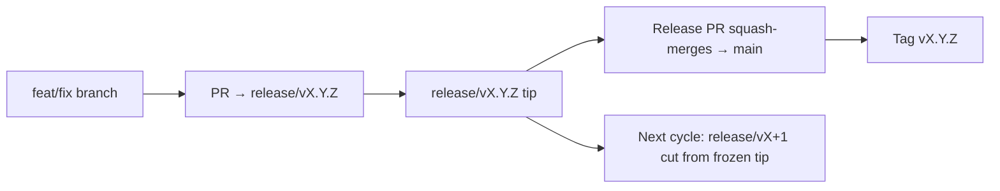

# Branching & Release Model (Igbo)

🌐 **Languages:** 🇺🇸 [English](../../../../ops/BRANCHING_MODEL.md) · 🇪🇹 [am](../../../am/docs/ops/BRANCHING_MODEL.md) · 🇸🇦 [ar](../../../ar/docs/ops/BRANCHING_MODEL.md) · 🇦🇿 [az](../../../az/docs/ops/BRANCHING_MODEL.md) · 🇧🇬 [bg](../../../bg/docs/ops/BRANCHING_MODEL.md) · 🇧🇩 [bn](../../../bn/docs/ops/BRANCHING_MODEL.md) · 🇧🇦 [bs](../../../bs/docs/ops/BRANCHING_MODEL.md) · 🇨🇿 [cs](../../../cs/docs/ops/BRANCHING_MODEL.md) · 🇩🇰 [da](../../../da/docs/ops/BRANCHING_MODEL.md) · 🇩🇪 [de](../../../de/docs/ops/BRANCHING_MODEL.md) · 🇬🇷 [el](../../../el/docs/ops/BRANCHING_MODEL.md) · 🇪🇸 [es](../../../es/docs/ops/BRANCHING_MODEL.md) · 🇪🇪 [et](../../../et/docs/ops/BRANCHING_MODEL.md) · 🇮🇷 [fa](../../../fa/docs/ops/BRANCHING_MODEL.md) · 🇫🇮 [fi](../../../fi/docs/ops/BRANCHING_MODEL.md) · 🇫🇷 [fr](../../../fr/docs/ops/BRANCHING_MODEL.md) · 🇮🇪 [ga](../../../ga/docs/ops/BRANCHING_MODEL.md) · 🇮🇳 [gu](../../../gu/docs/ops/BRANCHING_MODEL.md) · 🇳🇬 [ha](../../../ha/docs/ops/BRANCHING_MODEL.md) · 🇮🇱 [he](../../../he/docs/ops/BRANCHING_MODEL.md) · 🇮🇳 [hi](../../../hi/docs/ops/BRANCHING_MODEL.md) · 🇭🇷 [hr](../../../hr/docs/ops/BRANCHING_MODEL.md) · 🇭🇺 [hu](../../../hu/docs/ops/BRANCHING_MODEL.md) · 🇦🇲 [hy](../../../hy/docs/ops/BRANCHING_MODEL.md) · 🇮🇩 [id](../../../id/docs/ops/BRANCHING_MODEL.md) · 🇮🇹 [it](../../../it/docs/ops/BRANCHING_MODEL.md) · 🇯🇵 [ja](../../../ja/docs/ops/BRANCHING_MODEL.md) · 🇬🇪 [ka](../../../ka/docs/ops/BRANCHING_MODEL.md) · 🇰🇭 [km](../../../km/docs/ops/BRANCHING_MODEL.md) · 🇮🇳 [kn](../../../kn/docs/ops/BRANCHING_MODEL.md) · 🇰🇷 [ko](../../../ko/docs/ops/BRANCHING_MODEL.md) · 🇱🇹 [lt](../../../lt/docs/ops/BRANCHING_MODEL.md) · 🇱🇻 [lv](../../../lv/docs/ops/BRANCHING_MODEL.md) · 🇮🇳 [ml](../../../ml/docs/ops/BRANCHING_MODEL.md) · 🇮🇳 [mr](../../../mr/docs/ops/BRANCHING_MODEL.md) · 🇲🇾 [ms](../../../ms/docs/ops/BRANCHING_MODEL.md) · 🇲🇹 [mt](../../../mt/docs/ops/BRANCHING_MODEL.md) · 🇲🇲 [my](../../../my/docs/ops/BRANCHING_MODEL.md) · 🇳🇵 [ne](../../../ne/docs/ops/BRANCHING_MODEL.md) · 🇳🇱 [nl](../../../nl/docs/ops/BRANCHING_MODEL.md) · 🇳🇴 [no](../../../no/docs/ops/BRANCHING_MODEL.md) · 🇮🇳 [or](../../../or/docs/ops/BRANCHING_MODEL.md) · 🇮🇳 [pa](../../../pa/docs/ops/BRANCHING_MODEL.md) · 🇵🇭 [phi](../../../phi/docs/ops/BRANCHING_MODEL.md) · 🇵🇱 [pl](../../../pl/docs/ops/BRANCHING_MODEL.md) · 🇵🇹 [pt](../../../pt/docs/ops/BRANCHING_MODEL.md) · 🇧🇷 [pt-BR](../../../pt-BR/docs/ops/BRANCHING_MODEL.md) · 🇷🇴 [ro](../../../ro/docs/ops/BRANCHING_MODEL.md) · 🇷🇺 [ru](../../../ru/docs/ops/BRANCHING_MODEL.md) · 🇱🇰 [si](../../../si/docs/ops/BRANCHING_MODEL.md) · 🇸🇰 [sk](../../../sk/docs/ops/BRANCHING_MODEL.md) · 🇸🇮 [sl](../../../sl/docs/ops/BRANCHING_MODEL.md) · 🇷🇸 [sr](../../../sr/docs/ops/BRANCHING_MODEL.md) · 🇸🇪 [sv](../../../sv/docs/ops/BRANCHING_MODEL.md) · 🇰🇪 [sw](../../../sw/docs/ops/BRANCHING_MODEL.md) · 🇮🇳 [ta](../../../ta/docs/ops/BRANCHING_MODEL.md) · 🇮🇳 [te](../../../te/docs/ops/BRANCHING_MODEL.md) · 🇹🇭 [th](../../../th/docs/ops/BRANCHING_MODEL.md) · 🇹🇷 [tr](../../../tr/docs/ops/BRANCHING_MODEL.md) · 🇺🇦 [uk-UA](../../../uk-UA/docs/ops/BRANCHING_MODEL.md) · 🇵🇰 [ur](../../../ur/docs/ops/BRANCHING_MODEL.md) · 🇺🇿 [uz](../../../uz/docs/ops/BRANCHING_MODEL.md) · 🇻🇳 [vi](../../../vi/docs/ops/BRANCHING_MODEL.md) · 🇳🇬 [yo](../../../yo/docs/ops/BRANCHING_MODEL.md) · 🇨🇳 [zh-CN](../../../zh-CN/docs/ops/BRANCHING_MODEL.md) · 🇹🇼 [zh-TW](../../../zh-TW/docs/ops/BRANCHING_MODEL.md)

---

OmniRoute na-eji usoro mwepụta **parallel-cycle**: alaka `release/vX.Y.Z`
pụtara iche maka okirikiri na-arụ ọrụ, `main` maka ahịrị e bipụtarala, yana mkpado
`vX.Y.Z` a na-apụghị ịgbanwe mgbe e wepụtara okirikiri ahụ. Ịhụ ka commit na-abata na `release/*` _yana_ na
`main` bụ ihe a tụrụ anya ya — ọ bụghị mgbagwoju anya.

Nkọwa maka ndị na-elekọta ọrụ dị na `CLAUDE.md` (Iwu Siri Ike #21) na
[RELEASE_CHECKLIST.md](./RELEASE_CHECKLIST.md). Ibe a bụ nchịkọta ọha
maka ndị na-atụnye ụtụ.

## Na nlele ngwa ngwa

| Ref               | Ọrụ                                                                                           |
| ----------------- | --------------------------------------------------------------------------------------------- |
| `release/vX.Y.Z`  | **Okirikiri na-arụ ọrụ** — mmepe kwa ụbọchị na njikọta PR maka ụdị ahụ                        |
| `main`            | **Ahịrị e bipụtarala** — na-anata okirikiri ahụ site na squash-merge mgbe e wepụtara ụdị ahụ  |
| `vX.Y.Z` (mkpado) | **Akara mwepụta** — ntụaka “ihe e wepụtara” a na-apụghị ịgbanwe, nke e mepụtara n’oge mwepụta |



## Kedu alaka PR m kwesịrị ịtụkwasị anya na ya?

**Tụkwasị anya na alaka `release/vX.Y.Z` na-arụ ọrụ — ọ bụghị `main`.**

1. Chọta alaka `release/v*` mepere emepe nke kacha elu (ọmụmaatụ n’oge edere ihe a:
   `release/v3.8.49`).
2. Mepụta alaka site na tip ahụ (`git fetch` + checkout / rebase n’elu ya).
3. Mepee PR ahụ ka **base = `release/vX.Y.Z` ahụ**.

`main` abụghị alaka njikọta a na-eji kwa ụbọchị. PR ndị e mepere megide `main`
na-achọkarị ka a gbanwee alaka ha lekwasịrị anya tupu njikọta.

## Mkpọchi mwepụta (okirikiri ndị na-aga n’otu oge)

Mgbe a na-eme ka mwepụta kwekọọ, a na-emepe marker issue nwere label `release-freeze`.
Nke ahụ **anaghị akwụsị mmepe**:

- `release/vX.Y.Z` e kpọnwụrụ akpọnwụ bụ nke release captain maka mwepụta ahụ.
- A na-ekewapụ `release/vX+1` nke okirikiri na-esote site na tip e kpọnwụrụ akpọnwụ ka ndị na-atụnye ụtụ nwee ike ịga n’ihu
  na-etinye ọrụ.
- PR ndị ka mepere emepe nke ka na-atụkwasị anya n’alaka e kpọnwụrụ akpọnwụ kwesịrị ka **a gbanwee ebe ha lekwasịrị anya** gaa na
  alaka `release/v*` na-arụ ọrụ (nke kacha elu).

Lelee ma enwere mkpọchi mepere emepe tupu i chee na a pụrụ ijikọ alaka ịchọrọ:

```bash
gh issue list --repo diegosouzapw/OmniRoute --label release-freeze --state open
```

E dekọrọ usoro njikọta (label `queue` nke onye nwe ya → Mergify) na
[MERGE_TRAIN.md](./MERGE_TRAIN.md).

## Gịnị mere e ji nwee ma alaka ma mkpado?

| Ihe              | Ogologo ndụ            | Ebumnuche                                                                  |
| ---------------- | ---------------------- | -------------------------------------------------------------------------- |
| `release/vX.Y.Z` | Okirikiri na-aga n’ihu | Na-achịkọta PR ndị a nyochara, na-anọgide na-agafe CI, ma bụrụ base nke PR |
| Mkpado `vX.Y.Z`  | Ruo mgbe ebighị ebi    | Na-akara bits kpọmkwem e wepụtara na npm / GitHub Releases                 |

Alaka ahụ bụ ụlọ ọrụ; mkpado ahụ bụ ngwugwu e mechiri emechi. Mgbe squash-merge gachara gaa na
`main`, okirikiri na-esote na-aga n’ihu na `release/vX+1` n’echeghị ka PR mwepụta gara aga
gwụchaa.

## Dọkụmentị ndị metụtara ya

- [CONTRIBUTING.md](../../CONTRIBUTING.md) — nhazi, ule, ndepụta nyocha PR
- [RELEASE_CHECKLIST.md](./RELEASE_CHECKLIST.md) — nkwado tupu mwepụta
- [MERGE_TRAIN.md](./MERGE_TRAIN.md) — ahịrị njikọta na usoro ndabere
- [RELEASE_GREEN.md](./RELEASE_GREEN.md) — idobe tip mwepụta ka ọ na-agafe ule
