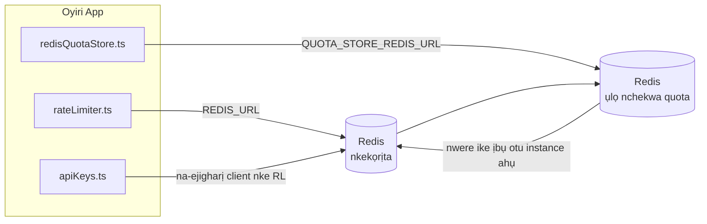

# Redis Production Configuration Guide (Igbo)

🌐 **Languages:** 🇺🇸 [English](../../../../ops/REDIS_PRODUCTION_CONFIG.md) · 🇪🇹 [am](../../../am/docs/ops/REDIS_PRODUCTION_CONFIG.md) · 🇸🇦 [ar](../../../ar/docs/ops/REDIS_PRODUCTION_CONFIG.md) · 🇦🇿 [az](../../../az/docs/ops/REDIS_PRODUCTION_CONFIG.md) · 🇧🇬 [bg](../../../bg/docs/ops/REDIS_PRODUCTION_CONFIG.md) · 🇧🇩 [bn](../../../bn/docs/ops/REDIS_PRODUCTION_CONFIG.md) · 🇧🇦 [bs](../../../bs/docs/ops/REDIS_PRODUCTION_CONFIG.md) · 🇨🇿 [cs](../../../cs/docs/ops/REDIS_PRODUCTION_CONFIG.md) · 🇩🇰 [da](../../../da/docs/ops/REDIS_PRODUCTION_CONFIG.md) · 🇩🇪 [de](../../../de/docs/ops/REDIS_PRODUCTION_CONFIG.md) · 🇬🇷 [el](../../../el/docs/ops/REDIS_PRODUCTION_CONFIG.md) · 🇪🇸 [es](../../../es/docs/ops/REDIS_PRODUCTION_CONFIG.md) · 🇪🇪 [et](../../../et/docs/ops/REDIS_PRODUCTION_CONFIG.md) · 🇮🇷 [fa](../../../fa/docs/ops/REDIS_PRODUCTION_CONFIG.md) · 🇫🇮 [fi](../../../fi/docs/ops/REDIS_PRODUCTION_CONFIG.md) · 🇫🇷 [fr](../../../fr/docs/ops/REDIS_PRODUCTION_CONFIG.md) · 🇮🇪 [ga](../../../ga/docs/ops/REDIS_PRODUCTION_CONFIG.md) · 🇮🇳 [gu](../../../gu/docs/ops/REDIS_PRODUCTION_CONFIG.md) · 🇳🇬 [ha](../../../ha/docs/ops/REDIS_PRODUCTION_CONFIG.md) · 🇮🇱 [he](../../../he/docs/ops/REDIS_PRODUCTION_CONFIG.md) · 🇮🇳 [hi](../../../hi/docs/ops/REDIS_PRODUCTION_CONFIG.md) · 🇭🇷 [hr](../../../hr/docs/ops/REDIS_PRODUCTION_CONFIG.md) · 🇭🇺 [hu](../../../hu/docs/ops/REDIS_PRODUCTION_CONFIG.md) · 🇦🇲 [hy](../../../hy/docs/ops/REDIS_PRODUCTION_CONFIG.md) · 🇮🇩 [id](../../../id/docs/ops/REDIS_PRODUCTION_CONFIG.md) · 🇮🇹 [it](../../../it/docs/ops/REDIS_PRODUCTION_CONFIG.md) · 🇯🇵 [ja](../../../ja/docs/ops/REDIS_PRODUCTION_CONFIG.md) · 🇬🇪 [ka](../../../ka/docs/ops/REDIS_PRODUCTION_CONFIG.md) · 🇰🇭 [km](../../../km/docs/ops/REDIS_PRODUCTION_CONFIG.md) · 🇮🇳 [kn](../../../kn/docs/ops/REDIS_PRODUCTION_CONFIG.md) · 🇰🇷 [ko](../../../ko/docs/ops/REDIS_PRODUCTION_CONFIG.md) · 🇱🇹 [lt](../../../lt/docs/ops/REDIS_PRODUCTION_CONFIG.md) · 🇱🇻 [lv](../../../lv/docs/ops/REDIS_PRODUCTION_CONFIG.md) · 🇮🇳 [ml](../../../ml/docs/ops/REDIS_PRODUCTION_CONFIG.md) · 🇮🇳 [mr](../../../mr/docs/ops/REDIS_PRODUCTION_CONFIG.md) · 🇲🇾 [ms](../../../ms/docs/ops/REDIS_PRODUCTION_CONFIG.md) · 🇲🇹 [mt](../../../mt/docs/ops/REDIS_PRODUCTION_CONFIG.md) · 🇲🇲 [my](../../../my/docs/ops/REDIS_PRODUCTION_CONFIG.md) · 🇳🇵 [ne](../../../ne/docs/ops/REDIS_PRODUCTION_CONFIG.md) · 🇳🇱 [nl](../../../nl/docs/ops/REDIS_PRODUCTION_CONFIG.md) · 🇳🇴 [no](../../../no/docs/ops/REDIS_PRODUCTION_CONFIG.md) · 🇮🇳 [or](../../../or/docs/ops/REDIS_PRODUCTION_CONFIG.md) · 🇮🇳 [pa](../../../pa/docs/ops/REDIS_PRODUCTION_CONFIG.md) · 🇵🇭 [phi](../../../phi/docs/ops/REDIS_PRODUCTION_CONFIG.md) · 🇵🇱 [pl](../../../pl/docs/ops/REDIS_PRODUCTION_CONFIG.md) · 🇵🇹 [pt](../../../pt/docs/ops/REDIS_PRODUCTION_CONFIG.md) · 🇧🇷 [pt-BR](../../../pt-BR/docs/ops/REDIS_PRODUCTION_CONFIG.md) · 🇷🇴 [ro](../../../ro/docs/ops/REDIS_PRODUCTION_CONFIG.md) · 🇷🇺 [ru](../../../ru/docs/ops/REDIS_PRODUCTION_CONFIG.md) · 🇱🇰 [si](../../../si/docs/ops/REDIS_PRODUCTION_CONFIG.md) · 🇸🇰 [sk](../../../sk/docs/ops/REDIS_PRODUCTION_CONFIG.md) · 🇸🇮 [sl](../../../sl/docs/ops/REDIS_PRODUCTION_CONFIG.md) · 🇷🇸 [sr](../../../sr/docs/ops/REDIS_PRODUCTION_CONFIG.md) · 🇸🇪 [sv](../../../sv/docs/ops/REDIS_PRODUCTION_CONFIG.md) · 🇰🇪 [sw](../../../sw/docs/ops/REDIS_PRODUCTION_CONFIG.md) · 🇮🇳 [ta](../../../ta/docs/ops/REDIS_PRODUCTION_CONFIG.md) · 🇮🇳 [te](../../../te/docs/ops/REDIS_PRODUCTION_CONFIG.md) · 🇹🇭 [th](../../../th/docs/ops/REDIS_PRODUCTION_CONFIG.md) · 🇹🇷 [tr](../../../tr/docs/ops/REDIS_PRODUCTION_CONFIG.md) · 🇺🇦 [uk-UA](../../../uk-UA/docs/ops/REDIS_PRODUCTION_CONFIG.md) · 🇵🇰 [ur](../../../ur/docs/ops/REDIS_PRODUCTION_CONFIG.md) · 🇺🇿 [uz](../../../uz/docs/ops/REDIS_PRODUCTION_CONFIG.md) · 🇻🇳 [vi](../../../vi/docs/ops/REDIS_PRODUCTION_CONFIG.md) · 🇳🇬 [yo](../../../yo/docs/ops/REDIS_PRODUCTION_CONFIG.md) · 🇨🇳 [zh-CN](../../../zh-CN/docs/ops/REDIS_PRODUCTION_CONFIG.md) · 🇹🇼 [zh-TW](../../../zh-TW/docs/ops/REDIS_PRODUCTION_CONFIG.md)

---

## Nchịkọta

Redis bụ **dependency dị nro, nke a na-eji ma ọ bụrụ na achọrọ** na OmniRoute — ngwa ahụ na-aga n'ihu ịrụ ọrụ nke ọma site n'iji usoro ndị nọ na ebe nchekwa
dị ka ndabere mgbe Redis adịghị. Na production, ịhazi Redis nke ọma na-ebelata latency maka ụdị ọrụ anọ
dị iche iche:

| Ụdị ọrụ                | Driver                        | Client Factory                                                               | Usoro Key                                               |
| ---------------------- | ----------------------------- | ---------------------------------------------------------------------------- | ------------------------------------------------------- |
| Ịkpa oke ọnụego        | `rateLimiter.ts`              | `getRedisClient()` — singleton `ioredis` nke a na-ebido naanị mgbe achọrọ ya | `<prefix>rl:*` windo oke ọnụego Lua‑atomic              |
| Cache auth             | `apiKeys.ts`                  | Na-eji client nke `rateLimiter` ọzọ                                          | `<prefix>auth:api_key:<sha256>` nwere TTL               |
| Ebe nchekwa quota      | `redisQuotaStore.ts`          | Singleton `getRedisClient(url)` dị iche                                      | `<prefix>quota:*` nke a pụrụ ịhazi maka instance ọ bụla |
| Circuit breaker warmup | `redisCircuitBreakerStore.ts` | Client dị iche na `circuitBreakerFactory.ts`                                 | `<prefix>warmup:cb:<connectionId>`                      |

Ụdị ọrụ anọ ahụ niile na-ekekọrịta otu prefix namespace ka OmniRoute nwee ike ibikọ na ngwa ndị ọzọ n'otu
instance Redis (dịka `127.0.0.1:6379`). Lee [Nhazi Namespace nke Key](#key-namespacing).

---

## Nhazi Dị Ugbu a (Ụkpụrụ Ndabara nke Code)

| Ntọala                             | Uru                                                           | Ebe                                                                                   |
| ---------------------------------- | ------------------------------------------------------------- | ------------------------------------------------------------------------------------- |
| env var `REDIS_URL`                | `redis://redis:6379` (compose), ọ bụghị iwu na a ga-etinye ya | `rateLimiter.ts:5`, `.env.example`                                                    |
| env var `REDIS_KEY_PREFIX`         | `omniroute:` (ndabara)                                        | `rateLimiter.ts`, `redisQuotaStore.ts`, `redisCircuitBreakerStore.ts`, `.env.example` |
| env var `QUOTA_STORE_REDIS_URL`    | dị iche, nwere ike ịdị iche na `REDIS_URL`                    | `quota/storeFactory.ts`                                                               |
| `QUOTA_STORE_DRIVER`               | `"sqlite"` (ndabara), `"redis"` ma ọ bụrụ na achọrọ           | `quota/storeFactory.ts`                                                               |
| `maxRetriesPerRequest` nke ioredis | `3`                                                           | imepụta client na `rateLimiter.ts`                                                    |
| `enableReadyCheck`                 | edoghị ya (ndabara ioredis: `true`)                           | —                                                                                     |
| `lazyConnect`                      | edoghị ya (ndabara ioredis: `false`)                          | —                                                                                     |
| `retryStrategy`                    | edoghị ya (ndabara ioredis: ntọala 200ms, exponential)        | —                                                                                     |
| TLS / password / index DB          | **ahazibeghị**                                                | —                                                                                     |
| Sentinel / Cluster                 | **ahazibeghị** — naanị standalone single-node                 | —                                                                                     |

---

## Nhazi Namespace nke Key

OmniRoute na ihe ọ bụla ọzọ na-arụ ọrụ na host na-ekekọrịta otu instance Redis. Na-enweghị namespace,
key ndị dịka `auth:api_key:<sha256>` ma ọ bụ `rl:*` nwere ike ịdakọta na key sitere na ngwa ndị ọzọ
na-eji otu Redis ahụ (instance a na-agba Redis na `127.0.0.1:6379` n'akụkụ service ndị ọzọ).

Tọọ `REDIS_KEY_PREFIX` ka ọ bụrụ string na-adịghị efu iji tinye prefix n'ihu key OmniRoute **ọ bụla**:

```bash
# .env — key OmniRoute niile ga-abụ omniroute:rl:*, omniroute:auth:*, omniroute:quota:*, omniroute:warmup:cb:*
REDIS_KEY_PREFIX=omniroute:
```

- **Ndabara:** `omniroute:` (a na-etinye ya mgbe edoghị `REDIS_KEY_PREFIX` ma ọ bụ mgbe ọ tọgbọ chakoo).
- **A na-etinye ya na:** rate limiter + cache auth (client `ioredis` ha na-ekekọrịta site na `keyPrefix`) na
  ebe nchekwa quota (`KEY_PREFIX = "${REDIS_KEY_PREFIX}quota"`) yana circuit breaker warmup
  (`KEY_PREFIX = "${REDIS_KEY_PREFIX}warmup:cb:"`).
- **Ịgbanwe prefix** mgbe key ndị ahụ adịlarị na Redis na-eme ka key ochie ghara inwe njikọ (ha na-ekubi ume
  site na TTL / LRU). Ọ dị nchebe ịgbanwe ya; migration adịghị mkpa. Naanị ihe dị iche bụ key
  circuit-breaker warmup maka connection e depụtara dị ka nke a machibidoro: a na-echekwa ya na-enweghị TTL, ya mere
  jiri `redis-cli --scan --pattern '<old-prefix>warmup:cb:*'` depụta ihe fọdụrụ wee hichapụ ha.
- **`keyPrefix` nke ioredis** na-etinye prefix na-akpaghị aka mgbe a na-ede data **ma** na-ewepụ ya mgbe a na-agụ data,
  ya mere code ngwa anaghị ahụ prefix ahụ ma ọlị.

---

## Nhazi Mmepụta A Kwadoro

### 1. Nhọrọ Connection Pool / Client (ioredis `Redis` constructor)

Koodu dị ugbu a na-emepụta otu `new Redis(url)` na-enweghị nhọrọ ahaziri iche. Maka
mgbasa mmepụta nwere ọtụtụ replica, nyefee client factory n'ime koodu ahụ ma ọ bụ kechie `getRedisClient()`:

```typescript
const redis = new Redis(REDIS_URL, {
  maxRetriesPerRequest: null, // enweghị oke retry; hapụ retryStrategy ka ọ kpebie
  enableReadyCheck: true, // chọpụta na server adịla njikere tupu ọ nabata oku
  lazyConnect: true, // ejikọtala mgbe a na-emepụta ya; chere ruo oku mbụ
  retryStrategy: (times) => {
    if (times > 10) return null; // kwụsị mgbe retry 10 gachara → jikọọ ọzọ ma emechaa
    return Math.min(times * 200, 5000); // 200ms, 400ms, …, oke 5s
  },
  enableAutoPipelining: true, // jikọta command ndị na-eme n'otu oge n'ime otu TCP write
  keepAlive: 10000, // TCP keep‑alive kwa 10s
});
```

**Ihe ndị bụ isi a ga-atụle:**

- `maxRetriesPerRequest: null` + `retryStrategy` — ka mma maka mmepụta ka Redis
  restart na-adịru nwa oge ghara ime ka request niile daa ozugbo. In-memory fallback dị na
  `checkRateLimit()` na-ejikwa ụzọ ọdịda ahụ.
- `lazyConnect: true` — na-egbochi mmalite server ịdabere na Redis ịdị njikere tupu server
  amalite ịnabata connection.
- `enableAutoPipelining: true` — na-ebelata round-trip maka nyocha rate-limit na-eme n'otu oge;
  ọ bara uru mgbe RPS karịrị 50 n'otu connection.

### 2. Nhazi Redis Server (`redis.conf`)

```
# Ebe nchekwa
maxmemory 80%                        # hapụ ohere maka OS page cache
maxmemory-policy allkeys-lru         # wepụ auth cache entry ochie mgbe nrụgide dị

# Nchekwa na-adịgide adịgide (nhọrọ — OmniRoute na-anọgide na nchekwa mgbe crash mere na-enweghị ya)
save 300 1                           # mee snapshot opekata mpe kwa nkeji 5 ma ọ bụrụ na ≥1 key gbanwere
appendonly no                        # AOF adịghị mkpa; enwere ike imepụta data ọzọ
appendfsync no                       # enweghị ibu fsync (RDB zuru oke)

# Netwọkụ
timeout 0                            # akwụsịla connection n'ihi na ọ naghị arụ ọrụ
tcp-keepalive 300                    # keep‑alive nke nkeji 5
tcp-backlog 511                      # backlog connection maka ibu na-abịa na mberede

# Arụmọrụ
hz 10                                # nke ndabara; 100 maka ọrụ chọrọ latency dị ala
activedefrag yes                     # mee defragment na-akpaghị aka mgbe fragmentation >10%
```

**Ihe a ga-atụle maka `maxmemory-policy allkeys-lru`:** Enwere ike iwepụ auth cache entry mgbe
nrụgide ebe nchekwa dị. Nke a adịghị emerụ ahụ — `setCachedApiKey` na-etinye data ọzọ mgbe niile ma ọ bụrụ na ọ hụghị ya, ebe
SQLite fallback bụ isi mmalite e ji ekpebi eziokwu. Lua script nke rate-limiter na-emepụta obere key ndị
e mere ka ha dịrị naanị obere oge.

### 3. Ntọala Docker Compose

Prod compose (`docker-compose.prod.yml`) na-eji `redis:8.6.2-alpine`. Tinye:

```yaml
redis:
  image: redis:8.6.2-alpine
  command:
    [
      "redis-server",
      "--maxmemory",
      "512mb",
      "--maxmemory-policy",
      "allkeys-lru",
      "--activedefrag",
      "yes",
      "--save",
      "300 1",
    ]
  healthcheck:
    test: ["CMD", "redis-cli", "ping"]
    interval: 10s
    timeout: 3s
    retries: 3
    start_period: 5s
```

### 4. Ihe A Ga-atụle Maka Ọtụtụ Instance / Scaling

**Otu Redis maka replica niile** — Lua script nke rate-limiter na-adabere n'otu
key space nwere ikike ikpeazụ. Iji ọtụtụ Redis instance n'azụ replica ga-eme ka atomicity
fuo ma mee ka budget okpukpu abụọ. Jiri otu Redis (ma ọ bụ Redis Sentinel cluster nwere failover) maka
replica ngwa niile.

**Ọnụọgụ connection:** Replica ngwa ọ bụla na-emepe **connection TCP 2** na Redis
(rate limiter client + quota store client). Na replica 10 → connection 20, nke ka dị
nnọọ n'okpuru oke connection 10k nke Redis instance ndabara.

### 5. Nlekota

Mee ka ihe ndị a pụta site na health-check endpoint:

```typescript
// src/app/api/monitoring/health/route.ts akpọọlarị function nke rateLimiter
// Tinye nyocha ndị metụtara Redis:
//   1. Latency PING site na ioredis .ping()
//   2. Ojiji ebe nchekwa site na INFO memory
//   3. Ọnụọgụ connection site na INFO clients
//   4. Hit rate maka maxmemory-policy (evicted_keys / keyspace_hits)
```

Metric ndị bụ isi a ga-elebara anya:

- **Key ewepụrụ / sec** — ọ bụrụ na ọ na-adịgide n'elu efu, bulie `maxmemory`
- **Client egbochiri** — uru na-abụghị efu na-egosi Lua script dị nwayọ ma ọ bụ contention dị elu
- **Connection a jụrụ** — eruola oke connection; ọ naghị adịkarị na connection 20

---

## Eserese Nhazi Sistemụ



---

## Ntụaka

| Faịlụ                              | Ebumnuche                                                                      |
| ---------------------------------- | ------------------------------------------------------------------------------ |
| `src/shared/utils/rateLimiter.ts`  | Client Redis bụ isi, script Lua maka rate-limit, na fallback dị na ebe nchekwa |
| `src/lib/db/apiKeys.ts`            | Cache nyocha njirimara — fallback Redis→SQLite                                 |
| `src/lib/quota/redisQuotaStore.ts` | Client Redis dị iche maka ụlọ nchekwa quota nke bụ nhọrọ                       |
| `src/lib/quota/storeFactory.ts`    | Na-agbanwe n'etiti driver quota `sqlite` na `redis`                            |
| `docker-compose.prod.yml`          | Container Redis maka mmepụta (image `redis:8.6.2-alpine`)                      |
| `.env.example`                     | Akwụkwọ nkọwa env vars Redis                                                   |
| `src/app/api/local/redis/`         | Route API maka nhazi container mmepe                                           |
| `bin/cli/commands/redis.mjs`       | Iwu CLI maka nhazi container mmepe                                             |
