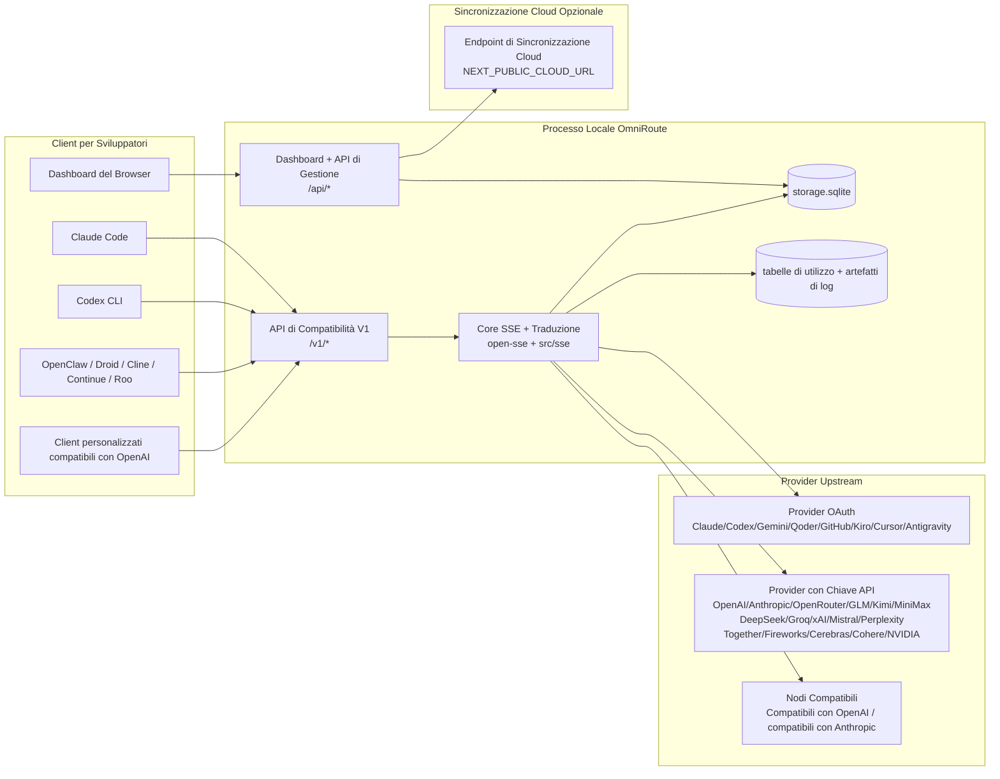
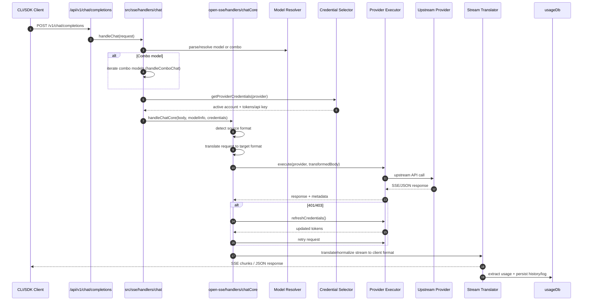
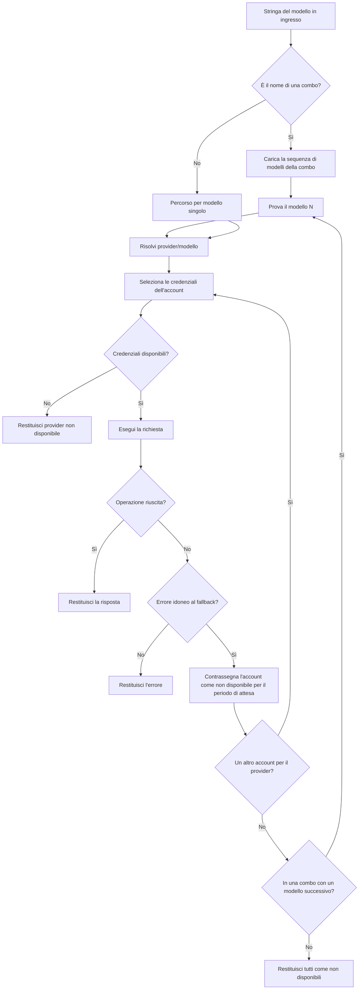
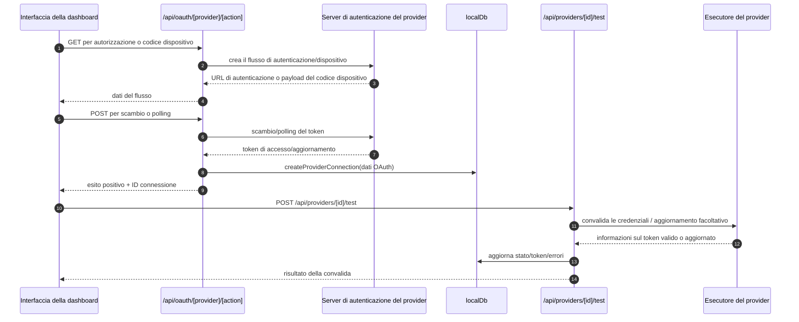
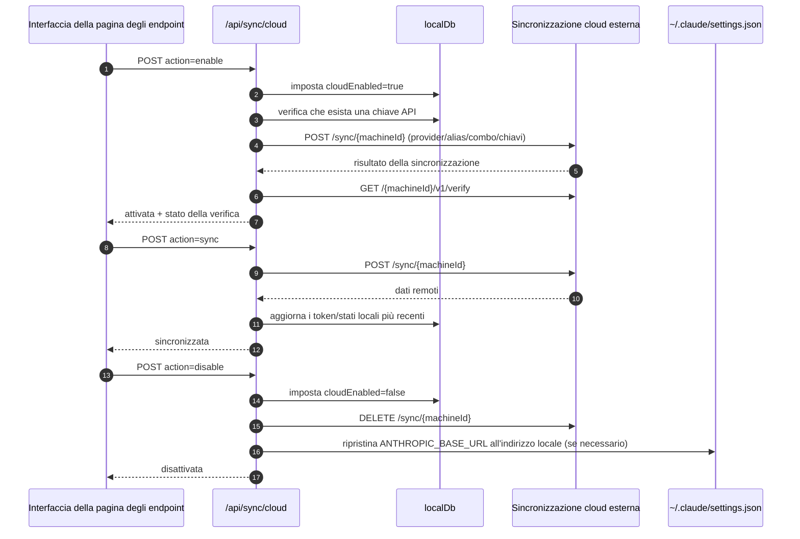
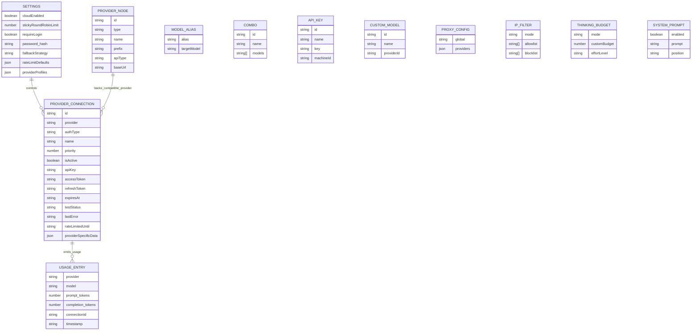
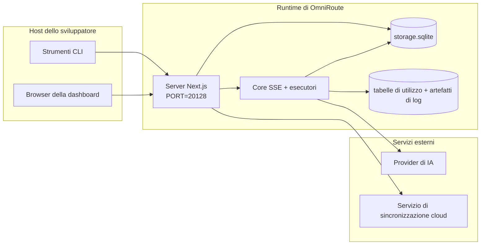

# OmniRoute Architecture (Italiano)

🌐 **Languages:** 🇺🇸 [English](../../../../architecture/ARCHITECTURE.md) · 🇪🇹 [am](../../../am/docs/architecture/ARCHITECTURE.md) · 🇸🇦 [ar](../../../ar/docs/architecture/ARCHITECTURE.md) · 🇦🇿 [az](../../../az/docs/architecture/ARCHITECTURE.md) · 🇧🇬 [bg](../../../bg/docs/architecture/ARCHITECTURE.md) · 🇧🇩 [bn](../../../bn/docs/architecture/ARCHITECTURE.md) · 🇨🇿 [cs](../../../cs/docs/architecture/ARCHITECTURE.md) · 🇩🇰 [da](../../../da/docs/architecture/ARCHITECTURE.md) · 🇩🇪 [de](../../../de/docs/architecture/ARCHITECTURE.md) · 🇬🇷 [el](../../../el/docs/architecture/ARCHITECTURE.md) · 🇪🇸 [es](../../../es/docs/architecture/ARCHITECTURE.md) · 🇪🇪 [et](../../../et/docs/architecture/ARCHITECTURE.md) · 🇮🇷 [fa](../../../fa/docs/architecture/ARCHITECTURE.md) · 🇫🇮 [fi](../../../fi/docs/architecture/ARCHITECTURE.md) · 🇫🇷 [fr](../../../fr/docs/architecture/ARCHITECTURE.md) · 🇮🇪 [ga](../../../ga/docs/architecture/ARCHITECTURE.md) · 🇮🇳 [gu](../../../gu/docs/architecture/ARCHITECTURE.md) · 🇳🇬 [ha](../../../ha/docs/architecture/ARCHITECTURE.md) · 🇮🇱 [he](../../../he/docs/architecture/ARCHITECTURE.md) · 🇮🇳 [hi](../../../hi/docs/architecture/ARCHITECTURE.md) · 🇭🇷 [hr](../../../hr/docs/architecture/ARCHITECTURE.md) · 🇭🇺 [hu](../../../hu/docs/architecture/ARCHITECTURE.md) · 🇦🇲 [hy](../../../hy/docs/architecture/ARCHITECTURE.md) · 🇮🇩 [id](../../../id/docs/architecture/ARCHITECTURE.md) · 🇳🇬 [ig](../../../ig/docs/architecture/ARCHITECTURE.md) · 🇯🇵 [ja](../../../ja/docs/architecture/ARCHITECTURE.md) · 🇬🇪 [ka](../../../ka/docs/architecture/ARCHITECTURE.md) · 🇰🇭 [km](../../../km/docs/architecture/ARCHITECTURE.md) · 🇮🇳 [kn](../../../kn/docs/architecture/ARCHITECTURE.md) · 🇰🇷 [ko](../../../ko/docs/architecture/ARCHITECTURE.md) · 🇱🇹 [lt](../../../lt/docs/architecture/ARCHITECTURE.md) · 🇱🇻 [lv](../../../lv/docs/architecture/ARCHITECTURE.md) · 🇮🇳 [ml](../../../ml/docs/architecture/ARCHITECTURE.md) · 🇮🇳 [mr](../../../mr/docs/architecture/ARCHITECTURE.md) · 🇲🇾 [ms](../../../ms/docs/architecture/ARCHITECTURE.md) · 🇲🇹 [mt](../../../mt/docs/architecture/ARCHITECTURE.md) · 🇲🇲 [my](../../../my/docs/architecture/ARCHITECTURE.md) · 🇳🇵 [ne](../../../ne/docs/architecture/ARCHITECTURE.md) · 🇳🇱 [nl](../../../nl/docs/architecture/ARCHITECTURE.md) · 🇳🇴 [no](../../../no/docs/architecture/ARCHITECTURE.md) · 🇮🇳 [or](../../../or/docs/architecture/ARCHITECTURE.md) · 🇮🇳 [pa](../../../pa/docs/architecture/ARCHITECTURE.md) · 🇵🇭 [phi](../../../phi/docs/architecture/ARCHITECTURE.md) · 🇵🇱 [pl](../../../pl/docs/architecture/ARCHITECTURE.md) · 🇵🇹 [pt](../../../pt/docs/architecture/ARCHITECTURE.md) · 🇧🇷 [pt-BR](../../../pt-BR/docs/architecture/ARCHITECTURE.md) · 🇷🇴 [ro](../../../ro/docs/architecture/ARCHITECTURE.md) · 🇷🇺 [ru](../../../ru/docs/architecture/ARCHITECTURE.md) · 🇱🇰 [si](../../../si/docs/architecture/ARCHITECTURE.md) · 🇸🇰 [sk](../../../sk/docs/architecture/ARCHITECTURE.md) · 🇸🇮 [sl](../../../sl/docs/architecture/ARCHITECTURE.md) · 🇷🇸 [sr](../../../sr/docs/architecture/ARCHITECTURE.md) · 🇸🇪 [sv](../../../sv/docs/architecture/ARCHITECTURE.md) · 🇰🇪 [sw](../../../sw/docs/architecture/ARCHITECTURE.md) · 🇮🇳 [ta](../../../ta/docs/architecture/ARCHITECTURE.md) · 🇮🇳 [te](../../../te/docs/architecture/ARCHITECTURE.md) · 🇹🇭 [th](../../../th/docs/architecture/ARCHITECTURE.md) · 🇹🇷 [tr](../../../tr/docs/architecture/ARCHITECTURE.md) · 🇺🇦 [uk-UA](../../../uk-UA/docs/architecture/ARCHITECTURE.md) · 🇵🇰 [ur](../../../ur/docs/architecture/ARCHITECTURE.md) · 🇺🇿 [uz](../../../uz/docs/architecture/ARCHITECTURE.md) · 🇻🇳 [vi](../../../vi/docs/architecture/ARCHITECTURE.md) · 🇳🇬 [yo](../../../yo/docs/architecture/ARCHITECTURE.md) · 🇨🇳 [zh-CN](../../../zh-CN/docs/architecture/ARCHITECTURE.md) · 🇹🇼 [zh-TW](../../../zh-TW/docs/architecture/ARCHITECTURE.md)

---

🌐 **Languages:** 🇺🇸 [English](../../../../architecture/ARCHITECTURE.md) · 🇪🇹 [am](../../../am/docs/architecture/ARCHITECTURE.md) · 🇸🇦 [ar](../../../ar/docs/architecture/ARCHITECTURE.md) · 🇦🇿 [az](../../../az/docs/architecture/ARCHITECTURE.md) · 🇧🇬 [bg](../../../bg/docs/architecture/ARCHITECTURE.md) · 🇧🇩 [bn](../../../bn/docs/architecture/ARCHITECTURE.md) · 🇨🇿 [cs](../../../cs/docs/architecture/ARCHITECTURE.md) · 🇩🇰 [da](../../../da/docs/architecture/ARCHITECTURE.md) · 🇩🇪 [de](../../../de/docs/architecture/ARCHITECTURE.md) · 🇬🇷 [el](../../../el/docs/architecture/ARCHITECTURE.md) · 🇪🇸 [es](../../../es/docs/architecture/ARCHITECTURE.md) · 🇪🇪 [et](../../../et/docs/architecture/ARCHITECTURE.md) · 🇮🇷 [fa](../../../fa/docs/architecture/ARCHITECTURE.md) · 🇫🇮 [fi](../../../fi/docs/architecture/ARCHITECTURE.md) · 🇫🇷 [fr](../../../fr/docs/architecture/ARCHITECTURE.md) · 🇮🇪 [ga](../../../ga/docs/architecture/ARCHITECTURE.md) · 🇮🇳 [gu](../../../gu/docs/architecture/ARCHITECTURE.md) · 🇳🇬 [ha](../../../ha/docs/architecture/ARCHITECTURE.md) · 🇮🇱 [he](../../../he/docs/architecture/ARCHITECTURE.md) · 🇮🇳 [hi](../../../hi/docs/architecture/ARCHITECTURE.md) · 🇭🇷 [hr](../../../hr/docs/architecture/ARCHITECTURE.md) · 🇭🇺 [hu](../../../hu/docs/architecture/ARCHITECTURE.md) · 🇦🇲 [hy](../../../hy/docs/architecture/ARCHITECTURE.md) · 🇮🇩 [id](../../../id/docs/architecture/ARCHITECTURE.md) · 🇳🇬 [ig](../../../ig/docs/architecture/ARCHITECTURE.md) · 🇯🇵 [ja](../../../ja/docs/architecture/ARCHITECTURE.md) · 🇬🇪 [ka](../../../ka/docs/architecture/ARCHITECTURE.md) · 🇰🇭 [km](../../../km/docs/architecture/ARCHITECTURE.md) · 🇮🇳 [kn](../../../kn/docs/architecture/ARCHITECTURE.md) · 🇰🇷 [ko](../../../ko/docs/architecture/ARCHITECTURE.md) · 🇱🇹 [lt](../../../lt/docs/architecture/ARCHITECTURE.md) · 🇱🇻 [lv](../../../lv/docs/architecture/ARCHITECTURE.md) · 🇮🇳 [ml](../../../ml/docs/architecture/ARCHITECTURE.md) · 🇮🇳 [mr](../../../mr/docs/architecture/ARCHITECTURE.md) · 🇲🇾 [ms](../../../ms/docs/architecture/ARCHITECTURE.md) · 🇲🇹 [mt](../../../mt/docs/architecture/ARCHITECTURE.md) · 🇲🇲 [my](../../../my/docs/architecture/ARCHITECTURE.md) · 🇳🇵 [ne](../../../ne/docs/architecture/ARCHITECTURE.md) · 🇳🇱 [nl](../../../nl/docs/architecture/ARCHITECTURE.md) · 🇳🇴 [no](../../../no/docs/architecture/ARCHITECTURE.md) · 🇮🇳 [or](../../../or/docs/architecture/ARCHITECTURE.md) · 🇮🇳 [pa](../../../pa/docs/architecture/ARCHITECTURE.md) · 🇵🇭 [phi](../../../phi/docs/architecture/ARCHITECTURE.md) · 🇵🇱 [pl](../../../pl/docs/architecture/ARCHITECTURE.md) · 🇵🇹 [pt](../../../pt/docs/architecture/ARCHITECTURE.md) · 🇧🇷 [pt-BR](../../../pt-BR/docs/architecture/ARCHITECTURE.md) · 🇷🇴 [ro](../../../ro/docs/architecture/ARCHITECTURE.md) · 🇷🇺 [ru](../../../ru/docs/architecture/ARCHITECTURE.md) · 🇱🇰 [si](../../../si/docs/architecture/ARCHITECTURE.md) · 🇸🇰 [sk](../../../sk/docs/architecture/ARCHITECTURE.md) · 🇸🇮 [sl](../../../sl/docs/architecture/ARCHITECTURE.md) · 🇷🇸 [sr](../../../sr/docs/architecture/ARCHITECTURE.md) · 🇸🇪 [sv](../../../sv/docs/architecture/ARCHITECTURE.md) · 🇰🇪 [sw](../../../sw/docs/architecture/ARCHITECTURE.md) · 🇮🇳 [ta](../../../ta/docs/architecture/ARCHITECTURE.md) · 🇮🇳 [te](../../../te/docs/architecture/ARCHITECTURE.md) · 🇹🇭 [th](../../../th/docs/architecture/ARCHITECTURE.md) · 🇹🇷 [tr](../../../tr/docs/architecture/ARCHITECTURE.md) · 🇺🇦 [uk-UA](../../../uk-UA/docs/architecture/ARCHITECTURE.md) · 🇵🇰 [ur](../../../ur/docs/architecture/ARCHITECTURE.md) · 🇺🇿 [uz](../../../uz/docs/architecture/ARCHITECTURE.md) · 🇻🇳 [vi](../../../vi/docs/architecture/ARCHITECTURE.md) · 🇳🇬 [yo](../../../yo/docs/architecture/ARCHITECTURE.md) · 🇨🇳 [zh-CN](../../../zh-CN/docs/architecture/ARCHITECTURE.md) · 🇹🇼 [zh-TW](../../../zh-TW/docs/architecture/ARCHITECTURE.md)

_Ultimo aggiornamento: 2026-06-28_

## Riepilogo esecutivo

OmniRoute è un gateway locale di routing per l'IA e una dashboard basata su Next.js.
Fornisce un unico endpoint compatibile con OpenAI (`/v1/*`) e instrada il traffico tra più provider upstream, offrendo traduzione, fallback, aggiornamento dei token e monitoraggio dell'utilizzo.

Funzionalità principali:

- Superficie API compatibile con OpenAI per CLI/strumenti (355 provider, 108 esecutori)
- Traduzione di richieste/risposte tra i formati dei provider
- Fallback tramite combinazioni di modelli (sequenza multi-modello)
- Passaggi di combinazione strutturati (`provider + model + connection`) con ordinamento in fase di esecuzione tramite `compositeTiers`
- Fallback a livello di account (più account per provider)
- Verifica preliminare della quota e selezione dell'account P2C basata sulla quota nel flusso di chat principale
- Gestione delle connessioni ai provider tramite OAuth + chiave API (22 moduli provider OAuth)
- Generazione di embedding tramite `/v1/embeddings` (18 provider)
- Generazione di immagini tramite `/v1/images/generations` (oltre 10 provider, oltre 20 modelli)
- Trascrizione audio tramite `/v1/audio/transcriptions` (18 provider)
- Sintesi vocale tramite `/v1/audio/speech` (24 provider integrati)
- Generazione di video tramite `/v1/videos/generations` (ComfyUI + SD WebUI)
- Generazione di musica tramite `/v1/music/generations` (ComfyUI)
- Ricerca sul Web tramite `/v1/search` (20 provider)
- Moderazione tramite `/v1/moderations`
- Riordinamento tramite `/v1/rerank`
- Analisi dei tag di ragionamento (`<think>...</think>`) per i modelli di ragionamento
- Sanitizzazione delle risposte per una rigorosa compatibilità con l'SDK OpenAI
- Normalizzazione dei ruoli (developer→system, system→user) per la compatibilità tra provider
- Conversione dell'output strutturato (json_schema → Gemini responseSchema)
- Persistenza locale per provider, chiavi, alias, combinazioni, impostazioni e prezzi (122 moduli DB)
- Monitoraggio dell'utilizzo/dei costi e registrazione delle richieste
- Sincronizzazione cloud opzionale per sincronizzare stato e dati tra più dispositivi
- Elenco di indirizzi IP consentiti/bloccati per il controllo dell'accesso alle API
- Gestione del budget di ragionamento (passthrough/automatico/personalizzato/adattivo)
- Inserimento di un prompt di sistema globale
- Monitoraggio e fingerprinting delle sessioni
- Limitazione avanzata della frequenza per account, con profili specifici per provider
- Pattern circuit breaker per la resilienza dei provider
- Protezione anti-thundering herd con blocco tramite mutex
- Cache per la deduplicazione delle richieste basata sulla firma
- Livello di dominio: regole sui costi, policy di fallback, policy di blocco
- Context Relay: riepiloghi di passaggio delle sessioni per mantenere la continuità durante la rotazione degli account
- Persistenza dello stato di dominio (cache SQLite write-through per fallback, budget, blocchi e circuit breaker)
- Motore di policy per la valutazione centralizzata delle richieste (blocco → budget → fallback)
- Telemetria delle richieste con aggregazione della latenza p50/p95/p99
- Telemetria delle destinazioni delle combinazioni e cronologia del loro stato tramite `combo_execution_key` / `combo_step_id`
- ID di correlazione (X-Request-Id) per il tracciamento end-to-end
- Registrazione degli audit di conformità con possibilità di disattivazione per ogni chiave API
- Framework di valutazione per la garanzia della qualità degli LLM
- Dashboard di integrità con stato in tempo reale dei circuit breaker dei provider
- Server MCP (110 strumenti) con 3 trasporti (stdio/SSE/Streamable HTTP)
- Server A2A (JSON-RPC 2.0 + SSE) con competenze e ciclo di vita delle attività
- Sistema di memoria (estrazione, inserimento, recupero, riepilogo)
- Sistema di competenze (registro, esecutore, sandbox, competenze integrate)
- Proxy MITM con gestione dei certificati e del DNS
- Middleware di protezione dall'iniezione di prompt
- Pipeline di compressione dei prompt con Caveman, RTK, pipeline sovrapposte, combinazioni di compressione, pacchetti linguistici e analisi
- Registro ACP (Agent Communication Protocol)
- Provider OAuth modulari (22 moduli individuali in `src/lib/oauth/providers/`)
- Script di disinstallazione/disinstallazione completa
- Azione di riparazione dell'ambiente OAuth
- Bridge WebSocket per client WS compatibili con OpenAI (`/v1/ws`)
- Gestione dei token di sincronizzazione (emissione/revoca, download del pacchetto di configurazione con controllo delle versioni tramite ETag)
- Preset del provider GLM Thinking (`glmt`) di prima classe
- Conteggio ibrido dei token (`/messages/count_tokens` lato provider con fallback sulla stima)
- Inizializzazione automatica degli alias dei modelli (oltre 30 normalizzazioni di dialetti cross-proxy all'avvio)
- Fetch in uscita sicuro con protezione SSRF, blocco degli URL privati e nuovi tentativi configurabili
- Nuovi tentativi di chat consapevoli del cooldown con `requestRetry` e `maxRetryIntervalSec` configurabili
- Convalida dell'ambiente di runtime con Zod all'avvio
- Audit di conformità v2 con paginazione, eventi CRUD dei provider e registrazione delle convalide bloccate per SSRF

Modello di runtime principale:

- Le route dell'app Next.js in `src/app/api/*` implementano sia le API della dashboard sia le API di compatibilità
- Un nucleo SSE/routing condiviso in `src/sse/*` + `open-sse/*` gestisce l'esecuzione dei provider, la traduzione, lo streaming, il fallback e l'utilizzo

## Diagrammi di riferimento

Le sorgenti Mermaid canoniche e versionate per la piattaforma v3.8.0 si trovano in
[`docs/diagrams/`](../diagrams/README.md). Due sono riprodotte di seguito a scopo orientativo;
le altre sono collegate dalle rispettive guide specifiche di dominio.


> Sorgente: [diagrams/request-pipeline.mmd](../diagrams/request-pipeline.mmd)


> Sorgente: [diagrams/resilience-3layers.mmd](../diagrams/resilience-3layers.mmd) — collegato anche da
> [RESILIENCE_GUIDE.md](./RESILIENCE_GUIDE.md) e dal riferimento alla resilienza in `CLAUDE.md`.

## Ambito e limiti

### Incluso nell'ambito

- Runtime del gateway locale
- API di gestione della dashboard
- Autenticazione dei provider e aggiornamento dei token
- Traduzione delle richieste e streaming SSE
- Stato locale + persistenza dell'utilizzo
- Orchestrazione opzionale della sincronizzazione con il cloud

### Escluso dall'ambito

- Implementazione del servizio cloud dietro `NEXT_PUBLIC_CLOUD_URL`
- SLA/piano di controllo del provider esterno al processo locale
- I file binari CLI esterni (Claude CLI, Codex CLI, ecc.)

## Superficie della dashboard (attuale)

Pagine principali in `src/app/(dashboard)/dashboard/`:

- `/dashboard` — avvio rapido + panoramica dei provider
- `/dashboard/endpoint` — proxy degli endpoint + schede degli endpoint MCP + A2A + API
- `/dashboard/providers` — connessioni e credenziali dei provider
- `/dashboard/combos` — strategie combo, modelli, generatore basato su passaggi, regole di instradamento dei modelli, ordinamento manuale persistente
- `/dashboard/auto-combo` — Auto Combo Engine: pesi dei punteggi, pacchetti di modalità, preimpostazioni della fabbrica virtuale, telemetria
- `/dashboard/costs` — aggregazione dei costi e visibilità dei prezzi
- `/dashboard/analytics` — analisi dell'utilizzo, valutazioni, stato delle destinazioni combo
- `/dashboard/limits` — controlli delle quote/dei limiti di frequenza
- `/dashboard/cli-tools` — configurazione iniziale della CLI, rilevamento del runtime, generazione della configurazione
- `/dashboard/agents` — agenti ACP rilevati + registrazione di agenti personalizzati
- `/dashboard/cloud-agents` — attività degli agenti ospitati nel cloud (Codex Cloud, Devin, Jules) e relativo ciclo di vita
- `/dashboard/skills` — registro delle competenze A2A, esecuzione in sandbox, catalogo delle competenze integrate
- `/dashboard/memory` — ispezione e recupero della memoria conversazionale persistente
- `/dashboard/webhooks` — sottoscrizioni webhook in uscita, rotazione dei segreti, statistiche dei nuovi tentativi
- `/dashboard/batch` — invio di processi batch e avanzamento
- `/dashboard/cache` — statistiche della cache read-through e di ragionamento, controlli di eliminazione
- `/dashboard/playground` — ambiente di chat interattivo con qualsiasi combo/modello configurato
- `/dashboard/changelog` — visualizzatore del registro delle modifiche nell'app (esegue il rendering di `CHANGELOG.md`)
- `/dashboard/system` — diagnostica del runtime, informazioni sulla versione, superficie di convalida dell'ambiente
- `/dashboard/onboarding` — procedura guidata di configurazione iniziale per le nuove installazioni
- `/dashboard/media` — ambiente per immagini/video/musica
- `/dashboard/search-tools` — test dei provider di ricerca e cronologia
- `/dashboard/health` — tempo di attività, circuit breaker, limiti di frequenza, sessioni con monitoraggio delle quote
- `/dashboard/logs` — log di richieste/proxy/audit/console
- `/dashboard/settings` — schede delle impostazioni di sistema (generali, instradamento, valori predefiniti delle combo, ecc.)
- `/dashboard/context/caveman` — regole di compressione Caveman, pacchetti linguistici, anteprima e modalità di output
- `/dashboard/context/rtk` — filtri RTK per l'output dei comandi, anteprima e impostazioni di sicurezza del runtime
- `/dashboard/context/combos` — pipeline di compressione denominate assegnate alle combo di instradamento
- `/dashboard/translator` — ispezione del traduttore e anteprima della conversione del formato delle richieste
- `/dashboard/audit` — browser del log di audit di conformità con paginazione e metadati strutturati
- `/dashboard/usage` — browser dell'utilizzo per richiesta collegato a `usage_history`
- `/dashboard/compression` — analisi e statistiche della compressione e assegnazione delle pipeline
- `/dashboard/api-manager` — ciclo di vita delle chiavi API e autorizzazioni dei modelli

## Contesto di Sistema ad Alto Livello



## Componenti Principali del Runtime

## 1) Livello API e Routing (Route dell'App Next.js)

Directory principali:

- `src/app/api/v1/*` e `src/app/api/v1beta/*` per le API di compatibilità
- `src/app/api/*` per le API di gestione/configurazione
- Le riscritture Next in `next.config.mjs` mappano `/v1/*` a `/api/v1/*`

Route di compatibilità importanti:

- `src/app/api/v1/chat/completions/route.ts`
- `src/app/api/v1/messages/route.ts`
- `src/app/api/v1/responses/route.ts`
- `src/app/api/v1/models/route.ts` — include modelli personalizzati con `custom: true`
- `src/app/api/v1/embeddings/route.ts` — generazione di embedding (6 provider)
- `src/app/api/v1/images/generations/route.ts` — generazione di immagini (oltre 4 provider, inclusi Antigravity/Nebius)
- `src/app/api/v1/messages/count_tokens/route.ts`
- `src/app/api/v1/providers/[provider]/chat/completions/route.ts` — chat dedicata per singolo provider
- `src/app/api/v1/providers/[provider]/embeddings/route.ts` — embedding dedicati per singolo provider
- `src/app/api/v1/providers/[provider]/images/generations/route.ts` — immagini dedicate per singolo provider
- `src/app/api/v1beta/models/route.ts`
- `src/app/api/v1beta/models/[...path]/route.ts`

Domini di gestione:

- Autenticazione/impostazioni: `src/app/api/auth/*`, `src/app/api/settings/*`
- Provider/connessioni: `src/app/api/providers*`
- Nodi dei provider: `src/app/api/provider-nodes*`
- Modelli personalizzati: `src/app/api/provider-models` (GET/POST/DELETE)
- Catalogo dei modelli: `src/app/api/models/route.ts` (GET)
- Configurazione proxy: `src/app/api/settings/proxy` (GET/PUT/DELETE) + `src/app/api/settings/proxy/test` (POST)
- OAuth: `src/app/api/oauth/*`
- Chiavi/alias/combinazioni/prezzi: `src/app/api/keys*`, `src/app/api/models/alias`, `src/app/api/combos*`, `src/app/api/pricing`
- Utilizzo: `src/app/api/usage/*`
- Sincronizzazione/cloud: `src/app/api/sync/*`, `src/app/api/cloud/*`
- Strumenti di supporto per la CLI: `src/app/api/cli-tools/*`
- Filtro IP: `src/app/api/settings/ip-filter` (GET/PUT)
- Budget di ragionamento: `src/app/api/settings/thinking-budget` (GET/PUT)
- Prompt di sistema: `src/app/api/settings/system-prompt` (GET/PUT)
- Compressione: `src/app/api/settings/compression`, `src/app/api/compression/*` e
  `src/app/api/context/*`
- Sessioni: `src/app/api/sessions` (GET)
- Limiti di frequenza: `src/app/api/rate-limits` (GET)
- Resilienza: `src/app/api/resilience` (GET/PATCH) — coda delle richieste, periodo di sospensione della connessione, circuit breaker del provider, configurazione dell'attesa del periodo di sospensione
- Reimpostazione della resilienza: `src/app/api/resilience/reset` (POST) — reimposta i circuit breaker dei provider
- Statistiche della cache: `src/app/api/cache/stats` (GET/DELETE)
- Telemetria: `src/app/api/telemetry/summary` (GET)
- Budget: `src/app/api/usage/budget` (GET/POST)
- Catene di fallback: `src/app/api/fallback/chains` (GET/POST/DELETE)
- Audit di conformità: `src/app/api/compliance/audit-log` (GET, con paginazione + metadati strutturati)
- Valutazioni: `src/app/api/evals` (GET/POST), `src/app/api/evals/[suiteId]` (GET)
- Criteri: `src/app/api/policies` (GET/POST)
- Token di sincronizzazione: `src/app/api/sync/tokens` (GET/POST), `src/app/api/sync/tokens/[id]` (GET/DELETE)
- Pacchetto di configurazione: `src/app/api/sync/bundle` (GET, snapshot con versione ETag di impostazioni/provider/combinazioni/chiavi)
- WebSocket: `src/app/api/v1/ws/route.ts` — gestore dell'upgrade per client WS compatibili con OpenAI

## 2) SSE + Core di traduzione

Moduli del flusso principale:

- Punto di ingresso: `src/sse/handlers/chat.ts`
- Orchestrazione principale: `open-sse/handlers/chatCore.ts`
- Adattatori per l'esecuzione dei provider: `open-sse/executors/*`
- Rilevamento del formato/configurazione del provider: `open-sse/services/provider.ts`
- Analisi/risoluzione del modello: `src/sse/services/model.ts`, `open-sse/services/model.ts`
- Logica di fallback degli account: `open-sse/services/accountFallback.ts`
- Registro delle traduzioni: `open-sse/translator/index.ts`
- Trasformazioni dei flussi: `open-sse/utils/stream.ts`, `open-sse/utils/streamHandler.ts`
- Estrazione/normalizzazione dell'utilizzo: `open-sse/utils/usageTracking.ts`
- Parser dei tag di ragionamento: `open-sse/utils/thinkTagParser.ts`
- Gestore degli embedding: `open-sse/handlers/embeddings.ts`
- Registro dei provider di embedding: `open-sse/config/embeddingRegistry.ts`
- Gestore della generazione di immagini: `open-sse/handlers/imageGeneration.ts`
- Registro dei provider di immagini: `open-sse/config/imageRegistry.ts`
- Sanitizzazione delle risposte: `open-sse/handlers/responseSanitizer.ts`
- Normalizzazione dei ruoli: `open-sse/services/roleNormalizer.ts`

Servizi (logica di business):

- Selezione/valutazione degli account: `open-sse/services/accountSelector.ts`
- Gestione del ciclo di vita del contesto: `open-sse/services/contextManager.ts`
- Applicazione del filtro IP: `open-sse/services/ipFilter.ts`
- Tracciamento delle sessioni: `open-sse/services/sessionManager.ts`
- Deduplicazione delle richieste: `open-sse/services/signatureCache.ts`
- Inserimento del prompt di sistema: `open-sse/services/systemPrompt.ts`
- Gestione del budget di ragionamento: `open-sse/services/thinkingBudget.ts`
- Instradamento dei modelli con caratteri jolly: `open-sse/services/wildcardRouter.ts`
- Gestione dei limiti di frequenza: `open-sse/services/rateLimitManager.ts`
- Interruttore automatico: `src/shared/utils/circuitBreaker.ts`
- Passaggio del contesto: `open-sse/services/contextHandoff.ts` — generazione e inserimento del riepilogo di passaggio per la strategia di inoltro del contesto
- Compressione: `open-sse/services/compression/*` — compressione proattiva prima della traduzione del provider;
  include regole Caveman, filtri RTK, pipeline sovrapposte, combinazioni di compressione, statistiche e convalida
- Recupero della quota Codex: `open-sse/services/codexQuotaFetcher.ts` — recupera la quota Codex per le decisioni di passaggio nell'inoltro del contesto
- Nuovi tentativi con considerazione del tempo di attesa: `src/sse/services/cooldownAwareRetry.ts` — nuovi tentativi per modello con tempi di attesa configurabili tramite `requestRetry` / `maxRetryIntervalSec`
- Fetch in uscita sicuro: `src/shared/network/safeOutboundFetch.ts` — fetch protetto di provider/modelli con protezione SSRF, blocco degli URL privati, nuovi tentativi e timeout
- Protezione degli URL in uscita: `src/shared/network/outboundUrlGuard.ts` — convalida gli URL dei provider rispetto agli intervalli CIDR privati/localhost
- Valori predefiniti delle richieste ai provider: `open-sse/services/providerRequestDefaults.ts` — valori predefiniti a livello di provider per `maxTokens`, `temperature`, `thinkingBudgetTokens`
- Costanti del provider GLM: `open-sse/config/glmProvider.ts` — modelli GLM condivisi, URL delle quote, timeout/valori predefiniti GLMT
- Upstream Antigravity: `open-sse/config/antigravityUpstream.ts` — URL di base e costanti dei percorsi di rilevamento
- Costanti del client Codex: `open-sse/config/codexClient.ts` — valori con versione dello user-agent e della versione del client
- Seed degli alias dei modelli: `src/lib/modelAliasSeed.ts` — inizializza oltre 30 alias di dialetti cross-proxy all'avvio

Moduli del livello di dominio:

- Regole di costo/budget: `src/domain/costRules.ts`
- Criterio di fallback: `src/domain/fallbackPolicy.ts`
- Risolutore delle combinazioni: `src/domain/comboResolver.ts`
- Criterio di blocco: `src/domain/lockoutPolicy.ts`
- Motore dei criteri: `src/domain/policyEngine.ts` — valutazione centralizzata di blocco → budget → fallback
- Catalogo dei codici di errore: `src/shared/constants/errorCodes.ts`
- ID della richiesta: `src/shared/utils/requestId.ts`
- Timeout del fetch: `src/shared/utils/fetchTimeout.ts`
- Telemetria delle richieste: `src/shared/utils/requestTelemetry.ts`
- Conformità/audit: `src/lib/compliance/index.ts`
- Esecutore delle valutazioni: `src/lib/evals/evalRunner.ts`
- Persistenza dello stato del dominio: `src/lib/db/domainState.ts` — operazioni CRUD SQLite per catene di fallback, budget, cronologia dei costi, stato dei blocchi e interruttori automatici

Moduli dei provider OAuth (22 file individuali in `src/lib/oauth/providers/`):

- Indice del registro: `src/lib/oauth/providers/index.ts`
- Singoli provider: `agy.ts`, `antigravity.ts`, `claude.ts`, `cline.ts`, `codebuddy-cn.ts`, `codex.ts`, `cursor.ts`, `devin-desktop.ts`, `ghe-copilot.ts`, `github.ts`, `gitlab-duo.ts`, `grok-cli-oauth.ts`, `grok-cli.ts`, `kilocode.ts`, `kimi-coding.ts`, `kiro.ts`, `openference.ts`, `qoder.ts`, `trae.ts`, `xai-oauth.ts`, `zed-hosted.ts`, `zed.ts`
- Wrapper leggero: `src/lib/oauth/providers.ts` — riesporta dai singoli moduli

## 5) Servizi integrati (v3.8.4)

OmniRoute può installare, supervisionare e instradare le richieste verso processi di strumenti IA eseguiti localmente,
denominati **servizi integrati**. Ne vengono forniti cinque: 9Router, CLIProxyAPI, Bifrost, Mux e Dario.

Livelli dell'architettura:

- **UI** (`/dashboard/providers/services`) — pagina a due schede con controlli del ciclo di vita,
  streaming in tempo reale dei log, gestione delle chiavi API e, per 9Router, UI nativa integrata tramite
  un reverse proxy interno.
- **API** (`/api/services/{name}/*`) — 11 endpoint per 9Router, 10 per CLIProxyAPI, 8 ciascuno per Bifrost / Mux / Dario,
  tutti classificati come **LOCAL_ONLY** (regola rigida n. 17). Un endpoint SSE condiviso `GET /api/services/[name]/logs`
  serve entrambi i servizi.
- **Supervisore** (`src/lib/services/`) — la classe generica `ServiceSupervisor` esegue il wrapping di
  `child_process.spawn`, mantiene un buffer circolare da 5 MB per lo streaming SSE dei log, un ciclo
  di probe di integrità, un lock atomico delle operazioni e un arresto graduale SIGTERM→SIGKILL.
  `bootstrap.ts` collega tutti i servizi configurati all'avvio del processo.
- **Provider/esecutore** (`open-sse/executors/ninerouter.ts`) — 9Router viene esposto come
  un vero provider. I modelli hanno il prefisso `9router/{sub}/{model}` e vengono sincronizzati ogni 5 minuti
  dall'endpoint `/v1/models` di 9Router.

Approfondimento: `docs/frameworks/EMBEDDED-SERVICES.md`

## Sottosistemi principali (v3.8.0)

### A. Motore Auto Combo

Auto Combo assegna dinamicamente un punteggio alle destinazioni di routing e le seleziona al momento della richiesta, anziché
basarsi sulla definizione statica di una combo. Alimenta la famiglia di prefissi modello `auto/*`.

- Punto di ingresso del motore: `open-sse/services/autoCombo/` (`autoComboEngine.ts`,
  `scoringEngine.ts`, `virtualFactory.ts`, `modePacks.ts`)
- Risolutore: `src/domain/comboResolver.ts` (rilevamento automatico del prefisso `auto/`)
- Dashboard: `/dashboard/auto-combo`
- Telemetria: tabella SQLite `auto_combo_decisions`

Funzionalità principali:

- **19 strategie di routing** (priority, weighted, fill-first, round-robin, P2C, random,
  least-used, cost-optimized, reset-aware, reset-window, headroom, strict-random,
  **auto**, lkgp, context-optimized, context-relay, **fusion**, più un percorso di fallback) —
  auto è la novità principale della v3.8.0; `fusion` (fan-out del pannello + sintesi del giudice,
  `open-sse/services/fusion.ts`) è una novità della v3.8.36.
- **Punteggio a 16 fattori**: quota, integrità, costo inverso, latenza inversa, adeguatezza all'attività e
  altri dieci. La tabella canonica dei fattori e dei relativi pesi predefiniti si trova in
  [`docs/routing/AUTO-COMBO.md`](../routing/AUTO-COMBO.md) — ripeterla qui creerebbe
  un secondo punto in cui potrebbe diventare obsoleta.
- **Factory virtuale** che materializza combo effimere quando non esiste una combo denominata corrispondente,
  ricavando i candidati dalle connessioni attive e integre dei provider.
- **Prefissi automatici**: `auto/coding`, `auto/cheap`, `auto/fast`, `auto/offline`,
  `auto/smart`, `auto/lkgp` — ciascuno supportato da un profilo di pesi ottimizzato.
- **6 pacchetti di modalità**: `ship-fast`, `cost-saver`, `quality-first`, `offline-friendly`,
  `reliability-first` e `chaos-mode` — configurazioni predefinite dei pesi richiamabili dalla
  dashboard. (Da non confondere con i prefissi `auto/*` sopra indicati, che sono
  varianti applicate al momento della richiesta.)

Per tutti i dettagli algoritmici (formule dei fattori, ottimizzazione dei pesi), consultare
[`docs/routing/AUTO-COMBO.md`](../routing/AUTO-COMBO.md).

### B. Agenti cloud

Cloud Agents racchiude piattaforme di terze parti per agenti di programmazione ospitati (Codex Cloud, Devin,
Jules) dietro un ciclo di vita uniforme delle attività supportato da database. Tutti gli endpoint per la creazione/ispezione
delle attività richiedono l'autenticazione di gestione.

- Radice del modulo: `src/lib/cloudAgent/` (`baseAgent.ts`, `registry.ts`, `api.ts`,
  `types.ts`, `db.ts`, oltre alle sottodirectory di ciascun agente in `agents/`)
- Implementazioni per agente: `agents/codex/`, `agents/devin/`, `agents/jules/`
- Endpoint pubblici: `/api/v1/agents/tasks/*` (elenco/creazione/recupero/annullamento)
- Endpoint di gestione: `/api/cloud/*` (provisioning, stato, elaborazione in batch)
- Dashboard: `/dashboard/cloud-agents`
- Archiviazione: tabella `cloud_agent_tasks`

Per i dettagli specifici sul provisioning e su OAuth di ciascun agente, consultare
[`docs/frameworks/CLOUD_AGENT.md`](../frameworks/CLOUD_AGENT.md).

### C. Guardrail

Il modulo dei guardrail è un livello middleware ricaricabile a caldo che analizza richieste
e risposte alla ricerca di PII, prompt injection e contenuti visivi non sicuri. Le violazioni
interrompono immediatamente la richiesta con HTTP **503** e un codice di errore strutturato, consentendo
ai chiamanti a valle di riprovare o seguire un percorso alternativo.

- Radice del modulo: `src/lib/guardrails/` (`base.ts`, `registry.ts`, `piiMasker.ts`,
  `promptInjection.ts`, `visionBridge.ts`, `visionBridgeHelpers.ts`)
- Ricaricamento a caldo: il registro monitora le modifiche alla configurazione e ricostruisce la catena sul posto
- Punti di integrazione: ingresso dell'handler della chat, handler della generazione di immagini, sanitizzatore delle risposte
- Contratto HTTP: le violazioni vengono restituite come `503` con `error.code = "GUARDRAIL_VIOLATION"`

Per la creazione di set di regole e l'ottimizzazione delle soglie, consultare
[`docs/security/GUARDRAILS.md`](../security/GUARDRAILS.md).

### D. Livello di dominio

Il namespace `src/domain/` centralizza le decisioni relative alle policy, in modo che gli handler delle route non
debbano comporre autonomamente la logica di blocco/budget/fallback.

- Motore delle policy: `src/domain/policyEngine.ts` — unico punto di ingresso per
  la valutazione precedente all'esecuzione (ordine: blocco → budget → fallback)
- Regole dei costi: `src/domain/costRules.ts`
- Policy di fallback: `src/domain/fallbackPolicy.ts`
- Policy di blocco: `src/domain/lockoutPolicy.ts`
- Routing basato su tag: `src/domain/tagRouter.ts`
- Risolutore delle combo: `src/domain/comboResolver.ts` — risolve i nomi delle combo, i prefissi auto/\*
  e le destinazioni modello con caratteri jolly in piani di esecuzione concreti
- Joiner delle regole di connessione/modello: `src/domain/connectionModelRules.ts`
- Snapshot della disponibilità dei modelli: `src/domain/modelAvailability.ts`
- Monitoraggio della scadenza dei provider: `src/domain/providerExpiration.ts`
- Cache delle quote: `src/domain/quotaCache.ts`
- Stato di degradazione: `src/domain/degradation.ts`
- Audit della configurazione: `src/domain/configAudit.ts`
- Generatore dei metadati di risposta OmniRoute: `src/domain/omnirouteResponseMeta.ts`
- Sottosistema di valutazione: `src/domain/assessment/` — processi di valutazione periodici

### E. Pipeline di autorizzazione

La pipeline di autorizzazione classifica ogni richiesta in arrivo e applica la
catena di policy appropriata prima dell'inoltro.

- Punto di ingresso della pipeline: `src/server/authz/pipeline.ts`
- Classificatore delle richieste: `src/server/authz/classify.ts` — distingue le route pubbliche
  di compatibilità dalle route di gestione
- Inventario delle route pubbliche: `src/shared/constants/publicApiRoutes.ts`
- Policy: `src/server/authz/policies/` — predicati componibili
  (`requireApiKey`, `requireManagement`, `requireFreshAuth`, ecc.)
- Utilità per gli header: `src/server/authz/headers.ts`
- Helper per le asserzioni: `src/server/authz/assertAuth.ts`
- Contesto della richiesta: `src/server/authz/context.ts`

Le route pubbliche e quelle di gestione sono separate da un confine rigido: le API
di agent/cooldown e le modifiche ai provider richiedono l'autenticazione di gestione
(HTTP 401 se assente).

Per le regole complete di classificazione delle route, consultare
[`docs/architecture/AUTHZ_GUIDE.md`](./AUTHZ_GUIDE.md).

### F. FSM del workflow e router sensibile ai task

Un router basato su una macchina a stati finiti, posto al di sopra della selezione
delle combo, indirizza il traffico in base alla fase rilevata del workflow
(pianificazione, esecuzione, revisione) e all'affinità con i task in background.

- FSM del workflow: `open-sse/services/workflowFSM.ts`
- Router sensibile ai task: `open-sse/services/taskAwareRouter.ts`
- Rilevatore dei task in background: `open-sse/services/backgroundTaskDetector.ts`
- Classificatore degli intenti: `open-sse/services/intentClassifier.ts`

Le transizioni della FSM contribuiscono al punteggio di Auto Combo, favorendo modelli
più economici per i task in background/di automazione e modelli più potenti per i
turni interattivi di pianificazione/revisione.

### G. Resilienza specifica per provider

Diversi provider includono moduli dedicati alla resilienza e alla modalità stealth,
che si appoggiano ai livelli globali di circuit breaker / cooldown della connessione /
blocco del modello:

- Motore Antigravity 429: `open-sse/services/antigravity429Engine.ts` (ruota
  l'identità, ripulisce gli header delle risposte, gestisce il monitoraggio di crediti/versioni tramite
  `antigravityCredits.ts`, `antigravityHeaderScrub.ts`, `antigravityHeaders.ts`,
  `antigravityIdentity.ts`, `antigravityVersion.ts`)
- Policy delle quote di ModelScope: `open-sse/services/modelscopePolicy.ts`
- CCH (Compatibility Channel Handshake) di Claude Code: `open-sse/services/claudeCodeCCH.ts`,
  oltre a `claudeCodeCompatible.ts`, `claudeCodeConstraints.ts`, `claudeCodeExtraRemap.ts`,
  `claudeCodeToolRemapper.ts`
- Modellazione dell'impronta digitale di Claude Code: `open-sse/services/claudeCodeFingerprint.ts`
- Offuscamento di Claude Code: `open-sse/services/claudeCodeObfuscation.ts`

Per il playbook stealth completo e le indicazioni operative, consultare
`docs/security/STEALTH_GUIDE.md` (git; non compilato in `/docs`).

### H. Webhook, cache del ragionamento, cache di lettura

- **Webhook** — invio in uscita degli eventi relativi a provider/account/task.
  - Dispatcher: `src/lib/webhookDispatcher.ts`
  - Archiviazione: tabella SQLite `webhooks` (tramite `src/lib/db/webhooks.ts`)
  - Dashboard: `/dashboard/webhooks` (sottoscrizioni, segreti, cronologia dei tentativi)
  - Per la tassonomia degli eventi e la semantica dei tentativi, consultare [`docs/frameworks/WEBHOOKS.md`](../frameworks/WEBHOOKS.md).
- **Cache del ragionamento** — blocchi di ragionamento riproducibili per i provider che emettono
  token di pensiero (Claude, GLMT, ecc.), in modo che i turni consecutivi possano evitare di ripetere il ragionamento.
  - Livello DB: `src/lib/db/reasoningCache.ts`
  - Livello di servizio: `open-sse/services/reasoningCache.ts`
  - Per la semantica della riproduzione, consultare [`docs/routing/REASONING_REPLAY.md`](../routing/REASONING_REPLAY.md).
- **Cache di lettura** — cache delle risposte di breve durata, indicizzata per firma e usata per
  accorpare tentativi identici provenienti da SDK upstream difettosi.
  - Livello DB: `src/lib/db/readCache.ts`
  - Endpoint delle statistiche: `GET /api/cache/stats`, dashboard disponibile in `/dashboard/cache`

## 3) Livello di persistenza

DB di stato principale (SQLite):

- Infrastruttura di base: `src/lib/db/core.ts` (better-sqlite3, migrazioni, WAL)
- Accesso al DB: importare direttamente i moduli specifici `src/lib/db/*` (il precedente barrel `localDb.ts` è stato rimosso)
- file: `${DATA_DIR}/storage.sqlite` (oppure `$XDG_CONFIG_HOME/omniroute/storage.sqlite` quando impostato, altrimenti `~/.omniroute/storage.sqlite`)
- entità (tabelle + namespace KV): providerConnections, providerNodes, modelAliases, combos, apiKeys, settings, pricing, **customModels**, **proxyConfig**, **ipFilter**, **thinkingBudget**, **systemPrompt**

Persistenza dell'utilizzo:

- facciata: `src/lib/usageDb.ts` (moduli scomposti in `src/lib/usage/*`)
- Tabelle SQLite in `storage.sqlite`: `usage_history`, `call_logs`, `proxy_logs`
- gli artefatti di file opzionali vengono mantenuti per compatibilità/debug (`${DATA_DIR}/log.txt`, `${DATA_DIR}/call_logs/`, `<repo>/logs/...`)
- i file JSON legacy vengono migrati a SQLite dalle migrazioni di avvio, se presenti

DB dello stato dei domini (SQLite):

- `src/lib/db/domainState.ts` — operazioni CRUD per lo stato dei domini
- Tabelle (create in `src/lib/db/core.ts`): `domain_fallback_chains`, `domain_budgets`, `domain_cost_history`, `domain_lockout_state`, `domain_circuit_breakers`
- Pattern di cache write-through: le Map in memoria sono autorevoli durante l'esecuzione; le modifiche vengono scritte in modo sincrono su SQLite; lo stato viene ripristinato dal DB dopo un avvio a freddo

## 4) Superfici di autenticazione + sicurezza

- Autenticazione tramite cookie della dashboard: `src/proxy.ts`, `src/app/api/auth/login/route.ts`
- Generazione/verifica delle chiavi API: `src/shared/utils/apiKey.ts`
- Segreti dei provider memorizzati nelle voci `providerConnections`
- Supporto per proxy in uscita tramite `open-sse/utils/proxyFetch.ts` (variabili di ambiente) e `open-sse/utils/networkProxy.ts` (configurabile per singolo provider o globalmente)
- Protezione SSRF / URL in uscita: `src/shared/network/outboundUrlGuard.ts` — blocca gli intervalli privati/loopback/link-local per tutte le chiamate ai provider
- Validazione dell'ambiente di runtime: `src/lib/env/runtimeEnv.ts` — schema Zod per tutte le variabili di ambiente, con errori/avvisi visualizzati all'avvio
- Token di sincronizzazione: `src/lib/db/syncTokens.ts` — token con ambito limitato per gli endpoint di download dei bundle di configurazione; supportati dalla tabella SQLite `sync_tokens` (migrazione `024_create_sync_tokens.sql`)
- Autenticazione dell'handshake WebSocket: `src/lib/ws/handshake.ts` — convalida le richieste di upgrade WS tramite chiave API o cookie di sessione

## 5) Sincronizzazione cloud

- Inizializzazione dello scheduler: `src/lib/initCloudSync.ts`, `src/shared/services/initializeCloudSync.ts`, `src/shared/services/modelSyncScheduler.ts`
- Attività periodica: `src/shared/services/cloudSyncScheduler.ts`
- Attività periodica: `src/shared/services/modelSyncScheduler.ts`
- Route di controllo: `src/app/api/sync/cloud/route.ts`

## Ciclo di vita della richiesta (`/v1/chat/completions`)



## Flusso di fallback per combo + account



Le decisioni di fallback sono gestite da `open-sse/services/accountFallback.ts` utilizzando i codici di stato e l'analisi euristica dei messaggi di errore. L'instradamento delle combo aggiunge un ulteriore controllo: gli errori 400 specifici del provider, come gli errori upstream relativi al blocco dei contenuti e alla convalida dei ruoli, vengono trattati come errori locali al modello, in modo che le destinazioni successive della combo possano comunque essere eseguite.

## Ciclo di vita dell'onboarding OAuth e dell'aggiornamento dei token



L'aggiornamento durante il traffico in tempo reale viene eseguito all'interno di `open-sse/handlers/chatCore.ts` tramite il metodo `refreshCredentials()` dell'esecutore.

## Ciclo di vita della sincronizzazione cloud (attivazione / sincronizzazione / disattivazione)



La sincronizzazione periodica viene attivata da `CloudSyncScheduler` quando il cloud è abilitato.

## Modello dei dati e mappa di archiviazione



File di archiviazione fisica:

- DB di runtime principale: `${DATA_DIR}/storage.sqlite`
- righe del log delle richieste: `${DATA_DIR}/log.txt` (artefatto di compatibilità/debug)
- archivi strutturati dei payload delle chiamate: `${DATA_DIR}/call_logs/`
- sessioni di debug opzionali del traduttore/delle richieste: `<repo>/logs/...`

## Topologia di distribuzione



## Mappatura dei moduli (critica per le decisioni)

### Moduli delle route e delle API

- `src/app/api/v1/*`, `src/app/api/v1beta/*`: API di compatibilità
- `src/app/api/v1/providers/[provider]/*`: route dedicate per ciascun provider (chat, embedding, immagini)
- `src/app/api/providers*`: CRUD, convalida e test dei provider
- `src/app/api/provider-nodes*`: gestione dei nodi compatibili personalizzati
- `src/app/api/provider-models`: gestione dei modelli personalizzati (CRUD)
- `src/app/api/models/route.ts`: API del catalogo dei modelli (alias + modelli personalizzati)
- `src/app/api/oauth/*`: flussi OAuth/device-code
- `src/app/api/keys*`: ciclo di vita delle chiavi API locali
- `src/app/api/models/alias`: gestione degli alias
- `src/app/api/combos*`: gestione delle combinazioni di fallback
- `src/app/api/pricing`: sostituzioni dei prezzi per il calcolo dei costi
- `src/app/api/settings/proxy`: configurazione del proxy (GET/PUT/DELETE)
- `src/app/api/settings/proxy/test`: test della connettività del proxy in uscita (POST)
- `src/app/api/usage/*`: API di utilizzo e dei log
- `src/app/api/sync/*` + `src/app/api/cloud/*`: sincronizzazione cloud e utilità rivolte al cloud
- `src/app/api/cli-tools/*`: strumenti locali per la scrittura/verifica della configurazione CLI
- `src/app/api/settings/ip-filter`: elenco consentiti/elenco bloccati degli IP (GET/PUT)
- `src/app/api/settings/thinking-budget`: configurazione del budget dei token di ragionamento (GET/PUT)
- `src/app/api/settings/system-prompt`: prompt di sistema globale (GET/PUT)
- `src/app/api/settings/compression`: impostazioni globali di compressione (GET/PUT)
- `src/app/api/compression/*`: anteprima della compressione, metadati delle regole e pacchetti linguistici
- `src/app/api/context/caveman/config`: alias delle impostazioni Caveman (GET/PUT)
- `src/app/api/context/rtk/*`: configurazione RTK, catalogo dei filtri, endpoint di test e recupero dell'output non elaborato
- `src/app/api/context/combos*`: CRUD delle combinazioni di compressione e assegnazioni delle combinazioni di routing
- `src/app/api/context/analytics`: alias delle analisi di compressione
- `src/app/api/sessions`: elenco delle sessioni attive (GET)
- `src/app/api/rate-limits`: stato dei limiti di frequenza per account (GET)
- `src/app/api/sync/tokens`: CRUD dei token di sincronizzazione (GET/POST)
- `src/app/api/sync/tokens/[id]`: recupero/eliminazione del token di sincronizzazione (GET/DELETE)
- `src/app/api/sync/bundle`: download del bundle di configurazione (GET, controllo delle versioni tramite ETag)
- `src/app/api/v1/ws`: gestore dell'upgrade WebSocket per client WS compatibili con OpenAI

### Core di routing ed esecuzione

- `src/sse/handlers/chat.ts`: analisi della richiesta, gestione delle combinazioni, ciclo di selezione dell'account
- `open-sse/handlers/chatCore.ts`: traduzione, invio all'esecutore, gestione dei nuovi tentativi/aggiornamenti, configurazione dello stream
- `open-sse/executors/*`: comportamento di rete e di formato specifico del provider

### Registro di traduzione e convertitori di formato

- `open-sse/translator/index.ts`: registro e orchestrazione dei traduttori
- Traduttori delle richieste: `open-sse/translator/request/*` (9 moduli — `antigravity-to-openai`, `claude-to-gemini`, `claude-to-openai`, `gemini-to-openai`, `openai-responses`, `openai-to-claude`, `openai-to-cursor`, `openai-to-gemini`, `openai-to-kiro`)
- Traduttori delle risposte: `open-sse/translator/response/*` (11 moduli — `claude-to-openai`, `cursor-to-openai`, `gemini-to-claude`, `gemini-to-openai`, `kiro-to-openai`, `openai-responses`, `openai-to-antigravity`, `openai-to-claude`, `openai-to-gemini`, `openai-to-gemini-sse`, `responsesToolItem`)
- Utilità: `open-sse/translator/helpers/*` (12 moduli — `claudeHelper`, `geminiHelper`, `geminiToolsSanitizer`, `jsonUtil`, `markdownBoundary`, `maxTokensHelper`, `openaiHelper`, `responsesApiHelper`, `schemaCoercion`, `strictSystemHoist`, `toolCallHelper`, `toolCallShim`)
- Costanti di formato: `open-sse/translator/formats.ts`
- Bootstrap e registro: `open-sse/translator/bootstrap.ts`, `open-sse/translator/registry.ts`
- Utilità per i formati delle immagini: `open-sse/translator/image/`

### Persistenza

- `src/lib/db/*`: configurazione/stato persistenti e persistenza del dominio su SQLite
- `src/lib/db/*`: importa direttamente i moduli specifici — nessun barrel (il precedente livello di riesportazione `localDb.ts` è stato rimosso)
- `src/lib/usageDb.ts`: facade della cronologia di utilizzo/dei log delle chiamate basata sulle tabelle SQLite

## Copertura degli executor dei provider (pattern Strategy)

Ogni provider dispone di un executor specializzato che estende `BaseExecutor` (in `open-sse/executors/base.ts`), il quale fornisce la costruzione degli URL, la creazione degli header, i tentativi ripetuti con backoff esponenziale, gli hook per l'aggiornamento delle credenziali e il metodo di orchestrazione `execute()`.

| Executor                  | Provider                                                                                                                                                    | Gestione speciale                                                                        |
| ------------------------- | ----------------------------------------------------------------------------------------------------------------------------------------------------------- | ---------------------------------------------------------------------------------------- |
| `DefaultExecutor`         | OpenAI, Claude, Gemini, Qwen, OpenRouter, GLM, Kimi, MiniMax, DeepSeek, Groq, xAI, Mistral, Perplexity, Together, Fireworks, Cerebras, Cohere, NVIDIA, ecc. | Configurazione dinamica di URL/header per ciascun provider                               |
| `AntigravityExecutor`     | Google Antigravity                                                                                                                                          | ID di progetto/sessione personalizzati, analisi di Retry-After, offuscamento 429         |
| `AzureOpenAIExecutor`     | Azure OpenAI                                                                                                                                                | Instradamento basato sul deployment, applicazione della query api-version                |
| `BlackboxWebExecutor`     | Blackbox AI (modalità web)                                                                                                                                  | Reverse engineering della sessione web con emulazione del fingerprint TLS                |
| `ClaudeIdentityExecutor`  | Claude.ai (percorso CCH)                                                                                                                                    | Pipeline di vincoli e rimappatura degli strumenti, modellazione del fingerprint          |
| `CliProxyApiExecutor`     | Provider compatibili con CLIProxyAPI                                                                                                                        | Autenticazione e gestione del protocollo personalizzate                                  |
| `CloudflareAiExecutor`    | Cloudflare Workers AI                                                                                                                                       | Inserimento dell'ID account, monitoraggio dell'utilizzo basato su Neurons                |
| `CodexExecutor`           | OpenAI Codex                                                                                                                                                | Inserisce istruzioni di sistema, impone il livello di ragionamento                       |
| `ChatGptWebCodexExecutor` | ChatGPT Web (Codex)                                                                                                                                         | Bridge dell'API Responses tramite sessione browser con associazione thread/turno         |
| `CommandCodeExecutor`     | Command Code                                                                                                                                                | OAuth e rotazione degli header per sessione                                              |
| `CursorExecutor`          | Cursor IDE                                                                                                                                                  | Protocollo ConnectRPC, codifica Protobuf, firma delle richieste tramite checksum         |
| `DevinCliExecutor`        | Devin CLI                                                                                                                                                   | Bridge del ciclo di vita delle attività Devin tramite il modulo agente cloud             |
| `GithubExecutor`          | GitHub Copilot                                                                                                                                              | Aggiornamento del token Copilot, header che emulano VSCode                               |
| `GitlabExecutor`          | GitLab Duo                                                                                                                                                  | OAuth GitLab e instradamento limitato al progetto                                        |
| `GlmExecutor`             | Z.AI GLM (incluso il preset `glmt`)                                                                                                                         | Gestione del budget di ragionamento, costanti del preset GLMT                            |
| `GrokWebExecutor`         | xAI Grok web                                                                                                                                                | Reverse engineering della sessione web, selezione della modalità (ragionamento/standard) |
| `KieExecutor`             | KIE                                                                                                                                                         | Emissione di token personalizzati con riferimenti di sessione a rotazione                |
| `KiroExecutor`            | AWS CodeWhisperer/Kiro                                                                                                                                      | Conversione del formato binario AWS EventStream → SSE                                    |
| `MuseSparkWebExecutor`    | Muse Spark (web)                                                                                                                                            | Reverse engineering della sessione web con bridge per messaggi immagine                  |
| `NlpCloudExecutor`        | NLP Cloud                                                                                                                                                   | Struttura del corpo della richiesta specifica del provider                               |
| `OpenCodeExecutor`        | OpenCode                                                                                                                                                    | Configurazione del provider compatibile con AI SDK                                       |
| `PerplexityWebExecutor`   | Perplexity web                                                                                                                                              | Reverse engineering della sessione web per la continuazione della chat                   |
| `PetalsExecutor`          | Inferenza distribuita Petals                                                                                                                                | Instradamento decentralizzato nello swarm                                                |
| `PollinationsExecutor`    | Pollinations AI                                                                                                                                             | Nessuna chiave API richiesta, richieste soggette a limitazione di frequenza              |
| `QoderExecutor`           | Qoder AI                                                                                                                                                    | Supporto PAT e OAuth, piano gratuito multimodello                                        |
| `VertexExecutor`          | Google Vertex AI                                                                                                                                            | Autenticazione con account di servizio, endpoint basati sulla regione                    |
| `DevinDesktopExecutor`    | Devin Desktop                                                                                                                                               | Chiave API importata e streaming della chat tramite Connect-protobuf                     |

Tutti gli altri provider (inclusi i nodi compatibili personalizzati) utilizzano il `DefaultExecutor`.

## Matrice di compatibilità dei provider

> **Nota:** La matrice seguente è un campione rappresentativo dei 351 provider registrati in
> OmniRoute v3.8.0. Per l'elenco canonico e aggiornato continuamente, consultare
> [`docs/reference/PROVIDER_REFERENCE.md`](../reference/PROVIDER_REFERENCE.md) (generato automaticamente) oppure la fonte
> ufficiale in `src/shared/constants/providers.ts` (convalidata da Zod al caricamento).

| Provider               | Formato          | Autenticazione           | Streaming        | Non streaming | Rinnovo token | API di utilizzo         |
| ---------------------- | ---------------- | ------------------------ | ---------------- | ------------- | ------------- | ----------------------- |
| Claude                 | claude           | Chiave API / OAuth       | ✅               | ✅            | ✅            | ⚠️ Solo amministratori  |
| Gemini                 | gemini           | Chiave API / OAuth       | ✅               | ✅            | ✅            | ⚠️ Console cloud        |
| Antigravity            | antigravity      | OAuth                    | ✅               | ✅            | ✅            | ✅ API quota completa   |
| OpenAI                 | openai           | Chiave API               | ✅               | ✅            | ❌            | ❌                      |
| Codex                  | openai-responses | OAuth                    | ✅ obbligatorio  | ❌            | ✅            | ✅ Limiti di frequenza  |
| ChatGPT Web (Codex)    | openai-responses | Sessione del browser     | ✅ obbligatorio  | ❌            | ❌            | ❌                      |
| GitHub Copilot         | openai           | OAuth + token Copilot    | ✅               | ✅            | ✅            | ✅ Snapshot della quota |
| Cursor                 | cursor           | Checksum personalizzato  | ✅               | ✅            | ❌            | ❌                      |
| Kiro                   | kiro             | AWS SSO OIDC             | ✅ (EventStream) | ❌            | ✅            | ✅ Limiti di utilizzo   |
| Qoder                  | openai           | OAuth / PAT              | ✅               | ✅            | ✅            | ⚠️ Per richiesta        |
| Kilo Code              | openai           | OAuth                    | ✅               | ✅            | ✅            | ❌                      |
| Cline                  | openai           | OAuth                    | ✅               | ✅            | ✅            | ❌                      |
| Kimi Coding            | openai           | OAuth                    | ✅               | ✅            | ✅            | ❌                      |
| OpenRouter             | openai           | Chiave API               | ✅               | ✅            | ❌            | ❌                      |
| GLM/Kimi/MiniMax       | claude           | Chiave API               | ✅               | ✅            | ❌            | ❌                      |
| DeepSeek               | openai           | Chiave API               | ✅               | ✅            | ❌            | ❌                      |
| Groq                   | openai           | Chiave API               | ✅               | ✅            | ❌            | ❌                      |
| xAI (Grok)             | openai           | Chiave API               | ✅               | ✅            | ❌            | ❌                      |
| Mistral                | openai           | Chiave API               | ✅               | ✅            | ❌            | ❌                      |
| Perplexity             | openai           | Chiave API               | ✅               | ✅            | ❌            | ❌                      |
| Together AI            | openai           | Chiave API               | ✅               | ✅            | ❌            | ❌                      |
| Fireworks AI           | openai           | Chiave API               | ✅               | ✅            | ❌            | ❌                      |
| Cerebras               | openai           | Chiave API               | ✅               | ✅            | ❌            | ❌                      |
| Cohere                 | openai           | Chiave API               | ✅               | ✅            | ❌            | ❌                      |
| NVIDIA NIM             | openai           | Chiave API               | ✅               | ✅            | ❌            | ❌                      |
| Cloudflare AI          | openai           | Token API + ID account   | ✅               | ✅            | ❌            | ❌                      |
| Pollinations           | openai           | Nessuna (senza chiave)   | ✅               | ✅            | ❌            | ❌                      |
| Scaleway AI            | openai           | Chiave API               | ✅               | ✅            | ❌            | ❌                      |
| LongCat                | openai           | Chiave API               | ✅               | ✅            | ❌            | ❌                      |
| Ollama Cloud           | openai           | Chiave API (facoltativa) | ✅               | ✅            | ❌            | ❌                      |
| HuggingFace            | openai           | Chiave API               | ✅               | ✅            | ❌            | ❌                      |
| Nebius                 | openai           | Chiave API               | ✅               | ✅            | ❌            | ❌                      |
| SiliconFlow            | openai           | Chiave API               | ✅               | ✅            | ❌            | ❌                      |
| Hyperbolic             | openai           | Chiave API               | ✅               | ✅            | ❌            | ❌                      |
| Vertex AI              | gemini           | Account di servizio      | ✅               | ✅            | ✅            | ⚠️ Console cloud        |
| Command Code           | openai           | OAuth                    | ✅               | ✅            | ✅            | ⚠️ Per richiesta        |
| Z.AI / GLM             | openai           | Chiave API / OAuth       | ✅               | ✅            | ❌            | ❌                      |
| GLMT (preimpostazione) | claude           | Chiave API               | ✅               | ✅            | ❌            | ⚠️ Per richiesta        |
| Kimi Coding            | openai           | OAuth / Chiave API       | ✅               | ✅            | ✅            | ❌                      |
| KIE                    | openai           | Chiave API               | ✅               | ✅            | ❌            | ❌                      |
| Devin Desktop          | openai           | Chiave API importata     | ✅ (Connect→SSE) | ✅            | ❌            | ⚠️ Per richiesta        |
| GitLab Duo             | openai           | OAuth (GitLab)           | ✅               | ✅            | ✅            | ❌                      |
| Devin CLI              | openai           | Accesso CLI locale       | ✅               | ✅            | ❌            | ✅ API delle attività   |
| Codex Cloud            | openai-responses | OAuth                    | ✅               | ❌            | ✅            | ✅ Limiti di frequenza  |
| Jules                  | openai           | OAuth                    | ✅               | ✅            | ✅            | ✅ API delle attività   |
| AgentRouter            | openai           | Chiave API               | ✅               | ✅            | ❌            | ❌                      |
| Grok-Web               | openai           | Cookie di sessione       | ✅               | ✅            | ❌            | ❌                      |
| Perplexity-Web         | openai           | Cookie di sessione       | ✅               | ✅            | ❌            | ❌                      |
| BlackBox-Web           | openai           | Cookie di sessione + TLS | ✅               | ✅            | ❌            | ❌                      |
| Muse-Spark-Web         | openai           | Cookie di sessione       | ✅               | ✅            | ❌            | ❌                      |
| ModelScope             | openai           | Chiave API               | ✅               | ✅            | ❌            | ⚠️ Criteri della quota  |
| BazaarLink             | openai           | Chiave API               | ✅               | ✅            | ❌            | ❌                      |
| Petals                 | openai           | Nessuna                  | ✅               | ✅            | ❌            | ❌                      |
| Qoder                  | openai           | OAuth / PAT              | ✅               | ✅            | ✅            | ⚠️ Per richiesta        |
| OpenCode (Go/Zen)      | openai           | OAuth                    | ✅               | ✅            | ✅            | ❌                      |
| CLIProxyAPI            | openai           | Personalizzata           | ✅               | ✅            | ❌            | ❌                      |

## Copertura della traduzione dei formati

I formati sorgente rilevati includono:

- `openai`
- `openai-responses`
- `claude`
- `gemini`

I formati di destinazione includono:

- Chat/Responses OpenAI
- Claude
- Envelope Gemini/Antigravity
- Kiro
- Cursor

Le traduzioni utilizzano **OpenAI come formato hub**: tutte le conversioni passano attraverso OpenAI come formato intermedio:

```
Formato sorgente → OpenAI (hub) → Formato di destinazione
```

Le traduzioni vengono selezionate dinamicamente in base alla struttura del payload sorgente e al formato di destinazione del provider.

Ulteriori livelli di elaborazione nella pipeline di traduzione:

- **Sanitizzazione delle risposte** — Rimuove i campi non standard dalle risposte in formato OpenAI (sia in streaming sia non in streaming) per garantire la piena conformità agli SDK
- **Normalizzazione dei ruoli** — Converte `developer` → `system` per le destinazioni non OpenAI; integra `system` → `user` per i modelli che non accettano il ruolo system (GLM, ERNIE)
- **Estrazione dei tag think** — Analizza i blocchi `<think>...</think>` nel contenuto e li inserisce nel campo `reasoning_content`
- **Output strutturato** — Converte `response_format.json_schema` di OpenAI in `responseMimeType` + `responseSchema` di Gemini

## Endpoint API supportati

| Endpoint                                           | Formato                | Handler                                                                                      |
| -------------------------------------------------- | ---------------------- | -------------------------------------------------------------------------------------------- |
| `POST /v1/chat/completions`                        | Chat OpenAI            | `src/sse/handlers/chat.ts`                                                                   |
| `POST /v1/messages`                                | Messaggi Claude        | Stesso handler (rilevamento automatico)                                                      |
| `POST /v1/responses`                               | Responses OpenAI       | `open-sse/handlers/responsesHandler.ts`                                                      |
| `POST /v1/embeddings`                              | Embedding OpenAI       | `open-sse/handlers/embeddings.ts`                                                            |
| `GET /v1/embeddings`                               | Elenco dei modelli     | Route API                                                                                    |
| `POST /v1/images/generations`                      | Immagini OpenAI        | `open-sse/handlers/imageGeneration.ts`                                                       |
| `GET /v1/images/generations`                       | Elenco dei modelli     | Route API                                                                                    |
| `POST /v1/providers/{provider}/chat/completions`   | Chat OpenAI            | Endpoint dedicato per provider con convalida del modello                                     |
| `POST /v1/providers/{provider}/embeddings`         | Embedding OpenAI       | Endpoint dedicato per provider con convalida del modello                                     |
| `POST /v1/providers/{provider}/images/generations` | Immagini OpenAI        | Endpoint dedicato per provider con convalida del modello                                     |
| `POST /v1/messages/count_tokens`                   | Conteggio token Claude | Route API                                                                                    |
| `GET /v1/models`                                   | Elenco modelli OpenAI  | Route API (modelli di chat, embedding, immagini e personalizzati)                            |
| `GET /api/models/catalog`                          | Catalogo               | Tutti i modelli raggruppati per provider e tipo                                              |
| `POST /v1beta/models/*:streamGenerateContent`      | Gemini nativo          | Route API                                                                                    |
| `GET/PUT/DELETE /api/settings/proxy`               | Configurazione proxy   | Configurazione del proxy di rete                                                             |
| `POST /api/settings/proxy/test`                    | Connettività proxy     | Endpoint per il test dello stato e della connettività del proxy                              |
| `GET/POST/DELETE /api/provider-models`             | Modelli dei provider   | Metadati dei modelli dei provider alla base dei modelli personalizzati e gestiti disponibili |

## Gestore di bypass

Il gestore di bypass (`open-sse/utils/bypassHandler.ts`) intercetta le richieste note "usa e getta" provenienti dalla CLI di Claude — ping di riscaldamento, estrazioni di titoli e conteggi dei token — e restituisce una **risposta fittizia** senza consumare token del provider upstream. Questo meccanismo viene attivato solo quando `User-Agent` contiene `claude-cli`.

## Registrazione delle richieste e artefatti

Il precedente logger delle richieste basato su file (`open-sse/utils/requestLogger.ts`) viene mantenuto esclusivamente per
compatibilità con i sistemi legacy. L'attuale contratto di runtime utilizza:

- `APP_LOG_TO_FILE=true` per i log dell'applicazione e di audit scritti in `<repo>/logs/`
- record dei log delle chiamate basati su SQLite in `call_logs`
- artefatti in `${DATA_DIR}/call_logs/YYYY-MM-DD/...` quando la pipeline dei log delle chiamate è abilitata

## Modalità di errore e resilienza

## 1) Disponibilità di account/provider

- periodo di attesa della connessione in caso di errori upstream ripristinabili
- fallback dell'account prima di dichiarare la richiesta non riuscita
- fallback del modello combinato quando il percorso corrente di modello/provider è esaurito

## 2) Scadenza dei token

- controllo preliminare e rinnovo con nuovi tentativi per i provider che supportano il rinnovo
- nuovo tentativo dopo il rinnovo in caso di 401/403 nel percorso principale

## 3) Sicurezza dello stream

- controller dello stream in grado di rilevare le disconnessioni
- stream di traduzione con svuotamento a fine stream e gestione di `[DONE]`
- fallback alla stima dell'utilizzo quando i metadati di utilizzo del provider non sono disponibili

## 4) Degrado della sincronizzazione cloud

- gli errori di sincronizzazione vengono segnalati, ma il runtime locale continua a funzionare
- lo scheduler dispone di una logica che supporta nuovi tentativi, ma l'esecuzione periodica richiama attualmente, per impostazione predefinita, una sincronizzazione con un singolo tentativo

## 5) Integrità dei dati

- migrazioni dello schema SQLite e hook di aggiornamento automatico all'avvio
- percorso di compatibilità per la migrazione da JSON legacy a SQLite

## 6) Protezione SSRF / URL in uscita

- `src/shared/network/outboundUrlGuard.ts` blocca tutti gli URL di destinazione privati/loopback/link-local prima che raggiungano gli esecutori dei provider
- le route di rilevamento e convalida dei modelli dei provider utilizzano `src/shared/network/safeOutboundFetch.ts`, che applica la protezione prima di ogni richiesta in uscita
- gli errori della protezione vengono esposti come `URL_GUARD_BLOCKED` con HTTP 422 e registrati nel percorso di audit della conformità tramite `providerAudit.ts`

## Osservabilità e segnali operativi

Fonti di visibilità del runtime:

- log della console provenienti da `src/sse/utils/logger.ts`
- aggregati di utilizzo per richiesta in SQLite (`usage_history`, `call_logs`, `proxy_logs`)
- acquisizioni dettagliate del payload in quattro fasi in SQLite (`request_detail_logs`) quando `settings.detailed_logs_enabled=true`
- log testuale dello stato delle richieste in `log.txt` (facoltativo/compatibilità)
- file di log dell'applicazione facoltativi in `logs/` quando `APP_LOG_TO_FILE=true`
- artefatti delle richieste facoltativi in `${DATA_DIR}/call_logs/` quando la pipeline dei log delle chiamate è abilitata
- endpoint di utilizzo della dashboard (`/api/usage/*`) destinati all'interfaccia utente

L'acquisizione dettagliata dei payload delle richieste memorizza fino a quattro fasi di payload JSON per ogni chiamata instradata:

- richiesta non elaborata ricevuta dal client
- richiesta tradotta effettivamente inviata upstream
- risposta del provider ricostruita come JSON; le risposte in streaming vengono compattate nel riepilogo finale insieme ai metadati dello stream
- risposta finale del client restituita da OmniRoute; le risposte in streaming vengono memorizzate nello stesso formato di riepilogo compatto

## Confini sensibili per la sicurezza

- Il segreto JWT (`JWT_SECRET`) protegge la verifica/firma dei cookie di sessione della dashboard
- La configurazione iniziale della password (`INITIAL_PASSWORD`) deve essere impostata esplicitamente per il provisioning alla prima esecuzione
- Il segreto HMAC della chiave API (`API_KEY_SECRET`) protegge il formato delle chiavi API locali generate
- I segreti dei provider (chiavi API/token) vengono memorizzati nel DB locale e devono essere protetti a livello di file system
- Gli endpoint di sincronizzazione cloud si basano sull'autenticazione tramite chiave API e sulla semantica dell'ID macchina

## Matrice di ambienti e runtime

Variabili di ambiente utilizzate attivamente dal codice:

- Applicazione/autenticazione: `JWT_SECRET`, `INITIAL_PASSWORD`
- Archiviazione: `DATA_DIR`
- Override facoltativo della directory di base per l'archiviazione (Linux/macOS quando `DATA_DIR` non è impostata): `XDG_CONFIG_HOME`
- Hashing di sicurezza: `API_KEY_SECRET`, `MACHINE_ID_SALT`
- Logging: `APP_LOG_TO_FILE`, `APP_LOG_RETENTION_DAYS`, `CALL_LOG_RETENTION_DAYS`
- URL di sincronizzazione/cloud: `NEXT_PUBLIC_BASE_URL`, `NEXT_PUBLIC_CLOUD_URL`
- Proxy in uscita: `HTTP_PROXY`, `HTTPS_PROXY`, `ALL_PROXY`, `NO_PROXY` e varianti in minuscolo
- Flag di funzionalità SOCKS5: `ENABLE_SOCKS5_PROXY`, `NEXT_PUBLIC_ENABLE_SOCKS5_PROXY`
- Variabili di supporto per piattaforma/runtime (non specifiche della configurazione dell'applicazione): `APPDATA`, `NODE_ENV`, `PORT`, `HOSTNAME`

## Note architetturali note

1. `usageDb` e `localDb` condividono la stessa politica per la directory di base (`DATA_DIR` -> `XDG_CONFIG_HOME/omniroute` -> `~/.omniroute`), con migrazione dei file legacy.
2. `/api/v1/route.ts` delega allo stesso generatore di catalogo unificato utilizzato da `/api/v1/models` (`src/app/api/v1/models/catalog.ts`) per evitare divergenze semantiche.
3. Quando abilitato, il logger delle richieste scrive intestazioni e corpo completi; la directory dei log deve essere considerata sensibile.
4. Il comportamento cloud dipende dalla corretta configurazione di `NEXT_PUBLIC_BASE_URL` e dalla raggiungibilità dell'endpoint cloud.
5. La directory `open-sse/` viene pubblicata come **pacchetto workspace npm** `@omniroute/open-sse`. Il codice sorgente la importa tramite `@omniroute/open-sse/...` (risolto da `transpilePackages` di Next.js). Per coerenza, i percorsi dei file in questo documento continuano a utilizzare il nome della directory `open-sse/`.
6. I grafici nella dashboard utilizzano **Recharts** (basato su SVG) per visualizzazioni analitiche accessibili e interattive (grafici a barre sull'utilizzo dei modelli, tabelle di dettaglio dei provider con tassi di successo).
7. I test E2E utilizzano **Playwright** (`tests/e2e/`) e vengono eseguiti tramite `npm run test:e2e`. I test unitari utilizzano il **test runner di Node.js** (`tests/unit/`) e vengono eseguiti tramite `npm run test:unit`. Il codice sorgente in `src/` è **TypeScript** (`.ts`/`.tsx`); il workspace `open-sse/` rimane in JavaScript (`.js`).
8. La pagina delle impostazioni è organizzata in 7 schede: Generali, Aspetto, IA, Sicurezza, Routing, Resilienza, Avanzate. La pagina Resilienza configura solo la coda delle richieste, il tempo di recupero della connessione, il circuit breaker del provider e il comportamento di attesa del tempo di recupero; lo stato di runtime in tempo reale del circuit breaker viene mostrato nella pagina Stato.
9. La strategia **Context Relay** (`context-relay`) è suddivisa in due livelli: `combo.ts` decide se debba essere generato un handoff, mentre `chat.ts` inserisce l'handoff dopo la risoluzione dell'account. I dati degli handoff risiedono nella tabella SQLite `context_handoffs`. Questa suddivisione è intenzionale, perché solo `chat.ts` sa se l'account effettivo è cambiato.
10. L'**applicazione del proxy** è ora completa: `tokenHealthCheck.ts` risolve il proxy per ogni connessione, `/api/providers/validate` utilizza `runWithProxyContext` e `proxyFetch.ts` utilizza `undici.fetch()` per mantenere la compatibilità con il dispatcher su Node 22.
11. **Rilevamento delle policy di runtime di Node.js**: `/api/settings/require-login` restituisce i campi `nodeVersion` e `nodeCompatible`. La pagina di accesso mostra un banner di avviso quando il runtime non rientra nelle versioni sicure supportate di Node.js.

## Checklist di verifica operativa

- Compilare dal codice sorgente: `npm run build`
- Creare l'immagine Docker: `docker build -t omniroute .`
- Avviare il servizio e verificare:
- `GET /api/settings`
- `GET /api/v1/models`
- L'URL di base di destinazione della CLI deve essere `http://<host>:20128/v1` quando `PORT=20128`
