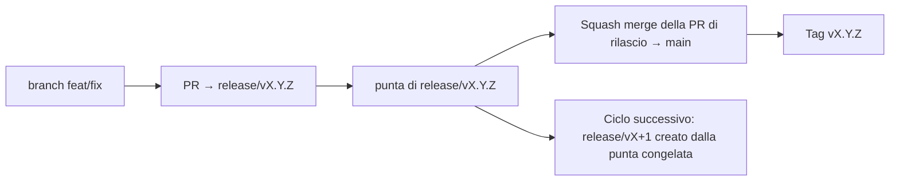

# Branching & Release Model (Italiano)

🌐 **Languages:** 🇺🇸 [English](../../../../ops/BRANCHING_MODEL.md) · 🇪🇹 [am](../../../am/docs/ops/BRANCHING_MODEL.md) · 🇸🇦 [ar](../../../ar/docs/ops/BRANCHING_MODEL.md) · 🇦🇿 [az](../../../az/docs/ops/BRANCHING_MODEL.md) · 🇧🇬 [bg](../../../bg/docs/ops/BRANCHING_MODEL.md) · 🇧🇩 [bn](../../../bn/docs/ops/BRANCHING_MODEL.md) · 🇧🇦 [bs](../../../bs/docs/ops/BRANCHING_MODEL.md) · 🇨🇿 [cs](../../../cs/docs/ops/BRANCHING_MODEL.md) · 🇩🇰 [da](../../../da/docs/ops/BRANCHING_MODEL.md) · 🇩🇪 [de](../../../de/docs/ops/BRANCHING_MODEL.md) · 🇬🇷 [el](../../../el/docs/ops/BRANCHING_MODEL.md) · 🇪🇸 [es](../../../es/docs/ops/BRANCHING_MODEL.md) · 🇪🇪 [et](../../../et/docs/ops/BRANCHING_MODEL.md) · 🇮🇷 [fa](../../../fa/docs/ops/BRANCHING_MODEL.md) · 🇫🇮 [fi](../../../fi/docs/ops/BRANCHING_MODEL.md) · 🇫🇷 [fr](../../../fr/docs/ops/BRANCHING_MODEL.md) · 🇮🇪 [ga](../../../ga/docs/ops/BRANCHING_MODEL.md) · 🇮🇳 [gu](../../../gu/docs/ops/BRANCHING_MODEL.md) · 🇳🇬 [ha](../../../ha/docs/ops/BRANCHING_MODEL.md) · 🇮🇱 [he](../../../he/docs/ops/BRANCHING_MODEL.md) · 🇮🇳 [hi](../../../hi/docs/ops/BRANCHING_MODEL.md) · 🇭🇷 [hr](../../../hr/docs/ops/BRANCHING_MODEL.md) · 🇭🇺 [hu](../../../hu/docs/ops/BRANCHING_MODEL.md) · 🇦🇲 [hy](../../../hy/docs/ops/BRANCHING_MODEL.md) · 🇮🇩 [id](../../../id/docs/ops/BRANCHING_MODEL.md) · 🇳🇬 [ig](../../../ig/docs/ops/BRANCHING_MODEL.md) · 🇯🇵 [ja](../../../ja/docs/ops/BRANCHING_MODEL.md) · 🇬🇪 [ka](../../../ka/docs/ops/BRANCHING_MODEL.md) · 🇰🇭 [km](../../../km/docs/ops/BRANCHING_MODEL.md) · 🇮🇳 [kn](../../../kn/docs/ops/BRANCHING_MODEL.md) · 🇰🇷 [ko](../../../ko/docs/ops/BRANCHING_MODEL.md) · 🇱🇹 [lt](../../../lt/docs/ops/BRANCHING_MODEL.md) · 🇱🇻 [lv](../../../lv/docs/ops/BRANCHING_MODEL.md) · 🇮🇳 [ml](../../../ml/docs/ops/BRANCHING_MODEL.md) · 🇮🇳 [mr](../../../mr/docs/ops/BRANCHING_MODEL.md) · 🇲🇾 [ms](../../../ms/docs/ops/BRANCHING_MODEL.md) · 🇲🇹 [mt](../../../mt/docs/ops/BRANCHING_MODEL.md) · 🇲🇲 [my](../../../my/docs/ops/BRANCHING_MODEL.md) · 🇳🇵 [ne](../../../ne/docs/ops/BRANCHING_MODEL.md) · 🇳🇱 [nl](../../../nl/docs/ops/BRANCHING_MODEL.md) · 🇳🇴 [no](../../../no/docs/ops/BRANCHING_MODEL.md) · 🇮🇳 [or](../../../or/docs/ops/BRANCHING_MODEL.md) · 🇮🇳 [pa](../../../pa/docs/ops/BRANCHING_MODEL.md) · 🇵🇭 [phi](../../../phi/docs/ops/BRANCHING_MODEL.md) · 🇵🇱 [pl](../../../pl/docs/ops/BRANCHING_MODEL.md) · 🇵🇹 [pt](../../../pt/docs/ops/BRANCHING_MODEL.md) · 🇧🇷 [pt-BR](../../../pt-BR/docs/ops/BRANCHING_MODEL.md) · 🇷🇴 [ro](../../../ro/docs/ops/BRANCHING_MODEL.md) · 🇷🇺 [ru](../../../ru/docs/ops/BRANCHING_MODEL.md) · 🇱🇰 [si](../../../si/docs/ops/BRANCHING_MODEL.md) · 🇸🇰 [sk](../../../sk/docs/ops/BRANCHING_MODEL.md) · 🇸🇮 [sl](../../../sl/docs/ops/BRANCHING_MODEL.md) · 🇷🇸 [sr](../../../sr/docs/ops/BRANCHING_MODEL.md) · 🇸🇪 [sv](../../../sv/docs/ops/BRANCHING_MODEL.md) · 🇰🇪 [sw](../../../sw/docs/ops/BRANCHING_MODEL.md) · 🇮🇳 [ta](../../../ta/docs/ops/BRANCHING_MODEL.md) · 🇮🇳 [te](../../../te/docs/ops/BRANCHING_MODEL.md) · 🇹🇭 [th](../../../th/docs/ops/BRANCHING_MODEL.md) · 🇹🇷 [tr](../../../tr/docs/ops/BRANCHING_MODEL.md) · 🇺🇦 [uk-UA](../../../uk-UA/docs/ops/BRANCHING_MODEL.md) · 🇵🇰 [ur](../../../ur/docs/ops/BRANCHING_MODEL.md) · 🇺🇿 [uz](../../../uz/docs/ops/BRANCHING_MODEL.md) · 🇻🇳 [vi](../../../vi/docs/ops/BRANCHING_MODEL.md) · 🇳🇬 [yo](../../../yo/docs/ops/BRANCHING_MODEL.md) · 🇨🇳 [zh-CN](../../../zh-CN/docs/ops/BRANCHING_MODEL.md) · 🇹🇼 [zh-TW](../../../zh-TW/docs/ops/BRANCHING_MODEL.md)

---

OmniRoute utilizza un modello di rilascio a **cicli paralleli**: un branch dedicato `release/vX.Y.Z`
per il ciclo attivo, `main` per la linea pubblicata e un tag immutabile
`vX.Y.Z` quando il ciclo viene rilasciato. È normale vedere commit arrivare sia su `release/*` _sia_ su
`main`: non si tratta di un errore.

I dettagli per i maintainer si trovano in `CLAUDE.md` (Regola fondamentale n. 21) e
[RELEASE_CHECKLIST.md](./RELEASE_CHECKLIST.md). Questa pagina è il riepilogo pubblico
destinato ai contributor.

## In breve

| Ref              | Ruolo                                                                                                            |
| ---------------- | ---------------------------------------------------------------------------------------------------------------- |
| `release/vX.Y.Z` | **Ciclo attivo** — sviluppo quotidiano e merge delle PR per quella versione                                      |
| `main`           | **Linea pubblicata** — riceve il ciclo tramite squash merge quando viene effettuato il rilascio                  |
| `vX.Y.Z` (tag)   | **Indicatore di rilascio** — puntatore immutabile a «ciò che è stato rilasciato», creato al momento del rilascio |



## Quale branch deve avere come destinazione la mia PR?

**Il branch di destinazione deve essere il branch attivo `release/vX.Y.Z`, non `main`.**

1. Trova il branch `release/v*` aperto con la versione più alta (esempio al momento della scrittura:
   `release/v3.8.49`).
2. Crea un branch a partire dalla sua punta (`git fetch` + checkout / rebase su di esso).
3. Apri la PR con **base = quel `release/vX.Y.Z`**.

`main` non è il branch di integrazione per il lavoro quotidiano. Le PR aperte verso `main`
di solito devono cambiare destinazione prima del merge.

## Congelamento del rilascio (cicli paralleli)

Quando è in corso la riconciliazione di un rilascio, viene aperta un'issue di riferimento con
l'etichetta `release-freeze`. Questo **non interrompe lo sviluppo**:

- Il branch `release/vX.Y.Z` congelato è affidato al responsabile di quel rilascio.
- Il branch `release/vX+1` del ciclo successivo viene creato dalla punta congelata, affinché i contributor possano continuare
  a integrare il proprio lavoro.
- Le PR aperte che hanno ancora come destinazione il branch congelato devono essere **reindirizzate** al
  branch `release/v*` attivo, ossia quello con la versione più alta.

Verifica la presenza di un congelamento aperto prima di presumere che il branch desiderato accetti merge:

```bash
gh issue list --repo diegosouzapw/OmniRoute --label release-freeze --state open
```

Le meccaniche di merge (etichetta `queue` del proprietario → Mergify) sono documentate in
[MERGE_TRAIN.md](./MERGE_TRAIN.md).

## Perché sia un branch sia un tag?

| Artefatto        | Durata         | Scopo                                                                         |
| ---------------- | -------------- | ----------------------------------------------------------------------------- |
| `release/vX.Y.Z` | Ciclo in corso | Raccoglie le PR revisionate, mantiene la CI funzionante ed è la base delle PR |
| Tag `vX.Y.Z`     | Permanente     | Contrassegna esattamente ciò che è stato rilasciato su npm / GitHub Releases  |

Il branch è l'officina; il tag è il pacchetto sigillato. Dopo lo squash merge su
`main`, il ciclo successivo prosegue su `release/vX+1` senza attendere il completamento della
PR di rilascio precedente.

## Documentazione correlata

- [CONTRIBUTING.md](../../CONTRIBUTING.md) — configurazione, test, checklist delle PR
- [RELEASE_CHECKLIST.md](./RELEASE_CHECKLIST.md) — convalida prima del rilascio
- [MERGE_TRAIN.md](./MERGE_TRAIN.md) — coda di merge e procedura di merge alternativa
- [RELEASE_GREEN.md](./RELEASE_GREEN.md) — mantenere funzionante la punta del branch di rilascio
