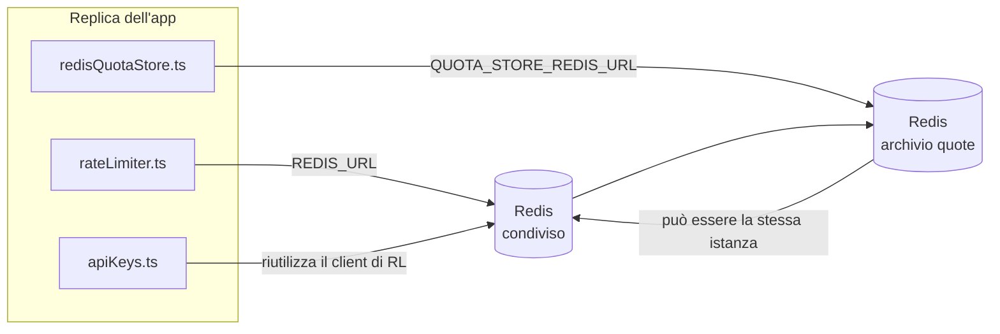

# Redis Production Configuration Guide (Italiano)

🌐 **Languages:** 🇺🇸 [English](../../../../ops/REDIS_PRODUCTION_CONFIG.md) · 🇪🇹 [am](../../../am/docs/ops/REDIS_PRODUCTION_CONFIG.md) · 🇸🇦 [ar](../../../ar/docs/ops/REDIS_PRODUCTION_CONFIG.md) · 🇦🇿 [az](../../../az/docs/ops/REDIS_PRODUCTION_CONFIG.md) · 🇧🇬 [bg](../../../bg/docs/ops/REDIS_PRODUCTION_CONFIG.md) · 🇧🇩 [bn](../../../bn/docs/ops/REDIS_PRODUCTION_CONFIG.md) · 🇨🇿 [cs](../../../cs/docs/ops/REDIS_PRODUCTION_CONFIG.md) · 🇩🇰 [da](../../../da/docs/ops/REDIS_PRODUCTION_CONFIG.md) · 🇩🇪 [de](../../../de/docs/ops/REDIS_PRODUCTION_CONFIG.md) · 🇬🇷 [el](../../../el/docs/ops/REDIS_PRODUCTION_CONFIG.md) · 🇪🇸 [es](../../../es/docs/ops/REDIS_PRODUCTION_CONFIG.md) · 🇪🇪 [et](../../../et/docs/ops/REDIS_PRODUCTION_CONFIG.md) · 🇮🇷 [fa](../../../fa/docs/ops/REDIS_PRODUCTION_CONFIG.md) · 🇫🇮 [fi](../../../fi/docs/ops/REDIS_PRODUCTION_CONFIG.md) · 🇫🇷 [fr](../../../fr/docs/ops/REDIS_PRODUCTION_CONFIG.md) · 🇮🇪 [ga](../../../ga/docs/ops/REDIS_PRODUCTION_CONFIG.md) · 🇮🇳 [gu](../../../gu/docs/ops/REDIS_PRODUCTION_CONFIG.md) · 🇳🇬 [ha](../../../ha/docs/ops/REDIS_PRODUCTION_CONFIG.md) · 🇮🇱 [he](../../../he/docs/ops/REDIS_PRODUCTION_CONFIG.md) · 🇮🇳 [hi](../../../hi/docs/ops/REDIS_PRODUCTION_CONFIG.md) · 🇭🇷 [hr](../../../hr/docs/ops/REDIS_PRODUCTION_CONFIG.md) · 🇭🇺 [hu](../../../hu/docs/ops/REDIS_PRODUCTION_CONFIG.md) · 🇦🇲 [hy](../../../hy/docs/ops/REDIS_PRODUCTION_CONFIG.md) · 🇮🇩 [id](../../../id/docs/ops/REDIS_PRODUCTION_CONFIG.md) · 🇳🇬 [ig](../../../ig/docs/ops/REDIS_PRODUCTION_CONFIG.md) · 🇯🇵 [ja](../../../ja/docs/ops/REDIS_PRODUCTION_CONFIG.md) · 🇬🇪 [ka](../../../ka/docs/ops/REDIS_PRODUCTION_CONFIG.md) · 🇰🇭 [km](../../../km/docs/ops/REDIS_PRODUCTION_CONFIG.md) · 🇮🇳 [kn](../../../kn/docs/ops/REDIS_PRODUCTION_CONFIG.md) · 🇰🇷 [ko](../../../ko/docs/ops/REDIS_PRODUCTION_CONFIG.md) · 🇱🇹 [lt](../../../lt/docs/ops/REDIS_PRODUCTION_CONFIG.md) · 🇱🇻 [lv](../../../lv/docs/ops/REDIS_PRODUCTION_CONFIG.md) · 🇮🇳 [ml](../../../ml/docs/ops/REDIS_PRODUCTION_CONFIG.md) · 🇮🇳 [mr](../../../mr/docs/ops/REDIS_PRODUCTION_CONFIG.md) · 🇲🇾 [ms](../../../ms/docs/ops/REDIS_PRODUCTION_CONFIG.md) · 🇲🇹 [mt](../../../mt/docs/ops/REDIS_PRODUCTION_CONFIG.md) · 🇲🇲 [my](../../../my/docs/ops/REDIS_PRODUCTION_CONFIG.md) · 🇳🇵 [ne](../../../ne/docs/ops/REDIS_PRODUCTION_CONFIG.md) · 🇳🇱 [nl](../../../nl/docs/ops/REDIS_PRODUCTION_CONFIG.md) · 🇳🇴 [no](../../../no/docs/ops/REDIS_PRODUCTION_CONFIG.md) · 🇮🇳 [or](../../../or/docs/ops/REDIS_PRODUCTION_CONFIG.md) · 🇮🇳 [pa](../../../pa/docs/ops/REDIS_PRODUCTION_CONFIG.md) · 🇵🇭 [phi](../../../phi/docs/ops/REDIS_PRODUCTION_CONFIG.md) · 🇵🇱 [pl](../../../pl/docs/ops/REDIS_PRODUCTION_CONFIG.md) · 🇵🇹 [pt](../../../pt/docs/ops/REDIS_PRODUCTION_CONFIG.md) · 🇧🇷 [pt-BR](../../../pt-BR/docs/ops/REDIS_PRODUCTION_CONFIG.md) · 🇷🇴 [ro](../../../ro/docs/ops/REDIS_PRODUCTION_CONFIG.md) · 🇷🇺 [ru](../../../ru/docs/ops/REDIS_PRODUCTION_CONFIG.md) · 🇱🇰 [si](../../../si/docs/ops/REDIS_PRODUCTION_CONFIG.md) · 🇸🇰 [sk](../../../sk/docs/ops/REDIS_PRODUCTION_CONFIG.md) · 🇸🇮 [sl](../../../sl/docs/ops/REDIS_PRODUCTION_CONFIG.md) · 🇷🇸 [sr](../../../sr/docs/ops/REDIS_PRODUCTION_CONFIG.md) · 🇸🇪 [sv](../../../sv/docs/ops/REDIS_PRODUCTION_CONFIG.md) · 🇰🇪 [sw](../../../sw/docs/ops/REDIS_PRODUCTION_CONFIG.md) · 🇮🇳 [ta](../../../ta/docs/ops/REDIS_PRODUCTION_CONFIG.md) · 🇮🇳 [te](../../../te/docs/ops/REDIS_PRODUCTION_CONFIG.md) · 🇹🇭 [th](../../../th/docs/ops/REDIS_PRODUCTION_CONFIG.md) · 🇹🇷 [tr](../../../tr/docs/ops/REDIS_PRODUCTION_CONFIG.md) · 🇺🇦 [uk-UA](../../../uk-UA/docs/ops/REDIS_PRODUCTION_CONFIG.md) · 🇵🇰 [ur](../../../ur/docs/ops/REDIS_PRODUCTION_CONFIG.md) · 🇺🇿 [uz](../../../uz/docs/ops/REDIS_PRODUCTION_CONFIG.md) · 🇻🇳 [vi](../../../vi/docs/ops/REDIS_PRODUCTION_CONFIG.md) · 🇳🇬 [yo](../../../yo/docs/ops/REDIS_PRODUCTION_CONFIG.md) · 🇨🇳 [zh-CN](../../../zh-CN/docs/ops/REDIS_PRODUCTION_CONFIG.md) · 🇹🇼 [zh-TW](../../../zh-TW/docs/ops/REDIS_PRODUCTION_CONFIG.md)

---

## Panoramica

Redis è una **dipendenza facoltativa e non vincolante** in OmniRoute: l'applicazione riduce gradualmente le proprie funzionalità (utilizzando
soluzioni di riserva in memoria) quando Redis non è disponibile. In produzione, l'ottimizzazione di Redis riduce la latenza per quattro distinti
carichi di lavoro:

| Carico di lavoro            | Driver                        | Factory del client                                                      | Pattern delle chiavi                                                        |
| --------------------------- | ----------------------------- | ----------------------------------------------------------------------- | --------------------------------------------------------------------------- |
| Limitazione della frequenza | `rateLimiter.ts`              | `getRedisClient()` — singleton `ioredis` con inizializzazione differita | `<prefix>rl:*` finestre di limitazione della frequenza atomiche tramite Lua |
| Cache di autenticazione     | `apiKeys.ts`                  | Riutilizza il client di `rateLimiter`                                   | `<prefix>auth:api_key:<sha256>` con TTL                                     |
| Archivio delle quote        | `redisQuotaStore.ts`          | Singleton `getRedisClient(url)` separato                                | `<prefix>quota:*` configurabile per ogni istanza                            |
| Circuit breaker di warmup   | `redisCircuitBreakerStore.ts` | Client separato in `circuitBreakerFactory.ts`                           | `<prefix>warmup:cb:<connectionId>`                                          |

Tutti e quattro i carichi di lavoro condividono un unico prefisso dello spazio dei nomi, in modo che OmniRoute possa coesistere con altre applicazioni su una
singola istanza Redis (ad es. `127.0.0.1:6379`). Vedere [Spazio dei nomi delle chiavi](#key-namespacing).

---

## Configurazione attuale (valori predefiniti nel codice)

| Impostazione                                  | Valore                                                                      | Posizione                                                                             |
| --------------------------------------------- | --------------------------------------------------------------------------- | ------------------------------------------------------------------------------------- |
| Variabile di ambiente `REDIS_URL`             | `redis://redis:6379` (compose), facoltativa                                 | `rateLimiter.ts:5`, `.env.example`                                                    |
| Variabile di ambiente `REDIS_KEY_PREFIX`      | `omniroute:` (valore predefinito)                                           | `rateLimiter.ts`, `redisQuotaStore.ts`, `redisCircuitBreakerStore.ts`, `.env.example` |
| Variabile di ambiente `QUOTA_STORE_REDIS_URL` | separata, può essere diversa da `REDIS_URL`                                 | `quota/storeFactory.ts`                                                               |
| `QUOTA_STORE_DRIVER`                          | `"sqlite"` (valore predefinito), `"redis"` facoltativo                      | `quota/storeFactory.ts`                                                               |
| `maxRetriesPerRequest` di ioredis             | `3`                                                                         | creazione del client in `rateLimiter.ts`                                              |
| `enableReadyCheck`                            | non impostato (valore predefinito di ioredis: `true`)                       | —                                                                                     |
| `lazyConnect`                                 | non impostato (valore predefinito di ioredis: `false`)                      | —                                                                                     |
| `retryStrategy`                               | non impostato (valore predefinito di ioredis: base di 200 ms, esponenziale) | —                                                                                     |
| TLS / password / indice del DB                | **non configurati**                                                         | —                                                                                     |
| Sentinel / Cluster                            | **non configurati** — solo nodo singolo autonomo                            | —                                                                                     |

---

## Spazio dei nomi delle chiavi

OmniRoute condivide un'istanza Redis con qualsiasi altro servizio in esecuzione sull'host. Senza uno spazio dei nomi,
chiavi come `auth:api_key:<sha256>` o `rl:*` potrebbero entrare in conflitto con chiavi di altre applicazioni
che utilizzano lo stesso Redis (questa istanza esegue Redis su `127.0.0.1:6379` insieme ad altri servizi).

Impostare `REDIS_KEY_PREFIX` su una stringa non vuota per aggiungere un prefisso a **ogni** chiave OmniRoute:

```bash
# .env — tutte le chiavi OmniRoute diventano omniroute:rl:*, omniroute:auth:*, omniroute:quota:*, omniroute:warmup:cb:*
REDIS_KEY_PREFIX=omniroute:
```

- **Valore predefinito:** `omniroute:` (applicato quando `REDIS_KEY_PREFIX` non è impostato o è vuoto).
- **Applicato a:** limitatore della frequenza + cache di autenticazione (client `ioredis` condiviso tramite `keyPrefix`), nonché
  archivio delle quote (`KEY_PREFIX = "${REDIS_KEY_PREFIX}quota"`) e circuit breaker di warmup
  (`KEY_PREFIX = "${REDIS_KEY_PREFIX}warmup:cb:"`).
- **La modifica del prefisso** quando esistono già chiavi in Redis rende orfane le vecchie chiavi (che scadono
  tramite TTL / LRU). La modifica è sicura e non richiede alcuna migrazione. L'unica eccezione è una chiave del
  circuit breaker di warmup relativa a una connessione contrassegnata come vietata: viene conservata senza TTL, quindi
  elencare le chiavi residue con `redis-cli --scan --pattern '<old-prefix>warmup:cb:*'` ed eliminarle.
- **`keyPrefix` di ioredis** antepone automaticamente il prefisso durante le scritture **e** lo rimuove durante le letture,
  pertanto il codice dell'applicazione non visualizza mai il prefisso.

---

## Ottimizzazione consigliata per la produzione

### 1. Pool di connessioni / Opzioni del client (costruttore `Redis` di ioredis)

Il codice attuale crea una singola istanza `new Redis(url)` senza opzioni personalizzate. Per distribuzioni di produzione con più repliche, passa una factory del client nel codice oppure esegui il wrapping di `getRedisClient()`:

```typescript
const redis = new Redis(REDIS_URL, {
  maxRetriesPerRequest: null, // nessun limite ai tentativi; lascia decidere a retryStrategy
  enableReadyCheck: true, // verifica che il server sia pronto prima di accettare chiamate
  lazyConnect: true, // non connettersi alla creazione; attendere la prima chiamata
  retryStrategy: (times) => {
    if (times > 10) return null; // rinuncia dopo 10 tentativi → riconnettersi in seguito
    return Math.min(times * 200, 5000); // 200 ms, 400 ms, …, limite di 5 s
  },
  enableAutoPipelining: true, // combina i comandi simultanei in un'unica scrittura TCP
  keepAlive: 10000, // keep-alive TCP ogni 10 s
});
```

**Principali compromessi:**

- `maxRetriesPerRequest: null` + `retryStrategy` — opzione preferibile per la produzione, in modo che i riavvii temporanei di Redis non causino immediatamente il fallimento di ogni richiesta. Il fallback in memoria di `checkRateLimit()` gestisce il percorso di errore.
- `lazyConnect: true` — evita che l'avvio dipenda dalla disponibilità di Redis prima che il server inizi ad accettare connessioni.
- `enableAutoPipelining: true` — riduce i round trip per i controlli simultanei del limite di frequenza; utile con più di 50 RPS su una singola connessione.

### 2. Configurazione del server Redis (`redis.conf`)

```
# Memoria
maxmemory 80%                        # lascia spazio per la cache delle pagine del sistema operativo
maxmemory-policy allkeys-lru         # espelle le voci obsolete della cache di autenticazione sotto pressione

# Persistenza (facoltativa — OmniRoute è resiliente agli arresti anomali anche senza)
save 300 1                           # crea uno snapshot almeno ogni 5 min se è cambiata ≥1 chiave
appendonly no                        # AOF non necessario; i dati possono essere rigenerati
appendfsync no                       # nessun overhead di fsync (RDB è sufficiente)

# Rete
timeout 0                            # nessuna disconnessione per inattività
tcp-keepalive 300                    # keep-alive di 5 min
tcp-backlog 511                      # coda delle connessioni per carichi a picchi

# Prestazioni
hz 10                                # valore predefinito; 100 per applicazioni sensibili alla latenza
activedefrag yes                     # deframmentazione automatica quando la frammentazione supera il 10%
```

**Compromesso per `maxmemory-policy allkeys-lru`:** le voci della cache di autenticazione possono essere espulse in condizioni di pressione sulla memoria. Ciò è sicuro: `setCachedApiKey` ripopola sempre la cache in caso di mancata corrispondenza e il fallback SQLite è autorevole. Lo script Lua del limitatore di frequenza crea chiavi di piccole dimensioni e temporanee per progettazione.

### 3. Impostazioni di Docker Compose

Il file Compose di produzione (`docker-compose.prod.yml`) usa `redis:8.6.2-alpine`. Aggiungi:

```yaml
redis:
  image: redis:8.6.2-alpine
  command:
    [
      "redis-server",
      "--maxmemory",
      "512mb",
      "--maxmemory-policy",
      "allkeys-lru",
      "--activedefrag",
      "yes",
      "--save",
      "300 1",
    ]
  healthcheck:
    test: ["CMD", "redis-cli", "ping"]
    interval: 10s
    timeout: 3s
    retries: 3
    start_period: 5s
```

### 4. Considerazioni su più istanze / scalabilità

**Un singolo Redis per tutte le repliche** — lo script Lua del limitatore di frequenza dipende da un singolo spazio delle chiavi autorevole. Più istanze Redis associate alle diverse repliche farebbero perdere l'atomicità e raddoppierebbero il budget. Usa un singolo Redis, oppure un cluster Redis Sentinel con failover, per tutte le repliche dell'applicazione.

**Numero di connessioni:** ogni replica dell'applicazione apre **2 connessioni TCP** a Redis (client del limitatore di frequenza + client dell'archivio delle quote). Con 10 repliche → 20 connessioni, ampiamente entro il limite predefinito di 10.000 connessioni di un'istanza Redis.

### 5. Monitoraggio

Esponi tramite un endpoint di controllo dello stato:

```typescript
// src/app/api/monitoring/health/route.ts chiama già le funzioni di rateLimiter
// Aggiungi controlli specifici per Redis:
//   1. Latenza PING tramite .ping() di ioredis
//   2. Utilizzo della memoria tramite INFO memory
//   3. Numero di connessioni tramite INFO clients
//   4. Tasso di riscontri per maxmemory-policy (evicted_keys / keyspace_hits)
```

Metriche principali da monitorare:

- **Chiavi espulse/sec** — se il valore rimane costantemente diverso da zero, aumenta `maxmemory`
- **Client bloccati** — un valore diverso da zero indica script Lua lenti o un'elevata contesa
- **Connessioni rifiutate** — è stato raggiunto il limite delle connessioni; evento raro con 20 connessioni

---

## Diagramma dell'architettura



---

## Riferimenti

| File                               | Scopo                                                                                       |
| ---------------------------------- | ------------------------------------------------------------------------------------------- |
| `src/shared/utils/rateLimiter.ts`  | Client Redis principale, script Lua per la limitazione della frequenza, fallback in memoria |
| `src/lib/db/apiKeys.ts`            | Cache di autenticazione — fallback Redis→SQLite                                             |
| `src/lib/quota/redisQuotaStore.ts` | Client Redis separato per l'archivio quote opzionale                                        |
| `src/lib/quota/storeFactory.ts`    | Alterna tra i driver delle quote `sqlite` e `redis`                                         |
| `docker-compose.prod.yml`          | Container Redis di produzione (immagine `redis:8.6.2-alpine`)                               |
| `.env.example`                     | Documentazione delle variabili d'ambiente Redis                                             |
| `src/app/api/local/redis/`         | Route API per l'orchestrazione del container di sviluppo                                    |
| `bin/cli/commands/redis.mjs`       | Comandi CLI per l'orchestrazione del container di sviluppo                                  |
