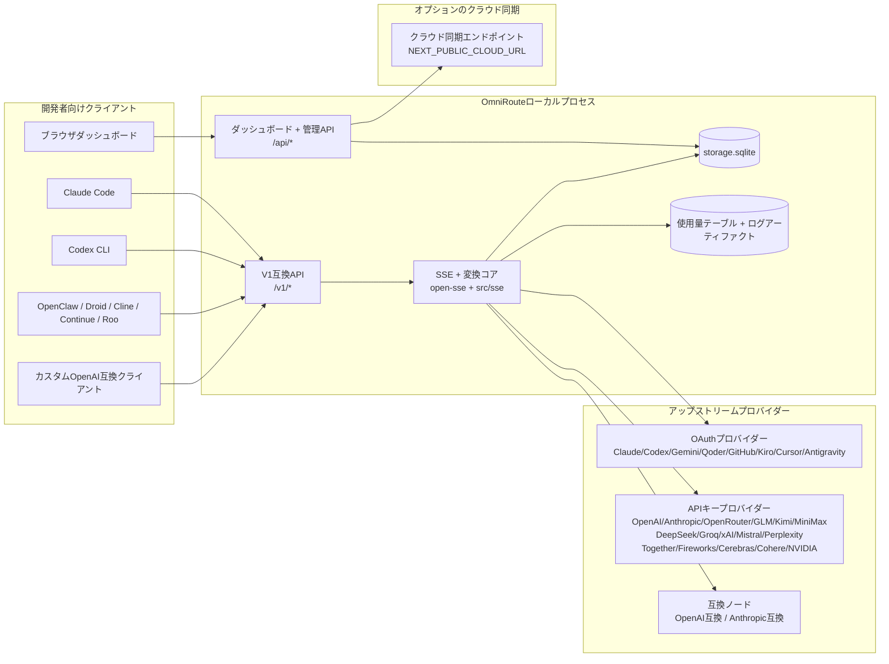
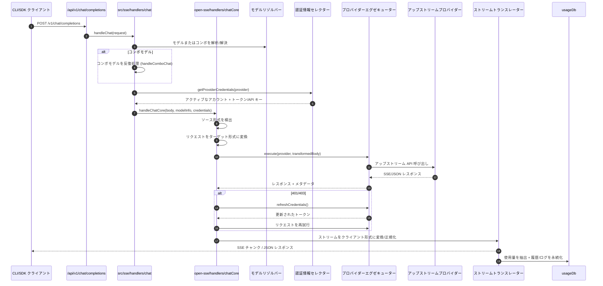
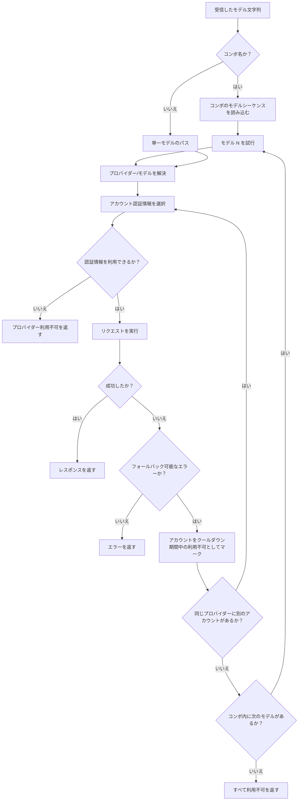
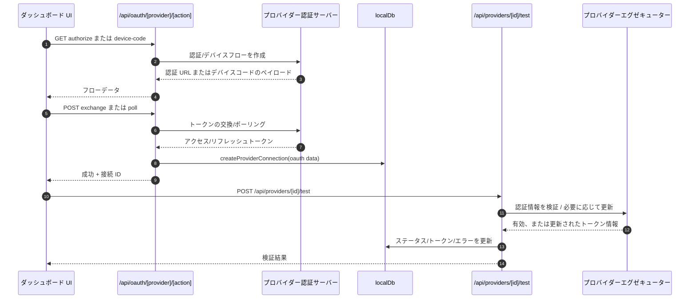
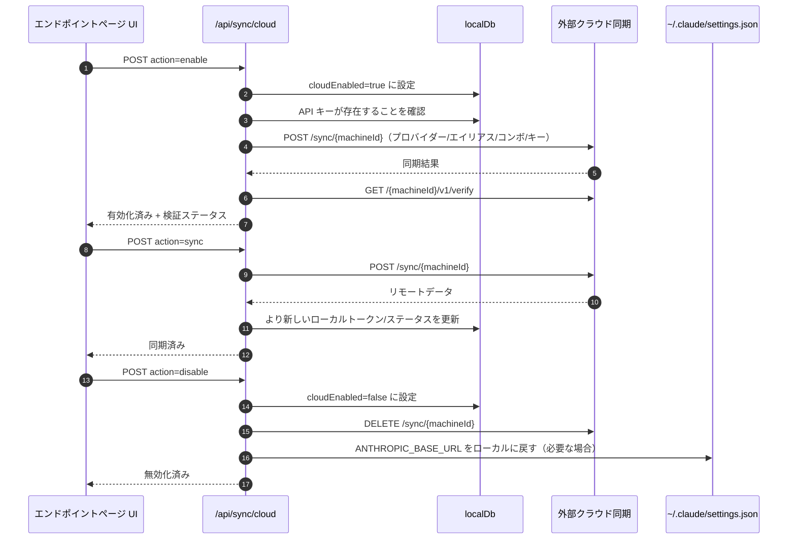
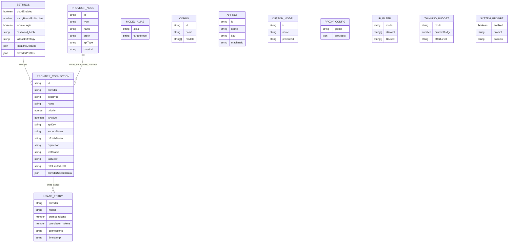
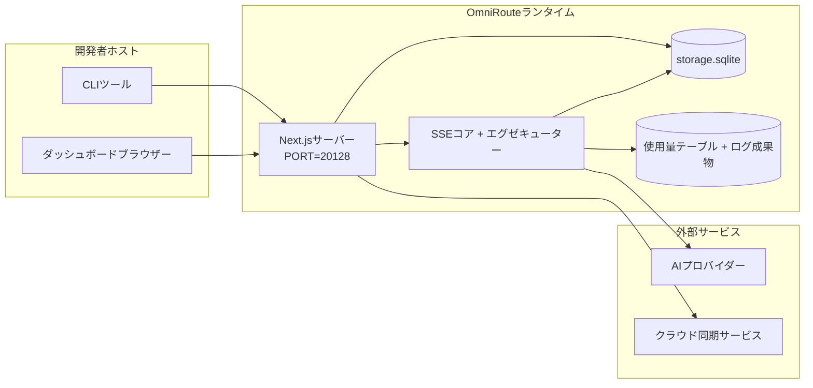

# OmniRoute Architecture (日本語)

🌐 **Languages:** 🇺🇸 [English](../../../../architecture/ARCHITECTURE.md) · 🇪🇹 [am](../../../am/docs/architecture/ARCHITECTURE.md) · 🇸🇦 [ar](../../../ar/docs/architecture/ARCHITECTURE.md) · 🇦🇿 [az](../../../az/docs/architecture/ARCHITECTURE.md) · 🇧🇬 [bg](../../../bg/docs/architecture/ARCHITECTURE.md) · 🇧🇩 [bn](../../../bn/docs/architecture/ARCHITECTURE.md) · 🇧🇦 [bs](../../../bs/docs/architecture/ARCHITECTURE.md) · 🇨🇿 [cs](../../../cs/docs/architecture/ARCHITECTURE.md) · 🇩🇰 [da](../../../da/docs/architecture/ARCHITECTURE.md) · 🇩🇪 [de](../../../de/docs/architecture/ARCHITECTURE.md) · 🇬🇷 [el](../../../el/docs/architecture/ARCHITECTURE.md) · 🇪🇸 [es](../../../es/docs/architecture/ARCHITECTURE.md) · 🇪🇪 [et](../../../et/docs/architecture/ARCHITECTURE.md) · 🇮🇷 [fa](../../../fa/docs/architecture/ARCHITECTURE.md) · 🇫🇮 [fi](../../../fi/docs/architecture/ARCHITECTURE.md) · 🇫🇷 [fr](../../../fr/docs/architecture/ARCHITECTURE.md) · 🇮🇪 [ga](../../../ga/docs/architecture/ARCHITECTURE.md) · 🇮🇳 [gu](../../../gu/docs/architecture/ARCHITECTURE.md) · 🇳🇬 [ha](../../../ha/docs/architecture/ARCHITECTURE.md) · 🇮🇱 [he](../../../he/docs/architecture/ARCHITECTURE.md) · 🇮🇳 [hi](../../../hi/docs/architecture/ARCHITECTURE.md) · 🇭🇷 [hr](../../../hr/docs/architecture/ARCHITECTURE.md) · 🇭🇺 [hu](../../../hu/docs/architecture/ARCHITECTURE.md) · 🇦🇲 [hy](../../../hy/docs/architecture/ARCHITECTURE.md) · 🇮🇩 [id](../../../id/docs/architecture/ARCHITECTURE.md) · 🇳🇬 [ig](../../../ig/docs/architecture/ARCHITECTURE.md) · 🇮🇹 [it](../../../it/docs/architecture/ARCHITECTURE.md) · 🇬🇪 [ka](../../../ka/docs/architecture/ARCHITECTURE.md) · 🇰🇭 [km](../../../km/docs/architecture/ARCHITECTURE.md) · 🇮🇳 [kn](../../../kn/docs/architecture/ARCHITECTURE.md) · 🇰🇷 [ko](../../../ko/docs/architecture/ARCHITECTURE.md) · 🇱🇹 [lt](../../../lt/docs/architecture/ARCHITECTURE.md) · 🇱🇻 [lv](../../../lv/docs/architecture/ARCHITECTURE.md) · 🇮🇳 [ml](../../../ml/docs/architecture/ARCHITECTURE.md) · 🇮🇳 [mr](../../../mr/docs/architecture/ARCHITECTURE.md) · 🇲🇾 [ms](../../../ms/docs/architecture/ARCHITECTURE.md) · 🇲🇹 [mt](../../../mt/docs/architecture/ARCHITECTURE.md) · 🇲🇲 [my](../../../my/docs/architecture/ARCHITECTURE.md) · 🇳🇵 [ne](../../../ne/docs/architecture/ARCHITECTURE.md) · 🇳🇱 [nl](../../../nl/docs/architecture/ARCHITECTURE.md) · 🇳🇴 [no](../../../no/docs/architecture/ARCHITECTURE.md) · 🇮🇳 [or](../../../or/docs/architecture/ARCHITECTURE.md) · 🇮🇳 [pa](../../../pa/docs/architecture/ARCHITECTURE.md) · 🇵🇭 [phi](../../../phi/docs/architecture/ARCHITECTURE.md) · 🇵🇱 [pl](../../../pl/docs/architecture/ARCHITECTURE.md) · 🇵🇹 [pt](../../../pt/docs/architecture/ARCHITECTURE.md) · 🇧🇷 [pt-BR](../../../pt-BR/docs/architecture/ARCHITECTURE.md) · 🇷🇴 [ro](../../../ro/docs/architecture/ARCHITECTURE.md) · 🇷🇺 [ru](../../../ru/docs/architecture/ARCHITECTURE.md) · 🇱🇰 [si](../../../si/docs/architecture/ARCHITECTURE.md) · 🇸🇰 [sk](../../../sk/docs/architecture/ARCHITECTURE.md) · 🇸🇮 [sl](../../../sl/docs/architecture/ARCHITECTURE.md) · 🇷🇸 [sr](../../../sr/docs/architecture/ARCHITECTURE.md) · 🇸🇪 [sv](../../../sv/docs/architecture/ARCHITECTURE.md) · 🇰🇪 [sw](../../../sw/docs/architecture/ARCHITECTURE.md) · 🇮🇳 [ta](../../../ta/docs/architecture/ARCHITECTURE.md) · 🇮🇳 [te](../../../te/docs/architecture/ARCHITECTURE.md) · 🇹🇭 [th](../../../th/docs/architecture/ARCHITECTURE.md) · 🇹🇷 [tr](../../../tr/docs/architecture/ARCHITECTURE.md) · 🇺🇦 [uk-UA](../../../uk-UA/docs/architecture/ARCHITECTURE.md) · 🇵🇰 [ur](../../../ur/docs/architecture/ARCHITECTURE.md) · 🇺🇿 [uz](../../../uz/docs/architecture/ARCHITECTURE.md) · 🇻🇳 [vi](../../../vi/docs/architecture/ARCHITECTURE.md) · 🇳🇬 [yo](../../../yo/docs/architecture/ARCHITECTURE.md) · 🇨🇳 [zh-CN](../../../zh-CN/docs/architecture/ARCHITECTURE.md) · 🇹🇼 [zh-TW](../../../zh-TW/docs/architecture/ARCHITECTURE.md)

---

🌐 **Languages:** 🇺🇸 [English](../../../../architecture/ARCHITECTURE.md) · 🇪🇹 [am](../../../am/docs/architecture/ARCHITECTURE.md) · 🇸🇦 [ar](../../../ar/docs/architecture/ARCHITECTURE.md) · 🇦🇿 [az](../../../az/docs/architecture/ARCHITECTURE.md) · 🇧🇬 [bg](../../../bg/docs/architecture/ARCHITECTURE.md) · 🇧🇩 [bn](../../../bn/docs/architecture/ARCHITECTURE.md) · 🇧🇦 [bs](../../../bs/docs/architecture/ARCHITECTURE.md) · 🇨🇿 [cs](../../../cs/docs/architecture/ARCHITECTURE.md) · 🇩🇰 [da](../../../da/docs/architecture/ARCHITECTURE.md) · 🇩🇪 [de](../../../de/docs/architecture/ARCHITECTURE.md) · 🇬🇷 [el](../../../el/docs/architecture/ARCHITECTURE.md) · 🇪🇸 [es](../../../es/docs/architecture/ARCHITECTURE.md) · 🇪🇪 [et](../../../et/docs/architecture/ARCHITECTURE.md) · 🇮🇷 [fa](../../../fa/docs/architecture/ARCHITECTURE.md) · 🇫🇮 [fi](../../../fi/docs/architecture/ARCHITECTURE.md) · 🇫🇷 [fr](../../../fr/docs/architecture/ARCHITECTURE.md) · 🇮🇪 [ga](../../../ga/docs/architecture/ARCHITECTURE.md) · 🇮🇳 [gu](../../../gu/docs/architecture/ARCHITECTURE.md) · 🇳🇬 [ha](../../../ha/docs/architecture/ARCHITECTURE.md) · 🇮🇱 [he](../../../he/docs/architecture/ARCHITECTURE.md) · 🇮🇳 [hi](../../../hi/docs/architecture/ARCHITECTURE.md) · 🇭🇷 [hr](../../../hr/docs/architecture/ARCHITECTURE.md) · 🇭🇺 [hu](../../../hu/docs/architecture/ARCHITECTURE.md) · 🇦🇲 [hy](../../../hy/docs/architecture/ARCHITECTURE.md) · 🇮🇩 [id](../../../id/docs/architecture/ARCHITECTURE.md) · 🇳🇬 [ig](../../../ig/docs/architecture/ARCHITECTURE.md) · 🇮🇹 [it](../../../it/docs/architecture/ARCHITECTURE.md) · 🇬🇪 [ka](../../../ka/docs/architecture/ARCHITECTURE.md) · 🇰🇭 [km](../../../km/docs/architecture/ARCHITECTURE.md) · 🇮🇳 [kn](../../../kn/docs/architecture/ARCHITECTURE.md) · 🇰🇷 [ko](../../../ko/docs/architecture/ARCHITECTURE.md) · 🇱🇹 [lt](../../../lt/docs/architecture/ARCHITECTURE.md) · 🇱🇻 [lv](../../../lv/docs/architecture/ARCHITECTURE.md) · 🇮🇳 [ml](../../../ml/docs/architecture/ARCHITECTURE.md) · 🇮🇳 [mr](../../../mr/docs/architecture/ARCHITECTURE.md) · 🇲🇾 [ms](../../../ms/docs/architecture/ARCHITECTURE.md) · 🇲🇹 [mt](../../../mt/docs/architecture/ARCHITECTURE.md) · 🇲🇲 [my](../../../my/docs/architecture/ARCHITECTURE.md) · 🇳🇵 [ne](../../../ne/docs/architecture/ARCHITECTURE.md) · 🇳🇱 [nl](../../../nl/docs/architecture/ARCHITECTURE.md) · 🇳🇴 [no](../../../no/docs/architecture/ARCHITECTURE.md) · 🇮🇳 [or](../../../or/docs/architecture/ARCHITECTURE.md) · 🇮🇳 [pa](../../../pa/docs/architecture/ARCHITECTURE.md) · 🇵🇭 [phi](../../../phi/docs/architecture/ARCHITECTURE.md) · 🇵🇱 [pl](../../../pl/docs/architecture/ARCHITECTURE.md) · 🇵🇹 [pt](../../../pt/docs/architecture/ARCHITECTURE.md) · 🇧🇷 [pt-BR](../../../pt-BR/docs/architecture/ARCHITECTURE.md) · 🇷🇴 [ro](../../../ro/docs/architecture/ARCHITECTURE.md) · 🇷🇺 [ru](../../../ru/docs/architecture/ARCHITECTURE.md) · 🇱🇰 [si](../../../si/docs/architecture/ARCHITECTURE.md) · 🇸🇰 [sk](../../../sk/docs/architecture/ARCHITECTURE.md) · 🇸🇮 [sl](../../../sl/docs/architecture/ARCHITECTURE.md) · 🇷🇸 [sr](../../../sr/docs/architecture/ARCHITECTURE.md) · 🇸🇪 [sv](../../../sv/docs/architecture/ARCHITECTURE.md) · 🇰🇪 [sw](../../../sw/docs/architecture/ARCHITECTURE.md) · 🇮🇳 [ta](../../../ta/docs/architecture/ARCHITECTURE.md) · 🇮🇳 [te](../../../te/docs/architecture/ARCHITECTURE.md) · 🇹🇭 [th](../../../th/docs/architecture/ARCHITECTURE.md) · 🇹🇷 [tr](../../../tr/docs/architecture/ARCHITECTURE.md) · 🇺🇦 [uk-UA](../../../uk-UA/docs/architecture/ARCHITECTURE.md) · 🇵🇰 [ur](../../../ur/docs/architecture/ARCHITECTURE.md) · 🇺🇿 [uz](../../../uz/docs/architecture/ARCHITECTURE.md) · 🇻🇳 [vi](../../../vi/docs/architecture/ARCHITECTURE.md) · 🇳🇬 [yo](../../../yo/docs/architecture/ARCHITECTURE.md) · 🇨🇳 [zh-CN](../../../zh-CN/docs/architecture/ARCHITECTURE.md) · 🇹🇼 [zh-TW](../../../zh-TW/docs/architecture/ARCHITECTURE.md)

_最終更新日: 2026-06-28_

## エグゼクティブサマリー

OmniRoute は、Next.js 上に構築されたローカル AI ルーティングゲートウェイおよびダッシュボードです。
単一の OpenAI 互換エンドポイント（`/v1/*`）を提供し、変換、フォールバック、トークン更新、使用量追跡を行いながら、複数のアップストリームプロバイダー間でトラフィックをルーティングします。

主要機能：

- CLI/ツール向けの OpenAI 互換 API サーフェス（355 プロバイダー、108 エグゼキューター）
- プロバイダー形式間のリクエスト/レスポンス変換
- モデルコンボフォールバック（複数モデルのシーケンス）
- 構造化コンボステップ（`provider + model + connection`）と、`compositeTiers` による実行時の順序付け
- アカウントレベルのフォールバック（プロバイダーごとの複数アカウント）
- メインチャット経路でのクォータ事前チェックおよびクォータを考慮した P2C アカウント選択
- OAuth + API キーによるプロバイダー接続管理（22 の OAuth プロバイダーモジュール）
- `/v1/embeddings` による埋め込み生成（18 プロバイダー）
- `/v1/images/generations` による画像生成（10 以上のプロバイダー、20 以上のモデル）
- `/v1/audio/transcriptions` による音声文字起こし（18 プロバイダー）
- `/v1/audio/speech` によるテキスト読み上げ（24 の組み込みプロバイダー）
- `/v1/videos/generations` による動画生成（ComfyUI + SD WebUI）
- `/v1/music/generations` による音楽生成（ComfyUI）
- `/v1/search` によるウェブ検索（20 プロバイダー）
- `/v1/moderations` によるモデレーション
- `/v1/rerank` による再ランキング
- 推論モデル向け Think タグ解析（`<think>...</think>`）
- 厳密な OpenAI SDK 互換性を実現するレスポンスのサニタイズ
- クロスプロバイダー互換性のためのロール正規化（developer→system、system→user）
- 構造化出力の変換（json_schema → Gemini responseSchema）
- プロバイダー、キー、エイリアス、コンボ、設定、価格情報のローカル永続化（122 の DB モジュール）
- 使用量/コストの追跡およびリクエストログ記録
- 複数デバイス間/状態同期のためのオプションのクラウド同期
- API アクセス制御用の IP 許可リスト/ブロックリスト
- Thinking バジェット管理（パススルー/自動/カスタム/適応型）
- グローバルシステムプロンプトの注入
- セッション追跡およびフィンガープリンティング
- プロバイダー固有のプロファイルを使用したアカウント単位の強化レート制限
- プロバイダーの耐障害性を高めるサーキットブレーカーパターン
- ミューテックスロックによるサンダリングハード対策
- シグネチャベースのリクエスト重複排除キャッシュ
- ドメインレイヤー：コストルール、フォールバックポリシー、ロックアウトポリシー
- Context Relay：アカウントローテーション時の継続性を確保するセッション引き継ぎサマリー
- ドメイン状態の永続化（フォールバック、バジェット、ロックアウト、サーキットブレーカー用の SQLite ライトスルーキャッシュ）
- 一元的なリクエスト評価を行うポリシーエンジン（ロックアウト → バジェット → フォールバック）
- p50/p95/p99 レイテンシ集計を備えたリクエストテレメトリ
- `combo_execution_key` / `combo_step_id` によるコンボターゲットのテレメトリおよび過去のコンボターゲット健全性
- エンドツーエンドトレーシング用の相関 ID（X-Request-Id）
- API キー単位でオプトアウト可能なコンプライアンス監査ログ
- LLM 品質保証用の評価フレームワーク
- プロバイダーのサーキットブレーカー状態をリアルタイムで表示するヘルスダッシュボード
- 3 つのトランスポート（stdio/SSE/Streamable HTTP）を備えた MCP Server（110 ツール）
- スキルおよびタスクライフサイクルを備えた A2A Server（JSON-RPC 2.0 + SSE）
- メモリシステム（抽出、注入、取得、要約）
- スキルシステム（レジストリ、エグゼキューター、サンドボックス、組み込みスキル）
- 証明書管理および DNS 処理を備えた MITM プロキシ
- プロンプトインジェクション防御ミドルウェア
- Caveman、RTK、スタック型パイプライン、圧縮コンボ、言語パック、分析機能を備えたプロンプト圧縮パイプライン
- ACP（Agent Communication Protocol）レジストリ
- モジュール式 OAuth プロバイダー（`src/lib/oauth/providers/` 配下の 22 の個別モジュール）
- アンインストール/完全アンインストールスクリプト
- OAuth 環境修復アクション
- OpenAI 互換 WS クライアント向け WebSocket ブリッジ（`/v1/ws`）
- 同期トークン管理（発行/失効、ETag でバージョン管理された設定バンドルのダウンロード）
- ファーストクラスの GLM Thinking（`glmt`）プロバイダープリセット
- ハイブリッドトークンカウント（プロバイダー側の `/messages/count_tokens` と推定フォールバック）
- モデルエイリアスの自動シード（起動時に 30 以上のクロスプロキシ方言を正規化）
- SSRF ガード、プライベート URL のブロック、設定可能なリトライを備えた安全なアウトバウンド fetch
- 設定可能な `requestRetry` および `maxRetryIntervalSec` を使用した、クールダウンを考慮するチャットリトライ
- 起動時の Zod による実行環境検証
- ページネーション、プロバイダー CRUD イベント、SSRF ブロック検証ログを備えたコンプライアンス監査 v2

主要なランタイムモデル：

- `src/app/api/*` 配下の Next.js アプリルートが、ダッシュボード API と互換 API の両方を実装
- `src/sse/*` + `open-sse/*` の共有 SSE/ルーティングコアが、プロバイダーの実行、変換、ストリーミング、フォールバック、使用量を処理

## 参照図

v3.8.0 プラットフォームの正規かつバージョン管理された Mermaid ソースは、
[`docs/diagrams/`](../diagrams/README.md) にあります。概要把握のため、そのうち 2 つを以下に再掲します。
その他は、各ドメイン固有のガイドからリンクされています。


> ソース: [diagrams/request-pipeline.mmd](../diagrams/request-pipeline.mmd)


> ソース: [diagrams/resilience-3layers.mmd](../diagrams/resilience-3layers.mmd) —
> [RESILIENCE_GUIDE.md](./RESILIENCE_GUIDE.md) および `CLAUDE.md` のレジリエンスリファレンスからもリンクされています。

## スコープと境界

### スコープ内

- ローカルゲートウェイランタイム
- ダッシュボード管理 API
- プロバイダー認証とトークン更新
- リクエスト変換と SSE ストリーミング
- ローカル状態 + 使用量の永続化
- オプションのクラウド同期オーケストレーション

### スコープ外

- `NEXT_PUBLIC_CLOUD_URL` の背後にあるクラウドサービスの実装
- ローカルプロセス外のプロバイダー SLA/コントロールプレーン
- 外部 CLI バイナリ自体（Claude CLI、Codex CLI など）

## ダッシュボード画面（現行）

`src/app/(dashboard)/dashboard/` 配下の主要ページ:

- `/dashboard` — クイックスタート + プロバイダー概要
- `/dashboard/endpoint` — エンドポイントプロキシ + MCP + A2A + API エンドポイントタブ
- `/dashboard/providers` — プロバイダー接続と認証情報
- `/dashboard/combos` — コンボ戦略、テンプレート、ステップベースのビルダー、モデルルーティングルール、手動で永続化された順序
- `/dashboard/auto-combo` — Auto Combo Engine: スコアリングの重み、モードパック、仮想ファクトリープリセット、テレメトリ
- `/dashboard/costs` — コスト集計と料金の可視化
- `/dashboard/analytics` — 使用状況分析、評価、コンボターゲットの健全性
- `/dashboard/limits` — クォータ/レート制御
- `/dashboard/cli-tools` — CLI オンボーディング、ランタイム検出、設定生成
- `/dashboard/agents` — 検出された ACP エージェント + カスタムエージェント登録
- `/dashboard/cloud-agents` — クラウドホスト型エージェントタスク（Codex Cloud、Devin、Jules）とタスクライフサイクル
- `/dashboard/skills` — A2A スキルレジストリ、サンドボックス実行、組み込みスキルカタログ
- `/dashboard/memory` — 永続的な会話メモリの検査と取得
- `/dashboard/webhooks` — 送信 Webhook サブスクリプション、シークレットローテーション、再試行統計
- `/dashboard/batch` — バッチジョブの送信と進捗
- `/dashboard/cache` — リードスルーキャッシュと推論キャッシュの統計、エビクション制御
- `/dashboard/playground` — 設定済みの任意のコンボ/モデルを使用する対話型チャットプレイグラウンド
- `/dashboard/changelog` — アプリ内変更履歴ビューア（`CHANGELOG.md` をレンダリング）
- `/dashboard/system` — ランタイム診断、バージョン情報、環境検証画面
- `/dashboard/onboarding` — 新規インストール向けの初回セットアップウィザード
- `/dashboard/media` — 画像/動画/音楽プレイグラウンド
- `/dashboard/search-tools` — 検索プロバイダーのテストと履歴
- `/dashboard/health` — 稼働時間、サーキットブレーカー、レート制限、クォータ監視対象セッション
- `/dashboard/logs` — リクエスト/プロキシ/監査/コンソールログ
- `/dashboard/settings` — システム設定タブ（一般、ルーティング、コンボのデフォルトなど）
- `/dashboard/context/caveman` — Caveman 圧縮ルール、言語パック、プレビュー、出力モード
- `/dashboard/context/rtk` — RTK コマンド出力フィルター、プレビュー、ランタイム安全設定
- `/dashboard/context/combos` — ルーティングコンボに割り当てられた名前付き圧縮パイプライン
- `/dashboard/translator` — トランスレーターの検査とリクエスト形式変換のプレビュー
- `/dashboard/audit` — ページネーションと構造化メタデータを備えたコンプライアンス監査ログブラウザ
- `/dashboard/usage` — `usage_history` に紐付いたリクエスト単位の使用量ブラウザ
- `/dashboard/compression` — 圧縮分析、統計、パイプライン割り当て
- `/dashboard/api-manager` — API キーのライフサイクルとモデル権限

## システム全体のコンテキスト



## コアランタイムコンポーネント

## 1) APIおよびルーティングレイヤー（Next.js App Routes）

主要ディレクトリ：

- 互換API用の`src/app/api/v1/*`および`src/app/api/v1beta/*`
- 管理/設定API用の`src/app/api/*`
- `next.config.mjs`内のNextリライトルールにより、`/v1/*`を`/api/v1/*`へマッピング

重要な互換ルート：

- `src/app/api/v1/chat/completions/route.ts`
- `src/app/api/v1/messages/route.ts`
- `src/app/api/v1/responses/route.ts`
- `src/app/api/v1/models/route.ts` — `custom: true`のカスタムモデルを含む
- `src/app/api/v1/embeddings/route.ts` — 埋め込み生成（6プロバイダー）
- `src/app/api/v1/images/generations/route.ts` — 画像生成（Antigravity/Nebiusを含む4以上のプロバイダー）
- `src/app/api/v1/messages/count_tokens/route.ts`
- `src/app/api/v1/providers/[provider]/chat/completions/route.ts` — プロバイダーごとの専用チャット
- `src/app/api/v1/providers/[provider]/embeddings/route.ts` — プロバイダーごとの専用埋め込み
- `src/app/api/v1/providers/[provider]/images/generations/route.ts` — プロバイダーごとの専用画像生成
- `src/app/api/v1beta/models/route.ts`
- `src/app/api/v1beta/models/[...path]/route.ts`

管理ドメイン：

- 認証/設定：`src/app/api/auth/*`、`src/app/api/settings/*`
- プロバイダー/接続：`src/app/api/providers*`
- プロバイダーノード：`src/app/api/provider-nodes*`
- カスタムモデル：`src/app/api/provider-models`（GET/POST/DELETE）
- モデルカタログ：`src/app/api/models/route.ts`（GET）
- プロキシ設定：`src/app/api/settings/proxy`（GET/PUT/DELETE）+ `src/app/api/settings/proxy/test`（POST）
- OAuth：`src/app/api/oauth/*`
- キー/エイリアス/コンボ/価格設定：`src/app/api/keys*`、`src/app/api/models/alias`、`src/app/api/combos*`、`src/app/api/pricing`
- 使用量：`src/app/api/usage/*`
- 同期/クラウド：`src/app/api/sync/*`、`src/app/api/cloud/*`
- CLIツール用ヘルパー：`src/app/api/cli-tools/*`
- IPフィルター：`src/app/api/settings/ip-filter`（GET/PUT）
- 思考バジェット：`src/app/api/settings/thinking-budget`（GET/PUT）
- システムプロンプト：`src/app/api/settings/system-prompt`（GET/PUT）
- 圧縮：`src/app/api/settings/compression`、`src/app/api/compression/*`、および
  `src/app/api/context/*`
- セッション：`src/app/api/sessions`（GET）
- レート制限：`src/app/api/rate-limits`（GET）
- レジリエンス：`src/app/api/resilience`（GET/PATCH）— リクエストキュー、接続クールダウン、プロバイダーブレーカー、クールダウン待機設定
- レジリエンスのリセット：`src/app/api/resilience/reset`（POST）— プロバイダーブレーカーをリセット
- キャッシュ統計：`src/app/api/cache/stats`（GET/DELETE）
- テレメトリー：`src/app/api/telemetry/summary`（GET）
- バジェット：`src/app/api/usage/budget`（GET/POST）
- フォールバックチェーン：`src/app/api/fallback/chains`（GET/POST/DELETE）
- コンプライアンス監査：`src/app/api/compliance/audit-log`（GET、ページネーション + 構造化メタデータ対応）
- 評価：`src/app/api/evals`（GET/POST）、`src/app/api/evals/[suiteId]`（GET）
- ポリシー：`src/app/api/policies`（GET/POST）
- 同期トークン：`src/app/api/sync/tokens`（GET/POST）、`src/app/api/sync/tokens/[id]`（GET/DELETE）
- 設定バンドル：`src/app/api/sync/bundle`（GET、設定/プロバイダー/コンボ/キーのETagバージョン付きスナップショット）
- WebSocket：`src/app/api/v1/ws/route.ts` — OpenAI互換WSクライアント向けのUpgradeハンドラー

## 2) SSE + 翻訳コア

メインフローのモジュール:

- エントリーポイント: `src/sse/handlers/chat.ts`
- コアオーケストレーション: `open-sse/handlers/chatCore.ts`
- プロバイダー実行アダプター: `open-sse/executors/*`
- フォーマット検出/プロバイダー設定: `open-sse/services/provider.ts`
- モデルの解析/解決: `src/sse/services/model.ts`, `open-sse/services/model.ts`
- アカウントのフォールバックロジック: `open-sse/services/accountFallback.ts`
- 翻訳レジストリ: `open-sse/translator/index.ts`
- ストリーム変換: `open-sse/utils/stream.ts`, `open-sse/utils/streamHandler.ts`
- 使用量の抽出/正規化: `open-sse/utils/usageTracking.ts`
- Thinkタグパーサー: `open-sse/utils/thinkTagParser.ts`
- 埋め込みハンドラー: `open-sse/handlers/embeddings.ts`
- 埋め込みプロバイダーレジストリ: `open-sse/config/embeddingRegistry.ts`
- 画像生成ハンドラー: `open-sse/handlers/imageGeneration.ts`
- 画像プロバイダーレジストリ: `open-sse/config/imageRegistry.ts`
- レスポンスのサニタイズ: `open-sse/handlers/responseSanitizer.ts`
- ロールの正規化: `open-sse/services/roleNormalizer.ts`

サービス（ビジネスロジック）:

- アカウントの選択/スコアリング: `open-sse/services/accountSelector.ts`
- コンテキストのライフサイクル管理: `open-sse/services/contextManager.ts`
- IPフィルターの適用: `open-sse/services/ipFilter.ts`
- セッション追跡: `open-sse/services/sessionManager.ts`
- リクエストの重複排除: `open-sse/services/signatureCache.ts`
- システムプロンプトの注入: `open-sse/services/systemPrompt.ts`
- 思考バジェットの管理: `open-sse/services/thinkingBudget.ts`
- ワイルドカードモデルのルーティング: `open-sse/services/wildcardRouter.ts`
- レート制限の管理: `open-sse/services/rateLimitManager.ts`
- サーキットブレーカー: `src/shared/utils/circuitBreaker.ts`
- コンテキストの引き継ぎ: `open-sse/services/contextHandoff.ts` — コンテキストリレー戦略向けの引き継ぎ要約の生成と注入
- 圧縮: `open-sse/services/compression/*` — プロバイダー翻訳前のプロアクティブな圧縮;
  Cavemanルール、RTKフィルター、スタック型パイプライン、圧縮の組み合わせ、統計、検証を含む
- Codexクォータ取得機能: `open-sse/services/codexQuotaFetcher.ts` — コンテキストリレーの引き継ぎ判定用にCodexクォータを取得
- クールダウン対応リトライ: `src/sse/services/cooldownAwareRetry.ts` — 設定可能な`requestRetry` / `maxRetryIntervalSec`を使用したモデル単位のクールダウンリトライ
- 安全なアウトバウンドフェッチ: `src/shared/network/safeOutboundFetch.ts` — SSRFガード、プライベートURLのブロック、リトライ、タイムアウトを備えた、保護されたプロバイダー/モデルフェッチ
- アウトバウンドURLガード: `src/shared/network/outboundUrlGuard.ts` — プライベート/localhostのCIDR範囲に照らしてプロバイダーURLを検証
- プロバイダーリクエストのデフォルト値: `open-sse/services/providerRequestDefaults.ts` — プロバイダー単位の`maxTokens`、`temperature`、`thinkingBudgetTokens`のデフォルト値
- GLMプロバイダー定数: `open-sse/config/glmProvider.ts` — 共有GLMモデル、クォータURL、GLMTのタイムアウト/デフォルト値
- Antigravityアップストリーム: `open-sse/config/antigravityUpstream.ts` — ベースURLと検出パスの定数
- Codexクライアント定数: `open-sse/config/codexClient.ts` — バージョン付きのユーザーエージェント値とクライアントバージョン値
- モデルエイリアスのシード: `src/lib/modelAliasSeed.ts` — 起動時に30以上のクロスプロキシ方言エイリアスをシード

ドメインレイヤーのモジュール:

- コストルール/バジェット: `src/domain/costRules.ts`
- フォールバックポリシー: `src/domain/fallbackPolicy.ts`
- コンボリゾルバー: `src/domain/comboResolver.ts`
- ロックアウトポリシー: `src/domain/lockoutPolicy.ts`
- ポリシーエンジン: `src/domain/policyEngine.ts` — ロックアウト → バジェット → フォールバックの評価を一元化
- エラーコードカタログ: `src/shared/constants/errorCodes.ts`
- リクエストID: `src/shared/utils/requestId.ts`
- フェッチタイムアウト: `src/shared/utils/fetchTimeout.ts`
- リクエストテレメトリ: `src/shared/utils/requestTelemetry.ts`
- コンプライアンス/監査: `src/lib/compliance/index.ts`
- 評価ランナー: `src/lib/evals/evalRunner.ts`
- ドメイン状態の永続化: `src/lib/db/domainState.ts` — フォールバックチェーン、バジェット、コスト履歴、ロックアウト状態、サーキットブレーカー用のSQLite CRUD

OAuthプロバイダーのモジュール（`src/lib/oauth/providers/`配下の22個の個別ファイル）:

- レジストリインデックス: `src/lib/oauth/providers/index.ts`
- 個別プロバイダー: `agy.ts`, `antigravity.ts`, `claude.ts`, `cline.ts`, `codebuddy-cn.ts`, `codex.ts`, `cursor.ts`, `devin-desktop.ts`, `ghe-copilot.ts`, `github.ts`, `gitlab-duo.ts`, `grok-cli-oauth.ts`, `grok-cli.ts`, `kilocode.ts`, `kimi-coding.ts`, `kiro.ts`, `openference.ts`, `qoder.ts`, `trae.ts`, `xai-oauth.ts`, `zed-hosted.ts`, `zed.ts`
- 薄いラッパー: `src/lib/oauth/providers.ts` — 個別モジュールから再エクスポート

## 5) 組み込みサービス (v3.8.4)

OmniRoute は、**組み込みサービス**と呼ばれるローカル実行の AI ツールプロセスをインストール、監視し、それらへルーティングできます。9Router、CLIProxyAPI、Bifrost、Mux、Dario の 5 種類が同梱されています。

アーキテクチャレイヤー:

- **UI** (`/dashboard/providers/services`) — ライフサイクル制御、リアルタイムログストリーミング、API キー管理、および（9Router の場合）内部リバースプロキシ経由の組み込みネイティブ UI を備えた 2 タブのページ。
- **API** (`/api/services/{name}/*`) — 9Router 用に 11 個、CLIProxyAPI 用に 10 個、Bifrost / Mux / Dario 用にそれぞれ 8 個のエンドポイントがあり、すべて **LOCAL_ONLY**（強制ルール #17）に分類されます。共有の `GET /api/services/[name]/logs` SSE エンドポイントが両方のサービスに対応します。
- **スーパーバイザー** (`src/lib/services/`) — 汎用の `ServiceSupervisor` クラスが `child_process.spawn` をラップし、SSE ログストリーミング用の 5 MB リングバッファ、ヘルスプローブループ、アトミック操作ロック、および SIGTERM→SIGKILL による正常シャットダウンを提供します。`bootstrap.ts` は、プロセス開始時に設定済みのすべてのサービスを接続します。
- **プロバイダー/エグゼキューター** (`open-sse/executors/ninerouter.ts`) — 9Router は実際のプロバイダーとして公開されます。モデルには `9router/{sub}/{model}` というプレフィックスが付与され、9Router の `/v1/models` エンドポイントから 5 分ごとに同期されます。

詳細: `docs/frameworks/EMBEDDED-SERVICES.md`

## 主要サブシステム (v3.8.0)

### A. Auto Combo エンジン

Auto Combo は、静的なコンボ定義に依存するのではなく、リクエスト時にルーティング先を動的にスコアリングして選択します。これは `auto/*` モデルプレフィックスファミリーを支えています。

- エンジンのエントリ: `open-sse/services/autoCombo/` (`autoComboEngine.ts`,
  `scoringEngine.ts`, `virtualFactory.ts`, `modePacks.ts`)
- リゾルバー: `src/domain/comboResolver.ts`（`auto/` プレフィックスの自動検出）
- ダッシュボード: `/dashboard/auto-combo`
- テレメトリ: `auto_combo_decisions` SQLite テーブル

主な機能:

- **19 種類のルーティング戦略**（priority、weighted、fill-first、round-robin、P2C、random、least-used、cost-optimized、reset-aware、reset-window、headroom、strict-random、**auto**、lkgp、context-optimized、context-relay、**fusion**、およびフォールバックパス）— auto は v3.8.0 の目玉となる追加機能です。`fusion`（パネルへのファンアウト + ジャッジによる統合、`open-sse/services/fusion.ts`）は v3.8.36 で新たに追加されました。
- **16 要素のスコアリング**: クォータ、健全性、逆コスト、逆レイテンシ、タスク適合度、およびその他 10 要素。要素とそのデフォルトの重みをまとめた正式な表は [`docs/routing/AUTO-COMBO.md`](../routing/AUTO-COMBO.md) にあります。ここに再掲すると、古くなり得る箇所がもう 1 つ増えてしまいます。
- **仮想ファクトリー**は、一致する名前付きコンボが存在しない場合に一時的なコンボを具現化し、健全かつアクティブなプロバイダー接続から候補を取得します。
- **Auto プレフィックス**: `auto/coding`、`auto/cheap`、`auto/fast`、`auto/offline`、
  `auto/smart`、`auto/lkgp` — それぞれが調整済みの重みプロファイルに基づいています。
- **6 種類のモードパック**: `ship-fast`、`cost-saver`、`quality-first`、`offline-friendly`、
  `reliability-first`、`chaos-mode` — ダッシュボードから呼び出せるプリセットの重み設定です。（これらは上記の `auto/*` プレフィックスとは異なります。プレフィックスはリクエスト時のバリエーションです。）

アルゴリズムの完全な詳細（要素の数式、重みの調整）については、
[`docs/routing/AUTO-COMBO.md`](../routing/AUTO-COMBO.md) を参照してください。

### B. Cloud Agents

Cloud Agents は、サードパーティーのホステッドコードエージェントプラットフォーム（Codex Cloud、Devin、Jules）を、統一された DB ベースのタスクライフサイクルでラップします。すべてのタスク作成/検査エンドポイントには管理認証が必要です。

- モジュールルート: `src/lib/cloudAgent/` (`baseAgent.ts`, `registry.ts`, `api.ts`,
  `types.ts`, `db.ts`、および `agents/` 配下のエージェントごとのサブディレクトリ)
- エージェントごとの実装: `agents/codex/`、`agents/devin/`、`agents/jules/`
- 公開エンドポイント: `/api/v1/agents/tasks/*`（一覧/作成/取得/キャンセル）
- 管理エンドポイント: `/api/cloud/*`（プロビジョニング、ステータス、バッチ）
- ダッシュボード: `/dashboard/cloud-agents`
- ストレージ: `cloud_agent_tasks` テーブル

エージェントごとのプロビジョニングと OAuth の詳細については、
[`docs/frameworks/CLOUD_AGENT.md`](../frameworks/CLOUD_AGENT.md) を参照してください。

### C. ガードレール

ガードレールモジュールは、リクエストとレスポンスを検査し、PII、プロンプトインジェクション、安全でないビジョンコンテンツを検出する、ホットリロード可能なミドルウェアレイヤーです。違反が発生すると、HTTP **503** と構造化されたエラーコードによってリクエストが即座に打ち切られ、下流の呼び出し元が再試行または分岐できるようになります。

- モジュールルート: `src/lib/guardrails/` (`base.ts`, `registry.ts`, `piiMasker.ts`,
  `promptInjection.ts`, `visionBridge.ts`, `visionBridgeHelpers.ts`)
- ホットリロード: レジストリが設定変更を監視し、その場でチェーンを再構築します
- 組み込み箇所: チャットハンドラーのエントリ、画像生成ハンドラー、レスポンスサニタイザー
- HTTP 契約: 違反は `error.code = "GUARDRAIL_VIOLATION"` を伴う `503` として表面化します

ルールセットの作成としきい値の調整については、
[`docs/security/GUARDRAILS.md`](../security/GUARDRAILS.md) を参照してください。

### D. ドメインレイヤー

`src/domain/` 名前空間はポリシー判断を一元化し、ルートハンドラーがロックアウト/予算/フォールバックのロジックを自身で組み立てる必要をなくします。

- ポリシーエンジン: `src/domain/policyEngine.ts` — 実行前評価の単一エントリポイント（ロックアウト → 予算 → フォールバックの順序）
- コストルール: `src/domain/costRules.ts`
- フォールバックポリシー: `src/domain/fallbackPolicy.ts`
- ロックアウトポリシー: `src/domain/lockoutPolicy.ts`
- タグベースのルーティング: `src/domain/tagRouter.ts`
- コンボリゾルバー: `src/domain/comboResolver.ts` — コンボ名、auto/\*
  プレフィックス、ワイルドカードモデルターゲットを具体的な実行プランに解決します
- 接続/モデルルールの結合: `src/domain/connectionModelRules.ts`
- モデル可用性スナップショット: `src/domain/modelAvailability.ts`
- プロバイダー有効期限の追跡: `src/domain/providerExpiration.ts`
- クォータキャッシュ: `src/domain/quotaCache.ts`
- デグラデーション状態: `src/domain/degradation.ts`
- 設定監査: `src/domain/configAudit.ts`
- OmniRoute レスポンスメタデータビルダー: `src/domain/omnirouteResponseMeta.ts`
- 評価サブシステム: `src/domain/assessment/` — 定期評価ジョブ

### E. 認可パイプライン

認可パイプラインは、受信するすべてのリクエストを分類し、ディスパッチ前に
適切なポリシーチェーンを適用します。

- パイプラインのエントリ: `src/server/authz/pipeline.ts`
- リクエスト分類器: `src/server/authz/classify.ts` — 公開互換ルートと
  管理ルートを区別
- 公開ルート一覧: `src/shared/constants/publicApiRoutes.ts`
- ポリシー: `src/server/authz/policies/` — 合成可能な述語
  (`requireApiKey`、`requireManagement`、`requireFreshAuth` など)
- ヘッダーユーティリティ: `src/server/authz/headers.ts`
- アサーションヘルパー: `src/server/authz/assertAuth.ts`
- リクエストコンテキスト: `src/server/authz/context.ts`

公開ルートと管理ルートの間には厳格な境界があります。エージェント/クールダウン API と
プロバイダー変更には管理認証が必要です（認証情報がない場合は HTTP 401）。

ルート分類ルールの詳細については、
[`docs/architecture/AUTHZ_GUIDE.md`](./AUTHZ_GUIDE.md) を参照してください。

### F. ワークフロー FSM とタスク対応ルーター

検出されたワークフローステージ（計画、実行、
レビュー）とバックグラウンドタスクの親和性に基づいてトラフィックを振り分ける、コンボ選択の上位レイヤーに位置する有限状態機械駆動のルーターです。

- ワークフロー FSM: `open-sse/services/workflowFSM.ts`
- タスク対応ルーター: `open-sse/services/taskAwareRouter.ts`
- バックグラウンドタスク検出器: `open-sse/services/backgroundTaskDetector.ts`
- インテント分類器: `open-sse/services/intentClassifier.ts`

FSM の遷移は Auto Combo のスコアリングに反映され、バックグラウンド/自動化タスクでは
より低コストのモデルが、対話型の計画/レビューターンではより高性能なモデルが
優先されるようにバイアスをかけます。

### G. プロバイダー固有の耐障害性

一部のプロバイダーには、グローバルなサーキットブレーカー / 接続クールダウン / モデルロックアウトの各レイヤーを
利用する専用の耐障害性およびステルスモジュールが付属しています。

- Antigravity 429 エンジン: `open-sse/services/antigravity429Engine.ts`（ID を
  ローテーションし、レスポンスヘッダーをスクラブし、
  `antigravityCredits.ts`、`antigravityHeaderScrub.ts`、`antigravityHeaders.ts`、
  `antigravityIdentity.ts`、`antigravityVersion.ts` を介してクレジット/バージョン追跡を制御）
- ModelScope クォータポリシー: `open-sse/services/modelscopePolicy.ts`
- Claude Code CCH（互換性チャネルハンドシェイク）: `open-sse/services/claudeCodeCCH.ts`、
  および `claudeCodeCompatible.ts`、`claudeCodeConstraints.ts`、`claudeCodeExtraRemap.ts`、
  `claudeCodeToolRemapper.ts`
- Claude Code フィンガープリント整形: `open-sse/services/claudeCodeFingerprint.ts`
- Claude Code 難読化: `open-sse/services/claudeCodeObfuscation.ts`

ステルス運用手順と運用ガイダンスの詳細については、
`docs/security/STEALTH_GUIDE.md`（git 上のみ。`/docs` にはコンパイルされません）を参照してください。

### H. Webhook、推論キャッシュ、読み取りキャッシュ

- **Webhook** — プロバイダー/アカウント/タスクイベントの外部向けディスパッチ。
  - ディスパッチャー: `src/lib/webhookDispatcher.ts`
  - ストレージ: `webhooks` SQLite テーブル（`src/lib/db/webhooks.ts` 経由）
  - ダッシュボード: `/dashboard/webhooks`（サブスクリプション、シークレット、再試行履歴）
  - イベント分類と再試行セマンティクスについては、[`docs/frameworks/WEBHOOKS.md`](../frameworks/WEBHOOKS.md) を参照してください。
- **推論キャッシュ** — 思考トークンを出力するプロバイダー
  （Claude、GLMT など）向けの再生可能な推論ブロック。連続するターンで再思考を省略できます。
  - DB レイヤー: `src/lib/db/reasoningCache.ts`
  - サービスレイヤー: `open-sse/services/reasoningCache.ts`
  - 再生セマンティクスについては、[`docs/routing/REASONING_REPLAY.md`](../routing/REASONING_REPLAY.md) を参照してください。
- **読み取りキャッシュ** — シグネチャをキーとする短期間のレスポンスキャッシュで、
  不具合のある上流 SDK からの同一の再試行を集約するために使用されます。
  - DB レイヤー: `src/lib/db/readCache.ts`
  - 統計エンドポイント: `GET /api/cache/stats`、ダッシュボード: `/dashboard/cache`

## 3) 永続化レイヤー

プライマリ状態 DB（SQLite）:

- コアインフラ: `src/lib/db/core.ts`（better-sqlite3、マイグレーション、WAL）
- DB アクセス: 特定の `src/lib/db/*` モジュールを直接インポート（旧 `localDb.ts` バレルは削除済み）
- ファイル: `${DATA_DIR}/storage.sqlite`（設定されている場合は `$XDG_CONFIG_HOME/omniroute/storage.sqlite`、それ以外の場合は `~/.omniroute/storage.sqlite`）
- エンティティ（テーブル + KV 名前空間）: providerConnections、providerNodes、modelAliases、combos、apiKeys、settings、pricing、**customModels**、**proxyConfig**、**ipFilter**、**thinkingBudget**、**systemPrompt**

使用量の永続化:

- ファサード: `src/lib/usageDb.ts`（`src/lib/usage/*` 内の分割モジュール）
- `storage.sqlite` 内の SQLite テーブル: `usage_history`、`call_logs`、`proxy_logs`
- 互換性およびデバッグのため、オプションのファイルアーティファクトも維持（`${DATA_DIR}/log.txt`、`${DATA_DIR}/call_logs/`、`<repo>/logs/...`）
- 既存のレガシー JSON ファイルは、起動時のマイグレーションによって SQLite に移行

ドメイン状態 DB（SQLite）:

- `src/lib/db/domainState.ts` — ドメイン状態に対する CRUD 操作
- テーブル（`src/lib/db/core.ts` で作成）: `domain_fallback_chains`、`domain_budgets`、`domain_cost_history`、`domain_lockout_state`、`domain_circuit_breakers`
- ライトスルーキャッシュパターン: 実行時はインメモリの Map が信頼できる情報源となり、変更は SQLite に同期的に書き込まれ、コールドスタート時に DB から状態が復元される

## 4) 認証 + セキュリティ境界

- ダッシュボードの Cookie 認証: `src/proxy.ts`、`src/app/api/auth/login/route.ts`
- API キーの生成/検証: `src/shared/utils/apiKey.ts`
- プロバイダーのシークレットは `providerConnections` エントリに永続化
- `open-sse/utils/proxyFetch.ts`（環境変数）および `open-sse/utils/networkProxy.ts`（プロバイダーごと、またはグローバルに設定可能）によるアウトバウンドプロキシのサポート
- SSRF / アウトバウンド URL ガード: `src/shared/network/outboundUrlGuard.ts` — すべてのプロバイダー呼び出しに対してプライベート/ループバック/リンクローカル範囲をブロック
- 実行時の環境変数検証: `src/lib/env/runtimeEnv.ts` — すべての環境変数に対する Zod スキーマ。起動時のエラー/警告として表示
- 同期トークン: `src/lib/db/syncTokens.ts` — 設定バンドルのダウンロードエンドポイント用のスコープ付きトークン。`sync_tokens` SQLite テーブル（マイグレーション `024_create_sync_tokens.sql`）で管理
- WebSocket ハンドシェイク認証: `src/lib/ws/handshake.ts` — API キーまたはセッション Cookie を使用して WS アップグレードリクエストを検証

## 5) クラウド同期

- スケジューラーの初期化: `src/lib/initCloudSync.ts`、`src/shared/services/initializeCloudSync.ts`、`src/shared/services/modelSyncScheduler.ts`
- 定期タスク: `src/shared/services/cloudSyncScheduler.ts`
- 定期タスク: `src/shared/services/modelSyncScheduler.ts`
- 制御ルート: `src/app/api/sync/cloud/route.ts`

## リクエストのライフサイクル（`/v1/chat/completions`）



## コンボ + アカウントフォールバックフロー



フォールバックの判定は、`open-sse/services/accountFallback.ts` においてステータスコードとエラーメッセージのヒューリスティクスに基づいて行われます。コンボルーティングでは、追加のガードが1つ適用されます。上流でのコンテンツブロックやロール検証の失敗など、プロバイダー固有の 400 エラーはモデルローカルな失敗として扱われるため、後続のコンボターゲットを引き続き実行できます。

## OAuth オンボーディングとトークン更新のライフサイクル



ライブトラフィック中の更新は、`open-sse/handlers/chatCore.ts` 内でエグゼキューターの `refreshCredentials()` を介して実行されます。

## クラウド同期のライフサイクル（有効化 / 同期 / 無効化）



クラウドが有効な場合、定期同期は `CloudSyncScheduler` によってトリガーされます。

## データモデルとストレージマップ



物理ストレージファイル：

- プライマリランタイムDB：`${DATA_DIR}/storage.sqlite`
- リクエストログ行：`${DATA_DIR}/log.txt`（互換性／デバッグ用成果物）
- 構造化された呼び出しペイロードのアーカイブ：`${DATA_DIR}/call_logs/`
- オプションのトランスレーター／リクエストデバッグセッション：`<repo>/logs/...`

## デプロイトポロジー



## モジュールマッピング（意思決定上重要）

### ルートおよびAPIモジュール

- `src/app/api/v1/*`、`src/app/api/v1beta/*`：互換API
- `src/app/api/v1/providers/[provider]/*`：プロバイダーごとの専用ルート（チャット、埋め込み、画像）
- `src/app/api/providers*`：プロバイダーのCRUD、検証、テスト
- `src/app/api/provider-nodes*`：カスタム互換ノードの管理
- `src/app/api/provider-models`：カスタムモデルの管理（CRUD）
- `src/app/api/models/route.ts`：モデルカタログAPI（エイリアス + カスタムモデル）
- `src/app/api/oauth/*`：OAuth／デバイスコードフロー
- `src/app/api/keys*`：ローカルAPIキーのライフサイクル
- `src/app/api/models/alias`：エイリアス管理
- `src/app/api/combos*`：フォールバックコンボの管理
- `src/app/api/pricing`：コスト計算用の料金オーバーライド
- `src/app/api/settings/proxy`：プロキシ設定（GET/PUT/DELETE）
- `src/app/api/settings/proxy/test`：外向きプロキシの接続テスト（POST）
- `src/app/api/usage/*`：使用量およびログAPI
- `src/app/api/sync/*` + `src/app/api/cloud/*`：クラウド同期およびクラウド向けヘルパー
- `src/app/api/cli-tools/*`：ローカルCLI設定の書き込み／チェック機能
- `src/app/api/settings/ip-filter`：IP許可リスト／ブロックリスト（GET/PUT）
- `src/app/api/settings/thinking-budget`：思考トークン予算設定（GET/PUT）
- `src/app/api/settings/system-prompt`：グローバルシステムプロンプト（GET/PUT）
- `src/app/api/settings/compression`：グローバル圧縮設定（GET/PUT）
- `src/app/api/compression/*`：圧縮プレビュー、ルールメタデータ、言語パック
- `src/app/api/context/caveman/config`：Caveman設定エイリアス（GET/PUT）
- `src/app/api/context/rtk/*`：RTK設定、フィルターカタログ、テストエンドポイント、生出力の復元
- `src/app/api/context/combos*`：圧縮コンボのCRUDおよびルーティングコンボの割り当て
- `src/app/api/context/analytics`：圧縮分析エイリアス
- `src/app/api/sessions`：アクティブセッションの一覧（GET）
- `src/app/api/rate-limits`：アカウントごとのレート制限ステータス（GET）
- `src/app/api/sync/tokens`：同期トークンのCRUD（GET/POST）
- `src/app/api/sync/tokens/[id]`：同期トークンの取得／削除（GET/DELETE）
- `src/app/api/sync/bundle`：設定バンドルのダウンロード（GET、ETagバージョニング）
- `src/app/api/v1/ws`：OpenAI互換WSクライアント向けWebSocketアップグレードハンドラー

### ルーティングおよび実行コア

- `src/sse/handlers/chat.ts`：リクエストの解析、コンボ処理、アカウント選択ループ
- `open-sse/handlers/chatCore.ts`：変換、エグゼキューターへのディスパッチ、再試行／リフレッシュ処理、ストリームのセットアップ
- `open-sse/executors/*`：プロバイダー固有のネットワークおよびフォーマット動作

### 変換レジストリおよびフォーマットコンバーター

- `open-sse/translator/index.ts`: トランスレーターレジストリとオーケストレーション
- リクエストトランスレーター: `open-sse/translator/request/*`（9モジュール — `antigravity-to-openai`、`claude-to-gemini`、`claude-to-openai`、`gemini-to-openai`、`openai-responses`、`openai-to-claude`、`openai-to-cursor`、`openai-to-gemini`、`openai-to-kiro`）
- レスポンストランスレーター: `open-sse/translator/response/*`（11モジュール — `claude-to-openai`、`cursor-to-openai`、`gemini-to-claude`、`gemini-to-openai`、`kiro-to-openai`、`openai-responses`、`openai-to-antigravity`、`openai-to-claude`、`openai-to-gemini`、`openai-to-gemini-sse`、`responsesToolItem`）
- ヘルパー: `open-sse/translator/helpers/*`（12モジュール — `claudeHelper`、`geminiHelper`、`geminiToolsSanitizer`、`jsonUtil`、`markdownBoundary`、`maxTokensHelper`、`openaiHelper`、`responsesApiHelper`、`schemaCoercion`、`strictSystemHoist`、`toolCallHelper`、`toolCallShim`）
- フォーマット定数: `open-sse/translator/formats.ts`
- ブートストラップとレジストリ: `open-sse/translator/bootstrap.ts`、`open-sse/translator/registry.ts`
- 画像フォーマット用ヘルパー: `open-sse/translator/image/`

### 永続化

- `src/lib/db/*`: SQLite上の永続的な設定／状態およびドメインデータの永続化
- `src/lib/db/*`: 特定のモジュールを直接インポート — バレルは使用しない（旧`localDb.ts`再エクスポートレイヤーは削除済み）
- `src/lib/usageDb.ts`: SQLiteテーブル上に構築された使用履歴／呼び出しログのファサード

## プロバイダーエグゼキューターのカバレッジ（Strategy パターン）

各プロバイダーには、`BaseExecutor`（`open-sse/executors/base.ts` 内）を拡張した専用のエグゼキューターがあります。これは、URL の構築、ヘッダーの構築、指数バックオフによる再試行、認証情報の更新フック、および `execute()` オーケストレーションメソッドを提供します。

| エグゼキューター          | プロバイダー                                                                                                                                               | 特別な処理                                                                         |
| ------------------------- | ---------------------------------------------------------------------------------------------------------------------------------------------------------- | ---------------------------------------------------------------------------------- |
| `DefaultExecutor`         | OpenAI、Claude、Gemini、Qwen、OpenRouter、GLM、Kimi、MiniMax、DeepSeek、Groq、xAI、Mistral、Perplexity、Together、Fireworks、Cerebras、Cohere、NVIDIA など | プロバイダーごとの動的な URL／ヘッダー設定                                         |
| `AntigravityExecutor`     | Google Antigravity                                                                                                                                         | カスタムプロジェクト／セッション ID、Retry-After の解析、429 の難読化              |
| `AzureOpenAIExecutor`     | Azure OpenAI                                                                                                                                               | デプロイメントベースのルーティング、api-version クエリの適用                       |
| `BlackboxWebExecutor`     | Blackbox AI（Web モード）                                                                                                                                  | TLS フィンガープリントのエミュレーションを伴う Web セッションのリバース処理        |
| `ClaudeIdentityExecutor`  | Claude.ai（CCH パス）                                                                                                                                      | 制約およびツール再マッピングのパイプライン、フィンガープリント調整                 |
| `CliProxyApiExecutor`     | CLIProxyAPI 互換プロバイダー                                                                                                                               | カスタム認証およびプロトコル処理                                                   |
| `CloudflareAiExecutor`    | Cloudflare Workers AI                                                                                                                                      | アカウント ID の注入、Neurons ベースの使用量追跡                                   |
| `CodexExecutor`           | OpenAI Codex                                                                                                                                               | システム指示を注入し、推論エフォートを強制                                         |
| `ChatGptWebCodexExecutor` | ChatGPT Web（Codex）                                                                                                                                       | スレッド／ターン固定を備えたブラウザセッション用 Responses API ブリッジ            |
| `CommandCodeExecutor`     | Command Code                                                                                                                                               | OAuth およびセッションごとのヘッダーローテーション                                 |
| `CursorExecutor`          | Cursor IDE                                                                                                                                                 | ConnectRPC プロトコル、Protobuf エンコーディング、チェックサムによるリクエスト署名 |
| `DevinCliExecutor`        | Devin CLI                                                                                                                                                  | クラウドエージェントモジュールを介した Devin タスクライフサイクルのブリッジ        |
| `GithubExecutor`          | GitHub Copilot                                                                                                                                             | Copilot トークンの更新、VSCode を模したヘッダー                                    |
| `GitlabExecutor`          | GitLab Duo                                                                                                                                                 | GitLab OAuth およびプロジェクトスコープのルーティング                              |
| `GlmExecutor`             | Z.AI GLM（`glmt` プリセットを含む）                                                                                                                        | 思考バジェット対応、GLMT プリセット定数                                            |
| `GrokWebExecutor`         | xAI Grok Web                                                                                                                                               | Web セッションのリバース処理、モード選択（think／standard）                        |
| `KieExecutor`             | KIE                                                                                                                                                        | ローテーションするセッションアンカーを使用したカスタムトークン発行                 |
| `KiroExecutor`            | AWS CodeWhisperer/Kiro                                                                                                                                     | AWS EventStream バイナリ形式から SSE への変換                                      |
| `MuseSparkWebExecutor`    | Muse Spark（Web）                                                                                                                                          | 画像メッセージのブリッジを伴う Web セッションのリバース処理                        |
| `NlpCloudExecutor`        | NLP Cloud                                                                                                                                                  | プロバイダー固有のリクエストボディ形式                                             |
| `OpenCodeExecutor`        | OpenCode                                                                                                                                                   | AI SDK 互換のプロバイダー設定                                                      |
| `PerplexityWebExecutor`   | Perplexity Web                                                                                                                                             | チャット継続のための Web セッションのリバース処理                                  |
| `PetalsExecutor`          | Petals 分散推論                                                                                                                                            | 分散型スウォームルーティング                                                       |
| `PollinationsExecutor`    | Pollinations AI                                                                                                                                            | API キー不要、レート制限付きリクエスト                                             |
| `QoderExecutor`           | Qoder AI                                                                                                                                                   | PAT および OAuth のサポート、複数モデル対応の無料枠                                |
| `VertexExecutor`          | Google Vertex AI                                                                                                                                           | サービスアカウント認証、リージョンベースのエンドポイント                           |
| `DevinDesktopExecutor`    | Devin Desktop                                                                                                                                              | インポートされた API キーおよび Connect-Protobuf によるチャットストリーミング      |

その他のすべてのプロバイダー（カスタム互換ノードを含む）は、`DefaultExecutor` を使用します。

## プロバイダー互換性マトリックス

> **注:** 以下のマトリックスは、OmniRoute v3.8.0 に登録されている 351 個のプロバイダーの代表的なサンプルです。
> 正式かつ継続的に更新される一覧については、
> [`docs/reference/PROVIDER_REFERENCE.md`](../reference/PROVIDER_REFERENCE.md)（自動生成）または信頼できる唯一の情報源である
> `src/shared/constants/providers.ts`（読み込み時に Zod で検証）を参照してください。

| プロバイダー        | フォーマット     | 認証                         | ストリーム       | 非ストリーム | トークン更新 | 使用量 API                    |
| ------------------- | ---------------- | ---------------------------- | ---------------- | ------------ | ------------ | ----------------------------- |
| Claude              | claude           | API キー / OAuth             | ✅               | ✅           | ✅           | ⚠️ 管理者のみ                 |
| Gemini              | gemini           | API キー / OAuth             | ✅               | ✅           | ✅           | ⚠️ Cloud Console              |
| Antigravity         | antigravity      | OAuth                        | ✅               | ✅           | ✅           | ✅ 完全なクォータ API         |
| OpenAI              | openai           | API キー                     | ✅               | ✅           | ❌           | ❌                            |
| Codex               | openai-responses | OAuth                        | ✅ 強制          | ❌           | ✅           | ✅ レート制限                 |
| ChatGPT Web (Codex) | openai-responses | ブラウザーセッション         | ✅ 強制          | ❌           | ❌           | ❌                            |
| GitHub Copilot      | openai           | OAuth + Copilot トークン     | ✅               | ✅           | ✅           | ✅ クォータのスナップショット |
| Cursor              | cursor           | カスタムチェックサム         | ✅               | ✅           | ❌           | ❌                            |
| Kiro                | kiro             | AWS SSO OIDC                 | ✅ (EventStream) | ❌           | ✅           | ✅ 使用量制限                 |
| Qoder               | openai           | OAuth / PAT                  | ✅               | ✅           | ✅           | ⚠️ リクエストごと             |
| Kilo Code           | openai           | OAuth                        | ✅               | ✅           | ✅           | ❌                            |
| Cline               | openai           | OAuth                        | ✅               | ✅           | ✅           | ❌                            |
| Kimi Coding         | openai           | OAuth                        | ✅               | ✅           | ✅           | ❌                            |
| OpenRouter          | openai           | API キー                     | ✅               | ✅           | ❌           | ❌                            |
| GLM/Kimi/MiniMax    | claude           | API キー                     | ✅               | ✅           | ❌           | ❌                            |
| DeepSeek            | openai           | API キー                     | ✅               | ✅           | ❌           | ❌                            |
| Groq                | openai           | API キー                     | ✅               | ✅           | ❌           | ❌                            |
| xAI (Grok)          | openai           | API キー                     | ✅               | ✅           | ❌           | ❌                            |
| Mistral             | openai           | API キー                     | ✅               | ✅           | ❌           | ❌                            |
| Perplexity          | openai           | API キー                     | ✅               | ✅           | ❌           | ❌                            |
| Together AI         | openai           | API キー                     | ✅               | ✅           | ❌           | ❌                            |
| Fireworks AI        | openai           | API キー                     | ✅               | ✅           | ❌           | ❌                            |
| Cerebras            | openai           | API キー                     | ✅               | ✅           | ❌           | ❌                            |
| Cohere              | openai           | API キー                     | ✅               | ✅           | ❌           | ❌                            |
| NVIDIA NIM          | openai           | API キー                     | ✅               | ✅           | ❌           | ❌                            |
| Cloudflare AI       | openai           | API トークン + アカウント ID | ✅               | ✅           | ❌           | ❌                            |
| Pollinations        | openai           | なし（キー不要）             | ✅               | ✅           | ❌           | ❌                            |
| Scaleway AI         | openai           | API キー                     | ✅               | ✅           | ❌           | ❌                            |
| LongCat             | openai           | API キー                     | ✅               | ✅           | ❌           | ❌                            |
| Ollama Cloud        | openai           | API キー（任意）             | ✅               | ✅           | ❌           | ❌                            |
| HuggingFace         | openai           | API キー                     | ✅               | ✅           | ❌           | ❌                            |
| Nebius              | openai           | API キー                     | ✅               | ✅           | ❌           | ❌                            |
| SiliconFlow         | openai           | API キー                     | ✅               | ✅           | ❌           | ❌                            |
| Hyperbolic          | openai           | API キー                     | ✅               | ✅           | ❌           | ❌                            |
| Vertex AI           | gemini           | サービスアカウント           | ✅               | ✅           | ✅           | ⚠️ Cloud Console              |
| Command Code        | openai           | OAuth                        | ✅               | ✅           | ✅           | ⚠️ リクエストごと             |
| Z.AI / GLM          | openai           | API キー / OAuth             | ✅               | ✅           | ❌           | ❌                            |
| GLMT（プリセット）  | claude           | API キー                     | ✅               | ✅           | ❌           | ⚠️ リクエストごと             |
| Kimi Coding         | openai           | OAuth / API キー             | ✅               | ✅           | ✅           | ❌                            |
| KIE                 | openai           | API キー                     | ✅               | ✅           | ❌           | ❌                            |
| Devin Desktop       | openai           | インポートされた API キー    | ✅ (Connect→SSE) | ✅           | ❌           | ⚠️ リクエストごと             |
| GitLab Duo          | openai           | OAuth (GitLab)               | ✅               | ✅           | ✅           | ❌                            |
| Devin CLI           | openai           | ローカル CLI ログイン        | ✅               | ✅           | ❌           | ✅ タスク API                 |
| Codex Cloud         | openai-responses | OAuth                        | ✅               | ❌           | ✅           | ✅ レート制限                 |
| Jules               | openai           | OAuth                        | ✅               | ✅           | ✅           | ✅ タスク API                 |
| AgentRouter         | openai           | API キー                     | ✅               | ✅           | ❌           | ❌                            |
| Grok-Web            | openai           | セッションクッキー           | ✅               | ✅           | ❌           | ❌                            |
| Perplexity-Web      | openai           | セッションクッキー           | ✅               | ✅           | ❌           | ❌                            |
| BlackBox-Web        | openai           | セッションクッキー + TLS     | ✅               | ✅           | ❌           | ❌                            |
| Muse-Spark-Web      | openai           | セッションクッキー           | ✅               | ✅           | ❌           | ❌                            |
| ModelScope          | openai           | API キー                     | ✅               | ✅           | ❌           | ⚠️ クォータポリシー           |
| BazaarLink          | openai           | API キー                     | ✅               | ✅           | ❌           | ❌                            |
| Petals              | openai           | なし                         | ✅               | ✅           | ❌           | ❌                            |
| Qoder               | openai           | OAuth / PAT                  | ✅               | ✅           | ✅           | ⚠️ リクエストごと             |
| OpenCode (Go/Zen)   | openai           | OAuth                        | ✅               | ✅           | ✅           | ❌                            |
| CLIProxyAPI         | openai           | カスタム                     | ✅               | ✅           | ❌           | ❌                            |

## フォーマット変換の対応範囲

検出されるソース形式には以下が含まれます。

- `openai`
- `openai-responses`
- `claude`
- `gemini`

ターゲット形式には以下が含まれます。

- OpenAI chat/Responses
- Claude
- Gemini/Antigravity エンベロープ
- Kiro
- Cursor

変換では **OpenAI をハブ形式として使用**します。すべての変換は、中間形式として OpenAI を経由します。

```
ソース形式 → OpenAI（ハブ）→ ターゲット形式
```

変換は、ソースペイロードの構造とプロバイダーのターゲット形式に基づいて動的に選択されます。

変換パイプラインには、以下の追加処理レイヤーがあります。

- **レスポンスのサニタイズ** — OpenAI 形式のレスポンス（ストリーミングと非ストリーミングの両方）から非標準フィールドを削除し、SDK への厳密な準拠を保証します
- **ロールの正規化** — OpenAI 以外のターゲットでは `developer` → `system` に変換します。system ロールを拒否するモデル（GLM、ERNIE）では `system` → `user` に統合します
- **think タグの抽出** — コンテンツ内の `<think>...</think>` ブロックを解析し、`reasoning_content` フィールドに格納します
- **構造化出力** — OpenAI の `response_format.json_schema` を Gemini の `responseMimeType` + `responseSchema` に変換します

## 対応 API エンドポイント

| エンドポイント                                     | 形式               | ハンドラー                                                                   |
| -------------------------------------------------- | ------------------ | ---------------------------------------------------------------------------- |
| `POST /v1/chat/completions`                        | OpenAI Chat        | `src/sse/handlers/chat.ts`                                                   |
| `POST /v1/messages`                                | Claude Messages    | 同じハンドラー（自動検出）                                                   |
| `POST /v1/responses`                               | OpenAI Responses   | `open-sse/handlers/responsesHandler.ts`                                      |
| `POST /v1/embeddings`                              | OpenAI Embeddings  | `open-sse/handlers/embeddings.ts`                                            |
| `GET /v1/embeddings`                               | モデル一覧         | API ルート                                                                   |
| `POST /v1/images/generations`                      | OpenAI Images      | `open-sse/handlers/imageGeneration.ts`                                       |
| `GET /v1/images/generations`                       | モデル一覧         | API ルート                                                                   |
| `POST /v1/providers/{provider}/chat/completions`   | OpenAI Chat        | モデル検証を備えたプロバイダーごとの専用エンドポイント                       |
| `POST /v1/providers/{provider}/embeddings`         | OpenAI Embeddings  | モデル検証を備えたプロバイダーごとの専用エンドポイント                       |
| `POST /v1/providers/{provider}/images/generations` | OpenAI Images      | モデル検証を備えたプロバイダーごとの専用エンドポイント                       |
| `POST /v1/messages/count_tokens`                   | Claude トークン数  | API ルート                                                                   |
| `GET /v1/models`                                   | OpenAI モデル一覧  | API ルート（チャット + 埋め込み + 画像 + カスタムモデル）                    |
| `GET /api/models/catalog`                          | カタログ           | プロバイダー + 種類別にグループ化されたすべてのモデル                        |
| `POST /v1beta/models/*:streamGenerateContent`      | Gemini ネイティブ  | API ルート                                                                   |
| `GET/PUT/DELETE /api/settings/proxy`               | プロキシ設定       | ネットワークプロキシの設定                                                   |
| `POST /api/settings/proxy/test`                    | プロキシ接続       | プロキシの健全性および接続テスト用エンドポイント                             |
| `GET/POST/DELETE /api/provider-models`             | プロバイダーモデル | カスタムおよび管理対象の利用可能モデルを支えるプロバイダーモデルのメタデータ |

## バイパスハンドラー

バイパスハンドラー（`open-sse/utils/bypassHandler.ts`）は、Claude CLI からの既知の「使い捨て」リクエスト（ウォームアップ ping、タイトル抽出、トークン数の取得）をインターセプトし、上流プロバイダーのトークンを消費せずに**偽のレスポンス**を返します。これは、`User-Agent` に `claude-cli` が含まれている場合にのみトリガーされます。

## リクエストログとアーティファクト

従来のファイルベースのリクエストロガー（`open-sse/utils/requestLogger.ts`）は、レガシー互換性のためにのみ維持されています。現在のランタイム契約では、以下を使用します。

- `<repo>/logs/` 配下に書き込まれるアプリケーションログおよび監査ログ用の `APP_LOG_TO_FILE=true`
- `call_logs` 内の SQLite ベースのコールログレコード
- コールログパイプラインが有効な場合の `${DATA_DIR}/call_logs/YYYY-MM-DD/...` アーティファクト

## 障害モードと耐障害性

## 1) アカウント／プロバイダーの可用性

- 再試行可能な上流障害時の接続クールダウン
- リクエストを失敗させる前のアカウントフォールバック
- 現在のモデル／プロバイダーパスが使い尽くされた場合のコンボモデルフォールバック

## 2) トークンの有効期限切れ

- リフレッシュ可能なプロバイダーに対する事前チェックおよび再試行付きリフレッシュ
- コアパスでのリフレッシュ試行後の 401/403 再試行

## 3) ストリームの安全性

- 切断を認識するストリームコントローラー
- ストリーム終端時のフラッシュおよび `[DONE]` 処理を備えた変換ストリーム
- プロバイダーの使用量メタデータが欠落している場合の使用量推定フォールバック

## 4) クラウド同期の機能低下

- 同期エラーは通知されますが、ローカルランタイムは継続します
- スケジューラーには再試行可能なロジックがありますが、現在の定期実行ではデフォルトで単一試行の同期が呼び出されます

## 5) データ整合性

- 起動時の SQLite スキーママイグレーションおよび自動アップグレードフック
- レガシー JSON → SQLite マイグレーションの互換パス

## 6) SSRF／送信先 URL ガード

- `src/shared/network/outboundUrlGuard.ts` は、プロバイダーエグゼキューターに到達する前に、すべてのプライベート／ループバック／リンクローカルのターゲット URL をブロックします
- プロバイダーモデルの検出および検証ルートでは、すべての送信リクエストの前にガードを適用する `src/shared/network/safeOutboundFetch.ts` を使用します
- ガードエラーは HTTP 422 の `URL_GUARD_BLOCKED` として通知され、`providerAudit.ts` を介してコンプライアンス監査証跡に記録されます

## オブザーバビリティと運用シグナル

ランタイムの可視性を提供する情報源：

- `src/sse/utils/logger.ts` からのコンソールログ
- SQLite（`usage_history`、`call_logs`、`proxy_logs`）内のリクエスト単位の使用量集計
- `settings.detailed_logs_enabled=true` の場合の、SQLite（`request_detail_logs`）内の 4 段階の詳細ペイロードキャプチャ
- `log.txt` 内のテキスト形式のリクエストステータスログ（任意／互換性用途）
- `APP_LOG_TO_FILE=true` の場合の `logs/` 配下にある任意のアプリケーションログファイル
- コールログパイプラインが有効な場合の `${DATA_DIR}/call_logs/` 配下にある任意のリクエストアーティファクト
- UI で使用するダッシュボード使用量エンドポイント（`/api/usage/*`）

詳細なリクエストペイロードキャプチャでは、ルーティングされた呼び出しごとに最大 4 段階の JSON ペイロードを保存します。

- クライアントから受信した未加工のリクエスト
- 実際に上流へ送信された変換済みリクエスト
- JSON として再構築されたプロバイダーのレスポンス。ストリーミングレスポンスは、最終サマリーとストリームメタデータに圧縮されます
- OmniRoute が返した最終的なクライアントレスポンス。ストリーミングレスポンスは、同じ圧縮サマリー形式で保存されます

## セキュリティ上重要な境界

- JWT シークレット（`JWT_SECRET`）は、ダッシュボードのセッション Cookie の検証と署名を保護する
- 初期パスワードのブートストラップ（`INITIAL_PASSWORD`）は、初回実行時のプロビジョニング用に明示的に設定する必要がある
- API キーの HMAC シークレット（`API_KEY_SECRET`）は、生成されるローカル API キーの形式を保護する
- プロバイダーのシークレット（API キー／トークン）はローカル DB に永続化されるため、ファイルシステムレベルで保護する必要がある
- クラウド同期エンドポイントは、API キー認証とマシン ID のセマンティクスに依存する

## 環境およびランタイムのマトリクス

コードで実際に使用される環境変数：

- アプリ／認証：`JWT_SECRET`、`INITIAL_PASSWORD`
- ストレージ：`DATA_DIR`
- オプションのストレージベース上書き（`DATA_DIR` が未設定の場合の Linux/macOS）：`XDG_CONFIG_HOME`
- セキュリティハッシュ：`API_KEY_SECRET`、`MACHINE_ID_SALT`
- ロギング：`APP_LOG_TO_FILE`、`APP_LOG_RETENTION_DAYS`、`CALL_LOG_RETENTION_DAYS`
- 同期／クラウド URL：`NEXT_PUBLIC_BASE_URL`、`NEXT_PUBLIC_CLOUD_URL`
- 外向きプロキシ：`HTTP_PROXY`、`HTTPS_PROXY`、`ALL_PROXY`、`NO_PROXY` および小文字のバリアント
- SOCKS5 機能フラグ：`ENABLE_SOCKS5_PROXY`、`NEXT_PUBLIC_ENABLE_SOCKS5_PROXY`
- プラットフォーム／ランタイムの補助設定（アプリ固有の設定ではない）：`APPDATA`、`NODE_ENV`、`PORT`、`HOSTNAME`

## 既知のアーキテクチャ上の注意事項

1. `usageDb` と `localDb` は、レガシーファイルの移行を含め、同じベースディレクトリポリシー（`DATA_DIR` -> `XDG_CONFIG_HOME/omniroute` -> `~/.omniroute`）を共有する。
2. セマンティクスの乖離を避けるため、`/api/v1/route.ts` は `/api/v1/models`（`src/app/api/v1/models/catalog.ts`）で使用されるものと同じ統合カタログビルダーに処理を委譲する。
3. リクエストロガーを有効にすると、ヘッダーと本文がすべて書き込まれるため、ログディレクトリは機密情報として扱うこと。
4. クラウドの動作は、正しい `NEXT_PUBLIC_BASE_URL` とクラウドエンドポイントへの到達可能性に依存する。
5. `open-sse/` ディレクトリは、`@omniroute/open-sse` **npm ワークスペースパッケージ**として公開される。ソースコードでは `@omniroute/open-sse/...` を介してインポートされる（Next.js の `transpilePackages` によって解決される）。一貫性を保つため、このドキュメント内のファイルパスでは引き続きディレクトリ名 `open-sse/` を使用する。
6. ダッシュボードのチャートでは、アクセシブルでインタラクティブな分析可視化（モデル使用量の棒グラフ、成功率を含むプロバイダー内訳表）のために、**Recharts**（SVG ベース）を使用する。
7. E2E テストでは **Playwright**（`tests/e2e/`）を使用し、`npm run test:e2e` で実行する。ユニットテストでは **Node.js test runner**（`tests/unit/`）を使用し、`npm run test:unit` で実行する。`src/` 配下のソースコードは **TypeScript**（`.ts`／`.tsx`）であり、`open-sse/` ワークスペースは引き続き JavaScript（`.js`）を使用する。
8. 設定ページは、General、Appearance、AI、Security、Routing、Resilience、Advanced の 7 つのタブで構成される。Resilience ページでは、リクエストキュー、接続クールダウン、プロバイダーブレーカー、およびクールダウン待機動作のみを設定する。ブレーカーの実行時状態は Health ページに表示される。
9. **Context Relay** ストラテジー（`context-relay`）は 2 つのレイヤーに分割されている。`combo.ts` はハンドオフを生成すべきかどうかを決定し、`chat.ts` はアカウント解決後にハンドオフを挿入する。ハンドオフデータは SQLite の `context_handoffs` テーブルに格納される。この分割は、実際のアカウントが変更されたかどうかを把握できるのが `chat.ts` だけであるため、意図的に行われている。
10. **プロキシの適用**は現在包括的に行われる。`tokenHealthCheck.ts` は接続ごとにプロキシを解決し、`/api/providers/validate` は `runWithProxyContext` を使用し、`proxyFetch.ts` は Node 22 でディスパッチャーの互換性を維持するために `undici.fetch()` を使用する。
11. **Node.js ランタイムポリシーの検出**：`/api/settings/require-login` は `nodeVersion` フィールドと `nodeCompatible` フィールドを返す。ランタイムがサポート対象のセキュアな Node.js 系列から外れている場合、ログインページに警告バナーが表示される。

## 運用検証チェックリスト

- ソースからビルド: `npm run build`
- Docker イメージをビルド: `docker build -t omniroute .`
- サービスを起動して以下を検証:
- `GET /api/settings`
- `GET /api/v1/models`
- `PORT=20128` の場合、CLI の接続先ベース URL は `http://<host>:20128/v1` にする必要があります
