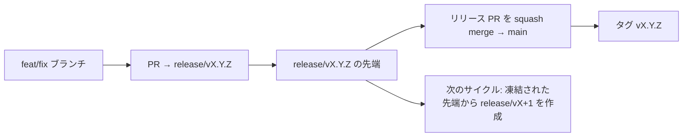

# Branching & Release Model (日本語)

🌐 **Languages:** 🇺🇸 [English](../../../../ops/BRANCHING_MODEL.md) · 🇪🇹 [am](../../../am/docs/ops/BRANCHING_MODEL.md) · 🇸🇦 [ar](../../../ar/docs/ops/BRANCHING_MODEL.md) · 🇦🇿 [az](../../../az/docs/ops/BRANCHING_MODEL.md) · 🇧🇬 [bg](../../../bg/docs/ops/BRANCHING_MODEL.md) · 🇧🇩 [bn](../../../bn/docs/ops/BRANCHING_MODEL.md) · 🇧🇦 [bs](../../../bs/docs/ops/BRANCHING_MODEL.md) · 🇨🇿 [cs](../../../cs/docs/ops/BRANCHING_MODEL.md) · 🇩🇰 [da](../../../da/docs/ops/BRANCHING_MODEL.md) · 🇩🇪 [de](../../../de/docs/ops/BRANCHING_MODEL.md) · 🇬🇷 [el](../../../el/docs/ops/BRANCHING_MODEL.md) · 🇪🇸 [es](../../../es/docs/ops/BRANCHING_MODEL.md) · 🇪🇪 [et](../../../et/docs/ops/BRANCHING_MODEL.md) · 🇮🇷 [fa](../../../fa/docs/ops/BRANCHING_MODEL.md) · 🇫🇮 [fi](../../../fi/docs/ops/BRANCHING_MODEL.md) · 🇫🇷 [fr](../../../fr/docs/ops/BRANCHING_MODEL.md) · 🇮🇪 [ga](../../../ga/docs/ops/BRANCHING_MODEL.md) · 🇮🇳 [gu](../../../gu/docs/ops/BRANCHING_MODEL.md) · 🇳🇬 [ha](../../../ha/docs/ops/BRANCHING_MODEL.md) · 🇮🇱 [he](../../../he/docs/ops/BRANCHING_MODEL.md) · 🇮🇳 [hi](../../../hi/docs/ops/BRANCHING_MODEL.md) · 🇭🇷 [hr](../../../hr/docs/ops/BRANCHING_MODEL.md) · 🇭🇺 [hu](../../../hu/docs/ops/BRANCHING_MODEL.md) · 🇦🇲 [hy](../../../hy/docs/ops/BRANCHING_MODEL.md) · 🇮🇩 [id](../../../id/docs/ops/BRANCHING_MODEL.md) · 🇳🇬 [ig](../../../ig/docs/ops/BRANCHING_MODEL.md) · 🇮🇹 [it](../../../it/docs/ops/BRANCHING_MODEL.md) · 🇬🇪 [ka](../../../ka/docs/ops/BRANCHING_MODEL.md) · 🇰🇭 [km](../../../km/docs/ops/BRANCHING_MODEL.md) · 🇮🇳 [kn](../../../kn/docs/ops/BRANCHING_MODEL.md) · 🇰🇷 [ko](../../../ko/docs/ops/BRANCHING_MODEL.md) · 🇱🇹 [lt](../../../lt/docs/ops/BRANCHING_MODEL.md) · 🇱🇻 [lv](../../../lv/docs/ops/BRANCHING_MODEL.md) · 🇮🇳 [ml](../../../ml/docs/ops/BRANCHING_MODEL.md) · 🇮🇳 [mr](../../../mr/docs/ops/BRANCHING_MODEL.md) · 🇲🇾 [ms](../../../ms/docs/ops/BRANCHING_MODEL.md) · 🇲🇹 [mt](../../../mt/docs/ops/BRANCHING_MODEL.md) · 🇲🇲 [my](../../../my/docs/ops/BRANCHING_MODEL.md) · 🇳🇵 [ne](../../../ne/docs/ops/BRANCHING_MODEL.md) · 🇳🇱 [nl](../../../nl/docs/ops/BRANCHING_MODEL.md) · 🇳🇴 [no](../../../no/docs/ops/BRANCHING_MODEL.md) · 🇮🇳 [or](../../../or/docs/ops/BRANCHING_MODEL.md) · 🇮🇳 [pa](../../../pa/docs/ops/BRANCHING_MODEL.md) · 🇵🇭 [phi](../../../phi/docs/ops/BRANCHING_MODEL.md) · 🇵🇱 [pl](../../../pl/docs/ops/BRANCHING_MODEL.md) · 🇵🇹 [pt](../../../pt/docs/ops/BRANCHING_MODEL.md) · 🇧🇷 [pt-BR](../../../pt-BR/docs/ops/BRANCHING_MODEL.md) · 🇷🇴 [ro](../../../ro/docs/ops/BRANCHING_MODEL.md) · 🇷🇺 [ru](../../../ru/docs/ops/BRANCHING_MODEL.md) · 🇱🇰 [si](../../../si/docs/ops/BRANCHING_MODEL.md) · 🇸🇰 [sk](../../../sk/docs/ops/BRANCHING_MODEL.md) · 🇸🇮 [sl](../../../sl/docs/ops/BRANCHING_MODEL.md) · 🇷🇸 [sr](../../../sr/docs/ops/BRANCHING_MODEL.md) · 🇸🇪 [sv](../../../sv/docs/ops/BRANCHING_MODEL.md) · 🇰🇪 [sw](../../../sw/docs/ops/BRANCHING_MODEL.md) · 🇮🇳 [ta](../../../ta/docs/ops/BRANCHING_MODEL.md) · 🇮🇳 [te](../../../te/docs/ops/BRANCHING_MODEL.md) · 🇹🇭 [th](../../../th/docs/ops/BRANCHING_MODEL.md) · 🇹🇷 [tr](../../../tr/docs/ops/BRANCHING_MODEL.md) · 🇺🇦 [uk-UA](../../../uk-UA/docs/ops/BRANCHING_MODEL.md) · 🇵🇰 [ur](../../../ur/docs/ops/BRANCHING_MODEL.md) · 🇺🇿 [uz](../../../uz/docs/ops/BRANCHING_MODEL.md) · 🇻🇳 [vi](../../../vi/docs/ops/BRANCHING_MODEL.md) · 🇳🇬 [yo](../../../yo/docs/ops/BRANCHING_MODEL.md) · 🇨🇳 [zh-CN](../../../zh-CN/docs/ops/BRANCHING_MODEL.md) · 🇹🇼 [zh-TW](../../../zh-TW/docs/ops/BRANCHING_MODEL.md)

---

OmniRoute は **並行サイクル** リリースモデルを採用しています。アクティブなサイクルには専用の `release/vX.Y.Z`
ブランチ、公開済みの系列には `main`、そしてそのサイクルのリリース時には変更不可能な
`vX.Y.Z` タグを使用します。コミットが `release/*` _と_ `main`
の両方に取り込まれるのは想定どおりであり、手違いではありません。

メンテナー向けの詳細は `CLAUDE.md`（厳守ルール #21）および
[RELEASE_CHECKLIST.md](./RELEASE_CHECKLIST.md) に記載されています。このページは、一般の
コントリビューター向けの概要です。

## 概要

| Ref              | 役割                                                                                                  |
| ---------------- | ----------------------------------------------------------------------------------------------------- |
| `release/vX.Y.Z` | **アクティブなサイクル** — そのバージョンの日々の開発と PR のマージ先                                 |
| `main`           | **公開済みの系列** — リリース時に、そのサイクルが squash merge されるブランチ                         |
| `vX.Y.Z`（タグ） | **リリースマーカー** — リリース時に作成される、変更不可能な「実際にリリースされた内容」へのポインター |



## PR のターゲットはどこにすべきですか？

**アクティブな `release/vX.Y.Z` ブランチをターゲットにしてください。`main` ではありません。**

1. 開いている `release/v*` ブランチのうち、最も高いバージョンを探します（執筆時点の例:
   `release/v3.8.49`）。
2. その先端からブランチを作成します（`git fetch` を実行し、チェックアウトするか、その上に rebase します）。
3. **base = その `release/vX.Y.Z`** として PR を作成します。

`main` は日々の統合に使用するブランチではありません。`main`
をターゲットにして作成された PR は通常、マージ前にターゲットを変更する必要があります。

## リリース凍結（並行サイクル）

リリースの整合性確認中は、`release-freeze` ラベルが付いたマーカー issue が
作成されます。これは**開発を停止するものではありません**。

- 凍結された `release/vX.Y.Z` は、そのリリースを担当するリリースキャプテンが管理します。
- コントリビューターが作業を引き続き取り込めるように、凍結された先端から次のサイクルの `release/vX+1` を作成します。
- 凍結されたブランチをまだターゲットにしているオープンな PR は、アクティブな（最も高いバージョンの）
  `release/v*` ブランチへ**ターゲットを変更**する必要があります。

使用したいブランチがマージ可能だと判断する前に、オープンな凍結がないか確認してください。

```bash
gh issue list --repo diegosouzapw/OmniRoute --label release-freeze --state open
```

マージの仕組み（オーナーが `queue` ラベルを付与 → Mergify）は、
[MERGE_TRAIN.md](./MERGE_TRAIN.md) に記載されています。

## ブランチとタグの両方が必要なのはなぜですか？

| 成果物           | 存続期間         | 目的                                                                     |
| ---------------- | ---------------- | ------------------------------------------------------------------------ |
| `release/vX.Y.Z` | 進行中のサイクル | レビュー済みの PR を集約し、CI が成功する状態を維持し、PR のベースとなる |
| タグ `vX.Y.Z`    | 永続             | npm / GitHub Releases にリリースされた正確な内容を示す                   |

ブランチは作業場であり、タグは封印されたパッケージです。`main` への squash merge 後、
前のリリース PR の完了を待つことなく、次のサイクルは `release/vX+1` で継続します。

## 関連ドキュメント

- [CONTRIBUTING.md](../../CONTRIBUTING.md) — セットアップ、テスト、PR チェックリスト
- [RELEASE_CHECKLIST.md](./RELEASE_CHECKLIST.md) — リリース前の検証
- [MERGE_TRAIN.md](./MERGE_TRAIN.md) — マージキューとフォールバック用のマージトレイン
- [RELEASE_GREEN.md](./RELEASE_GREEN.md) — リリースブランチの先端を正常な状態に保つ方法
