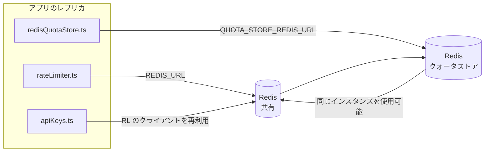

# Redis Production Configuration Guide (日本語)

🌐 **Languages:** 🇺🇸 [English](../../../../ops/REDIS_PRODUCTION_CONFIG.md) · 🇪🇹 [am](../../../am/docs/ops/REDIS_PRODUCTION_CONFIG.md) · 🇸🇦 [ar](../../../ar/docs/ops/REDIS_PRODUCTION_CONFIG.md) · 🇦🇿 [az](../../../az/docs/ops/REDIS_PRODUCTION_CONFIG.md) · 🇧🇬 [bg](../../../bg/docs/ops/REDIS_PRODUCTION_CONFIG.md) · 🇧🇩 [bn](../../../bn/docs/ops/REDIS_PRODUCTION_CONFIG.md) · 🇧🇦 [bs](../../../bs/docs/ops/REDIS_PRODUCTION_CONFIG.md) · 🇨🇿 [cs](../../../cs/docs/ops/REDIS_PRODUCTION_CONFIG.md) · 🇩🇰 [da](../../../da/docs/ops/REDIS_PRODUCTION_CONFIG.md) · 🇩🇪 [de](../../../de/docs/ops/REDIS_PRODUCTION_CONFIG.md) · 🇬🇷 [el](../../../el/docs/ops/REDIS_PRODUCTION_CONFIG.md) · 🇪🇸 [es](../../../es/docs/ops/REDIS_PRODUCTION_CONFIG.md) · 🇪🇪 [et](../../../et/docs/ops/REDIS_PRODUCTION_CONFIG.md) · 🇮🇷 [fa](../../../fa/docs/ops/REDIS_PRODUCTION_CONFIG.md) · 🇫🇮 [fi](../../../fi/docs/ops/REDIS_PRODUCTION_CONFIG.md) · 🇫🇷 [fr](../../../fr/docs/ops/REDIS_PRODUCTION_CONFIG.md) · 🇮🇪 [ga](../../../ga/docs/ops/REDIS_PRODUCTION_CONFIG.md) · 🇮🇳 [gu](../../../gu/docs/ops/REDIS_PRODUCTION_CONFIG.md) · 🇳🇬 [ha](../../../ha/docs/ops/REDIS_PRODUCTION_CONFIG.md) · 🇮🇱 [he](../../../he/docs/ops/REDIS_PRODUCTION_CONFIG.md) · 🇮🇳 [hi](../../../hi/docs/ops/REDIS_PRODUCTION_CONFIG.md) · 🇭🇷 [hr](../../../hr/docs/ops/REDIS_PRODUCTION_CONFIG.md) · 🇭🇺 [hu](../../../hu/docs/ops/REDIS_PRODUCTION_CONFIG.md) · 🇦🇲 [hy](../../../hy/docs/ops/REDIS_PRODUCTION_CONFIG.md) · 🇮🇩 [id](../../../id/docs/ops/REDIS_PRODUCTION_CONFIG.md) · 🇳🇬 [ig](../../../ig/docs/ops/REDIS_PRODUCTION_CONFIG.md) · 🇮🇹 [it](../../../it/docs/ops/REDIS_PRODUCTION_CONFIG.md) · 🇬🇪 [ka](../../../ka/docs/ops/REDIS_PRODUCTION_CONFIG.md) · 🇰🇭 [km](../../../km/docs/ops/REDIS_PRODUCTION_CONFIG.md) · 🇮🇳 [kn](../../../kn/docs/ops/REDIS_PRODUCTION_CONFIG.md) · 🇰🇷 [ko](../../../ko/docs/ops/REDIS_PRODUCTION_CONFIG.md) · 🇱🇹 [lt](../../../lt/docs/ops/REDIS_PRODUCTION_CONFIG.md) · 🇱🇻 [lv](../../../lv/docs/ops/REDIS_PRODUCTION_CONFIG.md) · 🇮🇳 [ml](../../../ml/docs/ops/REDIS_PRODUCTION_CONFIG.md) · 🇮🇳 [mr](../../../mr/docs/ops/REDIS_PRODUCTION_CONFIG.md) · 🇲🇾 [ms](../../../ms/docs/ops/REDIS_PRODUCTION_CONFIG.md) · 🇲🇹 [mt](../../../mt/docs/ops/REDIS_PRODUCTION_CONFIG.md) · 🇲🇲 [my](../../../my/docs/ops/REDIS_PRODUCTION_CONFIG.md) · 🇳🇵 [ne](../../../ne/docs/ops/REDIS_PRODUCTION_CONFIG.md) · 🇳🇱 [nl](../../../nl/docs/ops/REDIS_PRODUCTION_CONFIG.md) · 🇳🇴 [no](../../../no/docs/ops/REDIS_PRODUCTION_CONFIG.md) · 🇮🇳 [or](../../../or/docs/ops/REDIS_PRODUCTION_CONFIG.md) · 🇮🇳 [pa](../../../pa/docs/ops/REDIS_PRODUCTION_CONFIG.md) · 🇵🇭 [phi](../../../phi/docs/ops/REDIS_PRODUCTION_CONFIG.md) · 🇵🇱 [pl](../../../pl/docs/ops/REDIS_PRODUCTION_CONFIG.md) · 🇵🇹 [pt](../../../pt/docs/ops/REDIS_PRODUCTION_CONFIG.md) · 🇧🇷 [pt-BR](../../../pt-BR/docs/ops/REDIS_PRODUCTION_CONFIG.md) · 🇷🇴 [ro](../../../ro/docs/ops/REDIS_PRODUCTION_CONFIG.md) · 🇷🇺 [ru](../../../ru/docs/ops/REDIS_PRODUCTION_CONFIG.md) · 🇱🇰 [si](../../../si/docs/ops/REDIS_PRODUCTION_CONFIG.md) · 🇸🇰 [sk](../../../sk/docs/ops/REDIS_PRODUCTION_CONFIG.md) · 🇸🇮 [sl](../../../sl/docs/ops/REDIS_PRODUCTION_CONFIG.md) · 🇷🇸 [sr](../../../sr/docs/ops/REDIS_PRODUCTION_CONFIG.md) · 🇸🇪 [sv](../../../sv/docs/ops/REDIS_PRODUCTION_CONFIG.md) · 🇰🇪 [sw](../../../sw/docs/ops/REDIS_PRODUCTION_CONFIG.md) · 🇮🇳 [ta](../../../ta/docs/ops/REDIS_PRODUCTION_CONFIG.md) · 🇮🇳 [te](../../../te/docs/ops/REDIS_PRODUCTION_CONFIG.md) · 🇹🇭 [th](../../../th/docs/ops/REDIS_PRODUCTION_CONFIG.md) · 🇹🇷 [tr](../../../tr/docs/ops/REDIS_PRODUCTION_CONFIG.md) · 🇺🇦 [uk-UA](../../../uk-UA/docs/ops/REDIS_PRODUCTION_CONFIG.md) · 🇵🇰 [ur](../../../ur/docs/ops/REDIS_PRODUCTION_CONFIG.md) · 🇺🇿 [uz](../../../uz/docs/ops/REDIS_PRODUCTION_CONFIG.md) · 🇻🇳 [vi](../../../vi/docs/ops/REDIS_PRODUCTION_CONFIG.md) · 🇳🇬 [yo](../../../yo/docs/ops/REDIS_PRODUCTION_CONFIG.md) · 🇨🇳 [zh-CN](../../../zh-CN/docs/ops/REDIS_PRODUCTION_CONFIG.md) · 🇹🇼 [zh-TW](../../../zh-TW/docs/ops/REDIS_PRODUCTION_CONFIG.md)

---

## 概要

Redis は OmniRoute における**任意のソフト依存関係**です。Redis が利用できない場合でも、アプリケーションは正常に縮退し（インメモリのフォールバックを使用）、動作を継続します。本番環境では、Redis をチューニングすることで、4 つの異なるワークロードのレイテンシーを削減できます。

| ワークロード                         | ドライバー                    | クライアントファクトリー                                     | キーパターン                                              |
| ------------------------------------ | ----------------------------- | ------------------------------------------------------------ | --------------------------------------------------------- |
| レート制限                           | `rateLimiter.ts`              | `getRedisClient()` — 遅延初期化される `ioredis` シングルトン | `<prefix>rl:*` Lua によるアトミックなレート制限ウィンドウ |
| 認証キャッシュ                       | `apiKeys.ts`                  | `rateLimiter` のクライアントを再利用                         | TTL 付きの `<prefix>auth:api_key:<sha256>`                |
| クォータストア                       | `redisQuotaStore.ts`          | 個別の `getRedisClient(url)` シングルトン                    | インスタンスごとに設定可能な `<prefix>quota:*`            |
| ウォームアップ用サーキットブレーカー | `redisCircuitBreakerStore.ts` | `circuitBreakerFactory.ts` 内の個別クライアント              | `<prefix>warmup:cb:<connectionId>`                        |

4 つのワークロードはすべて単一の名前空間プレフィックスを共有するため、OmniRoute は他のアプリケーションと単一の Redis インスタンス（例: `127.0.0.1:6379`）上で共存できます。[キーの名前空間](#key-namespacing)を参照してください。

---

## 現在の設定（コード上のデフォルト）

| 設定                               | 値                                                           | 定義場所                                                                              |
| ---------------------------------- | ------------------------------------------------------------ | ------------------------------------------------------------------------------------- |
| `REDIS_URL` 環境変数               | `redis://redis:6379`（compose）、任意                        | `rateLimiter.ts:5`, `.env.example`                                                    |
| `REDIS_KEY_PREFIX` 環境変数        | `omniroute:`（デフォルト）                                   | `rateLimiter.ts`, `redisQuotaStore.ts`, `redisCircuitBreakerStore.ts`, `.env.example` |
| `QUOTA_STORE_REDIS_URL` 環境変数   | 個別に設定でき、`REDIS_URL` と異なる値も指定可能             | `quota/storeFactory.ts`                                                               |
| `QUOTA_STORE_DRIVER`               | `"sqlite"`（デフォルト）、任意で `"redis"`                   | `quota/storeFactory.ts`                                                               |
| ioredis `maxRetriesPerRequest`     | `3`                                                          | `rateLimiter.ts` のクライアント作成処理                                               |
| `enableReadyCheck`                 | 未設定（ioredis のデフォルト: `true`）                       | —                                                                                     |
| `lazyConnect`                      | 未設定（ioredis のデフォルト: `false`）                      | —                                                                                     |
| `retryStrategy`                    | 未設定（ioredis のデフォルト: ベース 200ms、指数バックオフ） | —                                                                                     |
| TLS / パスワード / DB インデックス | **未設定**                                                   | —                                                                                     |
| Sentinel / Cluster                 | **未設定** — スタンドアロンの単一ノードのみ                  | —                                                                                     |

---

## キーの名前空間

OmniRoute は、ホスト上で稼働する他のサービスと Redis インスタンスを共有します。名前空間がない場合、`auth:api_key:<sha256>` や `rl:*` などのキーが、同じ Redis を使用する他のアプリケーションのキーと衝突する可能性があります（このインスタンスでは、他のサービスとともに Redis が `127.0.0.1:6379` で稼働します）。

すべての OmniRoute キーにプレフィックスを付けるには、`REDIS_KEY_PREFIX` に空でない文字列を設定します。

```bash
# .env — すべての OmniRoute キーは omniroute:rl:*、omniroute:auth:*、omniroute:quota:*、omniroute:warmup:cb:* になります
REDIS_KEY_PREFIX=omniroute:
```

- **デフォルト:** `omniroute:`（`REDIS_KEY_PREFIX` が未設定または空の場合に適用）。
- **適用対象:** レートリミッターと認証キャッシュ（`keyPrefix` を介して共有される `ioredis` クライアント）、クォータストア（`KEY_PREFIX = "${REDIS_KEY_PREFIX}quota"`）、およびウォームアップ用サーキットブレーカー（`KEY_PREFIX = "${REDIS_KEY_PREFIX}warmup:cb:"`）。
- Redis にキーがすでに存在する状態で**プレフィックスを変更すると**、古いキーは孤立します（TTL / LRU によって期限切れになります）。安全に変更でき、移行は不要です。唯一の例外は、禁止としてマークされた接続に対応するウォームアップ用サーキットブレーカーキーです。このキーは TTL なしで永続化されるため、`redis-cli --scan --pattern '<old-prefix>warmup:cb:*'` で残存キーを一覧表示し、削除してください。
- **ioredis の `keyPrefix`** は、書き込み時にプレフィックスを自動的に追加し、読み取り時に自動的に取り除くため、アプリケーションコードからプレフィックスが見えることはありません。

---

## 推奨される本番環境向けチューニング

### 1. コネクションプール / クライアントオプション（ioredis の `Redis` コンストラクター）

現在のコードでは、カスタムオプションなしで単一の `new Redis(url)` を作成しています。本番環境の
マルチレプリカ構成では、コード内でクライアントファクトリを渡すか、`getRedisClient()` をラップしてください。

```typescript
const redis = new Redis(REDIS_URL, {
  maxRetriesPerRequest: null, // 再試行回数を制限せず、retryStrategy に判断を委ねる
  enableReadyCheck: true, // 呼び出しを受け付ける前にサーバーの準備完了を確認する
  lazyConnect: true, // 構築時には接続せず、最初の呼び出しまで待機する
  retryStrategy: (times) => {
    if (times > 10) return null; // 10 回の再試行後に断念し、後で再接続する
    return Math.min(times * 200, 5000); // 200ms、400ms、…、上限 5s
  },
  enableAutoPipelining: true, // 同時実行されるコマンドを 1 回の TCP 書き込みにまとめる
  keepAlive: 10000, // 10s ごとに TCP keep-alive を実行する
});
```

**主なトレードオフ：**

- `maxRetriesPerRequest: null` + `retryStrategy` — Redis の一時的な再起動によって
  すべてのリクエストが即座に失敗しないため、本番環境では推奨されます。
  `checkRateLimit()` のインメモリフォールバックが障害経路を吸収します。
- `lazyConnect: true` — サーバーが接続の受け付けを開始する前に Redis が起動している必要がなくなり、
  起動時の依存関係を回避できます。
- `enableAutoPipelining: true` — 同時実行されるレート制限チェックのラウンドトリップを削減します。
  単一接続で 50 RPS を超える場合に効果的です。

### 2. Redis サーバー設定（`redis.conf`）

```
# メモリ
maxmemory 80%                        # OS のページキャッシュ用の余裕を残す
maxmemory-policy allkeys-lru         # メモリ逼迫時に古い認証キャッシュエントリを削除する

# 永続化（任意 — OmniRoute は永続化なしでもクラッシュに対して安全）
save 300 1                           # 1 個以上のキーが変更された場合、少なくとも 5 分ごとにスナップショットを作成する
appendonly no                        # AOF は不要。データは再生成可能
appendfsync no                       # fsync のオーバーヘッドなし（RDB で十分）

# ネットワーク
timeout 0                            # アイドル接続を切断しない
tcp-keepalive 300                    # 5 分間隔の keep-alive
tcp-backlog 511                      # バースト負荷に備えた接続バックログ

# パフォーマンス
hz 10                                # デフォルト。レイテンシー重視の場合は 100
activedefrag yes                     # フラグメンテーションが 10% を超えた場合に自動デフラグする
```

**`maxmemory-policy allkeys-lru` のトレードオフ：** メモリ逼迫時には、認証キャッシュエントリが
削除される可能性があります。これは安全です。`setCachedApiKey` はキャッシュミス時に必ず再投入し、
SQLite フォールバックが信頼できる正本となります。レートリミッターの Lua スクリプトが作成するキーは小さく、
設計上、有効期間も短くなっています。

### 3. Docker Compose の設定

本番用 Compose（`docker-compose.prod.yml`）では `redis:8.6.2-alpine` を使用しています。以下を追加してください。

```yaml
redis:
  image: redis:8.6.2-alpine
  command:
    [
      "redis-server",
      "--maxmemory",
      "512mb",
      "--maxmemory-policy",
      "allkeys-lru",
      "--activedefrag",
      "yes",
      "--save",
      "300 1",
    ]
  healthcheck:
    test: ["CMD", "redis-cli", "ping"]
    interval: 10s
    timeout: 3s
    retries: 3
    start_period: 5s
```

### 4. マルチインスタンス / スケーリングに関する考慮事項

**すべてのレプリカで単一の Redis を使用** — レートリミッターの Lua スクリプトは、単一の
信頼できるキースペースに依存しています。各レプリカの背後で複数の Redis インスタンスを使用すると、
アトミック性が失われ、割り当て量が倍増します。すべてのアプリケーションレプリカで、単一の Redis
（またはフェイルオーバー機能を備えた Redis Sentinel クラスター）を使用してください。

**接続数：** 各アプリケーションレプリカは、Redis への **2 本の TCP 接続**
（レートリミッタークライアント + クォータストアクライアント）を開きます。10 レプリカでは 20 接続となり、
デフォルトの Redis インスタンスにおける 10k 接続の上限を十分に下回ります。

### 5. 監視

ヘルスチェックエンドポイント経由で公開します。

```typescript
// src/app/api/monitoring/health/route.ts はすでに rateLimiter 関数を呼び出している
// Redis 固有のチェックを追加する：
//   1. ioredis の .ping() による PING レイテンシー
//   2. INFO memory によるメモリ使用量
//   3. INFO clients による接続数
//   4. maxmemory-policy のヒット率（evicted_keys / keyspace_hits）
```

監視すべき主なメトリクス：

- **1 秒あたりの削除済みキー数** — ゼロ以外の状態が継続する場合は、`maxmemory` を増やす
- **ブロックされたクライアント数** — ゼロ以外の場合、Lua スクリプトが遅いか、競合が激しい可能性がある
- **拒否された接続数** — 接続上限に到達していることを示す。20 接続ではまれ

---

## アーキテクチャ図



---

## 参考資料

| ファイル                           | 目的                                                                              |
| ---------------------------------- | --------------------------------------------------------------------------------- |
| `src/shared/utils/rateLimiter.ts`  | プライマリ Redis クライアント、Lua レート制限スクリプト、インメモリフォールバック |
| `src/lib/db/apiKeys.ts`            | 認証キャッシュ — Redis→SQLite フォールバック                                      |
| `src/lib/quota/redisQuotaStore.ts` | オプションのクォータストア用の独立した Redis クライアント                         |
| `src/lib/quota/storeFactory.ts`    | `sqlite` と `redis` のクォータドライバーを切り替える                              |
| `docker-compose.prod.yml`          | 本番環境用 Redis コンテナ（イメージ `redis:8.6.2-alpine`）                        |
| `.env.example`                     | Redis 環境変数のドキュメント                                                      |
| `src/app/api/local/redis/`         | 開発用コンテナのオーケストレーション向け API ルート                               |
| `bin/cli/commands/redis.mjs`       | 開発用コンテナのオーケストレーション向け CLI コマンド                             |
