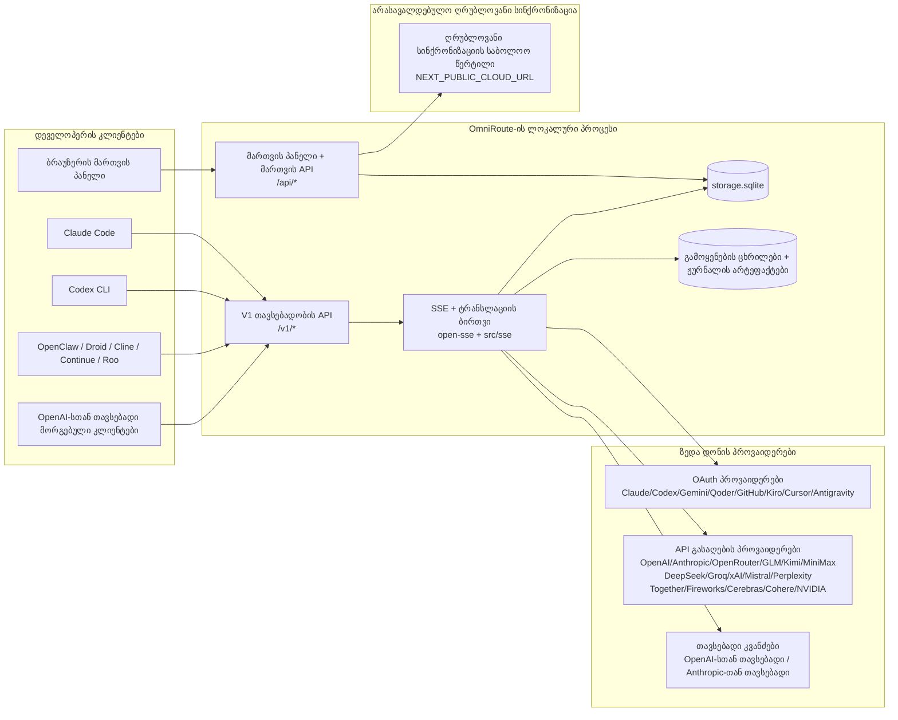
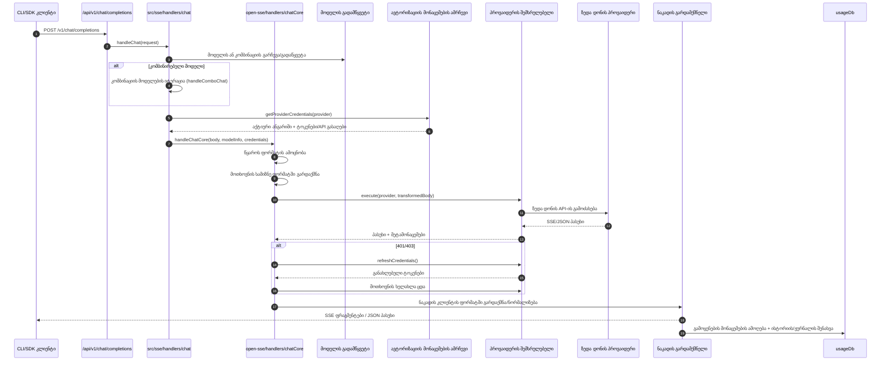
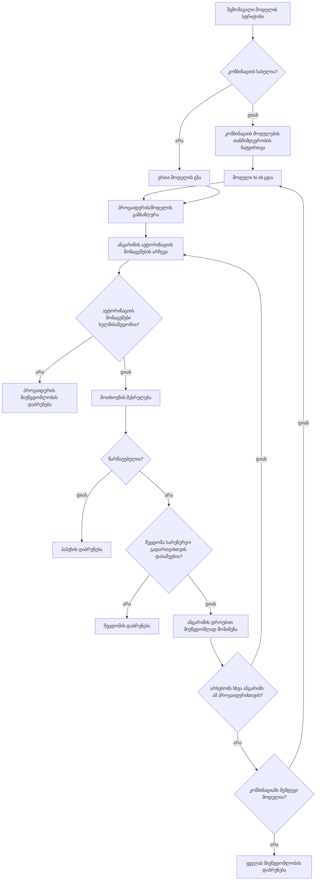
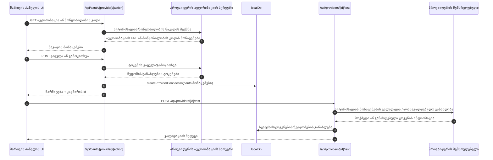
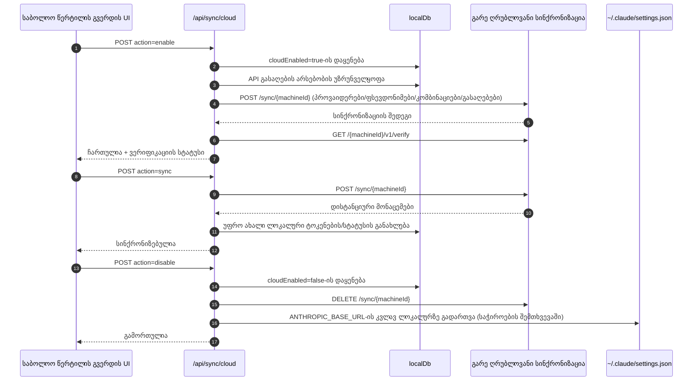
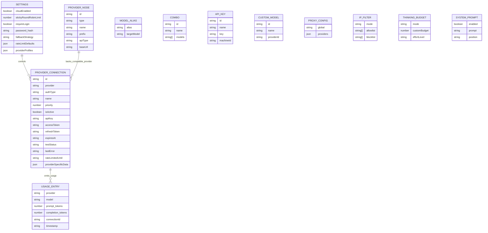
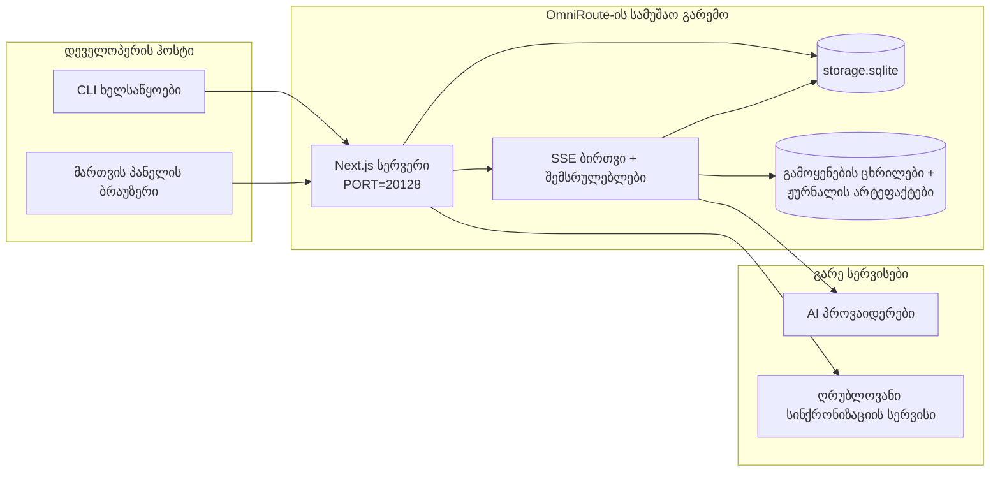

# OmniRoute Architecture (ქართული)

🌐 **Languages:** 🇺🇸 [English](../../../../architecture/ARCHITECTURE.md) · 🇪🇹 [am](../../../am/docs/architecture/ARCHITECTURE.md) · 🇸🇦 [ar](../../../ar/docs/architecture/ARCHITECTURE.md) · 🇦🇿 [az](../../../az/docs/architecture/ARCHITECTURE.md) · 🇧🇬 [bg](../../../bg/docs/architecture/ARCHITECTURE.md) · 🇧🇩 [bn](../../../bn/docs/architecture/ARCHITECTURE.md) · 🇨🇿 [cs](../../../cs/docs/architecture/ARCHITECTURE.md) · 🇩🇰 [da](../../../da/docs/architecture/ARCHITECTURE.md) · 🇩🇪 [de](../../../de/docs/architecture/ARCHITECTURE.md) · 🇬🇷 [el](../../../el/docs/architecture/ARCHITECTURE.md) · 🇪🇸 [es](../../../es/docs/architecture/ARCHITECTURE.md) · 🇪🇪 [et](../../../et/docs/architecture/ARCHITECTURE.md) · 🇮🇷 [fa](../../../fa/docs/architecture/ARCHITECTURE.md) · 🇫🇮 [fi](../../../fi/docs/architecture/ARCHITECTURE.md) · 🇫🇷 [fr](../../../fr/docs/architecture/ARCHITECTURE.md) · 🇮🇪 [ga](../../../ga/docs/architecture/ARCHITECTURE.md) · 🇮🇳 [gu](../../../gu/docs/architecture/ARCHITECTURE.md) · 🇳🇬 [ha](../../../ha/docs/architecture/ARCHITECTURE.md) · 🇮🇱 [he](../../../he/docs/architecture/ARCHITECTURE.md) · 🇮🇳 [hi](../../../hi/docs/architecture/ARCHITECTURE.md) · 🇭🇷 [hr](../../../hr/docs/architecture/ARCHITECTURE.md) · 🇭🇺 [hu](../../../hu/docs/architecture/ARCHITECTURE.md) · 🇦🇲 [hy](../../../hy/docs/architecture/ARCHITECTURE.md) · 🇮🇩 [id](../../../id/docs/architecture/ARCHITECTURE.md) · 🇳🇬 [ig](../../../ig/docs/architecture/ARCHITECTURE.md) · 🇮🇹 [it](../../../it/docs/architecture/ARCHITECTURE.md) · 🇯🇵 [ja](../../../ja/docs/architecture/ARCHITECTURE.md) · 🇰🇭 [km](../../../km/docs/architecture/ARCHITECTURE.md) · 🇮🇳 [kn](../../../kn/docs/architecture/ARCHITECTURE.md) · 🇰🇷 [ko](../../../ko/docs/architecture/ARCHITECTURE.md) · 🇱🇹 [lt](../../../lt/docs/architecture/ARCHITECTURE.md) · 🇱🇻 [lv](../../../lv/docs/architecture/ARCHITECTURE.md) · 🇮🇳 [ml](../../../ml/docs/architecture/ARCHITECTURE.md) · 🇮🇳 [mr](../../../mr/docs/architecture/ARCHITECTURE.md) · 🇲🇾 [ms](../../../ms/docs/architecture/ARCHITECTURE.md) · 🇲🇹 [mt](../../../mt/docs/architecture/ARCHITECTURE.md) · 🇲🇲 [my](../../../my/docs/architecture/ARCHITECTURE.md) · 🇳🇵 [ne](../../../ne/docs/architecture/ARCHITECTURE.md) · 🇳🇱 [nl](../../../nl/docs/architecture/ARCHITECTURE.md) · 🇳🇴 [no](../../../no/docs/architecture/ARCHITECTURE.md) · 🇮🇳 [or](../../../or/docs/architecture/ARCHITECTURE.md) · 🇮🇳 [pa](../../../pa/docs/architecture/ARCHITECTURE.md) · 🇵🇭 [phi](../../../phi/docs/architecture/ARCHITECTURE.md) · 🇵🇱 [pl](../../../pl/docs/architecture/ARCHITECTURE.md) · 🇵🇹 [pt](../../../pt/docs/architecture/ARCHITECTURE.md) · 🇧🇷 [pt-BR](../../../pt-BR/docs/architecture/ARCHITECTURE.md) · 🇷🇴 [ro](../../../ro/docs/architecture/ARCHITECTURE.md) · 🇷🇺 [ru](../../../ru/docs/architecture/ARCHITECTURE.md) · 🇱🇰 [si](../../../si/docs/architecture/ARCHITECTURE.md) · 🇸🇰 [sk](../../../sk/docs/architecture/ARCHITECTURE.md) · 🇸🇮 [sl](../../../sl/docs/architecture/ARCHITECTURE.md) · 🇷🇸 [sr](../../../sr/docs/architecture/ARCHITECTURE.md) · 🇸🇪 [sv](../../../sv/docs/architecture/ARCHITECTURE.md) · 🇰🇪 [sw](../../../sw/docs/architecture/ARCHITECTURE.md) · 🇮🇳 [ta](../../../ta/docs/architecture/ARCHITECTURE.md) · 🇮🇳 [te](../../../te/docs/architecture/ARCHITECTURE.md) · 🇹🇭 [th](../../../th/docs/architecture/ARCHITECTURE.md) · 🇹🇷 [tr](../../../tr/docs/architecture/ARCHITECTURE.md) · 🇺🇦 [uk-UA](../../../uk-UA/docs/architecture/ARCHITECTURE.md) · 🇵🇰 [ur](../../../ur/docs/architecture/ARCHITECTURE.md) · 🇺🇿 [uz](../../../uz/docs/architecture/ARCHITECTURE.md) · 🇻🇳 [vi](../../../vi/docs/architecture/ARCHITECTURE.md) · 🇳🇬 [yo](../../../yo/docs/architecture/ARCHITECTURE.md) · 🇨🇳 [zh-CN](../../../zh-CN/docs/architecture/ARCHITECTURE.md) · 🇹🇼 [zh-TW](../../../zh-TW/docs/architecture/ARCHITECTURE.md)

---

🌐 **Languages:** 🇺🇸 [English](../../../../architecture/ARCHITECTURE.md) · 🇪🇹 [am](../../../am/docs/architecture/ARCHITECTURE.md) · 🇸🇦 [ar](../../../ar/docs/architecture/ARCHITECTURE.md) · 🇦🇿 [az](../../../az/docs/architecture/ARCHITECTURE.md) · 🇧🇬 [bg](../../../bg/docs/architecture/ARCHITECTURE.md) · 🇧🇩 [bn](../../../bn/docs/architecture/ARCHITECTURE.md) · 🇨🇿 [cs](../../../cs/docs/architecture/ARCHITECTURE.md) · 🇩🇰 [da](../../../da/docs/architecture/ARCHITECTURE.md) · 🇩🇪 [de](../../../de/docs/architecture/ARCHITECTURE.md) · 🇬🇷 [el](../../../el/docs/architecture/ARCHITECTURE.md) · 🇪🇸 [es](../../../es/docs/architecture/ARCHITECTURE.md) · 🇪🇪 [et](../../../et/docs/architecture/ARCHITECTURE.md) · 🇮🇷 [fa](../../../fa/docs/architecture/ARCHITECTURE.md) · 🇫🇮 [fi](../../../fi/docs/architecture/ARCHITECTURE.md) · 🇫🇷 [fr](../../../fr/docs/architecture/ARCHITECTURE.md) · 🇮🇪 [ga](../../../ga/docs/architecture/ARCHITECTURE.md) · 🇮🇳 [gu](../../../gu/docs/architecture/ARCHITECTURE.md) · 🇳🇬 [ha](../../../ha/docs/architecture/ARCHITECTURE.md) · 🇮🇱 [he](../../../he/docs/architecture/ARCHITECTURE.md) · 🇮🇳 [hi](../../../hi/docs/architecture/ARCHITECTURE.md) · 🇭🇷 [hr](../../../hr/docs/architecture/ARCHITECTURE.md) · 🇭🇺 [hu](../../../hu/docs/architecture/ARCHITECTURE.md) · 🇦🇲 [hy](../../../hy/docs/architecture/ARCHITECTURE.md) · 🇮🇩 [id](../../../id/docs/architecture/ARCHITECTURE.md) · 🇳🇬 [ig](../../../ig/docs/architecture/ARCHITECTURE.md) · 🇮🇹 [it](../../../it/docs/architecture/ARCHITECTURE.md) · 🇯🇵 [ja](../../../ja/docs/architecture/ARCHITECTURE.md) · 🇰🇭 [km](../../../km/docs/architecture/ARCHITECTURE.md) · 🇮🇳 [kn](../../../kn/docs/architecture/ARCHITECTURE.md) · 🇰🇷 [ko](../../../ko/docs/architecture/ARCHITECTURE.md) · 🇱🇹 [lt](../../../lt/docs/architecture/ARCHITECTURE.md) · 🇱🇻 [lv](../../../lv/docs/architecture/ARCHITECTURE.md) · 🇮🇳 [ml](../../../ml/docs/architecture/ARCHITECTURE.md) · 🇮🇳 [mr](../../../mr/docs/architecture/ARCHITECTURE.md) · 🇲🇾 [ms](../../../ms/docs/architecture/ARCHITECTURE.md) · 🇲🇹 [mt](../../../mt/docs/architecture/ARCHITECTURE.md) · 🇲🇲 [my](../../../my/docs/architecture/ARCHITECTURE.md) · 🇳🇵 [ne](../../../ne/docs/architecture/ARCHITECTURE.md) · 🇳🇱 [nl](../../../nl/docs/architecture/ARCHITECTURE.md) · 🇳🇴 [no](../../../no/docs/architecture/ARCHITECTURE.md) · 🇮🇳 [or](../../../or/docs/architecture/ARCHITECTURE.md) · 🇮🇳 [pa](../../../pa/docs/architecture/ARCHITECTURE.md) · 🇵🇭 [phi](../../../phi/docs/architecture/ARCHITECTURE.md) · 🇵🇱 [pl](../../../pl/docs/architecture/ARCHITECTURE.md) · 🇵🇹 [pt](../../../pt/docs/architecture/ARCHITECTURE.md) · 🇧🇷 [pt-BR](../../../pt-BR/docs/architecture/ARCHITECTURE.md) · 🇷🇴 [ro](../../../ro/docs/architecture/ARCHITECTURE.md) · 🇷🇺 [ru](../../../ru/docs/architecture/ARCHITECTURE.md) · 🇱🇰 [si](../../../si/docs/architecture/ARCHITECTURE.md) · 🇸🇰 [sk](../../../sk/docs/architecture/ARCHITECTURE.md) · 🇸🇮 [sl](../../../sl/docs/architecture/ARCHITECTURE.md) · 🇷🇸 [sr](../../../sr/docs/architecture/ARCHITECTURE.md) · 🇸🇪 [sv](../../../sv/docs/architecture/ARCHITECTURE.md) · 🇰🇪 [sw](../../../sw/docs/architecture/ARCHITECTURE.md) · 🇮🇳 [ta](../../../ta/docs/architecture/ARCHITECTURE.md) · 🇮🇳 [te](../../../te/docs/architecture/ARCHITECTURE.md) · 🇹🇭 [th](../../../th/docs/architecture/ARCHITECTURE.md) · 🇹🇷 [tr](../../../tr/docs/architecture/ARCHITECTURE.md) · 🇺🇦 [uk-UA](../../../uk-UA/docs/architecture/ARCHITECTURE.md) · 🇵🇰 [ur](../../../ur/docs/architecture/ARCHITECTURE.md) · 🇺🇿 [uz](../../../uz/docs/architecture/ARCHITECTURE.md) · 🇻🇳 [vi](../../../vi/docs/architecture/ARCHITECTURE.md) · 🇳🇬 [yo](../../../yo/docs/architecture/ARCHITECTURE.md) · 🇨🇳 [zh-CN](../../../zh-CN/docs/architecture/ARCHITECTURE.md) · 🇹🇼 [zh-TW](../../../zh-TW/docs/architecture/ARCHITECTURE.md)

_ბოლოს განახლდა: 2026-06-28_

## მოკლე მიმოხილვა

OmniRoute არის Next.js-ზე აგებული ლოკალური AI მარშრუტიზაციის კარიბჭე და მართვის პანელი.
ის უზრუნველყოფს OpenAI-სთან თავსებად ერთიან საბოლოო წერტილს (`/v1/*`) და ტრაფიკს მარშრუტიზაციას უწევს რამდენიმე ზედა დონის პროვაიდერს შორის, ფორმატების გარდაქმნის, სარეზერვო ვარიანტზე გადართვის, ტოკენის განახლებისა და გამოყენების აღრიცხვის მხარდაჭერით.

ძირითადი შესაძლებლობები:

- OpenAI-სთან თავსებადი API ინტერფეისი CLI-ისა და ხელსაწყოებისთვის (355 პროვაიდერი, 108 შემსრულებელი)
- მოთხოვნებისა და პასუხების გარდაქმნა პროვაიდერების ფორმატებს შორის
- მოდელების კომბინაციის სარეზერვო გადართვა (მრავალმოდელიანი თანმიმდევრობა)
- კომბინაციის სტრუქტურირებული ეტაპები (`provider + model + connection`) შესრულებისას `compositeTiers`-ის მიხედვით დალაგებით
- ანგარიშის დონის სარეზერვო გადართვა (თითოეულ პროვაიდერზე რამდენიმე ანგარიში)
- კვოტის წინასწარი შემოწმება და კვოტის გათვალისწინებით P2C ანგარიშის შერჩევა ჩატის ძირითად ნაკადში
- OAuth-ისა და API გასაღების საშუალებით პროვაიდერთან კავშირების მართვა (22 OAuth პროვაიდერის მოდული)
- ემბედინგების გენერირება `/v1/embeddings`-ის მეშვეობით (18 პროვაიდერი)
- სურათების გენერირება `/v1/images/generations`-ის მეშვეობით (10-ზე მეტი პროვაიდერი, 20-ზე მეტი მოდელი)
- აუდიოს ტრანსკრიფცია `/v1/audio/transcriptions`-ის მეშვეობით (18 პროვაიდერი)
- ტექსტის მეტყველებად გარდაქმნა `/v1/audio/speech`-ის მეშვეობით (24 ჩაშენებული პროვაიდერი)
- ვიდეოს გენერირება `/v1/videos/generations`-ის მეშვეობით (ComfyUI + SD WebUI)
- მუსიკის გენერირება `/v1/music/generations`-ის მეშვეობით (ComfyUI)
- ვებძიება `/v1/search`-ის მეშვეობით (20 პროვაიდერი)
- მოდერაცია `/v1/moderations`-ის მეშვეობით
- ხელახალი რანჟირება `/v1/rerank`-ის მეშვეობით
- მსჯელობის მოდელებისთვის აზროვნების ტეგების (`<think>...</think>`) დამუშავება
- პასუხების გასუფთავება OpenAI SDK-სთან მკაცრი თავსებადობისთვის
- როლების ნორმალიზაცია (developer→system, system→user) პროვაიდერებს შორის თავსებადობისთვის
- სტრუქტურირებული გამომავალი მონაცემების გარდაქმნა (json_schema → Gemini responseSchema)
- პროვაიდერების, გასაღებების, ფსევდონიმების, კომბინაციების, პარამეტრებისა და ფასების ლოკალური შენახვა (მონაცემთა ბაზის 122 მოდული)
- გამოყენებისა და ღირებულების აღრიცხვა და მოთხოვნების ჟურნალირება
- სურვილისამებრ ღრუბლოვანი სინქრონიზაცია რამდენიმე მოწყობილობასა და მდგომარეობას შორის
- IP მისამართების ნებადართული და დაბლოკილი სიები API-ზე წვდომის სამართავად
- აზროვნების ბიუჯეტის მართვა (პირდაპირი გადაცემა/ავტომატური/მორგებული/ადაპტიური)
- გლობალური სისტემური მოთხოვნის ჩასმა
- სესიების თვალყურის დევნება და ციფრული ანაბეჭდების შექმნა
- თითოეული ანგარიშისთვის გაუმჯობესებული სიხშირის შეზღუდვა პროვაიდერის სპეციფიკური პროფილებით
- პროვაიდერების მდგრადობისთვის ავტომატური ამომრთველის შაბლონი
- ერთდროული მასობრივი მოთხოვნებისგან დაცვა mutex ჩაკეტვის მექანიზმით
- ხელმოწერაზე დაფუძნებული მოთხოვნების დუბლირების აღმოფხვრის კეში
- დომენური შრე: ღირებულების წესები, სარეზერვო გადართვის პოლიტიკა, დაბლოკვის პოლიტიკა
- Context Relay: სესიის გადაცემის შეჯამებები ანგარიშების როტაციისას უწყვეტობის შესანარჩუნებლად
- დომენური მდგომარეობის მუდმივი შენახვა (SQLite-ის გამჭოლი ჩაწერის კეში სარეზერვო გადართვებისთვის, ბიუჯეტებისთვის, დაბლოკვებისა და ავტომატური ამომრთველებისთვის)
- პოლიტიკის ძრავა მოთხოვნების ცენტრალიზებული შეფასებისთვის (დაბლოკვა → ბიუჯეტი → სარეზერვო გადართვა)
- მოთხოვნების ტელემეტრია p50/p95/p99 დაყოვნების აგრეგაციით
- კომბინაციის სამიზნეების ტელემეტრია და კომბინაციის სამიზნეების ისტორიული მდგომარეობა `combo_execution_key` / `combo_step_id`-ის მეშვეობით
- კორელაციის ID (X-Request-Id) თავიდან ბოლომდე ტრასირებისთვის
- შესაბამისობის აუდიტის ჟურნალირება, თითოეული API გასაღებისთვის გამორთვის შესაძლებლობით
- შეფასების ჩარჩო LLM-ის ხარისხის უზრუნველსაყოფად
- მდგომარეობის პანელი რეალურ დროში პროვაიდერების ავტომატური ამომრთველების სტატუსით
- MCP სერვერი (110 ხელსაწყო) 3 ტრანსპორტით (stdio/SSE/Streamable HTTP)
- A2A სერვერი (JSON-RPC 2.0 + SSE) უნარებითა და ამოცანების სასიცოცხლო ციკლით
- მეხსიერების სისტემა (ამოღება, ჩასმა, მოძიება, შეჯამება)
- უნარების სისტემა (რეესტრი, შემსრულებელი, იზოლირებული გარემო, ჩაშენებული უნარები)
- MITM პროქსი სერტიფიკატების მართვითა და DNS-ის დამუშავებით
- მოთხოვნაში მავნე ინსტრუქციების ჩასმისგან დამცავი შუალედური პროგრამული შრე
- მოთხოვნების შეკუმშვის კონვეიერი Caveman-ის, RTK-ის, დაწყობილი კონვეიერების, შეკუმშვის კომბინაციების, ენობრივი პაკეტებისა და ანალიტიკის მხარდაჭერით
- ACP-ის (Agent Communication Protocol) რეესტრი
- მოდულური OAuth პროვაიდერები (22 ინდივიდუალური მოდული `src/lib/oauth/providers/`-ის ქვეშ)
- წაშლისა და სრული წაშლის სკრიპტები
- OAuth გარემოს აღდგენის მოქმედება
- WebSocket ხიდი OpenAI-სთან თავსებადი WS კლიენტებისთვის (`/v1/ws`)
- სინქრონიზაციის ტოკენების მართვა (გაცემა/გაუქმება, ETag-ვერსირებული კონფიგურაციის პაკეტის ჩამოტვირთვა)
- GLM Thinking (`glmt`) როგორც სრულფასოვანი პროვაიდერის წინასწარი კონფიგურაცია
- ტოკენების ჰიბრიდული დათვლა (პროვაიდერის მხარეს `/messages/count_tokens`, შეფასებაზე სარეზერვო გადართვით)
- მოდელების ფსევდონიმების ავტომატური ინიციალიზაცია (30-ზე მეტი პროქსით გადაცემის დიალექტის ნორმალიზაცია გაშვებისას)
- უსაფრთხო გამავალი მოთხოვნები SSRF დაცვის მექანიზმით, კერძო URL-ების დაბლოკვითა და მორგებადი განმეორებითი მცდელობებით
- გაგრილების პერიოდის გათვალისწინებით ჩატის მოთხოვნების განმეორებითი მცდელობები მორგებადი `requestRetry`-ითა და `maxRetryIntervalSec`-ით
- შესრულების გარემოს ვალიდაცია Zod-ის გამოყენებით გაშვებისას
- შესაბამისობის აუდიტის v2 ვერსია გვერდებად დაყოფით, პროვაიდერის CRUD მოვლენებითა და SSRF-ით დაბლოკილი ვალიდაციის ჟურნალირებით

ძირითადი შესრულების მოდელი:

- Next.js აპლიკაციის მარშრუტები `src/app/api/*`-ში ახორციელებს როგორც მართვის პანელის API-ებს, ისე თავსებადობის API-ებს
- საზიარო SSE/მარშრუტიზაციის ბირთვი `src/sse/*`-სა და `open-sse/*`-ში ამუშავებს პროვაიდერის შესრულებას, გარდაქმნას, ნაკადურ გადაცემას, სარეზერვო გადართვასა და გამოყენების აღრიცხვას

## საცნობარო დიაგრამები

v3.8.0 პლატფორმის კანონიკური, ვერსიებით კონტროლირებადი Mermaid-ის წყაროები განთავსებულია
[`docs/diagrams/`](../diagrams/README.md)-ში. ორი მათგანი ორიენტირებისთვის ქვემოთაა წარმოდგენილი;
დანარჩენებზე ბმულები მოცემულია შესაბამისი სფეროს სახელმძღვანელოებში.


> წყარო: [diagrams/request-pipeline.mmd](../diagrams/request-pipeline.mmd)


> წყარო: [diagrams/resilience-3layers.mmd](../diagrams/resilience-3layers.mmd) — ბმული ასევე მოცემულია
> [RESILIENCE_GUIDE.md](./RESILIENCE_GUIDE.md)-სა და `CLAUDE.md`-ის მედეგობის საცნობარო ნაწილში.

## მოცულობა და საზღვრები

### მოცულობაში შედის

- ლოკალური კარიბჭის გაშვების გარემო
- მართვის პანელის მართვის API-ები
- პროვაიდერის ავთენტიფიკაცია და ტოკენის განახლება
- მოთხოვნების გარდაქმნა და SSE ნაკადური გადაცემა
- ლოკალური მდგომარეობისა და გამოყენების მონაცემების მუდმივი შენახვა
- ღრუბელთან არასავალდებულო სინქრონიზაციის ორკესტრირება

### მოცულობაში არ შედის

- `NEXT_PUBLIC_CLOUD_URL`-ის უკან არსებული ღრუბლოვანი სერვისის იმპლემენტაცია
- ლოკალური პროცესის გარეთ არსებული პროვაიდერის SLA/მართვის სიბრტყე
- თავად გარე CLI ბინარული ფაილები (Claude CLI, Codex CLI და ა.შ.)

## მართვის პანელის ზედაპირი (მიმდინარე)

ძირითადი გვერდები `src/app/(dashboard)/dashboard/`-ის ქვეშ:

- `/dashboard` — სწრაფი დაწყება და პროვაიდერების მიმოხილვა
- `/dashboard/endpoint` — საბოლოო წერტილის პროქსი + MCP + A2A + API საბოლოო წერტილების ჩანართები
- `/dashboard/providers` — პროვაიდერებთან კავშირები და ავტორიზაციის მონაცემები
- `/dashboard/combos` — კომბინაციის სტრატეგიები, შაბლონები, ნაბიჯებზე დაფუძნებული კონსტრუქტორი, მოდელების მარშრუტიზაციის წესები, ხელით განსაზღვრული მუდმივად შენახული თანმიმდევრობა
- `/dashboard/auto-combo` — ავტომატური კომბინაციის ძრავა: შეფასების წონები, რეჟიმების ნაკრებები, ვირტუალური ქარხნის წინასწარი კონფიგურაციები, ტელემეტრია
- `/dashboard/costs` — ხარჯების აგრეგაცია და ფასების ხილვადობა
- `/dashboard/analytics` — გამოყენების ანალიტიკა, შეფასებები, კომბინაციის სამიზნეების მდგომარეობა
- `/dashboard/limits` — კვოტისა და სიხშირის მართვის საშუალებები
- `/dashboard/cli-tools` — CLI-ის საწყისი კონფიგურაცია, გაშვების გარემოს აღმოჩენა, კონფიგურაციის გენერირება
- `/dashboard/agents` — აღმოჩენილი ACP აგენტები + მომხმარებლის აგენტების რეგისტრაცია
- `/dashboard/cloud-agents` — ღრუბელში განთავსებული აგენტების ამოცანები (Codex Cloud, Devin, Jules) და ამოცანების სასიცოცხლო ციკლი
- `/dashboard/skills` — A2A უნარების რეესტრი, იზოლირებულ გარემოში შესრულება, ჩაშენებული უნარების კატალოგი
- `/dashboard/memory` — მუდმივი სასაუბრო მეხსიერების დათვალიერება და მოძიება
- `/dashboard/webhooks` — გამავალი webhook-ების გამოწერები, საიდუმლოს როტაცია, განმეორებითი მცდელობების სტატისტიკა
- `/dashboard/batch` — პაკეტური დავალებების გაგზავნა და მიმდინარეობა
- `/dashboard/cache` — გამჭოლი წაკითხვისა და მსჯელობის ქეშის სტატისტიკა, გამოდევნის მართვის საშუალებები
- `/dashboard/playground` — ინტერაქტიული სასაუბრო საცდელი გარემო ნებისმიერი კონფიგურირებული კომბინაციისთვის/მოდელისთვის
- `/dashboard/changelog` — აპლიკაციაში ჩაშენებული ცვლილებების ჟურნალის მნახველი (არენდერებს `CHANGELOG.md`-ს)
- `/dashboard/system` — გაშვების გარემოს დიაგნოსტიკა, ვერსიის ინფორმაცია, გარემოს ვალიდაციის ზედაპირი
- `/dashboard/onboarding` — პირველი გაშვების კონფიგურაციის ოსტატი ახალი ინსტალაციებისთვის
- `/dashboard/media` — სურათების/ვიდეოების/მუსიკის საცდელი გარემო
- `/dashboard/search-tools` — ძიების პროვაიდერის ტესტირება და ისტორია
- `/dashboard/health` — უწყვეტი მუშაობის დრო, წრედის ამომრთველები, სიხშირის ლიმიტები, კვოტის მონიტორინგის მქონე სესიები
- `/dashboard/logs` — მოთხოვნების/პროქსის/აუდიტის/კონსოლის ჟურნალები
- `/dashboard/settings` — სისტემის პარამეტრების ჩანართები (ზოგადი, მარშრუტიზაცია, კომბინაციის ნაგულისხმევი მნიშვნელობები და ა.შ.)
- `/dashboard/context/caveman` — Caveman-ის შეკუმშვის წესები, ენობრივი პაკეტები, წინასწარი დათვალიერება და გამოტანის რეჟიმი
- `/dashboard/context/rtk` — RTK-ის ბრძანებების გამოტანის ფილტრები, წინასწარი დათვალიერება და გაშვების გარემოს უსაფრთხოების პარამეტრები
- `/dashboard/context/combos` — მარშრუტიზაციის კომბინაციებზე მინიჭებული სახელდებული შეკუმშვის დამუშავების ჯაჭვები
- `/dashboard/translator` — მთარგმნელის დათვალიერება და მოთხოვნის ფორმატის გარდაქმნის წინასწარი დათვალიერება
- `/dashboard/audit` — შესაბამისობის აუდიტის ჟურნალის ბრაუზერი გვერდებად დაყოფითა და სტრუქტურირებული მეტამონაცემებით
- `/dashboard/usage` — `usage_history`-თან დაკავშირებული, თითოეული მოთხოვნის გამოყენების მონაცემების ბრაუზერი
- `/dashboard/compression` — შეკუმშვის ანალიტიკა, სტატისტიკა და დამუშავების ჯაჭვის მინიჭება
- `/dashboard/api-manager` — API გასაღებების სასიცოცხლო ციკლი და მოდელების ნებართვები

## სისტემის მაღალი დონის კონტექსტი



## ძირითადი გაშვების გარემოს კომპონენტები

## 1) API-ისა და მარშრუტიზაციის ფენა (Next.js აპის მარშრუტები)

მთავარი დირექტორიები:

- `src/app/api/v1/*` და `src/app/api/v1beta/*` თავსებადობის API-ებისთვის
- `src/app/api/*` მართვისა და კონფიგურაციის API-ებისთვის
- Next-ის გადამისამართებები `next.config.mjs`-ში `/v1/*`-ს `/api/v1/*`-თან აკავშირებს

თავსებადობის მნიშვნელოვანი მარშრუტები:

- `src/app/api/v1/chat/completions/route.ts`
- `src/app/api/v1/messages/route.ts`
- `src/app/api/v1/responses/route.ts`
- `src/app/api/v1/models/route.ts` — მოიცავს მორგებულ მოდელებს პარამეტრით `custom: true`
- `src/app/api/v1/embeddings/route.ts` — ვექტორული წარმოდგენების გენერაცია (6 პროვაიდერი)
- `src/app/api/v1/images/generations/route.ts` — გამოსახულებების გენერაცია (4+ პროვაიდერი, მათ შორის Antigravity/Nebius)
- `src/app/api/v1/messages/count_tokens/route.ts`
- `src/app/api/v1/providers/[provider]/chat/completions/route.ts` — თითოეული პროვაიდერისთვის გამოყოფილი ჩატი
- `src/app/api/v1/providers/[provider]/embeddings/route.ts` — თითოეული პროვაიდერისთვის გამოყოფილი ვექტორული წარმოდგენები
- `src/app/api/v1/providers/[provider]/images/generations/route.ts` — თითოეული პროვაიდერისთვის გამოყოფილი გამოსახულებების გენერაცია
- `src/app/api/v1beta/models/route.ts`
- `src/app/api/v1beta/models/[...path]/route.ts`

მართვის დომენები:

- ავთენტიფიკაცია/პარამეტრები: `src/app/api/auth/*`, `src/app/api/settings/*`
- პროვაიდერები/კავშირები: `src/app/api/providers*`
- პროვაიდერის კვანძები: `src/app/api/provider-nodes*`
- მორგებული მოდელები: `src/app/api/provider-models` (GET/POST/DELETE)
- მოდელების კატალოგი: `src/app/api/models/route.ts` (GET)
- პროქსის კონფიგურაცია: `src/app/api/settings/proxy` (GET/PUT/DELETE) + `src/app/api/settings/proxy/test` (POST)
- OAuth: `src/app/api/oauth/*`
- გასაღებები/ფსევდონიმები/კომბინაციები/ფასები: `src/app/api/keys*`, `src/app/api/models/alias`, `src/app/api/combos*`, `src/app/api/pricing`
- გამოყენება: `src/app/api/usage/*`
- სინქრონიზაცია/ღრუბელი: `src/app/api/sync/*`, `src/app/api/cloud/*`
- CLI ხელსაწყოების დამხმარე საშუალებები: `src/app/api/cli-tools/*`
- IP ფილტრი: `src/app/api/settings/ip-filter` (GET/PUT)
- მსჯელობის ბიუჯეტი: `src/app/api/settings/thinking-budget` (GET/PUT)
- სისტემური მოთხოვნა: `src/app/api/settings/system-prompt` (GET/PUT)
- შეკუმშვა: `src/app/api/settings/compression`, `src/app/api/compression/*` და
  `src/app/api/context/*`
- სესიები: `src/app/api/sessions` (GET)
- სიხშირის ლიმიტები: `src/app/api/rate-limits` (GET)
- მდგრადობა: `src/app/api/resilience` (GET/PATCH) — მოთხოვნების რიგი, კავშირის დაყოვნების პერიოდი, პროვაიდერის ამომრთველი, დაყოვნების პერიოდის დასრულების ლოდინის კონფიგურაცია
- მდგრადობის ჩამოყრა: `src/app/api/resilience/reset` (POST) — პროვაიდერის ამომრთველების ჩამოყრა
- ქეშის სტატისტიკა: `src/app/api/cache/stats` (GET/DELETE)
- ტელემეტრია: `src/app/api/telemetry/summary` (GET)
- ბიუჯეტი: `src/app/api/usage/budget` (GET/POST)
- სარეზერვო ჯაჭვები: `src/app/api/fallback/chains` (GET/POST/DELETE)
- შესაბამისობის აუდიტი: `src/app/api/compliance/audit-log` (GET, გვერდებად დაყოფით + სტრუქტურირებული მეტამონაცემებით)
- შეფასებები: `src/app/api/evals` (GET/POST), `src/app/api/evals/[suiteId]` (GET)
- პოლიტიკები: `src/app/api/policies` (GET/POST)
- სინქრონიზაციის ტოკენები: `src/app/api/sync/tokens` (GET/POST), `src/app/api/sync/tokens/[id]` (GET/DELETE)
- კონფიგურაციის პაკეტი: `src/app/api/sync/bundle` (GET, პარამეტრების/პროვაიდერების/კომბინაციების/გასაღებების ETag-ით ვერსირებული ანაბეჭდი)
- WebSocket: `src/app/api/v1/ws/route.ts` — Upgrade დამმუშავებელი OpenAI-სთან თავსებადი WS კლიენტებისთვის

## 2) SSE + თარგმნის ბირთვი

ძირითადი ნაკადის მოდულები:

- შესასვლელი წერტილი: `src/sse/handlers/chat.ts`
- ძირითადი ორკესტრაცია: `open-sse/handlers/chatCore.ts`
- პროვაიდერის შესრულების ადაპტერები: `open-sse/executors/*`
- ფორმატის აღმოჩენა/პროვაიდერის კონფიგურაცია: `open-sse/services/provider.ts`
- მოდელის პარსინგი/განსაზღვრა: `src/sse/services/model.ts`, `open-sse/services/model.ts`
- ანგარიშზე გადართვის ლოგიკა: `open-sse/services/accountFallback.ts`
- თარგმნის რეესტრი: `open-sse/translator/index.ts`
- ნაკადის გარდაქმნები: `open-sse/utils/stream.ts`, `open-sse/utils/streamHandler.ts`
- გამოყენების მონაცემების ამოღება/ნორმალიზაცია: `open-sse/utils/usageTracking.ts`
- Think-ტეგის პარსერი: `open-sse/utils/thinkTagParser.ts`
- ემბედინგის დამმუშავებელი: `open-sse/handlers/embeddings.ts`
- ემბედინგის პროვაიდერების რეესტრი: `open-sse/config/embeddingRegistry.ts`
- სურათის გენერირების დამმუშავებელი: `open-sse/handlers/imageGeneration.ts`
- სურათის პროვაიდერების რეესტრი: `open-sse/config/imageRegistry.ts`
- პასუხის სანიტიზაცია: `open-sse/handlers/responseSanitizer.ts`
- როლების ნორმალიზაცია: `open-sse/services/roleNormalizer.ts`

სერვისები (ბიზნესლოგიკა):

- ანგარიშის შერჩევა/შეფასება: `open-sse/services/accountSelector.ts`
- კონტექსტის სასიცოცხლო ციკლის მართვა: `open-sse/services/contextManager.ts`
- IP-ფილტრის წესების აღსრულება: `open-sse/services/ipFilter.ts`
- სესიების თვალყურის დევნება: `open-sse/services/sessionManager.ts`
- მოთხოვნების დუბლირების აღმოფხვრა: `open-sse/services/signatureCache.ts`
- სისტემური პრომპტის ჩასმა: `open-sse/services/systemPrompt.ts`
- მსჯელობის ბიუჯეტის მართვა: `open-sse/services/thinkingBudget.ts`
- მოდელების მარშრუტიზაცია ველური ბარათით: `open-sse/services/wildcardRouter.ts`
- სიხშირის ლიმიტის მართვა: `open-sse/services/rateLimitManager.ts`
- წრედის ამომრთველი: `src/shared/utils/circuitBreaker.ts`
- კონტექსტის გადაცემა: `open-sse/services/contextHandoff.ts` — გადაცემის შეჯამების გენერირება და ჩასმა კონტექსტის გადამისამართების სტრატეგიისთვის
- შეკუმშვა: `open-sse/services/compression/*` — პროვაიდერისთვის თარგმნამდე პროაქტიული შეკუმშვა;
  მოიცავს Caveman-ის წესებს, RTK-ფილტრებს, მრავალდონიან კონვეიერებს, შეკუმშვის კომბინაციებს, სტატისტიკასა და ვალიდაციას
- Codex-ის კვოტის მომღები: `open-sse/services/codexQuotaFetcher.ts` — იღებს Codex-ის კვოტას კონტექსტის გადამისამართებისას გადაცემის შესახებ გადაწყვეტილებებისთვის
- დაყოვნების გათვალისწინებით ხელახალი ცდა: `src/sse/services/cooldownAwareRetry.ts` — თითოეული მოდელისთვის დაყოვნების მქონე ხელახალი ცდები, კონფიგურირებადი `requestRetry` / `maxRetryIntervalSec` პარამეტრებით
- უსაფრთხო გამავალი fetch: `src/shared/network/safeOutboundFetch.ts` — დაცული პროვაიდერის/მოდელის fetch SSRF-ისგან დაცვით, კერძო URL-ების დაბლოკვით, ხელახალი ცდითა და დროის ლიმიტით
- გამავალი URL-ების დაცვა: `src/shared/network/outboundUrlGuard.ts` — ამოწმებს პროვაიდერის URL-ებს კერძო/localhost CIDR-დიაპაზონებთან მიმართებით
- პროვაიდერის მოთხოვნის ნაგულისხმევი მნიშვნელობები: `open-sse/services/providerRequestDefaults.ts` — პროვაიდერის დონის `maxTokens`, `temperature`, `thinkingBudgetTokens` ნაგულისხმევი მნიშვნელობები
- GLM პროვაიდერის კონსტანტები: `open-sse/config/glmProvider.ts` — გაზიარებული GLM-მოდელები, კვოტის URL-ები, GLMT-ის დროის ლიმიტი/ნაგულისხმევი მნიშვნელობები
- Antigravity-ის ზედა დონის სერვისი: `open-sse/config/antigravityUpstream.ts` — საბაზისო URL-ისა და აღმოჩენის გზის კონსტანტები
- Codex-ის კლიენტის კონსტანტები: `open-sse/config/codexClient.ts` — ვერსირებული მომხმარებლის აგენტისა და კლიენტის ვერსიის მნიშვნელობები
- მოდელის ფსევდონიმების საწყისი მონაცემები: `src/lib/modelAliasSeed.ts` — გაშვებისას ამატებს 30+-ზე მეტ სხვადასხვა პროქსი-დიალექტის ფსევდონიმს

დომენური შრის მოდულები:

- ღირებულების წესები/ბიუჯეტები: `src/domain/costRules.ts`
- გადართვის პოლიტიკა: `src/domain/fallbackPolicy.ts`
- კომბინაციების განმსაზღვრელი: `src/domain/comboResolver.ts`
- დაბლოკვის პოლიტიკა: `src/domain/lockoutPolicy.ts`
- პოლიტიკის ძრავა: `src/domain/policyEngine.ts` — ცენტრალიზებული დაბლოკვის → ბიუჯეტის → გადართვის შეფასება
- შეცდომის კოდების კატალოგი: `src/shared/constants/errorCodes.ts`
- მოთხოვნის ID: `src/shared/utils/requestId.ts`
- Fetch-ის დროის ლიმიტი: `src/shared/utils/fetchTimeout.ts`
- მოთხოვნის ტელემეტრია: `src/shared/utils/requestTelemetry.ts`
- შესაბამისობა/აუდიტი: `src/lib/compliance/index.ts`
- შეფასებების გამშვები: `src/lib/evals/evalRunner.ts`
- დომენის მდგომარეობის მუდმივი შენახვა: `src/lib/db/domainState.ts` — SQLite CRUD გადართვის ჯაჭვებისთვის, ბიუჯეტებისთვის, ხარჯების ისტორიისთვის, დაბლოკვის მდგომარეობისა და წრედის ამომრთველებისთვის

OAuth-პროვაიდერის მოდულები (22 ცალკეული ფაილი `src/lib/oauth/providers/`-ში):

- რეესტრის ინდექსი: `src/lib/oauth/providers/index.ts`
- ცალკეული პროვაიდერები: `agy.ts`, `antigravity.ts`, `claude.ts`, `cline.ts`, `codebuddy-cn.ts`, `codex.ts`, `cursor.ts`, `devin-desktop.ts`, `ghe-copilot.ts`, `github.ts`, `gitlab-duo.ts`, `grok-cli-oauth.ts`, `grok-cli.ts`, `kilocode.ts`, `kimi-coding.ts`, `kiro.ts`, `openference.ts`, `qoder.ts`, `trae.ts`, `xai-oauth.ts`, `zed-hosted.ts`, `zed.ts`
- მსუბუქი გარსი: `src/lib/oauth/providers.ts` — ახორციელებს ცალკეული მოდულებიდან რეექსპორტს

## 5) ჩაშენებული სერვისები (v3.8.4)

OmniRoute-ს შეუძლია დააყენოს, ზედამხედველობა გაუწიოს და მოთხოვნები გადაამისამართოს ლოკალურად გაშვებულ AI ინსტრუმენტების პროცესებზე,
რომლებსაც **ჩაშენებული სერვისები** ეწოდება. მოყვება ხუთი სერვისი: 9Router, CLIProxyAPI, Bifrost, Mux და Dario.

არქიტექტურის ფენები:

- **UI** (`/dashboard/providers/services`) — ორჩანართიანი გვერდი სასიცოცხლო ციკლის მართვის ელემენტებით,
  ჟურნალების პირდაპირ რეჟიმში ნაკადური გადაცემით, API გასაღებების მართვით და (9Router-ისთვის) ჩაშენებული ნატიური UI-ით,
  რომელიც შიდა უკუპროქსის მეშვეობით არის ხელმისაწვდომი.
- **API** (`/api/services/{name}/*`) — 11 საბოლოო წერტილი 9Router-ისთვის, 10 CLIProxyAPI-სთვის, ხოლო Bifrost / Mux / Dario-სთვის — თითოეულზე 8,
  ყველა კლასიფიცირებულია როგორც **LOCAL_ONLY** (მკაცრი წესი #17). საზიარო `GET /api/services/[name]/logs`
  SSE საბოლოო წერტილი ორივე სერვისს ემსახურება.
- **ზედამხედველი** (`src/lib/services/`) — ზოგადი `ServiceSupervisor` კლასი ახვევს გარსს
  `child_process.spawn`-ს, ინახავს 5 MB-იან რგოლურ ბუფერს SSE ჟურნალების ნაკადური გადაცემისთვის, შეიცავს მდგომარეობის
  შემოწმების ციკლს, ატომურ ოპერაციულ ბლოკირებას და SIGTERM→SIGKILL-ის გამოყენებით კორექტულ გათიშვას.
  `bootstrap.ts` პროცესის გაშვებისას აკავშირებს ყველა კონფიგურირებულ სერვისს.
- **პროვაიდერი/შემსრულებელი** (`open-sse/executors/ninerouter.ts`) — 9Router წარმოდგენილია როგორც
  ნამდვილი პროვაიდერი. მოდელებს ემატება პრეფიქსი `9router/{sub}/{model}` და ისინი ყოველ 5 წუთში სინქრონდება
  9Router-ის `/v1/models` საბოლოო წერტილიდან.

დეტალური მიმოხილვა: `docs/frameworks/EMBEDDED-SERVICES.md`

## ძირითადი ქვესისტემები (v3.8.0)

### A. Auto Combo ძრავა

Auto Combo მოთხოვნის დამუშავების მომენტში დინამიკურად აფასებს და ირჩევს მარშრუტიზაციის სამიზნეებს, ნაცვლად
სტატიკურ combo განსაზღვრებაზე დაყრდნობისა. ის უზრუნველყოფს `auto/*` მოდელის პრეფიქსების ოჯახს.

- ძრავის შესასვლელი: `open-sse/services/autoCombo/` (`autoComboEngine.ts`,
  `scoringEngine.ts`, `virtualFactory.ts`, `modePacks.ts`)
- გადამწყვეტი: `src/domain/comboResolver.ts` (`auto/` პრეფიქსის ავტომატური აღმოჩენა)
- მართვის პანელი: `/dashboard/auto-combo`
- ტელემეტრია: `auto_combo_decisions` SQLite ცხრილი

ძირითადი შესაძლებლობები:

- **მარშრუტიზაციის 19 სტრატეგია** (პრიორიტეტული, შეწონილი, ჯერ შევსება, წრიული, P2C, შემთხვევითი,
  ყველაზე ნაკლებად გამოყენებული, ღირებულების მიხედვით ოპტიმიზებული, განულების გათვალისწინებით, განულების ფანჯარა, თავისუფალი რესურსი, მკაცრად შემთხვევითი,
  **auto**, lkgp, კონტექსტის მიხედვით ოპტიმიზებული, კონტექსტის გადაცემა, **fusion**, დამატებით სარეზერვო გზა) —
  auto არის v3.8.0-ის მთავარი დამატება; `fusion` (პანელზე პარალელური განშტოება + შემფასებლის მიერ სინთეზი,
  `open-sse/services/fusion.ts`) ახალია v3.8.36-ში.
- **16-ფაქტორიანი შეფასება**: კვოტა, მდგომარეობა, შებრუნებული ღირებულება, შებრუნებული დაყოვნება, დავალებასთან შესაბამისობა და
  კიდევ ათი ფაქტორი. ფაქტორებისა და მათი ნაგულისხმევი წონების კანონიკური ცხრილი მოცემულია
  [`docs/routing/AUTO-COMBO.md`](../routing/AUTO-COMBO.md)-ში — მისი აქ ხელახლა ჩამოწერა
  მოძველების კიდევ ერთ წყაროს შექმნიდა.
- **ვირტუალური ფაბრიკა** ქმნის დროებით combo-ებს, როდესაც შესაბამისი სახელდებული combo
  არ არსებობს და კანდიდატებს ჯანმრთელი, აქტიური პროვაიდერის კავშირებიდან იღებს.
- **Auto პრეფიქსები**: `auto/coding`, `auto/cheap`, `auto/fast`, `auto/offline`,
  `auto/smart`, `auto/lkgp` — თითოეული მორგებული წონის პროფილით არის უზრუნველყოფილი.
- **6 რეჟიმის პაკეტი**: `ship-fast`, `cost-saver`, `quality-first`, `offline-friendly`,
  `reliability-first` და `chaos-mode` — წონების წინასწარ განსაზღვრული კონფიგურაციები, რომელთა გამოძახებაც
  მართვის პანელიდან შეიძლება. (არ აგერიოთ ზემოთ ჩამოთვლილ `auto/*` პრეფიქსებში, რომლებიც
  მოთხოვნის დამუშავების მომენტში გამოყენებული ვარიანტებია.)

ალგორითმის სრული დეტალებისთვის (ფაქტორების ფორმულები, წონების მორგება) იხილეთ
[`docs/routing/AUTO-COMBO.md`](../routing/AUTO-COMBO.md).

### B. ღრუბლოვანი აგენტები

Cloud Agents მესამე მხარის ჰოსტირებულ კოდის აგენტების პლატფორმებს (Codex Cloud, Devin,
Jules) ერთიანი, მონაცემთა ბაზაზე დაფუძნებული დავალებების სასიცოცხლო ციკლის უკან აერთიანებს. დავალებების შექმნისა და შემოწმების
ყველა საბოლოო წერტილი მართვის ავთენტიფიკაციას მოითხოვს.

- მოდულის ძირეული მდებარეობა: `src/lib/cloudAgent/` (`baseAgent.ts`, `registry.ts`, `api.ts`,
  `types.ts`, `db.ts`, აგრეთვე თითოეული აგენტის ქვედირექტორიები `agents/`-ის ქვეშ)
- ცალკეული აგენტების იმპლემენტაციები: `agents/codex/`, `agents/devin/`, `agents/jules/`
- საჯარო საბოლოო წერტილები: `/api/v1/agents/tasks/*` (სიის მიღება/შექმნა/მიღება/გაუქმება)
- მართვის საბოლოო წერტილები: `/api/cloud/*` (უზრუნველყოფა, სტატუსი, პაკეტური დამუშავება)
- მართვის პანელი: `/dashboard/cloud-agents`
- საცავი: `cloud_agent_tasks` ცხრილი

ცალკეული აგენტების უზრუნველყოფისა და OAuth-ის სპეციფიკისთვის იხილეთ
[`docs/frameworks/CLOUD_AGENT.md`](../frameworks/CLOUD_AGENT.md).

### C. დამცავი მექანიზმები

დამცავი მექანიზმების მოდული არის დაუყოვნებლივ გადატვირთვადი შუალედური დამუშავების ფენა, რომელიც მოთხოვნებსა
და პასუხებს ამოწმებს პერსონალურად იდენტიფიცირებად ინფორმაციაზე (PII), prompt-ის ინექციასა და სახიფათო ვიზუალურ შიგთავსზე. დარღვევები
დაუყოვნებლივ წყვეტს მოთხოვნას HTTP **503**-ით და სტრუქტურირებული შეცდომის კოდით, რაც
ქვედა დონის გამომძახებებს ხელახლა ცდის ან განშტოების საშუალებას აძლევს.

- მოდულის ძირეული მდებარეობა: `src/lib/guardrails/` (`base.ts`, `registry.ts`, `piiMasker.ts`,
  `promptInjection.ts`, `visionBridge.ts`, `visionBridgeHelpers.ts`)
- დაუყოვნებლივი გადატვირთვა: რეესტრი აკვირდება კონფიგურაციის ცვლილებებს და ჯაჭვს ადგილზე თავიდან აგებს
- მიერთების წერტილები: ჩატის დამმუშავებლის შესასვლელი, გამოსახულების გენერაციის დამმუშავებელი, პასუხის გამწმენდი
- HTTP კონტრაქტი: დარღვევები ბრუნდება როგორც `503`, მნიშვნელობით `error.code = "GUARDRAIL_VIOLATION"`

წესების ნაკრების შედგენისა და ზღვრული მნიშვნელობების მორგებისთვის იხილეთ
[`docs/security/GUARDRAILS.md`](../security/GUARDRAILS.md).

### D. დომენური ფენა

`src/domain/` სახელთა სივრცე ცენტრალიზებულად მართავს პოლიტიკის გადაწყვეტილებებს, რათა მარშრუტების დამმუშავებლებს
თავად არ მოუწიოთ დაბლოკვის/ბიუჯეტის/სარეზერვო ლოგიკის აწყობა.

- პოლიტიკის ძრავა: `src/domain/policyEngine.ts` — შესრულებამდე შეფასების ერთიანი შესასვლელი წერტილი
  (დაბლოკვა → ბიუჯეტი → სარეზერვო გზა)
- ღირებულების წესები: `src/domain/costRules.ts`
- სარეზერვო პოლიტიკა: `src/domain/fallbackPolicy.ts`
- დაბლოკვის პოლიტიკა: `src/domain/lockoutPolicy.ts`
- ტეგებზე დაფუძნებული მარშრუტიზაცია: `src/domain/tagRouter.ts`
- Combo-ს გადამწყვეტი: `src/domain/comboResolver.ts` — combo სახელებს, auto/\*
  პრეფიქსებსა და ჩანაცვლების სიმბოლოიან მოდელის სამიზნეებს კონკრეტულ შესრულების გეგმებად გარდაქმნის
- კავშირისა და მოდელის წესების გამაერთიანებელი: `src/domain/connectionModelRules.ts`
- მოდელის ხელმისაწვდომობის სურათები: `src/domain/modelAvailability.ts`
- პროვაიდერის ვადის გასვლის თვალყურის დევნება: `src/domain/providerExpiration.ts`
- კვოტის კეში: `src/domain/quotaCache.ts`
- დეგრადაციის მდგომარეობა: `src/domain/degradation.ts`
- კონფიგურაციის აუდიტი: `src/domain/configAudit.ts`
- OmniRoute-ის პასუხის მეტამონაცემების ამგები: `src/domain/omnirouteResponseMeta.ts`
- შეფასების ქვესისტემა: `src/domain/assessment/` — პერიოდული შეფასების დავალებები

### E. ავტორიზაციის კონვეიერი

ავტორიზაციის კონვეიერი ახდენს ყოველი შემომავალი მოთხოვნის კლასიფიკაციას და გაგზავნამდე შესაბამის პოლიტიკათა ჯაჭვს იყენებს.

- კონვეიერის შესასვლელი: `src/server/authz/pipeline.ts`
- მოთხოვნის კლასიფიკატორი: `src/server/authz/classify.ts` — განასხვავებს საჯარო თავსებადობის მარშრუტებს მართვის მარშრუტებისგან
- საჯარო მარშრუტების ინვენტარი: `src/shared/constants/publicApiRoutes.ts`
- პოლიტიკები: `src/server/authz/policies/` — კომპოზირებადი პრედიკატები
  (`requireApiKey`, `requireManagement`, `requireFreshAuth` და სხვ.)
- სათაურების დამხმარე ფუნქციები: `src/server/authz/headers.ts`
- შემოწმების დამხმარე ფუნქცია: `src/server/authz/assertAuth.ts`
- მოთხოვნის კონტექსტი: `src/server/authz/context.ts`

საჯარო და მართვის მარშრუტებს შორის მკაცრი საზღვარია: აგენტის/დაყოვნების APIs და
პროვაიდერის ცვლილებები მართვის ავტორიზაციას საჭიროებს (მისი არარსებობისას HTTP 401).

მარშრუტების კლასიფიკაციის სრული წესებისთვის იხილეთ
[`docs/architecture/AUTHZ_GUIDE.md`](./AUTHZ_GUIDE.md).

### F. სამუშაო პროცესის FSM და ამოცანის მცოდნე როუტერი

სასრული მდგომარეობების მანქანაზე დაფუძნებული როუტერი, რომელიც კომბინაციის შერჩევის ფენის ზემოთ მდებარეობს და
ტრაფიკს გამოვლენილი სამუშაო პროცესის ეტაპისა (დაგეგმვა, შესრულება,
მიმოხილვა) და ფონურ ამოცანასთან შესაბამისობის მიხედვით მიმართავს.

- სამუშაო პროცესის FSM: `open-sse/services/workflowFSM.ts`
- ამოცანის მცოდნე როუტერი: `open-sse/services/taskAwareRouter.ts`
- ფონური ამოცანების დეტექტორი: `open-sse/services/backgroundTaskDetector.ts`
- განზრახვის კლასიფიკატორი: `open-sse/services/intentClassifier.ts`

FSM-ის გადასვლები Auto Combo-ს შეფასების პროცესს მიეწოდება, რაც ფონური/ავტომატიზაციის ამოცანებისთვის
უპირატესობას უფრო იაფ მოდელებს ანიჭებს, ხოლო ინტერაქციული
დაგეგმვის/მიმოხილვის ეტაპებისთვის — უფრო მძლავრ მოდელებს.

### G. პროვაიდერისთვის სპეციფიკური მდგრადობა

რამდენიმე პროვაიდერს მოჰყვება სპეციალური მდგრადობისა და შეუმჩნევლობის მოდულები, რომლებიც
გლობალური circuit breaker-ის / კავშირის დაყოვნების / მოდელის დაბლოკვის ფენებს ეყრდნობა:

- Antigravity 429 ძრავა: `open-sse/services/antigravity429Engine.ts` (ცვლის
  იდენტობას, ასუფთავებს პასუხის სათაურებს, მართავს კრედიტების/ვერსიის თვალყურის დევნებას
  `antigravityCredits.ts`, `antigravityHeaderScrub.ts`, `antigravityHeaders.ts`,
  `antigravityIdentity.ts`, `antigravityVersion.ts`-ის მეშვეობით)
- ModelScope-ის კვოტის პოლიტიკა: `open-sse/services/modelscopePolicy.ts`
- Claude Code CCH (თავსებადობის არხის ხელის ჩამორთმევა): `open-sse/services/claudeCodeCCH.ts`,
  ასევე `claudeCodeCompatible.ts`, `claudeCodeConstraints.ts`, `claudeCodeExtraRemap.ts`,
  `claudeCodeToolRemapper.ts`
- Claude Code-ის თითის ანაბეჭდის ფორმირება: `open-sse/services/claudeCodeFingerprint.ts`
- Claude Code-ის ობფუსკაცია: `open-sse/services/claudeCodeObfuscation.ts`

შეუმჩნევლობის სრული სახელმძღვანელოსა და საოპერაციო მითითებებისთვის იხილეთ
`docs/security/STEALTH_GUIDE.md` (git; არ კომპილირდება `/docs`-ში).

### H. ვებჰუკები, მსჯელობის კეში, წაკითხვის კეში

- **ვებჰუკები** — გამავალი გაგზავნა პროვაიდერის/ანგარიშის/ამოცანის მოვლენებისთვის.
  - დისპეტჩერი: `src/lib/webhookDispatcher.ts`
  - საცავი: `webhooks` SQLite ცხრილი (`src/lib/db/webhooks.ts`-ის მეშვეობით)
  - მართვის პანელი: `/dashboard/webhooks` (გამოწერები, საიდუმლოებები, ხელახალი ცდების ისტორია)
  - მოვლენების ტაქსონომიისა და ხელახალი ცდების სემანტიკისთვის იხილეთ [`docs/frameworks/WEBHOOKS.md`](../frameworks/WEBHOOKS.md).
- **მსჯელობის კეში** — ხელახლა დაკვრადი მსჯელობის ბლოკები იმ პროვაიდერებისთვის, რომლებიც
  აზროვნების ტოკენებს გასცემენ (Claude, GLMT და სხვ.), რათა მომდევნო ეტაპებმა განმეორებითი მსჯელობა გამოტოვონ.
  - DB ფენა: `src/lib/db/reasoningCache.ts`
  - სერვისის ფენა: `open-sse/services/reasoningCache.ts`
  - ხელახლა დაკვრის სემანტიკისთვის იხილეთ [`docs/routing/REASONING_REPLAY.md`](../routing/REASONING_REPLAY.md).
- **წაკითხვის კეში** — ხანმოკლე პასუხების კეში, რომელიც ხელმოწერით ინდექსირდება და გამოიყენება
  გაუმართავი ზედა დონის SDK-ებიდან იდენტური ხელახალი ცდების გასაერთიანებლად.
  - DB ფენა: `src/lib/db/readCache.ts`
  - სტატისტიკის ბოლო წერტილი: `GET /api/cache/stats`, მართვის პანელი: `/dashboard/cache`

## 3) მდგრადობის ფენა

მდგომარეობის ძირითადი DB (SQLite):

- ძირითადი ინფრასტრუქტურა: `src/lib/db/core.ts` (better-sqlite3, მიგრაციები, WAL)
- DB-ზე წვდომა: პირდაპირ დააიმპორტეთ კონკრეტული `src/lib/db/*` მოდულები (ძველი `localDb.ts` barrel წაიშალა)
- ფაილი: `${DATA_DIR}/storage.sqlite` (ან `$XDG_CONFIG_HOME/omniroute/storage.sqlite`, როდესაც მითითებულია; წინააღმდეგ შემთხვევაში `~/.omniroute/storage.sqlite`)
- ერთეულები (ცხრილები + KV სახელთა სივრცეები): providerConnections, providerNodes, modelAliases, combos, apiKeys, settings, pricing, **customModels**, **proxyConfig**, **ipFilter**, **thinkingBudget**, **systemPrompt**

გამოყენების მონაცემების მდგრადი შენახვა:

- ფასადი: `src/lib/usageDb.ts` (დეკომპოზირებული მოდულები მდებარეობს `src/lib/usage/*`-ში)
- SQLite-ის ცხრილები `storage.sqlite`-ში: `usage_history`, `call_logs`, `proxy_logs`
- თავსებადობის/გამართვისთვის არჩევითი ფაილური არტეფაქტები შენარჩუნებულია (`${DATA_DIR}/log.txt`, `${DATA_DIR}/call_logs/`, `<repo>/logs/...`)
- ძველი JSON ფაილები, მათი არსებობის შემთხვევაში, გაშვების მიგრაციების მეშვეობით SQLite-ში გადაიტანება

დომენის მდგომარეობის DB (SQLite):

- `src/lib/db/domainState.ts` — CRUD ოპერაციები დომენის მდგომარეობისთვის
- ცხრილები (იქმნება `src/lib/db/core.ts`-ში): `domain_fallback_chains`, `domain_budgets`, `domain_cost_history`, `domain_lockout_state`, `domain_circuit_breakers`
- გამჭოლი ჩაწერის მქონე კეშის შაბლონი: შესრულების დროს მეხსიერებაში არსებული Maps ავტორიტეტული წყაროა; ცვლილებები SQLite-ში სინქრონულად იწერება; ცივი გაშვებისას მდგომარეობა DB-დან აღდგება

## 4) ავთენტიფიკაციისა და უსაფრთხოების ზედაპირები

- მართვის პანელის cookie-ზე დაფუძნებული ავთენტიფიკაცია: `src/proxy.ts`, `src/app/api/auth/login/route.ts`
- API გასაღების გენერაცია/შემოწმება: `src/shared/utils/apiKey.ts`
- პროვაიდერის საიდუმლო მონაცემები ინახება `providerConnections` ჩანაწერებში
- გამავალი პროქსის მხარდაჭერა `open-sse/utils/proxyFetch.ts`-ის (გარემოს ცვლადები) და `open-sse/utils/networkProxy.ts`-ის (კონფიგურირებადი თითოეული პროვაიდერისთვის ან გლობალურად) მეშვეობით
- SSRF / გამავალი URL-ის დაცვა: `src/shared/network/outboundUrlGuard.ts` — ყველა პროვაიდერის გამოძახებისთვის ბლოკავს კერძო/loopback/link-local დიაპაზონებს
- შესრულების გარემოს ვალიდაცია: `src/lib/env/runtimeEnv.ts` — Zod სქემა ყველა გარემოს ცვლადისთვის; შეცდომები/გაფრთხილებები გაშვებისას გამოჩნდება
- სინქრონიზაციის ტოკენები: `src/lib/db/syncTokens.ts` — განსაზღვრული მოქმედების არეალის მქონე ტოკენები კონფიგურაციის პაკეტის ჩამოტვირთვის endpoint-ებისთვის; მონაცემები ინახება SQLite-ის `sync_tokens` ცხრილში (მიგრაცია `024_create_sync_tokens.sql`)
- WebSocket handshake-ის ავთენტიფიკაცია: `src/lib/ws/handshake.ts` — API გასაღების ან სესიის cookie-ის მეშვეობით ამოწმებს WS-ის განახლების მოთხოვნებს

## 5) ღრუბლოვანი სინქრონიზაცია

- დამგეგმავის ინიციალიზაცია: `src/lib/initCloudSync.ts`, `src/shared/services/initializeCloudSync.ts`, `src/shared/services/modelSyncScheduler.ts`
- პერიოდული დავალება: `src/shared/services/cloudSyncScheduler.ts`
- პერიოდული დავალება: `src/shared/services/modelSyncScheduler.ts`
- მართვის მარშრუტი: `src/app/api/sync/cloud/route.ts`

## მოთხოვნის სასიცოცხლო ციკლი (`/v1/chat/completions`)



## კომბინაციის + ანგარიშის სარეზერვო გადართვის ნაკადი



სარეზერვო გადართვის გადაწყვეტილებები მიიღება `open-sse/services/accountFallback.ts`-ის მიერ, სტატუსის კოდებისა და შეცდომის შეტყობინებებზე დაფუძნებული ევრისტიკის გამოყენებით. კომბინაციის მარშრუტიზაცია ერთ დამატებით დამცავ შემოწმებას ამატებს: პროვაიდერის ფარგლებში წარმოქმნილი 400-იანი შეცდომები, როგორიცაა ზედა დონის სერვისის მიერ კონტენტის დაბლოკვა და როლის ვალიდაციის წარუმატებლობა, განიხილება როგორც კონკრეტული მოდელის ლოკალური წარუმატებლობები, რათა კომბინაციის მომდევნო სამიზნეებმა მუშაობა მაინც შეძლონ.

## OAuth-ის საწყისი კონფიგურაციისა და ტოკენის განახლების სასიცოცხლო ციკლი



აქტიური ტრაფიკის დროს განახლება სრულდება `open-sse/handlers/chatCore.ts`-ში, შემსრულებლის `refreshCredentials()`-ის მეშვეობით.

## ღრუბლოვანი სინქრონიზაციის სასიცოცხლო ციკლი (ჩართვა / სინქრონიზაცია / გამორთვა)



პერიოდულ სინქრონიზაციას `CloudSyncScheduler` იწყებს, როდესაც ღრუბლოვანი სინქრონიზაცია ჩართულია.

## მონაცემთა მოდელი და საცავის რუკა



ფიზიკური საცავის ფაილები:

- ძირითადი სამუშაო მონაცემთა ბაზა: `${DATA_DIR}/storage.sqlite`
- მოთხოვნების ჟურნალის სტრიქონები: `${DATA_DIR}/log.txt` (თავსებადობის/გამართვის არტეფაქტი)
- გამოძახებების სტრუქტურირებული მონაცემების არქივები: `${DATA_DIR}/call_logs/`
- არასავალდებულო მთარგმნელის/მოთხოვნების გამართვის სესიები: `<repo>/logs/...`

## განთავსების ტოპოლოგია



## მოდულების შესაბამისობა (გადაწყვეტილებისთვის კრიტიკული)

### მარშრუტებისა და API-ის მოდულები

- `src/app/api/v1/*`, `src/app/api/v1beta/*`: თავსებადობის API-ები
- `src/app/api/v1/providers/[provider]/*`: თითოეული პროვაიდერისთვის განკუთვნილი მარშრუტები (ჩატი, ემბედინგები, სურათები)
- `src/app/api/providers*`: პროვაიდერების CRUD, ვალიდაცია, ტესტირება
- `src/app/api/provider-nodes*`: მორგებული თავსებადი კვანძების მართვა
- `src/app/api/provider-models`: მორგებული მოდელების მართვა (CRUD)
- `src/app/api/models/route.ts`: მოდელების კატალოგის API (ალიასები + მორგებული მოდელები)
- `src/app/api/oauth/*`: OAuth/მოწყობილობის კოდის ნაკადები
- `src/app/api/keys*`: ლოკალური API გასაღებების სასიცოცხლო ციკლი
- `src/app/api/models/alias`: ალიასების მართვა
- `src/app/api/combos*`: სარეზერვო კომბინაციების მართვა
- `src/app/api/pricing`: ფასების ჩანაცვლება ღირებულების გამოსათვლელად
- `src/app/api/settings/proxy`: პროქსის კონფიგურაცია (GET/PUT/DELETE)
- `src/app/api/settings/proxy/test`: გამავალი პროქსის კავშირის ტესტი (POST)
- `src/app/api/usage/*`: გამოყენებისა და ჟურნალების API-ები
- `src/app/api/sync/*` + `src/app/api/cloud/*`: ღრუბლოვანი სინქრონიზაცია და ღრუბელთან სამუშაო დამხმარე საშუალებები
- `src/app/api/cli-tools/*`: ლოკალური CLI კონფიგურაციის ჩამწერები/შემმოწმებლები
- `src/app/api/settings/ip-filter`: IP მისამართების ნებადართული/დაბლოკილი სიები (GET/PUT)
- `src/app/api/settings/thinking-budget`: აზროვნების ტოკენების ბიუჯეტის კონფიგურაცია (GET/PUT)
- `src/app/api/settings/system-prompt`: გლობალური სისტემური პრომპტი (GET/PUT)
- `src/app/api/settings/compression`: გლობალური შეკუმშვის პარამეტრები (GET/PUT)
- `src/app/api/compression/*`: შეკუმშვის წინასწარი დათვალიერება, წესების მეტამონაცემები და ენობრივი პაკეტები
- `src/app/api/context/caveman/config`: Caveman-ის პარამეტრების ალიასი (GET/PUT)
- `src/app/api/context/rtk/*`: RTK-ის კონფიგურაცია, ფილტრების კატალოგი, სატესტო საბოლოო წერტილი და დაუმუშავებელი გამომავალი მონაცემების აღდგენა
- `src/app/api/context/combos*`: შეკუმშვის კომბინაციების CRUD და მარშრუტიზაციის კომბინაციებთან მინიჭებები
- `src/app/api/context/analytics`: შეკუმშვის ანალიტიკის ალიასი
- `src/app/api/sessions`: აქტიური სესიების სია (GET)
- `src/app/api/rate-limits`: თითოეული ანგარიშის მოთხოვნის სიხშირის ლიმიტის სტატუსი (GET)
- `src/app/api/sync/tokens`: სინქრონიზაციის ტოკენების CRUD (GET/POST)
- `src/app/api/sync/tokens/[id]`: სინქრონიზაციის ტოკენის მიღება/წაშლა (GET/DELETE)
- `src/app/api/sync/bundle`: კონფიგურაციის პაკეტის ჩამოტვირთვა (GET, ETag ვერსიირება)
- `src/app/api/v1/ws`: WebSocket-ის განახლების დამმუშავებელი OpenAI-თან თავსებადი WS კლიენტებისთვის

### მარშრუტიზაციისა და შესრულების ბირთვი

- `src/sse/handlers/chat.ts`: მოთხოვნის გარჩევა, კომბინაციების დამუშავება, ანგარიშის შერჩევის ციკლი
- `open-sse/handlers/chatCore.ts`: თარგმნა, შემსრულებელთან გადამისამართება, ხელახალი ცდის/განახლების დამუშავება, ნაკადის გამართვა
- `open-sse/executors/*`: პროვაიდერისთვის სპეციფიკური ქსელური და ფორმატთან დაკავშირებული ქცევა

### თარგმნის რეესტრი და ფორმატების კონვერტერები

- `open-sse/translator/index.ts`: ტრანსლატორების რეესტრი და ორკესტრაცია
- მოთხოვნის ტრანსლატორები: `open-sse/translator/request/*` (9 მოდული — `antigravity-to-openai`, `claude-to-gemini`, `claude-to-openai`, `gemini-to-openai`, `openai-responses`, `openai-to-claude`, `openai-to-cursor`, `openai-to-gemini`, `openai-to-kiro`)
- პასუხის ტრანსლატორები: `open-sse/translator/response/*` (11 მოდული — `claude-to-openai`, `cursor-to-openai`, `gemini-to-claude`, `gemini-to-openai`, `kiro-to-openai`, `openai-responses`, `openai-to-antigravity`, `openai-to-claude`, `openai-to-gemini`, `openai-to-gemini-sse`, `responsesToolItem`)
- დამხმარე მოდულები: `open-sse/translator/helpers/*` (12 მოდული — `claudeHelper`, `geminiHelper`, `geminiToolsSanitizer`, `jsonUtil`, `markdownBoundary`, `maxTokensHelper`, `openaiHelper`, `responsesApiHelper`, `schemaCoercion`, `strictSystemHoist`, `toolCallHelper`, `toolCallShim`)
- ფორმატის კონსტანტები: `open-sse/translator/formats.ts`
- ინიციალიზაცია და რეესტრი: `open-sse/translator/bootstrap.ts`, `open-sse/translator/registry.ts`
- გამოსახულების ფორმატის დამხმარე მოდულები: `open-sse/translator/image/`

### მუდმივი შენახვა

- `src/lib/db/*`: მუდმივი კონფიგურაცია/მდგომარეობა და დომენის მონაცემების შენახვა SQLite-ში
- `src/lib/db/*`: კონკრეტული მოდულები პირდაპირ დააიმპორტეთ — საერთო საექსპორტო მოდულის გარეშე (ძველი `localDb.ts` რეექსპორტის შრე წაიშალა)
- `src/lib/usageDb.ts`: SQLite-ის ცხრილებზე დაფუძნებული გამოყენების ისტორიისა და გამოძახებების ჟურნალების ფასადი

## პროვაიდერის შემსრულებლების დაფარვა (სტრატეგიის პატერნი)

თითოეულ პროვაიდერს აქვს სპეციალიზებული შემსრულებელი, რომელიც აფართოებს `BaseExecutor`-ს (`open-sse/executors/base.ts`-ში) და უზრუნველყოფს URL-ის აგებას, სათაურების შექმნას, ექსპონენციალური დაყოვნებით განმეორებით მცდელობას, ავტორიზაციის მონაცემების განახლების ჰუკებსა და `execute()`-ის ორკესტრაციის მეთოდს.

| შემსრულებელი              | პროვაიდერ(ებ)ი                                                                                                                                                | სპეციალური დამუშავება                                                                           |
| ------------------------- | ------------------------------------------------------------------------------------------------------------------------------------------------------------- | ----------------------------------------------------------------------------------------------- |
| `DefaultExecutor`         | OpenAI, Claude, Gemini, Qwen, OpenRouter, GLM, Kimi, MiniMax, DeepSeek, Groq, xAI, Mistral, Perplexity, Together, Fireworks, Cerebras, Cohere, NVIDIA და სხვ. | დინამიკური URL/სათაურების კონფიგურაცია თითოეული პროვაიდერისთვის                                 |
| `AntigravityExecutor`     | Google Antigravity                                                                                                                                            | პროექტის/სესიის მორგებული ID-ები, Retry-After-ის დამუშავება, 429-ის შენიღბვა                    |
| `AzureOpenAIExecutor`     | Azure OpenAI                                                                                                                                                  | განთავსებაზე დაფუძნებული მარშრუტიზაცია, api-version მოთხოვნის პარამეტრის სავალდებულო გამოყენება |
| `BlackboxWebExecutor`     | Blackbox AI (ვებ-რეჟიმი)                                                                                                                                      | ვებ-სესიის რევერსი TLS-ანაბეჭდის ემულაციით                                                      |
| `ClaudeIdentityExecutor`  | Claude.ai (CCH გზა)                                                                                                                                           | შეზღუდვებისა და ხელსაწყოების ხელახალი ასახვის კონვეიერები, ანაბეჭდის ფორმირება                  |
| `CliProxyApiExecutor`     | CLIProxyAPI-თან თავსებადი პროვაიდერები                                                                                                                        | ავტორიზაციისა და პროტოკოლის მორგებული დამუშავება                                                |
| `CloudflareAiExecutor`    | Cloudflare Workers AI                                                                                                                                         | ანგარიშის ID-ის ჩასმა, Neurons-ზე დაფუძნებული მოხმარების თვალყურის დევნება                      |
| `CodexExecutor`           | OpenAI Codex                                                                                                                                                  | სისტემური ინსტრუქციების ჩასმა, მსჯელობის ძალისხმევის იძულებით დაყენება                          |
| `ChatGptWebCodexExecutor` | ChatGPT Web (Codex)                                                                                                                                           | ბრაუზერის სესიის Responses API ხიდი ნაკადის/რეპლიკის ფიქსაციით                                  |
| `CommandCodeExecutor`     | Command Code                                                                                                                                                  | OAuth + სათაურების როტაცია თითოეული სესიისთვის                                                  |
| `CursorExecutor`          | Cursor IDE                                                                                                                                                    | ConnectRPC პროტოკოლი, Protobuf კოდირება, მოთხოვნის ხელმოწერა საკონტროლო ჯამის მეშვეობით         |
| `DevinCliExecutor`        | Devin CLI                                                                                                                                                     | Devin-ის ამოცანის სასიცოცხლო ციკლის დაკავშირება ღრუბლოვანი აგენტის მოდულის მეშვეობით            |
| `GithubExecutor`          | GitHub Copilot                                                                                                                                                | Copilot ტოკენის განახლება, VSCode-ის მიმბაძველი სათაურები                                       |
| `GitlabExecutor`          | GitLab Duo                                                                                                                                                    | GitLab OAuth + პროექტის ფარგლებით შეზღუდული მარშრუტიზაცია                                       |
| `GlmExecutor`             | Z.AI GLM (`glmt` წინასწარი პარამეტრის ჩათვლით)                                                                                                                | აზროვნების ბიუჯეტის გათვალისწინება, GLMT წინასწარი პარამეტრის მუდმივები                         |
| `GrokWebExecutor`         | xAI Grok ვები                                                                                                                                                 | ვებ-სესიის რევერსი, რეჟიმის არჩევა (აზროვნება/სტანდარტული)                                      |
| `KieExecutor`             | KIE                                                                                                                                                           | ტოკენის მორგებული გაცემა სესიის მბრუნავი საყრდენებით                                            |
| `KiroExecutor`            | AWS CodeWhisperer/Kiro                                                                                                                                        | AWS EventStream-ის ორობითი ფორმატი → SSE კონვერტაცია                                            |
| `MuseSparkWebExecutor`    | Muse Spark (ვები)                                                                                                                                             | ვებ-სესიის რევერსი გამოსახულებიანი შეტყობინებების დაკავშირების მხარდაჭერით                      |
| `NlpCloudExecutor`        | NLP Cloud                                                                                                                                                     | პროვაიდერისთვის სპეციფიკური მოთხოვნის სხეულის სტრუქტურა                                         |
| `OpenCodeExecutor`        | OpenCode                                                                                                                                                      | AI SDK-თან თავსებადი პროვაიდერის კონფიგურაცია                                                   |
| `PerplexityWebExecutor`   | Perplexity ვები                                                                                                                                               | ვებ-სესიის რევერსი ჩატის გასაგრძელებლად                                                         |
| `PetalsExecutor`          | Petals განაწილებული ინფერენსი                                                                                                                                 | დეცენტრალიზებული ჯგუფური მარშრუტიზაცია                                                          |
| `PollinationsExecutor`    | Pollinations AI                                                                                                                                               | API გასაღები არ არის საჭირო, სიხშირით შეზღუდული მოთხოვნები                                      |
| `QoderExecutor`           | Qoder AI                                                                                                                                                      | PAT-ისა და OAuth-ის მხარდაჭერა, მრავალმოდელიანი უფასო დონე                                      |
| `VertexExecutor`          | Google Vertex AI                                                                                                                                              | სერვისის ანგარიშით ავტორიზაცია, რეგიონზე დაფუძნებული საბოლოო წერტილები                          |
| `DevinDesktopExecutor`    | Devin Desktop                                                                                                                                                 | იმპორტირებული API გასაღები + Connect-protobuf ჩატის ნაკადური გადაცემა                           |

ყველა სხვა პროვაიდერი (მათ შორის, მორგებული თავსებადი კვანძები) იყენებს `DefaultExecutor`-ს.

## პროვაიდერების თავსებადობის მატრიცა

> **შენიშვნა:** ქვემოთ მოცემული მატრიცა წარმოადგენს OmniRoute v3.8.0-ში რეგისტრირებული 351 პროვაიდერის
> რეპრეზენტაციულ ნიმუშს. კანონიკური და მუდმივად განახლებადი სიისთვის იხილეთ
> [`docs/reference/PROVIDER_REFERENCE.md`](../reference/PROVIDER_REFERENCE.md) (ავტომატურად გენერირებული) ან ჭეშმარიტების
> წყარო `src/shared/constants/providers.ts` (ჩატვირთვისას Zod-ის მეშვეობით ვალიდირებული).

| პროვაიდერი                 | ფორმატი          | ავტორიზაცია                    | ნაკადური რეჟიმი  | არანაკადური რეჟიმი | ტოკენის განახლება | გამოყენების API               |
| -------------------------- | ---------------- | ------------------------------ | ---------------- | ------------------ | ----------------- | ----------------------------- |
| Claude                     | claude           | API გასაღები / OAuth           | ✅               | ✅                 | ✅                | ⚠️ მხოლოდ ადმინისტრატორისთვის |
| Gemini                     | gemini           | API გასაღები / OAuth           | ✅               | ✅                 | ✅                | ⚠️ Cloud Console              |
| Antigravity                | antigravity      | OAuth                          | ✅               | ✅                 | ✅                | ✅ სრული კვოტის API           |
| OpenAI                     | openai           | API გასაღები                   | ✅               | ✅                 | ❌                | ❌                            |
| Codex                      | openai-responses | OAuth                          | ✅ სავალდებულო   | ❌                 | ✅                | ✅ სიხშირის ლიმიტები          |
| ChatGPT Web (Codex)        | openai-responses | ბრაუზერის სესია                | ✅ სავალდებულო   | ❌                 | ❌                | ❌                            |
| GitHub Copilot             | openai           | OAuth + Copilot ტოკენი         | ✅               | ✅                 | ✅                | ✅ კვოტის სურათები            |
| Cursor                     | cursor           | მორგებული საკონტროლო ჯამი      | ✅               | ✅                 | ❌                | ❌                            |
| Kiro                       | kiro             | AWS SSO OIDC                   | ✅ (EventStream) | ❌                 | ✅                | ✅ გამოყენების ლიმიტები       |
| Qoder                      | openai           | OAuth / PAT                    | ✅               | ✅                 | ✅                | ⚠️ თითო მოთხოვნაზე            |
| Kilo Code                  | openai           | OAuth                          | ✅               | ✅                 | ✅                | ❌                            |
| Cline                      | openai           | OAuth                          | ✅               | ✅                 | ✅                | ❌                            |
| Kimi Coding                | openai           | OAuth                          | ✅               | ✅                 | ✅                | ❌                            |
| OpenRouter                 | openai           | API გასაღები                   | ✅               | ✅                 | ❌                | ❌                            |
| GLM/Kimi/MiniMax           | claude           | API გასაღები                   | ✅               | ✅                 | ❌                | ❌                            |
| DeepSeek                   | openai           | API გასაღები                   | ✅               | ✅                 | ❌                | ❌                            |
| Groq                       | openai           | API გასაღები                   | ✅               | ✅                 | ❌                | ❌                            |
| xAI (Grok)                 | openai           | API გასაღები                   | ✅               | ✅                 | ❌                | ❌                            |
| Mistral                    | openai           | API გასაღები                   | ✅               | ✅                 | ❌                | ❌                            |
| Perplexity                 | openai           | API გასაღები                   | ✅               | ✅                 | ❌                | ❌                            |
| Together AI                | openai           | API გასაღები                   | ✅               | ✅                 | ❌                | ❌                            |
| Fireworks AI               | openai           | API გასაღები                   | ✅               | ✅                 | ❌                | ❌                            |
| Cerebras                   | openai           | API გასაღები                   | ✅               | ✅                 | ❌                | ❌                            |
| Cohere                     | openai           | API გასაღები                   | ✅               | ✅                 | ❌                | ❌                            |
| NVIDIA NIM                 | openai           | API გასაღები                   | ✅               | ✅                 | ❌                | ❌                            |
| Cloudflare AI              | openai           | API ტოკენი + ანგარიშის ID      | ✅               | ✅                 | ❌                | ❌                            |
| Pollinations               | openai           | არ არის (გასაღები არ სჭირდება) | ✅               | ✅                 | ❌                | ❌                            |
| Scaleway AI                | openai           | API გასაღები                   | ✅               | ✅                 | ❌                | ❌                            |
| LongCat                    | openai           | API გასაღები                   | ✅               | ✅                 | ❌                | ❌                            |
| Ollama Cloud               | openai           | API გასაღები (არასავალდებულო)  | ✅               | ✅                 | ❌                | ❌                            |
| HuggingFace                | openai           | API გასაღები                   | ✅               | ✅                 | ❌                | ❌                            |
| Nebius                     | openai           | API გასაღები                   | ✅               | ✅                 | ❌                | ❌                            |
| SiliconFlow                | openai           | API გასაღები                   | ✅               | ✅                 | ❌                | ❌                            |
| Hyperbolic                 | openai           | API გასაღები                   | ✅               | ✅                 | ❌                | ❌                            |
| Vertex AI                  | gemini           | სერვისული ანგარიში             | ✅               | ✅                 | ✅                | ⚠️ Cloud Console              |
| Command Code               | openai           | OAuth                          | ✅               | ✅                 | ✅                | ⚠️ თითო მოთხოვნაზე            |
| Z.AI / GLM                 | openai           | API გასაღები / OAuth           | ✅               | ✅                 | ❌                | ❌                            |
| GLMT (წინასწარი პარამეტრი) | claude           | API გასაღები                   | ✅               | ✅                 | ❌                | ⚠️ თითო მოთხოვნაზე            |
| Kimi Coding                | openai           | OAuth / API გასაღები           | ✅               | ✅                 | ✅                | ❌                            |
| KIE                        | openai           | API გასაღები                   | ✅               | ✅                 | ❌                | ❌                            |
| Devin Desktop              | openai           | იმპორტირებული API გასაღები     | ✅ (Connect→SSE) | ✅                 | ❌                | ⚠️ თითო მოთხოვნაზე            |
| GitLab Duo                 | openai           | OAuth (GitLab)                 | ✅               | ✅                 | ✅                | ❌                            |
| Devin CLI                  | openai           | ლოკალური CLI შესვლა            | ✅               | ✅                 | ❌                | ✅ დავალებების API            |
| Codex Cloud                | openai-responses | OAuth                          | ✅               | ❌                 | ✅                | ✅ სიხშირის ლიმიტები          |
| Jules                      | openai           | OAuth                          | ✅               | ✅                 | ✅                | ✅ დავალებების API            |
| AgentRouter                | openai           | API გასაღები                   | ✅               | ✅                 | ❌                | ❌                            |
| Grok-Web                   | openai           | სესიის cookie                  | ✅               | ✅                 | ❌                | ❌                            |
| Perplexity-Web             | openai           | სესიის cookie                  | ✅               | ✅                 | ❌                | ❌                            |
| BlackBox-Web               | openai           | სესიის cookie + TLS            | ✅               | ✅                 | ❌                | ❌                            |
| Muse-Spark-Web             | openai           | სესიის cookie                  | ✅               | ✅                 | ❌                | ❌                            |
| ModelScope                 | openai           | API გასაღები                   | ✅               | ✅                 | ❌                | ⚠️ კვოტის პოლიტიკა            |
| BazaarLink                 | openai           | API გასაღები                   | ✅               | ✅                 | ❌                | ❌                            |
| Petals                     | openai           | არ არის                        | ✅               | ✅                 | ❌                | ❌                            |
| Qoder                      | openai           | OAuth / PAT                    | ✅               | ✅                 | ✅                | ⚠️ თითო მოთხოვნაზე            |
| OpenCode (Go/Zen)          | openai           | OAuth                          | ✅               | ✅                 | ✅                | ❌                            |
| CLIProxyAPI                | openai           | მორგებული                      | ✅               | ✅                 | ❌                | ❌                            |

## ფორმატების თარგმნის დაფარვა

აღმოჩენილი წყაროს ფორმატებია:

- `openai`
- `openai-responses`
- `claude`
- `gemini`

სამიზნე ფორმატებია:

- OpenAI chat/Responses
- Claude
- Gemini/Antigravity კონვერტი
- Kiro
- Cursor

თარგმნისას **OpenAI გამოიყენება ცენტრალურ ფორმატად** — ყველა გარდაქმნა OpenAI-ის, როგორც შუალედური ფორმატის, გავლით ხდება:

```
წყაროს ფორმატი → OpenAI (ცენტრალური) → სამიზნე ფორმატი
```

თარგმანები დინამიკურად შეირჩევა წყაროს payload-ის სტრუქტურისა და პროვაიდერის სამიზნე ფორმატის მიხედვით.

თარგმნის კონვეიერის დამუშავების დამატებითი შრეები:

- **პასუხის გასუფთავება** — OpenAI-ის ფორმატის პასუხებიდან (როგორც ნაკადური, ისე არანაკადური) შლის არასტანდარტულ ველებს, რათა უზრუნველყოს SDK-ს მკაცრ მოთხოვნებთან შესაბამისობა
- **როლების ნორმალიზაცია** — არა-OpenAI სამიზნეებისთვის გარდაქმნის `developer` → `system`; ხოლო მოდელებისთვის, რომლებიც სისტემურ როლს არ იღებენ (GLM, ERNIE), აერთიანებს `system` → `user`
- **აზროვნების ტეგის ამოღება** — კონტენტიდან აანალიზებს `<think>...</think>` ბლოკებს და გადააქვს ისინი `reasoning_content` ველში
- **სტრუქტურირებული გამომავალი** — OpenAI-ის `response_format.json_schema`-ს გარდაქმნის Gemini-ის `responseMimeType` + `responseSchema` ფორმატად

## მხარდაჭერილი API ენდპოინტები

| ენდპოინტი                                          | ფორმატი                   | დამმუშავებელი                                                                                           |
| -------------------------------------------------- | ------------------------- | ------------------------------------------------------------------------------------------------------- |
| `POST /v1/chat/completions`                        | OpenAI Chat               | `src/sse/handlers/chat.ts`                                                                              |
| `POST /v1/messages`                                | Claude Messages           | იგივე დამმუშავებელი (ავტომატურად აღმოჩენილი)                                                            |
| `POST /v1/responses`                               | OpenAI Responses          | `open-sse/handlers/responsesHandler.ts`                                                                 |
| `POST /v1/embeddings`                              | OpenAI Embeddings         | `open-sse/handlers/embeddings.ts`                                                                       |
| `GET /v1/embeddings`                               | მოდელების სია             | API მარშრუტი                                                                                            |
| `POST /v1/images/generations`                      | OpenAI Images             | `open-sse/handlers/imageGeneration.ts`                                                                  |
| `GET /v1/images/generations`                       | მოდელების სია             | API მარშრუტი                                                                                            |
| `POST /v1/providers/{provider}/chat/completions`   | OpenAI Chat               | ცალკე თითოეული პროვაიდერისთვის, მოდელის ვალიდაციით                                                      |
| `POST /v1/providers/{provider}/embeddings`         | OpenAI Embeddings         | ცალკე თითოეული პროვაიდერისთვის, მოდელის ვალიდაციით                                                      |
| `POST /v1/providers/{provider}/images/generations` | OpenAI Images             | ცალკე თითოეული პროვაიდერისთვის, მოდელის ვალიდაციით                                                      |
| `POST /v1/messages/count_tokens`                   | Claude ტოკენების დათვლა   | API მარშრუტი                                                                                            |
| `GET /v1/models`                                   | OpenAI მოდელების სია      | API მარშრუტი (ჩატის + embedding-ის + სურათების + მორგებული მოდელები)                                    |
| `GET /api/models/catalog`                          | კატალოგი                  | პროვაიდერისა და ტიპის მიხედვით დაჯგუფებული ყველა მოდელი                                                 |
| `POST /v1beta/models/*:streamGenerateContent`      | Gemini-ის ნატიური ფორმატი | API მარშრუტი                                                                                            |
| `GET/PUT/DELETE /api/settings/proxy`               | პროქსის კონფიგურაცია      | ქსელური პროქსის კონფიგურაცია                                                                            |
| `POST /api/settings/proxy/test`                    | პროქსის დაკავშირებადობა   | პროქსის გამართულობის/დაკავშირებადობის შემოწმების ენდპოინტი                                              |
| `GET/POST/DELETE /api/provider-models`             | პროვაიდერის მოდელები      | პროვაიდერის მოდელების მეტამონაცემები, რომლებიც საფუძვლად უდევს მორგებულ და მართულ ხელმისაწვდომ მოდელებს |

## გვერდის ავლის დამმუშავებელი

გვერდის ავლის დამმუშავებელი (`open-sse/utils/bypassHandler.ts`) იჭერს Claude CLI-დან მიღებულ ცნობილ „ერთჯერად“ მოთხოვნებს — გახურების პინგებს, სათაურების ამოღებასა და ტოკენების დათვლას — და ზედა დონის პროვაიდერის ტოკენების მოხმარების გარეშე აბრუნებს **ყალბ პასუხს**. ეს მექანიზმი ამოქმედდება მხოლოდ მაშინ, როდესაც `User-Agent` შეიცავს `claude-cli`-ს.

## მოთხოვნების ჟურნალირება და არტეფაქტები

ფაილებზე დაფუძნებული ძველი მოთხოვნების ჟურნალერი (`open-sse/utils/requestLogger.ts`) შენარჩუნებულია მხოლოდ
მოძველებულ ვერსიებთან თავსებადობისთვის. მიმდინარე გაშვების გარემოს კონტრაქტი იყენებს:

- `APP_LOG_TO_FILE=true`-ს `<repo>/logs/`-ში ჩასაწერად განკუთვნილი აპლიკაციისა და აუდიტის ჟურნალებისთვის
- SQLite-ზე დაფუძნებულ გამოძახებების ჟურნალის ჩანაწერებს `call_logs`-ში
- `${DATA_DIR}/call_logs/YYYY-MM-DD/...` არტეფაქტებს, როდესაც გამოძახებების ჟურნალის კონვეიერი ჩართულია

## გაუმართაობის რეჟიმები და მდგრადობა

## 1) ანგარიშის/პროვაიდერის ხელმისაწვდომობა

- კავშირის დაყოვნების პერიოდი ზედა დონის ხელახლა საცდელი შეცდომებისას
- მოთხოვნის წარუმატებლად დასრულებამდე სარეზერვო ანგარიშზე გადასვლა
- კომბინირებული მოდელის სარეზერვო ვარიანტზე გადასვლა, როდესაც მიმდინარე მოდელის/პროვაიდერის გზა ამოწურულია

## 2) ტოკენის ვადის ამოწურვა

- წინასწარი შემოწმება და ხელახლა ცდით განახლება იმ პროვაიდერებისთვის, რომლებიც განახლებას მხარს უჭერენ
- ძირითად გზაზე 401/403 პასუხის შემდეგ, განახლების მცდელობის საფუძველზე ხელახლა ცდა

## 3) ნაკადის უსაფრთხოება

- კავშირის გაწყვეტის მცოდნე ნაკადის კონტროლერი
- გარდაქმნის ნაკადი ნაკადის დასრულებისას ბუფერის დაცლითა და `[DONE]`-ის დამუშავებით
- გამოყენების შეფასების სარეზერვო მექანიზმი, როდესაც პროვაიდერის გამოყენების მეტამონაცემები არ არის ხელმისაწვდომი

## 4) ღრუბელთან სინქრონიზაციის დეგრადაცია

- სინქრონიზაციის შეცდომები ხილული ხდება, თუმცა ლოკალური გაშვების გარემო მუშაობას აგრძელებს
- დამგეგმავს ხელახლა ცდის შესაძლებლობის მქონე ლოგიკა აქვს, თუმცა პერიოდული შესრულება ამჟამად ნაგულისხმევად სინქრონიზაციას მხოლოდ ერთხელ ცდის

## 5) მონაცემთა მთლიანობა

- SQLite-ის სქემის მიგრაციები და ავტომატური განახლების ჰუკები გაშვებისას
- მოძველებული JSON → SQLite მიგრაციის თავსებადობის გზა

## 6) SSRF / გამავალი URL-ების დამცავი

- `src/shared/network/outboundUrlGuard.ts` ბლოკავს ყველა პირად/უკუგანმარყუჟებელ/ლოკალური ბმულის სამიზნე URL-ს, სანამ ისინი პროვაიდერის შემსრულებლებამდე მიაღწევენ
- პროვაიდერის მოდელების აღმოჩენისა და ვალიდაციის მარშრუტები იყენებს `src/shared/network/safeOutboundFetch.ts`-ს, რომელიც დამცავს ყოველი გამავალი მოთხოვნის წინ იყენებს
- დამცავის შეცდომები ბრუნდება როგორც `URL_GUARD_BLOCKED`, HTTP 422-ით, და `providerAudit.ts`-ის მეშვეობით შესაბამისობის აუდიტის კვალში იწერება

## დაკვირვებადობა და საოპერაციო სიგნალები

გაშვების გარემოს ხილვადობის წყაროები:

- კონსოლის ჟურნალები `src/sse/utils/logger.ts`-დან
- თითოეული მოთხოვნის გამოყენების აგრეგირებული მონაცემები SQLite-ში (`usage_history`, `call_logs`, `proxy_logs`)
- ოთხეტაპიანი დეტალური დატვირთვის მონაცემების შენახვა SQLite-ში (`request_detail_logs`), როდესაც `settings.detailed_logs_enabled=true`
- მოთხოვნის სტატუსის ტექსტური ჟურნალი `log.txt`-ში (არასავალდებულო/თავსებადობისთვის)
- არასავალდებულო აპლიკაციის ჟურნალის ფაილები `logs/`-ში, როდესაც `APP_LOG_TO_FILE=true`
- არასავალდებულო მოთხოვნის არტეფაქტები `${DATA_DIR}/call_logs/`-ში, როდესაც გამოძახებების ჟურნალის კონვეიერი ჩართულია
- დაფის გამოყენების საბოლოო წერტილები (`/api/usage/*`) მომხმარებლის ინტერფეისში გამოსაყენებლად

მოთხოვნის დატვირთვის მონაცემების დეტალური შენახვა თითოეული მარშრუტიზებული გამოძახებისთვის ოთხამდე JSON დატვირთვის ეტაპს ინახავს:

- კლიენტისგან მიღებული დაუმუშავებელი მოთხოვნა
- გარდაქმნილი მოთხოვნა, რომელიც რეალურად გაიგზავნა ზედა დონეზე
- JSON-ის სახით აღდგენილი პროვაიდერის პასუხი; ნაკადური პასუხები იკუმშება საბოლოო შეჯამებამდე, ნაკადის მეტამონაცემებთან ერთად
- OmniRoute-ის მიერ დაბრუნებული საბოლოო კლიენტის პასუხი; ნაკადური პასუხები იმავე შეკუმშული შეჯამების ფორმით ინახება

## უსაფრთხოებისთვის კრიტიკული საზღვრები

- JWT საიდუმლო (`JWT_SECRET`) იცავს მართვის პანელის სესიის cookie-ს შემოწმებას/ხელმოწერას
- საწყისი პაროლის ინიციალიზაცია (`INITIAL_PASSWORD`) მკაფიოდ უნდა დაკონფიგურირდეს პირველი გაშვების მომზადებისთვის
- API გასაღების HMAC საიდუმლო (`API_KEY_SECRET`) იცავს გენერირებული ლოკალური API გასაღების ფორმატს
- პროვაიდერის საიდუმლოები (API გასაღებები/ტოკენები) ინახება ლოკალურ DB-ში და დაცული უნდა იყოს ფაილური სისტემის დონეზე
- ღრუბელთან სინქრონიზაციის საბოლოო წერტილები ეყრდნობა API გასაღებით ავტორიზაციასა და მოწყობილობის ID-ის სემანტიკას

## გარემოსა და გაშვების გარემოს მატრიცა

კოდის მიერ აქტიურად გამოყენებული გარემოს ცვლადები:

- აპლიკაცია/ავტორიზაცია: `JWT_SECRET`, `INITIAL_PASSWORD`
- საცავი: `DATA_DIR`
- საცავის საბაზო მდებარეობის არასავალდებულო გადაფარვა (Linux/macOS-ზე, როცა `DATA_DIR` არ არის დაყენებული): `XDG_CONFIG_HOME`
- უსაფრთხოების ჰეშირება: `API_KEY_SECRET`, `MACHINE_ID_SALT`
- ჟურნალირება: `APP_LOG_TO_FILE`, `APP_LOG_RETENTION_DAYS`, `CALL_LOG_RETENTION_DAYS`
- სინქრონიზაციის/ღრუბლის URL-ები: `NEXT_PUBLIC_BASE_URL`, `NEXT_PUBLIC_CLOUD_URL`
- გამავალი პროქსი: `HTTP_PROXY`, `HTTPS_PROXY`, `ALL_PROXY`, `NO_PROXY` და მათი ქვედა რეგისტრის ვარიანტები
- SOCKS5 ფუნქციონალის ალმები: `ENABLE_SOCKS5_PROXY`, `NEXT_PUBLIC_ENABLE_SOCKS5_PROXY`
- პლატფორმის/გაშვების გარემოს დამხმარე პარამეტრები (არა აპლიკაციისთვის სპეციფიკური კონფიგურაცია): `APPDATA`, `NODE_ENV`, `PORT`, `HOSTNAME`

## ცნობილი არქიტექტურული შენიშვნები

1. `usageDb` და `localDb` იყენებენ ერთსა და იმავე საბაზო დირექტორიის პოლიტიკას (`DATA_DIR` -> `XDG_CONFIG_HOME/omniroute` -> `~/.omniroute`) ძველი ფაილების მიგრაციასთან ერთად.
2. `/api/v1/route.ts` დელეგირებას ახდენს იმავე ერთიან კატალოგის შემქმნელზე, რომელსაც `/api/v1/models` იყენებს (`src/app/api/v1/models/catalog.ts`), რათა თავიდან აიცილოს სემანტიკური აცდენა.
3. მოთხოვნების ჟურნალირების კომპონენტი, როცა ჩართულია, სრულ სათაურებსა და სხეულს წერს; ჟურნალის დირექტორია სენსიტიურად მიიჩნიეთ.
4. ღრუბლოვანი ფუნქციონირება დამოკიდებულია `NEXT_PUBLIC_BASE_URL`-ის სისწორესა და ღრუბლოვანი საბოლოო წერტილის ხელმისაწვდომობაზე.
5. `open-sse/` დირექტორია ქვეყნდება, როგორც `@omniroute/open-sse` **npm სამუშაო სივრცის პაკეტი**. საწყისი კოდი მას იმპორტირებს `@omniroute/open-sse/...`-ის მეშვეობით (ამოიცნობა Next.js-ის `transpilePackages`-ით). თანმიმდევრულობისთვის ამ დოკუმენტში ფაილის გზები კვლავ იყენებს დირექტორიის სახელს `open-sse/`.
6. მართვის პანელის დიაგრამები იყენებს **Recharts**-ს (SVG-ზე დაფუძნებულს) ხელმისაწვდომი, ინტერაქტიული ანალიტიკური ვიზუალიზაციებისთვის (მოდელის გამოყენების სვეტოვანი დიაგრამები, პროვაიდერების განაწილების ცხრილები წარმატების მაჩვენებლებით).
7. E2E ტესტები იყენებს **Playwright**-ს (`tests/e2e/`) და ეშვება `npm run test:e2e`-ის მეშვეობით. მოდულური ტესტები იყენებს **Node.js ტესტების გამშვებს** (`tests/unit/`) და ეშვება `npm run test:unit`-ის მეშვეობით. `src/`-ში განთავსებული საწყისი კოდი არის **TypeScript** (`.ts`/`.tsx`); `open-sse/` სამუშაო სივრცე რჩება JavaScript-ად (`.js`).
8. პარამეტრების გვერდი დაყოფილია 7 ჩანართად: ზოგადი, გარეგნობა, AI, უსაფრთხოება, მარშრუტიზაცია, მდგრადობა, გაფართოებული. მდგრადობის გვერდი აკონფიგურირებს მხოლოდ მოთხოვნების რიგს, კავშირის დაყოვნების პერიოდს, პროვაიდერის ამომრთველსა და დაყოვნების დასრულების მოლოდინის ქცევას; ამომრთველის მიმდინარე მდგომარეობა ნაჩვენებია ჯანმრთელობის გვერდზე.
9. **კონტექსტის გადაცემის** სტრატეგია (`context-relay`) ორ შრედ არის დაყოფილი: `combo.ts` წყვეტს, უნდა შეიქმნას თუ არა გადაცემა, ხოლო `chat.ts` ანგარიშის განსაზღვრის შემდეგ ამატებს ამ გადაცემას. გადაცემის მონაცემები ინახება `context_handoffs` SQLite ცხრილში. ეს დაყოფა მიზანმიმართულია, რადგან მხოლოდ `chat.ts`-მა იცის, შეიცვალა თუ არა რეალური ანგარიში.
10. **პროქსის სავალდებულო გამოყენება** ახლა ყოვლისმომცველია: `tokenHealthCheck.ts` პროქსის განსაზღვრას თითოეული კავშირისთვის ახდენს, `/api/providers/validate` იყენებს `runWithProxyContext`-ს, ხოლო `proxyFetch.ts` იყენებს `undici.fetch()`-ს Node 22-ზე დისპეტჩერთან თავსებადობის შესანარჩუნებლად.
11. **Node.js-ის გაშვების გარემოს პოლიტიკის ამოცნობა**: `/api/settings/require-login` აბრუნებს `nodeVersion` და `nodeCompatible` ველებს. შესვლის გვერდი აჩვენებს გამაფრთხილებელ ბანერს, როცა გაშვების გარემო მხარდაჭერილი უსაფრთხო Node.js ხაზების ფარგლებს გარეთაა.

## ოპერაციული შემოწმების საკონტროლო სია

- ააგეთ საწყისი კოდიდან: `npm run build`
- ააგეთ Docker-ის იმიჯი: `docker build -t omniroute .`
- გაუშვით სერვისი და შეამოწმეთ:
- `GET /api/settings`
- `GET /api/v1/models`
- CLI-ის სამიზნე საბაზისო URL უნდა იყოს `http://<host>:20128/v1`, როდესაც `PORT=20128`
