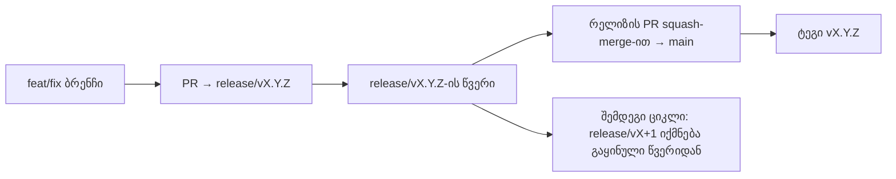

# Branching & Release Model (ქართული)

🌐 **Languages:** 🇺🇸 [English](../../../../ops/BRANCHING_MODEL.md) · 🇪🇹 [am](../../../am/docs/ops/BRANCHING_MODEL.md) · 🇸🇦 [ar](../../../ar/docs/ops/BRANCHING_MODEL.md) · 🇦🇿 [az](../../../az/docs/ops/BRANCHING_MODEL.md) · 🇧🇬 [bg](../../../bg/docs/ops/BRANCHING_MODEL.md) · 🇧🇩 [bn](../../../bn/docs/ops/BRANCHING_MODEL.md) · 🇧🇦 [bs](../../../bs/docs/ops/BRANCHING_MODEL.md) · 🇨🇿 [cs](../../../cs/docs/ops/BRANCHING_MODEL.md) · 🇩🇰 [da](../../../da/docs/ops/BRANCHING_MODEL.md) · 🇩🇪 [de](../../../de/docs/ops/BRANCHING_MODEL.md) · 🇬🇷 [el](../../../el/docs/ops/BRANCHING_MODEL.md) · 🇪🇸 [es](../../../es/docs/ops/BRANCHING_MODEL.md) · 🇪🇪 [et](../../../et/docs/ops/BRANCHING_MODEL.md) · 🇮🇷 [fa](../../../fa/docs/ops/BRANCHING_MODEL.md) · 🇫🇮 [fi](../../../fi/docs/ops/BRANCHING_MODEL.md) · 🇫🇷 [fr](../../../fr/docs/ops/BRANCHING_MODEL.md) · 🇮🇪 [ga](../../../ga/docs/ops/BRANCHING_MODEL.md) · 🇮🇳 [gu](../../../gu/docs/ops/BRANCHING_MODEL.md) · 🇳🇬 [ha](../../../ha/docs/ops/BRANCHING_MODEL.md) · 🇮🇱 [he](../../../he/docs/ops/BRANCHING_MODEL.md) · 🇮🇳 [hi](../../../hi/docs/ops/BRANCHING_MODEL.md) · 🇭🇷 [hr](../../../hr/docs/ops/BRANCHING_MODEL.md) · 🇭🇺 [hu](../../../hu/docs/ops/BRANCHING_MODEL.md) · 🇦🇲 [hy](../../../hy/docs/ops/BRANCHING_MODEL.md) · 🇮🇩 [id](../../../id/docs/ops/BRANCHING_MODEL.md) · 🇳🇬 [ig](../../../ig/docs/ops/BRANCHING_MODEL.md) · 🇮🇹 [it](../../../it/docs/ops/BRANCHING_MODEL.md) · 🇯🇵 [ja](../../../ja/docs/ops/BRANCHING_MODEL.md) · 🇰🇭 [km](../../../km/docs/ops/BRANCHING_MODEL.md) · 🇮🇳 [kn](../../../kn/docs/ops/BRANCHING_MODEL.md) · 🇰🇷 [ko](../../../ko/docs/ops/BRANCHING_MODEL.md) · 🇱🇹 [lt](../../../lt/docs/ops/BRANCHING_MODEL.md) · 🇱🇻 [lv](../../../lv/docs/ops/BRANCHING_MODEL.md) · 🇮🇳 [ml](../../../ml/docs/ops/BRANCHING_MODEL.md) · 🇮🇳 [mr](../../../mr/docs/ops/BRANCHING_MODEL.md) · 🇲🇾 [ms](../../../ms/docs/ops/BRANCHING_MODEL.md) · 🇲🇹 [mt](../../../mt/docs/ops/BRANCHING_MODEL.md) · 🇲🇲 [my](../../../my/docs/ops/BRANCHING_MODEL.md) · 🇳🇵 [ne](../../../ne/docs/ops/BRANCHING_MODEL.md) · 🇳🇱 [nl](../../../nl/docs/ops/BRANCHING_MODEL.md) · 🇳🇴 [no](../../../no/docs/ops/BRANCHING_MODEL.md) · 🇮🇳 [or](../../../or/docs/ops/BRANCHING_MODEL.md) · 🇮🇳 [pa](../../../pa/docs/ops/BRANCHING_MODEL.md) · 🇵🇭 [phi](../../../phi/docs/ops/BRANCHING_MODEL.md) · 🇵🇱 [pl](../../../pl/docs/ops/BRANCHING_MODEL.md) · 🇵🇹 [pt](../../../pt/docs/ops/BRANCHING_MODEL.md) · 🇧🇷 [pt-BR](../../../pt-BR/docs/ops/BRANCHING_MODEL.md) · 🇷🇴 [ro](../../../ro/docs/ops/BRANCHING_MODEL.md) · 🇷🇺 [ru](../../../ru/docs/ops/BRANCHING_MODEL.md) · 🇱🇰 [si](../../../si/docs/ops/BRANCHING_MODEL.md) · 🇸🇰 [sk](../../../sk/docs/ops/BRANCHING_MODEL.md) · 🇸🇮 [sl](../../../sl/docs/ops/BRANCHING_MODEL.md) · 🇷🇸 [sr](../../../sr/docs/ops/BRANCHING_MODEL.md) · 🇸🇪 [sv](../../../sv/docs/ops/BRANCHING_MODEL.md) · 🇰🇪 [sw](../../../sw/docs/ops/BRANCHING_MODEL.md) · 🇮🇳 [ta](../../../ta/docs/ops/BRANCHING_MODEL.md) · 🇮🇳 [te](../../../te/docs/ops/BRANCHING_MODEL.md) · 🇹🇭 [th](../../../th/docs/ops/BRANCHING_MODEL.md) · 🇹🇷 [tr](../../../tr/docs/ops/BRANCHING_MODEL.md) · 🇺🇦 [uk-UA](../../../uk-UA/docs/ops/BRANCHING_MODEL.md) · 🇵🇰 [ur](../../../ur/docs/ops/BRANCHING_MODEL.md) · 🇺🇿 [uz](../../../uz/docs/ops/BRANCHING_MODEL.md) · 🇻🇳 [vi](../../../vi/docs/ops/BRANCHING_MODEL.md) · 🇳🇬 [yo](../../../yo/docs/ops/BRANCHING_MODEL.md) · 🇨🇳 [zh-CN](../../../zh-CN/docs/ops/BRANCHING_MODEL.md) · 🇹🇼 [zh-TW](../../../zh-TW/docs/ops/BRANCHING_MODEL.md)

---

OmniRoute იყენებს გამოშვების **პარალელური ციკლის** მოდელს: აქტიური ციკლისთვის გამოყოფილ `release/vX.Y.Z`
ბრენჩს, გამოქვეყნებული ხაზისთვის `main`-ს და ციკლის გამოშვებისას უცვლელ
`vX.Y.Z` ტეგს. კომიტების `release/*`-ზეც _და_ `main`-ზეც მოხვედრა მოსალოდნელია — ეს
არ არის შეცდომა.

მეინთეინერებისთვის განკუთვნილი დეტალები მოცემულია `CLAUDE.md`-ში (მკაცრი წესი #21) და
[RELEASE_CHECKLIST.md](./RELEASE_CHECKLIST.md)-ში. ეს გვერდი კონტრიბუტორებისთვის განკუთვნილი საჯარო
შეჯამებაა.

## მოკლე მიმოხილვა

| რეფერენსი        | როლი                                                                                              |
| ---------------- | ------------------------------------------------------------------------------------------------- |
| `release/vX.Y.Z` | **აქტიური ციკლი** — ამ ვერსიის ყოველდღიური დეველოპმენტი და PR-ების მერჯი                          |
| `main`           | **გამოქვეყნებული ხაზი** — რელიზის გამოშვებისას ციკლს squash-merge-ის მეშვეობით იღებს              |
| `vX.Y.Z` (ტეგი)  | **გამოშვების მარკერი** — გამოშვების მომენტში შექმნილი უცვლელი მაჩვენებელი იმისა, „თუ რა გამოიშვა“ |



## რომელ ბრენჩზე უნდა იყოს მიმართული ჩემი PR?

**მიმართეთ აქტიურ `release/vX.Y.Z` ბრენჩზე — არა `main`-ზე.**

1. იპოვეთ ყველაზე მაღალი ღია `release/v*` ბრენჩი (მაგალითი ამ ტექსტის დაწერის მომენტში:
   `release/v3.8.49`).
2. შექმენით ბრენჩი მისი წვერიდან (`git fetch` + checkout / rebase მასზე).
3. გახსენით PR, სადაც **base = შესაბამისი `release/vX.Y.Z`**.

`main` არ არის ყოველდღიური ინტეგრაციის ბრენჩი. `main`-ის მიმართ გახსნილ PR-ებს,
როგორც წესი, მერჯამდე სხვა სამიზნეზე გადამისამართება სჭირდება.

## რელიზის გაყინვა (პარალელური ციკლები)

რელიზის შეჯერებისას იხსნება მარკერი issue, რომელსაც `release-freeze` ლეიბლი
აქვს. ეს **დეველოპმენტს არ აჩერებს**:

- გაყინული `release/vX.Y.Z` ამ გამოშვების რელიზის კაპიტანს ეკუთვნის.
- შემდეგი ციკლის `release/vX+1` გაყინული წვერიდან იქმნება, რათა კონტრიბუტორებმა
  მუშაობის დამატება განაგრძონ.
- ღია PR-ები, რომლებიც ჯერ კიდევ გაყინულ ბრენჩზეა მიმართული, **უნდა გადამისამართდეს**
  აქტიურ (ყველაზე მაღალ) `release/v*` ბრენჩზე.

სანამ ჩათვლით, რომ სასურველ ბრენჩზე მერჯი შესაძლებელია, შეამოწმეთ, არის თუ არა გაყინვა ღია:

```bash
gh issue list --repo diegosouzapw/OmniRoute --label release-freeze --state open
```

მერჯის მექანიზმი (მფლობელის `queue` ლეიბლი → Mergify) აღწერილია
[MERGE_TRAIN.md](./MERGE_TRAIN.md)-ში.

## რატომ გამოიყენება ბრენჩიც და ტეგიც?

| არტეფაქტი        | მოქმედების პერიოდი | დანიშნულება                                                                                   |
| ---------------- | ------------------ | --------------------------------------------------------------------------------------------- |
| `release/vX.Y.Z` | მიმდინარე ციკლი    | აგროვებს მიმოხილულ PR-ებს, ინარჩუნებს CI-ის მწვანე სტატუსს და წარმოადგენს PR-ის საბაზო ბრენჩს |
| ტეგი `vX.Y.Z`    | სამუდამოდ          | აღნიშნავს ზუსტად იმ ბიტებს, რომლებიც npm-ზე / GitHub Releases-ში გამოიშვა                     |

ბრენჩი სახელოსნოა, ტეგი კი — დალუქული პაკეტი. `main`-ში squash-merge-ის შემდეგ
მომდევნო ციკლი `release/vX+1`-ზე გრძელდება წინა
რელიზის PR-ის დასრულების ლოდინის გარეშე.

## დაკავშირებული დოკუმენტები

- [CONTRIBUTING.md](../../CONTRIBUTING.md) — გამართვა, ტესტები, PR-ის საკონტროლო სია
- [RELEASE_CHECKLIST.md](./RELEASE_CHECKLIST.md) — გამოშვებამდე ვალიდაცია
- [MERGE_TRAIN.md](./MERGE_TRAIN.md) — მერჯის რიგი და სარეზერვო მერჯ-პროცესი
- [RELEASE_GREEN.md](./RELEASE_GREEN.md) — რელიზის წვერის მწვანე სტატუსის შენარჩუნება
