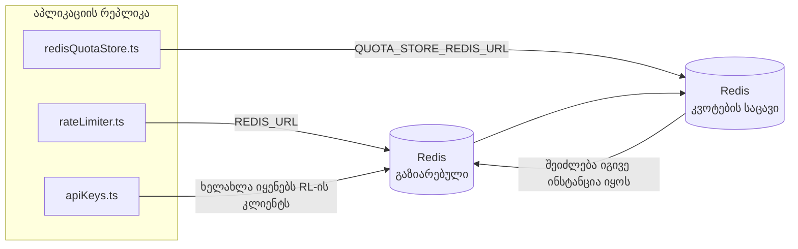

# Redis Production Configuration Guide (ქართული)

🌐 **Languages:** 🇺🇸 [English](../../../../ops/REDIS_PRODUCTION_CONFIG.md) · 🇪🇹 [am](../../../am/docs/ops/REDIS_PRODUCTION_CONFIG.md) · 🇸🇦 [ar](../../../ar/docs/ops/REDIS_PRODUCTION_CONFIG.md) · 🇦🇿 [az](../../../az/docs/ops/REDIS_PRODUCTION_CONFIG.md) · 🇧🇬 [bg](../../../bg/docs/ops/REDIS_PRODUCTION_CONFIG.md) · 🇧🇩 [bn](../../../bn/docs/ops/REDIS_PRODUCTION_CONFIG.md) · 🇧🇦 [bs](../../../bs/docs/ops/REDIS_PRODUCTION_CONFIG.md) · 🇨🇿 [cs](../../../cs/docs/ops/REDIS_PRODUCTION_CONFIG.md) · 🇩🇰 [da](../../../da/docs/ops/REDIS_PRODUCTION_CONFIG.md) · 🇩🇪 [de](../../../de/docs/ops/REDIS_PRODUCTION_CONFIG.md) · 🇬🇷 [el](../../../el/docs/ops/REDIS_PRODUCTION_CONFIG.md) · 🇪🇸 [es](../../../es/docs/ops/REDIS_PRODUCTION_CONFIG.md) · 🇪🇪 [et](../../../et/docs/ops/REDIS_PRODUCTION_CONFIG.md) · 🇮🇷 [fa](../../../fa/docs/ops/REDIS_PRODUCTION_CONFIG.md) · 🇫🇮 [fi](../../../fi/docs/ops/REDIS_PRODUCTION_CONFIG.md) · 🇫🇷 [fr](../../../fr/docs/ops/REDIS_PRODUCTION_CONFIG.md) · 🇮🇪 [ga](../../../ga/docs/ops/REDIS_PRODUCTION_CONFIG.md) · 🇮🇳 [gu](../../../gu/docs/ops/REDIS_PRODUCTION_CONFIG.md) · 🇳🇬 [ha](../../../ha/docs/ops/REDIS_PRODUCTION_CONFIG.md) · 🇮🇱 [he](../../../he/docs/ops/REDIS_PRODUCTION_CONFIG.md) · 🇮🇳 [hi](../../../hi/docs/ops/REDIS_PRODUCTION_CONFIG.md) · 🇭🇷 [hr](../../../hr/docs/ops/REDIS_PRODUCTION_CONFIG.md) · 🇭🇺 [hu](../../../hu/docs/ops/REDIS_PRODUCTION_CONFIG.md) · 🇦🇲 [hy](../../../hy/docs/ops/REDIS_PRODUCTION_CONFIG.md) · 🇮🇩 [id](../../../id/docs/ops/REDIS_PRODUCTION_CONFIG.md) · 🇳🇬 [ig](../../../ig/docs/ops/REDIS_PRODUCTION_CONFIG.md) · 🇮🇹 [it](../../../it/docs/ops/REDIS_PRODUCTION_CONFIG.md) · 🇯🇵 [ja](../../../ja/docs/ops/REDIS_PRODUCTION_CONFIG.md) · 🇰🇭 [km](../../../km/docs/ops/REDIS_PRODUCTION_CONFIG.md) · 🇮🇳 [kn](../../../kn/docs/ops/REDIS_PRODUCTION_CONFIG.md) · 🇰🇷 [ko](../../../ko/docs/ops/REDIS_PRODUCTION_CONFIG.md) · 🇱🇹 [lt](../../../lt/docs/ops/REDIS_PRODUCTION_CONFIG.md) · 🇱🇻 [lv](../../../lv/docs/ops/REDIS_PRODUCTION_CONFIG.md) · 🇮🇳 [ml](../../../ml/docs/ops/REDIS_PRODUCTION_CONFIG.md) · 🇮🇳 [mr](../../../mr/docs/ops/REDIS_PRODUCTION_CONFIG.md) · 🇲🇾 [ms](../../../ms/docs/ops/REDIS_PRODUCTION_CONFIG.md) · 🇲🇹 [mt](../../../mt/docs/ops/REDIS_PRODUCTION_CONFIG.md) · 🇲🇲 [my](../../../my/docs/ops/REDIS_PRODUCTION_CONFIG.md) · 🇳🇵 [ne](../../../ne/docs/ops/REDIS_PRODUCTION_CONFIG.md) · 🇳🇱 [nl](../../../nl/docs/ops/REDIS_PRODUCTION_CONFIG.md) · 🇳🇴 [no](../../../no/docs/ops/REDIS_PRODUCTION_CONFIG.md) · 🇮🇳 [or](../../../or/docs/ops/REDIS_PRODUCTION_CONFIG.md) · 🇮🇳 [pa](../../../pa/docs/ops/REDIS_PRODUCTION_CONFIG.md) · 🇵🇭 [phi](../../../phi/docs/ops/REDIS_PRODUCTION_CONFIG.md) · 🇵🇱 [pl](../../../pl/docs/ops/REDIS_PRODUCTION_CONFIG.md) · 🇵🇹 [pt](../../../pt/docs/ops/REDIS_PRODUCTION_CONFIG.md) · 🇧🇷 [pt-BR](../../../pt-BR/docs/ops/REDIS_PRODUCTION_CONFIG.md) · 🇷🇴 [ro](../../../ro/docs/ops/REDIS_PRODUCTION_CONFIG.md) · 🇷🇺 [ru](../../../ru/docs/ops/REDIS_PRODUCTION_CONFIG.md) · 🇱🇰 [si](../../../si/docs/ops/REDIS_PRODUCTION_CONFIG.md) · 🇸🇰 [sk](../../../sk/docs/ops/REDIS_PRODUCTION_CONFIG.md) · 🇸🇮 [sl](../../../sl/docs/ops/REDIS_PRODUCTION_CONFIG.md) · 🇷🇸 [sr](../../../sr/docs/ops/REDIS_PRODUCTION_CONFIG.md) · 🇸🇪 [sv](../../../sv/docs/ops/REDIS_PRODUCTION_CONFIG.md) · 🇰🇪 [sw](../../../sw/docs/ops/REDIS_PRODUCTION_CONFIG.md) · 🇮🇳 [ta](../../../ta/docs/ops/REDIS_PRODUCTION_CONFIG.md) · 🇮🇳 [te](../../../te/docs/ops/REDIS_PRODUCTION_CONFIG.md) · 🇹🇭 [th](../../../th/docs/ops/REDIS_PRODUCTION_CONFIG.md) · 🇹🇷 [tr](../../../tr/docs/ops/REDIS_PRODUCTION_CONFIG.md) · 🇺🇦 [uk-UA](../../../uk-UA/docs/ops/REDIS_PRODUCTION_CONFIG.md) · 🇵🇰 [ur](../../../ur/docs/ops/REDIS_PRODUCTION_CONFIG.md) · 🇺🇿 [uz](../../../uz/docs/ops/REDIS_PRODUCTION_CONFIG.md) · 🇻🇳 [vi](../../../vi/docs/ops/REDIS_PRODUCTION_CONFIG.md) · 🇳🇬 [yo](../../../yo/docs/ops/REDIS_PRODUCTION_CONFIG.md) · 🇨🇳 [zh-CN](../../../zh-CN/docs/ops/REDIS_PRODUCTION_CONFIG.md) · 🇹🇼 [zh-TW](../../../zh-TW/docs/ops/REDIS_PRODUCTION_CONFIG.md)

---

## მიმოხილვა

Redis OmniRoute-ში **არასავალდებულო, რბილი დამოკიდებულებაა** — როდესაც Redis მიუწვდომელია, აპლიკაცია ფუნქციონირებას გამარტივებულ რეჟიმში აგრძელებს (მეხსიერებაში არსებული
სარეზერვო მექანიზმების გამოყენებით). საწარმოო გარემოში Redis-ის ოპტიმიზაცია ოთხი განსხვავებული
სამუშაო დატვირთვის დაყოვნებას ამცირებს:

| სამუშაო დატვირთვა         | დრაივერი                      | კლიენტის ფაბრიკა                                 | გასაღების შაბლონი                                           |
| ------------------------- | ----------------------------- | ------------------------------------------------ | ----------------------------------------------------------- |
| სიხშირის შეზღუდვა         | `rateLimiter.ts`              | `getRedisClient()` — ზარმაცი `ioredis` singleton | `<prefix>rl:*` Lua‑ატომური სიხშირის შეზღუდვის ფანჯრები      |
| ავთენტიფიკაციის კეში      | `apiKeys.ts`                  | ხელახლა იყენებს `rateLimiter`-ის კლიენტს         | `<prefix>auth:api_key:<sha256>` TTL-ით                      |
| კვოტების საცავი           | `redisQuotaStore.ts`          | ცალკე `getRedisClient(url)` singleton            | `<prefix>quota:*`, კონფიგურირებადი თითოეული ეგზემპლარისთვის |
| გახურების circuit breaker | `redisCircuitBreakerStore.ts` | ცალკე კლიენტი `circuitBreakerFactory.ts`-ში      | `<prefix>warmup:cb:<connectionId>`                          |

ოთხივე სამუშაო დატვირთვა იყენებს სახელთა სივრცის ერთ პრეფიქსს, რათა OmniRoute-მა სხვა აპებთან
ერთ Redis-ის ეგზემპლარზე (მაგ., `127.0.0.1:6379`) თანაარსებობა შეძლოს. იხილეთ [გასაღებების სახელთა სივრცე](#key-namespacing).

---

## მიმდინარე კონფიგურაცია (კოდის ნაგულისხმევი მნიშვნელობები)

| პარამეტრი                              | მნიშვნელობა                                                                   | მდებარეობა                                                                            |
| -------------------------------------- | ----------------------------------------------------------------------------- | ------------------------------------------------------------------------------------- |
| `REDIS_URL` გარემოს ცვლადი             | `redis://redis:6379` (compose), არასავალდებულო                                | `rateLimiter.ts:5`, `.env.example`                                                    |
| `REDIS_KEY_PREFIX` გარემოს ცვლადი      | `omniroute:` (ნაგულისხმევი)                                                   | `rateLimiter.ts`, `redisQuotaStore.ts`, `redisCircuitBreakerStore.ts`, `.env.example` |
| `QUOTA_STORE_REDIS_URL` გარემოს ცვლადი | ცალკე; შეიძლება განსხვავდებოდეს `REDIS_URL`-ისგან                             | `quota/storeFactory.ts`                                                               |
| `QUOTA_STORE_DRIVER`                   | `"sqlite"` (ნაგულისხმევი), `"redis"` არასავალდებულო                           | `quota/storeFactory.ts`                                                               |
| ioredis `maxRetriesPerRequest`         | `3`                                                                           | `rateLimiter.ts`-ში კლიენტის შექმნა                                                   |
| `enableReadyCheck`                     | დაყენებული არ არის (ioredis-ის ნაგულისხმევი: `true`)                          | —                                                                                     |
| `lazyConnect`                          | დაყენებული არ არის (ioredis-ის ნაგულისხმევი: `false`)                         | —                                                                                     |
| `retryStrategy`                        | დაყენებული არ არის (ioredis-ის ნაგულისხმევი: 200ms საბაზისო, ექსპონენციალური) | —                                                                                     |
| TLS / პაროლი / DB ინდექსი              | **კონფიგურირებული არ არის**                                                   | —                                                                                     |
| Sentinel / Cluster                     | **კონფიგურირებული არ არის** — მხოლოდ ავტონომიური ერთკვანძიანი რეჟიმი          | —                                                                                     |

---

## გასაღებების სახელთა სივრცე

OmniRoute Redis-ის ეგზემპლარს ჰოსტზე გაშვებულ სხვა სისტემებთან ერთად იყენებს. სახელთა სივრცის გარეშე,
ისეთი გასაღებები, როგორიცაა `auth:api_key:<sha256>` ან `rl:*`, შეიძლება იმავე Redis-ის გამომყენებელი
სხვა აპლიკაციების გასაღებებს დაემთხვეს (ეს ეგზემპლარი Redis-ს `127.0.0.1:6379`-ზე, სხვა სერვისებთან ერთად უშვებს).

დააყენეთ `REDIS_KEY_PREFIX` არაცარიელ სტრიქონად, რათა პრეფიქსი OmniRoute-ის **ყველა** გასაღებს დაემატოს:

```bash
# .env — OmniRoute-ის ყველა გასაღები ხდება omniroute:rl:*, omniroute:auth:*, omniroute:quota:*, omniroute:warmup:cb:*
REDIS_KEY_PREFIX=omniroute:
```

- **ნაგულისხმევი:** `omniroute:` (გამოიყენება, როდესაც `REDIS_KEY_PREFIX` დაყენებული არ არის ან ცარიელია).
- **გამოიყენება შემდეგზე:** სიხშირის შემზღუდველი + ავთენტიფიკაციის კეში (საერთო `ioredis` კლიენტი `keyPrefix`-ის მეშვეობით), ასევე
  კვოტების საცავი (`KEY_PREFIX = "${REDIS_KEY_PREFIX}quota"`) და გახურების circuit breaker
  (`KEY_PREFIX = "${REDIS_KEY_PREFIX}warmup:cb:"`).
- **პრეფიქსის შეცვლისას**, თუ გასაღებები Redis-ში უკვე არსებობს, ძველი გასაღებები მიუწვდომელი რჩება (მათ ვადა
  TTL / LRU-ის მეშვეობით გასდით). შეცვლა უსაფრთხოა; მიგრაცია საჭირო არ არის. ერთადერთი გამონაკლისია გახურების
  circuit-breaker-ის გასაღები იმ კავშირისთვის, რომელიც აკრძალულად არის მონიშნული: ის TTL-ის გარეშე ინახება, ამიტომ
  დარჩენილი გასაღებები ჩამოთვალეთ `redis-cli --scan --pattern '<old-prefix>warmup:cb:*'`-ით და წაშალეთ.
- **ioredis `keyPrefix`** პრეფიქსს ავტომატურად ამატებს ჩაწერისას **და** აშორებს წაკითხვისას,
  ამიტომ აპლიკაციის კოდი პრეფიქსს ვერასოდეს ხედავს.

---

## რეკომენდებული პარამეტრები საწარმოო გარემოსთვის

### 1. კავშირების პული / კლიენტის პარამეტრები (ioredis-ის `Redis` კონსტრუქტორი)

მიმდინარე კოდი ქმნის ერთ `new Redis(url)` ობიექტს მორგებული პარამეტრების გარეშე. საწარმოო გარემოში
რამდენიმე რეპლიკით განთავსებისას, კოდში გადასცით კლიენტის ფაბრიკა ან შემოახვიეთ `getRedisClient()`:

```typescript
const redis = new Redis(REDIS_URL, {
  maxRetriesPerRequest: null, // განმეორებითი ცდების ლიმიტი არ არის; გადაწყვეტილება retryStrategy-ს მიანდეთ
  enableReadyCheck: true, // გამოძახებების მიღებამდე შეამოწმეთ, რომ სერვერი მზადაა
  lazyConnect: true, // შექმნისას არ დაუკავშირდეთ; დაელოდეთ პირველ გამოძახებას
  retryStrategy: (times) => {
    if (times > 10) return null; // 10 განმეორებითი ცდის შემდეგ შეწყვიტეთ → მოგვიანებით ხელახლა დაუკავშირდით
    return Math.min(times * 200, 5000); // 200მწ, 400მწ, …, მაქსიმუმ 5წმ
  },
  enableAutoPipelining: true, // პარალელური ბრძანებები გააერთიანეთ ერთ TCP-ჩაწერაში
  keepAlive: 10000, // TCP keep-alive ყოველ 10წმ-ში
});
```

**ძირითადი კომპრომისები:**

- `maxRetriesPerRequest: null` + `retryStrategy` — რეკომენდებულია საწარმოო გარემოსთვის, რათა Redis-ის
  დროებითი გადატვირთვებისას ყველა მოთხოვნა დაუყოვნებლივ არ ჩავარდეს. მეხსიერებაში არსებული სარეზერვო მექანიზმი
  `checkRateLimit()`-ში ამუშავებს შეცდომის სცენარს.
- `lazyConnect: true` — თავიდან იცილებს გაშვებისას Redis-ის ხელმისაწვდომობაზე დამოკიდებულებას, სანამ სერვერი
  კავშირების მიღებას დაიწყებს.
- `enableAutoPipelining: true` — ამცირებს ქსელურ მიმოცვლებს სიხშირის ლიმიტის პარალელური შემოწმებებისას;
  სასარგებლოა ერთ კავშირზე >50 RPS-ის შემთხვევაში.

### 2. Redis სერვერის კონფიგურაცია (`redis.conf`)

```
# მეხსიერება
maxmemory 80%                        # დატოვეთ ადგილი OS-ის გვერდების კეშისთვის
maxmemory-policy allkeys-lru         # დატვირთვისას წაშალეთ ავთენტიფიკაციის კეშის მოძველებული ჩანაწერები

# მდგრადობა (არასავალდებულო — OmniRoute მის გარეშეც დაცულია ავარიული გათიშვისგან)
save 300 1                           # გადაიღეთ სნეპშოტი სულ მცირე ყოველ 5 წუთში, თუ ≥1 გასაღები შეიცვალა
appendonly no                        # AOF საჭირო არ არის; მონაცემების ხელახლა გენერირება შესაძლებელია
appendfsync no                       # fsync-ის ზედნადები ხარჯი არ არის (RDB საკმარისია)

# ქსელი
timeout 0                            # უმოქმედობისას კავშირი არ გაითიშოს
tcp-keepalive 300                    # keep-alive ყოველ 5 წუთში
tcp-backlog 511                      # კავშირების რიგი დატვირთვის უეცარი ზრდისთვის

# წარმადობა
hz 10                                # ნაგულისხმევი; 100 დაყოვნებისადმი მგრძნობიარე გარემოსთვის
activedefrag yes                     # ავტომატური დეფრაგმენტაცია, როდესაც ფრაგმენტაცია >10%-ია
```

**კომპრომისი `maxmemory-policy allkeys-lru`-სთვის:** მეხსიერების
დეფიციტისას ავთენტიფიკაციის კეშის ჩანაწერები შეიძლება წაიშალოს. ეს უსაფრთხოა — გამოტოვებისას `setCachedApiKey` ყოველთვის
ხელახლა ავსებს კეშს, ხოლო SQLite-ის სარეზერვო მექანიზმი მონაცემთა ავტორიტეტული წყაროა. სიხშირის შემზღუდველის Lua-ს სკრიპტი ქმნის მცირე ზომის გასაღებებს, რომლებიც
დიზაინის მიხედვით ხანმოკლეა.

### 3. Docker Compose-ის პარამეტრები

საწარმოო compose (`docker-compose.prod.yml`) იყენებს `redis:8.6.2-alpine`-ს. დაამატეთ:

```yaml
redis:
  image: redis:8.6.2-alpine
  command:
    [
      "redis-server",
      "--maxmemory",
      "512mb",
      "--maxmemory-policy",
      "allkeys-lru",
      "--activedefrag",
      "yes",
      "--save",
      "300 1",
    ]
  healthcheck:
    test: ["CMD", "redis-cli", "ping"]
    interval: 10s
    timeout: 3s
    retries: 3
    start_period: 5s
```

### 4. რამდენიმე ინსტანციის / მასშტაბირების საკითხები

**ერთი Redis ყველა რეპლიკისთვის** — სიხშირის შემზღუდველის Lua-ს სკრიპტი ეყრდნობა ერთ
ავტორიტეტულ გასაღებების სივრცეს. რეპლიკების მიღმა არსებული Redis-ის რამდენიმე ინსტანცია დაარღვევდა ატომურობას
და ბიუჯეტს გააორმაგებდა. აპლიკაციის ყველა რეპლიკისთვის გამოიყენეთ ერთი Redis (ან Redis Sentinel-ის კლასტერი ავარიული გადართვით).

**კავშირების რაოდენობა:** აპლიკაციის თითოეული რეპლიკა Redis-თან ხსნის **2 TCP კავშირს**
(სიხშირის შემზღუდველის კლიენტი + კვოტების საცავის კლიენტი). 10 რეპლიკის შემთხვევაში → 20 კავშირი, რაც
ბევრად ნაკლებია Redis-ის ნაგულისხმევი ინსტანციის 10 ათასიანი კავშირების ლიმიტზე.

### 5. მონიტორინგი

ხელმისაწვდომი გახადეთ მდგომარეობის შემოწმების endpoint-ის მეშვეობით:

```typescript
// src/app/api/monitoring/health/route.ts უკვე იძახებს rateLimiter-ის ფუნქციებს
// დაამატეთ Redis-ის სპეციფიკური შემოწმებები:
//   1. PING-ის დაყოვნება ioredis-ის .ping()-ის მეშვეობით
//   2. მეხსიერების გამოყენება INFO memory-ის მეშვეობით
//   3. კავშირების რაოდენობა INFO clients-ის მეშვეობით
//   4. maxmemory-policy-ის მოხვედრის სიხშირე (evicted_keys / keyspace_hits)
```

ძირითადი გასაკონტროლებელი მეტრიკები:

- **წაშლილი გასაღებები / წმ** — თუ მნიშვნელობა მუდმივად ნულზე მეტია, გაზარდეთ `maxmemory`
- **დაბლოკილი კლიენტები** — ნულზე მეტი მნიშვნელობა ნელ Lua-ს სკრიპტებზე ან მაღალ კონკურენციაზე მიუთითებს
- **უარყოფილი კავშირები** — მიღწეულია კავშირების ლიმიტი; იშვიათია 20 კავშირის შემთხვევაში

---

## არქიტექტურის დიაგრამა



---

## ცნობები

| ფაილი                              | დანიშნულება                                                                                          |
| ---------------------------------- | ---------------------------------------------------------------------------------------------------- |
| `src/shared/utils/rateLimiter.ts`  | Redis-ის ძირითადი კლიენტი, სიხშირის შეზღუდვის Lua-სკრიპტი, მეხსიერებაში მუშაობაზე სარეზერვო გადართვა |
| `src/lib/db/apiKeys.ts`            | ავტორიზაციის კეში — Redis→SQLite-ზე სარეზერვო გადართვა                                               |
| `src/lib/quota/redisQuotaStore.ts` | Redis-ის ცალკე კლიენტი კვოტების არასავალდებულო საცავისთვის                                           |
| `src/lib/quota/storeFactory.ts`    | გადართავს `sqlite` და `redis` კვოტების დრაივერებს შორის                                              |
| `docker-compose.prod.yml`          | საწარმოო გარემოს Redis-კონტეინერი (`redis:8.6.2-alpine` იმიჯი)                                       |
| `.env.example`                     | Redis-ის გარემოს ცვლადების დოკუმენტაცია                                                              |
| `src/app/api/local/redis/`         | API-მარშრუტები დეველოპერული კონტეინერის ორკესტრაციისთვის                                             |
| `bin/cli/commands/redis.mjs`       | CLI-ბრძანებები დეველოპერული კონტეინერის ორკესტრაციისთვის                                             |
