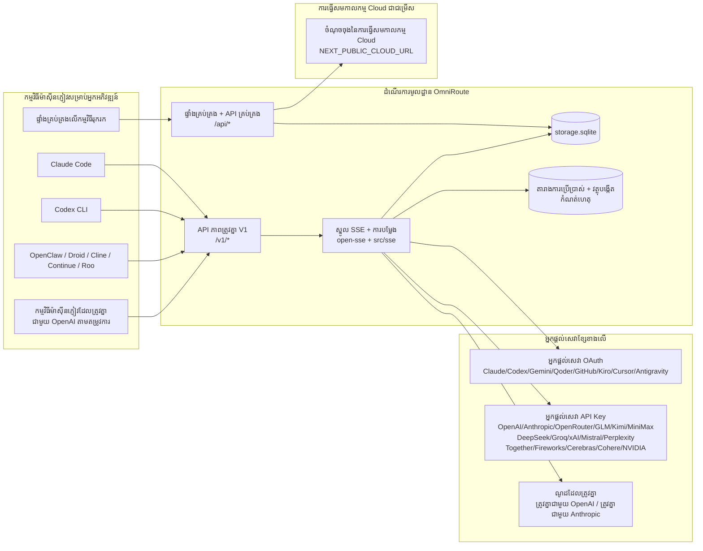
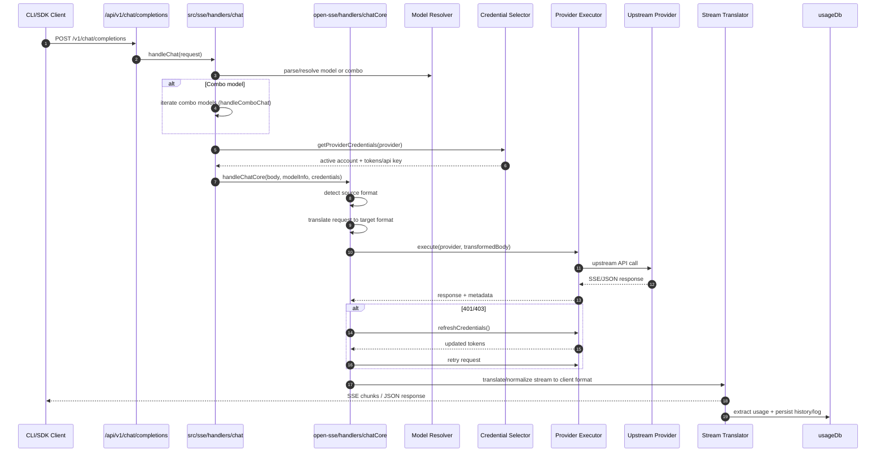
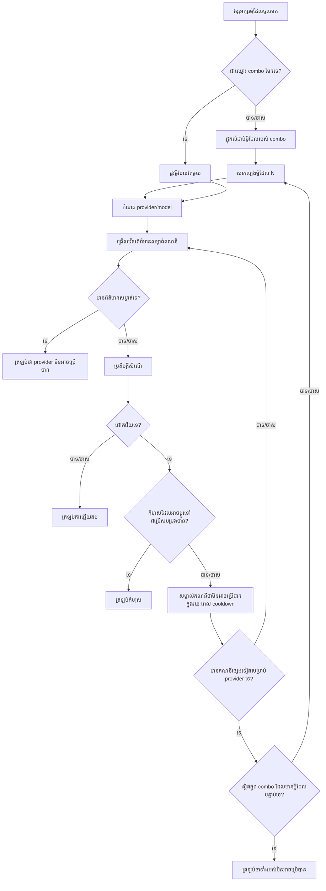
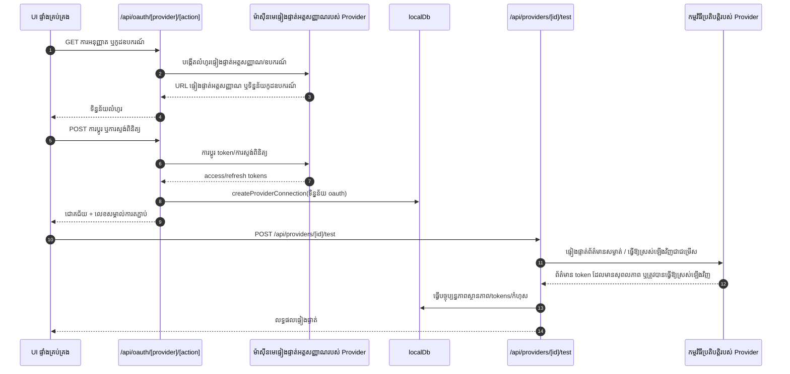
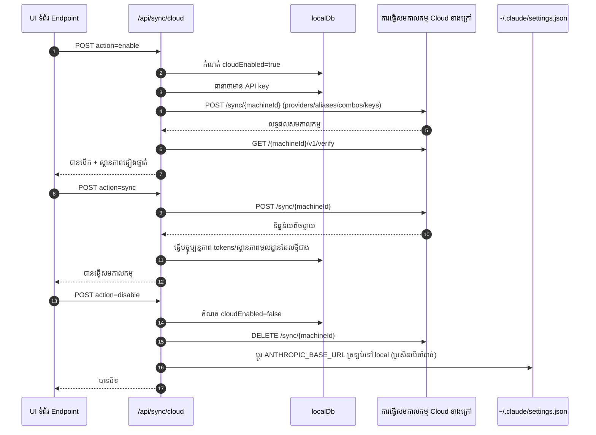
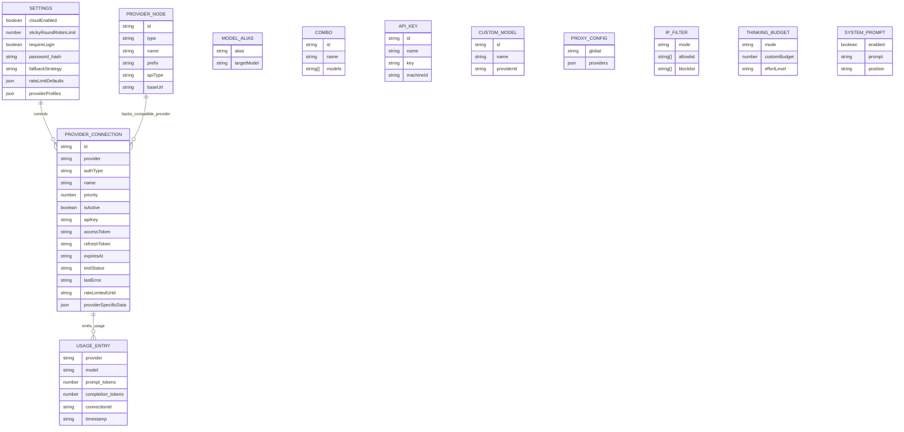
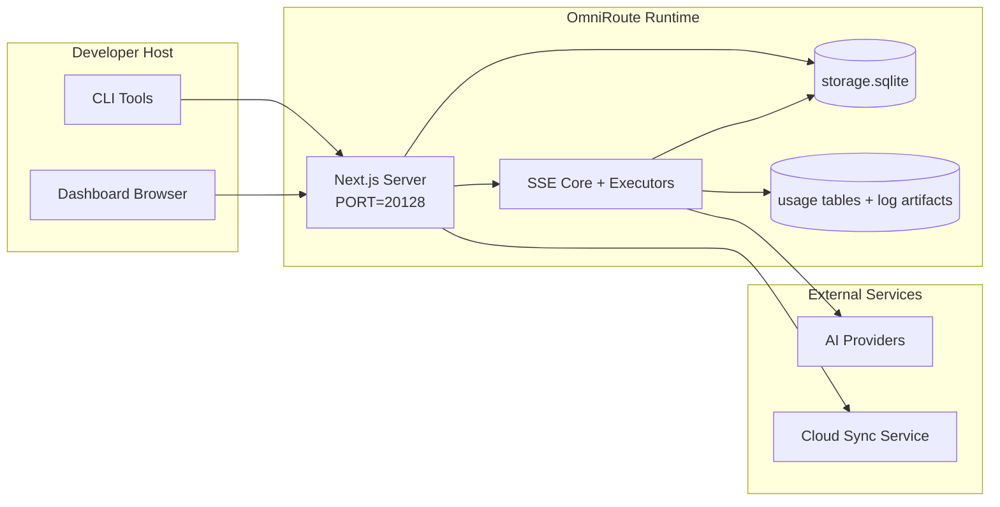

# OmniRoute Architecture (ខ្មែរ)

🌐 **Languages:** 🇺🇸 [English](../../../../architecture/ARCHITECTURE.md) · 🇪🇹 [am](../../../am/docs/architecture/ARCHITECTURE.md) · 🇸🇦 [ar](../../../ar/docs/architecture/ARCHITECTURE.md) · 🇦🇿 [az](../../../az/docs/architecture/ARCHITECTURE.md) · 🇧🇬 [bg](../../../bg/docs/architecture/ARCHITECTURE.md) · 🇧🇩 [bn](../../../bn/docs/architecture/ARCHITECTURE.md) · 🇧🇦 [bs](../../../bs/docs/architecture/ARCHITECTURE.md) · 🇨🇿 [cs](../../../cs/docs/architecture/ARCHITECTURE.md) · 🇩🇰 [da](../../../da/docs/architecture/ARCHITECTURE.md) · 🇩🇪 [de](../../../de/docs/architecture/ARCHITECTURE.md) · 🇬🇷 [el](../../../el/docs/architecture/ARCHITECTURE.md) · 🇪🇸 [es](../../../es/docs/architecture/ARCHITECTURE.md) · 🇪🇪 [et](../../../et/docs/architecture/ARCHITECTURE.md) · 🇮🇷 [fa](../../../fa/docs/architecture/ARCHITECTURE.md) · 🇫🇮 [fi](../../../fi/docs/architecture/ARCHITECTURE.md) · 🇫🇷 [fr](../../../fr/docs/architecture/ARCHITECTURE.md) · 🇮🇪 [ga](../../../ga/docs/architecture/ARCHITECTURE.md) · 🇮🇳 [gu](../../../gu/docs/architecture/ARCHITECTURE.md) · 🇳🇬 [ha](../../../ha/docs/architecture/ARCHITECTURE.md) · 🇮🇱 [he](../../../he/docs/architecture/ARCHITECTURE.md) · 🇮🇳 [hi](../../../hi/docs/architecture/ARCHITECTURE.md) · 🇭🇷 [hr](../../../hr/docs/architecture/ARCHITECTURE.md) · 🇭🇺 [hu](../../../hu/docs/architecture/ARCHITECTURE.md) · 🇦🇲 [hy](../../../hy/docs/architecture/ARCHITECTURE.md) · 🇮🇩 [id](../../../id/docs/architecture/ARCHITECTURE.md) · 🇳🇬 [ig](../../../ig/docs/architecture/ARCHITECTURE.md) · 🇮🇹 [it](../../../it/docs/architecture/ARCHITECTURE.md) · 🇯🇵 [ja](../../../ja/docs/architecture/ARCHITECTURE.md) · 🇬🇪 [ka](../../../ka/docs/architecture/ARCHITECTURE.md) · 🇮🇳 [kn](../../../kn/docs/architecture/ARCHITECTURE.md) · 🇰🇷 [ko](../../../ko/docs/architecture/ARCHITECTURE.md) · 🇱🇹 [lt](../../../lt/docs/architecture/ARCHITECTURE.md) · 🇱🇻 [lv](../../../lv/docs/architecture/ARCHITECTURE.md) · 🇮🇳 [ml](../../../ml/docs/architecture/ARCHITECTURE.md) · 🇮🇳 [mr](../../../mr/docs/architecture/ARCHITECTURE.md) · 🇲🇾 [ms](../../../ms/docs/architecture/ARCHITECTURE.md) · 🇲🇹 [mt](../../../mt/docs/architecture/ARCHITECTURE.md) · 🇲🇲 [my](../../../my/docs/architecture/ARCHITECTURE.md) · 🇳🇵 [ne](../../../ne/docs/architecture/ARCHITECTURE.md) · 🇳🇱 [nl](../../../nl/docs/architecture/ARCHITECTURE.md) · 🇳🇴 [no](../../../no/docs/architecture/ARCHITECTURE.md) · 🇮🇳 [or](../../../or/docs/architecture/ARCHITECTURE.md) · 🇮🇳 [pa](../../../pa/docs/architecture/ARCHITECTURE.md) · 🇵🇭 [phi](../../../phi/docs/architecture/ARCHITECTURE.md) · 🇵🇱 [pl](../../../pl/docs/architecture/ARCHITECTURE.md) · 🇵🇹 [pt](../../../pt/docs/architecture/ARCHITECTURE.md) · 🇧🇷 [pt-BR](../../../pt-BR/docs/architecture/ARCHITECTURE.md) · 🇷🇴 [ro](../../../ro/docs/architecture/ARCHITECTURE.md) · 🇷🇺 [ru](../../../ru/docs/architecture/ARCHITECTURE.md) · 🇱🇰 [si](../../../si/docs/architecture/ARCHITECTURE.md) · 🇸🇰 [sk](../../../sk/docs/architecture/ARCHITECTURE.md) · 🇸🇮 [sl](../../../sl/docs/architecture/ARCHITECTURE.md) · 🇷🇸 [sr](../../../sr/docs/architecture/ARCHITECTURE.md) · 🇸🇪 [sv](../../../sv/docs/architecture/ARCHITECTURE.md) · 🇰🇪 [sw](../../../sw/docs/architecture/ARCHITECTURE.md) · 🇮🇳 [ta](../../../ta/docs/architecture/ARCHITECTURE.md) · 🇮🇳 [te](../../../te/docs/architecture/ARCHITECTURE.md) · 🇹🇭 [th](../../../th/docs/architecture/ARCHITECTURE.md) · 🇹🇷 [tr](../../../tr/docs/architecture/ARCHITECTURE.md) · 🇺🇦 [uk-UA](../../../uk-UA/docs/architecture/ARCHITECTURE.md) · 🇵🇰 [ur](../../../ur/docs/architecture/ARCHITECTURE.md) · 🇺🇿 [uz](../../../uz/docs/architecture/ARCHITECTURE.md) · 🇻🇳 [vi](../../../vi/docs/architecture/ARCHITECTURE.md) · 🇳🇬 [yo](../../../yo/docs/architecture/ARCHITECTURE.md) · 🇨🇳 [zh-CN](../../../zh-CN/docs/architecture/ARCHITECTURE.md) · 🇹🇼 [zh-TW](../../../zh-TW/docs/architecture/ARCHITECTURE.md)

---

🌐 **Languages:** 🇺🇸 [English](../../../../architecture/ARCHITECTURE.md) · 🇪🇹 [am](../../../am/docs/architecture/ARCHITECTURE.md) · 🇸🇦 [ar](../../../ar/docs/architecture/ARCHITECTURE.md) · 🇦🇿 [az](../../../az/docs/architecture/ARCHITECTURE.md) · 🇧🇬 [bg](../../../bg/docs/architecture/ARCHITECTURE.md) · 🇧🇩 [bn](../../../bn/docs/architecture/ARCHITECTURE.md) · 🇧🇦 [bs](../../../bs/docs/architecture/ARCHITECTURE.md) · 🇨🇿 [cs](../../../cs/docs/architecture/ARCHITECTURE.md) · 🇩🇰 [da](../../../da/docs/architecture/ARCHITECTURE.md) · 🇩🇪 [de](../../../de/docs/architecture/ARCHITECTURE.md) · 🇬🇷 [el](../../../el/docs/architecture/ARCHITECTURE.md) · 🇪🇸 [es](../../../es/docs/architecture/ARCHITECTURE.md) · 🇪🇪 [et](../../../et/docs/architecture/ARCHITECTURE.md) · 🇮🇷 [fa](../../../fa/docs/architecture/ARCHITECTURE.md) · 🇫🇮 [fi](../../../fi/docs/architecture/ARCHITECTURE.md) · 🇫🇷 [fr](../../../fr/docs/architecture/ARCHITECTURE.md) · 🇮🇪 [ga](../../../ga/docs/architecture/ARCHITECTURE.md) · 🇮🇳 [gu](../../../gu/docs/architecture/ARCHITECTURE.md) · 🇳🇬 [ha](../../../ha/docs/architecture/ARCHITECTURE.md) · 🇮🇱 [he](../../../he/docs/architecture/ARCHITECTURE.md) · 🇮🇳 [hi](../../../hi/docs/architecture/ARCHITECTURE.md) · 🇭🇷 [hr](../../../hr/docs/architecture/ARCHITECTURE.md) · 🇭🇺 [hu](../../../hu/docs/architecture/ARCHITECTURE.md) · 🇦🇲 [hy](../../../hy/docs/architecture/ARCHITECTURE.md) · 🇮🇩 [id](../../../id/docs/architecture/ARCHITECTURE.md) · 🇳🇬 [ig](../../../ig/docs/architecture/ARCHITECTURE.md) · 🇮🇹 [it](../../../it/docs/architecture/ARCHITECTURE.md) · 🇯🇵 [ja](../../../ja/docs/architecture/ARCHITECTURE.md) · 🇬🇪 [ka](../../../ka/docs/architecture/ARCHITECTURE.md) · 🇮🇳 [kn](../../../kn/docs/architecture/ARCHITECTURE.md) · 🇰🇷 [ko](../../../ko/docs/architecture/ARCHITECTURE.md) · 🇱🇹 [lt](../../../lt/docs/architecture/ARCHITECTURE.md) · 🇱🇻 [lv](../../../lv/docs/architecture/ARCHITECTURE.md) · 🇮🇳 [ml](../../../ml/docs/architecture/ARCHITECTURE.md) · 🇮🇳 [mr](../../../mr/docs/architecture/ARCHITECTURE.md) · 🇲🇾 [ms](../../../ms/docs/architecture/ARCHITECTURE.md) · 🇲🇹 [mt](../../../mt/docs/architecture/ARCHITECTURE.md) · 🇲🇲 [my](../../../my/docs/architecture/ARCHITECTURE.md) · 🇳🇵 [ne](../../../ne/docs/architecture/ARCHITECTURE.md) · 🇳🇱 [nl](../../../nl/docs/architecture/ARCHITECTURE.md) · 🇳🇴 [no](../../../no/docs/architecture/ARCHITECTURE.md) · 🇮🇳 [or](../../../or/docs/architecture/ARCHITECTURE.md) · 🇮🇳 [pa](../../../pa/docs/architecture/ARCHITECTURE.md) · 🇵🇭 [phi](../../../phi/docs/architecture/ARCHITECTURE.md) · 🇵🇱 [pl](../../../pl/docs/architecture/ARCHITECTURE.md) · 🇵🇹 [pt](../../../pt/docs/architecture/ARCHITECTURE.md) · 🇧🇷 [pt-BR](../../../pt-BR/docs/architecture/ARCHITECTURE.md) · 🇷🇴 [ro](../../../ro/docs/architecture/ARCHITECTURE.md) · 🇷🇺 [ru](../../../ru/docs/architecture/ARCHITECTURE.md) · 🇱🇰 [si](../../../si/docs/architecture/ARCHITECTURE.md) · 🇸🇰 [sk](../../../sk/docs/architecture/ARCHITECTURE.md) · 🇸🇮 [sl](../../../sl/docs/architecture/ARCHITECTURE.md) · 🇷🇸 [sr](../../../sr/docs/architecture/ARCHITECTURE.md) · 🇸🇪 [sv](../../../sv/docs/architecture/ARCHITECTURE.md) · 🇰🇪 [sw](../../../sw/docs/architecture/ARCHITECTURE.md) · 🇮🇳 [ta](../../../ta/docs/architecture/ARCHITECTURE.md) · 🇮🇳 [te](../../../te/docs/architecture/ARCHITECTURE.md) · 🇹🇭 [th](../../../th/docs/architecture/ARCHITECTURE.md) · 🇹🇷 [tr](../../../tr/docs/architecture/ARCHITECTURE.md) · 🇺🇦 [uk-UA](../../../uk-UA/docs/architecture/ARCHITECTURE.md) · 🇵🇰 [ur](../../../ur/docs/architecture/ARCHITECTURE.md) · 🇺🇿 [uz](../../../uz/docs/architecture/ARCHITECTURE.md) · 🇻🇳 [vi](../../../vi/docs/architecture/ARCHITECTURE.md) · 🇳🇬 [yo](../../../yo/docs/architecture/ARCHITECTURE.md) · 🇨🇳 [zh-CN](../../../zh-CN/docs/architecture/ARCHITECTURE.md) · 🇹🇼 [zh-TW](../../../zh-TW/docs/architecture/ARCHITECTURE.md)

_បានធ្វើបច្ចុប្បន្នភាពចុងក្រោយ៖ 2026-06-28_

## សេចក្តីសង្ខេបសម្រាប់ថ្នាក់ដឹកនាំ

OmniRoute គឺជា gateway សម្រាប់បញ្ជូន AI ក្នុងមូលដ្ឋាន និង dashboard ដែលបង្កើតឡើងលើ Next.js។
វាផ្តល់ endpoint តែមួយដែលត្រូវគ្នាជាមួយ OpenAI (`/v1/*`) និងបញ្ជូន traffic ឆ្លងកាត់ upstream providers ជាច្រើន ដោយមានការបកប្រែ ការប្រើជម្រើសបម្រុង ការធ្វើឱ្យ token ស្រស់ឡើងវិញ និងការតាមដានការប្រើប្រាស់។

សមត្ថភាពស្នូល៖

- ផ្ទៃ API ដែលត្រូវគ្នាជាមួយ OpenAI សម្រាប់ CLI/tools (355 providers, 108 executors)
- ការបកប្រែ request/response រវាងទម្រង់របស់ provider ផ្សេងៗ
- ការប្រើជម្រើសបម្រុងតាម model combo (លំដាប់ពហុម៉ូដែល)
- ជំហាន combo ដែលមានរចនាសម្ព័ន្ធ (`provider + model + connection`) ជាមួយការរៀបលំដាប់ពេលដំណើរការដោយ `compositeTiers`
- ការប្រើជម្រើសបម្រុងកម្រិត account (ពហុ account ក្នុង provider នីមួយៗ)
- ការត្រួតពិនិត្យ quota ជាមុន និងការជ្រើសរើស account តាម P2C ដោយយល់ដឹងពី quota ក្នុង chat path ចម្បង
- ការគ្រប់គ្រងការតភ្ជាប់ provider តាម OAuth + API-key (22 OAuth provider modules)
- ការបង្កើត embedding តាមរយៈ `/v1/embeddings` (18 providers)
- ការបង្កើតរូបភាពតាមរយៈ `/v1/images/generations` (10+ providers, 20+ models)
- ការចម្លងសំឡេងទៅជាអត្ថបទតាមរយៈ `/v1/audio/transcriptions` (18 providers)
- ការបម្លែងអត្ថបទទៅជាសំឡេងតាមរយៈ `/v1/audio/speech` (24 built-in providers)
- ការបង្កើតវីដេអូតាមរយៈ `/v1/videos/generations` (ComfyUI + SD WebUI)
- ការបង្កើតតន្ត្រីតាមរយៈ `/v1/music/generations` (ComfyUI)
- ការស្វែងរកលើបណ្តាញតាមរយៈ `/v1/search` (20 providers)
- ការត្រួតពិនិត្យខ្លឹមសារតាមរយៈ `/v1/moderations`
- ការរៀបចំណាត់ថ្នាក់ឡើងវិញតាមរយៈ `/v1/rerank`
- ការញែក think tag (`<think>...</think>`) សម្រាប់ reasoning models
- ការសម្អាត response ដើម្បីឱ្យត្រូវគ្នាយ៉ាងតឹងរ៉ឹងជាមួយ OpenAI SDK
- ការធ្វើឱ្យ role មានស្តង់ដារតែមួយ (developer→system, system→user) ដើម្បីឱ្យត្រូវគ្នាឆ្លង provider
- ការបម្លែង structured output (json_schema → Gemini responseSchema)
- ការរក្សាទុកក្នុងមូលដ្ឋានសម្រាប់ providers, keys, aliases, combos, settings, pricing (122 DB modules)
- ការតាមដានការប្រើប្រាស់/ថ្លៃចំណាយ និងការកត់ត្រា request
- ជម្រើស cloud sync សម្រាប់ធ្វើសមកាលកម្មឆ្លងឧបករណ៍/ស្ថានភាព
- IP allowlist/blocklist សម្រាប់គ្រប់គ្រងសិទ្ធិចូលប្រើ API
- ការគ្រប់គ្រង thinking budget (passthrough/auto/custom/adaptive)
- ការបញ្ចូល global system prompt
- ការតាមដាន session និងការបង្កើត fingerprint
- ការកំណត់អត្រាប្រើប្រាស់កម្រិតខ្ពស់សម្រាប់ account នីមួយៗ ជាមួយ profile ជាក់លាក់តាម provider
- លំនាំ circuit breaker ដើម្បីបង្កើនភាពធន់របស់ provider
- ការការពារ anti-thundering herd ដោយប្រើ mutex locking
- cache សម្រាប់លុប request ស្ទួនដោយផ្អែកលើ signature
- ស្រទាប់ domain៖ cost rules, fallback policy, lockout policy
- Context Relay៖ សេចក្តីសង្ខេបនៃការផ្ទេរ session ដើម្បីរក្សាភាពបន្តនៅពេលប្តូរ account
- ការរក្សាទុក domain state (SQLite write-through cache សម្រាប់ fallbacks, budgets, lockouts, circuit breakers)
- policy engine សម្រាប់វាយតម្លៃ request ជាកណ្តាល (lockout → budget → fallback)
- telemetry របស់ request ជាមួយការបូកសរុប latency p50/p95/p99
- telemetry របស់ combo target និងសុខភាពប្រវត្តិសាស្ត្ររបស់ combo target តាមរយៈ `combo_execution_key` / `combo_step_id`
- Correlation ID (X-Request-Id) សម្រាប់ការតាមដានពីដើមដល់ចប់
- ការកត់ត្រាសវនកម្មអនុលោមភាព ជាមួយជម្រើសបដិសេធសម្រាប់ API key នីមួយៗ
- eval framework សម្រាប់ការធានាគុណភាព LLM
- health dashboard ជាមួយស្ថានភាព circuit breaker របស់ provider តាមពេលវេលាជាក់ស្តែង
- MCP Server (110 tools) ជាមួយ 3 transports (stdio/SSE/Streamable HTTP)
- A2A Server (JSON-RPC 2.0 + SSE) ជាមួយ skills និងវដ្តជីវិតរបស់ task
- ប្រព័ន្ធ memory (extraction, injection, retrieval, summarization)
- ប្រព័ន្ធ skills (registry, executor, sandbox, built-in skills)
- MITM proxy ជាមួយការគ្រប់គ្រង certificate និងការដោះស្រាយ DNS
- middleware សម្រាប់ការពារ prompt injection
- pipeline សម្រាប់បង្ហាប់ prompt ជាមួយ Caveman, RTK, stacked pipelines, compression combos, language packs និង analytics
- ACP (Agent Communication Protocol) registry
- OAuth providers បែប modular (22 individual modules នៅក្រោម `src/lib/oauth/providers/`)
- script សម្រាប់ uninstall/full-uninstall
- action សម្រាប់ជួសជុល OAuth environment
- WebSocket bridge សម្រាប់ WS clients ដែលត្រូវគ្នាជាមួយ OpenAI (`/v1/ws`)
- ការគ្រប់គ្រង sync token (issue/revoke, ការទាញយក config bundle ដែលកំណត់កំណែដោយ ETag)
- GLM Thinking (`glmt`) ជា provider preset ថ្នាក់ទីមួយ
- ការរាប់ token បែប hybrid (`/messages/count_tokens` ខាង provider ជាមួយការប៉ាន់ស្មានជាជម្រើសបម្រុង)
- ការបង្កើត model alias ដំបូងដោយស្វ័យប្រវត្តិ (30+ cross-proxy dialect normalizations នៅពេលចាប់ផ្តើម)
- outbound fetch ប្រកបដោយសុវត្ថិភាព ជាមួយ SSRF guard ការទប់ស្កាត់ private URL និង retry ដែលអាចកំណត់រចនាសម្ព័ន្ធបាន
- chat retries ដែលយល់ដឹងពី cooldown ជាមួយ `requestRetry` និង `maxRetryIntervalSec` ដែលអាចកំណត់រចនាសម្ព័ន្ធបាន
- ការផ្ទៀងផ្ទាត់ runtime environment ជាមួយ Zod នៅពេលចាប់ផ្តើម
- Compliance audit v2 ជាមួយ pagination, provider CRUD events និងការកត់ត្រាការផ្ទៀងផ្ទាត់ដែលត្រូវបាន SSRF ទប់ស្កាត់

ម៉ូដែលដំណើរការចម្បង៖

- Next.js app routes នៅក្រោម `src/app/api/*` អនុវត្តទាំង dashboard APIs និង compatibility APIs
- ស្នូល SSE/routing រួមនៅក្នុង `src/sse/*` + `open-sse/*` គ្រប់គ្រងការប្រតិបត្តិ provider ការបកប្រែ streaming ជម្រើសបម្រុង និងការប្រើប្រាស់

## ដ្យាក្រាមយោង

ប្រភព Mermaid ស្តង់ដារ ដែលគ្រប់គ្រងកំណែសម្រាប់វេទិកា v3.8.0 មាននៅក្នុង
[`docs/diagrams/`](../diagrams/README.md)។ ដ្យាក្រាមចំនួនពីរត្រូវបានបង្ហាញឡើងវិញខាងក្រោម ដើម្បីផ្តល់ទិដ្ឋភាពទូទៅ;
ដ្យាក្រាមដែលនៅសល់ត្រូវបានភ្ជាប់ពីមគ្គុទ្ទេសក៍ជាក់លាក់តាមផ្នែករបស់ពួកវា។


> ប្រភព៖ [diagrams/request-pipeline.mmd](../diagrams/request-pipeline.mmd)


> ប្រភព៖ [diagrams/resilience-3layers.mmd](../diagrams/resilience-3layers.mmd) — ត្រូវបានភ្ជាប់ផងដែរពី
> [RESILIENCE_GUIDE.md](./RESILIENCE_GUIDE.md) និងឯកសារយោងអំពីភាពធន់ក្នុង `CLAUDE.md`។

## វិសាលភាព និងព្រំដែន

### ស្ថិតក្នុងវិសាលភាព

- ការដំណើរការ gateway ក្នុងមូលដ្ឋាន
- API សម្រាប់គ្រប់គ្រង dashboard
- ការផ្ទៀងផ្ទាត់អត្តសញ្ញាណ provider និងការធ្វើឱ្យ token ស្រស់
- ការបម្លែងសំណើ និងការផ្សាយ SSE
- ស្ថានភាពក្នុងមូលដ្ឋាន + ការរក្សាទុកទិន្នន័យប្រើប្រាស់
- ការសម្របសម្រួលការធ្វើសមកាលកម្មជាមួយ cloud ជាជម្រើស

### មិនស្ថិតក្នុងវិសាលភាព

- ការអនុវត្តសេវា cloud ដែលនៅពីក្រោយ `NEXT_PUBLIC_CLOUD_URL`
- SLA/control plane របស់ provider ដែលនៅក្រៅ process ក្នុងមូលដ្ឋាន
- ឯកសារប្រតិបត្តិ CLI ខាងក្រៅផ្ទាល់ (Claude CLI, Codex CLI ជាដើម)

## ផ្ទៃប្រើប្រាស់ Dashboard (បច្ចុប្បន្ន)

ទំព័រសំខាន់ៗនៅក្រោម `src/app/(dashboard)/dashboard/`៖

- `/dashboard` — ការចាប់ផ្តើមរហ័ស + ទិដ្ឋភាពទូទៅនៃ provider
- `/dashboard/endpoint` — proxy របស់ endpoint + MCP + A2A + ផ្ទាំង API endpoint
- `/dashboard/providers` — ការតភ្ជាប់ provider និងព័ត៌មានសម្ងាត់
- `/dashboard/combos` — យុទ្ធសាស្ត្រ combo, template, ឧបករណ៍បង្កើតតាមជំហាន, ច្បាប់កំណត់ផ្លូវ model និងលំដាប់ដែលបានរក្សាទុកដោយដៃ
- `/dashboard/auto-combo` — Auto Combo Engine៖ ទម្ងន់ពិន្ទុ, កញ្ចប់ mode, preset របស់ virtual factory និង telemetry
- `/dashboard/costs` — ការបូកសរុបថ្លៃចំណាយ និងភាពអាចមើលឃើញតម្លៃ
- `/dashboard/analytics` — ការវិភាគទិន្នន័យប្រើប្រាស់, ការវាយតម្លៃ និងស្ថានភាពគោលដៅ combo
- `/dashboard/limits` — ការគ្រប់គ្រង quota/rate
- `/dashboard/cli-tools` — ការណែនាំឱ្យចាប់ផ្តើមប្រើ CLI, ការរកឃើញ runtime និងការបង្កើត config
- `/dashboard/agents` — agent ACP ដែលបានរកឃើញ + ការចុះឈ្មោះ agent ផ្ទាល់ខ្លួន
- `/dashboard/cloud-agents` — កិច្ចការ agent ដែលបង្ហោះលើ cloud (Codex Cloud, Devin, Jules) និងវដ្តជីវិតកិច្ចការ
- `/dashboard/skills` — បញ្ជីឈ្មោះ skill A2A, ការប្រតិបត្តិក្នុង sandbox និងកាតាឡុក skill ដែលភ្ជាប់មកជាមួយ
- `/dashboard/memory` — ការត្រួតពិនិត្យ និងការទាញយកអង្គចងចាំសន្ទនាដែលរក្សាទុកជាប់លាប់
- `/dashboard/webhooks` — ការជាវ webhook ចេញ, ការប្តូរ secret និងស្ថិតិនៃការព្យាយាមឡើងវិញ
- `/dashboard/batch` — ការដាក់ស្នើ batch job និងវឌ្ឍនភាព
- `/dashboard/cache` — ស្ថិតិ read-through cache និង reasoning cache ព្រមទាំងការគ្រប់គ្រង eviction
- `/dashboard/playground` — កន្លែងសាកល្បង chat អន្តរកម្មជាមួយ combo/model ណាមួយដែលបានកំណត់រចនាសម្ព័ន្ធ
- `/dashboard/changelog` — កម្មវិធីមើល changelog ក្នុងកម្មវិធី (បង្ហាញ `CHANGELOG.md`)
- `/dashboard/system` — ការវិនិច្ឆ័យ runtime, ព័ត៌មានកំណែ និងផ្ទៃសម្រាប់ផ្ទៀងផ្ទាត់ environment
- `/dashboard/onboarding` — អ្នកជំនួយការរៀបចំនៅពេលដំណើរការលើកដំបូង សម្រាប់ការដំឡើងថ្មី
- `/dashboard/media` — កន្លែងសាកល្បងរូបភាព/វីដេអូ/តន្ត្រី
- `/dashboard/search-tools` — ការសាកល្បង search provider និងប្រវត្តិ
- `/dashboard/health` — រយៈពេលដំណើរការ, circuit breaker, rate limit និង session ដែលត្រូវបានត្រួតពិនិត្យ quota
- `/dashboard/logs` — កំណត់ហេតុសំណើ/proxy/audit/console
- `/dashboard/settings` — ផ្ទាំងការកំណត់ប្រព័ន្ធ (ទូទៅ, routing, តម្លៃលំនាំដើមរបស់ combo ជាដើម)
- `/dashboard/context/caveman` — ច្បាប់បង្ហាប់ Caveman, កញ្ចប់ភាសា, ការមើលជាមុន និង mode លទ្ធផល
- `/dashboard/context/rtk` — filter លទ្ធផល command របស់ RTK, ការមើលជាមុន និងការកំណត់សុវត្ថិភាព runtime
- `/dashboard/context/combos` — បំពង់ដំណើរការបង្ហាប់ដែលមានឈ្មោះ និងបានកំណត់ទៅ routing combo
- `/dashboard/translator` — ការត្រួតពិនិត្យ translator និងការមើលជាមុននៃការបម្លែងទម្រង់សំណើ
- `/dashboard/audit` — កម្មវិធីរុករកកំណត់ហេតុ audit សម្រាប់ការអនុលោមតាម ដោយមានការបែងចែកទំព័រ និង metadata ដែលមានរចនាសម្ព័ន្ធ
- `/dashboard/usage` — កម្មវិធីរុករកទិន្នន័យប្រើប្រាស់តាមសំណើនីមួយៗ ដែលភ្ជាប់ទៅនឹង `usage_history`
- `/dashboard/compression` — ការវិភាគការបង្ហាប់, ស្ថិតិ និងការកំណត់បំពង់ដំណើរការ
- `/dashboard/api-manager` — វដ្តជីវិត API key និងសិទ្ធិរបស់ model

## បរិបទប្រព័ន្ធកម្រិតខ្ពស់



## សមាសភាគដំណើរការស្នូល

## 1) ស្រទាប់ API និងការកំណត់ផ្លូវ (Next.js App Routes)

ថតឯកសារចម្បង៖

- `src/app/api/v1/*` និង `src/app/api/v1beta/*` សម្រាប់ API ភាពត្រូវគ្នា
- `src/app/api/*` សម្រាប់ API គ្រប់គ្រង/កំណត់រចនាសម្ព័ន្ធ
- ការសរសេរផ្លូវឡើងវិញរបស់ Next នៅក្នុង `next.config.mjs` ផ្គូផ្គង `/v1/*` ទៅនឹង `/api/v1/*`

ផ្លូវភាពត្រូវគ្នាសំខាន់ៗ៖

- `src/app/api/v1/chat/completions/route.ts`
- `src/app/api/v1/messages/route.ts`
- `src/app/api/v1/responses/route.ts`
- `src/app/api/v1/models/route.ts` — រួមបញ្ចូលម៉ូដែលតាមតម្រូវការដែលមាន `custom: true`
- `src/app/api/v1/embeddings/route.ts` — ការបង្កើត embedding (អ្នកផ្តល់សេវា 6)
- `src/app/api/v1/images/generations/route.ts` — ការបង្កើតរូបភាព (អ្នកផ្តល់សេវា 4+ រួមទាំង Antigravity/Nebius)
- `src/app/api/v1/messages/count_tokens/route.ts`
- `src/app/api/v1/providers/[provider]/chat/completions/route.ts` — ការជជែកដាច់ដោយឡែកសម្រាប់អ្នកផ្តល់សេវានីមួយៗ
- `src/app/api/v1/providers/[provider]/embeddings/route.ts` — embedding ដាច់ដោយឡែកសម្រាប់អ្នកផ្តល់សេវានីមួយៗ
- `src/app/api/v1/providers/[provider]/images/generations/route.ts` — រូបភាពដាច់ដោយឡែកសម្រាប់អ្នកផ្តល់សេវានីមួយៗ
- `src/app/api/v1beta/models/route.ts`
- `src/app/api/v1beta/models/[...path]/route.ts`

ដែនគ្រប់គ្រង៖

- ការផ្ទៀងផ្ទាត់/ការកំណត់៖ `src/app/api/auth/*`, `src/app/api/settings/*`
- អ្នកផ្តល់សេវា/ការតភ្ជាប់៖ `src/app/api/providers*`
- ណូដអ្នកផ្តល់សេវា៖ `src/app/api/provider-nodes*`
- ម៉ូដែលតាមតម្រូវការ៖ `src/app/api/provider-models` (GET/POST/DELETE)
- កាតាឡុកម៉ូដែល៖ `src/app/api/models/route.ts` (GET)
- ការកំណត់រចនាសម្ព័ន្ធប្រូកស៊ី៖ `src/app/api/settings/proxy` (GET/PUT/DELETE) + `src/app/api/settings/proxy/test` (POST)
- OAuth៖ `src/app/api/oauth/*`
- សោ/ឈ្មោះក្លែងក្លាយ/បន្សំ/តម្លៃ៖ `src/app/api/keys*`, `src/app/api/models/alias`, `src/app/api/combos*`, `src/app/api/pricing`
- ការប្រើប្រាស់៖ `src/app/api/usage/*`
- ការធ្វើសមកាលកម្ម/Cloud៖ `src/app/api/sync/*`, `src/app/api/cloud/*`
- ឧបករណ៍ជំនួយសម្រាប់ CLI៖ `src/app/api/cli-tools/*`
- តម្រង IP៖ `src/app/api/settings/ip-filter` (GET/PUT)
- កម្រិតថវិកាសម្រាប់ការគិត៖ `src/app/api/settings/thinking-budget` (GET/PUT)
- ប្រអប់បញ្ចូលរបស់ប្រព័ន្ធ៖ `src/app/api/settings/system-prompt` (GET/PUT)
- ការបង្ហាប់៖ `src/app/api/settings/compression`, `src/app/api/compression/*`, និង
  `src/app/api/context/*`
- សម័យ៖ `src/app/api/sessions` (GET)
- ដែនកំណត់អត្រា៖ `src/app/api/rate-limits` (GET)
- ភាពធន់៖ `src/app/api/resilience` (GET/PATCH) — ជួរសំណើ រយៈពេលរង់ចាំនៃការតភ្ជាប់ ឧបករណ៍ផ្តាច់សៀគ្វីអ្នកផ្តល់សេវា និងការកំណត់រចនាសម្ព័ន្ធរង់ចាំរយៈពេល cooldown
- កំណត់ភាពធន់ឡើងវិញ៖ `src/app/api/resilience/reset` (POST) — កំណត់ឧបករណ៍ផ្តាច់សៀគ្វីអ្នកផ្តល់សេវាឡើងវិញ
- ស្ថិតិ cache៖ `src/app/api/cache/stats` (GET/DELETE)
- ទិន្នន័យតេឡេមេទ្រី៖ `src/app/api/telemetry/summary` (GET)
- ថវិកា៖ `src/app/api/usage/budget` (GET/POST)
- ខ្សែសង្វាក់ fallback៖ `src/app/api/fallback/chains` (GET/POST/DELETE)
- សវនកម្មអនុលោមភាព៖ `src/app/api/compliance/audit-log` (GET, ជាមួយការបែងចែកទំព័រ + metadata ដែលមានរចនាសម្ព័ន្ធ)
- ការវាយតម្លៃ៖ `src/app/api/evals` (GET/POST), `src/app/api/evals/[suiteId]` (GET)
- គោលការណ៍៖ `src/app/api/policies` (GET/POST)
- ថូខឹនធ្វើសមកាលកម្ម៖ `src/app/api/sync/tokens` (GET/POST), `src/app/api/sync/tokens/[id]` (GET/DELETE)
- កញ្ចប់កំណត់រចនាសម្ព័ន្ធ៖ `src/app/api/sync/bundle` (GET, រូបថតចម្លងដែលកំណត់កំណែដោយ ETag នៃការកំណត់/អ្នកផ្តល់សេវា/បន្សំ/សោ)
- WebSocket៖ `src/app/api/v1/ws/route.ts` — កម្មវិធីដោះស្រាយ Upgrade សម្រាប់កម្មវិធីម៉ាស៊ីនភ្ញៀវ WS ដែលត្រូវគ្នាជាមួយ OpenAI

## 2) SSE + ស្នូលការបកប្រែ

ម៉ូឌុលលំហូរចម្បង៖

- ចំណុចចូល៖ `src/sse/handlers/chat.ts`
- ការសម្របសម្រួលស្នូល៖ `open-sse/handlers/chatCore.ts`
- អាដាប់ទ័រប្រតិបត្តិរបស់អ្នកផ្តល់សេវា៖ `open-sse/executors/*`
- ការរកឃើញទម្រង់/ការកំណត់រចនាសម្ព័ន្ធអ្នកផ្តល់សេវា៖ `open-sse/services/provider.ts`
- ការញែក/ដោះស្រាយម៉ូដែល៖ `src/sse/services/model.ts`, `open-sse/services/model.ts`
- តក្កវិជ្ជាបម្រុងគណនី៖ `open-sse/services/accountFallback.ts`
- បញ្ជីចុះឈ្មោះការបកប្រែ៖ `open-sse/translator/index.ts`
- ការបម្លែងស្ទ្រីម៖ `open-sse/utils/stream.ts`, `open-sse/utils/streamHandler.ts`
- ការស្រង់ចេញ/ធ្វើឱ្យទិន្នន័យប្រើប្រាស់មានស្តង់ដារ៖ `open-sse/utils/usageTracking.ts`
- កម្មវិធីញែកស្លាកគំនិត៖ `open-sse/utils/thinkTagParser.ts`
- កម្មវិធីដោះស្រាយការបង្កប់៖ `open-sse/handlers/embeddings.ts`
- បញ្ជីចុះឈ្មោះអ្នកផ្តល់សេវាការបង្កប់៖ `open-sse/config/embeddingRegistry.ts`
- កម្មវិធីដោះស្រាយការបង្កើតរូបភាព៖ `open-sse/handlers/imageGeneration.ts`
- បញ្ជីចុះឈ្មោះអ្នកផ្តល់សេវារូបភាព៖ `open-sse/config/imageRegistry.ts`
- ការសម្អាតការឆ្លើយតប៖ `open-sse/handlers/responseSanitizer.ts`
- ការធ្វើឱ្យតួនាទីមានស្តង់ដារ៖ `open-sse/services/roleNormalizer.ts`

សេវាកម្ម (តក្កវិជ្ជាអាជីវកម្ម)៖

- ការជ្រើសរើស/ដាក់ពិន្ទុគណនី៖ `open-sse/services/accountSelector.ts`
- ការគ្រប់គ្រងវដ្តជីវិតបរិបទ៖ `open-sse/services/contextManager.ts`
- ការអនុវត្តតម្រង IP៖ `open-sse/services/ipFilter.ts`
- ការតាមដានសម័យ៖ `open-sse/services/sessionManager.ts`
- ការលុបសំណើស្ទួន៖ `open-sse/services/signatureCache.ts`
- ការបញ្ចូលប្រអប់បញ្ចូលប្រព័ន្ធ៖ `open-sse/services/systemPrompt.ts`
- ការគ្រប់គ្រងកញ្ចប់ថវិកាសម្រាប់ការគិត៖ `open-sse/services/thinkingBudget.ts`
- ការកំណត់ផ្លូវម៉ូដែលដោយប្រើតួអក្សរជំនួស៖ `open-sse/services/wildcardRouter.ts`
- ការគ្រប់គ្រងដែនកំណត់អត្រា៖ `open-sse/services/rateLimitManager.ts`
- ឧបករណ៍កាត់ផ្ដាច់សៀគ្វី៖ `src/shared/utils/circuitBreaker.ts`
- ការផ្ទេរបរិបទ៖ `open-sse/services/contextHandoff.ts` — ការបង្កើត និងការបញ្ចូលសេចក្ដីសង្ខេបនៃការផ្ទេរសម្រាប់យុទ្ធសាស្ត្របញ្ជូនបន្តបរិបទ
- ការបង្ហាប់៖ `open-sse/services/compression/*` — ការបង្ហាប់ជាមុន មុនពេលបកប្រែដោយអ្នកផ្តល់សេវា;
  រួមមានច្បាប់ Caveman, តម្រង RTK, បំពង់ដំណើរការដាក់ជាជាន់ៗ, បន្សំការបង្ហាប់, ស្ថិតិ និងការផ្ទៀងផ្ទាត់
- កម្មវិធីទាញយកកូតា Codex៖ `open-sse/services/codexQuotaFetcher.ts` — ទាញយកកូតា Codex សម្រាប់ការសម្រេចចិត្តផ្ទេរបរិបទ
- ការព្យាយាមឡើងវិញដោយគិតគូរពីរយៈពេលរង់ចាំ៖ `src/sse/services/cooldownAwareRetry.ts` — ការព្យាយាមឡើងវិញតាមម៉ូដែលនីមួយៗក្នុងរយៈពេលរង់ចាំ ជាមួយ `requestRetry` / `maxRetryIntervalSec` ដែលអាចកំណត់រចនាសម្ព័ន្ធបាន
- ការទាញយកចេញដោយសុវត្ថិភាព៖ `src/shared/network/safeOutboundFetch.ts` — ការទាញយកអ្នកផ្តល់សេវា/ម៉ូដែលដែលត្រូវបានការពារ ដោយមានរបាំងការពារ SSRF, ការទប់ស្កាត់ URL ឯកជន, ការព្យាយាមឡើងវិញ និងពេលវេលាអស់កំណត់
- របាំង URL ចេញក្រៅ៖ `src/shared/network/outboundUrlGuard.ts` — ផ្ទៀងផ្ទាត់ URL របស់អ្នកផ្តល់សេវាជាមួយជួរ CIDR ឯកជន/localhost
- លំនាំដើមនៃសំណើរបស់អ្នកផ្តល់សេវា៖ `open-sse/services/providerRequestDefaults.ts` — លំនាំដើមកម្រិតអ្នកផ្តល់សេវាសម្រាប់ `maxTokens`, `temperature`, `thinkingBudgetTokens`
- តម្លៃថេររបស់អ្នកផ្តល់សេវា GLM៖ `open-sse/config/glmProvider.ts` — ម៉ូដែល GLM រួម, URL កូតា, ពេលវេលាអស់កំណត់/លំនាំដើមរបស់ GLMT
- ប្រភពខាងលើ Antigravity៖ `open-sse/config/antigravityUpstream.ts` — URL គោល និងតម្លៃថេរនៃផ្លូវស្វែងរក
- តម្លៃថេររបស់កម្មវិធីភ្ញៀវ Codex៖ `open-sse/config/codexClient.ts` — តម្លៃ user-agent និង client-version ដែលមានកំណែ
- ទិន្នន័យដំបូងនៃឈ្មោះហៅក្រៅរបស់ម៉ូដែល៖ `src/lib/modelAliasSeed.ts` — បញ្ចូលជាមុននូវឈ្មោះហៅក្រៅឆ្លងគ្រាមភាសាប្រូកស៊ីចំនួន 30+ នៅពេលចាប់ផ្ដើម

ម៉ូឌុលស្រទាប់ដែន៖

- ច្បាប់តម្លៃ/កញ្ចប់ថវិកា៖ `src/domain/costRules.ts`
- គោលការណ៍បម្រុង៖ `src/domain/fallbackPolicy.ts`
- ឧបករណ៍ដោះស្រាយបន្សំ៖ `src/domain/comboResolver.ts`
- គោលការណ៍ចាក់សោ៖ `src/domain/lockoutPolicy.ts`
- ម៉ាស៊ីនគោលការណ៍៖ `src/domain/policyEngine.ts` — ការវាយតម្លៃរួមបញ្ចូលនៅចំណុចកណ្ដាល៖ ការចាក់សោ → កញ្ចប់ថវិកា → ការបម្រុង
- កាតាឡុកកូដកំហុស៖ `src/shared/constants/errorCodes.ts`
- លេខសម្គាល់សំណើ៖ `src/shared/utils/requestId.ts`
- ពេលវេលាអស់កំណត់សម្រាប់ការទាញយក៖ `src/shared/utils/fetchTimeout.ts`
- ទិន្នន័យទូរវាស់វែងសំណើ៖ `src/shared/utils/requestTelemetry.ts`
- អនុលោមភាព/សវនកម្ម៖ `src/lib/compliance/index.ts`
- កម្មវិធីដំណើរការការវាយតម្លៃ៖ `src/lib/evals/evalRunner.ts`
- ការរក្សាទុកស្ថានភាពដែន៖ `src/lib/db/domainState.ts` — ប្រតិបត្តិការ SQLite CRUD សម្រាប់ខ្សែសង្វាក់បម្រុង, កញ្ចប់ថវិកា, ប្រវត្តិតម្លៃ, ស្ថានភាពចាក់សោ និងឧបករណ៍កាត់ផ្ដាច់សៀគ្វី

ម៉ូឌុលអ្នកផ្តល់សេវា OAuth (ឯកសារដាច់ដោយឡែកចំនួន 22 នៅក្រោម `src/lib/oauth/providers/`)៖

- លិបិក្រមបញ្ជីចុះឈ្មោះ៖ `src/lib/oauth/providers/index.ts`
- អ្នកផ្តល់សេវានីមួយៗ៖ `agy.ts`, `antigravity.ts`, `claude.ts`, `cline.ts`, `codebuddy-cn.ts`, `codex.ts`, `cursor.ts`, `devin-desktop.ts`, `ghe-copilot.ts`, `github.ts`, `gitlab-duo.ts`, `grok-cli-oauth.ts`, `grok-cli.ts`, `kilocode.ts`, `kimi-coding.ts`, `kiro.ts`, `openference.ts`, `qoder.ts`, `trae.ts`, `xai-oauth.ts`, `zed-hosted.ts`, `zed.ts`
- ស្រទាប់រុំស្តើង៖ `src/lib/oauth/providers.ts` — នាំចេញឡើងវិញពីម៉ូឌុលនីមួយៗ

## 5) សេវាដែលបានបង្កប់ (v3.8.4)

OmniRoute អាចដំឡើង ត្រួតពិនិត្យ និងបញ្ជូនផ្លូវទៅកាន់ដំណើរការឧបករណ៍ AI ដែលកំពុងដំណើរការក្នុងម៉ាស៊ីន
ដែលហៅថា **សេវាដែលបានបង្កប់**។ មានសេវាចំនួនប្រាំត្រូវបានផ្ដល់មកជាមួយ៖ 9Router, CLIProxyAPI, Bifrost, Mux និង Dario។

ស្រទាប់ស្ថាបត្យកម្ម៖

- **UI** (`/dashboard/providers/services`) — ទំព័រដែលមានពីរផ្ទាំង ជាមួយនឹងការគ្រប់គ្រងវដ្តជីវិត
  ការផ្សាយកំណត់ហេតុផ្ទាល់ ការគ្រប់គ្រង API key និង (សម្រាប់ 9Router) UI ដើមដែលបានបង្កប់តាមរយៈ
  reverse proxy ខាងក្នុង។
- **API** (`/api/services/{name}/*`) — endpoint ចំនួន 11 សម្រាប់ 9Router, 10 សម្រាប់ CLIProxyAPI និង 8 រៀងៗខ្លួនសម្រាប់ Bifrost / Mux / Dario
  ដែលទាំងអស់ត្រូវបានចាត់ថ្នាក់ជា **LOCAL_ONLY** (វិធានដាច់ខាត #17)។ endpoint SSE រួមមួយ `GET /api/services/[name]/logs`
  បម្រើសេវាទាំងពីរ។
- **កម្មវិធីត្រួតពិនិត្យ** (`src/lib/services/`) — class ទូទៅ `ServiceSupervisor` រុំ
  `child_process.spawn` រក្សាទុក ring buffer ទំហំ 5 MB សម្រាប់ការផ្សាយកំណត់ហេតុ SSE មានរង្វិលជុំត្រួតពិនិត្យ
  សុខភាព សោប្រតិបត្តិការអាតូមិក និងការបិទដោយរលូនពី SIGTERM→SIGKILL។
  `bootstrap.ts` ភ្ជាប់សេវាដែលបានកំណត់រចនាសម្ព័ន្ធទាំងអស់នៅពេលដំណើរការចាប់ផ្ដើម។
- **Provider/executor** (`open-sse/executors/ninerouter.ts`) — 9Router ត្រូវបានបង្ហាញជា
  provider ពិតប្រាកដមួយ។ ម៉ូដែលត្រូវបានដាក់បុព្វបទ `9router/{sub}/{model}` និងធ្វើសមកាលកម្មរៀងរាល់ 5 នាទី
  ពី endpoint `/v1/models` របស់ 9Router។

ការពន្យល់ស៊ីជម្រៅ៖ `docs/frameworks/EMBEDDED-SERVICES.md`

## ប្រព័ន្ធរងសំខាន់ៗ (v3.8.0)

### A. ម៉ាស៊ីន Auto Combo

Auto Combo គណនាពិន្ទុ និងជ្រើសរើសគោលដៅបញ្ជូនផ្លូវដោយថាមវន្តនៅពេលមានសំណើ ជំនួសឱ្យ
ការពឹងផ្អែកលើនិយមន័យ combo ថេរ។ វាផ្ដល់ថាមពលដល់ក្រុមបុព្វបទម៉ូដែល `auto/*`។

- ចំណុចចូលម៉ាស៊ីន៖ `open-sse/services/autoCombo/` (`autoComboEngine.ts`,
  `scoringEngine.ts`, `virtualFactory.ts`, `modePacks.ts`)
- កម្មវិធីដោះស្រាយ៖ `src/domain/comboResolver.ts` (ការរកឃើញបុព្វបទ `auto/` ដោយស្វ័យប្រវត្តិ)
- ផ្ទាំងគ្រប់គ្រង៖ `/dashboard/auto-combo`
- តេលេមេទ្រី៖ តារាង SQLite `auto_combo_decisions`

សមត្ថភាពសំខាន់ៗ៖

- **យុទ្ធសាស្ត្របញ្ជូនផ្លូវចំនួន 19** (អាទិភាព តាមទម្ងន់ បំពេញមុន ជុំវិល P2C ចៃដន្យ
  ប្រើតិចបំផុត បង្កើនប្រសិទ្ធភាពចំណាយ យល់ដឹងអំពីការកំណត់ឡើងវិញ បង្អួចកំណត់ឡើងវិញ ទំហំបម្រុង ចៃដន្យតឹងរ៉ឹង
  **auto**, lkgp បង្កើនប្រសិទ្ធភាពបរិបទ បញ្ជូនបន្តបរិបទ **fusion** រួមទាំងផ្លូវ fallback មួយ) —
  auto គឺជាការបន្ថែមដ៏លេចធ្លោក្នុង v3.8.0; `fusion` (ការបែកចែកទៅកាន់ក្រុម + ការសំយោគដោយអ្នកវិនិច្ឆ័យ
  `open-sse/services/fusion.ts`) គឺជាមុខងារថ្មីក្នុង v3.8.36។
- **ការដាក់ពិន្ទុដោយកត្តា 16**៖ កូតា សុខភាព ចំណាយបញ្ច្រាស ភាពយឺតបញ្ច្រាស ភាពសមស្របនឹងកិច្ចការ និង
  កត្តាដប់ផ្សេងទៀត។ តារាងស្តង់ដារនៃកត្តា និងទម្ងន់លំនាំដើមរបស់វាស្ថិតនៅក្នុង
  [`docs/routing/AUTO-COMBO.md`](../routing/AUTO-COMBO.md) — ការរៀបរាប់វាឡើងវិញនៅទីនេះនឹង
  បង្កើតទីតាំងទីពីរដែលអាចក្លាយជាព័ត៌មានហួសសម័យ។
- **រោងចក្រនិម្មិត** បង្កើត combo បណ្ដោះអាសន្ននៅពេលគ្មាន combo ដែលបានដាក់ឈ្មោះត្រូវគ្នា
  ដោយយកបេក្ខភាពពីការតភ្ជាប់ provider សកម្មដែលមានសុខភាពល្អ។
- **បុព្វបទស្វ័យប្រវត្តិ**៖ `auto/coding`, `auto/cheap`, `auto/fast`, `auto/offline`,
  `auto/smart`, `auto/lkgp` — នីមួយៗគាំទ្រដោយប្រវត្តិរូបទម្ងន់ដែលបានសម្រួល។
- **កញ្ចប់របៀបចំនួន 6**៖ `ship-fast`, `cost-saver`, `quality-first`, `offline-friendly`,
  `reliability-first` និង `chaos-mode` — ការកំណត់រចនាសម្ព័ន្ធទម្ងន់ដែលបានកំណត់ជាមុន អាចហៅប្រើពី
  ផ្ទាំងគ្រប់គ្រង។ (កុំច្រឡំជាមួយបុព្វបទ `auto/*` ខាងលើ ដែលជាវ៉ារ្យ៉ង់នៅពេលមានសំណើ។)

សម្រាប់ព័ត៌មានលម្អិតពេញលេញអំពីក្បួនដោះស្រាយ (រូបមន្តកត្តា ការសម្រួលទម្ងន់) សូមមើល
[`docs/routing/AUTO-COMBO.md`](../routing/AUTO-COMBO.md)។

### B. Cloud Agents

Cloud Agents រុំវេទិកាភ្នាក់ងារកូដដែលបង្ហោះដោយភាគីទីបី (Codex Cloud, Devin,
Jules) នៅពីក្រោយវដ្តជីវិតកិច្ចការឯកសណ្ឋានដែលគាំទ្រដោយមូលដ្ឋានទិន្នន័យ។ endpoint ទាំងអស់សម្រាប់ការបង្កើត/ត្រួតពិនិត្យកិច្ចការ
ទាមទារការផ្ទៀងផ្ទាត់ភាពត្រឹមត្រូវសម្រាប់ការគ្រប់គ្រង។

- ថតឫសនៃម៉ូឌុល៖ `src/lib/cloudAgent/` (`baseAgent.ts`, `registry.ts`, `api.ts`,
  `types.ts`, `db.ts` រួមទាំងថតរងសម្រាប់ភ្នាក់ងារនីមួយៗនៅក្រោម `agents/`)
- ការអនុវត្តសម្រាប់ភ្នាក់ងារនីមួយៗ៖ `agents/codex/`, `agents/devin/`, `agents/jules/`
- endpoint សាធារណៈ៖ `/api/v1/agents/tasks/*` (រាយបញ្ជី/បង្កើត/ទទួលយក/បោះបង់)
- endpoint សម្រាប់ការគ្រប់គ្រង៖ `/api/cloud/*` (ការផ្ដល់ធនធាន ស្ថានភាព ដំណើរការជាបាច់)
- ផ្ទាំងគ្រប់គ្រង៖ `/dashboard/cloud-agents`
- កន្លែងផ្ទុក៖ តារាង `cloud_agent_tasks`

សម្រាប់ព័ត៌មានលម្អិតអំពីការផ្ដល់ធនធាន និង OAuth របស់ភ្នាក់ងារនីមួយៗ សូមមើល
[`docs/frameworks/CLOUD_AGENT.md`](../frameworks/CLOUD_AGENT.md)។

### C. Guardrails

ម៉ូឌុល guardrails គឺជាស្រទាប់ middleware ដែលអាចផ្ទុកឡើងវិញភ្លាមៗ ហើយត្រួតពិនិត្យសំណើ
និងការឆ្លើយតបសម្រាប់ PII ការចាក់បញ្ចូល prompt និងមាតិកាចក្ខុវិស័យដែលមិនមានសុវត្ថិភាព។ ការបំពាន
បញ្ឈប់សំណើភ្លាមៗជាមួយ HTTP **503** និងកូដកំហុសដែលមានរចនាសម្ព័ន្ធ ដែលអនុញ្ញាតឱ្យ
អ្នកហៅបន្តនៅខាងក្រោមសាកល្បងឡើងវិញ ឬបំបែកសាខាដំណើរការ។

- ថតឫសនៃម៉ូឌុល៖ `src/lib/guardrails/` (`base.ts`, `registry.ts`, `piiMasker.ts`,
  `promptInjection.ts`, `visionBridge.ts`, `visionBridgeHelpers.ts`)
- ការផ្ទុកឡើងវិញភ្លាមៗ៖ registry តាមដានការផ្លាស់ប្ដូរការកំណត់រចនាសម្ព័ន្ធ និងបង្កើតខ្សែសង្វាក់ឡើងវិញនៅនឹងកន្លែង
- ចំណុចតភ្ជាប់៖ ចំណុចចូលរបស់កម្មវិធីគ្រប់គ្រងការជជែក កម្មវិធីគ្រប់គ្រងការបង្កើតរូបភាព និងកម្មវិធីសម្អាតការឆ្លើយតប
- កិច្ចសន្យា HTTP៖ ការបំពានបង្ហាញជា `503` ជាមួយ `error.code = "GUARDRAIL_VIOLATION"`

សម្រាប់ការបង្កើតសំណុំវិធាន និងការសម្រួលកម្រិតកំណត់ សូមមើល
[`docs/security/GUARDRAILS.md`](../security/GUARDRAILS.md)។

### D. ស្រទាប់ដែន

namespace `src/domain/` ប្រមូលផ្ដុំការសម្រេចចិត្តគោលការណ៍នៅកណ្ដាល ដូច្នេះកម្មវិធីគ្រប់គ្រង route មិនចាំបាច់
រៀបចំតក្កវិជ្ជា lockout/ថវិកា/fallback ដោយខ្លួនឯងទេ។

- ម៉ាស៊ីនគោលការណ៍៖ `src/domain/policyEngine.ts` — ចំណុចចូលតែមួយសម្រាប់
  ការវាយតម្លៃមុនការប្រតិបត្តិ (លំដាប់ lockout → ថវិកា → fallback)
- វិធានចំណាយ៖ `src/domain/costRules.ts`
- គោលការណ៍ fallback៖ `src/domain/fallbackPolicy.ts`
- គោលការណ៍ lockout៖ `src/domain/lockoutPolicy.ts`
- ការបញ្ជូនផ្លូវផ្អែកលើ tag៖ `src/domain/tagRouter.ts`
- កម្មវិធីដោះស្រាយ combo៖ `src/domain/comboResolver.ts` — ដោះស្រាយឈ្មោះ combo បុព្វបទ auto/\*
  និងគោលដៅម៉ូដែល wildcard ទៅជាផែនការប្រតិបត្តិជាក់លាក់
- កម្មវិធីភ្ជាប់វិធាននៃការតភ្ជាប់/ម៉ូដែល៖ `src/domain/connectionModelRules.ts`
- រូបថតភ្លាមៗនៃភាពអាចប្រើបានរបស់ម៉ូដែល៖ `src/domain/modelAvailability.ts`
- ការតាមដានការផុតកំណត់របស់ provider៖ `src/domain/providerExpiration.ts`
- ឃ្លាំងសម្ងាត់កូតា៖ `src/domain/quotaCache.ts`
- ស្ថានភាពថយចុះគុណភាព៖ `src/domain/degradation.ts`
- សវនកម្មការកំណត់រចនាសម្ព័ន្ធ៖ `src/domain/configAudit.ts`
- កម្មវិធីបង្កើតទិន្នន័យមេតានៃការឆ្លើយតប OmniRoute៖ `src/domain/omnirouteResponseMeta.ts`
- ប្រព័ន្ធរងវាយតម្លៃ៖ `src/domain/assessment/` — កិច្ចការវាយតម្លៃតាមកាលកំណត់

### E. បំពង់ដំណើរការផ្ដល់សិទ្ធិ

ថ្នាក់ pipeline នៃការផ្តល់សិទ្ធិ ចាត់ថ្នាក់រាល់សំណើចូល និងអនុវត្ត
ខ្សែសង្វាក់គោលការណ៍សមស្រប មុនពេលបញ្ជូនបន្ត។

- ចំណុចចូល Pipeline៖ `src/server/authz/pipeline.ts`
- កម្មវិធីចាត់ថ្នាក់សំណើ៖ `src/server/authz/classify.ts` — បែងចែក route
  ភាពត្រូវគ្នាសាធារណៈពី route គ្រប់គ្រង
- បញ្ជី route សាធារណៈ៖ `src/shared/constants/publicApiRoutes.ts`
- គោលការណ៍៖ `src/server/authz/policies/` — predicate ដែលអាចផ្គុំបញ្ចូលគ្នាបាន
  (`requireApiKey`, `requireManagement`, `requireFreshAuth`, ជាដើម)
- ឧបករណ៍ប្រើប្រាស់ Header៖ `src/server/authz/headers.ts`
- ជំនួយការ assertion៖ `src/server/authz/assertAuth.ts`
- បរិបទសំណើ៖ `src/server/authz/context.ts`

Route សាធារណៈ និង route គ្រប់គ្រងមានព្រំដែនដាច់ខាត៖ API សម្រាប់ agent/cooldown និង
ការកែប្រែ provider តម្រូវឱ្យមានការផ្ទៀងផ្ទាត់សិទ្ធិគ្រប់គ្រង (HTTP 401 ប្រសិនបើគ្មាន)។

សម្រាប់ច្បាប់ពេញលេញនៃការចាត់ថ្នាក់ route សូមមើល
[`docs/architecture/AUTHZ_GUIDE.md`](./AUTHZ_GUIDE.md)។

### F. Workflow FSM និង Router ដែលយល់ដឹងអំពី Task

Router ដែលដំណើរការដោយ finite-state-machine ត្រូវបានដាក់ជាស្រទាប់នៅពីលើការជ្រើសរើស combo ដើម្បីដឹកនាំ
ចរាចរណ៍ដោយផ្អែកលើដំណាក់កាល workflow ដែលបានរកឃើញ (ការរៀបផែនការ ការប្រតិបត្តិ
ការពិនិត្យឡើងវិញ) និងភាពស៊ីសង្វាក់ជាមួយ task ផ្ទៃខាងក្រោយ។

- Workflow FSM៖ `open-sse/services/workflowFSM.ts`
- Router ដែលយល់ដឹងអំពី task៖ `open-sse/services/taskAwareRouter.ts`
- ឧបករណ៍រកឃើញ task ផ្ទៃខាងក្រោយ៖ `open-sse/services/backgroundTaskDetector.ts`
- កម្មវិធីចាត់ថ្នាក់ចេតនា៖ `open-sse/services/intentClassifier.ts`

ការផ្លាស់ប្តូរស្ថានភាពរបស់ FSM ត្រូវបានបញ្ចូលទៅក្នុងការដាក់ពិន្ទុរបស់ Auto Combo ដោយលម្អៀងទៅរក model ដែលមានតម្លៃថោកជាង
សម្រាប់ task ផ្ទៃខាងក្រោយ/ស្វ័យប្រវត្តិកម្ម និងទៅរក model ដែលមានសមត្ថភាពខ្លាំងជាងសម្រាប់វេន
រៀបផែនការ/ពិនិត្យឡើងវិញបែបអន្តរកម្ម។

### G. ភាពធន់ជាក់លាក់តាម Provider

Provider មួយចំនួនផ្តល់មកជាមួយ module ពិសេសសម្រាប់ភាពធន់ និងការលាក់បាំង ដែលដំណើរការបន្ថែមលើ
ស្រទាប់ circuit breaker / connection cooldown / model lockout សកល៖

- ម៉ាស៊ីន Antigravity 429៖ `open-sse/services/antigravity429Engine.ts` (បង្វិល
  អត្តសញ្ញាណ សម្អាត response header និងជំរុញការតាមដាន credits/version តាមរយៈ
  `antigravityCredits.ts`, `antigravityHeaderScrub.ts`, `antigravityHeaders.ts`,
  `antigravityIdentity.ts`, `antigravityVersion.ts`)
- គោលការណ៍ quota របស់ ModelScope៖ `open-sse/services/modelscopePolicy.ts`
- Claude Code CCH (Compatibility Channel Handshake)៖ `open-sse/services/claudeCodeCCH.ts`,
  រួមទាំង `claudeCodeCompatible.ts`, `claudeCodeConstraints.ts`, `claudeCodeExtraRemap.ts`,
  `claudeCodeToolRemapper.ts`
- ការកំណត់ទម្រង់ fingerprint របស់ Claude Code៖ `open-sse/services/claudeCodeFingerprint.ts`
- ការបំភាន់ Claude Code៖ `open-sse/services/claudeCodeObfuscation.ts`

សម្រាប់សៀវភៅណែនាំពេញលេញអំពីការលាក់បាំង និងការណែនាំផ្នែកប្រតិបត្តិការ សូមមើល
[`docs/security/STEALTH_GUIDE.md`](../security/STEALTH_GUIDE.md)។

### H. Webhooks, Reasoning Cache, Read Cache

- **Webhooks** — ការបញ្ជូនចេញសម្រាប់ព្រឹត្តិការណ៍ provider/account/task។
  - កម្មវិធីបញ្ជូន៖ `src/lib/webhookDispatcher.ts`
  - ការផ្ទុក៖ តារាង SQLite `webhooks` (តាមរយៈ `src/lib/db/webhooks.ts`)
  - Dashboard៖ `/dashboard/webhooks` (ការជាវ secret ប្រវត្តិនៃការព្យាយាមម្តងទៀត)
  - សម្រាប់ការបែងចែកប្រភេទព្រឹត្តិការណ៍ និងអត្ថន័យនៃការព្យាយាមម្តងទៀត សូមមើល [`docs/frameworks/WEBHOOKS.md`](../frameworks/WEBHOOKS.md)។
- **Reasoning Cache** — block នៃការគិតហេតុផលដែលអាចចាក់ឡើងវិញបាន សម្រាប់ provider ដែលបញ្ចេញ
  thinking token (Claude, GLMT, ជាដើម) ដើម្បីឱ្យវេនបន្តបន្ទាប់អាចរំលងការគិតឡើងវិញ។
  - ស្រទាប់ DB៖ `src/lib/db/reasoningCache.ts`
  - ស្រទាប់ service៖ `open-sse/services/reasoningCache.ts`
  - សម្រាប់អត្ថន័យនៃការចាក់ឡើងវិញ សូមមើល [`docs/routing/REASONING_REPLAY.md`](../routing/REASONING_REPLAY.md)។
- **Read Cache** — response cache ដែលមានអាយុកាលខ្លី កំណត់ key តាម signature និងត្រូវបានប្រើដើម្បី
  បង្រួមការព្យាយាមដូចគ្នាម្តងទៀតពី upstream SDK ដែលខូច។
  - ស្រទាប់ DB៖ `src/lib/db/readCache.ts`
  - Endpoint ស្ថិតិ៖ `GET /api/cache/stats`, dashboard នៅ `/dashboard/cache`

## 3) ស្រទាប់រក្សាទុកទិន្នន័យ

មូលដ្ឋានទិន្នន័យស្ថានភាពចម្បង (SQLite)៖

- ហេដ្ឋារចនាសម្ព័ន្ធស្នូល៖ `src/lib/db/core.ts` (better-sqlite3, migrations, WAL)
- ការចូលប្រើ DB៖ នាំចូលម៉ូឌុល `src/lib/db/*` ជាក់លាក់ដោយផ្ទាល់ (`localDb.ts` barrel ចាស់ត្រូវបានដកចេញ)
- ឯកសារ៖ `${DATA_DIR}/storage.sqlite` (ឬ `$XDG_CONFIG_HOME/omniroute/storage.sqlite` នៅពេលបានកំណត់ បើមិនដូច្នោះទេប្រើ `~/.omniroute/storage.sqlite`)
- អង្គភាព (តារាង + KV namespaces)៖ providerConnections, providerNodes, modelAliases, combos, apiKeys, settings, pricing, **customModels**, **proxyConfig**, **ipFilter**, **thinkingBudget**, **systemPrompt**

ការរក្សាទុកទិន្នន័យប្រើប្រាស់៖

- facade៖ `src/lib/usageDb.ts` (ម៉ូឌុលដែលបានបំបែកនៅក្នុង `src/lib/usage/*`)
- តារាង SQLite ក្នុង `storage.sqlite`៖ `usage_history`, `call_logs`, `proxy_logs`
- វត្ថុឯកសារជាជម្រើសនៅតែរក្សាទុកសម្រាប់ភាពឆបគ្នា/ការបំបាត់កំហុស (`${DATA_DIR}/log.txt`, `${DATA_DIR}/call_logs/`, `<repo>/logs/...`)
- ឯកសារ JSON ចាស់ៗត្រូវបានផ្ទេរទៅ SQLite ដោយ migrations នៅពេលចាប់ផ្ដើម ប្រសិនបើមានវត្តមាន

មូលដ្ឋានទិន្នន័យស្ថានភាពដែន (SQLite)៖

- `src/lib/db/domainState.ts` — ប្រតិបត្តិការ CRUD សម្រាប់ស្ថានភាពដែន
- តារាង (បង្កើតនៅក្នុង `src/lib/db/core.ts`)៖ `domain_fallback_chains`, `domain_budgets`, `domain_cost_history`, `domain_lockout_state`, `domain_circuit_breakers`
- លំនាំឃ្លាំងសម្ងាត់ write-through៖ Maps ក្នុងអង្គចងចាំជាប្រភពត្រឹមត្រូវនៅពេលដំណើរការ; ការផ្លាស់ប្ដូរត្រូវបានសរសេរទៅ SQLite ជាសមកាលកម្ម; ស្ថានភាពត្រូវបានស្ដារពី DB នៅពេលចាប់ផ្ដើមត្រជាក់

## 4) ផ្ទៃផ្ទៀងផ្ទាត់អត្តសញ្ញាណ + សុវត្ថិភាព

- ការផ្ទៀងផ្ទាត់អត្តសញ្ញាណ cookie របស់ផ្ទាំងគ្រប់គ្រង៖ `src/proxy.ts`, `src/app/api/auth/login/route.ts`
- ការបង្កើត/ផ្ទៀងផ្ទាត់ API key៖ `src/shared/utils/apiKey.ts`
- ព័ត៌មានសម្ងាត់របស់ provider ត្រូវបានរក្សាទុកក្នុងធាតុ `providerConnections`
- ការគាំទ្រ proxy ចេញតាមរយៈ `open-sse/utils/proxyFetch.ts` (env vars) និង `open-sse/utils/networkProxy.ts` (អាចកំណត់រចនាសម្ព័ន្ធតាម provider នីមួយៗ ឬជាសកល)
- របាំងការពារ SSRF / URL ចេញ៖ `src/shared/network/outboundUrlGuard.ts` — ទប់ស្កាត់ជួរអាសយដ្ឋាន private/loopback/link-local សម្រាប់ការហៅទៅ provider ទាំងអស់
- ការផ្ទៀងផ្ទាត់ env នៅពេលដំណើរការ៖ `src/lib/env/runtimeEnv.ts` — Zod schema សម្រាប់អថេរបរិស្ថានទាំងអស់ ដែលបង្ហាញជាកំហុស/ការព្រមានពេលចាប់ផ្ដើម
- ថូខឹនសមកាលកម្ម៖ `src/lib/db/syncTokens.ts` — ថូខឹនដែលកំណត់វិសាលភាពសម្រាប់ endpoints ទាញយកកញ្ចប់កំណត់រចនាសម្ព័ន្ធ; គាំទ្រដោយតារាង SQLite `sync_tokens` (migration `024_create_sync_tokens.sql`)
- ការផ្ទៀងផ្ទាត់អត្តសញ្ញាណ WebSocket handshake៖ `src/lib/ws/handshake.ts` — ផ្ទៀងផ្ទាត់សំណើដំឡើងកម្រិត WS តាមរយៈ API key ឬ session cookie

## 5) ការធ្វើសមកាលកម្ម Cloud

- ការចាប់ផ្ដើមកម្មវិធីកំណត់កាលវិភាគ៖ `src/lib/initCloudSync.ts`, `src/shared/services/initializeCloudSync.ts`, `src/shared/services/modelSyncScheduler.ts`
- ភារកិច្ចតាមកាលកំណត់៖ `src/shared/services/cloudSyncScheduler.ts`
- ភារកិច្ចតាមកាលកំណត់៖ `src/shared/services/modelSyncScheduler.ts`
- route សម្រាប់គ្រប់គ្រង៖ `src/app/api/sync/cloud/route.ts`

## វដ្ដជីវិតរបស់សំណើ (`/v1/chat/completions`)



## លំហូរ Combo + ការប្ដូរទៅគណនីបម្រុង



ការសម្រេចចិត្តប្ដូរទៅជម្រើសបម្រុងត្រូវបានកំណត់ដោយ `open-sse/services/accountFallback.ts` ដោយប្រើកូដស្ថានភាព និងការវិនិច្ឆ័យផ្អែកលើសារកំហុស។ ការកំណត់ផ្លូវរបស់ Combo បន្ថែមលក្ខខណ្ឌការពារមួយទៀត៖ កំហុស 400 ដែលមានវិសាលភាពត្រឹម provider ដូចជា ការរារាំងខ្លឹមសារពី upstream និងការបរាជ័យក្នុងការផ្ទៀងផ្ទាត់តួនាទី ត្រូវបានចាត់ទុកថាជាការបរាជ័យមូលដ្ឋានរបស់ម៉ូដែល ដើម្បីឱ្យគោលដៅបន្ទាប់ៗក្នុង combo នៅតែអាចដំណើរការបាន។

## វដ្តជីវិតនៃការចាប់ផ្ដើមប្រើ OAuth និងការធ្វើឱ្យ Token ស្រស់ឡើងវិញ



ការធ្វើឱ្យស្រស់ឡើងវិញក្នុងអំឡុងពេលចរាចរណ៍ផ្ទាល់ ត្រូវបានប្រតិបត្តិនៅខាងក្នុង `open-sse/handlers/chatCore.ts` តាមរយៈ `refreshCredentials()` របស់កម្មវិធីប្រតិបត្តិ។

## វដ្តជីវិតនៃការធ្វើសមកាលកម្ម Cloud (បើក / ធ្វើសមកាលកម្ម / បិទ)



ការធ្វើសមកាលកម្មតាមកាលកំណត់ត្រូវបានចាប់ផ្ដើមដោយ `CloudSyncScheduler` នៅពេលបើក cloud។

## ម៉ូដែលទិន្នន័យ និងផែនទីការផ្ទុក



ឯកសារផ្ទុកជាក់ស្តែង៖

- មូលដ្ឋានទិន្នន័យ runtime ចម្បង៖ `${DATA_DIR}/storage.sqlite`
- បន្ទាត់កំណត់ហេតុសំណើ៖ `${DATA_DIR}/log.txt` (វត្ថុបន្សំសម្រាប់ភាពឆបគ្នា/ការបំបាត់កំហុស)
- បណ្ណសាររចនាសម្ព័ន្ធនៃ payload ការហៅ៖ `${DATA_DIR}/call_logs/`
- សម័យបំបាត់កំហុសជាជម្រើសសម្រាប់កម្មវិធីបកប្រែ/សំណើ៖ `<repo>/logs/...`

## សណ្ឋាននៃការដាក់ឱ្យដំណើរការ



## ការផ្គូផ្គងម៉ូឌុល (សំខាន់សម្រាប់ការសម្រេចចិត្ត)

### ម៉ូឌុល Route និង API

- `src/app/api/v1/*`, `src/app/api/v1beta/*`៖ API សម្រាប់ភាពឆបគ្នា
- `src/app/api/v1/providers/[provider]/*`៖ route ដាច់ដោយឡែកសម្រាប់ provider នីមួយៗ (ការជជែក, embeddings, រូបភាព)
- `src/app/api/providers*`៖ CRUD, ការផ្ទៀងផ្ទាត់ និងការធ្វើតេស្ត provider
- `src/app/api/provider-nodes*`៖ ការគ្រប់គ្រង node ឆបគ្នាផ្ទាល់ខ្លួន
- `src/app/api/provider-models`៖ ការគ្រប់គ្រងម៉ូដែលផ្ទាល់ខ្លួន (CRUD)
- `src/app/api/models/route.ts`៖ API កាតាឡុកម៉ូដែល (alias + ម៉ូដែលផ្ទាល់ខ្លួន)
- `src/app/api/oauth/*`៖ លំហូរ OAuth/device-code
- `src/app/api/keys*`៖ វដ្តជីវិត API key មូលដ្ឋាន
- `src/app/api/models/alias`៖ ការគ្រប់គ្រង alias
- `src/app/api/combos*`៖ ការគ្រប់គ្រង fallback combo
- `src/app/api/pricing`៖ ការកំណត់តម្លៃជំនួសសម្រាប់ការគណនាចំណាយ
- `src/app/api/settings/proxy`៖ ការកំណត់រចនាសម្ព័ន្ធ proxy (GET/PUT/DELETE)
- `src/app/api/settings/proxy/test`៖ ការធ្វើតេស្តការតភ្ជាប់ proxy ចេញក្រៅ (POST)
- `src/app/api/usage/*`៖ API សម្រាប់ការប្រើប្រាស់ និងកំណត់ហេតុ
- `src/app/api/sync/*` + `src/app/api/cloud/*`៖ ការធ្វើសមកាលកម្ម cloud និងឧបករណ៍ជំនួយដែលទាក់ទងនឹង cloud
- `src/app/api/cli-tools/*`៖ ឧបករណ៍សរសេរ/ត្រួតពិនិត្យការកំណត់រចនាសម្ព័ន្ធ CLI មូលដ្ឋាន
- `src/app/api/settings/ip-filter`៖ IP allowlist/blocklist (GET/PUT)
- `src/app/api/settings/thinking-budget`៖ ការកំណត់រចនាសម្ព័ន្ធថវិកា thinking token (GET/PUT)
- `src/app/api/settings/system-prompt`៖ system prompt សកល (GET/PUT)
- `src/app/api/settings/compression`៖ ការកំណត់ការបង្ហាប់សកល (GET/PUT)
- `src/app/api/compression/*`៖ ការមើលការបង្ហាប់ជាមុន, metadata នៃច្បាប់ និងកញ្ចប់ភាសា
- `src/app/api/context/caveman/config`៖ alias សម្រាប់ការកំណត់ Caveman (GET/PUT)
- `src/app/api/context/rtk/*`៖ ការកំណត់ RTK, កាតាឡុកតម្រង, endpoint សាកល្បង និងការសង្គ្រោះ raw-output
- `src/app/api/context/combos*`៖ CRUD នៃ compression combo និងការចាត់តាំង routing-combo
- `src/app/api/context/analytics`៖ alias សម្រាប់ការវិភាគការបង្ហាប់
- `src/app/api/sessions`៖ បញ្ជីសម័យដែលកំពុងសកម្ម (GET)
- `src/app/api/rate-limits`៖ ស្ថានភាពដែនកំណត់អត្រាតាមគណនី (GET)
- `src/app/api/sync/tokens`៖ CRUD នៃ sync token (GET/POST)
- `src/app/api/sync/tokens/[id]`៖ ទាញយក/លុប sync token (GET/DELETE)
- `src/app/api/sync/bundle`៖ ទាញយកកញ្ចប់ការកំណត់រចនាសម្ព័ន្ធ (GET, ការកំណត់កំណែដោយ ETag)
- `src/app/api/v1/ws`៖ handler សម្រាប់ការដំឡើងកម្រិត WebSocket សម្រាប់ client WS ដែលឆបគ្នាជាមួយ OpenAI

### ស្នូលនៃការ Routing និងការប្រតិបត្តិ

- `src/sse/handlers/chat.ts`៖ ញែកសំណើ, ដោះស្រាយ combo និងរង្វិលជុំជ្រើសរើសគណនី
- `open-sse/handlers/chatCore.ts`៖ ការបកប្រែ, បញ្ជូនទៅ executor, ដោះស្រាយការព្យាយាមឡើងវិញ/ការធ្វើឱ្យថ្មី និងការរៀបចំ stream
- `open-sse/executors/*`៖ ឥរិយាបថបណ្តាញ និងទម្រង់ជាក់លាក់សម្រាប់ provider

### Registry ការបកប្រែ និងកម្មវិធីបម្លែងទម្រង់

- `open-sse/translator/index.ts`: បញ្ជីចុះឈ្មោះ និងការសម្របសម្រួលកម្មវិធីបកប្រែ
- កម្មវិធីបកប្រែសំណើ៖ `open-sse/translator/request/*` (9 ម៉ូឌុល — `antigravity-to-openai`, `claude-to-gemini`, `claude-to-openai`, `gemini-to-openai`, `openai-responses`, `openai-to-claude`, `openai-to-cursor`, `openai-to-gemini`, `openai-to-kiro`)
- កម្មវិធីបកប្រែការឆ្លើយតប៖ `open-sse/translator/response/*` (11 ម៉ូឌុល — `claude-to-openai`, `cursor-to-openai`, `gemini-to-claude`, `gemini-to-openai`, `kiro-to-openai`, `openai-responses`, `openai-to-antigravity`, `openai-to-claude`, `openai-to-gemini`, `openai-to-gemini-sse`, `responsesToolItem`)
- មុខងារជំនួយ៖ `open-sse/translator/helpers/*` (12 ម៉ូឌុល — `claudeHelper`, `geminiHelper`, `geminiToolsSanitizer`, `jsonUtil`, `markdownBoundary`, `maxTokensHelper`, `openaiHelper`, `responsesApiHelper`, `schemaCoercion`, `strictSystemHoist`, `toolCallHelper`, `toolCallShim`)
- ថេរទម្រង់៖ `open-sse/translator/formats.ts`
- ការចាប់ផ្ដើម និងបញ្ជីចុះឈ្មោះ៖ `open-sse/translator/bootstrap.ts`, `open-sse/translator/registry.ts`
- មុខងារជំនួយទម្រង់រូបភាព៖ `open-sse/translator/image/`

### ការរក្សាទុកទិន្នន័យ

- `src/lib/db/*`: ការកំណត់រចនាសម្ព័ន្ធ/ស្ថានភាពជាប់លាប់ និងការរក្សាទុកទិន្នន័យដែននៅលើ SQLite
- `src/lib/db/*`: នាំចូលម៉ូឌុលជាក់លាក់ដោយផ្ទាល់ — មិនប្រើ barrel ទេ (ស្រទាប់នាំចេញបន្ត `localDb.ts` ចាស់ត្រូវបានដកចេញ)
- `src/lib/usageDb.ts`: ចំណុចប្រទាក់សម្រាប់ប្រវត្តិការប្រើប្រាស់/កំណត់ហេតុការហៅនៅលើតារាង SQLite

## វិសាលភាព Executor របស់ Provider (លំនាំ Strategy)

Provider នីមួយៗមាន executor ឯកទេសមួយដែលពង្រីកពី `BaseExecutor` (នៅក្នុង `open-sse/executors/base.ts`) ដែលផ្តល់នូវការបង្កើត URL, ការស្ថាបនា header, ការព្យាយាមម្តងទៀតដោយប្រើ exponential backoff, hooks សម្រាប់ធ្វើឱ្យ credential ថ្មីឡើងវិញ និង method `execute()` សម្រាប់រៀបចំលំហូរការងារ។

| កម្មវិធីប្រតិបត្តិ        | អ្នកផ្តល់សេវា                                                                                                                                               | ការដោះស្រាយពិសេស                                                            |
| ------------------------- | ----------------------------------------------------------------------------------------------------------------------------------------------------------- | --------------------------------------------------------------------------- |
| `DefaultExecutor`         | OpenAI, Claude, Gemini, Qwen, OpenRouter, GLM, Kimi, MiniMax, DeepSeek, Groq, xAI, Mistral, Perplexity, Together, Fireworks, Cerebras, Cohere, NVIDIA ជាដើម | ការកំណត់រចនាសម្ព័ន្ធ URL/header បែបឌីណាមិកសម្រាប់អ្នកផ្តល់សេវានីមួយៗ        |
| `AntigravityExecutor`     | Google Antigravity                                                                                                                                          | ID គម្រោង/សម័យផ្ទាល់ខ្លួន ការញែកតម្លៃ Retry-After និងការបិទបាំង 429         |
| `AzureOpenAIExecutor`     | Azure OpenAI                                                                                                                                                | ការបញ្ជូនតាម deployment និងការបង្ខំឱ្យប្រើ query api-version                |
| `BlackboxWebExecutor`     | Blackbox AI (មុខងារវេប)                                                                                                                                     | ការធ្វើ reverse សម័យវេបជាមួយការត្រាប់តាម TLS fingerprint                    |
| `ClaudeIdentityExecutor`  | Claude.ai (ផ្លូវ CCH)                                                                                                                                       | ខ្សែដំណើរការ constraint + tool-remap និងការកែទម្រង់ fingerprint             |
| `CliProxyApiExecutor`     | អ្នកផ្តល់សេវាដែលឆបគ្នាជាមួយ CLIProxyAPI                                                                                                                     | ការដោះស្រាយការផ្ទៀងផ្ទាត់ និង protocol ផ្ទាល់ខ្លួន                          |
| `CloudflareAiExecutor`    | Cloudflare Workers AI                                                                                                                                       | ការបញ្ចូល Account ID និងការតាមដានការប្រើប្រាស់ផ្អែកលើ Neurons               |
| `CodexExecutor`           | OpenAI Codex                                                                                                                                                | បញ្ចូលសេចក្តីណែនាំប្រព័ន្ធ និងបង្ខំកម្រិតការគិតពិចារណា                      |
| `ChatGptWebCodexExecutor` | ChatGPT Web (Codex)                                                                                                                                         | ស្ពាន Responses API របស់សម័យ browser ជាមួយការចងភ្ជាប់ thread/turn           |
| `CommandCodeExecutor`     | Command Code                                                                                                                                                | OAuth + ការបង្វិល header តាមសម័យនីមួយៗ                                      |
| `CursorExecutor`          | Cursor IDE                                                                                                                                                  | protocol ConnectRPC ការអ៊ិនកូដ Protobuf និងការចុះហត្ថលេខាលើសំណើតាម checksum |
| `DevinCliExecutor`        | Devin CLI                                                                                                                                                   | ការតភ្ជាប់វដ្តជីវិតភារកិច្ច Devin តាមម៉ូឌុល cloud agent                     |
| `GithubExecutor`          | GitHub Copilot                                                                                                                                              | ការធ្វើឱ្យ token Copilot ស្រស់ឡើងវិញ និង header ដែលត្រាប់តាម VSCode         |
| `GitlabExecutor`          | GitLab Duo                                                                                                                                                  | GitLab OAuth + ការបញ្ជូនតាមវិសាលភាពគម្រោង                                   |
| `GlmExecutor`             | Z.AI GLM (រួមទាំង preset `glmt`)                                                                                                                            | យល់ដឹងអំពីថវិកាការគិត និងតម្លៃថេរ preset GLMT                               |
| `GrokWebExecutor`         | xAI Grok web                                                                                                                                                | ការធ្វើ reverse សម័យវេប និងការជ្រើសរើសមុខងារ (គិត/ស្តង់ដារ)                 |
| `KieExecutor`             | KIE                                                                                                                                                         | ការចេញ token ផ្ទាល់ខ្លួនជាមួយ anchor សម័យដែលបង្វិលផ្លាស់ប្តូរ               |
| `KiroExecutor`            | AWS CodeWhisperer/Kiro                                                                                                                                      | ទម្រង់គោលពីរ AWS EventStream → ការបម្លែង SSE                                |
| `MuseSparkWebExecutor`    | Muse Spark (វេប)                                                                                                                                            | ការធ្វើ reverse សម័យវេបជាមួយការតភ្ជាប់សាររូបភាព                             |
| `NlpCloudExecutor`        | NLP Cloud                                                                                                                                                   | ទម្រង់ request body ជាក់លាក់សម្រាប់អ្នកផ្តល់សេវា                            |
| `OpenCodeExecutor`        | OpenCode                                                                                                                                                    | ការរៀបចំអ្នកផ្តល់សេវាដែលឆបគ្នាជាមួយ AI SDK                                  |
| `PerplexityWebExecutor`   | Perplexity web                                                                                                                                              | ការធ្វើ reverse សម័យវេបសម្រាប់ការបន្តការជជែក                                |
| `PetalsExecutor`          | ការសន្និដ្ឋានចែកចាយ Petals                                                                                                                                  | ការបញ្ជូនតាម swarm វិមជ្ឈការ                                                |
| `PollinationsExecutor`    | Pollinations AI                                                                                                                                             | មិនត្រូវការ API key និងសំណើដែលកំណត់អត្រា                                    |
| `QoderExecutor`           | Qoder AI                                                                                                                                                    | គាំទ្រ PAT និង OAuth ព្រមទាំងកម្រិតឥតគិតថ្លៃពហុម៉ូដែល                       |
| `VertexExecutor`          | Google Vertex AI                                                                                                                                            | ការផ្ទៀងផ្ទាត់ service account និង endpoint ផ្អែកលើតំបន់                    |
| `DevinDesktopExecutor`    | Devin Desktop                                                                                                                                               | API key ដែលបាននាំចូល + ការផ្សាយ chat តាម Connect-protobuf                   |

អ្នកផ្តល់សេវាផ្សេងទៀតទាំងអស់ (រួមទាំងថ្នាំងឆបគ្នាផ្ទាល់ខ្លួន) ប្រើ `DefaultExecutor`។

## ម៉ាទ្រីសភាពឆបគ្នារបស់អ្នកផ្តល់សេវា

> **ចំណាំ៖** ម៉ាទ្រីសខាងក្រោមនេះគឺជាគំរូតំណាងនៃអ្នកផ្តល់សេវាដែលបានចុះឈ្មោះចំនួន 351 នៅក្នុង
> OmniRoute v3.8.0។ សម្រាប់បញ្ជីផ្លូវការដែលត្រូវបានធ្វើបច្ចុប្បន្នភាពជាបន្តបន្ទាប់ សូមមើល
> [`docs/reference/PROVIDER_REFERENCE.md`](../reference/PROVIDER_REFERENCE.md) (បានបង្កើតដោយស្វ័យប្រវត្តិ) ឬប្រភព
> ផ្លូវការនៅ `src/shared/constants/providers.ts` (បានផ្ទៀងផ្ទាត់ដោយ Zod នៅពេលផ្ទុក)។

| អ្នកផ្តល់សេវា       | ទម្រង់           | ការផ្ទៀងផ្ទាត់អត្តសញ្ញាណ   | ស្ទ្រីម          | មិនស្ទ្រីម | ការធ្វើឱ្យថូខឹនថ្មីឡើងវិញ | API ការប្រើប្រាស់         |
| ------------------- | ---------------- | -------------------------- | ---------------- | ---------- | ------------------------- | ------------------------- |
| Claude              | claude           | កូនសោ API / OAuth          | ✅               | ✅         | ✅                        | ⚠️ សម្រាប់តែអ្នកគ្រប់គ្រង |
| Gemini              | gemini           | កូនសោ API / OAuth          | ✅               | ✅         | ✅                        | ⚠️ Cloud Console          |
| Antigravity         | antigravity      | OAuth                      | ✅               | ✅         | ✅                        | ✅ API កូតាពេញលេញ         |
| OpenAI              | openai           | កូនសោ API                  | ✅               | ✅         | ❌                        | ❌                        |
| Codex               | openai-responses | OAuth                      | ✅ បង្ខំ         | ❌         | ✅                        | ✅ ដែនកំណត់អត្រា          |
| ChatGPT Web (Codex) | openai-responses | សម័យកម្មកម្មវិធីរុករក      | ✅ បង្ខំ         | ❌         | ❌                        | ❌                        |
| GitHub Copilot      | openai           | OAuth + ថូខឹន Copilot      | ✅               | ✅         | ✅                        | ✅ ទិដ្ឋភាពកូតាតាមពេលវេលា |
| Cursor              | cursor           | Checksum ផ្ទាល់ខ្លួន       | ✅               | ✅         | ❌                        | ❌                        |
| Kiro                | kiro             | AWS SSO OIDC               | ✅ (EventStream) | ❌         | ✅                        | ✅ ដែនកំណត់ការប្រើប្រាស់  |
| Qoder               | openai           | OAuth / PAT                | ✅               | ✅         | ✅                        | ⚠️ ក្នុងមួយសំណើ           |
| Kilo Code           | openai           | OAuth                      | ✅               | ✅         | ✅                        | ❌                        |
| Cline               | openai           | OAuth                      | ✅               | ✅         | ✅                        | ❌                        |
| Kimi Coding         | openai           | OAuth                      | ✅               | ✅         | ✅                        | ❌                        |
| OpenRouter          | openai           | កូនសោ API                  | ✅               | ✅         | ❌                        | ❌                        |
| GLM/Kimi/MiniMax    | claude           | កូនសោ API                  | ✅               | ✅         | ❌                        | ❌                        |
| DeepSeek            | openai           | កូនសោ API                  | ✅               | ✅         | ❌                        | ❌                        |
| Groq                | openai           | កូនសោ API                  | ✅               | ✅         | ❌                        | ❌                        |
| xAI (Grok)          | openai           | កូនសោ API                  | ✅               | ✅         | ❌                        | ❌                        |
| Mistral             | openai           | កូនសោ API                  | ✅               | ✅         | ❌                        | ❌                        |
| Perplexity          | openai           | កូនសោ API                  | ✅               | ✅         | ❌                        | ❌                        |
| Together AI         | openai           | កូនសោ API                  | ✅               | ✅         | ❌                        | ❌                        |
| Fireworks AI        | openai           | កូនសោ API                  | ✅               | ✅         | ❌                        | ❌                        |
| Cerebras            | openai           | កូនសោ API                  | ✅               | ✅         | ❌                        | ❌                        |
| Cohere              | openai           | កូនសោ API                  | ✅               | ✅         | ❌                        | ❌                        |
| NVIDIA NIM          | openai           | កូនសោ API                  | ✅               | ✅         | ❌                        | ❌                        |
| Cloudflare AI       | openai           | ថូខឹន API + លេខសម្គាល់គណនី | ✅               | ✅         | ❌                        | ❌                        |
| Pollinations        | openai           | គ្មាន (មិនត្រូវការកូនសោ)   | ✅               | ✅         | ❌                        | ❌                        |
| Scaleway AI         | openai           | កូនសោ API                  | ✅               | ✅         | ❌                        | ❌                        |
| LongCat             | openai           | កូនសោ API                  | ✅               | ✅         | ❌                        | ❌                        |
| Ollama Cloud        | openai           | កូនសោ API (ស្រេចចិត្ត)     | ✅               | ✅         | ❌                        | ❌                        |
| HuggingFace         | openai           | កូនសោ API                  | ✅               | ✅         | ❌                        | ❌                        |
| Nebius              | openai           | កូនសោ API                  | ✅               | ✅         | ❌                        | ❌                        |
| SiliconFlow         | openai           | កូនសោ API                  | ✅               | ✅         | ❌                        | ❌                        |
| Hyperbolic          | openai           | កូនសោ API                  | ✅               | ✅         | ❌                        | ❌                        |
| Vertex AI           | gemini           | គណនីសេវាកម្ម               | ✅               | ✅         | ✅                        | ⚠️ Cloud Console          |
| Command Code        | openai           | OAuth                      | ✅               | ✅         | ✅                        | ⚠️ ក្នុងមួយសំណើ           |
| Z.AI / GLM          | openai           | កូនសោ API / OAuth          | ✅               | ✅         | ❌                        | ❌                        |
| GLMT (កំណត់ជាមុន)   | claude           | កូនសោ API                  | ✅               | ✅         | ❌                        | ⚠️ ក្នុងមួយសំណើ           |
| Kimi Coding         | openai           | OAuth / កូនសោ API          | ✅               | ✅         | ✅                        | ❌                        |
| KIE                 | openai           | កូនសោ API                  | ✅               | ✅         | ❌                        | ❌                        |
| Devin Desktop       | openai           | កូនសោ API ដែលបាននាំចូល     | ✅ (Connect→SSE) | ✅         | ❌                        | ⚠️ ក្នុងមួយសំណើ           |
| GitLab Duo          | openai           | OAuth (GitLab)             | ✅               | ✅         | ✅                        | ❌                        |
| Devin CLI           | openai           | ការចូល CLI មូលដ្ឋាន        | ✅               | ✅         | ❌                        | ✅ API កិច្ចការ           |
| Codex Cloud         | openai-responses | OAuth                      | ✅               | ❌         | ✅                        | ✅ ដែនកំណត់អត្រា          |
| Jules               | openai           | OAuth                      | ✅               | ✅         | ✅                        | ✅ API កិច្ចការ           |
| AgentRouter         | openai           | កូនសោ API                  | ✅               | ✅         | ❌                        | ❌                        |
| Grok-Web            | openai           | Cookie សម័យកម្ម            | ✅               | ✅         | ❌                        | ❌                        |
| Perplexity-Web      | openai           | Cookie សម័យកម្ម            | ✅               | ✅         | ❌                        | ❌                        |
| BlackBox-Web        | openai           | Cookie សម័យកម្ម + TLS      | ✅               | ✅         | ❌                        | ❌                        |
| Muse-Spark-Web      | openai           | Cookie សម័យកម្ម            | ✅               | ✅         | ❌                        | ❌                        |
| ModelScope          | openai           | កូនសោ API                  | ✅               | ✅         | ❌                        | ⚠️ គោលការណ៍កូតា           |
| BazaarLink          | openai           | កូនសោ API                  | ✅               | ✅         | ❌                        | ❌                        |
| Petals              | openai           | គ្មាន                      | ✅               | ✅         | ❌                        | ❌                        |
| Qoder               | openai           | OAuth / PAT                | ✅               | ✅         | ✅                        | ⚠️ ក្នុងមួយសំណើ           |
| OpenCode (Go/Zen)   | openai           | OAuth                      | ✅               | ✅         | ✅                        | ❌                        |
| CLIProxyAPI         | openai           | ផ្ទាល់ខ្លួន                | ✅               | ✅         | ❌                        | ❌                        |

## វិសាលភាពនៃការបម្លែងទ្រង់ទ្រាយ

ទ្រង់ទ្រាយប្រភពដែលបានរកឃើញរួមមាន៖

- `openai`
- `openai-responses`
- `claude`
- `gemini`

ទ្រង់ទ្រាយគោលដៅរួមមាន៖

- ការជជែក/Responses របស់ OpenAI
- Claude
- ស្រោមសំបុត្រ Gemini/Antigravity
- Kiro
- Cursor

ការបម្លែងប្រើ **OpenAI ជាទ្រង់ទ្រាយមជ្ឈមណ្ឌល** — ការបម្លែងទាំងអស់ត្រូវឆ្លងកាត់ OpenAI ជាទម្រង់កណ្ដាល៖

```
ទ្រង់ទ្រាយប្រភព → OpenAI (មជ្ឈមណ្ឌល) → ទ្រង់ទ្រាយគោលដៅ
```

ការបម្លែងត្រូវបានជ្រើសរើសដោយថាមវន្ត ដោយផ្អែកលើរចនាសម្ព័ន្ធ payload ប្រភព និងទ្រង់ទ្រាយគោលដៅរបស់អ្នកផ្ដល់សេវា។

ស្រទាប់ដំណើរការបន្ថែមនៅក្នុងខ្សែដំណើរការបម្លែង៖

- **ការសម្អាតការឆ្លើយតប** — ដកវាលដែលមិនមែនជាស្តង់ដារចេញពីការឆ្លើយតបក្នុងទ្រង់ទ្រាយ OpenAI (ទាំងបែបស្ទ្រីម និងមិនស្ទ្រីម) ដើម្បីធានាបាននូវការអនុលោមតាម SDK យ៉ាងតឹងរ៉ឹង
- **ការធ្វើឱ្យតួនាទីមានលក្ខណៈស្តង់ដារ** — បម្លែង `developer` → `system` សម្រាប់គោលដៅដែលមិនមែនជា OpenAI; បញ្ចូល `system` → `user` សម្រាប់ម៉ូដែលដែលមិនទទួលយកតួនាទី system (GLM, ERNIE)
- **ការស្រង់ស្លាក Think** — ញែកប្លុក `<think>...</think>` ចេញពីខ្លឹមសារ ទៅក្នុងវាល `reasoning_content`
- **លទ្ធផលដែលមានរចនាសម្ព័ន្ធ** — បម្លែង `response_format.json_schema` របស់ OpenAI ទៅជា `responseMimeType` + `responseSchema` របស់ Gemini

## Endpoint API ដែលគាំទ្រ

| Endpoint                                           | ទ្រង់ទ្រាយ                 | Handler                                                                                              |
| -------------------------------------------------- | -------------------------- | ---------------------------------------------------------------------------------------------------- |
| `POST /v1/chat/completions`                        | ការជជែក OpenAI             | `src/sse/handlers/chat.ts`                                                                           |
| `POST /v1/messages`                                | សារ Claude                 | Handler ដូចគ្នា (រកឃើញដោយស្វ័យប្រវត្តិ)                                                              |
| `POST /v1/responses`                               | Responses របស់ OpenAI      | `open-sse/handlers/responsesHandler.ts`                                                              |
| `POST /v1/embeddings`                              | Embeddings របស់ OpenAI     | `open-sse/handlers/embeddings.ts`                                                                    |
| `GET /v1/embeddings`                               | បញ្ជីម៉ូដែល                | ផ្លូវ API                                                                                            |
| `POST /v1/images/generations`                      | រូបភាព OpenAI              | `open-sse/handlers/imageGeneration.ts`                                                               |
| `GET /v1/images/generations`                       | បញ្ជីម៉ូដែល                | ផ្លូវ API                                                                                            |
| `POST /v1/providers/{provider}/chat/completions`   | ការជជែក OpenAI             | ផ្លូវដាច់ដោយឡែកសម្រាប់អ្នកផ្ដល់សេវានីមួយៗ ជាមួយការផ្ទៀងផ្ទាត់ម៉ូដែល                                  |
| `POST /v1/providers/{provider}/embeddings`         | Embeddings របស់ OpenAI     | ផ្លូវដាច់ដោយឡែកសម្រាប់អ្នកផ្ដល់សេវានីមួយៗ ជាមួយការផ្ទៀងផ្ទាត់ម៉ូដែល                                  |
| `POST /v1/providers/{provider}/images/generations` | រូបភាព OpenAI              | ផ្លូវដាច់ដោយឡែកសម្រាប់អ្នកផ្ដល់សេវានីមួយៗ ជាមួយការផ្ទៀងផ្ទាត់ម៉ូដែល                                  |
| `POST /v1/messages/count_tokens`                   | ការរាប់ Token របស់ Claude  | ផ្លូវ API                                                                                            |
| `GET /v1/models`                                   | បញ្ជីម៉ូដែល OpenAI         | ផ្លូវ API (ម៉ូដែលជជែក + embedding + រូបភាព + ផ្ទាល់ខ្លួន)                                            |
| `GET /api/models/catalog`                          | កាតាឡុក                    | ម៉ូដែលទាំងអស់ដែលបានដាក់ជាក្រុមតាមអ្នកផ្ដល់សេវា + ប្រភេទ                                              |
| `POST /v1beta/models/*:streamGenerateContent`      | Gemini ដើម                 | ផ្លូវ API                                                                                            |
| `GET/PUT/DELETE /api/settings/proxy`               | ការកំណត់រចនាសម្ព័ន្ធ Proxy | ការកំណត់រចនាសម្ព័ន្ធ proxy បណ្ដាញ                                                                    |
| `POST /api/settings/proxy/test`                    | ការតភ្ជាប់ Proxy           | Endpoint សម្រាប់សាកល្បងស្ថានភាព/ការតភ្ជាប់របស់ proxy                                                 |
| `GET/POST/DELETE /api/provider-models`             | ម៉ូដែលរបស់អ្នកផ្ដល់សេវា    | ទិន្នន័យមេតារបស់ម៉ូដែលអ្នកផ្ដល់សេវា ដែលគាំទ្រម៉ូដែលផ្ទាល់ខ្លួន និងម៉ូដែលដែលបានគ្រប់គ្រងដែលអាចប្រើបាន |

## កម្មវិធីដោះស្រាយការរំលង

កម្មវិធីដោះស្រាយការរំលង (`open-sse/utils/bypassHandler.ts`) ស្ទាក់ចាប់សំណើ "ប្រើរួចបោះចោល" ដែលស្គាល់ពី Claude CLI — warmup pings, ការស្រង់ចំណងជើង និងការរាប់ token — ហើយត្រឡប់ **ការឆ្លើយតបក្លែងក្លាយ** ដោយមិនប្រើប្រាស់ token របស់អ្នកផ្តល់សេវាខាងលើ។ វាត្រូវបានកេះតែនៅពេល `User-Agent` មាន `claude-cli` ប៉ុណ្ណោះ។

## ការកត់ត្រាសំណើ និងវត្ថុបង្កើត

កម្មវិធីកត់ត្រាសំណើចាស់ដែលផ្អែកលើឯកសារ (`open-sse/utils/requestLogger.ts`) ត្រូវបានរក្សាទុកសម្រាប់តែ
ភាពឆបគ្នាជាមួយប្រព័ន្ធចាស់ប៉ុណ្ណោះ។ កិច្ចសន្យា runtime បច្ចុប្បន្នប្រើ៖

- `APP_LOG_TO_FILE=true` សម្រាប់កំណត់ហេតុកម្មវិធី និងកំណត់ហេតុសវនកម្ម ដែលត្រូវបានសរសេរនៅក្រោម `<repo>/logs/`
- កំណត់ត្រាការហៅដែលគាំទ្រដោយ SQLite នៅក្នុង `call_logs`
- វត្ថុបង្កើត `${DATA_DIR}/call_logs/YYYY-MM-DD/...` នៅពេល pipeline កំណត់ហេតុការហៅត្រូវបានបើក

## របៀបបរាជ័យ និងភាពធន់

## 1) ភាពអាចប្រើបាននៃគណនី/អ្នកផ្តល់សេវា

- រយៈពេលរង់ចាំត្រជាក់នៃការតភ្ជាប់ ចំពោះការបរាជ័យនៅខាងលើដែលអាចសាកល្បងឡើងវិញបាន
- ប្រើគណនីបម្រុង មុននឹងប្រកាសសំណើថាបរាជ័យ
- ប្រើ combo model បម្រុង នៅពេលផ្លូវ model/អ្នកផ្តល់សេវាបច្ចុប្បន្នត្រូវបានប្រើអស់

## 2) ការផុតកំណត់ Token

- ពិនិត្យជាមុន និង refresh ជាមួយការសាកល្បងឡើងវិញ សម្រាប់អ្នកផ្តល់សេវាដែលអាច refresh បាន
- សាកល្បងឡើងវិញចំពោះ 401/403 បន្ទាប់ពីការព្យាយាម refresh នៅក្នុងផ្លូវស្នូល

## 3) សុវត្ថិភាព Stream

- កម្មវិធីគ្រប់គ្រង stream ដែលដឹងពីការផ្តាច់ការតភ្ជាប់
- stream បកប្រែដែលមានការ flush នៅចុងបញ្ចប់នៃ stream និងការដោះស្រាយ `[DONE]`
- ការប៉ាន់ស្មានការប្រើប្រាស់ជាជម្រើសបម្រុង នៅពេល metadata ការប្រើប្រាស់របស់អ្នកផ្តល់សេវាបាត់

## 4) ការថយចុះសមត្ថភាព Cloud Sync

- កំហុស sync ត្រូវបានបង្ហាញ ប៉ុន្តែ runtime មូលដ្ឋាននៅតែបន្តដំណើរការ
- scheduler មាន logic ដែលអាចសាកល្បងឡើងវិញបាន ប៉ុន្តែការប្រតិបត្តិតាមកាលកំណត់បច្ចុប្បន្ន ហៅ sync ដែលព្យាយាមតែម្តងតាមលំនាំដើម

## 5) សុចរិតភាពទិន្នន័យ

- migration របស់ schema SQLite និង hook ដំឡើងកំណែដោយស្វ័យប្រវត្តិនៅពេលចាប់ផ្តើម
- ផ្លូវភាពឆបគ្នាសម្រាប់ migration ពី JSON ចាស់ → SQLite

## 6) របាំង SSRF / URL ចេញក្រៅ

- `src/shared/network/outboundUrlGuard.ts` រារាំង URL គោលដៅ private/loopback/link-local ទាំងអស់ មុនពេលពួកវាទៅដល់ executor របស់អ្នកផ្តល់សេវា
- route សម្រាប់ការស្វែងរក និងផ្ទៀងផ្ទាត់ model របស់អ្នកផ្តល់សេវា ប្រើ `src/shared/network/safeOutboundFetch.ts` ដែលអនុវត្ត guard មុនរាល់សំណើចេញក្រៅ
- កំហុស guard ត្រូវបានបង្ហាញជា `URL_GUARD_BLOCKED` ជាមួយ HTTP 422 ហើយត្រូវបានកត់ត្រាទៅក្នុងប្រវត្តិសវនកម្មអនុលោមភាពតាមរយៈ `providerAudit.ts`

## ភាពអាចសង្កេតបាន និងសញ្ញាប្រតិបត្តិការ

ប្រភពសម្រាប់មើលឃើញ runtime៖

- កំណត់ហេតុ console ពី `src/sse/utils/logger.ts`
- ទិន្នន័យសរុបនៃការប្រើប្រាស់តាមសំណើនីមួយៗនៅក្នុង SQLite (`usage_history`, `call_logs`, `proxy_logs`)
- ការចាប់យក payload លម្អិតបួនដំណាក់កាលនៅក្នុង SQLite (`request_detail_logs`) នៅពេល `settings.detailed_logs_enabled=true`
- កំណត់ហេតុស្ថានភាពសំណើជាអត្ថបទនៅក្នុង `log.txt` (ជាជម្រើស/សម្រាប់ភាពឆបគ្នា)
- ឯកសារកំណត់ហេតុកម្មវិធីជាជម្រើស នៅក្រោម `logs/` នៅពេល `APP_LOG_TO_FILE=true`
- វត្ថុបង្កើតសំណើជាជម្រើស នៅក្រោម `${DATA_DIR}/call_logs/` នៅពេល pipeline កំណត់ហេតុការហៅត្រូវបានបើក
- endpoint ការប្រើប្រាស់ dashboard (`/api/usage/*`) សម្រាប់ការប្រើប្រាស់ដោយ UI

ការចាប់យក payload សំណើលម្អិត រក្សាទុក payload JSON រហូតដល់បួនដំណាក់កាលក្នុងមួយការហៅដែលបាន route៖

- សំណើដើមដែលបានទទួលពី client
- សំណើដែលបានបកប្រែ និងផ្ញើទៅខាងលើពិតប្រាកដ
- ការឆ្លើយតបរបស់អ្នកផ្តល់សេវាដែលបានបង្កើតឡើងវិញជា JSON; ការឆ្លើយតបជា stream ត្រូវបានបង្រួមជាសេចក្តីសង្ខេបចុងក្រោយ បូកនឹង metadata របស់ stream
- ការឆ្លើយតបចុងក្រោយទៅ client ដែលត្រូវបានត្រឡប់ដោយ OmniRoute; ការឆ្លើយតបជា stream ត្រូវបានរក្សាទុកក្នុងទម្រង់សេចក្តីសង្ខេបបង្រួមដូចគ្នា

## ព្រំដែនដែលពាក់ព័ន្ធខ្លាំងនឹងសុវត្ថិភាព

- សម្ងាត់ JWT (`JWT_SECRET`) ការពារការផ្ទៀងផ្ទាត់/ចុះហត្ថលេខាលើ cookie សម័យរបស់ dashboard
- ការរៀបចំពាក្យសម្ងាត់ដំបូង (`INITIAL_PASSWORD`) គួរត្រូវបានកំណត់រចនាសម្ព័ន្ធយ៉ាងច្បាស់លាស់ សម្រាប់ការផ្តល់ជូនដំបូងនៅពេលដំណើរការលើកទីមួយ
- សម្ងាត់ HMAC របស់ API key (`API_KEY_SECRET`) ការពារទម្រង់ API key មូលដ្ឋានដែលបានបង្កើត
- សម្ងាត់របស់អ្នកផ្តល់សេវា (API keys/tokens) ត្រូវបានរក្សាទុកក្នុង DB មូលដ្ឋាន ហើយគួរត្រូវបានការពារនៅកម្រិតប្រព័ន្ធឯកសារ
- ចំណុចបញ្ចប់នៃការធ្វើសមកាលកម្ម cloud ពឹងផ្អែកលើការផ្ទៀងផ្ទាត់តាម API key + អត្ថន័យនៃ machine id

## ម៉ាទ្រីសបរិស្ថាន និង Runtime

អថេរបរិស្ថានដែលកូដប្រើប្រាស់យ៉ាងសកម្ម៖

- កម្មវិធី/ការផ្ទៀងផ្ទាត់៖ `JWT_SECRET`, `INITIAL_PASSWORD`
- ការផ្ទុក៖ `DATA_DIR`
- ការកំណត់ជំនួសមូលដ្ឋានផ្ទុកតាមជម្រើស (Linux/macOS នៅពេលមិនបានកំណត់ `DATA_DIR`)៖ `XDG_CONFIG_HOME`
- ការ hash ផ្នែកសុវត្ថិភាព៖ `API_KEY_SECRET`, `MACHINE_ID_SALT`
- ការកត់ត្រា៖ `APP_LOG_TO_FILE`, `APP_LOG_RETENTION_DAYS`, `CALL_LOG_RETENTION_DAYS`
- URL សម្រាប់សមកាលកម្ម/cloud៖ `NEXT_PUBLIC_BASE_URL`, `NEXT_PUBLIC_CLOUD_URL`
- Proxy ចេញក្រៅ៖ `HTTP_PROXY`, `HTTPS_PROXY`, `ALL_PROXY`, `NO_PROXY` និងទម្រង់អក្សរតូច
- Feature flags របស់ SOCKS5៖ `ENABLE_SOCKS5_PROXY`, `NEXT_PUBLIC_ENABLE_SOCKS5_PROXY`
- ជំនួយការរបស់វេទិកា/runtime (មិនមែនការកំណត់រចនាសម្ព័ន្ធជាក់លាក់របស់កម្មវិធី)៖ `APPDATA`, `NODE_ENV`, `PORT`, `HOSTNAME`

## កំណត់សម្គាល់ស្ថាបត្យកម្មដែលបានដឹង

1. `usageDb` និង `localDb` ប្រើគោលការណ៍ថតមូលដ្ឋានដូចគ្នា (`DATA_DIR` -> `XDG_CONFIG_HOME/omniroute` -> `~/.omniroute`) ជាមួយការផ្ទេរឯកសារចាស់។
2. `/api/v1/route.ts` ប្រគល់ភារកិច្ចទៅឱ្យកម្មវិធីបង្កើតកាតាឡុករួមដូចគ្នាដែលប្រើដោយ `/api/v1/models` (`src/app/api/v1/models/catalog.ts`) ដើម្បីជៀសវាងភាពខុសគ្នានៃអត្ថន័យ។
3. កម្មវិធីកត់ត្រាសំណើ សរសេរ headers/body ពេញលេញនៅពេលបើកប្រើ។ ត្រូវចាត់ទុកថតកំណត់ហេតុជាទិន្នន័យរសើប។
4. ឥរិយាបថរបស់ cloud ពឹងផ្អែកលើ `NEXT_PUBLIC_BASE_URL` ដែលត្រឹមត្រូវ និងលទ្ធភាពចូលដំណើរការចំណុចបញ្ចប់របស់ cloud។
5. ថត `open-sse/` ត្រូវបានបោះផ្សាយជា **npm workspace package** `@omniroute/open-sse`។ កូដប្រភព import វាតាមរយៈ `@omniroute/open-sse/...` (ដោះស្រាយដោយ `transpilePackages` របស់ Next.js)។ ផ្លូវឯកសារក្នុងឯកសារនេះនៅតែប្រើឈ្មោះថត `open-sse/` ដើម្បីរក្សាភាពស៊ីសង្វាក់គ្នា។
6. គំនូសតាងក្នុង dashboard ប្រើ **Recharts** (ផ្អែកលើ SVG) សម្រាប់ការមើលឃើញទិន្នន័យវិភាគដែលអាចចូលប្រើបាន និងអន្តរកម្ម (គំនូសតាងបារនៃការប្រើប្រាស់ model និងតារាងបែងចែកតាមអ្នកផ្តល់សេវា ជាមួយអត្រាជោគជ័យ)។
7. ការធ្វើតេស្ត E2E ប្រើ **Playwright** (`tests/e2e/`) និងដំណើរការតាមរយៈ `npm run test:e2e`។ ការធ្វើតេស្ត unit ប្រើ **Node.js test runner** (`tests/unit/`) និងដំណើរការតាមរយៈ `npm run test:unit`។ កូដប្រភពនៅក្រោម `src/` គឺជា **TypeScript** (`.ts`/`.tsx`) ខណៈដែល workspace `open-sse/` នៅតែជា JavaScript (`.js`)។
8. ទំព័រការកំណត់ត្រូវបានរៀបចំជា 7 ផ្ទាំង៖ ទូទៅ, រូបរាង, AI, សុវត្ថិភាព, ការកំណត់ផ្លូវ, ភាពធន់ និងកម្រិតខ្ពស់។ ទំព័រភាពធន់ កំណត់រចនាសម្ព័ន្ធតែជួរសំណើ រយៈពេលរង់ចាំនៃការតភ្ជាប់ ឧបករណ៍ផ្តាច់សៀគ្វីរបស់អ្នកផ្តល់សេវា និងឥរិយាបថរង់ចាំរហូតដល់ផុតរយៈពេលរង់ចាំប៉ុណ្ណោះ។ ស្ថានភាព runtime ផ្ទាល់របស់ឧបករណ៍ផ្តាច់សៀគ្វី ត្រូវបានបង្ហាញនៅលើទំព័រសុខភាព។
9. យុទ្ធសាស្ត្រ **Context Relay** (`context-relay`) ត្រូវបានបែងចែកជាពីរស្រទាប់៖ `combo.ts` សម្រេចថាតើគួរបង្កើត handoff ឬអត់ ហើយ `chat.ts` បញ្ចូល handoff បន្ទាប់ពីដោះស្រាយគណនីរួច។ ទិន្នន័យ handoff ស្ថិតនៅក្នុងតារាង SQLite `context_handoffs`។ ការបែងចែកនេះគឺដោយចេតនា ព្រោះមានតែ `chat.ts` ប៉ុណ្ណោះដែលដឹងថាតើគណនីជាក់ស្តែងបានផ្លាស់ប្តូរឬអត់។
10. **ការអនុវត្ត Proxy ជាកំហិត** ឥឡូវនេះមានភាពគ្រប់ជ្រុងជ្រោយ៖ `tokenHealthCheck.ts` ដោះស្រាយ proxy សម្រាប់ការតភ្ជាប់នីមួយៗ, `/api/providers/validate` ប្រើ `runWithProxyContext` ហើយ `proxyFetch.ts` ប្រើ `undici.fetch()` ដើម្បីរក្សាភាពឆបគ្នាជាមួយ dispatcher នៅលើ Node 22។
11. **ការរកឃើញគោលការណ៍ runtime របស់ Node.js**៖ `/api/settings/require-login` ត្រឡប់ fields `nodeVersion` និង `nodeCompatible`។ ទំព័រចូលប្រើបង្ហាញផ្ទាំងព្រមាន នៅពេល runtime ស្ថិតនៅក្រៅជួរ Node.js ដែលមានសុវត្ថិភាព និងទទួលបានការគាំទ្រ។

## បញ្ជីត្រួតពិនិត្យការផ្ទៀងផ្ទាត់ប្រតិបត្តិការ

- បង្កើតពីកូដប្រភព៖ `npm run build`
- បង្កើត Docker image៖ `docker build -t omniroute .`
- ចាប់ផ្តើមសេវាកម្ម និងផ្ទៀងផ្ទាត់៖
- `GET /api/settings`
- `GET /api/v1/models`
- URL មូលដ្ឋានគោលដៅរបស់ CLI គួរតែជា `http://<host>:20128/v1` នៅពេល `PORT=20128`
