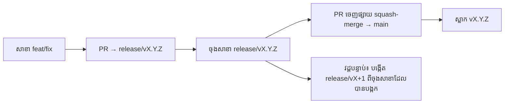

# Branching & Release Model (ខ្មែរ)

🌐 **Languages:** 🇺🇸 [English](../../../../ops/BRANCHING_MODEL.md) · 🇪🇹 [am](../../../am/docs/ops/BRANCHING_MODEL.md) · 🇸🇦 [ar](../../../ar/docs/ops/BRANCHING_MODEL.md) · 🇦🇿 [az](../../../az/docs/ops/BRANCHING_MODEL.md) · 🇧🇬 [bg](../../../bg/docs/ops/BRANCHING_MODEL.md) · 🇧🇩 [bn](../../../bn/docs/ops/BRANCHING_MODEL.md) · 🇧🇦 [bs](../../../bs/docs/ops/BRANCHING_MODEL.md) · 🇨🇿 [cs](../../../cs/docs/ops/BRANCHING_MODEL.md) · 🇩🇰 [da](../../../da/docs/ops/BRANCHING_MODEL.md) · 🇩🇪 [de](../../../de/docs/ops/BRANCHING_MODEL.md) · 🇬🇷 [el](../../../el/docs/ops/BRANCHING_MODEL.md) · 🇪🇸 [es](../../../es/docs/ops/BRANCHING_MODEL.md) · 🇪🇪 [et](../../../et/docs/ops/BRANCHING_MODEL.md) · 🇮🇷 [fa](../../../fa/docs/ops/BRANCHING_MODEL.md) · 🇫🇮 [fi](../../../fi/docs/ops/BRANCHING_MODEL.md) · 🇫🇷 [fr](../../../fr/docs/ops/BRANCHING_MODEL.md) · 🇮🇪 [ga](../../../ga/docs/ops/BRANCHING_MODEL.md) · 🇮🇳 [gu](../../../gu/docs/ops/BRANCHING_MODEL.md) · 🇳🇬 [ha](../../../ha/docs/ops/BRANCHING_MODEL.md) · 🇮🇱 [he](../../../he/docs/ops/BRANCHING_MODEL.md) · 🇮🇳 [hi](../../../hi/docs/ops/BRANCHING_MODEL.md) · 🇭🇷 [hr](../../../hr/docs/ops/BRANCHING_MODEL.md) · 🇭🇺 [hu](../../../hu/docs/ops/BRANCHING_MODEL.md) · 🇦🇲 [hy](../../../hy/docs/ops/BRANCHING_MODEL.md) · 🇮🇩 [id](../../../id/docs/ops/BRANCHING_MODEL.md) · 🇳🇬 [ig](../../../ig/docs/ops/BRANCHING_MODEL.md) · 🇮🇹 [it](../../../it/docs/ops/BRANCHING_MODEL.md) · 🇯🇵 [ja](../../../ja/docs/ops/BRANCHING_MODEL.md) · 🇬🇪 [ka](../../../ka/docs/ops/BRANCHING_MODEL.md) · 🇮🇳 [kn](../../../kn/docs/ops/BRANCHING_MODEL.md) · 🇰🇷 [ko](../../../ko/docs/ops/BRANCHING_MODEL.md) · 🇱🇹 [lt](../../../lt/docs/ops/BRANCHING_MODEL.md) · 🇱🇻 [lv](../../../lv/docs/ops/BRANCHING_MODEL.md) · 🇮🇳 [ml](../../../ml/docs/ops/BRANCHING_MODEL.md) · 🇮🇳 [mr](../../../mr/docs/ops/BRANCHING_MODEL.md) · 🇲🇾 [ms](../../../ms/docs/ops/BRANCHING_MODEL.md) · 🇲🇹 [mt](../../../mt/docs/ops/BRANCHING_MODEL.md) · 🇲🇲 [my](../../../my/docs/ops/BRANCHING_MODEL.md) · 🇳🇵 [ne](../../../ne/docs/ops/BRANCHING_MODEL.md) · 🇳🇱 [nl](../../../nl/docs/ops/BRANCHING_MODEL.md) · 🇳🇴 [no](../../../no/docs/ops/BRANCHING_MODEL.md) · 🇮🇳 [or](../../../or/docs/ops/BRANCHING_MODEL.md) · 🇮🇳 [pa](../../../pa/docs/ops/BRANCHING_MODEL.md) · 🇵🇭 [phi](../../../phi/docs/ops/BRANCHING_MODEL.md) · 🇵🇱 [pl](../../../pl/docs/ops/BRANCHING_MODEL.md) · 🇵🇹 [pt](../../../pt/docs/ops/BRANCHING_MODEL.md) · 🇧🇷 [pt-BR](../../../pt-BR/docs/ops/BRANCHING_MODEL.md) · 🇷🇴 [ro](../../../ro/docs/ops/BRANCHING_MODEL.md) · 🇷🇺 [ru](../../../ru/docs/ops/BRANCHING_MODEL.md) · 🇱🇰 [si](../../../si/docs/ops/BRANCHING_MODEL.md) · 🇸🇰 [sk](../../../sk/docs/ops/BRANCHING_MODEL.md) · 🇸🇮 [sl](../../../sl/docs/ops/BRANCHING_MODEL.md) · 🇷🇸 [sr](../../../sr/docs/ops/BRANCHING_MODEL.md) · 🇸🇪 [sv](../../../sv/docs/ops/BRANCHING_MODEL.md) · 🇰🇪 [sw](../../../sw/docs/ops/BRANCHING_MODEL.md) · 🇮🇳 [ta](../../../ta/docs/ops/BRANCHING_MODEL.md) · 🇮🇳 [te](../../../te/docs/ops/BRANCHING_MODEL.md) · 🇹🇭 [th](../../../th/docs/ops/BRANCHING_MODEL.md) · 🇹🇷 [tr](../../../tr/docs/ops/BRANCHING_MODEL.md) · 🇺🇦 [uk-UA](../../../uk-UA/docs/ops/BRANCHING_MODEL.md) · 🇵🇰 [ur](../../../ur/docs/ops/BRANCHING_MODEL.md) · 🇺🇿 [uz](../../../uz/docs/ops/BRANCHING_MODEL.md) · 🇻🇳 [vi](../../../vi/docs/ops/BRANCHING_MODEL.md) · 🇳🇬 [yo](../../../yo/docs/ops/BRANCHING_MODEL.md) · 🇨🇳 [zh-CN](../../../zh-CN/docs/ops/BRANCHING_MODEL.md) · 🇹🇼 [zh-TW](../../../zh-TW/docs/ops/BRANCHING_MODEL.md)

---

OmniRoute ប្រើម៉ូដែលចេញផ្សាយបែប **វដ្តស្របគ្នា**៖ សាខា `release/vX.Y.Z`
ដាច់ដោយឡែកសម្រាប់វដ្តសកម្ម, `main` សម្រាប់ខ្សែដែលបានចេញផ្សាយ និងស្លាក
`vX.Y.Z` ដែលមិនអាចកែប្រែបាន នៅពេលវដ្តនោះត្រូវបានចេញផ្សាយ។ ការឃើញ commit ចូលទៅក្នុង `release/*` _និង_ ក្នុង
`main` គឺជាអ្វីដែលបានរំពឹងទុក — មិនមែនជាការភាន់ច្រឡំទេ។

ព័ត៌មានលម្អិតសម្រាប់អ្នកថែទាំមាននៅក្នុង `CLAUDE.md` (វិធានតឹងរឹង #21) និង
[RELEASE_CHECKLIST.md](./RELEASE_CHECKLIST.md)។ ទំព័រនេះគឺជាសេចក្តីសង្ខេបសាធារណៈ
សម្រាប់អ្នកចូលរួមចំណែក។

## ទិដ្ឋភាពសង្ខេប

| Ref              | តួនាទី                                                                                                         |
| ---------------- | -------------------------------------------------------------------------------------------------------------- |
| `release/vX.Y.Z` | **វដ្តសកម្ម** — ការអភិវឌ្ឍប្រចាំថ្ងៃ និងការ merge PR សម្រាប់កំណែនោះ                                            |
| `main`           | **ខ្សែដែលបានចេញផ្សាយ** — ទទួលវដ្តតាមរយៈ squash-merge នៅពេលការចេញផ្សាយត្រូវបានដាក់ឱ្យប្រើ                       |
| `vX.Y.Z` (ស្លាក) | **សញ្ញាសម្គាល់ការដាក់ឱ្យប្រើ** — ទ្រនិច “អ្វីដែលបានចេញផ្សាយ” ដែលមិនអាចកែប្រែបាន និងត្រូវបានបង្កើតនៅពេលចេញផ្សាយ |



## តើ PR របស់ខ្ញុំគួរកំណត់គោលដៅទៅណា?

**កំណត់គោលដៅទៅសាខា `release/vX.Y.Z` ដែលសកម្ម — មិនមែន `main` ទេ។**

1. ស្វែងរកសាខា `release/v*` ដែលបើក និងមានកំណែខ្ពស់បំផុត (ឧទាហរណ៍នៅពេលសរសេរ៖
   `release/v3.8.49`)។
2. បង្កើតសាខាពីចុងសាខានោះ (`git fetch` + checkout / rebase លើវា)។
3. បើក PR ដោយកំណត់ **base = `release/vX.Y.Z` នោះ**។

`main` មិនមែនជាសាខាសមាហរណកម្មប្រចាំថ្ងៃទេ។ PR ដែលបើកប្រឆាំងនឹង `main`
ជាទូទៅត្រូវកំណត់គោលដៅឡើងវិញមុនពេល merge។

## ការបង្កកការចេញផ្សាយ (វដ្តស្របគ្នា)

នៅពេលការចេញផ្សាយកំពុងត្រូវបានផ្ទៀងផ្ទាត់ នឹងមានការបើក issue សម្គាល់មួយដែលមានស្លាក `release-freeze`។
វា **មិនបញ្ឈប់ការអភិវឌ្ឍទេ**៖

- `release/vX.Y.Z` ដែលបានបង្កក ស្ថិតក្រោមការគ្រប់គ្រងរបស់ប្រធានការចេញផ្សាយសម្រាប់ការដាក់ឱ្យប្រើនោះ។
- `release/vX+1` របស់វដ្តបន្ទាប់ត្រូវបានបង្កើតពីចុងសាខាដែលបានបង្កក ដើម្បីឱ្យអ្នកចូលរួមចំណែកអាចបន្ត
  បញ្ចូលការងារ។
- PR ដែលនៅតែកំណត់គោលដៅទៅសាខាដែលបានបង្កក គួរត្រូវបាន **កំណត់គោលដៅឡើងវិញ** ទៅសាខា
  `release/v*` ដែលសកម្ម (ខ្ពស់បំផុត)។

ពិនិត្យមើលថាតើមានការបង្កកដែលបើកឬអត់ មុននឹងសន្មត់ថាសាខាដែលអ្នកចង់បានអាច merge បាន៖

```bash
gh issue list --repo diegosouzapw/OmniRoute --label release-freeze --state open
```

យន្តការ merge (ស្លាក `queue` របស់ម្ចាស់ → Mergify) ត្រូវបានចងក្រងជាឯកសារនៅក្នុង
[MERGE_TRAIN.md](./MERGE_TRAIN.md)។

## ហេតុអ្វីត្រូវមានទាំងសាខា និងស្លាក?

| វត្ថុបង្កើត      | រយៈពេលប្រើប្រាស់  | គោលបំណង                                                                 |
| ---------------- | ----------------- | ----------------------------------------------------------------------- |
| `release/vX.Y.Z` | វដ្តកំពុងដំណើរការ | ប្រមូល PR ដែលបានពិនិត្យ រក្សាស្ថានភាព CI ឱ្យជោគជ័យ និងជាមូលដ្ឋានរបស់ PR |
| ស្លាក `vX.Y.Z`   | ជារៀងរហូត         | សម្គាល់ bits ជាក់លាក់ដែលបានចេញផ្សាយទៅ npm / GitHub Releases             |

សាខាគឺជាកន្លែងធ្វើការ; ស្លាកគឺជាកញ្ចប់ដែលបានបិទជិត។ បន្ទាប់ពី squash-merge ទៅ
`main` វដ្តបន្ទាប់បន្តនៅលើ `release/vX+1` ដោយមិនចាំបាច់រង់ចាំឱ្យ PR
នៃការចេញផ្សាយមុនបញ្ចប់ទេ។

## ឯកសារពាក់ព័ន្ធ

- [CONTRIBUTING.md](../../CONTRIBUTING.md) — ការដំឡើង ការធ្វើតេស្ត បញ្ជីត្រួតពិនិត្យ PR
- [RELEASE_CHECKLIST.md](./RELEASE_CHECKLIST.md) — ការផ្ទៀងផ្ទាត់មុនដាក់ឱ្យប្រើ
- [MERGE_TRAIN.md](./MERGE_TRAIN.md) — ជួរ merge និងដំណើរការបម្រុង
- [RELEASE_GREEN.md](./RELEASE_GREEN.md) — ការរក្សាចុងសាខាចេញផ្សាយឱ្យមានស្ថានភាពជោគជ័យ
