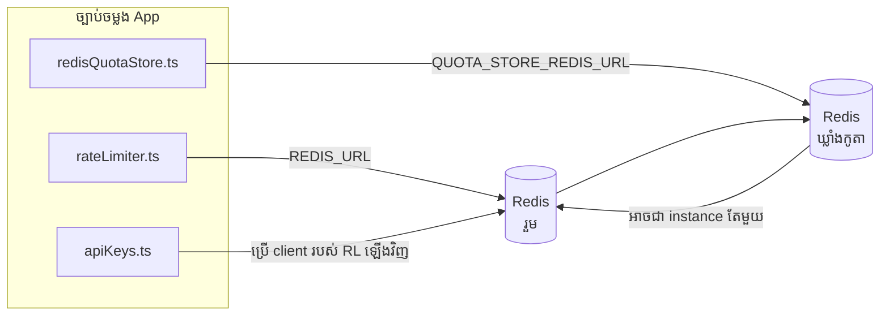

# Redis Production Configuration Guide (ខ្មែរ)

🌐 **Languages:** 🇺🇸 [English](../../../../ops/REDIS_PRODUCTION_CONFIG.md) · 🇪🇹 [am](../../../am/docs/ops/REDIS_PRODUCTION_CONFIG.md) · 🇸🇦 [ar](../../../ar/docs/ops/REDIS_PRODUCTION_CONFIG.md) · 🇦🇿 [az](../../../az/docs/ops/REDIS_PRODUCTION_CONFIG.md) · 🇧🇬 [bg](../../../bg/docs/ops/REDIS_PRODUCTION_CONFIG.md) · 🇧🇩 [bn](../../../bn/docs/ops/REDIS_PRODUCTION_CONFIG.md) · 🇨🇿 [cs](../../../cs/docs/ops/REDIS_PRODUCTION_CONFIG.md) · 🇩🇰 [da](../../../da/docs/ops/REDIS_PRODUCTION_CONFIG.md) · 🇩🇪 [de](../../../de/docs/ops/REDIS_PRODUCTION_CONFIG.md) · 🇬🇷 [el](../../../el/docs/ops/REDIS_PRODUCTION_CONFIG.md) · 🇪🇸 [es](../../../es/docs/ops/REDIS_PRODUCTION_CONFIG.md) · 🇪🇪 [et](../../../et/docs/ops/REDIS_PRODUCTION_CONFIG.md) · 🇮🇷 [fa](../../../fa/docs/ops/REDIS_PRODUCTION_CONFIG.md) · 🇫🇮 [fi](../../../fi/docs/ops/REDIS_PRODUCTION_CONFIG.md) · 🇫🇷 [fr](../../../fr/docs/ops/REDIS_PRODUCTION_CONFIG.md) · 🇮🇪 [ga](../../../ga/docs/ops/REDIS_PRODUCTION_CONFIG.md) · 🇮🇳 [gu](../../../gu/docs/ops/REDIS_PRODUCTION_CONFIG.md) · 🇳🇬 [ha](../../../ha/docs/ops/REDIS_PRODUCTION_CONFIG.md) · 🇮🇱 [he](../../../he/docs/ops/REDIS_PRODUCTION_CONFIG.md) · 🇮🇳 [hi](../../../hi/docs/ops/REDIS_PRODUCTION_CONFIG.md) · 🇭🇷 [hr](../../../hr/docs/ops/REDIS_PRODUCTION_CONFIG.md) · 🇭🇺 [hu](../../../hu/docs/ops/REDIS_PRODUCTION_CONFIG.md) · 🇦🇲 [hy](../../../hy/docs/ops/REDIS_PRODUCTION_CONFIG.md) · 🇮🇩 [id](../../../id/docs/ops/REDIS_PRODUCTION_CONFIG.md) · 🇳🇬 [ig](../../../ig/docs/ops/REDIS_PRODUCTION_CONFIG.md) · 🇮🇹 [it](../../../it/docs/ops/REDIS_PRODUCTION_CONFIG.md) · 🇯🇵 [ja](../../../ja/docs/ops/REDIS_PRODUCTION_CONFIG.md) · 🇬🇪 [ka](../../../ka/docs/ops/REDIS_PRODUCTION_CONFIG.md) · 🇮🇳 [kn](../../../kn/docs/ops/REDIS_PRODUCTION_CONFIG.md) · 🇰🇷 [ko](../../../ko/docs/ops/REDIS_PRODUCTION_CONFIG.md) · 🇱🇹 [lt](../../../lt/docs/ops/REDIS_PRODUCTION_CONFIG.md) · 🇱🇻 [lv](../../../lv/docs/ops/REDIS_PRODUCTION_CONFIG.md) · 🇮🇳 [ml](../../../ml/docs/ops/REDIS_PRODUCTION_CONFIG.md) · 🇮🇳 [mr](../../../mr/docs/ops/REDIS_PRODUCTION_CONFIG.md) · 🇲🇾 [ms](../../../ms/docs/ops/REDIS_PRODUCTION_CONFIG.md) · 🇲🇹 [mt](../../../mt/docs/ops/REDIS_PRODUCTION_CONFIG.md) · 🇲🇲 [my](../../../my/docs/ops/REDIS_PRODUCTION_CONFIG.md) · 🇳🇵 [ne](../../../ne/docs/ops/REDIS_PRODUCTION_CONFIG.md) · 🇳🇱 [nl](../../../nl/docs/ops/REDIS_PRODUCTION_CONFIG.md) · 🇳🇴 [no](../../../no/docs/ops/REDIS_PRODUCTION_CONFIG.md) · 🇮🇳 [or](../../../or/docs/ops/REDIS_PRODUCTION_CONFIG.md) · 🇮🇳 [pa](../../../pa/docs/ops/REDIS_PRODUCTION_CONFIG.md) · 🇵🇭 [phi](../../../phi/docs/ops/REDIS_PRODUCTION_CONFIG.md) · 🇵🇱 [pl](../../../pl/docs/ops/REDIS_PRODUCTION_CONFIG.md) · 🇵🇹 [pt](../../../pt/docs/ops/REDIS_PRODUCTION_CONFIG.md) · 🇧🇷 [pt-BR](../../../pt-BR/docs/ops/REDIS_PRODUCTION_CONFIG.md) · 🇷🇴 [ro](../../../ro/docs/ops/REDIS_PRODUCTION_CONFIG.md) · 🇷🇺 [ru](../../../ru/docs/ops/REDIS_PRODUCTION_CONFIG.md) · 🇱🇰 [si](../../../si/docs/ops/REDIS_PRODUCTION_CONFIG.md) · 🇸🇰 [sk](../../../sk/docs/ops/REDIS_PRODUCTION_CONFIG.md) · 🇸🇮 [sl](../../../sl/docs/ops/REDIS_PRODUCTION_CONFIG.md) · 🇷🇸 [sr](../../../sr/docs/ops/REDIS_PRODUCTION_CONFIG.md) · 🇸🇪 [sv](../../../sv/docs/ops/REDIS_PRODUCTION_CONFIG.md) · 🇰🇪 [sw](../../../sw/docs/ops/REDIS_PRODUCTION_CONFIG.md) · 🇮🇳 [ta](../../../ta/docs/ops/REDIS_PRODUCTION_CONFIG.md) · 🇮🇳 [te](../../../te/docs/ops/REDIS_PRODUCTION_CONFIG.md) · 🇹🇭 [th](../../../th/docs/ops/REDIS_PRODUCTION_CONFIG.md) · 🇹🇷 [tr](../../../tr/docs/ops/REDIS_PRODUCTION_CONFIG.md) · 🇺🇦 [uk-UA](../../../uk-UA/docs/ops/REDIS_PRODUCTION_CONFIG.md) · 🇵🇰 [ur](../../../ur/docs/ops/REDIS_PRODUCTION_CONFIG.md) · 🇺🇿 [uz](../../../uz/docs/ops/REDIS_PRODUCTION_CONFIG.md) · 🇻🇳 [vi](../../../vi/docs/ops/REDIS_PRODUCTION_CONFIG.md) · 🇳🇬 [yo](../../../yo/docs/ops/REDIS_PRODUCTION_CONFIG.md) · 🇨🇳 [zh-CN](../../../zh-CN/docs/ops/REDIS_PRODUCTION_CONFIG.md) · 🇹🇼 [zh-TW](../../../zh-TW/docs/ops/REDIS_PRODUCTION_CONFIG.md)

---

## ទិដ្ឋភាពទូទៅ

Redis គឺជា **dependency ជាជម្រើស និងមិនតឹងរឹង** នៅក្នុង OmniRoute — កម្មវិធីនឹងបន្តដំណើរការដោយបន្ថយសមត្ថភាពយ៉ាងរលូន (ប្រើជម្រើសជំនួសក្នុងអង្គចងចាំ)
នៅពេល Redis មិនអាចប្រើបាន។ នៅក្នុងបរិស្ថាន production ការកែតម្រូវ Redis ឱ្យសមស្របជួយកាត់បន្ថយ latency សម្រាប់ workload បួនប្រភេទផ្សេងគ្នា៖

| Workload                              | Driver                        | Client Factory                                      | ទម្រង់ Key                                                          |
| ------------------------------------- | ----------------------------- | --------------------------------------------------- | ------------------------------------------------------------------- |
| ការកំណត់អត្រា                         | `rateLimiter.ts`              | `getRedisClient()` — `ioredis` singleton បែប lazy   | `<prefix>rl:*` ចន្លោះពេលកំណត់អត្រាបែប Lua‑atomic                    |
| ឃ្លាំងសម្ងាត់ការផ្ទៀងផ្ទាត់អត្តសញ្ញាណ | `apiKeys.ts`                  | ប្រើ client របស់ `rateLimiter` ឡើងវិញ               | `<prefix>auth:api_key:<sha256>` ជាមួយ TTL                           |
| កន្លែងផ្ទុកកូតា                       | `redisQuotaStore.ts`          | `getRedisClient(url)` singleton ដាច់ដោយឡែក          | `<prefix>quota:*` ដែលអាចកំណត់រចនាសម្ព័ន្ធបានសម្រាប់ instance នីមួយៗ |
| Circuit breaker សម្រាប់ warmup        | `redisCircuitBreakerStore.ts` | Client ដាច់ដោយឡែកនៅក្នុង `circuitBreakerFactory.ts` | `<prefix>warmup:cb:<connectionId>`                                  |

Workload ទាំងបួនប្រើ prefix របស់ namespace តែមួយ ដើម្បីឱ្យ OmniRoute អាចដំណើរការរួមជាមួយកម្មវិធីផ្សេងទៀតនៅលើ
Redis instance តែមួយ (ឧ. `127.0.0.1:6379`)។ សូមមើល [ការបែងចែក Namespace សម្រាប់ Key](#key-namespacing)។

---

## ការកំណត់រចនាសម្ព័ន្ធបច្ចុប្បន្ន (តម្លៃលំនាំដើមក្នុងកូដ)

| ការកំណត់                             | តម្លៃ                                                                           | ទីតាំង                                                                                |
| ------------------------------------ | ------------------------------------------------------------------------------- | ------------------------------------------------------------------------------------- |
| អថេរបរិស្ថាន `REDIS_URL`             | `redis://redis:6379` (compose), ជាជម្រើស                                        | `rateLimiter.ts:5`, `.env.example`                                                    |
| អថេរបរិស្ថាន `REDIS_KEY_PREFIX`      | `omniroute:` (លំនាំដើម)                                                         | `rateLimiter.ts`, `redisQuotaStore.ts`, `redisCircuitBreakerStore.ts`, `.env.example` |
| អថេរបរិស្ថាន `QUOTA_STORE_REDIS_URL` | ដាច់ដោយឡែក និងអាចខុសពី `REDIS_URL`                                              | `quota/storeFactory.ts`                                                               |
| `QUOTA_STORE_DRIVER`                 | `"sqlite"` (លំនាំដើម), `"redis"` ជាជម្រើស                                       | `quota/storeFactory.ts`                                                               |
| ioredis `maxRetriesPerRequest`       | `3`                                                                             | ការបង្កើត client នៅក្នុង `rateLimiter.ts`                                             |
| `enableReadyCheck`                   | មិនបានកំណត់ (លំនាំដើមរបស់ ioredis៖ `true`)                                      | —                                                                                     |
| `lazyConnect`                        | មិនបានកំណត់ (លំនាំដើមរបស់ ioredis៖ `false`)                                     | —                                                                                     |
| `retryStrategy`                      | មិនបានកំណត់ (លំនាំដើមរបស់ ioredis៖ មូលដ្ឋាន 200ms និងកើនឡើងតាមអិចស្ប៉ូណង់ស្យែល) | —                                                                                     |
| TLS / ពាក្យសម្ងាត់ / DB index        | **មិនបានកំណត់រចនាសម្ព័ន្ធ**                                                     | —                                                                                     |
| Sentinel / Cluster                   | **មិនបានកំណត់រចនាសម្ព័ន្ធ** — គាំទ្រតែ standalone single-node ប៉ុណ្ណោះ          | —                                                                                     |

---

## ការបែងចែក Namespace សម្រាប់ Key

OmniRoute ប្រើ Redis instance រួមជាមួយអ្វីផ្សេងទៀតដែលដំណើរការលើ host។ បើគ្មាន namespace ទេ
key ដូចជា `auth:api_key:<sha256>` ឬ `rl:*` អាចប៉ះទង្គិចជាមួយ key ពីកម្មវិធីផ្សេងទៀត
ដែលប្រើ Redis ដូចគ្នា (instance នេះដំណើរការ Redis នៅលើ `127.0.0.1:6379` រួមជាមួយ service ផ្សេងទៀត)។

កំណត់ `REDIS_KEY_PREFIX` ជា string ដែលមិនទទេ ដើម្បីបន្ថែម prefix ទៅខាងមុខ key **ទាំងអស់** របស់ OmniRoute៖

```bash
# .env — key ទាំងអស់របស់ OmniRoute ក្លាយជា omniroute:rl:*, omniroute:auth:*, omniroute:quota:*, omniroute:warmup:cb:*
REDIS_KEY_PREFIX=omniroute:
```

- **លំនាំដើម៖** `omniroute:` (ត្រូវបានអនុវត្តនៅពេល `REDIS_KEY_PREFIX` មិនបានកំណត់ ឬទទេ)។
- **អនុវត្តចំពោះ៖** rate limiter + auth cache (ប្រើ `ioredis` client រួមគ្នាតាមរយៈ `keyPrefix`) និង
  quota store (`KEY_PREFIX = "${REDIS_KEY_PREFIX}quota"`) ព្រមទាំង warmup circuit breaker
  (`KEY_PREFIX = "${REDIS_KEY_PREFIX}warmup:cb:"`)។
- **ការផ្លាស់ប្តូរ prefix** នៅពេលមាន key រួចហើយក្នុង Redis នឹងធ្វើឱ្យ key ចាស់ៗលែងត្រូវបានយោង (ពួកវានឹងផុតកំណត់
  តាមរយៈ TTL / LRU)។ អាចផ្លាស់ប្តូរបានដោយសុវត្ថិភាព ហើយមិនចាំបាច់ធ្វើ migration ទេ។ ករណីលើកលែងតែមួយគត់គឺ key របស់ warmup
  circuit-breaker សម្រាប់ connection ដែលបានសម្គាល់ថា forbidden៖ វាត្រូវបានរក្សាទុកដោយគ្មាន TTL ដូច្នេះ
  សូមរាយបញ្ជី key ដែលនៅសេសសល់ដោយប្រើ `redis-cli --scan --pattern '<old-prefix>warmup:cb:*'` ហើយលុបពួកវា។
- **`keyPrefix` របស់ ioredis** បន្ថែម prefix ទៅខាងមុខដោយស្វ័យប្រវត្តិពេលសរសេរ **និង** ដកវាចេញពេលអាន
  ដូច្នេះកូដកម្មវិធីមិនឃើញ prefix ឡើយ។

---

## ការកែសម្រួលដែលបានណែនាំសម្រាប់បរិស្ថានផលិតកម្ម

### 1. ជម្រើស Connection Pool / Client (constructor `Redis` របស់ ioredis)

កូដបច្ចុប្បន្នបង្កើត `new Redis(url)` តែមួយដោយគ្មានជម្រើសផ្ទាល់ខ្លួន។ សម្រាប់ការដាក់ឱ្យដំណើរការជាមួយ replica ច្រើនក្នុងបរិស្ថានផលិតកម្ម សូមបញ្ជូន client factory មួយនៅក្នុងកូដ ឬរុំ `getRedisClient()`៖

```typescript
const redis = new Redis(REDIS_URL, {
  maxRetriesPerRequest: null, // មិនកំណត់ចំនួនព្យាយាមឡើងវិញទេ; ទុកឱ្យ retryStrategy ជាអ្នកសម្រេច
  enableReadyCheck: true, // ផ្ទៀងផ្ទាត់ថា server រួចរាល់ មុនទទួលយកការហៅ
  lazyConnect: true, // កុំភ្ជាប់ពេលបង្កើត; រង់ចាំការហៅលើកដំបូង
  retryStrategy: (times) => {
    if (times > 10) return null; // បោះបង់ក្រោយព្យាយាមឡើងវិញ 10 ដង → ភ្ជាប់ឡើងវិញនៅពេលក្រោយ
    return Math.min(times * 200, 5000); // 200ms, 400ms, …, កំណត់អតិបរមាត្រឹម 5s
  },
  enableAutoPipelining: true, // រួមបញ្ចូល command ដែលដំណើរការស្របពេលគ្នាទៅជា TCP write តែមួយ
  keepAlive: 10000, // TCP keep-alive រៀងរាល់ 10s
});
```

**ការថ្លឹងថ្លែងសំខាន់ៗ៖**

- `maxRetriesPerRequest: null` + `retryStrategy` — សមស្របជាងសម្រាប់បរិស្ថានផលិតកម្ម ដើម្បីកុំឱ្យការចាប់ផ្ដើម Redis ឡើងវិញជាបណ្ដោះអាសន្ន ធ្វើឱ្យរាល់ request បរាជ័យភ្លាមៗ។ fallback ក្នុងអង្គចងចាំនៅក្នុង `checkRateLimit()` ទប់ទល់នឹងផ្លូវបរាជ័យនេះ។
- `lazyConnect: true` — ជៀសវាងការពឹងផ្អែកនៅពេលចាប់ផ្ដើមដែលតម្រូវឱ្យ Redis ត្រូវតែដំណើរការ មុនពេល server ចាប់ផ្ដើមទទួលយក connection។
- `enableAutoPipelining: true` — កាត់បន្ថយការទៅមកសម្រាប់ការត្រួតពិនិត្យ rate-limit ដែលកើតឡើងស្របពេលគ្នា; មានប្រយោជន៍នៅពេល >50 RPS លើ connection តែមួយ។

### 2. ការកំណត់រចនាសម្ព័ន្ធ Redis Server (`redis.conf`)

```
# អង្គចងចាំ
maxmemory 80%                        # ទុកទំហំសម្រាប់ page cache របស់ OS
maxmemory-policy allkeys-lru         # បណ្ដេញធាតុ auth cache ចាស់ៗចេញនៅពេលមានសម្ពាធអង្គចងចាំ

# ការរក្សាទុកជាអចិន្ត្រៃយ៍ (ជាជម្រើស — OmniRoute មានសុវត្ថិភាពចំពោះការគាំង ទោះគ្មានវាក៏ដោយ)
save 300 1                           # ថត snapshot យ៉ាងហោចណាស់រៀងរាល់ 5 នាទី ប្រសិនបើមាន key ≥1 បានផ្លាស់ប្ដូរ
appendonly no                        # មិនត្រូវការ AOF ទេ; ទិន្នន័យអាចបង្កើតឡើងវិញបាន
appendfsync no                       # គ្មានបន្ទុកបន្ថែមពី fsync (RDB គឺគ្រប់គ្រាន់)

# បណ្ដាញ
timeout 0                            # មិនផ្ដាច់ connection ដែលនៅទំនេរ
tcp-keepalive 300                    # keep-alive 5 នាទី
tcp-backlog 511                      # ជួររង់ចាំ connection សម្រាប់បន្ទុកដែលកើនឡើងភ្លាមៗ

# ដំណើរការ
hz 10                                # លំនាំដើម; 100 សម្រាប់ករណីដែលងាយរងឥទ្ធិពលពី latency
activedefrag yes                     # រៀបចំបំណែកអង្គចងចាំឡើងវិញដោយស្វ័យប្រវត្តិ នៅពេល fragmentation >10%
```

**ការថ្លឹងថ្លែងសម្រាប់ `maxmemory-policy allkeys-lru`៖** ធាតុ auth cache អាចត្រូវបានបណ្ដេញចេញនៅពេលមានសម្ពាធអង្គចងចាំ។ វាមានសុវត្ថិភាព — `setCachedApiKey` តែងតែបំពេញទិន្នន័យឡើងវិញនៅពេល cache miss ហើយ SQLite fallback គឺជាប្រភពទិន្នន័យដែលមានសិទ្ធិសម្រេចចុងក្រោយ។ Lua script របស់ rate-limiter បង្កើត key តូចៗដែលត្រូវបានរចនាឡើងឱ្យមានអាយុកាលខ្លី។

### 3. ការកំណត់ Docker Compose

prod compose (`docker-compose.prod.yml`) ប្រើ `redis:8.6.2-alpine`។ សូមបន្ថែម៖

```yaml
redis:
  image: redis:8.6.2-alpine
  command:
    [
      "redis-server",
      "--maxmemory",
      "512mb",
      "--maxmemory-policy",
      "allkeys-lru",
      "--activedefrag",
      "yes",
      "--save",
      "300 1",
    ]
  healthcheck:
    test: ["CMD", "redis-cli", "ping"]
    interval: 10s
    timeout: 3s
    retries: 3
    start_period: 5s
```

### 4. ចំណុចត្រូវពិចារណាសម្រាប់ Multi-Instance / Scaling

**Redis តែមួយសម្រាប់ replica ទាំងអស់** — Lua script របស់ rate-limiter ពឹងផ្អែកលើ key space ដែលមានសិទ្ធិសម្រេចចុងក្រោយតែមួយ។ ការប្រើ Redis instance ច្រើននៅពីក្រោយ replica នឹងធ្វើឱ្យបាត់បង់ atomicity និងធ្វើឱ្យថវិកាកើនទ្វេដង។ សូមប្រើ Redis តែមួយ (ឬ Redis Sentinel cluster ដែលមាន failover) សម្រាប់ application replica ទាំងអស់។

**ចំនួន connection៖** Application replica នីមួយៗបើក **2 TCP connections** ទៅ Redis (rate limiter client + quota store client)។ នៅពេលមាន 10 replicas → 20 connections ដែលស្ថិតនៅក្រោមពិដានលំនាំដើម 10k connections របស់ Redis instance យ៉ាងច្រើន។

### 5. ការត្រួតពិនិត្យ

បង្ហាញតាមរយៈ health-check endpoint៖

```typescript
// src/app/api/monitoring/health/route.ts ហៅមុខងារ rateLimiter រួចហើយ
// បន្ថែមការត្រួតពិនិត្យជាក់លាក់សម្រាប់ Redis៖
//   1. PING latency តាមរយៈ ioredis .ping()
//   2. ការប្រើប្រាស់អង្គចងចាំតាមរយៈ INFO memory
//   3. ចំនួន connection តាមរយៈ INFO clients
//   4. អត្រា hit សម្រាប់ maxmemory-policy (evicted_keys / keyspace_hits)
```

រង្វាស់សំខាន់ៗដែលត្រូវតាមដាន៖

- **Key ដែលត្រូវបានបណ្ដេញចេញ / វិនាទី** — ប្រសិនបើវានៅតែមិនស្មើសូន្យជាបន្តបន្ទាប់ សូមបង្កើន `maxmemory`
- **Client ដែលត្រូវបានរារាំង** — តម្លៃមិនស្មើសូន្យបង្ហាញថា Lua script យឺត ឬមានការប្រជែងខ្ពស់
- **Connection ដែលត្រូវបានបដិសេធ** — បានឈានដល់ដែនកំណត់ connection; កម្រកើតឡើងនៅត្រឹម 20 connections

---

## ដ្យាក្រាមស្ថាបត្យកម្ម



---

## ឯកសារយោង

| ឯកសារ                              | គោលបំណង                                                               |
| ---------------------------------- | --------------------------------------------------------------------- |
| `src/shared/utils/rateLimiter.ts`  | Redis client ចម្បង, ស្គ្រីបកំណត់អត្រា Lua និង fallback ក្នុងអង្គចងចាំ |
| `src/lib/db/apiKeys.ts`            | ឃ្លាំងសម្ងាត់សម្រាប់ការផ្ទៀងផ្ទាត់ — fallback ពី Redis→SQLite         |
| `src/lib/quota/redisQuotaStore.ts` | Redis client ដាច់ដោយឡែកសម្រាប់ឃ្លាំងកូតាជាជម្រើស                      |
| `src/lib/quota/storeFactory.ts`    | ប្ដូររវាង driver កូតា `sqlite` និង `redis`                            |
| `docker-compose.prod.yml`          | កុងតឺន័រ Redis សម្រាប់បរិស្ថានផលិតកម្ម (image `redis:8.6.2-alpine`)   |
| `.env.example`                     | ឯកសារពន្យល់អំពីអថេរបរិស្ថាន Redis                                     |
| `src/app/api/local/redis/`         | API routes សម្រាប់ការរៀបចំ និងគ្រប់គ្រងកុងតឺន័រអភិវឌ្ឍន៍              |
| `bin/cli/commands/redis.mjs`       | ពាក្យបញ្ជា CLI សម្រាប់ការរៀបចំ និងគ្រប់គ្រងកុងតឺន័រអភិវឌ្ឍន៍          |
