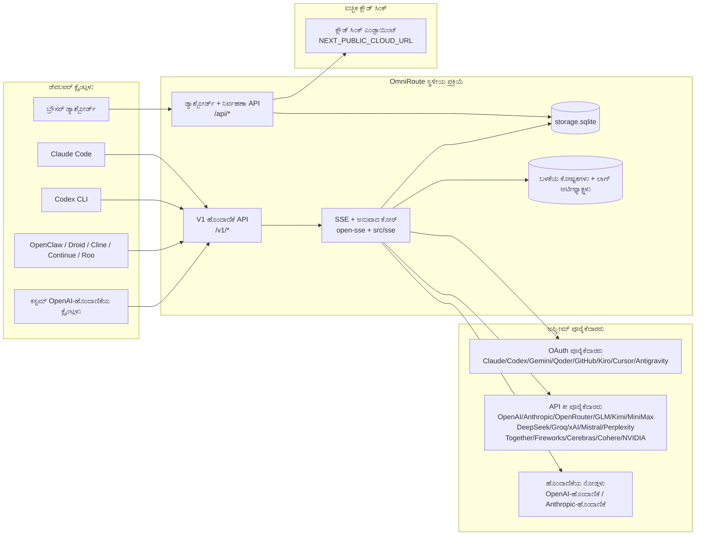
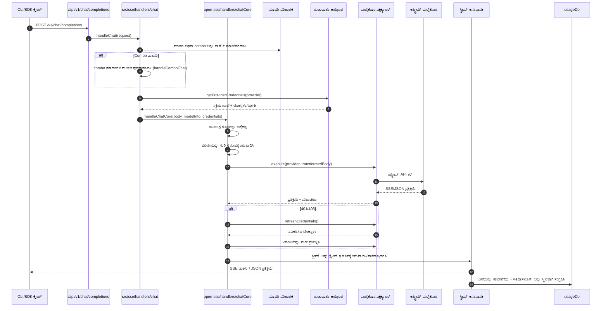
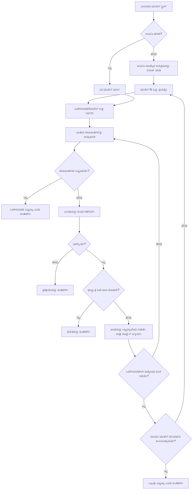
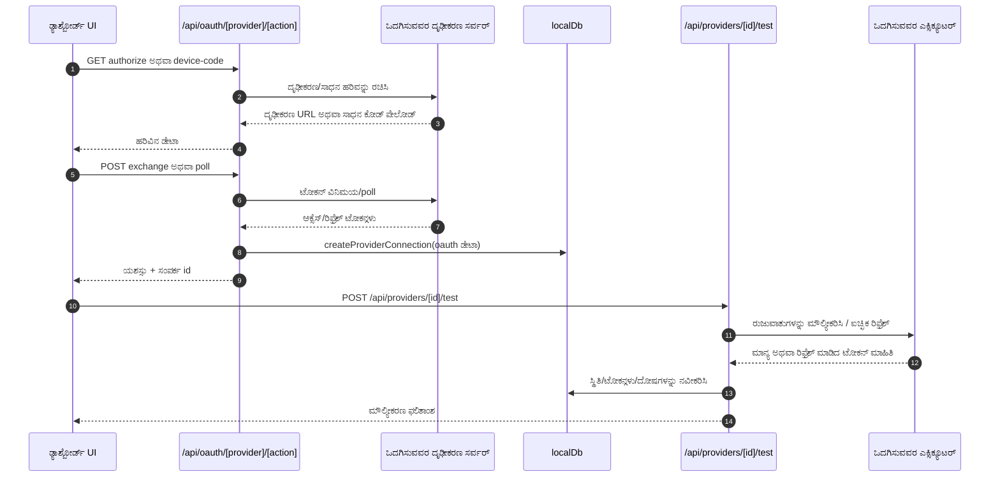
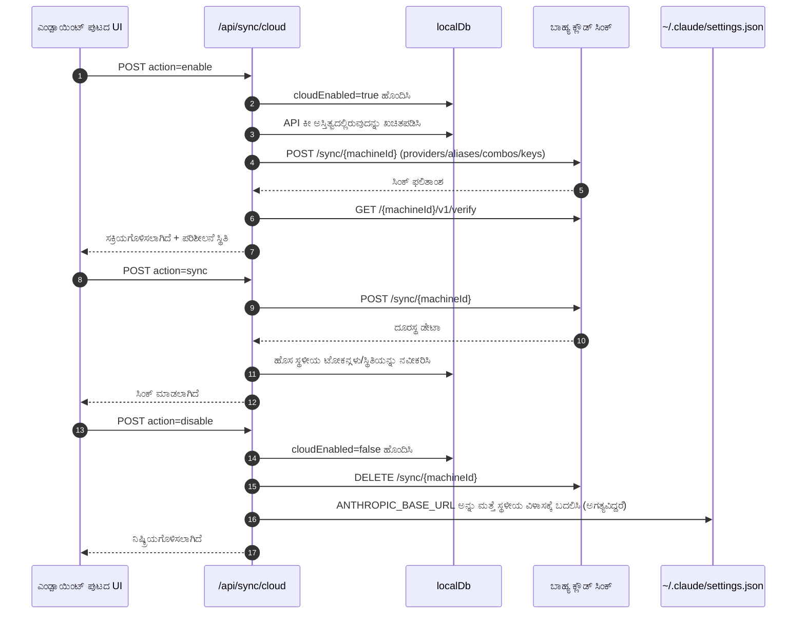
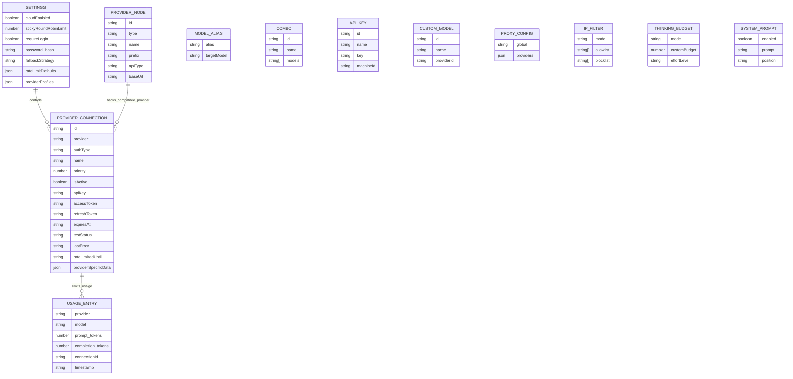
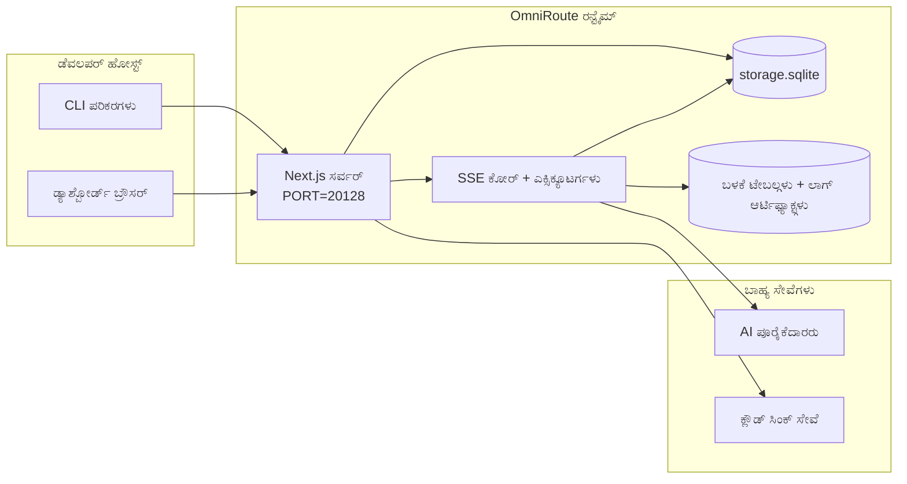

# OmniRoute Architecture (ಕನ್ನಡ)

🌐 **Languages:** 🇺🇸 [English](../../../../architecture/ARCHITECTURE.md) · 🇪🇹 [am](../../../am/docs/architecture/ARCHITECTURE.md) · 🇸🇦 [ar](../../../ar/docs/architecture/ARCHITECTURE.md) · 🇦🇿 [az](../../../az/docs/architecture/ARCHITECTURE.md) · 🇧🇬 [bg](../../../bg/docs/architecture/ARCHITECTURE.md) · 🇧🇩 [bn](../../../bn/docs/architecture/ARCHITECTURE.md) · 🇧🇦 [bs](../../../bs/docs/architecture/ARCHITECTURE.md) · 🇨🇿 [cs](../../../cs/docs/architecture/ARCHITECTURE.md) · 🇩🇰 [da](../../../da/docs/architecture/ARCHITECTURE.md) · 🇩🇪 [de](../../../de/docs/architecture/ARCHITECTURE.md) · 🇬🇷 [el](../../../el/docs/architecture/ARCHITECTURE.md) · 🇪🇸 [es](../../../es/docs/architecture/ARCHITECTURE.md) · 🇪🇪 [et](../../../et/docs/architecture/ARCHITECTURE.md) · 🇮🇷 [fa](../../../fa/docs/architecture/ARCHITECTURE.md) · 🇫🇮 [fi](../../../fi/docs/architecture/ARCHITECTURE.md) · 🇫🇷 [fr](../../../fr/docs/architecture/ARCHITECTURE.md) · 🇮🇪 [ga](../../../ga/docs/architecture/ARCHITECTURE.md) · 🇮🇳 [gu](../../../gu/docs/architecture/ARCHITECTURE.md) · 🇳🇬 [ha](../../../ha/docs/architecture/ARCHITECTURE.md) · 🇮🇱 [he](../../../he/docs/architecture/ARCHITECTURE.md) · 🇮🇳 [hi](../../../hi/docs/architecture/ARCHITECTURE.md) · 🇭🇷 [hr](../../../hr/docs/architecture/ARCHITECTURE.md) · 🇭🇺 [hu](../../../hu/docs/architecture/ARCHITECTURE.md) · 🇦🇲 [hy](../../../hy/docs/architecture/ARCHITECTURE.md) · 🇮🇩 [id](../../../id/docs/architecture/ARCHITECTURE.md) · 🇳🇬 [ig](../../../ig/docs/architecture/ARCHITECTURE.md) · 🇮🇹 [it](../../../it/docs/architecture/ARCHITECTURE.md) · 🇯🇵 [ja](../../../ja/docs/architecture/ARCHITECTURE.md) · 🇬🇪 [ka](../../../ka/docs/architecture/ARCHITECTURE.md) · 🇰🇭 [km](../../../km/docs/architecture/ARCHITECTURE.md) · 🇰🇷 [ko](../../../ko/docs/architecture/ARCHITECTURE.md) · 🇱🇹 [lt](../../../lt/docs/architecture/ARCHITECTURE.md) · 🇱🇻 [lv](../../../lv/docs/architecture/ARCHITECTURE.md) · 🇮🇳 [ml](../../../ml/docs/architecture/ARCHITECTURE.md) · 🇮🇳 [mr](../../../mr/docs/architecture/ARCHITECTURE.md) · 🇲🇾 [ms](../../../ms/docs/architecture/ARCHITECTURE.md) · 🇲🇹 [mt](../../../mt/docs/architecture/ARCHITECTURE.md) · 🇲🇲 [my](../../../my/docs/architecture/ARCHITECTURE.md) · 🇳🇵 [ne](../../../ne/docs/architecture/ARCHITECTURE.md) · 🇳🇱 [nl](../../../nl/docs/architecture/ARCHITECTURE.md) · 🇳🇴 [no](../../../no/docs/architecture/ARCHITECTURE.md) · 🇮🇳 [or](../../../or/docs/architecture/ARCHITECTURE.md) · 🇮🇳 [pa](../../../pa/docs/architecture/ARCHITECTURE.md) · 🇵🇭 [phi](../../../phi/docs/architecture/ARCHITECTURE.md) · 🇵🇱 [pl](../../../pl/docs/architecture/ARCHITECTURE.md) · 🇵🇹 [pt](../../../pt/docs/architecture/ARCHITECTURE.md) · 🇧🇷 [pt-BR](../../../pt-BR/docs/architecture/ARCHITECTURE.md) · 🇷🇴 [ro](../../../ro/docs/architecture/ARCHITECTURE.md) · 🇷🇺 [ru](../../../ru/docs/architecture/ARCHITECTURE.md) · 🇱🇰 [si](../../../si/docs/architecture/ARCHITECTURE.md) · 🇸🇰 [sk](../../../sk/docs/architecture/ARCHITECTURE.md) · 🇸🇮 [sl](../../../sl/docs/architecture/ARCHITECTURE.md) · 🇷🇸 [sr](../../../sr/docs/architecture/ARCHITECTURE.md) · 🇸🇪 [sv](../../../sv/docs/architecture/ARCHITECTURE.md) · 🇰🇪 [sw](../../../sw/docs/architecture/ARCHITECTURE.md) · 🇮🇳 [ta](../../../ta/docs/architecture/ARCHITECTURE.md) · 🇮🇳 [te](../../../te/docs/architecture/ARCHITECTURE.md) · 🇹🇭 [th](../../../th/docs/architecture/ARCHITECTURE.md) · 🇹🇷 [tr](../../../tr/docs/architecture/ARCHITECTURE.md) · 🇺🇦 [uk-UA](../../../uk-UA/docs/architecture/ARCHITECTURE.md) · 🇵🇰 [ur](../../../ur/docs/architecture/ARCHITECTURE.md) · 🇺🇿 [uz](../../../uz/docs/architecture/ARCHITECTURE.md) · 🇻🇳 [vi](../../../vi/docs/architecture/ARCHITECTURE.md) · 🇳🇬 [yo](../../../yo/docs/architecture/ARCHITECTURE.md) · 🇨🇳 [zh-CN](../../../zh-CN/docs/architecture/ARCHITECTURE.md) · 🇹🇼 [zh-TW](../../../zh-TW/docs/architecture/ARCHITECTURE.md)

---

🌐 **Languages:** 🇺🇸 [English](../../../../architecture/ARCHITECTURE.md) · 🇪🇹 [am](../../../am/docs/architecture/ARCHITECTURE.md) · 🇸🇦 [ar](../../../ar/docs/architecture/ARCHITECTURE.md) · 🇦🇿 [az](../../../az/docs/architecture/ARCHITECTURE.md) · 🇧🇬 [bg](../../../bg/docs/architecture/ARCHITECTURE.md) · 🇧🇩 [bn](../../../bn/docs/architecture/ARCHITECTURE.md) · 🇧🇦 [bs](../../../bs/docs/architecture/ARCHITECTURE.md) · 🇨🇿 [cs](../../../cs/docs/architecture/ARCHITECTURE.md) · 🇩🇰 [da](../../../da/docs/architecture/ARCHITECTURE.md) · 🇩🇪 [de](../../../de/docs/architecture/ARCHITECTURE.md) · 🇬🇷 [el](../../../el/docs/architecture/ARCHITECTURE.md) · 🇪🇸 [es](../../../es/docs/architecture/ARCHITECTURE.md) · 🇪🇪 [et](../../../et/docs/architecture/ARCHITECTURE.md) · 🇮🇷 [fa](../../../fa/docs/architecture/ARCHITECTURE.md) · 🇫🇮 [fi](../../../fi/docs/architecture/ARCHITECTURE.md) · 🇫🇷 [fr](../../../fr/docs/architecture/ARCHITECTURE.md) · 🇮🇪 [ga](../../../ga/docs/architecture/ARCHITECTURE.md) · 🇮🇳 [gu](../../../gu/docs/architecture/ARCHITECTURE.md) · 🇳🇬 [ha](../../../ha/docs/architecture/ARCHITECTURE.md) · 🇮🇱 [he](../../../he/docs/architecture/ARCHITECTURE.md) · 🇮🇳 [hi](../../../hi/docs/architecture/ARCHITECTURE.md) · 🇭🇷 [hr](../../../hr/docs/architecture/ARCHITECTURE.md) · 🇭🇺 [hu](../../../hu/docs/architecture/ARCHITECTURE.md) · 🇦🇲 [hy](../../../hy/docs/architecture/ARCHITECTURE.md) · 🇮🇩 [id](../../../id/docs/architecture/ARCHITECTURE.md) · 🇳🇬 [ig](../../../ig/docs/architecture/ARCHITECTURE.md) · 🇮🇹 [it](../../../it/docs/architecture/ARCHITECTURE.md) · 🇯🇵 [ja](../../../ja/docs/architecture/ARCHITECTURE.md) · 🇬🇪 [ka](../../../ka/docs/architecture/ARCHITECTURE.md) · 🇰🇭 [km](../../../km/docs/architecture/ARCHITECTURE.md) · 🇰🇷 [ko](../../../ko/docs/architecture/ARCHITECTURE.md) · 🇱🇹 [lt](../../../lt/docs/architecture/ARCHITECTURE.md) · 🇱🇻 [lv](../../../lv/docs/architecture/ARCHITECTURE.md) · 🇮🇳 [ml](../../../ml/docs/architecture/ARCHITECTURE.md) · 🇮🇳 [mr](../../../mr/docs/architecture/ARCHITECTURE.md) · 🇲🇾 [ms](../../../ms/docs/architecture/ARCHITECTURE.md) · 🇲🇹 [mt](../../../mt/docs/architecture/ARCHITECTURE.md) · 🇲🇲 [my](../../../my/docs/architecture/ARCHITECTURE.md) · 🇳🇵 [ne](../../../ne/docs/architecture/ARCHITECTURE.md) · 🇳🇱 [nl](../../../nl/docs/architecture/ARCHITECTURE.md) · 🇳🇴 [no](../../../no/docs/architecture/ARCHITECTURE.md) · 🇮🇳 [or](../../../or/docs/architecture/ARCHITECTURE.md) · 🇮🇳 [pa](../../../pa/docs/architecture/ARCHITECTURE.md) · 🇵🇭 [phi](../../../phi/docs/architecture/ARCHITECTURE.md) · 🇵🇱 [pl](../../../pl/docs/architecture/ARCHITECTURE.md) · 🇵🇹 [pt](../../../pt/docs/architecture/ARCHITECTURE.md) · 🇧🇷 [pt-BR](../../../pt-BR/docs/architecture/ARCHITECTURE.md) · 🇷🇴 [ro](../../../ro/docs/architecture/ARCHITECTURE.md) · 🇷🇺 [ru](../../../ru/docs/architecture/ARCHITECTURE.md) · 🇱🇰 [si](../../../si/docs/architecture/ARCHITECTURE.md) · 🇸🇰 [sk](../../../sk/docs/architecture/ARCHITECTURE.md) · 🇸🇮 [sl](../../../sl/docs/architecture/ARCHITECTURE.md) · 🇷🇸 [sr](../../../sr/docs/architecture/ARCHITECTURE.md) · 🇸🇪 [sv](../../../sv/docs/architecture/ARCHITECTURE.md) · 🇰🇪 [sw](../../../sw/docs/architecture/ARCHITECTURE.md) · 🇮🇳 [ta](../../../ta/docs/architecture/ARCHITECTURE.md) · 🇮🇳 [te](../../../te/docs/architecture/ARCHITECTURE.md) · 🇹🇭 [th](../../../th/docs/architecture/ARCHITECTURE.md) · 🇹🇷 [tr](../../../tr/docs/architecture/ARCHITECTURE.md) · 🇺🇦 [uk-UA](../../../uk-UA/docs/architecture/ARCHITECTURE.md) · 🇵🇰 [ur](../../../ur/docs/architecture/ARCHITECTURE.md) · 🇺🇿 [uz](../../../uz/docs/architecture/ARCHITECTURE.md) · 🇻🇳 [vi](../../../vi/docs/architecture/ARCHITECTURE.md) · 🇳🇬 [yo](../../../yo/docs/architecture/ARCHITECTURE.md) · 🇨🇳 [zh-CN](../../../zh-CN/docs/architecture/ARCHITECTURE.md) · 🇹🇼 [zh-TW](../../../zh-TW/docs/architecture/ARCHITECTURE.md)

_ಕೊನೆಯದಾಗಿ ನವೀಕರಿಸಿದ್ದು: 2026-06-28_

## ಕಾರ್ಯನಿರ್ವಾಹಕ ಸಾರಾಂಶ

OmniRoute ಎಂಬುದು Next.js ಮೇಲೆ ನಿರ್ಮಿಸಲಾದ ಸ್ಥಳೀಯ AI ರೂಟಿಂಗ್ ಗೇಟ್ವೇ ಮತ್ತು ಡ್ಯಾಶ್ಬೋರ್ಡ್ ಆಗಿದೆ.
ಇದು ಏಕೈಕ OpenAI-ಹೊಂದಾಣಿಕೆಯ ಎಂಡ್ಪಾಯಿಂಟ್ (`/v1/*`) ಒದಗಿಸುತ್ತದೆ ಮತ್ತು ಅನುವಾದ, ಫಾಲ್ಬ್ಯಾಕ್, ಟೋಕನ್ ರಿಫ್ರೆಶ್ ಹಾಗೂ ಬಳಕೆ ಟ್ರ್ಯಾಕಿಂಗ್ನೊಂದಿಗೆ ಅನೇಕ ಅಪ್ಸ್ಟ್ರೀಮ್ ಪೂರೈಕೆದಾರಗಳಾದ್ಯಂತ ಟ್ರಾಫಿಕ್ ಅನ್ನು ರೂಟ್ ಮಾಡುತ್ತದೆ.

ಪ್ರಮುಖ ಸಾಮರ್ಥ್ಯಗಳು:

- CLI/ಪರಿಕರಗಳಿಗಾಗಿ OpenAI-ಹೊಂದಾಣಿಕೆಯ API ಮೇಲ್ಮೈ (355 ಪೂರೈಕೆದಾರರು, 108 ಎಕ್ಸಿಕ್ಯೂಟರ್ಗಳು)
- ಪೂರೈಕೆದಾರರ ಸ್ವರೂಪಗಳ ನಡುವೆ ವಿನಂತಿ/ಪ್ರತಿಕ್ರಿಯೆ ಅನುವಾದ
- ಮಾಡೆಲ್ ಕಾಂಬೊ ಫಾಲ್ಬ್ಯಾಕ್ (ಬಹು-ಮಾಡೆಲ್ ಅನುಕ್ರಮ)
- `compositeTiers` ಆಧಾರಿತ ರನ್ಟೈಮ್ ಕ್ರಮದೊಂದಿಗೆ ರಚನಾತ್ಮಕ ಕಾಂಬೊ ಹಂತಗಳು (`provider + model + connection`)
- ಖಾತೆ-ಮಟ್ಟದ ಫಾಲ್ಬ್ಯಾಕ್ (ಪ್ರತಿ ಪೂರೈಕೆದಾರರಿಗೆ ಬಹು ಖಾತೆಗಳು)
- ಮುಖ್ಯ ಚಾಟ್ ಪಥದಲ್ಲಿ ಕೋಟಾ ಪೂರ್ವಪರಿಶೀಲನೆ ಮತ್ತು ಕೋಟಾ-ಅರಿವುಳ್ಳ P2C ಖಾತೆ ಆಯ್ಕೆ
- OAuth + API-ಕೀ ಪೂರೈಕೆದಾರ ಸಂಪರ್ಕ ನಿರ್ವಹಣೆ (22 OAuth ಪೂರೈಕೆದಾರ ಮಾಡ್ಯೂಲ್ಗಳು)
- `/v1/embeddings` ಮೂಲಕ ಎಂಬೆಡಿಂಗ್ ರಚನೆ (18 ಪೂರೈಕೆದಾರರು)
- `/v1/images/generations` ಮೂಲಕ ಚಿತ್ರ ರಚನೆ (10+ ಪೂರೈಕೆದಾರರು, 20+ ಮಾಡೆಲ್ಗಳು)
- `/v1/audio/transcriptions` ಮೂಲಕ ಆಡಿಯೊ ಪ್ರತಿಲೇಖನ (18 ಪೂರೈಕೆದಾರರು)
- `/v1/audio/speech` ಮೂಲಕ ಪಠ್ಯದಿಂದ-ಧ್ವನಿ ಪರಿವರ್ತನೆ (24 ಅಂತರ್ನಿರ್ಮಿತ ಪೂರೈಕೆದಾರರು)
- `/v1/videos/generations` ಮೂಲಕ ವೀಡಿಯೊ ರಚನೆ (ComfyUI + SD WebUI)
- `/v1/music/generations` ಮೂಲಕ ಸಂಗೀತ ರಚನೆ (ComfyUI)
- `/v1/search` ಮೂಲಕ ವೆಬ್ ಹುಡುಕಾಟ (20 ಪೂರೈಕೆದಾರರು)
- `/v1/moderations` ಮೂಲಕ ಮಾಡರೇಷನ್ಗಳು
- `/v1/rerank` ಮೂಲಕ ಮರುಶ್ರೇಯಾಂಕ
- ತಾರ್ಕಿಕ ಮಾಡೆಲ್ಗಳಿಗಾಗಿ ಥಿಂಕ್ ಟ್ಯಾಗ್ ಪಾರ್ಸಿಂಗ್ (`<think>...</think>`)
- ಕಟ್ಟುನಿಟ್ಟಾದ OpenAI SDK ಹೊಂದಾಣಿಕೆಗಾಗಿ ಪ್ರತಿಕ್ರಿಯೆ ಶುದ್ಧೀಕರಣ
- ಪೂರೈಕೆದಾರರ ನಡುವಿನ ಹೊಂದಾಣಿಕೆಗಾಗಿ ಪಾತ್ರ ಸಾಮಾನ್ಯೀಕರಣ (developer→system, system→user)
- ರಚನಾತ್ಮಕ ಔಟ್ಪುಟ್ ಪರಿವರ್ತನೆ (json_schema → Gemini responseSchema)
- ಪೂರೈಕೆದಾರರು, ಕೀಗಳು, ಅಲಿಯಾಸ್ಗಳು, ಕಾಂಬೊಗಳು, ಸೆಟ್ಟಿಂಗ್ಗಳು ಮತ್ತು ಬೆಲೆಗಳಿಗಾಗಿ ಸ್ಥಳೀಯ ಸ್ಥಿರ ಸಂಗ್ರಹಣೆ (122 DB ಮಾಡ್ಯೂಲ್ಗಳು)
- ಬಳಕೆ/ವೆಚ್ಚ ಟ್ರ್ಯಾಕಿಂಗ್ ಮತ್ತು ವಿನಂತಿ ಲಾಗಿಂಗ್
- ಬಹು-ಸಾಧನ/ಸ್ಥಿತಿ ಸಿಂಕ್ಗಾಗಿ ಐಚ್ಛಿಕ ಕ್ಲೌಡ್ ಸಿಂಕ್
- API ಪ್ರವೇಶ ನಿಯಂತ್ರಣಕ್ಕಾಗಿ IP ಅನುಮತಿ ಪಟ್ಟಿ/ನಿರ್ಬಂಧ ಪಟ್ಟಿ
- ಥಿಂಕಿಂಗ್ ಬಜೆಟ್ ನಿರ್ವಹಣೆ (ಪಾಸ್ಥ್ರೂ/ಸ್ವಯಂ/ಕಸ್ಟಮ್/ಹೊಂದಾಣಿಕೆಯ)
- ಜಾಗತಿಕ ಸಿಸ್ಟಮ್ ಪ್ರಾಂಪ್ಟ್ ಇಂಜೆಕ್ಷನ್
- ಸೆಷನ್ ಟ್ರ್ಯಾಕಿಂಗ್ ಮತ್ತು ಫಿಂಗರ್ಪ್ರಿಂಟಿಂಗ್
- ಪೂರೈಕೆದಾರ-ನಿರ್ದಿಷ್ಟ ಪ್ರೊಫೈಲ್ಗಳೊಂದಿಗೆ ಪ್ರತಿ-ಖಾತೆಗೆ ಸುಧಾರಿತ ದರ ಮಿತಿಗೊಳಿಸುವಿಕೆ
- ಪೂರೈಕೆದಾರರ ಸ್ಥಿತಿಸ್ಥಾಪಕತ್ವಕ್ಕಾಗಿ ಸರ್ಕ್ಯೂಟ್ ಬ್ರೇಕರ್ ಮಾದರಿ
- ಮ್ಯೂಟೆಕ್ಸ್ ಲಾಕಿಂಗ್ನೊಂದಿಗೆ ಆಂಟಿ-ಥಂಡರಿಂಗ್ ಹರ್ಡ್ ರಕ್ಷಣೆ
- ಸಿಗ್ನೇಚರ್-ಆಧಾರಿತ ವಿನಂತಿ ನಕಲು ನಿವಾರಣಾ ಕ್ಯಾಶ್
- ಡೊಮೇನ್ ಪದರ: ವೆಚ್ಚ ನಿಯಮಗಳು, ಫಾಲ್ಬ್ಯಾಕ್ ನೀತಿ, ಲಾಕ್ಔಟ್ ನೀತಿ
- ಕಾಂಟೆಕ್ಸ್ಟ್ ರಿಲೇ: ಖಾತೆ ರೊಟೇಷನ್ ನಿರಂತರತೆಗಾಗಿ ಸೆಷನ್ ಹಸ್ತಾಂತರ ಸಾರಾಂಶಗಳು
- ಡೊಮೇನ್ ಸ್ಥಿತಿ ಸ್ಥಿರ ಸಂಗ್ರಹಣೆ (ಫಾಲ್ಬ್ಯಾಕ್ಗಳು, ಬಜೆಟ್ಗಳು, ಲಾಕ್ಔಟ್ಗಳು ಮತ್ತು ಸರ್ಕ್ಯೂಟ್ ಬ್ರೇಕರ್ಗಳಿಗಾಗಿ SQLite ರೈಟ್-ಥ್ರೂ ಕ್ಯಾಶ್)
- ಕೇಂದ್ರೀಕೃತ ವಿನಂತಿ ಮೌಲ್ಯಮಾಪನಕ್ಕಾಗಿ ನೀತಿ ಎಂಜಿನ್ (ಲಾಕ್ಔಟ್ → ಬಜೆಟ್ → ಫಾಲ್ಬ್ಯಾಕ್)
- p50/p95/p99 ಲೇಟೆನ್ಸಿ ಒಟ್ಟುಗೂಡಿಸುವಿಕೆಯೊಂದಿಗೆ ವಿನಂತಿ ಟೆಲಿಮೆಟ್ರಿ
- `combo_execution_key` / `combo_step_id` ಮೂಲಕ ಕಾಂಬೊ ಗುರಿ ಟೆಲಿಮೆಟ್ರಿ ಮತ್ತು ಐತಿಹಾಸಿಕ ಕಾಂಬೊ ಗುರಿ ಆರೋಗ್ಯ
- ಎಂಡ್-ಟು-ಎಂಡ್ ಟ್ರೇಸಿಂಗ್ಗಾಗಿ ಸಹಸಂಬಂಧ ID (X-Request-Id)
- ಪ್ರತಿ API ಕೀಗೆ ಹೊರಗುಳಿಯುವ ಆಯ್ಕೆಯೊಂದಿಗೆ ಅನುಸರಣೆ ಆಡಿಟ್ ಲಾಗಿಂಗ್
- LLM ಗುಣಮಟ್ಟ ಖಾತರಿಗಾಗಿ ಮೌಲ್ಯಮಾಪನ ಚೌಕಟ್ಟು
- ನೈಜ-ಸಮಯದ ಪೂರೈಕೆದಾರ ಸರ್ಕ್ಯೂಟ್ ಬ್ರೇಕರ್ ಸ್ಥಿತಿಯೊಂದಿಗೆ ಆರೋಗ್ಯ ಡ್ಯಾಶ್ಬೋರ್ಡ್
- 3 ಸಾರಿಗೆ ವಿಧಾನಗಳನ್ನು (stdio/SSE/Streamable HTTP) ಹೊಂದಿರುವ MCP Server (110 ಪರಿಕರಗಳು)
- ಕೌಶಲ್ಯಗಳು ಮತ್ತು ಕಾರ್ಯದ ಜೀವನಚಕ್ರದೊಂದಿಗೆ A2A Server (JSON-RPC 2.0 + SSE)
- ಮೆಮೊರಿ ವ್ಯವಸ್ಥೆ (ಹೊರತೆಗೆಯುವಿಕೆ, ಇಂಜೆಕ್ಷನ್, ಮರುಪಡೆಯುವಿಕೆ, ಸಾರಾಂಶೀಕರಣ)
- ಕೌಶಲ್ಯ ವ್ಯವಸ್ಥೆ (ರಿಜಿಸ್ಟ್ರಿ, ಎಕ್ಸಿಕ್ಯೂಟರ್, ಸ್ಯಾಂಡ್ಬಾಕ್ಸ್, ಅಂತರ್ನಿರ್ಮಿತ ಕೌಶಲ್ಯಗಳು)
- ಪ್ರಮಾಣಪತ್ರ ನಿರ್ವಹಣೆ ಮತ್ತು DNS ನಿರ್ವಹಣೆಯೊಂದಿಗೆ MITM ಪ್ರಾಕ್ಸಿ
- ಪ್ರಾಂಪ್ಟ್ ಇಂಜೆಕ್ಷನ್ ಗಾರ್ಡ್ ಮಿಡಲ್ವೇರ್
- Caveman, RTK, ಸ್ಟ್ಯಾಕ್ ಮಾಡಿದ ಪೈಪ್ಲೈನ್ಗಳು, ಕಂಪ್ರೆಷನ್ ಕಾಂಬೊಗಳು, ಭಾಷಾ ಪ್ಯಾಕ್ಗಳು ಮತ್ತು ಅನಾಲಿಟಿಕ್ಸ್ನೊಂದಿಗೆ ಪ್ರಾಂಪ್ಟ್ ಕಂಪ್ರೆಷನ್ ಪೈಪ್ಲೈನ್
- ACP (ಏಜೆಂಟ್ ಸಂವಹನ ಪ್ರೋಟೋಕಾಲ್) ರಿಜಿಸ್ಟ್ರಿ
- ಮಾಡ್ಯುಲರ್ OAuth ಪೂರೈಕೆದಾರರು (`src/lib/oauth/providers/` ಅಡಿಯಲ್ಲಿ 22 ಪ್ರತ್ಯೇಕ ಮಾಡ್ಯೂಲ್ಗಳು)
- ಅನ್ಇನ್ಸ್ಟಾಲ್/ಪೂರ್ಣ-ಅನ್ಇನ್ಸ್ಟಾಲ್ ಸ್ಕ್ರಿಪ್ಟ್ಗಳು
- OAuth ಪರಿಸರ ದುರಸ್ತಿ ಕ್ರಿಯೆ
- OpenAI-ಹೊಂದಾಣಿಕೆಯ WS ಕ್ಲೈಂಟ್ಗಳಿಗಾಗಿ WebSocket ಬ್ರಿಡ್ಜ್ (`/v1/ws`)
- ಸಿಂಕ್ ಟೋಕನ್ ನಿರ್ವಹಣೆ (ನೀಡುವಿಕೆ/ಹಿಂಪಡೆಯುವಿಕೆ, ETag-ಆವೃತ್ತಿಯ ಕಾನ್ಫಿಗರೇಶನ್ ಬಂಡಲ್ ಡೌನ್ಲೋಡ್)
- ಪ್ರಥಮ-ದರ್ಜೆಯ ಪೂರೈಕೆದಾರ ಪ್ರಿಸೆಟ್ ಆಗಿ GLM Thinking (`glmt`)
- ಹೈಬ್ರಿಡ್ ಟೋಕನ್ ಎಣಿಕೆ (ಅಂದಾಜು ಫಾಲ್ಬ್ಯಾಕ್ನೊಂದಿಗೆ ಪೂರೈಕೆದಾರ-ಬದಿಯ `/messages/count_tokens`)
- ಮಾಡೆಲ್ ಅಲಿಯಾಸ್ ಸ್ವಯಂ-ಸೀಡಿಂಗ್ (ಸ್ಟಾರ್ಟ್ಅಪ್ನಲ್ಲಿ 30+ ಕ್ರಾಸ್-ಪ್ರಾಕ್ಸಿ ಡೈಲೆಕ್ಟ್ ಸಾಮಾನ್ಯೀಕರಣಗಳು)
- SSRF ಗಾರ್ಡ್, ಖಾಸಗಿ URL ನಿರ್ಬಂಧ ಮತ್ತು ಕಾನ್ಫಿಗರ್ ಮಾಡಬಹುದಾದ ಮರುಪ್ರಯತ್ನದೊಂದಿಗೆ ಸುರಕ್ಷಿತ ಔಟ್ಬೌಂಡ್ ಫೆಚ್
- ಕಾನ್ಫಿಗರ್ ಮಾಡಬಹುದಾದ `requestRetry` ಮತ್ತು `maxRetryIntervalSec` ಜೊತೆಗೆ ಕೂಲ್ಡೌನ್-ಅರಿವುಳ್ಳ ಚಾಟ್ ಮರುಪ್ರಯತ್ನಗಳು
- ಸ್ಟಾರ್ಟ್ಅಪ್ನಲ್ಲಿ Zod ಮೂಲಕ ರನ್ಟೈಮ್ ಪರಿಸರ ಮೌಲ್ಯಮಾಪನ
- ಪುಟೀಕರಣ, ಪೂರೈಕೆದಾರ CRUD ಈವೆಂಟ್ಗಳು ಮತ್ತು SSRF-ನಿರ್ಬಂಧಿತ ಮೌಲ್ಯಮಾಪನ ಲಾಗಿಂಗ್ನೊಂದಿಗೆ ಅನುಸರಣೆ ಆಡಿಟ್ v2

ಪ್ರಾಥಮಿಕ ರನ್ಟೈಮ್ ಮಾದರಿ:

- `src/app/api/*` ಅಡಿಯಲ್ಲಿರುವ Next.js ಆ್ಯಪ್ ರೂಟ್ಗಳು ಡ್ಯಾಶ್ಬೋರ್ಡ್ APIಗಳು ಮತ್ತು ಹೊಂದಾಣಿಕೆ APIಗಳು ಎರಡನ್ನೂ ಅನುಷ್ಠಾನಗೊಳಿಸುತ್ತವೆ
- `src/sse/*` + `open-sse/*` ನಲ್ಲಿರುವ ಹಂಚಿದ SSE/ರೂಟಿಂಗ್ ಕೋರ್ ಪೂರೈಕೆದಾರ ಕಾರ್ಯಗತಗೊಳಿಸುವಿಕೆ, ಅನುವಾದ, ಸ್ಟ್ರೀಮಿಂಗ್, ಫಾಲ್ಬ್ಯಾಕ್ ಮತ್ತು ಬಳಕೆಯನ್ನು ನಿರ್ವಹಿಸುತ್ತದೆ

## ಉಲ್ಲೇಖ ರೇಖಾಚಿತ್ರಗಳು

v3.8.0 ಪ್ಲಾಟ್ಫಾರ್ಮ್ಗಾಗಿ ಅಧಿಕೃತ, ಆವೃತ್ತಿ-ನಿಯಂತ್ರಿತ Mermaid ಮೂಲಗಳು
[`docs/diagrams/`](../diagrams/README.md) ನಲ್ಲಿ ಲಭ್ಯವಿವೆ. ಪರಿಚಯಕ್ಕಾಗಿ ಅವುಗಳಲ್ಲಿ ಎರಡನ್ನು ಕೆಳಗೆ ಮರುಪ್ರಸ್ತುತಪಡಿಸಲಾಗಿದೆ;
ಉಳಿದವುಗಳನ್ನು ಅವುಗಳ ಕ್ಷೇತ್ರ-ನಿರ್ದಿಷ್ಟ ಮಾರ್ಗದರ್ಶಿಗಳಿಂದ ಲಿಂಕ್ ಮಾಡಲಾಗಿದೆ.


> ಮೂಲ: [diagrams/request-pipeline.mmd](../diagrams/request-pipeline.mmd)


> ಮೂಲ: [diagrams/resilience-3layers.mmd](../diagrams/resilience-3layers.mmd) — ಇದನ್ನು
> [RESILIENCE_GUIDE.md](./RESILIENCE_GUIDE.md) ಮತ್ತು `CLAUDE.md` ಸ್ಥಿತಿಸ್ಥಾಪಕತ್ವ ಉಲ್ಲೇಖದಿಂದಲೂ ಲಿಂಕ್ ಮಾಡಲಾಗಿದೆ.

## ವ್ಯಾಪ್ತಿ ಮತ್ತು ಗಡಿಗಳು

### ವ್ಯಾಪ್ತಿಯಲ್ಲಿರುವವು

- ಸ್ಥಳೀಯ ಗೇಟ್ವೇ ರನ್ಟೈಮ್
- ಡ್ಯಾಶ್ಬೋರ್ಡ್ ನಿರ್ವಹಣಾ APIಗಳು
- ಪೂರೈಕೆದಾರರ ದೃಢೀಕರಣ ಮತ್ತು ಟೋಕನ್ ನವೀಕರಣ
- ವಿನಂತಿ ಪರಿವರ್ತನೆ ಮತ್ತು SSE ಸ್ಟ್ರೀಮಿಂಗ್
- ಸ್ಥಳೀಯ ಸ್ಥಿತಿ + ಬಳಕೆಯ ಶಾಶ್ವತ ಸಂಗ್ರಹಣೆ
- ಐಚ್ಛಿಕ ಕ್ಲೌಡ್ ಸಿಂಕ್ ಸಂಯೋಜನೆ

### ವ್ಯಾಪ್ತಿಯಿಂದ ಹೊರಗಿರುವವು

- `NEXT_PUBLIC_CLOUD_URL` ಹಿಂದಿರುವ ಕ್ಲೌಡ್ ಸೇವೆಯ ಅನುಷ್ಠಾನ
- ಸ್ಥಳೀಯ ಪ್ರಕ್ರಿಯೆಯ ಹೊರಗಿರುವ ಪೂರೈಕೆದಾರರ SLA/ನಿಯಂತ್ರಣ ಪ್ಲೇನ್
- ಬಾಹ್ಯ CLI ಬೈನರಿಗಳು (Claude CLI, Codex CLI, ಇತ್ಯಾದಿ)

## ಡ್ಯಾಶ್ಬೋರ್ಡ್ ಇಂಟರ್ಫೇಸ್ (ಪ್ರಸ್ತುತ)

`src/app/(dashboard)/dashboard/` ಅಡಿಯಲ್ಲಿರುವ ಮುಖ್ಯ ಪುಟಗಳು:

- `/dashboard` — ತ್ವರಿತ ಪ್ರಾರಂಭ + ಪೂರೈಕೆದಾರರ ಅವಲೋಕನ
- `/dashboard/endpoint` — ಎಂಡ್ಪಾಯಿಂಟ್ ಪ್ರಾಕ್ಸಿ + MCP + A2A + API ಎಂಡ್ಪಾಯಿಂಟ್ ಟ್ಯಾಬ್ಗಳು
- `/dashboard/providers` — ಪೂರೈಕೆದಾರರ ಸಂಪರ್ಕಗಳು ಮತ್ತು ರುಜುವಾತುಗಳು
- `/dashboard/combos` — ಕಾಂಬೊ ತಂತ್ರಗಳು, ಟೆಂಪ್ಲೇಟ್ಗಳು, ಹಂತ-ಆಧಾರಿತ ಬಿಲ್ಡರ್, ಮಾದರಿ ರೂಟಿಂಗ್ ನಿಯಮಗಳು, ಕೈಯಾರೆ ಶಾಶ್ವತಗೊಳಿಸಿದ ಕ್ರಮ
- `/dashboard/auto-combo` — ಸ್ವಯಂಚಾಲಿತ ಕಾಂಬೊ ಎಂಜಿನ್: ಸ್ಕೋರಿಂಗ್ ತೂಕಗಳು, ಮೋಡ್ ಪ್ಯಾಕ್ಗಳು, ವರ್ಚುವಲ್ ಫ್ಯಾಕ್ಟರಿ ಪೂರ್ವನಿಗದಿಗಳು, ಟೆಲಿಮೆಟ್ರಿ
- `/dashboard/costs` — ವೆಚ್ಚ ಒಟ್ಟುಗೂಡಿಸುವಿಕೆ ಮತ್ತು ಬೆಲೆ ಗೋಚರತೆ
- `/dashboard/analytics` — ಬಳಕೆಯ ವಿಶ್ಲೇಷಣೆ, ಮೌಲ್ಯಮಾಪನಗಳು, ಕಾಂಬೊ ಗುರಿಯ ಆರೋಗ್ಯ
- `/dashboard/limits` — ಕೋಟಾ/ದರ ನಿಯಂತ್ರಣಗಳು
- `/dashboard/cli-tools` — CLI ಪ್ರಾರಂಭಿಕ ಸಂರಚನೆ, ರನ್ಟೈಮ್ ಪತ್ತೆ, ಸಂರಚನೆ ರಚನೆ
- `/dashboard/agents` — ಪತ್ತೆಯಾದ ACP ಏಜೆಂಟ್ಗಳು + ಕಸ್ಟಮ್ ಏಜೆಂಟ್ ನೋಂದಣಿ
- `/dashboard/cloud-agents` — ಕ್ಲೌಡ್ನಲ್ಲಿ ಹೋಸ್ಟ್ ಮಾಡಲಾದ ಏಜೆಂಟ್ ಕಾರ್ಯಗಳು (Codex Cloud, Devin, Jules) ಮತ್ತು ಕಾರ್ಯದ ಜೀವನಚಕ್ರ
- `/dashboard/skills` — A2A ಕೌಶಲ್ಯ ರಿಜಿಸ್ಟ್ರಿ, ಸ್ಯಾಂಡ್ಬಾಕ್ಸ್ ಕಾರ್ಯಗತಗೊಳಿಸುವಿಕೆ, ಅಂತರ್ನಿರ್ಮಿತ ಕೌಶಲ್ಯ ಕ್ಯಾಟಲಾಗ್
- `/dashboard/memory` — ಶಾಶ್ವತ ಸಂಭಾಷಣಾ ಮೆಮೊರಿಯ ಪರಿಶೀಲನೆ ಮತ್ತು ಮರುಪಡೆಯುವಿಕೆ
- `/dashboard/webhooks` — ಹೊರಹೋಗುವ ವೆಬ್ಹುಕ್ ಚಂದಾದಾರಿಕೆಗಳು, ರಹಸ್ಯ ಪರಿವರ್ತನೆ, ಮರುಪ್ರಯತ್ನದ ಅಂಕಿಅಂಶಗಳು
- `/dashboard/batch` — ಬ್ಯಾಚ್ ಕಾರ್ಯ ಸಲ್ಲಿಕೆ ಮತ್ತು ಪ್ರಗತಿ
- `/dashboard/cache` — ರೀಡ್-ಥ್ರೂ ಮತ್ತು ತಾರ್ಕಿಕ ಕ್ಯಾಶ್ ಅಂಕಿಅಂಶಗಳು, ಹೊರಹಾಕುವಿಕೆ ನಿಯಂತ್ರಣಗಳು
- `/dashboard/playground` — ಸಂರಚಿಸಲಾದ ಯಾವುದೇ ಕಾಂಬೊ/ಮಾದರಿಯೊಂದಿಗೆ ಸಂವಾದಾತ್ಮಕ ಚಾಟ್ ಪ್ರಯೋಗಾಂಗಣ
- `/dashboard/changelog` — ಅಪ್ಲಿಕೇಶನ್ನೊಳಗಿನ ಬದಲಾವಣೆಗಳ ದಾಖಲೆ ವೀಕ್ಷಕ (`CHANGELOG.md` ಅನ್ನು ರೆಂಡರ್ ಮಾಡುತ್ತದೆ)
- `/dashboard/system` — ರನ್ಟೈಮ್ ರೋಗನಿರ್ಣಯ, ಆವೃತ್ತಿ ಮಾಹಿತಿ, ಪರಿಸರ ಮೌಲ್ಯೀಕರಣ ಇಂಟರ್ಫೇಸ್
- `/dashboard/onboarding` — ಹೊಸ ಸ್ಥಾಪನೆಗಳಿಗಾಗಿ ಮೊದಲ ಚಾಲನೆಯ ಸೆಟಪ್ ವಿಜರ್ಡ್
- `/dashboard/media` — ಚಿತ್ರ/ವೀಡಿಯೊ/ಸಂಗೀತ ಪ್ರಯೋಗಾಂಗಣ
- `/dashboard/search-tools` — ಹುಡುಕಾಟ ಪೂರೈಕೆದಾರರ ಪರೀಕ್ಷೆ ಮತ್ತು ಇತಿಹಾಸ
- `/dashboard/health` — ಅಪ್ಟೈಮ್, ಸರ್ಕ್ಯೂಟ್ ಬ್ರೇಕರ್ಗಳು, ದರ ಮಿತಿಗಳು, ಕೋಟಾ-ಮೇಲ್ವಿಚಾರಿತ ಸೆಷನ್ಗಳು
- `/dashboard/logs` — ವಿನಂತಿ/ಪ್ರಾಕ್ಸಿ/ಲೆಕ್ಕಪರಿಶೋಧನೆ/ಕನ್ಸೋಲ್ ಲಾಗ್ಗಳು
- `/dashboard/settings` — ಸಿಸ್ಟಮ್ ಸೆಟ್ಟಿಂಗ್ಗಳ ಟ್ಯಾಬ್ಗಳು (ಸಾಮಾನ್ಯ, ರೂಟಿಂಗ್, ಕಾಂಬೊ ಡೀಫಾಲ್ಟ್ಗಳು, ಇತ್ಯಾದಿ)
- `/dashboard/context/caveman` — Caveman ಸಂಕುಚನ ನಿಯಮಗಳು, ಭಾಷಾ ಪ್ಯಾಕ್ಗಳು, ಪೂರ್ವವೀಕ್ಷಣೆ ಮತ್ತು ಔಟ್ಪುಟ್ ಮೋಡ್
- `/dashboard/context/rtk` — RTK ಕಮಾಂಡ್-ಔಟ್ಪುಟ್ ಫಿಲ್ಟರ್ಗಳು, ಪೂರ್ವವೀಕ್ಷಣೆ ಮತ್ತು ರನ್ಟೈಮ್ ಸುರಕ್ಷತಾ ಸೆಟ್ಟಿಂಗ್ಗಳು
- `/dashboard/context/combos` — ರೂಟಿಂಗ್ ಕಾಂಬೊಗಳಿಗೆ ನಿಯೋಜಿಸಲಾದ ಹೆಸರಿಸಲ್ಪಟ್ಟ ಸಂಕುಚನ ಪೈಪ್ಲೈನ್ಗಳು
- `/dashboard/translator` — ಅನುವಾದಕ ಪರಿಶೀಲನೆ ಮತ್ತು ವಿನಂತಿ ಸ್ವರೂಪ ಪರಿವರ್ತನೆಯ ಪೂರ್ವವೀಕ್ಷಣೆ
- `/dashboard/audit` — ಪುಟವಿಭಜನೆ ಮತ್ತು ರಚನಾತ್ಮಕ ಮೆಟಾಡೇಟಾ ಹೊಂದಿರುವ ಅನುಸರಣೆ ಲೆಕ್ಕಪರಿಶೋಧನಾ ಲಾಗ್ ಬ್ರೌಸರ್
- `/dashboard/usage` — `usage_history` ಗೆ ಸಂಯೋಜಿಸಲಾದ ಪ್ರತಿ-ವಿನಂತಿಯ ಬಳಕೆ ಬ್ರೌಸರ್
- `/dashboard/compression` — ಸಂಕುಚನ ವಿಶ್ಲೇಷಣೆ, ಅಂಕಿಅಂಶಗಳು ಮತ್ತು ಪೈಪ್ಲೈನ್ ನಿಯೋಜನೆ
- `/dashboard/api-manager` — API ಕೀಲಿಯ ಜೀವನಚಕ್ರ ಮತ್ತು ಮಾದರಿ ಅನುಮತಿಗಳು

## ಉನ್ನತ-ಮಟ್ಟದ ಸಿಸ್ಟಮ್ ಸಂದರ್ಭ



## ಕೋರ್ ರನ್ಟೈಮ್ ಘಟಕಗಳು

## 1) API ಮತ್ತು ರೂಟಿಂಗ್ ಪದರ (Next.js ಆಪ್ ರೂಟ್ಗಳು)

ಮುಖ್ಯ ಡೈರೆಕ್ಟರಿಗಳು:

- ಹೊಂದಾಣಿಕೆ APIಗಳಿಗಾಗಿ `src/app/api/v1/*` ಮತ್ತು `src/app/api/v1beta/*`
- ನಿರ್ವಹಣೆ/ಕಾನ್ಫಿಗರೇಶನ್ APIಗಳಿಗಾಗಿ `src/app/api/*`
- `next.config.mjs` ನಲ್ಲಿನ Next ರೀರೈಟ್ಗಳು `/v1/*` ಅನ್ನು `/api/v1/*` ಗೆ ಮ್ಯಾಪ್ ಮಾಡುತ್ತವೆ

ಪ್ರಮುಖ ಹೊಂದಾಣಿಕೆ ರೂಟ್ಗಳು:

- `src/app/api/v1/chat/completions/route.ts`
- `src/app/api/v1/messages/route.ts`
- `src/app/api/v1/responses/route.ts`
- `src/app/api/v1/models/route.ts` — `custom: true` ಹೊಂದಿರುವ ಕಸ್ಟಮ್ ಮಾಡೆಲ್ಗಳನ್ನು ಒಳಗೊಂಡಿದೆ
- `src/app/api/v1/embeddings/route.ts` — ಎಂಬೆಡಿಂಗ್ ರಚನೆ (6 ಪೂರೈಕೆದಾರರು)
- `src/app/api/v1/images/generations/route.ts` — ಚಿತ್ರ ರಚನೆ (Antigravity/Nebius ಸೇರಿದಂತೆ 4+ ಪೂರೈಕೆದಾರರು)
- `src/app/api/v1/messages/count_tokens/route.ts`
- `src/app/api/v1/providers/[provider]/chat/completions/route.ts` — ಪ್ರತಿ ಪೂರೈಕೆದಾರರಿಗೆ ಮೀಸಲಾದ ಚಾಟ್
- `src/app/api/v1/providers/[provider]/embeddings/route.ts` — ಪ್ರತಿ ಪೂರೈಕೆದಾರರಿಗೆ ಮೀಸಲಾದ ಎಂಬೆಡಿಂಗ್ಗಳು
- `src/app/api/v1/providers/[provider]/images/generations/route.ts` — ಪ್ರತಿ ಪೂರೈಕೆದಾರರಿಗೆ ಮೀಸಲಾದ ಚಿತ್ರಗಳು
- `src/app/api/v1beta/models/route.ts`
- `src/app/api/v1beta/models/[...path]/route.ts`

ನಿರ್ವಹಣಾ ಡೊಮೇನ್ಗಳು:

- ದೃಢೀಕರಣ/ಸೆಟ್ಟಿಂಗ್ಗಳು: `src/app/api/auth/*`, `src/app/api/settings/*`
- ಪೂರೈಕೆದಾರರು/ಸಂಪರ್ಕಗಳು: `src/app/api/providers*`
- ಪೂರೈಕೆದಾರ ನೋಡ್ಗಳು: `src/app/api/provider-nodes*`
- ಕಸ್ಟಮ್ ಮಾಡೆಲ್ಗಳು: `src/app/api/provider-models` (GET/POST/DELETE)
- ಮಾಡೆಲ್ ಕ್ಯಾಟಲಾಗ್: `src/app/api/models/route.ts` (GET)
- ಪ್ರಾಕ್ಸಿ ಕಾನ್ಫಿಗರೇಶನ್: `src/app/api/settings/proxy` (GET/PUT/DELETE) + `src/app/api/settings/proxy/test` (POST)
- OAuth: `src/app/api/oauth/*`
- ಕೀಗಳು/ಅಲಿಯಾಸ್ಗಳು/ಕಾಂಬೊಗಳು/ಬೆಲೆ ನಿಗದಿ: `src/app/api/keys*`, `src/app/api/models/alias`, `src/app/api/combos*`, `src/app/api/pricing`
- ಬಳಕೆ: `src/app/api/usage/*`
- ಸಿಂಕ್/ಕ್ಲೌಡ್: `src/app/api/sync/*`, `src/app/api/cloud/*`
- CLI ಟೂಲಿಂಗ್ ಸಹಾಯಕಗಳು: `src/app/api/cli-tools/*`
- IP ಫಿಲ್ಟರ್: `src/app/api/settings/ip-filter` (GET/PUT)
- ಥಿಂಕಿಂಗ್ ಬಜೆಟ್: `src/app/api/settings/thinking-budget` (GET/PUT)
- ಸಿಸ್ಟಮ್ ಪ್ರಾಂಪ್ಟ್: `src/app/api/settings/system-prompt` (GET/PUT)
- ಕಂಪ್ರೆಷನ್: `src/app/api/settings/compression`, `src/app/api/compression/*`, ಮತ್ತು
  `src/app/api/context/*`
- ಸೆಷನ್ಗಳು: `src/app/api/sessions` (GET)
- ದರ ಮಿತಿಗಳು: `src/app/api/rate-limits` (GET)
- ಸ್ಥಿತಿಸ್ಥಾಪಕತೆ: `src/app/api/resilience` (GET/PATCH) — ವಿನಂತಿ ಕ್ಯೂ, ಸಂಪರ್ಕ ಕೂಲ್ಡೌನ್, ಪೂರೈಕೆದಾರ ಬ್ರೇಕರ್, ಕೂಲ್ಡೌನ್ಗಾಗಿ ಕಾಯುವ ಕಾನ್ಫಿಗರೇಶನ್
- ಸ್ಥಿತಿಸ್ಥಾಪಕತೆ ಮರುಹೊಂದಿಕೆ: `src/app/api/resilience/reset` (POST) — ಪೂರೈಕೆದಾರ ಬ್ರೇಕರ್ಗಳನ್ನು ಮರುಹೊಂದಿಸುತ್ತದೆ
- ಕ್ಯಾಶ್ ಅಂಕಿಅಂಶಗಳು: `src/app/api/cache/stats` (GET/DELETE)
- ಟೆಲಿಮೆಟ್ರಿ: `src/app/api/telemetry/summary` (GET)
- ಬಜೆಟ್: `src/app/api/usage/budget` (GET/POST)
- ಫಾಲ್ಬ್ಯಾಕ್ ಸರಪಳಿಗಳು: `src/app/api/fallback/chains` (GET/POST/DELETE)
- ಅನುಸರಣೆ ಆಡಿಟ್: `src/app/api/compliance/audit-log` (GET, ಪುಟೀಕರಣ + ರಚನಾತ್ಮಕ ಮೆಟಾಡೇಟಾದೊಂದಿಗೆ)
- ಮೌಲ್ಯಮಾಪನಗಳು: `src/app/api/evals` (GET/POST), `src/app/api/evals/[suiteId]` (GET)
- ನೀತಿಗಳು: `src/app/api/policies` (GET/POST)
- ಸಿಂಕ್ ಟೋಕನ್ಗಳು: `src/app/api/sync/tokens` (GET/POST), `src/app/api/sync/tokens/[id]` (GET/DELETE)
- ಕಾನ್ಫಿಗ್ ಬಂಡಲ್: `src/app/api/sync/bundle` (GET, ಸೆಟ್ಟಿಂಗ್ಗಳು/ಪೂರೈಕೆದಾರರು/ಕಾಂಬೊಗಳು/ಕೀಗಳ ETag-ಆವೃತ್ತೀಕರಿಸಿದ ಸ್ನ್ಯಾಪ್ಶಾಟ್)
- WebSocket: `src/app/api/v1/ws/route.ts` — OpenAI-ಹೊಂದಾಣಿಕೆಯ WS ಕ್ಲೈಂಟ್ಗಳಿಗಾಗಿ ಅಪ್ಗ್ರೇಡ್ ಹ್ಯಾಂಡ್ಲರ್

## 2) SSE + ಅನುವಾದದ ಮೂಲಭಾಗ

ಮುಖ್ಯ ಪ್ರವಾಹದ ಮಾಡ್ಯೂಲ್ಗಳು:

- ಪ್ರವೇಶ ಬಿಂದು: `src/sse/handlers/chat.ts`
- ಮೂಲ ಸಂಯೋಜನೆ: `open-sse/handlers/chatCore.ts`
- ಪೂರೈಕೆದಾರ ಕಾರ್ಯಗತಗೊಳಿಸುವಿಕೆ ಅಡಾಪ್ಟರ್ಗಳು: `open-sse/executors/*`
- ಸ್ವರೂಪ ಪತ್ತೆ/ಪೂರೈಕೆದಾರ ಸಂರಚನೆ: `open-sse/services/provider.ts`
- ಮಾದರಿ ಪಾರ್ಸಿಂಗ್/ಪರಿಹಾರ: `src/sse/services/model.ts`, `open-sse/services/model.ts`
- ಖಾತೆ ಫಾಲ್ಬ್ಯಾಕ್ ತರ್ಕ: `open-sse/services/accountFallback.ts`
- ಅನುವಾದ ರಿಜಿಸ್ಟ್ರಿ: `open-sse/translator/index.ts`
- ಸ್ಟ್ರೀಮ್ ರೂಪಾಂತರಗಳು: `open-sse/utils/stream.ts`, `open-sse/utils/streamHandler.ts`
- ಬಳಕೆಯ ಹೊರತೆಗೆಯುವಿಕೆ/ಸಾಮಾನ್ಯೀಕರಣ: `open-sse/utils/usageTracking.ts`
- ಥಿಂಕ್ ಟ್ಯಾಗ್ ಪಾರ್ಸರ್: `open-sse/utils/thinkTagParser.ts`
- ಎಂಬೆಡಿಂಗ್ ಹ್ಯಾಂಡ್ಲರ್: `open-sse/handlers/embeddings.ts`
- ಎಂಬೆಡಿಂಗ್ ಪೂರೈಕೆದಾರ ರಿಜಿಸ್ಟ್ರಿ: `open-sse/config/embeddingRegistry.ts`
- ಚಿತ್ರ ರಚನೆ ಹ್ಯಾಂಡ್ಲರ್: `open-sse/handlers/imageGeneration.ts`
- ಚಿತ್ರ ಪೂರೈಕೆದಾರ ರಿಜಿಸ್ಟ್ರಿ: `open-sse/config/imageRegistry.ts`
- ಪ್ರತಿಕ್ರಿಯೆ ಶುದ್ಧೀಕರಣ: `open-sse/handlers/responseSanitizer.ts`
- ಪಾತ್ರ ಸಾಮಾನ್ಯೀಕರಣ: `open-sse/services/roleNormalizer.ts`

ಸೇವೆಗಳು (ವ್ಯವಹಾರ ತರ್ಕ):

- ಖಾತೆ ಆಯ್ಕೆ/ಅಂಕ ನೀಡುವಿಕೆ: `open-sse/services/accountSelector.ts`
- ಸಂದರ್ಭ ಜೀವನಚಕ್ರ ನಿರ್ವಹಣೆ: `open-sse/services/contextManager.ts`
- IP ಫಿಲ್ಟರ್ ಜಾರಿಗೊಳಿಸುವಿಕೆ: `open-sse/services/ipFilter.ts`
- ಸೆಷನ್ ಟ್ರ್ಯಾಕಿಂಗ್: `open-sse/services/sessionManager.ts`
- ವಿನಂತಿಗಳ ನಕಲು ನಿವಾರಣೆ: `open-sse/services/signatureCache.ts`
- ಸಿಸ್ಟಮ್ ಪ್ರಾಂಪ್ಟ್ ಸೇರಿಸುವಿಕೆ: `open-sse/services/systemPrompt.ts`
- ಆಲೋಚನಾ ಬಜೆಟ್ ನಿರ್ವಹಣೆ: `open-sse/services/thinkingBudget.ts`
- ವೈಲ್ಡ್ಕಾರ್ಡ್ ಮಾದರಿ ರೂಟಿಂಗ್: `open-sse/services/wildcardRouter.ts`
- ದರ ಮಿತಿ ನಿರ್ವಹಣೆ: `open-sse/services/rateLimitManager.ts`
- ಸರ್ಕ್ಯೂಟ್ ಬ್ರೇಕರ್: `src/shared/utils/circuitBreaker.ts`
- ಸಂದರ್ಭ ಹಸ್ತಾಂತರ: `open-sse/services/contextHandoff.ts` — ಸಂದರ್ಭ-ರಿಲೇ ತಂತ್ರಕ್ಕಾಗಿ ಹಸ್ತಾಂತರ ಸಾರಾಂಶ ರಚನೆ ಮತ್ತು ಸೇರಿಸುವಿಕೆ
- ಸಂಕೋಚನ: `open-sse/services/compression/*` — ಪೂರೈಕೆದಾರ ಅನುವಾದದ ಮೊದಲು ಪೂರ್ವಸಿದ್ಧ ಸಂಕೋಚನ;
  Caveman ನಿಯಮಗಳು, RTK ಫಿಲ್ಟರ್ಗಳು, ಪೇರಿಸಲಾದ ಪೈಪ್ಲೈನ್ಗಳು, ಸಂಕೋಚನ ಸಂಯೋಜನೆಗಳು, ಅಂಕಿಅಂಶಗಳು ಮತ್ತು ಮೌಲ್ಯೀಕರಣವನ್ನು ಒಳಗೊಂಡಿದೆ
- Codex ಕೋಟಾ ಪಡೆಯುವಿಕೆ: `open-sse/services/codexQuotaFetcher.ts` — ಸಂದರ್ಭ-ರಿಲೇ ಹಸ್ತಾಂತರ ನಿರ್ಧಾರಗಳಿಗಾಗಿ Codex ಕೋಟಾವನ್ನು ಪಡೆಯುತ್ತದೆ
- ಕೂಲ್ಡೌನ್-ಅರಿವಿನ ಮರುಪ್ರಯತ್ನ: `src/sse/services/cooldownAwareRetry.ts` — ಸಂರಚಿಸಬಹುದಾದ `requestRetry` / `maxRetryIntervalSec` ಜೊತೆಗೆ ಪ್ರತಿ ಮಾದರಿಯ ಕೂಲ್ಡೌನ್ ಮರುಪ್ರಯತ್ನಗಳು
- ಸುರಕ್ಷಿತ ಹೊರಹೋಗುವ ಫೆಚ್: `src/shared/network/safeOutboundFetch.ts` — SSRF ರಕ್ಷಣೆ, ಖಾಸಗಿ-URL ನಿರ್ಬಂಧ, ಮರುಪ್ರಯತ್ನ ಮತ್ತು ಕಾಲಮಿತಿಯೊಂದಿಗೆ ಸಂರಕ್ಷಿತ ಪೂರೈಕೆದಾರ/ಮಾದರಿ ಫೆಚ್
- ಹೊರಹೋಗುವ URL ರಕ್ಷಣೆ: `src/shared/network/outboundUrlGuard.ts` — ಖಾಸಗಿ/localhost CIDR ವ್ಯಾಪ್ತಿಗಳ ವಿರುದ್ಧ ಪೂರೈಕೆದಾರ URLಗಳನ್ನು ಮೌಲ್ಯೀಕರಿಸುತ್ತದೆ
- ಪೂರೈಕೆದಾರ ವಿನಂತಿಯ ಡೀಫಾಲ್ಟ್ಗಳು: `open-sse/services/providerRequestDefaults.ts` — ಪೂರೈಕೆದಾರ-ಮಟ್ಟದ `maxTokens`, `temperature`, `thinkingBudgetTokens` ಡೀಫಾಲ್ಟ್ಗಳು
- GLM ಪೂರೈಕೆದಾರ ಸ್ಥಿರಾಂಕಗಳು: `open-sse/config/glmProvider.ts` — ಹಂಚಿದ GLM ಮಾದರಿಗಳು, ಕೋಟಾ URLಗಳು, GLMT ಕಾಲಮಿತಿ/ಡೀಫಾಲ್ಟ್ಗಳು
- Antigravity ಅಪ್ಸ್ಟ್ರೀಮ್: `open-sse/config/antigravityUpstream.ts` — ಮೂಲ URL ಮತ್ತು ಅನ್ವೇಷಣಾ ಪಥದ ಸ್ಥಿರಾಂಕಗಳು
- Codex ಕ್ಲೈಂಟ್ ಸ್ಥಿರಾಂಕಗಳು: `open-sse/config/codexClient.ts` — ಆವೃತ್ತಿಗೊಳಿಸಿದ ಬಳಕೆದಾರ-ಏಜೆಂಟ್ ಮತ್ತು ಕ್ಲೈಂಟ್-ಆವೃತ್ತಿ ಮೌಲ್ಯಗಳು
- ಮಾದರಿ ಅಲಿಯಾಸ್ ಸೀಡ್: `src/lib/modelAliasSeed.ts` — ಪ್ರಾರಂಭದ ವೇಳೆ 30+ ಕ್ರಾಸ್-ಪ್ರಾಕ್ಸಿ ಡೈಲೆಕ್ಟ್ ಅಲಿಯಾಸ್ಗಳನ್ನು ಸೀಡ್ ಮಾಡುತ್ತದೆ

ಡೊಮೇನ್ ಪದರದ ಮಾಡ್ಯೂಲ್ಗಳು:

- ವೆಚ್ಚ ನಿಯಮಗಳು/ಬಜೆಟ್ಗಳು: `src/domain/costRules.ts`
- ಫಾಲ್ಬ್ಯಾಕ್ ನೀತಿ: `src/domain/fallbackPolicy.ts`
- ಸಂಯೋಜನೆ ಪರಿಹಾರಕ: `src/domain/comboResolver.ts`
- ಲಾಕ್ಔಟ್ ನೀತಿ: `src/domain/lockoutPolicy.ts`
- ನೀತಿ ಎಂಜಿನ್: `src/domain/policyEngine.ts` — ಕೇಂದ್ರೀಕೃತ ಲಾಕ್ಔಟ್ → ಬಜೆಟ್ → ಫಾಲ್ಬ್ಯಾಕ್ ಮೌಲ್ಯಮಾಪನ
- ದೋಷ ಸಂಕೇತಗಳ ಕ್ಯಾಟಲಾಗ್: `src/shared/constants/errorCodes.ts`
- ವಿನಂತಿ ID: `src/shared/utils/requestId.ts`
- ಫೆಚ್ ಕಾಲಮಿತಿ: `src/shared/utils/fetchTimeout.ts`
- ವಿನಂತಿ ಟೆಲಿಮೆಟ್ರಿ: `src/shared/utils/requestTelemetry.ts`
- ಅನುಸರಣೆ/ಲೆಕ್ಕಪರಿಶೋಧನೆ: `src/lib/compliance/index.ts`
- ಮೌಲ್ಯಮಾಪನ ರನ್ನರ್: `src/lib/evals/evalRunner.ts`
- ಡೊಮೇನ್ ಸ್ಥಿತಿ ನಿರಂತರ ಸಂಗ್ರಹಣೆ: `src/lib/db/domainState.ts` — ಫಾಲ್ಬ್ಯಾಕ್ ಸರಪಳಿಗಳು, ಬಜೆಟ್ಗಳು, ವೆಚ್ಚ ಇತಿಹಾಸ, ಲಾಕ್ಔಟ್ ಸ್ಥಿತಿ ಮತ್ತು ಸರ್ಕ್ಯೂಟ್ ಬ್ರೇಕರ್ಗಳಿಗಾಗಿ SQLite CRUD

OAuth ಪೂರೈಕೆದಾರ ಮಾಡ್ಯೂಲ್ಗಳು (`src/lib/oauth/providers/` ಅಡಿಯಲ್ಲಿರುವ 22 ಪ್ರತ್ಯೇಕ ಫೈಲ್ಗಳು):

- ರಿಜಿಸ್ಟ್ರಿ ಸೂಚ್ಯಂಕ: `src/lib/oauth/providers/index.ts`
- ಪ್ರತ್ಯೇಕ ಪೂರೈಕೆದಾರರು: `agy.ts`, `antigravity.ts`, `claude.ts`, `cline.ts`, `codebuddy-cn.ts`, `codex.ts`, `cursor.ts`, `devin-desktop.ts`, `ghe-copilot.ts`, `github.ts`, `gitlab-duo.ts`, `grok-cli-oauth.ts`, `grok-cli.ts`, `kilocode.ts`, `kimi-coding.ts`, `kiro.ts`, `openference.ts`, `qoder.ts`, `trae.ts`, `xai-oauth.ts`, `zed-hosted.ts`, `zed.ts`
- ತೆಳುವಾದ ರ್ಯಾಪರ್: `src/lib/oauth/providers.ts` — ಪ್ರತ್ಯೇಕ ಮಾಡ್ಯೂಲ್ಗಳಿಂದ ಮರು-ರಫ್ತು ಮಾಡುತ್ತದೆ

## 5) ಎಂಬೆಡೆಡ್ ಸೇವೆಗಳು (v3.8.4)

OmniRoute ಸ್ಥಳೀಯವಾಗಿ ಚಾಲನೆಯಲ್ಲಿರುವ **ಎಂಬೆಡೆಡ್ ಸೇವೆಗಳು** ಎಂದು ಕರೆಯಲ್ಪಡುವ AI ಉಪಕರಣ ಪ್ರಕ್ರಿಯೆಗಳನ್ನು
ಸ್ಥಾಪಿಸಬಹುದು, ಮೇಲ್ವಿಚಾರಣೆ ಮಾಡಬಹುದು ಮತ್ತು ಅವುಗಳಿಗೆ ರೂಟ್ ಮಾಡಬಹುದು. ಐದು ಸೇವೆಗಳನ್ನು ಒದಗಿಸಲಾಗಿದೆ: 9Router, CLIProxyAPI, Bifrost, Mux ಮತ್ತು Dario.

ಆರ್ಕಿಟೆಕ್ಚರ್ ಪದರಗಳು:

- **UI** (`/dashboard/providers/services`) — ಜೀವನಚಕ್ರ ನಿಯಂತ್ರಣಗಳು,
  ಲೈವ್ ಲಾಗ್ ಸ್ಟ್ರೀಮಿಂಗ್, API ಕೀ ನಿರ್ವಹಣೆ ಮತ್ತು (9Router ಗಾಗಿ) ಆಂತರಿಕ ರಿವರ್ಸ್ ಪ್ರಾಕ್ಸಿ ಮೂಲಕ
  ಎಂಬೆಡ್ ಮಾಡಿದ ಸ್ಥಳೀಯ UI ಹೊಂದಿರುವ ಎರಡು-ಟ್ಯಾಬ್ ಪುಟ.
- **API** (`/api/services/{name}/*`) — 9Router ಗಾಗಿ 11 ಎಂಡ್ಪಾಯಿಂಟ್ಗಳು, CLIProxyAPI ಗಾಗಿ 10, Bifrost / Mux / Dario ಪ್ರತಿಯೊಂದಕ್ಕೂ 8,
  ಇವೆಲ್ಲವನ್ನೂ **LOCAL_ONLY** ಎಂದು ವರ್ಗೀಕರಿಸಲಾಗಿದೆ (ಕಠಿಣ ನಿಯಮ #17). ಹಂಚಿಕೆಯ `GET /api/services/[name]/logs`
  SSE ಎಂಡ್ಪಾಯಿಂಟ್ ಎರಡೂ ಸೇವೆಗಳಿಗೆ ಸೇವೆ ಒದಗಿಸುತ್ತದೆ.
- **ಮೇಲ್ವಿಚಾರಕ** (`src/lib/services/`) — ಸಾಮಾನ್ಯ `ServiceSupervisor` ಕ್ಲಾಸ್
  `child_process.spawn` ಅನ್ನು ರ್ಯಾಪ್ ಮಾಡುತ್ತದೆ, SSE ಲಾಗ್ ಸ್ಟ್ರೀಮಿಂಗ್ಗಾಗಿ 5 MB ರಿಂಗ್ ಬಫರ್, ಆರೋಗ್ಯ
  ಪರಿಶೀಲನಾ ಲೂಪ್, ಅಟಾಮಿಕ್ ಕಾರ್ಯಾಚರಣೆ ಲಾಕ್ ಮತ್ತು SIGTERM→SIGKILL ಕ್ರಮಬದ್ಧ ಸ್ಥಗಿತವನ್ನು ಹೊಂದಿರುತ್ತದೆ.
  `bootstrap.ts` ಪ್ರಕ್ರಿಯೆ ಪ್ರಾರಂಭವಾದಾಗ ಸಂರಚಿಸಲಾದ ಎಲ್ಲ ಸೇವೆಗಳನ್ನು ಸಂಪರ್ಕಿಸುತ್ತದೆ.
- **ಪ್ರೊವೈಡರ್/ಎಕ್ಸಿಕ್ಯೂಟರ್** (`open-sse/executors/ninerouter.ts`) — 9Router ಅನ್ನು
  ನೈಜ ಪ್ರೊವೈಡರ್ ಆಗಿ ಬಹಿರಂಗಪಡಿಸಲಾಗಿದೆ. ಮಾಡೆಲ್ಗಳಿಗೆ `9router/{sub}/{model}` ಪೂರ್ವಪ್ರತ್ಯಯವನ್ನು ಸೇರಿಸಲಾಗುತ್ತದೆ ಮತ್ತು 9Router ನ
  `/v1/models` ಎಂಡ್ಪಾಯಿಂಟ್ನಿಂದ ಪ್ರತಿ 5 ನಿಮಿಷಕ್ಕೊಮ್ಮೆ ಸಿಂಕ್ ಮಾಡಲಾಗುತ್ತದೆ.

ಆಳವಾದ ವಿವರಣೆ: `docs/frameworks/EMBEDDED-SERVICES.md`

## ಪ್ರಮುಖ ಉಪವ್ಯವಸ್ಥೆಗಳು (v3.8.0)

### A. ಸ್ವಯಂ ಕಾಂಬೊ ಎಂಜಿನ್

ಸ್ವಯಂ ಕಾಂಬೊ ಸ್ಥಿರ ಕಾಂಬೊ ವ್ಯಾಖ್ಯಾನವನ್ನು ಅವಲಂಬಿಸುವ ಬದಲು, ವಿನಂತಿಯ ಸಮಯದಲ್ಲಿ ರೂಟಿಂಗ್ ಗುರಿಗಳಿಗೆ ಕ್ರಿಯಾತ್ಮಕವಾಗಿ ಅಂಕ ನೀಡಿ ಅವುಗಳನ್ನು ಆಯ್ಕೆ ಮಾಡುತ್ತದೆ. ಇದು `auto/*` ಮಾದರಿ ಪೂರ್ವಪ್ರತ್ಯಯ ಕುಟುಂಬವನ್ನು ಚಾಲಿತಗೊಳಿಸುತ್ತದೆ.

- ಎಂಜಿನ್ ಪ್ರವೇಶ ಬಿಂದು: `open-sse/services/autoCombo/` (`autoComboEngine.ts`,
  `scoringEngine.ts`, `virtualFactory.ts`, `modePacks.ts`)
- ರಿಸಾಲ್ವರ್: `src/domain/comboResolver.ts` (`auto/` ಪೂರ್ವಪ್ರತ್ಯಯದ ಸ್ವಯಂ ಪತ್ತೆ)
- ಡ್ಯಾಶ್ಬೋರ್ಡ್: `/dashboard/auto-combo`
- ಟೆಲಿಮೆಟ್ರಿ: `auto_combo_decisions` SQLite ಕೋಷ್ಟಕ

ಪ್ರಮುಖ ಸಾಮರ್ಥ್ಯಗಳು:

- **19 ರೂಟಿಂಗ್ ಕಾರ್ಯತಂತ್ರಗಳು** (ಆದ್ಯತೆ, ತೂಕಾಧಾರಿತ, ಮೊದಲು-ತುಂಬಿಸುವಿಕೆ, ರೌಂಡ್-ರಾಬಿನ್, P2C, ಯಾದೃಚ್ಛಿಕ,
  ಕನಿಷ್ಠ-ಬಳಕೆ, ವೆಚ್ಚ-ಆಪ್ಟಿಮೈಸ್ ಮಾಡಿದ, ಮರುಹೊಂದಿಕೆ-ಅರಿವುಳ್ಳ, ಮರುಹೊಂದಿಕೆ-ವಿಂಡೋ, ಹೆಡ್ರೂಮ್, ಕಟ್ಟುನಿಟ್ಟಾದ-ಯಾದೃಚ್ಛಿಕ,
  **ಸ್ವಯಂ**, lkgp, ಸಂದರ್ಭ-ಆಪ್ಟಿಮೈಸ್ ಮಾಡಿದ, ಸಂದರ್ಭ-ರಿಲೇ, **ಫ್ಯೂಷನ್**, ಜೊತೆಗೆ ಫಾಲ್ಬ್ಯಾಕ್ ಪಥ) —
  v3.8.0 ನಲ್ಲಿ ಸ್ವಯಂ ಪ್ರಮುಖ ಸೇರ್ಪಡೆಯಾಗಿದೆ; `fusion` (ಪ್ಯಾನೆಲ್ ಫ್ಯಾನ್-ಔಟ್ + ಜಡ್ಜ್ ಸಂಶ್ಲೇಷಣೆ,
  `open-sse/services/fusion.ts`) v3.8.36 ನಲ್ಲಿ ಹೊಸದು.
- **16-ಅಂಶಗಳ ಅಂಕನ**: ಕೋಟಾ, ಸ್ಥಿತಿ, ವಿಲೋಮ ವೆಚ್ಚ, ವಿಲೋಮ ವಿಳಂಬ, ಕಾರ್ಯ ಹೊಂದಾಣಿಕೆ ಮತ್ತು
  ಇನ್ನೂ ಹತ್ತು. ಅಂಶಗಳು ಮತ್ತು ಅವುಗಳ ಡೀಫಾಲ್ಟ್ ತೂಕಗಳ ಅಧಿಕೃತ ಕೋಷ್ಟಕವು
  [`docs/routing/AUTO-COMBO.md`](../routing/AUTO-COMBO.md) ನಲ್ಲಿದೆ — ಅದನ್ನು ಇಲ್ಲಿ ಪುನರುಚ್ಚರಿಸುವುದರಿಂದ
  ಅದು ಹಳೆಯದಾಗಲು ಎರಡನೇ ಸ್ಥಳವನ್ನು ಸೃಷ್ಟಿಸಿದಂತಾಗುತ್ತದೆ.
- **ವರ್ಚುವಲ್ ಫ್ಯಾಕ್ಟರಿ** ಹೊಂದಾಣಿಕೆಯ ಹೆಸರಿನ ಕಾಂಬೊ ಅಸ್ತಿತ್ವದಲ್ಲಿಲ್ಲದಾಗ ತಾತ್ಕಾಲಿಕ ಕಾಂಬೊಗಳನ್ನು ರೂಪಿಸುತ್ತದೆ;
  ಆರೋಗ್ಯಕರ ಸಕ್ರಿಯ ಪೂರೈಕೆದಾರ ಸಂಪರ್ಕಗಳಿಂದ ಅಭ್ಯರ್ಥಿಗಳನ್ನು ಪಡೆಯುತ್ತದೆ.
- **ಸ್ವಯಂ ಪೂರ್ವಪ್ರತ್ಯಯಗಳು**: `auto/coding`, `auto/cheap`, `auto/fast`, `auto/offline`,
  `auto/smart`, `auto/lkgp` — ಪ್ರತಿಯೊಂದೂ ಸೂಕ್ಷ್ಮವಾಗಿ ಹೊಂದಿಸಲಾದ ತೂಕದ ಪ್ರೊಫೈಲ್ನಿಂದ ಬೆಂಬಲಿತವಾಗಿದೆ.
- **6 ಮೋಡ್ ಪ್ಯಾಕ್ಗಳು**: `ship-fast`, `cost-saver`, `quality-first`, `offline-friendly`,
  `reliability-first` ಮತ್ತು `chaos-mode` — ಡ್ಯಾಶ್ಬೋರ್ಡ್ನಿಂದ ಕರೆ ಮಾಡಬಹುದಾದ ಪೂರ್ವನಿಗದಿತ ತೂಕದ ಸಂರಚನೆಗಳು.
  (ವಿನಂತಿಯ ಸಮಯದ ರೂಪಾಂತರಗಳಾದ ಮೇಲಿನ `auto/*` ಪೂರ್ವಪ್ರತ್ಯಯಗಳೊಂದಿಗೆ ಇವುಗಳನ್ನು ಗೊಂದಲಗೊಳಿಸಬಾರದು.)

ಸಂಪೂರ್ಣ ಅಲ್ಗಾರಿದಮಿಕ್ ವಿವರಗಳಿಗಾಗಿ (ಅಂಶಗಳ ಸೂತ್ರಗಳು, ತೂಕದ ಹೊಂದಾಣಿಕೆ), ನೋಡಿ
[`docs/routing/AUTO-COMBO.md`](../routing/AUTO-COMBO.md).

### B. ಕ್ಲೌಡ್ ಏಜೆಂಟ್ಗಳು

ಕ್ಲೌಡ್ ಏಜೆಂಟ್ಗಳು ಮೂರನೇ-ಪಕ್ಷದ ಹೋಸ್ಟ್ ಮಾಡಿದ ಕೋಡ್-ಏಜೆಂಟ್ ಪ್ಲಾಟ್ಫಾರ್ಮ್ಗಳನ್ನು (Codex Cloud, Devin,
Jules) ಏಕರೂಪದ DB-ಬೆಂಬಲಿತ ಕಾರ್ಯ ಜೀವನಚಕ್ರದ ಹಿಂದೆ ಸುತ್ತುವರಿಯುತ್ತದೆ. ಎಲ್ಲಾ ಕಾರ್ಯ ರಚನೆ/ಪರಿಶೀಲನೆ
ಎಂಡ್ಪಾಯಿಂಟ್ಗಳಿಗೆ ನಿರ್ವಹಣಾ ದೃಢೀಕರಣದ ಅಗತ್ಯವಿದೆ.

- ಮಾಡ್ಯೂಲ್ ರೂಟ್: `src/lib/cloudAgent/` (`baseAgent.ts`, `registry.ts`, `api.ts`,
  `types.ts`, `db.ts`, ಜೊತೆಗೆ `agents/` ಅಡಿಯಲ್ಲಿನ ಪ್ರತಿ-ಏಜೆಂಟ್ ಉಪಡೈರೆಕ್ಟರಿಗಳು)
- ಪ್ರತಿ-ಏಜೆಂಟ್ ಅನುಷ್ಠಾನಗಳು: `agents/codex/`, `agents/devin/`, `agents/jules/`
- ಸಾರ್ವಜನಿಕ ಎಂಡ್ಪಾಯಿಂಟ್ಗಳು: `/api/v1/agents/tasks/*` (ಪಟ್ಟಿ/ರಚನೆ/ಪಡೆಯುವಿಕೆ/ರದ್ದತಿ)
- ನಿರ್ವಹಣಾ ಎಂಡ್ಪಾಯಿಂಟ್ಗಳು: `/api/cloud/*` (ಪ್ರಾವಿಷನಿಂಗ್, ಸ್ಥಿತಿ, ಬ್ಯಾಚ್)
- ಡ್ಯಾಶ್ಬೋರ್ಡ್: `/dashboard/cloud-agents`
- ಸಂಗ್ರಹಣೆ: `cloud_agent_tasks` ಕೋಷ್ಟಕ

ಪ್ರತಿ-ಏಜೆಂಟ್ ಪ್ರಾವಿಷನಿಂಗ್ ಮತ್ತು OAuth ನಿರ್ದಿಷ್ಟ ವಿವರಗಳಿಗಾಗಿ, ನೋಡಿ
[`docs/frameworks/CLOUD_AGENT.md`](../frameworks/CLOUD_AGENT.md).

### C. ರಕ್ಷಣಾ ನಿಯಮಗಳು

ರಕ್ಷಣಾ ನಿಯಮಗಳ ಮಾಡ್ಯೂಲ್ ಹಾಟ್-ರೀಲೋಡ್ ಮಾಡಬಹುದಾದ ಮಿಡಲ್ವೇರ್ ಪದರವಾಗಿದ್ದು, PII, ಪ್ರಾಂಪ್ಟ್ ಇಂಜೆಕ್ಷನ್
ಮತ್ತು ಅಸುರಕ್ಷಿತ ದೃಶ್ಯ ವಿಷಯಕ್ಕಾಗಿ ವಿನಂತಿಗಳು ಮತ್ತು ಪ್ರತಿಕ್ರಿಯೆಗಳನ್ನು ಪರಿಶೀಲಿಸುತ್ತದೆ. ಉಲ್ಲಂಘನೆಗಳು HTTP
**503** ಜೊತೆಗೆ ರಚನಾತ್ಮಕ ದೋಷ ಕೋಡ್ ಅನ್ನು ನೀಡಿ ವಿನಂತಿಯನ್ನು ತಕ್ಷಣವೇ ಸ್ಥಗಿತಗೊಳಿಸುತ್ತವೆ; ಇದರಿಂದ
ಡೌನ್ಸ್ಟ್ರೀಮ್ ಕರೆಗಾರರು ಮರುಪ್ರಯತ್ನಿಸಲು ಅಥವಾ ಬೇರೆ ಶಾಖೆಗೆ ಹೋಗಲು ಸಾಧ್ಯವಾಗುತ್ತದೆ.

- ಮಾಡ್ಯೂಲ್ ರೂಟ್: `src/lib/guardrails/` (`base.ts`, `registry.ts`, `piiMasker.ts`,
  `promptInjection.ts`, `visionBridge.ts`, `visionBridgeHelpers.ts`)
- ಹಾಟ್ ರೀಲೋಡ್: ಸಂರಚನಾ ಬದಲಾವಣೆಗಳನ್ನು ರಿಜಿಸ್ಟ್ರಿ ಗಮನಿಸುತ್ತದೆ ಮತ್ತು ಸರಪಳಿಯನ್ನು ಅದೇ ಸ್ಥಳದಲ್ಲಿ ಮರುನಿರ್ಮಿಸುತ್ತದೆ
- ಜೋಡಣೆಯ ಬಿಂದುಗಳು: ಚಾಟ್ ಹ್ಯಾಂಡ್ಲರ್ ಪ್ರವೇಶ, ಚಿತ್ರ ರಚನೆ ಹ್ಯಾಂಡ್ಲರ್, ಪ್ರತಿಕ್ರಿಯೆ ಸ್ಯಾನಿಟೈಸರ್
- HTTP ಒಪ್ಪಂದ: ಉಲ್ಲಂಘನೆಗಳು `error.code = "GUARDRAIL_VIOLATION"` ಜೊತೆಗೆ `503` ಆಗಿ ಪ್ರಕಟವಾಗುತ್ತವೆ

ನಿಯಮಸಮೂಹ ರಚನೆ ಮತ್ತು ಮಿತಿ ಹೊಂದಾಣಿಕೆಗಾಗಿ, ನೋಡಿ
[`docs/security/GUARDRAILS.md`](../security/GUARDRAILS.md).

### D. ಡೊಮೇನ್ ಪದರ

`src/domain/` ನೇಮ್ಸ್ಪೇಸ್ ನೀತಿ ನಿರ್ಧಾರಗಳನ್ನು ಕೇಂದ್ರೀಕರಿಸುತ್ತದೆ, ಹೀಗಾಗಿ ರೂಟ್ ಹ್ಯಾಂಡ್ಲರ್ಗಳು
ಲಾಕ್ಔಟ್/ಬಜೆಟ್/ಫಾಲ್ಬ್ಯಾಕ್ ತರ್ಕವನ್ನು ಸ್ವತಃ ಜೋಡಿಸಬೇಕಾಗಿಲ್ಲ.

- ನೀತಿ ಎಂಜಿನ್: `src/domain/policyEngine.ts` — ಕಾರ್ಯಗತಗೊಳಿಸುವಿಕೆಗೆ-ಮುಂಚಿನ
  ಮೌಲ್ಯಮಾಪನಕ್ಕಾಗಿ ಏಕೈಕ ಪ್ರವೇಶ ಬಿಂದು (ಲಾಕ್ಔಟ್ → ಬಜೆಟ್ → ಫಾಲ್ಬ್ಯಾಕ್ ಕ್ರಮ)
- ವೆಚ್ಚದ ನಿಯಮಗಳು: `src/domain/costRules.ts`
- ಫಾಲ್ಬ್ಯಾಕ್ ನೀತಿ: `src/domain/fallbackPolicy.ts`
- ಲಾಕ್ಔಟ್ ನೀತಿ: `src/domain/lockoutPolicy.ts`
- ಟ್ಯಾಗ್-ಆಧಾರಿತ ರೂಟಿಂಗ್: `src/domain/tagRouter.ts`
- ಕಾಂಬೊ ರಿಸಾಲ್ವರ್: `src/domain/comboResolver.ts` — ಕಾಂಬೊ ಹೆಸರುಗಳು, auto/\*
  ಪೂರ್ವಪ್ರತ್ಯಯಗಳು ಮತ್ತು ವೈಲ್ಡ್ಕಾರ್ಡ್ ಮಾದರಿ ಗುರಿಗಳನ್ನು ನಿರ್ದಿಷ್ಟ ಕಾರ್ಯಗತಗೊಳಿಸುವಿಕೆ ಯೋಜನೆಗಳಾಗಿ ಪರಿಹರಿಸುತ್ತದೆ
- ಸಂಪರ್ಕ/ಮಾದರಿ ನಿಯಮ ಜೋಡಕ: `src/domain/connectionModelRules.ts`
- ಮಾದರಿ ಲಭ್ಯತೆಯ ಸ್ನ್ಯಾಪ್ಶಾಟ್ಗಳು: `src/domain/modelAvailability.ts`
- ಪೂರೈಕೆದಾರ ಅವಧಿ ಮುಕ್ತಾಯದ ಟ್ರ್ಯಾಕಿಂಗ್: `src/domain/providerExpiration.ts`
- ಕೋಟಾ ಕ್ಯಾಶ್: `src/domain/quotaCache.ts`
- ಅಧಃಪತನದ ಸ್ಥಿತಿ: `src/domain/degradation.ts`
- ಸಂರಚನಾ ಆಡಿಟ್: `src/domain/configAudit.ts`
- OmniRoute ಪ್ರತಿಕ್ರಿಯೆ ಮೆಟಾಡೇಟಾ ಬಿಲ್ಡರ್: `src/domain/omnirouteResponseMeta.ts`
- ಮೌಲ್ಯಮಾಪನ ಉಪವ್ಯವಸ್ಥೆ: `src/domain/assessment/` — ಆವರ್ತಕ ಮೌಲ್ಯಮಾಪನ ಕಾರ್ಯಗಳು

### E. ದೃಢೀಕರಣ ಪೈಪ್ಲೈನ್

ದೃಢೀಕರಣ ಪೈಪ್ಲೈನ್ ಪ್ರತಿಯೊಂದು ಒಳಬರುವ ವಿನಂತಿಯನ್ನು ವರ್ಗೀಕರಿಸುತ್ತದೆ ಮತ್ತು ಡಿಸ್ಪ್ಯಾಚ್ ಮಾಡುವ ಮೊದಲು
ಸೂಕ್ತ ನೀತಿ ಸರಪಳಿಯನ್ನು ಅನ್ವಯಿಸುತ್ತದೆ.

- ಪೈಪ್ಲೈನ್ ಪ್ರವೇಶ: `src/server/authz/pipeline.ts`
- ವಿನಂತಿ ವರ್ಗೀಕಾರಕ: `src/server/authz/classify.ts` — ಸಾರ್ವಜನಿಕ
  ಹೊಂದಾಣಿಕೆ ರೂಟ್ಗಳನ್ನು ನಿರ್ವಹಣಾ ರೂಟ್ಗಳಿಂದ ಪ್ರತ್ಯೇಕಿಸುತ್ತದೆ
- ಸಾರ್ವಜನಿಕ ರೂಟ್ ಇನ್ವೆಂಟರಿ: `src/shared/constants/publicApiRoutes.ts`
- ನೀತಿಗಳು: `src/server/authz/policies/` — ಸಂಯೋಜಿಸಬಹುದಾದ ಪ್ರೆಡಿಕೇಟ್ಗಳು
  (`requireApiKey`, `requireManagement`, `requireFreshAuth`, ಇತ್ಯಾದಿ)
- ಹೆಡರ್ ಉಪಯುಕ್ತತೆಗಳು: `src/server/authz/headers.ts`
- ಅಸರ್ಟ್ ಸಹಾಯಕ: `src/server/authz/assertAuth.ts`
- ವಿನಂತಿ ಸಂದರ್ಭ: `src/server/authz/context.ts`

ಸಾರ್ವಜನಿಕ ಮತ್ತು ನಿರ್ವಹಣಾ ರೂಟ್ಗಳ ನಡುವಿನ ಗಡಿ ಕಟ್ಟುನಿಟ್ಟಾಗಿದೆ: ಏಜೆಂಟ್/ಕೂಲ್ಡೌನ್ APIಗಳು ಮತ್ತು
ಪೂರೈಕೆದಾರರ ಬದಲಾವಣೆಗಳಿಗೆ ನಿರ್ವಹಣಾ ದೃಢೀಕರಣದ ಅಗತ್ಯವಿದೆ (ಇಲ್ಲದಿದ್ದರೆ HTTP 401).

ಸಂಪೂರ್ಣ ರೂಟ್ ವರ್ಗೀಕರಣ ನಿಯಮಗಳಿಗಾಗಿ, ನೋಡಿ
[`docs/architecture/AUTHZ_GUIDE.md`](./AUTHZ_GUIDE.md).

### F. ವರ್ಕ್ಫ್ಲೋ FSM ಮತ್ತು ಕಾರ್ಯ-ಅರಿವುಳ್ಳ ರೂಟರ್

ಪತ್ತೆಹಚ್ಚಲಾದ ವರ್ಕ್ಫ್ಲೋ ಹಂತ (ಯೋಜನೆ, ಕಾರ್ಯಗತಗೊಳಿಸುವಿಕೆ,
ಪರಿಶೀಲನೆ) ಮತ್ತು ಹಿನ್ನೆಲೆ-ಕಾರ್ಯ ಹೊಂದಾಣಿಕೆಯ ಆಧಾರದ ಮೇಲೆ ಟ್ರಾಫಿಕ್ ಅನ್ನು ನಿರ್ದೇಶಿಸಲು,
ಕಾಂಬೊ ಆಯ್ಕೆಯ ಮೇಲಿನ ಪದರವಾಗಿ ಕಾರ್ಯನಿರ್ವಹಿಸುವ ಫೈನೈಟ್-ಸ್ಟೇಟ್-ಮಷೀನ್ ಚಾಲಿತ ರೂಟರ್.

- ವರ್ಕ್ಫ್ಲೋ FSM: `open-sse/services/workflowFSM.ts`
- ಕಾರ್ಯ-ಅರಿವಿನ ರೂಟರ್: `open-sse/services/taskAwareRouter.ts`
- ಹಿನ್ನೆಲೆ ಕಾರ್ಯ ಪತ್ತೆಕಾರಕ: `open-sse/services/backgroundTaskDetector.ts`
- ಉದ್ದೇಶ ವರ್ಗೀಕಾರಕ: `open-sse/services/intentClassifier.ts`

FSM ಸ್ಥಿತಿ ಪರಿವರ್ತನೆಗಳು Auto Comboದ ಸ್ಕೋರಿಂಗ್ಗೆ ಒಳಹರಿವು ನೀಡುತ್ತವೆ; ಹಿನ್ನೆಲೆ/ಸ್ವಯಂಚಾಲಿತ ಕಾರ್ಯಗಳಿಗೆ ಕಡಿಮೆ ವೆಚ್ಚದ ಮಾದರಿಗಳತ್ತ ಮತ್ತು ಸಂವಾದಾತ್ಮಕ ಯೋಜನೆ/ಪರಿಶೀಲನೆ ಹಂತಗಳಿಗೆ ಹೆಚ್ಚು ಸಾಮರ್ಥ್ಯವುಳ್ಳ ಮಾದರಿಗಳತ್ತ ಆದ್ಯತೆ ನೀಡುತ್ತವೆ.

### G. ಪೂರೈಕೆದಾರ-ನಿರ್ದಿಷ್ಟ ಸ್ಥಿತಿಸ್ಥಾಪಕತೆ

ಹಲವಾರು ಪೂರೈಕೆದಾರರು ಜಾಗತಿಕ ಸರ್ಕ್ಯೂಟ್ ಬ್ರೇಕರ್ / ಸಂಪರ್ಕ ಕೂಲ್ಡೌನ್ / ಮಾದರಿ ಲಾಕ್ಔಟ್ ಪದರಗಳ ಮೇಲೆ ಕಾರ್ಯನಿರ್ವಹಿಸುವ ಮೀಸಲಾದ ಸ್ಥಿತಿಸ್ಥಾಪಕತೆ ಮತ್ತು ಸ್ಟೆಲ್ತ್ ಮಾಡ್ಯೂಲ್ಗಳನ್ನು ಒದಗಿಸುತ್ತಾರೆ:

- Antigravity 429 ಎಂಜಿನ್: `open-sse/services/antigravity429Engine.ts` (ಗುರುತನ್ನು ಆವರ್ತಿಸುತ್ತದೆ, ಪ್ರತಿಕ್ರಿಯೆ ಹೆಡರ್ಗಳನ್ನು ಸ್ವಚ್ಛಗೊಳಿಸುತ್ತದೆ ಮತ್ತು `antigravityCredits.ts`, `antigravityHeaderScrub.ts`, `antigravityHeaders.ts`, `antigravityIdentity.ts`, `antigravityVersion.ts` ಮೂಲಕ ಕ್ರೆಡಿಟ್ಗಳು/ಆವೃತ್ತಿಯ ಟ್ರ್ಯಾಕಿಂಗ್ ಅನ್ನು ನಿರ್ವಹಿಸುತ್ತದೆ)
- ModelScope ಕೋಟಾ ನೀತಿ: `open-sse/services/modelscopePolicy.ts`
- Claude Code CCH (ಹೊಂದಾಣಿಕೆ ಚಾನೆಲ್ ಹ್ಯಾಂಡ್ಶೇಕ್): `open-sse/services/claudeCodeCCH.ts`, ಜೊತೆಗೆ `claudeCodeCompatible.ts`, `claudeCodeConstraints.ts`, `claudeCodeExtraRemap.ts`, `claudeCodeToolRemapper.ts`
- Claude Code ಫಿಂಗರ್ಪ್ರಿಂಟ್ ರೂಪಿಸುವಿಕೆ: `open-sse/services/claudeCodeFingerprint.ts`
- Claude Code ಅಸ್ಪಷ್ಟೀಕರಣ: `open-sse/services/claudeCodeObfuscation.ts`

ಸಂಪೂರ್ಣ ಸ್ಟೆಲ್ತ್ ಕಾರ್ಯತಂತ್ರ ಮತ್ತು ಕಾರ್ಯಾಚರಣೆಯ ಮಾರ್ಗದರ್ಶನಕ್ಕಾಗಿ, `docs/security/STEALTH_GUIDE.md` ನೋಡಿ (git; `/docs` ಒಳಗೆ ಕಂಪೈಲ್ ಮಾಡಲಾಗಿಲ್ಲ).

### H. ವೆಬ್ಹುಕ್ಗಳು, ತಾರ್ಕಿಕ ಕ್ಯಾಶ್, ಓದು ಕ್ಯಾಶ್

- **ವೆಬ್ಹುಕ್ಗಳು** — ಪೂರೈಕೆದಾರ/ಖಾತೆ/ಕಾರ್ಯ ಈವೆಂಟ್ಗಳಿಗಾಗಿ ಹೊರಹೋಗುವ ಡಿಸ್ಪ್ಯಾಚ್.
  - ಡಿಸ್ಪ್ಯಾಚರ್: `src/lib/webhookDispatcher.ts`
  - ಸಂಗ್ರಹಣೆ: `webhooks` SQLite ಕೋಷ್ಟಕ (`src/lib/db/webhooks.ts` ಮೂಲಕ)
  - ಡ್ಯಾಶ್ಬೋರ್ಡ್: `/dashboard/webhooks` (ಚಂದಾದಾರಿಕೆಗಳು, ರಹಸ್ಯಗಳು, ಮರುಪ್ರಯತ್ನ ಇತಿಹಾಸ)
  - ಈವೆಂಟ್ ವರ್ಗೀಕರಣ ಮತ್ತು ಮರುಪ್ರಯತ್ನದ ಅರ್ಥವ್ಯವಸ್ಥೆಗಾಗಿ, [`docs/frameworks/WEBHOOKS.md`](../frameworks/WEBHOOKS.md) ನೋಡಿ.
- **ತಾರ್ಕಿಕ ಕ್ಯಾಶ್** — ಯೋಚನಾ ಟೋಕನ್ಗಳನ್ನು ಹೊರಸೂಸುವ ಪೂರೈಕೆದಾರರಿಗಾಗಿ (Claude, GLMT, ಇತ್ಯಾದಿ) ಮರುಪ್ಲೇ ಮಾಡಬಹುದಾದ ತಾರ್ಕಿಕ ಬ್ಲಾಕ್ಗಳು; ಇದರಿಂದ ಅನುಕ್ರಮ ಹಂತಗಳು ಮರು-ಚಿಂತನೆಯನ್ನು ಬಿಟ್ಟುಬಿಡಬಹುದು.
  - DB ಪದರ: `src/lib/db/reasoningCache.ts`
  - ಸೇವಾ ಪದರ: `open-sse/services/reasoningCache.ts`
  - ಮರುಪ್ಲೇ ಅರ್ಥವ್ಯವಸ್ಥೆಗಾಗಿ, [`docs/routing/REASONING_REPLAY.md`](../routing/REASONING_REPLAY.md) ನೋಡಿ.
- **ಓದು ಕ್ಯಾಶ್** — ಸಿಗ್ನೇಚರ್ ಆಧರಿಸಿ ಕೀ ಮಾಡಲಾದ ಅಲ್ಪಾವಧಿಯ ಪ್ರತಿಕ್ರಿಯೆ ಕ್ಯಾಶ್; ದೋಷಪೂರಿತ ಅಪ್ಸ್ಟ್ರೀಮ್ SDKಗಳಿಂದ ಬರುವ ಒಂದೇ ರೀತಿಯ ಮರುಪ್ರಯತ್ನಗಳನ್ನು ಒಗ್ಗೂಡಿಸಲು ಬಳಸಲಾಗುತ್ತದೆ.
  - DB ಪದರ: `src/lib/db/readCache.ts`
  - ಅಂಕಿಅಂಶಗಳ ಎಂಡ್ಪಾಯಿಂಟ್: `GET /api/cache/stats`, ಡ್ಯಾಶ್ಬೋರ್ಡ್: `/dashboard/cache`

## 3) ಸ್ಥಿರ ಸಂಗ್ರಹಣಾ ಪದರ

ಪ್ರಾಥಮಿಕ ಸ್ಥಿತಿ DB (SQLite):

- ಮೂಲಸೌಕರ್ಯ: `src/lib/db/core.ts` (better-sqlite3, ಮೈಗ್ರೇಶನ್ಗಳು, WAL)
- DB ಪ್ರವೇಶ: ನಿರ್ದಿಷ್ಟ `src/lib/db/*` ಮಾಡ್ಯೂಲ್ಗಳನ್ನು ನೇರವಾಗಿ ಇಂಪೋರ್ಟ್ ಮಾಡಿ (ಹಳೆಯ `localDb.ts` ಬ್ಯಾರೆಲ್ ಅನ್ನು ತೆಗೆದುಹಾಕಲಾಗಿದೆ)
- ಕಡತ: `${DATA_DIR}/storage.sqlite` (ಅಥವಾ `$XDG_CONFIG_HOME/omniroute/storage.sqlite` ಹೊಂದಿಸಿದ್ದರೆ, ಇಲ್ಲದಿದ್ದರೆ `~/.omniroute/storage.sqlite`)
- ಎಂಟಿಟಿಗಳು (ಟೇಬಲ್ಗಳು + KV ನೇಮ್ಸ್ಪೇಸ್ಗಳು): providerConnections, providerNodes, modelAliases, combos, apiKeys, settings, pricing, **customModels**, **proxyConfig**, **ipFilter**, **thinkingBudget**, **systemPrompt**

ಬಳಕೆಯ ಸ್ಥಿರ ಸಂಗ್ರಹಣೆ:

- ಫಸಾಡ್: `src/lib/usageDb.ts` (`src/lib/usage/*` ನಲ್ಲಿ ವಿಭಜಿಸಲಾದ ಮಾಡ್ಯೂಲ್ಗಳು)
- `storage.sqlite` ನಲ್ಲಿನ SQLite ಟೇಬಲ್ಗಳು: `usage_history`, `call_logs`, `proxy_logs`
- ಹೊಂದಾಣಿಕೆ/ಡೀಬಗ್ಗಾಗಿ ಐಚ್ಛಿಕ ಕಡತ ಆರ್ಟಿಫ್ಯಾಕ್ಟ್ಗಳು ಉಳಿಯುತ್ತವೆ (`${DATA_DIR}/log.txt`, `${DATA_DIR}/call_logs/`, `<repo>/logs/...`)
- ಲಭ್ಯವಿದ್ದಾಗ, ಪ್ರಾರಂಭಿಕ ಮೈಗ್ರೇಶನ್ಗಳು ಹಳೆಯ JSON ಕಡತಗಳನ್ನು SQLite ಗೆ ಮೈಗ್ರೇಟ್ ಮಾಡುತ್ತವೆ

ಡೊಮೇನ್ ಸ್ಥಿತಿ DB (SQLite):

- `src/lib/db/domainState.ts` — ಡೊಮೇನ್ ಸ್ಥಿತಿಗಾಗಿ CRUD ಕಾರ್ಯಾಚರಣೆಗಳು
- ಟೇಬಲ್ಗಳು (`src/lib/db/core.ts` ನಲ್ಲಿ ರಚಿಸಲಾಗಿದೆ): `domain_fallback_chains`, `domain_budgets`, `domain_cost_history`, `domain_lockout_state`, `domain_circuit_breakers`
- ರೈಟ್-ಥ್ರೂ ಕ್ಯಾಶ್ ಮಾದರಿ: ರನ್ಟೈಮ್ನಲ್ಲಿ ಇನ್-ಮೆಮೊರಿ Maps ಅಧಿಕೃತವಾಗಿರುತ್ತವೆ; ಬದಲಾವಣೆಗಳನ್ನು SQLite ಗೆ ಸಮಕಾಲಿಕವಾಗಿ ಬರೆಯಲಾಗುತ್ತದೆ; ಕೋಲ್ಡ್ ಸ್ಟಾರ್ಟ್ನಲ್ಲಿ ಸ್ಥಿತಿಯನ್ನು DB ಯಿಂದ ಮರುಸ್ಥಾಪಿಸಲಾಗುತ್ತದೆ

## 4) ದೃಢೀಕರಣ + ಭದ್ರತಾ ಮೇಲ್ಮೈಗಳು

- ಡ್ಯಾಶ್ಬೋರ್ಡ್ ಕುಕಿ ದೃಢೀಕರಣ: `src/proxy.ts`, `src/app/api/auth/login/route.ts`
- API ಕೀ ರಚನೆ/ಪರಿಶೀಲನೆ: `src/shared/utils/apiKey.ts`
- ಪೂರೈಕೆದಾರರ ರಹಸ್ಯಗಳನ್ನು `providerConnections` ನಮೂದುಗಳಲ್ಲಿ ಸ್ಥಿರವಾಗಿ ಸಂಗ್ರಹಿಸಲಾಗುತ್ತದೆ
- `open-sse/utils/proxyFetch.ts` (ಪರಿಸರ ವೇರಿಯಬಲ್ಗಳು) ಮತ್ತು `open-sse/utils/networkProxy.ts` (ಪ್ರತಿ ಪೂರೈಕೆದಾರರಿಗೆ ಅಥವಾ ಜಾಗತಿಕವಾಗಿ ಕಾನ್ಫಿಗರ್ ಮಾಡಬಹುದಾದ) ಮೂಲಕ ಔಟ್ಬೌಂಡ್ ಪ್ರಾಕ್ಸಿ ಬೆಂಬಲ
- SSRF / ಔಟ್ಬೌಂಡ್ URL ಗಾರ್ಡ್: `src/shared/network/outboundUrlGuard.ts` — ಎಲ್ಲಾ ಪೂರೈಕೆದಾರ ಕರೆಗಳಿಗೆ ಖಾಸಗಿ/ಲೂಪ್ಬ್ಯಾಕ್/ಲಿಂಕ್-ಲೋಕಲ್ ಶ್ರೇಣಿಗಳನ್ನು ನಿರ್ಬಂಧಿಸುತ್ತದೆ
- ರನ್ಟೈಮ್ ಪರಿಸರ ಪರಿಶೀಲನೆ: `src/lib/env/runtimeEnv.ts` — ಎಲ್ಲಾ ಪರಿಸರ ವೇರಿಯಬಲ್ಗಳಿಗಾಗಿ Zod ಸ್ಕೀಮಾ; ಪ್ರಾರಂಭಿಕ ದೋಷಗಳು/ಎಚ್ಚರಿಕೆಗಳಾಗಿ ಪ್ರದರ್ಶಿಸಲಾಗುತ್ತದೆ
- ಸಿಂಕ್ ಟೋಕನ್ಗಳು: `src/lib/db/syncTokens.ts` — ಕಾನ್ಫಿಗರೇಶನ್ ಬಂಡಲ್ ಡೌನ್ಲೋಡ್ ಎಂಡ್ಪಾಯಿಂಟ್ಗಳಿಗಾಗಿ ಸ್ಕೋಪ್ ಮಾಡಿದ ಟೋಕನ್ಗಳು; `sync_tokens` SQLite ಟೇಬಲ್ನಿಂದ ಬೆಂಬಲಿತವಾಗಿದೆ (ಮೈಗ್ರೇಶನ್ `024_create_sync_tokens.sql`)
- WebSocket ಹ್ಯಾಂಡ್ಶೇಕ್ ದೃಢೀಕರಣ: `src/lib/ws/handshake.ts` — API ಕೀ ಅಥವಾ ಸೆಷನ್ ಕುಕಿಯ ಮೂಲಕ WS ಅಪ್ಗ್ರೇಡ್ ವಿನಂತಿಗಳನ್ನು ಪರಿಶೀಲಿಸುತ್ತದೆ

## 5) ಕ್ಲೌಡ್ ಸಿಂಕ್

- ಶೆಡ್ಯೂಲರ್ ಆರಂಭೀಕರಣ: `src/lib/initCloudSync.ts`, `src/shared/services/initializeCloudSync.ts`, `src/shared/services/modelSyncScheduler.ts`
- ಆವರ್ತಕ ಕಾರ್ಯ: `src/shared/services/cloudSyncScheduler.ts`
- ಆವರ್ತಕ ಕಾರ್ಯ: `src/shared/services/modelSyncScheduler.ts`
- ನಿಯಂತ್ರಣ ರೂಟ್: `src/app/api/sync/cloud/route.ts`

## ವಿನಂತಿಯ ಜೀವನಚಕ್ರ (`/v1/chat/completions`)



## ಕಾಂಬೊ + ಖಾತೆ ಫಾಲ್ಬ್ಯಾಕ್ ಹರಿವು



ಫಾಲ್ಬ್ಯಾಕ್ ನಿರ್ಧಾರಗಳನ್ನು ಸ್ಥಿತಿ ಕೋಡ್ಗಳು ಮತ್ತು ದೋಷ-ಸಂದೇಶ ಹ್ಯೂರಿಸ್ಟಿಕ್ಗಳನ್ನು ಬಳಸುವ `open-sse/services/accountFallback.ts` ನಿಯಂತ್ರಿಸುತ್ತದೆ. ಕಾಂಬೊ ರೂಟಿಂಗ್ ಒಂದು ಹೆಚ್ಚುವರಿ ರಕ್ಷಣೆಯನ್ನು ಸೇರಿಸುತ್ತದೆ: ಅಪ್ಸ್ಟ್ರೀಮ್ ವಿಷಯ-ನಿರ್ಬಂಧ ಮತ್ತು ಪಾತ್ರ-ಮೌಲ್ಯೀಕರಣ ವೈಫಲ್ಯಗಳಂತಹ ಒದಗಿಸುವವರಿಗೆ ಸೀಮಿತವಾದ 400 ದೋಷಗಳನ್ನು ಮಾಡೆಲ್ಗೆ ಸೀಮಿತವಾದ ವೈಫಲ್ಯಗಳೆಂದು ಪರಿಗಣಿಸಲಾಗುತ್ತದೆ, ಇದರಿಂದ ನಂತರದ ಕಾಂಬೊ ಗುರಿಗಳು ಇನ್ನೂ ಕಾರ್ಯನಿರ್ವಹಿಸಬಹುದು.

## OAuth ಆನ್ಬೋರ್ಡಿಂಗ್ ಮತ್ತು ಟೋಕನ್ ರಿಫ್ರೆಶ್ ಜೀವನಚಕ್ರ



ಲೈವ್ ಟ್ರಾಫಿಕ್ ಸಮಯದ ರಿಫ್ರೆಶ್ ಅನ್ನು `open-sse/handlers/chatCore.ts` ಒಳಗೆ ಎಕ್ಸಿಕ್ಯೂಟರ್ನ `refreshCredentials()` ಮೂಲಕ ಕಾರ್ಯಗತಗೊಳಿಸಲಾಗುತ್ತದೆ.

## ಕ್ಲೌಡ್ ಸಿಂಕ್ ಜೀವನಚಕ್ರ (ಸಕ್ರಿಯಗೊಳಿಸಿ / ಸಿಂಕ್ ಮಾಡಿ / ನಿಷ್ಕ್ರಿಯಗೊಳಿಸಿ)



ಕ್ಲೌಡ್ ಸಕ್ರಿಯವಾಗಿರುವಾಗ ಆವರ್ತಕ ಸಿಂಕ್ ಅನ್ನು `CloudSyncScheduler` ಪ್ರಚೋದಿಸುತ್ತದೆ.

## ಡೇಟಾ ಮಾದರಿ ಮತ್ತು ಸಂಗ್ರಹಣೆ ನಕ್ಷೆ



ಭೌತಿಕ ಸಂಗ್ರಹಣೆ ಫೈಲ್ಗಳು:

- ಪ್ರಾಥಮಿಕ ರನ್ಟೈಮ್ DB: `${DATA_DIR}/storage.sqlite`
- ವಿನಂತಿ ಲಾಗ್ ಸಾಲುಗಳು: `${DATA_DIR}/log.txt` (ಹೊಂದಾಣಿಕೆ/ಡೀಬಗ್ ಆರ್ಟಿಫ್ಯಾಕ್ಟ್)
- ರಚನಾತ್ಮಕ ಕಾಲ್ ಪೇಲೋಡ್ ಆರ್ಕೈವ್ಗಳು: `${DATA_DIR}/call_logs/`
- ಐಚ್ಛಿಕ ಅನುವಾದಕ/ವಿನಂತಿ ಡೀಬಗ್ ಸೆಷನ್ಗಳು: `<repo>/logs/...`

## ನಿಯೋಜನೆ ಟೊಪಾಲಜಿ



## ಮಾಡ್ಯೂಲ್ ಮ್ಯಾಪಿಂಗ್ (ನಿರ್ಧಾರಕ್ಕೆ ನಿರ್ಣಾಯಕ)

### ರೂಟ್ ಮತ್ತು API ಮಾಡ್ಯೂಲ್ಗಳು

- `src/app/api/v1/*`, `src/app/api/v1beta/*`: ಹೊಂದಾಣಿಕೆ APIಗಳು
- `src/app/api/v1/providers/[provider]/*`: ಪ್ರತಿ ಪೂರೈಕೆದಾರರಿಗೆ ಮೀಸಲಾದ ರೂಟ್ಗಳು (ಚಾಟ್, ಎಂಬೆಡ್ಡಿಂಗ್ಗಳು, ಚಿತ್ರಗಳು)
- `src/app/api/providers*`: ಪೂರೈಕೆದಾರ CRUD, ಮೌಲ್ಯೀಕರಣ, ಪರೀಕ್ಷೆ
- `src/app/api/provider-nodes*`: ಕಸ್ಟಮ್ ಹೊಂದಾಣಿಕೆಯ ನೋಡ್ ನಿರ್ವಹಣೆ
- `src/app/api/provider-models`: ಕಸ್ಟಮ್ ಮಾದರಿ ನಿರ್ವಹಣೆ (CRUD)
- `src/app/api/models/route.ts`: ಮಾದರಿ ಕ್ಯಾಟಲಾಗ್ API (ಅಲಿಯಾಸ್ಗಳು + ಕಸ್ಟಮ್ ಮಾದರಿಗಳು)
- `src/app/api/oauth/*`: OAuth/ಡಿವೈಸ್-ಕೋಡ್ ಫ್ಲೋಗಳು
- `src/app/api/keys*`: ಸ್ಥಳೀಯ API ಕೀ ಜೀವನಚಕ್ರ
- `src/app/api/models/alias`: ಅಲಿಯಾಸ್ ನಿರ್ವಹಣೆ
- `src/app/api/combos*`: ಫಾಲ್ಬ್ಯಾಕ್ ಕಾಂಬೊ ನಿರ್ವಹಣೆ
- `src/app/api/pricing`: ವೆಚ್ಚ ಲೆಕ್ಕಾಚಾರಕ್ಕಾಗಿ ಬೆಲೆ ಓವರ್ರೈಡ್ಗಳು
- `src/app/api/settings/proxy`: ಪ್ರಾಕ್ಸಿ ಸಂರಚನೆ (GET/PUT/DELETE)
- `src/app/api/settings/proxy/test`: ಔಟ್ಬೌಂಡ್ ಪ್ರಾಕ್ಸಿ ಸಂಪರ್ಕ ಪರೀಕ್ಷೆ (POST)
- `src/app/api/usage/*`: ಬಳಕೆ ಮತ್ತು ಲಾಗ್ಗಳ APIಗಳು
- `src/app/api/sync/*` + `src/app/api/cloud/*`: ಕ್ಲೌಡ್ ಸಿಂಕ್ ಮತ್ತು ಕ್ಲೌಡ್-ಮುಖಿ ಸಹಾಯಕಗಳು
- `src/app/api/cli-tools/*`: ಸ್ಥಳೀಯ CLI ಸಂರಚನೆ ರೈಟರ್ಗಳು/ಚೆಕರ್ಗಳು
- `src/app/api/settings/ip-filter`: IP ಅನುಮತಿ ಪಟ್ಟಿ/ನಿರ್ಬಂಧ ಪಟ್ಟಿ (GET/PUT)
- `src/app/api/settings/thinking-budget`: ಚಿಂತನಾ ಟೋಕನ್ ಬಜೆಟ್ ಸಂರಚನೆ (GET/PUT)
- `src/app/api/settings/system-prompt`: ಜಾಗತಿಕ ಸಿಸ್ಟಂ ಪ್ರಾಂಪ್ಟ್ (GET/PUT)
- `src/app/api/settings/compression`: ಜಾಗತಿಕ ಕಂಪ್ರೆಷನ್ ಸೆಟ್ಟಿಂಗ್ಗಳು (GET/PUT)
- `src/app/api/compression/*`: ಕಂಪ್ರೆಷನ್ ಪೂರ್ವವೀಕ್ಷಣೆ, ನಿಯಮ ಮೆಟಾಡೇಟಾ ಮತ್ತು ಭಾಷಾ ಪ್ಯಾಕ್ಗಳು
- `src/app/api/context/caveman/config`: Caveman ಸೆಟ್ಟಿಂಗ್ಗಳ ಅಲಿಯಾಸ್ (GET/PUT)
- `src/app/api/context/rtk/*`: RTK ಸಂರಚನೆ, ಫಿಲ್ಟರ್ ಕ್ಯಾಟಲಾಗ್, ಪರೀಕ್ಷಾ ಎಂಡ್ಪಾಯಿಂಟ್ ಮತ್ತು ಕಚ್ಚಾ ಔಟ್ಪುಟ್ ಮರುಪಡೆಯುವಿಕೆ
- `src/app/api/context/combos*`: ಕಂಪ್ರೆಷನ್ ಕಾಂಬೊ CRUD ಮತ್ತು ರೂಟಿಂಗ್-ಕಾಂಬೊ ನಿಯೋಜನೆಗಳು
- `src/app/api/context/analytics`: ಕಂಪ್ರೆಷನ್ ಅನಾಲಿಟಿಕ್ಸ್ ಅಲಿಯಾಸ್
- `src/app/api/sessions`: ಸಕ್ರಿಯ ಸೆಷನ್ಗಳ ಪಟ್ಟಿ (GET)
- `src/app/api/rate-limits`: ಪ್ರತಿ ಖಾತೆಯ ದರ ಮಿತಿ ಸ್ಥಿತಿ (GET)
- `src/app/api/sync/tokens`: ಸಿಂಕ್ ಟೋಕನ್ CRUD (GET/POST)
- `src/app/api/sync/tokens/[id]`: ಸಿಂಕ್ ಟೋಕನ್ ಪಡೆಯುವಿಕೆ/ಅಳಿಸುವಿಕೆ (GET/DELETE)
- `src/app/api/sync/bundle`: ಸಂರಚನಾ ಬಂಡಲ್ ಡೌನ್ಲೋಡ್ (GET, ETag ಆವೃತ್ತೀಕರಣ)
- `src/app/api/v1/ws`: OpenAI-ಹೊಂದಾಣಿಕೆಯ WS ಕ್ಲೈಂಟ್ಗಳಿಗಾಗಿ WebSocket ಅಪ್ಗ್ರೇಡ್ ಹ್ಯಾಂಡ್ಲರ್

### ರೂಟಿಂಗ್ ಮತ್ತು ಎಕ್ಸಿಕ್ಯೂಷನ್ ಕೋರ್

- `src/sse/handlers/chat.ts`: ವಿನಂತಿ ಪಾರ್ಸಿಂಗ್, ಕಾಂಬೊ ನಿರ್ವಹಣೆ, ಖಾತೆ ಆಯ್ಕೆ ಲೂಪ್
- `open-sse/handlers/chatCore.ts`: ಅನುವಾದ, ಎಕ್ಸಿಕ್ಯೂಟರ್ ಡಿಸ್ಪ್ಯಾಚ್, ಮರುಪ್ರಯತ್ನ/ರಿಫ್ರೆಶ್ ನಿರ್ವಹಣೆ, ಸ್ಟ್ರೀಮ್ ಸೆಟಪ್
- `open-sse/executors/*`: ಪೂರೈಕೆದಾರ-ನಿರ್ದಿಷ್ಟ ನೆಟ್ವರ್ಕ್ ಮತ್ತು ಸ್ವರೂಪ ವರ್ತನೆ

### ಅನುವಾದ ರಿಜಿಸ್ಟ್ರಿ ಮತ್ತು ಸ್ವರೂಪ ಪರಿವರ್ತಕಗಳು

- `open-sse/translator/index.ts`: ಅನುವಾದಕ ರಿಜಿಸ್ಟ್ರಿ ಮತ್ತು ಆರ್ಕೆಸ್ಟ್ರೇಷನ್
- ವಿನಂತಿ ಅನುವಾದಕರು: `open-sse/translator/request/*` (9 ಮಾಡ್ಯೂಲ್ಗಳು — `antigravity-to-openai`, `claude-to-gemini`, `claude-to-openai`, `gemini-to-openai`, `openai-responses`, `openai-to-claude`, `openai-to-cursor`, `openai-to-gemini`, `openai-to-kiro`)
- ಪ್ರತಿಕ್ರಿಯೆ ಅನುವಾದಕರು: `open-sse/translator/response/*` (11 ಮಾಡ್ಯೂಲ್ಗಳು — `claude-to-openai`, `cursor-to-openai`, `gemini-to-claude`, `gemini-to-openai`, `kiro-to-openai`, `openai-responses`, `openai-to-antigravity`, `openai-to-claude`, `openai-to-gemini`, `openai-to-gemini-sse`, `responsesToolItem`)
- ಸಹಾಯಕಗಳು: `open-sse/translator/helpers/*` (12 ಮಾಡ್ಯೂಲ್ಗಳು — `claudeHelper`, `geminiHelper`, `geminiToolsSanitizer`, `jsonUtil`, `markdownBoundary`, `maxTokensHelper`, `openaiHelper`, `responsesApiHelper`, `schemaCoercion`, `strictSystemHoist`, `toolCallHelper`, `toolCallShim`)
- ಸ್ವರೂಪ ಸ್ಥಿರಾಂಕಗಳು: `open-sse/translator/formats.ts`
- ಬೂಟ್ಸ್ಟ್ರ್ಯಾಪ್ ಮತ್ತು ರಿಜಿಸ್ಟ್ರಿ: `open-sse/translator/bootstrap.ts`, `open-sse/translator/registry.ts`
- ಚಿತ್ರ-ಸ್ವರೂಪ ಸಹಾಯಕಗಳು: `open-sse/translator/image/`

### ಸ್ಥಿರ ಸಂಗ್ರಹಣೆ

- `src/lib/db/*`: SQLite ಮೇಲಿನ ಸ್ಥಿರ ಸಂರಚನೆ/ಸ್ಥಿತಿ ಮತ್ತು ಡೊಮೇನ್ ಸಂಗ್ರಹಣೆ
- `src/lib/db/*`: ನಿರ್ದಿಷ್ಟ ಮಾಡ್ಯೂಲ್ಗಳನ್ನು ನೇರವಾಗಿ ಆಮದು ಮಾಡಿ — ಬ್ಯಾರೆಲ್ ಇಲ್ಲ (ಹಳೆಯ `localDb.ts` ಮರು-ರಫ್ತು ಪದರವನ್ನು ತೆಗೆದುಹಾಕಲಾಗಿದೆ)
- `src/lib/usageDb.ts`: SQLite ಟೇಬಲ್ಗಳ ಮೇಲಿನ ಬಳಕೆ ಇತಿಹಾಸ/ಕಾಲ್ ಲಾಗ್ಗಳ ಫಸಾಡ್

## ಪೂರೈಕೆದಾರ ಎಕ್ಸಿಕ್ಯೂಟರ್ ವ್ಯಾಪ್ತಿ (ಸ್ಟ್ರಾಟೆಜಿ ಪ್ಯಾಟರ್ನ್)

ಪ್ರತಿಯೊಂದು ಪೂರೈಕೆದಾರವೂ `BaseExecutor` ಅನ್ನು ವಿಸ್ತರಿಸುವ ವಿಶೇಷ ಎಕ್ಸಿಕ್ಯೂಟರ್ ಅನ್ನು ಹೊಂದಿದೆ (`open-sse/executors/base.ts` ನಲ್ಲಿ). ಇದು URL ನಿರ್ಮಾಣ, ಹೆಡರ್ ರಚನೆ, ಎಕ್ಸ್ಪೊನೆನ್ಷಿಯಲ್ ಬ್ಯಾಕ್ಆಫ್ನೊಂದಿಗೆ ಮರುಪ್ರಯತ್ನ, ರುಜುವಾತು ರಿಫ್ರೆಶ್ ಹುಕ್ಗಳು ಮತ್ತು `execute()` ಆರ್ಕೆಸ್ಟ್ರೇಶನ್ ವಿಧಾನವನ್ನು ಒದಗಿಸುತ್ತದೆ.

| ಎಕ್ಸಿಕ್ಯೂಟರ್              | ಪೂರೈಕೆದಾರ(ರು)                                                                                                                                                   | ವಿಶೇಷ ನಿರ್ವಹಣೆ                                                           |
| ------------------------- | --------------------------------------------------------------------------------------------------------------------------------------------------------------- | ------------------------------------------------------------------------ |
| `DefaultExecutor`         | OpenAI, Claude, Gemini, Qwen, OpenRouter, GLM, Kimi, MiniMax, DeepSeek, Groq, xAI, Mistral, Perplexity, Together, Fireworks, Cerebras, Cohere, NVIDIA, ಇತ್ಯಾದಿ. | ಪ್ರತಿ ಪೂರೈಕೆದಾರಕ್ಕೆ ಡೈನಾಮಿಕ್ URL/ಹೆಡರ್ ಕಾನ್ಫಿಗರೇಶನ್                      |
| `AntigravityExecutor`     | Google Antigravity                                                                                                                                              | ಕಸ್ಟಮ್ ಪ್ರಾಜೆಕ್ಟ್/ಸೆಷನ್ IDಗಳು, Retry-After ಪಾರ್ಸಿಂಗ್, 429 ಮರೆಮಾಚುವಿಕೆ    |
| `AzureOpenAIExecutor`     | Azure OpenAI                                                                                                                                                    | ಡಿಪ್ಲಾಯ್ಮೆಂಟ್ ಆಧಾರಿತ ರೂಟಿಂಗ್, api-version ಕ್ವೆರಿ ಜಾರಿಗೊಳಿಸುವಿಕೆ          |
| `BlackboxWebExecutor`     | Blackbox AI (ವೆಬ್-ಮೋಡ್)                                                                                                                                         | TLS ಫಿಂಗರ್ಪ್ರಿಂಟ್ ಎಮ್ಯುಲೇಶನ್ನೊಂದಿಗೆ ವೆಬ್-ಸೆಷನ್ ರಿವರ್ಸ್                   |
| `ClaudeIdentityExecutor`  | Claude.ai (CCH ಪಥ)                                                                                                                                              | ನಿರ್ಬಂಧ + ಟೂಲ್-ರೀಮ್ಯಾಪ್ ಪೈಪ್ಲೈನ್ಗಳು, ಫಿಂಗರ್ಪ್ರಿಂಟ್ ಶೇಪಿಂಗ್               |
| `CliProxyApiExecutor`     | CLIProxyAPI-ಹೊಂದಾಣಿಕೆಯ ಪೂರೈಕೆದಾರರು                                                                                                                              | ಕಸ್ಟಮ್ ದೃಢೀಕರಣ ಮತ್ತು ಪ್ರೋಟೋಕಾಲ್ ನಿರ್ವಹಣೆ                                 |
| `CloudflareAiExecutor`    | Cloudflare Workers AI                                                                                                                                           | ಖಾತೆ ID ಸೇರಿಸುವಿಕೆ, Neurons-ಆಧಾರಿತ ಬಳಕೆ ಟ್ರ್ಯಾಕಿಂಗ್                      |
| `CodexExecutor`           | OpenAI Codex                                                                                                                                                    | ಸಿಸ್ಟಮ್ ಸೂಚನೆಗಳನ್ನು ಸೇರಿಸುತ್ತದೆ, ರೀಸನಿಂಗ್ ಎಫರ್ಟ್ ಅನ್ನು ಕಡ್ಡಾಯಗೊಳಿಸುತ್ತದೆ |
| `ChatGptWebCodexExecutor` | ChatGPT Web (Codex)                                                                                                                                             | ಥ್ರೆಡ್/ಟರ್ನ್ ಪಿನ್ನಿಂಗ್ನೊಂದಿಗೆ ಬ್ರೌಸರ್-ಸೆಷನ್ Responses API ಬ್ರಿಡ್ಜ್       |
| `CommandCodeExecutor`     | Command Code                                                                                                                                                    | OAuth + ಪ್ರತಿ-ಸೆಷನ್ ಹೆಡರ್ ರೊಟೇಶನ್                                        |
| `CursorExecutor`          | Cursor IDE                                                                                                                                                      | ConnectRPC ಪ್ರೋಟೋಕಾಲ್, Protobuf ಎನ್ಕೋಡಿಂಗ್, ಚೆಕ್ಸಮ್ ಮೂಲಕ ವಿನಂತಿ ಸಹಿ      |
| `DevinCliExecutor`        | Devin CLI                                                                                                                                                       | ಕ್ಲೌಡ್ ಏಜೆಂಟ್ ಮಾಡ್ಯೂಲ್ ಮೂಲಕ Devin ಟಾಸ್ಕ್ ಲೈಫ್ಸೈಕಲ್ ಬ್ರಿಡ್ಜಿಂಗ್           |
| `GithubExecutor`          | GitHub Copilot                                                                                                                                                  | Copilot ಟೋಕನ್ ರಿಫ್ರೆಶ್, VSCode ಅನ್ನು ಅನುಕರಿಸುವ ಹೆಡರ್ಗಳು                  |
| `GitlabExecutor`          | GitLab Duo                                                                                                                                                      | GitLab OAuth + ಪ್ರಾಜೆಕ್ಟ್-ವ್ಯಾಪ್ತಿಯ ರೂಟಿಂಗ್                              |
| `GlmExecutor`             | Z.AI GLM (`glmt` ಪ್ರಿಸೆಟ್ ಸೇರಿದಂತೆ)                                                                                                                             | ಥಿಂಕಿಂಗ್-ಬಜೆಟ್ ಅರಿವು, GLMT ಪ್ರಿಸೆಟ್ ಸ್ಥಿರಾಂಕಗಳು                          |
| `GrokWebExecutor`         | xAI Grok ವೆಬ್                                                                                                                                                   | ವೆಬ್-ಸೆಷನ್ ರಿವರ್ಸ್, ಮೋಡ್ ಆಯ್ಕೆ (ಚಿಂತನೆ/ಪ್ರಮಾಣಿತ)                         |
| `KieExecutor`             | KIE                                                                                                                                                             | ತಿರುಗುವ ಸೆಷನ್ ಆಂಕರ್ಗಳೊಂದಿಗೆ ಕಸ್ಟಮ್ ಟೋಕನ್ ವಿತರಣೆ                          |
| `KiroExecutor`            | AWS CodeWhisperer/Kiro                                                                                                                                          | AWS EventStream ಬೈನರಿ ಸ್ವರೂಪ → SSE ಪರಿವರ್ತನೆ                             |
| `MuseSparkWebExecutor`    | Muse Spark (ವೆಬ್)                                                                                                                                               | ಇಮೇಜ್-ಮೆಸೇಜ್ ಬ್ರಿಡ್ಜಿಂಗ್ನೊಂದಿಗೆ ವೆಬ್-ಸೆಷನ್ ರಿವರ್ಸ್                       |
| `NlpCloudExecutor`        | NLP Cloud                                                                                                                                                       | ಪೂರೈಕೆದಾರ-ನಿರ್ದಿಷ್ಟ ವಿನಂತಿ ಬಾಡಿ ಆಕಾರ                                     |
| `OpenCodeExecutor`        | OpenCode                                                                                                                                                        | AI SDK ಹೊಂದಾಣಿಕೆಯ ಪೂರೈಕೆದಾರ ಸೆಟಪ್                                        |
| `PerplexityWebExecutor`   | Perplexity ವೆಬ್                                                                                                                                                 | ಚಾಟ್ ಮುಂದುವರಿಕೆಗಾಗಿ ವೆಬ್-ಸೆಷನ್ ರಿವರ್ಸ್                                   |
| `PetalsExecutor`          | Petals ವಿತರಿತ ಇನ್ಫರೆನ್ಸ್                                                                                                                                        | ವಿಕೇಂದ್ರೀಕೃತ ಸ್ವಾರ್ಮ್ ರೂಟಿಂಗ್                                            |
| `PollinationsExecutor`    | Pollinations AI                                                                                                                                                 | API ಕೀ ಅಗತ್ಯವಿಲ್ಲ, ದರ-ಮಿತಿಗೊಳಿಸಿದ ವಿನಂತಿಗಳು                              |
| `QoderExecutor`           | Qoder AI                                                                                                                                                        | PAT ಮತ್ತು OAuth ಬೆಂಬಲ, ಬಹು-ಮಾದರಿ ಉಚಿತ ಶ್ರೇಣಿ                             |
| `VertexExecutor`          | Google Vertex AI                                                                                                                                                | ಸರ್ವೀಸ್ ಅಕೌಂಟ್ ದೃಢೀಕರಣ, ಪ್ರದೇಶ-ಆಧಾರಿತ ಎಂಡ್ಪಾಯಿಂಟ್ಗಳು                     |
| `DevinDesktopExecutor`    | Devin Desktop                                                                                                                                                   | ಆಮದು ಮಾಡಿದ API ಕೀ + Connect-protobuf ಚಾಟ್ ಸ್ಟ್ರೀಮಿಂಗ್                    |

ಇತರ ಎಲ್ಲ ಪೂರೈಕೆದಾರರು (ಕಸ್ಟಮ್ ಹೊಂದಾಣಿಕೆಯ ನೋಡ್ಗಳನ್ನು ಒಳಗೊಂಡಂತೆ) `DefaultExecutor` ಅನ್ನು ಬಳಸುತ್ತಾರೆ.

## ಪೂರೈಕೆದಾರ ಹೊಂದಾಣಿಕೆ ಮ್ಯಾಟ್ರಿಕ್ಸ್

> **ಗಮನಿಸಿ:** ಕೆಳಗಿನ ಮ್ಯಾಟ್ರಿಕ್ಸ್ OmniRoute v3.8.0 ನಲ್ಲಿ ನೋಂದಾಯಿಸಲಾದ 351 ಪೂರೈಕೆದಾರರ ಪ್ರಾತಿನಿಧಿಕ ಮಾದರಿಯಾಗಿದೆ.
> ಅಧಿಕೃತ ಮತ್ತು ನಿರಂತರವಾಗಿ ನವೀಕರಿಸಲಾಗುವ ಪಟ್ಟಿಗಾಗಿ,
> [`docs/reference/PROVIDER_REFERENCE.md`](../reference/PROVIDER_REFERENCE.md) (ಸ್ವಯಂ-ರಚಿತ) ಅನ್ನು ಅಥವಾ ಲೋಡ್ ಮಾಡುವಾಗ
> Zod ಮೂಲಕ ಮೌಲ್ಯೀಕರಿಸಲಾದ `src/shared/constants/providers.ts` ನಲ್ಲಿರುವ ಅಧಿಕೃತ ಮೂಲವನ್ನು ನೋಡಿ.

| ಪೂರೈಕೆದಾರ           | ಸ್ವರೂಪ           | ದೃಢೀಕರಣ               | ಸ್ಟ್ರೀಮ್         | ಸ್ಟ್ರೀಮ್ ಅಲ್ಲದ | ಟೋಕನ್ ರಿಫ್ರೆಶ್ | ಬಳಕೆ API                |
| ------------------- | ---------------- | --------------------- | ---------------- | -------------- | -------------- | ----------------------- |
| Claude              | claude           | API ಕೀ / OAuth        | ✅               | ✅             | ✅             | ⚠️ ನಿರ್ವಾಹಕರಿಗೆ ಮಾತ್ರ   |
| Gemini              | gemini           | API ಕೀ / OAuth        | ✅               | ✅             | ✅             | ⚠️ ಕ್ಲೌಡ್ ಕನ್ಸೋಲ್       |
| Antigravity         | antigravity      | OAuth                 | ✅               | ✅             | ✅             | ✅ ಸಂಪೂರ್ಣ ಕೋಟಾ API     |
| OpenAI              | openai           | API ಕೀ                | ✅               | ✅             | ❌             | ❌                      |
| Codex               | openai-responses | OAuth                 | ✅ ಕಡ್ಡಾಯ        | ❌             | ✅             | ✅ ದರ ಮಿತಿಗಳು           |
| ChatGPT Web (Codex) | openai-responses | ಬ್ರೌಸರ್ ಸೆಷನ್         | ✅ ಕಡ್ಡಾಯ        | ❌             | ❌             | ❌                      |
| GitHub Copilot      | openai           | OAuth + Copilot ಟೋಕನ್ | ✅               | ✅             | ✅             | ✅ ಕೋಟಾ ಸ್ನ್ಯಾಪ್ಶಾಟ್ಗಳು |
| Cursor              | cursor           | ಕಸ್ಟಮ್ ಚೆಕ್ಸಮ್        | ✅               | ✅             | ❌             | ❌                      |
| Kiro                | kiro             | AWS SSO OIDC          | ✅ (EventStream) | ❌             | ✅             | ✅ ಬಳಕೆಯ ಮಿತಿಗಳು        |
| Qoder               | openai           | OAuth / PAT           | ✅               | ✅             | ✅             | ⚠️ ಪ್ರತಿ ವಿನಂತಿಗೆ       |
| Kilo Code           | openai           | OAuth                 | ✅               | ✅             | ✅             | ❌                      |
| Cline               | openai           | OAuth                 | ✅               | ✅             | ✅             | ❌                      |
| Kimi Coding         | openai           | OAuth                 | ✅               | ✅             | ✅             | ❌                      |
| OpenRouter          | openai           | API ಕೀ                | ✅               | ✅             | ❌             | ❌                      |
| GLM/Kimi/MiniMax    | claude           | API ಕೀ                | ✅               | ✅             | ❌             | ❌                      |
| DeepSeek            | openai           | API ಕೀ                | ✅               | ✅             | ❌             | ❌                      |
| Groq                | openai           | API ಕೀ                | ✅               | ✅             | ❌             | ❌                      |
| xAI (Grok)          | openai           | API ಕೀ                | ✅               | ✅             | ❌             | ❌                      |
| Mistral             | openai           | API ಕೀ                | ✅               | ✅             | ❌             | ❌                      |
| Perplexity          | openai           | API ಕೀ                | ✅               | ✅             | ❌             | ❌                      |
| Together AI         | openai           | API ಕೀ                | ✅               | ✅             | ❌             | ❌                      |
| Fireworks AI        | openai           | API ಕೀ                | ✅               | ✅             | ❌             | ❌                      |
| Cerebras            | openai           | API ಕೀ                | ✅               | ✅             | ❌             | ❌                      |
| Cohere              | openai           | API ಕೀ                | ✅               | ✅             | ❌             | ❌                      |
| NVIDIA NIM          | openai           | API ಕೀ                | ✅               | ✅             | ❌             | ❌                      |
| Cloudflare AI       | openai           | API ಟೋಕನ್ + ಖಾತೆ ID   | ✅               | ✅             | ❌             | ❌                      |
| Pollinations        | openai           | ಯಾವುದೂ ಇಲ್ಲ (ಕೀ ಇಲ್ಲ) | ✅               | ✅             | ❌             | ❌                      |
| Scaleway AI         | openai           | API ಕೀ                | ✅               | ✅             | ❌             | ❌                      |
| LongCat             | openai           | API ಕೀ                | ✅               | ✅             | ❌             | ❌                      |
| Ollama Cloud        | openai           | API ಕೀ (ಐಚ್ಛಿಕ)       | ✅               | ✅             | ❌             | ❌                      |
| HuggingFace         | openai           | API ಕೀ                | ✅               | ✅             | ❌             | ❌                      |
| Nebius              | openai           | API ಕೀ                | ✅               | ✅             | ❌             | ❌                      |
| SiliconFlow         | openai           | API ಕೀ                | ✅               | ✅             | ❌             | ❌                      |
| Hyperbolic          | openai           | API ಕೀ                | ✅               | ✅             | ❌             | ❌                      |
| Vertex AI           | gemini           | ಸೇವಾ ಖಾತೆ             | ✅               | ✅             | ✅             | ⚠️ ಕ್ಲೌಡ್ ಕನ್ಸೋಲ್       |
| Command Code        | openai           | OAuth                 | ✅               | ✅             | ✅             | ⚠️ ಪ್ರತಿ ವಿನಂತಿಗೆ       |
| Z.AI / GLM          | openai           | API ಕೀ / OAuth        | ✅               | ✅             | ❌             | ❌                      |
| GLMT (ಪೂರ್ವನಿಗದಿ)   | claude           | API ಕೀ                | ✅               | ✅             | ❌             | ⚠️ ಪ್ರತಿ ವಿನಂತಿಗೆ       |
| Kimi Coding         | openai           | OAuth / API ಕೀ        | ✅               | ✅             | ✅             | ❌                      |
| KIE                 | openai           | API ಕೀ                | ✅               | ✅             | ❌             | ❌                      |
| Devin Desktop       | openai           | ಆಮದು ಮಾಡಿದ API ಕೀ     | ✅ (Connect→SSE) | ✅             | ❌             | ⚠️ ಪ್ರತಿ ವಿನಂತಿಗೆ       |
| GitLab Duo          | openai           | OAuth (GitLab)        | ✅               | ✅             | ✅             | ❌                      |
| Devin CLI           | openai           | ಸ್ಥಳೀಯ CLI ಲಾಗಿನ್     | ✅               | ✅             | ❌             | ✅ ಕಾರ್ಯ API            |
| Codex Cloud         | openai-responses | OAuth                 | ✅               | ❌             | ✅             | ✅ ದರ ಮಿತಿಗಳು           |
| Jules               | openai           | OAuth                 | ✅               | ✅             | ✅             | ✅ ಕಾರ್ಯ API            |
| AgentRouter         | openai           | API ಕೀ                | ✅               | ✅             | ❌             | ❌                      |
| Grok-Web            | openai           | ಸೆಷನ್ ಕುಕೀ            | ✅               | ✅             | ❌             | ❌                      |
| Perplexity-Web      | openai           | ಸೆಷನ್ ಕುಕೀ            | ✅               | ✅             | ❌             | ❌                      |
| BlackBox-Web        | openai           | ಸೆಷನ್ ಕುಕೀ + TLS      | ✅               | ✅             | ❌             | ❌                      |
| Muse-Spark-Web      | openai           | ಸೆಷನ್ ಕುಕೀ            | ✅               | ✅             | ❌             | ❌                      |
| ModelScope          | openai           | API ಕೀ                | ✅               | ✅             | ❌             | ⚠️ ಕೋಟಾ ನೀತಿ            |
| BazaarLink          | openai           | API ಕೀ                | ✅               | ✅             | ❌             | ❌                      |
| Petals              | openai           | ಯಾವುದೂ ಇಲ್ಲ           | ✅               | ✅             | ❌             | ❌                      |
| Qoder               | openai           | OAuth / PAT           | ✅               | ✅             | ✅             | ⚠️ ಪ್ರತಿ ವಿನಂತಿಗೆ       |
| OpenCode (Go/Zen)   | openai           | OAuth                 | ✅               | ✅             | ✅             | ❌                      |
| CLIProxyAPI         | openai           | ಕಸ್ಟಮ್                | ✅               | ✅             | ❌             | ❌                      |

## ಸ್ವರೂಪ ಅನುವಾದ ವ್ಯಾಪ್ತಿ

ಪತ್ತೆಹಚ್ಚಲಾದ ಮೂಲ ಸ್ವರೂಪಗಳು ಇವುಗಳನ್ನು ಒಳಗೊಂಡಿವೆ:

- `openai`
- `openai-responses`
- `claude`
- `gemini`

ಗುರಿ ಸ್ವರೂಪಗಳು ಇವುಗಳನ್ನು ಒಳಗೊಂಡಿವೆ:

- OpenAI chat/Responses
- Claude
- Gemini/Antigravity ಎನ್ವಲಪ್
- Kiro
- Cursor

ಅನುವಾದಗಳು **OpenAI ಅನ್ನು ಕೇಂದ್ರ ಸ್ವರೂಪವಾಗಿ** ಬಳಸುತ್ತವೆ — ಎಲ್ಲಾ ಪರಿವರ್ತನೆಗಳು ಮಧ್ಯಂತರವಾಗಿ OpenAI ಮೂಲಕ ಸಾಗುತ್ತವೆ:

```
ಮೂಲ ಸ್ವರೂಪ → OpenAI (ಕೇಂದ್ರ) → ಗುರಿ ಸ್ವರೂಪ
```

ಮೂಲ ಪೇಲೋಡ್ನ ರಚನೆ ಮತ್ತು ಪೂರೈಕೆದಾರರ ಗುರಿ ಸ್ವರೂಪವನ್ನು ಆಧರಿಸಿ ಅನುವಾದಗಳನ್ನು ಕ್ರಿಯಾತ್ಮಕವಾಗಿ ಆಯ್ಕೆ ಮಾಡಲಾಗುತ್ತದೆ.

ಅನುವಾದ ಪೈಪ್ಲೈನ್ನಲ್ಲಿನ ಹೆಚ್ಚುವರಿ ಸಂಸ್ಕರಣಾ ಪದರಗಳು:

- **ಪ್ರತಿಕ್ರಿಯೆ ಶುದ್ಧೀಕರಣ** — ಕಟ್ಟುನಿಟ್ಟಾದ SDK ಅನುಸರಣೆಯನ್ನು ಖಚಿತಪಡಿಸಿಕೊಳ್ಳಲು OpenAI-ಸ್ವರೂಪದ ಪ್ರತಿಕ್ರಿಯೆಗಳಿಂದ (ಸ್ಟ್ರೀಮಿಂಗ್ ಮತ್ತು ನಾನ್-ಸ್ಟ್ರೀಮಿಂಗ್ ಎರಡರಿಂದಲೂ) ಪ್ರಮಾಣಿತವಲ್ಲದ ಕ್ಷೇತ್ರಗಳನ್ನು ತೆಗೆದುಹಾಕುತ್ತದೆ
- **ಪಾತ್ರ ಸಾಮಾನ್ಯೀಕರಣ** — OpenAI ಅಲ್ಲದ ಗುರಿಗಳಿಗಾಗಿ `developer` → `system` ಆಗಿ ಪರಿವರ್ತಿಸುತ್ತದೆ; system ಪಾತ್ರವನ್ನು ತಿರಸ್ಕರಿಸುವ ಮಾದರಿಗಳಿಗಾಗಿ (GLM, ERNIE) `system` → `user` ಆಗಿ ವಿಲೀನಗೊಳಿಸುತ್ತದೆ
- **Think ಟ್ಯಾಗ್ ಹೊರತೆಗೆಯುವಿಕೆ** — ವಿಷಯದಲ್ಲಿನ `<think>...</think>` ಬ್ಲಾಕ್ಗಳನ್ನು ಪಾರ್ಸ್ ಮಾಡಿ `reasoning_content` ಕ್ಷೇತ್ರಕ್ಕೆ ಹಾಕುತ್ತದೆ
- **ರಚನಾತ್ಮಕ ಔಟ್ಪುಟ್** — OpenAI `response_format.json_schema` ಅನ್ನು Geminiಯ `responseMimeType` + `responseSchema` ಆಗಿ ಪರಿವರ್ತಿಸುತ್ತದೆ

## ಬೆಂಬಲಿತ API ಎಂಡ್ಪಾಯಿಂಟ್ಗಳು

| ಎಂಡ್ಪಾಯಿಂಟ್                                        | ಸ್ವರೂಪ               | ಹ್ಯಾಂಡ್ಲರ್                                                                |
| -------------------------------------------------- | -------------------- | ------------------------------------------------------------------------- |
| `POST /v1/chat/completions`                        | OpenAI Chat          | `src/sse/handlers/chat.ts`                                                |
| `POST /v1/messages`                                | Claude Messages      | ಅದೇ ಹ್ಯಾಂಡ್ಲರ್ (ಸ್ವಯಂ-ಪತ್ತೆಹಚ್ಚಲಾಗುತ್ತದೆ)                                 |
| `POST /v1/responses`                               | OpenAI Responses     | `open-sse/handlers/responsesHandler.ts`                                   |
| `POST /v1/embeddings`                              | OpenAI Embeddings    | `open-sse/handlers/embeddings.ts`                                         |
| `GET /v1/embeddings`                               | ಮಾದರಿ ಪಟ್ಟಿ          | API ರೂಟ್                                                                  |
| `POST /v1/images/generations`                      | OpenAI Images        | `open-sse/handlers/imageGeneration.ts`                                    |
| `GET /v1/images/generations`                       | ಮಾದರಿ ಪಟ್ಟಿ          | API ರೂಟ್                                                                  |
| `POST /v1/providers/{provider}/chat/completions`   | OpenAI Chat          | ಮಾದರಿ ಮೌಲ್ಯೀಕರಣದೊಂದಿಗೆ ಪ್ರತಿ ಪೂರೈಕೆದಾರರಿಗೆ ಮೀಸಲಾದದ್ದು                     |
| `POST /v1/providers/{provider}/embeddings`         | OpenAI Embeddings    | ಮಾದರಿ ಮೌಲ್ಯೀಕರಣದೊಂದಿಗೆ ಪ್ರತಿ ಪೂರೈಕೆದಾರರಿಗೆ ಮೀಸಲಾದದ್ದು                     |
| `POST /v1/providers/{provider}/images/generations` | OpenAI Images        | ಮಾದರಿ ಮೌಲ್ಯೀಕರಣದೊಂದಿಗೆ ಪ್ರತಿ ಪೂರೈಕೆದಾರರಿಗೆ ಮೀಸಲಾದದ್ದು                     |
| `POST /v1/messages/count_tokens`                   | Claude ಟೋಕನ್ ಎಣಿಕೆ   | API ರೂಟ್                                                                  |
| `GET /v1/models`                                   | OpenAI ಮಾದರಿಗಳ ಪಟ್ಟಿ | API ರೂಟ್ (chat + embedding + image + ಕಸ್ಟಮ್ ಮಾದರಿಗಳು)                     |
| `GET /api/models/catalog`                          | ಕ್ಯಾಟಲಾಗ್            | ಪೂರೈಕೆದಾರ + ಪ್ರಕಾರದ ಪ್ರಕಾರ ಗುಂಪು ಮಾಡಲಾದ ಎಲ್ಲಾ ಮಾದರಿಗಳು                    |
| `POST /v1beta/models/*:streamGenerateContent`      | Gemini ಸ್ಥಳೀಯ        | API ರೂಟ್                                                                  |
| `GET/PUT/DELETE /api/settings/proxy`               | ಪ್ರಾಕ್ಸಿ ಸಂರಚನೆ      | ನೆಟ್ವರ್ಕ್ ಪ್ರಾಕ್ಸಿ ಸಂರಚನೆ                                                 |
| `POST /api/settings/proxy/test`                    | ಪ್ರಾಕ್ಸಿ ಸಂಪರ್ಕ      | ಪ್ರಾಕ್ಸಿ ಆರೋಗ್ಯ/ಸಂಪರ್ಕ ಪರೀಕ್ಷೆಯ ಎಂಡ್ಪಾಯಿಂಟ್                               |
| `GET/POST/DELETE /api/provider-models`             | ಪೂರೈಕೆದಾರ ಮಾದರಿಗಳು   | ಕಸ್ಟಮ್ ಮತ್ತು ನಿರ್ವಹಿತ ಲಭ್ಯ ಮಾದರಿಗಳನ್ನು ಬೆಂಬಲಿಸುವ ಪೂರೈಕೆದಾರ ಮಾದರಿ ಮೆಟಾಡೇಟಾ |

## ಬೈಪಾಸ್ ಹ್ಯಾಂಡ್ಲರ್

ಬೈಪಾಸ್ ಹ್ಯಾಂಡ್ಲರ್ (`open-sse/utils/bypassHandler.ts`) Claude CLI ನಿಂದ ಬರುವ ಪರಿಚಿತ "ಬಳಸಿ-ಬಿಸಾಡುವ" ವಿನಂತಿಗಳನ್ನು — ವಾರ್ಮಪ್ ಪಿಂಗ್ಗಳು, ಶೀರ್ಷಿಕೆ ಹೊರತೆಗೆಯುವಿಕೆಗಳು ಮತ್ತು ಟೋಕನ್ ಎಣಿಕೆಗಳು — ತಡೆಹಿಡಿದು, ಅಪ್ಸ್ಟ್ರೀಮ್ ಪೂರೈಕೆದಾರರ ಟೋಕನ್ಗಳನ್ನು ಬಳಸದೆ **ನಕಲಿ ಪ್ರತಿಕ್ರಿಯೆ**ಯನ್ನು ಹಿಂದಿರುಗಿಸುತ್ತದೆ. `User-Agent` ನಲ್ಲಿ `claude-cli` ಇದ್ದಾಗ ಮಾತ್ರ ಇದು ಪ್ರಚೋದಿತವಾಗುತ್ತದೆ.

## ವಿನಂತಿ ಲಾಗಿಂಗ್ ಮತ್ತು ಆರ್ಟಿಫ್ಯಾಕ್ಟ್ಗಳು

ಹಳೆಯ ಫೈಲ್-ಆಧಾರಿತ ವಿನಂತಿ ಲಾಗರ್ (`open-sse/utils/requestLogger.ts`) ಅನ್ನು ಕೇವಲ
ಹಳೆಯ ಆವೃತ್ತಿಗಳ ಹೊಂದಾಣಿಕೆಗಾಗಿ ಉಳಿಸಿಕೊಳ್ಳಲಾಗಿದೆ. ಪ್ರಸ್ತುತ ರನ್ಟೈಮ್ ಒಪ್ಪಂದವು ಇವುಗಳನ್ನು ಬಳಸುತ್ತದೆ:

- `<repo>/logs/` ಅಡಿಯಲ್ಲಿ ಬರೆಯಲಾಗುವ ಅಪ್ಲಿಕೇಶನ್ ಮತ್ತು ಆಡಿಟ್ ಲಾಗ್ಗಳಿಗಾಗಿ `APP_LOG_TO_FILE=true`
- `call_logs` ನಲ್ಲಿರುವ SQLite-ಬೆಂಬಲಿತ ಕರೆ ಲಾಗ್ ದಾಖಲೆಗಳು
- ಕರೆ ಲಾಗ್ ಪೈಪ್ಲೈನ್ ಸಕ್ರಿಯವಾಗಿರುವಾಗ `${DATA_DIR}/call_logs/YYYY-MM-DD/...` ಆರ್ಟಿಫ್ಯಾಕ್ಟ್ಗಳು

## ವೈಫಲ್ಯ ಸ್ಥಿತಿಗಳು ಮತ್ತು ಸ್ಥಿತಿಸ್ಥಾಪಕತೆ

## 1) ಖಾತೆ/ಪೂರೈಕೆದಾರರ ಲಭ್ಯತೆ

- ಮರುಪ್ರಯತ್ನಿಸಬಹುದಾದ ಅಪ್ಸ್ಟ್ರೀಮ್ ವೈಫಲ್ಯಗಳಲ್ಲಿ ಸಂಪರ್ಕ ಕೂಲ್ಡೌನ್
- ವಿನಂತಿಯನ್ನು ವಿಫಲಗೊಳಿಸುವ ಮೊದಲು ಖಾತೆ ಫಾಲ್ಬ್ಯಾಕ್
- ಪ್ರಸ್ತುತ ಮಾದರಿ/ಪೂರೈಕೆದಾರ ಮಾರ್ಗವು ಖಾಲಿಯಾದಾಗ ಕಾಂಬೊ ಮಾದರಿ ಫಾಲ್ಬ್ಯಾಕ್

## 2) ಟೋಕನ್ ಅವಧಿ ಮುಕ್ತಾಯ

- ರಿಫ್ರೆಶ್ ಮಾಡಬಹುದಾದ ಪೂರೈಕೆದಾರರಿಗಾಗಿ ಪೂರ್ವ-ಪರಿಶೀಲನೆ ಮತ್ತು ಮರುಪ್ರಯತ್ನದೊಂದಿಗೆ ರಿಫ್ರೆಶ್
- ಕೋರ್ ಮಾರ್ಗದಲ್ಲಿ ರಿಫ್ರೆಶ್ ಪ್ರಯತ್ನದ ನಂತರ 401/403 ಮರುಪ್ರಯತ್ನ

## 3) ಸ್ಟ್ರೀಮ್ ಸುರಕ್ಷತೆ

- ಸಂಪರ್ಕ ಕಡಿತದ ಅರಿವುಳ್ಳ ಸ್ಟ್ರೀಮ್ ನಿಯಂತ್ರಕ
- ಸ್ಟ್ರೀಮ್ ಅಂತ್ಯದ ಫ್ಲಷ್ ಮತ್ತು `[DONE]` ನಿರ್ವಹಣೆಯೊಂದಿಗೆ ಅನುವಾದ ಸ್ಟ್ರೀಮ್
- ಪೂರೈಕೆದಾರರ ಬಳಕೆಯ ಮೆಟಾಡೇಟಾ ಲಭ್ಯವಿಲ್ಲದಿದ್ದಾಗ ಬಳಕೆ ಅಂದಾಜಿನ ಫಾಲ್ಬ್ಯಾಕ್

## 4) ಕ್ಲೌಡ್ ಸಿಂಕ್ ಕಾರ್ಯಕ್ಷಮತೆ ಕುಸಿತ

- ಸಿಂಕ್ ದೋಷಗಳನ್ನು ಪ್ರದರ್ಶಿಸಲಾಗುತ್ತದೆ, ಆದರೆ ಸ್ಥಳೀಯ ರನ್ಟೈಮ್ ಮುಂದುವರಿಯುತ್ತದೆ
- ಶೆಡ್ಯೂಲರ್ ಮರುಪ್ರಯತ್ನ-ಸಾಮರ್ಥ್ಯದ ತರ್ಕವನ್ನು ಹೊಂದಿದೆ, ಆದರೆ ಆವರ್ತಕ ಕಾರ್ಯಗತಗೊಳಿಸುವಿಕೆಯು ಪ್ರಸ್ತುತ ಡೀಫಾಲ್ಟ್ ಆಗಿ ಏಕ-ಪ್ರಯತ್ನದ ಸಿಂಕ್ ಅನ್ನು ಕರೆಯುತ್ತದೆ

## 5) ಡೇಟಾ ಸಮಗ್ರತೆ

- ಪ್ರಾರಂಭದ ಸಮಯದಲ್ಲಿ SQLite ಸ್ಕೀಮಾ ಮೈಗ್ರೇಶನ್ಗಳು ಮತ್ತು ಸ್ವಯಂ-ಅಪ್ಗ್ರೇಡ್ ಹುಕ್ಗಳು
- ಹಳೆಯ JSON → SQLite ಮೈಗ್ರೇಶನ್ ಹೊಂದಾಣಿಕೆ ಮಾರ್ಗ

## 6) SSRF / ಔಟ್ಬೌಂಡ್ URL ಗಾರ್ಡ್

- `src/shared/network/outboundUrlGuard.ts` ಎಲ್ಲಾ ಖಾಸಗಿ/ಲೂಪ್ಬ್ಯಾಕ್/ಲಿಂಕ್-ಲೋಕಲ್ ಗುರಿ URL ಗಳನ್ನು ಪೂರೈಕೆದಾರ ಎಕ್ಸಿಕ್ಯೂಟರ್ಗಳನ್ನು ತಲುಪುವ ಮೊದಲು ನಿರ್ಬಂಧಿಸುತ್ತದೆ
- ಪೂರೈಕೆದಾರರ ಮಾದರಿ ಪತ್ತೆ ಮತ್ತು ಮೌಲ್ಯಮಾಪನ ಮಾರ್ಗಗಳು `src/shared/network/safeOutboundFetch.ts` ಅನ್ನು ಬಳಸುತ್ತವೆ, ಇದು ಪ್ರತಿ ಔಟ್ಬೌಂಡ್ ವಿನಂತಿಗೂ ಮೊದಲು ಗಾರ್ಡ್ ಅನ್ನು ಅನ್ವಯಿಸುತ್ತದೆ
- ಗಾರ್ಡ್ ದೋಷಗಳು HTTP 422 ಜೊತೆಗೆ `URL_GUARD_BLOCKED` ಆಗಿ ಗೋಚರಿಸುತ್ತವೆ ಮತ್ತು `providerAudit.ts` ಮೂಲಕ ಅನುಸರಣೆ ಆಡಿಟ್ ಟ್ರೇಲ್ನಲ್ಲಿ ಲಾಗ್ ಮಾಡಲಾಗುತ್ತವೆ

## ವೀಕ್ಷಣೀಯತೆ ಮತ್ತು ಕಾರ್ಯಾಚರಣಾ ಸಂಕೇತಗಳು

ರನ್ಟೈಮ್ ಗೋಚರತೆಯ ಮೂಲಗಳು:

- `src/sse/utils/logger.ts` ನಿಂದ ಕನ್ಸೋಲ್ ಲಾಗ್ಗಳು
- SQLite ನಲ್ಲಿನ ಪ್ರತಿ-ವಿನಂತಿಯ ಬಳಕೆ ಒಟ್ಟುಗಳು (`usage_history`, `call_logs`, `proxy_logs`)
- `settings.detailed_logs_enabled=true` ಆಗಿರುವಾಗ SQLite (`request_detail_logs`) ನಲ್ಲಿ ನಾಲ್ಕು-ಹಂತದ ವಿವರವಾದ ಪೇಲೋಡ್ ಸೆರೆಹಿಡಿಯುವಿಕೆಗಳು
- `log.txt` ನಲ್ಲಿನ ಪಠ್ಯರೂಪದ ವಿನಂತಿ ಸ್ಥಿತಿ ಲಾಗ್ (ಐಚ್ಛಿಕ/ಹೊಂದಾಣಿಕೆ)
- `APP_LOG_TO_FILE=true` ಆಗಿರುವಾಗ `logs/` ಅಡಿಯಲ್ಲಿನ ಐಚ್ಛಿಕ ಅಪ್ಲಿಕೇಶನ್ ಲಾಗ್ ಫೈಲ್ಗಳು
- ಕರೆ ಲಾಗ್ ಪೈಪ್ಲೈನ್ ಸಕ್ರಿಯವಾಗಿರುವಾಗ `${DATA_DIR}/call_logs/` ಅಡಿಯಲ್ಲಿನ ಐಚ್ಛಿಕ ವಿನಂತಿ ಆರ್ಟಿಫ್ಯಾಕ್ಟ್ಗಳು
- UI ಬಳಕೆಗಾಗಿ ಡ್ಯಾಶ್ಬೋರ್ಡ್ ಬಳಕೆ ಎಂಡ್ಪಾಯಿಂಟ್ಗಳು (`/api/usage/*`)

ವಿವರವಾದ ವಿನಂತಿ ಪೇಲೋಡ್ ಸೆರೆಹಿಡಿಯುವಿಕೆಯು ಪ್ರತಿ ರೂಟ್ ಮಾಡಲಾದ ಕರೆಗೆ ನಾಲ್ಕು JSON ಪೇಲೋಡ್ ಹಂತಗಳವರೆಗೆ ಸಂಗ್ರಹಿಸುತ್ತದೆ:

- ಕ್ಲೈಂಟ್ನಿಂದ ಸ್ವೀಕರಿಸಿದ ಕಚ್ಚಾ ವಿನಂತಿ
- ವಾಸ್ತವವಾಗಿ ಅಪ್ಸ್ಟ್ರೀಮ್ಗೆ ಕಳುಹಿಸಲಾದ ಅನುವಾದಿತ ವಿನಂತಿ
- JSON ಆಗಿ ಮರುರಚಿಸಲಾದ ಪೂರೈಕೆದಾರರ ಪ್ರತಿಕ್ರಿಯೆ; ಸ್ಟ್ರೀಮ್ ಮಾಡಿದ ಪ್ರತಿಕ್ರಿಯೆಗಳನ್ನು ಅಂತಿಮ ಸಾರಾಂಶ ಮತ್ತು ಸ್ಟ್ರೀಮ್ ಮೆಟಾಡೇಟಾಗೆ ಸಂಕ್ಷೇಪಿಸಲಾಗುತ್ತದೆ
- OmniRoute ಹಿಂದಿರುಗಿಸಿದ ಅಂತಿಮ ಕ್ಲೈಂಟ್ ಪ್ರತಿಕ್ರಿಯೆ; ಸ್ಟ್ರೀಮ್ ಮಾಡಿದ ಪ್ರತಿಕ್ರಿಯೆಗಳನ್ನು ಅದೇ ಸಂಕ್ಷಿಪ್ತ ಸಾರಾಂಶ ರೂಪದಲ್ಲಿ ಸಂಗ್ರಹಿಸಲಾಗುತ್ತದೆ

## ಭದ್ರತಾ-ಸೂಕ್ಷ್ಮ ಗಡಿಗಳು

- JWT ರಹಸ್ಯವು (`JWT_SECRET`) ಡ್ಯಾಶ್ಬೋರ್ಡ್ ಸೆಷನ್ ಕುಕಿಯ ಪರಿಶೀಲನೆ/ಸಹಿ ಮಾಡುವಿಕೆಯನ್ನು ಸುರಕ್ಷಿತಗೊಳಿಸುತ್ತದೆ
- ಆರಂಭಿಕ ಪಾಸ್ವರ್ಡ್ ಬೂಟ್ಸ್ಟ್ರ್ಯಾಪ್ (`INITIAL_PASSWORD`) ಅನ್ನು ಮೊದಲ ಚಾಲನೆಯ ಪ್ರೊವಿಶನಿಂಗ್ಗಾಗಿ ಸ್ಪಷ್ಟವಾಗಿ ಸಂರಚಿಸಬೇಕು
- API ಕೀ HMAC ರಹಸ್ಯವು (`API_KEY_SECRET`) ರಚಿಸಲಾದ ಸ್ಥಳೀಯ API ಕೀ ಸ್ವರೂಪವನ್ನು ಸುರಕ್ಷಿತಗೊಳಿಸುತ್ತದೆ
- ಪೂರೈಕೆದಾರರ ರಹಸ್ಯಗಳು (API ಕೀಗಳು/ಟೋಕನ್ಗಳು) ಸ್ಥಳೀಯ DBಯಲ್ಲಿ ಸಂಗ್ರಹಿಸಲ್ಪಡುತ್ತವೆ ಮತ್ತು ಅವುಗಳನ್ನು ಫೈಲ್ಸಿಸ್ಟಮ್ ಮಟ್ಟದಲ್ಲಿ ರಕ್ಷಿಸಬೇಕು
- ಕ್ಲೌಡ್ ಸಿಂಕ್ ಎಂಡ್ಪಾಯಿಂಟ್ಗಳು API ಕೀ ದೃಢೀಕರಣ + ಯಂತ್ರ id ಅರ್ಥವ್ಯವಸ್ಥೆಯನ್ನು ಅವಲಂಬಿಸಿವೆ

## ಪರಿಸರ ಮತ್ತು ರನ್ಟೈಮ್ ಮ್ಯಾಟ್ರಿಕ್ಸ್

ಕೋಡ್ನಿಂದ ಸಕ್ರಿಯವಾಗಿ ಬಳಸಲಾಗುವ ಪರಿಸರ ಚರಗಳು:

- ಆ್ಯಪ್/ದೃಢೀಕರಣ: `JWT_SECRET`, `INITIAL_PASSWORD`
- ಸಂಗ್ರಹಣೆ: `DATA_DIR`
- ಐಚ್ಛಿಕ ಸಂಗ್ರಹಣಾ ಮೂಲದ ಅತಿಕ್ರಮಣ (`DATA_DIR` ಹೊಂದಿಸದಿರುವಾಗ Linux/macOSನಲ್ಲಿ): `XDG_CONFIG_HOME`
- ಭದ್ರತಾ ಹ್ಯಾಶಿಂಗ್: `API_KEY_SECRET`, `MACHINE_ID_SALT`
- ಲಾಗಿಂಗ್: `APP_LOG_TO_FILE`, `APP_LOG_RETENTION_DAYS`, `CALL_LOG_RETENTION_DAYS`
- ಸಿಂಕ್/ಕ್ಲೌಡ್ URL ಸಂರಚನೆ: `NEXT_PUBLIC_BASE_URL`, `NEXT_PUBLIC_CLOUD_URL`
- ಹೊರಹೋಗುವ ಪ್ರಾಕ್ಸಿ: `HTTP_PROXY`, `HTTPS_PROXY`, `ALL_PROXY`, `NO_PROXY` ಮತ್ತು ಸಣ್ಣ ಅಕ್ಷರಗಳ ರೂಪಾಂತರಗಳು
- SOCKS5 ವೈಶಿಷ್ಟ್ಯ ಫ್ಲ್ಯಾಗ್ಗಳು: `ENABLE_SOCKS5_PROXY`, `NEXT_PUBLIC_ENABLE_SOCKS5_PROXY`
- ಪ್ಲಾಟ್ಫಾರ್ಮ್/ರನ್ಟೈಮ್ ಸಹಾಯಕಗಳು (ಆ್ಯಪ್-ನಿರ್ದಿಷ್ಟ ಸಂರಚನೆ ಅಲ್ಲ): `APPDATA`, `NODE_ENV`, `PORT`, `HOSTNAME`

## ತಿಳಿದಿರುವ ವಾಸ್ತುಶಿಲ್ಪದ ಟಿಪ್ಪಣಿಗಳು

1. `usageDb` ಮತ್ತು `localDb` ಹಳೆಯ ಫೈಲ್ ಸ್ಥಳಾಂತರದೊಂದಿಗೆ ಒಂದೇ ಮೂಲ ಡೈರೆಕ್ಟರಿ ನೀತಿಯನ್ನು (`DATA_DIR` -> `XDG_CONFIG_HOME/omniroute` -> `~/.omniroute`) ಹಂಚಿಕೊಳ್ಳುತ್ತವೆ.
2. ಅರ್ಥವ್ಯವಸ್ಥೆಯ ವ್ಯತ್ಯಾಸವನ್ನು ತಪ್ಪಿಸಲು `/api/v1/route.ts`, `/api/v1/models` ಬಳಸುವ ಅದೇ ಏಕೀಕೃತ ಕ್ಯಾಟಲಾಗ್ ಬಿಲ್ಡರ್ಗೆ (`src/app/api/v1/models/catalog.ts`) ಕಾರ್ಯವನ್ನು ನಿಯೋಜಿಸುತ್ತದೆ.
3. ಸಕ್ರಿಯಗೊಳಿಸಿದಾಗ ವಿನಂತಿ ಲಾಗರ್ ಸಂಪೂರ್ಣ ಹೆಡರ್ಗಳು/ಬಾಡಿಯನ್ನು ಬರೆಯುತ್ತದೆ; ಲಾಗ್ ಡೈರೆಕ್ಟರಿಯನ್ನು ಸೂಕ್ಷ್ಮವೆಂದು ಪರಿಗಣಿಸಿ.
4. ಕ್ಲೌಡ್ ನಡವಳಿಕೆಯು ಸರಿಯಾದ `NEXT_PUBLIC_BASE_URL` ಮತ್ತು ಕ್ಲೌಡ್ ಎಂಡ್ಪಾಯಿಂಟ್ನ ತಲುಪುವಿಕೆಯನ್ನು ಅವಲಂಬಿಸಿದೆ.
5. `open-sse/` ಡೈರೆಕ್ಟರಿಯನ್ನು `@omniroute/open-sse` **npm ವರ್ಕ್ಸ್ಪೇಸ್ ಪ್ಯಾಕೇಜ್** ಆಗಿ ಪ್ರಕಟಿಸಲಾಗಿದೆ. ಮೂಲ ಕೋಡ್ ಅದನ್ನು `@omniroute/open-sse/...` ಮೂಲಕ ಆಮದು ಮಾಡುತ್ತದೆ (Next.js `transpilePackages` ಮೂಲಕ ಪರಿಹರಿಸಲಾಗುತ್ತದೆ). ಸ್ಥಿರತೆಗಾಗಿ ಈ ದಾಖಲೆಯಲ್ಲಿನ ಫೈಲ್ ಪಥಗಳು ಇನ್ನೂ `open-sse/` ಡೈರೆಕ್ಟರಿ ಹೆಸರನ್ನೇ ಬಳಸುತ್ತವೆ.
6. ಡ್ಯಾಶ್ಬೋರ್ಡ್ನಲ್ಲಿನ ಚಾರ್ಟ್ಗಳು ಪ್ರವೇಶಿಸಬಹುದಾದ, ಸಂವಾದಾತ್ಮಕ ವಿಶ್ಲೇಷಣಾ ದೃಶ್ಯೀಕರಣಗಳಿಗಾಗಿ (ಮಾದರಿ ಬಳಕೆಯ ಬಾರ್ ಚಾರ್ಟ್ಗಳು, ಯಶಸ್ಸಿನ ದರಗಳನ್ನು ಹೊಂದಿರುವ ಪೂರೈಕೆದಾರರ ವಿವರ ಕೋಷ್ಟಕಗಳು) **Recharts** (SVG-ಆಧಾರಿತ) ಅನ್ನು ಬಳಸುತ್ತವೆ.
7. E2E ಪರೀಕ್ಷೆಗಳು **Playwright** (`tests/e2e/`) ಅನ್ನು ಬಳಸುತ್ತವೆ ಮತ್ತು `npm run test:e2e` ಮೂಲಕ ಚಲಾಯಿಸಲ್ಪಡುತ್ತವೆ. ಘಟಕ ಪರೀಕ್ಷೆಗಳು **Node.js test runner** (`tests/unit/`) ಅನ್ನು ಬಳಸುತ್ತವೆ ಮತ್ತು `npm run test:unit` ಮೂಲಕ ಚಲಾಯಿಸಲ್ಪಡುತ್ತವೆ. `src/` ಅಡಿಯಲ್ಲಿರುವ ಮೂಲ ಕೋಡ್ **TypeScript** (`.ts`/`.tsx`) ಆಗಿದೆ; `open-sse/` ವರ್ಕ್ಸ್ಪೇಸ್ JavaScript (`.js`) ಆಗಿಯೇ ಉಳಿದಿದೆ.
8. ಸೆಟ್ಟಿಂಗ್ಗಳ ಪುಟವನ್ನು 7 ಟ್ಯಾಬ್ಗಳಾಗಿ ಸಂಘಟಿಸಲಾಗಿದೆ: ಸಾಮಾನ್ಯ, ಗೋಚರತೆ, AI, ಭದ್ರತೆ, ರೂಟಿಂಗ್, ಸ್ಥಿತಿಸ್ಥಾಪಕತೆ, ಸುಧಾರಿತ. ಸ್ಥಿತಿಸ್ಥಾಪಕತೆ ಪುಟವು ವಿನಂತಿ ಸರತಿ, ಸಂಪರ್ಕ ಕೂಲ್ಡೌನ್, ಪೂರೈಕೆದಾರ ಬ್ರೇಕರ್ ಮತ್ತು ಕೂಲ್ಡೌನ್ಗಾಗಿ ಕಾಯುವ ನಡವಳಿಕೆಯನ್ನು ಮಾತ್ರ ಸಂರಚಿಸುತ್ತದೆ; ಲೈವ್ ಬ್ರೇಕರ್ ರನ್ಟೈಮ್ ಸ್ಥಿತಿಯನ್ನು ಆರೋಗ್ಯ ಪುಟದಲ್ಲಿ ತೋರಿಸಲಾಗುತ್ತದೆ.
9. **ಸಂದರ್ಭ ರಿಲೇ** ಕಾರ್ಯತಂತ್ರವನ್ನು (`context-relay`) ಎರಡು ಲೇಯರ್ಗಳಾಗಿ ವಿಭಜಿಸಲಾಗಿದೆ: ಹಸ್ತಾಂತರವನ್ನು ರಚಿಸಬೇಕೇ ಎಂಬುದನ್ನು `combo.ts` ನಿರ್ಧರಿಸುತ್ತದೆ, ಖಾತೆ ಪರಿಹಾರದ ನಂತರ `chat.ts` ಹಸ್ತಾಂತರವನ್ನು ಸೇರಿಸುತ್ತದೆ. ಹಸ್ತಾಂತರದ ಡೇಟಾ `context_handoffs` SQLite ಕೋಷ್ಟಕದಲ್ಲಿರುತ್ತದೆ. ನಿಜವಾದ ಖಾತೆ ಬದಲಾಗಿದೆಯೇ ಎಂಬುದು `chat.ts`ಗೆ ಮಾತ್ರ ತಿಳಿದಿರುವುದರಿಂದ ಈ ವಿಭಜನೆಯು ಉದ್ದೇಶಪೂರ್ವಕವಾಗಿದೆ.
10. **ಪ್ರಾಕ್ಸಿ ಜಾರಿಗೊಳಿಸುವಿಕೆ** ಈಗ ಸಮಗ್ರವಾಗಿದೆ: `tokenHealthCheck.ts` ಪ್ರತಿ ಸಂಪರ್ಕಕ್ಕೆ ಪ್ರಾಕ್ಸಿಯನ್ನು ಪರಿಹರಿಸುತ್ತದೆ, `/api/providers/validate` `runWithProxyContext` ಅನ್ನು ಬಳಸುತ್ತದೆ ಮತ್ತು Node 22ನಲ್ಲಿ ಡಿಸ್ಪ್ಯಾಚರ್ ಹೊಂದಾಣಿಕೆಯನ್ನು ಕಾಪಾಡಿಕೊಳ್ಳಲು `proxyFetch.ts` `undici.fetch()` ಅನ್ನು ಬಳಸುತ್ತದೆ.
11. **Node.js ರನ್ಟೈಮ್ ನೀತಿ ಪತ್ತೆ**: `/api/settings/require-login` `nodeVersion` ಮತ್ತು `nodeCompatible` ಫೀಲ್ಡ್ಗಳನ್ನು ಹಿಂದಿರುಗಿಸುತ್ತದೆ. ರನ್ಟೈಮ್ ಬೆಂಬಲಿತ ಸುರಕ್ಷಿತ Node.js ಲೈನ್ಗಳ ಹೊರಗಿರುವಾಗ ಲಾಗಿನ್ ಪುಟವು ಎಚ್ಚರಿಕೆ ಬ್ಯಾನರ್ ಅನ್ನು ಪ್ರದರ್ಶಿಸುತ್ತದೆ.

## ಕಾರ್ಯಾಚರಣೆಯ ಪರಿಶೀಲನಾ ಪಟ್ಟಿ

- ಮೂಲದಿಂದ ಬಿಲ್ಡ್ ಮಾಡಿ: `npm run build`
- Docker ಇಮೇಜ್ ಬಿಲ್ಡ್ ಮಾಡಿ: `docker build -t omniroute .`
- ಸೇವೆಯನ್ನು ಪ್ರಾರಂಭಿಸಿ ಮತ್ತು ಪರಿಶೀಲಿಸಿ:
- `GET /api/settings`
- `GET /api/v1/models`
- `PORT=20128` ಆಗಿರುವಾಗ CLI ಗುರಿಯ ಮೂಲ URL `http://<host>:20128/v1` ಆಗಿರಬೇಕು
