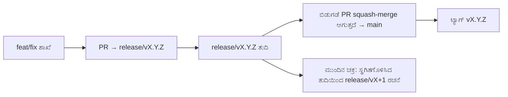

# Branching & Release Model (ಕನ್ನಡ)

🌐 **Languages:** 🇺🇸 [English](../../../../ops/BRANCHING_MODEL.md) · 🇪🇹 [am](../../../am/docs/ops/BRANCHING_MODEL.md) · 🇸🇦 [ar](../../../ar/docs/ops/BRANCHING_MODEL.md) · 🇦🇿 [az](../../../az/docs/ops/BRANCHING_MODEL.md) · 🇧🇬 [bg](../../../bg/docs/ops/BRANCHING_MODEL.md) · 🇧🇩 [bn](../../../bn/docs/ops/BRANCHING_MODEL.md) · 🇨🇿 [cs](../../../cs/docs/ops/BRANCHING_MODEL.md) · 🇩🇰 [da](../../../da/docs/ops/BRANCHING_MODEL.md) · 🇩🇪 [de](../../../de/docs/ops/BRANCHING_MODEL.md) · 🇬🇷 [el](../../../el/docs/ops/BRANCHING_MODEL.md) · 🇪🇸 [es](../../../es/docs/ops/BRANCHING_MODEL.md) · 🇪🇪 [et](../../../et/docs/ops/BRANCHING_MODEL.md) · 🇮🇷 [fa](../../../fa/docs/ops/BRANCHING_MODEL.md) · 🇫🇮 [fi](../../../fi/docs/ops/BRANCHING_MODEL.md) · 🇫🇷 [fr](../../../fr/docs/ops/BRANCHING_MODEL.md) · 🇮🇪 [ga](../../../ga/docs/ops/BRANCHING_MODEL.md) · 🇮🇳 [gu](../../../gu/docs/ops/BRANCHING_MODEL.md) · 🇳🇬 [ha](../../../ha/docs/ops/BRANCHING_MODEL.md) · 🇮🇱 [he](../../../he/docs/ops/BRANCHING_MODEL.md) · 🇮🇳 [hi](../../../hi/docs/ops/BRANCHING_MODEL.md) · 🇭🇷 [hr](../../../hr/docs/ops/BRANCHING_MODEL.md) · 🇭🇺 [hu](../../../hu/docs/ops/BRANCHING_MODEL.md) · 🇦🇲 [hy](../../../hy/docs/ops/BRANCHING_MODEL.md) · 🇮🇩 [id](../../../id/docs/ops/BRANCHING_MODEL.md) · 🇳🇬 [ig](../../../ig/docs/ops/BRANCHING_MODEL.md) · 🇮🇹 [it](../../../it/docs/ops/BRANCHING_MODEL.md) · 🇯🇵 [ja](../../../ja/docs/ops/BRANCHING_MODEL.md) · 🇬🇪 [ka](../../../ka/docs/ops/BRANCHING_MODEL.md) · 🇰🇭 [km](../../../km/docs/ops/BRANCHING_MODEL.md) · 🇰🇷 [ko](../../../ko/docs/ops/BRANCHING_MODEL.md) · 🇱🇹 [lt](../../../lt/docs/ops/BRANCHING_MODEL.md) · 🇱🇻 [lv](../../../lv/docs/ops/BRANCHING_MODEL.md) · 🇮🇳 [ml](../../../ml/docs/ops/BRANCHING_MODEL.md) · 🇮🇳 [mr](../../../mr/docs/ops/BRANCHING_MODEL.md) · 🇲🇾 [ms](../../../ms/docs/ops/BRANCHING_MODEL.md) · 🇲🇹 [mt](../../../mt/docs/ops/BRANCHING_MODEL.md) · 🇲🇲 [my](../../../my/docs/ops/BRANCHING_MODEL.md) · 🇳🇵 [ne](../../../ne/docs/ops/BRANCHING_MODEL.md) · 🇳🇱 [nl](../../../nl/docs/ops/BRANCHING_MODEL.md) · 🇳🇴 [no](../../../no/docs/ops/BRANCHING_MODEL.md) · 🇮🇳 [or](../../../or/docs/ops/BRANCHING_MODEL.md) · 🇮🇳 [pa](../../../pa/docs/ops/BRANCHING_MODEL.md) · 🇵🇭 [phi](../../../phi/docs/ops/BRANCHING_MODEL.md) · 🇵🇱 [pl](../../../pl/docs/ops/BRANCHING_MODEL.md) · 🇵🇹 [pt](../../../pt/docs/ops/BRANCHING_MODEL.md) · 🇧🇷 [pt-BR](../../../pt-BR/docs/ops/BRANCHING_MODEL.md) · 🇷🇴 [ro](../../../ro/docs/ops/BRANCHING_MODEL.md) · 🇷🇺 [ru](../../../ru/docs/ops/BRANCHING_MODEL.md) · 🇱🇰 [si](../../../si/docs/ops/BRANCHING_MODEL.md) · 🇸🇰 [sk](../../../sk/docs/ops/BRANCHING_MODEL.md) · 🇸🇮 [sl](../../../sl/docs/ops/BRANCHING_MODEL.md) · 🇷🇸 [sr](../../../sr/docs/ops/BRANCHING_MODEL.md) · 🇸🇪 [sv](../../../sv/docs/ops/BRANCHING_MODEL.md) · 🇰🇪 [sw](../../../sw/docs/ops/BRANCHING_MODEL.md) · 🇮🇳 [ta](../../../ta/docs/ops/BRANCHING_MODEL.md) · 🇮🇳 [te](../../../te/docs/ops/BRANCHING_MODEL.md) · 🇹🇭 [th](../../../th/docs/ops/BRANCHING_MODEL.md) · 🇹🇷 [tr](../../../tr/docs/ops/BRANCHING_MODEL.md) · 🇺🇦 [uk-UA](../../../uk-UA/docs/ops/BRANCHING_MODEL.md) · 🇵🇰 [ur](../../../ur/docs/ops/BRANCHING_MODEL.md) · 🇺🇿 [uz](../../../uz/docs/ops/BRANCHING_MODEL.md) · 🇻🇳 [vi](../../../vi/docs/ops/BRANCHING_MODEL.md) · 🇳🇬 [yo](../../../yo/docs/ops/BRANCHING_MODEL.md) · 🇨🇳 [zh-CN](../../../zh-CN/docs/ops/BRANCHING_MODEL.md) · 🇹🇼 [zh-TW](../../../zh-TW/docs/ops/BRANCHING_MODEL.md)

---

OmniRoute ಒಂದು **ಸಮಾನಾಂತರ-ಚಕ್ರ** ಬಿಡುಗಡೆ ಮಾದರಿಯನ್ನು ಬಳಸುತ್ತದೆ: ಸಕ್ರಿಯ ಚಕ್ರಕ್ಕಾಗಿ ಮೀಸಲಾದ `release/vX.Y.Z`
ಶಾಖೆ, ಪ್ರಕಟಿತ ಸಾಲಿಗಾಗಿ `main`, ಮತ್ತು ಆ ಚಕ್ರವನ್ನು ಬಿಡುಗಡೆ ಮಾಡಿದಾಗ ಬದಲಾಯಿಸಲಾಗದ
`vX.Y.Z` ಟ್ಯಾಗ್. ಕಮಿಟ್ಗಳು `release/*` _ಮತ್ತು_ `main` ಎರಡರಲ್ಲೂ ಸೇರುವುದನ್ನು
ನೋಡುವುದು ನಿರೀಕ್ಷಿತವೇ — ಅದು ಗೊಂದಲವಲ್ಲ.

ನಿರ್ವಹಕರ ವಿವರಗಳು `CLAUDE.md` (ಕಠಿಣ ನಿಯಮ #21) ಮತ್ತು
[RELEASE_CHECKLIST.md](./RELEASE_CHECKLIST.md) ನಲ್ಲಿ ಲಭ್ಯವಿವೆ. ಈ ಪುಟವು ಸಾರ್ವಜನಿಕವಾಗಿ
ಕೊಡುಗೆದಾರರನ್ನು ಉದ್ದೇಶಿಸಿದ ಸಾರಾಂಶವಾಗಿದೆ.

## ಒಂದು ನೋಟದಲ್ಲಿ

| ಉಲ್ಲೇಖ            | ಪಾತ್ರ                                                                                  |
| ----------------- | -------------------------------------------------------------------------------------- |
| `release/vX.Y.Z`  | **ಸಕ್ರಿಯ ಚಕ್ರ** — ಆ ಆವೃತ್ತಿಗಾಗಿ ದಿನನಿತ್ಯದ ಅಭಿವೃದ್ಧಿ ಮತ್ತು PR ವಿಲೀನಗಳು                  |
| `main`            | **ಪ್ರಕಟಿತ ಸಾಲು** — ಬಿಡುಗಡೆ ರವಾನೆಯಾದಾಗ squash-merge ಮೂಲಕ ಚಕ್ರವನ್ನು ಸ್ವೀಕರಿಸುತ್ತದೆ       |
| `vX.Y.Z` (ಟ್ಯಾಗ್) | **ರವಾನೆ ಗುರುತು** — ಬಿಡುಗಡೆ ಸಮಯದಲ್ಲಿ ರಚಿಸಲಾದ, ಬದಲಾಯಿಸಲಾಗದ “ಏನು ರವಾನೆಯಾಯಿತು” ಎಂಬುದರ ಸೂಚಕ |



## ನನ್ನ PR ಯಾವುದನ್ನು ಗುರಿಯಾಗಿಸಬೇಕು?

**ಸಕ್ರಿಯ `release/vX.Y.Z` ಶಾಖೆಯನ್ನು ಗುರಿಯಾಗಿಸಿ — `main` ಅನ್ನು ಅಲ್ಲ.**

1. ತೆರೆದಿರುವ ಅತಿ ಹೆಚ್ಚಿನ `release/v*` ಶಾಖೆಯನ್ನು ಹುಡುಕಿ (ಬರೆಯುವ ಸಮಯದ ಉದಾಹರಣೆ:
   `release/v3.8.49`).
2. ಆ ತುದಿಯಿಂದ ಶಾಖೆ ರಚಿಸಿ (`git fetch` + checkout / ಅದರ ಮೇಲೆ rebase ಮಾಡಿ).
3. **base = ಆ `release/vX.Y.Z`** ಆಗಿರುವಂತೆ PR ತೆರೆಯಿರಿ.

`main` ದಿನನಿತ್ಯದ ಏಕೀಕರಣ ಶಾಖೆಯಲ್ಲ. `main` ವಿರುದ್ಧ ತೆರೆಯಲಾದ PRಗಳನ್ನು
ಸಾಮಾನ್ಯವಾಗಿ ವಿಲೀನಕ್ಕೂ ಮೊದಲು ಬೇರೆ ಗುರಿಗೆ ಮರುಹೊಂದಿಸಬೇಕಾಗುತ್ತದೆ.

## ಬಿಡುಗಡೆ ಸ್ಥಗಿತ (ಸಮಾನಾಂತರ ಚಕ್ರಗಳು)

ಬಿಡುಗಡೆಯನ್ನು ಸಮನ್ವಯಗೊಳಿಸುವಾಗ, `release-freeze` ಲೇಬಲ್ ಹೊಂದಿರುವ ಗುರುತು issue ಅನ್ನು
ತೆರೆಯಲಾಗುತ್ತದೆ. ಅದು **ಅಭಿವೃದ್ಧಿಯನ್ನು ನಿಲ್ಲಿಸುವುದಿಲ್ಲ**:

- ಸ್ಥಗಿತಗೊಳಿಸಿದ `release/vX.Y.Z` ಆ ರವಾನೆಯ ಬಿಡುಗಡೆ ಕ್ಯಾಪ್ಟನ್ಗೆ ಸೇರಿರುತ್ತದೆ.
- ಕೊಡುಗೆದಾರರು ಕೆಲಸವನ್ನು ಸೇರಿಸುವುದನ್ನು ಮುಂದುವರಿಸಲು, ಮುಂದಿನ ಚಕ್ರದ `release/vX+1` ಅನ್ನು ಸ್ಥಗಿತಗೊಳಿಸಿದ ತುದಿಯಿಂದ
  ರಚಿಸಲಾಗುತ್ತದೆ.
- ಇನ್ನೂ ಸ್ಥಗಿತಗೊಳಿಸಿದ ಶಾಖೆಯನ್ನು ಗುರಿಯಾಗಿಸಿರುವ ತೆರೆದ PRಗಳನ್ನು ಸಕ್ರಿಯವಾಗಿರುವ
  (ಅತಿ ಹೆಚ್ಚಿನ) `release/v*` ಶಾಖೆಗೆ **ಮರುಗುರಿಪಡಿಸಬೇಕು**.

ನೀವು ಬಯಸುವ ಶಾಖೆಯನ್ನು ವಿಲೀನಗೊಳಿಸಬಹುದು ಎಂದು ಊಹಿಸುವ ಮೊದಲು, ತೆರೆದಿರುವ ಸ್ಥಗಿತವಿದೆಯೇ ಎಂದು ಪರಿಶೀಲಿಸಿ:

```bash
gh issue list --repo diegosouzapw/OmniRoute --label release-freeze --state open
```

ವಿಲೀನ ಕಾರ್ಯವಿಧಾನಗಳನ್ನು (ಮಾಲೀಕರ `queue` ಲೇಬಲ್ → Mergify)
[MERGE_TRAIN.md](./MERGE_TRAIN.md) ನಲ್ಲಿ ದಾಖಲಿಸಲಾಗಿದೆ.

## ಶಾಖೆ ಮತ್ತು ಟ್ಯಾಗ್ ಎರಡೂ ಏಕೆ?

| ಕಲಾಕೃತಿ          | ಜೀವಿತಾವಧಿ           | ಉದ್ದೇಶ                                                                          |
| ---------------- | ------------------- | ------------------------------------------------------------------------------- |
| `release/vX.Y.Z` | ಪ್ರಗತಿಯಲ್ಲಿರುವ ಚಕ್ರ | ಪರಿಶೀಲಿಸಲಾದ PRಗಳನ್ನು ಸಂಗ್ರಹಿಸುತ್ತದೆ, CI-ಹಸಿರಾಗಿರುತ್ತದೆ ಮತ್ತು PR base ಆಗಿರುತ್ತದೆ |
| ಟ್ಯಾಗ್ `vX.Y.Z`  | ಶಾಶ್ವತವಾಗಿ          | npm / GitHub Releases ಗೆ ರವಾನೆಯಾದ ನಿಖರ ಬಿಟ್ಗಳನ್ನು ಗುರುತಿಸುತ್ತದೆ                 |

ಶಾಖೆಯು ಕಾರ್ಯಾಗಾರ; ಟ್ಯಾಗ್ ಮೊಹರು ಮಾಡಿದ ಪೊಟ್ಟಣ. `main` ಗೆ squash-merge ಮಾಡಿದ ನಂತರ,
ಹಿಂದಿನ ಬಿಡುಗಡೆ PR ಪೂರ್ಣಗೊಳ್ಳುವುದಕ್ಕಾಗಿ ಕಾಯದೆ ಮುಂದಿನ ಚಕ್ರವು `release/vX+1` ನಲ್ಲಿ ಮುಂದುವರಿಯುತ್ತದೆ.

## ಸಂಬಂಧಿತ ದಸ್ತಾವೇಜುಗಳು

- [CONTRIBUTING.md](../../CONTRIBUTING.md) — ಸೆಟಪ್, ಪರೀಕ್ಷೆಗಳು, PR ಪರಿಶೀಲನಾಪಟ್ಟಿ
- [RELEASE_CHECKLIST.md](./RELEASE_CHECKLIST.md) — ರವಾನೆಗೆ ಮುನ್ನದ ಮೌಲ್ಯೀಕರಣ
- [MERGE_TRAIN.md](./MERGE_TRAIN.md) — ವಿಲೀನ ಸರತಿ ಮತ್ತು ಪರ್ಯಾಯ ಟ್ರೇನ್
- [RELEASE_GREEN.md](./RELEASE_GREEN.md) — ಬಿಡುಗಡೆ ತುದಿಯನ್ನು ಹಸಿರಾಗಿ ಇರಿಸುವುದು
