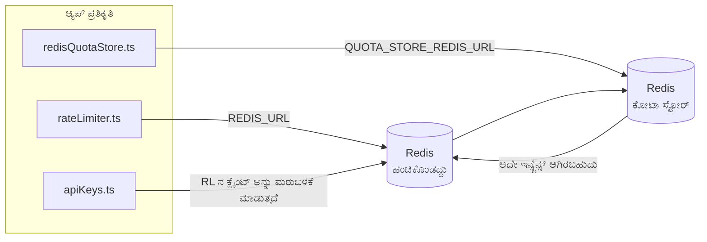

# Redis Production Configuration Guide (ಕನ್ನಡ)

🌐 **Languages:** 🇺🇸 [English](../../../../ops/REDIS_PRODUCTION_CONFIG.md) · 🇪🇹 [am](../../../am/docs/ops/REDIS_PRODUCTION_CONFIG.md) · 🇸🇦 [ar](../../../ar/docs/ops/REDIS_PRODUCTION_CONFIG.md) · 🇦🇿 [az](../../../az/docs/ops/REDIS_PRODUCTION_CONFIG.md) · 🇧🇬 [bg](../../../bg/docs/ops/REDIS_PRODUCTION_CONFIG.md) · 🇧🇩 [bn](../../../bn/docs/ops/REDIS_PRODUCTION_CONFIG.md) · 🇨🇿 [cs](../../../cs/docs/ops/REDIS_PRODUCTION_CONFIG.md) · 🇩🇰 [da](../../../da/docs/ops/REDIS_PRODUCTION_CONFIG.md) · 🇩🇪 [de](../../../de/docs/ops/REDIS_PRODUCTION_CONFIG.md) · 🇬🇷 [el](../../../el/docs/ops/REDIS_PRODUCTION_CONFIG.md) · 🇪🇸 [es](../../../es/docs/ops/REDIS_PRODUCTION_CONFIG.md) · 🇪🇪 [et](../../../et/docs/ops/REDIS_PRODUCTION_CONFIG.md) · 🇮🇷 [fa](../../../fa/docs/ops/REDIS_PRODUCTION_CONFIG.md) · 🇫🇮 [fi](../../../fi/docs/ops/REDIS_PRODUCTION_CONFIG.md) · 🇫🇷 [fr](../../../fr/docs/ops/REDIS_PRODUCTION_CONFIG.md) · 🇮🇪 [ga](../../../ga/docs/ops/REDIS_PRODUCTION_CONFIG.md) · 🇮🇳 [gu](../../../gu/docs/ops/REDIS_PRODUCTION_CONFIG.md) · 🇳🇬 [ha](../../../ha/docs/ops/REDIS_PRODUCTION_CONFIG.md) · 🇮🇱 [he](../../../he/docs/ops/REDIS_PRODUCTION_CONFIG.md) · 🇮🇳 [hi](../../../hi/docs/ops/REDIS_PRODUCTION_CONFIG.md) · 🇭🇷 [hr](../../../hr/docs/ops/REDIS_PRODUCTION_CONFIG.md) · 🇭🇺 [hu](../../../hu/docs/ops/REDIS_PRODUCTION_CONFIG.md) · 🇦🇲 [hy](../../../hy/docs/ops/REDIS_PRODUCTION_CONFIG.md) · 🇮🇩 [id](../../../id/docs/ops/REDIS_PRODUCTION_CONFIG.md) · 🇳🇬 [ig](../../../ig/docs/ops/REDIS_PRODUCTION_CONFIG.md) · 🇮🇹 [it](../../../it/docs/ops/REDIS_PRODUCTION_CONFIG.md) · 🇯🇵 [ja](../../../ja/docs/ops/REDIS_PRODUCTION_CONFIG.md) · 🇬🇪 [ka](../../../ka/docs/ops/REDIS_PRODUCTION_CONFIG.md) · 🇰🇭 [km](../../../km/docs/ops/REDIS_PRODUCTION_CONFIG.md) · 🇰🇷 [ko](../../../ko/docs/ops/REDIS_PRODUCTION_CONFIG.md) · 🇱🇹 [lt](../../../lt/docs/ops/REDIS_PRODUCTION_CONFIG.md) · 🇱🇻 [lv](../../../lv/docs/ops/REDIS_PRODUCTION_CONFIG.md) · 🇮🇳 [ml](../../../ml/docs/ops/REDIS_PRODUCTION_CONFIG.md) · 🇮🇳 [mr](../../../mr/docs/ops/REDIS_PRODUCTION_CONFIG.md) · 🇲🇾 [ms](../../../ms/docs/ops/REDIS_PRODUCTION_CONFIG.md) · 🇲🇹 [mt](../../../mt/docs/ops/REDIS_PRODUCTION_CONFIG.md) · 🇲🇲 [my](../../../my/docs/ops/REDIS_PRODUCTION_CONFIG.md) · 🇳🇵 [ne](../../../ne/docs/ops/REDIS_PRODUCTION_CONFIG.md) · 🇳🇱 [nl](../../../nl/docs/ops/REDIS_PRODUCTION_CONFIG.md) · 🇳🇴 [no](../../../no/docs/ops/REDIS_PRODUCTION_CONFIG.md) · 🇮🇳 [or](../../../or/docs/ops/REDIS_PRODUCTION_CONFIG.md) · 🇮🇳 [pa](../../../pa/docs/ops/REDIS_PRODUCTION_CONFIG.md) · 🇵🇭 [phi](../../../phi/docs/ops/REDIS_PRODUCTION_CONFIG.md) · 🇵🇱 [pl](../../../pl/docs/ops/REDIS_PRODUCTION_CONFIG.md) · 🇵🇹 [pt](../../../pt/docs/ops/REDIS_PRODUCTION_CONFIG.md) · 🇧🇷 [pt-BR](../../../pt-BR/docs/ops/REDIS_PRODUCTION_CONFIG.md) · 🇷🇴 [ro](../../../ro/docs/ops/REDIS_PRODUCTION_CONFIG.md) · 🇷🇺 [ru](../../../ru/docs/ops/REDIS_PRODUCTION_CONFIG.md) · 🇱🇰 [si](../../../si/docs/ops/REDIS_PRODUCTION_CONFIG.md) · 🇸🇰 [sk](../../../sk/docs/ops/REDIS_PRODUCTION_CONFIG.md) · 🇸🇮 [sl](../../../sl/docs/ops/REDIS_PRODUCTION_CONFIG.md) · 🇷🇸 [sr](../../../sr/docs/ops/REDIS_PRODUCTION_CONFIG.md) · 🇸🇪 [sv](../../../sv/docs/ops/REDIS_PRODUCTION_CONFIG.md) · 🇰🇪 [sw](../../../sw/docs/ops/REDIS_PRODUCTION_CONFIG.md) · 🇮🇳 [ta](../../../ta/docs/ops/REDIS_PRODUCTION_CONFIG.md) · 🇮🇳 [te](../../../te/docs/ops/REDIS_PRODUCTION_CONFIG.md) · 🇹🇭 [th](../../../th/docs/ops/REDIS_PRODUCTION_CONFIG.md) · 🇹🇷 [tr](../../../tr/docs/ops/REDIS_PRODUCTION_CONFIG.md) · 🇺🇦 [uk-UA](../../../uk-UA/docs/ops/REDIS_PRODUCTION_CONFIG.md) · 🇵🇰 [ur](../../../ur/docs/ops/REDIS_PRODUCTION_CONFIG.md) · 🇺🇿 [uz](../../../uz/docs/ops/REDIS_PRODUCTION_CONFIG.md) · 🇻🇳 [vi](../../../vi/docs/ops/REDIS_PRODUCTION_CONFIG.md) · 🇳🇬 [yo](../../../yo/docs/ops/REDIS_PRODUCTION_CONFIG.md) · 🇨🇳 [zh-CN](../../../zh-CN/docs/ops/REDIS_PRODUCTION_CONFIG.md) · 🇹🇼 [zh-TW](../../../zh-TW/docs/ops/REDIS_PRODUCTION_CONFIG.md)

---

## ಅವಲೋಕನ

Redis ಎಂಬುದು OmniRoute ನಲ್ಲಿ ಒಂದು **ಐಚ್ಛಿಕ, ಸಾಫ್ಟ್ ಡಿಪೆಂಡೆನ್ಸಿ** ಆಗಿದೆ — Redis ಲಭ್ಯವಿಲ್ಲದಿದ್ದಾಗ ಅಪ್ಲಿಕೇಶನ್ ಸಮರ್ಪಕವಾಗಿ ಕಾರ್ಯಕ್ಷಮತೆಯನ್ನು ತಗ್ಗಿಸಿಕೊಂಡು (ಇನ್-ಮೆಮೊರಿ
ಫಾಲ್ಬ್ಯಾಕ್ಗಳು) ಕಾರ್ಯನಿರ್ವಹಿಸುತ್ತದೆ. ಪ್ರೊಡಕ್ಷನ್ನಲ್ಲಿ, Redis ಅನ್ನು ಟ್ಯೂನ್ ಮಾಡುವುದರಿಂದ ನಾಲ್ಕು ಪ್ರತ್ಯೇಕ
ವರ್ಕ್ಲೋಡ್ಗಳ ಲೇಟೆನ್ಸಿ ಕಡಿಮೆಯಾಗುತ್ತದೆ:

| ವರ್ಕ್ಲೋಡ್                   | ಡ್ರೈವರ್                       | ಕ್ಲೈಂಟ್ ಫ್ಯಾಕ್ಟರಿ                                  | ಕೀ ಪ್ಯಾಟರ್ನ್                                                 |
| --------------------------- | ----------------------------- | -------------------------------------------------- | ------------------------------------------------------------ |
| ರೇಟ್ ಮಿತಿಗೊಳಿಸುವಿಕೆ         | `rateLimiter.ts`              | `getRedisClient()` — ಲೇಜಿ `ioredis` ಸಿಂಗಲ್ಟನ್      | `<prefix>rl:*` Lua‑ಅಟಾಮಿಕ್ ರೇಟ್ ಮಿತಿ ವಿಂಡೋಗಳು                |
| ದೃಢೀಕರಣ ಕ್ಯಾಶ್              | `apiKeys.ts`                  | `rateLimiter` ನ ಕ್ಲೈಂಟ್ ಅನ್ನು ಮರುಬಳಸುತ್ತದೆ         | TTL ಹೊಂದಿರುವ `<prefix>auth:api_key:<sha256>`                 |
| ಕೋಟಾ ಸ್ಟೋರ್                 | `redisQuotaStore.ts`          | ಪ್ರತ್ಯೇಕ `getRedisClient(url)` ಸಿಂಗಲ್ಟನ್           | `<prefix>quota:*` ಪ್ರತಿ ಇನ್ಸ್ಟನ್ಸ್ಗೆ ಕಾನ್ಫಿಗರ್ ಮಾಡಬಹುದಾದದ್ದು |
| ವಾರ್ಮ್ಅಪ್ ಸರ್ಕ್ಯೂಟ್ ಬ್ರೇಕರ್ | `redisCircuitBreakerStore.ts` | `circuitBreakerFactory.ts` ನಲ್ಲಿನ ಪ್ರತ್ಯೇಕ ಕ್ಲೈಂಟ್ | `<prefix>warmup:cb:<connectionId>`                           |

ಎಲ್ಲಾ ನಾಲ್ಕು ವರ್ಕ್ಲೋಡ್ಗಳು ಒಂದೇ ನೇಮ್ಸ್ಪೇಸ್ ಪ್ರಿಫಿಕ್ಸ್ ಅನ್ನು ಹಂಚಿಕೊಳ್ಳುತ್ತವೆ, ಆದ್ದರಿಂದ OmniRoute ಒಂದೇ
Redis ಇನ್ಸ್ಟನ್ಸ್ನಲ್ಲಿ (ಉದಾ. `127.0.0.1:6379`) ಇತರ ಅಪ್ಲಿಕೇಶನ್ಗಳೊಂದಿಗೆ ಸಹ-ಅಸ್ತಿತ್ವದಲ್ಲಿರಬಹುದು. [ಕೀ ನೇಮ್ಸ್ಪೇಸಿಂಗ್](#key-namespacing) ನೋಡಿ.

---

## ಪ್ರಸ್ತುತ ಕಾನ್ಫಿಗರೇಶನ್ (ಕೋಡ್ ಡೀಫಾಲ್ಟ್ಗಳು)

| ಸೆಟ್ಟಿಂಗ್                                       | ಮೌಲ್ಯ                                                          | ಎಲ್ಲಿ                                                                                 |
| ----------------------------------------------- | -------------------------------------------------------------- | ------------------------------------------------------------------------------------- |
| `REDIS_URL` ಎನ್ವಿರಾನ್ಮೆಂಟ್ ವೇರಿಯಬಲ್             | `redis://redis:6379` (compose), ಐಚ್ಛಿಕ                         | `rateLimiter.ts:5`, `.env.example`                                                    |
| `REDIS_KEY_PREFIX` ಎನ್ವಿರಾನ್ಮೆಂಟ್ ವೇರಿಯಬಲ್      | `omniroute:` (ಡೀಫಾಲ್ಟ್)                                        | `rateLimiter.ts`, `redisQuotaStore.ts`, `redisCircuitBreakerStore.ts`, `.env.example` |
| `QUOTA_STORE_REDIS_URL` ಎನ್ವಿರಾನ್ಮೆಂಟ್ ವೇರಿಯಬಲ್ | ಪ್ರತ್ಯೇಕ, `REDIS_URL` ಗಿಂತ ಭಿನ್ನವಾಗಿರಬಹುದು                     | `quota/storeFactory.ts`                                                               |
| `QUOTA_STORE_DRIVER`                            | `"sqlite"` (ಡೀಫಾಲ್ಟ್), `"redis"` ಐಚ್ಛಿಕ                        | `quota/storeFactory.ts`                                                               |
| ioredis `maxRetriesPerRequest`                  | `3`                                                            | `rateLimiter.ts` ಕ್ಲೈಂಟ್ ರಚನೆ                                                         |
| `enableReadyCheck`                              | ಹೊಂದಿಸಲಾಗಿಲ್ಲ (ioredis ಡೀಫಾಲ್ಟ್: `true`)                       | —                                                                                     |
| `lazyConnect`                                   | ಹೊಂದಿಸಲಾಗಿಲ್ಲ (ioredis ಡೀಫಾಲ್ಟ್: `false`)                      | —                                                                                     |
| `retryStrategy`                                 | ಹೊಂದಿಸಲಾಗಿಲ್ಲ (ioredis ಡೀಫಾಲ್ಟ್: 200ms ಬೇಸ್, ಎಕ್ಸ್ಪೊನೆನ್ಷಿಯಲ್) | —                                                                                     |
| TLS / ಪಾಸ್ವರ್ಡ್ / DB ಇಂಡೆಕ್ಸ್                   | **ಕಾನ್ಫಿಗರ್ ಮಾಡಲಾಗಿಲ್ಲ**                                       | —                                                                                     |
| Sentinel / Cluster                              | **ಕಾನ್ಫಿಗರ್ ಮಾಡಲಾಗಿಲ್ಲ** — ಸ್ವತಂತ್ರ ಸಿಂಗಲ್-ನೋಡ್ ಮಾತ್ರ          | —                                                                                     |

---

## ಕೀ ನೇಮ್ಸ್ಪೇಸಿಂಗ್

OmniRoute, ಹೋಸ್ಟ್ನಲ್ಲಿ ಚಾಲನೆಯಲ್ಲಿರುವ ಇತರ ಸೇವೆಗಳೊಂದಿಗೆ Redis ಇನ್ಸ್ಟನ್ಸ್ ಅನ್ನು ಹಂಚಿಕೊಳ್ಳುತ್ತದೆ. ನೇಮ್ಸ್ಪೇಸ್ ಇಲ್ಲದೆ,
`auth:api_key:<sha256>` ಅಥವಾ `rl:*` ನಂತಹ ಕೀಗಳು ಅದೇ Redis ಬಳಸುವ ಇತರ ಅಪ್ಲಿಕೇಶನ್ಗಳ
ಕೀಗಳೊಂದಿಗೆ ಘರ್ಷಿಸಬಹುದು (ಈ ಇನ್ಸ್ಟನ್ಸ್ ಇತರ ಸೇವೆಗಳೊಂದಿಗೆ `127.0.0.1:6379` ನಲ್ಲಿ Redis ಅನ್ನು ಚಾಲನೆ ಮಾಡುತ್ತದೆ).

**ಪ್ರತಿಯೊಂದು** OmniRoute ಕೀಗೆ ಪ್ರಿಫಿಕ್ಸ್ ಸೇರಿಸಲು `REDIS_KEY_PREFIX` ಅನ್ನು ಖಾಲಿಯಲ್ಲದ ಸ್ಟ್ರಿಂಗ್ಗೆ ಹೊಂದಿಸಿ:

```bash
# .env — ಎಲ್ಲಾ OmniRoute ಕೀಗಳು omniroute:rl:*, omniroute:auth:*, omniroute:quota:*, omniroute:warmup:cb:* ಆಗುತ್ತವೆ
REDIS_KEY_PREFIX=omniroute:
```

- **ಡೀಫಾಲ್ಟ್:** `omniroute:` (`REDIS_KEY_PREFIX` ಹೊಂದಿಸದಿದ್ದಾಗ ಅಥವಾ ಖಾಲಿಯಾಗಿದ್ದಾಗ ಅನ್ವಯಿಸಲಾಗುತ್ತದೆ).
- **ಇವುಗಳಿಗೆ ಅನ್ವಯಿಸುತ್ತದೆ:** ರೇಟ್ ಲಿಮಿಟರ್ + ದೃಢೀಕರಣ ಕ್ಯಾಶ್ (`keyPrefix` ಮೂಲಕ ಹಂಚಿಕೊಳ್ಳಲಾದ `ioredis` ಕ್ಲೈಂಟ್) ಮತ್ತು
  ಕೋಟಾ ಸ್ಟೋರ್ (`KEY_PREFIX = "${REDIS_KEY_PREFIX}quota"`) ಹಾಗೂ ವಾರ್ಮ್ಅಪ್ ಸರ್ಕ್ಯೂಟ್ ಬ್ರೇಕರ್
  (`KEY_PREFIX = "${REDIS_KEY_PREFIX}warmup:cb:"`).
- Redis ನಲ್ಲಿ ಕೀಗಳು ಈಗಾಗಲೇ ಇರುವಾಗ **ಪ್ರಿಫಿಕ್ಸ್ ಬದಲಾಯಿಸುವುದು** ಹಳೆಯ ಕೀಗಳನ್ನು ಅನಾಥವಾಗಿಸುತ್ತದೆ (ಅವು TTL / LRU
  ಮೂಲಕ ಅವಧಿ ಮೀರುತ್ತವೆ). ಬದಲಾಯಿಸುವುದು ಸುರಕ್ಷಿತ; ಮೈಗ್ರೇಶನ್ ಅಗತ್ಯವಿಲ್ಲ. ಇದಕ್ಕೆ ಇರುವ ಏಕೈಕ ಅಪವಾದವೆಂದರೆ ನಿಷೇಧಿತ ಎಂದು ಗುರುತಿಸಲಾದ
  ಕನೆಕ್ಷನ್ನ ವಾರ್ಮ್ಅಪ್ ಸರ್ಕ್ಯೂಟ್-ಬ್ರೇಕರ್ ಕೀ: ಅದನ್ನು TTL ಇಲ್ಲದೆ ಉಳಿಸಲಾಗುತ್ತದೆ, ಆದ್ದರಿಂದ ಉಳಿದಿರುವ ಕೀಗಳನ್ನು
  `redis-cli --scan --pattern '<old-prefix>warmup:cb:*'` ಮೂಲಕ ಪಟ್ಟಿ ಮಾಡಿ ಮತ್ತು ಅವುಗಳನ್ನು ಅಳಿಸಿ.
- **ioredis `keyPrefix`** ರೈಟ್ಗಳಲ್ಲಿ ಪ್ರಿಫಿಕ್ಸ್ ಅನ್ನು ಸ್ವಯಂಚಾಲಿತವಾಗಿ ಸೇರಿಸುತ್ತದೆ **ಮತ್ತು** ರೀಡ್ಗಳಲ್ಲಿ ಅದನ್ನು ತೆಗೆದುಹಾಕುತ್ತದೆ,
  ಆದ್ದರಿಂದ ಅಪ್ಲಿಕೇಶನ್ ಕೋಡ್ಗೆ ಪ್ರಿಫಿಕ್ಸ್ ಎಂದಿಗೂ ಕಾಣಿಸುವುದಿಲ್ಲ.

---

## ಶಿಫಾರಸು ಮಾಡಲಾದ ಪ್ರೊಡಕ್ಷನ್ ಟ್ಯೂನಿಂಗ್

### 1. ಕನೆಕ್ಷನ್ ಪೂಲ್ / ಕ್ಲೈಂಟ್ ಆಯ್ಕೆಗಳು (ioredis `Redis` ಕನ್ಸ್ಟ್ರಕ್ಟರ್)

ಪ್ರಸ್ತುತ ಕೋಡ್ ಯಾವುದೇ ಕಸ್ಟಮ್ ಆಯ್ಕೆಗಳಿಲ್ಲದೆ ಒಂದೇ `new Redis(url)` ಅನ್ನು ರಚಿಸುತ್ತದೆ. ಪ್ರೊಡಕ್ಷನ್
ಮಲ್ಟಿ-ರೆಪ್ಲಿಕಾ ಡಿಪ್ಲಾಯ್ಮೆಂಟ್ಗಳಿಗಾಗಿ, ಕೋಡ್ನಲ್ಲಿ ಕ್ಲೈಂಟ್ ಫ್ಯಾಕ್ಟರಿಯನ್ನು ಪಾಸ್ ಮಾಡಿ ಅಥವಾ `getRedisClient()` ಅನ್ನು ಸುತ್ತುವರಿಯಿರಿ:

```typescript
const redis = new Redis(REDIS_URL, {
  maxRetriesPerRequest: null, // ಮರುಪ್ರಯತ್ನ ಮಿತಿ ಇಲ್ಲ; retryStrategy ನಿರ್ಧರಿಸಲಿ
  enableReadyCheck: true, // ಕರೆಗಳನ್ನು ಸ್ವೀಕರಿಸುವ ಮೊದಲು ಸರ್ವರ್ ಸಿದ್ಧವಾಗಿದೆಯೇ ಎಂದು ಪರಿಶೀಲಿಸಿ
  lazyConnect: true, // ನಿರ್ಮಾಣದ ಸಮಯದಲ್ಲಿ ಸಂಪರ್ಕಿಸಬೇಡಿ; ಮೊದಲ ಕರೆಗಾಗಿ ಕಾಯಿರಿ
  retryStrategy: (times) => {
    if (times > 10) return null; // 10 ಮರುಪ್ರಯತ್ನಗಳ ನಂತರ ಕೈಬಿಡಿ → ನಂತರ ಮರುಸಂಪರ್ಕಿಸಿ
    return Math.min(times * 200, 5000); // 200ms, 400ms, …, ಗರಿಷ್ಠ 5s
  },
  enableAutoPipelining: true, // ಏಕಕಾಲೀನ ಕಮಾಂಡ್ಗಳನ್ನು ಒಂದೇ TCP ಬರವಣಿಗೆಯಲ್ಲಿ ಒಗ್ಗೂಡಿಸಿ
  keepAlive: 10000, // ಪ್ರತಿ 10s ಗೆ TCP keep-alive
});
```

**ಪ್ರಮುಖ ವಿನಿಮಯಗಳು:**

- `maxRetriesPerRequest: null` + `retryStrategy` — ಪ್ರೊಡಕ್ಷನ್ಗೆ ಆದ್ಯತೆಯ ಆಯ್ಕೆ; ಇದರಿಂದ ತಾತ್ಕಾಲಿಕ
  Redis ಮರುಪ್ರಾರಂಭಗಳು ಪ್ರತಿಯೊಂದು ವಿನಂತಿಯನ್ನೂ ತಕ್ಷಣ ವಿಫಲಗೊಳಿಸುವುದಿಲ್ಲ. `checkRateLimit()` ನಲ್ಲಿರುವ
  ಇನ್-ಮೆಮೊರಿ ಫಾಲ್ಬ್ಯಾಕ್ ವೈಫಲ್ಯದ ಮಾರ್ಗವನ್ನು ನಿಭಾಯಿಸುತ್ತದೆ.
- `lazyConnect: true` — ಸರ್ವರ್ ಸಂಪರ್ಕಗಳನ್ನು ಸ್ವೀಕರಿಸಲು ಪ್ರಾರಂಭಿಸುವ ಮೊದಲು Redis ಚಾಲನೆಯಲ್ಲಿರಬೇಕೆಂಬ
  ಆರಂಭಿಕ ಅವಲಂಬನೆಯನ್ನು ತಪ್ಪಿಸುತ್ತದೆ.
- `enableAutoPipelining: true` — ಏಕಕಾಲೀನ ರೇಟ್-ಲಿಮಿಟ್ ಪರಿಶೀಲನೆಗಳಿಗೆ ರೌಂಡ್-ಟ್ರಿಪ್ಗಳನ್ನು ಕಡಿಮೆ ಮಾಡುತ್ತದೆ;
  ಒಂದೇ ಸಂಪರ್ಕದಲ್ಲಿ >50 RPS ಇದ್ದಾಗ ಪ್ರಯೋಜನಕಾರಿ.

### 2. Redis ಸರ್ವರ್ ಕಾನ್ಫಿಗರೇಶನ್ (`redis.conf`)

```
# ಮೆಮೊರಿ
maxmemory 80%                        # OS ಪುಟ ಕ್ಯಾಶ್ಗಾಗಿ ಸ್ಥಳಾವಕಾಶ ಬಿಡಿ
maxmemory-policy allkeys-lru         # ಒತ್ತಡದ ಸಂದರ್ಭದಲ್ಲಿ ಹಳೆಯ ದೃಢೀಕರಣ ಕ್ಯಾಶ್ ನಮೂದುಗಳನ್ನು ಹೊರಹಾಕಿ

# ಪರ್ಸಿಸ್ಟೆನ್ಸ್ (ಐಚ್ಛಿಕ — ಇದಿಲ್ಲದೆಯೂ OmniRoute ಕ್ರ್ಯಾಶ್-ಸುರಕ್ಷಿತವಾಗಿದೆ)
save 300 1                           # ≥1 ಕೀ ಬದಲಾಗಿದ್ದರೆ ಕನಿಷ್ಠ ಪ್ರತಿ 5 ನಿಮಿಷಕ್ಕೊಮ್ಮೆ ಸ್ನ್ಯಾಪ್ಶಾಟ್ ಮಾಡಿ
appendonly no                        # AOF ಅಗತ್ಯವಿಲ್ಲ; ಡೇಟಾವನ್ನು ಮರುಸೃಷ್ಟಿಸಬಹುದು
appendfsync no                       # fsync ಓವರ್ಹೆಡ್ ಇಲ್ಲ (RDB ಸಾಕಾಗುತ್ತದೆ)

# ನೆಟ್ವರ್ಕಿಂಗ್
timeout 0                            # ನಿಷ್ಕ್ರಿಯ ಸಂಪರ್ಕ ಕಡಿತವಿಲ್ಲ
tcp-keepalive 300                    # 5 ನಿಮಿಷಗಳ keep-alive
tcp-backlog 511                      # ಹಠಾತ್ ಹೆಚ್ಚಾಗುವ ಲೋಡ್ಗಾಗಿ ಕನೆಕ್ಷನ್ ಬ್ಯಾಕ್ಲಾಗ್

# ಕಾರ್ಯಕ್ಷಮತೆ
hz 10                                # ಡೀಫಾಲ್ಟ್; ಲೇಟೆನ್ಸಿ-ಸಂವೇದನಾಶೀಲ ಬಳಕೆಗೆ 100
activedefrag yes                     # ಫ್ರ್ಯಾಗ್ಮೆಂಟೇಶನ್ >10% ಆದಾಗ ಸ್ವಯಂ-ಡಿಫ್ರ್ಯಾಗ್ಮೆಂಟ್ ಮಾಡಿ
```

**`maxmemory-policy allkeys-lru` ಗಾಗಿನ ವಿನಿಮಯ:** ಮೆಮೊರಿ ಒತ್ತಡದ ಸಂದರ್ಭದಲ್ಲಿ ದೃಢೀಕರಣ ಕ್ಯಾಶ್
ನಮೂದುಗಳು ಹೊರಹಾಕಲ್ಪಡಬಹುದು. ಇದು ಸುರಕ್ಷಿತ — ಕ್ಯಾಶ್ ಮಿಸ್ ಆದಾಗ `setCachedApiKey` ಯಾವಾಗಲೂ ಪುನಃ ಭರ್ತಿ
ಮಾಡುತ್ತದೆ ಮತ್ತು SQLite ಫಾಲ್ಬ್ಯಾಕ್ ಅಧಿಕೃತ ಮೂಲವಾಗಿದೆ. ರೇಟ್-ಲಿಮಿಟರ್ Lua ಸ್ಕ್ರಿಪ್ಟ್ ವಿನ್ಯಾಸದ ಪ್ರಕಾರ
ಅಲ್ಪಾವಧಿಯವರೆಗೆ ಇರುವ ಸಣ್ಣ ಕೀಗಳನ್ನು ರಚಿಸುತ್ತದೆ.

### 3. Docker Compose ಸೆಟ್ಟಿಂಗ್ಗಳು

ಪ್ರೊಡ್ compose (`docker-compose.prod.yml`) `redis:8.6.2-alpine` ಅನ್ನು ಬಳಸುತ್ತದೆ. ಇದನ್ನು ಸೇರಿಸಿ:

```yaml
redis:
  image: redis:8.6.2-alpine
  command:
    [
      "redis-server",
      "--maxmemory",
      "512mb",
      "--maxmemory-policy",
      "allkeys-lru",
      "--activedefrag",
      "yes",
      "--save",
      "300 1",
    ]
  healthcheck:
    test: ["CMD", "redis-cli", "ping"]
    interval: 10s
    timeout: 3s
    retries: 3
    start_period: 5s
```

### 4. ಬಹು-ಇನ್ಸ್ಟನ್ಸ್ / ಸ್ಕೇಲಿಂಗ್ ಪರಿಗಣನೆಗಳು

**ಎಲ್ಲಾ ರೆಪ್ಲಿಕಾಗಳಿಗೂ ಒಂದೇ Redis** — ರೇಟ್-ಲಿಮಿಟರ್ Lua ಸ್ಕ್ರಿಪ್ಟ್ ಒಂದೇ ಅಧಿಕೃತ ಕೀ ಸ್ಪೇಸ್ ಅನ್ನು
ಅವಲಂಬಿಸಿದೆ. ರೆಪ್ಲಿಕಾಗಳ ಹಿಂದೆ ಅನೇಕ Redis ಇನ್ಸ್ಟನ್ಸ್ಗಳನ್ನು ಬಳಸಿದರೆ ಅಟಾಮಿಸಿಟಿ ಕಳೆದುಹೋಗುತ್ತದೆ
ಮತ್ತು ಬಜೆಟ್ ದ್ವಿಗುಣಗೊಳ್ಳುತ್ತದೆ. ಎಲ್ಲಾ ಅಪ್ಲಿಕೇಶನ್ ರೆಪ್ಲಿಕಾಗಳಿಗೂ ಒಂದೇ Redis (ಅಥವಾ ಫೇಲ್ಓವರ್ ಹೊಂದಿರುವ
Redis Sentinel ಕ್ಲಸ್ಟರ್) ಬಳಸಿ.

**ಸಂಪರ್ಕಗಳ ಸಂಖ್ಯೆ:** ಪ್ರತಿಯೊಂದು ಅಪ್ಲಿಕೇಶನ್ ರೆಪ್ಲಿಕಾ Redis ಗೆ **2 TCP ಸಂಪರ್ಕಗಳನ್ನು** ತೆರೆಯುತ್ತದೆ
(ರೇಟ್ ಲಿಮಿಟರ್ ಕ್ಲೈಂಟ್ + ಕೋಟಾ ಸ್ಟೋರ್ ಕ್ಲೈಂಟ್). 10 ರೆಪ್ಲಿಕಾಗಳಲ್ಲಿ → 20 ಸಂಪರ್ಕಗಳು, ಇದು ಡೀಫಾಲ್ಟ್
Redis ಇನ್ಸ್ಟನ್ಸ್ನ 10k ಸಂಪರ್ಕ ಮಿತಿಯೊಳಗೆ ಸುಲಭವಾಗಿ ಬರುತ್ತದೆ.

### 5. ಮಾನಿಟರಿಂಗ್

ಹೆಲ್ತ್-ಚೆಕ್ ಎಂಡ್ಪಾಯಿಂಟ್ ಮೂಲಕ ಬಹಿರಂಗಪಡಿಸಿ:

```typescript
// src/app/api/monitoring/health/route.ts ಈಗಾಗಲೇ rateLimiter ಫಂಕ್ಷನ್ಗಳನ್ನು ಕರೆಯುತ್ತದೆ
// Redis-ನಿರ್ದಿಷ್ಟ ಪರಿಶೀಲನೆಗಳನ್ನು ಸೇರಿಸಿ:
//   1. ioredis .ping() ಮೂಲಕ PING ಲೇಟೆನ್ಸಿ
//   2. INFO memory ಮೂಲಕ ಮೆಮೊರಿ ಬಳಕೆ
//   3. INFO clients ಮೂಲಕ ಸಂಪರ್ಕಗಳ ಸಂಖ್ಯೆ
//   4. maxmemory-policy ಗಾಗಿ ಹಿಟ್ ದರ (evicted_keys / keyspace_hits)
```

ಗಮನಿಸಬೇಕಾದ ಪ್ರಮುಖ ಮೆಟ್ರಿಕ್ಗಳು:

- **ಪ್ರತಿ ಸೆಕೆಂಡಿಗೆ ಹೊರಹಾಕಲಾದ ಕೀಗಳು** — ನಿರಂತರವಾಗಿ ಶೂನ್ಯವಲ್ಲದಿದ್ದರೆ, `maxmemory` ಹೆಚ್ಚಿಸಿ
- **ನಿರ್ಬಂಧಿಸಲಾದ ಕ್ಲೈಂಟ್ಗಳು** — ಶೂನ್ಯವಲ್ಲದ ಮೌಲ್ಯವು ನಿಧಾನವಾದ Lua ಸ್ಕ್ರಿಪ್ಟ್ಗಳು ಅಥವಾ ಹೆಚ್ಚಿನ ಕಂಟೆನ್ಶನ್ ಅನ್ನು ಸೂಚಿಸುತ್ತದೆ
- **ತಿರಸ್ಕರಿಸಲಾದ ಸಂಪರ್ಕಗಳು** — ಸಂಪರ್ಕ ಮಿತಿ ತಲುಪಿದೆ; 20 ಸಂಪರ್ಕಗಳಲ್ಲಿ ಇದು ಅಪರೂಪ

---

## ಆರ್ಕಿಟೆಕ್ಚರ್ ರೇಖಾಚಿತ್ರ



---

## ಉಲ್ಲೇಖಗಳು

| ಫೈಲ್                               | ಉದ್ದೇಶ                                                                |
| ---------------------------------- | --------------------------------------------------------------------- |
| `src/shared/utils/rateLimiter.ts`  | ಪ್ರಾಥಮಿಕ Redis ಕ್ಲೈಂಟ್, Lua ದರ-ಮಿತಿ ಸ್ಕ್ರಿಪ್ಟ್, ಇನ್-ಮೆಮೊರಿ ಫಾಲ್ಬ್ಯಾಕ್ |
| `src/lib/db/apiKeys.ts`            | ದೃಢೀಕರಣ ಕ್ಯಾಶ್ — Redis→SQLite ಫಾಲ್ಬ್ಯಾಕ್                              |
| `src/lib/quota/redisQuotaStore.ts` | ಐಚ್ಛಿಕ ಕೋಟಾ ಸ್ಟೋರ್ಗಾಗಿ ಪ್ರತ್ಯೇಕ Redis ಕ್ಲೈಂಟ್                         |
| `src/lib/quota/storeFactory.ts`    | `sqlite` ಮತ್ತು `redis` ಕೋಟಾ ಡ್ರೈವರ್ಗಳ ನಡುವೆ ಬದಲಾಯಿಸುತ್ತದೆ             |
| `docker-compose.prod.yml`          | ಪ್ರೊಡಕ್ಷನ್ Redis ಕಂಟೇನರ್ (`redis:8.6.2-alpine` ಇಮೇಜ್)                 |
| `.env.example`                     | Redis ಪರಿಸರ ಚರಾಂಶಗಳ ದಸ್ತಾವೇಜೀಕರಣ                                      |
| `src/app/api/local/redis/`         | ಡೆವಲಪ್ಮೆಂಟ್ ಕಂಟೇನರ್ ಆರ್ಕೆಸ್ಟ್ರೇಷನ್ಗಾಗಿ API ರೂಟ್ಗಳು                    |
| `bin/cli/commands/redis.mjs`       | ಡೆವಲಪ್ಮೆಂಟ್ ಕಂಟೇನರ್ ಆರ್ಕೆಸ್ಟ್ರೇಷನ್ಗಾಗಿ CLI ಕಮಾಂಡ್ಗಳು                  |
