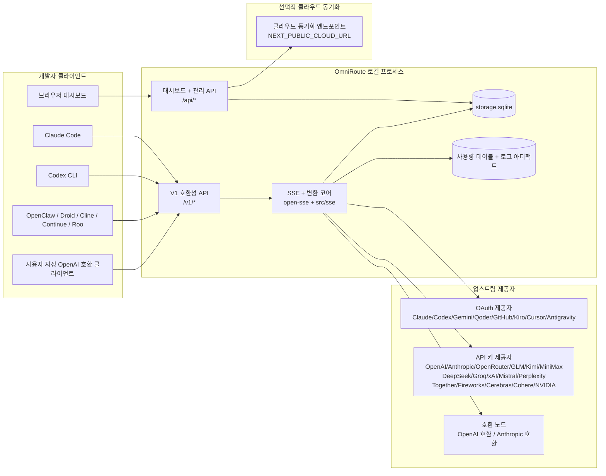
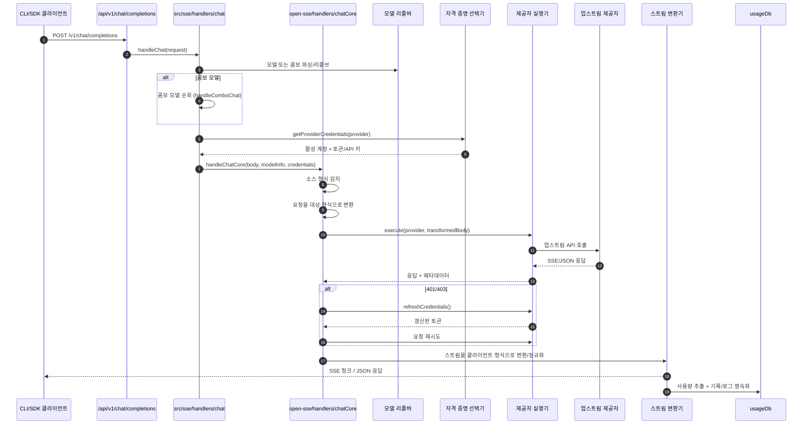
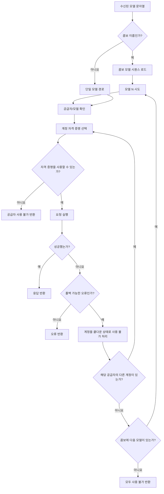
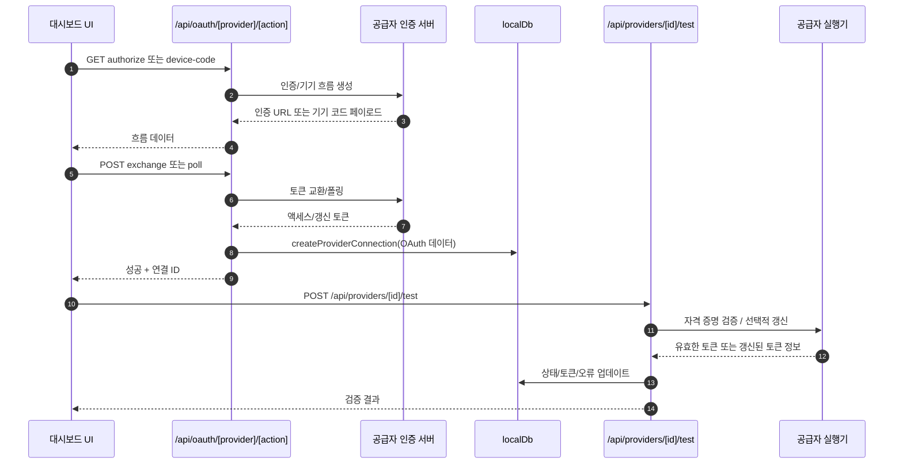
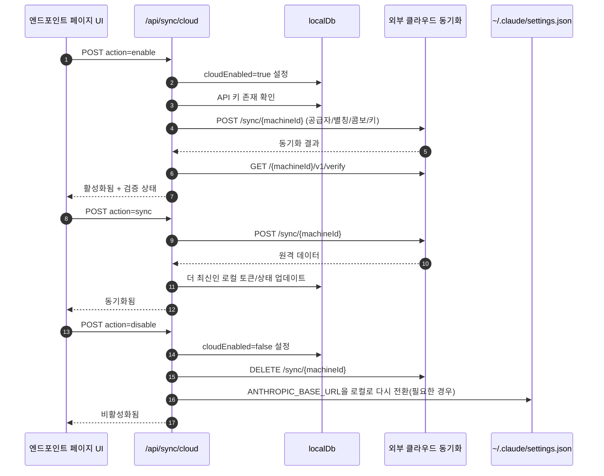
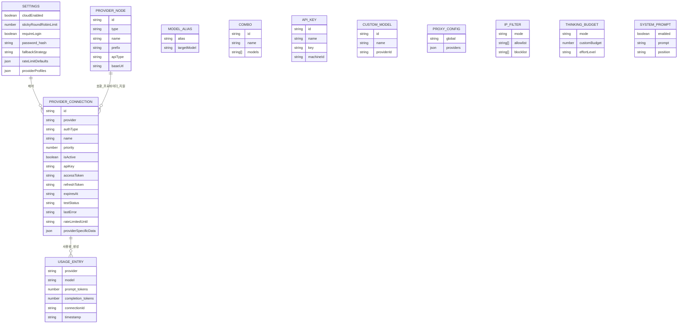
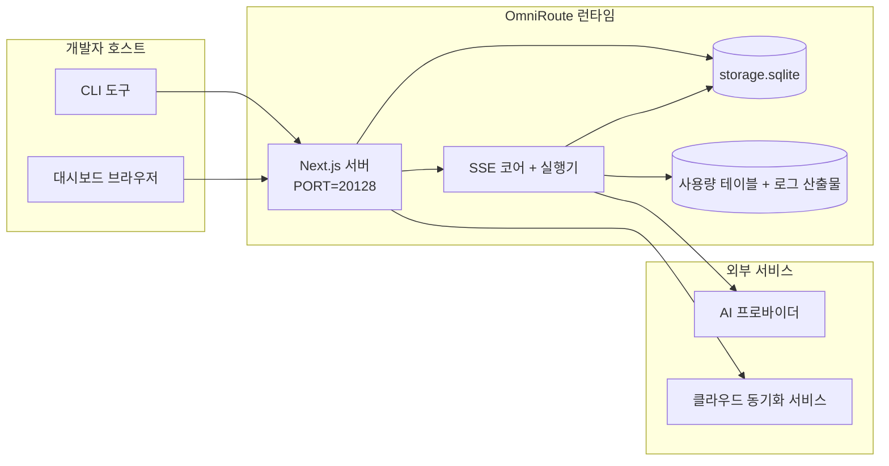

# OmniRoute Architecture (한국어)

🌐 **Languages:** 🇺🇸 [English](../../../../architecture/ARCHITECTURE.md) · 🇪🇹 [am](../../../am/docs/architecture/ARCHITECTURE.md) · 🇸🇦 [ar](../../../ar/docs/architecture/ARCHITECTURE.md) · 🇦🇿 [az](../../../az/docs/architecture/ARCHITECTURE.md) · 🇧🇬 [bg](../../../bg/docs/architecture/ARCHITECTURE.md) · 🇧🇩 [bn](../../../bn/docs/architecture/ARCHITECTURE.md) · 🇧🇦 [bs](../../../bs/docs/architecture/ARCHITECTURE.md) · 🇨🇿 [cs](../../../cs/docs/architecture/ARCHITECTURE.md) · 🇩🇰 [da](../../../da/docs/architecture/ARCHITECTURE.md) · 🇩🇪 [de](../../../de/docs/architecture/ARCHITECTURE.md) · 🇬🇷 [el](../../../el/docs/architecture/ARCHITECTURE.md) · 🇪🇸 [es](../../../es/docs/architecture/ARCHITECTURE.md) · 🇪🇪 [et](../../../et/docs/architecture/ARCHITECTURE.md) · 🇮🇷 [fa](../../../fa/docs/architecture/ARCHITECTURE.md) · 🇫🇮 [fi](../../../fi/docs/architecture/ARCHITECTURE.md) · 🇫🇷 [fr](../../../fr/docs/architecture/ARCHITECTURE.md) · 🇮🇪 [ga](../../../ga/docs/architecture/ARCHITECTURE.md) · 🇮🇳 [gu](../../../gu/docs/architecture/ARCHITECTURE.md) · 🇳🇬 [ha](../../../ha/docs/architecture/ARCHITECTURE.md) · 🇮🇱 [he](../../../he/docs/architecture/ARCHITECTURE.md) · 🇮🇳 [hi](../../../hi/docs/architecture/ARCHITECTURE.md) · 🇭🇷 [hr](../../../hr/docs/architecture/ARCHITECTURE.md) · 🇭🇺 [hu](../../../hu/docs/architecture/ARCHITECTURE.md) · 🇦🇲 [hy](../../../hy/docs/architecture/ARCHITECTURE.md) · 🇮🇩 [id](../../../id/docs/architecture/ARCHITECTURE.md) · 🇳🇬 [ig](../../../ig/docs/architecture/ARCHITECTURE.md) · 🇮🇹 [it](../../../it/docs/architecture/ARCHITECTURE.md) · 🇯🇵 [ja](../../../ja/docs/architecture/ARCHITECTURE.md) · 🇬🇪 [ka](../../../ka/docs/architecture/ARCHITECTURE.md) · 🇰🇭 [km](../../../km/docs/architecture/ARCHITECTURE.md) · 🇮🇳 [kn](../../../kn/docs/architecture/ARCHITECTURE.md) · 🇱🇹 [lt](../../../lt/docs/architecture/ARCHITECTURE.md) · 🇱🇻 [lv](../../../lv/docs/architecture/ARCHITECTURE.md) · 🇮🇳 [ml](../../../ml/docs/architecture/ARCHITECTURE.md) · 🇮🇳 [mr](../../../mr/docs/architecture/ARCHITECTURE.md) · 🇲🇾 [ms](../../../ms/docs/architecture/ARCHITECTURE.md) · 🇲🇹 [mt](../../../mt/docs/architecture/ARCHITECTURE.md) · 🇲🇲 [my](../../../my/docs/architecture/ARCHITECTURE.md) · 🇳🇵 [ne](../../../ne/docs/architecture/ARCHITECTURE.md) · 🇳🇱 [nl](../../../nl/docs/architecture/ARCHITECTURE.md) · 🇳🇴 [no](../../../no/docs/architecture/ARCHITECTURE.md) · 🇮🇳 [or](../../../or/docs/architecture/ARCHITECTURE.md) · 🇮🇳 [pa](../../../pa/docs/architecture/ARCHITECTURE.md) · 🇵🇭 [phi](../../../phi/docs/architecture/ARCHITECTURE.md) · 🇵🇱 [pl](../../../pl/docs/architecture/ARCHITECTURE.md) · 🇵🇹 [pt](../../../pt/docs/architecture/ARCHITECTURE.md) · 🇧🇷 [pt-BR](../../../pt-BR/docs/architecture/ARCHITECTURE.md) · 🇷🇴 [ro](../../../ro/docs/architecture/ARCHITECTURE.md) · 🇷🇺 [ru](../../../ru/docs/architecture/ARCHITECTURE.md) · 🇱🇰 [si](../../../si/docs/architecture/ARCHITECTURE.md) · 🇸🇰 [sk](../../../sk/docs/architecture/ARCHITECTURE.md) · 🇸🇮 [sl](../../../sl/docs/architecture/ARCHITECTURE.md) · 🇷🇸 [sr](../../../sr/docs/architecture/ARCHITECTURE.md) · 🇸🇪 [sv](../../../sv/docs/architecture/ARCHITECTURE.md) · 🇰🇪 [sw](../../../sw/docs/architecture/ARCHITECTURE.md) · 🇮🇳 [ta](../../../ta/docs/architecture/ARCHITECTURE.md) · 🇮🇳 [te](../../../te/docs/architecture/ARCHITECTURE.md) · 🇹🇭 [th](../../../th/docs/architecture/ARCHITECTURE.md) · 🇹🇷 [tr](../../../tr/docs/architecture/ARCHITECTURE.md) · 🇺🇦 [uk-UA](../../../uk-UA/docs/architecture/ARCHITECTURE.md) · 🇵🇰 [ur](../../../ur/docs/architecture/ARCHITECTURE.md) · 🇺🇿 [uz](../../../uz/docs/architecture/ARCHITECTURE.md) · 🇻🇳 [vi](../../../vi/docs/architecture/ARCHITECTURE.md) · 🇳🇬 [yo](../../../yo/docs/architecture/ARCHITECTURE.md) · 🇨🇳 [zh-CN](../../../zh-CN/docs/architecture/ARCHITECTURE.md) · 🇹🇼 [zh-TW](../../../zh-TW/docs/architecture/ARCHITECTURE.md)

---

🌐 **Languages:** 🇺🇸 [English](../../../../architecture/ARCHITECTURE.md) · 🇪🇹 [am](../../../am/docs/architecture/ARCHITECTURE.md) · 🇸🇦 [ar](../../../ar/docs/architecture/ARCHITECTURE.md) · 🇦🇿 [az](../../../az/docs/architecture/ARCHITECTURE.md) · 🇧🇬 [bg](../../../bg/docs/architecture/ARCHITECTURE.md) · 🇧🇩 [bn](../../../bn/docs/architecture/ARCHITECTURE.md) · 🇧🇦 [bs](../../../bs/docs/architecture/ARCHITECTURE.md) · 🇨🇿 [cs](../../../cs/docs/architecture/ARCHITECTURE.md) · 🇩🇰 [da](../../../da/docs/architecture/ARCHITECTURE.md) · 🇩🇪 [de](../../../de/docs/architecture/ARCHITECTURE.md) · 🇬🇷 [el](../../../el/docs/architecture/ARCHITECTURE.md) · 🇪🇸 [es](../../../es/docs/architecture/ARCHITECTURE.md) · 🇪🇪 [et](../../../et/docs/architecture/ARCHITECTURE.md) · 🇮🇷 [fa](../../../fa/docs/architecture/ARCHITECTURE.md) · 🇫🇮 [fi](../../../fi/docs/architecture/ARCHITECTURE.md) · 🇫🇷 [fr](../../../fr/docs/architecture/ARCHITECTURE.md) · 🇮🇪 [ga](../../../ga/docs/architecture/ARCHITECTURE.md) · 🇮🇳 [gu](../../../gu/docs/architecture/ARCHITECTURE.md) · 🇳🇬 [ha](../../../ha/docs/architecture/ARCHITECTURE.md) · 🇮🇱 [he](../../../he/docs/architecture/ARCHITECTURE.md) · 🇮🇳 [hi](../../../hi/docs/architecture/ARCHITECTURE.md) · 🇭🇷 [hr](../../../hr/docs/architecture/ARCHITECTURE.md) · 🇭🇺 [hu](../../../hu/docs/architecture/ARCHITECTURE.md) · 🇦🇲 [hy](../../../hy/docs/architecture/ARCHITECTURE.md) · 🇮🇩 [id](../../../id/docs/architecture/ARCHITECTURE.md) · 🇳🇬 [ig](../../../ig/docs/architecture/ARCHITECTURE.md) · 🇮🇹 [it](../../../it/docs/architecture/ARCHITECTURE.md) · 🇯🇵 [ja](../../../ja/docs/architecture/ARCHITECTURE.md) · 🇬🇪 [ka](../../../ka/docs/architecture/ARCHITECTURE.md) · 🇰🇭 [km](../../../km/docs/architecture/ARCHITECTURE.md) · 🇮🇳 [kn](../../../kn/docs/architecture/ARCHITECTURE.md) · 🇱🇹 [lt](../../../lt/docs/architecture/ARCHITECTURE.md) · 🇱🇻 [lv](../../../lv/docs/architecture/ARCHITECTURE.md) · 🇮🇳 [ml](../../../ml/docs/architecture/ARCHITECTURE.md) · 🇮🇳 [mr](../../../mr/docs/architecture/ARCHITECTURE.md) · 🇲🇾 [ms](../../../ms/docs/architecture/ARCHITECTURE.md) · 🇲🇹 [mt](../../../mt/docs/architecture/ARCHITECTURE.md) · 🇲🇲 [my](../../../my/docs/architecture/ARCHITECTURE.md) · 🇳🇵 [ne](../../../ne/docs/architecture/ARCHITECTURE.md) · 🇳🇱 [nl](../../../nl/docs/architecture/ARCHITECTURE.md) · 🇳🇴 [no](../../../no/docs/architecture/ARCHITECTURE.md) · 🇮🇳 [or](../../../or/docs/architecture/ARCHITECTURE.md) · 🇮🇳 [pa](../../../pa/docs/architecture/ARCHITECTURE.md) · 🇵🇭 [phi](../../../phi/docs/architecture/ARCHITECTURE.md) · 🇵🇱 [pl](../../../pl/docs/architecture/ARCHITECTURE.md) · 🇵🇹 [pt](../../../pt/docs/architecture/ARCHITECTURE.md) · 🇧🇷 [pt-BR](../../../pt-BR/docs/architecture/ARCHITECTURE.md) · 🇷🇴 [ro](../../../ro/docs/architecture/ARCHITECTURE.md) · 🇷🇺 [ru](../../../ru/docs/architecture/ARCHITECTURE.md) · 🇱🇰 [si](../../../si/docs/architecture/ARCHITECTURE.md) · 🇸🇰 [sk](../../../sk/docs/architecture/ARCHITECTURE.md) · 🇸🇮 [sl](../../../sl/docs/architecture/ARCHITECTURE.md) · 🇷🇸 [sr](../../../sr/docs/architecture/ARCHITECTURE.md) · 🇸🇪 [sv](../../../sv/docs/architecture/ARCHITECTURE.md) · 🇰🇪 [sw](../../../sw/docs/architecture/ARCHITECTURE.md) · 🇮🇳 [ta](../../../ta/docs/architecture/ARCHITECTURE.md) · 🇮🇳 [te](../../../te/docs/architecture/ARCHITECTURE.md) · 🇹🇭 [th](../../../th/docs/architecture/ARCHITECTURE.md) · 🇹🇷 [tr](../../../tr/docs/architecture/ARCHITECTURE.md) · 🇺🇦 [uk-UA](../../../uk-UA/docs/architecture/ARCHITECTURE.md) · 🇵🇰 [ur](../../../ur/docs/architecture/ARCHITECTURE.md) · 🇺🇿 [uz](../../../uz/docs/architecture/ARCHITECTURE.md) · 🇻🇳 [vi](../../../vi/docs/architecture/ARCHITECTURE.md) · 🇳🇬 [yo](../../../yo/docs/architecture/ARCHITECTURE.md) · 🇨🇳 [zh-CN](../../../zh-CN/docs/architecture/ARCHITECTURE.md) · 🇹🇼 [zh-TW](../../../zh-TW/docs/architecture/ARCHITECTURE.md)

_최종 업데이트: 2026-06-28_

## 요약

OmniRoute는 Next.js 기반의 로컬 AI 라우팅 게이트웨이 및 대시보드입니다.
단일 OpenAI 호환 엔드포인트(`/v1/*`)를 제공하며, 변환, 폴백, 토큰 갱신 및 사용량 추적 기능을 통해 여러 업스트림 제공자 간에 트래픽을 라우팅합니다.

핵심 기능:

- CLI/도구를 위한 OpenAI 호환 API 인터페이스(제공자 355개, 실행기 108개)
- 제공자 형식 간 요청/응답 변환
- 모델 조합 폴백(다중 모델 시퀀스)
- 구조화된 조합 단계(`provider + model + connection`) 및 `compositeTiers`에 따른 런타임 순서 지정
- 계정 수준 폴백(제공자별 다중 계정)
- 기본 채팅 경로에서 할당량 사전 점검 및 할당량을 고려한 P2C 계정 선택
- OAuth + API 키 제공자 연결 관리(OAuth 제공자 모듈 22개)
- `/v1/embeddings`를 통한 임베딩 생성(제공자 18개)
- `/v1/images/generations`를 통한 이미지 생성(제공자 10개 이상, 모델 20개 이상)
- `/v1/audio/transcriptions`를 통한 오디오 전사(제공자 18개)
- `/v1/audio/speech`를 통한 텍스트 음성 변환(내장 제공자 24개)
- `/v1/videos/generations`를 통한 비디오 생성(ComfyUI + SD WebUI)
- `/v1/music/generations`를 통한 음악 생성(ComfyUI)
- `/v1/search`를 통한 웹 검색(제공자 20개)
- `/v1/moderations`를 통한 콘텐츠 검토
- `/v1/rerank`를 통한 재순위 지정
- 추론 모델을 위한 Think 태그 파싱(`<think>...</think>`)
- 엄격한 OpenAI SDK 호환성을 위한 응답 정제
- 제공자 간 호환성을 위한 역할 정규화(developer→system, system→user)
- 구조화된 출력 변환(json_schema → Gemini responseSchema)
- 제공자, 키, 별칭, 조합, 설정 및 가격 정보의 로컬 영속성(DB 모듈 122개)
- 사용량/비용 추적 및 요청 로깅
- 다중 기기/상태 동기화를 위한 선택적 클라우드 동기화
- API 액세스 제어를 위한 IP 허용 목록/차단 목록
- 사고 예산 관리(패스스루/자동/사용자 지정/적응형)
- 전역 시스템 프롬프트 삽입
- 세션 추적 및 핑거프린팅
- 제공자별 프로필을 사용하는 계정별 강화된 속도 제한
- 제공자 복원력을 위한 회로 차단기 패턴
- 뮤텍스 잠금을 통한 썬더링 허드 방지
- 서명 기반 요청 중복 제거 캐시
- 도메인 계층: 비용 규칙, 폴백 정책, 잠금 정책
- Context Relay: 계정 전환 시 연속성을 위한 세션 인계 요약
- 도메인 상태 영속성(폴백, 예산, 잠금 및 회로 차단기를 위한 SQLite 연속 기입 캐시)
- 중앙 집중식 요청 평가를 위한 정책 엔진(잠금 → 예산 → 폴백)
- p50/p95/p99 지연 시간 집계를 제공하는 요청 텔레메트리
- `combo_execution_key` / `combo_step_id`를 통한 조합 대상 텔레메트리 및 과거 조합 대상 상태
- 엔드투엔드 추적을 위한 상관관계 ID(X-Request-Id)
- API 키별 옵트아웃을 지원하는 규정 준수 감사 로깅
- LLM 품질 보증을 위한 평가 프레임워크
- 실시간 제공자 회로 차단기 상태를 제공하는 상태 대시보드
- 3가지 전송 방식(stdio/SSE/Streamable HTTP)을 지원하는 MCP Server(도구 110개)
- 스킬 및 작업 수명 주기를 지원하는 A2A Server(JSON-RPC 2.0 + SSE)
- 메모리 시스템(추출, 삽입, 검색, 요약)
- 스킬 시스템(레지스트리, 실행기, 샌드박스, 내장 스킬)
- 인증서 관리 및 DNS 처리를 지원하는 MITM 프록시
- 프롬프트 인젝션 방어 미들웨어
- Caveman, RTK, 스택형 파이프라인, 압축 조합, 언어 팩 및 분석을 지원하는 프롬프트 압축 파이프라인
- ACP(Agent Communication Protocol) 레지스트리
- 모듈식 OAuth 제공자(`src/lib/oauth/providers/` 아래의 개별 모듈 22개)
- 제거/전체 제거 스크립트
- OAuth 환경 복구 작업
- OpenAI 호환 WS 클라이언트를 위한 WebSocket 브리지(`/v1/ws`)
- 동기화 토큰 관리(발급/폐기, ETag 버전이 지정된 구성 번들 다운로드)
- GLM Thinking(`glmt`) 일급 제공자 프리셋
- 하이브리드 토큰 계산(제공자 측 `/messages/count_tokens` 및 추정 폴백)
- 모델 별칭 자동 시딩(시작 시 프록시 간 방언 정규화 30개 이상)
- SSRF 방어, 비공개 URL 차단 및 구성 가능한 재시도를 지원하는 안전한 아웃바운드 가져오기
- 구성 가능한 `requestRetry` 및 `maxRetryIntervalSec`를 사용하는 쿨다운 인식 채팅 재시도
- 시작 시 Zod를 사용한 런타임 환경 검증
- 페이지네이션, 제공자 CRUD 이벤트 및 SSRF 차단 검증 로깅을 지원하는 규정 준수 감사 v2

기본 런타임 모델:

- `src/app/api/*` 아래의 Next.js 앱 라우트는 대시보드 API와 호환성 API를 모두 구현합니다
- `src/sse/*` + `open-sse/*`의 공유 SSE/라우팅 코어는 제공자 실행, 변환, 스트리밍, 폴백 및 사용량을 처리합니다

## 참조 다이어그램

v3.8.0 플랫폼의 표준 버전 관리 Mermaid 소스는
[`docs/diagrams/`](../diagrams/README.md)에 있습니다. 이해를 돕기 위해 아래에 두 개를 재현했으며,
나머지는 각 도메인별 가이드에서 링크로 제공됩니다.


> 출처: [diagrams/request-pipeline.mmd](../diagrams/request-pipeline.mmd)


> 출처: [diagrams/resilience-3layers.mmd](../diagrams/resilience-3layers.mmd) —
> [RESILIENCE_GUIDE.md](./RESILIENCE_GUIDE.md) 및 `CLAUDE.md` 복원력 참조에서도 링크됩니다.

## 범위 및 경계

### 범위 내

- 로컬 게이트웨이 런타임
- 대시보드 관리 API
- 공급자 인증 및 토큰 갱신
- 요청 변환 및 SSE 스트리밍
- 로컬 상태 + 사용량 영속화
- 선택적 클라우드 동기화 오케스트레이션

### 범위 외

- `NEXT_PUBLIC_CLOUD_URL` 뒤에 있는 클라우드 서비스 구현
- 로컬 프로세스 외부의 공급자 SLA/제어 플레인
- 외부 CLI 바이너리 자체(Claude CLI, Codex CLI 등)

## 대시보드 화면(현재)

`src/app/(dashboard)/dashboard/` 아래의 주요 페이지:

- `/dashboard` — 빠른 시작 + 공급자 개요
- `/dashboard/endpoint` — 엔드포인트 프록시 + MCP + A2A + API 엔드포인트 탭
- `/dashboard/providers` — 공급자 연결 및 자격 증명
- `/dashboard/combos` — 콤보 전략, 템플릿, 단계 기반 빌더, 모델 라우팅 규칙, 수동 영속 순서 지정
- `/dashboard/auto-combo` — Auto Combo Engine: 점수 가중치, 모드 팩, 가상 팩토리 프리셋, 텔레메트리
- `/dashboard/costs` — 비용 집계 및 가격 가시성
- `/dashboard/analytics` — 사용량 분석, 평가, 콤보 대상 상태
- `/dashboard/limits` — 할당량/속도 제어
- `/dashboard/cli-tools` — CLI 온보딩, 런타임 감지, 구성 생성
- `/dashboard/agents` — 감지된 ACP 에이전트 + 사용자 정의 에이전트 등록
- `/dashboard/cloud-agents` — 클라우드 호스팅 에이전트 작업(Codex Cloud, Devin, Jules) 및 작업 수명 주기
- `/dashboard/skills` — A2A 스킬 레지스트리, 샌드박스 실행, 기본 제공 스킬 카탈로그
- `/dashboard/memory` — 영속적 대화 메모리 검사 및 검색
- `/dashboard/webhooks` — 아웃바운드 웹훅 구독, 시크릿 교체, 재시도 통계
- `/dashboard/batch` — 배치 작업 제출 및 진행 상황
- `/dashboard/cache` — 읽기 통과 및 추론 캐시 통계, 제거 제어
- `/dashboard/playground` — 구성된 모든 콤보/모델을 대상으로 하는 대화형 채팅 플레이그라운드
- `/dashboard/changelog` — 앱 내 변경 로그 뷰어(`CHANGELOG.md` 렌더링)
- `/dashboard/system` — 런타임 진단, 버전 정보, 환경 검증 화면
- `/dashboard/onboarding` — 새 설치를 위한 최초 실행 설정 마법사
- `/dashboard/media` — 이미지/비디오/음악 플레이그라운드
- `/dashboard/search-tools` — 검색 공급자 테스트 및 기록
- `/dashboard/health` — 가동 시간, 회로 차단기, 속도 제한, 할당량 모니터링 세션
- `/dashboard/logs` — 요청/프록시/감사/콘솔 로그
- `/dashboard/settings` — 시스템 설정 탭(일반, 라우팅, 콤보 기본값 등)
- `/dashboard/context/caveman` — Caveman 압축 규칙, 언어 팩, 미리 보기 및 출력 모드
- `/dashboard/context/rtk` — RTK 명령 출력 필터, 미리 보기 및 런타임 안전 설정
- `/dashboard/context/combos` — 라우팅 콤보에 할당된 명명된 압축 파이프라인
- `/dashboard/translator` — 변환기 검사 및 요청 형식 변환 미리 보기
- `/dashboard/audit` — 페이지네이션 및 구조화된 메타데이터를 갖춘 규정 준수 감사 로그 브라우저
- `/dashboard/usage` — `usage_history`에 연결된 요청별 사용량 브라우저
- `/dashboard/compression` — 압축 분석, 통계 및 파이프라인 할당
- `/dashboard/api-manager` — API 키 수명 주기 및 모델 권한

## 상위 수준 시스템 컨텍스트



## 핵심 런타임 구성 요소

## 1) API 및 라우팅 계층 (Next.js 앱 라우트)

주요 디렉터리:

- 호환성 API용 `src/app/api/v1/*` 및 `src/app/api/v1beta/*`
- 관리/구성 API용 `src/app/api/*`
- `next.config.mjs`의 Next 재작성 규칙은 `/v1/*`를 `/api/v1/*`에 매핑

주요 호환성 라우트:

- `src/app/api/v1/chat/completions/route.ts`
- `src/app/api/v1/messages/route.ts`
- `src/app/api/v1/responses/route.ts`
- `src/app/api/v1/models/route.ts` — `custom: true`인 사용자 지정 모델 포함
- `src/app/api/v1/embeddings/route.ts` — 임베딩 생성(6개 제공자)
- `src/app/api/v1/images/generations/route.ts` — 이미지 생성(Antigravity/Nebius를 포함한 4개 이상의 제공자)
- `src/app/api/v1/messages/count_tokens/route.ts`
- `src/app/api/v1/providers/[provider]/chat/completions/route.ts` — 제공자별 전용 채팅
- `src/app/api/v1/providers/[provider]/embeddings/route.ts` — 제공자별 전용 임베딩
- `src/app/api/v1/providers/[provider]/images/generations/route.ts` — 제공자별 전용 이미지
- `src/app/api/v1beta/models/route.ts`
- `src/app/api/v1beta/models/[...path]/route.ts`

관리 도메인:

- 인증/설정: `src/app/api/auth/*`, `src/app/api/settings/*`
- 제공자/연결: `src/app/api/providers*`
- 제공자 노드: `src/app/api/provider-nodes*`
- 사용자 지정 모델: `src/app/api/provider-models` (GET/POST/DELETE)
- 모델 카탈로그: `src/app/api/models/route.ts` (GET)
- 프록시 구성: `src/app/api/settings/proxy` (GET/PUT/DELETE) + `src/app/api/settings/proxy/test` (POST)
- OAuth: `src/app/api/oauth/*`
- 키/별칭/조합/가격 책정: `src/app/api/keys*`, `src/app/api/models/alias`, `src/app/api/combos*`, `src/app/api/pricing`
- 사용량: `src/app/api/usage/*`
- 동기화/클라우드: `src/app/api/sync/*`, `src/app/api/cloud/*`
- CLI 도구 헬퍼: `src/app/api/cli-tools/*`
- IP 필터: `src/app/api/settings/ip-filter` (GET/PUT)
- 추론 예산: `src/app/api/settings/thinking-budget` (GET/PUT)
- 시스템 프롬프트: `src/app/api/settings/system-prompt` (GET/PUT)
- 압축: `src/app/api/settings/compression`, `src/app/api/compression/*` 및
  `src/app/api/context/*`
- 세션: `src/app/api/sessions` (GET)
- 속도 제한: `src/app/api/rate-limits` (GET)
- 복원력: `src/app/api/resilience` (GET/PATCH) — 요청 대기열, 연결 쿨다운, 제공자 차단기, 쿨다운 대기 구성
- 복원력 재설정: `src/app/api/resilience/reset` (POST) — 제공자 차단기 재설정
- 캐시 통계: `src/app/api/cache/stats` (GET/DELETE)
- 텔레메트리: `src/app/api/telemetry/summary` (GET)
- 예산: `src/app/api/usage/budget` (GET/POST)
- 폴백 체인: `src/app/api/fallback/chains` (GET/POST/DELETE)
- 규정 준수 감사: `src/app/api/compliance/audit-log` (GET, 페이지네이션 + 구조화된 메타데이터 포함)
- 평가: `src/app/api/evals` (GET/POST), `src/app/api/evals/[suiteId]` (GET)
- 정책: `src/app/api/policies` (GET/POST)
- 동기화 토큰: `src/app/api/sync/tokens` (GET/POST), `src/app/api/sync/tokens/[id]` (GET/DELETE)
- 구성 번들: `src/app/api/sync/bundle` (GET, 설정/제공자/조합/키의 ETag 버전 관리 스냅샷)
- WebSocket: `src/app/api/v1/ws/route.ts` — OpenAI 호환 WS 클라이언트용 Upgrade 핸들러

## 2) SSE + 번역 코어

주요 흐름 모듈:

- 진입점: `src/sse/handlers/chat.ts`
- 핵심 오케스트레이션: `open-sse/handlers/chatCore.ts`
- 프로바이더 실행 어댑터: `open-sse/executors/*`
- 형식 감지/프로바이더 구성: `open-sse/services/provider.ts`
- 모델 파싱/해결: `src/sse/services/model.ts`, `open-sse/services/model.ts`
- 계정 폴백 로직: `open-sse/services/accountFallback.ts`
- 번역 레지스트리: `open-sse/translator/index.ts`
- 스트림 변환: `open-sse/utils/stream.ts`, `open-sse/utils/streamHandler.ts`
- 사용량 추출/정규화: `open-sse/utils/usageTracking.ts`
- Think 태그 파서: `open-sse/utils/thinkTagParser.ts`
- 임베딩 핸들러: `open-sse/handlers/embeddings.ts`
- 임베딩 프로바이더 레지스트리: `open-sse/config/embeddingRegistry.ts`
- 이미지 생성 핸들러: `open-sse/handlers/imageGeneration.ts`
- 이미지 프로바이더 레지스트리: `open-sse/config/imageRegistry.ts`
- 응답 정제: `open-sse/handlers/responseSanitizer.ts`
- 역할 정규화: `open-sse/services/roleNormalizer.ts`

서비스(비즈니스 로직):

- 계정 선택/점수 산정: `open-sse/services/accountSelector.ts`
- 컨텍스트 수명 주기 관리: `open-sse/services/contextManager.ts`
- IP 필터 적용: `open-sse/services/ipFilter.ts`
- 세션 추적: `open-sse/services/sessionManager.ts`
- 요청 중복 제거: `open-sse/services/signatureCache.ts`
- 시스템 프롬프트 주입: `open-sse/services/systemPrompt.ts`
- 사고 예산 관리: `open-sse/services/thinkingBudget.ts`
- 와일드카드 모델 라우팅: `open-sse/services/wildcardRouter.ts`
- 속도 제한 관리: `open-sse/services/rateLimitManager.ts`
- 서킷 브레이커: `src/shared/utils/circuitBreaker.ts`
- 컨텍스트 핸드오프: `open-sse/services/contextHandoff.ts` — 컨텍스트 릴레이 전략을 위한 핸드오프 요약 생성 및 주입
- 압축: `open-sse/services/compression/*` — 프로바이더 변환 전 선제적 압축;
  Caveman 규칙, RTK 필터, 스택형 파이프라인, 압축 조합, 통계 및 검증 포함
- Codex 할당량 페처: `open-sse/services/codexQuotaFetcher.ts` — 컨텍스트 릴레이 핸드오프 결정을 위해 Codex 할당량을 가져옴
- 쿨다운 인식 재시도: `src/sse/services/cooldownAwareRetry.ts` — 구성 가능한 `requestRetry` / `maxRetryIntervalSec`를 사용한 모델별 쿨다운 재시도
- 안전한 아웃바운드 페치: `src/shared/network/safeOutboundFetch.ts` — SSRF 방어, 비공개 URL 차단, 재시도 및 타임아웃이 적용된 보호형 프로바이더/모델 페치
- 아웃바운드 URL 가드: `src/shared/network/outboundUrlGuard.ts` — 비공개/localhost CIDR 범위에 대해 프로바이더 URL 검증
- 프로바이더 요청 기본값: `open-sse/services/providerRequestDefaults.ts` — 프로바이더 수준의 `maxTokens`, `temperature`, `thinkingBudgetTokens` 기본값
- GLM 프로바이더 상수: `open-sse/config/glmProvider.ts` — 공유 GLM 모델, 할당량 URL, GLMT 타임아웃/기본값
- Antigravity 업스트림: `open-sse/config/antigravityUpstream.ts` — 기본 URL 및 검색 경로 상수
- Codex 클라이언트 상수: `open-sse/config/codexClient.ts` — 버전이 지정된 사용자 에이전트 및 클라이언트 버전 값
- 모델 별칭 시드: `src/lib/modelAliasSeed.ts` — 시작 시 30개 이상의 프록시 간 방언 별칭을 시드함

도메인 계층 모듈:

- 비용 규칙/예산: `src/domain/costRules.ts`
- 폴백 정책: `src/domain/fallbackPolicy.ts`
- 조합 해결기: `src/domain/comboResolver.ts`
- 잠금 정책: `src/domain/lockoutPolicy.ts`
- 정책 엔진: `src/domain/policyEngine.ts` — 중앙 집중식 잠금 → 예산 → 폴백 평가
- 오류 코드 카탈로그: `src/shared/constants/errorCodes.ts`
- 요청 ID: `src/shared/utils/requestId.ts`
- 페치 타임아웃: `src/shared/utils/fetchTimeout.ts`
- 요청 텔레메트리: `src/shared/utils/requestTelemetry.ts`
- 규정 준수/감사: `src/lib/compliance/index.ts`
- 평가 실행기: `src/lib/evals/evalRunner.ts`
- 도메인 상태 영속화: `src/lib/db/domainState.ts` — 폴백 체인, 예산, 비용 이력, 잠금 상태, 서킷 브레이커를 위한 SQLite CRUD

OAuth 프로바이더 모듈(`src/lib/oauth/providers/` 아래의 개별 파일 22개):

- 레지스트리 인덱스: `src/lib/oauth/providers/index.ts`
- 개별 프로바이더: `agy.ts`, `antigravity.ts`, `claude.ts`, `cline.ts`, `codebuddy-cn.ts`, `codex.ts`, `cursor.ts`, `devin-desktop.ts`, `ghe-copilot.ts`, `github.ts`, `gitlab-duo.ts`, `grok-cli-oauth.ts`, `grok-cli.ts`, `kilocode.ts`, `kimi-coding.ts`, `kiro.ts`, `openference.ts`, `qoder.ts`, `trae.ts`, `xai-oauth.ts`, `zed-hosted.ts`, `zed.ts`
- 얇은 래퍼: `src/lib/oauth/providers.ts` — 개별 모듈에서 다시 내보냄

## 5) 임베디드 서비스 (v3.8.4)

OmniRoute는 **임베디드 서비스**라고 하는 로컬 실행 AI 도구 프로세스를 설치하고, 감독하며, 해당 프로세스로 라우팅할 수 있습니다. 9Router, CLIProxyAPI, Bifrost, Mux, Dario의 다섯 가지가 함께 제공됩니다.

아키텍처 계층:

- **UI** (`/dashboard/providers/services`) — 수명 주기 제어, 실시간 로그 스트리밍, API 키 관리 및 (9Router의 경우) 내부 리버스 프록시를 통한 임베디드 네이티브 UI를 제공하는 2개 탭 페이지입니다.
- **API** (`/api/services/{name}/*`) — 9Router용 엔드포인트 11개, CLIProxyAPI용 10개, Bifrost / Mux / Dario용 각각 8개이며, 모두 **LOCAL_ONLY**(엄격한 규칙 #17)로 분류됩니다. 공유 `GET /api/services/[name]/logs` SSE 엔드포인트는 두 서비스 모두에 사용됩니다.
- **감독자** (`src/lib/services/`) — 범용 `ServiceSupervisor` 클래스가 `child_process.spawn`을 래핑하며, SSE 로그 스트리밍을 위한 5 MB 링 버퍼, 상태 검사 루프, 원자적 작업 잠금 및 SIGTERM→SIGKILL 방식의 정상 종료를 제공합니다. `bootstrap.ts`는 프로세스 시작 시 구성된 모든 서비스를 연결합니다.
- **제공자/실행기** (`open-sse/executors/ninerouter.ts`) — 9Router는 실제 제공자로 노출됩니다. 모델에는 `9router/{sub}/{model}` 접두사가 붙으며, 9Router의 `/v1/models` 엔드포인트에서 5분마다 동기화됩니다.

상세 설명: `docs/frameworks/EMBEDDED-SERVICES.md`

## 주요 하위 시스템 (v3.8.0)

### A. Auto Combo 엔진

Auto Combo는 정적 콤보 정의에 의존하는 대신 요청 시점에 라우팅 대상을 동적으로 평가하고 선택합니다. 이는 `auto/*` 모델 접두사 계열을 구동합니다.

- 엔진 진입점: `open-sse/services/autoCombo/` (`autoComboEngine.ts`,
  `scoringEngine.ts`, `virtualFactory.ts`, `modePacks.ts`)
- 해석기: `src/domain/comboResolver.ts` (`auto/` 접두사 자동 감지)
- 대시보드: `/dashboard/auto-combo`
- 텔레메트리: `auto_combo_decisions` SQLite 테이블

주요 기능:

- **19가지 라우팅 전략**(우선순위, 가중치, 선착순 채우기, 라운드 로빈, P2C, 무작위,
  최소 사용, 비용 최적화, 재설정 인식, 재설정 기간, 여유 용량, 엄격한 무작위,
  **auto**, lkgp, 컨텍스트 최적화, 컨텍스트 릴레이, **fusion**, 그리고 폴백 경로) —
  auto는 v3.8.0의 핵심 추가 기능이며, `fusion`(패널 팬아웃 + 판정 합성,
  `open-sse/services/fusion.ts`)은 v3.8.36에서 새로 추가되었습니다.
- **16요소 점수 산정**: 할당량, 상태, 비용의 역수, 지연 시간의 역수, 작업 적합도 및
  그 외 10개 요소. 요소와 기본 가중치의 표준 표는
  [`docs/routing/AUTO-COMBO.md`](../routing/AUTO-COMBO.md)에 있습니다. 여기에서 다시
  기술하면 오래된 정보가 남을 수 있는 위치가 하나 더 생기게 됩니다.
- **가상 팩토리**는 일치하는 명명된 콤보가 없을 때 임시 콤보를 구체화하며,
  정상 상태의 활성 제공자 연결에서 후보를 가져옵니다.
- **Auto 접두사**: `auto/coding`, `auto/cheap`, `auto/fast`, `auto/offline`,
  `auto/smart`, `auto/lkgp` — 각각 조정된 가중치 프로필을 기반으로 합니다.
- **6가지 모드 팩**: `ship-fast`, `cost-saver`, `quality-first`, `offline-friendly`,
  `reliability-first`, `chaos-mode` — 대시보드에서 호출할 수 있는 사전 설정 가중치 구성입니다.
  (요청 시점 변형인 위의 `auto/*` 접두사와 혼동하지 마십시오.)

전체 알고리즘 세부 정보(요소 공식, 가중치 조정)는
[`docs/routing/AUTO-COMBO.md`](../routing/AUTO-COMBO.md)를 참조하십시오.

### B. Cloud Agents

Cloud Agents는 서드파티 호스팅 코드 에이전트 플랫폼(Codex Cloud, Devin,
Jules)을 DB 기반의 일관된 작업 수명 주기로 래핑합니다. 모든 작업 생성/조회
엔드포인트에는 관리 인증이 필요합니다.

- 모듈 루트: `src/lib/cloudAgent/` (`baseAgent.ts`, `registry.ts`, `api.ts`,
  `types.ts`, `db.ts` 및 `agents/` 아래의 에이전트별 하위 디렉터리)
- 에이전트별 구현: `agents/codex/`, `agents/devin/`, `agents/jules/`
- 공개 엔드포인트: `/api/v1/agents/tasks/*` (목록/생성/조회/취소)
- 관리 엔드포인트: `/api/cloud/*` (프로비저닝, 상태, 일괄 처리)
- 대시보드: `/dashboard/cloud-agents`
- 저장소: `cloud_agent_tasks` 테이블

에이전트별 프로비저닝 및 OAuth 세부 사항은
[`docs/frameworks/CLOUD_AGENT.md`](../frameworks/CLOUD_AGENT.md)를 참조하십시오.

### C. 가드레일

가드레일 모듈은 PII, 프롬프트 인젝션 및 안전하지 않은 비전 콘텐츠가 있는지 요청과
응답을 검사하는 핫 리로드 가능 미들웨어 계층입니다. 위반이 발생하면 구조화된 오류 코드와
함께 HTTP **503**을 반환하여 요청을 즉시 중단하며, 다운스트림 호출자가 재시도하거나
분기할 수 있도록 합니다.

- 모듈 루트: `src/lib/guardrails/` (`base.ts`, `registry.ts`, `piiMasker.ts`,
  `promptInjection.ts`, `visionBridge.ts`, `visionBridgeHelpers.ts`)
- 핫 리로드: 레지스트리가 구성 변경을 감시하고 그 자리에서 체인을 다시 빌드합니다.
- 연결 지점: 채팅 핸들러 진입점, 이미지 생성 핸들러, 응답 정리기
- HTTP 계약: 위반은 `error.code = "GUARDRAIL_VIOLATION"`과 함께 `503`으로 표시됩니다.

규칙 집합 작성 및 임계값 조정은
[`docs/security/GUARDRAILS.md`](../security/GUARDRAILS.md)를 참조하십시오.

### D. 도메인 계층

`src/domain/` 네임스페이스는 정책 결정을 중앙화하므로 라우트 핸들러가
잠금/예산/폴백 로직을 직접 조합할 필요가 없습니다.

- 정책 엔진: `src/domain/policyEngine.ts` — 실행 전 평가를 위한 단일 진입점
  (잠금 → 예산 → 폴백 순서)
- 비용 규칙: `src/domain/costRules.ts`
- 폴백 정책: `src/domain/fallbackPolicy.ts`
- 잠금 정책: `src/domain/lockoutPolicy.ts`
- 태그 기반 라우팅: `src/domain/tagRouter.ts`
- 콤보 해석기: `src/domain/comboResolver.ts` — 콤보 이름, auto/\*
  접두사 및 와일드카드 모델 대상을 구체적인 실행 계획으로 해석합니다.
- 연결/모델 규칙 조이너: `src/domain/connectionModelRules.ts`
- 모델 가용성 스냅샷: `src/domain/modelAvailability.ts`
- 제공자 만료 추적: `src/domain/providerExpiration.ts`
- 할당량 캐시: `src/domain/quotaCache.ts`
- 성능 저하 상태: `src/domain/degradation.ts`
- 구성 감사: `src/domain/configAudit.ts`
- OmniRoute 응답 메타데이터 빌더: `src/domain/omnirouteResponseMeta.ts`
- 평가 하위 시스템: `src/domain/assessment/` — 주기적 평가 작업

### E. 권한 부여 파이프라인

권한 부여 파이프라인은 들어오는 모든 요청을 분류하고 디스패치하기 전에
적절한 정책 체인을 적용합니다.

- 파이프라인 진입점: `src/server/authz/pipeline.ts`
- 요청 분류기: `src/server/authz/classify.ts` — 공개 호환성 라우트와
  관리 라우트를 구분
- 공개 라우트 목록: `src/shared/constants/publicApiRoutes.ts`
- 정책: `src/server/authz/policies/` — 조합 가능한 조건자
  (`requireApiKey`, `requireManagement`, `requireFreshAuth` 등)
- 헤더 유틸리티: `src/server/authz/headers.ts`
- 어설션 헬퍼: `src/server/authz/assertAuth.ts`
- 요청 컨텍스트: `src/server/authz/context.ts`

공개 라우트와 관리 라우트 사이에는 엄격한 경계가 있습니다. 에이전트/쿨다운 API와
공급자 변경 작업에는 관리 인증이 필요합니다(누락된 경우 HTTP 401).

전체 라우트 분류 규칙은
[`docs/architecture/AUTHZ_GUIDE.md`](./AUTHZ_GUIDE.md)를 참조하세요.

### F. 워크플로 FSM 및 작업 인식 라우터

감지된 워크플로 단계(계획, 실행, 검토)와 백그라운드 작업의 연관성을
기준으로 트래픽을 전달하기 위해 콤보 선택 위에 계층화된 유한 상태 머신 기반
라우터입니다.

- 워크플로 FSM: `open-sse/services/workflowFSM.ts`
- 작업 인식 라우터: `open-sse/services/taskAwareRouter.ts`
- 백그라운드 작업 감지기: `open-sse/services/backgroundTaskDetector.ts`
- 의도 분류기: `open-sse/services/intentClassifier.ts`

FSM 전이는 Auto Combo의 점수 산정에 반영되어, 백그라운드/자동화 작업에는
더 저렴한 모델을, 대화형 계획/검토 턴에는 더 강력한 모델을 선호하도록
편향을 적용합니다.

### G. 공급자별 복원력

일부 공급자는 전역 회로 차단기/연결 쿨다운/모델 잠금 계층과 연동되는
전용 복원력 및 스텔스 모듈을 제공합니다.

- Antigravity 429 엔진: `open-sse/services/antigravity429Engine.ts`(ID를
  교체하고, 응답 헤더를 정리하며, `antigravityCredits.ts`,
  `antigravityHeaderScrub.ts`, `antigravityHeaders.ts`,
  `antigravityIdentity.ts`, `antigravityVersion.ts`를 통해 크레딧/버전 추적을 수행)
- ModelScope 할당량 정책: `open-sse/services/modelscopePolicy.ts`
- Claude Code CCH(호환성 채널 핸드셰이크): `open-sse/services/claudeCodeCCH.ts`,
  그리고 `claudeCodeCompatible.ts`, `claudeCodeConstraints.ts`, `claudeCodeExtraRemap.ts`,
  `claudeCodeToolRemapper.ts`
- Claude Code 지문 조정: `open-sse/services/claudeCodeFingerprint.ts`
- Claude Code 난독화: `open-sse/services/claudeCodeObfuscation.ts`

전체 스텔스 운영 지침 및 실무 가이드는
`docs/security/STEALTH_GUIDE.md`를 참조하세요(git에 있으며 `/docs`에는 컴파일되지 않음).

### H. 웹훅, 추론 캐시, 읽기 캐시

- **웹훅** — 공급자/계정/작업 이벤트의 외부 디스패치입니다.
  - 디스패처: `src/lib/webhookDispatcher.ts`
  - 저장소: `webhooks` SQLite 테이블(`src/lib/db/webhooks.ts`를 통해 접근)
  - 대시보드: `/dashboard/webhooks`(구독, 시크릿, 재시도 기록)
  - 이벤트 분류 체계 및 재시도 의미 체계는 [`docs/frameworks/WEBHOOKS.md`](../frameworks/WEBHOOKS.md)를 참조하세요.
- **추론 캐시** — 사고 토큰을 내보내는 공급자(Claude, GLMT 등)를 위한
  재실행 가능한 추론 블록으로, 연속된 턴에서 재추론을 생략할 수 있게 합니다.
  - DB 계층: `src/lib/db/reasoningCache.ts`
  - 서비스 계층: `open-sse/services/reasoningCache.ts`
  - 재실행 의미 체계는 [`docs/routing/REASONING_REPLAY.md`](../routing/REASONING_REPLAY.md)를 참조하세요.
- **읽기 캐시** — 시그니처를 키로 사용하는 단기 응답 캐시로, 문제가 있는
  업스트림 SDK에서 발생하는 동일한 재시도를 하나로 통합하는 데 사용됩니다.
  - DB 계층: `src/lib/db/readCache.ts`
  - 통계 엔드포인트: `GET /api/cache/stats`, 대시보드: `/dashboard/cache`

## 3) 영속성 계층

기본 상태 DB (SQLite):

- 핵심 인프라: `src/lib/db/core.ts` (better-sqlite3, 마이그레이션, WAL)
- DB 접근: 특정 `src/lib/db/*` 모듈을 직접 임포트(기존 `localDb.ts` 배럴은 제거됨)
- 파일: `${DATA_DIR}/storage.sqlite` (`$XDG_CONFIG_HOME`이 설정된 경우 `$XDG_CONFIG_HOME/omniroute/storage.sqlite`, 그렇지 않으면 `~/.omniroute/storage.sqlite`)
- 엔터티(테이블 + KV 네임스페이스): providerConnections, providerNodes, modelAliases, combos, apiKeys, settings, pricing, **customModels**, **proxyConfig**, **ipFilter**, **thinkingBudget**, **systemPrompt**

사용량 영속성:

- 퍼사드: `src/lib/usageDb.ts` (`src/lib/usage/*`에 분리된 모듈)
- `storage.sqlite`의 SQLite 테이블: `usage_history`, `call_logs`, `proxy_logs`
- 호환성/디버깅을 위한 선택적 파일 아티팩트 유지(`${DATA_DIR}/log.txt`, `${DATA_DIR}/call_logs/`, `<repo>/logs/...`)
- 레거시 JSON 파일이 있으면 시작 시 마이그레이션을 통해 SQLite로 이전됨

도메인 상태 DB (SQLite):

- `src/lib/db/domainState.ts` — 도메인 상태에 대한 CRUD 작업
- 테이블(`src/lib/db/core.ts`에서 생성): `domain_fallback_chains`, `domain_budgets`, `domain_cost_history`, `domain_lockout_state`, `domain_circuit_breakers`
- 쓰기 연계 캐시 패턴: 런타임에는 인메모리 Map이 기준 데이터이며, 변경 사항은 SQLite에 동기적으로 기록되고 콜드 스타트 시 DB에서 상태가 복원됨

## 4) 인증 + 보안 접점

- 대시보드 쿠키 인증: `src/proxy.ts`, `src/app/api/auth/login/route.ts`
- API 키 생성/검증: `src/shared/utils/apiKey.ts`
- 제공자 보안 정보는 `providerConnections` 항목에 영속적으로 저장됨
- `open-sse/utils/proxyFetch.ts`(환경 변수) 및 `open-sse/utils/networkProxy.ts`(제공자별 또는 전역으로 구성 가능)를 통한 아웃바운드 프록시 지원
- SSRF / 아웃바운드 URL 보호: `src/shared/network/outboundUrlGuard.ts` — 모든 제공자 호출에 대해 사설/루프백/링크 로컬 범위를 차단
- 런타임 환경 검증: `src/lib/env/runtimeEnv.ts` — 모든 환경 변수에 대한 Zod 스키마이며, 문제를 시작 오류/경고로 표시
- 동기화 토큰: `src/lib/db/syncTokens.ts` — 구성 번들 다운로드 엔드포인트용 범위 제한 토큰이며, `sync_tokens` SQLite 테이블(마이그레이션 `024_create_sync_tokens.sql`)을 사용
- WebSocket 핸드셰이크 인증: `src/lib/ws/handshake.ts` — API 키 또는 세션 쿠키를 통해 WS 업그레이드 요청을 검증

## 5) 클라우드 동기화

- 스케줄러 초기화: `src/lib/initCloudSync.ts`, `src/shared/services/initializeCloudSync.ts`, `src/shared/services/modelSyncScheduler.ts`
- 주기적 작업: `src/shared/services/cloudSyncScheduler.ts`
- 주기적 작업: `src/shared/services/modelSyncScheduler.ts`
- 제어 라우트: `src/app/api/sync/cloud/route.ts`

## 요청 수명 주기 (`/v1/chat/completions`)



## 콤보 + 계정 폴백 흐름



폴백 결정은 `open-sse/services/accountFallback.ts`에서 상태 코드와 오류 메시지 휴리스틱을 사용하여 이루어집니다. 콤보 라우팅에는 추가 보호 로직이 하나 적용됩니다. 업스트림 콘텐츠 차단 및 역할 검증 실패와 같은 공급자 범위의 400 오류는 모델 로컬 실패로 처리되므로 이후 콤보 대상이 계속 실행될 수 있습니다.

## OAuth 온보딩 및 토큰 갱신 수명 주기



실시간 트래픽 중 갱신은 `open-sse/handlers/chatCore.ts` 내부에서 실행기의 `refreshCredentials()`를 통해 수행됩니다.

## 클라우드 동기화 수명 주기(활성화 / 동기화 / 비활성화)



클라우드가 활성화되어 있으면 `CloudSyncScheduler`가 주기적 동기화를 트리거합니다.

## 데이터 모델 및 스토리지 맵



물리적 스토리지 파일:

- 기본 런타임 DB: `${DATA_DIR}/storage.sqlite`
- 요청 로그 라인: `${DATA_DIR}/log.txt`(호환성/디버그 산출물)
- 구조화된 호출 페이로드 아카이브: `${DATA_DIR}/call_logs/`
- 선택적 변환기/요청 디버그 세션: `<repo>/logs/...`

## 배포 토폴로지



## 모듈 매핑(의사 결정에 중요)

### 라우트 및 API 모듈

- `src/app/api/v1/*`, `src/app/api/v1beta/*`: 호환성 API
- `src/app/api/v1/providers/[provider]/*`: 프로바이더별 전용 라우트(채팅, 임베딩, 이미지)
- `src/app/api/providers*`: 프로바이더 CRUD, 검증, 테스트
- `src/app/api/provider-nodes*`: 사용자 정의 호환 노드 관리
- `src/app/api/provider-models`: 사용자 정의 모델 관리(CRUD)
- `src/app/api/models/route.ts`: 모델 카탈로그 API(별칭 + 사용자 정의 모델)
- `src/app/api/oauth/*`: OAuth/기기 코드 흐름
- `src/app/api/keys*`: 로컬 API 키 수명 주기
- `src/app/api/models/alias`: 별칭 관리
- `src/app/api/combos*`: 폴백 콤보 관리
- `src/app/api/pricing`: 비용 계산용 가격 재정의
- `src/app/api/settings/proxy`: 프록시 구성(GET/PUT/DELETE)
- `src/app/api/settings/proxy/test`: 아웃바운드 프록시 연결 테스트(POST)
- `src/app/api/usage/*`: 사용량 및 로그 API
- `src/app/api/sync/*` + `src/app/api/cloud/*`: 클라우드 동기화 및 클라우드 관련 헬퍼
- `src/app/api/cli-tools/*`: 로컬 CLI 구성 작성기/검사기
- `src/app/api/settings/ip-filter`: IP 허용 목록/차단 목록(GET/PUT)
- `src/app/api/settings/thinking-budget`: 사고 토큰 예산 구성(GET/PUT)
- `src/app/api/settings/system-prompt`: 전역 시스템 프롬프트(GET/PUT)
- `src/app/api/settings/compression`: 전역 압축 설정(GET/PUT)
- `src/app/api/compression/*`: 압축 미리보기, 규칙 메타데이터 및 언어 팩
- `src/app/api/context/caveman/config`: Caveman 설정 별칭(GET/PUT)
- `src/app/api/context/rtk/*`: RTK 구성, 필터 카탈로그, 테스트 엔드포인트 및 원시 출력 복구
- `src/app/api/context/combos*`: 압축 콤보 CRUD 및 라우팅 콤보 할당
- `src/app/api/context/analytics`: 압축 분석 별칭
- `src/app/api/sessions`: 활성 세션 목록 조회(GET)
- `src/app/api/rate-limits`: 계정별 속도 제한 상태(GET)
- `src/app/api/sync/tokens`: 동기화 토큰 CRUD(GET/POST)
- `src/app/api/sync/tokens/[id]`: 동기화 토큰 조회/삭제(GET/DELETE)
- `src/app/api/sync/bundle`: 구성 번들 다운로드(GET, ETag 버전 관리)
- `src/app/api/v1/ws`: OpenAI 호환 WS 클라이언트용 WebSocket 업그레이드 핸들러

### 라우팅 및 실행 코어

- `src/sse/handlers/chat.ts`: 요청 파싱, 콤보 처리, 계정 선택 루프
- `open-sse/handlers/chatCore.ts`: 변환, 실행기 디스패치, 재시도/갱신 처리, 스트림 설정
- `open-sse/executors/*`: 프로바이더별 네트워크 및 형식 동작

### 변환 레지스트리 및 형식 변환기

- `open-sse/translator/index.ts`: 번역기 레지스트리 및 오케스트레이션
- 요청 번역기: `open-sse/translator/request/*`(9개 모듈 — `antigravity-to-openai`, `claude-to-gemini`, `claude-to-openai`, `gemini-to-openai`, `openai-responses`, `openai-to-claude`, `openai-to-cursor`, `openai-to-gemini`, `openai-to-kiro`)
- 응답 번역기: `open-sse/translator/response/*`(11개 모듈 — `claude-to-openai`, `cursor-to-openai`, `gemini-to-claude`, `gemini-to-openai`, `kiro-to-openai`, `openai-responses`, `openai-to-antigravity`, `openai-to-claude`, `openai-to-gemini`, `openai-to-gemini-sse`, `responsesToolItem`)
- 헬퍼: `open-sse/translator/helpers/*`(12개 모듈 — `claudeHelper`, `geminiHelper`, `geminiToolsSanitizer`, `jsonUtil`, `markdownBoundary`, `maxTokensHelper`, `openaiHelper`, `responsesApiHelper`, `schemaCoercion`, `strictSystemHoist`, `toolCallHelper`, `toolCallShim`)
- 형식 상수: `open-sse/translator/formats.ts`
- 부트스트랩 및 레지스트리: `open-sse/translator/bootstrap.ts`, `open-sse/translator/registry.ts`
- 이미지 형식 헬퍼: `open-sse/translator/image/`

### 영속성

- `src/lib/db/*`: SQLite 기반의 영속적 구성/상태 및 도메인 데이터 저장
- `src/lib/db/*`: 특정 모듈을 직접 가져오기 — 배럴 없음(기존 `localDb.ts` 재내보내기 계층은 제거됨)
- `src/lib/usageDb.ts`: SQLite 테이블 기반의 사용 이력/호출 로그 퍼사드

## 프로바이더 실행기 적용 범위(전략 패턴)

각 프로바이더에는 `BaseExecutor`(`open-sse/executors/base.ts`)를 확장하는 특화된 실행기가 있으며, 이 기본 클래스는 URL 생성, 헤더 구성, 지수 백오프를 사용한 재시도, 자격 증명 갱신 훅 및 `execute()` 오케스트레이션 메서드를 제공합니다.

| 실행기                    | 제공업체                                                                                                                                                 | 특수 처리                                                     |
| ------------------------- | -------------------------------------------------------------------------------------------------------------------------------------------------------- | ------------------------------------------------------------- |
| `DefaultExecutor`         | OpenAI, Claude, Gemini, Qwen, OpenRouter, GLM, Kimi, MiniMax, DeepSeek, Groq, xAI, Mistral, Perplexity, Together, Fireworks, Cerebras, Cohere, NVIDIA 등 | 제공업체별 동적 URL/헤더 구성                                 |
| `AntigravityExecutor`     | Google Antigravity                                                                                                                                       | 사용자 지정 프로젝트/세션 ID, Retry-After 파싱, 429 난독화    |
| `AzureOpenAIExecutor`     | Azure OpenAI                                                                                                                                             | 배포 기반 라우팅, api-version 쿼리 강제 적용                  |
| `BlackboxWebExecutor`     | Blackbox AI(웹 모드)                                                                                                                                     | TLS 지문 에뮬레이션을 사용하는 웹 세션 리버스 엔지니어링      |
| `ClaudeIdentityExecutor`  | Claude.ai(CCH 경로)                                                                                                                                      | 제약 조건 + 도구 재매핑 파이프라인, 지문 조정                 |
| `CliProxyApiExecutor`     | CLIProxyAPI 호환 제공업체                                                                                                                                | 사용자 지정 인증 및 프로토콜 처리                             |
| `CloudflareAiExecutor`    | Cloudflare Workers AI                                                                                                                                    | 계정 ID 주입, Neurons 기반 사용량 추적                        |
| `CodexExecutor`           | OpenAI Codex                                                                                                                                             | 시스템 지침 주입, 추론 강도 강제 적용                         |
| `ChatGptWebCodexExecutor` | ChatGPT Web(Codex)                                                                                                                                       | 스레드/턴 고정 기능을 갖춘 브라우저 세션 Responses API 브리지 |
| `CommandCodeExecutor`     | Command Code                                                                                                                                             | OAuth + 세션별 헤더 순환                                      |
| `CursorExecutor`          | Cursor IDE                                                                                                                                               | ConnectRPC 프로토콜, Protobuf 인코딩, 체크섬을 통한 요청 서명 |
| `DevinCliExecutor`        | Devin CLI                                                                                                                                                | 클라우드 에이전트 모듈을 통한 Devin 작업 수명 주기 브리징     |
| `GithubExecutor`          | GitHub Copilot                                                                                                                                           | Copilot 토큰 갱신, VSCode 모방 헤더                           |
| `GitlabExecutor`          | GitLab Duo                                                                                                                                               | GitLab OAuth + 프로젝트 범위 라우팅                           |
| `GlmExecutor`             | Z.AI GLM(`glmt` 프리셋 포함)                                                                                                                             | 사고 예산 인식, GLMT 프리셋 상수                              |
| `GrokWebExecutor`         | xAI Grok 웹                                                                                                                                              | 웹 세션 리버스 엔지니어링, 모드 선택(사고/표준)               |
| `KieExecutor`             | KIE                                                                                                                                                      | 순환 세션 앵커를 사용하는 사용자 지정 토큰 발급               |
| `KiroExecutor`            | AWS CodeWhisperer/Kiro                                                                                                                                   | AWS EventStream 바이너리 형식 → SSE 변환                      |
| `MuseSparkWebExecutor`    | Muse Spark(웹)                                                                                                                                           | 이미지 메시지 브리징을 사용하는 웹 세션 리버스 엔지니어링     |
| `NlpCloudExecutor`        | NLP Cloud                                                                                                                                                | 제공업체별 요청 본문 형식                                     |
| `OpenCodeExecutor`        | OpenCode                                                                                                                                                 | AI SDK 호환 제공업체 설정                                     |
| `PerplexityWebExecutor`   | Perplexity 웹                                                                                                                                            | 채팅 연속성을 위한 웹 세션 리버스 엔지니어링                  |
| `PetalsExecutor`          | Petals 분산 추론                                                                                                                                         | 탈중앙화 스웜 라우팅                                          |
| `PollinationsExecutor`    | Pollinations AI                                                                                                                                          | API 키 불필요, 요청 속도 제한                                 |
| `QoderExecutor`           | Qoder AI                                                                                                                                                 | PAT 및 OAuth 지원, 다중 모델 무료 티어                        |
| `VertexExecutor`          | Google Vertex AI                                                                                                                                         | 서비스 계정 인증, 리전 기반 엔드포인트                        |
| `DevinDesktopExecutor`    | Devin Desktop                                                                                                                                            | 가져온 API 키 + Connect-protobuf 채팅 스트리밍                |

그 외의 모든 제공자(사용자 지정 호환 노드 포함)는 `DefaultExecutor`를 사용합니다.

## 공급자 호환성 매트릭스

> **참고:** 아래 매트릭스는 OmniRoute v3.8.0에 등록된 351개 공급자 중 대표적인 일부입니다.
> 표준 목록 및 지속적으로 업데이트되는 목록은 [`docs/reference/PROVIDER_REFERENCE.md`](../reference/PROVIDER_REFERENCE.md)(자동 생성)를 참조하거나,
> 로드 시 Zod로 검증되는 기준 소스인 `src/shared/constants/providers.ts`를 참조하세요.

| 제공자              | 형식             | 인증                 | 스트리밍         | 비스트리밍 | 토큰 갱신 | 사용량 API         |
| ------------------- | ---------------- | -------------------- | ---------------- | ---------- | --------- | ------------------ |
| Claude              | claude           | API 키 / OAuth       | ✅               | ✅         | ✅        | ⚠️ 관리자 전용     |
| Gemini              | gemini           | API 키 / OAuth       | ✅               | ✅         | ✅        | ⚠️ Cloud Console   |
| Antigravity         | antigravity      | OAuth                | ✅               | ✅         | ✅        | ✅ 전체 할당량 API |
| OpenAI              | openai           | API 키               | ✅               | ✅         | ❌        | ❌                 |
| Codex               | openai-responses | OAuth                | ✅ 강제 적용     | ❌         | ✅        | ✅ 속도 제한       |
| ChatGPT Web (Codex) | openai-responses | 브라우저 세션        | ✅ 강제 적용     | ❌         | ❌        | ❌                 |
| GitHub Copilot      | openai           | OAuth + Copilot 토큰 | ✅               | ✅         | ✅        | ✅ 할당량 스냅샷   |
| Cursor              | cursor           | 사용자 지정 체크섬   | ✅               | ✅         | ❌        | ❌                 |
| Kiro                | kiro             | AWS SSO OIDC         | ✅ (EventStream) | ❌         | ✅        | ✅ 사용량 제한     |
| Qoder               | openai           | OAuth / PAT          | ✅               | ✅         | ✅        | ⚠️ 요청별          |
| Kilo Code           | openai           | OAuth                | ✅               | ✅         | ✅        | ❌                 |
| Cline               | openai           | OAuth                | ✅               | ✅         | ✅        | ❌                 |
| Kimi Coding         | openai           | OAuth                | ✅               | ✅         | ✅        | ❌                 |
| OpenRouter          | openai           | API 키               | ✅               | ✅         | ❌        | ❌                 |
| GLM/Kimi/MiniMax    | claude           | API 키               | ✅               | ✅         | ❌        | ❌                 |
| DeepSeek            | openai           | API 키               | ✅               | ✅         | ❌        | ❌                 |
| Groq                | openai           | API 키               | ✅               | ✅         | ❌        | ❌                 |
| xAI (Grok)          | openai           | API 키               | ✅               | ✅         | ❌        | ❌                 |
| Mistral             | openai           | API 키               | ✅               | ✅         | ❌        | ❌                 |
| Perplexity          | openai           | API 키               | ✅               | ✅         | ❌        | ❌                 |
| Together AI         | openai           | API 키               | ✅               | ✅         | ❌        | ❌                 |
| Fireworks AI        | openai           | API 키               | ✅               | ✅         | ❌        | ❌                 |
| Cerebras            | openai           | API 키               | ✅               | ✅         | ❌        | ❌                 |
| Cohere              | openai           | API 키               | ✅               | ✅         | ❌        | ❌                 |
| NVIDIA NIM          | openai           | API 키               | ✅               | ✅         | ❌        | ❌                 |
| Cloudflare AI       | openai           | API 토큰 + 계정 ID   | ✅               | ✅         | ❌        | ❌                 |
| Pollinations        | openai           | 없음(키 불필요)      | ✅               | ✅         | ❌        | ❌                 |
| Scaleway AI         | openai           | API 키               | ✅               | ✅         | ❌        | ❌                 |
| LongCat             | openai           | API 키               | ✅               | ✅         | ❌        | ❌                 |
| Ollama Cloud        | openai           | API 키(선택 사항)    | ✅               | ✅         | ❌        | ❌                 |
| HuggingFace         | openai           | API 키               | ✅               | ✅         | ❌        | ❌                 |
| Nebius              | openai           | API 키               | ✅               | ✅         | ❌        | ❌                 |
| SiliconFlow         | openai           | API 키               | ✅               | ✅         | ❌        | ❌                 |
| Hyperbolic          | openai           | API 키               | ✅               | ✅         | ❌        | ❌                 |
| Vertex AI           | gemini           | 서비스 계정          | ✅               | ✅         | ✅        | ⚠️ Cloud Console   |
| Command Code        | openai           | OAuth                | ✅               | ✅         | ✅        | ⚠️ 요청별          |
| Z.AI / GLM          | openai           | API 키 / OAuth       | ✅               | ✅         | ❌        | ❌                 |
| GLMT (프리셋)       | claude           | API 키               | ✅               | ✅         | ❌        | ⚠️ 요청별          |
| Kimi Coding         | openai           | OAuth / API 키       | ✅               | ✅         | ✅        | ❌                 |
| KIE                 | openai           | API 키               | ✅               | ✅         | ❌        | ❌                 |
| Devin Desktop       | openai           | 가져온 API 키        | ✅ (Connect→SSE) | ✅         | ❌        | ⚠️ 요청별          |
| GitLab Duo          | openai           | OAuth (GitLab)       | ✅               | ✅         | ✅        | ❌                 |
| Devin CLI           | openai           | 로컬 CLI 로그인      | ✅               | ✅         | ❌        | ✅ 작업 API        |
| Codex Cloud         | openai-responses | OAuth                | ✅               | ❌         | ✅        | ✅ 속도 제한       |
| Jules               | openai           | OAuth                | ✅               | ✅         | ✅        | ✅ 작업 API        |
| AgentRouter         | openai           | API 키               | ✅               | ✅         | ❌        | ❌                 |
| Grok-Web            | openai           | 세션 쿠키            | ✅               | ✅         | ❌        | ❌                 |
| Perplexity-Web      | openai           | 세션 쿠키            | ✅               | ✅         | ❌        | ❌                 |
| BlackBox-Web        | openai           | 세션 쿠키 + TLS      | ✅               | ✅         | ❌        | ❌                 |
| Muse-Spark-Web      | openai           | 세션 쿠키            | ✅               | ✅         | ❌        | ❌                 |
| ModelScope          | openai           | API 키               | ✅               | ✅         | ❌        | ⚠️ 할당량 정책     |
| BazaarLink          | openai           | API 키               | ✅               | ✅         | ❌        | ❌                 |
| Petals              | openai           | 없음                 | ✅               | ✅         | ❌        | ❌                 |
| Qoder               | openai           | OAuth / PAT          | ✅               | ✅         | ✅        | ⚠️ 요청별          |
| OpenCode (Go/Zen)   | openai           | OAuth                | ✅               | ✅         | ✅        | ❌                 |
| CLIProxyAPI         | openai           | 사용자 지정          | ✅               | ✅         | ❌        | ❌                 |

## 형식 변환 지원 범위

감지되는 소스 형식은 다음과 같습니다.

- `openai`
- `openai-responses`
- `claude`
- `gemini`

대상 형식은 다음과 같습니다.

- OpenAI chat/Responses
- Claude
- Gemini/Antigravity envelope
- Kiro
- Cursor

변환은 **OpenAI를 허브 형식으로 사용**하며, 모든 변환은 OpenAI를 중간 형식으로 거칩니다.

```
소스 형식 → OpenAI(허브) → 대상 형식
```

변환은 소스 페이로드의 구조와 대상 제공자 형식에 따라 동적으로 선택됩니다.

변환 파이프라인의 추가 처리 계층은 다음과 같습니다.

- **응답 정리** — 엄격한 SDK 호환성을 보장하기 위해 OpenAI 형식 응답에서 비표준 필드를 제거합니다(스트리밍 및 비스트리밍 모두 해당).
- **역할 정규화** — OpenAI가 아닌 대상에서는 `developer` → `system`으로 변환하고, 시스템 역할을 허용하지 않는 모델(GLM, ERNIE)에서는 `system` → `user`로 병합합니다.
- **Think 태그 추출** — 콘텐츠에서 `<think>...</think>` 블록을 파싱하여 `reasoning_content` 필드로 추출합니다.
- **구조화된 출력** — OpenAI의 `response_format.json_schema`를 Gemini의 `responseMimeType` + `responseSchema`로 변환합니다.

## 지원되는 API 엔드포인트

| 엔드포인트                                         | 형식              | 핸들러                                                            |
| -------------------------------------------------- | ----------------- | ----------------------------------------------------------------- |
| `POST /v1/chat/completions`                        | OpenAI Chat       | `src/sse/handlers/chat.ts`                                        |
| `POST /v1/messages`                                | Claude Messages   | 동일한 핸들러(자동 감지)                                          |
| `POST /v1/responses`                               | OpenAI Responses  | `open-sse/handlers/responsesHandler.ts`                           |
| `POST /v1/embeddings`                              | OpenAI Embeddings | `open-sse/handlers/embeddings.ts`                                 |
| `GET /v1/embeddings`                               | 모델 목록         | API 라우트                                                        |
| `POST /v1/images/generations`                      | OpenAI Images     | `open-sse/handlers/imageGeneration.ts`                            |
| `GET /v1/images/generations`                       | 모델 목록         | API 라우트                                                        |
| `POST /v1/providers/{provider}/chat/completions`   | OpenAI Chat       | 모델 검증이 포함된 제공자별 전용 엔드포인트                       |
| `POST /v1/providers/{provider}/embeddings`         | OpenAI Embeddings | 모델 검증이 포함된 제공자별 전용 엔드포인트                       |
| `POST /v1/providers/{provider}/images/generations` | OpenAI Images     | 모델 검증이 포함된 제공자별 전용 엔드포인트                       |
| `POST /v1/messages/count_tokens`                   | Claude 토큰 계산  | API 라우트                                                        |
| `GET /v1/models`                                   | OpenAI 모델 목록  | API 라우트(chat + embedding + image + 사용자 지정 모델)           |
| `GET /api/models/catalog`                          | 카탈로그          | 제공자 + 유형별로 그룹화된 모든 모델                              |
| `POST /v1beta/models/*:streamGenerateContent`      | Gemini 네이티브   | API 라우트                                                        |
| `GET/PUT/DELETE /api/settings/proxy`               | 프록시 구성       | 네트워크 프록시 구성                                              |
| `POST /api/settings/proxy/test`                    | 프록시 연결       | 프록시 상태/연결 테스트 엔드포인트                                |
| `GET/POST/DELETE /api/provider-models`             | 제공자 모델       | 사용자 지정 및 관리형 가용 모델을 지원하는 제공자 모델 메타데이터 |

## 바이패스 핸들러

바이패스 핸들러(`open-sse/utils/bypassHandler.ts`)는 Claude CLI에서 발생하는 알려진 "일회성" 요청(워밍업 핑, 제목 추출, 토큰 수 계산)을 가로채고, 업스트림 제공자의 토큰을 소비하지 않고 **가짜 응답**을 반환합니다. 이는 `User-Agent`에 `claude-cli`가 포함된 경우에만 실행됩니다.

## 요청 로깅 및 아티팩트

이전 파일 기반 요청 로거(`open-sse/utils/requestLogger.ts`)는 레거시 호환성을 위해서만 유지됩니다. 현재 런타임 계약에서는 다음을 사용합니다.

- `<repo>/logs/` 아래에 기록되는 애플리케이션 및 감사 로그를 위한 `APP_LOG_TO_FILE=true`
- `call_logs`에 저장되는 SQLite 기반 호출 로그 레코드
- 호출 로그 파이프라인이 활성화된 경우 `${DATA_DIR}/call_logs/YYYY-MM-DD/...`에 저장되는 아티팩트

## 장애 모드 및 복원력

## 1) 계정/제공자 가용성

- 재시도 가능한 업스트림 장애 발생 시 연결 쿨다운
- 요청을 실패 처리하기 전 계정 폴백
- 현재 모델/제공자 경로를 모두 소진한 경우 콤보 모델 폴백

## 2) 토큰 만료

- 갱신 가능한 제공자에 대한 사전 확인 및 재시도를 포함한 갱신
- 핵심 경로에서 갱신 시도 후 401/403 재시도

## 3) 스트림 안전성

- 연결 해제를 인식하는 스트림 컨트롤러
- 스트림 종료 시 플러시 및 `[DONE]` 처리를 지원하는 변환 스트림
- 제공자 사용량 메타데이터가 누락된 경우 사용량 추정 폴백

## 4) 클라우드 동기화 성능 저하

- 동기화 오류는 노출되지만 로컬 런타임은 계속 실행됨
- 스케줄러에는 재시도 가능한 로직이 있지만, 현재 주기적 실행에서는 기본적으로 단일 시도 동기화를 호출함

## 5) 데이터 무결성

- 시작 시 SQLite 스키마 마이그레이션 및 자동 업그레이드 훅
- 레거시 JSON → SQLite 마이그레이션 호환 경로

## 6) SSRF / 아웃바운드 URL 가드

- `src/shared/network/outboundUrlGuard.ts`는 제공자 실행기에 도달하기 전에 모든 비공개/루프백/링크 로컬 대상 URL을 차단함
- 제공자 모델 검색 및 검증 라우트는 모든 아웃바운드 요청 전에 가드를 적용하는 `src/shared/network/safeOutboundFetch.ts`를 사용함
- 가드 오류는 HTTP 422와 함께 `URL_GUARD_BLOCKED`로 노출되며 `providerAudit.ts`를 통해 규정 준수 감사 추적에 기록됨

## 관측 가능성 및 운영 신호

런타임 가시성 소스:

- `src/sse/utils/logger.ts`의 콘솔 로그
- SQLite의 요청별 사용량 집계(`usage_history`, `call_logs`, `proxy_logs`)
- `settings.detailed_logs_enabled=true`인 경우 SQLite의 4단계 상세 페이로드 캡처(`request_detail_logs`)
- `log.txt`의 텍스트 요청 상태 로그(선택 사항/호환성용)
- `APP_LOG_TO_FILE=true`인 경우 `logs/` 아래의 선택적 애플리케이션 로그 파일
- 호출 로그 파이프라인이 활성화된 경우 `${DATA_DIR}/call_logs/` 아래의 선택적 요청 아티팩트
- UI에서 사용하는 대시보드 사용량 엔드포인트(`/api/usage/*`)

상세 요청 페이로드 캡처는 라우팅된 호출마다 최대 4단계의 JSON 페이로드를 저장합니다.

- 클라이언트에서 수신한 원시 요청
- 실제로 업스트림에 전송된 변환된 요청
- JSON으로 재구성된 제공자 응답. 스트리밍 응답은 최종 요약과 스트림 메타데이터로 압축됨
- OmniRoute가 반환한 최종 클라이언트 응답. 스트리밍 응답은 동일한 압축 요약 형식으로 저장됨

## 보안에 민감한 경계

- JWT 비밀 값(`JWT_SECRET`)은 대시보드 세션 쿠키의 검증/서명을 보호합니다
- 초기 비밀번호 부트스트랩(`INITIAL_PASSWORD`)은 최초 실행 프로비저닝을 위해 명시적으로 구성해야 합니다
- API 키 HMAC 비밀 값(`API_KEY_SECRET`)은 생성되는 로컬 API 키 형식을 보호합니다
- 공급자 비밀 값(API 키/토큰)은 로컬 DB에 영구 저장되며 파일 시스템 수준에서 보호해야 합니다
- 클라우드 동기화 엔드포인트는 API 키 인증 + 머신 ID 의미 체계에 의존합니다

## 환경 및 런타임 매트릭스

코드에서 실제로 사용되는 환경 변수:

- 앱/인증: `JWT_SECRET`, `INITIAL_PASSWORD`
- 스토리지: `DATA_DIR`
- 선택적 스토리지 기본 경로 재정의(Linux/macOS에서 `DATA_DIR`이 설정되지 않은 경우): `XDG_CONFIG_HOME`
- 보안 해싱: `API_KEY_SECRET`, `MACHINE_ID_SALT`
- 로깅: `APP_LOG_TO_FILE`, `APP_LOG_RETENTION_DAYS`, `CALL_LOG_RETENTION_DAYS`
- 동기화/클라우드 URL 구성: `NEXT_PUBLIC_BASE_URL`, `NEXT_PUBLIC_CLOUD_URL`
- 아웃바운드 프록시: `HTTP_PROXY`, `HTTPS_PROXY`, `ALL_PROXY`, `NO_PROXY` 및 소문자 변형
- SOCKS5 기능 플래그: `ENABLE_SOCKS5_PROXY`, `NEXT_PUBLIC_ENABLE_SOCKS5_PROXY`
- 플랫폼/런타임 도우미(앱별 구성이 아님): `APPDATA`, `NODE_ENV`, `PORT`, `HOSTNAME`

## 알려진 아키텍처 참고 사항

1. `usageDb`와 `localDb`는 레거시 파일 마이그레이션과 함께 동일한 기본 디렉터리 정책(`DATA_DIR` -> `XDG_CONFIG_HOME/omniroute` -> `~/.omniroute`)을 공유합니다.
2. `/api/v1/route.ts`는 의미 체계의 불일치를 방지하기 위해 `/api/v1/models`에서 사용하는 것과 동일한 통합 카탈로그 빌더(`src/app/api/v1/models/catalog.ts`)에 처리를 위임합니다.
3. 요청 로거는 활성화되면 전체 헤더/본문을 기록하므로 로그 디렉터리를 민감한 것으로 취급해야 합니다.
4. 클라우드 동작은 올바른 `NEXT_PUBLIC_BASE_URL`과 클라우드 엔드포인트의 연결 가능 여부에 따라 달라집니다.
5. `open-sse/` 디렉터리는 `@omniroute/open-sse` **npm 워크스페이스 패키지**로 게시됩니다. 소스 코드는 `@omniroute/open-sse/...`를 통해 이를 가져옵니다(Next.js `transpilePackages`로 해석됨). 이 문서의 파일 경로는 일관성을 위해 계속 `open-sse/` 디렉터리 이름을 사용합니다.
6. 대시보드의 차트는 접근성 높은 대화형 분석 시각화(모델 사용량 막대 차트, 성공률이 포함된 공급자 분석 표)를 위해 **Recharts**(SVG 기반)를 사용합니다.
7. E2E 테스트는 **Playwright**(`tests/e2e/`)를 사용하며 `npm run test:e2e`를 통해 실행합니다. 단위 테스트는 **Node.js 테스트 러너**(`tests/unit/`)를 사용하며 `npm run test:unit`을 통해 실행합니다. `src/` 아래의 소스 코드는 **TypeScript**(`.ts`/`.tsx`)이며, `open-sse/` 워크스페이스는 JavaScript(`.js`)로 유지됩니다.
8. 설정 페이지는 일반, 모양, AI, 보안, 라우팅, 복원력, 고급의 7개 탭으로 구성됩니다. 복원력 페이지에서는 요청 큐, 연결 쿨다운, 공급자 서킷 브레이커 및 쿨다운 대기 동작만 구성하며, 실시간 서킷 브레이커 런타임 상태는 상태 페이지에 표시됩니다.
9. **Context Relay** 전략(`context-relay`)은 두 계층으로 나뉩니다. `combo.ts`는 핸드오프 생성 여부를 결정하고, `chat.ts`는 계정 확인 후 핸드오프를 삽입합니다. 핸드오프 데이터는 `context_handoffs` SQLite 테이블에 저장됩니다. 실제 계정이 변경되었는지는 `chat.ts`만 알 수 있으므로 이러한 분리는 의도된 것입니다.
10. **프록시 적용**은 이제 포괄적으로 이루어집니다. `tokenHealthCheck.ts`는 연결별로 프록시를 확인하고, `/api/providers/validate`는 `runWithProxyContext`를 사용하며, `proxyFetch.ts`는 Node 22에서 디스패처 호환성을 유지하기 위해 `undici.fetch()`를 사용합니다.
11. **Node.js 런타임 정책 감지**: `/api/settings/require-login`은 `nodeVersion` 및 `nodeCompatible` 필드를 반환합니다. 런타임이 지원되는 보안 Node.js 릴리스 계열을 벗어나면 로그인 페이지에 경고 배너가 표시됩니다.

## 운영 검증 체크리스트

- 소스에서 빌드: `npm run build`
- Docker 이미지 빌드: `docker build -t omniroute .`
- 서비스를 시작하고 다음을 확인:
- `GET /api/settings`
- `GET /api/v1/models`
- `PORT=20128`일 때 CLI 대상 기본 URL은 `http://<host>:20128/v1`이어야 합니다.
