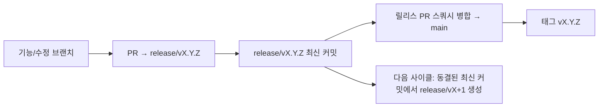

# Branching & Release Model (한국어)

🌐 **Languages:** 🇺🇸 [English](../../../../ops/BRANCHING_MODEL.md) · 🇪🇹 [am](../../../am/docs/ops/BRANCHING_MODEL.md) · 🇸🇦 [ar](../../../ar/docs/ops/BRANCHING_MODEL.md) · 🇦🇿 [az](../../../az/docs/ops/BRANCHING_MODEL.md) · 🇧🇬 [bg](../../../bg/docs/ops/BRANCHING_MODEL.md) · 🇧🇩 [bn](../../../bn/docs/ops/BRANCHING_MODEL.md) · 🇧🇦 [bs](../../../bs/docs/ops/BRANCHING_MODEL.md) · 🇨🇿 [cs](../../../cs/docs/ops/BRANCHING_MODEL.md) · 🇩🇰 [da](../../../da/docs/ops/BRANCHING_MODEL.md) · 🇩🇪 [de](../../../de/docs/ops/BRANCHING_MODEL.md) · 🇬🇷 [el](../../../el/docs/ops/BRANCHING_MODEL.md) · 🇪🇸 [es](../../../es/docs/ops/BRANCHING_MODEL.md) · 🇪🇪 [et](../../../et/docs/ops/BRANCHING_MODEL.md) · 🇮🇷 [fa](../../../fa/docs/ops/BRANCHING_MODEL.md) · 🇫🇮 [fi](../../../fi/docs/ops/BRANCHING_MODEL.md) · 🇫🇷 [fr](../../../fr/docs/ops/BRANCHING_MODEL.md) · 🇮🇪 [ga](../../../ga/docs/ops/BRANCHING_MODEL.md) · 🇮🇳 [gu](../../../gu/docs/ops/BRANCHING_MODEL.md) · 🇳🇬 [ha](../../../ha/docs/ops/BRANCHING_MODEL.md) · 🇮🇱 [he](../../../he/docs/ops/BRANCHING_MODEL.md) · 🇮🇳 [hi](../../../hi/docs/ops/BRANCHING_MODEL.md) · 🇭🇷 [hr](../../../hr/docs/ops/BRANCHING_MODEL.md) · 🇭🇺 [hu](../../../hu/docs/ops/BRANCHING_MODEL.md) · 🇦🇲 [hy](../../../hy/docs/ops/BRANCHING_MODEL.md) · 🇮🇩 [id](../../../id/docs/ops/BRANCHING_MODEL.md) · 🇳🇬 [ig](../../../ig/docs/ops/BRANCHING_MODEL.md) · 🇮🇹 [it](../../../it/docs/ops/BRANCHING_MODEL.md) · 🇯🇵 [ja](../../../ja/docs/ops/BRANCHING_MODEL.md) · 🇬🇪 [ka](../../../ka/docs/ops/BRANCHING_MODEL.md) · 🇰🇭 [km](../../../km/docs/ops/BRANCHING_MODEL.md) · 🇮🇳 [kn](../../../kn/docs/ops/BRANCHING_MODEL.md) · 🇱🇹 [lt](../../../lt/docs/ops/BRANCHING_MODEL.md) · 🇱🇻 [lv](../../../lv/docs/ops/BRANCHING_MODEL.md) · 🇮🇳 [ml](../../../ml/docs/ops/BRANCHING_MODEL.md) · 🇮🇳 [mr](../../../mr/docs/ops/BRANCHING_MODEL.md) · 🇲🇾 [ms](../../../ms/docs/ops/BRANCHING_MODEL.md) · 🇲🇹 [mt](../../../mt/docs/ops/BRANCHING_MODEL.md) · 🇲🇲 [my](../../../my/docs/ops/BRANCHING_MODEL.md) · 🇳🇵 [ne](../../../ne/docs/ops/BRANCHING_MODEL.md) · 🇳🇱 [nl](../../../nl/docs/ops/BRANCHING_MODEL.md) · 🇳🇴 [no](../../../no/docs/ops/BRANCHING_MODEL.md) · 🇮🇳 [or](../../../or/docs/ops/BRANCHING_MODEL.md) · 🇮🇳 [pa](../../../pa/docs/ops/BRANCHING_MODEL.md) · 🇵🇭 [phi](../../../phi/docs/ops/BRANCHING_MODEL.md) · 🇵🇱 [pl](../../../pl/docs/ops/BRANCHING_MODEL.md) · 🇵🇹 [pt](../../../pt/docs/ops/BRANCHING_MODEL.md) · 🇧🇷 [pt-BR](../../../pt-BR/docs/ops/BRANCHING_MODEL.md) · 🇷🇴 [ro](../../../ro/docs/ops/BRANCHING_MODEL.md) · 🇷🇺 [ru](../../../ru/docs/ops/BRANCHING_MODEL.md) · 🇱🇰 [si](../../../si/docs/ops/BRANCHING_MODEL.md) · 🇸🇰 [sk](../../../sk/docs/ops/BRANCHING_MODEL.md) · 🇸🇮 [sl](../../../sl/docs/ops/BRANCHING_MODEL.md) · 🇷🇸 [sr](../../../sr/docs/ops/BRANCHING_MODEL.md) · 🇸🇪 [sv](../../../sv/docs/ops/BRANCHING_MODEL.md) · 🇰🇪 [sw](../../../sw/docs/ops/BRANCHING_MODEL.md) · 🇮🇳 [ta](../../../ta/docs/ops/BRANCHING_MODEL.md) · 🇮🇳 [te](../../../te/docs/ops/BRANCHING_MODEL.md) · 🇹🇭 [th](../../../th/docs/ops/BRANCHING_MODEL.md) · 🇹🇷 [tr](../../../tr/docs/ops/BRANCHING_MODEL.md) · 🇺🇦 [uk-UA](../../../uk-UA/docs/ops/BRANCHING_MODEL.md) · 🇵🇰 [ur](../../../ur/docs/ops/BRANCHING_MODEL.md) · 🇺🇿 [uz](../../../uz/docs/ops/BRANCHING_MODEL.md) · 🇻🇳 [vi](../../../vi/docs/ops/BRANCHING_MODEL.md) · 🇳🇬 [yo](../../../yo/docs/ops/BRANCHING_MODEL.md) · 🇨🇳 [zh-CN](../../../zh-CN/docs/ops/BRANCHING_MODEL.md) · 🇹🇼 [zh-TW](../../../zh-TW/docs/ops/BRANCHING_MODEL.md)

---

OmniRoute는 **병렬 사이클** 릴리스 모델을 사용합니다. 활성 사이클에는 전용 `release/vX.Y.Z`
브랜치를, 배포된 라인에는 `main`을 사용하며, 해당 사이클이 출시될 때 변경 불가능한
`vX.Y.Z` 태그를 생성합니다. 커밋이 `release/*`와 `main`에 _모두_ 반영되는 것은
정상이며, 실수가 아닙니다.

메인테이너를 위한 자세한 내용은 `CLAUDE.md`(Hard Rule #21)와
[RELEASE_CHECKLIST.md](./RELEASE_CHECKLIST.md)에 있습니다. 이 페이지는 공개적으로
기여자에게 제공되는 요약입니다.

## 한눈에 보기

| Ref              | 역할                                                                              |
| ---------------- | --------------------------------------------------------------------------------- |
| `release/vX.Y.Z` | **활성 사이클** — 해당 버전의 일상적인 개발 및 PR 병합                            |
| `main`           | **배포된 라인** — 릴리스 출시 시 스쿼시 병합을 통해 사이클을 반영                 |
| `vX.Y.Z` (태그)  | **출시 마커** — 릴리스 시점에 생성되는, 변경 불가능한 “실제로 출시된 내용” 포인터 |



## PR은 어느 브랜치를 대상으로 해야 하나요?

**`main`이 아니라 활성 `release/vX.Y.Z` 브랜치를 대상으로 지정하세요.**

1. 열려 있는 `release/v*` 브랜치 중 가장 높은 버전을 찾습니다(작성 시점의 예:
   `release/v3.8.49`).
2. 해당 최신 커밋에서 브랜치를 생성합니다(`git fetch` + 체크아웃 / 해당 브랜치로 리베이스).
3. **base = 해당 `release/vX.Y.Z`**로 설정하여 PR을 엽니다.

`main`은 일상적인 통합 브랜치가 아닙니다. `main`을 대상으로 열린 PR은
일반적으로 병합 전에 대상 브랜치를 변경해야 합니다.

## 릴리스 동결(병렬 사이클)

릴리스를 조정하는 동안 `release-freeze` 레이블이 지정된 마커 이슈가
열립니다. 그렇다고 **개발이 중단되지는 않습니다**.

- 동결된 `release/vX.Y.Z`는 해당 출시를 담당하는 릴리스 캡틴이 관리합니다.
- 기여자가 계속 작업을 반영할 수 있도록 다음 사이클의 `release/vX+1`은 동결된 최신 커밋에서 생성됩니다.
- 여전히 동결된 브랜치를 대상으로 하는 열린 PR은 활성 상태인(가장 높은 버전의)
  `release/v*` 브랜치로 **대상을 변경해야 합니다**.

원하는 브랜치가 병합 가능한 상태라고 판단하기 전에 열려 있는 동결 이슈가 있는지 확인하세요.

```bash
gh issue list --repo diegosouzapw/OmniRoute --label release-freeze --state open
```

병합 메커니즘(소유자의 `queue` 레이블 → Mergify)은
[MERGE_TRAIN.md](./MERGE_TRAIN.md)에 문서화되어 있습니다.

## 브랜치와 태그을 모두 사용하는 이유는 무엇인가요?

| 아티팩트         | 수명             | 목적                                                                 |
| ---------------- | ---------------- | -------------------------------------------------------------------- |
| `release/vX.Y.Z` | 진행 중인 사이클 | 검토된 PR을 모으고, CI 통과 상태를 유지하며, PR의 기반 브랜치로 사용 |
| 태그 `vX.Y.Z`    | 영구             | npm / GitHub Releases에 출시된 정확한 결과물을 표시                  |

브랜치는 작업장이며, 태그는 밀봉된 패키지입니다. `main`으로 스쿼시 병합한 후에는 이전
릴리스 PR이 완료되기를 기다리지 않고 다음 사이클이 `release/vX+1`에서 계속됩니다.

## 관련 문서

- [CONTRIBUTING.md](../../CONTRIBUTING.md) — 설정, 테스트, PR 체크리스트
- [RELEASE_CHECKLIST.md](./RELEASE_CHECKLIST.md) — 출시 전 검증
- [MERGE_TRAIN.md](./MERGE_TRAIN.md) — 병합 큐 및 대체 병합 트레인
- [RELEASE_GREEN.md](./RELEASE_GREEN.md) — 릴리스 최신 커밋을 정상 상태로 유지하는 방법
