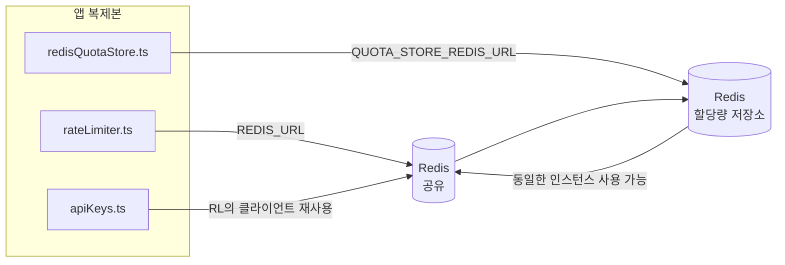

# Redis Production Configuration Guide (한국어)

🌐 **Languages:** 🇺🇸 [English](../../../../ops/REDIS_PRODUCTION_CONFIG.md) · 🇪🇹 [am](../../../am/docs/ops/REDIS_PRODUCTION_CONFIG.md) · 🇸🇦 [ar](../../../ar/docs/ops/REDIS_PRODUCTION_CONFIG.md) · 🇦🇿 [az](../../../az/docs/ops/REDIS_PRODUCTION_CONFIG.md) · 🇧🇬 [bg](../../../bg/docs/ops/REDIS_PRODUCTION_CONFIG.md) · 🇧🇩 [bn](../../../bn/docs/ops/REDIS_PRODUCTION_CONFIG.md) · 🇨🇿 [cs](../../../cs/docs/ops/REDIS_PRODUCTION_CONFIG.md) · 🇩🇰 [da](../../../da/docs/ops/REDIS_PRODUCTION_CONFIG.md) · 🇩🇪 [de](../../../de/docs/ops/REDIS_PRODUCTION_CONFIG.md) · 🇬🇷 [el](../../../el/docs/ops/REDIS_PRODUCTION_CONFIG.md) · 🇪🇸 [es](../../../es/docs/ops/REDIS_PRODUCTION_CONFIG.md) · 🇪🇪 [et](../../../et/docs/ops/REDIS_PRODUCTION_CONFIG.md) · 🇮🇷 [fa](../../../fa/docs/ops/REDIS_PRODUCTION_CONFIG.md) · 🇫🇮 [fi](../../../fi/docs/ops/REDIS_PRODUCTION_CONFIG.md) · 🇫🇷 [fr](../../../fr/docs/ops/REDIS_PRODUCTION_CONFIG.md) · 🇮🇪 [ga](../../../ga/docs/ops/REDIS_PRODUCTION_CONFIG.md) · 🇮🇳 [gu](../../../gu/docs/ops/REDIS_PRODUCTION_CONFIG.md) · 🇳🇬 [ha](../../../ha/docs/ops/REDIS_PRODUCTION_CONFIG.md) · 🇮🇱 [he](../../../he/docs/ops/REDIS_PRODUCTION_CONFIG.md) · 🇮🇳 [hi](../../../hi/docs/ops/REDIS_PRODUCTION_CONFIG.md) · 🇭🇷 [hr](../../../hr/docs/ops/REDIS_PRODUCTION_CONFIG.md) · 🇭🇺 [hu](../../../hu/docs/ops/REDIS_PRODUCTION_CONFIG.md) · 🇦🇲 [hy](../../../hy/docs/ops/REDIS_PRODUCTION_CONFIG.md) · 🇮🇩 [id](../../../id/docs/ops/REDIS_PRODUCTION_CONFIG.md) · 🇳🇬 [ig](../../../ig/docs/ops/REDIS_PRODUCTION_CONFIG.md) · 🇮🇹 [it](../../../it/docs/ops/REDIS_PRODUCTION_CONFIG.md) · 🇯🇵 [ja](../../../ja/docs/ops/REDIS_PRODUCTION_CONFIG.md) · 🇬🇪 [ka](../../../ka/docs/ops/REDIS_PRODUCTION_CONFIG.md) · 🇰🇭 [km](../../../km/docs/ops/REDIS_PRODUCTION_CONFIG.md) · 🇮🇳 [kn](../../../kn/docs/ops/REDIS_PRODUCTION_CONFIG.md) · 🇱🇹 [lt](../../../lt/docs/ops/REDIS_PRODUCTION_CONFIG.md) · 🇱🇻 [lv](../../../lv/docs/ops/REDIS_PRODUCTION_CONFIG.md) · 🇮🇳 [ml](../../../ml/docs/ops/REDIS_PRODUCTION_CONFIG.md) · 🇮🇳 [mr](../../../mr/docs/ops/REDIS_PRODUCTION_CONFIG.md) · 🇲🇾 [ms](../../../ms/docs/ops/REDIS_PRODUCTION_CONFIG.md) · 🇲🇹 [mt](../../../mt/docs/ops/REDIS_PRODUCTION_CONFIG.md) · 🇲🇲 [my](../../../my/docs/ops/REDIS_PRODUCTION_CONFIG.md) · 🇳🇵 [ne](../../../ne/docs/ops/REDIS_PRODUCTION_CONFIG.md) · 🇳🇱 [nl](../../../nl/docs/ops/REDIS_PRODUCTION_CONFIG.md) · 🇳🇴 [no](../../../no/docs/ops/REDIS_PRODUCTION_CONFIG.md) · 🇮🇳 [or](../../../or/docs/ops/REDIS_PRODUCTION_CONFIG.md) · 🇮🇳 [pa](../../../pa/docs/ops/REDIS_PRODUCTION_CONFIG.md) · 🇵🇭 [phi](../../../phi/docs/ops/REDIS_PRODUCTION_CONFIG.md) · 🇵🇱 [pl](../../../pl/docs/ops/REDIS_PRODUCTION_CONFIG.md) · 🇵🇹 [pt](../../../pt/docs/ops/REDIS_PRODUCTION_CONFIG.md) · 🇧🇷 [pt-BR](../../../pt-BR/docs/ops/REDIS_PRODUCTION_CONFIG.md) · 🇷🇴 [ro](../../../ro/docs/ops/REDIS_PRODUCTION_CONFIG.md) · 🇷🇺 [ru](../../../ru/docs/ops/REDIS_PRODUCTION_CONFIG.md) · 🇱🇰 [si](../../../si/docs/ops/REDIS_PRODUCTION_CONFIG.md) · 🇸🇰 [sk](../../../sk/docs/ops/REDIS_PRODUCTION_CONFIG.md) · 🇸🇮 [sl](../../../sl/docs/ops/REDIS_PRODUCTION_CONFIG.md) · 🇷🇸 [sr](../../../sr/docs/ops/REDIS_PRODUCTION_CONFIG.md) · 🇸🇪 [sv](../../../sv/docs/ops/REDIS_PRODUCTION_CONFIG.md) · 🇰🇪 [sw](../../../sw/docs/ops/REDIS_PRODUCTION_CONFIG.md) · 🇮🇳 [ta](../../../ta/docs/ops/REDIS_PRODUCTION_CONFIG.md) · 🇮🇳 [te](../../../te/docs/ops/REDIS_PRODUCTION_CONFIG.md) · 🇹🇭 [th](../../../th/docs/ops/REDIS_PRODUCTION_CONFIG.md) · 🇹🇷 [tr](../../../tr/docs/ops/REDIS_PRODUCTION_CONFIG.md) · 🇺🇦 [uk-UA](../../../uk-UA/docs/ops/REDIS_PRODUCTION_CONFIG.md) · 🇵🇰 [ur](../../../ur/docs/ops/REDIS_PRODUCTION_CONFIG.md) · 🇺🇿 [uz](../../../uz/docs/ops/REDIS_PRODUCTION_CONFIG.md) · 🇻🇳 [vi](../../../vi/docs/ops/REDIS_PRODUCTION_CONFIG.md) · 🇳🇬 [yo](../../../yo/docs/ops/REDIS_PRODUCTION_CONFIG.md) · 🇨🇳 [zh-CN](../../../zh-CN/docs/ops/REDIS_PRODUCTION_CONFIG.md) · 🇹🇼 [zh-TW](../../../zh-TW/docs/ops/REDIS_PRODUCTION_CONFIG.md)

---

## 개요

Redis는 OmniRoute의 **선택적인 소프트 종속성**입니다. Redis를 사용할 수 없는 경우에도 애플리케이션은 정상적으로 성능을 낮춰 동작합니다(인메모리 대체 수단 사용). 프로덕션 환경에서는 Redis를 튜닝하여 다음 네 가지 개별 워크로드의 지연 시간을 줄일 수 있습니다.

| 워크로드           | 드라이버                      | 클라이언트 팩토리                                   | 키 패턴                                      |
| ------------------ | ----------------------------- | --------------------------------------------------- | -------------------------------------------- |
| 속도 제한          | `rateLimiter.ts`              | `getRedisClient()` — 지연 생성되는 `ioredis` 싱글턴 | `<prefix>rl:*` Lua 원자적 속도 제한 윈도우   |
| 인증 캐시          | `apiKeys.ts`                  | `rateLimiter`의 클라이언트 재사용                   | TTL이 적용된 `<prefix>auth:api_key:<sha256>` |
| 할당량 저장소      | `redisQuotaStore.ts`          | 별도의 `getRedisClient(url)` 싱글턴                 | 인스턴스별로 구성 가능한 `<prefix>quota:*`   |
| 워밍업 회로 차단기 | `redisCircuitBreakerStore.ts` | `circuitBreakerFactory.ts`의 별도 클라이언트        | `<prefix>warmup:cb:<connectionId>`           |

OmniRoute가 단일 Redis 인스턴스(예: `127.0.0.1:6379`)에서 다른 앱과 공존할 수 있도록 네 워크로드 모두 하나의 네임스페이스 접두사를 공유합니다. [키 네임스페이스](#key-namespacing)를 참조하세요.

---

## 현재 구성(코드 기본값)

| 설정                              | 값                                                   | 위치                                                                                  |
| --------------------------------- | ---------------------------------------------------- | ------------------------------------------------------------------------------------- |
| `REDIS_URL` 환경 변수             | `redis://redis:6379`(compose), 선택 사항             | `rateLimiter.ts:5`, `.env.example`                                                    |
| `REDIS_KEY_PREFIX` 환경 변수      | `omniroute:`(기본값)                                 | `rateLimiter.ts`, `redisQuotaStore.ts`, `redisCircuitBreakerStore.ts`, `.env.example` |
| `QUOTA_STORE_REDIS_URL` 환경 변수 | 별도 설정이며 `REDIS_URL`과 다를 수 있음             | `quota/storeFactory.ts`                                                               |
| `QUOTA_STORE_DRIVER`              | `"sqlite"`(기본값), 선택적으로 `"redis"`             | `quota/storeFactory.ts`                                                               |
| ioredis `maxRetriesPerRequest`    | `3`                                                  | `rateLimiter.ts` 클라이언트 생성                                                      |
| `enableReadyCheck`                | 설정되지 않음(ioredis 기본값: `true`)                | —                                                                                     |
| `lazyConnect`                     | 설정되지 않음(ioredis 기본값: `false`)               | —                                                                                     |
| `retryStrategy`                   | 설정되지 않음(ioredis 기본값: 200ms 기반, 지수 증가) | —                                                                                     |
| TLS / 비밀번호 / DB 인덱스        | **구성되지 않음**                                    | —                                                                                     |
| Sentinel / Cluster                | **구성되지 않음** — 독립 실행형 단일 노드만 지원     | —                                                                                     |

---

## 키 네임스페이스

OmniRoute는 호스트에서 실행되는 다른 서비스와 Redis 인스턴스를 공유합니다. 네임스페이스가 없으면 `auth:api_key:<sha256>` 또는 `rl:*` 같은 키가 동일한 Redis를 사용하는 다른 애플리케이션의 키와 충돌할 수 있습니다(이 인스턴스는 다른 서비스와 함께 `127.0.0.1:6379`에서 Redis를 실행합니다).

**모든** OmniRoute 키에 접두사를 추가하려면 `REDIS_KEY_PREFIX`를 비어 있지 않은 문자열로 설정하세요.

```bash
# .env — 모든 OmniRoute 키가 omniroute:rl:*, omniroute:auth:*, omniroute:quota:*, omniroute:warmup:cb:* 형식이 됩니다.
REDIS_KEY_PREFIX=omniroute:
```

- **기본값:** `omniroute:`(`REDIS_KEY_PREFIX`가 설정되지 않았거나 비어 있을 때 적용).
- **적용 대상:** 속도 제한기 + 인증 캐시(`keyPrefix`를 통해 공유 `ioredis` 클라이언트 사용), 할당량 저장소(`KEY_PREFIX = "${REDIS_KEY_PREFIX}quota"`), 워밍업 회로 차단기(`KEY_PREFIX = "${REDIS_KEY_PREFIX}warmup:cb:"`).
- Redis에 키가 이미 존재할 때 **접두사를 변경하면** 기존 키는 고립됩니다(TTL / LRU를 통해 만료됨). 안전하게 변경할 수 있으며 마이그레이션은 필요하지 않습니다. 단, 금지된 것으로 표시된 연결의 워밍업 회로 차단기 키는 예외입니다. 이 키는 TTL 없이 영구 저장되므로 `redis-cli --scan --pattern '<old-prefix>warmup:cb:*'`로 남은 키를 나열하고 삭제하세요.
- **ioredis `keyPrefix`**는 쓰기 시 자동으로 접두사를 추가하고 읽기 시에는 접두사를 제거하므로 애플리케이션 코드에는 접두사가 표시되지 않습니다.

---

## 권장 프로덕션 튜닝

### 1. 연결 풀 / 클라이언트 옵션(ioredis `Redis` 생성자)

현재 코드는 사용자 지정 옵션 없이 단일 `new Redis(url)`를 생성합니다. 프로덕션
다중 레플리카 배포에서는 코드에 클라이언트 팩토리를 전달하거나 `getRedisClient()`를 래핑하세요.

```typescript
const redis = new Redis(REDIS_URL, {
  maxRetriesPerRequest: null, // 재시도 제한 없음. retryStrategy가 결정하도록 함
  enableReadyCheck: true, // 호출을 수락하기 전에 서버가 준비되었는지 확인
  lazyConnect: true, // 생성 시 연결하지 않고 첫 번째 호출까지 대기
  retryStrategy: (times) => {
    if (times > 10) return null; // 10회 재시도 후 포기 → 나중에 다시 연결
    return Math.min(times * 200, 5000); // 200ms, 400ms, …, 최대 5s
  },
  enableAutoPipelining: true, // 동시 명령을 하나의 TCP 쓰기로 병합
  keepAlive: 10000, // 10s마다 TCP 연결 유지
});
```

**주요 트레이드오프:**

- `maxRetriesPerRequest: null` + `retryStrategy` — 일시적인 Redis 재시작으로 인해
  모든 요청이 즉시 실패하지 않도록 하므로 프로덕션 환경에 적합합니다. `checkRateLimit()`의
  인메모리 폴백이 실패 경로를 처리합니다.
- `lazyConnect: true` — 서버가 연결 수락을 시작하기 전에 Redis가 실행 중이어야 한다는
  시작 시점의 의존성을 방지합니다.
- `enableAutoPipelining: true` — 동시 속도 제한 검사에서 왕복 횟수를 줄입니다.
  단일 연결에서 50 RPS를 초과할 때 유용합니다.

### 2. Redis 서버 구성(`redis.conf`)

```
# 메모리
maxmemory 80%                        # OS 페이지 캐시를 위한 공간 확보
maxmemory-policy allkeys-lru         # 메모리 부족 시 오래된 인증 캐시 항목 제거

# 영속성(선택 사항 — OmniRoute는 영속성 없이도 충돌로부터 안전함)
save 300 1                           # 키가 1개 이상 변경된 경우 최소 5분마다 스냅샷 생성
appendonly no                        # AOF는 불필요함. 데이터는 재생성 가능
appendfsync no                       # fsync 오버헤드 없음(RDB로 충분함)

# 네트워킹
timeout 0                            # 유휴 연결을 끊지 않음
tcp-keepalive 300                    # 5분 연결 유지
tcp-backlog 511                      # 버스트 부하를 위한 연결 백로그

# 성능
hz 10                                # 기본값. 지연 시간에 민감한 경우 100
activedefrag yes                     # 조각화가 10%를 초과하면 자동 조각 모음
```

**`maxmemory-policy allkeys-lru`의 트레이드오프:** 메모리가 부족할 때 인증 캐시 항목이
제거될 수 있습니다. 이는 안전합니다. `setCachedApiKey`는 캐시 미스 발생 시 항상 다시
채우며, SQLite 폴백이 최종 데이터 원본입니다. 속도 제한기 Lua 스크립트는 설계상
수명이 짧은 작은 키를 생성합니다.

### 3. Docker Compose 설정

프로덕션 compose(`docker-compose.prod.yml`)는 `redis:8.6.2-alpine`을 사용합니다. 다음을 추가하세요.

```yaml
redis:
  image: redis:8.6.2-alpine
  command:
    [
      "redis-server",
      "--maxmemory",
      "512mb",
      "--maxmemory-policy",
      "allkeys-lru",
      "--activedefrag",
      "yes",
      "--save",
      "300 1",
    ]
  healthcheck:
    test: ["CMD", "redis-cli", "ping"]
    interval: 10s
    timeout: 3s
    retries: 3
    start_period: 5s
```

### 4. 다중 인스턴스 / 확장 고려 사항

**모든 레플리카에 단일 Redis 사용** — 속도 제한기 Lua 스크립트는 하나의 권위 있는
키 공간에 의존합니다. 레플리카별로 여러 Redis 인스턴스를 사용하면 원자성이 사라지고
허용량이 두 배가 됩니다. 모든 애플리케이션 레플리카에 단일 Redis 또는 장애 조치 기능이
있는 Redis Sentinel 클러스터를 사용하세요.

**연결 수:** 각 애플리케이션 레플리카는 Redis에 **2개의 TCP 연결**을 엽니다
(속도 제한기 클라이언트 + 할당량 저장소 클라이언트). 레플리카 10개에서는 → 20개 연결이며,
기본 Redis 인스턴스의 연결 상한인 10k보다 훨씬 적습니다.

### 5. 모니터링

상태 확인 엔드포인트를 통해 노출하세요.

```typescript
// src/app/api/monitoring/health/route.ts는 이미 rateLimiter 함수를 호출함
// Redis 전용 검사 추가:
//   1. ioredis .ping()을 통한 PING 지연 시간
//   2. INFO memory를 통한 메모리 사용량
//   3. INFO clients를 통한 연결 수
//   4. maxmemory-policy의 적중률(evicted_keys / keyspace_hits)
```

모니터링할 주요 메트릭:

- **초당 제거된 키** — 지속적으로 0이 아니면 `maxmemory`를 늘리세요
- **차단된 클라이언트** — 0이 아니면 느린 Lua 스크립트 또는 높은 경합을 의미할 수 있습니다
- **거부된 연결** — 연결 제한에 도달했음을 의미하며, 연결이 20개인 경우에는 드뭅니다

---

## 아키텍처 다이어그램



---

## 참고 자료

| 파일                               | 용도                                                              |
| ---------------------------------- | ----------------------------------------------------------------- |
| `src/shared/utils/rateLimiter.ts`  | 기본 Redis 클라이언트, Lua 요청 속도 제한 스크립트, 인메모리 폴백 |
| `src/lib/db/apiKeys.ts`            | 인증 캐시 — Redis→SQLite 폴백                                     |
| `src/lib/quota/redisQuotaStore.ts` | 선택적 할당량 저장소를 위한 별도의 Redis 클라이언트               |
| `src/lib/quota/storeFactory.ts`    | `sqlite`와 `redis` 할당량 드라이버 간 전환                        |
| `docker-compose.prod.yml`          | 프로덕션 Redis 컨테이너(이미지 `redis:8.6.2-alpine`)              |
| `.env.example`                     | Redis 환경 변수 문서                                              |
| `src/app/api/local/redis/`         | 개발 컨테이너 오케스트레이션용 API 라우트                         |
| `bin/cli/commands/redis.mjs`       | 개발 컨테이너 오케스트레이션용 CLI 명령어                         |
