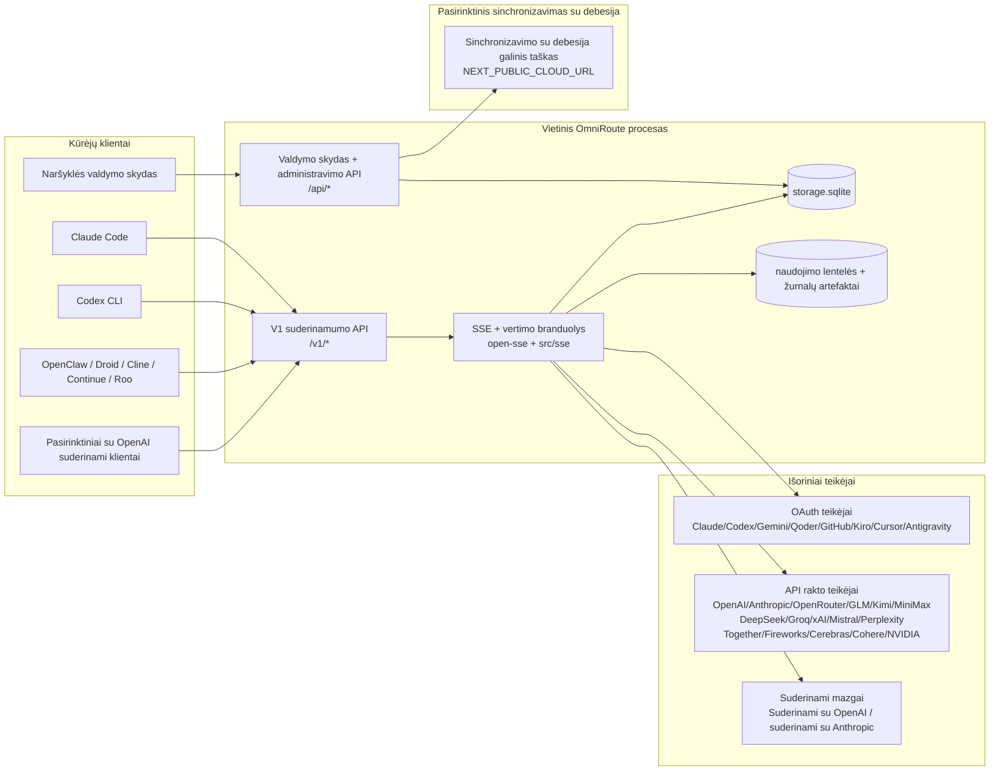
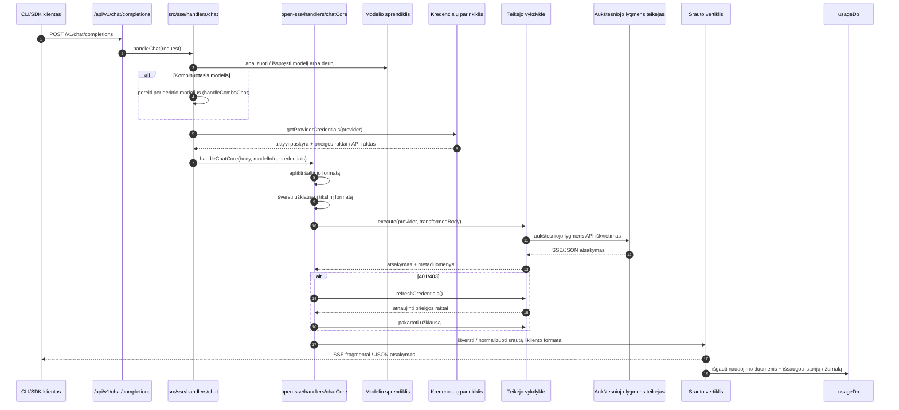
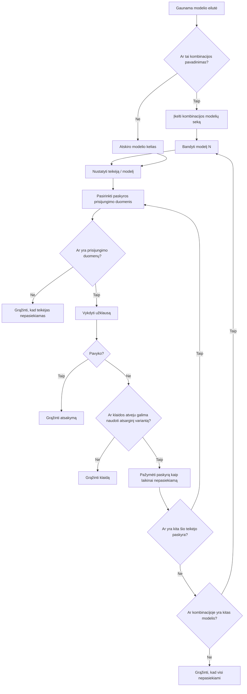
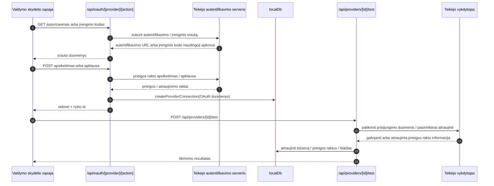
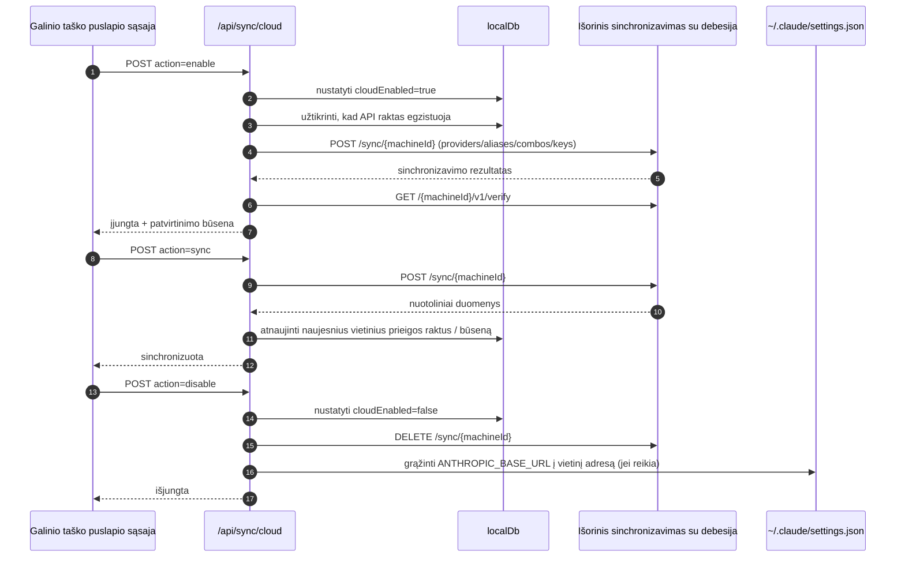
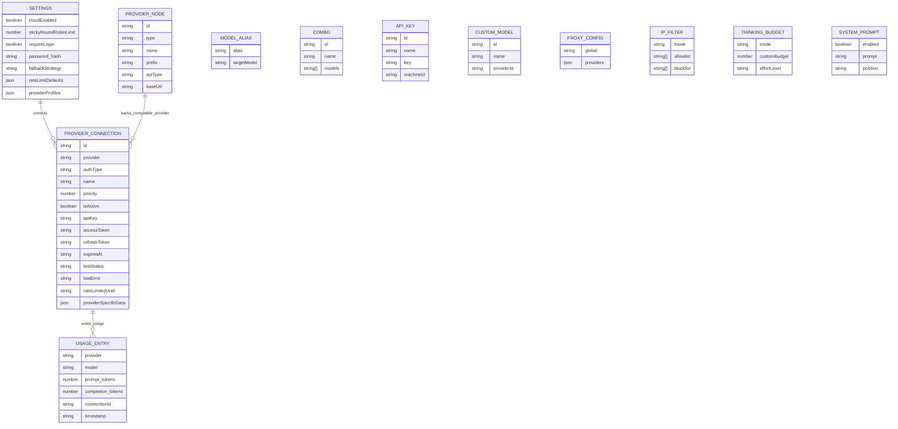
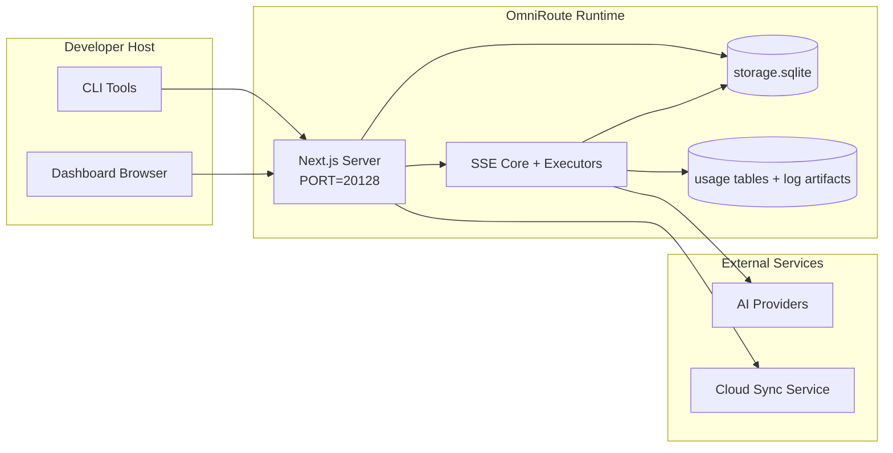

# ARCHITECTURE (Lietuvių)

🌐 **Languages:** 🇺🇸 [English](../../../../architecture/ARCHITECTURE.md) · 🇸🇦 [ar](../../../ar/docs/architecture/ARCHITECTURE.md) · 🇦🇿 [az](../../../az/docs/architecture/ARCHITECTURE.md) · 🇧🇬 [bg](../../../bg/docs/architecture/ARCHITECTURE.md) · 🇧🇩 [bn](../../../bn/docs/architecture/ARCHITECTURE.md) · 🇨🇿 [cs](../../../cs/docs/architecture/ARCHITECTURE.md) · 🇩🇰 [da](../../../da/docs/architecture/ARCHITECTURE.md) · 🇩🇪 [de](../../../de/docs/architecture/ARCHITECTURE.md) · 🇬🇷 [el](../../../el/docs/architecture/ARCHITECTURE.md) · 🇪🇸 [es](../../../es/docs/architecture/ARCHITECTURE.md) · 🇪🇪 [et](../../../et/docs/architecture/ARCHITECTURE.md) · 🇮🇷 [fa](../../../fa/docs/architecture/ARCHITECTURE.md) · 🇫🇮 [fi](../../../fi/docs/architecture/ARCHITECTURE.md) · 🇫🇷 [fr](../../../fr/docs/architecture/ARCHITECTURE.md) · 🇮🇪 [ga](../../../ga/docs/architecture/ARCHITECTURE.md) · 🇮🇳 [gu](../../../gu/docs/architecture/ARCHITECTURE.md) · 🇮🇱 [he](../../../he/docs/architecture/ARCHITECTURE.md) · 🇮🇳 [hi](../../../hi/docs/architecture/ARCHITECTURE.md) · 🇭🇷 [hr](../../../hr/docs/architecture/ARCHITECTURE.md) · 🇭🇺 [hu](../../../hu/docs/architecture/ARCHITECTURE.md) · 🇮🇩 [id](../../../id/docs/architecture/ARCHITECTURE.md) · 🇮🇹 [it](../../../it/docs/architecture/ARCHITECTURE.md) · 🇯🇵 [ja](../../../ja/docs/architecture/ARCHITECTURE.md) · 🇰🇷 [ko](../../../ko/docs/architecture/ARCHITECTURE.md) · 🇱🇻 [lv](../../../lv/docs/architecture/ARCHITECTURE.md) · 🇮🇳 [mr](../../../mr/docs/architecture/ARCHITECTURE.md) · 🇲🇾 [ms](../../../ms/docs/architecture/ARCHITECTURE.md) · 🇲🇹 [mt](../../../mt/docs/architecture/ARCHITECTURE.md) · 🇳🇱 [nl](../../../nl/docs/architecture/ARCHITECTURE.md) · 🇳🇴 [no](../../../no/docs/architecture/ARCHITECTURE.md) · 🇵🇭 [phi](../../../phi/docs/architecture/ARCHITECTURE.md) · 🇵🇱 [pl](../../../pl/docs/architecture/ARCHITECTURE.md) · 🇵🇹 [pt](../../../pt/docs/architecture/ARCHITECTURE.md) · 🇧🇷 [pt-BR](../../../pt-BR/docs/architecture/ARCHITECTURE.md) · 🇷🇴 [ro](../../../ro/docs/architecture/ARCHITECTURE.md) · 🇷🇺 [ru](../../../ru/docs/architecture/ARCHITECTURE.md) · 🇸🇰 [sk](../../../sk/docs/architecture/ARCHITECTURE.md) · 🇸🇮 [sl](../../../sl/docs/architecture/ARCHITECTURE.md) · 🇷🇸 [sr](../../../sr/docs/architecture/ARCHITECTURE.md) · 🇸🇪 [sv](../../../sv/docs/architecture/ARCHITECTURE.md) · 🇰🇪 [sw](../../../sw/docs/architecture/ARCHITECTURE.md) · 🇮🇳 [ta](../../../ta/docs/architecture/ARCHITECTURE.md) · 🇮🇳 [te](../../../te/docs/architecture/ARCHITECTURE.md) · 🇹🇭 [th](../../../th/docs/architecture/ARCHITECTURE.md) · 🇹🇷 [tr](../../../tr/docs/architecture/ARCHITECTURE.md) · 🇺🇦 [uk-UA](../../../uk-UA/docs/architecture/ARCHITECTURE.md) · 🇵🇰 [ur](../../../ur/docs/architecture/ARCHITECTURE.md) · 🇻🇳 [vi](../../../vi/docs/architecture/ARCHITECTURE.md) · 🇨🇳 [zh-CN](../../../zh-CN/docs/architecture/ARCHITECTURE.md) · 🇹🇼 [zh-TW](../../../zh-TW/docs/architecture/ARCHITECTURE.md)

---

---

title: „OmniRoute architektūra“
version: 3.8.40
lastUpdated: 2026-06-28
---

# OmniRoute architektūra

🌐 **Languages:** 🇺🇸 [English](../../../../architecture/ARCHITECTURE.md) · 🇸🇦 [ar](../../../ar/docs/architecture/ARCHITECTURE.md) · 🇦🇿 [az](../../../az/docs/architecture/ARCHITECTURE.md) · 🇧🇬 [bg](../../../bg/docs/architecture/ARCHITECTURE.md) · 🇧🇩 [bn](../../../bn/docs/architecture/ARCHITECTURE.md) · 🇨🇿 [cs](../../../cs/docs/architecture/ARCHITECTURE.md) · 🇩🇰 [da](../../../da/docs/architecture/ARCHITECTURE.md) · 🇩🇪 [de](../../../de/docs/architecture/ARCHITECTURE.md) · 🇬🇷 [el](../../../el/docs/architecture/ARCHITECTURE.md) · 🇪🇸 [es](../../../es/docs/architecture/ARCHITECTURE.md) · 🇪🇪 [et](../../../et/docs/architecture/ARCHITECTURE.md) · 🇮🇷 [fa](../../../fa/docs/architecture/ARCHITECTURE.md) · 🇫🇮 [fi](../../../fi/docs/architecture/ARCHITECTURE.md) · 🇫🇷 [fr](../../../fr/docs/architecture/ARCHITECTURE.md) · 🇮🇪 [ga](../../../ga/docs/architecture/ARCHITECTURE.md) · 🇮🇳 [gu](../../../gu/docs/architecture/ARCHITECTURE.md) · 🇮🇱 [he](../../../he/docs/architecture/ARCHITECTURE.md) · 🇮🇳 [hi](../../../hi/docs/architecture/ARCHITECTURE.md) · 🇭🇷 [hr](../../../hr/docs/architecture/ARCHITECTURE.md) · 🇭🇺 [hu](../../../hu/docs/architecture/ARCHITECTURE.md) · 🇮🇩 [id](../../../id/docs/architecture/ARCHITECTURE.md) · 🇮🇹 [it](../../../it/docs/architecture/ARCHITECTURE.md) · 🇯🇵 [ja](../../../ja/docs/architecture/ARCHITECTURE.md) · 🇰🇷 [ko](../../../ko/docs/architecture/ARCHITECTURE.md) · 🇱🇻 [lv](../../../lv/docs/architecture/ARCHITECTURE.md) · 🇮🇳 [mr](../../../mr/docs/architecture/ARCHITECTURE.md) · 🇲🇾 [ms](../../../ms/docs/architecture/ARCHITECTURE.md) · 🇲🇹 [mt](../../../mt/docs/architecture/ARCHITECTURE.md) · 🇳🇱 [nl](../../../nl/docs/architecture/ARCHITECTURE.md) · 🇳🇴 [no](../../../no/docs/architecture/ARCHITECTURE.md) · 🇵🇭 [phi](../../../phi/docs/architecture/ARCHITECTURE.md) · 🇵🇱 [pl](../../../pl/docs/architecture/ARCHITECTURE.md) · 🇵🇹 [pt](../../../pt/docs/architecture/ARCHITECTURE.md) · 🇧🇷 [pt-BR](../../../pt-BR/docs/architecture/ARCHITECTURE.md) · 🇷🇴 [ro](../../../ro/docs/architecture/ARCHITECTURE.md) · 🇷🇺 [ru](../../../ru/docs/architecture/ARCHITECTURE.md) · 🇸🇰 [sk](../../../sk/docs/architecture/ARCHITECTURE.md) · 🇸🇮 [sl](../../../sl/docs/architecture/ARCHITECTURE.md) · 🇷🇸 [sr](../../../sr/docs/architecture/ARCHITECTURE.md) · 🇸🇪 [sv](../../../sv/docs/architecture/ARCHITECTURE.md) · 🇰🇪 [sw](../../../sw/docs/architecture/ARCHITECTURE.md) · 🇮🇳 [ta](../../../ta/docs/architecture/ARCHITECTURE.md) · 🇮🇳 [te](../../../te/docs/architecture/ARCHITECTURE.md) · 🇹🇭 [th](../../../th/docs/architecture/ARCHITECTURE.md) · 🇹🇷 [tr](../../../tr/docs/architecture/ARCHITECTURE.md) · 🇺🇦 [uk-UA](../../../uk-UA/docs/architecture/ARCHITECTURE.md) · 🇵🇰 [ur](../../../ur/docs/architecture/ARCHITECTURE.md) · 🇻🇳 [vi](../../../vi/docs/architecture/ARCHITECTURE.md) · 🇨🇳 [zh-CN](../../../zh-CN/docs/architecture/ARCHITECTURE.md) · 🇹🇼 [zh-TW](../../../zh-TW/docs/architecture/ARCHITECTURE.md)

_Paskutinį kartą atnaujinta: 2026-06-28_

## Vykdomoji santrauka

„OmniRoute“ yra vietinis, „Next.js“ pagrindu sukurtas DI užklausų nukreipimo šliuzas ir valdymo skydelis.
Jis suteikia vieną su „OpenAI“ suderinamą galinį tašką (`/v1/*`) ir nukreipia srautą keliems išoriniams paslaugų teikėjams, užtikrindamas formatų konvertavimą, atsarginį perjungimą, prieigos raktų atnaujinimą ir naudojimo stebėjimą.

Pagrindinės galimybės:

- Su „OpenAI“ suderinama API sąsaja, skirta CLI ir įrankiams (355 paslaugų teikėjai, 108 vykdikliai)
- Užklausų ir atsakymų konvertavimas tarp paslaugų teikėjų formatų
- Modelių kombinacijų atsarginis perjungimas (kelių modelių seka)
- Struktūrizuoti kombinacijų veiksmai (`provider + model + connection`) su vykdymo metu nustatoma tvarka pagal `compositeTiers`
- Paskyros lygmens atsarginis perjungimas (kelios paskyros vienam paslaugų teikėjui)
- Išankstinis kvotos tikrinimas ir kvotą įvertinantis P2C paskyros parinkimas pagrindiniame pokalbių kelyje
- OAuth ir API raktu pagrįstas paslaugų teikėjų ryšių valdymas (22 OAuth paslaugų teikėjų moduliai)
- Vektorinių reprezentacijų generavimas per `/v1/embeddings` (18 paslaugų teikėjų)
- Vaizdų generavimas per `/v1/images/generations` (daugiau nei 10 paslaugų teikėjų, daugiau nei 20 modelių)
- Garso transkribavimas per `/v1/audio/transcriptions` (18 paslaugų teikėjų)
- Teksto vertimas kalba per `/v1/audio/speech` (24 integruoti paslaugų teikėjai)
- Vaizdo įrašų generavimas per `/v1/videos/generations` (ComfyUI + SD WebUI)
- Muzikos generavimas per `/v1/music/generations` (ComfyUI)
- Paieška žiniatinklyje per `/v1/search` (20 paslaugų teikėjų)
- Turinio moderavimas per `/v1/moderations`
- Pakartotinis reitingavimas per `/v1/rerank`
- Mąstymo žymų analizė (`<think>...</think>`), skirta samprotavimo modeliams
- Atsakymų išvalymas siekiant griežto suderinamumo su „OpenAI“ SDK
- Vaidmenų normalizavimas (developer→system, system→user), užtikrinantis skirtingų paslaugų teikėjų suderinamumą
- Struktūrizuotos išvesties konvertavimas (json_schema → Gemini responseSchema)
- Vietinis paslaugų teikėjų, raktų, alternatyvių pavadinimų, kombinacijų, nustatymų ir kainodaros išsaugojimas (122 DB moduliai)
- Naudojimo ir sąnaudų stebėjimas bei užklausų registravimas žurnale
- Pasirinktinis sinchronizavimas debesyje, skirtas kelių įrenginių ir būsenos sinchronizavimui
- Leidžiamų ir blokuojamų IP adresų sąrašai, skirti API prieigai valdyti
- Mąstymo biudžeto valdymas (perdavimas nepakeitus / automatinis / pasirinktinis / adaptyvus)
- Visuotinis sistemos raginimo įterpimas
- Seansų stebėjimas ir skaitmeninių atspaudų kūrimas
- Patobulintas kiekvienos paskyros užklausų dažnio ribojimas naudojant konkretiems paslaugų teikėjams skirtus profilius
- Grandinės pertraukiklio šablonas, skirtas paslaugų teikėjų atsparumui užtikrinti
- Apsauga nuo masinių vienalaikių užklausų naudojant mutex užraktus
- Parašu pagrįsta pasikartojančių užklausų šalinimo talpykla
- Domeno sluoksnis: sąnaudų taisyklės, atsarginio perjungimo politika, blokavimo politika
- „Context Relay“: seanso perdavimo suvestinės, užtikrinančios tęstinumą keičiant paskyras
- Domeno būsenos išsaugojimas („SQLite“ tiesioginio įrašymo talpykla, skirta atsarginiams perjungimams, biudžetams, blokavimams ir grandinės pertraukikliams)
- Politikos variklis, skirtas centralizuotam užklausų vertinimui (blokavimas → biudžetas → atsarginis perjungimas)
- Užklausų telemetrija su p50/p95/p99 delsos agregavimu
- Kombinacijų tikslinių elementų telemetrija ir istorinė jų būklė naudojant `combo_execution_key` / `combo_step_id`
- Koreliacijos ID (X-Request-Id), skirtas viso proceso sekimui
- Atitikties audito registravimas su galimybe jį išjungti kiekvienam API raktui
- Vertinimo sistema, skirta LLM kokybei užtikrinti
- Būklės valdymo skydelis, realiuoju laiku rodantis paslaugų teikėjų grandinės pertraukiklių būseną
- MCP serveris (110 įrankių) su 3 perdavimo būdais (stdio/SSE/Streamable HTTP)
- A2A serveris (JSON-RPC 2.0 + SSE) su gebėjimais ir užduočių gyvavimo ciklu
- Atminties sistema (išgavimas, įterpimas, paieška, apibendrinimas)
- Gebėjimų sistema (registras, vykdiklis, smėlio dėžė, integruoti gebėjimai)
- MITM tarpinis serveris su sertifikatų valdymu ir DNS apdorojimu
- Apsaugos nuo raginimų injekcijos tarpinė programinė įranga
- Raginimų glaudinimo konvejeris su Caveman, RTK, sudėtiniais konvejeriais, glaudinimo kombinacijomis, kalbų paketais ir analitika
- ACP („Agent Communication Protocol“) registras
- Moduliniai OAuth paslaugų teikėjai (22 atskiri moduliai kataloge `src/lib/oauth/providers/`)
- Pašalinimo ir visiško pašalinimo scenarijai
- OAuth aplinkos taisymo veiksmas
- WebSocket tiltas, skirtas su „OpenAI“ suderinamiems WS klientams (`/v1/ws`)
- Sinchronizavimo prieigos raktų valdymas (išdavimas / atšaukimas, ETag versijuojamo konfigūracijos paketo atsisiuntimas)
- GLM Thinking (`glmt`) kaip visavertis iš anksto nustatytas paslaugų teikėjo profilis
- Hibridinis prieigos ženklų skaičiavimas (paslaugų teikėjo pusės `/messages/count_tokens` su atsarginiu įvertinimu)
- Automatinis modelių alternatyvių pavadinimų inicijavimas (daugiau nei 30 skirtingų tarpinių serverių dialektų normalizavimų paleidimo metu)
- Saugus išeinančių duomenų gavimas su SSRF apsauga, privačių URL blokavimu ir konfigūruojamais pakartotiniais bandymais
- Pokalbių pakartotiniai bandymai, atsižvelgiantys į atvėsimo laikotarpį, su konfigūruojamais `requestRetry` ir `maxRetryIntervalSec`
- Vykdymo aplinkos tikrinimas paleidimo metu naudojant Zod
- Atitikties audito v2 su puslapiavimu, paslaugų teikėjų CRUD įvykiais ir SSRF užblokuotų patikrų registravimu

Pagrindinis vykdymo modelis:

- „Next.js“ programos maršrutai kataloge `src/app/api/*` įgyvendina ir valdymo skydelio API, ir suderinamumo API
- Bendras SSE ir maršrutizavimo branduolys kataloguose `src/sse/*` + `open-sse/*` valdo paslaugų teikėjų vykdymą, formatų konvertavimą, srautinį perdavimą, atsarginį perjungimą ir naudojimo apskaitą

## Etaloninės diagramos

Kanoniniai, versijomis valdomi v3.8.0 platformos Mermaid šaltiniai yra
[`docs/diagrams/`](../diagrams/README.md). Toliau orientacijai pateikiamos dvi diagramos;
likusios susietos su konkrečioms sritims skirtais vadovais.


> Šaltinis: [diagrams/request-pipeline.mmd](../diagrams/request-pipeline.mmd)


> Šaltinis: [diagrams/resilience-3layers.mmd](../diagrams/resilience-3layers.mmd) — taip pat susietas su
> [RESILIENCE_GUIDE.md](./RESILIENCE_GUIDE.md) ir `CLAUDE.md` atsparumo dokumentacija.

## Apimtis ir ribos

### Į apimtį įtraukta

- Vietinio šliuzo vykdymo aplinka
- Valdymo skydelio administravimo API
- Teikėjų autentifikavimas ir prieigos raktų atnaujinimas
- Užklausų transformavimas ir SSE srautinis perdavimas
- Vietinė būsena ir naudojimo duomenų išsaugojimas
- Pasirinktinis sinchronizavimo su debesija koordinavimas

### Į apimtį neįtraukta

- Už `NEXT_PUBLIC_CLOUD_URL` esanti debesijos paslaugos realizacija
- Teikėjo SLA / valdymo sluoksnis už vietinio proceso ribų
- Patys išoriniai CLI vykdomieji failai (Claude CLI, Codex CLI ir kt.)

## Valdymo skydelio sąsaja (dabartinė)

Pagrindiniai puslapiai, esantys `src/app/(dashboard)/dashboard/`:

- `/dashboard` — greitoji pradžia ir teikėjų apžvalga
- `/dashboard/endpoint` — galinio taško tarpinis serveris bei MCP, A2A ir API galinių taškų skirtukai
- `/dashboard/providers` — teikėjų ryšiai ir prisijungimo duomenys
- `/dashboard/combos` — derinių strategijos, šablonai, žingsniais pagrįsta kūrimo priemonė, modelių maršruto parinkimo taisyklės ir rankiniu būdu nustatyta išsaugoma tvarka
- `/dashboard/auto-combo` — automatinių derinių variklis: vertinimo svoriai, režimų rinkiniai, virtualiosios gamyklos išankstinės nuostatos ir telemetrija
- `/dashboard/costs` — išlaidų agregavimas ir kainodaros matomumas
- `/dashboard/analytics` — naudojimo analizė, vertinimai ir derinių tikslinių objektų būklė
- `/dashboard/limits` — kvotų ir dažnio valdikliai
- `/dashboard/cli-tools` — CLI parengimas naudoti, vykdymo aplinkos aptikimas ir konfigūracijos generavimas
- `/dashboard/agents` — aptikti ACP agentai ir pasirinktinių agentų registravimas
- `/dashboard/cloud-agents` — debesijoje talpinamų agentų užduotys (Codex Cloud, Devin, Jules) ir užduočių gyvavimo ciklas
- `/dashboard/skills` — A2A gebėjimų registras, izoliuotosios aplinkos vykdymas ir integruotų gebėjimų katalogas
- `/dashboard/memory` — išsaugomos pokalbių atminties peržiūra ir paieška
- `/dashboard/webhooks` — siunčiamų webhook prenumeratos, paslapčių keitimas ir pakartotinių bandymų statistika
- `/dashboard/batch` — paketinių užduočių pateikimas ir eiga
- `/dashboard/cache` — skaitymo metu užpildomo ir samprotavimo podėlių statistika bei šalinimo valdikliai
- `/dashboard/playground` — interaktyvi pokalbių bandymų aplinka, skirta bet kuriam sukonfigūruotam deriniui ar modeliui
- `/dashboard/changelog` — programoje integruota pakeitimų žurnalo peržiūros priemonė (atvaizduoja `CHANGELOG.md`)
- `/dashboard/system` — vykdymo aplinkos diagnostika, versijos informacija ir aplinkos tikrinimo sąsaja
- `/dashboard/onboarding` — pirmojo paleidimo sąrankos vedlys naujoms įdiegtims
- `/dashboard/media` — vaizdų, vaizdo įrašų ir muzikos bandymų aplinka
- `/dashboard/search-tools` — paieškos teikėjų testavimas ir istorija
- `/dashboard/health` — veikimo trukmė, grandinės pertraukikliai, dažnio apribojimai ir pagal kvotas stebimos sesijos
- `/dashboard/logs` — užklausų, tarpinio serverio, audito ir konsolės žurnalai
- `/dashboard/settings` — sistemos nuostatų skirtukai (bendrosios nuostatos, maršruto parinkimas, numatytosios derinių nuostatos ir kt.)
- `/dashboard/context/caveman` — Caveman glaudinimo taisyklės, kalbų paketai, peržiūra ir išvesties režimas
- `/dashboard/context/rtk` — RTK komandų išvesties filtrai, peržiūra ir vykdymo aplinkos saugos nuostatos
- `/dashboard/context/combos` — pavadintos glaudinimo sekos, priskirtos maršruto parinkimo deriniams
- `/dashboard/translator` — transformatoriaus peržiūra ir užklausų formato konvertavimo peržiūra
- `/dashboard/audit` — atitikties audito žurnalų naršyklė su puslapių numeracija ir struktūrizuotais metaduomenimis
- `/dashboard/usage` — atskirų užklausų naudojimo duomenų naršyklė, susieta su `usage_history`
- `/dashboard/compression` — glaudinimo analizė, statistika ir apdorojimo sekų priskyrimas
- `/dashboard/api-manager` — API raktų gyvavimo ciklas ir modelių leidimai

## Aukšto lygio sistemos kontekstas



## Pagrindiniai vykdymo aplinkos komponentai

## 1) API ir maršruto parinkimo sluoksnis (Next.js programos maršrutai)

Pagrindiniai katalogai:

- `src/app/api/v1/*` ir `src/app/api/v1beta/*`, skirti suderinamumo API
- `src/app/api/*`, skirti administravimo ir konfigūravimo API
- Next perrašymo taisyklės faile `next.config.mjs` susieja `/v1/*` su `/api/v1/*`

Svarbūs suderinamumo maršrutai:

- `src/app/api/v1/chat/completions/route.ts`
- `src/app/api/v1/messages/route.ts`
- `src/app/api/v1/responses/route.ts`
- `src/app/api/v1/models/route.ts` — apima pasirinktinius modelius su `custom: true`
- `src/app/api/v1/embeddings/route.ts` — vektorinių reprezentacijų generavimas (6 teikėjai)
- `src/app/api/v1/images/generations/route.ts` — vaizdų generavimas (4 ar daugiau teikėjų, įskaitant Antigravity/Nebius)
- `src/app/api/v1/messages/count_tokens/route.ts`
- `src/app/api/v1/providers/[provider]/chat/completions/route.ts` — atskiras kiekvieno teikėjo pokalbių maršrutas
- `src/app/api/v1/providers/[provider]/embeddings/route.ts` — atskiras kiekvieno teikėjo vektorinių reprezentacijų maršrutas
- `src/app/api/v1/providers/[provider]/images/generations/route.ts` — atskiras kiekvieno teikėjo vaizdų maršrutas
- `src/app/api/v1beta/models/route.ts`
- `src/app/api/v1beta/models/[...path]/route.ts`

Administravimo sritys:

- Autentifikavimas / nustatymai: `src/app/api/auth/*`, `src/app/api/settings/*`
- Teikėjai / ryšiai: `src/app/api/providers*`
- Teikėjų mazgai: `src/app/api/provider-nodes*`
- Pasirinktiniai modeliai: `src/app/api/provider-models` (GET/POST/DELETE)
- Modelių katalogas: `src/app/api/models/route.ts` (GET)
- Įgaliotojo serverio konfigūracija: `src/app/api/settings/proxy` (GET/PUT/DELETE) + `src/app/api/settings/proxy/test` (POST)
- OAuth: `src/app/api/oauth/*`
- Raktai / alternatyvūs vardai / deriniai / kainodara: `src/app/api/keys*`, `src/app/api/models/alias`, `src/app/api/combos*`, `src/app/api/pricing`
- Naudojimas: `src/app/api/usage/*`
- Sinchronizavimas / debesija: `src/app/api/sync/*`, `src/app/api/cloud/*`
- CLI įrankių pagalbinės priemonės: `src/app/api/cli-tools/*`
- IP filtras: `src/app/api/settings/ip-filter` (GET/PUT)
- Samprotavimo biudžetas: `src/app/api/settings/thinking-budget` (GET/PUT)
- Sistemos raginimas: `src/app/api/settings/system-prompt` (GET/PUT)
- Glaudinimas: `src/app/api/settings/compression`, `src/app/api/compression/*` ir
  `src/app/api/context/*`
- Seansai: `src/app/api/sessions` (GET)
- Užklausų dažnio apribojimai: `src/app/api/rate-limits` (GET)
- Atsparumas: `src/app/api/resilience` (GET/PATCH) — užklausų eilė, ryšio atvėsimo laikotarpis, teikėjo grandinės pertraukiklis, laukimo, kol baigsis atvėsimo laikotarpis, konfigūracija
- Atsparumo būsenos atkūrimas: `src/app/api/resilience/reset` (POST) — iš naujo nustato teikėjų grandinės pertraukiklius
- Podėlio statistika: `src/app/api/cache/stats` (GET/DELETE)
- Telemetrija: `src/app/api/telemetry/summary` (GET)
- Biudžetas: `src/app/api/usage/budget` (GET/POST)
- Atsarginių variantų grandinės: `src/app/api/fallback/chains` (GET/POST/DELETE)
- Atitikties auditas: `src/app/api/compliance/audit-log` (GET, su puslapiavimu ir struktūrizuotais metaduomenimis)
- Vertinimai: `src/app/api/evals` (GET/POST), `src/app/api/evals/[suiteId]` (GET)
- Strategijos: `src/app/api/policies` (GET/POST)
- Sinchronizavimo prieigos raktai: `src/app/api/sync/tokens` (GET/POST), `src/app/api/sync/tokens/[id]` (GET/DELETE)
- Konfigūracijos paketas: `src/app/api/sync/bundle` (GET, pagal ETag versijuojama nustatymų, teikėjų, derinių ir raktų momentinė kopija)
- WebSocket: `src/app/api/v1/ws/route.ts` — Upgrade apdorojimo priemonė su OpenAI suderinamiems WS klientams

## 2) SSE + vertimo branduolys

Pagrindinio srauto moduliai:

- Įėjimo taškas: `src/sse/handlers/chat.ts`
- Pagrindinis koordinavimas: `open-sse/handlers/chatCore.ts`
- Teikėjų vykdymo adapteriai: `open-sse/executors/*`
- Formato aptikimas / teikėjo konfigūracija: `open-sse/services/provider.ts`
- Modelio analizavimas / nustatymas: `src/sse/services/model.ts`, `open-sse/services/model.ts`
- Paskyros atsarginio perjungimo logika: `open-sse/services/accountFallback.ts`
- Vertimo registras: `open-sse/translator/index.ts`
- Srauto transformacijos: `open-sse/utils/stream.ts`, `open-sse/utils/streamHandler.ts`
- Naudojimo duomenų išgavimas / normalizavimas: `open-sse/utils/usageTracking.ts`
- Mąstymo žymų analizatorius: `open-sse/utils/thinkTagParser.ts`
- Įterpinių apdorojimo programa: `open-sse/handlers/embeddings.ts`
- Įterpinių teikėjų registras: `open-sse/config/embeddingRegistry.ts`
- Vaizdų generavimo apdorojimo programa: `open-sse/handlers/imageGeneration.ts`
- Vaizdų teikėjų registras: `open-sse/config/imageRegistry.ts`
- Atsakymų išvalymas: `open-sse/handlers/responseSanitizer.ts`
- Vaidmenų normalizavimas: `open-sse/services/roleNormalizer.ts`

Paslaugos (verslo logika):

- Paskyrų parinkimas / vertinimas: `open-sse/services/accountSelector.ts`
- Konteksto gyvavimo ciklo valdymas: `open-sse/services/contextManager.ts`
- IP filtro taikymas: `open-sse/services/ipFilter.ts`
- Seansų stebėjimas: `open-sse/services/sessionManager.ts`
- Pasikartojančių užklausų šalinimas: `open-sse/services/signatureCache.ts`
- Sistemos užklausos įterpimas: `open-sse/services/systemPrompt.ts`
- Mąstymo biudžeto valdymas: `open-sse/services/thinkingBudget.ts`
- Modelių maršruto parinkimas naudojant pakaitos simbolius: `open-sse/services/wildcardRouter.ts`
- Užklausų dažnio apribojimų valdymas: `open-sse/services/rateLimitManager.ts`
- Grandinės pertraukiklis: `src/shared/utils/circuitBreaker.ts`
- Konteksto perdavimas: `open-sse/services/contextHandoff.ts` — perdavimo santraukos generavimas ir įterpimas, skirtas konteksto perdavimo strategijai
- Glaudinimas: `open-sse/services/compression/*` — išankstinis glaudinimas prieš vertimą į teikėjo formatą;
  apima Caveman taisykles, RTK filtrus, sudėtines apdorojimo sekas, glaudinimo derinius, statistiką ir tikrinimą
- Codex kvotos gavimo priemonė: `open-sse/services/codexQuotaFetcher.ts` — gauna Codex kvotą sprendimams dėl konteksto perdavimo
- Pakartotiniai bandymai, atsižvelgiant į laukimo laikotarpį: `src/sse/services/cooldownAwareRetry.ts` — kiekvieno modelio pakartotiniai bandymai po laukimo laikotarpio, konfigūruojami naudojant `requestRetry` / `maxRetryIntervalSec`
- Saugus išeinančių užklausų vykdymas: `src/shared/network/safeOutboundFetch.ts` — apsaugotas teikėjo / modelio duomenų gavimas su SSRF apsauga, privačių URL blokavimu, pakartotiniais bandymais ir skirtuoju laiku
- Išeinančių URL apsauga: `src/shared/network/outboundUrlGuard.ts` — tikrina teikėjų URL pagal privačių / localhost CIDR diapazonus
- Numatytosios teikėjo užklausų reikšmės: `open-sse/services/providerRequestDefaults.ts` — teikėjo lygmens numatytosios `maxTokens`, `temperature`, `thinkingBudgetTokens` reikšmės
- GLM teikėjo konstantos: `open-sse/config/glmProvider.ts` — bendrinami GLM modeliai, kvotų URL, GLMT skirtasis laikas / numatytosios reikšmės
- Antigravity pirminė paslauga: `open-sse/config/antigravityUpstream.ts` — bazinio URL ir aptikimo kelio konstantos
- Codex kliento konstantos: `open-sse/config/codexClient.ts` — versijuotos naudotojo agento ir kliento versijos reikšmės
- Modelių alternatyvių pavadinimų pradiniai duomenys: `src/lib/modelAliasSeed.ts` — paleidimo metu įrašo daugiau nei 30 skirtingų tarpinių serverių dialektų alternatyvių pavadinimų

Domeno sluoksnio moduliai:

- Kainos taisyklės / biudžetai: `src/domain/costRules.ts`
- Atsarginio perjungimo politika: `src/domain/fallbackPolicy.ts`
- Derinių nustatymo priemonė: `src/domain/comboResolver.ts`
- Blokavimo politika: `src/domain/lockoutPolicy.ts`
- Politikos variklis: `src/domain/policyEngine.ts` — centralizuotas vertinimas tokia tvarka: blokavimas → biudžetas → atsarginis perjungimas
- Klaidų kodų katalogas: `src/shared/constants/errorCodes.ts`
- Užklausos ID: `src/shared/utils/requestId.ts`
- Duomenų gavimo skirtasis laikas: `src/shared/utils/fetchTimeout.ts`
- Užklausų telemetrija: `src/shared/utils/requestTelemetry.ts`
- Atitiktis / auditas: `src/lib/compliance/index.ts`
- Vertinimų vykdymo priemonė: `src/lib/evals/evalRunner.ts`
- Domeno būsenos išsaugojimas: `src/lib/db/domainState.ts` — SQLite CRUD operacijos, skirtos atsarginio perjungimo grandinėms, biudžetams, išlaidų istorijai, blokavimo būsenai ir grandinės pertraukikliams

OAuth teikėjų moduliai (22 atskiri failai kataloge `src/lib/oauth/providers/`):

- Registro rodyklė: `src/lib/oauth/providers/index.ts`
- Atskiri teikėjai: `agy.ts`, `antigravity.ts`, `claude.ts`, `cline.ts`, `codebuddy-cn.ts`, `codex.ts`, `cursor.ts`, `devin-desktop.ts`, `ghe-copilot.ts`, `github.ts`, `gitlab-duo.ts`, `grok-cli-oauth.ts`, `grok-cli.ts`, `kilocode.ts`, `kimi-coding.ts`, `kiro.ts`, `openference.ts`, `qoder.ts`, `trae.ts`, `xai-oauth.ts`, `zed-hosted.ts`, `zed.ts`
- Plonas apvalkalas: `src/lib/oauth/providers.ts` — pakartotinai eksportuoja iš atskirų modulių

## 5) Įterptosios paslaugos (v3.8.4)

OmniRoute gali įdiegti, prižiūrėti ir nukreipti užklausas į vietoje veikiančius DI įrankių procesus,
vadinamus **įterptosiomis paslaugomis**. Pateikiamos penkios: 9Router, CLIProxyAPI, Bifrost, Mux ir Dario.

Architektūros sluoksniai:

- **Naudotojo sąsaja** (`/dashboard/providers/services`) — dviejų skirtukų puslapis su gyvavimo ciklo valdikliais,
  tiesioginiu žurnalų srautiniu perdavimu, API raktų valdymu ir (9Router atveju) įterptąja savąja naudotojo sąsaja,
  pasiekiama per vidinį atvirkštinį tarpinį serverį.
- **API** (`/api/services/{name}/*`) — 11 galinių taškų, skirtų 9Router, 10 — CLIProxyAPI, po 8 — Bifrost / Mux / Dario;
  visi jie klasifikuojami kaip **LOCAL_ONLY** (griežta taisyklė #17). Bendras `GET /api/services/[name]/logs`
  SSE galinis taškas aptarnauja abi paslaugas.
- **Prižiūrėtojas** (`src/lib/services/`) — bendroji `ServiceSupervisor` klasė apgaubia
  `child_process.spawn`, naudoja 5 MB žiedinį buferį SSE žurnalų srautiniam perdavimui, vykdo sveikatos
  patikros ciklą, turi atominį operacijų užraktą ir atlieka sklandų išjungimą SIGTERM→SIGKILL būdu.
  `bootstrap.ts` proceso paleidimo metu susieja visas sukonfigūruotas paslaugas.
- **Teikėjas / vykdytojas** (`open-sse/executors/ninerouter.ts`) — 9Router pateikiamas kaip
  tikras teikėjas. Modeliams pridedamas priešdėlis `9router/{sub}/{model}`, o jie kas 5 min.
  sinchronizuojami iš 9Router galinio taško `/v1/models`.

Išsamiau: `docs/frameworks/EMBEDDED-SERVICES.md`

## Pagrindės posistemės (v3.8.0)

### A. Auto Combo variklis

Auto Combo užklausos metu dinamiškai įvertina ir parenka nukreipimo tikslus, užuot
pasikliovęs statiniu derinio aprašu. Jis užtikrina `auto/*` modelių priešdėlių šeimos veikimą.

- Variklio pradinis taškas: `open-sse/services/autoCombo/` (`autoComboEngine.ts`,
  `scoringEngine.ts`, `virtualFactory.ts`, `modePacks.ts`)
- Sprendiklis: `src/domain/comboResolver.ts` (automatinis `auto/` priešdėlio aptikimas)
- Valdymo skydelis: `/dashboard/auto-combo`
- Telemetrija: `auto_combo_decisions` SQLite lentelė

Pagrindinės galimybės:

- **19 nukreipimo strategijų** (prioritetinė, svertinė, pirmiausia užpildanti, ciklinė, P2C, atsitiktinė,
  mažiausiai naudota, optimizuota pagal kainą, atsižvelgianti į atkūrimą, atkūrimo lango, laisvos talpos, griežtai atsitiktinė,
  **auto**, lkgp, optimizuota pagal kontekstą, konteksto perdavimo, **fusion**, taip pat atsarginis kelias) —
  auto yra pagrindinė v3.8.0 naujovė; `fusion` (išskleidimas į skydelį + vertintojo sintezė,
  `open-sse/services/fusion.ts`) yra nauja v3.8.36 versijoje.
- **16 veiksnių vertinimas**: kvota, būklė, atvirkštinė kaina, atvirkštinė delsa, tinkamumas užduočiai ir
  dar dešimt veiksnių. Pagrindinė veiksnių ir jų numatytųjų svorių lentelė pateikiama
  [`docs/routing/AUTO-COMBO.md`](../routing/AUTO-COMBO.md) — pakartojus ją čia,
  atsirastų dar viena vieta, kurioje ji galėtų pasenti.
- **Virtualioji gamykla** sukuria laikinus derinius, kai nėra atitinkamo pavadinto derinio,
  kandidatus imdama iš tinkamai veikiančių aktyvių teikėjų ryšių.
- **Automatiniai priešdėliai**: `auto/coding`, `auto/cheap`, `auto/fast`, `auto/offline`,
  `auto/smart`, `auto/lkgp` — kiekvienam naudojamas suderintas svorių profilis.
- **6 režimų paketai**: `ship-fast`, `cost-saver`, `quality-first`, `offline-friendly`,
  `reliability-first` ir `chaos-mode` — iš anksto nustatytos svorių konfigūracijos, kurias galima iškviesti
  iš valdymo skydelio. (Jų nereikėtų painioti su anksčiau nurodytais `auto/*` priešdėliais, kurie yra
  užklausos metu taikomi variantai.)

Išsami algoritmo informacija (veiksnių formulės, svorių derinimas) pateikiama
[`docs/routing/AUTO-COMBO.md`](../routing/AUTO-COMBO.md).

### B. Debesijos agentai

Cloud Agents paslepia trečiųjų šalių priglobtas programinio kodo agentų platformas (Codex Cloud, Devin,
Jules) už vienodos, DB pagrįstos užduočių gyvavimo ciklo sąsajos. Visiems užduočių kūrimo ir tikrinimo
galiniams taškams reikalingas valdymo autentifikavimas.

- Modulio šaknis: `src/lib/cloudAgent/` (`baseAgent.ts`, `registry.ts`, `api.ts`,
  `types.ts`, `db.ts`, taip pat kiekvieno agento pakatalogiai kataloge `agents/`)
- Kiekvieno agento realizacijos: `agents/codex/`, `agents/devin/`, `agents/jules/`
- Viešieji galiniai taškai: `/api/v1/agents/tasks/*` (sąrašas / kūrimas / gavimas / atšaukimas)
- Valdymo galiniai taškai: `/api/cloud/*` (parengimas, būsena, paketinis apdorojimas)
- Valdymo skydelis: `/dashboard/cloud-agents`
- Saugykla: `cloud_agent_tasks` lentelė

Išsami kiekvieno agento parengimo ir OAuth informacija pateikiama
[`docs/frameworks/CLOUD_AGENT.md`](../frameworks/CLOUD_AGENT.md).

### C. Apsaugos priemonės

Apsaugos priemonių modulis yra dinamiškai perkraunamas tarpinės programinės įrangos sluoksnis, tikrinantis užklausas
ir atsakymus dėl PII, raginimų injekcijos ir nesaugaus vaizdinio turinio. Aptikus pažeidimą,
užklausa nedelsiant nutraukiama pateikiant HTTP **503** ir struktūrinį klaidos kodą, todėl
paskesni iškvietėjai gali bandyti dar kartą arba pasirinkti kitą vykdymo šaką.

- Modulio šaknis: `src/lib/guardrails/` (`base.ts`, `registry.ts`, `piiMasker.ts`,
  `promptInjection.ts`, `visionBridge.ts`, `visionBridgeHelpers.ts`)
- Dinaminis perkrovimas: registras stebi konfigūracijos pakeitimus ir vietoje iš naujo sukuria grandinę
- Integravimo vietos: pokalbių apdorojimo programos pradžia, vaizdų generavimo apdorojimo programa, atsakymų valymo priemonė
- HTTP sutartis: pažeidimai pateikiami kaip `503`, kur `error.code = "GUARDRAIL_VIOLATION"`

Taisyklių rinkinių kūrimas ir slenksčių derinimas aprašyti
[`docs/security/GUARDRAILS.md`](../security/GUARDRAILS.md).

### D. Domeno sluoksnis

`src/domain/` vardų sritis centralizuoja politikos sprendimus, kad maršrutų apdorojimo programoms
nereikėtų pačioms sudaryti blokavimo, biudžeto ir atsarginio vykdymo logikos.

- Politikos variklis: `src/domain/policyEngine.ts` — vienintelis pradinis taškas,
  skirtas vertinimui prieš vykdymą (blokavimo → biudžeto → atsarginio vykdymo tvarka)
- Kainos taisyklės: `src/domain/costRules.ts`
- Atsarginio vykdymo politika: `src/domain/fallbackPolicy.ts`
- Blokavimo politika: `src/domain/lockoutPolicy.ts`
- Žymomis pagrįstas nukreipimas: `src/domain/tagRouter.ts`
- Derinių sprendiklis: `src/domain/comboResolver.ts` — derinių pavadinimus, auto/\*
  priešdėlius ir pakaitos simboliais nurodytus modelių tikslus paverčia konkrečiais vykdymo planais
- Ryšių ir modelių taisyklių jungtuvas: `src/domain/connectionModelRules.ts`
- Modelių prieinamumo momentinės kopijos: `src/domain/modelAvailability.ts`
- Teikėjų galiojimo pabaigos stebėjimas: `src/domain/providerExpiration.ts`
- Kvotų talpykla: `src/domain/quotaCache.ts`
- Degradacijos būsena: `src/domain/degradation.ts`
- Konfigūracijos auditas: `src/domain/configAudit.ts`
- OmniRoute atsakymų metaduomenų kūrimo priemonė: `src/domain/omnirouteResponseMeta.ts`
- Vertinimo posistemė: `src/domain/assessment/` — periodinės vertinimo užduotys

### E. Autorizavimo konvejeris

Autorizavimo konvejeris klasifikuoja kiekvieną gaunamą užklausą ir prieš ją perduodamas
taiko atitinkamą politikų grandinę.

- Konvejerio pradinis taškas: `src/server/authz/pipeline.ts`
- Užklausų klasifikatorius: `src/server/authz/classify.ts` — atskiria viešuosius
  suderinamumo maršrutus nuo valdymo maršrutų
- Viešųjų maršrutų sąrašas: `src/shared/constants/publicApiRoutes.ts`
- Politikos: `src/server/authz/policies/` — komponuojami predikatai
  (`requireApiKey`, `requireManagement`, `requireFreshAuth` ir kt.)
- Antraščių pagalbinės priemonės: `src/server/authz/headers.ts`
- Patvirtinimo pagalbinė priemonė: `src/server/authz/assertAuth.ts`
- Užklausos kontekstas: `src/server/authz/context.ts`

Viešieji ir valdymo maršrutai yra griežtai atskirti: agentų / atvėsimo API ir
teikėjų pakeitimams reikalingas valdymo autentifikavimas (jei jo nėra, pateikiamas HTTP 401).

Visos maršrutų klasifikavimo taisyklės pateikiamos
[`docs/architecture/AUTHZ_GUIDE.md`](./AUTHZ_GUIDE.md).

### F. Darbo eigos FSM ir į užduotis atsižvelgiantis maršrutizatorius

Baigtiniu būsenų automatu valdomas maršrutizatorius, veikiantis virš derinių pasirinkimo sluoksnio ir
nukreipiantis srautą pagal aptiktą darbo eigos etapą (planavimą, vykdymą,
peržiūrą) bei foninių užduočių atitiktį.

- Darbo eigos FSM: `open-sse/services/workflowFSM.ts`
- Į užduotis atsižvelgiantis maršrutizatorius: `open-sse/services/taskAwareRouter.ts`
- Foninių užduočių aptikimo priemonė: `open-sse/services/backgroundTaskDetector.ts`
- Ketinimų klasifikatorius: `open-sse/services/intentClassifier.ts`

FSM perėjimai perduodami Auto Combo vertinimui, pirmenybę teikiant pigesniems modeliams,
kai vykdomos foninės / automatizavimo užduotys, ir galingesniems modeliams, kai atliekami interaktyvūs
planavimo / peržiūros etapai.

### G. Konkretiems teikėjams skirtas atsparumas

Keli teikėjai pateikiami su specialiais atsparumo ir maskavimo moduliais, kurie naudojasi
visuotiniais grandinės pertraukiklio / ryšio atvėsimo / modelio blokavimo sluoksniais:

- Antigravity 429 variklis: `open-sse/services/antigravity429Engine.ts` (keičia
  tapatybę, išvalo atsakymo antraštes, valdo kreditų / versijų stebėjimą naudodamas
  `antigravityCredits.ts`, `antigravityHeaderScrub.ts`, `antigravityHeaders.ts`,
  `antigravityIdentity.ts`, `antigravityVersion.ts`)
- ModelScope kvotų politika: `open-sse/services/modelscopePolicy.ts`
- Claude Code CCH (suderinamumo kanalo rankos paspaudimas): `open-sse/services/claudeCodeCCH.ts`,
  taip pat `claudeCodeCompatible.ts`, `claudeCodeConstraints.ts`, `claudeCodeExtraRemap.ts`,
  `claudeCodeToolRemapper.ts`
- Claude Code kontrolinio atspaudo formavimas: `open-sse/services/claudeCodeFingerprint.ts`
- Claude Code maskavimas: `open-sse/services/claudeCodeObfuscation.ts`

Visas maskavimo vadovas ir eksploatavimo rekomendacijos pateikiami
[`docs/security/STEALTH_GUIDE.md`](../security/STEALTH_GUIDE.md).

### H. Žiniatinklio atgaliniai iškvietimai, samprotavimo talpykla, skaitymo talpykla

- **Žiniatinklio atgaliniai iškvietimai** — siunčiamasis teikėjų / paskyrų / užduočių įvykių perdavimas.
  - Perdavimo programa: `src/lib/webhookDispatcher.ts`
  - Saugykla: `webhooks` SQLite lentelė (per `src/lib/db/webhooks.ts`)
  - Valdymo skydelis: `/dashboard/webhooks` (prenumeratos, slaptosios reikšmės, pakartotinių bandymų istorija)
  - Įvykių taksonomija ir pakartotinių bandymų semantika aprašytos [`docs/frameworks/WEBHOOKS.md`](../frameworks/WEBHOOKS.md).
- **Samprotavimo talpykla** — pakartotinai atkuriami samprotavimo blokai, skirti teikėjams, kurie generuoja
  mąstymo leksemas (Claude, GLMT ir kt.), kad per nuoseklius etapus būtų galima išvengti pakartotinio samprotavimo.
  - DB sluoksnis: `src/lib/db/reasoningCache.ts`
  - Paslaugos sluoksnis: `open-sse/services/reasoningCache.ts`
  - Atkūrimo semantika aprašyta [`docs/routing/REASONING_REPLAY.md`](../routing/REASONING_REPLAY.md).
- **Skaitymo talpykla** — trumpalaikė atsakymų talpykla, indeksuojama pagal parašą ir naudojama
  vienodoms pakartotinėms užklausoms iš sugedusių aukštesnio lygio SDK sujungti.
  - DB sluoksnis: `src/lib/db/readCache.ts`
  - Statistikos galinis taškas: `GET /api/cache/stats`, valdymo skydelis pasiekiamas adresu `/dashboard/cache`

## 3) Išliekamumo sluoksnis

Pirminė būsenos DB (SQLite):

- Pagrindinė infrastruktūra: `src/lib/db/core.ts` (better-sqlite3, migracijos, WAL)
- Prieiga prie DB: tiesiogiai importuokite konkrečius `src/lib/db/*` modulius (senasis `localDb.ts` agregavimo modulis buvo pašalintas)
- failas: `${DATA_DIR}/storage.sqlite` (arba `$XDG_CONFIG_HOME/omniroute/storage.sqlite`, kai nustatyta, kitu atveju `~/.omniroute/storage.sqlite`)
- esybės (lentelės + KV vardų sritys): providerConnections, providerNodes, modelAliases, combos, apiKeys, settings, pricing, **customModels**, **proxyConfig**, **ipFilter**, **thinkingBudget**, **systemPrompt**

Naudojimo duomenų išliekamumas:

- fasadas: `src/lib/usageDb.ts` (į modulius išskaidyta `src/lib/usage/*`)
- SQLite lentelės faile `storage.sqlite`: `usage_history`, `call_logs`, `proxy_logs`
- pasirenkami failų artefaktai išlieka suderinamumui / derinimui (`${DATA_DIR}/log.txt`, `${DATA_DIR}/call_logs/`, `<repo>/logs/...`)
- paleidimo migracijos perkelia senus JSON failus į SQLite, jei jie yra

Domeno būsenos DB (SQLite):

- `src/lib/db/domainState.ts` — domeno būsenos CRUD operacijos
- Lentelės (sukuriamos `src/lib/db/core.ts`): `domain_fallback_chains`, `domain_budgets`, `domain_cost_history`, `domain_lockout_state`, `domain_circuit_breakers`
- Tiesioginio įrašymo podėlio šablonas: vykdymo metu atmintyje esantys Maps yra pagrindinis duomenų šaltinis; pakeitimai sinchroniškai įrašomi į SQLite; po šaltojo paleidimo būsena atkuriama iš DB

## 4) Autentifikavimo ir saugumo sritys

- Valdymo skydelio autentifikavimas slapukais: `src/proxy.ts`, `src/app/api/auth/login/route.ts`
- API raktų generavimas / tikrinimas: `src/shared/utils/apiKey.ts`
- Teikėjų paslaptys išsaugomos `providerConnections` įrašuose
- Išeinančiojo tarpinio serverio palaikymas per `open-sse/utils/proxyFetch.ts` (aplinkos kintamieji) ir `open-sse/utils/networkProxy.ts` (konfigūruojamas kiekvienam teikėjui arba visuotinai)
- SSRF / išeinančiųjų URL apsauga: `src/shared/network/outboundUrlGuard.ts` — blokuoja privačius, grįžtamojo ryšio ir vietinio ryšio adresų diapazonus visoms teikėjų užklausoms
- Vykdymo aplinkos tikrinimas: `src/lib/env/runtimeEnv.ts` — visų aplinkos kintamųjų Zod schema, kurios klaidos / įspėjimai pateikiami paleidžiant
- Sinchronizavimo prieigos raktai: `src/lib/db/syncTokens.ts` — apribotos apimties prieigos raktai, skirti konfigūracijos paketų atsisiuntimo galiniams taškams; saugomi SQLite lentelėje `sync_tokens` (migracija `024_create_sync_tokens.sql`)
- WebSocket ryšio užmezgimo autentifikavimas: `src/lib/ws/handshake.ts` — tikrina WS protokolo naujovinimo užklausas naudodamas API raktą arba seanso slapuką

## 5) Sinchronizavimas su debesija

- Planuoklio inicijavimas: `src/lib/initCloudSync.ts`, `src/shared/services/initializeCloudSync.ts`, `src/shared/services/modelSyncScheduler.ts`
- Periodinė užduotis: `src/shared/services/cloudSyncScheduler.ts`
- Periodinė užduotis: `src/shared/services/modelSyncScheduler.ts`
- Valdymo maršrutas: `src/app/api/sync/cloud/route.ts`

## Užklausos gyvavimo ciklas (`/v1/chat/completions`)



## Kombinacijos ir atsarginės paskyros srautas



Atsarginio varianto pasirinkimą valdo `open-sse/services/accountFallback.ts`, naudodamas būsenos kodus ir klaidų pranešimų euristikas. Kombinacijų maršruto parinkimas prideda dar vieną apsaugą: su teikėju susijusios 400 klaidos, pvz., pirminio šaltinio turinio blokavimo ir vaidmens tikrinimo klaidos, laikomos konkretaus modelio klaidomis, todėl vėlesni kombinacijos tikslai vis tiek gali būti vykdomi.

## OAuth pradinės sąrankos ir prieigos rakto atnaujinimo gyvavimo ciklas



Atnaujinimą tiesioginio srauto metu vykdo `open-sse/handlers/chatCore.ts`, naudodamas vykdytojo `refreshCredentials()`.

## Sinchronizavimo su debesija gyvavimo ciklas (įjungimas / sinchronizavimas / išjungimas)



Periodinį sinchronizavimą paleidžia `CloudSyncScheduler`, kai debesija yra įjungta.

## Duomenų modelis ir saugyklos schema



Fizinės saugyklos failai:

- pagrindinė vykdymo aplinkos DB: `${DATA_DIR}/storage.sqlite`
- užklausų žurnalo eilutės: `${DATA_DIR}/log.txt` (suderinamumo / derinimo artefaktas)
- struktūrizuoti iškvietimų naudingųjų duomenų archyvai: `${DATA_DIR}/call_logs/`
- pasirenkamos vertiklio / užklausų derinimo sesijos: `<repo>/logs/...`

## Diegimo topologija



## Modulių atvaizdavimas (svarbus priimant sprendimus)

### Maršrutų ir API moduliai

- `src/app/api/v1/*`, `src/app/api/v1beta/*`: suderinamumo API
- `src/app/api/v1/providers/[provider]/*`: kiekvienam teikėjui skirti maršrutai (pokalbiai, vektoriniai įterpiniai, vaizdai)
- `src/app/api/providers*`: teikėjų CRUD, tikrinimas ir testavimas
- `src/app/api/provider-nodes*`: tinkintų suderinamų mazgų valdymas
- `src/app/api/provider-models`: tinkintų modelių valdymas (CRUD)
- `src/app/api/models/route.ts`: modelių katalogo API (alternatyvūs pavadinimai + tinkinti modeliai)
- `src/app/api/oauth/*`: OAuth / įrenginio kodo srautai
- `src/app/api/keys*`: vietinių API raktų gyvavimo ciklas
- `src/app/api/models/alias`: alternatyvių pavadinimų valdymas
- `src/app/api/combos*`: atsarginių kombinacijų valdymas
- `src/app/api/pricing`: kainodaros perrašymai sąnaudoms apskaičiuoti
- `src/app/api/settings/proxy`: įgaliotojo serverio konfigūracija (GET/PUT/DELETE)
- `src/app/api/settings/proxy/test`: išeinančio ryšio per įgaliotąjį serverį patikra (POST)
- `src/app/api/usage/*`: naudojimo ir žurnalų API
- `src/app/api/sync/*` + `src/app/api/cloud/*`: sinchronizavimas su debesija ir debesijai skirti pagalbiniai komponentai
- `src/app/api/cli-tools/*`: vietiniai CLI konfigūracijos rašymo ir tikrinimo įrankiai
- `src/app/api/settings/ip-filter`: leidžiamų / blokuojamų IP adresų sąrašas (GET/PUT)
- `src/app/api/settings/thinking-budget`: mąstymo žetonų biudžeto konfigūracija (GET/PUT)
- `src/app/api/settings/system-prompt`: visuotinis sistemos raginimas (GET/PUT)
- `src/app/api/settings/compression`: visuotiniai glaudinimo nustatymai (GET/PUT)
- `src/app/api/compression/*`: glaudinimo peržiūra, taisyklių metaduomenys ir kalbų paketai
- `src/app/api/context/caveman/config`: Caveman nustatymų alternatyvus pavadinimas (GET/PUT)
- `src/app/api/context/rtk/*`: RTK konfigūracija, filtrų katalogas, testavimo galinis taškas ir neapdorotos išvesties atkūrimas
- `src/app/api/context/combos*`: glaudinimo kombinacijų CRUD ir priskyrimas maršruto parinkimo kombinacijoms
- `src/app/api/context/analytics`: alternatyvus glaudinimo analizės pavadinimas
- `src/app/api/sessions`: aktyvių sesijų sąrašas (GET)
- `src/app/api/rate-limits`: kiekvienos paskyros užklausų dažnio apribojimo būsena (GET)
- `src/app/api/sync/tokens`: sinchronizavimo žetonų CRUD (GET/POST)
- `src/app/api/sync/tokens/[id]`: sinchronizavimo žetono gavimas / ištrynimas (GET/DELETE)
- `src/app/api/sync/bundle`: konfigūracijos paketo atsisiuntimas (GET, versijavimas naudojant ETag)
- `src/app/api/v1/ws`: WebSocket protokolo naujinimo apdorojimo priemonė, skirta su OpenAI suderinamiems WS klientams

### Maršruto parinkimo ir vykdymo branduolys

- `src/sse/handlers/chat.ts`: užklausos analizavimas, kombinacijų apdorojimas, paskyros pasirinkimo ciklas
- `open-sse/handlers/chatCore.ts`: vertimas, vykdytojo iškvietimas, pakartotinių bandymų / atnaujinimo apdorojimas, srauto nustatymas
- `open-sse/executors/*`: konkretiems teikėjams pritaikyta tinklo ir formato elgsena

### Vertiklių registras ir formatų keitikliai

- `open-sse/translator/index.ts`: vertiklių registras ir jų veikimo koordinavimas
- Užklausų vertikliai: `open-sse/translator/request/*` (9 moduliai — `antigravity-to-openai`, `claude-to-gemini`, `claude-to-openai`, `gemini-to-openai`, `openai-responses`, `openai-to-claude`, `openai-to-cursor`, `openai-to-gemini`, `openai-to-kiro`)
- Atsakymų vertikliai: `open-sse/translator/response/*` (11 modulių — `claude-to-openai`, `cursor-to-openai`, `gemini-to-claude`, `gemini-to-openai`, `kiro-to-openai`, `openai-responses`, `openai-to-antigravity`, `openai-to-claude`, `openai-to-gemini`, `openai-to-gemini-sse`, `responsesToolItem`)
- Pagalbiniai komponentai: `open-sse/translator/helpers/*` (12 modulių — `claudeHelper`, `geminiHelper`, `geminiToolsSanitizer`, `jsonUtil`, `markdownBoundary`, `maxTokensHelper`, `openaiHelper`, `responsesApiHelper`, `schemaCoercion`, `strictSystemHoist`, `toolCallHelper`, `toolCallShim`)
- Formatų konstantos: `open-sse/translator/formats.ts`
- Paleidimas ir registras: `open-sse/translator/bootstrap.ts`, `open-sse/translator/registry.ts`
- Vaizdų formatų pagalbiniai komponentai: `open-sse/translator/image/`

### Išsaugojimas

- `src/lib/db/*`: nuolatinė konfigūracija / būsena ir domeno duomenų išsaugojimas SQLite duomenų bazėje
- `src/lib/db/*`: konkrečius modulius importuokite tiesiogiai — bendras eksportavimo modulis nenaudojamas (senasis `localDb.ts` pakartotinio eksportavimo sluoksnis buvo pašalintas)
- `src/lib/usageDb.ts`: naudojimo istorijos / iškvietimų žurnalų sąsaja, veikianti virš SQLite lentelių

## Teikėjų vykdytojų aprėptis (strategijos šablonas)

Kiekvienas teikėjas turi specializuotą vykdytoją, išplečiantį `BaseExecutor` (faile `open-sse/executors/base.ts`), kuris suteikia URL kūrimo, antraščių sudarymo, pakartotinių bandymų su eksponentiniu delsos didinimu, prisijungimo duomenų atnaujinimo kablių ir `execute()` orkestravimo metodo funkcijas.

| Vykdytojas                | Teikėjas (-ai)                                                                                                                                               | Specialus apdorojimas                                                                     |
| ------------------------- | ------------------------------------------------------------------------------------------------------------------------------------------------------------ | ----------------------------------------------------------------------------------------- |
| `DefaultExecutor`         | OpenAI, Claude, Gemini, Qwen, OpenRouter, GLM, Kimi, MiniMax, DeepSeek, Groq, xAI, Mistral, Perplexity, Together, Fireworks, Cerebras, Cohere, NVIDIA ir kt. | Dinaminė kiekvieno teikėjo URL ir antraščių konfigūracija                                 |
| `AntigravityExecutor`     | Google Antigravity                                                                                                                                           | Pasirinktiniai projekto ir sesijos ID, Retry-After analizė, 429 maskavimas                |
| `AzureOpenAIExecutor`     | Azure OpenAI                                                                                                                                                 | Diegimu pagrįstas maršruto parinkimas, privalomas api-version užklausos parametras        |
| `BlackboxWebExecutor`     | Blackbox AI (žiniatinklio režimas)                                                                                                                           | Žiniatinklio sesijos atvirkštinė inžinerija su TLS piršto atspaudo emuliavimu             |
| `ClaudeIdentityExecutor`  | Claude.ai (CCH kelias)                                                                                                                                       | Apribojimų ir įrankių persiejimo konvejeriai, piršto atspaudo formavimas                  |
| `CliProxyApiExecutor`     | Su CLIProxyAPI suderinami teikėjai                                                                                                                           | Pasirinktinis autentifikavimas ir protokolo apdorojimas                                   |
| `CloudflareAiExecutor`    | Cloudflare Workers AI                                                                                                                                        | Paskyros ID įterpimas, Neurons pagrįstas naudojimo stebėjimas                             |
| `CodexExecutor`           | OpenAI Codex                                                                                                                                                 | Įterpia sistemos instrukcijas, priverstinai nustato samprotavimo intensyvumą              |
| `ChatGptWebCodexExecutor` | ChatGPT Web (Codex)                                                                                                                                          | Naršyklės sesijos Responses API tiltas su gijos ir replikos fiksavimu                     |
| `CommandCodeExecutor`     | Command Code                                                                                                                                                 | OAuth ir kiekvienai sesijai taikoma antraščių rotacija                                    |
| `CursorExecutor`          | Cursor IDE                                                                                                                                                   | ConnectRPC protokolas, Protobuf kodavimas, užklausų pasirašymas kontroline suma           |
| `DevinCliExecutor`        | Devin CLI                                                                                                                                                    | Devin užduočių gyvavimo ciklo susiejimas per debesies agento modulį                       |
| `GithubExecutor`          | GitHub Copilot                                                                                                                                               | Copilot prieigos rakto atnaujinimas, VSCode imituojančios antraštės                       |
| `GitlabExecutor`          | GitLab Duo                                                                                                                                                   | GitLab OAuth ir projekto aprėptimi pagrįstas maršruto parinkimas                          |
| `GlmExecutor`             | Z.AI GLM (įskaitant `glmt` išankstinę parinktį)                                                                                                              | Atsižvelgia į samprotavimo biudžetą, GLMT išankstinės parinkties konstantos               |
| `GrokWebExecutor`         | xAI Grok žiniatinklis                                                                                                                                        | Žiniatinklio sesijos atvirkštinė inžinerija, režimo pasirinkimas (mąstymo / standartinis) |
| `KieExecutor`             | KIE                                                                                                                                                          | Pasirinktinis prieigos raktų išdavimas naudojant rotuojamus sesijos inkarus               |
| `KiroExecutor`            | AWS CodeWhisperer/Kiro                                                                                                                                       | AWS EventStream dvejetainio formato → SSE konvertavimas                                   |
| `MuseSparkWebExecutor`    | Muse Spark (žiniatinklis)                                                                                                                                    | Žiniatinklio sesijos atvirkštinė inžinerija su vaizdų ir pranešimų susiejimu              |
| `NlpCloudExecutor`        | NLP Cloud                                                                                                                                                    | Teikėjui būdinga užklausos turinio struktūra                                              |
| `OpenCodeExecutor`        | OpenCode                                                                                                                                                     | Su AI SDK suderinama teikėjo konfigūracija                                                |
| `PerplexityWebExecutor`   | Perplexity žiniatinklis                                                                                                                                      | Žiniatinklio sesijos atvirkštinė inžinerija pokalbiui tęsti                               |
| `PetalsExecutor`          | Petals paskirstytasis išvedimas                                                                                                                              | Decentralizuotas spiečiaus maršruto parinkimas                                            |
| `PollinationsExecutor`    | Pollinations AI                                                                                                                                              | API raktas nereikalingas, užklausų dažnis ribojamas                                       |
| `QoderExecutor`           | Qoder AI                                                                                                                                                     | PAT ir OAuth palaikymas, nemokama kelių modelių pakopa                                    |
| `VertexExecutor`          | Google Vertex AI                                                                                                                                             | Paslaugos paskyros autentifikavimas, regionais pagrįsti galiniai taškai                   |
| `DevinDesktopExecutor`    | Devin Desktop                                                                                                                                                | Importuotas API raktas ir Connect-protobuf pokalbių srautinis perdavimas                  |

Visi kiti teikėjai (įskaitant pasirinktinius suderinamus mazgus) naudoja `DefaultExecutor`.

## Teikėjų suderinamumo matrica

> **Pastaba:** Toliau pateikta matrica yra tipinė 351 „OmniRoute v3.8.0“ užregistruoto teikėjo imtis.
> Kanoninį ir nuolat atnaujinamą sąrašą rasite
> [`docs/reference/PROVIDER_REFERENCE.md`](../reference/PROVIDER_REFERENCE.md) (sugeneruotas automatiškai) arba pirminiame
> šaltinyje `src/shared/constants/providers.ts` (įkeliant tikrinamas naudojant „Zod“).

| Teikėjas                   | Formatas         | Autentifikavimas                  | Srautinis režimas | Ne srautinis | Rakto atnaujinimas | Naudojimo API                |
| -------------------------- | ---------------- | --------------------------------- | ----------------- | ------------ | ------------------ | ---------------------------- |
| Claude                     | claude           | API raktas / OAuth                | ✅                | ✅           | ✅                 | ⚠️ Tik administratoriams     |
| Gemini                     | gemini           | API raktas / OAuth                | ✅                | ✅           | ✅                 | ⚠️ Debesijos konsolė         |
| Antigravity                | antigravity      | OAuth                             | ✅                | ✅           | ✅                 | ✅ Visos kvotos API          |
| OpenAI                     | openai           | API raktas                        | ✅                | ✅           | ❌                 | ❌                           |
| Codex                      | openai-responses | OAuth                             | ✅ privalomas     | ❌           | ✅                 | ✅ Spartos limitai           |
| ChatGPT Web (Codex)        | openai-responses | Naršyklės seansas                 | ✅ privalomas     | ❌           | ❌                 | ❌                           |
| GitHub Copilot             | openai           | OAuth + Copilot prieigos raktas   | ✅                | ✅           | ✅                 | ✅ Kvotos momentinės kopijos |
| Cursor                     | cursor           | Pasirinktinė kontrolinė suma      | ✅                | ✅           | ❌                 | ❌                           |
| Kiro                       | kiro             | AWS SSO OIDC                      | ✅ (EventStream)  | ❌           | ✅                 | ✅ Naudojimo limitai         |
| Qoder                      | openai           | OAuth / PAT                       | ✅                | ✅           | ✅                 | ⚠️ Kiekvienai užklausai      |
| Kilo Code                  | openai           | OAuth                             | ✅                | ✅           | ✅                 | ❌                           |
| Cline                      | openai           | OAuth                             | ✅                | ✅           | ✅                 | ❌                           |
| Kimi Coding                | openai           | OAuth                             | ✅                | ✅           | ✅                 | ❌                           |
| OpenRouter                 | openai           | API raktas                        | ✅                | ✅           | ❌                 | ❌                           |
| GLM/Kimi/MiniMax           | claude           | API raktas                        | ✅                | ✅           | ❌                 | ❌                           |
| DeepSeek                   | openai           | API raktas                        | ✅                | ✅           | ❌                 | ❌                           |
| Groq                       | openai           | API raktas                        | ✅                | ✅           | ❌                 | ❌                           |
| xAI (Grok)                 | openai           | API raktas                        | ✅                | ✅           | ❌                 | ❌                           |
| Mistral                    | openai           | API raktas                        | ✅                | ✅           | ❌                 | ❌                           |
| Perplexity                 | openai           | API raktas                        | ✅                | ✅           | ❌                 | ❌                           |
| Together AI                | openai           | API raktas                        | ✅                | ✅           | ❌                 | ❌                           |
| Fireworks AI               | openai           | API raktas                        | ✅                | ✅           | ❌                 | ❌                           |
| Cerebras                   | openai           | API raktas                        | ✅                | ✅           | ❌                 | ❌                           |
| Cohere                     | openai           | API raktas                        | ✅                | ✅           | ❌                 | ❌                           |
| NVIDIA NIM                 | openai           | API raktas                        | ✅                | ✅           | ❌                 | ❌                           |
| Cloudflare AI              | openai           | API prieigos raktas + paskyros ID | ✅                | ✅           | ❌                 | ❌                           |
| Pollinations               | openai           | Nėra (rakto nereikia)             | ✅                | ✅           | ❌                 | ❌                           |
| Scaleway AI                | openai           | API raktas                        | ✅                | ✅           | ❌                 | ❌                           |
| LongCat                    | openai           | API raktas                        | ✅                | ✅           | ❌                 | ❌                           |
| Ollama Cloud               | openai           | API raktas (pasirenkamas)         | ✅                | ✅           | ❌                 | ❌                           |
| HuggingFace                | openai           | API raktas                        | ✅                | ✅           | ❌                 | ❌                           |
| Nebius                     | openai           | API raktas                        | ✅                | ✅           | ❌                 | ❌                           |
| SiliconFlow                | openai           | API raktas                        | ✅                | ✅           | ❌                 | ❌                           |
| Hyperbolic                 | openai           | API raktas                        | ✅                | ✅           | ❌                 | ❌                           |
| Vertex AI                  | gemini           | Paslaugos paskyra                 | ✅                | ✅           | ✅                 | ⚠️ Debesijos konsolė         |
| Command Code               | openai           | OAuth                             | ✅                | ✅           | ✅                 | ⚠️ Kiekvienai užklausai      |
| Z.AI / GLM                 | openai           | API raktas / OAuth                | ✅                | ✅           | ❌                 | ❌                           |
| GLMT (išankstinė nuostata) | claude           | API raktas                        | ✅                | ✅           | ❌                 | ⚠️ Kiekvienai užklausai      |
| Kimi Coding                | openai           | OAuth / API raktas                | ✅                | ✅           | ✅                 | ❌                           |
| KIE                        | openai           | API raktas                        | ✅                | ✅           | ❌                 | ❌                           |
| Devin Desktop              | openai           | Importuotas API raktas            | ✅ (Connect→SSE)  | ✅           | ❌                 | ⚠️ Kiekvienai užklausai      |
| GitLab Duo                 | openai           | OAuth (GitLab)                    | ✅                | ✅           | ✅                 | ❌                           |
| Devin CLI                  | openai           | Vietinis CLI prisijungimas        | ✅                | ✅           | ❌                 | ✅ Užduočių API              |
| Codex Cloud                | openai-responses | OAuth                             | ✅                | ❌           | ✅                 | ✅ Spartos limitai           |
| Jules                      | openai           | OAuth                             | ✅                | ✅           | ✅                 | ✅ Užduočių API              |
| AgentRouter                | openai           | API raktas                        | ✅                | ✅           | ❌                 | ❌                           |
| Grok-Web                   | openai           | Seanso slapukas                   | ✅                | ✅           | ❌                 | ❌                           |
| Perplexity-Web             | openai           | Seanso slapukas                   | ✅                | ✅           | ❌                 | ❌                           |
| BlackBox-Web               | openai           | Seanso slapukas + TLS             | ✅                | ✅           | ❌                 | ❌                           |
| Muse-Spark-Web             | openai           | Seanso slapukas                   | ✅                | ✅           | ❌                 | ❌                           |
| ModelScope                 | openai           | API raktas                        | ✅                | ✅           | ❌                 | ⚠️ Kvotų politika            |
| BazaarLink                 | openai           | API raktas                        | ✅                | ✅           | ❌                 | ❌                           |
| Petals                     | openai           | Nėra                              | ✅                | ✅           | ❌                 | ❌                           |
| Qoder                      | openai           | OAuth / PAT                       | ✅                | ✅           | ✅                 | ⚠️ Kiekvienai užklausai      |
| OpenCode (Go/Zen)          | openai           | OAuth                             | ✅                | ✅           | ✅                 | ❌                           |
| CLIProxyAPI                | openai           | Pasirinktinis                     | ✅                | ✅           | ❌                 | ❌                           |

## Formatų konvertavimo aprėptis

Aptikti šaltinio formatai:

- `openai`
- `openai-responses`
- `claude`
- `gemini`

Palaikomi paskirties formatai:

- OpenAI pokalbių / Responses
- Claude
- Gemini/Antigravity apvalkalas
- Kiro
- Cursor

Konvertavimui **OpenAI naudojamas kaip centrinis formatas** — visi konvertavimai atliekami per tarpinį OpenAI formatą:

```
Šaltinio formatas → OpenAI (centrinis formatas) → Paskirties formatas
```

Konvertavimo būdai dinamiškai parenkami pagal šaltinio naudingosios apkrovos struktūrą ir paskirties paslaugų teikėjo formatą.

Papildomi apdorojimo sluoksniai konvertavimo grandinėje:

- **Atsakymų išvalymas** — pašalina nestandartinius laukus iš OpenAI formato atsakymų (tiek srautinių, tiek nesrautinių), kad būtų užtikrintas griežtas suderinamumas su SDK
- **Vaidmenų normalizavimas** — ne OpenAI paskirties formatams konvertuoja `developer` → `system`; modeliams, kurie nepalaiko sistemos vaidmens (GLM, ERNIE), sujungia `system` → `user`
- **Mąstymo žymų išskyrimas** — iš turinio išanalizuoja `<think>...</think>` blokus ir perkelia juos į lauką `reasoning_content`
- **Struktūrizuota išvestis** — konvertuoja OpenAI `response_format.json_schema` į Gemini `responseMimeType` + `responseSchema`

## Palaikomi API galiniai taškai

| Galinis taškas                                     | Formatas                        | Apdorojimo priemonė                                                                                   |
| -------------------------------------------------- | ------------------------------- | ----------------------------------------------------------------------------------------------------- |
| `POST /v1/chat/completions`                        | OpenAI Chat                     | `src/sse/handlers/chat.ts`                                                                            |
| `POST /v1/messages`                                | Claude Messages                 | Ta pati apdorojimo priemonė (aptinkama automatiškai)                                                  |
| `POST /v1/responses`                               | OpenAI Responses                | `open-sse/handlers/responsesHandler.ts`                                                               |
| `POST /v1/embeddings`                              | OpenAI Embeddings               | `open-sse/handlers/embeddings.ts`                                                                     |
| `GET /v1/embeddings`                               | Modelių sąrašas                 | API maršrutas                                                                                         |
| `POST /v1/images/generations`                      | OpenAI Images                   | `open-sse/handlers/imageGeneration.ts`                                                                |
| `GET /v1/images/generations`                       | Modelių sąrašas                 | API maršrutas                                                                                         |
| `POST /v1/providers/{provider}/chat/completions`   | OpenAI Chat                     | Atskiras kiekvieno paslaugų teikėjo galinis taškas su modelio tikrinimu                               |
| `POST /v1/providers/{provider}/embeddings`         | OpenAI Embeddings               | Atskiras kiekvieno paslaugų teikėjo galinis taškas su modelio tikrinimu                               |
| `POST /v1/providers/{provider}/images/generations` | OpenAI Images                   | Atskiras kiekvieno paslaugų teikėjo galinis taškas su modelio tikrinimu                               |
| `POST /v1/messages/count_tokens`                   | Claude žetonų skaičiavimas      | API maršrutas                                                                                         |
| `GET /v1/models`                                   | OpenAI modelių sąrašas          | API maršrutas (pokalbių + įterpinių + vaizdų + pasirinktiniai modeliai)                               |
| `GET /api/models/catalog`                          | Katalogas                       | Visi modeliai, sugrupuoti pagal paslaugų teikėją ir tipą                                              |
| `POST /v1beta/models/*:streamGenerateContent`      | Savasis Gemini formatas         | API maršrutas                                                                                         |
| `GET/PUT/DELETE /api/settings/proxy`               | Tarpinio serverio konfigūracija | Tinklo tarpinio serverio konfigūracija                                                                |
| `POST /api/settings/proxy/test`                    | Tarpinio serverio ryšys         | Tarpinio serverio būsenos ir ryšio tikrinimo galinis taškas                                           |
| `GET/POST/DELETE /api/provider-models`             | Paslaugų teikėjo modeliai       | Paslaugų teikėjo modelių metaduomenys, naudojami pasirinktiniams ir valdomiems prieinamiems modeliams |

## Apėjimo apdorojimo priemonė

Apėjimo apdorojimo priemonė (`open-sse/utils/bypassHandler.ts`) perima žinomas „vienkartines“ Claude CLI užklausas — parengiamuosius signalus, pavadinimų išgavimą ir žetonų skaičiavimą — ir grąžina **suklastotą atsakymą**, nenaudodama išorinio teikėjo žetonų. Ji suaktyvinama tik tada, kai `User-Agent` yra `claude-cli`.

## Užklausų žurnalai ir artefaktai

Senesnė failais pagrįsta užklausų žurnalų priemonė (`open-sse/utils/requestLogger.ts`) išlaikoma tik dėl
suderinamumo su senosiomis versijomis. Dabartinė vykdymo aplinkos sutartis naudoja:

- `APP_LOG_TO_FILE=true` programos ir audito žurnalams, įrašomiems kataloge `<repo>/logs/`
- SQLite pagrįstus iškvietimų žurnalo įrašus lentelėje `call_logs`
- `${DATA_DIR}/call_logs/YYYY-MM-DD/...` artefaktus, kai įjungtas iškvietimų žurnalo konvejeris

## Gedimų režimai ir atsparumas

## 1) Paskyros / teikėjo pasiekiamumas

- ryšio laukimo laikotarpis po pakartotinai bandytinų išorinio teikėjo klaidų
- atsarginės paskyros naudojimas prieš paskelbiant užklausą nepavykusia
- perėjimas prie atsarginio kombinuoto modelio, kai išnaudojamas esamas modelio / teikėjo kelias

## 2) Žetono galiojimo pabaiga

- išankstinis patikrinimas ir atnaujinimas su pakartotiniu bandymu teikėjams, palaikantiems atnaujinimą
- pakartotinis bandymas po atnaujinimo, gavus 401/403 pagrindiniame vykdymo kelyje

## 3) Srauto sauga

- atsijungimą aptinkantis srauto valdiklis
- vertimo srautas su buferio ištuštinimu srauto pabaigoje ir `[DONE]` apdorojimu
- atsarginis naudojimo įvertinimas, kai trūksta teikėjo naudojimo metaduomenų

## 4) Sinchronizavimo su debesija sutrikimai

- apie sinchronizavimo klaidas pranešama, tačiau vietinė vykdymo aplinka veikia toliau
- planuoklėje yra pakartotinius bandymus palaikanti logika, tačiau periodinis vykdymas šiuo metu pagal numatytuosius nustatymus iškviečia vienkartinį sinchronizavimo bandymą

## 5) Duomenų vientisumas

- SQLite schemos migracijos ir automatinio naujovinimo procedūros paleidimo metu
- suderinamumo kelias senųjų JSON duomenų migracijai į SQLite

## 6) SSRF / siunčiamų URL apsauga

- `src/shared/network/outboundUrlGuard.ts` blokuoja visus privačius, grįžtamojo ryšio ir vietinio ryšio paskirties URL prieš jiems pasiekiant teikėjo vykdymo priemones
- teikėjo modelių aptikimo ir tikrinimo maršrutai naudoja `src/shared/network/safeOutboundFetch.ts`, kuri pritaiko apsaugą prieš kiekvieną siunčiamą užklausą
- apsaugos klaidos pateikiamos kaip `URL_GUARD_BLOCKED` su HTTP 422 ir registruojamos atitikties audito žurnale naudojant `providerAudit.ts`

## Stebimumas ir veikimo signalai

Vykdymo aplinkos matomumo šaltiniai:

- konsolės žurnalai iš `src/sse/utils/logger.ts`
- kiekvienos užklausos naudojimo suvestinės SQLite lentelėse (`usage_history`, `call_logs`, `proxy_logs`)
- keturių etapų išsamūs naudingųjų apkrovų įrašai SQLite lentelėje (`request_detail_logs`), kai `settings.detailed_logs_enabled=true`
- tekstinis užklausų būsenos žurnalas faile `log.txt` (pasirinktinis / skirtas suderinamumui)
- pasirinktiniai programos žurnalų failai kataloge `logs/`, kai `APP_LOG_TO_FILE=true`
- pasirinktiniai užklausų artefaktai kataloge `${DATA_DIR}/call_logs/`, kai įjungtas iškvietimų žurnalo konvejeris
- valdymo skydelio naudojimo galiniai taškai (`/api/usage/*`), skirti naudotojo sąsajai

Išsamus užklausos naudingosios apkrovos fiksavimas išsaugo iki keturių JSON naudingosios apkrovos etapų kiekvienam nukreiptam iškvietimui:

- neapdorota iš kliento gauta užklausa
- išversta užklausa, kuri faktiškai išsiųsta išoriniam teikėjui
- teikėjo atsakymas, atkurtas kaip JSON; srautiniai atsakymai sutraukiami iki galutinės suvestinės ir srauto metaduomenų
- galutinis kliento atsakymas, kurį grąžino OmniRoute; srautiniai atsakymai saugomi tokia pačia sutrumpintos suvestinės forma

## Saugumui jautrios ribos

- JWT paslaptis (`JWT_SECRET`) apsaugo valdymo skydelio seanso slapuko tikrinimą ir pasirašymą
- Pradinio slaptažodžio nustatymas (`INITIAL_PASSWORD`) turėtų būti aiškiai sukonfigūruotas pirminiam parengimui pirmojo paleidimo metu
- API rakto HMAC paslaptis (`API_KEY_SECRET`) apsaugo generuojamo vietinio API rakto formatą
- Teikėjų paslaptys (API raktai / prieigos raktai) saugomos vietinėje DB ir turėtų būti apsaugotos failų sistemos lygmeniu
- Sinchronizavimo su debesija galiniai taškai remiasi autentifikavimu API raktu ir įrenginio ID semantika

## Aplinkos ir vykdymo aplinkos matrica

Kodo aktyviai naudojami aplinkos kintamieji:

- Programa / autentifikavimas: `JWT_SECRET`, `INITIAL_PASSWORD`
- Saugykla: `DATA_DIR`
- Pasirinktinis bazinio saugyklos katalogo perrašymas („Linux“ / „macOS“, kai `DATA_DIR` nenustatytas): `XDG_CONFIG_HOME`
- Saugos maiša: `API_KEY_SECRET`, `MACHINE_ID_SALT`
- Žurnalų rašymas: `APP_LOG_TO_FILE`, `APP_LOG_RETENTION_DAYS`, `CALL_LOG_RETENTION_DAYS`
- Sinchronizavimo / debesijos URL: `NEXT_PUBLIC_BASE_URL`, `NEXT_PUBLIC_CLOUD_URL`
- Išeinantis tarpinis serveris: `HTTP_PROXY`, `HTTPS_PROXY`, `ALL_PROXY`, `NO_PROXY` ir variantai mažosiomis raidėmis
- SOCKS5 funkcijos vėliavėlės: `ENABLE_SOCKS5_PROXY`, `NEXT_PUBLIC_ENABLE_SOCKS5_PROXY`
- Platformos / vykdymo aplinkos pagalbiniai kintamieji (ne konkrečios programos konfigūracija): `APPDATA`, `NODE_ENV`, `PORT`, `HOSTNAME`

## Žinomos architektūros pastabos

1. `usageDb` ir `localDb` taiko tą pačią bazinio katalogo strategiją (`DATA_DIR` -> `XDG_CONFIG_HOME/omniroute` -> `~/.omniroute`) ir palaiko senų failų migravimą.
2. `/api/v1/route.ts` perduoda vykdymą tam pačiam suvienodinto katalogo kūrimo komponentui, kurį naudoja `/api/v1/models` (`src/app/api/v1/models/catalog.ts`), kad būtų išvengta semantinių neatitikimų.
3. Kai užklausų žurnalas įjungtas, į jį įrašomos visos antraštės ir visas turinys; žurnalo katalogą laikykite jautriu.
4. Debesijos veikimas priklauso nuo tinkamos `NEXT_PUBLIC_BASE_URL` reikšmės ir debesijos galinio taško pasiekiamumo.
5. Katalogas `open-sse/` publikuojamas kaip **npm darbo srities paketas** `@omniroute/open-sse`. Šaltinio kodas jį importuoja per `@omniroute/open-sse/...` (išsprendžiama naudojant Next.js `transpilePackages`). Siekiant nuoseklumo, failų keliuose šiame dokumente ir toliau naudojamas katalogo pavadinimas `open-sse/`.
6. Valdymo skydelio diagramose naudojamas **Recharts** (pagrįstas SVG), skirtas prieinamoms, interaktyvioms analitinėms vizualizacijoms (modelių naudojimo stulpelinėms diagramoms, teikėjų suskirstymo lentelėms su sėkmės rodikliais).
7. E2E testams naudojamas **Playwright** (`tests/e2e/`), jie paleidžiami vykdant `npm run test:e2e`. Vienetiniams testams naudojama **Node.js testų vykdymo priemonė** (`tests/unit/`), jie paleidžiami vykdant `npm run test:unit`. Šaltinio kodas kataloge `src/` yra **TypeScript** (`.ts`/`.tsx`); darbo sritis `open-sse/` išlieka JavaScript (`.js`).
8. Nustatymų puslapis suskirstytas į 7 skirtukus: Bendrieji, Išvaizda, DI, Saugumas, Maršruto parinkimas, Atsparumas, Išplėstiniai. Atsparumo puslapyje konfigūruojama tik užklausų eilė, ryšio atvėsimo laikotarpis, teikėjo grandinės pertraukiklis ir laukimo, kol pasibaigs atvėsimo laikotarpis, elgsena; tiesioginė grandinės pertraukiklio vykdymo būsena rodoma Būklės puslapyje.
9. **Konteksto perdavimo** strategija (`context-relay`) padalyta į du sluoksnius: `combo.ts` nustato, ar turėtų būti sukurtas perdavimas, o `chat.ts` įterpia perdavimą nustačius paskyrą. Perdavimo duomenys saugomi SQLite lentelėje `context_handoffs`. Toks padalijimas yra tyčinis, nes tik `chat.ts` žino, ar faktinė paskyra pasikeitė.
10. **Tarpinio serverio naudojimo užtikrinimas** dabar yra visapusiškas: `tokenHealthCheck.ts` nustato tarpinį serverį kiekvienam ryšiui, `/api/providers/validate` naudoja `runWithProxyContext`, o `proxyFetch.ts` naudoja `undici.fetch()`, kad būtų išlaikytas suderinamumas su dispatcher mechanizmu Node 22 aplinkoje.
11. **Node.js vykdymo aplinkos strategijos aptikimas**: `/api/settings/require-login` grąžina laukus `nodeVersion` ir `nodeCompatible`. Prisijungimo puslapyje rodoma įspėjamoji juosta, kai vykdymo aplinka nepatenka į palaikomas saugias Node.js versijų linijas.

## Veikimo patikros kontrolinis sąrašas

- Sukurkite iš pirminio kodo: `npm run build`
- Sukurkite Docker atvaizdą: `docker build -t omniroute .`
- Paleiskite paslaugą ir patikrinkite:
- `GET /api/settings`
- `GET /api/v1/models`
- CLI tikslinis bazinis URL turėtų būti `http://<host>:20128/v1`, kai `PORT=20128`
