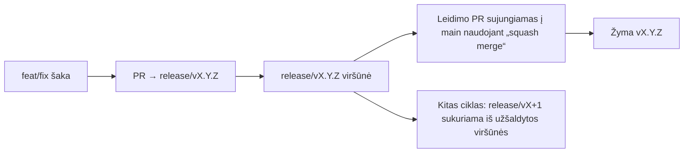

# Branching & Release Model (Lietuvių)

🌐 **Languages:** 🇺🇸 [English](../../../../ops/BRANCHING_MODEL.md) · 🇪🇹 [am](../../../am/docs/ops/BRANCHING_MODEL.md) · 🇸🇦 [ar](../../../ar/docs/ops/BRANCHING_MODEL.md) · 🇦🇿 [az](../../../az/docs/ops/BRANCHING_MODEL.md) · 🇧🇬 [bg](../../../bg/docs/ops/BRANCHING_MODEL.md) · 🇧🇩 [bn](../../../bn/docs/ops/BRANCHING_MODEL.md) · 🇨🇿 [cs](../../../cs/docs/ops/BRANCHING_MODEL.md) · 🇩🇰 [da](../../../da/docs/ops/BRANCHING_MODEL.md) · 🇩🇪 [de](../../../de/docs/ops/BRANCHING_MODEL.md) · 🇬🇷 [el](../../../el/docs/ops/BRANCHING_MODEL.md) · 🇪🇸 [es](../../../es/docs/ops/BRANCHING_MODEL.md) · 🇪🇪 [et](../../../et/docs/ops/BRANCHING_MODEL.md) · 🇮🇷 [fa](../../../fa/docs/ops/BRANCHING_MODEL.md) · 🇫🇮 [fi](../../../fi/docs/ops/BRANCHING_MODEL.md) · 🇫🇷 [fr](../../../fr/docs/ops/BRANCHING_MODEL.md) · 🇮🇪 [ga](../../../ga/docs/ops/BRANCHING_MODEL.md) · 🇮🇳 [gu](../../../gu/docs/ops/BRANCHING_MODEL.md) · 🇳🇬 [ha](../../../ha/docs/ops/BRANCHING_MODEL.md) · 🇮🇱 [he](../../../he/docs/ops/BRANCHING_MODEL.md) · 🇮🇳 [hi](../../../hi/docs/ops/BRANCHING_MODEL.md) · 🇭🇷 [hr](../../../hr/docs/ops/BRANCHING_MODEL.md) · 🇭🇺 [hu](../../../hu/docs/ops/BRANCHING_MODEL.md) · 🇦🇲 [hy](../../../hy/docs/ops/BRANCHING_MODEL.md) · 🇮🇩 [id](../../../id/docs/ops/BRANCHING_MODEL.md) · 🇳🇬 [ig](../../../ig/docs/ops/BRANCHING_MODEL.md) · 🇮🇹 [it](../../../it/docs/ops/BRANCHING_MODEL.md) · 🇯🇵 [ja](../../../ja/docs/ops/BRANCHING_MODEL.md) · 🇬🇪 [ka](../../../ka/docs/ops/BRANCHING_MODEL.md) · 🇰🇭 [km](../../../km/docs/ops/BRANCHING_MODEL.md) · 🇮🇳 [kn](../../../kn/docs/ops/BRANCHING_MODEL.md) · 🇰🇷 [ko](../../../ko/docs/ops/BRANCHING_MODEL.md) · 🇱🇻 [lv](../../../lv/docs/ops/BRANCHING_MODEL.md) · 🇮🇳 [ml](../../../ml/docs/ops/BRANCHING_MODEL.md) · 🇮🇳 [mr](../../../mr/docs/ops/BRANCHING_MODEL.md) · 🇲🇾 [ms](../../../ms/docs/ops/BRANCHING_MODEL.md) · 🇲🇹 [mt](../../../mt/docs/ops/BRANCHING_MODEL.md) · 🇲🇲 [my](../../../my/docs/ops/BRANCHING_MODEL.md) · 🇳🇵 [ne](../../../ne/docs/ops/BRANCHING_MODEL.md) · 🇳🇱 [nl](../../../nl/docs/ops/BRANCHING_MODEL.md) · 🇳🇴 [no](../../../no/docs/ops/BRANCHING_MODEL.md) · 🇮🇳 [or](../../../or/docs/ops/BRANCHING_MODEL.md) · 🇮🇳 [pa](../../../pa/docs/ops/BRANCHING_MODEL.md) · 🇵🇭 [phi](../../../phi/docs/ops/BRANCHING_MODEL.md) · 🇵🇱 [pl](../../../pl/docs/ops/BRANCHING_MODEL.md) · 🇵🇹 [pt](../../../pt/docs/ops/BRANCHING_MODEL.md) · 🇧🇷 [pt-BR](../../../pt-BR/docs/ops/BRANCHING_MODEL.md) · 🇷🇴 [ro](../../../ro/docs/ops/BRANCHING_MODEL.md) · 🇷🇺 [ru](../../../ru/docs/ops/BRANCHING_MODEL.md) · 🇱🇰 [si](../../../si/docs/ops/BRANCHING_MODEL.md) · 🇸🇰 [sk](../../../sk/docs/ops/BRANCHING_MODEL.md) · 🇸🇮 [sl](../../../sl/docs/ops/BRANCHING_MODEL.md) · 🇷🇸 [sr](../../../sr/docs/ops/BRANCHING_MODEL.md) · 🇸🇪 [sv](../../../sv/docs/ops/BRANCHING_MODEL.md) · 🇰🇪 [sw](../../../sw/docs/ops/BRANCHING_MODEL.md) · 🇮🇳 [ta](../../../ta/docs/ops/BRANCHING_MODEL.md) · 🇮🇳 [te](../../../te/docs/ops/BRANCHING_MODEL.md) · 🇹🇭 [th](../../../th/docs/ops/BRANCHING_MODEL.md) · 🇹🇷 [tr](../../../tr/docs/ops/BRANCHING_MODEL.md) · 🇺🇦 [uk-UA](../../../uk-UA/docs/ops/BRANCHING_MODEL.md) · 🇵🇰 [ur](../../../ur/docs/ops/BRANCHING_MODEL.md) · 🇺🇿 [uz](../../../uz/docs/ops/BRANCHING_MODEL.md) · 🇻🇳 [vi](../../../vi/docs/ops/BRANCHING_MODEL.md) · 🇳🇬 [yo](../../../yo/docs/ops/BRANCHING_MODEL.md) · 🇨🇳 [zh-CN](../../../zh-CN/docs/ops/BRANCHING_MODEL.md) · 🇹🇼 [zh-TW](../../../zh-TW/docs/ops/BRANCHING_MODEL.md)

---

OmniRoute naudoja **lygiagrečių ciklų** leidimų modelį: aktyviam ciklui skirtą
`release/vX.Y.Z` šaką, paskelbtų leidimų linijai skirtą `main` ir nekintamą
`vX.Y.Z` žymą, sukuriamą išleidžiant ciklo versiją. Įrašų atsiradimas tiek `release/*`,
tiek `main` yra numatytas — tai nėra klaida.

Prižiūrėtojams skirta išsami informacija pateikiama `CLAUDE.md` (griežtoji taisyklė Nr. 21) ir
[RELEASE_CHECKLIST.md](./RELEASE_CHECKLIST.md). Šiame puslapyje pateikiama vieša
santrauka bendraautoriams.

## Trumpai

| Nuoroda          | Paskirtis                                                                                           |
| ---------------- | --------------------------------------------------------------------------------------------------- |
| `release/vX.Y.Z` | **Aktyvus ciklas** — kasdienis tos versijos kūrimas ir PR sujungimas                                |
| `main`           | **Paskelbtų leidimų linija** — išleidžiant versiją į ją ciklas įtraukiamas naudojant „squash merge“ |
| `vX.Y.Z` (žyma)  | **Išleidimo žymuo** — nekintama nuoroda į tai, kas buvo išleista, sukuriama išleidimo metu          |



## Į kurią šaką turėtų būti nukreiptas mano PR?

**Nukreipkite į aktyvią `release/vX.Y.Z` šaką, o ne į `main`.**

1. Raskite didžiausios versijos numerio atvirą `release/v*` šaką (rašymo metu naudojamas pavyzdys:
   `release/v3.8.49`).
2. Sukurkite šaką nuo jos viršūnės (`git fetch` + „checkout“ / „rebase“ į ją).
3. Atidarykite PR, kurio **bazė = ta `release/vX.Y.Z` šaka**.

`main` nėra kasdienio integravimo šaka. Į `main` nukreiptus PR
paprastai prieš sujungiant reikia nukreipti į kitą šaką.

## Leidimo užšaldymas (lygiagretūs ciklai)

Kai leidimas derinamas, sukuriama žymėjimo užduotis su etikete `release-freeze`.
Tai **nesustabdo kūrimo darbų**:

- Užšaldyta `release/vX.Y.Z` šaka iki to leidimo išleidimo priklauso leidimo vadovui.
- Kito ciklo `release/vX+1` sukuriama iš užšaldytos viršūnės, kad bendraautoriai galėtų
  toliau integruoti darbus.
- Atviri PR, vis dar nukreipti į užšaldytą šaką, turėtų būti **nukreipti iš naujo** į
  aktyvią (didžiausios versijos numerio) `release/v*` šaką.

Prieš manydami, kad norimą šaką galima sujungti, patikrinkite, ar nėra aktyvaus užšaldymo:

```bash
gh issue list --repo diegosouzapw/OmniRoute --label release-freeze --state open
```

Sujungimo mechanizmas (savininko `queue` etiketė → Mergify) aprašytas
[MERGE_TRAIN.md](./MERGE_TRAIN.md).

## Kodėl naudojama ir šaka, ir žyma?

| Artefaktas       | Gyvavimo trukmė | Paskirtis                                                        |
| ---------------- | --------------- | ---------------------------------------------------------------- |
| `release/vX.Y.Z` | Vykdomas ciklas | Kaupia peržiūrėtus PR, išlaiko sėkmingą CI būseną ir yra PR bazė |
| Žyma `vX.Y.Z`    | Visam laikui    | Žymi tikslų kodą, išleistą npm / GitHub Releases                 |

Šaka yra dirbtuvės, o žyma — užantspauduota pakuotė. Po sujungimo į
`main` naudojant „squash merge“, kitas ciklas tęsiamas `release/vX+1` šakoje, nelaukiant, kol bus
užbaigtas ankstesnio leidimo PR.

## Susiję dokumentai

- [CONTRIBUTING.md](../../CONTRIBUTING.md) — paruošimas, testai, PR kontrolinis sąrašas
- [RELEASE_CHECKLIST.md](./RELEASE_CHECKLIST.md) — patikra prieš išleidimą
- [MERGE_TRAIN.md](./MERGE_TRAIN.md) — sujungimo eilė ir atsarginė sujungimo seka
- [RELEASE_GREEN.md](./RELEASE_GREEN.md) — sėkmingos leidimo šakos viršūnės būsenos palaikymas
