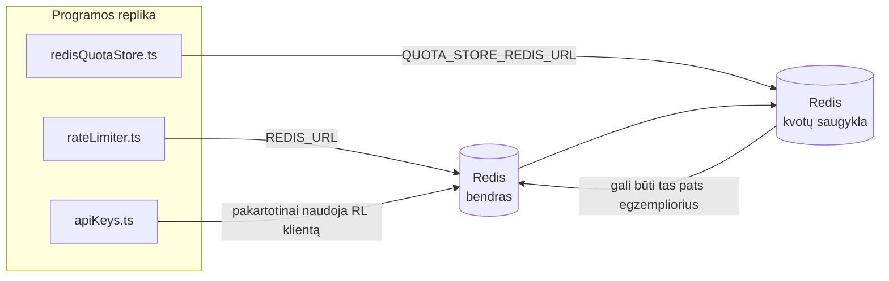

# Redis Production Configuration Guide (Lietuvių)

🌐 **Languages:** 🇺🇸 [English](../../../../ops/REDIS_PRODUCTION_CONFIG.md) · 🇪🇹 [am](../../../am/docs/ops/REDIS_PRODUCTION_CONFIG.md) · 🇸🇦 [ar](../../../ar/docs/ops/REDIS_PRODUCTION_CONFIG.md) · 🇦🇿 [az](../../../az/docs/ops/REDIS_PRODUCTION_CONFIG.md) · 🇧🇬 [bg](../../../bg/docs/ops/REDIS_PRODUCTION_CONFIG.md) · 🇧🇩 [bn](../../../bn/docs/ops/REDIS_PRODUCTION_CONFIG.md) · 🇨🇿 [cs](../../../cs/docs/ops/REDIS_PRODUCTION_CONFIG.md) · 🇩🇰 [da](../../../da/docs/ops/REDIS_PRODUCTION_CONFIG.md) · 🇩🇪 [de](../../../de/docs/ops/REDIS_PRODUCTION_CONFIG.md) · 🇬🇷 [el](../../../el/docs/ops/REDIS_PRODUCTION_CONFIG.md) · 🇪🇸 [es](../../../es/docs/ops/REDIS_PRODUCTION_CONFIG.md) · 🇪🇪 [et](../../../et/docs/ops/REDIS_PRODUCTION_CONFIG.md) · 🇮🇷 [fa](../../../fa/docs/ops/REDIS_PRODUCTION_CONFIG.md) · 🇫🇮 [fi](../../../fi/docs/ops/REDIS_PRODUCTION_CONFIG.md) · 🇫🇷 [fr](../../../fr/docs/ops/REDIS_PRODUCTION_CONFIG.md) · 🇮🇪 [ga](../../../ga/docs/ops/REDIS_PRODUCTION_CONFIG.md) · 🇮🇳 [gu](../../../gu/docs/ops/REDIS_PRODUCTION_CONFIG.md) · 🇳🇬 [ha](../../../ha/docs/ops/REDIS_PRODUCTION_CONFIG.md) · 🇮🇱 [he](../../../he/docs/ops/REDIS_PRODUCTION_CONFIG.md) · 🇮🇳 [hi](../../../hi/docs/ops/REDIS_PRODUCTION_CONFIG.md) · 🇭🇷 [hr](../../../hr/docs/ops/REDIS_PRODUCTION_CONFIG.md) · 🇭🇺 [hu](../../../hu/docs/ops/REDIS_PRODUCTION_CONFIG.md) · 🇦🇲 [hy](../../../hy/docs/ops/REDIS_PRODUCTION_CONFIG.md) · 🇮🇩 [id](../../../id/docs/ops/REDIS_PRODUCTION_CONFIG.md) · 🇳🇬 [ig](../../../ig/docs/ops/REDIS_PRODUCTION_CONFIG.md) · 🇮🇹 [it](../../../it/docs/ops/REDIS_PRODUCTION_CONFIG.md) · 🇯🇵 [ja](../../../ja/docs/ops/REDIS_PRODUCTION_CONFIG.md) · 🇬🇪 [ka](../../../ka/docs/ops/REDIS_PRODUCTION_CONFIG.md) · 🇰🇭 [km](../../../km/docs/ops/REDIS_PRODUCTION_CONFIG.md) · 🇮🇳 [kn](../../../kn/docs/ops/REDIS_PRODUCTION_CONFIG.md) · 🇰🇷 [ko](../../../ko/docs/ops/REDIS_PRODUCTION_CONFIG.md) · 🇱🇻 [lv](../../../lv/docs/ops/REDIS_PRODUCTION_CONFIG.md) · 🇮🇳 [ml](../../../ml/docs/ops/REDIS_PRODUCTION_CONFIG.md) · 🇮🇳 [mr](../../../mr/docs/ops/REDIS_PRODUCTION_CONFIG.md) · 🇲🇾 [ms](../../../ms/docs/ops/REDIS_PRODUCTION_CONFIG.md) · 🇲🇹 [mt](../../../mt/docs/ops/REDIS_PRODUCTION_CONFIG.md) · 🇲🇲 [my](../../../my/docs/ops/REDIS_PRODUCTION_CONFIG.md) · 🇳🇵 [ne](../../../ne/docs/ops/REDIS_PRODUCTION_CONFIG.md) · 🇳🇱 [nl](../../../nl/docs/ops/REDIS_PRODUCTION_CONFIG.md) · 🇳🇴 [no](../../../no/docs/ops/REDIS_PRODUCTION_CONFIG.md) · 🇮🇳 [or](../../../or/docs/ops/REDIS_PRODUCTION_CONFIG.md) · 🇮🇳 [pa](../../../pa/docs/ops/REDIS_PRODUCTION_CONFIG.md) · 🇵🇭 [phi](../../../phi/docs/ops/REDIS_PRODUCTION_CONFIG.md) · 🇵🇱 [pl](../../../pl/docs/ops/REDIS_PRODUCTION_CONFIG.md) · 🇵🇹 [pt](../../../pt/docs/ops/REDIS_PRODUCTION_CONFIG.md) · 🇧🇷 [pt-BR](../../../pt-BR/docs/ops/REDIS_PRODUCTION_CONFIG.md) · 🇷🇴 [ro](../../../ro/docs/ops/REDIS_PRODUCTION_CONFIG.md) · 🇷🇺 [ru](../../../ru/docs/ops/REDIS_PRODUCTION_CONFIG.md) · 🇱🇰 [si](../../../si/docs/ops/REDIS_PRODUCTION_CONFIG.md) · 🇸🇰 [sk](../../../sk/docs/ops/REDIS_PRODUCTION_CONFIG.md) · 🇸🇮 [sl](../../../sl/docs/ops/REDIS_PRODUCTION_CONFIG.md) · 🇷🇸 [sr](../../../sr/docs/ops/REDIS_PRODUCTION_CONFIG.md) · 🇸🇪 [sv](../../../sv/docs/ops/REDIS_PRODUCTION_CONFIG.md) · 🇰🇪 [sw](../../../sw/docs/ops/REDIS_PRODUCTION_CONFIG.md) · 🇮🇳 [ta](../../../ta/docs/ops/REDIS_PRODUCTION_CONFIG.md) · 🇮🇳 [te](../../../te/docs/ops/REDIS_PRODUCTION_CONFIG.md) · 🇹🇭 [th](../../../th/docs/ops/REDIS_PRODUCTION_CONFIG.md) · 🇹🇷 [tr](../../../tr/docs/ops/REDIS_PRODUCTION_CONFIG.md) · 🇺🇦 [uk-UA](../../../uk-UA/docs/ops/REDIS_PRODUCTION_CONFIG.md) · 🇵🇰 [ur](../../../ur/docs/ops/REDIS_PRODUCTION_CONFIG.md) · 🇺🇿 [uz](../../../uz/docs/ops/REDIS_PRODUCTION_CONFIG.md) · 🇻🇳 [vi](../../../vi/docs/ops/REDIS_PRODUCTION_CONFIG.md) · 🇳🇬 [yo](../../../yo/docs/ops/REDIS_PRODUCTION_CONFIG.md) · 🇨🇳 [zh-CN](../../../zh-CN/docs/ops/REDIS_PRODUCTION_CONFIG.md) · 🇹🇼 [zh-TW](../../../zh-TW/docs/ops/REDIS_PRODUCTION_CONFIG.md)

---

## Apžvalga

Redis yra **pasirenkama, nebūtina priklausomybė** sistemoje „OmniRoute“ — kai Redis nepasiekiamas, programa toliau veikia naudodama atsarginius sprendimus atmintyje. Produkcinėje aplinkoje Redis optimizavimas sumažina keturių skirtingų darbo krūvių delsą:

| Darbo krūvis                                   | Tvarkyklė                     | Kliento kūrimo funkcija                                                       | Rakto šablonas                                                       |
| ---------------------------------------------- | ----------------------------- | ----------------------------------------------------------------------------- | -------------------------------------------------------------------- |
| Užklausų dažnio ribojimas                      | `rateLimiter.ts`              | `getRedisClient()` — tingiai inicijuojamas vienetinis `ioredis` egzempliorius | `<prefix>rl:*` Lua atomiškai valdomi užklausų dažnio ribojimo langai |
| Autentifikavimo podėlis                        | `apiKeys.ts`                  | Pakartotinai naudoja `rateLimiter` klientą                                    | `<prefix>auth:api_key:<sha256>` su TTL                               |
| Kvotų saugykla                                 | `redisQuotaStore.ts`          | Atskiras vienetinis `getRedisClient(url)` egzempliorius                       | `<prefix>quota:*`, konfigūruojamas kiekvienam egzemplioriui          |
| Parengiamojo paleidimo grandinės pertraukiklis | `redisCircuitBreakerStore.ts` | Atskiras klientas faile `circuitBreakerFactory.ts`                            | `<prefix>warmup:cb:<connectionId>`                                   |

Visiems keturiems darbo krūviams naudojamas vienas vardų srities priešdėlis, todėl „OmniRoute“ gali veikti kartu su kitomis programomis viename Redis egzemplioriuje (pvz., `127.0.0.1:6379`). Žr. [Raktų vardų sričių naudojimas](#key-namespacing).

---

## Dabartinė konfigūracija (numatytosios kodo reikšmės)

| Nustatymas                                  | Reikšmė                                                                               | Vieta                                                                                 |
| ------------------------------------------- | ------------------------------------------------------------------------------------- | ------------------------------------------------------------------------------------- |
| `REDIS_URL` aplinkos kintamasis             | `redis://redis:6379` („compose“), pasirenkamas                                        | `rateLimiter.ts:5`, `.env.example`                                                    |
| `REDIS_KEY_PREFIX` aplinkos kintamasis      | `omniroute:` (numatytoji reikšmė)                                                     | `rateLimiter.ts`, `redisQuotaStore.ts`, `redisCircuitBreakerStore.ts`, `.env.example` |
| `QUOTA_STORE_REDIS_URL` aplinkos kintamasis | atskiras, gali skirtis nuo `REDIS_URL`                                                | `quota/storeFactory.ts`                                                               |
| `QUOTA_STORE_DRIVER`                        | `"sqlite"` (numatytoji reikšmė), `"redis"` pasirenkama                                | `quota/storeFactory.ts`                                                               |
| ioredis `maxRetriesPerRequest`              | `3`                                                                                   | `rateLimiter.ts` kliento kūrimas                                                      |
| `enableReadyCheck`                          | nenustatyta (numatytoji ioredis reikšmė: `true`)                                      | —                                                                                     |
| `lazyConnect`                               | nenustatyta (numatytoji ioredis reikšmė: `false`)                                     | —                                                                                     |
| `retryStrategy`                             | nenustatyta (numatytoji ioredis reikšmė: 200ms bazinė delsa, eksponentinis didėjimas) | —                                                                                     |
| TLS / slaptažodis / DB indeksas             | **nesukonfigūruota**                                                                  | —                                                                                     |
| Sentinel / Cluster                          | **nesukonfigūruota** — palaikomas tik atskiras vieno mazgo egzempliorius              | —                                                                                     |

---

## Raktų vardų sričių naudojimas

„OmniRoute“ naudoja bendrą Redis egzempliorių kartu su kitomis pagrindiniame kompiuteryje veikiančiomis sistemomis. Nenaudojant vardų srities, tokie raktai kaip `auth:api_key:<sha256>` arba `rl:*` gali sutapti su kitų tą patį Redis naudojančių programų raktais (šiame egzemplioriuje Redis veikia adresu `127.0.0.1:6379` kartu su kitomis paslaugomis).

Nustatykite netuščią `REDIS_KEY_PREFIX` eilutę, kad prieš **kiekvieną** „OmniRoute“ raktą būtų pridedamas priešdėlis:

```bash
# .env — visi „OmniRoute“ raktai tampa omniroute:rl:*, omniroute:auth:*, omniroute:quota:*, omniroute:warmup:cb:*
REDIS_KEY_PREFIX=omniroute:
```

- **Numatytoji reikšmė:** `omniroute:` (taikoma, kai `REDIS_KEY_PREFIX` nenustatytas arba yra tuščias).
- **Taikoma:** užklausų dažnio ribotuvui ir autentifikavimo podėliui (bendras `ioredis` klientas per `keyPrefix`), kvotų saugyklai (`KEY_PREFIX = "${REDIS_KEY_PREFIX}quota"`) ir parengiamojo paleidimo grandinės pertraukikliui (`KEY_PREFIX = "${REDIS_KEY_PREFIX}warmup:cb:"`).
- **Pakeitus priešdėlį**, kai Redis jau yra raktų, senieji raktai tampa nebepasiekiami (jie pašalinami pasibaigus TTL arba taikant LRU). Keisti saugu; perkėlimas nereikalingas. Vienintelė išimtis — uždraustu pažymėto ryšio parengiamojo paleidimo grandinės pertraukiklio raktas: jis išsaugomas be TTL, todėl likusius raktus raskite naudodami `redis-cli --scan --pattern '<old-prefix>warmup:cb:*'` ir juos pašalinkite.
- **ioredis `keyPrefix`** automatiškai prideda priešdėlį įrašant **ir** pašalina jį skaitant, todėl programos kodas niekada nemato priešdėlio.

---

## Rekomenduojamas produkcinės aplinkos optimizavimas

### 1. Ryšių telkinio / kliento parinktys (ioredis `Redis` konstruktorius)

Dabartinis kodas sukuria vieną `new Redis(url)` be pasirinktinių parinkčių. Produkcinėse
kelių replikų diegimo aplinkose kode perduokite kliento kūrimo funkciją arba apgaubkite `getRedisClient()`:

```typescript
const redis = new Redis(REDIS_URL, {
  maxRetriesPerRequest: null, // nėra pakartojimų limito; sprendimą palikti retryStrategy
  enableReadyCheck: true, // prieš priimant užklausas patikrinti, ar serveris paruoštas
  lazyConnect: true, // neprisijungti konstravimo metu; laukti pirmosios užklausos
  retryStrategy: (times) => {
    if (times > 10) return null; // atsisakyti po 10 bandymų → vėliau prisijungti iš naujo
    return Math.min(times * 200, 5000); // 200 ms, 400 ms, …, daugiausia 5 s
  },
  enableAutoPipelining: true, // sujungti lygiagrečias komandas į vieną TCP įrašymą
  keepAlive: 10000, // TCP ryšio palaikymas kas 10 s
});
```

**Pagrindiniai kompromisai:**

- `maxRetriesPerRequest: null` + `retryStrategy` — rekomenduojama produkcinėje aplinkoje, kad laikini
  Redis paleidimai iš naujo iš karto nesužlugdytų visų užklausų. Atmintyje veikiantis atsarginis mechanizmas
  funkcijoje `checkRateLimit()` perima nesėkmės scenarijų.
- `lazyConnect: true` — panaikina paleidimo priklausomybę nuo Redis pasiekiamumo prieš serveriui
  pradedant priimti ryšius.
- `enableAutoPipelining: true` — sumažina užklausų ir atsakymų ciklų skaičių, kai vienu metu atliekamos spartos ribojimo patikros;
  naudinga esant >50 RPS viename ryšyje.

### 2. Redis serverio konfigūracija (`redis.conf`)

```
# Atmintis
maxmemory 80%                        # palikti vietos OS puslapių podėliui
maxmemory-policy allkeys-lru         # esant apkrovai pašalinti pasenusius autentifikavimo podėlio įrašus

# Duomenų išsaugojimas (neprivaloma — OmniRoute saugi gedimo atveju ir be jo)
save 300 1                           # kurti momentinę kopiją bent kas 5 min., jei pasikeitė ≥1 raktas
appendonly no                        # AOF nereikalingas; duomenis galima atkurti
appendfsync no                       # nėra fsync pridėtinių sąnaudų (RDB pakanka)

# Tinklas
timeout 0                            # neatjungti neaktyvaus ryšio
tcp-keepalive 300                    # palaikyti ryšį kas 5 min.
tcp-backlog 511                      # ryšių eilė staigiai išaugusiai apkrovai

# Našumas
hz 10                                # numatytoji reikšmė; 100 vėlinimui jautrioms sistemoms
activedefrag yes                     # automatiškai defragmentuoti, kai fragmentacija >10 %
```

**`maxmemory-policy allkeys-lru` kompromisas:** autentifikavimo podėlio įrašai gali būti pašalinti
esant atminties trūkumui. Tai saugu — `setCachedApiKey` visada iš naujo užpildo podėlį, kai įrašo nėra, o
SQLite atsarginis šaltinis yra autoritetingas. Spartos ribotuvo Lua scenarijus kuria mažus raktus, kurie pagal
sumanymą yra trumpalaikiai.

### 3. Docker Compose nuostatos

Produkcinė compose konfigūracija (`docker-compose.prod.yml`) naudoja `redis:8.6.2-alpine`. Pridėkite:

```yaml
redis:
  image: redis:8.6.2-alpine
  command:
    [
      "redis-server",
      "--maxmemory",
      "512mb",
      "--maxmemory-policy",
      "allkeys-lru",
      "--activedefrag",
      "yes",
      "--save",
      "300 1",
    ]
  healthcheck:
    test: ["CMD", "redis-cli", "ping"]
    interval: 10s
    timeout: 3s
    retries: 3
    start_period: 5s
```

### 4. Kelių egzempliorių / mastelio didinimo aspektai

**Vienas Redis visoms replikoms** — spartos ribotuvo Lua scenarijus priklauso nuo vienos
autoritetingos raktų erdvės. Naudojant kelis Redis egzempliorius skirtingoms replikoms būtų prarastas operacijų atomiškumas
ir biudžetas padvigubėtų. Visoms programos replikoms naudokite vieną Redis (arba Redis Sentinel klasterį su automatiniu perjungimu).

**Ryšių skaičius:** kiekviena programos replika atidaro **2 TCP ryšius** su Redis
(spartos ribotuvo klientas + kvotų saugyklos klientas). Naudojant 10 replikų → 20 ryšių, o tai gerokai
mažiau nei numatytasis Redis egzemplioriaus 10 tūkst. ryšių limitas.

### 5. Stebėsena

Pateikite per būsenos patikros galinį tašką:

```typescript
// src/app/api/monitoring/health/route.ts jau iškviečia rateLimiter funkcijas
// Pridėkite Redis skirtas patikras:
//   1. PING delsą naudojant ioredis .ping()
//   2. Atminties naudojimą naudojant INFO memory
//   3. Ryšių skaičių naudojant INFO clients
//   4. maxmemory-policy pataikymų rodiklį (evicted_keys / keyspace_hits)
```

Svarbiausi stebėtini rodikliai:

- **Pašalinti raktai / sek.** — jei reikšmė nuolat nenulinė, padidinkite `maxmemory`
- **Užblokuoti klientai** — nenulinė reikšmė rodo lėtus Lua scenarijus arba didelę konkurenciją dėl išteklių
- **Atmesti ryšiai** — pasiektas ryšių limitas; esant 20 ryšių tai mažai tikėtina

---

## Architektūros diagrama



---

## Nuorodos

| Failas                             | Paskirtis                                                                                            |
| ---------------------------------- | ---------------------------------------------------------------------------------------------------- |
| `src/shared/utils/rateLimiter.ts`  | Pagrindinis Redis klientas, Lua užklausų dažnio ribojimo scenarijus, atsarginis saugojimas atmintyje |
| `src/lib/db/apiKeys.ts`            | Autentifikavimo podėlis — Redis→SQLite atsarginis variantas                                          |
| `src/lib/quota/redisQuotaStore.ts` | Atskiras Redis klientas pasirinktinei kvotų saugyklai                                                |
| `src/lib/quota/storeFactory.ts`    | Perjungia tarp `sqlite` ir `redis` kvotų tvarkyklių                                                  |
| `docker-compose.prod.yml`          | Produkcinės aplinkos Redis konteineris (atvaizdas `redis:8.6.2-alpine`)                              |
| `.env.example`                     | Redis aplinkos kintamųjų dokumentacija                                                               |
| `src/app/api/local/redis/`         | API maršrutai kūrimo aplinkos konteinerio orkestravimui                                              |
| `bin/cli/commands/redis.mjs`       | CLI komandos kūrimo aplinkos konteinerio orkestravimui                                               |
