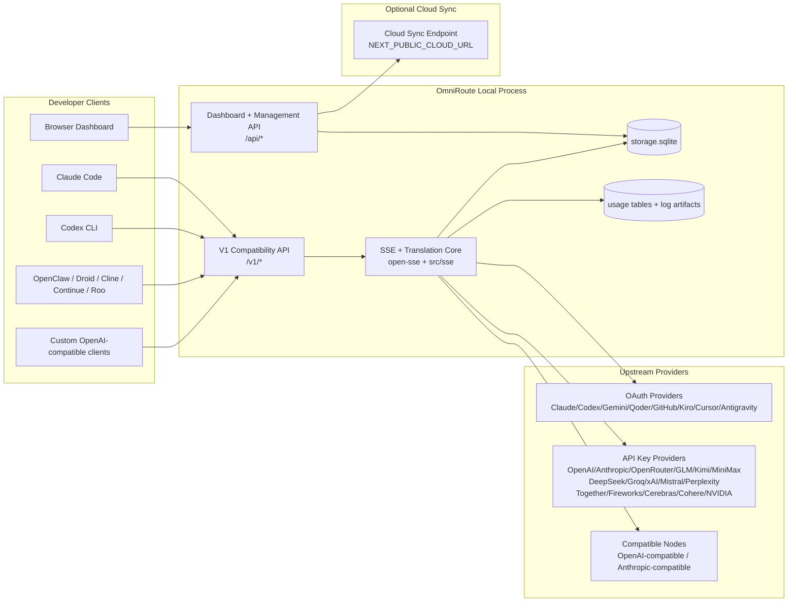
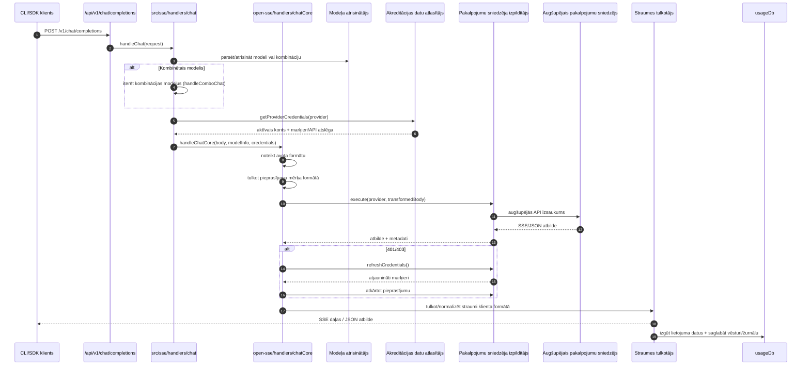
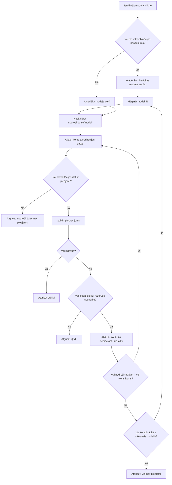
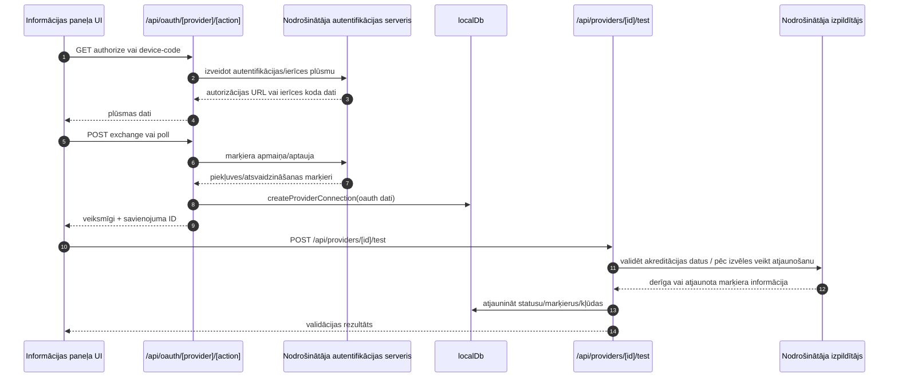
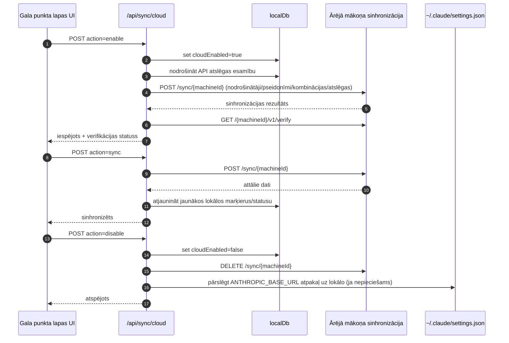
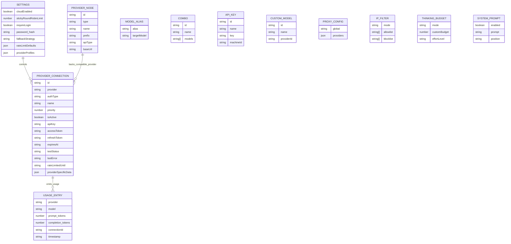
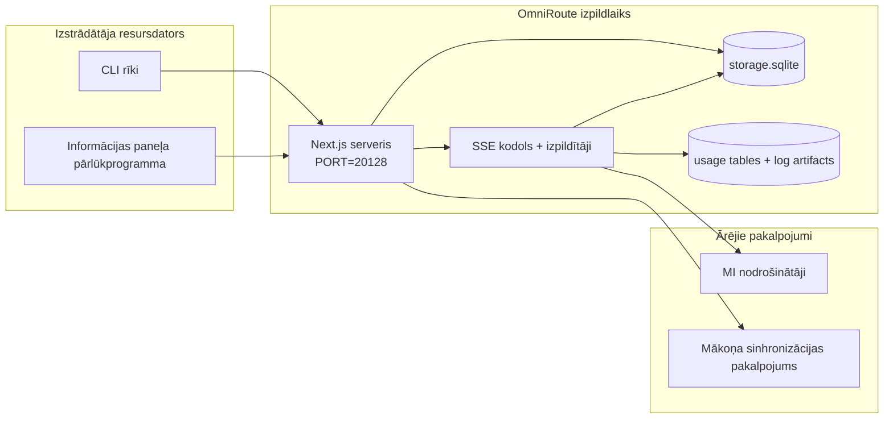

# ARCHITECTURE (Latviešu)

🌐 **Languages:** 🇺🇸 [English](../../../../architecture/ARCHITECTURE.md) · 🇸🇦 [ar](../../../ar/docs/architecture/ARCHITECTURE.md) · 🇦🇿 [az](../../../az/docs/architecture/ARCHITECTURE.md) · 🇧🇬 [bg](../../../bg/docs/architecture/ARCHITECTURE.md) · 🇧🇩 [bn](../../../bn/docs/architecture/ARCHITECTURE.md) · 🇨🇿 [cs](../../../cs/docs/architecture/ARCHITECTURE.md) · 🇩🇰 [da](../../../da/docs/architecture/ARCHITECTURE.md) · 🇩🇪 [de](../../../de/docs/architecture/ARCHITECTURE.md) · 🇬🇷 [el](../../../el/docs/architecture/ARCHITECTURE.md) · 🇪🇸 [es](../../../es/docs/architecture/ARCHITECTURE.md) · 🇪🇪 [et](../../../et/docs/architecture/ARCHITECTURE.md) · 🇮🇷 [fa](../../../fa/docs/architecture/ARCHITECTURE.md) · 🇫🇮 [fi](../../../fi/docs/architecture/ARCHITECTURE.md) · 🇫🇷 [fr](../../../fr/docs/architecture/ARCHITECTURE.md) · 🇮🇪 [ga](../../../ga/docs/architecture/ARCHITECTURE.md) · 🇮🇳 [gu](../../../gu/docs/architecture/ARCHITECTURE.md) · 🇮🇱 [he](../../../he/docs/architecture/ARCHITECTURE.md) · 🇮🇳 [hi](../../../hi/docs/architecture/ARCHITECTURE.md) · 🇭🇷 [hr](../../../hr/docs/architecture/ARCHITECTURE.md) · 🇭🇺 [hu](../../../hu/docs/architecture/ARCHITECTURE.md) · 🇮🇩 [id](../../../id/docs/architecture/ARCHITECTURE.md) · 🇮🇹 [it](../../../it/docs/architecture/ARCHITECTURE.md) · 🇯🇵 [ja](../../../ja/docs/architecture/ARCHITECTURE.md) · 🇰🇷 [ko](../../../ko/docs/architecture/ARCHITECTURE.md) · 🇱🇹 [lt](../../../lt/docs/architecture/ARCHITECTURE.md) · 🇮🇳 [mr](../../../mr/docs/architecture/ARCHITECTURE.md) · 🇲🇾 [ms](../../../ms/docs/architecture/ARCHITECTURE.md) · 🇲🇹 [mt](../../../mt/docs/architecture/ARCHITECTURE.md) · 🇳🇱 [nl](../../../nl/docs/architecture/ARCHITECTURE.md) · 🇳🇴 [no](../../../no/docs/architecture/ARCHITECTURE.md) · 🇵🇭 [phi](../../../phi/docs/architecture/ARCHITECTURE.md) · 🇵🇱 [pl](../../../pl/docs/architecture/ARCHITECTURE.md) · 🇵🇹 [pt](../../../pt/docs/architecture/ARCHITECTURE.md) · 🇧🇷 [pt-BR](../../../pt-BR/docs/architecture/ARCHITECTURE.md) · 🇷🇴 [ro](../../../ro/docs/architecture/ARCHITECTURE.md) · 🇷🇺 [ru](../../../ru/docs/architecture/ARCHITECTURE.md) · 🇸🇰 [sk](../../../sk/docs/architecture/ARCHITECTURE.md) · 🇸🇮 [sl](../../../sl/docs/architecture/ARCHITECTURE.md) · 🇷🇸 [sr](../../../sr/docs/architecture/ARCHITECTURE.md) · 🇸🇪 [sv](../../../sv/docs/architecture/ARCHITECTURE.md) · 🇰🇪 [sw](../../../sw/docs/architecture/ARCHITECTURE.md) · 🇮🇳 [ta](../../../ta/docs/architecture/ARCHITECTURE.md) · 🇮🇳 [te](../../../te/docs/architecture/ARCHITECTURE.md) · 🇹🇭 [th](../../../th/docs/architecture/ARCHITECTURE.md) · 🇹🇷 [tr](../../../tr/docs/architecture/ARCHITECTURE.md) · 🇺🇦 [uk-UA](../../../uk-UA/docs/architecture/ARCHITECTURE.md) · 🇵🇰 [ur](../../../ur/docs/architecture/ARCHITECTURE.md) · 🇻🇳 [vi](../../../vi/docs/architecture/ARCHITECTURE.md) · 🇨🇳 [zh-CN](../../../zh-CN/docs/architecture/ARCHITECTURE.md) · 🇹🇼 [zh-TW](../../../zh-TW/docs/architecture/ARCHITECTURE.md)

---

---

title: "OmniRoute arhitektūra"
version: 3.8.40
lastUpdated: 2026-06-28
---

# OmniRoute arhitektūra

🌐 **Languages:** 🇺🇸 [English](../../../../architecture/ARCHITECTURE.md) · 🇸🇦 [ar](../../../ar/docs/architecture/ARCHITECTURE.md) · 🇦🇿 [az](../../../az/docs/architecture/ARCHITECTURE.md) · 🇧🇬 [bg](../../../bg/docs/architecture/ARCHITECTURE.md) · 🇧🇩 [bn](../../../bn/docs/architecture/ARCHITECTURE.md) · 🇨🇿 [cs](../../../cs/docs/architecture/ARCHITECTURE.md) · 🇩🇰 [da](../../../da/docs/architecture/ARCHITECTURE.md) · 🇩🇪 [de](../../../de/docs/architecture/ARCHITECTURE.md) · 🇬🇷 [el](../../../el/docs/architecture/ARCHITECTURE.md) · 🇪🇸 [es](../../../es/docs/architecture/ARCHITECTURE.md) · 🇪🇪 [et](../../../et/docs/architecture/ARCHITECTURE.md) · 🇮🇷 [fa](../../../fa/docs/architecture/ARCHITECTURE.md) · 🇫🇮 [fi](../../../fi/docs/architecture/ARCHITECTURE.md) · 🇫🇷 [fr](../../../fr/docs/architecture/ARCHITECTURE.md) · 🇮🇪 [ga](../../../ga/docs/architecture/ARCHITECTURE.md) · 🇮🇳 [gu](../../../gu/docs/architecture/ARCHITECTURE.md) · 🇮🇱 [he](../../../he/docs/architecture/ARCHITECTURE.md) · 🇮🇳 [hi](../../../hi/docs/architecture/ARCHITECTURE.md) · 🇭🇷 [hr](../../../hr/docs/architecture/ARCHITECTURE.md) · 🇭🇺 [hu](../../../hu/docs/architecture/ARCHITECTURE.md) · 🇮🇩 [id](../../../id/docs/architecture/ARCHITECTURE.md) · 🇮🇹 [it](../../../it/docs/architecture/ARCHITECTURE.md) · 🇯🇵 [ja](../../../ja/docs/architecture/ARCHITECTURE.md) · 🇰🇷 [ko](../../../ko/docs/architecture/ARCHITECTURE.md) · 🇱🇹 [lt](../../../lt/docs/architecture/ARCHITECTURE.md) · 🇮🇳 [mr](../../../mr/docs/architecture/ARCHITECTURE.md) · 🇲🇾 [ms](../../../ms/docs/architecture/ARCHITECTURE.md) · 🇲🇹 [mt](../../../mt/docs/architecture/ARCHITECTURE.md) · 🇳🇱 [nl](../../../nl/docs/architecture/ARCHITECTURE.md) · 🇳🇴 [no](../../../no/docs/architecture/ARCHITECTURE.md) · 🇵🇭 [phi](../../../phi/docs/architecture/ARCHITECTURE.md) · 🇵🇱 [pl](../../../pl/docs/architecture/ARCHITECTURE.md) · 🇵🇹 [pt](../../../pt/docs/architecture/ARCHITECTURE.md) · 🇧🇷 [pt-BR](../../../pt-BR/docs/architecture/ARCHITECTURE.md) · 🇷🇴 [ro](../../../ro/docs/architecture/ARCHITECTURE.md) · 🇷🇺 [ru](../../../ru/docs/architecture/ARCHITECTURE.md) · 🇸🇰 [sk](../../../sk/docs/architecture/ARCHITECTURE.md) · 🇸🇮 [sl](../../../sl/docs/architecture/ARCHITECTURE.md) · 🇷🇸 [sr](../../../sr/docs/architecture/ARCHITECTURE.md) · 🇸🇪 [sv](../../../sv/docs/architecture/ARCHITECTURE.md) · 🇰🇪 [sw](../../../sw/docs/architecture/ARCHITECTURE.md) · 🇮🇳 [ta](../../../ta/docs/architecture/ARCHITECTURE.md) · 🇮🇳 [te](../../../te/docs/architecture/ARCHITECTURE.md) · 🇹🇭 [th](../../../th/docs/architecture/ARCHITECTURE.md) · 🇹🇷 [tr](../../../tr/docs/architecture/ARCHITECTURE.md) · 🇺🇦 [uk-UA](../../../uk-UA/docs/architecture/ARCHITECTURE.md) · 🇵🇰 [ur](../../../ur/docs/architecture/ARCHITECTURE.md) · 🇻🇳 [vi](../../../vi/docs/architecture/ARCHITECTURE.md) · 🇨🇳 [zh-CN](../../../zh-CN/docs/architecture/ARCHITECTURE.md) · 🇹🇼 [zh-TW](../../../zh-TW/docs/architecture/ARCHITECTURE.md)

_Pēdējoreiz atjaunināts: 2026-06-28_

## Kopsavilkums vadībai

OmniRoute ir lokāls MI maršrutēšanas vārtejas un informācijas paneļa risinājums, kas izveidots uz Next.js bāzes.
Tas nodrošina vienu ar OpenAI saderīgu galapunktu (`/v1/*`) un maršrutē datplūsmu starp vairākiem augšupējiem pakalpojumu sniedzējiem, nodrošinot tulkošanu, atkāpšanos, marķieru atsvaidzināšanu un lietojuma uzskaiti.

Galvenās iespējas:

- Ar OpenAI saderīga API saskarne CLI/rīkiem (355 pakalpojumu sniedzēji, 108 izpildītāji)
- Pieprasījumu/atbilžu tulkošana starp pakalpojumu sniedzēju formātiem
- Modeļu kombināciju atkāpšanās (vairāku modeļu secība)
- Strukturēti kombināciju soļi (`provider + model + connection`) ar izpildes laika secību, izmantojot `compositeTiers`
- Konta līmeņa atkāpšanās (vairāki konti vienam pakalpojumu sniedzējam)
- Kvotas priekšpārbaude un kvotu apzināta P2C konta atlase galvenajā tērzēšanas ceļā
- OAuth un API atslēgu pakalpojumu sniedzēju savienojumu pārvaldība (22 OAuth pakalpojumu sniedzēju moduļi)
- Iegulumu ģenerēšana, izmantojot `/v1/embeddings` (18 pakalpojumu sniedzēji)
- Attēlu ģenerēšana, izmantojot `/v1/images/generations` (10+ pakalpojumu sniedzēji, 20+ modeļi)
- Audio transkripcija, izmantojot `/v1/audio/transcriptions` (18 pakalpojumu sniedzēji)
- Teksta pārveide runā, izmantojot `/v1/audio/speech` (24 iebūvētie pakalpojumu sniedzēji)
- Video ģenerēšana, izmantojot `/v1/videos/generations` (ComfyUI + SD WebUI)
- Mūzikas ģenerēšana, izmantojot `/v1/music/generations` (ComfyUI)
- Meklēšana tīmeklī, izmantojot `/v1/search` (20 pakalpojumu sniedzēji)
- Moderēšana, izmantojot `/v1/moderations`
- Pārkārtošana, izmantojot `/v1/rerank`
- Domāšanas tagu parsēšana (`<think>...</think>`) spriešanas modeļiem
- Atbilžu sanitizēšana stingrai saderībai ar OpenAI SDK
- Lomu normalizēšana (developer→system, system→user) savietojamībai starp pakalpojumu sniedzējiem
- Strukturētās izvades konvertēšana (json_schema → Gemini responseSchema)
- Lokāla pakalpojumu sniedzēju, atslēgu, aizstājvārdu, kombināciju, iestatījumu un cenu saglabāšana (122 DB moduļi)
- Lietojuma un izmaksu uzskaite, kā arī pieprasījumu reģistrēšana
- Neobligāta mākoņa sinhronizācija vairāku ierīču/stāvokļa sinhronizācijai
- IP atļauto/bloķēto saraksts API piekļuves kontrolei
- Domāšanas budžeta pārvaldība (passthrough/auto/custom/adaptive)
- Globālas sistēmas uzvednes ievadīšana
- Sesiju uzskaite un pirkstu nospiedumu veidošana
- Uzlabota ātruma ierobežošana katram kontam ar pakalpojumu sniedzējam specifiskiem profiliem
- Automātiskā slēdža (circuit breaker) modelis pakalpojumu sniedzēju noturībai
- Aizsardzība pret vienlaicīgu pieprasījumu lavīnu, izmantojot savstarpējo izslēgšanu
- Uz parakstu balstīta pieprasījumu deduplikācijas kešatmiņa
- Domēna slānis: izmaksu noteikumi, atkāpšanās politika, bloķēšanas politika
- Context Relay: sesiju nodošanas kopsavilkumi kontu rotācijas nepārtrauktībai
- Domēna stāvokļa saglabāšana (SQLite write-through kešatmiņa atkāpšanās, budžetu, bloķējumu un automātisko slēdžu pārvaldībai)
- Politiku dzinis centralizētai pieprasījumu izvērtēšanai (bloķēšana → budžets → atkāpšanās)
- Pieprasījumu telemetrija ar p50/p95/p99 latentuma apkopošanu
- Kombināciju mērķu telemetrija un vēsturiskā kombināciju mērķu veselība, izmantojot `combo_execution_key` / `combo_step_id`
- Korelācijas ID (X-Request-Id) pilna procesa izsekošanai
- Atbilstības audita reģistrēšana ar atteikšanās iespēju katrai API atslēgai
- Novērtēšanas ietvars LLM kvalitātes nodrošināšanai
- Veselības informācijas panelis ar pakalpojumu sniedzēju automātisko slēdžu statusu reāllaikā
- MCP Server (110 rīki) ar 3 transportiem (stdio/SSE/Streamable HTTP)
- A2A Server (JSON-RPC 2.0 + SSE) ar prasmēm un uzdevumu dzīves ciklu
- Atmiņas sistēma (izguve, ievadīšana, izgūšana, apkopošana)
- Prasmju sistēma (reģistrs, izpildītājs, smilškaste, iebūvētās prasmes)
- MITM starpniekserveris ar sertifikātu pārvaldību un DNS apstrādi
- Uzvedņu injekcijas aizsardzības starpprogrammatūra
- Uzvedņu saspiešanas konveijers ar Caveman, RTK, sakrautiem konveijeriem, saspiešanas kombinācijām, valodu pakotnēm un analītiku
- ACP (Agent Communication Protocol) reģistrs
- Modulāri OAuth pakalpojumu sniedzēji (22 atsevišķi moduļi direktorijā `src/lib/oauth/providers/`)
- Atinstalēšanas/pilnīgas atinstalēšanas skripti
- OAuth vides labošanas darbība
- WebSocket tilts ar OpenAI saderīgiem WS klientiem (`/v1/ws`)
- Sinhronizācijas marķieru pārvaldība (izsniegšana/atsaukšana, ETag versijās veidotas konfigurācijas pakotnes lejupielāde)
- GLM Thinking (`glmt`) pirmās klases pakalpojumu sniedzēja priekšiestatījums
- Hibrīda marķieru skaitīšana (pakalpojumu sniedzēja puses `/messages/count_tokens` ar aptuvenas vērtības atkāpšanos)
- Modeļu aizstājvārdu automātiska sākotnējā izveide (30+ starpniekserveru dialektu normalizācijas palaišanas laikā)
- Droša izejošā izgūšana ar SSRF aizsardzību, privāto URL bloķēšanu un konfigurējamu atkārtotu mēģināšanu
- Tērzēšanas atkārtoti mēģinājumi, kas ņem vērā atdzišanas periodu, ar konfigurējamu `requestRetry` un `maxRetryIntervalSec`
- Izpildlaika vides validācija ar Zod palaišanas laikā
- Atbilstības audita v2 ar lapošanu, pakalpojumu sniedzēju CRUD notikumiem un SSRF bloķētas validācijas reģistrēšanu

Primārais izpildlaika modelis:

- Next.js lietotņu maršruti direktorijā `src/app/api/*` īsteno gan informācijas paneļa API, gan saderības API
- Kopīgs SSE/maršrutēšanas kodols direktorijās `src/sse/*` + `open-sse/*` apstrādā pakalpojumu sniedzēju izpildi, tulkošanu, straumēšanu, atkāpšanos un lietojumu

## Atsauces diagrammas

Kanoniskie, versiju kontrolētie Mermaid avoti v3.8.0 platformai atrodas mapē
[`docs/diagrams/`](../diagrams/README.md). Tālāk orientācijai ir atkārtoti divi diagrammu piemēri;
pārējās ir pieejamas saitēs to domēnspecifiskajās rokasgrāmatās.


> Avots: [diagrams/request-pipeline.mmd](../diagrams/request-pipeline.mmd)


> Avots: [diagrams/resilience-3layers.mmd](../diagrams/resilience-3layers.mmd) — pieejams arī saitēs
> [RESILIENCE_GUIDE.md](./RESILIENCE_GUIDE.md) un `CLAUDE.md` noturības atsaucē.

## Tvērums un robežas

### Ietilpst tvērumā

- Lokālais vārtejas izpildlaiks
- Informācijas paneļa pārvaldības API
- Nodrošinātāju autentifikācija un pilnvaru atjaunošana
- Pieprasījumu tulkošana un SSE straumēšana
- Lokālā stāvokļa un lietojuma persistēšana
- Neobligāta mākoņa sinhronizācijas orķestrēšana

### Neietilpst tvērumā

- Mākoņpakalpojuma implementācija aiz `NEXT_PUBLIC_CLOUD_URL`
- Nodrošinātāja SLA/vadības plakne ārpus lokālā procesa
- Paši ārējie CLI binārie faili (Claude CLI, Codex CLI u. c.)

## Informācijas paneļa sadaļas (pašreizējās)

Galvenās lapas mapē `src/app/(dashboard)/dashboard/`:

- `/dashboard` — ātrā sākšana un nodrošinātāju pārskats
- `/dashboard/endpoint` — galapunkta starpniekserveris, MCP, A2A un API galapunkta cilnes
- `/dashboard/providers` — nodrošinātāju savienojumi un akreditācijas dati
- `/dashboard/combos` — kombināciju stratēģijas, veidnes, uz soļiem balstīts veidotājs, modeļu maršrutēšanas noteikumi, manuāli saglabāta secība
- `/dashboard/auto-combo` — automātiskais kombināciju dzinējs: vērtēšanas svari, režīmu pakotnes, virtuālās rūpnīcas priekšiestatījumi, telemetrija
- `/dashboard/costs` — izmaksu apkopošana un cenu pārskatāmība
- `/dashboard/analytics` — lietojuma analītika, novērtējumi, kombināciju mērķu stāvoklis
- `/dashboard/limits` — kvotu un ātruma ierobežojumu vadīklas
- `/dashboard/cli-tools` — CLI ieviešana, izpildlaika noteikšana, konfigurācijas ģenerēšana
- `/dashboard/agents` — noteiktie ACP aģenti un pielāgotu aģentu reģistrācija
- `/dashboard/cloud-agents` — mākonī mitināti aģentu uzdevumi (Codex Cloud, Devin, Jules) un uzdevumu dzīves cikls
- `/dashboard/skills` — A2A prasmju reģistrs, izpilde smilškastē, iebūvēto prasmju katalogs
- `/dashboard/memory` — pastāvīgās sarunu atmiņas pārbaude un izgūšana
- `/dashboard/webhooks` — izejošo tīmekļa āķu abonementi, noslēpumu rotācija, atkārtojumu statistika
- `/dashboard/batch` — pakešdarbu iesniegšana un norise
- `/dashboard/cache` — lasīšanas laikā aizpildāmās un spriešanas kešatmiņas statistika, izlikšanas vadīklas
- `/dashboard/playground` — interaktīvs tērzēšanas izmēģinājums ar jebkuru konfigurētu kombināciju/modeli
- `/dashboard/changelog` — lietotnē iebūvēts izmaiņu žurnāla skatītājs (atveido `CHANGELOG.md`)
- `/dashboard/system` — izpildlaika diagnostika, informācija par versiju, vides validācijas sadaļa
- `/dashboard/onboarding` — pirmās palaišanas iestatīšanas vednis jaunām instalācijām
- `/dashboard/media` — attēlu/video/mūzikas izmēģinājums
- `/dashboard/search-tools` — meklēšanas nodrošinātāju testēšana un vēsture
- `/dashboard/health` — darbspējas laiks, ķēdes pārtraucēji, ātruma ierobežojumi, kvotu uzraudzītas sesijas
- `/dashboard/logs` — pieprasījumu/starpniekservera/auditācijas/konsoles žurnāli
- `/dashboard/settings` — sistēmas iestatījumu cilnes (vispārīgi, maršrutēšana, kombināciju noklusējumi u. c.)
- `/dashboard/context/caveman` — Caveman saspiešanas noteikumi, valodu pakotnes, priekšskatījums un izvades režīms
- `/dashboard/context/rtk` — RTK komandu izvades filtri, priekšskatījums un izpildlaika drošības iestatījumi
- `/dashboard/context/combos` — nosaukti saspiešanas konveijeri, kas piešķirti maršrutēšanas kombinācijām
- `/dashboard/translator` — tulkotāja pārbaude un pieprasījuma formāta konvertēšanas priekšskatījums
- `/dashboard/audit` — atbilstības auditācijas žurnāla pārlūks ar lapošanu un strukturētiem metadatiem
- `/dashboard/usage` — ar `usage_history` sasaistīts katra pieprasījuma lietojuma pārlūks
- `/dashboard/compression` — saspiešanas analītika, statistika un konveijera piešķiršana
- `/dashboard/api-manager` — API atslēgu dzīves cikls un modeļu atļaujas

## Augsta līmeņa sistēmas konteksts



## Galvenie izpildlaika komponenti

## 1) API un maršrutēšanas slānis (Next.js lietotnes maršruti)

Galvenie direktoriji:

- `src/app/api/v1/*` un `src/app/api/v1beta/*` saderības API
- `src/app/api/*` pārvaldības/konfigurācijas API
- Next pārrakstīšanas noteikumi failā `next.config.mjs` kartē `/v1/*` uz `/api/v1/*`

Svarīgi saderības maršruti:

- `src/app/api/v1/chat/completions/route.ts`
- `src/app/api/v1/messages/route.ts`
- `src/app/api/v1/responses/route.ts`
- `src/app/api/v1/models/route.ts` — ietver pielāgotus modeļus ar `custom: true`
- `src/app/api/v1/embeddings/route.ts` — iegulumu ģenerēšana (6 pakalpojumu sniedzēji)
- `src/app/api/v1/images/generations/route.ts` — attēlu ģenerēšana (4+ pakalpojumu sniedzēji, tostarp Antigravity/Nebius)
- `src/app/api/v1/messages/count_tokens/route.ts`
- `src/app/api/v1/providers/[provider]/chat/completions/route.ts` — īpašs tērzēšanas maršruts katram pakalpojumu sniedzējam
- `src/app/api/v1/providers/[provider]/embeddings/route.ts` — īpašs iegulumu maršruts katram pakalpojumu sniedzējam
- `src/app/api/v1/providers/[provider]/images/generations/route.ts` — īpašs attēlu maršruts katram pakalpojumu sniedzējam
- `src/app/api/v1beta/models/route.ts`
- `src/app/api/v1beta/models/[...path]/route.ts`

Pārvaldības jomas:

- Autentifikācija/iestatījumi: `src/app/api/auth/*`, `src/app/api/settings/*`
- Pakalpojumu sniedzēji/savienojumi: `src/app/api/providers*`
- Pakalpojumu sniedzēju mezgli: `src/app/api/provider-nodes*`
- Pielāgotie modeļi: `src/app/api/provider-models` (GET/POST/DELETE)
- Modeļu katalogs: `src/app/api/models/route.ts` (GET)
- Starpniekservera konfigurācija: `src/app/api/settings/proxy` (GET/PUT/DELETE) + `src/app/api/settings/proxy/test` (POST)
- OAuth: `src/app/api/oauth/*`
- Atslēgas/aliasi/kombinācijas/cenas: `src/app/api/keys*`, `src/app/api/models/alias`, `src/app/api/combos*`, `src/app/api/pricing`
- Lietojums: `src/app/api/usage/*`
- Sinhronizācija/mākonis: `src/app/api/sync/*`, `src/app/api/cloud/*`
- CLI rīku palīgfunkcijas: `src/app/api/cli-tools/*`
- IP filtrs: `src/app/api/settings/ip-filter` (GET/PUT)
- Domāšanas budžets: `src/app/api/settings/thinking-budget` (GET/PUT)
- Sistēmas uzvedne: `src/app/api/settings/system-prompt` (GET/PUT)
- Saspiešana: `src/app/api/settings/compression`, `src/app/api/compression/*` un
  `src/app/api/context/*`
- Sesijas: `src/app/api/sessions` (GET)
- Ātruma ierobežojumi: `src/app/api/rate-limits` (GET)
- Noturība: `src/app/api/resilience` (GET/PATCH) — pieprasījumu rinda, savienojuma atdzišana, pakalpojumu sniedzēja pārtraucējs, gaidīšanas līdz atdzišanai konfigurācija
- Noturības atiestatīšana: `src/app/api/resilience/reset` (POST) — pakalpojumu sniedzēju pārtraucēju atiestatīšana
- Kešatmiņas statistika: `src/app/api/cache/stats` (GET/DELETE)
- Telemetrija: `src/app/api/telemetry/summary` (GET)
- Budžets: `src/app/api/usage/budget` (GET/POST)
- Atkāpšanās ķēdes: `src/app/api/fallback/chains` (GET/POST/DELETE)
- Atbilstības audits: `src/app/api/compliance/audit-log` (GET, ar lappušu dalīšanu + strukturētiem metadatiem)
- Novērtējumi: `src/app/api/evals` (GET/POST), `src/app/api/evals/[suiteId]` (GET)
- Politikas: `src/app/api/policies` (GET/POST)
- Sinhronizācijas marķieri: `src/app/api/sync/tokens` (GET/POST), `src/app/api/sync/tokens/[id]` (GET/DELETE)
- Konfigurācijas pakotne: `src/app/api/sync/bundle` (GET, iestatījumu/pakalpojumu sniedzēju/kombināciju/atslēgu momentuzņēmums ar ETag versijām)
- WebSocket: `src/app/api/v1/ws/route.ts` — jaunināšanas apstrādātājs OpenAI saderīgiem WS klientiem.

## 2) SSE + Tulkošanas kodols

Galvenās plūsmas moduļi:

- Ievade: `src/sse/handlers/chat.ts`
- Kodola orkestrācija: `open-sse/handlers/chatCore.ts`
- Pakalpojumu izpildes adapteri: `open-sse/executors/*`
- Formāta noteikšana/pakalpojuma konfigurācija: `open-sse/services/provider.ts`
- Modeļa parsēšana/izšķiršana: `src/sse/services/model.ts`, `open-sse/services/model.ts`
- Konta dublēšanas loģika: `open-sse/services/accountFallback.ts`
- Tulkošanas reģistrs: `open-sse/translator/index.ts`
- Straumes transformācijas: `open-sse/utils/stream.ts`, `open-sse/utils/streamHandler.ts`
- Lietojuma ekstrakcija/normalizēšana: `open-sse/utils/usageTracking.ts`
- Domāšanas tagu parsers: `open-sse/utils/thinkTagParser.ts`
- Ieguldījumu apstrādātājs: `open-sse/handlers/embeddings.ts`
- Ieguldījumu pakalpojumu reģistrs: `open-sse/config/embeddingRegistry.ts`
- Attēla ģenerēšanas apstrādātājs: `open-sse/handlers/imageGeneration.ts`
- Attēla pakalpojumu reģistrs: `open-sse/config/imageRegistry.ts`
- Atbildes attīrīšana: `open-sse/handlers/responseSanitizer.ts`
- Lomu normalizēšana: `open-sse/services/roleNormalizer.ts`

Pakalpojumi (biznesa loģika):

- Konta izvēle/novērtējums: `open-sse/services/accountSelector.ts`
- Konteksta dzīves cikla pārvaldība: `open-sse/services/contextManager.ts`
- IP filtra uzlikšana: `open-sse/services/ipFilter.ts`
- Sesijas izsekošana: `open-sse/services/sessionManager.ts`
- Pieprasījumu deduplicēšana: `open-sse/services/signatureCache.ts`
- Sistēmas uzvednes injekcija: `open-sse/services/systemPrompt.ts`
- Domāšanas budžeta pārvaldība: `open-sse/services/thinkingBudget.ts`
- Wildcard modeļa maršrutēšana: `open-sse/services/wildcardRouter.ts`
- Liela ātruma ierobežojuma pārvaldība: `open-sse/services/rateLimitManager.ts`
- Ķēdes pārtraucējs: `src/shared/utils/circuitBreaker.ts`
- Konteksta nodošana: `open-sse/services/contextHandoff.ts` — nodošanas kopsavilkuma ģenerēšana un injekcija konteksta pārsūtīšanas stratēģijai
- Kompresija: `open-sse/services/compression/*` — proaktīva kompresija pirms pakalpojuma tulkošanas; ietver Caveman noteikumus, RTK filtrus, sakārtotus cauruļvadus, kompresijas kombinācijas, statistiku un validāciju
- Codex kvotu ieguvējs: `open-sse/services/codexQuotaFetcher.ts` — iegūst Codex kvotu konteksta pārsūtīšanas nodošanas lēmumiem
- Atzhesēšanas apzinīga atkārtošana: `src/sse/services/cooldownAwareRetry.ts` — per-model atdzesēšanas mēģinājumu atkārtošana ar konfigurējamu `requestRetry` / `maxRetryIntervalSec`
- Droša izejošā iegūšana: `src/shared/network/safeOutboundFetch.ts` — aizsargāts pakalpojuma/modelis iegūšana ar SSRF aizsargu, privāto URL blokēšanu, atkārtošanu un laika limitu
- Izejošā URL kontrolieris: `src/shared/network/outboundUrlGuard.ts` — validē pakalpojumu URL pret privātajiem/localhost CIDR diapazoniem
- Pakalpojuma pieprasījuma noklusējumi: `open-sse/services/providerRequestDefaults.ts` — pakalpojuma līmeņa `maxTokens`, `temperature`, `thinkingBudgetTokens` noklusējumi
- GLM pakalpojuma konstantes: `open-sse/config/glmProvider.ts` — koplietotie GLM modeļi, kvotu URL, GLMT laika limits/noklusējumi
- Antigravity augšupes: `open-sse/config/antigravityUpstream.ts` — bāzes URL un atklāšanas ceļa konstantes
- Codex klienta konstantes: `open-sse/config/codexClient.ts` — versiju lietotāja aģents un klienta versijas vērtības
- Modeļa alias sēklas: `src/lib/modelAliasSeed.ts` — inicializē 30+ starpproksiju dialektu aliasus uzstartēšanā

Domēna slāņa moduļi:

- Izmaksu noteikumi/budžeti: `src/domain/costRules.ts`
- Dublēšanas politika: `src/domain/fallbackPolicy.ts`
- Kombināciju risinātājs: `src/domain/comboResolver.ts`
- Bloķēšanas politika: `src/domain/lockoutPolicy.ts`
- Politikas dzinējs: `src/domain/policyEngine.ts` — centralizēta bloķēšanas → budžeta → dublēšanas vērtēšana
- Kļūdu kodu katalogs: `src/shared/constants/errorCodes.ts`
- Pieprasījuma ID: `src/shared/utils/requestId.ts`
- Iegūšanas laika limits: `src/shared/utils/fetchTimeout.ts`
- Pieprasījuma telemetrija: `src/shared/utils/requestTelemetry.ts`
- Atbilstība/audits: `src/lib/compliance/index.ts`
- Novērtējuma izpildītājs: `src/lib/evals/evalRunner.ts`
- Domēna stāvokļa saglabāšana: `src/lib/db/domainState.ts` — SQLite CRUD dublēšanas ķēdēm, budžetiem, izmaksu vēsturei, bloķēšanas stāvoklim, ķēdes pārtraucējiem

OAuth pakalpojumu moduļi (22 atsevišķi faili zem `src/lib/oauth/providers/`):

- Reģistra indekss: `src/lib/oauth/providers/index.ts`
- Atsevišķie pakalpojumi: `agy.ts`, `antigravity.ts`, `claude.ts`, `cline.ts`, `codebuddy-cn.ts`, `codex.ts`, `cursor.ts`, `devin-desktop.ts`, `ghe-copilot.ts`, `github.ts`, `gitlab-duo.ts`, `grok-cli-oauth.ts`, `grok-cli.ts`, `kilocode.ts`, `kimi-coding.ts`, `kiro.ts`, `openference.ts`, `qoder.ts`, `trae.ts`, `xai-oauth.ts`, `zed-hosted.ts`, `zed.ts`
- Plāns aptinums: `src/lib/oauth/providers.ts` — pār-eksportē no individuālajiem moduļiem

## 5) Iegultie pakalpojumi (v3.8.4)

OmniRoute var instalēt, uzraudzīt un maršrutēt pie lokāli darbojošiem MI rīku procesiem,
ko sauc par **iegultajiem pakalpojumiem**. Tiek piegādāti pieci: 9Router, CLIProxyAPI, Bifrost, Mux un Dario.

Arhitektūras slāņi:

- **UI** (`/dashboard/providers/services`) — divu cilņu lapa ar dzīves cikla vadīklām,
  žurnālu straumēšanu reāllaikā, API atslēgu pārvaldību un (9Router gadījumā)
  iegultu vietējo UI, izmantojot iekšēju reverso starpniekserveri.
- **API** (`/api/services/{name}/*`) — 11 galapunkti 9Router, 10 CLIProxyAPI, 8 katram Bifrost / Mux / Dario,
  visi klasificēti kā **LOCAL_ONLY** (stingrs noteikums Nr. 17). Kopīgs `GET /api/services/[name]/logs`
  SSE galapunkts apkalpo abus pakalpojumus.
- **Supervisor** (`src/lib/services/`) — vispārīgā `ServiceSupervisor` klase aptver
  `child_process.spawn`, uztur 5 MB ciklisko buferi SSE žurnālu straumēšanai, darbspējas
  pārbaudes ciklu, atomisku operāciju bloķētāju un pakāpenisku SIGTERM→SIGKILL apturēšanu.
  `bootstrap.ts` savieno visus konfigurētos pakalpojumus procesa palaišanas laikā.
- **Provider/executor** (`open-sse/executors/ninerouter.ts`) — 9Router tiek atklāts kā
  īsts pakalpojumu sniedzējs. Modeļiem tiek pievienots prefikss `9router/{sub}/{model}`, un tie tiek
  sinhronizēti ik pēc 5 minūtēm no 9Router `/v1/models` galapunkta.

Padziļināts apraksts: `docs/frameworks/EMBEDDED-SERVICES.md`

## Galvenās apakšsistēmas (v3.8.0)

### A. Automātiskās kombinācijas dzinis

Automātisko kombināciju dzinis dinamiski novērtē un izvēlas maršrutēšanas mērķus pieprasījuma izpildes laikā,
nevis paļaujas uz statisku kombinācijas definīciju. Tas nodrošina `auto/*` modeļu prefiksu saimi.

- Dziņa ieejas punkts: `open-sse/services/autoCombo/` (`autoComboEngine.ts`,
  `scoringEngine.ts`, `virtualFactory.ts`, `modePacks.ts`)
- Atrisinātājs: `src/domain/comboResolver.ts` (automātiska `auto/` prefiksa noteikšana)
- Informācijas panelis: `/dashboard/auto-combo`
- Telemetrija: `auto_combo_decisions` SQLite tabula

Galvenās iespējas:

- **19 maršrutēšanas stratēģijas** (priority, weighted, fill-first, round-robin, P2C, random,
  least-used, cost-optimized, reset-aware, reset-window, headroom, strict-random,
  **auto**, lkgp, context-optimized, context-relay, **fusion**, kā arī rezerves ceļš) —
  auto ir galvenais v3.8.0 papildinājums; `fusion` (paneļu izkliedēšana + tiesneša sintēze,
  `open-sse/services/fusion.ts`) ir jauns v3.8.36.
- **16 faktoru novērtēšana**: kvota, darbspēja, apgrieztās izmaksas, apgrieztā latentuma vērtība, uzdevuma atbilstība un
  vēl desmit faktori. Kanoniskā faktoru tabula un to noklusējuma svari atrodas
  [`docs/routing/AUTO-COMBO.md`](../routing/AUTO-COMBO.md) — tās atkārtota ievietošana šeit
  radītu vēl vienu vietu, kas ar laiku varētu novecot.
- **Virtuālā rūpnīca** izveido īslaicīgas kombinācijas, ja nav atbilstošas nosauktas kombinācijas,
  iegūstot kandidātus no veselīgiem aktīviem pakalpojumu sniedzēju savienojumiem.
- **Automātiskie prefiksi**: `auto/coding`, `auto/cheap`, `auto/fast`, `auto/offline`,
  `auto/smart`, `auto/lkgp` — katram pamatā ir pielāgots svaru profils.
- **6 režīmu pakotnes**: `ship-fast`, `cost-saver`, `quality-first`, `offline-friendly`,
  `reliability-first` un `chaos-mode` — iepriekš iestatītas svaru konfigurācijas, kuras var izsaukt no
  informācijas paneļa. (Tās nedrīkst jaukt ar iepriekš minētajiem `auto/*` prefiksiem, kas
  ir pieprasījuma izpildes laika varianti.)

Pilnu algoritmisko informāciju (faktoru formulas, svaru pielāgošanu) skatiet
[`docs/routing/AUTO-COMBO.md`](../routing/AUTO-COMBO.md).

### B. Mākoņa aģenti

Mākoņa aģenti aptver trešo pušu mitinātas koda aģentu platformas (Codex Cloud, Devin,
Jules), nodrošinot vienotu, ar DB pamatotu uzdevumu dzīves ciklu. Visiem uzdevumu izveides/pārbaudes
galapunktiem nepieciešama pārvaldības autentifikācija.

- Moduļa sakne: `src/lib/cloudAgent/` (`baseAgent.ts`, `registry.ts`, `api.ts`,
  `types.ts`, `db.ts`, kā arī katra aģenta apakšdirektorijas sadaļā `agents/`)
- Aģentu implementācijas: `agents/codex/`, `agents/devin/`, `agents/jules/`
- Publiskie galapunkti: `/api/v1/agents/tasks/*` (uzskaitīt/izveidot/iegūt/atcelt)
- Pārvaldības galapunkti: `/api/cloud/*` (nodrošināšana, statuss, pakešu darbības)
- Informācijas panelis: `/dashboard/cloud-agents`
- Krātuve: `cloud_agent_tasks` tabula

Informāciju par katra aģenta nodrošināšanu un OAuth specifiku skatiet
[`docs/frameworks/CLOUD_AGENT.md`](../frameworks/CLOUD_AGENT.md).

### C. Drošības ierobežojumi

Drošības ierobežojumu modulis ir dinamiski pārlādējams starpprogrammatūras slānis, kas pārbauda pieprasījumus
un atbildes attiecībā uz PII, uzvedņu ievadi un nedrošu vizuālo saturu. Pārkāpumu gadījumā pieprasījums tiek
nekavējoties pārtraukts ar HTTP **503** un strukturētu kļūdas kodu, ļaujot pakārtotajiem izsaucējiem atkārtot
pieprasījumu vai izvēlēties citu izpildes zaru.

- Moduļa sakne: `src/lib/guardrails/` (`base.ts`, `registry.ts`, `piiMasker.ts`,
  `promptInjection.ts`, `visionBridge.ts`, `visionBridgeHelpers.ts`)
- Dinamiskā pārlāde: reģistrs uzrauga konfigurācijas izmaiņas un no jauna izveido ķēdi uz vietas
- Ievades punkti: tērzēšanas apstrādātāja ieeja, attēlu ģenerēšanas apstrādātājs, atbildes sanitizētājs
- HTTP līgums: pārkāpumi tiek atspoguļoti kā `503` ar `error.code = "GUARDRAIL_VIOLATION"`

Informāciju par noteikumu kopu veidošanu un sliekšņu pielāgošanu skatiet
[`docs/security/GUARDRAILS.md`](../security/GUARDRAILS.md).

### D. Domēna slānis

`src/domain/` nosaukumvieta centralizē politikas lēmumus, lai maršrutu apstrādātājiem nebūtu
pašiem jāapkopo bloķēšanas/limita/rezerves darbības loģika.

- Politikas dzinis: `src/domain/policyEngine.ts` — vienīgais ieejas punkts
  pirmsizpildes novērtēšanai (bloķēšana → limits → rezerves darbības secība)
- Izmaksu noteikumi: `src/domain/costRules.ts`
- Rezerves darbības politika: `src/domain/fallbackPolicy.ts`
- Bloķēšanas politika: `src/domain/lockoutPolicy.ts`
- Maršrutēšana pēc tagiem: `src/domain/tagRouter.ts`
- Kombināciju atrisinātājs: `src/domain/comboResolver.ts` — atrisina kombināciju nosaukumus, `auto/\*`
  prefiksus un aizstājējzīmju modeļu mērķus konkrētos izpildes plānos
- Savienojumu/modeļu noteikumu apvienotājs: `src/domain/connectionModelRules.ts`
- Modeļu pieejamības momentuzņēmumi: `src/domain/modelAvailability.ts`
- Pakalpojumu sniedzēju derīguma termiņa uzskaite: `src/domain/providerExpiration.ts`
- Kvotas kešatmiņa: `src/domain/quotaCache.ts`
- Degradācijas stāvoklis: `src/domain/degradation.ts`
- Konfigurācijas audits: `src/domain/configAudit.ts`
- OmniRoute atbildes metadatu veidotājs: `src/domain/omnirouteResponseMeta.ts`
- Novērtēšanas apakšsistēma: `src/domain/assessment/` — periodiski novērtēšanas darbi

### E. Autorizācijas konveijers

Autorizācijas konveijers klasificē katru ienākošo pieprasījumu un pirms nosūtīšanas piemēro
atbilstošo politiku ķēdi.

- Konveijera ieejas punkts: `src/server/authz/pipeline.ts`
- Pieprasījumu klasifikators: `src/server/authz/classify.ts` — nošķir publiskos
  saderības maršrutus no pārvaldības maršrutiem
- Publisko maršrutu uzskaite: `src/shared/constants/publicApiRoutes.ts`
- Politikas: `src/server/authz/policies/` — kombinējami predikāti
  (`requireApiKey`, `requireManagement`, `requireFreshAuth` u. c.)
- Galveņu utilītas: `src/server/authz/headers.ts`
- Apliecinājuma palīgfunkcija: `src/server/authz/assertAuth.ts`
- Pieprasījuma konteksts: `src/server/authz/context.ts`

Publiskie un pārvaldības maršruti ir stingri nošķirti: aģentu/dzesēšanas perioda API un
pakalpojumu sniedzēju mutācijas darbībām nepieciešama pārvaldības autentifikācija (HTTP 401, ja tās nav).

Pilnus maršrutu klasifikācijas noteikumus skatiet
[`docs/architecture/AUTHZ_GUIDE.md`](./AUTHZ_GUIDE.md).

### F. Darbplūsmas FSM un uzdevumus apzinošs maršrutētājs

Maršrutētājs, kas veidots virs kombināciju izvēles, izmantojot galīgo stāvokļu mašīnu, lai novirzītu
datplūsmu, pamatojoties uz noteikto darbplūsmas posmu (plānošana, izpilde,
pārskatīšana) un piesaisti fona uzdevumiem.

- Darbplūsmas FSM: `open-sse/services/workflowFSM.ts`
- Uzdevumus apzinošs maršrutētājs: `open-sse/services/taskAwareRouter.ts`
- Fona uzdevumu detektors: `open-sse/services/backgroundTaskDetector.ts`
- Nolūka klasifikators: `open-sse/services/intentClassifier.ts`

FSM pārejas tiek ievadītas automātisko kombināciju novērtēšanā, dodot priekšroku lētākiem modeļiem
fona/automatizācijas uzdevumiem un jaudīgākiem modeļiem interaktīvās plānošanas/pārskatīšanas reizēs.

### G. Pakalpojumu sniedzējiem specifiskā noturība

Vairāki pakalpojumu sniedzēji piedāvā īpašus noturības un slēpšanas moduļus, kas izmanto
globālā ķēdes pārtraucēja / savienojuma dzesēšanas perioda / modeļa bloķēšanas slāņus:

- Antigravity 429 dzinis: `open-sse/services/antigravity429Engine.ts` (maina
  identitāti, notīra atbildes galvenes, nodrošina kredītu/versijas uzskaiti, izmantojot
  `antigravityCredits.ts`, `antigravityHeaderScrub.ts`, `antigravityHeaders.ts`,
  `antigravityIdentity.ts`, `antigravityVersion.ts`)
- ModelScope kvotas politika: `open-sse/services/modelscopePolicy.ts`
- Claude Code CCH (Compatibility Channel Handshake): `open-sse/services/claudeCodeCCH.ts`,
  kā arī `claudeCodeCompatible.ts`, `claudeCodeConstraints.ts`, `claudeCodeExtraRemap.ts`,
  `claudeCodeToolRemapper.ts`
- Claude Code pirkstu nospieduma veidošana: `open-sse/services/claudeCodeFingerprint.ts`
- Claude Code aizklāšana: `open-sse/services/claudeCodeObfuscation.ts`

Pilnu slēpšanas rokasgrāmatu un ekspluatācijas norādes skatiet
[`docs/security/STEALTH_GUIDE.md`](../security/STEALTH_GUIDE.md).

### H. Tīmekļa aizķeres, spriešanas kešatmiņa, lasīšanas kešatmiņa

- **Tīmekļa aizķeres** — izejoša nosūtīšana pakalpojumu sniedzēju/kontu/uzdevumu notikumiem.
  - Nosūtītājs: `src/lib/webhookDispatcher.ts`
  - Krātuve: `webhooks` SQLite tabula (izmantojot `src/lib/db/webhooks.ts`)
  - Informācijas panelis: `/dashboard/webhooks` (abonementi, noslēpumi, atkārtošanas vēsture)
  - Informāciju par notikumu taksonomiju un atkārtošanas semantiku skatiet [`docs/frameworks/WEBHOOKS.md`](../frameworks/WEBHOOKS.md).
- **Spriešanas kešatmiņa** — atkārtoti izmantojami spriešanas bloki pakalpojumu sniedzējiem, kas emitē
  domāšanas tokenus (Claude, GLMT u. c.), lai secīgi apgriezieni varētu izlaist atkārtotu domāšanu.
  - DB slānis: `src/lib/db/reasoningCache.ts`
  - Pakalpojuma slānis: `open-sse/services/reasoningCache.ts`
  - Informāciju par atkārtošanas semantiku skatiet [`docs/routing/REASONING_REPLAY.md`](../routing/REASONING_REPLAY.md).
- **Lasīšanas kešatmiņa** — īslaicīga atbilžu kešatmiņa, ko indeksē pēc paraksta un izmanto,
  lai apvienotu identiskus atkārtotus pieprasījumus no bojātiem augšupējiem SDK.
  - DB slānis: `src/lib/db/readCache.ts`
  - Statistikas galapunkts: `GET /api/cache/stats`, informācijas panelis: `/dashboard/cache`

## 3) Noturības slānis

Primārā stāvokļa DB (SQLite):

- Pamatinfrastruktūra: `src/lib/db/core.ts` (better-sqlite3, migrācijas, WAL)
- Piekļuve DB: importējiet konkrētus `src/lib/db/*` moduļus tieši (vecais `localDb.ts` barelis tika noņemts)
- fails: `${DATA_DIR}/storage.sqlite` (vai `$XDG_CONFIG_HOME/omniroute/storage.sqlite`, ja iestatīts, citādi `~/.omniroute/storage.sqlite`)
- entītijas (tabulas + KV nosaukumvietas): providerConnections, providerNodes, modelAliases, combos, apiKeys, settings, pricing, **customModels**, **proxyConfig**, **ipFilter**, **thinkingBudget**, **systemPrompt**

Lietošanas datu noturība:

- fasāde: `src/lib/usageDb.ts` (sadalītie moduļi atrodas `src/lib/usage/*`)
- SQLite tabulas failā `storage.sqlite`: `usage_history`, `call_logs`, `proxy_logs`
- neobligāti failu artefakti saglabāti saderībai/atkļūdošanai (`${DATA_DIR}/log.txt`, `${DATA_DIR}/call_logs/`, `<repo>/logs/...`)
- mantotie JSON faili, ja tie pastāv, startēšanas migrāciju laikā tiek migrēti uz SQLite

Domēna stāvokļa DB (SQLite):

- `src/lib/db/domainState.ts` — CRUD darbības domēna stāvoklim
- Tabulas (izveidotas failā `src/lib/db/core.ts`): `domain_fallback_chains`, `domain_budgets`, `domain_cost_history`, `domain_lockout_state`, `domain_circuit_breakers`
- Kešatmiņas raksts ar tūlītēju ierakstīšanu: izpildes laikā autoritatīvas ir atmiņas kartes; izmaiņas tiek sinhroni ierakstītas SQLite; stāvoklis tiek atjaunots no DB aukstās palaišanas laikā

## 4) Autentifikācijas + drošības saskarnes

- Informācijas paneļa sīkdatņu autentifikācija: `src/proxy.ts`, `src/app/api/auth/login/route.ts`
- API atslēgu ģenerēšana/verifikācija: `src/shared/utils/apiKey.ts`
- Pakalpojumu sniedzēju noslēpumi tiek saglabāti `providerConnections` ierakstos
- Izejošā starpniekservera atbalsts, izmantojot `open-sse/utils/proxyFetch.ts` (vides mainīgie) un `open-sse/utils/networkProxy.ts` (konfigurējams katram pakalpojumu sniedzējam vai globāli)
- SSRF / izejošo URL aizsargs: `src/shared/network/outboundUrlGuard.ts` — bloķē privātos/atgriezeniskās saites/vietējās saites diapazonus visiem pakalpojumu sniedzēju izsaukumiem
- Izpildes laika vides validācija: `src/lib/env/runtimeEnv.ts` — Zod shēma visiem vides mainīgajiem, kas tiek parādīti kā startēšanas kļūdas/brīdinājumi
- Sinhronizācijas marķieri: `src/lib/db/syncTokens.ts` — tvēruma ierobežojuma marķieri konfigurācijas pakotnes lejupielādes galapunktiem; pamatā tiek izmantota SQLite tabula `sync_tokens` (migrācija `024_create_sync_tokens.sql`)
- WebSocket rokasspiediena autentifikācija: `src/lib/ws/handshake.ts` — validē WS jaunināšanas pieprasījumus, izmantojot API atslēgu vai sesijas sīkdatni

## 5) Mākoņa sinhronizācija

- Plānotāja inicializācija: `src/lib/initCloudSync.ts`, `src/shared/services/initializeCloudSync.ts`, `src/shared/services/modelSyncScheduler.ts`
- Periodisks uzdevums: `src/shared/services/cloudSyncScheduler.ts`
- Periodisks uzdevums: `src/shared/services/modelSyncScheduler.ts`
- Vadības maršruts: `src/app/api/sync/cloud/route.ts`

## Pieprasījuma dzīves cikls (`/v1/chat/completions`)



## Kombinētais + konta rezerves scenārijs



Rezerves scenārija lēmumus nosaka `open-sse/services/accountFallback.ts`, izmantojot statusa kodus un kļūdu ziņojumu heuristiku. Kombinācijas maršrutēšana pievieno vēl vienu aizsardzības nosacījumu: ar nodrošinātāju saistītas 400. kļūdas, piemēram, augšupējā servisa satura bloķēšanas un lomu validācijas kļūdas, tiek uzskatītas par lokālām modeļa kļūmēm, lai vēlākie kombinācijas mērķi joprojām varētu tikt izpildīti.

## OAuth ieviešana un pilnais marķiera atjaunošanas dzīves cikls



Atjaunošana aktīvas datplūsmas laikā tiek veikta `open-sse/handlers/chatCore.ts`, izmantojot izpildītāja `refreshCredentials()`.

## Mākoņa sinhronizācijas dzīves cikls (iespējošana / sinhronizēšana / atspējošana)



Periodisko sinhronizāciju aktivizē `CloudSyncScheduler`, kad mākonis ir iespējots.

## Datu modelis un glabāšanas karte



Fiziskās glabāšanas datnes:

- primārā izpildlaika DB: `${DATA_DIR}/storage.sqlite`
- pieprasījumu žurnāla rindas: `${DATA_DIR}/log.txt` (saderības/atkļūdošanas artefakts)
- strukturētu izsaukumu lietderīgās slodzes arhīvi: `${DATA_DIR}/call_logs/`
- neobligātās tulkotāja/pieprasījumu atkļūdošanas sesijas: `<repo>/logs/...`

## Izvietošanas topoloģija



## Moduļu kartējums (būtisks lēmumu pieņemšanai)

### Maršrutu un API moduļi

- `src/app/api/v1/*`, `src/app/api/v1beta/*`: saderības API
- `src/app/api/v1/providers/[provider]/*`: atsevišķa maršrutēšana katram nodrošinātājam (tērzēšana, iegulumi, attēli)
- `src/app/api/providers*`: nodrošinātāju CRUD, validēšana, testēšana
- `src/app/api/provider-nodes*`: pielāgotu saderīgu mezglu pārvaldība
- `src/app/api/provider-models`: pielāgotu modeļu pārvaldība (CRUD)
- `src/app/api/models/route.ts`: modeļu kataloga API (aliasi + pielāgoti modeļi)
- `src/app/api/oauth/*`: OAuth/ierīces koda plūsmas
- `src/app/api/keys*`: lokālo API atslēgu dzīves cikls
- `src/app/api/models/alias`: aliasu pārvaldība
- `src/app/api/combos*`: rezerves kombināciju pārvaldība
- `src/app/api/pricing`: cenu pārrakstīšana izmaksu aprēķinam
- `src/app/api/settings/proxy`: starpniekservera konfigurācija (GET/PUT/DELETE)
- `src/app/api/settings/proxy/test`: izejošā starpniekservera savienojamības tests (POST)
- `src/app/api/usage/*`: lietojuma un žurnālu API
- `src/app/api/sync/*` + `src/app/api/cloud/*`: mākoņa sinhronizācija un ar mākoni saistītie palīgrīki
- `src/app/api/cli-tools/*`: lokālās CLI konfigurācijas rakstītāji/pārbaudītāji
- `src/app/api/settings/ip-filter`: IP atļauju/liegumu saraksts (GET/PUT)
- `src/app/api/settings/thinking-budget`: domāšanas marķieru budžeta konfigurācija (GET/PUT)
- `src/app/api/settings/system-prompt`: globālā sistēmas uzvedne (GET/PUT)
- `src/app/api/settings/compression`: globālie saspiešanas iestatījumi (GET/PUT)
- `src/app/api/compression/*`: saspiešanas priekšskatījums, kārtulu metadati un valodu pakotnes
- `src/app/api/context/caveman/config`: Caveman iestatījumu aizstājvārds (GET/PUT)
- `src/app/api/context/rtk/*`: RTK konfigurācija, filtru katalogs, testa galapunkts un neapstrādātas izvades atkopšana
- `src/app/api/context/combos*`: saspiešanas kombināciju CRUD un maršrutēšanas kombināciju piešķires
- `src/app/api/context/analytics`: saspiešanas analītikas aizstājvārds
- `src/app/api/sessions`: aktīvo sesiju saraksts (GET)
- `src/app/api/rate-limits`: kontu līmeņa ātruma ierobežojumu statuss (GET)
- `src/app/api/sync/tokens`: sinhronizācijas marķieru CRUD (GET/POST)
- `src/app/api/sync/tokens/[id]`: sinhronizācijas marķiera iegūšana/dzēšana (GET/DELETE)
- `src/app/api/sync/bundle`: konfigurācijas pakotnes lejupielāde (GET, ETag versiju pārvaldība)
- `src/app/api/v1/ws`: WebSocket jaunināšanas apstrādātājs ar OpenAI saderīgiem WS klientiem

### Maršrutēšanas un izpildes kodols

- `src/sse/handlers/chat.ts`: pieprasījuma parsēšana, kombināciju apstrāde, konta atlases cikls
- `open-sse/handlers/chatCore.ts`: tulkošana, izpildītāja izsaukšana, atkārtota mēģināšana/atsvaidzināšanas apstrāde, straumes iestatīšana
- `open-sse/executors/*`: nodrošinātājam specifiska tīkla un formāta darbība

### Tulkošanas reģistrs un formātu pārveidotāji

- `open-sse/translator/index.ts`: tulkotāju reģistrs un orķestrēšana
- Pieprasījumu tulkotāji: `open-sse/translator/request/*` (9 moduļi — `antigravity-to-openai`, `claude-to-gemini`, `claude-to-openai`, `gemini-to-openai`, `openai-responses`, `openai-to-claude`, `openai-to-cursor`, `openai-to-gemini`, `openai-to-kiro`)
- Atbilžu tulkotāji: `open-sse/translator/response/*` (11 moduļi — `claude-to-openai`, `cursor-to-openai`, `gemini-to-claude`, `gemini-to-openai`, `kiro-to-openai`, `openai-responses`, `openai-to-antigravity`, `openai-to-claude`, `openai-to-gemini`, `openai-to-gemini-sse`, `responsesToolItem`)
- Palīgrīki: `open-sse/translator/helpers/*` (12 moduļi — `claudeHelper`, `geminiHelper`, `geminiToolsSanitizer`, `jsonUtil`, `markdownBoundary`, `maxTokensHelper`, `openaiHelper`, `responsesApiHelper`, `schemaCoercion`, `strictSystemHoist`, `toolCallHelper`, `toolCallShim`)
- Formātu konstantes: `open-sse/translator/formats.ts`
- Sāknēšana un reģistrs: `open-sse/translator/bootstrap.ts`, `open-sse/translator/registry.ts`
- Attēlu formātu palīgrīki: `open-sse/translator/image/`

### Noturīgā glabāšana

- `src/lib/db/*`: noturīga konfigurācija/stāvoklis un domēna datu noturīgā glabāšana SQLite
- `src/lib/db/*`: importējiet konkrētus moduļus tieši — neizmantojiet barrel; vecais `localDb.ts` atkārtotas eksportēšanas slānis ir noņemts
- `src/lib/usageDb.ts`: lietojuma vēstures/izsaukumu žurnālu fasāde virs SQLite tabulām

## Izpildītāju pārklājums pakalpojumu sniedzējiem (stratēģijas modelis)

Katram pakalpojumu sniedzējam ir specializēts izpildītājs, kas paplašina `BaseExecutor` (failā `open-sse/executors/base.ts`) un nodrošina URL veidošanu, galveņu konstruēšanu, atkārtotus mēģinājumus ar eksponenciālu aizkavi, akreditācijas datu atsvaidzināšanas āķus un `execute()` orķestrēšanas metodi.

| Izpildītājs               | Pakalpojumu sniedzējs(-i)                                                                                                                                  | Īpašā apstrāde                                                                              |
| ------------------------- | ---------------------------------------------------------------------------------------------------------------------------------------------------------- | ------------------------------------------------------------------------------------------- |
| `DefaultExecutor`         | OpenAI, Claude, Gemini, Qwen, OpenRouter, GLM, Kimi, MiniMax, DeepSeek, Groq, xAI, Mistral, Perplexity, Together, Fireworks, Cerebras, Cohere, NVIDIA u.c. | Dinamiska URL/galveņu konfigurācija katram pakalpojumu sniedzējam                           |
| `AntigravityExecutor`     | Google Antigravity                                                                                                                                         | Pielāgoti projekta/sesijas ID, Retry-After parsēšana, 429 aizklāšana                        |
| `AzureOpenAIExecutor`     | Azure OpenAI                                                                                                                                               | Maršrutēšana pēc izvietošanas, api-version vaicājuma parametra piespiedu izmantošana        |
| `BlackboxWebExecutor`     | Blackbox AI (tīmekļa režīms)                                                                                                                               | Tīmekļa sesijas reversā starpniecība ar TLS pirkstu nospieduma emulāciju                    |
| `ClaudeIdentityExecutor`  | Claude.ai (CCH ceļš)                                                                                                                                       | Ierobežojumu un rīku pārkartēšanas konveijeri, pirkstu nospieduma veidošana                 |
| `CliProxyApiExecutor`     | Ar CLIProxyAPI saderīgi pakalpojumu sniedzēji                                                                                                              | Pielāgota autentifikācija un protokola apstrāde                                             |
| `CloudflareAiExecutor`    | Cloudflare Workers AI                                                                                                                                      | Konta ID ievietošana, uz Neurons balstīta lietojuma uzskaite                                |
| `CodexExecutor`           | OpenAI Codex                                                                                                                                               | Sistēmas instrukciju ievietošana, reasoning effort piespiedu izmantošana                    |
| `ChatGptWebCodexExecutor` | ChatGPT Web (Codex)                                                                                                                                        | Pārlūka sesijas Responses API tilts ar pavediena/pagrieziena piesaisti                      |
| `CommandCodeExecutor`     | Command Code                                                                                                                                               | OAuth + galveņu rotācija katrai sesijai                                                     |
| `CursorExecutor`          | Cursor IDE                                                                                                                                                 | ConnectRPC protokols, Protobuf kodējums, pieprasījumu parakstīšana, izmantojot kontrolsummu |
| `DevinCliExecutor`        | Devin CLI                                                                                                                                                  | Devin uzdevumu dzīves cikla tiltošana, izmantojot mākoņa aģenta moduli                      |
| `GithubExecutor`          | GitHub Copilot                                                                                                                                             | Copilot pilnvaras marķiera atsvaidzināšana, VSCode atdarinošas galvenes                     |
| `GitlabExecutor`          | GitLab Duo                                                                                                                                                 | GitLab OAuth + maršrutēšana projekta tvērumā                                                |
| `GlmExecutor`             | Z.AI GLM (ieskaitot `glmt` preset)                                                                                                                         | Ar thinking-budget saderīga apstrāde, GLMT preset konstantes                                |
| `GrokWebExecutor`         | xAI Grok tīmeklī                                                                                                                                           | Tīmekļa sesijas reversā starpniecība, režīma izvēle (think/standard)                        |
| `KieExecutor`             | KIE                                                                                                                                                        | Pielāgota marķiera izsniegšana ar rotējošiem sesijas enkuriem                               |
| `KiroExecutor`            | AWS CodeWhisperer/Kiro                                                                                                                                     | AWS EventStream binārā formāta → SSE konvertēšana                                           |
| `MuseSparkWebExecutor`    | Muse Spark (tīmeklī)                                                                                                                                       | Tīmekļa sesijas reversā starpniecība ar attēlu ziņojumu tiltošanu                           |
| `NlpCloudExecutor`        | NLP Cloud                                                                                                                                                  | Pakalpojumu sniedzējam specifiska pieprasījuma pamatteksta struktūra                        |
| `OpenCodeExecutor`        | OpenCode                                                                                                                                                   | Ar AI SDK saderīga pakalpojumu sniedzēja iestatīšana                                        |
| `PerplexityWebExecutor`   | Perplexity tīmeklī                                                                                                                                         | Tīmekļa sesijas reversā starpniecība tērzēšanas turpināšanai                                |
| `PetalsExecutor`          | Petals izkliedētā inferencē                                                                                                                                | Decentralizēta kopas maršrutēšana                                                           |
| `PollinationsExecutor`    | Pollinations AI                                                                                                                                            | API atslēga nav nepieciešama, pieprasījumiem piemēro ātruma ierobežojumu                    |
| `QoderExecutor`           | Qoder AI                                                                                                                                                   | PAT un OAuth atbalsts, vairāku modeļu bezmaksas līmenis                                     |
| `VertexExecutor`          | Google Vertex AI                                                                                                                                           | Pakalpojuma konta autentifikācija, pēc reģiona veidoti galapunkti                           |
| `DevinDesktopExecutor`    | Devin Desktop                                                                                                                                              | Importēta API atslēga + Connect-protobuf tērzēšanas straumēšana                             |

Visi pārējie pakalpojumu sniedzēji (tostarp pielāgoti saderīgi mezgli) izmanto `DefaultExecutor`.

## Sniedzēja saderības matrica

> **Piezīme:** Tālāk redzamā matrica ir reprezentatīvs paraugs no 351 reģistrētajiem sniedzējiem
> OmniRoute v3.8.0. Lai iegūtu kanonisko un nepārtraukti atjaunināto sarakstu, skatiet
> [`docs/reference/PROVIDER_REFERENCE.md`](../reference/PROVIDER_REFERENCE.md) (automātiski ģenerēts) vai patiesības avotu
> `src/shared/constants/providers.ts` (Zod-validēts ielādēšanas laikā).

| Sniedzējs                | Formāts          | Autentifikācija           | Straume          | Bez straumes | Marķiera atsvaidzināšana | Lietojuma API             |
| ------------------------ | ---------------- | ------------------------- | ---------------- | ------------ | ------------------------ | ------------------------- |
| Claude                   | claude           | API atslēga / OAuth       | ✅               | ✅           | ✅                       | ⚠️ Tikai admins           |
| Gemini                   | gemini           | API atslēga / OAuth       | ✅               | ✅           | ✅                       | ⚠️ Cloud konsole          |
| Antigravity              | antigravity      | OAuth                     | ✅               | ✅           | ✅                       | ✅ Pilns kvotu API        |
| OpenAI                   | openai           | API atslēga               | ✅               | ✅           | ❌                       | ❌                        |
| Codex                    | openai-responses | OAuth                     | ✅ piespiedu     | ❌           | ✅                       | ✅ Ātruma ierobežojumi    |
| ChatGPT Web (Codex)      | openai-responses | Pārlūka sesija            | ✅ piespiedu     | ❌           | ❌                       | ❌                        |
| GitHub Copilot           | openai           | OAuth + Copilot marķieris | ✅               | ✅           | ✅                       | ✅ Kvotu momentuzņēmumi   |
| Cursor                   | cursor           | Pielāgots kontrolsumma    | ✅               | ✅           | ❌                       | ❌                        |
| Kiro                     | kiro             | AWS SSO OIDC              | ✅ (EventStream) | ❌           | ✅                       | ✅ Lietojuma ierobežojumi |
| Qoder                    | openai           | OAuth / PAT               | ✅               | ✅           | ✅                       | ⚠️ Uz pieprasījumu        |
| Kilo Code                | openai           | OAuth                     | ✅               | ✅           | ✅                       | ❌                        |
| Cline                    | openai           | OAuth                     | ✅               | ✅           | ✅                       | ❌                        |
| Kimi Coding              | openai           | OAuth                     | ✅               | ✅           | ✅                       | ❌                        |
| OpenRouter               | openai           | API atslēga               | ✅               | ✅           | ❌                       | ❌                        |
| GLM/Kimi/MiniMax         | claude           | API atslēga               | ✅               | ✅           | ❌                       | ❌                        |
| DeepSeek                 | openai           | API atslēga               | ✅               | ✅           | ❌                       | ❌                        |
| Groq                     | openai           | API atslēga               | ✅               | ✅           | ❌                       | ❌                        |
| xAI (Grok)               | openai           | API atslēga               | ✅               | ✅           | ❌                       | ❌                        |
| Mistral                  | openai           | API atslēga               | ✅               | ✅           | ❌                       | ❌                        |
| Perplexity               | openai           | API atslēga               | ✅               | ✅           | ❌                       | ❌                        |
| Together AI              | openai           | API atslēga               | ✅               | ✅           | ❌                       | ❌                        |
| Fireworks AI             | openai           | API atslēga               | ✅               | ✅           | ❌                       | ❌                        |
| Cerebras                 | openai           | API atslēga               | ✅               | ✅           | ❌                       | ❌                        |
| Cohere                   | openai           | API atslēga               | ✅               | ✅           | ❌                       | ❌                        |
| NVIDIA NIM               | openai           | API atslēga               | ✅               | ✅           | ❌                       | ❌                        |
| Cloudflare AI            | openai           | API marķieris + konta ID  | ✅               | ✅           | ❌                       | ❌                        |
| Pollinations             | openai           | Nav (nav atslēgas)        | ✅               | ✅           | ❌                       | ❌                        |
| Scaleway AI              | openai           | API atslēga               | ✅               | ✅           | ❌                       | ❌                        |
| LongCat                  | openai           | API atslēga               | ✅               | ✅           | ❌                       | ❌                        |
| Ollama Cloud             | openai           | API atslēga (neobligāta)  | ✅               | ✅           | ❌                       | ❌                        |
| HuggingFace              | openai           | API atslēga               | ✅               | ✅           | ❌                       | ❌                        |
| Nebius                   | openai           | API atslēga               | ✅               | ✅           | ❌                       | ❌                        |
| SiliconFlow              | openai           | API atslēga               | ✅               | ✅           | ❌                       | ❌                        |
| Hyperbolic               | openai           | API atslēga               | ✅               | ✅           | ❌                       | ❌                        |
| Vertex AI                | gemini           | Pakalpojuma konts         | ✅               | ✅           | ✅                       | ⚠️ Cloud konsole          |
| Command Code             | openai           | OAuth                     | ✅               | ✅           | ✅                       | ⚠️ Uz pieprasījumu        |
| Z.AI / GLM               | openai           | API atslēga / OAuth       | ✅               | ✅           | ❌                       | ❌                        |
| GLMT (priekšiestatījums) | claude           | API atslēga               | ✅               | ✅           | ❌                       | ⚠️ Uz pieprasījumu        |
| Kimi Coding              | openai           | OAuth / API atslēga       | ✅               | ✅           | ✅                       | ❌                        |
| KIE                      | openai           | API atslēga               | ✅               | ✅           | ❌                       | ❌                        |
| Devin Desktop            | openai           | Importēta API atslēga     | ✅ (Connect→SSE) | ✅           | ❌                       | ⚠️ Uz pieprasījumu        |
| GitLab Duo               | openai           | OAuth (GitLab)            | ✅               | ✅           | ✅                       | ❌                        |
| Devin CLI                | openai           | Lokāla CLI pierakstīšanās | ✅               | ✅           | ❌                       | ✅ Uzdevuma API           |
| Codex Cloud              | openai-responses | OAuth                     | ✅               | ❌           | ✅                       | ✅ Ātruma ierobežojumi    |
| Jules                    | openai           | OAuth                     | ✅               | ✅           | ✅                       | ✅ Uzdevuma API           |
| AgentRouter              | openai           | API atslēga               | ✅               | ✅           | ❌                       | ❌                        |
| Grok-Web                 | openai           | Sesijas sīkdatne          | ✅               | ✅           | ❌                       | ❌                        |
| Perplexity-Web           | openai           | Sesijas sīkdatne          | ✅               | ✅           | ❌                       | ❌                        |
| BlackBox-Web             | openai           | Sesijas sīkdatne + TLS    | ✅               | ✅           | ❌                       | ❌                        |
| Muse-Spark-Web           | openai           | Sesijas sīkdatne          | ✅               | ✅           | ❌                       | ❌                        |
| ModelScope               | openai           | API atslēga               | ✅               | ✅           | ❌                       | ⚠️ Kvotu politika         |
| BazaarLink               | openai           | API atslēga               | ✅               | ✅           | ❌                       | ❌                        |
| Petals                   | openai           | Nav                       | ✅               | ✅           | ❌                       | ❌                        |
| Qoder                    | openai           | OAuth / PAT               | ✅               | ✅           | ✅                       | ⚠️ Uz pieprasījumu        |
| OpenCode (Go/Zen)        | openai           | OAuth                     | ✅               | ✅           | ✅                       | ❌                        |
| CLIProxyAPI              | openai           | Pielāgots                 | ✅               | ✅           | ❌                       | ❌                        |

## Formātu tulkošanas pārklājums

Atklātie avota formāti ietver:

- `openai`
- `openai-responses`
- `claude`
- `gemini`

Mērķa formāti ietver:

- OpenAI tērzēšana/Responses
- Claude
- Gemini/Antigravity apvalks
- Kiro
- Cursor

Tulkojumos tiek izmantots **OpenAI kā centrālais formāts** — visi pārvērtumi notiek caur OpenAI starpniekformātā:

```
Avota formāts → OpenAI (centrālais) → Mērķa formāts
```

Tulkojumi tiek atlasīti dinamiski, pamatojoties uz avota datu struktūru un pakalpojumu sniedzēja mērķa formātu.

Papildu apstrādes slāņi tulkošanas darbplūsmā:

- **Atbilžu sanitizācija** — Noņem nestandarta laukus no OpenAI formāta atbildēm (gan plūstošajām, gan nepļūstošajām), lai nodrošinātu stingru SDK atbilstību
- **Lomu normalizācija** — Pārveido `developer` → `system` mērķiem bez OpenAI; apvieno `system` → `user` modeļiem, kas noraida sistēmas lomu (GLM, ERNIE)
- **Domāšanas tagu ekstrakcija** — Izvelk `<think>...</think>` blokus no satura laukā `reasoning_content`
- **Strukturēts izvads** — Pārveido OpenAI `response_format.json_schema` uz Gemini `responseMimeType` + `responseSchema`

## Atbalstītās API galapunktu adreses

| Endpoint                                           | Format                         | Apstrādātājs                                                                                          |
| -------------------------------------------------- | ------------------------------ | ----------------------------------------------------------------------------------------------------- |
| `POST /v1/chat/completions`                        | OpenAI tērzēšana               | `src/sse/handlers/chat.ts`                                                                            |
| `POST /v1/messages`                                | Claude ziņojumi                | Tāds pats apstrādātājs (automātiski noteikts)                                                         |
| `POST /v1/responses`                               | OpenAI Responses               | `open-sse/handlers/responsesHandler.ts`                                                               |
| `POST /v1/embeddings`                              | OpenAI iegulījumi              | `open-sse/handlers/embeddings.ts`                                                                     |
| `GET /v1/embeddings`                               | Modeļu saraksts                | API maršruts                                                                                          |
| `POST /v1/images/generations`                      | OpenAI attēli                  | `open-sse/handlers/imageGeneration.ts`                                                                |
| `GET /v1/images/generations`                       | Modeļu saraksts                | API maršruts                                                                                          |
| `POST /v1/providers/{provider}/chat/completions`   | OpenAI tērzēšana               | Individuāls katram pakalpojumu sniedzējam ar modeļu validāciju                                        |
| `POST /v1/providers/{provider}/embeddings`         | OpenAI iegulījumi              | Individuāls katram pakalpojumu sniedzējam ar modeļu validāciju                                        |
| `POST /v1/providers/{provider}/images/generations` | OpenAI attēli                  | Individuāls katram pakalpojumu sniedzējam ar modeļu validāciju                                        |
| `POST /v1/messages/count_tokens`                   | Claude žetonu skaits           | API maršruts                                                                                          |
| `GET /v1/models`                                   | OpenAI modeļu saraksts         | API maršruts (tērzēšana + iegulījumi + attēli + pielāgotie modeļi)                                    |
| `GET /api/models/catalog`                          | Katalogs                       | Visi modeļi sakārtoti pēc pakalpojumu sniedzēja un veida                                              |
| `POST /v1beta/models/*:streamGenerateContent`      | Gemini dzimais                 | API maršruts                                                                                          |
| `GET/PUT/DELETE /api/settings/proxy`               | Starpniekservera konfigurācija | Tīkla starpniekservera konfigurācija                                                                  |
| `POST /api/settings/proxy/test`                    | Starpniekservera savienojamība | Starpniekservera veselības/savienojamības testa galapunkts                                            |
| `GET/POST/DELETE /api/provider-models`             | Pakalpojumu sniedzēja modeļi   | Pakalpojumu sniedzēja modeļu metadati, kas nodrošina pielāgoto un pārvaldīto pieejamo modeļu atbalstu |

## Apvedceļa apstrādātājs

Apvedceļa apstrādātājs (`open-sse/utils/bypassHandler.ts`) aiztur pazīstamus dienesta „beznosacījumu” pieprasījumus no Claude CLI — iesildīšanās pingus, nosaukumu ekstrakcijas un tokenu skaitus — un atgriezt **viltotu atbildi**, nepatērējot augšupejas nodrošinātāja tokenus. Šis mehānisms tiek aktivizēts tikai tad, ja `User-Agent` satur `claude-cli`.

## Pieprasījumu žurnāli un artefakti

Vecākais failu balstītais pieprasījumu reģistrētājs (`open-sse/utils/requestLogger.ts`) ir saglabāts vienīgi vecās sistēmas savietojamības nolūkā. Pašreizējā izpildlaika līgumā tiek izmantotas:

- `APP_LOG_TO_FILE=true` priekš lietojumprogrammu un revīzijas žurnāliem, kas rakstīti mapē `<repo>/logs/`
- SQLite bāzēti zvanu žurnāla ieraksti tabulā `call_logs`
- Artefakti `${DATA_DIR}/call_logs/YYYY-MM-DD/...` gadījumā, ja ir aktivizēta zvanu žurnāla apstrādes gaita

## Kļūdu režīmi un noturība

## 1) Konta/Nodrošinātāja pieejamība

- Pieslēguma pauzes periods (cooldown) mēģinājumu atkārtošanai pēc atkārtokamām augšupejas kļūdām
- Konta rezerves mehānisms (fallback) pirms pieprasījums tiek atzīmēts kā neveiksmīgs
- Kombinētā modeļa rezerves variants, kad pašreizējā modeļa/nodrošinātāja trase ir izsmelta

## 2) Tokenu derīguma termiņa beigas

- Iepriekšēja pārbaude un atsvaidzināšana ar atkārtotu mēģinājumu nodrošinātājiem, kas atbalsta atjaunošanu
- Atkārtots mēģinājums pēc atjaunināšanas mēģinājuma kodolceļā, ja saņemts 401/403 statuss

## 3) Strāmas drošība

- Strāmas kontrolieris, kas reaģē uz savienojuma pārtraukumiem
- Tulkošanas strāma ar pabeigšanas plūdmaiņu (flush) un `[DONE]` apstrādi strāmas beigās
- Patēriņa aptuvenā aprēķina rezerves metode, ja trūkst nodrošinātāja patēriņa datu

## 4) Mākoņa sinhronizācijas degradācija

- Sinhronizācijas kļūdas tiek parādītas, taču lokālā izvilde turpina darbu
- Plānotājs satur loģiku ar atkārtotu mēģinājumu atbalstu, taču periodiskā izpilde pēc noklusējuma izsauc sinhronizāciju ar vienu mēģinājumu

## 5) Datu integritāte

- SQLite shēmas migrācijas un automātiskās jaunināšanas saitnes (hooks) programmas palaišanas laikā
- Savietojamības risinājums vecajai JSON → SQLite migrācijai

## 6) SSRF / Ārējo URL aizsardzība

- `src/shared/network/outboundUrlGuard.ts` bloķē visus privātos, cirkulācijas (loopback) vai saites-lokaļa (link-local) adresātāju URL pirms to sasniegšanas nodrošinātāju izpildītājos
- Nodrošinātāju modeļu atklāšanas un validācijas maršrutus izmanto `src/shared/network/safeOutboundFetch.ts`, kas pielieto aizsardzību pirms katra ārējā pieprasījuma
- Aizsardzības kļūdas tiek parādītas kā `URL_GUARD_BLOCKED` ar HTTP 422 un tiek reģistrētas atbilstības revīzijas žurnālā, izmantojot `providerAudit.ts`

## Novērojamība un darbības signāli

Izpildlaika redzamības avoti:

- Konsoles žurnāli no `src/sse/utils/logger.ts`
- Katra pieprasījuma lietderības kopa datos SQLite (`usage_history`, `call_logs`, `proxy_logs`)
- Četrpakāpju detalizēti datu nosūtījumu fiksētie dati SQLite (`request_detail_logs`), ja `settings.detailed_logs_enabled=true`
- Tekstuālais pieprasījuma statusa žurnāls failā `log.txt` (neobligāts/savietojams)
- Neobligāti lietojumprogrammas žurnālu faili mapē `logs/`, ja `APP_LOG_TO_FILE=true`
- Neobligāti pieprasījumu artefakti mapē `${DATA_DIR}/call_logs/`, ja ir aktivizēta zvanu žurnāla apstrādes gaita
- Panela lietderības galapunkti (`/api/usage/*`) interfeisa patēriņam

Detalizēts pieprasījuma datu nosūtījuma reģistrēšanas mehānisms saglabā līdz četrus JSON nosūtījuma posmus katram novirzītajam zvanam:

- Neapstrādāts no klienta saņemtais pieprasījums
- Faktiski augšupejai nosūtītais tulkinātais pieprasījums
- Nodrošinātāja atbilde, kas pārveidota JSON formātā; strāmas atbildes tiek apkopotas gala kopsavilkumā kopā ar strāmas meta datiem
- Galīgā klienta atbilde, ko atgriež OmniRoute; strāmas atbildes tiek saglabātas tajā pašā apkopotā kopsavilkuma formātā

## Drošības-jūtīgi robežas

- JWT noslēpums (`JWT_SECRET`) nodrošina dēļdatu sesijas sīkdatnes (cookie) pārbaudi/pakartojumu
- Sākotnējās paroles inicializācija (`INITIAL_PASSWORD`) jākonfigurē tieši pirmajās palaides nodrošināšanai
- API atslēgas HMAC noslēpums (`API_KEY_SECRET`) nodrošina ģenerēto lokālo API atslēgas formātu
- Pakalpojumu noslēpumi (API atslēgas/tokeni) tiek saglabāti lokālajā DB un tos jāaizsargā failu sistēmas līmenī
- Mākoņa sinhronizācijas galapunkti balstās API atslēgas autentifikāciju + mašīnas ID semantiku

## Vides un izpildes matrica

Vides mainīgie, ko kods aktīvi izmanto:

- Lietotne/autentifikācija: `JWT_SECRET`, `INITIAL_PASSWORD`
- Glabātuve: `DATA_DIR`
- Piespiedu glabātuves bāzes pārslēgšana (Linux/macOS, ja `DATA_DIR` nav iestatīts): `XDG_CONFIG_HOME`
- Drošības hešošana: `API_KEY_SECRET`, `MACHINE_ID_SALT`
- Žurnālošana: `APP_LOG_TO_FILE`, `APP_LOG_RETENTION_DAYS`, `CALL_LOG_RETENTION_DAYS`
- Sinhronizācija/mākoņa URL: `NEXT_PUBLIC_BASE_URL`, `NEXT_PUBLIC_CLOUD_URL`
- Izejošais proxy: `HTTP_PROXY`, `HTTPS_PROXY`, `ALL_PROXY`, `NO_PROXY` un mazo burtu varianti
- SOCKS5 funkciju karogi: `ENABLE_SOCKS5_PROXY`, `NEXT_PUBLIC_ENABLE_SOCKS5_PROXY`
- Platformas/izpildes palīgi (ne lietotnes specifiska konfigurācija): `APPDATA`, `NODE_ENV`, `PORT`, `HOSTNAME`

## Zināmas arhitektoniskās piezīmes

1. `usageDb` un `localDb` dalās tādu pašu bāzes direktoriju politiku (`DATA_DIR` -> `XDG_CONFIG_HOME/omniroute` -> `~/.omniroute`) ar mantoto failu migrāciju.
2. `/api/v1/route.ts` nodod kontrolē to pašu vienoto kataloga veidotāju, ko izmanto `/api/v1/models` (`src/app/api/v1/models/catalog.ts`), lai novērstu semantisku dzesēšanos.
3. Pieprasījumu žurnāleris ieraksta pilnus galvenes/korpusus, ja iespējots; žurnālu direktoriju jāuzskata par jūtīgu.
4. Mākoņa uzvedība ir atkarīga no pareiza `NEXT_PUBLIC_BASE_URL` un mākoņa galapunkta pieejamības.
5. `open-sse/` direktorija ir publicēta kā `@omniroute/open-sse` **npm darbvietas pakete**. Avota kods to importē, izmantojot `@omniroute/open-sse/...` (atrisināts ar Next.js `transpilePackages`). Šajā dokumentā failu ceļi joprojām izmanto direktorijas nosaukumu `open-sse/` konsekvences labad.
6. Dēļdatu diagrammas izmanto **Recharts** (SVG-bazētu) pieejamām, interaktīvām analītikas vizualizācijām (modeļa izmantošanas stabiņu diagrammas, pakalpojumu sadalījuma tabulas ar veiksmīgas darbības rādītājiem).
7. E2E testi izmanto **Playwright** (`tests/e2e/`), palaiduši ar `npm run test:e2e`. Vienību testi izmanto **Node.js testu palaižu** (`tests/unit/`), palaiduši ar `npm run test:unit`. Avota kods `src/` apakšā ir **TypeScript** (`.ts`/`.tsx`); `open-sse/` darbvieta paliek JavaScript (`.js`).
8. Iestatījumu lapa ir sadalīta 7 cilnēs: Vispārīgi, Izskats, AI, Drošība, Maršrutēšana, Atspējas, Izeja. Atspēju lapa konfigurē tikai pieprasījumu rindu, savienojuma atdzēšanos, pakalpojumu pārtraukci un gaidīšanas-pārtraukcijas uzvedību; dzīvo pārtraukci izpildes stāvokli rāda Veselības lapā.
9. **Konteksta nododšanas** stratēģija (`context-relay`) ir sadalīta divās slāņos: `combo.ts` nosaka, vai jāģenerē pāreja, `chat.ts` ievieto pāreju pēc konta atrisināšanas. Pārejas dati atrodas `context_handoffs` SQLite tabulā. Šī sadalīšana ir nostiprināta, jo tikai `chat.ts` zina, vai faktiskais konts mainījies.
10. **Proxy noteikšana** tagad ir iekļaujoša: `tokenHealthCheck.ts` atrisina proxy katram savienojumam, `/api/providers/validate` izmanto `runWithProxyContext`, un `proxyFetch.ts` izmanto `undici.fetch()`, lai uzturētu dispatcher savietojamību Node 22.
11. **Node.js izpildes politikas noteikšana**: `/api/settings/require-login` atgriež `nodeVersion` un `nodeCompatible` laukus. Pieslēgšanās lapa rāda brīdinājuma joslā, ja izpilde krīt ārpus atbalstīto drošo Node.js rindu.

## Darbības pārbaudes saraksts

- Veidot no avota koda: `npm run build`
- Veidot Docker attēlu: `docker build -t omniroute .`
- Start pakalpojumu un pārbaudīt:
- `GET /api/settings`
- `GET /api/v1/models`
- CLI mērķa bāzes URL jābūt `http://<host>:20128/v1`, kad `PORT=20128`
