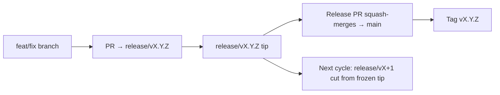

# Branching & Release Model (Latviešu)

🌐 **Languages:** 🇺🇸 [English](../../../../ops/BRANCHING_MODEL.md) · 🇪🇹 [am](../../../am/docs/ops/BRANCHING_MODEL.md) · 🇸🇦 [ar](../../../ar/docs/ops/BRANCHING_MODEL.md) · 🇦🇿 [az](../../../az/docs/ops/BRANCHING_MODEL.md) · 🇧🇬 [bg](../../../bg/docs/ops/BRANCHING_MODEL.md) · 🇧🇩 [bn](../../../bn/docs/ops/BRANCHING_MODEL.md) · 🇨🇿 [cs](../../../cs/docs/ops/BRANCHING_MODEL.md) · 🇩🇰 [da](../../../da/docs/ops/BRANCHING_MODEL.md) · 🇩🇪 [de](../../../de/docs/ops/BRANCHING_MODEL.md) · 🇬🇷 [el](../../../el/docs/ops/BRANCHING_MODEL.md) · 🇪🇸 [es](../../../es/docs/ops/BRANCHING_MODEL.md) · 🇪🇪 [et](../../../et/docs/ops/BRANCHING_MODEL.md) · 🇮🇷 [fa](../../../fa/docs/ops/BRANCHING_MODEL.md) · 🇫🇮 [fi](../../../fi/docs/ops/BRANCHING_MODEL.md) · 🇫🇷 [fr](../../../fr/docs/ops/BRANCHING_MODEL.md) · 🇮🇪 [ga](../../../ga/docs/ops/BRANCHING_MODEL.md) · 🇮🇳 [gu](../../../gu/docs/ops/BRANCHING_MODEL.md) · 🇳🇬 [ha](../../../ha/docs/ops/BRANCHING_MODEL.md) · 🇮🇱 [he](../../../he/docs/ops/BRANCHING_MODEL.md) · 🇮🇳 [hi](../../../hi/docs/ops/BRANCHING_MODEL.md) · 🇭🇷 [hr](../../../hr/docs/ops/BRANCHING_MODEL.md) · 🇭🇺 [hu](../../../hu/docs/ops/BRANCHING_MODEL.md) · 🇦🇲 [hy](../../../hy/docs/ops/BRANCHING_MODEL.md) · 🇮🇩 [id](../../../id/docs/ops/BRANCHING_MODEL.md) · 🇳🇬 [ig](../../../ig/docs/ops/BRANCHING_MODEL.md) · 🇮🇹 [it](../../../it/docs/ops/BRANCHING_MODEL.md) · 🇯🇵 [ja](../../../ja/docs/ops/BRANCHING_MODEL.md) · 🇬🇪 [ka](../../../ka/docs/ops/BRANCHING_MODEL.md) · 🇰🇭 [km](../../../km/docs/ops/BRANCHING_MODEL.md) · 🇮🇳 [kn](../../../kn/docs/ops/BRANCHING_MODEL.md) · 🇰🇷 [ko](../../../ko/docs/ops/BRANCHING_MODEL.md) · 🇱🇹 [lt](../../../lt/docs/ops/BRANCHING_MODEL.md) · 🇮🇳 [ml](../../../ml/docs/ops/BRANCHING_MODEL.md) · 🇮🇳 [mr](../../../mr/docs/ops/BRANCHING_MODEL.md) · 🇲🇾 [ms](../../../ms/docs/ops/BRANCHING_MODEL.md) · 🇲🇹 [mt](../../../mt/docs/ops/BRANCHING_MODEL.md) · 🇲🇲 [my](../../../my/docs/ops/BRANCHING_MODEL.md) · 🇳🇵 [ne](../../../ne/docs/ops/BRANCHING_MODEL.md) · 🇳🇱 [nl](../../../nl/docs/ops/BRANCHING_MODEL.md) · 🇳🇴 [no](../../../no/docs/ops/BRANCHING_MODEL.md) · 🇮🇳 [or](../../../or/docs/ops/BRANCHING_MODEL.md) · 🇮🇳 [pa](../../../pa/docs/ops/BRANCHING_MODEL.md) · 🇵🇭 [phi](../../../phi/docs/ops/BRANCHING_MODEL.md) · 🇵🇱 [pl](../../../pl/docs/ops/BRANCHING_MODEL.md) · 🇵🇹 [pt](../../../pt/docs/ops/BRANCHING_MODEL.md) · 🇧🇷 [pt-BR](../../../pt-BR/docs/ops/BRANCHING_MODEL.md) · 🇷🇴 [ro](../../../ro/docs/ops/BRANCHING_MODEL.md) · 🇷🇺 [ru](../../../ru/docs/ops/BRANCHING_MODEL.md) · 🇱🇰 [si](../../../si/docs/ops/BRANCHING_MODEL.md) · 🇸🇰 [sk](../../../sk/docs/ops/BRANCHING_MODEL.md) · 🇸🇮 [sl](../../../sl/docs/ops/BRANCHING_MODEL.md) · 🇷🇸 [sr](../../../sr/docs/ops/BRANCHING_MODEL.md) · 🇸🇪 [sv](../../../sv/docs/ops/BRANCHING_MODEL.md) · 🇰🇪 [sw](../../../sw/docs/ops/BRANCHING_MODEL.md) · 🇮🇳 [ta](../../../ta/docs/ops/BRANCHING_MODEL.md) · 🇮🇳 [te](../../../te/docs/ops/BRANCHING_MODEL.md) · 🇹🇭 [th](../../../th/docs/ops/BRANCHING_MODEL.md) · 🇹🇷 [tr](../../../tr/docs/ops/BRANCHING_MODEL.md) · 🇺🇦 [uk-UA](../../../uk-UA/docs/ops/BRANCHING_MODEL.md) · 🇵🇰 [ur](../../../ur/docs/ops/BRANCHING_MODEL.md) · 🇺🇿 [uz](../../../uz/docs/ops/BRANCHING_MODEL.md) · 🇻🇳 [vi](../../../vi/docs/ops/BRANCHING_MODEL.md) · 🇳🇬 [yo](../../../yo/docs/ops/BRANCHING_MODEL.md) · 🇨🇳 [zh-CN](../../../zh-CN/docs/ops/BRANCHING_MODEL.md) · 🇹🇼 [zh-TW](../../../zh-TW/docs/ops/BRANCHING_MODEL.md)

---

OmniRoute izmanto **paralēlo ciklu** laidienu modeli: aktīvajam ciklam ir
paredzēts atsevišķs `release/vX.Y.Z` zars, `main` ir paredzēts publicētajai
versiju līnijai, un, izlaižot cikla laidienu, tiek izveidots nemainīgs
`vX.Y.Z` tags. Ir sagaidāms, ka izmaiņu iesniegumi nonāk gan `release/*`, _gan_
`main` zarā — tā nav kļūda.

Uzturētājiem paredzētā detalizētā informācija ir atrodama `CLAUDE.md`
(21. stingrais noteikums) un
[RELEASE_CHECKLIST.md](./RELEASE_CHECKLIST.md). Šī lapa ir publisks,
līdzautoriem paredzēts kopsavilkums.

## Īsumā

| Atsauce          | Loma                                                                                            |
| ---------------- | ----------------------------------------------------------------------------------------------- |
| `release/vX.Y.Z` | **Aktīvais cikls** — šīs versijas ikdienas izstrādei un PR apvienošanai                         |
| `main`           | **Publicētā versiju līnija** — saņem ciklu, izmantojot squash-merge, kad tiek izlaists laidiens |
| `vX.Y.Z` (tags)  | **Laidiena marķieris** — nemainīga norāde uz izlaisto saturu, kas tiek izveidota laidiena brīdī |



## Kuram zaram jābūt mana PR mērķim?

**Kā mērķi izvēlieties aktīvo `release/vX.Y.Z` zaru, nevis `main`.**

1. Atrodiet atvērto `release/v*` zaru ar visaugstāko versiju (piemērs šī
   dokumenta rakstīšanas laikā: `release/v3.8.49`).
2. Izveidojiet savu zaru no tā galotnes (`git fetch` + checkout / rebase uz tā).
3. Atveriet PR ar **base = šo `release/vX.Y.Z`**.

`main` nav ikdienas integrācijas zars. PR, kas atvērti ar mērķi `main`, parasti
pirms apvienošanas ir jāpārvirza uz citu mērķa zaru.

## Laidiena iesaldēšana (paralēlie cikli)

Kad notiek laidiena saskaņošana, tiek atvērts marķiera pieteikums ar etiķeti
`release-freeze`. Tas **neaptur izstrādi**:

- Iesaldētais `release/vX.Y.Z` ir attiecīgā laidiena vadītāja pārziņā.
- Nākamā cikla `release/vX+1` zars tiek izveidots no iesaldētās galotnes, lai
  līdzautori varētu turpināt iesniegt izmaiņas.
- Atvērtie PR, kuru mērķis joprojām ir iesaldētais zars, ir **jāpārvirza** uz
  aktīvo `release/v*` zaru ar visaugstāko versiju.

Pirms pieņemt, ka vajadzīgajā zarā drīkst veikt apvienošanu, pārbaudiet, vai nav
aktīvas iesaldēšanas:

```bash
gh issue list --repo diegosouzapw/OmniRoute --label release-freeze --state open
```

Apvienošanas mehānika (īpašnieka `queue` etiķete → Mergify) ir dokumentēta
[MERGE_TRAIN.md](./MERGE_TRAIN.md).

## Kāpēc vajadzīgs gan zars, gan tags?

| Artefakts        | Darbības ilgums   | Mērķis                                                                     |
| ---------------- | ----------------- | -------------------------------------------------------------------------- |
| `release/vX.Y.Z` | Aktīvais cikls    | Apkopo pārskatītos PR, uztur sekmīgu CI stāvokli un kalpo kā PR bāzes zars |
| Tags `vX.Y.Z`    | Uz visiem laikiem | Marķē precīzu saturu, kas tika publicēts npm / GitHub Releases             |

Zars ir darbnīca; tags ir aizzīmogotā pakotne. Pēc squash-merge uz `main`
nākamais cikls turpinās zarā `release/vX+1`, negaidot, kamēr tiks pabeigts
iepriekšējā laidiena PR.

## Saistītā dokumentācija

- [CONTRIBUTING.md](../../CONTRIBUTING.md) — iestatīšana, testi, PR kontrolsaraksts
- [RELEASE_CHECKLIST.md](./RELEASE_CHECKLIST.md) — pārbaudes pirms laidiena
- [MERGE_TRAIN.md](./MERGE_TRAIN.md) — apvienošanas rinda un rezerves apvienošanas secība
- [RELEASE_GREEN.md](./RELEASE_GREEN.md) — laidiena zara galotnes sekmīga stāvokļa uzturēšana
