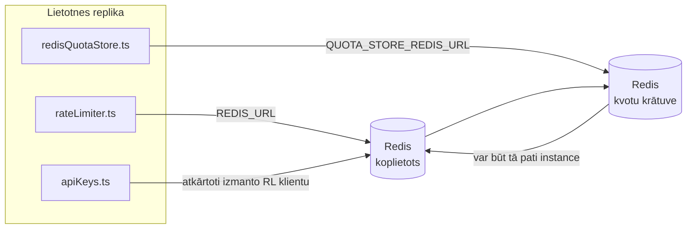

# Redis Production Configuration Guide (Latviešu)

🌐 **Languages:** 🇺🇸 [English](../../../../ops/REDIS_PRODUCTION_CONFIG.md) · 🇪🇹 [am](../../../am/docs/ops/REDIS_PRODUCTION_CONFIG.md) · 🇸🇦 [ar](../../../ar/docs/ops/REDIS_PRODUCTION_CONFIG.md) · 🇦🇿 [az](../../../az/docs/ops/REDIS_PRODUCTION_CONFIG.md) · 🇧🇬 [bg](../../../bg/docs/ops/REDIS_PRODUCTION_CONFIG.md) · 🇧🇩 [bn](../../../bn/docs/ops/REDIS_PRODUCTION_CONFIG.md) · 🇨🇿 [cs](../../../cs/docs/ops/REDIS_PRODUCTION_CONFIG.md) · 🇩🇰 [da](../../../da/docs/ops/REDIS_PRODUCTION_CONFIG.md) · 🇩🇪 [de](../../../de/docs/ops/REDIS_PRODUCTION_CONFIG.md) · 🇬🇷 [el](../../../el/docs/ops/REDIS_PRODUCTION_CONFIG.md) · 🇪🇸 [es](../../../es/docs/ops/REDIS_PRODUCTION_CONFIG.md) · 🇪🇪 [et](../../../et/docs/ops/REDIS_PRODUCTION_CONFIG.md) · 🇮🇷 [fa](../../../fa/docs/ops/REDIS_PRODUCTION_CONFIG.md) · 🇫🇮 [fi](../../../fi/docs/ops/REDIS_PRODUCTION_CONFIG.md) · 🇫🇷 [fr](../../../fr/docs/ops/REDIS_PRODUCTION_CONFIG.md) · 🇮🇪 [ga](../../../ga/docs/ops/REDIS_PRODUCTION_CONFIG.md) · 🇮🇳 [gu](../../../gu/docs/ops/REDIS_PRODUCTION_CONFIG.md) · 🇳🇬 [ha](../../../ha/docs/ops/REDIS_PRODUCTION_CONFIG.md) · 🇮🇱 [he](../../../he/docs/ops/REDIS_PRODUCTION_CONFIG.md) · 🇮🇳 [hi](../../../hi/docs/ops/REDIS_PRODUCTION_CONFIG.md) · 🇭🇷 [hr](../../../hr/docs/ops/REDIS_PRODUCTION_CONFIG.md) · 🇭🇺 [hu](../../../hu/docs/ops/REDIS_PRODUCTION_CONFIG.md) · 🇦🇲 [hy](../../../hy/docs/ops/REDIS_PRODUCTION_CONFIG.md) · 🇮🇩 [id](../../../id/docs/ops/REDIS_PRODUCTION_CONFIG.md) · 🇳🇬 [ig](../../../ig/docs/ops/REDIS_PRODUCTION_CONFIG.md) · 🇮🇹 [it](../../../it/docs/ops/REDIS_PRODUCTION_CONFIG.md) · 🇯🇵 [ja](../../../ja/docs/ops/REDIS_PRODUCTION_CONFIG.md) · 🇬🇪 [ka](../../../ka/docs/ops/REDIS_PRODUCTION_CONFIG.md) · 🇰🇭 [km](../../../km/docs/ops/REDIS_PRODUCTION_CONFIG.md) · 🇮🇳 [kn](../../../kn/docs/ops/REDIS_PRODUCTION_CONFIG.md) · 🇰🇷 [ko](../../../ko/docs/ops/REDIS_PRODUCTION_CONFIG.md) · 🇱🇹 [lt](../../../lt/docs/ops/REDIS_PRODUCTION_CONFIG.md) · 🇮🇳 [ml](../../../ml/docs/ops/REDIS_PRODUCTION_CONFIG.md) · 🇮🇳 [mr](../../../mr/docs/ops/REDIS_PRODUCTION_CONFIG.md) · 🇲🇾 [ms](../../../ms/docs/ops/REDIS_PRODUCTION_CONFIG.md) · 🇲🇹 [mt](../../../mt/docs/ops/REDIS_PRODUCTION_CONFIG.md) · 🇲🇲 [my](../../../my/docs/ops/REDIS_PRODUCTION_CONFIG.md) · 🇳🇵 [ne](../../../ne/docs/ops/REDIS_PRODUCTION_CONFIG.md) · 🇳🇱 [nl](../../../nl/docs/ops/REDIS_PRODUCTION_CONFIG.md) · 🇳🇴 [no](../../../no/docs/ops/REDIS_PRODUCTION_CONFIG.md) · 🇮🇳 [or](../../../or/docs/ops/REDIS_PRODUCTION_CONFIG.md) · 🇮🇳 [pa](../../../pa/docs/ops/REDIS_PRODUCTION_CONFIG.md) · 🇵🇭 [phi](../../../phi/docs/ops/REDIS_PRODUCTION_CONFIG.md) · 🇵🇱 [pl](../../../pl/docs/ops/REDIS_PRODUCTION_CONFIG.md) · 🇵🇹 [pt](../../../pt/docs/ops/REDIS_PRODUCTION_CONFIG.md) · 🇧🇷 [pt-BR](../../../pt-BR/docs/ops/REDIS_PRODUCTION_CONFIG.md) · 🇷🇴 [ro](../../../ro/docs/ops/REDIS_PRODUCTION_CONFIG.md) · 🇷🇺 [ru](../../../ru/docs/ops/REDIS_PRODUCTION_CONFIG.md) · 🇱🇰 [si](../../../si/docs/ops/REDIS_PRODUCTION_CONFIG.md) · 🇸🇰 [sk](../../../sk/docs/ops/REDIS_PRODUCTION_CONFIG.md) · 🇸🇮 [sl](../../../sl/docs/ops/REDIS_PRODUCTION_CONFIG.md) · 🇷🇸 [sr](../../../sr/docs/ops/REDIS_PRODUCTION_CONFIG.md) · 🇸🇪 [sv](../../../sv/docs/ops/REDIS_PRODUCTION_CONFIG.md) · 🇰🇪 [sw](../../../sw/docs/ops/REDIS_PRODUCTION_CONFIG.md) · 🇮🇳 [ta](../../../ta/docs/ops/REDIS_PRODUCTION_CONFIG.md) · 🇮🇳 [te](../../../te/docs/ops/REDIS_PRODUCTION_CONFIG.md) · 🇹🇭 [th](../../../th/docs/ops/REDIS_PRODUCTION_CONFIG.md) · 🇹🇷 [tr](../../../tr/docs/ops/REDIS_PRODUCTION_CONFIG.md) · 🇺🇦 [uk-UA](../../../uk-UA/docs/ops/REDIS_PRODUCTION_CONFIG.md) · 🇵🇰 [ur](../../../ur/docs/ops/REDIS_PRODUCTION_CONFIG.md) · 🇺🇿 [uz](../../../uz/docs/ops/REDIS_PRODUCTION_CONFIG.md) · 🇻🇳 [vi](../../../vi/docs/ops/REDIS_PRODUCTION_CONFIG.md) · 🇳🇬 [yo](../../../yo/docs/ops/REDIS_PRODUCTION_CONFIG.md) · 🇨🇳 [zh-CN](../../../zh-CN/docs/ops/REDIS_PRODUCTION_CONFIG.md) · 🇹🇼 [zh-TW](../../../zh-TW/docs/ops/REDIS_PRODUCTION_CONFIG.md)

---

## Pārskats

Redis ir **neobligāta, vāja atkarība** OmniRoute sistēmā — ja Redis nav pieejams, lietojumprogramma turpina darboties ar ierobežotu funkcionalitāti (izmantojot rezerves risinājumus operatīvajā atmiņā). Produkcijas vidē Redis optimizēšana samazina latentumu četrām atšķirīgām darba slodzēm:

| Darba slodze                      | Realizācija                   | Klienta fabrika                                                | Atslēgu modelis                                                    |
| --------------------------------- | ----------------------------- | -------------------------------------------------------------- | ------------------------------------------------------------------ |
| Pieprasījumu biežuma ierobežošana | `rateLimiter.ts`              | `getRedisClient()` — slinki inicializēts `ioredis` vienobjekts | `<prefix>rl:*` Lua atomāri pieprasījumu biežuma ierobežošanas logi |
| Autentifikācijas kešatmiņa        | `apiKeys.ts`                  | Atkārtoti izmanto `rateLimiter` klientu                        | `<prefix>auth:api_key:<sha256>` ar TTL                             |
| Kvotu krātuve                     | `redisQuotaStore.ts`          | Atsevišķs `getRedisClient(url)` vienobjekts                    | `<prefix>quota:*`, konfigurējams katrai instancei                  |
| Iesildīšanas ķēdes pārtraucējs    | `redisCircuitBreakerStore.ts` | Atsevišķs klients failā `circuitBreakerFactory.ts`             | `<prefix>warmup:cb:<connectionId>`                                 |

Visas četras darba slodzes izmanto vienu nosaukumvietas prefiksu, lai OmniRoute varētu pastāvēt līdzās citām lietojumprogrammām vienā Redis instancē (piem., `127.0.0.1:6379`). Skatiet sadaļu [Atslēgu nosaukumvietas](#key-namespacing).

---

## Pašreizējā konfigurācija (koda noklusējuma vērtības)

| Iestatījums                             | Vērtība                                                                  | Atrašanās vieta                                                                       |
| --------------------------------------- | ------------------------------------------------------------------------ | ------------------------------------------------------------------------------------- |
| `REDIS_URL` vides mainīgais             | `redis://redis:6379` (compose), neobligāts                               | `rateLimiter.ts:5`, `.env.example`                                                    |
| `REDIS_KEY_PREFIX` vides mainīgais      | `omniroute:` (noklusējums)                                               | `rateLimiter.ts`, `redisQuotaStore.ts`, `redisCircuitBreakerStore.ts`, `.env.example` |
| `QUOTA_STORE_REDIS_URL` vides mainīgais | atsevišķs, var atšķirties no `REDIS_URL`                                 | `quota/storeFactory.ts`                                                               |
| `QUOTA_STORE_DRIVER`                    | `"sqlite"` (noklusējums), `"redis"` neobligāts                           | `quota/storeFactory.ts`                                                               |
| ioredis `maxRetriesPerRequest`          | `3`                                                                      | `rateLimiter.ts` klienta izveide                                                      |
| `enableReadyCheck`                      | nav iestatīts (ioredis noklusējums: `true`)                              | —                                                                                     |
| `lazyConnect`                           | nav iestatīts (ioredis noklusējums: `false`)                             | —                                                                                     |
| `retryStrategy`                         | nav iestatīts (ioredis noklusējums: 200ms bāze, eksponenciāls pieaugums) | —                                                                                     |
| TLS / parole / DB indekss               | **nav konfigurēts**                                                      | —                                                                                     |
| Sentinel / Cluster                      | **nav konfigurēts** — tikai savrupa viena mezgla instance                | —                                                                                     |

---

## Atslēgu nosaukumvietas

OmniRoute koplieto Redis instanci ar visu pārējo, kas darbojas resursdatorā. Bez nosaukumvietas tādas atslēgas kā `auth:api_key:<sha256>` vai `rl:*` varētu konfliktēt ar atslēgām no citām lietojumprogrammām, kas izmanto to pašu Redis (šī instance darbojas adresē `127.0.0.1:6379` kopā ar citiem pakalpojumiem).

Iestatiet `REDIS_KEY_PREFIX` kā netukšu virkni, lai pievienotu prefiksu **katrai** OmniRoute atslēgai:

```bash
# .env — visas OmniRoute atslēgas kļūst par omniroute:rl:*, omniroute:auth:*, omniroute:quota:*, omniroute:warmup:cb:*
REDIS_KEY_PREFIX=omniroute:
```

- **Noklusējums:** `omniroute:` (tiek izmantots, ja `REDIS_KEY_PREFIX` nav iestatīts vai ir tukšs).
- **Tiek lietots:** pieprasījumu biežuma ierobežotājam un autentifikācijas kešatmiņai (koplietots `ioredis` klients, izmantojot `keyPrefix`), kvotu krātuvei (`KEY_PREFIX = "${REDIS_KEY_PREFIX}quota"`) un iesildīšanas ķēdes pārtraucējam (`KEY_PREFIX = "${REDIS_KEY_PREFIX}warmup:cb:"`).
- **Prefiksa maiņa**, ja Redis jau pastāv atslēgas, atstāj vecās atslēgas bez izmantotāja (to derīgums beidzas, izmantojot TTL / LRU). To var droši mainīt; migrācija nav nepieciešama. Vienīgais izņēmums ir iesildīšanas ķēdes pārtraucēja atslēga savienojumam, kas atzīmēts kā aizliegts: tā tiek saglabāta bez TTL, tāpēc uzskaitiet atlikušās atslēgas ar `redis-cli --scan --pattern '<old-prefix>warmup:cb:*'` un izdzēsiet tās.
- **ioredis `keyPrefix`** automātiski pievieno prefiksu rakstīšanas laikā **un** noņem to lasīšanas laikā, tāpēc lietojumprogrammas kods prefiksu nekad neredz.

---

## Ieteicamā produkcijas vides optimizācija

### 1. Savienojumu pūla / klienta opcijas (ioredis `Redis` konstruktors)

Pašreizējais kods izveido vienu `new Redis(url)` bez pielāgotām opcijām. Produkcijas vides
izvietojumiem ar vairākām replikām nododiet klienta fabriku kodā vai aptiniet `getRedisClient()`:

```typescript
const redis = new Redis(REDIS_URL, {
  maxRetriesPerRequest: null, // bez atkārtošanas ierobežojuma; lēmumu pieņem retryStrategy
  enableReadyCheck: true, // pirms izsaukumu pieņemšanas pārbauda, vai serveris ir gatavs
  lazyConnect: true, // neveido savienojumu inicializācijas laikā; gaida pirmo izsaukumu
  retryStrategy: (times) => {
    if (times > 10) return null; // pārtrauc pēc 10 mēģinājumiem → vēlāk izveido savienojumu atkārtoti
    return Math.min(times * 200, 5000); // 200 ms, 400 ms, …, maksimums 5 s
  },
  enableAutoPipelining: true, // apvieno vienlaicīgas komandas vienā TCP rakstīšanas operācijā
  keepAlive: 10000, // TCP savienojuma uzturēšanas pārbaude ik pēc 10 s
});
```

**Galvenie kompromisi:**

- `maxRetriesPerRequest: null` + `retryStrategy` — ieteicams produkcijas videi, lai īslaicīga
  Redis restartēšana neizraisītu tūlītēju katra pieprasījuma kļūmi. Atmiņā glabātais rezerves
  mehānisms funkcijā `checkRateLimit()` pārņem kļūmes apstrādi.
- `lazyConnect: true` — novērš palaišanas atkarību no Redis pieejamības, pirms serveris
  sāk pieņemt savienojumus.
- `enableAutoPipelining: true` — samazina turp-atpakaļ pieprasījumu skaitu vienlaicīgām ātruma ierobežojuma pārbaudēm;
  noderīgi, ja vienā savienojumā ir >50 RPS.

### 2. Redis servera konfigurācija (`redis.conf`)

```
# Atmiņa
maxmemory 80%                        # atstāj vietu OS lapu kešatmiņai
maxmemory-policy allkeys-lru         # slodzes apstākļos izstumj novecojušos autentifikācijas kešatmiņas ierakstus

# Persistēšana (neobligāta — OmniRoute ir noturīgs pret avārijām arī bez tās)
save 300 1                           # momentuzņēmums vismaz ik pēc 5 min, ja mainīta ≥1 atslēga
appendonly no                        # AOF nav nepieciešams; datus var atjaunot
appendfsync no                       # nav fsync papildu izmaksu (pietiek ar RDB)

# Tīkls
timeout 0                            # neatvieno dīkstāvē esošus savienojumus
tcp-keepalive 300                    # savienojuma uzturēšanas pārbaude ik pēc 5 min
tcp-backlog 511                      # savienojumu rinda strauji pieaugošai slodzei

# Veiktspēja
hz 10                                # noklusējums; 100 pret latentumu jutīgām sistēmām
activedefrag yes                     # automātiska defragmentēšana, ja fragmentācija pārsniedz 10%
```

**Kompromiss opcijai `maxmemory-policy allkeys-lru`:** Atmiņas trūkuma gadījumā
autentifikācijas kešatmiņas ieraksti var tikt izstumti. Tas ir droši — `setCachedApiKey` vienmēr
atkārtoti aizpilda kešatmiņu neatrasta ieraksta gadījumā, un SQLite rezerves avots ir autoritatīvs.
Ātruma ierobežotāja Lua skripts izveido nelielas atslēgas, kas pēc konstrukcijas ir īslaicīgas.

### 3. Docker Compose iestatījumi

Produkcijas vides Compose konfigurācija (`docker-compose.prod.yml`) izmanto `redis:8.6.2-alpine`. Pievienojiet:

```yaml
redis:
  image: redis:8.6.2-alpine
  command:
    [
      "redis-server",
      "--maxmemory",
      "512mb",
      "--maxmemory-policy",
      "allkeys-lru",
      "--activedefrag",
      "yes",
      "--save",
      "300 1",
    ]
  healthcheck:
    test: ["CMD", "redis-cli", "ping"]
    interval: 10s
    timeout: 3s
    retries: 3
    start_period: 5s
```

### 4. Vairāku instanču / mērogošanas apsvērumi

**Viens Redis visām replikām** — ātruma ierobežotāja Lua skripts ir atkarīgs no vienas
autoritatīvas atslēgu telpas. Vairākas Redis instances aiz replikām zaudētu atomārumu
un dubultotu budžetu. Visām lietojumprogrammas replikām izmantojiet vienu Redis
(vai Redis Sentinel klasteri ar kļūmjpārlēci).

**Savienojumu skaits:** Katra lietojumprogrammas replika izveido **2 TCP savienojumus** ar Redis
(ātruma ierobežotāja klients + kvotu krātuves klients). Ar 10 replikām → 20 savienojumi, kas ir
krietni zem Redis instances noklusējuma 10 tūkstošu savienojumu ierobežojuma.

### 5. Uzraudzība

Nodrošiniet veselības pārbaudes galapunktā:

```typescript
// src/app/api/monitoring/health/route.ts jau izsauc rateLimiter funkcijas
// Pievienojiet Redis specifiskas pārbaudes:
//   1. PING latentums, izmantojot ioredis .ping()
//   2. Atmiņas lietojums, izmantojot INFO memory
//   3. Savienojumu skaits, izmantojot INFO clients
//   4. maxmemory-policy trāpījumu īpatsvars (evicted_keys / keyspace_hits)
```

Galvenie uzraugāmie rādītāji:

- **Izstumtās atslēgas / sek.** — ja vērtība ilgstoši nav nulle, palieliniet `maxmemory`
- **Bloķētie klienti** — vērtība, kas nav nulle, norāda uz lēniem Lua skriptiem vai augstu konkurenci
- **Noraidītie savienojumi** — sasniegts savienojumu ierobežojums; reti sastopams ar 20 savienojumiem

---

## Arhitektūras diagramma



---

## Atsauces

| Fails                              | Nolūks                                                                                |
| ---------------------------------- | ------------------------------------------------------------------------------------- |
| `src/shared/utils/rateLimiter.ts`  | Primārais Redis klients, Lua ātruma ierobežošanas skripts, rezerves risinājums atmiņā |
| `src/lib/db/apiKeys.ts`            | Autentifikācijas kešatmiņa — Redis→SQLite rezerves risinājums                         |
| `src/lib/quota/redisQuotaStore.ts` | Atsevišķs Redis klients izvēles kvotu krātuvei                                        |
| `src/lib/quota/storeFactory.ts`    | Pārslēdzas starp `sqlite` un `redis` kvotu dziņiem                                    |
| `docker-compose.prod.yml`          | Produkcijas Redis konteiners (attēls `redis:8.6.2-alpine`)                            |
| `.env.example`                     | Redis vides mainīgo dokumentācija                                                     |
| `src/app/api/local/redis/`         | API maršruti izstrādes konteinera orķestrēšanai                                       |
| `bin/cli/commands/redis.mjs`       | CLI komandas izstrādes konteinera orķestrēšanai                                       |
