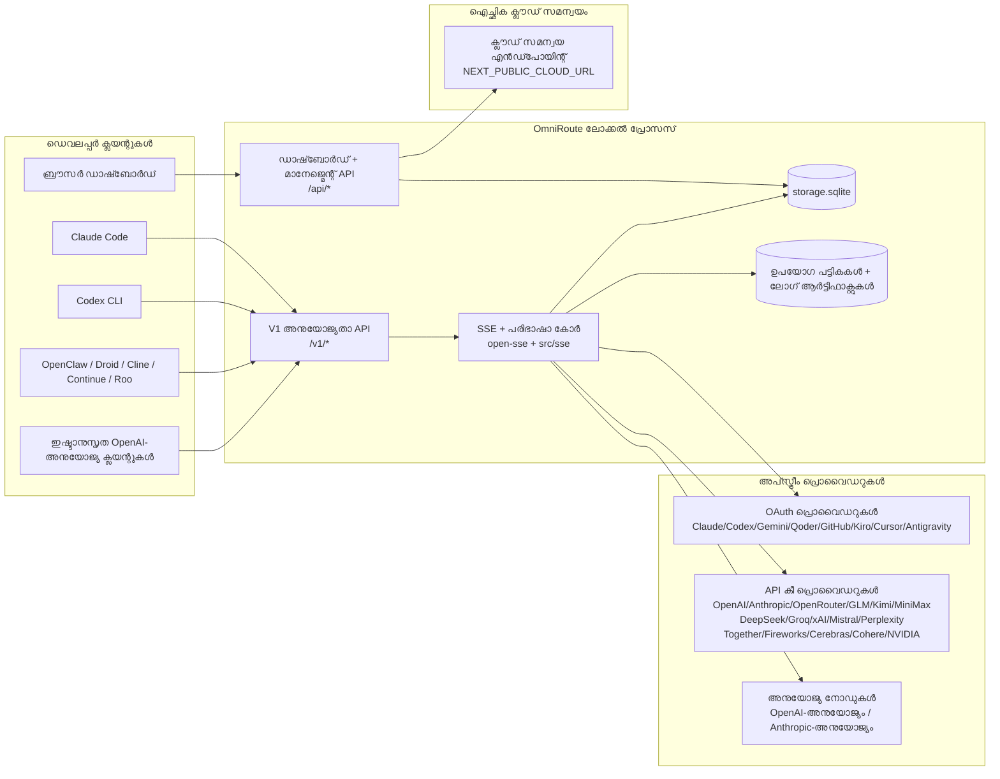
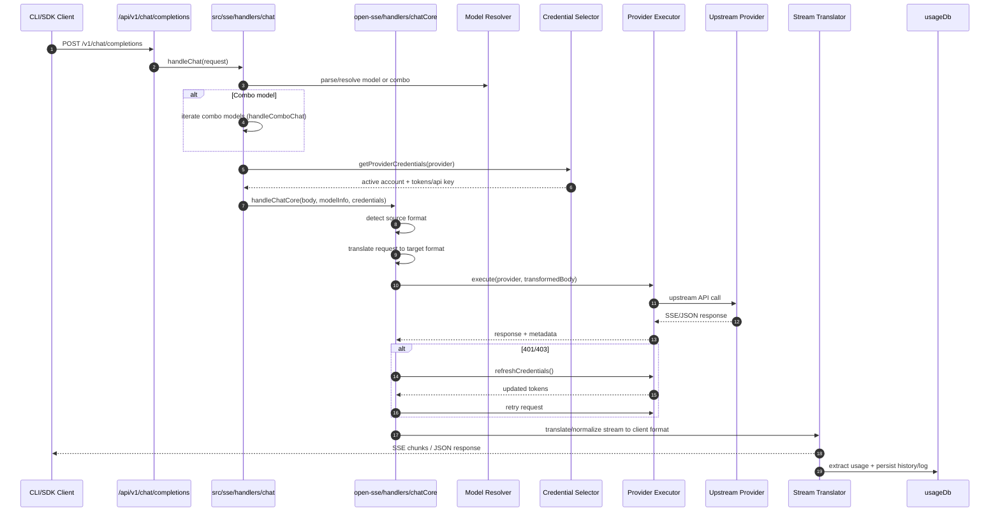
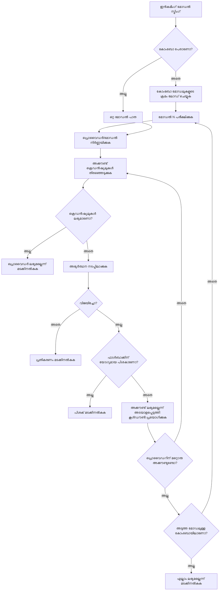
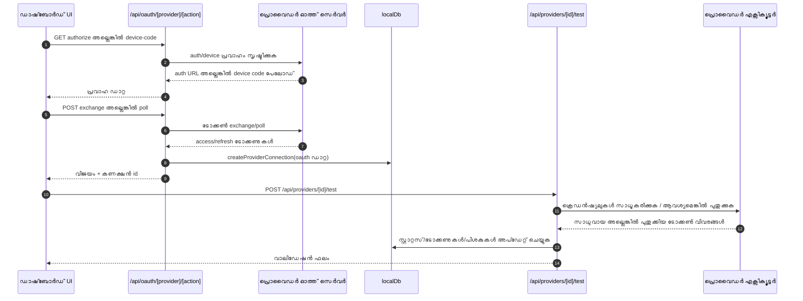
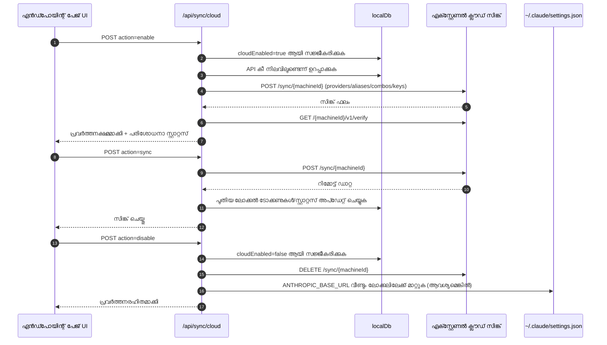
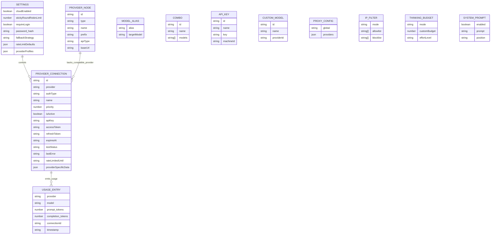
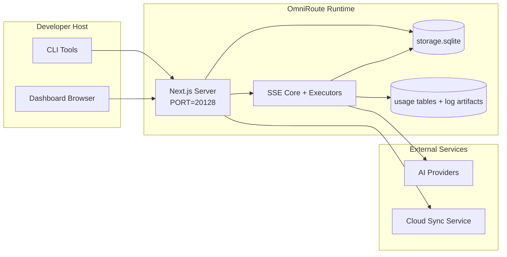

# OmniRoute Architecture (മലയാളം)

🌐 **Languages:** 🇺🇸 [English](../../../../architecture/ARCHITECTURE.md) · 🇪🇹 [am](../../../am/docs/architecture/ARCHITECTURE.md) · 🇸🇦 [ar](../../../ar/docs/architecture/ARCHITECTURE.md) · 🇦🇿 [az](../../../az/docs/architecture/ARCHITECTURE.md) · 🇧🇬 [bg](../../../bg/docs/architecture/ARCHITECTURE.md) · 🇧🇩 [bn](../../../bn/docs/architecture/ARCHITECTURE.md) · 🇨🇿 [cs](../../../cs/docs/architecture/ARCHITECTURE.md) · 🇩🇰 [da](../../../da/docs/architecture/ARCHITECTURE.md) · 🇩🇪 [de](../../../de/docs/architecture/ARCHITECTURE.md) · 🇬🇷 [el](../../../el/docs/architecture/ARCHITECTURE.md) · 🇪🇸 [es](../../../es/docs/architecture/ARCHITECTURE.md) · 🇪🇪 [et](../../../et/docs/architecture/ARCHITECTURE.md) · 🇮🇷 [fa](../../../fa/docs/architecture/ARCHITECTURE.md) · 🇫🇮 [fi](../../../fi/docs/architecture/ARCHITECTURE.md) · 🇫🇷 [fr](../../../fr/docs/architecture/ARCHITECTURE.md) · 🇮🇪 [ga](../../../ga/docs/architecture/ARCHITECTURE.md) · 🇮🇳 [gu](../../../gu/docs/architecture/ARCHITECTURE.md) · 🇳🇬 [ha](../../../ha/docs/architecture/ARCHITECTURE.md) · 🇮🇱 [he](../../../he/docs/architecture/ARCHITECTURE.md) · 🇮🇳 [hi](../../../hi/docs/architecture/ARCHITECTURE.md) · 🇭🇷 [hr](../../../hr/docs/architecture/ARCHITECTURE.md) · 🇭🇺 [hu](../../../hu/docs/architecture/ARCHITECTURE.md) · 🇦🇲 [hy](../../../hy/docs/architecture/ARCHITECTURE.md) · 🇮🇩 [id](../../../id/docs/architecture/ARCHITECTURE.md) · 🇳🇬 [ig](../../../ig/docs/architecture/ARCHITECTURE.md) · 🇮🇹 [it](../../../it/docs/architecture/ARCHITECTURE.md) · 🇯🇵 [ja](../../../ja/docs/architecture/ARCHITECTURE.md) · 🇬🇪 [ka](../../../ka/docs/architecture/ARCHITECTURE.md) · 🇰🇭 [km](../../../km/docs/architecture/ARCHITECTURE.md) · 🇮🇳 [kn](../../../kn/docs/architecture/ARCHITECTURE.md) · 🇰🇷 [ko](../../../ko/docs/architecture/ARCHITECTURE.md) · 🇱🇹 [lt](../../../lt/docs/architecture/ARCHITECTURE.md) · 🇱🇻 [lv](../../../lv/docs/architecture/ARCHITECTURE.md) · 🇮🇳 [mr](../../../mr/docs/architecture/ARCHITECTURE.md) · 🇲🇾 [ms](../../../ms/docs/architecture/ARCHITECTURE.md) · 🇲🇹 [mt](../../../mt/docs/architecture/ARCHITECTURE.md) · 🇲🇲 [my](../../../my/docs/architecture/ARCHITECTURE.md) · 🇳🇵 [ne](../../../ne/docs/architecture/ARCHITECTURE.md) · 🇳🇱 [nl](../../../nl/docs/architecture/ARCHITECTURE.md) · 🇳🇴 [no](../../../no/docs/architecture/ARCHITECTURE.md) · 🇮🇳 [or](../../../or/docs/architecture/ARCHITECTURE.md) · 🇮🇳 [pa](../../../pa/docs/architecture/ARCHITECTURE.md) · 🇵🇭 [phi](../../../phi/docs/architecture/ARCHITECTURE.md) · 🇵🇱 [pl](../../../pl/docs/architecture/ARCHITECTURE.md) · 🇵🇹 [pt](../../../pt/docs/architecture/ARCHITECTURE.md) · 🇧🇷 [pt-BR](../../../pt-BR/docs/architecture/ARCHITECTURE.md) · 🇷🇴 [ro](../../../ro/docs/architecture/ARCHITECTURE.md) · 🇷🇺 [ru](../../../ru/docs/architecture/ARCHITECTURE.md) · 🇱🇰 [si](../../../si/docs/architecture/ARCHITECTURE.md) · 🇸🇰 [sk](../../../sk/docs/architecture/ARCHITECTURE.md) · 🇸🇮 [sl](../../../sl/docs/architecture/ARCHITECTURE.md) · 🇷🇸 [sr](../../../sr/docs/architecture/ARCHITECTURE.md) · 🇸🇪 [sv](../../../sv/docs/architecture/ARCHITECTURE.md) · 🇰🇪 [sw](../../../sw/docs/architecture/ARCHITECTURE.md) · 🇮🇳 [ta](../../../ta/docs/architecture/ARCHITECTURE.md) · 🇮🇳 [te](../../../te/docs/architecture/ARCHITECTURE.md) · 🇹🇭 [th](../../../th/docs/architecture/ARCHITECTURE.md) · 🇹🇷 [tr](../../../tr/docs/architecture/ARCHITECTURE.md) · 🇺🇦 [uk-UA](../../../uk-UA/docs/architecture/ARCHITECTURE.md) · 🇵🇰 [ur](../../../ur/docs/architecture/ARCHITECTURE.md) · 🇺🇿 [uz](../../../uz/docs/architecture/ARCHITECTURE.md) · 🇻🇳 [vi](../../../vi/docs/architecture/ARCHITECTURE.md) · 🇳🇬 [yo](../../../yo/docs/architecture/ARCHITECTURE.md) · 🇨🇳 [zh-CN](../../../zh-CN/docs/architecture/ARCHITECTURE.md) · 🇹🇼 [zh-TW](../../../zh-TW/docs/architecture/ARCHITECTURE.md)

---

🌐 **Languages:** 🇺🇸 [English](../../../../architecture/ARCHITECTURE.md) · 🇪🇹 [am](../../../am/docs/architecture/ARCHITECTURE.md) · 🇸🇦 [ar](../../../ar/docs/architecture/ARCHITECTURE.md) · 🇦🇿 [az](../../../az/docs/architecture/ARCHITECTURE.md) · 🇧🇬 [bg](../../../bg/docs/architecture/ARCHITECTURE.md) · 🇧🇩 [bn](../../../bn/docs/architecture/ARCHITECTURE.md) · 🇨🇿 [cs](../../../cs/docs/architecture/ARCHITECTURE.md) · 🇩🇰 [da](../../../da/docs/architecture/ARCHITECTURE.md) · 🇩🇪 [de](../../../de/docs/architecture/ARCHITECTURE.md) · 🇬🇷 [el](../../../el/docs/architecture/ARCHITECTURE.md) · 🇪🇸 [es](../../../es/docs/architecture/ARCHITECTURE.md) · 🇪🇪 [et](../../../et/docs/architecture/ARCHITECTURE.md) · 🇮🇷 [fa](../../../fa/docs/architecture/ARCHITECTURE.md) · 🇫🇮 [fi](../../../fi/docs/architecture/ARCHITECTURE.md) · 🇫🇷 [fr](../../../fr/docs/architecture/ARCHITECTURE.md) · 🇮🇪 [ga](../../../ga/docs/architecture/ARCHITECTURE.md) · 🇮🇳 [gu](../../../gu/docs/architecture/ARCHITECTURE.md) · 🇳🇬 [ha](../../../ha/docs/architecture/ARCHITECTURE.md) · 🇮🇱 [he](../../../he/docs/architecture/ARCHITECTURE.md) · 🇮🇳 [hi](../../../hi/docs/architecture/ARCHITECTURE.md) · 🇭🇷 [hr](../../../hr/docs/architecture/ARCHITECTURE.md) · 🇭🇺 [hu](../../../hu/docs/architecture/ARCHITECTURE.md) · 🇦🇲 [hy](../../../hy/docs/architecture/ARCHITECTURE.md) · 🇮🇩 [id](../../../id/docs/architecture/ARCHITECTURE.md) · 🇳🇬 [ig](../../../ig/docs/architecture/ARCHITECTURE.md) · 🇮🇹 [it](../../../it/docs/architecture/ARCHITECTURE.md) · 🇯🇵 [ja](../../../ja/docs/architecture/ARCHITECTURE.md) · 🇬🇪 [ka](../../../ka/docs/architecture/ARCHITECTURE.md) · 🇰🇭 [km](../../../km/docs/architecture/ARCHITECTURE.md) · 🇮🇳 [kn](../../../kn/docs/architecture/ARCHITECTURE.md) · 🇰🇷 [ko](../../../ko/docs/architecture/ARCHITECTURE.md) · 🇱🇹 [lt](../../../lt/docs/architecture/ARCHITECTURE.md) · 🇱🇻 [lv](../../../lv/docs/architecture/ARCHITECTURE.md) · 🇮🇳 [mr](../../../mr/docs/architecture/ARCHITECTURE.md) · 🇲🇾 [ms](../../../ms/docs/architecture/ARCHITECTURE.md) · 🇲🇹 [mt](../../../mt/docs/architecture/ARCHITECTURE.md) · 🇲🇲 [my](../../../my/docs/architecture/ARCHITECTURE.md) · 🇳🇵 [ne](../../../ne/docs/architecture/ARCHITECTURE.md) · 🇳🇱 [nl](../../../nl/docs/architecture/ARCHITECTURE.md) · 🇳🇴 [no](../../../no/docs/architecture/ARCHITECTURE.md) · 🇮🇳 [or](../../../or/docs/architecture/ARCHITECTURE.md) · 🇮🇳 [pa](../../../pa/docs/architecture/ARCHITECTURE.md) · 🇵🇭 [phi](../../../phi/docs/architecture/ARCHITECTURE.md) · 🇵🇱 [pl](../../../pl/docs/architecture/ARCHITECTURE.md) · 🇵🇹 [pt](../../../pt/docs/architecture/ARCHITECTURE.md) · 🇧🇷 [pt-BR](../../../pt-BR/docs/architecture/ARCHITECTURE.md) · 🇷🇴 [ro](../../../ro/docs/architecture/ARCHITECTURE.md) · 🇷🇺 [ru](../../../ru/docs/architecture/ARCHITECTURE.md) · 🇱🇰 [si](../../../si/docs/architecture/ARCHITECTURE.md) · 🇸🇰 [sk](../../../sk/docs/architecture/ARCHITECTURE.md) · 🇸🇮 [sl](../../../sl/docs/architecture/ARCHITECTURE.md) · 🇷🇸 [sr](../../../sr/docs/architecture/ARCHITECTURE.md) · 🇸🇪 [sv](../../../sv/docs/architecture/ARCHITECTURE.md) · 🇰🇪 [sw](../../../sw/docs/architecture/ARCHITECTURE.md) · 🇮🇳 [ta](../../../ta/docs/architecture/ARCHITECTURE.md) · 🇮🇳 [te](../../../te/docs/architecture/ARCHITECTURE.md) · 🇹🇭 [th](../../../th/docs/architecture/ARCHITECTURE.md) · 🇹🇷 [tr](../../../tr/docs/architecture/ARCHITECTURE.md) · 🇺🇦 [uk-UA](../../../uk-UA/docs/architecture/ARCHITECTURE.md) · 🇵🇰 [ur](../../../ur/docs/architecture/ARCHITECTURE.md) · 🇺🇿 [uz](../../../uz/docs/architecture/ARCHITECTURE.md) · 🇻🇳 [vi](../../../vi/docs/architecture/ARCHITECTURE.md) · 🇳🇬 [yo](../../../yo/docs/architecture/ARCHITECTURE.md) · 🇨🇳 [zh-CN](../../../zh-CN/docs/architecture/ARCHITECTURE.md) · 🇹🇼 [zh-TW](../../../zh-TW/docs/architecture/ARCHITECTURE.md)

_അവസാനം പുതുക്കിയത്: 2026-06-28_

## എക്സിക്യൂട്ടീവ് സംഗ്രഹം

Next.js അടിസ്ഥാനമാക്കി നിർമ്മിച്ച ഒരു ലോക്കൽ AI റൂട്ടിംഗ് ഗേറ്റ്വേയും ഡാഷ്ബോർഡുമാണ് OmniRoute.
ഇത് ഒരൊറ്റ OpenAI-അനുയോജ്യമായ എൻഡ്പോയിന്റ് (`/v1/*`) നൽകുകയും വിവർത്തനം, ഫാൾബാക്ക്, ടോക്കൺ പുതുക്കൽ, ഉപയോഗ ട്രാക്കിംഗ് എന്നിവയോടെ ഒന്നിലധികം അപ്സ്ട്രീം പ്രൊവൈഡറുകളിലുടനീളം ട്രാഫിക് റൂട്ട് ചെയ്യുകയും ചെയ്യുന്നു.

പ്രധാന ശേഷികൾ:

- CLI/ടൂളുകൾക്കായുള്ള OpenAI-അനുയോജ്യമായ API ഇന്റർഫേസ് (355 പ്രൊവൈഡറുകൾ, 108 എക്സിക്യൂട്ടറുകൾ)
- പ്രൊവൈഡർ ഫോർമാറ്റുകൾക്കിടയിലെ അഭ്യർത്ഥന/പ്രതികരണ വിവർത്തനം
- മോഡൽ കോംബോ ഫാൾബാക്ക് (ഒന്നിലധികം മോഡലുകളുടെ ക്രമം)
- `compositeTiers` അനുസരിച്ചുള്ള റൺടൈം ക്രമീകരണത്തോടെ ഘടനാബദ്ധമായ കോംബോ ഘട്ടങ്ങൾ (`provider + model + connection`)
- അക്കൗണ്ട്-തല ഫാൾബാക്ക് (ഓരോ പ്രൊവൈഡറിനും ഒന്നിലധികം അക്കൗണ്ടുകൾ)
- പ്രധാന ചാറ്റ് പാതയിലെ ക്വോട്ട പ്രീഫ്ലൈറ്റും ക്വോട്ടയെ പരിഗണിക്കുന്ന P2C അക്കൗണ്ട് തിരഞ്ഞെടുപ്പും
- OAuth + API-key പ്രൊവൈഡർ കണക്ഷൻ മാനേജ്മെന്റ് (22 OAuth പ്രൊവൈഡർ മൊഡ്യൂളുകൾ)
- `/v1/embeddings` വഴിയുള്ള എംബെഡിംഗ് സൃഷ്ടിക്കൽ (18 പ്രൊവൈഡറുകൾ)
- `/v1/images/generations` വഴിയുള്ള ഇമേജ് സൃഷ്ടിക്കൽ (10+ പ്രൊവൈഡറുകൾ, 20+ മോഡലുകൾ)
- `/v1/audio/transcriptions` വഴിയുള്ള ഓഡിയോ ട്രാൻസ്ക്രിപ്ഷൻ (18 പ്രൊവൈഡറുകൾ)
- `/v1/audio/speech` വഴിയുള്ള ടെക്സ്റ്റ്-ടു-സ്പീച്ച് (24 ബിൽറ്റ്-ഇൻ പ്രൊവൈഡറുകൾ)
- `/v1/videos/generations` വഴിയുള്ള വീഡിയോ സൃഷ്ടിക്കൽ (ComfyUI + SD WebUI)
- `/v1/music/generations` വഴിയുള്ള സംഗീത സൃഷ്ടിക്കൽ (ComfyUI)
- `/v1/search` വഴിയുള്ള വെബ് തിരയൽ (20 പ്രൊവൈഡറുകൾ)
- `/v1/moderations` വഴിയുള്ള മോഡറേഷനുകൾ
- `/v1/rerank` വഴിയുള്ള പുനഃറാങ്കിംഗ്
- റീസണിംഗ് മോഡലുകൾക്കായുള്ള തിങ്ക് ടാഗ് പാർസിംഗ് (`<think>...</think>`)
- കർശനമായ OpenAI SDK അനുയോജ്യതയ്ക്കായുള്ള പ്രതികരണ ശുദ്ധീകരണം
- വിവിധ പ്രൊവൈഡറുകൾ തമ്മിലുള്ള അനുയോജ്യതയ്ക്കായുള്ള റോൾ നോർമലൈസേഷൻ (developer→system, system→user)
- ഘടനാബദ്ധമായ ഔട്ട്പുട്ട് പരിവർത്തനം (json_schema → Gemini responseSchema)
- പ്രൊവൈഡറുകൾ, കീകൾ, അപരനാമങ്ങൾ, കോംബോകൾ, ക്രമീകരണങ്ങൾ, വിലനിർണ്ണയം എന്നിവയ്ക്കായുള്ള ലോക്കൽ പെർസിസ്റ്റൻസ് (122 DB മൊഡ്യൂളുകൾ)
- ഉപയോഗം/ചെലവ് ട്രാക്കിംഗും അഭ്യർത്ഥന ലോഗിംഗും
- ഒന്നിലധികം ഉപകരണങ്ങൾ/സ്റ്റേറ്റ് സമന്വയിപ്പിക്കുന്നതിനുള്ള ഐച്ഛിക ക്ലൗഡ് സിങ്ക്
- API ആക്സസ് നിയന്ത്രണത്തിനായുള്ള IP അനുവദനീയപട്ടിക/തടയൽപട്ടിക
- തിങ്കിംഗ് ബജറ്റ് മാനേജ്മെന്റ് (പാസ്ത്രൂ/ഓട്ടോ/കസ്റ്റം/അഡാപ്റ്റീവ്)
- ഗ്ലോബൽ സിസ്റ്റം പ്രോംപ്റ്റ് ഇൻജക്ഷൻ
- സെഷൻ ട്രാക്കിംഗും ഫിംഗർപ്രിന്റിംഗും
- പ്രൊവൈഡർ-നിർദ്ദിഷ്ട പ്രൊഫൈലുകളോടുകൂടിയ ഓരോ അക്കൗണ്ടിനുമുള്ള മെച്ചപ്പെടുത്തിയ റേറ്റ് ലിമിറ്റിംഗ്
- പ്രൊവൈഡർ പ്രതിരോധശേഷിക്കായുള്ള സർക്യൂട്ട് ബ്രേക്കർ പാറ്റേൺ
- മ്യൂട്ടക്സ് ലോക്കിംഗോടുകൂടിയ ആന്റി-തണ്ടറിംഗ് ഹെർഡ് സംരക്ഷണം
- സിഗ്നേച്ചർ അടിസ്ഥാനമാക്കിയുള്ള അഭ്യർത്ഥന ഡിഡ്യൂപ്ലിക്കേഷൻ കാഷെ
- ഡൊമെയ്ൻ ലെയർ: ചെലവ് നിയമങ്ങൾ, ഫാൾബാക്ക് നയം, ലോക്കൗട്ട് നയം
- കോൺടെക്സ്റ്റ് റിലേ: അക്കൗണ്ട് റൊട്ടേഷനിലുടനീളം തുടർച്ച നിലനിർത്തുന്നതിനുള്ള സെഷൻ കൈമാറ്റ സംഗ്രഹങ്ങൾ
- ഡൊമെയ്ൻ സ്റ്റേറ്റ് പെർസിസ്റ്റൻസ് (ഫാൾബാക്കുകൾ, ബജറ്റുകൾ, ലോക്കൗട്ടുകൾ, സർക്യൂട്ട് ബ്രേക്കറുകൾ എന്നിവയ്ക്കുള്ള SQLite റൈറ്റ്-ത്രൂ കാഷെ)
- കേന്ദ്രീകൃത അഭ്യർത്ഥന വിലയിരുത്തലിനുള്ള പോളിസി എൻജിൻ (ലോക്കൗട്ട് → ബജറ്റ് → ഫാൾബാക്ക്)
- p50/p95/p99 ലേറ്റൻസി അഗ്രിഗേഷനോടുകൂടിയ അഭ്യർത്ഥന ടെലിമെട്രി
- `combo_execution_key` / `combo_step_id` വഴിയുള്ള കോംബോ ടാർഗറ്റ് ടെലിമെട്രിയും ചരിത്രപരമായ കോംബോ ടാർഗറ്റ് ആരോഗ്യനിലയും
- എൻഡ്-ടു-എൻഡ് ട്രേസിംഗിനായുള്ള കോറിലേഷൻ ID (X-Request-Id)
- ഓരോ API കീയ്ക്കും ഓപ്റ്റ്-ഔട്ട് സൗകര്യമുള്ള കംപ്ലയൻസ് ഓഡിറ്റ് ലോഗിംഗ്
- LLM ഗുണനിലവാര ഉറപ്പിനായുള്ള ഇവാൽ ഫ്രെയിംവർക്ക്
- തത്സമയ പ്രൊവൈഡർ സർക്യൂട്ട് ബ്രേക്കർ നിലയോടുകൂടിയ ആരോഗ്യ ഡാഷ്ബോർഡ്
- 3 ട്രാൻസ്പോർട്ടുകളോടുകൂടിയ MCP Server (110 ടൂളുകൾ) (stdio/SSE/Streamable HTTP)
- സ്കില്ലുകളും ടാസ്ക് ലൈഫ്സൈക്കിളുമുള്ള A2A Server (JSON-RPC 2.0 + SSE)
- മെമ്മറി സിസ്റ്റം (എക്സ്ട്രാക്ഷൻ, ഇൻജക്ഷൻ, റിട്രീവൽ, സംഗ്രഹിക്കൽ)
- സ്കിൽസ് സിസ്റ്റം (രജിസ്ട്രി, എക്സിക്യൂട്ടർ, സാൻഡ്ബോക്സ്, ബിൽറ്റ്-ഇൻ സ്കില്ലുകൾ)
- സർട്ടിഫിക്കറ്റ് മാനേജ്മെന്റും DNS കൈകാര്യം ചെയ്യലുമുള്ള MITM പ്രോക്സി
- പ്രോംപ്റ്റ് ഇൻജക്ഷൻ ഗാർഡ് മിഡിൽവെയർ
- Caveman, RTK, സ്റ്റാക്ക്ഡ് പൈപ്പ്ലൈനുകൾ, കംപ്രഷൻ കോംബോകൾ, ഭാഷാ പാക്കുകൾ, അനലിറ്റിക്സ് എന്നിവയോടുകൂടിയ പ്രോംപ്റ്റ് കംപ്രഷൻ പൈപ്പ്ലൈൻ
- ACP (Agent Communication Protocol) രജിസ്ട്രി
- മൊഡ്യൂളാർ OAuth പ്രൊവൈഡറുകൾ (`src/lib/oauth/providers/`-ന് കീഴിലുള്ള 22 പ്രത്യേക മൊഡ്യൂളുകൾ)
- അൺഇൻസ്റ്റാൾ/പൂർണ്ണ-അൺഇൻസ്റ്റാൾ സ്ക്രിപ്റ്റുകൾ
- OAuth എൻവയോൺമെന്റ് റിപ്പയർ ആക്ഷൻ
- OpenAI-അനുയോജ്യമായ WS ക്ലയന്റുകൾക്കായുള്ള WebSocket ബ്രിഡ്ജ് (`/v1/ws`)
- സിങ്ക് ടോക്കൺ മാനേജ്മെന്റ് (ഇഷ്യൂ/റിവോക്ക്, ETag-പതിപ്പിട്ട കോൺഫിഗ് ബണ്ടിൽ ഡൗൺലോഡ്)
- GLM Thinking (`glmt`) ഫസ്റ്റ്-ക്ലാസ് പ്രൊവൈഡർ പ്രീസെറ്റ്
- ഹൈബ്രിഡ് ടോക്കൺ കൗണ്ടിംഗ് (എസ്റ്റിമേഷൻ ഫാൾബാക്കോടുകൂടിയ പ്രൊവൈഡർ-സൈഡ് `/messages/count_tokens`)
- മോഡൽ അപരനാമ ഓട്ടോ-സീഡിംഗ് (സ്റ്റാർട്ടപ്പിൽ 30+ ക്രോസ്-പ്രോക്സി ഡയലക്റ്റ് നോർമലൈസേഷനുകൾ)
- SSRF ഗാർഡ്, സ്വകാര്യ URL തടയൽ, കോൺഫിഗർ ചെയ്യാവുന്ന റീട്രൈ എന്നിവയോടുകൂടിയ സുരക്ഷിത ഔട്ട്ബൗണ്ട് ഫെച്ച്
- കോൺഫിഗർ ചെയ്യാവുന്ന `requestRetry`, `maxRetryIntervalSec` എന്നിവയോടുകൂടിയ കൂൾഡൗൺ-അവബോധമുള്ള ചാറ്റ് റീട്രൈകൾ
- സ്റ്റാർട്ടപ്പിൽ Zod ഉപയോഗിച്ചുള്ള റൺടൈം എൻവയോൺമെന്റ് സാധൂകരണം
- പേജിനേഷൻ, പ്രൊവൈഡർ CRUD ഇവന്റുകൾ, SSRF-തടഞ്ഞ സാധൂകരണ ലോഗിംഗ് എന്നിവയോടുകൂടിയ കംപ്ലയൻസ് ഓഡിറ്റ് v2

പ്രാഥമിക റൺടൈം മോഡൽ:

- `src/app/api/*`-ന് കീഴിലുള്ള Next.js ആപ്പ് റൂട്ടുകൾ ഡാഷ്ബോർഡ് API-കളും അനുയോജ്യതാ API-കളും നടപ്പിലാക്കുന്നു
- `src/sse/*` + `open-sse/*` എന്നിവയിലെ പങ്കിട്ട SSE/റൂട്ടിംഗ് കോർ പ്രൊവൈഡർ എക്സിക്യൂഷൻ, വിവർത്തനം, സ്ട്രീമിംഗ്, ഫാൾബാക്ക്, ഉപയോഗം എന്നിവ കൈകാര്യം ചെയ്യുന്നു

## റഫറൻസ് ഡയഗ്രാമുകൾ

v3.8.0 പ്ലാറ്റ്ഫോമിനായുള്ള കാനോനിക്കൽ, പതിപ്പ്-നിയന്ത്രിത Mermaid സോഴ്സുകൾ
[`docs/diagrams/`](../diagrams/README.md)-ൽ ലഭ്യമാണ്. അവയിൽ രണ്ടെണ്ണം പരിചയത്തിനായി താഴെ പുനഃസൃഷ്ടിച്ചിരിക്കുന്നു;
ബാക്കിയുള്ളവ അതത് ഡൊമെയ്ൻ-നിർദ്ദിഷ്ട ഗൈഡുകളിൽ നിന്ന് ലിങ്ക് ചെയ്തിരിക്കുന്നു.


> സോഴ്സ്: [diagrams/request-pipeline.mmd](../diagrams/request-pipeline.mmd)


> സോഴ്സ്: [diagrams/resilience-3layers.mmd](../diagrams/resilience-3layers.mmd) — കൂടാതെ
> [RESILIENCE_GUIDE.md](./RESILIENCE_GUIDE.md)-ൽ നിന്നും `CLAUDE.md` പ്രതിരോധശേഷി റഫറൻസിൽ നിന്നും ലിങ്ക് ചെയ്തിരിക്കുന്നു.

## പരിധിയും അതിരുകളും

### പരിധിയിൽ ഉൾപ്പെടുന്നവ

- ലോക്കൽ ഗേറ്റ്വേ റൺടൈം
- ഡാഷ്ബോർഡ് മാനേജ്മെന്റ് API-കൾ
- പ്രൊവൈഡർ പ്രാമാണീകരണവും ടോക്കൺ പുതുക്കലും
- അഭ്യർത്ഥന പരിവർത്തനവും SSE സ്ട്രീമിംഗും
- ലോക്കൽ സ്റ്റേറ്റ് + ഉപയോഗ പെർസിസ്റ്റൻസ്
- ഐച്ഛികമായ ക്ലൗഡ് സമന്വയ ഓർക്കസ്ട്രേഷൻ

### പരിധിക്ക് പുറത്തുള്ളവ

- `NEXT_PUBLIC_CLOUD_URL`-ന് പിന്നിലുള്ള ക്ലൗഡ് സേവനത്തിന്റെ ഇംപ്ലിമെന്റേഷൻ
- ലോക്കൽ പ്രോസസിന് പുറത്തുള്ള പ്രൊവൈഡർ SLA/കൺട്രോൾ പ്ലെയിൻ
- ബാഹ്യ CLI ബൈനറികൾ തന്നെ (Claude CLI, Codex CLI മുതലായവ)

## ഡാഷ്ബോർഡ് പ്രതലം (നിലവിലുള്ളത്)

`src/app/(dashboard)/dashboard/`-ന് കീഴിലുള്ള പ്രധാന പേജുകൾ:

- `/dashboard` — ദ്രുതാരംഭം + പ്രൊവൈഡർ അവലോകനം
- `/dashboard/endpoint` — എൻഡ്പോയിന്റ് പ്രോക്സി + MCP + A2A + API എൻഡ്പോയിന്റ് ടാബുകൾ
- `/dashboard/providers` — പ്രൊവൈഡർ കണക്ഷനുകളും ക്രെഡൻഷ്യലുകളും
- `/dashboard/combos` — കോംബോ തന്ത്രങ്ങൾ, ടെംപ്ലേറ്റുകൾ, ഘട്ടാധിഷ്ഠിത ബിൽഡർ, മോഡൽ റൂട്ടിംഗ് നിയമങ്ങൾ, മാനുവലായി പെർസിസ്റ്റ് ചെയ്ത ക്രമീകരണം
- `/dashboard/auto-combo` — ഓട്ടോ കോംബോ എൻജിൻ: സ്കോറിംഗ് വെയ്റ്റുകൾ, മോഡ് പാക്കുകൾ, വെർച്വൽ ഫാക്ടറി പ്രീസെറ്റുകൾ, ടെലിമെട്രി
- `/dashboard/costs` — ചെലവ് അഗ്രഗേഷനും വിലനിർണ്ണയ ദൃശ്യതയും
- `/dashboard/analytics` — ഉപയോഗ അനലിറ്റിക്സ്, മൂല്യനിർണ്ണയങ്ങൾ, കോംബോ ടാർഗെറ്റ് ആരോഗ്യം
- `/dashboard/limits` — ക്വോട്ട/നിരക്ക് നിയന്ത്രണങ്ങൾ
- `/dashboard/cli-tools` — CLI ഓൺബോർഡിംഗ്, റൺടൈം കണ്ടെത്തൽ, കോൺഫിഗറേഷൻ സൃഷ്ടിക്കൽ
- `/dashboard/agents` — കണ്ടെത്തിയ ACP ഏജന്റുകൾ + ഇഷ്ടാനുസൃത ഏജന്റ് രജിസ്ട്രേഷൻ
- `/dashboard/cloud-agents` — ക്ലൗഡ്-ഹോസ്റ്റഡ് ഏജന്റ് ടാസ്കുകളും (Codex Cloud, Devin, Jules) ടാസ്ക് ലൈഫ്സൈക്കിളും
- `/dashboard/skills` — A2A സ്കിൽ രജിസ്ട്രി, സാൻഡ്ബോക്സ് എക്സിക്യൂഷൻ, ബിൽറ്റ്-ഇൻ സ്കിൽ കാറ്റലോഗ്
- `/dashboard/memory` — സ്ഥിരമായ സംഭാഷണ മെമ്മറിയുടെ പരിശോധനയും വീണ്ടെടുക്കലും
- `/dashboard/webhooks` — ഔട്ട്ബൗണ്ട് വെബ്ഹുക്ക് സബ്സ്ക്രിപ്ഷനുകൾ, സീക്രട്ട് റൊട്ടേഷൻ, റീട്രൈ സ്ഥിതിവിവരക്കണക്കുകൾ
- `/dashboard/batch` — ബാച്ച് ജോബ് സമർപ്പണവും പുരോഗതിയും
- `/dashboard/cache` — റീഡ്-ത്രൂ, റീസണിംഗ് കാഷ് സ്ഥിതിവിവരക്കണക്കുകൾ, ഇവിക്ഷൻ നിയന്ത്രണങ്ങൾ
- `/dashboard/playground` — കോൺഫിഗർ ചെയ്തിട്ടുള്ള ഏത് കോംബോ/മോഡലുമായും സംവദിക്കാവുന്ന ഇന്ററാക്ടീവ് ചാറ്റ് പ്ലേഗ്രൗണ്ട്
- `/dashboard/changelog` — ആപ്പിനുള്ളിലെ ചേഞ്ച്ലോഗ് വ്യൂവർ (`CHANGELOG.md` റെൻഡർ ചെയ്യുന്നു)
- `/dashboard/system` — റൺടൈം ഡയഗ്നോസ്റ്റിക്സ്, പതിപ്പ് വിവരങ്ങൾ, എൻവയോൺമെന്റ് വാലിഡേഷൻ പ്രതലം
- `/dashboard/onboarding` — പുതിയ ഇൻസ്റ്റാളേഷനുകൾക്കായുള്ള ആദ്യ-റൺ സജ്ജീകരണ വിസാർഡ്
- `/dashboard/media` — ചിത്രം/വീഡിയോ/സംഗീത പ്ലേഗ്രൗണ്ട്
- `/dashboard/search-tools` — സെർച്ച് പ്രൊവൈഡർ പരിശോധനയും ചരിത്രവും
- `/dashboard/health` — പ്രവർത്തനസമയം, സർക്യൂട്ട് ബ്രേക്കറുകൾ, നിരക്ക് പരിധികൾ, ക്വോട്ട-നിരീക്ഷിത സെഷനുകൾ
- `/dashboard/logs` — അഭ്യർത്ഥന/പ്രോക്സി/ഓഡിറ്റ്/കൺസോൾ ലോഗുകൾ
- `/dashboard/settings` — സിസ്റ്റം ക്രമീകരണ ടാബുകൾ (പൊതുവായത്, റൂട്ടിംഗ്, കോംബോ ഡിഫോൾട്ടുകൾ മുതലായവ)
- `/dashboard/context/caveman` — Caveman കംപ്രഷൻ നിയമങ്ങൾ, ഭാഷാ പാക്കുകൾ, പ്രിവ്യൂ, ഔട്ട്പുട്ട് മോഡ്
- `/dashboard/context/rtk` — RTK കമാൻഡ്-ഔട്ട്പുട്ട് ഫിൽട്ടറുകൾ, പ്രിവ്യൂ, റൺടൈം സുരക്ഷാ ക്രമീകരണങ്ങൾ
- `/dashboard/context/combos` — റൂട്ടിംഗ് കോംബോകൾക്ക് അസൈൻ ചെയ്ത പേരുള്ള കംപ്രഷൻ പൈപ്പ്ലൈനുകൾ
- `/dashboard/translator` — ട്രാൻസ്ലേറ്റർ പരിശോധനയും അഭ്യർത്ഥന ഫോർമാറ്റ് പരിവർത്തന പ്രിവ്യൂവും
- `/dashboard/audit` — പേജിനേഷനും ഘടനാബദ്ധമായ മെറ്റാഡാറ്റയും ഉൾപ്പെടുന്ന കംപ്ലയൻസ് ഓഡിറ്റ് ലോഗ് ബ്രൗസർ
- `/dashboard/usage` — `usage_history`-യുമായി ബന്ധിപ്പിച്ച ഓരോ അഭ്യർത്ഥനയുടെയും ഉപയോഗ ബ്രൗസർ
- `/dashboard/compression` — കംപ്രഷൻ അനലിറ്റിക്സ്, സ്ഥിതിവിവരക്കണക്കുകൾ, പൈപ്പ്ലൈൻ അസൈൻമെന്റ്
- `/dashboard/api-manager` — API കീ ലൈഫ്സൈക്കിളും മോഡൽ അനുമതികളും

## ഉന്നത-തല സിസ്റ്റം സന്ദർഭം



## പ്രധാന റൺടൈം ഘടകങ്ങൾ

## 1) API, റൂട്ടിംഗ് പാളി (Next.js ആപ്പ് റൂട്ടുകൾ)

പ്രധാന ഡയറക്ടറികൾ:

- അനുയോജ്യതാ API-കൾക്കായി `src/app/api/v1/*`, `src/app/api/v1beta/*`
- മാനേജ്മെന്റ്/കോൺഫിഗറേഷൻ API-കൾക്കായി `src/app/api/*`
- `next.config.mjs`-ലെ Next റീറൈറ്റുകൾ `/v1/*`-നെ `/api/v1/*`-ലേക്ക് മാപ്പ് ചെയ്യുന്നു

പ്രധാന അനുയോജ്യതാ റൂട്ടുകൾ:

- `src/app/api/v1/chat/completions/route.ts`
- `src/app/api/v1/messages/route.ts`
- `src/app/api/v1/responses/route.ts`
- `src/app/api/v1/models/route.ts` — `custom: true` ഉള്ള ഇഷ്ടാനുസൃത മോഡലുകൾ ഉൾപ്പെടുന്നു
- `src/app/api/v1/embeddings/route.ts` — എംബെഡ്ഡിംഗ് ജനറേഷൻ (6 പ്രൊവൈഡറുകൾ)
- `src/app/api/v1/images/generations/route.ts` — ഇമേജ് ജനറേഷൻ (Antigravity/Nebius ഉൾപ്പെടെ 4+ പ്രൊവൈഡറുകൾ)
- `src/app/api/v1/messages/count_tokens/route.ts`
- `src/app/api/v1/providers/[provider]/chat/completions/route.ts` — ഓരോ പ്രൊവൈഡറിനും സമർപ്പിത ചാറ്റ്
- `src/app/api/v1/providers/[provider]/embeddings/route.ts` — ഓരോ പ്രൊവൈഡറിനും സമർപ്പിത എംബെഡ്ഡിംഗുകൾ
- `src/app/api/v1/providers/[provider]/images/generations/route.ts` — ഓരോ പ്രൊവൈഡറിനും സമർപ്പിത ഇമേജുകൾ
- `src/app/api/v1beta/models/route.ts`
- `src/app/api/v1beta/models/[...path]/route.ts`

മാനേജ്മെന്റ് ഡൊമെയ്നുകൾ:

- ഓത്ത്/ക്രമീകരണങ്ങൾ: `src/app/api/auth/*`, `src/app/api/settings/*`
- പ്രൊവൈഡറുകൾ/കണക്ഷനുകൾ: `src/app/api/providers*`
- പ്രൊവൈഡർ നോഡുകൾ: `src/app/api/provider-nodes*`
- ഇഷ്ടാനുസൃത മോഡലുകൾ: `src/app/api/provider-models` (GET/POST/DELETE)
- മോഡൽ കാറ്റലോഗ്: `src/app/api/models/route.ts` (GET)
- പ്രോക്സി കോൺഫിഗറേഷൻ: `src/app/api/settings/proxy` (GET/PUT/DELETE) + `src/app/api/settings/proxy/test` (POST)
- OAuth: `src/app/api/oauth/*`
- കീകൾ/അപരനാമങ്ങൾ/കോംബോകൾ/വിലനിർണ്ണയം: `src/app/api/keys*`, `src/app/api/models/alias`, `src/app/api/combos*`, `src/app/api/pricing`
- ഉപയോഗം: `src/app/api/usage/*`
- സമന്വയം/ക്ലൗഡ്: `src/app/api/sync/*`, `src/app/api/cloud/*`
- CLI ടൂളിംഗ് സഹായികൾ: `src/app/api/cli-tools/*`
- IP ഫിൽട്ടർ: `src/app/api/settings/ip-filter` (GET/PUT)
- തിങ്കിംഗ് ബജറ്റ്: `src/app/api/settings/thinking-budget` (GET/PUT)
- സിസ്റ്റം പ്രോംപ്റ്റ്: `src/app/api/settings/system-prompt` (GET/PUT)
- കംപ്രഷൻ: `src/app/api/settings/compression`, `src/app/api/compression/*`, കൂടാതെ
  `src/app/api/context/*`
- സെഷനുകൾ: `src/app/api/sessions` (GET)
- നിരക്ക് പരിധികൾ: `src/app/api/rate-limits` (GET)
- പ്രതിരോധശേഷി: `src/app/api/resilience` (GET/PATCH) — അഭ്യർത്ഥന ക്യൂ, കണക്ഷൻ കൂൾഡൗൺ, പ്രൊവൈഡർ ബ്രേക്കർ, കൂൾഡൗണിനായി കാത്തിരിക്കാനുള്ള കോൺഫിഗറേഷൻ
- പ്രതിരോധശേഷി റീസെറ്റ്: `src/app/api/resilience/reset` (POST) — പ്രൊവൈഡർ ബ്രേക്കറുകൾ റീസെറ്റ് ചെയ്യുന്നു
- കാഷെ സ്ഥിതിവിവരക്കണക്കുകൾ: `src/app/api/cache/stats` (GET/DELETE)
- ടെലിമെട്രി: `src/app/api/telemetry/summary` (GET)
- ബജറ്റ്: `src/app/api/usage/budget` (GET/POST)
- ഫാൾബാക്ക് ശൃംഖലകൾ: `src/app/api/fallback/chains` (GET/POST/DELETE)
- പാലന ഓഡിറ്റ്: `src/app/api/compliance/audit-log` (GET, പേജിനേഷനും ഘടനാബദ്ധമായ മെറ്റാഡാറ്റയും സഹിതം)
- മൂല്യനിർണ്ണയങ്ങൾ: `src/app/api/evals` (GET/POST), `src/app/api/evals/[suiteId]` (GET)
- നയങ്ങൾ: `src/app/api/policies` (GET/POST)
- സമന്വയ ടോക്കണുകൾ: `src/app/api/sync/tokens` (GET/POST), `src/app/api/sync/tokens/[id]` (GET/DELETE)
- കോൺഫിഗറേഷൻ ബണ്ടിൽ: `src/app/api/sync/bundle` (GET, ക്രമീകരണങ്ങൾ/പ്രൊവൈഡറുകൾ/കോംബോകൾ/കീകൾ എന്നിവയുടെ ETag-പതിപ്പിട്ട സ്നാപ്പ്ഷോട്ട്)
- WebSocket: `src/app/api/v1/ws/route.ts` — OpenAI-അനുയോജ്യ WS ക്ലയന്റുകൾക്കായുള്ള Upgrade ഹാൻഡ്ലർ

## 2) SSE + വിവർത്തന കോർ

പ്രധാന ഫ്ലോ മൊഡ്യൂളുകൾ:

- എൻട്രി: `src/sse/handlers/chat.ts`
- കോർ ഓർക്കസ്ട്രേഷൻ: `open-sse/handlers/chatCore.ts`
- പ്രൊവൈഡർ എക്സിക്യൂഷൻ അഡാപ്റ്ററുകൾ: `open-sse/executors/*`
- ഫോർമാറ്റ് കണ്ടെത്തൽ/പ്രൊവൈഡർ കോൺഫിഗറേഷൻ: `open-sse/services/provider.ts`
- മോഡൽ പാർസിംഗ്/റിസോൾവിംഗ്: `src/sse/services/model.ts`, `open-sse/services/model.ts`
- അക്കൗണ്ട് ഫാൾബാക്ക് ലോജിക്: `open-sse/services/accountFallback.ts`
- വിവർത്തന രജിസ്ട്രി: `open-sse/translator/index.ts`
- സ്ട്രീം രൂപാന്തരങ്ങൾ: `open-sse/utils/stream.ts`, `open-sse/utils/streamHandler.ts`
- ഉപയോഗം വേർതിരിച്ചെടുക്കൽ/നോർമലൈസേഷൻ: `open-sse/utils/usageTracking.ts`
- Think ടാഗ് പാർസർ: `open-sse/utils/thinkTagParser.ts`
- എംബെഡ്ഡിംഗ് ഹാൻഡ്ലർ: `open-sse/handlers/embeddings.ts`
- എംബെഡ്ഡിംഗ് പ്രൊവൈഡർ രജിസ്ട്രി: `open-sse/config/embeddingRegistry.ts`
- ഇമേജ് ജനറേഷൻ ഹാൻഡ്ലർ: `open-sse/handlers/imageGeneration.ts`
- ഇമേജ് പ്രൊവൈഡർ രജിസ്ട്രി: `open-sse/config/imageRegistry.ts`
- റെസ്പോൺസ് സാനിറ്റൈസേഷൻ: `open-sse/handlers/responseSanitizer.ts`
- റോൾ നോർമലൈസേഷൻ: `open-sse/services/roleNormalizer.ts`

സർവീസുകൾ (ബിസിനസ് ലോജിക്):

- അക്കൗണ്ട് തിരഞ്ഞെടുക്കൽ/സ്കോറിംഗ്: `open-sse/services/accountSelector.ts`
- കോൺടെക്സ്റ്റ് ലൈഫ്സൈക്കിൾ മാനേജ്മെന്റ്: `open-sse/services/contextManager.ts`
- IP ഫിൽട്ടർ നടപ്പാക്കൽ: `open-sse/services/ipFilter.ts`
- സെഷൻ ട്രാക്കിംഗ്: `open-sse/services/sessionManager.ts`
- റിക്വസ്റ്റ് ഡീഡ്യൂപ്ലിക്കേഷൻ: `open-sse/services/signatureCache.ts`
- സിസ്റ്റം പ്രോംപ്റ്റ് ഇൻജക്ഷൻ: `open-sse/services/systemPrompt.ts`
- തിങ്കിംഗ് ബജറ്റ് മാനേജ്മെന്റ്: `open-sse/services/thinkingBudget.ts`
- വൈൽഡ്കാർഡ് മോഡൽ റൂട്ടിംഗ്: `open-sse/services/wildcardRouter.ts`
- റേറ്റ് ലിമിറ്റ് മാനേജ്മെന്റ്: `open-sse/services/rateLimitManager.ts`
- സർക്യൂട്ട് ബ്രേക്കർ: `src/shared/utils/circuitBreaker.ts`
- കോൺടെക്സ്റ്റ് കൈമാറ്റം: `open-sse/services/contextHandoff.ts` — കോൺടെക്സ്റ്റ്-റിലേ സ്ട്രാറ്റജിക്കായുള്ള കൈമാറ്റ സംഗ്രഹം സൃഷ്ടിക്കലും ഇൻജക്ഷനും
- കംപ്രഷൻ: `open-sse/services/compression/*` — പ്രൊവൈഡർ വിവർത്തനത്തിന് മുമ്പുള്ള മുൻകരുതൽ കംപ്രഷൻ;
  Caveman നിയമങ്ങൾ, RTK ഫിൽട്ടറുകൾ, സ്റ്റാക്ക് ചെയ്ത പൈപ്പ്ലൈനുകൾ, കംപ്രഷൻ കോമ്പോകൾ, സ്ഥിതിവിവരക്കണക്കുകൾ, സാധൂകരണം എന്നിവ ഉൾപ്പെടുന്നു
- Codex ക്വോട്ട ഫെച്ചർ: `open-sse/services/codexQuotaFetcher.ts` — കോൺടെക്സ്റ്റ്-റിലേ കൈമാറ്റ തീരുമാനങ്ങൾക്കായി Codex ക്വോട്ട ലഭ്യമാക്കുന്നു
- കൂൾഡൗൺ-അവബോധമുള്ള റീട്രൈ: `src/sse/services/cooldownAwareRetry.ts` — കോൺഫിഗർ ചെയ്യാവുന്ന `requestRetry` / `maxRetryIntervalSec` ഉപയോഗിച്ചുള്ള ഓരോ മോഡലിനുമുള്ള കൂൾഡൗൺ റീട്രൈകൾ
- സുരക്ഷിത ഔട്ട്ബൗണ്ട് ഫെച്ച്: `src/shared/network/safeOutboundFetch.ts` — SSRF ഗാർഡ്, സ്വകാര്യ-URL തടയൽ, റീട്രൈ, ടൈംഔട്ട് എന്നിവയോടുകൂടിയ സംരക്ഷിത പ്രൊവൈഡർ/മോഡൽ ഫെച്ച്
- ഔട്ട്ബൗണ്ട് URL ഗാർഡ്: `src/shared/network/outboundUrlGuard.ts` — സ്വകാര്യ/localhost CIDR പരിധികൾക്കെതിരെ പ്രൊവൈഡർ URL-കൾ സാധൂകരിക്കുന്നു
- പ്രൊവൈഡർ റിക്വസ്റ്റ് ഡിഫോൾട്ടുകൾ: `open-sse/services/providerRequestDefaults.ts` — പ്രൊവൈഡർ-തലത്തിലുള്ള `maxTokens`, `temperature`, `thinkingBudgetTokens` ഡിഫോൾട്ടുകൾ
- GLM പ്രൊവൈഡർ കോൺസ്റ്റന്റുകൾ: `open-sse/config/glmProvider.ts` — പങ്കിട്ട GLM മോഡലുകൾ, ക്വോട്ട URL-കൾ, GLMT ടൈംഔട്ട്/ഡിഫോൾട്ടുകൾ
- Antigravity അപ്സ്ട്രീം: `open-sse/config/antigravityUpstream.ts` — ബേസ് URL, ഡിസ്കവറി പാത്ത് കോൺസ്റ്റന്റുകൾ
- Codex ക്ലയന്റ് കോൺസ്റ്റന്റുകൾ: `open-sse/config/codexClient.ts` — പതിപ്പ് നൽകിയ യൂസർ-ഏജന്റ്, ക്ലയന്റ്-പതിപ്പ് മൂല്യങ്ങൾ
- മോഡൽ അപരനാമ സീഡ്: `src/lib/modelAliasSeed.ts` — സ്റ്റാർട്ടപ്പിൽ 30+ ക്രോസ്-പ്രോക്സി ഡയലക്ട് അപരനാമങ്ങൾ സീഡ് ചെയ്യുന്നു

ഡൊമെയ്ൻ ലെയർ മൊഡ്യൂളുകൾ:

- കോസ്റ്റ് നിയമങ്ങൾ/ബജറ്റുകൾ: `src/domain/costRules.ts`
- ഫാൾബാക്ക് പോളിസി: `src/domain/fallbackPolicy.ts`
- കോമ്പോ റിസോൾവർ: `src/domain/comboResolver.ts`
- ലോക്ക്ഔട്ട് പോളിസി: `src/domain/lockoutPolicy.ts`
- പോളിസി എൻജിൻ: `src/domain/policyEngine.ts` — കേന്ദ്രീകൃത ലോക്ക്ഔട്ട് → ബജറ്റ് → ഫാൾബാക്ക് വിലയിരുത്തൽ
- എറർ കോഡ് കാറ്റലോഗ്: `src/shared/constants/errorCodes.ts`
- റിക്വസ്റ്റ് ID: `src/shared/utils/requestId.ts`
- ഫെച്ച് ടൈംഔട്ട്: `src/shared/utils/fetchTimeout.ts`
- റിക്വസ്റ്റ് ടെലിമെട്രി: `src/shared/utils/requestTelemetry.ts`
- കംപ്ലയൻസ്/ഓഡിറ്റ്: `src/lib/compliance/index.ts`
- Eval റണ്ണർ: `src/lib/evals/evalRunner.ts`
- ഡൊമെയ്ൻ സ്റ്റേറ്റ് പെർസിസ്റ്റൻസ്: `src/lib/db/domainState.ts` — ഫാൾബാക്ക് ചെയിനുകൾ, ബജറ്റുകൾ, കോസ്റ്റ് ഹിസ്റ്ററി, ലോക്ക്ഔട്ട് സ്റ്റേറ്റ്, സർക്യൂട്ട് ബ്രേക്കറുകൾ എന്നിവയ്ക്കുള്ള SQLite CRUD

OAuth പ്രൊവൈഡർ മൊഡ്യൂളുകൾ (`src/lib/oauth/providers/`-ന് കീഴിലുള്ള 22 പ്രത്യേക ഫയലുകൾ):

- രജിസ്ട്രി ഇൻഡക്സ്: `src/lib/oauth/providers/index.ts`
- പ്രത്യേക പ്രൊവൈഡറുകൾ: `agy.ts`, `antigravity.ts`, `claude.ts`, `cline.ts`, `codebuddy-cn.ts`, `codex.ts`, `cursor.ts`, `devin-desktop.ts`, `ghe-copilot.ts`, `github.ts`, `gitlab-duo.ts`, `grok-cli-oauth.ts`, `grok-cli.ts`, `kilocode.ts`, `kimi-coding.ts`, `kiro.ts`, `openference.ts`, `qoder.ts`, `trae.ts`, `xai-oauth.ts`, `zed-hosted.ts`, `zed.ts`
- ലഘു റാപ്പർ: `src/lib/oauth/providers.ts` — പ്രത്യേക മൊഡ്യൂളുകളിൽ നിന്ന് വീണ്ടും എക്സ്പോർട്ട് ചെയ്യുന്നു

## 5) ഉൾച്ചേർത്ത സേവനങ്ങൾ (v3.8.4)

പ്രാദേശികമായി പ്രവർത്തിക്കുന്ന AI ടൂൾ പ്രോസസ്സുകളെ ഇൻസ്റ്റാൾ ചെയ്യാനും മേൽനോട്ടം വഹിക്കാനും അവയിലേക്ക് റൂട്ട് ചെയ്യാനും OmniRoute-ന് കഴിയും. ഇവയെ **ഉൾച്ചേർത്ത സേവനങ്ങൾ** എന്ന് വിളിക്കുന്നു. അഞ്ചെണ്ണം ഇതോടൊപ്പം ലഭ്യമാണ്: 9Router, CLIProxyAPI, Bifrost, Mux, Dario.

ആർക്കിടെക്ചർ പാളികൾ:

- **UI** (`/dashboard/providers/services`) — ലൈഫ്സൈക്കിൾ നിയന്ത്രണങ്ങൾ,
  തത്സമയ ലോഗ് സ്ട്രീമിംഗ്, API കീ മാനേജ്മെന്റ് എന്നിവയോടുകൂടിയ രണ്ട്-ടാബ് പേജ്; കൂടാതെ (9Router-ന്)
  ആന്തരിക റിവേഴ്സ് പ്രോക്സി വഴിയുള്ള ഉൾച്ചേർത്ത നേറ്റീവ് UI.
- **API** (`/api/services/{name}/*`) — 9Router-ന് 11 എൻഡ്പോയിന്റുകൾ, CLIProxyAPI-യ്ക്ക് 10, Bifrost / Mux / Dario എന്നിവയ്ക്ക് 8 വീതം;
  എല്ലാം **LOCAL_ONLY** ആയി വർഗ്ഗീകരിച്ചിരിക്കുന്നു (കർശന നിയമം #17). പങ്കിട്ട `GET /api/services/[name]/logs`
  SSE എൻഡ്പോയിന്റ് രണ്ട് സേവനങ്ങൾക്കും സേവനം നൽകുന്നു.
- **സൂപ്പർവൈസർ** (`src/lib/services/`) — പൊതുവായ `ServiceSupervisor` ക്ലാസ്
  `child_process.spawn`-നെ റാപ്പ് ചെയ്യുന്നു; SSE ലോഗ് സ്ട്രീമിംഗിനായി 5 MB റിംഗ് ബഫർ,
  ഹെൽത്ത് പ്രോബ് ലൂപ്പ്, അറ്റോമിക് ഓപ്പറേഷൻ ലോക്ക്, SIGTERM→SIGKILL ഗ്രേസ്ഫുൾ ഷട്ട്ഡൗൺ എന്നിവ കൈകാര്യം ചെയ്യുന്നു.
  പ്രോസസ് ആരംഭിക്കുമ്പോൾ കോൺഫിഗർ ചെയ്ത എല്ലാ സേവനങ്ങളെയും `bootstrap.ts` ബന്ധിപ്പിക്കുന്നു.
- **പ്രൊവൈഡർ/എക്സിക്യൂട്ടർ** (`open-sse/executors/ninerouter.ts`) — 9Router ഒരു
  യഥാർത്ഥ പ്രൊവൈഡറായി ലഭ്യമാക്കുന്നു. മോഡലുകൾക്ക് `9router/{sub}/{model}` എന്ന പ്രിഫിക്സ് നൽകുകയും 9Router-ന്റെ `/v1/models` എൻഡ്പോയിന്റിൽനിന്ന് ഓരോ 5 മിനിറ്റിലും സമന്വയിപ്പിക്കുകയും ചെയ്യുന്നു.

വിശദമായ അവലോകനം: `docs/frameworks/EMBEDDED-SERVICES.md`

## പ്രധാന ഉപസിസ്റ്റങ്ങൾ (v3.8.0)

### A. ഓട്ടോ കോംബോ എൻജിൻ

സ്ഥിരമായ കോംബോ നിർവചനത്തെ ആശ്രയിക്കുന്നതിനുപകരം, അഭ്യർത്ഥന ലഭിക്കുന്ന സമയത്ത് Auto Combo റൂട്ടിംഗ് ലക്ഷ്യങ്ങൾക്ക് ഡൈനാമിക്കായി സ്കോർ നൽകി ഒന്ന് തിരഞ്ഞെടുക്കുന്നു. ഇത് `auto/*` മോഡൽ പ്രിഫിക്സ് കുടുംബത്തെ പ്രവർത്തിപ്പിക്കുന്നു.

- എൻജിൻ എൻട്രി: `open-sse/services/autoCombo/` (`autoComboEngine.ts`,
  `scoringEngine.ts`, `virtualFactory.ts`, `modePacks.ts`)
- റിസോൾവർ: `src/domain/comboResolver.ts` (`auto/` പ്രിഫിക്സിന്റെ സ്വയമേവയുള്ള കണ്ടെത്തൽ)
- ഡാഷ്ബോർഡ്: `/dashboard/auto-combo`
- ടെലിമെട്രി: `auto_combo_decisions` SQLite പട്ടിക

പ്രധാന ശേഷികൾ:

- **19 റൂട്ടിംഗ് തന്ത്രങ്ങൾ** (മുൻഗണന, ഭാരിതം, ആദ്യം-നിറയ്ക്കൽ, റൗണ്ട്-റോബിൻ, P2C, റാൻഡം,
  ഏറ്റവും-കുറച്ച്-ഉപയോഗിച്ചത്, ചെലവ്-ഒപ്റ്റിമൈസ്ഡ്, റീസെറ്റ്-അവെയർ, റീസെറ്റ്-വിൻഡോ, ഹെഡ്റൂം, സ്ട്രിക്റ്റ്-റാൻഡം,
  **auto**, lkgp, കോൺടെക്സ്റ്റ്-ഒപ്റ്റിമൈസ്ഡ്, കോൺടെക്സ്റ്റ്-റിലേ, **fusion**, കൂടാതെ ഒരു ഫാൾബാക്ക് പാത) —
  v3.8.0-ലെ പ്രധാന കൂട്ടിച്ചേർക്കലാണ് auto; `fusion` (പാനൽ ഫാൻ-ഔട്ട് + ജഡ്ജ് സിന്തസിസ്,
  `open-sse/services/fusion.ts`) v3.8.36-ൽ പുതുതായി ചേർത്തതാണ്.
- **16-ഘടക സ്കോറിംഗ്**: ക്വോട്ട, ആരോഗ്യം, വിപരീത ചെലവ്, വിപരീത ലേറ്റൻസി, ടാസ്ക് അനുയോജ്യത,
  കൂടാതെ മറ്റ് പത്ത് ഘടകങ്ങൾ. ഘടകങ്ങളുടെയും അവയുടെ ഡിഫോൾട്ട് ഭാരങ്ങളുടെയും ആധികാരിക പട്ടിക
  [`docs/routing/AUTO-COMBO.md`](../routing/AUTO-COMBO.md)-ലാണ് — അത് ഇവിടെ വീണ്ടും വിവരിക്കുന്നത്
  കാലഹരണപ്പെടാൻ സാധ്യതയുള്ള രണ്ടാമത്തെ സ്ഥലം സൃഷ്ടിക്കും.
- **വെർച്വൽ ഫാക്ടറി**, പൊരുത്തപ്പെടുന്ന നാമകരണം ചെയ്ത കോംബോ നിലവിലില്ലാത്തപ്പോൾ താൽക്കാലിക കോംബോകൾ സൃഷ്ടിക്കുന്നു;
  ആരോഗ്യകരവും സജീവവുമായ പ്രൊവൈഡർ കണക്ഷനുകളിൽനിന്നാണ് കാൻഡിഡേറ്റുകളെ ശേഖരിക്കുന്നത്.
- **ഓട്ടോ പ്രിഫിക്സുകൾ**: `auto/coding`, `auto/cheap`, `auto/fast`, `auto/offline`,
  `auto/smart`, `auto/lkgp` — ഓരോന്നിനും ട്യൂൺ ചെയ്ത വെയിറ്റ് പ്രൊഫൈൽ പിന്തുണ നൽകുന്നു.
- **6 മോഡ് പാക്കുകൾ**: `ship-fast`, `cost-saver`, `quality-first`, `offline-friendly`,
  `reliability-first`, `chaos-mode` — ഡാഷ്ബോർഡിൽനിന്ന് ഉപയോഗിക്കാവുന്ന മുൻകൂട്ടി ക്രമീകരിച്ച വെയിറ്റ് കോൺഫിഗറേഷനുകൾ.
  (മുകളിൽ പറഞ്ഞിരിക്കുന്ന, അഭ്യർത്ഥനാ-സമയ വേരിയന്റുകളായ `auto/*` പ്രിഫിക്സുകളുമായി ഇവയെ ആശയക്കുഴപ്പത്തിലാക്കരുത്.)

പൂർണ്ണമായ അൽഗോരിതമിക് വിശദാംശങ്ങൾക്ക് (ഫാക്ടർ ഫോർമുലകൾ, വെയിറ്റ് ട്യൂണിംഗ്),
[`docs/routing/AUTO-COMBO.md`](../routing/AUTO-COMBO.md) കാണുക.

### B. ക്ലൗഡ് ഏജന്റുകൾ

മൂന്നാം കക്ഷിയുടെ ഹോസ്റ്റുചെയ്ത കോഡ്-ഏജന്റ് പ്ലാറ്റ്ഫോമുകളെ (Codex Cloud, Devin,
Jules) ഏകീകൃതവും DB പിന്തുണയുള്ളതുമായ ടാസ്ക് ലൈഫ്സൈക്കിളിന് പിന്നിൽ Cloud Agents റാപ്പ് ചെയ്യുന്നു. ടാസ്ക് സൃഷ്ടിക്കൽ/പരിശോധനാ
എൻഡ്പോയിന്റുകൾക്കെല്ലാം മാനേജ്മെന്റ് ഓതന്റിക്കേഷൻ ആവശ്യമാണ്.

- മൊഡ്യൂൾ റൂട്ട്: `src/lib/cloudAgent/` (`baseAgent.ts`, `registry.ts`, `api.ts`,
  `types.ts`, `db.ts`, കൂടാതെ `agents/`-ന് കീഴിലുള്ള ഓരോ ഏജന്റിനുമുള്ള ഉപഡയറക്ടറികൾ)
- ഓരോ ഏജന്റിനുമുള്ള ഇംപ്ലിമെന്റേഷനുകൾ: `agents/codex/`, `agents/devin/`, `agents/jules/`
- പൊതു എൻഡ്പോയിന്റുകൾ: `/api/v1/agents/tasks/*` (പട്ടികപ്പെടുത്തൽ/സൃഷ്ടിക്കൽ/ലഭ്യമാക്കൽ/റദ്ദാക്കൽ)
- മാനേജ്മെന്റ് എൻഡ്പോയിന്റുകൾ: `/api/cloud/*` (പ്രൊവിഷനിംഗ്, സ്റ്റാറ്റസ്, ബാച്ച്)
- ഡാഷ്ബോർഡ്: `/dashboard/cloud-agents`
- സ്റ്റോറേജ്: `cloud_agent_tasks` പട്ടിക

ഓരോ ഏജന്റിനുമുള്ള പ്രൊവിഷനിംഗ്, OAuth വിശദാംശങ്ങൾ എന്നിവയ്ക്കായി
[`docs/frameworks/CLOUD_AGENT.md`](../frameworks/CLOUD_AGENT.md) കാണുക.

### C. ഗാർഡ്റെയിലുകൾ

അഭ്യർത്ഥനകളിലും പ്രതികരണങ്ങളിലും PII, പ്രോംപ്റ്റ് ഇൻജക്ഷൻ, സുരക്ഷിതമല്ലാത്ത വിഷൻ ഉള്ളടക്കം എന്നിവ പരിശോധിക്കുന്ന,
ഹോട്ട്-റീലോഡ് ചെയ്യാവുന്ന മിഡിൽവെയർ പാളിയാണ് ഗാർഡ്റെയിൽസ് മൊഡ്യൂൾ. നിയമലംഘനങ്ങൾ, ഘടനാബദ്ധമായ ഒരു പിശക് കോഡിനൊപ്പം HTTP **503** നൽകി
അഭ്യർത്ഥനയെ ഉടൻ അവസാനിപ്പിക്കുന്നു; ഇതുവഴി ഡൗൺസ്ട്രീം കോളർമാർക്ക് വീണ്ടും ശ്രമിക്കാനോ മറ്റൊരു ശാഖയിലേക്ക് നീങ്ങാനോ കഴിയും.

- മൊഡ്യൂൾ റൂട്ട്: `src/lib/guardrails/` (`base.ts`, `registry.ts`, `piiMasker.ts`,
  `promptInjection.ts`, `visionBridge.ts`, `visionBridgeHelpers.ts`)
- ഹോട്ട് റീലോഡ്: കോൺഫിഗറേഷൻ മാറ്റങ്ങൾക്കായി രജിസ്ട്രി നിരീക്ഷിക്കുകയും ചെയിൻ അതേ സ്ഥാനത്ത് പുനർനിർമിക്കുകയും ചെയ്യുന്നു
- ബന്ധിപ്പിക്കൽ പോയിന്റുകൾ: ചാറ്റ് ഹാൻഡ്ലർ എൻട്രി, ഇമേജ് ജനറേഷൻ ഹാൻഡ്ലർ, റെസ്പോൺസ് സാനിറ്റൈസർ
- HTTP കോൺട്രാക്ട്: നിയമലംഘനങ്ങൾ `error.code = "GUARDRAIL_VIOLATION"` സഹിതം `503` ആയി പ്രത്യക്ഷപ്പെടുന്നു

റൂൾസെറ്റ് രചനയ്ക്കും ത്രെഷോൾഡ് ട്യൂണിംഗിനുമായി
[`docs/security/GUARDRAILS.md`](../security/GUARDRAILS.md) കാണുക.

### D. ഡൊമെയ്ൻ പാളി

റൂട്ട് ഹാൻഡ്ലറുകൾക്ക് ലോക്ക്ഔട്ട്/ബജറ്റ്/ഫാൾബാക്ക് ലോജിക് സ്വയം കൂട്ടിച്ചേർക്കേണ്ടതില്ലാത്തവിധം,
`src/domain/` നേംസ്പേസ് നയപരമായ തീരുമാനങ്ങളെ കേന്ദ്രീകരിക്കുന്നു.

- പോളിസി എൻജിൻ: `src/domain/policyEngine.ts` — എക്സിക്യൂഷന് മുമ്പുള്ള
  വിലയിരുത്തലിനുള്ള ഏക എൻട്രി പോയിന്റ് (ലോക്ക്ഔട്ട് → ബജറ്റ് → ഫാൾബാക്ക് ക്രമം)
- ചെലവ് നിയമങ്ങൾ: `src/domain/costRules.ts`
- ഫാൾബാക്ക് പോളിസി: `src/domain/fallbackPolicy.ts`
- ലോക്ക്ഔട്ട് പോളിസി: `src/domain/lockoutPolicy.ts`
- ടാഗ്-അടിസ്ഥാന റൂട്ടിംഗ്: `src/domain/tagRouter.ts`
- കോംബോ റിസോൾവർ: `src/domain/comboResolver.ts` — കോംബോ പേരുകൾ, auto/\*
  പ്രിഫിക്സുകൾ, വൈൽഡ്കാർഡ് മോഡൽ ലക്ഷ്യങ്ങൾ എന്നിവയെ കൃത്യമായ എക്സിക്യൂഷൻ പ്ലാനുകളാക്കി റിസോൾവ് ചെയ്യുന്നു
- കണക്ഷൻ/മോഡൽ റൂൾ ജോയിനർ: `src/domain/connectionModelRules.ts`
- മോഡൽ ലഭ്യതാ സ്നാപ്പ്ഷോട്ടുകൾ: `src/domain/modelAvailability.ts`
- പ്രൊവൈഡർ കാലഹരണപ്പെടൽ ട്രാക്കിംഗ്: `src/domain/providerExpiration.ts`
- ക്വോട്ട കാഷ്: `src/domain/quotaCache.ts`
- ഡിഗ്രഡേഷൻ നില: `src/domain/degradation.ts`
- കോൺഫിഗറേഷൻ ഓഡിറ്റ്: `src/domain/configAudit.ts`
- OmniRoute പ്രതികരണ മെറ്റാഡാറ്റ ബിൽഡർ: `src/domain/omnirouteResponseMeta.ts`
- അസസ്മെന്റ് ഉപസിസ്റ്റം: `src/domain/assessment/` — കാലാനുസൃത വിലയിരുത്തൽ ജോലികൾ

### E. ഓതറൈസേഷൻ പൈപ്പ്ലൈൻ

ഓതറൈസേഷൻ പൈപ്പ്ലൈൻ ഇൻകമിംഗ് അഭ്യർത്ഥനകളെല്ലാം വർഗ്ഗീകരിക്കുകയും ഡിസ്പാച്ചിന് മുമ്പ്
അനുയോജ്യമായ പോളിസി ചെയിൻ പ്രയോഗിക്കുകയും ചെയ്യുന്നു.

- പൈപ്പ്ലൈൻ എൻട്രി: `src/server/authz/pipeline.ts`
- റിക്വസ്റ്റ് ക്ലാസിഫയർ: `src/server/authz/classify.ts` — പൊതു
  കോംപാറ്റിബിലിറ്റി റൂട്ടുകളെയും മാനേജ്മെന്റ് റൂട്ടുകളെയും വേർതിരിക്കുന്നു
- പൊതു റൂട്ട് ഇൻവെന്ററി: `src/shared/constants/publicApiRoutes.ts`
- പോളിസികൾ: `src/server/authz/policies/` — സംയോജിപ്പിക്കാവുന്ന പ്രെഡിക്കേറ്റുകൾ
  (`requireApiKey`, `requireManagement`, `requireFreshAuth` മുതലായവ)
- ഹെഡർ യൂട്ടിലിറ്റികൾ: `src/server/authz/headers.ts`
- അസർഷൻ ഹെൽപ്പർ: `src/server/authz/assertAuth.ts`
- റിക്വസ്റ്റ് കോൺടെക്സ്റ്റ്: `src/server/authz/context.ts`

പൊതു റൂട്ടുകളും മാനേജ്മെന്റ് റൂട്ടുകളും തമ്മിൽ കർശനമായ അതിർത്തിയുണ്ട്: ഏജന്റ്/കൂൾഡൗൺ API-കൾക്കും
പ്രൊവൈഡർ മ്യൂട്ടേഷനുകൾക്കും മാനേജ്മെന്റ് ഓതന്റിക്കേഷൻ ആവശ്യമാണ് (അത് ഇല്ലെങ്കിൽ HTTP 401).

പൂർണ്ണമായ റൂട്ട് വർഗ്ഗീകരണ നിയമങ്ങൾക്കായി
[`docs/architecture/AUTHZ_GUIDE.md`](./AUTHZ_GUIDE.md) കാണുക.

### F. വർക്ക്ഫ്ലോ FSM, ടാസ്ക്-അവെയർ റൂട്ടർ

കണ്ടെത്തിയ വർക്ക്ഫ്ലോ ഘട്ടവും (പ്ലാനിംഗ്, എക്സിക്യൂഷൻ,
റിവ്യൂ) പശ്ചാത്തല-ടാസ്ക് അഫിനിറ്റിയും അടിസ്ഥാനമാക്കി ട്രാഫിക് നയിക്കുന്നതിന് കോംബോ തിരഞ്ഞെടുപ്പിന് മുകളിൽ പാളിയാക്കിയ,
ഫൈനൈറ്റ്-സ്റ്റേറ്റ്-മെഷീൻ അധിഷ്ഠിത റൂട്ടർ.

- വർക്ക്ഫ്ലോ FSM: `open-sse/services/workflowFSM.ts`
- ടാസ്ക്-അവെയർ റൂട്ടർ: `open-sse/services/taskAwareRouter.ts`
- പശ്ചാത്തല ടാസ്ക് ഡിറ്റക്ടർ: `open-sse/services/backgroundTaskDetector.ts`
- ഇന്റന്റ് ക്ലാസിഫയർ: `open-sse/services/intentClassifier.ts`

FSM ട്രാൻസിഷനുകൾ Auto Combo-യുടെ സ്കോറിംഗിലേക്ക് നൽകപ്പെടുന്നു; പശ്ചാത്തല/ഓട്ടോമേഷൻ ടാസ്കുകൾക്ക്
ചെലവ് കുറഞ്ഞ മോഡലുകളിലേക്കും ഇന്ററാക്ടീവ് പ്ലാനിംഗ്/റിവ്യൂ ടേണുകൾക്ക് കൂടുതൽ ശക്തമായ മോഡലുകളിലേക്കും മുൻഗണന നൽകുന്നു.

### G. പ്രൊവൈഡർ-നിർദ്ദിഷ്ട റെസിലിയൻസ്

ഗ്ലോബൽ സർക്യൂട്ട് ബ്രേക്കർ / കണക്ഷൻ കൂൾഡൗൺ / മോഡൽ ലോക്ക്ഔട്ട് പാളികളോട് ചേർന്ന് പ്രവർത്തിക്കുന്ന,
സമർപ്പിത റെസിലിയൻസ്, സ്റ്റെൽത്ത് മൊഡ്യൂളുകൾ നിരവധി പ്രൊവൈഡർമാരോടൊപ്പം ലഭ്യമാണ്:

- Antigravity 429 എൻജിൻ: `open-sse/services/antigravity429Engine.ts` (ഐഡന്റിറ്റി
  റൊട്ടേറ്റ് ചെയ്യുന്നു, റെസ്പോൺസ് ഹെഡറുകൾ നീക്കം ചെയ്യുന്നു, കൂടാതെ
  `antigravityCredits.ts`, `antigravityHeaderScrub.ts`, `antigravityHeaders.ts`,
  `antigravityIdentity.ts`, `antigravityVersion.ts` എന്നിവ വഴി ക്രെഡിറ്റ്/പതിപ്പ് ട്രാക്കിംഗ് നിയന്ത്രിക്കുന്നു)
- ModelScope ക്വോട്ട പോളിസി: `open-sse/services/modelscopePolicy.ts`
- Claude Code CCH (കോംപാറ്റിബിലിറ്റി ചാനൽ ഹാൻഡ്ഷേക്ക്): `open-sse/services/claudeCodeCCH.ts`,
  കൂടാതെ `claudeCodeCompatible.ts`, `claudeCodeConstraints.ts`, `claudeCodeExtraRemap.ts`,
  `claudeCodeToolRemapper.ts`
- Claude Code ഫിംഗർപ്രിന്റ് ഷേപ്പിംഗ്: `open-sse/services/claudeCodeFingerprint.ts`
- Claude Code ഒബ്ഫസ്കേഷൻ: `open-sse/services/claudeCodeObfuscation.ts`

പൂർണ്ണമായ സ്റ്റെൽത്ത് പ്ലേബുക്കിനും പ്രവർത്തന മാർഗ്ഗനിർദ്ദേശങ്ങൾക്കുമായി
[`docs/security/STEALTH_GUIDE.md`](../security/STEALTH_GUIDE.md) കാണുക.

### H. വെബ്ഹുക്കുകൾ, റീസണിംഗ് കാഷ്, റീഡ് കാഷ്

- **വെബ്ഹുക്കുകൾ** — പ്രൊവൈഡർ/അക്കൗണ്ട്/ടാസ്ക് ഇവന്റുകൾക്കായുള്ള ഔട്ട്ബൗണ്ട് ഡിസ്പാച്ച്.
  - ഡിസ്പാച്ചർ: `src/lib/webhookDispatcher.ts`
  - സ്റ്റോറേജ്: `webhooks` SQLite പട്ടിക (`src/lib/db/webhooks.ts` വഴി)
  - ഡാഷ്ബോർഡ്: `/dashboard/webhooks` (സബ്സ്ക്രിപ്ഷനുകൾ, സീക്രട്ടുകൾ, റീട്രൈ ചരിത്രം)
  - ഇവന്റ് ടാക്സോണമിക്കും റീട്രൈ സെമാന്റിക്സിനുമായി [`docs/frameworks/WEBHOOKS.md`](../frameworks/WEBHOOKS.md) കാണുക.
- **റീസണിംഗ് കാഷ്** — ചിന്താ ടോക്കണുകൾ പുറപ്പെടുവിക്കുന്ന പ്രൊവൈഡർമാർക്കായി (Claude, GLMT മുതലായവ)
  വീണ്ടും പ്ലേ ചെയ്യാവുന്ന റീസണിംഗ് ബ്ലോക്കുകൾ; ഇതുവഴി തുടർച്ചയായ ടേണുകളിൽ വീണ്ടും ചിന്തിക്കുന്നത് ഒഴിവാക്കാം.
  - DB പാളി: `src/lib/db/reasoningCache.ts`
  - സർവീസ് പാളി: `open-sse/services/reasoningCache.ts`
  - റീപ്ലേ സെമാന്റിക്സിനായി [`docs/routing/REASONING_REPLAY.md`](../routing/REASONING_REPLAY.md) കാണുക.
- **റീഡ് കാഷ്** — സിഗ്നേച്ചർ പ്രകാരം കീ ചെയ്ത, തകരാറിലായ അപ്സ്ട്രീം SDK-കളിൽനിന്നുള്ള
  സമാന റീട്രൈകളെ ഏകീകരിക്കാൻ ഉപയോഗിക്കുന്ന ഹ്രസ്വകാല റെസ്പോൺസ് കാഷ്.
  - DB പാളി: `src/lib/db/readCache.ts`
  - സ്റ്റാറ്റ്സ് എൻഡ്പോയിന്റ്: `GET /api/cache/stats`, ഡാഷ്ബോർഡ് `/dashboard/cache`-ൽ

## 3) പെർസിസ്റ്റൻസ് ലെയർ

പ്രാഥമിക സ്റ്റേറ്റ് DB (SQLite):

- അടിസ്ഥാന ഇൻഫ്രാസ്ട്രക്ചർ: `src/lib/db/core.ts` (better-sqlite3, മൈഗ്രേഷനുകൾ, WAL)
- DB ആക്സസ്: നിർദ്ദിഷ്ട `src/lib/db/*` മൊഡ്യൂളുകൾ നേരിട്ട് ഇമ്പോർട്ട് ചെയ്യുക (പഴയ `localDb.ts` ബാരൽ നീക്കംചെയ്തു)
- ഫയൽ: `${DATA_DIR}/storage.sqlite` (`$XDG_CONFIG_HOME/omniroute/storage.sqlite` സജ്ജീകരിച്ചിട്ടുണ്ടെങ്കിൽ അത്, അല്ലെങ്കിൽ `~/.omniroute/storage.sqlite`)
- എന്റിറ്റികൾ (ടേബിളുകൾ + KV നെയിംസ്പേസുകൾ): providerConnections, providerNodes, modelAliases, combos, apiKeys, settings, pricing, **customModels**, **proxyConfig**, **ipFilter**, **thinkingBudget**, **systemPrompt**

ഉപയോഗ ഡാറ്റയുടെ പെർസിസ്റ്റൻസ്:

- ഫസാഡ്: `src/lib/usageDb.ts` (`src/lib/usage/*`-ലെ വിഭജിച്ച മൊഡ്യൂളുകൾ)
- `storage.sqlite`-ലെ SQLite ടേബിളുകൾ: `usage_history`, `call_logs`, `proxy_logs`
- അനുയോജ്യതയ്ക്കും ഡീബഗ്ഗിംഗിനുമായി ഐച്ഛിക ഫയൽ ആർട്ടിഫാക്റ്റുകൾ നിലനിർത്തുന്നു (`${DATA_DIR}/log.txt`, `${DATA_DIR}/call_logs/`, `<repo>/logs/...`)
- ലെഗസി JSON ഫയലുകൾ നിലവിലുണ്ടെങ്കിൽ, സ്റ്റാർട്ടപ്പ് മൈഗ്രേഷനുകൾ അവയെ SQLite-ലേക്ക് മൈഗ്രേറ്റ് ചെയ്യും

ഡൊമെയ്ൻ സ്റ്റേറ്റ് DB (SQLite):

- `src/lib/db/domainState.ts` — ഡൊമെയ്ൻ സ്റ്റേറ്റിനായുള്ള CRUD പ്രവർത്തനങ്ങൾ
- ടേബിളുകൾ (`src/lib/db/core.ts`-ൽ സൃഷ്ടിച്ചവ): `domain_fallback_chains`, `domain_budgets`, `domain_cost_history`, `domain_lockout_state`, `domain_circuit_breakers`
- റൈറ്റ്-ത്രൂ കാഷ് പാറ്റേൺ: റൺടൈമിൽ ഇൻ-മെമ്മറി Maps ആണ് ആധികാരികം; മാറ്റങ്ങൾ SQLite-ലേക്ക് സിൻക്രണസായി എഴുതപ്പെടുന്നു; കോൾഡ് സ്റ്റാർട്ടിൽ DB-യിൽനിന്ന് സ്റ്റേറ്റ് പുനഃസ്ഥാപിക്കുന്നു

## 4) ഓതന്റിക്കേഷൻ + സുരക്ഷാ പ്രതലങ്ങൾ

- ഡാഷ്ബോർഡ് കുക്കി ഓതന്റിക്കേഷൻ: `src/proxy.ts`, `src/app/api/auth/login/route.ts`
- API കീ സൃഷ്ടിക്കൽ/പരിശോധിക്കൽ: `src/shared/utils/apiKey.ts`
- പ്രൊവൈഡർ രഹസ്യങ്ങൾ `providerConnections` എൻട്രികളിൽ പെർസിസ്റ്റ് ചെയ്യുന്നു
- `open-sse/utils/proxyFetch.ts` (എൻവയോൺമെന്റ് വേരിയബിളുകൾ), `open-sse/utils/networkProxy.ts` (ഓരോ പ്രൊവൈഡറിനും പ്രത്യേകം അല്ലെങ്കിൽ ആഗോളമായി കോൺഫിഗർ ചെയ്യാവുന്നത്) എന്നിവ വഴിയുള്ള ഔട്ട്ബൗണ്ട് പ്രോക്സി പിന്തുണ
- SSRF / ഔട്ട്ബൗണ്ട് URL ഗാർഡ്: `src/shared/network/outboundUrlGuard.ts` — എല്ലാ പ്രൊവൈഡർ കോളുകൾക്കുമായി പ്രൈവറ്റ്/ലൂപ്പ്ബാക്ക്/ലിങ്ക്-ലോക്കൽ റേഞ്ചുകൾ തടയുന്നു
- റൺടൈം എൻവയോൺമെന്റ് പരിശോധന: `src/lib/env/runtimeEnv.ts` — എല്ലാ എൻവയോൺമെന്റ് വേരിയബിളുകൾക്കുമുള്ള Zod സ്കീമ; സ്റ്റാർട്ടപ്പ് പിശകുകളായോ മുന്നറിയിപ്പുകളായോ പ്രദർശിപ്പിക്കുന്നു
- സിങ്ക് ടോക്കണുകൾ: `src/lib/db/syncTokens.ts` — കോൺഫിഗ് ബണ്ടിൽ ഡൗൺലോഡ് എൻഡ്പോയിന്റുകൾക്കായുള്ള നിയന്ത്രിത സ്കോപ്പുള്ള ടോക്കണുകൾ; `sync_tokens` SQLite ടേബിളിന്റെ പിന്തുണയോടുകൂടി (മൈഗ്രേഷൻ `024_create_sync_tokens.sql`)
- WebSocket ഹാൻഡ്ഷേക്ക് ഓതന്റിക്കേഷൻ: `src/lib/ws/handshake.ts` — API കീ അല്ലെങ്കിൽ സെഷൻ കുക്കി ഉപയോഗിച്ച് WS അപ്ഗ്രേഡ് അഭ്യർത്ഥനകൾ പരിശോധിക്കുന്നു

## 5) ക്ലൗഡ് സിങ്ക്

- ഷെഡ്യൂളർ ഇനിഷ്യലൈസേഷൻ: `src/lib/initCloudSync.ts`, `src/shared/services/initializeCloudSync.ts`, `src/shared/services/modelSyncScheduler.ts`
- ആവർത്തന ടാസ്ക്: `src/shared/services/cloudSyncScheduler.ts`
- ആവർത്തന ടാസ്ക്: `src/shared/services/modelSyncScheduler.ts`
- നിയന്ത്രണ റൂട്ട്: `src/app/api/sync/cloud/route.ts`

## അഭ്യർത്ഥനയുടെ ലൈഫ്സൈക്കിൾ (`/v1/chat/completions`)



## കോംബോ + അക്കൗണ്ട് ഫാൾബാക്ക് പ്രവാഹം



സ്റ്റാറ്റസ് കോഡുകളും പിശക് സന്ദേശ ഹ്യൂറിസ്റ്റിക്കുകളും ഉപയോഗിച്ച് `open-sse/services/accountFallback.ts` ആണ് ഫാൾബാക്ക് തീരുമാനങ്ങൾ നിയന്ത്രിക്കുന്നത്. കോംബോ റൂട്ടിംഗ് ഒരു അധിക ഗാർഡ് ചേർക്കുന്നു: അപ്സ്ട്രീം ഉള്ളടക്ക തടയൽ, റോൾ വാലിഡേഷൻ പരാജയങ്ങൾ എന്നിവ പോലുള്ള പ്രൊവൈഡർ-സ്കോപ്പിലുള്ള 400 പിശകുകൾ മോഡൽ-ലോക്കൽ പരാജയങ്ങളായി കണക്കാക്കപ്പെടുന്നതിനാൽ പിന്നീടുള്ള കോംബോ ടാർഗെറ്റുകൾക്കും പ്രവർത്തിക്കാൻ കഴിയും.

## OAuth ഓൺബോർഡിംഗും ടോക്കൺ പുതുക്കൽ ലൈഫ്സൈക്കിളും



ലൈവ് ട്രാഫിക്കിനിടെയുള്ള പുതുക്കൽ `open-sse/handlers/chatCore.ts`-നുള്ളിൽ എക്സിക്യൂട്ടറിന്റെ `refreshCredentials()` വഴി നടപ്പിലാക്കപ്പെടുന്നു.

## ക്ലൗഡ് സിങ്ക് ലൈഫ്സൈക്കിൾ (പ്രവർത്തനക്ഷമമാക്കൽ / സിങ്ക് / പ്രവർത്തനരഹിതമാക്കൽ)



ക്ലൗഡ് പ്രവർത്തനക്ഷമമാക്കിയിരിക്കുമ്പോൾ `CloudSyncScheduler` ആണ് ആവർത്തിച്ചുള്ള സിങ്ക് ട്രിഗർ ചെയ്യുന്നത്.

## ഡാറ്റാ മോഡലും സ്റ്റോറേജ് മാപ്പും



ഭൗതിക സ്റ്റോറേജ് ഫയലുകൾ:

- പ്രധാന റൺടൈം DB: `${DATA_DIR}/storage.sqlite`
- അഭ്യർത്ഥന ലോഗ് ലൈനുകൾ: `${DATA_DIR}/log.txt` (അനുയോജ്യത/ഡീബഗ് ആർട്ടിഫാക്റ്റ്)
- ഘടനാബദ്ധമായ കോൾ പേലോഡ് ആർക്കൈവുകൾ: `${DATA_DIR}/call_logs/`
- ഐച്ഛിക ട്രാൻസ്ലേറ്റർ/അഭ്യർത്ഥന ഡീബഗ് സെഷനുകൾ: `<repo>/logs/...`

## വിന്യാസ ടോപ്പോളജി



## മൊഡ്യൂൾ മാപ്പിംഗ് (തീരുമാനത്തിന് നിർണായകം)

### റൂട്ട്, API മൊഡ്യൂളുകൾ

- `src/app/api/v1/*`, `src/app/api/v1beta/*`: അനുയോജ്യതാ API-കൾ
- `src/app/api/v1/providers/[provider]/*`: ഓരോ പ്രൊവൈഡറിനുമുള്ള സമർപ്പിത റൂട്ടുകൾ (ചാറ്റ്, എംബെഡ്ഡിങ്ങുകൾ, ചിത്രങ്ങൾ)
- `src/app/api/providers*`: പ്രൊവൈഡർ CRUD, സാധൂകരണം, പരിശോധന
- `src/app/api/provider-nodes*`: ഇഷ്ടാനുസൃത അനുയോജ്യ നോഡ് മാനേജ്മെന്റ്
- `src/app/api/provider-models`: ഇഷ്ടാനുസൃത മോഡൽ മാനേജ്മെന്റ് (CRUD)
- `src/app/api/models/route.ts`: മോഡൽ കാറ്റലോഗ് API (അപരനാമങ്ങൾ + ഇഷ്ടാനുസൃത മോഡലുകൾ)
- `src/app/api/oauth/*`: OAuth/ഡിവൈസ്-കോഡ് ഫ്ലോകൾ
- `src/app/api/keys*`: ലോക്കൽ API കീ ലൈഫ്സൈക്കിൾ
- `src/app/api/models/alias`: അപരനാമ മാനേജ്മെന്റ്
- `src/app/api/combos*`: ഫാൾബാക്ക് കോംബോ മാനേജ്മെന്റ്
- `src/app/api/pricing`: ചെലവ് കണക്കാക്കുന്നതിനുള്ള പ്രൈസിംഗ് ഓവർറൈഡുകൾ
- `src/app/api/settings/proxy`: പ്രോക്സി കോൺഫിഗറേഷൻ (GET/PUT/DELETE)
- `src/app/api/settings/proxy/test`: ഔട്ട്ബൗണ്ട് പ്രോക്സി കണക്റ്റിവിറ്റി പരിശോധന (POST)
- `src/app/api/usage/*`: ഉപയോഗ, ലോഗ് API-കൾ
- `src/app/api/sync/*` + `src/app/api/cloud/*`: ക്ലൗഡ് സിങ്കും ക്ലൗഡ് അഭിമുഖമായ ഹെൽപ്പറുകളും
- `src/app/api/cli-tools/*`: ലോക്കൽ CLI കോൺഫിഗ് റൈറ്ററുകൾ/ചെക്കറുകൾ
- `src/app/api/settings/ip-filter`: IP അനുവദനീയ ലിസ്റ്റ്/ബ്ലോക്ക് ലിസ്റ്റ് (GET/PUT)
- `src/app/api/settings/thinking-budget`: ചിന്തന ടോക്കൺ ബജറ്റ് കോൺഫിഗറേഷൻ (GET/PUT)
- `src/app/api/settings/system-prompt`: ഗ്ലോബൽ സിസ്റ്റം പ്രോംപ്റ്റ് (GET/PUT)
- `src/app/api/settings/compression`: ഗ്ലോബൽ കംപ്രഷൻ ക്രമീകരണങ്ങൾ (GET/PUT)
- `src/app/api/compression/*`: കംപ്രഷൻ പ്രിവ്യൂ, റൂൾ മെറ്റാഡാറ്റ, ഭാഷാ പാക്കുകൾ
- `src/app/api/context/caveman/config`: Caveman ക്രമീകരണ അപരനാമം (GET/PUT)
- `src/app/api/context/rtk/*`: RTK കോൺഫിഗ്, ഫിൽട്ടർ കാറ്റലോഗ്, ടെസ്റ്റ് എൻഡ്പോയിന്റ്, റോ-ഔട്ട്പുട്ട് വീണ്ടെടുക്കൽ
- `src/app/api/context/combos*`: കംപ്രഷൻ കോംബോ CRUD, റൂട്ടിംഗ്-കോംബോ അസൈൻമെന്റുകൾ
- `src/app/api/context/analytics`: കംപ്രഷൻ അനലിറ്റിക്സ് അപരനാമം
- `src/app/api/sessions`: സജീവ സെഷൻ ലിസ്റ്റിംഗ് (GET)
- `src/app/api/rate-limits`: ഓരോ അക്കൗണ്ടിന്റെയും റേറ്റ് ലിമിറ്റ് നില (GET)
- `src/app/api/sync/tokens`: സിങ്ക് ടോക്കൺ CRUD (GET/POST)
- `src/app/api/sync/tokens/[id]`: സിങ്ക് ടോക്കൺ നേടൽ/ഇല്ലാതാക്കൽ (GET/DELETE)
- `src/app/api/sync/bundle`: കോൺഫിഗ് ബണ്ടിൽ ഡൗൺലോഡ് (GET, ETag പതിപ്പ് നിയന്ത്രണം)
- `src/app/api/v1/ws`: OpenAI-അനുയോജ്യ WS ക്ലയന്റുകൾക്കുള്ള WebSocket അപ്ഗ്രേഡ് ഹാൻഡ്ലർ

### റൂട്ടിംഗും നിർവഹണ കോറും

- `src/sse/handlers/chat.ts`: അഭ്യർത്ഥന പാഴ്സിംഗ്, കോംബോ കൈകാര്യംചെയ്യൽ, അക്കൗണ്ട് തിരഞ്ഞെടുക്കൽ ലൂപ്പ്
- `open-sse/handlers/chatCore.ts`: വിവർത്തനം, എക്സിക്യൂട്ടർ ഡിസ്പാച്ച്, പുനഃശ്രമം/പുതുക്കൽ കൈകാര്യംചെയ്യൽ, സ്ട്രീം സജ്ജീകരണം
- `open-sse/executors/*`: പ്രൊവൈഡർ-നിർദ്ദിഷ്ട നെറ്റ്വർക്ക്, ഫോർമാറ്റ് പെരുമാറ്റം

### വിവർത്തന രജിസ്ട്രിയും ഫോർമാറ്റ് കൺവെർട്ടറുകളും

- `open-sse/translator/index.ts`: ട്രാൻസ്ലേറ്റർ രജിസ്ട്രിയും ഓർക്കസ്ട്രേഷനും
- അഭ്യർത്ഥന ട്രാൻസ്ലേറ്ററുകൾ: `open-sse/translator/request/*` (9 മൊഡ്യൂളുകൾ — `antigravity-to-openai`, `claude-to-gemini`, `claude-to-openai`, `gemini-to-openai`, `openai-responses`, `openai-to-claude`, `openai-to-cursor`, `openai-to-gemini`, `openai-to-kiro`)
- പ്രതികരണ ട്രാൻസ്ലേറ്ററുകൾ: `open-sse/translator/response/*` (11 മൊഡ്യൂളുകൾ — `claude-to-openai`, `cursor-to-openai`, `gemini-to-claude`, `gemini-to-openai`, `kiro-to-openai`, `openai-responses`, `openai-to-antigravity`, `openai-to-claude`, `openai-to-gemini`, `openai-to-gemini-sse`, `responsesToolItem`)
- ഹെൽപ്പറുകൾ: `open-sse/translator/helpers/*` (12 മൊഡ്യൂളുകൾ — `claudeHelper`, `geminiHelper`, `geminiToolsSanitizer`, `jsonUtil`, `markdownBoundary`, `maxTokensHelper`, `openaiHelper`, `responsesApiHelper`, `schemaCoercion`, `strictSystemHoist`, `toolCallHelper`, `toolCallShim`)
- ഫോർമാറ്റ് സ്ഥിരാങ്കങ്ങൾ: `open-sse/translator/formats.ts`
- ബൂട്ട്സ്ട്രാപ്പും രജിസ്ട്രിയും: `open-sse/translator/bootstrap.ts`, `open-sse/translator/registry.ts`
- ഇമേജ്-ഫോർമാറ്റ് ഹെൽപ്പറുകൾ: `open-sse/translator/image/`

### പെർസിസ്റ്റൻസ്

- `src/lib/db/*`: SQLite-ലെ സ്ഥിരമായ കോൺഫിഗ്/സ്റ്റേറ്റ്, ഡൊമെയ്ൻ പെർസിസ്റ്റൻസ്
- `src/lib/db/*`: നിർദ്ദിഷ്ട മൊഡ്യൂളുകൾ നേരിട്ട് ഇമ്പോർട്ട് ചെയ്യുക — ബാരൽ ഇല്ല (പഴയ `localDb.ts` റീ-എക്സ്പോർട്ട് ലെയർ നീക്കംചെയ്തു)
- `src/lib/usageDb.ts`: SQLite ടേബിളുകൾക്ക് മുകളിലുള്ള ഉപയോഗ ചരിത്രം/കോൾ ലോഗുകൾക്കുള്ള ഫസാഡ്

## പ്രൊവൈഡർ എക്സിക്യൂട്ടർ കവറേജ് (സ്ട്രാറ്റജി പാറ്റേൺ)

ഓരോ പ്രൊവൈഡറിനും `BaseExecutor`-നെ വിപുലീകരിക്കുന്ന ഒരു പ്രത്യേക എക്സിക്യൂട്ടർ ഉണ്ട് (`open-sse/executors/base.ts`-ൽ). ഇത് URL നിർമ്മാണം, ഹെഡർ നിർമ്മാണം, എക്സ്പോണൻഷ്യൽ ബാക്ക്ഓഫോടുകൂടിയ പുനഃശ്രമം, ക്രെഡൻഷ്യൽ പുതുക്കൽ ഹുക്കുകൾ, `execute()` ഓർക്കസ്ട്രേഷൻ രീതി എന്നിവ നൽകുന്നു.

| എക്സിക്യൂട്ടർ             | പ്രൊവൈഡർ(മാർ)                                                                                                                                                    | പ്രത്യേക കൈകാര്യം                                                                 |
| ------------------------- | ---------------------------------------------------------------------------------------------------------------------------------------------------------------- | --------------------------------------------------------------------------------- |
| `DefaultExecutor`         | OpenAI, Claude, Gemini, Qwen, OpenRouter, GLM, Kimi, MiniMax, DeepSeek, Groq, xAI, Mistral, Perplexity, Together, Fireworks, Cerebras, Cohere, NVIDIA, തുടങ്ങിയവ | ഓരോ പ്രൊവൈഡറിനുമുള്ള ഡൈനാമിക് URL/ഹെഡർ കോൺഫിഗറേഷൻ                                 |
| `AntigravityExecutor`     | Google Antigravity                                                                                                                                               | ഇഷ്ടാനുസൃത പ്രോജക്റ്റ്/സെഷൻ ID-കൾ, Retry-After പാർസിങ്, 429 മറച്ചുവെക്കൽ          |
| `AzureOpenAIExecutor`     | Azure OpenAI                                                                                                                                                     | ഡിപ്ലോയ്മെന്റ് അടിസ്ഥാനമാക്കിയുള്ള റൂട്ടിങ്, api-version ക്വറി നിർബന്ധമാക്കൽ      |
| `BlackboxWebExecutor`     | Blackbox AI (വെബ്-മോഡ്)                                                                                                                                          | TLS ഫിംഗർപ്രിന്റ് അനുകരണത്തോടെയുള്ള വെബ്-സെഷൻ റിവേഴ്സ് എഞ്ചിനീയറിങ്               |
| `ClaudeIdentityExecutor`  | Claude.ai (CCH പാത)                                                                                                                                              | കൺസ്ട്രെയിന്റ് + ടൂൾ-റീമാപ്പ് പൈപ്പ്ലൈനുകൾ, ഫിംഗർപ്രിന്റ് രൂപപ്പെടുത്തൽ           |
| `CliProxyApiExecutor`     | CLIProxyAPI-അനുയോജ്യമായ പ്രൊവൈഡർമാർ                                                                                                                              | ഇഷ്ടാനുസൃത ഓതന്റിക്കേഷനും പ്രോട്ടോക്കോൾ കൈകാര്യം ചെയ്യലും                         |
| `CloudflareAiExecutor`    | Cloudflare Workers AI                                                                                                                                            | അക്കൗണ്ട് ID ഇൻജക്ഷൻ, Neurons അടിസ്ഥാനമാക്കിയുള്ള ഉപയോഗ ട്രാക്കിങ്                |
| `CodexExecutor`           | OpenAI Codex                                                                                                                                                     | സിസ്റ്റം നിർദ്ദേശങ്ങൾ ഇൻജക്റ്റ് ചെയ്യുന്നു, റീസണിങ് എഫർട്ട് നിർബന്ധമാക്കുന്നു     |
| `ChatGptWebCodexExecutor` | ChatGPT Web (Codex)                                                                                                                                              | ത്രെഡ്/ടേൺ പിന്നിങ്ങോടെയുള്ള ബ്രൗസർ-സെഷൻ Responses API ബ്രിഡ്ജ്                   |
| `CommandCodeExecutor`     | Command Code                                                                                                                                                     | OAuth + ഓരോ സെഷനിലുമുള്ള ഹെഡർ റൊട്ടേഷൻ                                            |
| `CursorExecutor`          | Cursor IDE                                                                                                                                                       | ConnectRPC പ്രോട്ടോക്കോൾ, Protobuf എൻകോഡിങ്, ചെക്ക്സം വഴിയുള്ള റിക്വസ്റ്റ് സൈനിങ് |
| `DevinCliExecutor`        | Devin CLI                                                                                                                                                        | ക്ലൗഡ് ഏജന്റ് മൊഡ്യൂൾ വഴിയുള്ള Devin ടാസ്ക് ലൈഫ്സൈക്കിൾ ബ്രിഡ്ജിങ്                |
| `GithubExecutor`          | GitHub Copilot                                                                                                                                                   | Copilot ടോക്കൺ പുതുക്കൽ, VSCode-നെ അനുകരിക്കുന്ന ഹെഡറുകൾ                          |
| `GitlabExecutor`          | GitLab Duo                                                                                                                                                       | GitLab OAuth + പ്രോജക്റ്റ്-സ്കോപ്പ്ഡ് റൂട്ടിങ്                                    |
| `GlmExecutor`             | Z.AI GLM (`glmt` പ്രീസെറ്റ് ഉൾപ്പെടെ)                                                                                                                            | തിങ്കിങ്-ബജറ്റ് പരിഗണിച്ചുള്ള പ്രവർത്തനം, GLMT പ്രീസെറ്റ് കോൺസ്റ്റന്റുകൾ          |
| `GrokWebExecutor`         | xAI Grok വെബ്                                                                                                                                                    | വെബ്-സെഷൻ റിവേഴ്സ് എഞ്ചിനീയറിങ്, മോഡ് തിരഞ്ഞെടുക്കൽ (think/standard)              |
| `KieExecutor`             | KIE                                                                                                                                                              | മാറിക്കൊണ്ടിരിക്കുന്ന സെഷൻ ആങ്കറുകളോടെയുള്ള ഇഷ്ടാനുസൃത ടോക്കൺ വിതരണം              |
| `KiroExecutor`            | AWS CodeWhisperer/Kiro                                                                                                                                           | AWS EventStream ബൈനറി ഫോർമാറ്റ് → SSE പരിവർത്തനം                                  |
| `MuseSparkWebExecutor`    | Muse Spark (വെബ്)                                                                                                                                                | ഇമേജ്-മെസേജ് ബ്രിഡ്ജിങ്ങോടെയുള്ള വെബ്-സെഷൻ റിവേഴ്സ് എഞ്ചിനീയറിങ്                  |
| `NlpCloudExecutor`        | NLP Cloud                                                                                                                                                        | പ്രൊവൈഡർ-നിർദ്ദിഷ്ട റിക്വസ്റ്റ് ബോഡി ഘടന                                          |
| `OpenCodeExecutor`        | OpenCode                                                                                                                                                         | AI SDK-അനുയോജ്യമായ പ്രൊവൈഡർ സജ്ജീകരണം                                             |
| `PerplexityWebExecutor`   | Perplexity വെബ്                                                                                                                                                  | ചാറ്റ് തുടർച്ചയ്ക്കായുള്ള വെബ്-സെഷൻ റിവേഴ്സ് എഞ്ചിനീയറിങ്                         |
| `PetalsExecutor`          | Petals ഡിസ്ട്രിബ്യൂട്ടഡ് ഇൻഫറൻസ്                                                                                                                                 | വികേന്ദ്രീകൃത സ്വാം റൂട്ടിങ്                                                      |
| `PollinationsExecutor`    | Pollinations AI                                                                                                                                                  | API കീ ആവശ്യമില്ല, നിരക്ക്-പരിമിതപ്പെടുത്തിയ റിക്വസ്റ്റുകൾ                        |
| `QoderExecutor`           | Qoder AI                                                                                                                                                         | PAT, OAuth പിന്തുണ, മൾട്ടി-മോഡൽ സൗജന്യ ടയർ                                        |
| `VertexExecutor`          | Google Vertex AI                                                                                                                                                 | സർവീസ് അക്കൗണ്ട് ഓതന്റിക്കേഷൻ, മേഖല അടിസ്ഥാനമാക്കിയുള്ള എൻഡ്പോയിന്റുകൾ            |
| `DevinDesktopExecutor`    | Devin Desktop                                                                                                                                                    | ഇംപോർട്ട് ചെയ്ത API കീ + Connect-protobuf ചാറ്റ് സ്ട്രീമിങ്                       |

മറ്റെല്ലാ പ്രൊവൈഡർമാരും (ഇഷ്ടാനുസൃത അനുയോജ്യ നോഡുകൾ ഉൾപ്പെടെ) `DefaultExecutor` ഉപയോഗിക്കുന്നു.

## പ്രൊവൈഡർ അനുയോജ്യതാ മാട്രിക്സ്

> **കുറിപ്പ്:** താഴെയുള്ള മാട്രിക്സ് OmniRoute v3.8.0-ൽ രജിസ്റ്റർ ചെയ്തിട്ടുള്ള 351 പ്രൊവൈഡറുകളുടെ ഒരു പ്രാതിനിധ്യ സാമ്പിളാണ്.
> ആധികാരികവും തുടർച്ചയായി പുതുക്കപ്പെടുന്നതുമായ പട്ടികയ്ക്കായി,
> [`docs/reference/PROVIDER_REFERENCE.md`](../reference/PROVIDER_REFERENCE.md) (സ്വയമേവ സൃഷ്ടിച്ചത്) കാണുക, അല്ലെങ്കിൽ
> ലോഡ് ചെയ്യുമ്പോൾ Zod ഉപയോഗിച്ച് സാധുത പരിശോധിക്കുന്ന `src/shared/constants/providers.ts` എന്ന യഥാർത്ഥ ഉറവിടം കാണുക.

| പ്രൊവൈഡർ            | ഫോർമാറ്റ്        | പ്രാമാണീകരണം            | സ്ട്രീം          | നോൺ-സ്ട്രീം | ടോക്കൺ പുതുക്കൽ | ഉപയോഗ API                   |
| ------------------- | ---------------- | ----------------------- | ---------------- | ----------- | --------------- | --------------------------- |
| Claude              | claude           | API കീ / OAuth          | ✅               | ✅          | ✅              | ⚠️ അഡ്മിന് മാത്രം           |
| Gemini              | gemini           | API കീ / OAuth          | ✅               | ✅          | ✅              | ⚠️ ക്ലൗഡ് കൺസോൾ             |
| Antigravity         | antigravity      | OAuth                   | ✅               | ✅          | ✅              | ✅ സമ്പൂർണ്ണ ക്വാട്ട API    |
| OpenAI              | openai           | API കീ                  | ✅               | ✅          | ❌              | ❌                          |
| Codex               | openai-responses | OAuth                   | ✅ നിർബന്ധിതം    | ❌          | ✅              | ✅ നിരക്ക് പരിധികൾ          |
| ChatGPT Web (Codex) | openai-responses | ബ്രൗസർ സെഷൻ             | ✅ നിർബന്ധിതം    | ❌          | ❌              | ❌                          |
| GitHub Copilot      | openai           | OAuth + Copilot ടോക്കൺ  | ✅               | ✅          | ✅              | ✅ ക്വാട്ട സ്നാപ്പ്ഷോട്ടുകൾ |
| Cursor              | cursor           | ഇഷ്ടാനുസൃത checksum     | ✅               | ✅          | ❌              | ❌                          |
| Kiro                | kiro             | AWS SSO OIDC            | ✅ (EventStream) | ❌          | ✅              | ✅ ഉപയോഗ പരിധികൾ            |
| Qoder               | openai           | OAuth / PAT             | ✅               | ✅          | ✅              | ⚠️ ഓരോ അഭ്യർത്ഥനയ്ക്കും     |
| Kilo Code           | openai           | OAuth                   | ✅               | ✅          | ✅              | ❌                          |
| Cline               | openai           | OAuth                   | ✅               | ✅          | ✅              | ❌                          |
| Kimi Coding         | openai           | OAuth                   | ✅               | ✅          | ✅              | ❌                          |
| OpenRouter          | openai           | API കീ                  | ✅               | ✅          | ❌              | ❌                          |
| GLM/Kimi/MiniMax    | claude           | API കീ                  | ✅               | ✅          | ❌              | ❌                          |
| DeepSeek            | openai           | API കീ                  | ✅               | ✅          | ❌              | ❌                          |
| Groq                | openai           | API കീ                  | ✅               | ✅          | ❌              | ❌                          |
| xAI (Grok)          | openai           | API കീ                  | ✅               | ✅          | ❌              | ❌                          |
| Mistral             | openai           | API കീ                  | ✅               | ✅          | ❌              | ❌                          |
| Perplexity          | openai           | API കീ                  | ✅               | ✅          | ❌              | ❌                          |
| Together AI         | openai           | API കീ                  | ✅               | ✅          | ❌              | ❌                          |
| Fireworks AI        | openai           | API കീ                  | ✅               | ✅          | ❌              | ❌                          |
| Cerebras            | openai           | API കീ                  | ✅               | ✅          | ❌              | ❌                          |
| Cohere              | openai           | API കീ                  | ✅               | ✅          | ❌              | ❌                          |
| NVIDIA NIM          | openai           | API കീ                  | ✅               | ✅          | ❌              | ❌                          |
| Cloudflare AI       | openai           | API ടോക്കൺ + Acct ID    | ✅               | ✅          | ❌              | ❌                          |
| Pollinations        | openai           | ഒന്നുമില്ല (കീ ഇല്ല)    | ✅               | ✅          | ❌              | ❌                          |
| Scaleway AI         | openai           | API കീ                  | ✅               | ✅          | ❌              | ❌                          |
| LongCat             | openai           | API കീ                  | ✅               | ✅          | ❌              | ❌                          |
| Ollama Cloud        | openai           | API കീ (ഐച്ഛികം)        | ✅               | ✅          | ❌              | ❌                          |
| HuggingFace         | openai           | API കീ                  | ✅               | ✅          | ❌              | ❌                          |
| Nebius              | openai           | API കീ                  | ✅               | ✅          | ❌              | ❌                          |
| SiliconFlow         | openai           | API കീ                  | ✅               | ✅          | ❌              | ❌                          |
| Hyperbolic          | openai           | API കീ                  | ✅               | ✅          | ❌              | ❌                          |
| Vertex AI           | gemini           | സർവീസ് അക്കൗണ്ട്        | ✅               | ✅          | ✅              | ⚠️ ക്ലൗഡ് കൺസോൾ             |
| Command Code        | openai           | OAuth                   | ✅               | ✅          | ✅              | ⚠️ ഓരോ അഭ്യർത്ഥനയ്ക്കും     |
| Z.AI / GLM          | openai           | API കീ / OAuth          | ✅               | ✅          | ❌              | ❌                          |
| GLMT (മുൻക്രമീകരണം) | claude           | API കീ                  | ✅               | ✅          | ❌              | ⚠️ ഓരോ അഭ്യർത്ഥനയ്ക്കും     |
| Kimi Coding         | openai           | OAuth / API കീ          | ✅               | ✅          | ✅              | ❌                          |
| KIE                 | openai           | API കീ                  | ✅               | ✅          | ❌              | ❌                          |
| Devin Desktop       | openai           | ഇമ്പോർട്ട് ചെയ്ത API കീ | ✅ (Connect→SSE) | ✅          | ❌              | ⚠️ ഓരോ അഭ്യർത്ഥനയ്ക്കും     |
| GitLab Duo          | openai           | OAuth (GitLab)          | ✅               | ✅          | ✅              | ❌                          |
| Devin CLI           | openai           | ലോക്കൽ CLI ലോഗിൻ        | ✅               | ✅          | ❌              | ✅ ടാസ്ക് API               |
| Codex Cloud         | openai-responses | OAuth                   | ✅               | ❌          | ✅              | ✅ നിരക്ക് പരിധികൾ          |
| Jules               | openai           | OAuth                   | ✅               | ✅          | ✅              | ✅ ടാസ്ക് API               |
| AgentRouter         | openai           | API കീ                  | ✅               | ✅          | ❌              | ❌                          |
| Grok-Web            | openai           | സെഷൻ കുക്കി             | ✅               | ✅          | ❌              | ❌                          |
| Perplexity-Web      | openai           | സെഷൻ കുക്കി             | ✅               | ✅          | ❌              | ❌                          |
| BlackBox-Web        | openai           | സെഷൻ കുക്കി + TLS       | ✅               | ✅          | ❌              | ❌                          |
| Muse-Spark-Web      | openai           | സെഷൻ കുക്കി             | ✅               | ✅          | ❌              | ❌                          |
| ModelScope          | openai           | API കീ                  | ✅               | ✅          | ❌              | ⚠️ ക്വാട്ട നയം              |
| BazaarLink          | openai           | API കീ                  | ✅               | ✅          | ❌              | ❌                          |
| Petals              | openai           | ഒന്നുമില്ല              | ✅               | ✅          | ❌              | ❌                          |
| Qoder               | openai           | OAuth / PAT             | ✅               | ✅          | ✅              | ⚠️ ഓരോ അഭ്യർത്ഥനയ്ക്കും     |
| OpenCode (Go/Zen)   | openai           | OAuth                   | ✅               | ✅          | ✅              | ❌                          |
| CLIProxyAPI         | openai           | ഇഷ്ടാനുസൃതം             | ✅               | ✅          | ❌              | ❌                          |

## ഫോർമാറ്റ് വിവർത്തന പരിധി

കണ്ടെത്തിയ ഉറവിട ഫോർമാറ്റുകളിൽ ഇവ ഉൾപ്പെടുന്നു:

- `openai`
- `openai-responses`
- `claude`
- `gemini`

ലക്ഷ്യ ഫോർമാറ്റുകളിൽ ഇവ ഉൾപ്പെടുന്നു:

- OpenAI chat/Responses
- Claude
- Gemini/Antigravity എൻവലപ്പ്
- Kiro
- Cursor

വിവർത്തനങ്ങൾ **OpenAI-യെ ഹബ് ഫോർമാറ്റായി** ഉപയോഗിക്കുന്നു — എല്ലാ പരിവർത്തനങ്ങളും ഇടനില ഫോർമാറ്റായി OpenAI-യിലൂടെ കടന്നുപോകുന്നു:

```
ഉറവിട ഫോർമാറ്റ് → OpenAI (ഹബ്) → ലക്ഷ്യ ഫോർമാറ്റ്
```

ഉറവിട പേലോഡിന്റെ ഘടനയും പ്രൊവൈഡറിന്റെ ലക്ഷ്യ ഫോർമാറ്റും അടിസ്ഥാനമാക്കി വിവർത്തനങ്ങൾ ഡൈനാമിക്കായി തിരഞ്ഞെടുക്കുന്നു.

വിവർത്തന പൈപ്പ്ലൈനിലെ അധിക പ്രോസസ്സിംഗ് പാളികൾ:

- **പ്രതികരണ ശുദ്ധീകരണം** — കർശനമായ SDK അനുരൂപത ഉറപ്പാക്കാൻ OpenAI-ഫോർമാറ്റിലുള്ള പ്രതികരണങ്ങളിൽ നിന്ന് (സ്ട്രീമിംഗിലും നോൺ-സ്ട്രീമിംഗിലും) നിലവാരമില്ലാത്ത ഫീൽഡുകൾ നീക്കംചെയ്യുന്നു
- **റോൾ നോർമലൈസേഷൻ** — OpenAI അല്ലാത്ത ലക്ഷ്യങ്ങൾക്കായി `developer` → `system` ആയി പരിവർത്തനം ചെയ്യുന്നു; system റോൾ നിരസിക്കുന്ന മോഡലുകൾക്കായി (GLM, ERNIE) `system` → `user` ആയി ലയിപ്പിക്കുന്നു
- **Think ടാഗ് എക്സ്ട്രാക്ഷൻ** — ഉള്ളടക്കത്തിലെ `<think>...</think>` ബ്ലോക്കുകൾ പാഴ്സ് ചെയ്ത് `reasoning_content` ഫീൽഡിലേക്ക് മാറ്റുന്നു
- **ഘടനാബദ്ധമായ ഔട്ട്പുട്ട്** — OpenAI `response_format.json_schema`-യെ Gemini-യുടെ `responseMimeType` + `responseSchema` ആയി പരിവർത്തനം ചെയ്യുന്നു

## പിന്തുണയ്ക്കുന്ന API എൻഡ്പോയിന്റുകൾ

| എൻഡ്പോയിന്റ്                                       | ഫോർമാറ്റ്               | ഹാൻഡ്ലർ                                                                                     |
| -------------------------------------------------- | ----------------------- | ------------------------------------------------------------------------------------------- |
| `POST /v1/chat/completions`                        | OpenAI Chat             | `src/sse/handlers/chat.ts`                                                                  |
| `POST /v1/messages`                                | Claude Messages         | അതേ ഹാൻഡ്ലർ (സ്വയമേവ കണ്ടെത്തുന്നു)                                                         |
| `POST /v1/responses`                               | OpenAI Responses        | `open-sse/handlers/responsesHandler.ts`                                                     |
| `POST /v1/embeddings`                              | OpenAI Embeddings       | `open-sse/handlers/embeddings.ts`                                                           |
| `GET /v1/embeddings`                               | മോഡൽ ലിസ്റ്റിംഗ്        | API റൂട്ട്                                                                                  |
| `POST /v1/images/generations`                      | OpenAI Images           | `open-sse/handlers/imageGeneration.ts`                                                      |
| `GET /v1/images/generations`                       | മോഡൽ ലിസ്റ്റിംഗ്        | API റൂട്ട്                                                                                  |
| `POST /v1/providers/{provider}/chat/completions`   | OpenAI Chat             | മോഡൽ സാധൂകരണത്തോടുകൂടിയ സമർപ്പിത പ്രൊവൈഡർ-അധിഷ്ഠിത എൻഡ്പോയിന്റ്                             |
| `POST /v1/providers/{provider}/embeddings`         | OpenAI Embeddings       | മോഡൽ സാധൂകരണത്തോടുകൂടിയ സമർപ്പിത പ്രൊവൈഡർ-അധിഷ്ഠിത എൻഡ്പോയിന്റ്                             |
| `POST /v1/providers/{provider}/images/generations` | OpenAI Images           | മോഡൽ സാധൂകരണത്തോടുകൂടിയ സമർപ്പിത പ്രൊവൈഡർ-അധിഷ്ഠിത എൻഡ്പോയിന്റ്                             |
| `POST /v1/messages/count_tokens`                   | Claude Token Count      | API റൂട്ട്                                                                                  |
| `GET /v1/models`                                   | OpenAI മോഡൽ പട്ടിക      | API റൂട്ട് (chat + embedding + image + ഇഷ്ടാനുസൃത മോഡലുകൾ)                                  |
| `GET /api/models/catalog`                          | കാറ്റലോഗ്               | പ്രൊവൈഡർ + തരം അനുസരിച്ച് ഗ്രൂപ്പുചെയ്ത എല്ലാ മോഡലുകളും                                     |
| `POST /v1beta/models/*:streamGenerateContent`      | Gemini നേറ്റീവ്         | API റൂട്ട്                                                                                  |
| `GET/PUT/DELETE /api/settings/proxy`               | പ്രോക്സി കോൺഫിഗ്        | നെറ്റ്വർക്ക് പ്രോക്സി കോൺഫിഗറേഷൻ                                                            |
| `POST /api/settings/proxy/test`                    | പ്രോക്സി കണക്റ്റിവിറ്റി | പ്രോക്സിയുടെ നില/കണക്റ്റിവിറ്റി പരിശോധിക്കുന്ന എൻഡ്പോയിന്റ്                                 |
| `GET/POST/DELETE /api/provider-models`             | പ്രൊവൈഡർ മോഡലുകൾ        | ഇഷ്ടാനുസൃതവും നിയന്ത്രിതവുമായ ലഭ്യമായ മോഡലുകൾക്ക് അടിസ്ഥാനമാകുന്ന പ്രൊവൈഡർ മോഡൽ മെറ്റാഡാറ്റ |

## ബൈപാസ് ഹാൻഡ്ലർ

ബൈപാസ് ഹാൻഡ്ലർ (`open-sse/utils/bypassHandler.ts`) Claude CLI-യിൽ നിന്നുള്ള അറിയപ്പെടുന്ന "ഉപേക്ഷിക്കാവുന്ന" അഭ്യർത്ഥനകളെ — വോംഅപ്പ് പിങ്ങുകൾ, ശീർഷകം വേർതിരിച്ചെടുക്കലുകൾ, ടോക്കൺ എണ്ണലുകൾ എന്നിവയെ — തടഞ്ഞ്, അപ്സ്ട്രീം പ്രൊവൈഡറുടെ ടോക്കണുകൾ ഉപയോഗിക്കാതെ ഒരു **വ്യാജ പ്രതികരണം** നൽകുന്നു. `User-Agent`-ൽ `claude-cli` ഉൾപ്പെട്ടിരിക്കുമ്പോൾ മാത്രമാണ് ഇത് ട്രിഗർ ചെയ്യപ്പെടുന്നത്.

## അഭ്യർത്ഥന ലോഗിംഗും ആർട്ടിഫാക്റ്റുകളും

പഴയ ഫയൽ അധിഷ്ഠിത അഭ്യർത്ഥന ലോഗർ (`open-sse/utils/requestLogger.ts`) ലെഗസി അനുയോജ്യതയ്ക്കായി മാത്രം നിലനിർത്തിയിരിക്കുന്നു. നിലവിലെ റൺടൈം കോൺട്രാക്ട് ഉപയോഗിക്കുന്നത്:

- `<repo>/logs/` എന്നതിനു കീഴിൽ എഴുതപ്പെടുന്ന ആപ്ലിക്കേഷൻ, ഓഡിറ്റ് ലോഗുകൾക്കായി `APP_LOG_TO_FILE=true`
- `call_logs`-ലെ SQLite അധിഷ്ഠിത കോൾ ലോഗ് റെക്കോർഡുകൾ
- കോൾ ലോഗ് പൈപ്പ്ലൈൻ പ്രവർത്തനക്ഷമമാക്കിയിരിക്കുമ്പോൾ `${DATA_DIR}/call_logs/YYYY-MM-DD/...` ആർട്ടിഫാക്റ്റുകൾ

## പരാജയ സാഹചര്യങ്ങളും പ്രതിരോധശേഷിയും

## 1) അക്കൗണ്ട്/പ്രൊവൈഡർ ലഭ്യത

- വീണ്ടും ശ്രമിക്കാവുന്ന അപ്സ്ട്രീം പരാജയങ്ങളിൽ കണക്ഷൻ കൂൾഡൗൺ
- അഭ്യർത്ഥന പരാജയപ്പെടുത്തുന്നതിന് മുമ്പ് അക്കൗണ്ട് ഫാൾബാക്ക്
- നിലവിലെ മോഡൽ/പ്രൊവൈഡർ പാതയിലെ സാധ്യതകൾ തീരുമ്പോൾ കോംബോ മോഡൽ ഫാൾബാക്ക്

## 2) ടോക്കൺ കാലഹരണപ്പെടൽ

- പുതുക്കാവുന്ന പ്രൊവൈഡറുകൾക്കായി വീണ്ടും ശ്രമിക്കലോടുകൂടിയ മുൻകൂർ പരിശോധനയും പുതുക്കലും
- കോർ പാതയിൽ പുതുക്കൽ ശ്രമത്തിനു ശേഷം 401/403 വീണ്ടും ശ്രമിക്കൽ

## 3) സ്ട്രീം സുരക്ഷ

- കണക്ഷൻ വിച്ഛേദം തിരിച്ചറിയുന്ന സ്ട്രീം കൺട്രോളർ
- എൻഡ്-ഓഫ്-സ്ട്രീം ഫ്ലഷും `[DONE]` കൈകാര്യം ചെയ്യലുമുള്ള പരിഭാഷാ സ്ട്രീം
- പ്രൊവൈഡറുടെ ഉപയോഗ മെറ്റാഡാറ്റ ലഭ്യമല്ലാത്തപ്പോൾ ഉപയോഗ കണക്കാക്കലിനുള്ള ഫാൾബാക്ക്

## 4) ക്ലൗഡ് സിങ്ക് നിലവാരത്തകർച്ച

- സിങ്ക് പിശകുകൾ റിപ്പോർട്ട് ചെയ്യപ്പെടുന്നു, എന്നാൽ ലോക്കൽ റൺടൈം തുടരുന്നു
- ഷെഡ്യൂളറിൽ വീണ്ടും ശ്രമിക്കാൻ കഴിയുന്ന ലോജിക് ഉണ്ട്, എന്നാൽ ആവർത്തന പ്രവർത്തനം നിലവിൽ ഡിഫോൾട്ടായി ഒറ്റത്തവണ ശ്രമിക്കുന്ന സിങ്കാണ് വിളിക്കുന്നത്

## 5) ഡാറ്റാ സമഗ്രത

- സ്റ്റാർട്ടപ്പിൽ SQLite സ്കീമ മൈഗ്രേഷനുകളും സ്വയമേവ അപ്ഗ്രേഡ് ചെയ്യുന്ന ഹുക്കുകളും
- ലെഗസി JSON → SQLite മൈഗ്രേഷൻ അനുയോജ്യതാ പാത

## 6) SSRF / ഔട്ട്ബൗണ്ട് URL ഗാർഡ്

- `src/shared/network/outboundUrlGuard.ts`, പ്രൊവൈഡർ എക്സിക്യൂട്ടറുകളിൽ എത്തുന്നതിന് മുമ്പ് എല്ലാ സ്വകാര്യ/ലൂപ്പ്ബാക്ക്/ലിങ്ക്-ലോക്കൽ ലക്ഷ്യ URL-കളെയും തടയുന്നു
- പ്രൊവൈഡർ മോഡൽ കണ്ടെത്തലും വാലിഡേഷൻ റൂട്ടുകളും `src/shared/network/safeOutboundFetch.ts` ഉപയോഗിക്കുന്നു; ഇത് ഓരോ ഔട്ട്ബൗണ്ട് അഭ്യർത്ഥനയ്ക്കും മുമ്പ് ഗാർഡ് പ്രയോഗിക്കുന്നു
- ഗാർഡ് പിശകുകൾ HTTP 422-നൊപ്പം `URL_GUARD_BLOCKED` ആയി റിപ്പോർട്ട് ചെയ്യപ്പെടുകയും `providerAudit.ts` വഴി കംപ്ലയൻസ് ഓഡിറ്റ് ട്രെയിലിലേക്ക് ലോഗ് ചെയ്യപ്പെടുകയും ചെയ്യുന്നു

## നിരീക്ഷണക്ഷമതയും പ്രവർത്തന സിഗ്നലുകളും

റൺടൈം ദൃശ്യപരതയുടെ ഉറവിടങ്ങൾ:

- `src/sse/utils/logger.ts`-ൽ നിന്നുള്ള കൺസോൾ ലോഗുകൾ
- SQLite-ലെ (`usage_history`, `call_logs`, `proxy_logs`) ഓരോ അഭ്യർത്ഥനയുടെയും ഉപയോഗ സംഗ്രഹങ്ങൾ
- `settings.detailed_logs_enabled=true` ആയിരിക്കുമ്പോൾ SQLite-ലെ (`request_detail_logs`) നാല്-ഘട്ട വിശദമായ പേലോഡ് ക്യാപ്ചറുകൾ
- `log.txt`-ലെ ടെക്സ്റ്റ് രൂപത്തിലുള്ള അഭ്യർത്ഥനാ സ്റ്റാറ്റസ് ലോഗ് (ഐച്ഛികം/അനുയോജ്യതയ്ക്കായി)
- `APP_LOG_TO_FILE=true` ആയിരിക്കുമ്പോൾ `logs/`-ന് കീഴിലുള്ള ഐച്ഛിക ആപ്ലിക്കേഷൻ ലോഗ് ഫയലുകൾ
- കോൾ ലോഗ് പൈപ്പ്ലൈൻ പ്രവർത്തനക്ഷമമാക്കിയിരിക്കുമ്പോൾ `${DATA_DIR}/call_logs/`-ന് കീഴിലുള്ള ഐച്ഛിക അഭ്യർത്ഥനാ ആർട്ടിഫാക്റ്റുകൾ
- UI ഉപയോഗത്തിനായുള്ള ഡാഷ്ബോർഡ് ഉപയോഗ എൻഡ്പോയിന്റുകൾ (`/api/usage/*`)

വിശദമായ അഭ്യർത്ഥനാ പേലോഡ് ക്യാപ്ചർ, റൂട്ട് ചെയ്ത ഓരോ കോളിനും പരമാവധി നാല് JSON പേലോഡ് ഘട്ടങ്ങൾ സംഭരിക്കുന്നു:

- ക്ലയന്റിൽ നിന്ന് ലഭിച്ച അസംസ്കൃത അഭ്യർത്ഥന
- യഥാർത്ഥത്തിൽ അപ്സ്ട്രീമിലേക്ക് അയച്ച പരിഭാഷപ്പെടുത്തിയ അഭ്യർത്ഥന
- JSON ആയി പുനർനിർമ്മിച്ച പ്രൊവൈഡർ പ്രതികരണം; സ്ട്രീം ചെയ്ത പ്രതികരണങ്ങൾ അന്തിമ സംഗ്രഹവും സ്ട്രീം മെറ്റാഡാറ്റയും ഉൾക്കൊള്ളുന്ന രൂപത്തിലേക്ക് ചുരുക്കുന്നു
- OmniRoute തിരികെ നൽകിയ അന്തിമ ക്ലയന്റ് പ്രതികരണം; സ്ട്രീം ചെയ്ത പ്രതികരണങ്ങൾ അതേ ചുരുക്കിയ സംഗ്രഹ രൂപത്തിൽ സംഭരിക്കുന്നു

## സുരക്ഷാ-സെൻസിറ്റീവ് അതിരുകൾ

- JWT രഹസ്യം (`JWT_SECRET`) ഡാഷ്ബോർഡ് സെഷൻ കുക്കിയുടെ പരിശോധനയും ഒപ്പിടലും സുരക്ഷിതമാക്കുന്നു
- പ്രാരംഭ പാസ്വേഡ് ബൂട്ട്സ്ട്രാപ്പ് (`INITIAL_PASSWORD`) ആദ്യ പ്രവർത്തനത്തിലെ പ്രൊവിഷനിംഗിനായി വ്യക്തമായി കോൺഫിഗർ ചെയ്യണം
- API കീ HMAC രഹസ്യം (`API_KEY_SECRET`) ജനറേറ്റ് ചെയ്യുന്ന ലോക്കൽ API കീ ഫോർമാറ്റ് സുരക്ഷിതമാക്കുന്നു
- പ്രൊവൈഡർ രഹസ്യങ്ങൾ (API കീകൾ/ടോക്കണുകൾ) ലോക്കൽ DB-യിൽ നിലനിർത്തുന്നതിനാൽ ഫയൽസിസ്റ്റം തലത്തിൽ സംരക്ഷിക്കണം
- ക്ലൗഡ് സിങ്ക് എൻഡ്പോയിന്റുകൾ API കീ ഓതന്റിക്കേഷനെയും മെഷീൻ ഐഡി സെമാന്റിക്സിനെയും ആശ്രയിക്കുന്നു

## എൻവയോൺമെന്റ്, റൺടൈം മാട്രിക്സ്

കോഡ് സജീവമായി ഉപയോഗിക്കുന്ന എൻവയോൺമെന്റ് വേരിയബിളുകൾ:

- ആപ്പ്/ഓതന്റിക്കേഷൻ: `JWT_SECRET`, `INITIAL_PASSWORD`
- സ്റ്റോറേജ്: `DATA_DIR`
- ഐച്ഛിക സ്റ്റോറേജ് ബേസ് ഓവർറൈഡ് (`DATA_DIR` സജ്ജീകരിച്ചിട്ടില്ലാത്ത Linux/macOS-ൽ): `XDG_CONFIG_HOME`
- സുരക്ഷാ ഹാഷിംഗ്: `API_KEY_SECRET`, `MACHINE_ID_SALT`
- ലോഗിംഗ്: `APP_LOG_TO_FILE`, `APP_LOG_RETENTION_DAYS`, `CALL_LOG_RETENTION_DAYS`
- സിങ്ക്/ക്ലൗഡ് URL ക്രമീകരണം: `NEXT_PUBLIC_BASE_URL`, `NEXT_PUBLIC_CLOUD_URL`
- ഔട്ട്ബൗണ്ട് പ്രോക്സി: `HTTP_PROXY`, `HTTPS_PROXY`, `ALL_PROXY`, `NO_PROXY`, കൂടാതെ അവയുടെ ചെറിയക്ഷര വകഭേദങ്ങൾ
- SOCKS5 ഫീച്ചർ ഫ്ലാഗുകൾ: `ENABLE_SOCKS5_PROXY`, `NEXT_PUBLIC_ENABLE_SOCKS5_PROXY`
- പ്ലാറ്റ്ഫോം/റൺടൈം സഹായികൾ (ആപ്പ്-നിർദ്ദിഷ്ട കോൺഫിഗറേഷൻ അല്ല): `APPDATA`, `NODE_ENV`, `PORT`, `HOSTNAME`

## അറിയപ്പെടുന്ന ആർക്കിടെക്ചറൽ കുറിപ്പുകൾ

1. ലെഗസി ഫയൽ മൈഗ്രേഷനോടുകൂടി `usageDb`, `localDb` എന്നിവ ഒരേ ബേസ് ഡയറക്ടറി നയം (`DATA_DIR` -> `XDG_CONFIG_HOME/omniroute` -> `~/.omniroute`) പങ്കിടുന്നു.
2. സെമാന്റിക് വ്യതിയാനം ഒഴിവാക്കുന്നതിനായി `/api/v1/route.ts`, `/api/v1/models` ഉപയോഗിക്കുന്ന അതേ ഏകീകൃത കാറ്റലോഗ് ബിൽഡറിലേക്ക് (`src/app/api/v1/models/catalog.ts`) ചുമതല കൈമാറുന്നു.
3. പ്രവർത്തനക്ഷമമാക്കിയിരിക്കുമ്പോൾ റിക്വസ്റ്റ് ലോഗർ മുഴുവൻ ഹെഡറുകളും ബോഡിയും എഴുതുന്നു; ലോഗ് ഡയറക്ടറിയെ സെൻസിറ്റീവ് ആയി പരിഗണിക്കുക.
4. ക്ലൗഡ് പ്രവർത്തനം ശരിയായ `NEXT_PUBLIC_BASE_URL`-നെയും ക്ലൗഡ് എൻഡ്പോയിന്റിലേക്കുള്ള കണക്റ്റിവിറ്റിയെയും ആശ്രയിക്കുന്നു.
5. `open-sse/` ഡയറക്ടറി `@omniroute/open-sse` **npm വർക്ക്സ്പേസ് പാക്കേജ്** ആയി പ്രസിദ്ധീകരിക്കുന്നു. സോഴ്സ് കോഡ് അത് `@omniroute/open-sse/...` വഴി ഇംപോർട്ട് ചെയ്യുന്നു (Next.js `transpilePackages` വഴി പരിഹരിക്കുന്നു). സ്ഥിരതയ്ക്കായി ഈ പ്രമാണത്തിലെ ഫയൽ പാതകളിൽ ഇപ്പോഴും `open-sse/` എന്ന ഡയറക്ടറി നാമം ഉപയോഗിക്കുന്നു.
6. ആക്സസ് ചെയ്യാവുന്നതും ഇന്ററാക്ടീവ് ആയതുമായ അനലിറ്റിക്സ് ദൃശ്യവൽക്കരണങ്ങൾക്കായി (മോഡൽ ഉപയോഗ ബാർ ചാർട്ടുകൾ, വിജയനിരക്കുകളോടുകൂടിയ പ്രൊവൈഡർ വിഭജന പട്ടികകൾ) ഡാഷ്ബോർഡിലെ ചാർട്ടുകൾ **Recharts** (SVG-അധിഷ്ഠിതം) ഉപയോഗിക്കുന്നു.
7. E2E ടെസ്റ്റുകൾ **Playwright** (`tests/e2e/`) ഉപയോഗിക്കുകയും `npm run test:e2e` വഴി പ്രവർത്തിപ്പിക്കുകയും ചെയ്യുന്നു. യൂണിറ്റ് ടെസ്റ്റുകൾ **Node.js test runner** (`tests/unit/`) ഉപയോഗിക്കുകയും `npm run test:unit` വഴി പ്രവർത്തിപ്പിക്കുകയും ചെയ്യുന്നു. `src/`-ന് കീഴിലുള്ള സോഴ്സ് കോഡ് **TypeScript** (`.ts`/`.tsx`) ആണ്; `open-sse/` വർക്ക്സ്പേസ് JavaScript (`.js`) ആയി തുടരുന്നു.
8. ക്രമീകരണ പേജ് 7 ടാബുകളായി ക്രമീകരിച്ചിരിക്കുന്നു: പൊതുവായത്, രൂപഭാവം, AI, സുരക്ഷ, റൂട്ടിംഗ്, പ്രതിരോധശേഷി, വിപുലമായത്. പ്രതിരോധശേഷി പേജ് റിക്വസ്റ്റ് ക്യൂ, കണക്ഷൻ കൂൾഡൗൺ, പ്രൊവൈഡർ ബ്രേക്കർ, വെയിറ്റ്-ഫോർ-കൂൾഡൗൺ പ്രവർത്തനം എന്നിവ മാത്രമാണ് കോൺഫിഗർ ചെയ്യുന്നത്; തത്സമയ ബ്രേക്കർ റൺടൈം നില ഹെൽത്ത് പേജിൽ കാണിക്കുന്നു.
9. **കോൺടെക്സ്റ്റ് റിലേ** സ്ട്രാറ്റജി (`context-relay`) രണ്ട് ലെയറുകളായി വിഭജിച്ചിരിക്കുന്നു: ഒരു ഹാൻഡ്ഓഫ് ജനറേറ്റ് ചെയ്യണമോ എന്ന് `combo.ts` തീരുമാനിക്കുന്നു; അക്കൗണ്ട് റെസല്യൂഷനുശേഷം `chat.ts` ഹാൻഡ്ഓഫ് ഉൾപ്പെടുത്തുന്നു. ഹാൻഡ്ഓഫ് ഡാറ്റ `context_handoffs` SQLite പട്ടികയിലാണ് നിലനിൽക്കുന്നത്. യഥാർഥ അക്കൗണ്ട് മാറിയോ എന്ന് `chat.ts`-ന് മാത്രമേ അറിയൂ എന്നതിനാൽ ഈ വിഭജനം മനഃപൂർവമാണ്.
10. **പ്രോക്സി നിർബന്ധമാക്കൽ** ഇപ്പോൾ സമഗ്രമാണ്: `tokenHealthCheck.ts` ഓരോ കണക്ഷനും പ്രോക്സി പരിഹരിക്കുന്നു, `/api/providers/validate` `runWithProxyContext` ഉപയോഗിക്കുന്നു, കൂടാതെ Node 22-ൽ ഡിസ്പാച്ചർ അനുയോജ്യത നിലനിർത്താൻ `proxyFetch.ts` `undici.fetch()` ഉപയോഗിക്കുന്നു.
11. **Node.js റൺടൈം നയ കണ്ടെത്തൽ**: `/api/settings/require-login` `nodeVersion`, `nodeCompatible` ഫീൽഡുകൾ മടക്കിനൽകുന്നു. പിന്തുണയ്ക്കുന്ന സുരക്ഷിത Node.js പതിപ്പ് ശ്രേണികൾക്ക് പുറത്താണ് റൺടൈം എങ്കിൽ, ലോഗിൻ പേജ് ഒരു മുന്നറിയിപ്പ് ബാനർ പ്രദർശിപ്പിക്കുന്നു.

## പ്രവർത്തന സ്ഥിരീകരണ ചെക്ക്ലിസ്റ്റ്

- സോഴ്സിൽ നിന്ന് ബിൽഡ് ചെയ്യുക: `npm run build`
- Docker ഇമേജ് ബിൽഡ് ചെയ്യുക: `docker build -t omniroute .`
- സർവീസ് ആരംഭിച്ച് സ്ഥിരീകരിക്കുക:
- `GET /api/settings`
- `GET /api/v1/models`
- `PORT=20128` ആയിരിക്കുമ്പോൾ CLI ടാർഗറ്റ് ബേസ് URL `http://<host>:20128/v1` ആയിരിക്കണം
