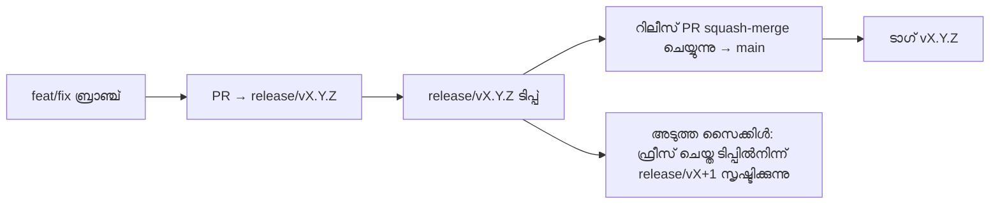

# Branching & Release Model (മലയാളം)

🌐 **Languages:** 🇺🇸 [English](../../../../ops/BRANCHING_MODEL.md) · 🇪🇹 [am](../../../am/docs/ops/BRANCHING_MODEL.md) · 🇸🇦 [ar](../../../ar/docs/ops/BRANCHING_MODEL.md) · 🇦🇿 [az](../../../az/docs/ops/BRANCHING_MODEL.md) · 🇧🇬 [bg](../../../bg/docs/ops/BRANCHING_MODEL.md) · 🇧🇩 [bn](../../../bn/docs/ops/BRANCHING_MODEL.md) · 🇧🇦 [bs](../../../bs/docs/ops/BRANCHING_MODEL.md) · 🇨🇿 [cs](../../../cs/docs/ops/BRANCHING_MODEL.md) · 🇩🇰 [da](../../../da/docs/ops/BRANCHING_MODEL.md) · 🇩🇪 [de](../../../de/docs/ops/BRANCHING_MODEL.md) · 🇬🇷 [el](../../../el/docs/ops/BRANCHING_MODEL.md) · 🇪🇸 [es](../../../es/docs/ops/BRANCHING_MODEL.md) · 🇪🇪 [et](../../../et/docs/ops/BRANCHING_MODEL.md) · 🇮🇷 [fa](../../../fa/docs/ops/BRANCHING_MODEL.md) · 🇫🇮 [fi](../../../fi/docs/ops/BRANCHING_MODEL.md) · 🇫🇷 [fr](../../../fr/docs/ops/BRANCHING_MODEL.md) · 🇮🇪 [ga](../../../ga/docs/ops/BRANCHING_MODEL.md) · 🇮🇳 [gu](../../../gu/docs/ops/BRANCHING_MODEL.md) · 🇳🇬 [ha](../../../ha/docs/ops/BRANCHING_MODEL.md) · 🇮🇱 [he](../../../he/docs/ops/BRANCHING_MODEL.md) · 🇮🇳 [hi](../../../hi/docs/ops/BRANCHING_MODEL.md) · 🇭🇷 [hr](../../../hr/docs/ops/BRANCHING_MODEL.md) · 🇭🇺 [hu](../../../hu/docs/ops/BRANCHING_MODEL.md) · 🇦🇲 [hy](../../../hy/docs/ops/BRANCHING_MODEL.md) · 🇮🇩 [id](../../../id/docs/ops/BRANCHING_MODEL.md) · 🇳🇬 [ig](../../../ig/docs/ops/BRANCHING_MODEL.md) · 🇮🇹 [it](../../../it/docs/ops/BRANCHING_MODEL.md) · 🇯🇵 [ja](../../../ja/docs/ops/BRANCHING_MODEL.md) · 🇬🇪 [ka](../../../ka/docs/ops/BRANCHING_MODEL.md) · 🇰🇭 [km](../../../km/docs/ops/BRANCHING_MODEL.md) · 🇮🇳 [kn](../../../kn/docs/ops/BRANCHING_MODEL.md) · 🇰🇷 [ko](../../../ko/docs/ops/BRANCHING_MODEL.md) · 🇱🇹 [lt](../../../lt/docs/ops/BRANCHING_MODEL.md) · 🇱🇻 [lv](../../../lv/docs/ops/BRANCHING_MODEL.md) · 🇮🇳 [mr](../../../mr/docs/ops/BRANCHING_MODEL.md) · 🇲🇾 [ms](../../../ms/docs/ops/BRANCHING_MODEL.md) · 🇲🇹 [mt](../../../mt/docs/ops/BRANCHING_MODEL.md) · 🇲🇲 [my](../../../my/docs/ops/BRANCHING_MODEL.md) · 🇳🇵 [ne](../../../ne/docs/ops/BRANCHING_MODEL.md) · 🇳🇱 [nl](../../../nl/docs/ops/BRANCHING_MODEL.md) · 🇳🇴 [no](../../../no/docs/ops/BRANCHING_MODEL.md) · 🇮🇳 [or](../../../or/docs/ops/BRANCHING_MODEL.md) · 🇮🇳 [pa](../../../pa/docs/ops/BRANCHING_MODEL.md) · 🇵🇭 [phi](../../../phi/docs/ops/BRANCHING_MODEL.md) · 🇵🇱 [pl](../../../pl/docs/ops/BRANCHING_MODEL.md) · 🇵🇹 [pt](../../../pt/docs/ops/BRANCHING_MODEL.md) · 🇧🇷 [pt-BR](../../../pt-BR/docs/ops/BRANCHING_MODEL.md) · 🇷🇴 [ro](../../../ro/docs/ops/BRANCHING_MODEL.md) · 🇷🇺 [ru](../../../ru/docs/ops/BRANCHING_MODEL.md) · 🇱🇰 [si](../../../si/docs/ops/BRANCHING_MODEL.md) · 🇸🇰 [sk](../../../sk/docs/ops/BRANCHING_MODEL.md) · 🇸🇮 [sl](../../../sl/docs/ops/BRANCHING_MODEL.md) · 🇷🇸 [sr](../../../sr/docs/ops/BRANCHING_MODEL.md) · 🇸🇪 [sv](../../../sv/docs/ops/BRANCHING_MODEL.md) · 🇰🇪 [sw](../../../sw/docs/ops/BRANCHING_MODEL.md) · 🇮🇳 [ta](../../../ta/docs/ops/BRANCHING_MODEL.md) · 🇮🇳 [te](../../../te/docs/ops/BRANCHING_MODEL.md) · 🇹🇭 [th](../../../th/docs/ops/BRANCHING_MODEL.md) · 🇹🇷 [tr](../../../tr/docs/ops/BRANCHING_MODEL.md) · 🇺🇦 [uk-UA](../../../uk-UA/docs/ops/BRANCHING_MODEL.md) · 🇵🇰 [ur](../../../ur/docs/ops/BRANCHING_MODEL.md) · 🇺🇿 [uz](../../../uz/docs/ops/BRANCHING_MODEL.md) · 🇻🇳 [vi](../../../vi/docs/ops/BRANCHING_MODEL.md) · 🇳🇬 [yo](../../../yo/docs/ops/BRANCHING_MODEL.md) · 🇨🇳 [zh-CN](../../../zh-CN/docs/ops/BRANCHING_MODEL.md) · 🇹🇼 [zh-TW](../../../zh-TW/docs/ops/BRANCHING_MODEL.md)

---

OmniRoute ഒരു **സമാന്തര-സൈക്കിൾ** റിലീസ് മാതൃകയാണ് ഉപയോഗിക്കുന്നത്: സജീവ സൈക്കിളിനായി ഒരു സമർപ്പിത `release/vX.Y.Z`
ബ്രാഞ്ച്, പ്രസിദ്ധീകരിച്ച ലൈനിനായി `main`, ആ സൈക്കിൾ പുറത്തിറങ്ങുമ്പോൾ മാറ്റാനാകാത്ത
`vX.Y.Z` ടാഗ്. കമ്മിറ്റുകൾ `release/*`-ലും _കൂടാതെ_
`main`-ലും എത്തുന്നത് പ്രതീക്ഷിക്കപ്പെടുന്നതാണ് — അതൊരു ആശയക്കുഴപ്പമല്ല.

മെയിന്റെയിനർമാർക്കുള്ള വിശദാംശങ്ങൾ `CLAUDE.md`-ലും (Hard Rule #21)
[RELEASE_CHECKLIST.md](./RELEASE_CHECKLIST.md)-ലും ലഭ്യമാണ്. ഈ പേജ് പൊതുവായി
കോൺട്രിബ്യൂട്ടർമാർക്കുള്ള സംഗ്രഹമാണ്.

## ഒറ്റനോട്ടത്തിൽ

| റഫറൻസ്           | പങ്ക്                                                                                                         |
| ---------------- | ------------------------------------------------------------------------------------------------------------- |
| `release/vX.Y.Z` | **സജീവ സൈക്കിൾ** — ആ പതിപ്പിനായുള്ള ദൈനംദിന ഡെവലപ്മെന്റും PR മെർജുകളും                                        |
| `main`           | **പ്രസിദ്ധീകരിച്ച ലൈൻ** — റിലീസ് പുറത്തിറങ്ങുമ്പോൾ squash-merge വഴി സൈക്കിൾ സ്വീകരിക്കുന്നു                   |
| `vX.Y.Z` (ടാഗ്)  | **റിലീസ് മാർക്കർ** — റിലീസ് സമയത്ത് സൃഷ്ടിക്കുന്ന, മാറ്റാനാകാത്ത “പുറത്തിറക്കിയത് എന്ത്” എന്നതിനുള്ള പോയിന്റർ |



## എന്റെ PR ഏത് ബ്രാഞ്ചിനെ ലക്ഷ്യമാക്കണം?

**സജീവമായ `release/vX.Y.Z` ബ്രാഞ്ചിനെ ലക്ഷ്യമാക്കുക — `main`-നെ അല്ല.**

1. തുറന്നിരിക്കുന്നതിൽ ഏറ്റവും ഉയർന്ന `release/v*` ബ്രാഞ്ച് കണ്ടെത്തുക (ഇത് എഴുതുന്ന സമയത്തെ ഉദാഹരണം:
   `release/v3.8.49`).
2. ആ ടിപ്പിൽനിന്ന് ബ്രാഞ്ച് സൃഷ്ടിക്കുക (`git fetch` + checkout / അതിലേക്ക് rebase ചെയ്യുക).
3. **base = ആ `release/vX.Y.Z`** ആയി PR തുറക്കുക.

`main` ദൈനംദിന ഇന്റഗ്രേഷൻ ബ്രാഞ്ചല്ല. `main`-നെ ലക്ഷ്യമാക്കി തുറക്കുന്ന PR-കൾക്ക്
സാധാരണയായി മെർജ് ചെയ്യുന്നതിന് മുമ്പ് ലക്ഷ്യം മാറ്റേണ്ടിവരും.

## റിലീസ് ഫ്രീസ് (സമാന്തര സൈക്കിളുകൾ)

ഒരു റിലീസ് സമന്വയിപ്പിച്ചുകൊണ്ടിരിക്കുമ്പോൾ, `release-freeze` ലേബലുള്ള ഒരു മാർക്കർ ഇഷ്യൂ
തുറക്കുന്നു. അത് **ഡെവലപ്മെന്റ് നിർത്തുന്നില്ല**:

- ഫ്രീസ് ചെയ്ത `release/vX.Y.Z`, ആ റിലീസിന്റെ റിലീസ് ക്യാപ്റ്റന്റെ നിയന്ത്രണത്തിലായിരിക്കും.
- കോൺട്രിബ്യൂട്ടർമാർക്ക് ജോലി തുടർന്നും ലാൻഡ് ചെയ്യാനായി, ഫ്രീസ് ചെയ്ത ടിപ്പിൽനിന്ന് അടുത്ത സൈക്കിളിന്റെ `release/vX+1` സൃഷ്ടിക്കുന്നു.
- ഇപ്പോഴും ഫ്രീസ് ചെയ്ത ബ്രാഞ്ചിനെ ലക്ഷ്യമാക്കുന്ന തുറന്ന PR-കളുടെ ലക്ഷ്യം, സജീവമായ (ഏറ്റവും ഉയർന്ന) `release/v*` ബ്രാഞ്ചിലേക്ക് **മാറ്റണം**.

നിങ്ങൾക്ക് വേണ്ട ബ്രാഞ്ച് മെർജ് ചെയ്യാനാകുമെന്ന് കരുതുന്നതിന് മുമ്പ് തുറന്ന ഫ്രീസ് ഉണ്ടോയെന്ന് പരിശോധിക്കുക:

```bash
gh issue list --repo diegosouzapw/OmniRoute --label release-freeze --state open
```

മെർജ് പ്രവർത്തനക്രമം (ഉടമയുടെ `queue` ലേബൽ → Mergify)
[MERGE_TRAIN.md](./MERGE_TRAIN.md)-ൽ രേഖപ്പെടുത്തിയിരിക്കുന്നു.

## ഒരു ബ്രാഞ്ചും ടാഗും ഒരുമിച്ച് എന്തുകൊണ്ട്?

| ആർട്ടിഫാക്റ്റ്   | ആയുസ്സ്                | ഉദ്ദേശ്യം                                                                                |
| ---------------- | ---------------------- | ---------------------------------------------------------------------------------------- |
| `release/vX.Y.Z` | പുരോഗതിയിലുള്ള സൈക്കിൾ | അവലോകനം ചെയ്ത PR-കൾ ശേഖരിക്കുന്നു, CI-green ആയി തുടരുന്നു, PR base ആയി പ്രവർത്തിക്കുന്നു |
| ടാഗ് `vX.Y.Z`    | എന്നേക്കും             | npm / GitHub Releases-ലേക്ക് പുറത്തിറക്കിയ കൃത്യമായ ബിറ്റുകൾ അടയാളപ്പെടുത്തുന്നു         |

ബ്രാഞ്ച് വർക്ക്ഷോപ്പാണ്; ടാഗ് സീൽ ചെയ്ത പാക്കേജാണ്. `main`-ലേക്കുള്ള squash-merge-ന് ശേഷം,
മുൻ റിലീസ് PR പൂർത്തിയാകുന്നതുവരെ കാത്തിരിക്കാതെ അടുത്ത സൈക്കിൾ `release/vX+1`-ൽ തുടരുന്നു.

## ബന്ധപ്പെട്ട ഡോക്യുമെന്റുകൾ

- [CONTRIBUTING.md](../../CONTRIBUTING.md) — സജ്ജീകരണം, ടെസ്റ്റുകൾ, PR ചെക്ക്ലിസ്റ്റ്
- [RELEASE_CHECKLIST.md](./RELEASE_CHECKLIST.md) — റിലീസിന് മുമ്പുള്ള സാധൂകരണം
- [MERGE_TRAIN.md](./MERGE_TRAIN.md) — മെർജ് ക്യൂവും ഫാൾബാക്ക് ട്രെയിനും
- [RELEASE_GREEN.md](./RELEASE_GREEN.md) — റിലീസ് ടിപ്പ് green ആയി നിലനിർത്തൽ
